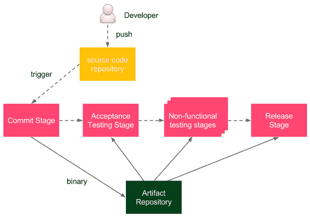
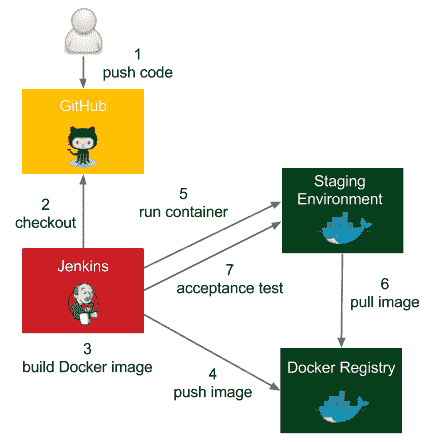
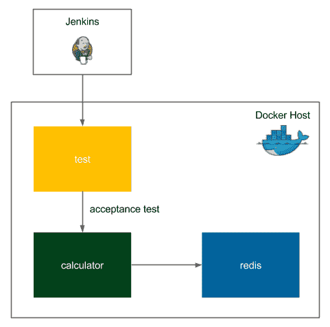
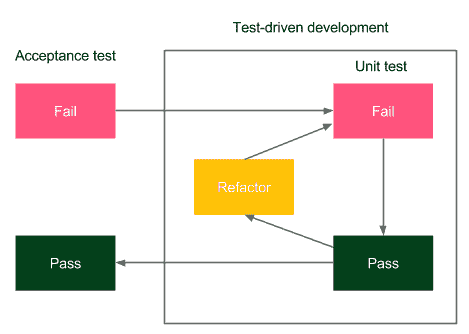

# 五、自动化验收测试

我们已经配置了持续交付流程的提交阶段，现在是时候解决验收测试阶段了，这通常是最具挑战性的部分。通过逐步扩展管道，我们将看到一个良好的验收测试自动化的不同方面。

本章包括以下几点:

*   介绍验收测试过程及其难点
*   解释工件存储库的概念
*   在 Docker 集线器上创建 Docker 注册表
*   安装和保护私有 Docker 注册表
*   在Jenkins管道中实施验收测试
*   Docker 作曲介绍与探索
*   在验收测试过程中使用 Docker 编写
*   与用户一起编写验收测试

# 引入验收测试

验收测试是为了确定业务需求或合同是否得到满足而进行的测试。从用户的角度来看，它涉及对一个完整系统的黑盒测试，它的积极结果应该意味着软件交付的接受。有时，也称为 **UAT** ( **用户验收测试**)、最终用户测试或 beta 测试，是软件遇到*现实世界*受众时开发过程的一个阶段。

许多项目依赖于质量保证人员或用户执行的手动步骤来验证功能性和非功能性需求，但是，将它们作为编程的可重复操作来运行更合理。

然而，自动化验收测试由于其特殊性而被认为是困难的:

*   **面向用户**:需要和一个用户写在一起，需要在技术和非技术两个世界之间进行理解。
*   **依赖项集成**:被测试的应用程序应该与其依赖项一起运行，以检查系统整体是否正常工作。
*   **环境标识**:分段(测试)和生产环境应该相同，以确保在生产环境中运行时，应用程序也能按预期运行。
*   **应用标识**:应用只能构建一次，同一二进制应该转移到生产中。这保证了测试和发布之间的代码没有变化，并消除了不同构建环境的风险。
*   **相关性和后果**:如果验收测试通过，从用户角度来看，应该很清楚应用已经准备好发布了。

我们将在本章的不同部分讨论所有这些困难。应用程序标识可以通过只构建一次 Docker 映像并使用 Docker 注册表进行存储和版本控制来实现。Docker Compose 有助于依赖项集成，提供了一种构建一组协同工作的容器化应用程序的方法。以面向用户的方式创建测试在*编写验收测试*一节中进行了解释，环境标识由 Docker 工具本身解决，也可以通过下一章中描述的其他工具进行改进。关于相关性和后果，唯一好的答案是记住验收测试必须总是高质量的。

Acceptance testing can have multiple meanings; in this book, we treat acceptance testing as a complete integration test from a user perspective, excluding nonfunctional testing, such as performance, load, and recovery.

# 坞站注册表

Docker 注册表是 Docker 映像的存储。确切地说，它是一个无状态的服务器应用程序，允许发布(推送)映像，并在需要时检索(拉取)映像。我们已经看到了一个运行正式 Docker 映像时的注册表示例，例如`jenkins`。我们从 Docker Hub 中提取了这些映像，Docker Hub 是一个官方的基于云的 Docker 注册表。拥有一个单独的服务器来存储、加载和搜索软件包是一个更通用的概念，称为软件仓库，或者更通用的称为工件仓库。让我们仔细看看这个想法。

# 工件存储库

虽然源代码管理存储源代码，但工件存储库专用于存储软件二进制工件，例如编译的库或组件，稍后用于构建完整的应用程序。为什么我们需要使用单独的工具将二进制文件存储在单独的服务器上？

*   **文件大小**:工件文件可以很大，所以系统需要针对其下载和上传进行优化。
*   **版本**:每个上传的神器都需要有一个便于浏览和使用的版本。然而，并不是所有的版本都必须永久保存；例如，如果检测到一个 bug，我们可能对相关的工件不感兴趣，并将其删除。
*   **版本映射**:每个工件应该恰好指向源代码控制的一个版本，而且二进制创建过程应该是可重复的。
*   **包**:工件以编译压缩的形式存储，这样就不需要重复这些耗时的步骤。
*   **访问控制**:可以对用户进行不同的源代码和工件二进制访问限制。
*   **客户端**:工件存储库的用户可以是团队或组织之外的开发人员，他们希望通过库的公共 API 来使用库。
*   **用例**:工件二进制文件用于保证在每个环境中部署完全相同的构建版本，以便在出现故障时简化回滚过程。

The most popular artifact repositories are JFrog Artifactory and Sonatype Nexus.

工件存储库在持续交付过程中扮演着特殊的角色，因为它保证了在所有管道步骤中使用相同的二进制文件。

让我们看看下图，展示它是如何工作的:



**开发人员**将变更推送到**源代码库**，这触发了管道构建。作为**提交阶段**的最后一步，一个二进制文件被创建并存储在工件库中。之后，在交付过程的所有其他阶段，相同的二进制文件被提取和使用。

The built binary is often called the **release candidate** and the process of moving binary to the next stage is called **promotion**.

取决于编程语言和技术，二进制格式可能会有所不同。

例如，在 Java 的情况下，通常存储 JAR 文件，在 Ruby 的情况下，存储 gem 文件。我们使用 Docker，所以我们将 Docker 映像存储为工件，存储 Docker 映像的工具称为 Docker 注册表。

Some teams maintain two repositories at the same time, artifact repository for JAR files and Docker registry for Docker images. While it may be useful during the first phase of the Docker introduction, there is no good reason to maintain both forever.

# 正在安装 Docker 注册表

首先，我们需要安装一个 Docker 注册表。有许多选项可用，但其中两个比其他选项更常见，基于云的 Docker Hub 注册表和您自己的私有 Docker 注册表。让我们深入研究一下。

# 坞站集线器

Docker Hub 是一种基于云的服务，它提供 Docker 注册表和其他功能，例如构建映像、测试映像以及直接从代码存储库中提取代码。Docker Hub 是云托管的，所以它实际上不需要任何安装过程。您只需要创建一个 Docker Hub 帐户:

1.  在浏览器中打开 [https://hub.docker.com/](https://hub.docker.com/) 。
2.  填写密码、电子邮件地址和 Docker ID。
3.  收到电子邮件并单击激活链接后，帐户就创建好了。

Docker Hub 肯定是最简单的开始选项，它允许存储私有和公共映像。

# 私人码头注册处

Docker中心可能不总是可以接受的。它对企业来说并不是免费的，更重要的是，许多公司都有政策不将他们的软件存储在自己的网络之外。在这种情况下，唯一的选择是安装一个私有的 Docker 注册表。

Docker 注册表安装过程快速简单，但是，要使其安全并在公共场合可用，需要设置访问限制和域证书。这就是为什么我们将这一部分分为三个部分:

*   安装 Docker 注册表应用程序
*   添加域证书
*   添加访问限制

# 安装 Docker 注册表应用程序

Docker 注册表可以作为 Docker 映像使用。为此，我们可以运行以下命令:

```
$ docker run -d -p 5000:5000 --restart=always --name registry registry:2
```

By default, the registry data is stored as a docker volume in the default host filesystem's directory. To change it, you can add `-v <host_directory>:/var/lib/registry`. Another alternative is to use a volume container.

该命令启动注册表，并使其可通过端口 5000 访问。`registry`容器从注册表映像(版本 2)启动。`--restart=always`选项使容器在关闭时自动重启。

Consider setting up a load balancer and starting a few Docker registry containers in case of a large number of users.

# 添加域证书

如果注册表在本地主机上运行，那么一切正常，不需要其他安装步骤。然而，在大多数情况下，我们希望有一个专门的服务器用于注册，以便映像可以广泛使用。在这种情况下，Docker 要求使用 SSL/TLS 保护注册表。该过程与公共 web 服务器配置非常相似，同样，强烈建议证书由 CA(证书颁发机构)签名。如果获取 CA 签署的证书不是一个选项，那么我们可以自行签署证书或使用`--insecure-registry`标志。

You can read about creating and using self-signed certificates at [https://docs.docker.com/registry/insecure/#using-self-signed-certificates](https://docs.docker.com/registry/insecure/#using-self-signed-certificates).

有了 CA 签名或自签名的证书，我们可以将`domain.crt`和`domain.key`移动到`certs`目录并启动注册表。

```
$ docker run -d -p 5000:5000 --restart=always --name registry -v `pwd`/certs:/certs -e REGISTRY_HTTP_TLS_CERTIFICATE=/certs/domain.crt -e REGISTRY_HTTP_TLS_KEY=/certs/domain.key registry:2
```

In case of a self-signed certificate, clients have to explicitly trust the certificate. In order to do this, they can copy the `domain.crt` file to `/etc/docker/certs.d/<docker_host_domain>:5000/ca.crt`.

不建议使用`--insecure-registry`标志，因为它根本不提供安全性。

# 添加访问限制

除非我们在安全的专用网络中使用注册表，否则我们应该配置身份验证。

最简单的方法是使用`registry`映像中的`htpasswd`工具创建一个带有密码的用户:

```
$ mkdir auth
$ docker run --entrypoint htpasswd registry:2 -Bbn <username> <password> > auth/passwords
```

该命令运行`htpasswd`工具创建`auth/passwords`文件(内部有一个用户)。然后，我们可以在该用户被授权访问注册表的情况下运行注册表:

```
$ docker run -d -p 5000:5000 --restart=always --name registry -v `pwd`/auth:/auth -e "REGISTRY_AUTH=htpasswd" -e "REGISTRY_AUTH_HTPASSWD_REALM=Registry Realm" -e REGISTRY_AUTH_HTPASSWD_PATH=/auth/passwords -v `pwd`/certs:/certs -e REGISTRY_HTTP_TLS_CERTIFICATE=/certs/domain.crt -e REGISTRY_HTTP_TLS_KEY=/certs/domain.key registry:2
```

该命令除了设置证书之外，还创建了仅限于`auth/passwords`文件中指定的用户的访问限制。

因此，在使用注册表之前，客户端需要指定用户名和密码。

Access restriction doesn't work in the case of the `--insecure-registry` flag.

# 其他 Docker 注册表

当涉及到基于 Docker 的工件存储库时，Docker Hub 和私有注册中心并不是唯一的可能性。

其他选项如下:

*   **通用存储库**:广泛使用的通用存储库，比如 JFrog Artifactory 或者 Sonatype Nexus，都实现了 Docker 注册表 API。它们的优点是一个服务器可以存储 Docker 映像和其他工件(例如，JAR 文件)。这些系统也是成熟的，并提供企业集成。
*   **基于云的注册中心** : Docker Hub 并不是唯一的云提供商。大多数面向云的服务都在云中提供 Docker 注册中心，例如谷歌云或 AWS。
*   **自定义注册表**:Docker 注册表 API 是开放的，所以可以实现自定义解决方案。此外，映像可以导出为文件，因此简单地将映像存储为文件是可行的。

# 使用 Docker 注册表

配置注册表后，我们可以通过三个步骤展示如何使用它:

*   建立形象
*   将映像推送到注册表
*   从注册表中提取映像

# 建立形象

我们用[第二章](02.html)、*介绍 Docker* 的例子，在安装了 Ubuntu 和 Python 解释器的情况下构建一个镜像。在新目录中，我们需要创建一个 Dockerfile:

```
FROM ubuntu:16.04
RUN apt-get update && \
    apt-get install -y python
```

现在，我们可以构建映像:

```
$ docker build -t ubuntu_with_python .
```

# 推送映像

为了推送创建的映像，我们需要根据命名约定对其进行标记:

```
<registry_address>/<image_name>:<tag>
```

“`registry_address`”可以是:

*   Docker 集线器情况下的用户名
*   带有专用注册表端口的域名或 IP 地址(例如，`localhost:5000`)

In most cases, `<tag>` is in the form of image/application version.

让我们标记映像以使用 Docker Hub:

```
$ docker tag ubuntu_with_python leszko/ubuntu_with_python:1
```

We could have also tagged the image in the `build` command: `"docker`
`build -t leszko/ubuntu_with_python:1 . "`.

如果存储库配置了访问限制，我们需要首先授权它:

```
$ docker login --username <username> --password <password>
```

It's possible to use the `docker login` command without parameters and Docker would ask interactively for the username and password.

现在，我们可以使用`push`命令将映像存储在注册表中:

```
$ docker push leszko/ubuntu_with_python:1
```

请注意，不需要指定注册表地址，因为 Docker 使用命名约定来解析它。映像被存储，我们可以使用在[https://hub.docker.com](https://hub.docker.com)提供的 Docker Hub 网络界面进行检查。

# 拉映像

为了演示注册表是如何工作的，我们可以在本地删除映像并从注册表中检索它:

```
$ docker rmi ubuntu_with_python leszko/ubuntu_with_python:1
```

我们可以看到映像已经使用`docker images`命令移除。然后，让我们从注册表中检索映像:

```
$ docker pull leszko/ubuntu_with_python:1
```

If you use the free Docker Hub account, you may need to change the `ubuntu_with_python` repository to public before pulling it.

我们可以通过`docker images`命令确认映像恢复。

当我们配置好注册中心并了解它如何工作时，我们就可以看到如何在持续交付管道中使用它并构建验收测试阶段。

# 管道验收测试

我们已经理解了验收测试背后的思想，并且知道如何配置 Docker 注册表，因此我们已经准备好在 Jenkins 管道中首次实现它。

让我们看一下展示我们将使用的流程的图:



过程如下:

1.  开发人员将代码更改推送到 GitHub。
2.  Jenkins 检测变更，触发构建，并检查当前代码。
3.  Jenkins 执行提交阶段并构建 Docker 映像。
4.  Jenkins将映像推送到 Docker 注册表。
5.  Jenkins 在登台环境中运行 Docker 容器。
6.  暂存 Docker 主机需要从 Docker 注册表中提取映像。
7.  Jenkins 针对在试运行环境中运行的应用程序运行验收测试套件。

For the sake of simplicity, we will run the Docker container locally (and not on a separate staging server). In order to run it remotely, we need to use the `-H` option or to configure the `DOCKER_HOST` environment variable. We will cover this part in the next chapter.

让我们继续上一章中开始的管道，并增加三个阶段:

*   `Docker build`
*   `Docker push`
*   `Acceptance test`

请记住，您需要将 Docker 工具安装在 Jenkins executor(代理从机或主机，在无从机配置的情况下)上，以便它能够构建 Docker 映像。

If you use dynamically provisioned Docker slaves, then there is no mature Docker image provided yet. You can build it yourself or use the `leszko/jenkins-docker-slave` image. You also need to mark the `privileged` option in the Docker agent configuration. This solution, however, has some drawbacks, so before using it in production, read the [http://jpetazzo.github.io/2015/09/03/do-not-use-docker-in-docker-for-ci/](http://jpetazzo.github.io/2015/09/03/do-not-use-docker-in-docker-for-ci/).

# Docker建造阶段

我们希望将计算器项目作为 Docker 容器运行，因此我们需要创建 Dockerfile 并将`"Docker build"`阶段添加到 Jenkinsfile 中。

# 添加 Dockerfile

让我们在计算器项目的根目录下创建 Dockerfile:

```
FROM frolvlad/alpine-oraclejdk8:slim
COPY build/libs/calculator-0.0.1-SNAPSHOT.jar app.jar
ENTRYPOINT ["java", "-jar", "app.jar"]
```

The default build directory for Gradle is `build/libs/`, and `calculator-0.0.1-SNAPSHOT.jar` is the complete application packaged into one JAR file. Note that Gradle automatically versioned the application using the Maven-style version `0.0.1-SNAPSHOT`.

Dockerfile 使用包含 JDK 8 ( `frolvlad/alpine-oraclejdk8:slim`)的基本映像。它还复制应用程序 JAR(由 Gradle 创建)并运行它。让我们检查应用程序是否构建并运行:

```
$ ./gradlew build
$ docker build -t calculator .
$ docker run -p 8080:8080 --name calculator calculator
```

使用前面的命令，我们已经构建了应用程序，构建了 Docker 映像，并运行了 Docker 容器。过一会儿，我们应该可以打开浏览器到`http://localhost:8080/sum?a=1&b=2`看到`3`结果了。

我们可以停止容器并将 Dockerfile 推送到 GitHub 存储库:

```
$ git add Dockerfile
$ git commit -m "Add Dockerfile"
$ git push
```

# 将 Docker 构建添加到管道中

我们需要的最后一步是将`"Docker build"`阶段添加到Jenkins文件中。通常，JAR 包装也被声明为单独的`Package`阶段:

```
stage("Package") {
     steps {
          sh "./gradlew build"
     }
}

stage("Docker build") {
     steps {
          sh "docker build -t leszko/calculator ."
     }
}
```

We don't explicitly version the image, but each image has a unique hash ID. We will cover the explicit versioning in the next chapter.

请注意，我们在映像标签中使用了 Docker 注册表名称。不需要将映像标记两次`calculator `和`leszko/calculator`。

当我们提交并推送Jenkins文件时，管道构建应该会自动开始，我们应该会看到所有的框都是绿色的。这意味着 Docker 映像已经成功构建。

There is also a Gradle plugin for Docker that allows executing the Docker operations within Gradle scripts. You can see an example at: [https://spring.io/guides/gs/spring-boot-docker/](https://spring.io/guides/gs/spring-boot-docker/).

# Docker 推送阶段

当映像准备好了，我们可以将其存储在注册表中。`Docker push`阶段很简单。将以下代码添加到 Jenkinsfile 中就足够了:

```
stage("Docker push") {
     steps {
          sh "docker push leszko/calculator"
     }
}
```

If Docker registry has the access restricted, then first we need to log in using the `docker login` command. Needless to say, the credentials must be well secured, for example, using a dedicated credential store as described on the official Docker page: [https://docs.docker.com/engine/reference/commandline/login/#credentials-store](https://docs.docker.com/engine/reference/commandline/login/#credentials-store).

像往常一样，将更改推送到 GitHub 存储库会触发 Jenkins 开始构建，一段时间后，我们应该会将映像自动存储在注册表中。

# 验收测试阶段

要执行验收测试，首先，我们需要将应用程序部署到试运行环境，然后对其运行验收测试套件。

# 向管道添加临时部署

让我们添加一个运行`calculator`容器的阶段:

```
stage("Deploy to staging") {
     steps {
          sh "docker run -d --rm -p 8765:8080 --name calculator leszko/calculator"
     }
}
```

运行此阶段后，`calculator`容器作为守护程序运行，将其端口发布为`8765`，并在停止时自动删除。

# 向管道添加验收测试

验收测试通常需要运行一个专用的黑盒测试套件来检查系统的行为。我们将在*编写验收测试*部分介绍它。目前，为了简单起见，让我们简单地通过使用`curl`工具调用 web 服务端点并使用`test`命令检查结果来执行验收测试。

在项目的根目录下，我们创建`acceptance_test.sh`文件:

```
#!/bin/bash
test $(curl localhost:8765/sum?a=1\&b=2) -eq 3
```

我们用参数`a=1`和`b=2`调用`sum`端点，并期望收到`3`响应。

然后，`Acceptance test`阶段可以如下所示:

```
stage("Acceptance test") {
     steps {
          sleep 60
          sh "./acceptance_test.sh"
     }
}
```

由于`docker run -d`命令是异步的，我们需要使用`sleep`操作等待，以确保服务已经在运行。

There is no good way to check if the service is already running. An alternative to sleeping could be a script checking every second whether the service has already started.

# 添加清洗台环境

作为验收测试的最后一步，我们可以添加登台环境清理。最好的方法是在`post`部分，以确保即使在失败的情况下也能执行:

```
post {
     always {
          sh "docker stop calculator"
     }
}
```

该语句确保`calculator`容器不再在 Docker 主机上运行。

# 复合坞站

没有依赖的生活很容易。然而，在现实生活中，几乎每个应用程序都链接到数据库、缓存、消息传递系统或另一个应用程序。在(微)服务架构的情况下，每个服务都需要一堆其他服务来完成它的工作。整体架构并不能消除这个问题，应用程序通常有一些依赖性，至少对数据库是如此。

想象一个新人加入你的开发团队；设置整个开发环境并运行应用程序及其所有依赖项需要多长时间？

当谈到自动化的验收测试时，依赖问题不再仅仅是一个方便的问题，而是一个必须的问题。虽然在单元测试期间，我们可以模拟依赖关系，但是验收测试套件需要一个完整的环境。我们如何以可重复的方式快速设置它？幸运的是，Docker Compose 是一个可以提供帮助的工具。

# 码头工作曲的是什么？

Docker Compose 是一个用于定义、运行和管理多容器 Docker 应用程序的工具。服务是在配置文件(YAML 格式)中定义的，可以通过一个命令一起创建和运行。

Docker Compose 使用标准的 Docker 机制编排容器，并提供了一种指定整个环境的便捷方式。

Docker Compose 附带了很多功能，最有趣的是:

*   构建一套服务
*   一起推出一套服务
*   管理单个服务的状态
*   在运行之间保留卷数据
*   向上和向下扩展服务
*   显示单个服务的日志
*   缓存配置并在运行之间重新创建已更改的容器

A detailed description of Docker Compose and its features can be found on the official page at: [https://docs.docker.com/compose/](https://docs.docker.com/compose/).

我们展示了 Docker Compose 工具，从安装过程开始，经过 Docker-composite . yml 配置文件和`docker-compose`命令，最后是构建和缩放特性。

# 正在安装复合坞站

安装 Docker Compose 最简单的方法是使用 pip 包管理器:

You can find the pip tool installation guide at [https://pip.pypa.io/en/stable/installing/](https://pip.pypa.io/en/stable/installing/), or for Ubuntu, at `sudo apt-get install python-pip`.

```
$ pip install docker-compose
```

要检查 Docker Compose 是否已安装，我们可以运行:

```
$ docker-compose --version
```

Installation guidelines for all operating systems can be found at [https://docs.docker.com/compose/install/](https://docs.docker.com/compose/install/).

# 定义坞站-组合. yml

`docker-compose.yml`文件用于定义容器的配置、它们的关系和运行时属性。

换句话说，当 Dockerfile 指定如何创建单个 Docker 映像时，那么`docker-compose.yml`指定如何在 Docker 映像之外设置整个环境。

There are three versions of the `docker-compose.yml` file format. In this book, we use version 3, which is the most current and recommended. Read more at: [https://docs.docker.com/compose/compose-file/compose-versioning/](https://docs.docker.com/compose/compose-file/compose-versioning/).

`docker-compose.yml`文件有很多功能，都可以在官方页面找到:[https://docs.docker.com/compose/compose-file/](https://docs.docker.com/compose/compose-file/)。我们将在持续交付流程的背景下讨论最重要的问题。

让我们从一个例子开始，想象我们的计算器项目使用 Redis 服务器进行缓存。在这种情况下，我们需要一个有两个容器的环境，`calculator`和`redis`。在一个新的目录中，让我们创建`docker-compose.yml`文件。

```
version: "3"
services:
     calculator:
          image: calculator:latest
          ports:
               - 8080
     redis:
          image: redis:latest
```

下图显示了环境配置:


让我们看看这两个容器的定义:

*   **redis** :从官方 Docker Hub 中提取的最新版本`redis`映像的容器。
*   **计算器**:本地构建的最新版本`calculator`映像的容器。它将`8080`端口发布给 Docker 主机(这是`docker`命令的`-p`选项的替代)。该容器链接到`redis`容器，这意味着它们共享相同的网络，并且`redis` IP 地址在`redis`主机名下从`calculator`容器内部可见。

If we like a service to be addressed by a different hostname than its service name (for example, by redis-cache apart from redis), then we can create aliases using the links keyword.

# 使用 docker-compose 命令

`docker-compose`命令读取定义文件并创建环境:

```
$ docker-compose up -d
```

该命令在后台启动两个容器，`calculator`和`redis`(`-d`选项)。我们可以检查容器是否在运行:

```
$ docker-compose ps
 Name                   Command            State          Ports 
---------------------------------------------------------------------------
project_calculator_1   java -jar app.jar    Up     0.0.0.0:8080->8080/tcp
project_redis_1        docker-entrypoint.sh redis ... Up 6379/tcp
```

容器名称以项目名称`project`为前缀，该名称取自放置`docker-compose.yml`文件的目录的名称。我们可以使用`-p <project_name>`选项手动指定项目名称。由于 Docker Compose 在 Docker 之上运行，我们还可以使用`docker`命令来确认容器正在运行:

```
$ docker ps
CONTAINER ID  IMAGE             COMMAND                 PORTS
360518e46bd3  calculator:latest "java -jar app.jar"     0.0.0.0:8080->8080/tcp 
2268b9f1e14b  redis:latest      "docker-entrypoint..."  6379/tcp
```

完成后，我们可以破坏环境:

```
$ docker-compose down
```

这个例子很简单，但是工具本身非常强大。通过一个简短的配置和一堆命令，我们可以控制所有服务的编排。在我们使用 Docker Compose 进行验收测试之前，让我们看看 Docker Compose 的另外两个特性:构建映像和缩放容器。

# 建筑映像

在前面的例子中，我们必须首先使用`docker build`命令构建`calculator`映像，然后可以在 docker-compose.yml 中指定它。还有另一种方法让 Docker Compose 构建映像。在这种情况下，我们需要在配置中指定`build`属性，而不是`image`。

让我们把`docker-compose.yml`文件放到计算器项目的目录中。当 Dockerfile 和 Docker Compose 配置在同一个目录中时，前者可以如下所示:

```
version: "3"
services:
     calculator:
          build: .
          ports:
               - 8080
     redis:
          image: redis:latest
```

`docker-compose build`命令构建映像。我们也可以要求 Docker Compose 在使用`docker-compose --build up`命令运行容器之前构建映像。

# 扩展服务

Docker Compose 提供了自动创建同一容器的多个实例的功能。我们可以在`docker-compose.yml`中指定`replicas: <number>`参数，或者使用`docker-compose scale`命令。

例如，让我们再次运行环境并复制`calculator`容器:

```
$ docker-compose up -d
$ docker-compose scale calculator=5
```

我们可以检查哪些容器正在运行:

```
$ docker-compose ps
 Name                     Command             State Ports 
---------------------------------------------------------------------------
calculator_calculator_1   java -jar app.jar   Up   0.0.0.0:32777->8080/tcp
calculator_calculator_2   java -jar app.jar   Up   0.0.0.0:32778->8080/tcp
calculator_calculator_3   java -jar app.jar   Up   0.0.0.0:32779->8080/tcp
calculator_calculator_4   java -jar app.jar   Up   0.0.0.0:32781->8080/tcp
calculator_calculator_5   java -jar app.jar   Up   0.0.0.0:32780->8080/tcp
calculator_redis_1        docker-entrypoint.sh redis ... Up 6379/tcp
```

五个`calculator`集装箱完全相同，除了集装箱 ID、集装箱名称和公布的端口号。

它们都使用 Redis 容器的同一个实例。我们现在可以停止并移除所有容器:

```
$ docker-compose down
```

缩放容器是 Docker Compose 最令人印象深刻的特性之一。通过一个命令，我们可以增加和减少克隆实例的数量。Docker Compose 负责清理不再使用的容器。

我们已经看到了 Docker Compose 工具最有趣的功能。

在下一节中，我们将关注如何在自动化验收测试的环境中使用它。

# 用 Docker 编写进行验收测试

Docker Compose 非常适合验收测试过程，因为它支持用一个命令设置整个环境。更重要的是，在执行测试之后，还可以用一个命令清理环境。如果我们决定在生产中使用 Docker Compose，那么另一个好处是验收测试使用与发布的应用程序完全相同的配置、工具和命令。

为了了解如何将 Docker Compose 应用于 Jenkins 验收测试阶段，让我们继续计算器项目示例，并将基于 Redis 的缓存添加到应用程序中。然后，我们将看到运行验收测试的两种不同方法:Jenkins优先法和多克优先法。

# 使用多容器环境

Docker Compose 提供容器之间的依赖关系；换句话说，它将一个容器链接到另一个容器。从技术上讲，这意味着容器共享同一个网络，并且一个容器可以从另一个容器中看到。为了继续我们的示例，我们需要在代码中添加这种依赖性，我们将分几个步骤来完成。

# 向 Gradle 添加 Redis 客户端库

在`build.gradle`文件中，将以下配置添加到`dependencies`部分:

```
compile "org.springframework.data:spring-data-redis:1.8.0.RELEASE"
compile "redis.clients:jedis:2.9.0"
```

它添加了负责与 Redis 通信的 Java 库。

# 添加到 Redis 缓存配置

添加新文件`src/main/java/com/leszko/calculator/CacheConfig.java`:

```
package com.leszko.calculator;
import org.springframework.cache.CacheManager;
import org.springframework.cache.annotation.CachingConfigurerSupport;
import org.springframework.cache.annotation.EnableCaching;
import org.springframework.context.annotation.Bean;
import org.springframework.context.annotation.Configuration;
import org.springframework.data.redis.cache.RedisCacheManager;
import org.springframework.data.redis.connection.RedisConnectionFactory;
import org.springframework.data.redis.connection.jedis.JedisConnectionFactory;
import org.springframework.data.redis.core.RedisTemplate;

/** Cache config. */
@Configuration
@EnableCaching
public class CacheConfig extends CachingConfigurerSupport {
    private static final String REDIS_ADDRESS = "redis";

    @Bean
    public JedisConnectionFactory redisConnectionFactory() {
        JedisConnectionFactory redisConnectionFactory = new
          JedisConnectionFactory();
        redisConnectionFactory.setHostName(REDIS_ADDRESS);
        redisConnectionFactory.setPort(6379);
        return redisConnectionFactory;
    }

    @Bean
    public RedisTemplate<String, String> redisTemplate(RedisConnectionFactory cf) {
        RedisTemplate<String, String> redisTemplate = new RedisTemplate<String, 
          String>();
        redisTemplate.setConnectionFactory(cf);
        return redisTemplate;
    }

    @Bean
    public CacheManager cacheManager(RedisTemplate redisTemplate) {
        return new RedisCacheManager(redisTemplate);
    }
}
```

这是标准的 Spring 缓存配置。请注意，对于 Redis 服务器地址，我们使用`redis`主机名，由于 Docker Compose 链接机制，该主机名自动可用。

# 添加 Spring Boot 缓存

配置缓存后，我们最终可以将缓存添加到我们的 web 服务中。为此，我们需要将`src/main/java/com/leszko/calculator/Calculator.java`文件更改为如下所示:

```
package com.leszko.calculator;
import org.springframework.cache.annotation.Cacheable;
import org.springframework.stereotype.Service;

/** Calculator logic */
@Service
public class Calculator {
    @Cacheable("sum")
    public int sum(int a, int b) {
        return a + b;
    }
}
```

从现在开始，求和计算被缓存在 Redis 中，当我们调用`calculator` web 服务的`/sum`端点时，它将首先尝试从缓存中检索结果。

# 检查缓存环境

假设我们在计算器项目的目录中有 docker-compose.yml，我们现在可以启动容器:

```
$ ./gradlew clean build
$ docker-compose up --build -d
```

我们可以检查发布计算器服务的端口:

```
$ docker-compose port calculator 8080
0.0.0.0:32783
```

如果我们在`localhost:32783/sum?a=1&b=2`打开浏览器，计算器服务应该回复`3`，同时访问`redis`服务并将缓存的值存储在那里。要查看缓存值是否真的存储在 Redis 中，我们可以访问`redis`容器并查看 Redis 数据库内部:

```
$ docker-compose exec redis redis-cli

127.0.0.1:6379> keys *
1) "\xac\xed\x00\x05sr\x00/org.springframework.cache.interceptor.SimpleKeyL\nW\x03km\x93\xd8\x02\x00\x02I\x00\bhashCode[\x00\x06paramst\x00\x13[Ljava/lang/Object;xp\x00\x00\x03\xe2ur\x00\x13[Ljava.lang.Object;\x90\xceX\x9f\x10s)l\x02\x00\x00xp\x00\x00\x00\x02sr\x00\x11java.lang.Integer\x12\xe2\xa0\xa4\xf7\x81\x878\x02\x00\x01I\x00\x05valuexr\x00\x10java.lang.Number\x86\xac\x95\x1d\x0b\x94\xe0\x8b\x02\x00\x00xp\x00\x00\x00\x01sq\x00~\x00\x05\x00\x00\x00\x02"
2) "sum~keys"
```

`docker-compose exec`命令在`redis`容器内执行`redis-cli`(Redis 客户端浏览其数据库内容)命令。然后，我们可以运行`keys *`来打印 Redis 中存储的所有内容。

您可以使用计算器应用程序玩得更多，并以不同的值打开浏览器，查看 Redis 服务内容是否增加。之后，用`docker-compose down`命令拆掉环境很重要。

在接下来的部分中，我们将看到多容器项目的两种验收测试方法。显然，在我们对 Jenkins 采取任何行动之前，我们需要将所有更改的文件(包括`docker-compose.yml`)提交并推送到 GitHub。

Note that, for further steps, Docker Compose has to be installed on Jenkins executors.

# 方法 1–Jenkins-首次验收测试

第一种方法是以我们在单个容器应用程序中所做的相同方式执行验收测试。唯一的区别是，现在我们有两个容器在运行，如下图所示:


从用户的角度来看`redis`容器是不可见的，因此单容器和多容器验收测试的唯一区别是我们使用了`docker-compose up`命令而不是`docker run`。

其他 Docker 命令也可以用它们的 Docker Compose 等价物替换:`docker build`的`docker-compose build`和`docker push`的`docker-compose push`。然而，如果我们只构建一个映像，那么留下 Docker 命令也是可以的。

# 更改临时部署阶段

让我们将`Deploy to staging`阶段更改为使用 Docker 作曲:

```
stage("Deploy to staging") {
    steps {
        sh "docker-compose up -d"
    }
}
```

我们必须以完全相同的方式改变清理方式:

```
post {
    always {
        sh "docker-compose down"
    }
}
```

# 更改验收测试阶段

出于使用`docker-compose scale`的目的，我们没有指定发布我们的 web 服务的端口号。如果我们这样做了，那么扩展过程将会失败，因为所有克隆都将尝试在相同的端口号下发布。相反，我们让 Docker 选择端口。因此，我们需要更改`acceptance_test.sh`脚本，首先找到端口号，然后用正确的端口号运行`curl`。

```
#!/bin/bash
CALCULATOR_PORT=$(docker-compose port calculator 8080 | cut -d: -f2)
test $(curl localhost:$CALCULATOR_PORT/sum?a=1\&b=2) -eq 3
```

让我们弄清楚我们是如何找到端口号的:

1.  `docker-compose port calculator 8080`命令检查发布网络服务的 IP 和端口地址(例如，它返回`127.0.0.1:57648`)。
2.  `cut -d: -f2`只选择端口(例如对于`127.0.0.1:57648`，返回`57648`)。

我们可以将更改推送到 GitHub，并观察 Jenkins 的结果。这个想法仍然和单容器应用程序一样，设置环境，运行验收测试套件，并拆除环境。尽管这种验收测试方法很好，也很有效，但让我们看看替代解决方案。

# 方法 2–Docker-首次验收测试

在 Docker 优先的方法中，我们创建了一个额外的`test`容器，从 Docker 主机内部执行测试，如下图所示:



这种方法在检索端口号方面方便了验收测试脚本，并且可以在没有 Jenkins 的情况下轻松运行。这也更像是 Docker 风格。

缺点是我们需要创建一个单独的 Dockerfile 和 Docker Compose 配置来进行测试。

# 为验收测试创建文档文件

我们将从为验收测试创建一个单独的 Dockerfile 开始。让我们在计算器项目中创建新目录`acceptance`，并在其中创建一个 Dockerfile:

```
FROM ubuntu:trusty
RUN apt-get update && \
    apt-get install -yq curl
COPY test.sh .
CMD ["bash", "test.sh"]
```

它创建一个运行验收测试的映像。

# 为验收测试创建 docker-compose.yml

在同一个目录中，让我们创建`docker-compose-acceptance.yml`来提供测试编排:

```
version: "3"
services:
    test:
        build: ./acceptance
```

它创建一个新的容器，该容器链接到被测试的容器:`calculator`。此外，在内部，它总是 8080，这样就不需要寻找端口的棘手部分。

# 创建验收测试脚本

最后缺少的部分是测试脚本。在同一个目录中，让我们创建代表验收测试的`test.sh`文件:

```
#!/bin/bash
sleep 60
test $(curl calculator:8080/sum?a=1\&b=2) -eq 3
```

它与之前的验收测试脚本非常相似，唯一的区别是我们可以通过`calculator`主机名来寻址计算器服务，并且端口号总是`8080`。此外，在这种情况下，我们在脚本中等待，而不是在Jenkins文件中。

# 运行验收测试

我们可以使用根项目目录中的 Docker Compose 命令在本地运行测试:

```
$ docker-compose -f docker-compose.yml -f acceptance/docker-compose-acceptance.yml -p acceptance up -d --build
```

该命令使用两个 Docker Compose 配置来运行`acceptance`项目。其中一个启动的容器应该被称为`acceptance_test_1`，并对其结果感兴趣。我们可以使用以下命令检查其日志:

```
$ docker logs acceptance_test_1
 %   Total %   Received % Xferd Average Speed Time 
 100 1     100 1        0 0     1       0     0:00:01
```

日志显示`curl`命令已被成功调用。如果我们想检查测试是成功还是失败，我们可以检查容器的退出代码:

```
$ docker wait acceptance_test_1
0
```

`0`退出代码表示测试成功。除了`0`之外的任何代码都意味着测试失败。测试完成后，我们应该一如既往地拆除环境:

```
$ docker-compose -f docker-compose.yml -f acceptance/docker-compose-acceptance.yml -p acceptance down
```

# 更改验收测试阶段

作为最后一步，我们可以将验收测试执行添加到管道中。让我们用一个新的**验收测试**阶段来替换Jenkins文件中的最后三个阶段:

```
stage("Acceptance test") {
    steps {
        sh "docker-compose -f docker-compose.yml 
                   -f acceptance/docker-compose-acceptance.yml build test"
        sh "docker-compose -f docker-compose.yml 
                   -f acceptance/docker-compose-acceptance.yml 
                   -p acceptance up -d"
        sh 'test $(docker wait acceptance_test_1) -eq 0'
    }
}
```

这一次，我们首先构建`test`服务。无需构建`calculator`形象；前几个阶段已经完成了。最后，我们应该清理环境:

```
post {
    always {
        sh "docker-compose -f docker-compose.yml 
                   -f acceptance/docker-compose-acceptance.yml 
                   -p acceptance down"
    }
}
```

将此添加到 Jenkinsfile 后，我们就完成了第二种方法。我们可以通过将所有更改推送到 GitHub 来测试这一点。

# 比较方法 1 和方法 2

总而言之，让我们比较两种解决方案。第一种方法是从用户角度进行真正的黑盒测试，其中 Jenkins 扮演用户的角色。优点是非常接近生产中要做的事情；最终，我们将通过它的 Docker 主机访问容器。第二种方法从另一个容器内部测试应用程序。该解决方案在某种程度上更优雅，可以以简单的方式在本地运行；但是，它需要创建更多的文件，并且不会像稍后在生产中那样通过 Docker 主机调用应用程序。

在下一节中，我们将远离 Docker 和 Jenkins，更深入地了解编写验收测试的过程。

# 编写验收测试

到目前为止，我们使用`curl`命令来执行一套验收测试。这显然是相当大的简化。从技术上来说，如果我们编写一个 REST web 服务，那么我们可以将所有的黑盒测试编写成一个大脚本，并带有许多“curl”调用。然而，这个解决方案很难阅读、理解和维护。此外，该脚本对于非技术、业务相关的用户来说是完全不可理解的。如何解决这个问题并创建具有良好结构、用户可读的测试，并满足其基本目标:自动检查系统是否如预期的那样？我将在这一部分回答这个问题。

# 编写面向用户的测试

验收测试是与用户一起编写的，用户应该能够理解。这就是为什么选择一种方法来编写它们取决于客户是谁。

例如，想象一个纯粹的技术人员。如果您编写了一个优化数据库存储的 web 服务，并且您的系统只被其他系统使用，并且只被其他开发人员读取，那么您的测试可以用与单元测试相同的方式来表示。一般来说，如果开发人员和用户都理解，测试是好的。

在现实生活中，大多数软件都是为了交付特定的商业价值而编写的，而商业价值是由非开发人员定义的。因此，我们需要一种共同的语言来协作。一方面，企业知道需要什么，但不知道如何去做；另一方面，知道如何但不知道什么的开发团队。幸运的是，有许多框架可以帮助连接这两个世界，例如，黄瓜、FitNesse、jbehavior、水豚等等。它们彼此不同，每一个都可能是单独一本书的主题；但是，编写验收测试的一般思路是相同的，可以在下图中显示:


**验收标准**由用户(或产品所有者作为其代表)在开发人员的帮助下编写。它们通常以下列场景的形式编写:

```
Given I have two numbers: 1 and 2
When the calculator sums them
Then I receive 3 as a result
```

开发人员编写名为**夹具**或**步骤定义**的测试实现，将人性化的 DSL 规范与编程语言集成在一起。因此，我们有一个自动化测试，可以很好地集成到持续交付管道中。

不用说，编写验收测试是一个持续的敏捷过程，而不是瀑布式的过程。它需要持续的协作，在此期间，开发人员和业务部门都要改进和维护测试规范。

In the case of an application with a user interface, it can be tempting to perform the acceptance testing directly via the interface (for example, by recording Selenium scripts); however, this approach when not done properly can lead to tests that are slow and tightly coupled to the interface layer.

让我们看看编写验收测试在实践中的样子，以及如何将它们绑定到持续交付管道。

# 使用验收测试框架

让我们使用黄瓜框架，为计算器项目创建一个验收测试。如前所述，我们将分三步进行:

*   创建验收标准
*   创建步骤定义
*   运行自动化验收测试

# 创建验收标准

让我们将业务规范放在`src/test/resources/feature/calculator.feature`中:

```
Feature: Calculator
    Scenario: Sum two numbers
        Given I have two numbers: 1 and 2
        When the calculator sums them
        Then I receive 3 as a result
```

这个文件应该由用户在开发人员的帮助下创建。请注意，它是以非技术人员可以理解的方式编写的。

# 创建步骤定义

下一步是创建 Java 绑定，以便特性规范可以执行。为此，我们创建一个新文件`src/test/java/acceptance/StepDefinitions.java`:

```
package acceptance;

import cucumber.api.java.en.Given;
import cucumber.api.java.en.Then;
import cucumber.api.java.en.When;
import org.springframework.web.client.RestTemplate;

import static org.junit.Assert.assertEquals;

/** Steps definitions for calculator.feature */
public class StepDefinitions {
    private String server = System.getProperty("calculator.url");

    private RestTemplate restTemplate = new RestTemplate();

    private String a;
    private String b;
    private String result;

    @Given("^I have two numbers: (.*) and (.*)$")
    public void i_have_two_numbers(String a, String b) throws Throwable {
        this.a = a;
        this.b = b;
    }

    @When("^the calculator sums them$")
    public void the_calculator_sums_them() throws Throwable {
        String url = String.format("%s/sum?a=%s&b=%s", server, a, b);
        result = restTemplate.getForObject(url, String.class);
    }

    @Then("^I receive (.*) as a result$")
    public void i_receive_as_a_result(String expectedResult) throws Throwable {
        assertEquals(expectedResult, result);
    }
}
```

特性规范文件中的每一行(`Given`、`When`、`Then`)都通过正则表达式与 Java 代码中的相应方法进行匹配。通配符`(.*)`作为参数传递。注意，服务器地址是作为 Java 属性`calculator.url`传递的。该方法执行以下操作:

*   `i_have_two_numbers`:将参数保存为字段
*   `the_calculator_sums_them`:调用远程计算器服务，并将结果存储在字段中
*   `i_receive_as_a_result`:断言结果如预期

# 运行自动化验收测试

要运行自动化测试，我们需要进行一些配置:

1.  **添加 Java 黄瓜库**:在`build.gradle`文件中，将以下代码添加到`dependencies`部分:

```
        testCompile("info.cukes:cucumber-java:1.2.4")
        testCompile("info.cukes:cucumber-junit:1.2.4")
```

2.  **添加渐变目标**:在同一个文件中，添加如下代码:

```
       task acceptanceTest(type: Test) {
            include '**/acceptance/**'
            systemProperties System.getProperties()
       }

       test {
            exclude '**/acceptance/**'
       }
```

这将测试分为单元测试(用`./gradlew test`运行)和验收测试(用`./gradlew acceptanceTest`运行)。

3.  **添加 JUnit runner** :添加新文件`src/test/java/acceptance/AcceptanceTest.java`:

```
        package acceptance;

        import cucumber.api.CucumberOptions;
        import cucumber.api.junit.Cucumber;
        import org.junit.runner.RunWith;

        /** Acceptance Test */
        @RunWith(Cucumber.class)
        @CucumberOptions(features = "classpath:feature")
        public class AcceptanceTest { }
```

这是验收测试套件的入口点。

完成此配置后，如果服务器在本地主机上运行，我们可以通过执行以下代码来测试它:

```
$ ./gradlew acceptanceTest -Dcalculator.url=http://localhost:8080
```

显然，我们可以将这个命令添加到我们的`acceptance_test.sh`中，而不是`curl`命令。这将使黄瓜验收测试在Jenkins管道中运行。

# 验收测试驱动的开发

与持续交付过程的大多数方面一样，验收测试不太关注技术，更多的是关注人。当然，测试质量取决于用户和开发人员的参与度，但是，更不直观的是，创建测试的时间。

最后要问的问题是，在软件开发生命周期的哪个阶段应该准备验收测试？或者换句话说，我们应该在编写代码之前还是之后创建验收测试？

从技术上讲，结果是一样的；代码涵盖了单元测试和验收测试。然而，首先考虑编写测试是很有诱惑力的。测试驱动开发的思想可以很好地适用于验收测试。如果单元测试是在代码之前编写的，那么结果代码会更干净，结构也更好。类似地，如果验收测试是在系统特性之前编写的，那么最终的特性更符合客户的需求。这个过程通常被称为验收测试驱动开发，如下图所示:



用户和开发人员一起用人性化的 DSL 格式编写验收标准规范。开发人员编写夹具，测试失败。然后，特性开发开始在内部使用 TDD 方法。功能完成后，验收测试应该通过，这是功能完成的标志。

一个非常好的做法是在问题跟踪工具中将黄瓜特性规范附加到请求单上(例如，JIRA)，这样特性将总是与其验收测试一起被请求。一些开发团队采取更激进的方法，如果没有准备好验收测试，他们拒绝开始开发过程。很有道理，毕竟*怎么能开发出客户测试不到的东西呢？*

# 练习

我们在本章中介绍了许多新材料，因此为了更好地理解，我们建议进行练习并创建您自己的带有验收测试的项目:

1.  创建一个基于 Ruby 的网络服务`book-library`来存储书籍:

验收标准以以下黄瓜特征的形式交付:

```
Scenario: Store book in the library
Given: Book "The Lord of the Rings" by "J.R.R. Tolkien" with ISBN number  
"0395974682"
When: I store the book in library
Then: I am able to retrieve the book by the ISBN number
```

2.  将“图书库”作为 Docker 映像添加到 Docker 注册表中:

3.  创建 Jenkins 管道来构建 Docker 映像，将其推送到 Docker 注册表，并执行验收测试:

# 摘要

在本章中，您学习了如何构建一个完整的功能性验收测试阶段，这是持续交付过程中必不可少的一部分。这一章的重点是:

*   验收测试可能很难创建，因为它们将技术挑战(应用程序依赖性、环境设置)与个人挑战(开发人员-业务协作)结合在一起。
*   验收测试框架提供了一种用人类友好的语言编写测试的方法，使得非技术人员可以理解它们。
*   Docker 注册表是 Docker 映像的工件存储库。
*   Docker 注册表非常适合持续交付流程，因为它提供了一种在整个阶段和环境中使用完全相同的 Docker 映像的方法。
*   Docker Compose 编排了一组交互在一起的 Docker 容器。它还可以构建映像和缩放容器。
*   Docker Compose 可以在运行一套验收测试之前帮助建立一个完整的环境。
*   验收测试可以写成 Docker 映像，Docker Compose 可以与测试一起运行整个环境并提供结果。

在下一章中，我们将介绍完成持续交付管道所需的缺失阶段。