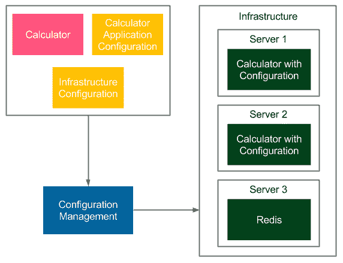

# 六、将 Ansible 用于配置管理

我们已经介绍了持续交付过程中最关键的两个阶段:提交阶段和自动化验收测试。在本章中，我们将重点介绍配置管理，它将虚拟容器化环境连接到真实的服务器基础架构。

本章包括以下几点:

*   介绍配置管理的概念
*   解释最流行的配置管理工具
*   讨论可能的要求和安装过程
*   对特定命令使用 Ansible
*   用行动手册展示 Ansible 自动化的力量
*   解释可转换的角色和可转换的星系
*   实现部署过程的用例
*   将 Ansible 与 Docker 和 Docker Compose 一起使用

# 引入配置管理

配置管理是一个控制配置更改的过程，其方式是系统随着时间的推移保持完整性。尽管该术语并非源于信息技术行业，但目前它被广泛用于指软件和硬件。在这方面，它涉及以下方面:

*   **应用配置**:这涉及决定系统如何工作的软件属性，通常以传递给应用的标志或属性文件的形式表示，例如数据库地址、文件处理的最大块大小或日志记录级别。它们可以在不同的开发阶段应用:构建、打包、部署或运行。
*   **基础设施配置**:这涉及到服务器基础设施和环境配置，负责部署流程。它定义了应该在每台服务器上安装哪些依赖项，并指定了编排应用的方式(哪个应用在哪个服务器上运行，在多少个实例中运行)。

举个例子，我们可以想到计算器 web 服务，它使用 Redis 服务器。让我们看一下展示配置管理工具如何工作的图表。



配置管理工具分别读取配置文件和准备环境(安装相关工具和库，将应用部署到多个实例)。

在上例中，**基础设施配置**规定了**计算器**服务应该在两个实例中部署在**服务器 1** 和**服务器 2** 上，并且 **Redis** 服务应该安装在**服务器 3** 上。**计算器应用配置**指定 **Redis** 服务器的端口和地址，以便服务可以通信。

Configuration can differ depending on the type of the environment (QA, staging, production), for example, server addresses can be different.

配置管理有许多方法，但是在我们研究具体的解决方案之前，让我们先来评论一下一个好的配置管理工具应该具有哪些特征。

# 良好配置管理的特征

现代配置管理解决方案应该是什么样的？让我们来看看最重要的因素:

*   **自动化**:每个环境都应该是可自动复制的，包括操作系统、网络配置、安装的软件和部署的应用。在这种方法中，修复生产问题只意味着自动重建环境。此外，这简化了服务器复制，并确保转移和生产环境完全相同。
*   **版本控制**:配置的每一个变化都要跟踪，这样我们就知道是谁做的，为什么做，什么时候做。通常，这意味着将配置与代码一起保存在源代码库中，或者保存在单独的位置。建议使用前一种解决方案，因为配置属性的生命周期不同于应用本身。版本控制还有助于解决生产问题—配置总是可以回滚到以前的版本，并且环境会自动重建。基于版本控制的解决方案的唯一例外是存储凭据和其他敏感信息-这些永远不应该签入。
*   **增量更改**:应用配置更改不需要重建整个环境。相反，配置中的一个小变化应该只改变基础架构的相关部分。
*   **服务器配置**:得益于自动化，添加新的服务器应该和将其地址添加到配置中(并执行一个命令)一样快。
*   **安全性**:对配置管理工具及其控制下的机器的访问应该得到很好的保护。当使用 SSH 协议进行通信时，需要很好地保护对密钥或凭证的访问。
*   **简单性**:团队中的每个成员都应该能够阅读配置，进行更改，并将其应用到环境中。属性本身也应该尽可能地保持简单，那些不会改变的属性最好保持硬编码。

在创建配置时，甚至在选择正确的配置管理工具之前，记住这些要点是很重要的。

# 配置管理工具概述

最流行的配置管理工具是 Ansible、Puppet 和 Chef。他们每个人都是不错的选择；它们都是开源产品，有免费的基础版和付费的企业版。它们之间最重要的区别是:

*   **配置语言**:大厨用 Ruby，傀儡用自己的 DSL(基于 Ruby)，Ansible 用 YAML。
*   **基于代理的** : Puppet 和 Chef 使用代理进行通信，这意味着每个被管理的服务器都需要安装一个专门的工具。相反，Ansible 是无代理的，使用标准 SSH 协议进行通信。

无代理功能是一个显著的优势，因为它意味着不需要在服务器上安装任何东西。更重要的是，Ansible 很快就呈上升趋势，这也是它被选入本书的原因。然而，其他工具也可以成功地用于持续交付流程。

# 安装 Ansible

Ansible 是一个开源的无代理自动化引擎，用于软件配置、配置管理和应用部署。它的第一次发布是在 2012 年，它的基本版本对个人和商业用户都是免费的。企业版名为 Ansible Tower，提供了图形用户界面管理和仪表板、REST 应用编程接口、基于角色的访问控制以及其他一些功能。

我们介绍了安装过程，并描述了如何与 Docker 一起单独使用。

# 可理解的服务器要求

Ansible 使用 SSH 协议进行通信，对其管理的机器没有特殊要求。也没有中央主服务器，所以在任何地方安装 Ansible 客户端工具就足够了，我们已经可以使用它来管理整个基础设施。

The only requirement for the machines being managed is to have the Python tool and, obviously, the SSH server installed. These tools are, however, almost always available by default on any server.

# 可拆卸安装

安装说明因操作系统而异。就 Ubuntu 而言，运行以下命令就足够了:

```
$ sudo apt-get install software-properties-common
$ sudo apt-add-repository ppa:ansible/ansible
$ sudo apt-get update
$ sudo apt-get install ansible
```

You can find the installation guides for all operating systems on the official Ansible page at: [http://docs.ansible.com/ansible/intro_installation.html](http://docs.ansible.com/ansible/intro_installation.html).

安装过程完成后，我们可以执行 Ansible 命令来检查一切是否安装成功。

```
$ ansible --version
ansible 2.3.2.0
    config file = /etc/ansible/ansible.cfg
    configured module search path = Default w/o overrides
```

# 基于 Docker 的可移植客户端

也可以将 Ansible 用作 Docker 容器。我们可以通过运行以下命令来实现:

```
$ docker run williamyeh/ansible:ubuntu14.04
ansible-playbook 2.3.2.0
 config file = /etc/ansible/ansible.cfg
 configured module search path = Default w/o overrides
```

The Ansible Docker image is no longer officially supported, so the only solution is to use the community-driven version. You can read more on its usage on the Docker Hub page.

# 使用 Ansible

为了使用 Ansible，首先我们需要定义库存，它代表了可用的资源。然后，我们将能够使用 Ansible 行动手册执行单个命令或定义一组任务。

# 创建库存

清单是由 Ansible 管理的所有服务器的列表。每台服务器只需要安装 Python 解释器和 SSH 服务器。默认情况下，Ansible 假设 SSH 密钥用于身份验证；但是，也可以通过在 Ansible 命令中添加`--ask-pass`选项来使用用户名和密码。

SSH keys can be generated with the `ssh-keygen` tool and are usually stored in the `~/.ssh` directory.

库存在`/etc/ansible/hosts`文件中定义，其结构如下:

```
[group_name]
<server1_address>
<server2_address>
...
```

The inventory syntax also accepts ranges of servers, for example, `www[01-22].company.com`. The SSH port should also be specified if it's anything other than 22 (the default one). You can read more on the official Ansible page at: [http://docs.ansible.com/ansible/intro_inventory.html](http://docs.ansible.com/ansible/intro_inventory.html).

清单文件中可能有 0 个或多个组。例如，让我们在一组服务器中定义两台机器。

```
[webservers]
192.168.0.241
192.168.0.242
```

我们还可以使用服务器别名创建配置，并指定远程用户:

```
[webservers]
web1 ansible_host=192.168.0.241 ansible_user=admin
web2 ansible_host=192.168.0.242 ansible_user=admin
```

前面的文件定义了一个名为`webservers`的组，它由两个服务器组成。Ansible 客户端将作为用户`admin`登录到两者。创建清单后，让我们看看如何使用它在许多服务器上执行相同的命令。

Ansible offers a possibility to dynamically pull the inventory from the cloud provider (for example, Amazon EC2/Eucalyptus), LDAP, or Cobbler. Read more about dynamic inventories at: [http://docs.ansible.com/ansible/intro_dynamic_inventory.html](http://docs.ansible.com/ansible/intro_dynamic_inventory.html).

# 临时命令

我们能运行的最简单的命令是对所有服务器进行 ping。

```
$ ansible all -m ping
web1 | SUCCESS => {
 "changed": false,
 "ping": "pong"
}
web2 | SUCCESS => {
 "changed": false,
 "ping": "pong"
}
```

我们使用了`-m <module_name>`选项，它允许指定应该在远程主机上执行的模块。结果是成功的，这意味着服务器是可访问的，并且身份验证配置正确。

A full list of modules available in Ansible can be found on the page: [http://docs.ansible.com/ansible/modules.htm](http://docs.ansible.com/ansible/modules.htm)l.

请注意，我们使用了`all`，因此所有服务器都将被寻址，但是我们也可以通过组名`webservers`或单个主机别名来调用它们。作为第二个例子，让我们只在其中一个服务器上执行一个 shell 命令。

```
$ ansible web1 -a "/bin/echo hello"
web1 | SUCCESS | rc=0 >>
hello
```

`-a <arguments>`选项指定传递给 Ansible 模块的参数。在这种情况下，我们没有指定模块，所以参数作为 shell Unix 命令执行。结果成功，打印`hello`。

If the `ansible` command is connecting to the server for the first time (or the server is reinstalled), then we are prompted with the key confirmation message (SSH message when the host is not present in `known_hosts`). Since it may interrupt an automated script, we can disable the prompt message by uncommenting `host_key_checking = False` in the `/etc/ansible/ansible.cfg` file or by setting the environment variable `ANSIBLE_HOST_KEY_CHECKING=False`.

在其简单的形式中，Ansible 即席命令语法如下:

```
ansible <target> -m <module_name> -a <module_arguments>
```

临时命令的目的是在不需要重复的情况下快速完成某件事。例如，我们可能想要检查服务器是否处于活动状态，或者在圣诞节期间关闭所有机器的电源。这种机制可以看作是在一组机器上执行命令，并由模块提供额外的语法简化。然而，Ansible 自动化的真正力量在于行动手册。

# 剧本

Ansible 行动手册是一个配置文件，它描述了应该如何配置服务器。它提供了一种方法来定义应该在每台机器上执行的任务序列。剧本是用 YAML 配置语言表达的，这使得它易于阅读和理解。让我们从一个示例剧本开始，然后看看我们如何使用它。

# 定义行动手册

剧本由一部或多部戏剧组成。每个游戏都包含主机组名称、要执行的任务和配置详细信息(例如，远程用户名或访问权限)。示例行动手册可能如下所示:

```
---
- hosts: web1
  become: yes
  become_method: sudo
  tasks:
  - name: ensure apache is at the latest version
    apt: name=apache2 state=latest
  - name: ensure apache is running
    service: name=apache2 state=started enabled=yes
```

该配置包含一个播放:

*   仅在主机上执行`web1`
*   使用`sudo`命令获得根访问权限
*   执行两项任务:
    *   安装最新版本的`apache2`:ansi ble 模块`apt`(用两个参数`name=apache2`和`state=latest`调用)检查服务器上是否安装了`apache2`包，如果没有，则使用`apt-get`工具安装`apache2`
    *   运行`apache2`服务:Ansible 模块`service`(用三个参数`name=apache2`、`state=started`、`enabled=yes`调用)检查 Unix 服务`apache2`是否启动，如果没有，则使用`service`命令启动

While addressing the hosts, you can also use patterns, for example, we could use `web*` to address both `web1` and `web2`. You can read more about Ansible patterns at: [http://docs.ansible.com/ansible/intro_patterns.html](http://docs.ansible.com/ansible/intro_patterns.html).

请注意，每个任务都有一个人类可读的名称，该名称在控制台输出中使用，例如`apt`和`service`是可翻译的模块，`name=apache2`、`state=latest`和`state=started`是模块参数。我们已经在使用临时命令时看到了 Ansible 模块和参数。在前面的剧本中，我们只定义了一个剧本，但是可以有很多个剧本，每个剧本可以与不同的主持人组相关联。

例如，我们可以在清单中定义两组服务器:`database`和`webservers`。然后，在剧本中，我们可以指定应该在所有数据库主机上执行的任务，以及应该在所有 web 服务器上执行的一些不同的任务。通过使用一个命令，我们可以设置整个环境。

# 执行行动手册

定义 playbook.yml 后，我们可以使用`ansible-playbook`命令执行。

```
$ ansible-playbook playbook.yml

PLAY [web1] ***************************************************************

TASK [setup] **************************************************************
ok: [web1]

TASK [ensure apache is at the latest version] *****************************
changed: [web1]

TASK [ensure apache is running] *******************************************

ok: [web1]

PLAY RECAP ****************************************************************
web1: ok=3 changed=1 unreachable=0 failed=0   
```

If the server requires entering the password for the `sudo` command, then we need to add the `--ask-sudo-pass` option to the `ansible-playbook` command. It's also possible to pass the `sudo` password (if required) by setting the extra variable `-e ansible_become_pass=<sudo_password>`.

剧本配置已执行，因此`apache2`工具已安装并启动。请注意，如果任务改变了服务器上的某些东西，它将被标记为`changed`。相反，如果没有变化，则标记为`ok`。

It is possible to run tasks in parallel using the `-f <num_of_threads>` option.

# 剧本的幂等性

我们可以再次执行命令。

```
$ ansible-playbook playbook.yml

PLAY [web1] ***************************************************************

TASK [setup] **************************************************************
ok: [web1]

TASK [ensure apache is at the latest version] *****************************
ok: [web1]

TASK [ensure apache is running] *******************************************
ok: [web1]

PLAY RECAP ****************************************************************
web1: ok=3 changed=0 unreachable=0 failed=0
```

请注意，输出略有不同。这一次，该命令没有改变服务器上的任何内容。这是因为每个 Ansible 模块都被设计成幂等的。换句话说，在一个序列中多次执行同一个模块应该与只执行一次具有相同的效果。

实现幂等性的最简单的方法是总是首先检查任务是否还没有被执行，并且只有当它还没有被执行时才执行它。幂等性是一个强大的特性，我们应该总是这样写我们的可翻译任务。

如果所有的任务都是幂等的，那么我们可以任意多次执行它们。在这种情况下，我们可以把剧本看作是对远程机器期望状态的描述。然后，`ansible-playbook`命令负责使机器(或机器组)进入该状态。

# 经理人

只有在其他任务发生变化时，才能执行某些操作。例如，假设您将配置文件复制到远程机器，并且只有当配置文件发生变化时，Apache 服务器才应该重新启动。如何处理这种情况？

例如，假设您将配置文件复制到远程机器，并且只有当配置文件发生变化时，Apache 服务器才应该重新启动。如何处理这种情况？

Ansible 提供了一个面向事件的机制来通知变更。为了使用它，我们需要知道两个关键词:

*   `handlers`:指定通知时执行的任务
*   `notify`:指定应该执行的处理程序

让我们看一个例子，说明我们如何将配置复制到服务器，并仅在配置发生变化时重新启动 Apache。

```
tasks:
- name: copy configuration
  copy:
    src: foo.conf
    dest: /etc/foo.conf
  notify:
  - restart apache
handlers:
- name: restart apache
  service:
    name: apache2
    state: restarted
```

现在，我们可以创建`foo.conf`文件并运行`ansible-playbook`命令。

```
$ touch foo.conf
$ ansible-playbook playbook.yml

...
TASK [copy configuration] ************************************************
changed: [web1]

RUNNING HANDLER [restart apache] *****************************************
changed: [web1]

PLAY RECAP ***************************************************************
web1: ok=5 changed=2 unreachable=0 failed=0   
```

Handlers are executed always at the end of the play and only once, even if triggered by multiple tasks.

Ansible 复制了文件并重新启动了 Apache 服务器。重要的是要明白，如果我们再次运行该命令，将不会发生任何事情。但是，如果我们更改`foo.conf`文件的内容，然后运行`ansible-playbook`命令，文件将被再次复制(Apache 服务器将被重新启动)。

```
$ echo "something" > foo.conf
$ ansible-playbook playbook.yml

...

TASK [copy configuration] *************************************************
changed: [web1]

RUNNING HANDLER [restart apache] ******************************************
changed: [web1]

PLAY RECAP ****************************************************************
web1: ok=5 changed=2 unreachable=0 failed=0   
```

我们使用了`copy`模块，它足够智能，可以检测文件是否已经更改，然后在这种情况下，在服务器上进行更改。

There is also a publish-subscribe mechanism in Ansible. Using it means assigning a topic to many handlers. Then, a task notifies the topic to execute all related handlers. You can read more about it at: [http://docs.ansible.com/ansible/playbooks_intro.html](http://docs.ansible.com/ansible/playbooks_intro.html).

# 变量

虽然 Ansible 自动化使多台主机的操作相同且可重复，但服务器可能需要一些差异是不可避免的。例如，考虑应用端口号。根据机器的不同，可能会有所不同。幸运的是，Ansible 提供了变量，这是处理服务器差异的好机制。让我们创建一个新的剧本并定义一个变量。

例如，考虑应用端口号。根据机器的不同，可能会有所不同。幸运的是，Ansible 提供了变量，这是处理服务器差异的好机制。让我们创建一个新的剧本并定义一个变量。

```
---
- hosts: web1
  vars:
    http_port: 8080
```

配置用值`8080`定义`http_port`变量。现在，我们可以使用 Jinja2 语法来使用它。

```
tasks:
- name: print port number
  debug:
    msg: "Port number: {{http_port}}"
```

The Jinja2 language allows doing way more than just getting a variable. We can use it to create conditions, loops, and many more. You can find more details on the Jinja page at: [http://jinja.pocoo.org/](http://jinja.pocoo.org/).

`debug`模块在执行时打印消息。如果我们运行`ansible-playbook`命令，我们可以看到变量的用法。

```
$ ansible-playbook playbook.yml

...

TASK [print port number] **************************************************
ok: [web1] => {
 "msg": "Port number: 8080"
}  
```

Variables can also be defined in the inventory filing using the `[group_name:vars]` section. You can read more about it at: [http://docs.ansible.com/ansible/intro_inventory.html#host-variables](http://docs.ansible.com/ansible/intro_inventory.html#host-variables).

除了用户定义的变量，还有预定义的自动变量。例如，`hostvars`变量存储了一个映射，该映射包含清单中所有主机的相关信息。使用 Jinja2 语法，我们可以迭代并打印清单中所有主机的 IP 地址。

```
---
- hosts: web1
  tasks:
  - name: print IP address
    debug:
      msg: " {{
              hostvars[host]['ansible_host'] }} "
```

然后，我们可以执行`ansible-playbook`命令。

```
$ ansible-playbook playbook.yml

...

TASK [print IP address] **************************************************
ok: [web1] => {
 "msg": " 192.168.0.241  192.168.0.242 "
}
```

请注意，使用 Jinja2 语言，我们可以在 Ansible 剧本文件中指定流控制操作。

An alternative to the Jinja2 templating language, for the conditionals and loops, is to use the Ansible built-in keywords: `when` and `with_items`. You can read more about it at: [http://docs.ansible.com/ansible/playbooks_conditionals.html](http://docs.ansible.com/ansible/playbooks_conditionals.html).

# 角色

我们可以使用 Ansible 行动手册在远程服务器上安装任何工具。想象一下，我们想要一个带有 MySQL 的服务器。我们可以很容易地准备一份类似于`apache2`套餐的剧本。然而，如果你仔细想想，使用 MySQL 的服务器是很常见的情况，而且肯定有人已经为它准备了剧本，所以也许我们可以重用它？易变角色和易变星系来了。

# 理解角色

Ansible 角色是一个结构良好的行动手册部分，准备包含在行动手册中。角色是独立的单元，总是具有以下目录结构:

```
templates/
tasks/
handlers/
vars/
defaults/
meta/
```

You can read more about roles and what each directory means on the official Ansible page at: [http://docs.ansible.com/ansible/playbooks_roles.html](http://docs.ansible.com/ansible/playbooks_roles.html).

在每个目录中，我们可以定义`main.yml`文件，该文件包含可以包含在`playbook.yml`文件中的剧本部分。继续 MySQL 的案例，GitHub 上定义了一个角色:[https://github.com/geerlingguy/ansible-role-mysql](https://github.com/geerlingguy/ansible-role-mysql)。该存储库包含可以在我们的行动手册中使用的任务模板。让我们看一下`tasks/main.yml`文件的一部分，它安装了`mysql`包。

```
...
- name: Ensure MySQL Python libraries are installed.
  apt: "name=python-mysqldb state=installed"

- name: Ensure MySQL packages are installed.
  apt: "name={{ item }} state=installed"
  with_items: "{{ mysql_packages }}"
  register: deb_mysql_install_packages
...
```

这只是`tasks/main.yml`文件中定义的任务之一。其他人负责 MySQL 配置。

The `with_items` keyword is used to create a loop over all the items. The `when` keyword means that the task is executed only under a certain condition.

如果我们使用这个角色，那么为了在服务器上安装 MySQL，创建以下 playbook.yml 就足够了:

```
---
- hosts: all
  become: yes
  become_method: sudo
  roles:
  - role: geerlingguy.mysql
    become: yes
```

这种配置使用`geerlingguy.mysql`角色将 MySQL 数据库安装到所有服务器上。

# 易逝星系

ansi ble Galaxy to ansi ble Docker Hub 对于 Docker 来说是什么——它存储公共角色，以便其他人可以重用它们。您可以在 Ansible Galaxy 页面浏览可用角色，网址为:[https://galaxy.ansible.com/](https://galaxy.ansible.com/)。

要从 Ansible Galaxy 安装角色，我们可以使用`ansible-galaxy`命令。

```
$ ansible-galaxy install username.role_name
```

该命令自动下载角色。在 MySQL 示例中，我们可以通过执行以下命令来下载角色:

```
$ ansible-galaxy install geerlingguy.mysql
```

该命令下载`mysql`角色，以后可以在剧本文件中使用。

If you need to install a lot of roles at the same time, you can define them in the `requirements.yml` file and use `ansible-galaxy install -r requirements.yml`. Read more about that approach and about Ansible Galaxy at: [http://docs.ansible.com/ansible/galaxy.html](http://docs.ansible.com/ansible/galaxy.html).

# 使用 Ansible 部署

我们已经介绍了 Ansible 最基本的特性。现在让我们暂时忘记 Docker，并使用 Ansible 配置完整的部署步骤。我们将在一台服务器上运行计算器服务，在第二台服务器上运行 Redis 服务。

# 正在安装 Redis

我们可以在新剧本中指定一出戏。让我们用以下内容创建`playbook.yml`文件:

```
---
- hosts: web1
  become: yes
  become_method: sudo
  tasks:
  - name: install Redis
    apt:
      name: redis-server
      state: present
  - name: start Redis
    service:
      name: redis-server
      state: started
  - name: copy Redis configuration
    copy:
      src: redis.conf
      dest: /etc/redis/redis.conf
    notify: restart Redis
  handlers:
  - name: restart Redis
    service:
      name: redis-server
      state: restarted
```

配置在一台服务器`web1`上执行。它安装`redis-server`包，复制 Redis 配置，启动 Redis。请注意，每次我们更改`redis.conf`文件的内容并重新运行`ansible-playbook`命令时，服务器上的配置都会更新，并且 Redis 服务会重新启动。

我们还需要创建具有以下内容的`redis.conf`文件:

```
daemonize yes
pidfile /var/run/redis/redis-server.pid
port 6379
bind 0.0.0.0
```

此配置将 Redis 作为守护程序运行，并将其暴露给端口号为 6379 的所有网络接口。现在让我们定义第二个游戏，它设置了计算器服务。

# 部署 web 服务

我们分三步准备计算器 web 服务:

1.  将项目配置为可执行。
2.  更改重定向主机地址。
3.  向行动手册中添加计算器部署。

# 将项目配置为可执行

首先，我们需要使构建 JAR 可执行，这样它就可以作为 Unix 服务在服务器上轻松运行。为了做到这一点，在`build.gradle`文件中添加以下代码就足够了:

```
bootRepackage {
    executable = true
}
```

# 更改 Redis 主机地址

以前，我们已经将 Redis 主机地址硬编码为`redis`，所以现在我们应该将`src/main/java/com/leszko/calculator/CacheConfig.java`文件中的地址更改为`192.168.0.241`。

In real-life projects, the application properties are usually kept in the properties file. For example, for the Spring Boot framework, it's a file called `application.properties` or `application.yml`.

# 向行动手册中添加计算器部署

最后，我们可以在`playbook.yml`文件中添加部署配置作为新玩法。

```
- hosts: web2
  become: yes
  become_method: sudo
  tasks:
  - name: ensure Java Runtime Environment is installed
    apt:
      name: default-jre
      state: present
  - name: create directory for Calculator
    file:
      path: /var/calculator
      state: directory
  - name: configure Calculator as a service
    file:
      path: /etc/init.d/calculator
      state: link
      force: yes
      src: /var/calculator/calculator.jar
  - name: copy Calculator
    copy:
      src: build/libs/calculator-0.0.1-SNAPSHOT.jar
      dest: /var/calculator/calculator.jar
      mode: a+x
    notify:
    - restart Calculator
  handlers:
  - name: restart Calculator
    service:
      name: calculator
      enabled: yes
      state: restarted
```

让我们走完我们定义的步骤:

*   **准备环境**:该任务确保安装了 Java 运行时环境。基本上，它准备了服务器环境，因此计算器应用将具有所有必要的依赖关系。对于更复杂的应用，相关工具和库的列表可能会更长。
*   **将应用配置为服务**:我们希望计算器应用作为 Unix 服务运行，这样它就可以以标准方式进行管理。在这种情况下，在`/etc/init.d/`目录中创建一个到我们应用的链接就足够了。
*   **复制新版本**:新版本的应用复制到服务器。请注意，如果源文件没有更改，则文件不会被复制，因此服务不会重新启动。
*   **重启服务**:作为一个处理程序，每次复制新版本的应用，都会重启服务。

# 正在运行部署

像往常一样，我们可以使用`ansible-playbook`命令来执行剧本。在此之前，我们需要用 Gradle 构建计算器项目。

```
$ ./gradlew build
$ ansible-playbook playbook.yml
```

成功部署后，服务应该可用，我们可以在`http://192.168.0.242:8080/sum?a=1&b=2`检查它是否工作。不出所料，应该会返回`3`作为输出。

注意，我们已经通过执行一个命令配置了整个环境。此外，如果我们需要扩展服务，那么向清单中添加一台新服务器并重新运行`ansible-playbook`命令就足够了。

我们已经展示了如何使用 Ansible 进行环境配置和应用部署。下一步是将 Ansible 与 Docker 一起使用。

# 可与 Docker 一起翻译

您可能已经注意到，Ansible 和 Docker 解决了类似的软件部署问题:

*   **环境配置**:Ansible 和 Docker 都提供了配置环境的方式；然而，他们使用不同的手段。而 Ansible 使用脚本(封装在 Ansible 模块中)，Docker 将整个环境封装在一个容器中。
*   **依赖关系** : Ansible 提供了一种方法，可以在相同或不同的主机上部署不同的服务，并让它们一起部署。Docker Compose 具有类似的功能，允许同时运行多个容器。
*   **可扩展性** : Ansible 有助于扩展提供库存和主机组的服务。Docker Compose 具有类似的功能，可以自动增加或减少运行容器的数量。
*   **配置文件自动化**:Docker 和 Ansible 都将整个环境配置和服务依赖关系存储在文件中(存储在源代码管理存储库中)。对于 Ansible，这个文件叫做`playbook.yml`。在 Docker 的例子中，我们有 Dockerfile 用于环境，docker-compose.yml 用于依赖和缩放。
*   **简单性**:这两个工具使用起来都非常简单，并且提供了一种通过一个配置文件和一个命令执行来设置整个运行环境的方法。

如果我们比较这些工具，Docker 会做得更多一点，因为它提供了隔离、可移植性和某种安全性。我们甚至可以想象在没有任何其他配置管理工具的情况下使用 Docker。那么，我们为什么需要 Ansible 呢？

# Ansible 的优势

Ansible 可能看起来是多余的；然而，它给交付过程带来了额外的好处:

*   **Docker 环境**:必须配置和管理 Docker 主机本身。每个容器最终都运行在 Linux 机器上，这需要内核补丁、Docker 引擎更新、网络配置等等。更重要的是，可能有不同的服务器机器和不同的 Linux 发行版，Ansible 的责任是确保 Docker 引擎启动并运行。
*   **非文档化应用**:并不是所有的东西都在一个容器中运行。如果基础架构的一部分是容器化的，一部分是以标准方式或在云中部署的，那么 Ansible 可以使用行动手册配置文件来管理这一切。不将应用作为容器运行可能有不同的原因，例如性能、安全性、特定的硬件要求、基于 Windows 的软件或使用传统软件。
*   **库存** : Ansible 提供了一种非常友好的方式来使用库存管理物理基础架构，库存存储所有服务器的信息。它还可以将物理基础架构划分为不同的环境:生产、测试、开发。
*   **GUI** : Ansible 提供了一个名为 Ansible Tower 的(商业)GUI 管理器，旨在为企业改善基础设施管理。
*   **改进测试流程** : Ansible 可以帮助集成和验收测试，并且可以像 Docker Compose 一样封装测试脚本。

我们可以将 Ansible 看作是负责基础设施的工具，而 Docker 则是负责环境配置的工具。下图显示了概述:


Ansible 管理基础设施:Docker 服务器、Docker 注册表、没有 Docker 的服务器和云提供商。它还负责服务器的物理位置。使用清单主机组，它可以将 web 服务链接到靠近其地理位置的数据库。

# 焦虑Docker播放手册

Ansible 与 Docker 顺利集成，因为它提供了一组 Docker 专用的模块。如果我们为基于 Docker 的部署创建一个可移植的剧本，那么第一个任务需要确保 Docker 引擎安装在每台机器上。然后，它应该使用 Docker 运行一个容器，或者使用 Docker Compose 运行一组交互容器。

There are a few very useful Docker-related modules provided by Ansible: `docker_image` (build/manage images), `docker_container` (run containers), `docker_image_facts` (inspect images), `docker_login` (log into Docker registry), `docker_network` (manage Docker networks), and `docker_service` (manage Docker Compose).

# 安装 Docker

我们可以使用 Ansible 行动手册中的以下任务来安装 Docker 引擎。

```
tasks:
- name: add docker apt keys
  apt_key:
    keyserver: hkp://p80.pool.sks-keyservers.net:80
    id: 9DC858229FC7DD38854AE2D88D81803C0EBFCD88
- name: update apt
  apt_repository:
    repo: deb [arch=amd64] https://download.docker.com/linux/ubuntu xenial main stable
    state: present
- name: install Docker
  apt:
    name: docker-ce
    update_cache: yes
    state: present
- name: add admin to docker group
  user:
    name: admin
    groups: docker
    append: yes
- name: install python-pip
  apt:
    name: python-pip
    state: present
- name: install docker-py
  pip:
    name: docker-py
- name: install Docker Compose
  pip:
    name: docker-compose
    version: 1.9.0
```

The playbook looks slightly different for each operating system. The one presented here is for Ubuntu 16.04.

该配置安装了 Docker 引擎，使`admin`用户能够使用 Docker，并使用相关工具安装 Docker Compose。

Alternatively, you may also use the `docker_ubuntu` role as described here: [https://www.ansible.com/2014/02/12/installing-and-building-docker-with-ansible](https://www.ansible.com/2014/02/12/installing-and-building-docker-with-ansible).

安装 Docker 后，我们可以添加一个任务，该任务将运行 Docker 容器。

# 运行 Docker 容器

运行 Docker 容器是使用`docker_container`模块完成的，它看起来非常类似于我们为 Docker Compose 配置呈现的内容。让我们将其添加到`playbook.yml`文件中。

```
- name: run Redis container
  docker_container:
    name: redis
    image: redis
    state: started
    exposed_ports:
    - 6379
```

You can read more about all of the options of the `docker_container` module on the official Ansible page at: [https://docs.ansible.com/ansible/docker_container_module.html](https://docs.ansible.com/ansible/docker_container_module.html).

我们现在可以执行剧本来观察 Docker 已经安装，并且 Redis 容器已经启动。请注意，这是一种非常方便的使用 Docker 的方式，因为我们不需要在每台机器上手动安装 Docker 引擎。

# 使用 Docker 合成

可移植剧本与 Docker 编写配置非常相似。它们甚至共享相同的 YAML 文件格式。更有甚者，可以直接从 Ansible 使用`docker-compose.yml`。我们将展示如何做到这一点，但首先，让我们定义`docker-compose.yml`文件。

```
version: "2"
services:
  calculator:
    image: leszko/calculator:latest
    ports:
    - 8080
  redis:
    image: redis:latest
```

它几乎和我们在上一章中定义的一样。这次我们直接从 Docker Hub 注册表中获取计算器镜像，不要在`docker-compose.yml`中构建，因为我们想要构建镜像一次，将其推送到注册表中，然后在每个部署步骤中(在每个环境上)重用它，以确保在每个 Docker 主机上部署相同的镜像。当我们有了`docker-compose.yml`，我们就准备给`playbook.yml`增加新的任务。

```
- name: copy docker-compose.yml
  copy:
    src: ./docker-compose.yml
    dest: ./docker-compose.yml
- name: run docker-compose
  docker_service:
    project_src: .
    state: present
```

我们首先将 docker-compose.yml 文件复制到服务器中，然后执行`docker-compose`。因此，Ansible 创建了两个容器:计算器和 redis。

我们已经看到了 Ansible 最重要的特性。在接下来的部分中，我们将写一点关于基础设施和应用版本控制的内容。在本章的最后，我们将介绍如何使用 Ansible 来完成持续交付管道。

# 练习

在这一章中，我们已经介绍了 Ansible 的基础知识以及与 Docker 一起使用它的方法。作为练习，我们建议执行以下任务:

1.  创建服务器基础架构，并使用 Ansible 来管理它。
    *   连接物理机器或运行 VirtualBox 机器来模拟远程服务器
    *   配置对远程机器的 SSH 访问(SSH 密钥)
    *   在远程机器上安装 Python
    *   使用远程计算机创建一个可转换的清单
    *   运行 Ansible 临时命令(带有`ping`模块)以检查基础设施配置是否正确
2.  创建一个基于 Python 的“hello world”web 服务，并使用 Ansible playbook 将其部署在远程机器上。
    *   该服务看起来与本章练习中描述的完全相同
    *   创建行动手册，将服务部署到远程计算机中
    *   运行`ansible-playbook`命令，检查服务是否已部署

# 摘要

我们已经介绍了配置管理过程及其与 Docker 的关系。本章的要点如下:

*   配置管理是创建和应用基础架构和应用配置的过程
*   Ansible 是最好的趋势配置管理工具之一。它是无代理的，因此不需要特殊的服务器配置
*   Ansible 可以与特定命令一起使用，但真正的威力在于 Ansible 行动手册
*   Ansible 行动手册定义了应该如何配置环境
*   Ansible 角色的目的是重用行动手册的一部分。
*   Ansible Galaxy 是一个共享 Ansible 角色的在线服务
*   与单独使用 Docker 和 Docker Compose 相比，Ansible 可以很好地与 Docker 集成，并带来额外的好处

在下一章中，我们将总结持续交付流程，并完成最终的Jenkins管道。