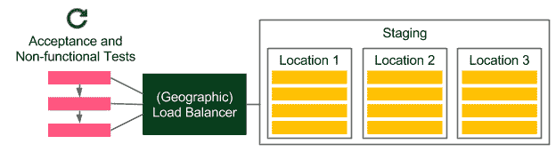
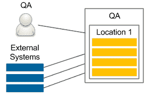

# 连续输送管道

我们已经介绍了连续交付过程中最关键的部分:提交阶段、工件存储库、自动化验收测试和配置管理。

在本章中，我们将重点关注最终管道中缺失的部分，即环境和基础设施、应用程序版本控制和非功能测试。

本章包括以下几点:

*   设计不同的软件环境及其基础设施
*   保护詹金斯代理和服务器之间的连接
*   介绍各种非功能测试
*   在持续交付过程中提出非功能测试的挑战
*   解释不同类型的应用程序版本控制
*   完成连续交付管道
*   引入烟雾测试的概念并将其添加到最终管道中

# 环境和基础设施

到目前为止，我们一直使用一台 Docker 主机来处理所有事情，并将其视为无限资源的虚拟化，我们可以在其中部署所有东西。显然，Docker 主机实际上可以是一组机器，我们将在接下来的章节中展示如何使用 Docker Swarm 创建它。然而，即使 Docker 主机在资源方面是无限的，我们仍然需要考虑底层基础架构，至少有两个原因:

*   机器的物理位置很重要
*   不应在生产物理机器上进行测试

考虑到这些事实，在本节中，我们将讨论不同类型的环境、它们在连续交付过程中的角色以及基础架构安全方面。

# 环境类型

有四种最常见的环境类型:生产、试运行、质量保证(测试)和开发。让我们讨论其中的每一个及其基础架构。

# 生产

生产是最终用户使用的环境。它存在于每个公司，当然，它是最重要的环境。

让我们看看下图，看看大多数生产环境是如何组织的:


用户通过负载平衡器访问服务，负载平衡器选择确切的机器。如果应用程序在多个物理位置发布，那么(第一个)设备通常是基于 DNS 的地理负载平衡器。在每个位置，我们都有一个服务器集群。如果我们使用 Docker，那么服务器集群可以隐藏在一个或多个 Docker 主机后面(这些主机在内部由许多使用 Docker Swarm 的机器组成)。

机器的物理位置很重要，因为请求-响应时间会因物理距离的不同而有很大差异。此外，数据库和其他相关服务应该位于靠近服务部署位置的机器上。更重要的是，应该以最小化不同位置之间复制开销的方式分割数据库。否则，我们可能要等很长时间，数据库才会在彼此相距甚远的实例之间达成一致。关于物理方面的更多细节超出了本书的范围，但重要的是要记住，Docker 并不总是银弹。

Containerization and virtualization allow you to think about servers as an infinite resource; however, some physical aspects such as location are still relevant.

# 脚手架

试运行环境是部署候选版本的地方，以便在上线之前执行最终测试。理想情况下，此环境是生产的一面镜子。

让我们看看下面的内容，看看这样的环境在交付过程中应该是什么样子:



请注意，转移环境是一个精确的生产克隆。如果应用程序部署在多个位置，则转移也应该有多个位置。

在连续交付过程中，所有自动化的验收功能和非功能测试都是针对这个环境运行的。虽然大多数功能测试通常不需要相同的类似生产的基础设施，但是在非功能(尤其是性能)测试的情况下，这是必须的。

出于节约成本的目的，分段基础设施不同于生产设施(通常包含更少的机器)并不罕见。然而，这种方法会导致许多生产问题。迈克尔·t·尼加德在他的名著《T2》中写道:释放它！，给出了一个真实场景的示例，其中在试运行环境中使用的机器比在生产环境中使用的少。

故事是这样的:在一家公司，系统是稳定的，直到某个代码更改，这导致生产极其缓慢，即使所有的压力测试都通过了。怎么可能？碰巧有一个同步点，每个服务器都在这个点上相互通信。在转移的情况下，有一个服务器，所以实际上没有阻止程序。然而，在生产中，有许多服务器，这导致服务器相互等待。这个例子只是冰山一角，如果试运行环境与生产环境不同，许多生产问题可能无法通过验收测试。

# 质量保证

质量保证环境(也称为测试环境)旨在供质量保证团队执行探索性测试，并供外部应用程序(依赖于我们的服务)执行集成测试。质量保证环境的用例和基础设施如下图所示:



虽然分段不需要稳定(在连续交付的情况下，它在提交到存储库的每个代码更改后都会更改)，但质量保证实例需要提供一定的稳定性，并公开与生产相同(或向后兼容)的应用编程接口。与登台环境相反，基础架构可能与产品不同，因为它的目的不是确保候选版本正常工作。

一个非常常见的情况是为质量保证实例分配更少的机器(例如，仅从一个位置)。

Deploying to the QA environment is usually done in a separate pipeline, so that it will be independent from the automatic release process. Such an approach is convenient, because the QA instance has a different life cycle than production (for instance, the QA team may want to perform testing on the experimental code branched from the trunk).

# 发展

开发环境可以创建为所有开发人员的共享服务器，或者每个开发人员都可以拥有自己的开发环境。这里展示了一个简单的图表:


开发环境总是包含最新版本的代码。它用于实现开发人员之间的集成，可以像对待质量保证环境一样对待，但由开发人员使用，而不是质量保证。

# 持续交付环境

对于连续交付流程而言，登台环境是不可或缺的。在一些非常罕见的情况下，当性能不重要并且项目没有很多依赖关系时，我们可以在本地(开发)Docker 主机上执行验收测试(就像我们在上一章中所做的那样)，但是这应该是一个例外，而不是规则。在这种情况下，我们总是要冒一些与环境相关的生产问题的风险。

其他环境对于持续交付通常并不重要。如果我们希望每次提交都部署到质量保证或开发环境中，那么我们可以为此目的创建单独的管道(注意不要混淆主发布管道)。在许多情况下，部署到质量保证环境是手动触发的，因为它可能有不同于生产的生命周期。

# 保护环境

所有环境都需要妥善保护。很明显。更显而易见的是，最重要的要求是保持生产安全，因为我们的业务依赖于此，任何安全缺陷的后果都可能是最高的。

Security is a broad topic. In this section, we focus only on the topics related to the Continuous Delivery process. Nevertheless, setting up a complete server infrastructure requires much more knowledge about security.

在连续交付过程中，从属端必须能够访问服务器，以便部署应用程序。

为从属服务器提供服务器凭证有不同的方法:

*   **将 SSH 密钥放入从机**:如果我们不使用动态 Docker 从机配置，那么我们可以配置 Jenkins 从机包含私有 SSH 密钥。
*   **将 SSH 密钥放入从映像:**如果我们使用动态 Docker 从配置，我们可以将 SSH 私钥添加到 Docker 从映像中。但是，这可能会造成安全漏洞，因为任何能够访问该映像的人都可以访问生产服务器。
*   **Jenkins 凭证**:我们可以配置 Jenkins 存储凭证，并在管道中使用。
*   **复制到从詹金斯插件**:我们可以在开始詹金斯构建的同时，将 SSH 密钥动态复制到从机中。

每种解决方案都有一些优点和缺点。在使用它们中的任何一个时，我们必须格外小心，因为当一个奴隶可以进入生产时，任何闯入奴隶的人都会闯入生产。

最有风险的解决方案是将 SSH 私钥放入 Jenkins 从映像中，因为此后存储映像的所有地方(Docker 注册表或带有 Jenkins 的 Docker 主机)都需要得到很好的保护。

# 非功能测试

在前一章中，我们学习了很多关于功能需求和自动化验收测试的知识。然而，我们应该如何处理非功能性需求呢？或者更有挑战性，如果没有要求怎么办？在连续交付过程中，我们是否应该跳过它们？让我们在这一部分回答这些问题。

软件的非功能方面总是很重要的，因为它们会给系统的运行带来很大的风险。

例如，许多应用程序会失败，因为它们无法承受用户数量突然增加的负载。在*可用性工程**雅各布·尼尔森*一书中写道，1.0 秒大约是用户思想流动保持不间断的极限。想象一下，随着负载的增长，我们的系统开始超过这个极限。用户可以仅仅因为服务的性能而停止使用它。考虑到这一点，非功能测试和功能测试一样重要。

长话短说，对于非功能测试，我们应该始终采取以下步骤:

*   决定哪些非功能方面对我们的业务至关重要
*   对于他们每个人:
    *   指定测试的方式与我们指定验收测试的方式相同
    *   向连续交付管道添加一个阶段(在验收测试之后，应用程序仍部署在阶段环境中)
*   只有在所有非功能测试都通过之后，应用程序才会进入发布阶段

不管非功能测试的类型如何，想法总是一样的。然而，方法可能略有不同。让我们检查不同的测试类型及其带来的挑战。

# 非功能测试的类型

功能测试总是与同一个方面相关——系统的行为。相反，非功能测试涉及许多不同的方面。让我们讨论最常见的系统属性，以及如何在连续交付过程中测试它们。

# 性能试验

性能测试是最广泛使用的非功能测试。它们衡量系统的响应性和稳定性。我们可以创建的最简单的性能测试是向 web 服务发送一个请求，并测量其**往返时间** ( **RTT** )。

性能测试有不同的定义。在许多地方，它们意味着包括负载、压力和可伸缩性测试。有时它们也被描述为白盒测试。在本书中，我们将性能测试定义为测量系统延迟的黑盒测试的最基本形式。

出于性能测试的目的，我们可以使用一个专用的框架(对于 Java 来说，最流行的是 JMeter)，或者只使用与验收测试相同的工具。简单的性能测试通常在验收测试之后作为管道阶段添加。如果 RTT 超过了给定的限制，并且它检测到了肯定会降低服务速度的错误，这样的测试应该会失败。

The JMeter plugin for Jenkins can show performance trends over the time.

# 负载测试

负载测试用于检查当有大量并发请求时系统如何运行。虽然一个系统只需一个请求就可以非常快，但这并不意味着它同时处理 1，000 个请求就足够快了。在负载测试期间，我们测量许多并发调用的平均请求-响应时间，这些调用通常由许多机器执行。负载测试是发布周期中非常常见的质量保证阶段。为了实现自动化，我们可以使用与简单性能测试相同的工具；但是，在大型系统的情况下，我们可能需要一个单独的客户端环境来执行大量并发请求。

# 压力测试

压力测试，也称为容量测试或吞吐量测试，是一种确定有多少并发用户可以访问我们服务的测试。这听起来可能和负载测试一样；但是，在负载测试的情况下，我们将并发用户的数量(吞吐量)设置为给定的数字，检查响应时间(延迟)，如果超过限制，构建就会失败。然而，在压力测试期间，我们保持延迟不变，并增加吞吐量，以便在系统仍可运行时发现最大并发调用数。因此，压力测试的结果可能是通知我们的系统可以处理 10，000 个并发用户，这有助于我们为高峰使用时间做好准备。

压力测试不太适合连续交付过程，因为它需要长时间的测试，并发请求的数量也越来越多。它应该作为单独的 Jenkins 管道的单独脚本来准备，并在我们知道代码更改会导致性能问题时按需触发。

# 可扩展性测试

可扩展性测试解释了当我们添加更多服务器或服务时，延迟和吞吐量是如何变化的。完美的特性是线性的，这意味着如果我们有一台服务器，当 100 个并行用户使用时，平均请求-响应时间为 500 毫秒，那么添加另一台服务器将保持响应时间不变，并允许我们再添加 100 个并行用户。实际上，由于保持服务器之间的数据一致性，通常很难实现 thsi。

可伸缩性测试应该是自动化的，并且应该提供表示机器数量和并发用户数量之间关系的图表。这样的数据有助于确定系统的极限，以及增加更多机器没有帮助的点。

可伸缩性测试，类似于压力测试，很难放入连续交付管道中，应该分开进行。

# 耐久性测试

耐久性测试，也称为寿命测试，长时间运行系统，查看某段时间后性能是否下降。它们检测内存泄漏和稳定性问题。因为它们需要一个长时间运行的系统，所以在连续交付管道中运行它们是没有意义的。

# 安全测试

安全测试处理与安全机制和数据保护相关的不同方面。一些安全方面是纯粹的功能需求，例如身份验证、授权或角色分配。在验收测试阶段，这些部件的检查方法应与任何其他功能要求相同。还有其他非功能性的安全方面；例如，应该保护该系统免受 SQL 注入的攻击。没有客户可能会指定这样的要求，但这是隐含的。

安全测试应作为管道阶段包含在持续交付中。它们可以使用与验收测试相同的框架编写，也可以使用专用的安全测试框架编写，例如 BDD 安全。

Security should also always be a part the explanatory testing process, in which testers and security experts detect security holes and add new testing scenarios.

# 可维护性测试

可维护性测试解释了系统维护有多简单。换句话说，他们判断代码质量。在提交阶段，我们已经有了检查测试覆盖率和执行静态代码分析的相关阶段。声纳工具也可以给出一些代码质量和技术债务的概述。

# 恢复测试

恢复测试是一种确定系统在因软件或硬件故障而崩溃后恢复速度的技术。最好的情况是，即使部分服务中断，系统也不会出现故障。一些公司甚至故意生产失败，以检查他们是否能在灾难中幸存下来。最著名的例子是网飞和他们的混沌猴子工具，它随机终止生产环境的随机实例。这种方法迫使工程师编写代码，使系统能够抵御故障。

恢复测试显然不是持续交付流程的一部分，而是检查整体运行状况的定期事件。

You can read more about Chaos Monkey at [https://github.com/Netflix/chaosmonkey](https://github.com/Netflix/chaosmonkey).

还有许多非功能测试类型，它们更接近或更远离代码和连续交付过程。其中一些与法律有关，如合规性测试；其他与文档或国际化相关。还有可用性测试和容量测试(检查系统在大量数据的情况下是否表现良好)。然而，这些测试中的大多数都不属于连续交付过程。

# 非功能性挑战

非功能方面对软件开发和交付提出了新的挑战:

*   **长时间测试运行**:测试可能需要很长时间运行，可能需要特殊的执行环境。
*   **递增性质**:当测试失败时很难设置限值(除非 SLA 定义明确)。即使设置了边缘限制，应用程序也可能会逐渐接近该限制。实际上，在大多数情况下，没有一个代码更改导致测试失败。
*   **模糊需求**:用户通常没有太多关于非功能需求的输入。它们可以提供一些关于请求-响应时间或用户数量的指导方针；然而，他们可能不太了解可维护性、安全性或可伸缩性。
*   **多样性**:有很多不同的非功能测试，选择应该实现哪个需要做一些妥协。

解决非功能方面的最佳方法是采取以下步骤:

1.  列出所有非功能测试类型。
2.  明确划掉系统不需要的测试。不需要一种测试的原因可能有很多，例如:
    *   服务非常小，简单的性能测试就足够了
    *   该系统仅为内部系统，仅可用于只读，因此可能不需要任何安全检查
    *   该系统只为一台机器设计，不需要任何扩展
    *   创建某些测试的成本太高

3.  将您的测试分成两组:
    *   **连续输送**:可以添加到管道中
    *   **分析**:由于其执行时间、性质或相关成本，不可能添加到管道中
4.  对于持续交付组，实施相关的管道阶段。
5.  对于分析组:
    *   创建自动化测试
    *   计划运行它们的时间
    *   安排会议讨论结果并采取行动要点

A very good approach is to have a nightly build with the long tests that don't fit the Continuous Delivery pipeline. Then, it's possible to schedule a weekly meeting to monitor and analyze the trends of system performance.

如前所述，有许多类型的非功能测试，它们给交付过程带来了额外的挑战。然而，为了我们系统的稳定性，这些测试永远不应该被茫然地跳过。技术实现因测试类型而异，但在大多数情况下，它们可以以类似于功能验收测试的方式实现，并且应该针对试运行环境运行。

If you're interested in the topic of nonfunctional testing, system properties, and system stability, then read the book *Release It!* by *Michael T. Nygard*.

# 应用程序版本控制

到目前为止，在每次 Jenkins 构建期间，我们都创建了一个新的 Docker 映像，将其推入 Docker 注册表，并在整个过程中使用了最新的**版本。然而，这种解决方案至少有三个缺点:**

 ***   如果在 Jenkins 构建期间，在验收测试之后，有人推出了映像的新版本，那么我们最终可以发布未经测试的版本
*   我们总是推一个同名的形象；因此，如此有效地，它在 Docker 注册表中被覆盖
*   仅仅通过散列样式的标识来管理没有版本的图像是非常困难的

与持续交付流程一起管理 Docker 映像版本的推荐方式是什么？在本节中，我们将看到不同的版本控制策略，并了解在 Jenkins 管道中创建版本的不同方式。

# 版本控制策略

有不同的方法来版本化应用程序。

让我们讨论这些最流行的解决方案，它们可以与连续交付过程一起应用(当每个提交创建一个新版本时)。

*   **语义版本化**:最流行的解决方案是使用基于序列的标识符(通常是 x.y.z 的形式)。这个方法需要 Jenkins 提交到存储库，以便增加当前版本号，该版本号通常存储在构建文件中。这个解决方案得到了 Maven、Gradle 和其他构建工具的很好支持。标识符通常由三个数字组成:
    *   **x** :这是大版本；当这个版本增加时，软件不需要向后兼容
    *   **y** :这是小版本；当版本增加时，软件需要向后兼容
    *   **z:** 这是构建号；这有时也被认为是向后和向前兼容的变化
*   **时间戳**:为应用程序版本使用构建的日期和时间没有序列号冗长，但是在连续交付过程的情况下非常方便，因为它不需要詹金斯提交回存储库。
*   **哈希**:随机生成的哈希版本分享了日期时间的好处，可能是最简单的解决方案。缺点是不可能看两个版本就知道哪个是最新的。
*   **混合**:前面描述的解决方案有很多变体，例如日期时间的主要和次要版本。

所有解决方案都可以用于连续交付流程。然而，语义版本化需要从构建执行到存储库的提交，因此在源代码存储库中版本会增加。

Maven (and the other build tools) popularized version snapshotting, which added a suffix SNAPSHOT to the versions that are not released, but kept just for the development process. Since Continuous Delivery means releasing every change, there are no snapshots.

# 詹金斯管道中的版本控制

如前所述，使用软件版本控制有不同的可能性，每种可能性都可以在 Jenkins 中实现。

例如，让我们使用日期时间。

In order to use the timestamp information from Jenkins, you need to install the Build Timestamp Plugin and set the timestamp format in the Jenkins configuration (for example, to "yyyyMMdd-HHmm").

在我们使用 Docker 图像的每个地方，都需要添加标签后缀:`${BUILD_TIMESTAMP}`。

例如`Docker build`阶段应该是这样的:

```
sh "docker build -t leszko/calculator:${BUILD_TIMESTAMP} ."
```

更改之后，当我们运行 Jenkins 构建时，我们应该在 Docker 注册表中用时间戳版本标记图像。

Note that after explicitly tagging the image, it's no longer implicitly tagged as the latest.

随着版本控制的完成，我们终于准备好完成连续交付管道。

# 完整的连续交付管道

在讨论了 Ansible、环境、非功能测试和版本控制的所有方面之后，我们准备扩展 Jenkins 管道，并最终确定一个简单但完整的连续交付管道。

我们将按如下步骤进行:

*   创建登台和生产环境的清单
*   更新验收测试以使用远程主机(而不是本地主机)
*   将应用程序发布到生产环境中
*   添加烟雾测试，确保应用程序成功发布

# 库存

在最简单的形式中，我们可以有两个环境:暂存和生产，每个环境都有一台 Docker 主机。在现实生活中，如果我们希望服务器位于不同的位置或有不同的要求，我们可能希望为每个环境添加更多的主机组。

让我们创建两个可翻译的清单文件。从登台开始，我们可以定义`inventory/staging`文件。假设登台地址是`192.168.0.241`，它会有以下内容:

```
[webservers]
web1 ansible_host=192.168.0.241 ansible_user=admin
```

以此类推，如果生产 IP 地址是`192.168.0.242`，那么`inventory/production`应该是这样的:

```
[webservers]
web2 ansible_host=192.168.0.242 ansible_user=admin
```

It may look oversimplified to have just one machine for each environment; however, using Docker Swarm (which we show later in this book), a cluster of hosts can be hidden behind one Docker host.

定义了清单后，我们可以更改验收测试来使用试运行环境。

# 验收测试环境

根据我们的需要，我们可以通过在本地 Docker 主机上运行应用程序(就像我们在上一章中所做的那样)或者使用远程登台环境来测试应用程序。前一种解决方案更接近生产中发生的情况，因此可以认为是更好的解决方案。这与前一章*方法 1:詹金斯-第一次验收测试*部分中介绍的内容非常接近。唯一的区别是，现在我们将应用程序部署在远程 Docker 主机上。

为此，我们可以使用带有`-H`参数的`docker`(或`docker-compose`命令)，该参数指定远程 Docker 主机地址。这将是一个很好的解决方案，如果您不打算使用 Ansible 或任何其他配置管理工具，那么这就是应该走的路。然而，由于本章已经提到的原因，使用 Ansible 是有益的。在这种情况下，我们可以在连续交付管道中使用`ansible-playbook`命令。

```
stage("Deploy to staging") {
    steps {
        sh "ansible-playbook playbook.yml -i inventory/staging"
    }
}
```

如果`playbook.yml`和 docker-compose.yml 看起来与在*中一样，那么将应用程序及其依赖项部署到暂存环境中就足够了。*

`Acceptance test`阶段看起来和上一章完全一样。唯一的调整可以是转移环境(或其负载平衡器)的主机名。还可以针对运行在登台环境中的应用程序添加性能测试或其他非功能测试的阶段。

所有测试通过后，是时候发布应用程序了。

# 释放；排放；发布

生产环境应该尽可能靠近登台环境。发布的 Jenkins 步骤也应该非常类似于将应用程序部署到登台环境的阶段。

在最简单的场景中，唯一的区别是清单文件和应用程序配置(例如，在 Spring Boot 应用程序的情况下，我们将设置不同的 Spring 配置文件，这导致采用不同的属性文件)。在我们的例子中，没有应用程序属性，所以唯一的区别是清单文件。

```
stage("Release") {
    steps {
        sh "ansible-playbook playbook.yml -i inventory/production"
    }
}
```

In reality, the release step can be a little more complex if we want to provide zero downtime deployment. More on that topic is presented in the next chapters.

发布完成后，我们可能会认为一切都完成了；然而，还有一个缺失的阶段，一个烟雾测试。

# 烟雾测试

冒烟测试是验收测试的一个非常小的子集，它的唯一目的是检查发布过程是否成功完成。否则，我们可能会遇到应用程序完全正常的情况；然而，在发布过程中有一个问题，所以我们可能会以一个不工作的产品结束。

烟雾测试通常以与验收测试相同的方式定义。所以管道中的`Smoke test`阶段应该是这样的:

```
stage("Smoke test") {
    steps {
        sleep 60
        sh "./smoke_test.sh"
    }
}
```

设置好一切后，连续交付构建应该自动运行，应用程序应该发布到生产环境中。通过这一步，我们已经以最简单但最高效的形式完成了连续交付管道。

# 完成詹金斯文件

总而言之，在最近的章节中，我们已经创建了相当多的阶段，这导致了一个完整的连续交付管道，可以在许多项目中成功使用。

接下来，我们看到计算器项目的完整詹金斯文件:

```
pipeline {
  agent any

  triggers {
    pollSCM('* * * * *')
  }

  stages {
    stage("Compile") { steps { sh "./gradlew compileJava" } }
    stage("Unit test") { steps { sh "./gradlew test" } }

    stage("Code coverage") { steps {
      sh "./gradlew jacocoTestReport"
      publishHTML (target: [
              reportDir: 'build/reports/jacoco/test/html',
              reportFiles: 'index.html',
              reportName: "JaCoCo Report" ])
      sh "./gradlew jacocoTestCoverageVerification"
    } }

    stage("Static code analysis") { steps {
      sh "./gradlew checkstyleMain"
      publishHTML (target: [
              reportDir: 'build/reports/checkstyle/',
              reportFiles: 'main.html',
              reportName: "Checkstyle Report" ])
    } }

    stage("Build") { steps { sh "./gradlew build" } }

    stage("Docker build") { steps {
      sh "docker build -t leszko/calculator:${BUILD_TIMESTAMP} ."
   } }

    stage("Docker push") { steps {
      sh "docker push leszko/calculator:${BUILD_TIMESTAMP}"
    } }

    stage("Deploy to staging") { steps {
      sh "ansible-playbook playbook.yml -i inventory/staging"
      sleep 60
    } }

    stage("Acceptance test") { steps { sh "./acceptance_test.sh" } }  

    // Performance test stages

    stage("Release") { steps {
      sh "ansible-playbook playbook.yml -i inventory/production"
      sleep 60
    } }

    stage("Smoke test") { steps { sh "./smoke_test.sh" } }
  }
}
```

You can find this Jenkinsfile on GitHub at [https://github.com/leszko/calculator/blob/master/Jenkinsfile](https://github.com/leszko/calculator/blob/master/Jenkinsfile).

# 练习

在本章中，我们已经介绍了连续交付管道的许多新方面；为了更好地理解这一概念，我们建议您进行以下练习:

1.  添加一个性能测试，用于测试“hello world”服务:
    *   “你好世界”服务可以从上一章中获取
    *   创建一个`performance_test.sh`脚本，并行调用 100 次，检查平均请求-响应时间是否低于 1 秒
    *   您可以对脚本使用黄瓜或`curl`命令
2.  创建一个 Jenkins 管道，将“hello world”web 服务构建为版本化的 Docker 映像，并执行性能测试:

    *   创建`Docker build`阶段，用“hello world”服务构建 Docker 映像，并添加时间戳作为版本标记
    *   创建一个使用 Docker 映像的可移植剧本
    *   添加`Deploy to staging`阶段，将映像部署到远程机器中
    *   增加`Performance testing`阶段，执行`performance_test.sh`
    *   运行管道并观察结果

# 摘要

在本章中，我们已经完成了连续交付管道，它最终发布了应用程序。以下是本章的要点:

*   为了实现连续交付，两个环境是不可或缺的:准备和生产。
*   非功能测试是持续交付过程的重要组成部分，应该始终被视为管道阶段。
*   不适合连续交付过程的非功能测试应该被视为周期性任务，以便监控整体性能趋势。
*   应用程序应始终进行版本控制；但是，版本控制策略取决于应用程序的类型。
*   最小的连续交付管道可以实现为一系列脚本，以两个阶段结束:发布和冒烟测试。
*   烟雾测试应始终作为连续交付管道的最后阶段添加，以检查发布是否成功。

在下一章中，我们将看一下 Docker Swarm 工具，它帮助我们创建一个 Docker 主机集群。**