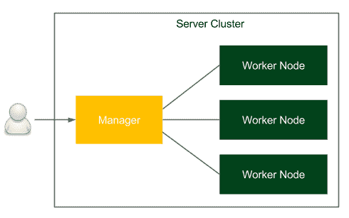
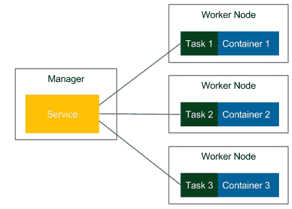
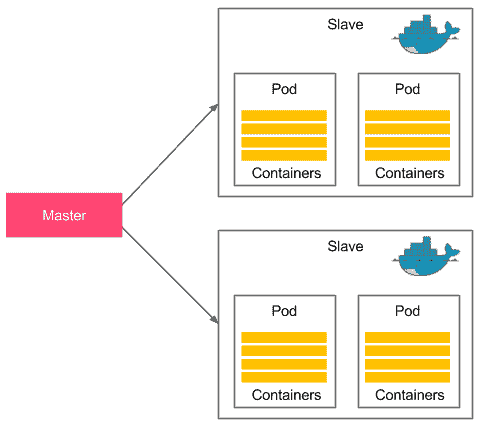
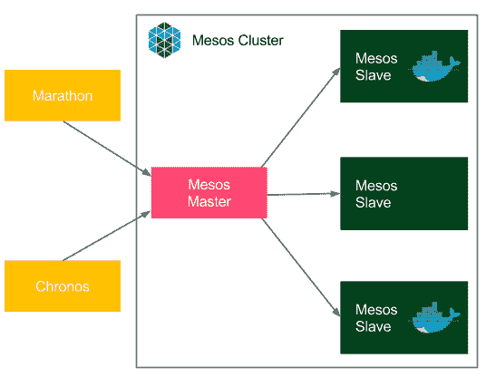

# 八、使用 Docker Swarm 的集群

我们已经涵盖了持续交付管道的所有基本方面。在本章中，我们将看到如何将 Docker 环境从单个 Docker 主机更改为机器集群，以及如何与 Jenkins 一起使用它。

本章包括以下几点:

*   解释服务器集群的概念
*   介绍 Docker Swarm 及其最重要的特性
*   介绍如何从多个 Docker 主机构建集群集群
*   在群集上运行和缩放 Docker 映像
*   探索高级群功能:滚动更新、耗尽节点、多个管理器节点和调整调度策略
*   在集群上部署 Docker 编写配置
*   引入库本内特和阿帕奇介子作为 Docker Swarm 的替代品
*   在集群上动态扩展Jenkins代理

# 服务器群集

到目前为止，我们已经单独与每台机器进行了交互。即使当我们使用 Ansible 在多个服务器上重复相同的操作时，我们也必须明确指定应该在哪个主机上部署给定的服务。然而，在大多数情况下，如果服务器共享相同的物理位置，我们对服务部署在哪个特定机器上不感兴趣。我们所需要的只是让它在许多情况下可以被访问和复制。我们如何配置一组机器一起工作，以便添加新机器时不需要额外的设置？这就是集群的作用。

在本节中，您将了解服务器集群的概念和 Docker Swarm 工具包。

# 引入服务器集群

服务器集群是一组相互连接的计算机，它们以类似于单个系统的方式协同工作。服务器通常通过本地网络连接，连接速度足够快，以确保服务分布的影响很小。下图显示了一个简单的服务器集群:



用户通过称为管理器的主机访问集群，管理器的接口应该类似于通常的 Docker 主机。在集群内部，有多个工作节点接收任务，执行任务，并通知管理器它们的当前状态。经理负责编排流程，包括任务分派、服务发现、负载平衡和工作人员故障检测。

The manager can also execute tasks, which is the default configuration in Docker Swarm. However, for large clusters, the manager should be configured for management purposes only.

# 引入 Docker Swarm

Docker Swarm 是 Docker 的本机集群系统，它将一组 Docker 主机转换为一个一致的集群，称为群。连接到群集的每台主机都扮演着管理者或工作者的角色(群集中必须至少有一个管理者)。从技术上讲，机器的物理位置并不重要；但是，将所有 Docker 主机放在一个本地网络中是合理的，否则，管理操作(或在多个管理人员之间达成共识)可能会花费大量时间。

Since Docker 1.12, Docker Swarm is natively integrated into Docker Engine as swarm mode. In older versions, it was necessary to run the swarm container on each of the hosts to provide the clustering functionality.

关于术语，在群集模式下，运行的映像称为**服务，**，而不是在单个 Docker 主机上运行的**容器**。一个服务运行指定数量的**任务。**任务是群的原子调度单元，它保存关于容器的信息和应该在容器内部运行的命令。一个**副本**是在节点上运行的每个容器。副本的数量是给定服务的所有容器的预期数量。

让我们看一张展示术语和 Docker Swarm 集群过程的图片:



我们从指定服务、Docker 映像和副本数量开始。经理自动将任务分配给工作节点。显然，每个复制的容器都是从同一个 Docker 映像运行的。在所呈现的流程的上下文中，Docker Swarm 可以被视为负责容器编排的 Docker Engine 机制之上的一层。

在前面的示例映像中，我们有三个任务，每个任务都在单独的 Docker 主机上运行。然而，也可能发生所有容器都在同一个 Docker 主机上启动的情况。一切都取决于使用调度策略将任务分配给工作节点的管理节点。稍后，我们将在单独的章节中展示如何配置该策略。

# Docker Swarm 功能概述

Docker Swarm 提供了许多有趣的特性。让我们来看看最重要的几个:

*   **负载平衡** : Docker Swarm 负责负载平衡和分配唯一的 DNS 名称，以便部署在集群上的应用程序可以像部署在单个 Docker 主机上一样使用。换句话说，群可以以与 Docker 容器类似的方式发布端口，然后群管理器在集群中的服务之间分发请求。
*   **动态角色管理** : Docker 主机可以在运行时加入群，不需要重启集群。此外，节点(管理人员或工作人员)的角色也可以动态更改。
*   **动态服务缩放**:每个服务都可以通过 Docker 客户端进行动态缩放。管理器节点负责在节点中添加或移除容器。
*   **故障恢复**:节点由管理器持续监控，如果其中任何一个出现故障，新任务将在不同的机器上启动，这样声明的副本数量将保持不变。还可以创建多个管理器节点，以防其中一个节点出现故障。
*   **滚动更新**:服务的更新可以增量应用；例如，如果我们有 10 个副本，并且我们想要进行更改，我们可以定义部署到每个副本之间的延迟。在这种情况下，当出现任何问题时，我们永远不会遇到副本无法正常工作的情况。
*   **两种服务模式:**有两种模式可以运行:
    *   **复制服务**:基于调度策略算法，指定数量的复制容器分布在节点之间
    *   **全局服务**:集群中的每个可用节点上运行一个容器
*   **安全性:**由于一切都在 Docker 中，Docker Swarm 会强制执行 TLS 身份验证和通信加密。也可以使用证书颁发机构(或自签名)证书。

让我们看看所有这些在实践中是怎样的。

# 实践中的Docker群体

Docker 引擎默认包含 Swarm 模式，因此不需要额外的安装过程。由于 Docker Swarm 是本地 Docker 集群系统，管理集群节点是通过`docker`命令完成的，因此非常简单直观。让我们从创建一个具有两个工作节点的管理节点开始。然后，我们将从 Docker 映像运行和扩展服务。

# 设置群

为了设置 Swarm，我们需要初始化管理器节点。我们可以在应该成为管理器的机器上使用以下命令来实现这一点:

```
$ docker swarm init

Swarm initialized: current node (qfqzhk2bumhd2h0ckntrysm8l) is now a manager.

To add a worker to this swarm, run the following command:
docker swarm join \
--token SWMTKN-1-253vezc1pqqgb93c5huc9g3n0hj4p7xik1ziz5c4rsdo3f7iw2-df098e2jpe8uvwe2ohhhcxd6w \
192.168.0.143:2377

To add a manager to this swarm, run 'docker swarm join-token manager' and follow the instructions.
```

A very common practice is to use the `--advertise-addr <manager_ip>` parameter, because if the manager machine has more than one potential network interfaces, then `docker swarm init` can fail.

在我们的例子中，管理机有 IP 地址`192.168.0.143`，显然，它必须可以从工作节点到达(反之亦然)。请注意，要在工作机上执行的命令已打印到控制台。还要注意，已经生成了一个特殊的令牌。从现在开始，它将用于将机器连接到集群，并且应该保密。

我们可以使用`docker node`命令检查蜂群是否已经创建:

```
$ docker node ls
ID                          HOSTNAME       STATUS  AVAILABILITY  MANAGER STATUS
qfqzhk2bumhd2h0ckntrysm8l * ubuntu-manager Ready   Active        Leader
```

当管理器启动并运行时，我们准备向 Swarm 添加工作节点。

# 添加工作节点

为了向 Swarm 添加一台机器，我们必须登录给定的机器并执行以下命令:

```
$ docker swarm join \
--token SWMTKN-1-253vezc1pqqgb93c5huc9g3n0hj4p7xik1ziz5c4rsdo3f7iw2-df098e2jpe8uvwe2ohhhcxd6w \
192.168.0.143:2377

This node joined a swarm as a worker.
```

我们可以使用`docker node ls`命令检查该节点是否已添加到 Swarm 中。假设我们添加了两台节点机器，输出应该如下所示:

```
$ docker node ls
ID                          HOSTNAME        STATUS  AVAILABILITY  MANAGER STATUS
cr7vin5xzu0331fvxkdxla22n   ubuntu-worker2  Ready   Active 
md4wx15t87nn0c3pyv24kewtz   ubuntu-worker1  Ready   Active 
qfqzhk2bumhd2h0ckntrysm8l * ubuntu-manager  Ready   Active        Leader
```

此时，我们有一个由三个 Docker 主机组成的集群，`ubuntu-manager`、`ubuntu-worker1`和`ubuntu-worker2`。让我们看看如何在这个集群上运行服务。

# 部署服务

为了在集群上运行映像，我们不使用`docker run`而是使用 Swarm 专用的`docker service`命令(在管理器节点上执行)。让我们开始一个单一的`tomcat`应用程序，并给它命名为`tomcat`:

```
$ docker service create --replicas 1 --name tomcat tomcat
```

该命令创建了服务，因此发送了一个任务来启动其中一个节点上的容器。让我们列出正在运行的服务:

```
$ docker service ls
ID            NAME    MODE        REPLICAS  IMAGE
x65aeojumj05  tomcat  replicated  1/1       tomcat:latest
```

日志确认`tomcat`服务正在运行，并且它有一个副本(一个 Docker 容器正在运行)。我们可以更仔细地检查服务:

```
$ docker service ps tomcat
ID           NAME      IMAGE          NODE            DESIRED STATE CURRENT STATE 
kjy1udwcnwmi tomcat.1  tomcat:latest  ubuntu-manager  Running     Running about a minute ago
```

If you are interested in the detailed information about a service, you can use the `docker service inspect <service_name>` command.

从控制台输出中，我们可以看到容器正在管理器节点(`ubuntu-manager`)上运行。它也可以在任何其他节点上启动；管理者使用调度策略算法自动选择工作节点。我们可以使用众所周知的`docker ps`命令确认容器正在运行:

```
$ docker ps
CONTAINER ID     IMAGE
COMMAND           CREATED            STATUS              PORTS            NAMES
6718d0bcba98     tomcat@sha256:88483873b279aaea5ced002c98dde04555584b66de29797a4476d5e94874e6de 
"catalina.sh run" About a minute ago Up About a minute   8080/tcp         tomcat.1.kjy1udwcnwmiosiw2qn71nt1r
```

If we don't want a task to be executed on the manager node, we can constrain the service with the `--constraint node.role==worker` option. The other possibility is to disable the manager completely from executing tasks with `docker node update --availability drain <manager_name>`.

# 缩放服务

当服务正在运行时，我们可以向上或向下扩展它，以便它可以在许多副本中运行:

```
$ docker service scale tomcat=5
tomcat scaled to 5
```

我们可以检查服务是否已扩展:

```
$ docker service ps tomcat
ID            NAME     IMAGE          NODE            DESIRED STATE  CURRENT STATE 
kjy1udwcnwmi  tomcat.1  tomcat:latest  ubuntu-manager  Running    Running 2 minutes ago 
536p5zc3kaxz  tomcat.2  tomcat:latest  ubuntu-worker2  Running    Preparing 18 seconds ago npt6ui1g9bdp  tomcat.3  tomcat:latest  ubuntu-manager  Running    Running 18 seconds ago zo2kger1rmqc  tomcat.4  tomcat:latest  ubuntu-worker1  Running    Preparing 18 seconds ago 1fb24nf94488  tomcat.5  tomcat:latest  ubuntu-worker2  Running    Preparing 18 seconds ago  
```

注意这次，两个容器在`manager`节点上运行，一个在`ubuntu-worker1`节点上，另一个在`ubuntu-worker2`节点上。我们可以通过在每台机器上执行`docker ps`来检查它们是否真的在运行。

如果我们想删除服务，执行以下命令就足够了:

```
$ docker service rm tomcat
```

您可以使用`docker service ls`命令检查服务已经被移除，因此所有相关的`tomcat`容器都被停止并从所有节点移除。

# 发布端口

Docker 服务，类似于容器，有一个端口转发机制。我们通过添加`-p <host_port>:<container:port>`参数来使用它。以下是启动服务的情况:

```
$ docker service create --replicas 1 --publish 8080:8080 --name tomcat tomcat
```

现在，我们可以打开浏览器，在地址`http://192.168.0.143:8080/`下看到 Tomcat 的主页面。

该应用程序在充当负载平衡器并将请求分发到工作节点的管理器主机上可用。听起来不太直观的是，我们可以使用任何工作人员的 IP 地址访问 Tomcat，例如，如果工作人员节点在`192.168.0.166`和`192.168.0.115`下可用，我们可以使用`http://192.168.0.166:8080/`和`http://192.168.0.115:8080/`访问同一个运行容器。这是可能的，因为 Docker Swarm 创建了一个路由网格，其中每个节点都有如何转发已发布端口的信息。

You can read more about how the load balancing and routing are done by Docker Swarm at [https://docs.docker.com/engine/swarm/ingress/](https://docs.docker.com/engine/swarm/ingress/).

默认情况下，使用内部 Docker Swarm 负载平衡。因此，将所有请求都发送到管理器的机器上就足够了，它会处理节点之间的分布。另一个选项是配置外部负载平衡器(例如，HAProxy 或 Traefik)。

我们已经讨论了 Docker Swarm 的基本用法。现在让我们深入探讨更具挑战性的特性。

# 高级Docker群

Docker Swarm 提供了许多有趣的特性，这些特性在持续交付过程中非常有用。在这一节中，我们将介绍最重要的几个。

# 滚动更新

假设您部署了应用程序的新版本。您需要更新群集中的所有副本。一种选择是停止整个 Docker Swarm 服务，并从更新的 Docker 映像运行一个新的服务。然而，这种方法会在服务停止和新服务启动之间造成停机。在持续交付过程中，宕机是不可接受的，因为部署可以在每次源代码更改后进行，这种情况很常见。那么，我们如何在集群中提供零停机部署呢？这就是滚动更新的作用。

滚动更新是一种用副本替换服务副本的自动方法，其中一些副本一直在工作。Docker Swarm 默认情况下使用滚动更新，它们可以通过两个参数来控制:

*   `update-delay`:启动一个副本和停止下一个副本之间的延迟(默认为 0 秒)
*   `update-parallelism`:同时更新的副本最大数量(默认为一个)

Docker Swarm 滚动更新过程如下所示:

1.  停止`<update-parallelism>`数量的任务(副本)。
2.  取而代之的是，运行相同数量的更新任务。
3.  如果任务返回**运行**状态，则等待`<update-delay>`周期。
4.  如果在任何时候，任何任务返回**失败**状态，则暂停更新。

The value of the `update-parallelism` parameter should be adapted to the number of replicas we run. If the number is small and booting the service is fast, it's reasonable to keep the default value of 1\. The `update-delay` parameter should be set to the period longer than the expected boot time of our application so that we will notice the failure, and therefore pause the update.

让我们看一个例子，将 Tomcat 应用程序从版本 8 更改为版本 9。假设我们有带五个副本的`tomcat:8`服务:

```
$ docker service create --replicas 5 --name tomcat --update-delay 10s tomcat:8
```

我们可以使用`docker service ps tomcat`命令检查所有副本是否正在运行。帮助检查服务的另一个有用命令是`docker service inspect`命令:

```
$ docker service inspect --pretty tomcat

ID:    au1nu396jzdewyq2y8enm0b6i
Name:    tomcat
Service Mode:    Replicated
 Replicas:    5
Placement:
UpdateConfig:
 Parallelism:    1
 Delay:    10s
 On failure:    pause
 Max failure ratio: 0
ContainerSpec:
 Image:    tomcat:8@sha256:835b6501c150de39d2b12569fd8124eaebc53a899e2540549b6b6f8676538484
Resources:
Endpoint Mode:    vip
```

我们可以看到该服务有五个从映像`tomcat:8`创建的副本。命令输出还包括关于并行度和更新之间的延迟时间的信息(由`docker service create`命令中的选项设置)。

现在，我们可以将服务更新为`tomcat:9`映像:

```
$ docker service update --image tomcat:9 tomcat
```

让我们看看会发生什么:

```
$ docker service ps tomcat
ID            NAME      IMAGE     NODE            DESIRED STATE  CURRENT STATE 
4dvh6ytn4lsq  tomcat.1  tomcat:8  ubuntu-manager  Running    Running 4 minutes ago 
2mop96j5q4aj  tomcat.2  tomcat:8  ubuntu-manager  Running    Running 4 minutes ago 
owurmusr1c48  tomcat.3  tomcat:9  ubuntu-manager  Running    Preparing 13 seconds ago 
r9drfjpizuxf   \_ tomcat.3  tomcat:8  ubuntu-manager  Shutdown   Shutdown 12 seconds ago 
0725ha5d8p4v  tomcat.4  tomcat:8  ubuntu-manager  Running    Running 4 minutes ago 
wl25m2vrqgc4  tomcat.5  tomcat:8  ubuntu-manager  Running    Running 4 minutes ago       
```

注意`tomcat:8`的第一个副本已经关闭，第一个`tomcat:9`已经在运行。如果我们继续检查`docker service ps tomcat`命令的输出，我们会注意到每 10 秒钟后，另一个副本处于关闭状态，一个新的副本被启动。如果我们也监控`docker inspect`命令，我们会看到值**更新状态:状态**将变为**更新**，然后，当更新完成时，变为**完成**。

滚动更新是一个非常强大的功能，它允许零停机部署，并且应该始终在持续交付过程中使用。

# 排出节点

当我们需要停止工作节点进行维护，或者我们只想将其从集群中删除时，我们可以使用 Swarm draining 节点功能。清空节点意味着要求经理将所有任务移出给定节点，并将其排除在接收新任务之外。因此，所有副本仅在活动节点上运行，而耗尽的节点处于空闲状态。

让我们看看这在实践中是如何工作的。假设我们有三个集群节点和一个带有五个副本的 Tomcat 服务:

```
$ docker node ls
ID                          HOSTNAME        STATUS  AVAILABILITY  MANAGER STATUS
4mrrmibdrpa3yethhmy13mwzq   ubuntu-worker2  Ready   Active 
kzgm7erw73tu2rjjninxdb4wp * ubuntu-manager  Ready   Active        Leader
yllusy42jp08w8fmze43rmqqs   ubuntu-worker1  Ready   Active 

$ docker service create --replicas 5 --name tomcat tomcat
```

让我们检查副本在哪些节点上运行:

```
$ docker service ps tomcat
ID            NAME      IMAGE          NODE            DESIRED STATE  CURRENT STATE 
zrnawwpupuql  tomcat.1  tomcat:latest  ubuntu-manager  Running    Running 17 minutes ago 
x6rqhyn7mrot  tomcat.2  tomcat:latest  ubuntu-worker1  Running    Running 16 minutes ago 
rspgxcfv3is2  tomcat.3  tomcat:latest  ubuntu-worker2  Running    Running 5 weeks ago 
cf00k61vo7xh  tomcat.4  tomcat:latest  ubuntu-manager  Running    Running 17 minutes ago 
otjo08e06qbx  tomcat.5  tomcat:latest  ubuntu-worker2  Running    Running 5 weeks ago      
```

有两个副本运行在`ubuntu-worker2`节点上。让我们排空该节点:

```
$ docker node update --availability drain ubuntu-worker2
```

该节点被放入**耗尽**可用性，因此所有副本都应该移出该节点:

```
$ docker service ps tomcat
ID            NAME      IMAGE          NODE            DESIRED STATE  CURRENT STATE
zrnawwpupuql  tomcat.1  tomcat:latest  ubuntu-manager  Running    Running 18 minutes ago 
x6rqhyn7mrot  tomcat.2  tomcat:latest  ubuntu-worker1  Running    Running 17 minutes ago qrptjztd777i  tomcat.3  tomcat:latest  ubuntu-worker1  Running    Running less than a second ago 
rspgxcfv3is2   \_ tomcat.3  tomcat:latest  ubuntu-worker2  Shutdown   Shutdown less than a second ago 
cf00k61vo7xh  tomcat.4  tomcat:latest  ubuntu-manager  Running    Running 18 minutes ago k4c14tyo7leq  tomcat.5  tomcat:latest  ubuntu-worker1  Running    Running less than a second ago 
otjo08e06qbx   \_ tomcat.5  tomcat:latest  ubuntu-worker2  Shutdown   Shutdown less than a second ago   
```

我们可以看到新任务在`ubuntu-worker1`节点启动，旧副本关闭。我们可以检查节点的状态:

```
$ docker node ls
ID                          HOSTNAME        STATUS  AVAILABILITY  MANAGER STATUS
4mrrmibdrpa3yethhmy13mwzq   ubuntu-worker2  Ready   Drain 
kzgm7erw73tu2rjjninxdb4wp * ubuntu-manager  Ready   Active        Leader
yllusy42jp08w8fmze43rmqqs   ubuntu-worker1  Ready   Active   
```

不出所料，`ubuntu-worker2`节点是可用的(状态`Ready`，但是它的可用性被设置为耗尽，这意味着它不托管任何任务。如果我们想要取回节点，我们可以检查其对`active`的可用性:

```
$ docker node update --availability active ubuntu-worker2
```

A very common practice is to drain the manager node and, as a result, it will not receive any tasks, but do management work only.

清空节点的另一种方法是从工作器执行`docker swarm leave`命令。然而，这种方法有两个缺点:

*   有一会儿，副本比预期的要少(在离开群之后，在主节点开始其他节点上的新任务之前)
*   主节点不控制节点是否仍在集群中

由于这些原因，如果我们计划停止工作器一段时间，然后将其恢复，建议使用引流节点功能。

# 多个管理器节点

只有一个管理器节点是有风险的，因为当管理器机器停机时，整个集群都停机了。显然，这种情况在关键业务系统中是不可接受的。在本节中，我们将介绍如何管理多个主节点。

为了向系统添加新的管理器节点，我们需要首先在(当前为单个)管理器节点上执行以下命令:

```
$ docker swarm join-token manager

To add a manager to this swarm, run the following command:

docker swarm join \
--token SWMTKN-1-5blnptt38eh9d3s8lk8po3069vbjmz7k7r3falkm20y9v9hefx-a4v5olovq9mnvy7v8ppp63r23 \
192.168.0.143:2377
```

输出显示了令牌和需要在应该成为管理器的机器上执行的整个命令。执行之后，我们应该看到添加了一个新的管理器。

Another option to add a manager is to promote it from the worker role using the `docker node promote <node>` command. In order to get it back to the worker role, we can use the `docker node demote <node>` command.

假设我们增加了两个额外的经理；我们应该会看到以下输出:

```
$ docker node ls
ID                          HOSTNAME         STATUS  AVAILABILITY  MANAGER STATUS
4mrrmibdrpa3yethhmy13mwzq   ubuntu-manager2  Ready   Active 
kzgm7erw73tu2rjjninxdb4wp * ubuntu-manager   Ready   Active        Leader
pkt4sjjsbxx4ly1lwetieuj2n   ubuntu-manager1  Ready   Active        Reachable
```

请注意，新经理的经理状态设置为可联系(或留空)，而旧经理是领导者。这样做的原因是，总有一个主节点负责所有 Swarm 管理和编排决策。领导者是使用 Raft 共识算法从经理中选出的，当它关闭时，会选出一个新的领导者。

Raft is a consensus algorithm that is used to make decisions in distributed systems. You can read more about how it works (and see a visualization) at [https://raft.github.io/](https://raft.github.io/). A very popular alternative algorithm for the same goal is called Paxos.

假设我们关闭`ubuntu-manager`机器；让我们来看看新领导人是如何当选的:

```
$ docker node ls
ID                          HOSTNAME         STATUS  AVAILABILITY  MANAGER STATUS
4mrrmibdrpa3yethhmy13mwzq   ubuntu-manager2  Ready   Active        Reachable
kzgm7erw73tu2rjjninxdb4wp   ubuntu-manager   Ready   Active        Unreachable 
pkt4sjjsbxx4ly1lwetieuj2n * ubuntu-manager1  Ready   Active        Leader
```

请注意，即使当其中一个经理不在时，群也能正常工作。

管理人员的数量没有限制，所以听起来管理人员越多容错性越好。然而，确实有很多经理会对绩效产生影响，因为所有与 Swarm 状态相关的决策(例如，添加新节点或领导者选举)都必须在所有使用 Raft 算法的经理之间达成一致。因此，管理器的数量总是容错性和性能之间的权衡。

Raft 算法本身对管理人员的数量有限制。分布式决策必须得到大多数节点的批准，称为法定人数。这一事实意味着推荐奇数个经理。

为了理解为什么，让我们看看如果我们有两个经理会发生什么。在这种情况下，多数是两个，所以如果任何一个经理倒下了，那么就不可能达到法定人数，从而选出领导人。因此，失去一台机器会使整个集群出现故障。我们增加了一个管理器，但是整个集群的容错性降低了。三名经理的情况会有所不同。那么，大多数仍然是两个，所以失去一个经理并不能阻止整个集群。这是事实，即使技术上没有禁止，只有奇数个经理才有意义。

The more the managers in the cluster, the more the Raft-related operations are involved. Then, the `manager` nodes should be put into the drain availability in order to save their resources.

# 调度策略

到目前为止，我们已经了解到经理会自动为任务分配一个工作节点。在本节中，我们深入探讨自动意味着什么。我们提出了 Docker Swarm 调度策略和一种根据我们的需要配置它的方法。

Docker Swarm 使用两个标准来选择正确的工作节点:

*   **资源可用性**:调度器知道节点上可用的资源。它使用所谓的**扩展策略**，试图在负载最小的节点上调度任务，前提是它满足标签和约束指定的标准。
*   **标签和约束**:
    *   标签是节点的属性。有些标签是自动分配的，例如`node.id`或`node.hostname`；其他可以由集群管理员定义，例如`node.labels.segment`
    *   约束是由服务的创建者应用的限制，例如，只选择具有给定标签的节点

Labels are divided into two categories, `node.labels` and `engine.labels`. The first one is added by the operational team; the second one is collected by Docker Engine, for example, operating system or hardware specifics.

例如，如果我们想在具体节点`ubuntu-worker1`上运行 Tomcat 服务，那么我们需要使用以下命令:

```
$ docker service create --constraint 'node.hostname == ubuntu-worker1' tomcat
```

我们还可以向节点添加自定义标签:

```
$ docker node update --label-add segment=AA ubuntu-worker1
```

前面的命令添加了一个标签`node.labels.segment`，值为`AA`。然后，我们可以在运行服务时使用它:

```
$ docker service create --constraint 'node.labels.segment == AA' tomcat
```

该命令仅在标有给定线段`AA`的节点上运行`tomcat`副本。

标签和约束使我们能够灵活地配置运行服务副本的节点。尽管这种方法在许多情况下是有效的，但不应过度使用，因为最好将副本分布在多个节点上，并让 Docker Swarm 负责正确的调度过程。

# 坞站由坞站群组成

我们已经描述了如何使用 Docker Swarm 来部署服务，该服务又从给定的 Docker 映像运行多个容器。另一方面，还有 Docker Compose，它提供了一种定义容器之间依赖关系的方法，并支持扩展容器，但是所有的工作都在一个 Docker 主机内完成。我们如何合并这两种技术，以便我们可以指定`docker-compose.yml`文件并在集群上自动分发容器？幸运的是，有 Docker Stack。

# 介绍 Docker 堆栈

Docker Stack 是一种在 Swarm 集群上运行多个链接容器的方法。为了更好地理解它如何将 Docker Compose 与 Docker Swarm 联系起来，让我们看一下下图:


Docker Swarm 协调哪个容器在哪个物理机器上运行。然而，容器之间没有任何依赖关系，所以为了让它们进行通信，我们需要手动链接它们。相反，Docker Compose 提供了容器之间的链接。在上图的示例中，一个 Docker 映像(部署在三个复制的容器中)依赖于另一个 Docker 映像(部署为一个容器)。然而，所有容器都在同一个 Docker 主机上运行，因此水平扩展仅限于一台机器的资源。Docker Stack 连接了这两种技术，并允许使用`docker-compose.yml`文件运行部署在 Docker 主机集群上的链接容器的完整环境。

# 使用 Docker 堆栈

举个例子，我们用依赖于`redis`映像的`calculator`映像。让我们把这个过程分成四个步骤:

1.  指定`docker-compose.yml`。
2.  运行 Docker 堆栈命令。
3.  验证服务和容器。
4.  移除堆栈。

# 指定停靠点-compose.yml

我们在前面的章节中已经定义了`docker-compose.yml`文件，它看起来类似于下面的文件:

```
version: "3"
services:
    calculator:
        deploy:
            replicas: 3
        image: leszko/calculator:latest
        ports:
        - "8881:8080"
    redis:
        deploy:
            replicas: 1
        image: redis:latest
```

Note that all images must be pushed to the registry before running the `docker stack` command so that they would be accessible from all nodes. It is therefore not possible to build images inside `docker-compose.yml`.

使用呈现的 docker-compose.yml 配置，我们将运行三个`calculator`容器和一个`redis`容器。计算器服务的端点将暴露在端口`8881`上。

# 运行 docker 堆栈命令

让我们使用`docker stack`命令来运行服务，这将依次启动集群上的容器:

```
$ docker stack deploy --compose-file docker-compose.yml app
Creating network app_default
Creating service app_redis
Creating service app_calculator
```

Docker plans to simplify the syntax so that the `stack` word would not be needed, for example, `docker deploy --compose-file docker-compose.yml app`. At the time of writing, it's only available in the experimental version.

# 验证服务和容器

服务已经开始了。我们可以使用`docker service ls`命令检查它们是否正在运行:

```
$ docker service ls
ID            NAME            MODE        REPLICAS  IMAGE
5jbdzt9wolor  app_calculator  replicated  3/3       leszko/calculator:latest
zrr4pkh3n13f  app_redis       replicated  1/1       redis:latest
```

我们可以更仔细地查看这些服务，并检查它们部署在哪些 Docker 主机上:

```
$ docker service ps app_calculator
ID            NAME              IMAGE                     NODE  DESIRED STATE  CURRENT STATE 
jx0ipdxwdilm  app_calculator.1  leszko/calculator:latest  ubuntu-manager  Running    Running 57 seconds ago 
psweuemtb2wf  app_calculator.2  leszko/calculator:latest  ubuntu-worker1  Running    Running about a minute ago 
iuas0dmi7abn  app_calculator.3  leszko/calculator:latest  ubuntu-worker2  Running    Running 57 seconds ago 

$ docker service ps app_redis
ID            NAME         IMAGE         NODE            DESIRED STATE  CURRENT STATE 
8sg1ybbggx3l  app_redis.1  redis:latest  ubuntu-manager  Running  Running about a minute ago    
```

我们可以看到其中一个`calculator`容器和`redis`容器在`ubuntu-manager`机器上启动。另外两个`calculator`容器在`ubuntu-worker1`和`ubuntu-worker2`机器上运行。

请注意，我们明确指定了`calculator` web 服务应该发布的端口号。因此，我们能够通过管理器的 IP 地址`http://192.168.0.143:8881/sum?a=1&b=2`访问端点。该操作返回`3`结果，并将其缓存在 Redis 容器中。

# 移除堆栈

完成堆栈后，我们可以使用方便的`docker stack rm`命令删除所有内容:

```
$ docker stack rm app
Removing service app_calculator
Removing service app_redis
Removing network app_default
```

使用 Docker Stack 允许在 Docker Swarm 集群上运行 Docker 编写规范。请注意，我们使用了精确的`docker-compose.yml`格式，这是一个很大的好处，因为不需要为 Swarm 指定任何额外的东西。

这两种技术的合并给了我们在 Docker 上部署应用程序的真正力量，因为我们不需要考虑单个机器。我们只需要指定我们的(微)服务是如何相互依赖的，用 docker-compose.yml 格式表示，并让 docker 处理其他一切。物理机器可以被简单地视为一组资源。

# 替代集群管理系统

Docker Swarm 并不是唯一一个集群 Docker 容器的系统。尽管它是现成的，但安装第三方集群管理器可能有一些合理的理由。让我们来看看最受欢迎的选择。

# 忽必烈忽必烈忽必烈忽必烈忽必烈忽必烈忽必烈忽必烈忽必烈忽必烈

Kubernetes 是一个开源的集群管理系统，最初由谷歌设计。即使它不是 Docker 原生的，集成也是顺利的，并且有许多额外的工具可以帮助这个过程；例如，**kompest**可以将`docker-compose.yml`文件翻译成 Kubernetes 配置文件。

让我们来看看 Kubernetes 的简化架构:



Kubernetes 类似于 Docker Swarm，因为它也有主节点和工作节点。此外，它引入了**容器**的概念，表示一起部署和调度的一组容器。大多数豆荚有几个容器组成一个服务。吊舱是根据不断变化的需求动态构建和移除的。

Kubernetes 相对年轻。其发展始于 2014 年；然而，它是基于谷歌的经验，这也是它成为市场上最受欢迎的集群管理系统之一的原因之一。迁移到 Kubernetes 的组织越来越多，如易贝、维基百科和皮尔森。

# 阿帕奇月

Apache Mesos 是一个开源的调度和集群系统，于 2009 年在加州大学伯克利分校启动，远在 Docker 出现之前。它在中央处理器、磁盘空间和内存上提供了一个抽象层。Mesos 的一大优势是它支持任何 Linux 应用程序，不一定是(Docker)容器。这就是为什么可以用成千上万台机器创建一个集群，并将其用于 Docker 容器和其他程序，例如基于 Hadoop 的计算。

让我们看看展示 Mesos 架构的图:



与其他集群系统类似，Apache Mesos 采用主从架构。它使用安装在每个节点上的节点代理进行通信，并提供两种类型的调度器，Chronos(用于 cron 风格的重复任务)和 Marathon(提供 REST API 来编排服务和容器)。

与其他集群系统相比，Apache Mesos 已经非常成熟，并且已经被大量组织采用，例如 Twitter、优步和 CERN。

# 比较特征

Kubernetes、Docker Swarm 和 Mesos 都是集群管理系统的不错选择。所有这些都是免费和开源的，并且都提供了重要的集群管理功能，例如负载平衡、服务发现、分布式存储、故障恢复、监控、秘密管理和滚动更新。它们都可以在持续交付过程中使用，没有巨大的差异。这是因为，在 Docker 化的基础架构中，它们都解决了同一个问题，即 Docker 容器的集群。然而，显然，这些系统并不完全相同。让我们看一下展示差异的表格:

|  | **Docker群** | **立方〔t1〕** | **阿帕奇月份** |
| **Docker支架** | 当地的 | 支持 Docker 作为容器中的容器类型之一 | Mesos 代理(从)可以配置为托管 Docker 容器 |
| **应用类型** | Docker 映像 | 容器化应用程序(Docker、rkt 和 hyper) | 任何可以在 Linux 上运行的应用程序(也包括容器) |
| **应用定义** | 组合配置坞站 | Pods 配置、副本集、复制控制器、服务和部署 | 树结构中形成的应用程序组 |
| **设置过程** | 非常简单 | 根据基础架构的不同，它可能需要运行一个命令或许多复杂的操作 | 相当复杂，它需要配置 Mesos、马拉松、Chronos、Zookeeper 和 Docker 支持 |
| API | 坞站 REST API | 休息应用编程接口 | Chronos/Marathon REST API |
| **用户界面** | Docker 控制台客户端、第三方 web 应用程序，如造船厂 | 控制台工具，本地网络用户界面(库本内特仪表板) | Mesos、马拉松和 Chronos 的官方网络界面 |
| **云整合** | 需要手动安装 | 来自大多数提供商(Azure、AWS、谷歌云等)的云原生支持 | 大多数云提供商的支持 |
| **最大集群大小** | 1，000 个节点 | 1，000 个节点 | 5 万个节点 |
| **自动缩放** | 无法使用 | 根据观察到的 CPU 使用情况提供水平吊舱自动缩放 | 马拉松提供基于资源(CPU/内存)消耗、每秒请求数和队列长度的自动缩放 |

显然，除了 Docker Swarm、Kubernetes 和 Apache Mesos 之外，市场上还有其他可用的集群系统。然而，它们并不那么受欢迎，而且随着时间的推移，它们的使用会减少。

无论您选择哪种系统，您不仅可以将其用于试运行/生产环境，还可以扩展 Jenkins 代理。让我们来看看怎么做。

# 缩放Jenkins

服务器集群的明显用例是登台和生产环境。使用时，为了增加环境容量，连接一台物理机就足够了。然而，在持续交付的背景下，我们可能还想通过在集群上运行 Jenkins 代理(从)节点来改进 Jenkins 基础设施。在这一节中，我们看一下实现这一目标的两种不同方法。

# 动态从属配置

我们在[第 3 章](03.html)、*配置Jenkins*中看到了动态从机配置。有了 Docker Swarm，这个想法保持不变。当构建开始时，Jenkins 主服务器从 Jenkins 从 Docker 映像运行一个容器，并且在容器内部执行 Jenkinsfile 脚本。然而，Docker Swarm 使解决方案更加强大，因为我们不局限于单个 Docker 主机，而是可以提供真正的水平扩展。向群集添加新的 Docker 主机有效地扩展了 Jenkins 基础架构的容量。

At the time of writing, the Jenkins Docker plugin does not support Docker Swarm. One of the solutions is to use Kubernetes or Mesos as the cluster management system. Each of them has a dedicated Jenkins plugin: Kubernetes Plugin ([https://wiki.jenkins.io/display/JENKINS/Kubernetes+Plugin](https://wiki.jenkins.io/display/JENKINS/Kubernetes+Plugin)) and Mesos Plugin ([https://wiki.jenkins.io/display/JENKINS/Mesos+Plugin](https://wiki.jenkins.io/display/JENKINS/Mesos+Plugin)).

无论从机是如何配置的，我们总是通过安装适当的插件并将条目添加到管理Jenkins|配置系统中的云部分来配置它们。

# Jenkins·斯旺

如果我们不想使用动态从配置，那么另一个聚集Jenkins从的解决方案是使用Jenkins群。我们在[第三章](03.html)、*配置Jenkins*中描述了如何使用。在这里，我们添加了对 Docker Swarm 的描述。

首先，让我们看看如何使用从 swarm-client.jar 工具构建的 Docker 映像来运行 Jenkins Swarm 从机。在 Docker Hub 上可以找到其中的一些；我们可以使用 csan cez/Jenkins-swarm-slave 映像:

```
$ docker run csanchez/jenkins-swarm-slave:1.16 -master -username -password -name jenkins-swarm-slave-2
```

该命令的执行应与[第 3 章](03.html)、*配置Jenkins*中的完全相同；它动态地向Jenkins主服务器添加一个从服务器。

然后，为了充分利用 Jenkins Swarm，我们可以在 Docker Swarm 集群上运行从属容器:

```
$ docker service create --replicas 5 --name jenkins-swarm-slave csanchez/jenkins-swarm-slave -master -disableSslVerification -username -password -name jenkins-swarm-slave
```

前面的命令启动集群上的五个从设备，并将它们连接到 Jenkins 主设备。请注意，通过执行 docker service scale 命令来水平缩放 Jenkins 是非常简单的。

# 动态从供应与Jenkins群的比较

动态从属配置和 Jenkins Swarm 都可以在集群上运行，从而形成下图所示的体系结构:


Jenkins 从机在集群上运行，因此非常容易放大和缩小。如果我们需要更多的Jenkins资源，我们就会扩大Jenkins奴隶的规模。如果我们需要更多的集群资源，我们会向集群中添加更多的物理机。

这两种解决方案之间的区别在于，动态从属配置会在每次构建之前自动向集群添加一个 Jenkins 从属。这种方法的好处是，我们甚至不必考虑此刻应该运行多少个Jenkins从机，因为数量会自动适应管道构建的数量。这就是为什么在大多数情况下，动态从属配置是首选。然而，Jenkins·斯旺也有一些显著的好处:

*   **控制奴隶数量**:使用 Jenkins Swarm，我们明确决定此刻应该运行多少个 Jenkins 奴隶。
*   **有状态从机**:很多构建共享同一个 Jenkins 从机，这听起来可能是个缺点；然而，当一个构建需要从互联网上下载大量依赖库时，这就成为一个优势。在动态从配置的情况下，为了缓存依赖关系，我们需要设置一个共享卷。
*   **控制从机运行的位置**:使用 Jenkins Swarm，我们可以决定不在集群上运行从机，而是动态选择主机；例如，对于许多初创公司来说，当集群基础设施成本高昂时，可以在开始构建的开发人员的笔记本电脑上动态运行从机。

聚集Jenkins奴隶带来了很多好处，这是现代Jenkins建筑应该有的样子。这样，我们可以为持续交付流程提供基础架构的动态水平扩展。

# 练习

在本章中，我们已经详细介绍了 Docker Swarm 和集群过程。为了增强这方面的知识，我们推荐以下练习:

1.  设置由三个节点组成的集群集群:

2.  在群集上运行/扩展 hello world 服务:

3.  使用部署在 Swarm 集群上的从机扩展 Jenkins:

# 摘要

在本章中，我们看一下 Docker 环境的集群方法，这些方法可以设置完整的分段/生产/Jenkins 环境。这一章的要点如下:

*   集群是一种配置一组机器的方法，在许多方面，可以将其视为一个系统
*   Docker Swarm 是 Docker 的本地集群系统
*   可以使用内置的 Docker 命令动态配置 Docker Swarm 集群
*   可以使用 Docker 服务命令在集群上运行和缩放 docker 映像
*   Docker Stack 是一种在群集上运行 Docker 组合配置的方法
*   支持 Docker 的最流行的集群系统是 Docker Swarm、Kubernetes 和 Apache Mesos
*   Jenkins 代理可以使用动态从属配置或 Jenkins Swarm 插件在集群上运行

在下一章中，我们将描述持续交付流程的更高级方面，并介绍构建管道的最佳实践