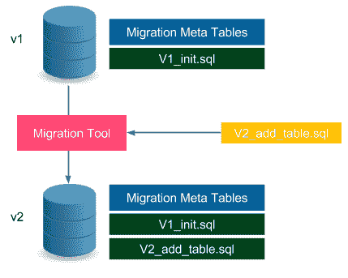
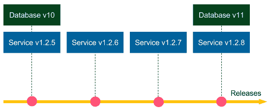
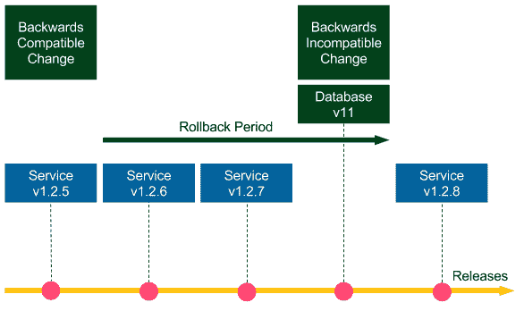
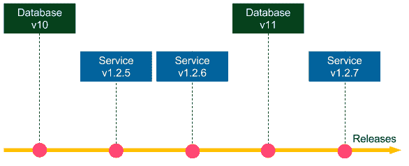
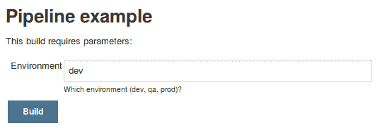
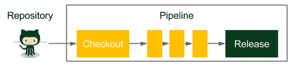
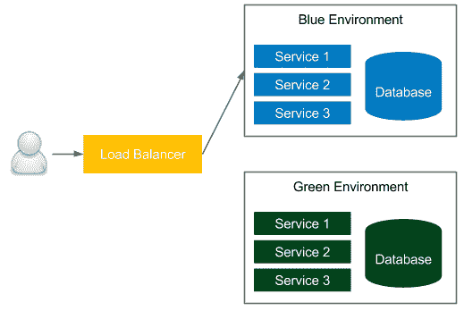

# 高级连续交付

在最后一章中，我们介绍了服务器集群是如何工作的，以及如何与 Docker 和 Jenkins 一起使用它。在本章中，我们将看到在持续交付过程中非常重要但尚未描述的不同方面的混合。

本章包括以下几点:

*   解释如何在连续交付的背景下处理数据库变更
*   介绍数据库迁移的思想和相关工具
*   探索向后兼容和向后不兼容数据库更新的不同方法
*   在詹金斯管道中使用并行步骤
*   创建詹金斯共享库
*   提出了一种回滚生产更改的方法
*   为遗留系统引入连续交付
*   探索如何准备零宕机部署
*   展示持续交付最佳实践

# 管理数据库更改

到目前为止，我们一直专注于应用于网络服务的连续交付过程。其中一个简单的部分是 web 服务本质上是无状态的。这一事实意味着，在许多情况下，它们可以很容易地更新、重启、克隆，并从给定的源代码中重新创建。然而，web 服务通常链接到它的有状态部分，这是一个对交付过程提出新挑战的数据库。这些挑战可分为以下几类:

*   **兼容性**:数据库模式和数据本身必须始终与 web 服务兼容
*   **零宕机部署**:为了实现零宕机部署，我们使用滚动更新，这意味着一个数据库必须同时兼容两个不同的 web 服务版本
*   **回滚**:数据库的回滚可能是困难的、有限的，有时甚至是不可能的，因为并非所有操作都是可逆的(例如，删除包含数据的列)
*   **测试数据**:数据库相关的变更很难测试，因为我们需要与生产非常相似的测试数据

在本节中，我将解释如何应对这些挑战，以便持续交付流程尽可能安全。

# 了解架构更新

如果你考虑交付过程，真正造成困难的不是数据本身，因为我们在部署应用程序时通常不会更改数据。数据是系统在生产中运行时收集的东西；然而，在部署期间，我们只改变存储和解释这些数据的方式。换句话说，在连续交付过程的上下文中，我们对数据库的结构感兴趣，而不是对其内容感兴趣。这就是为什么本节主要关注关系数据库(及其模式)，而较少关注其他类型的存储，如 NoSQL 数据库，那里没有结构定义。

为了更好地理解这一点，我们想到了 Redis，我们已经在本书中使用了它。它存储缓存的数据，所以它实际上是一个数据库。然而，从持续交付的角度来看，它不需要任何努力，因为它没有任何数据结构。它存储的只是键值条目，不会随着时间的推移而变化。

NoSQL databases usually don't have any restricting schema and therefore simplify the Continuous Delivery process because there is no additional schema update step required. This is a huge benefit; however, it doesn't necessarily mean that writing applications with NoSQL databases is simpler because we have put more effort into data validation in the source code.

关系数据库有静态模式。如果我们想要更改它，例如，向表中添加一个新列，我们需要编写并执行一个 SQL DDL(数据定义语言)脚本。每次变更都要手动完成，这需要大量的工作，并且会导致容易出错的解决方案，其中操作团队必须保持代码和数据库结构的同步。更好的解决方案是以增量方式自动更新模式。这样的解决方案称为数据库迁移。

# 介绍数据库迁移

数据库模式迁移是对关系数据库结构进行增量更改的过程。让我们看一下下图，以便更好地理解它:



版本 **v1** 中的数据库具有由`V1_init.sql`文件定义的模式。此外，它还存储与迁移过程相关的元数据，例如，它的当前模式版本和迁移更改日志。当我们想要更新模式时，我们以一个 SQL 文件的形式提供变更，比如`V2_add_table.sql`。然后，我们需要运行迁移工具，该工具在数据库上执行给定的 SQL 文件(它还更新元表)。实际上，数据库模式是所有后续执行的 SQL 迁移脚本的结果。接下来，我们将看到一个迁移的例子。

Migration scripts should be stored in the version control system, usually in the same repository as the source code.

迁移工具及其使用的策略可分为两类:

*   **升级和降级**:这种方式，比如 Rails 上的 Ruby 框架使用的方式，意味着我们可以向上迁移(从 v1 迁移到 v2)和向下迁移(从 v2 迁移到 v1)。它允许数据库模式回滚，这有时会导致数据丢失(如果迁移在逻辑上是不可逆的)。
*   **只升级**:这个方法，比如 Flyway 工具使用的，只允许我们向上迁移(从 v1 迁移到 v2)。在许多情况下，数据库更新是不可逆的，例如，从数据库中删除一个表。这样的更改无法回滚，因为即使我们重新创建了表，我们也已经丢失了所有数据。

市场上有许多数据库迁移工具，其中最流行的是 Flyway、Liquibase 和 Rail 迁移(来自 Ruby on Rails 框架)。作为理解这些工具如何工作的下一步，我们将看到一个基于 Flyway 工具的例子。

There are also commercial solutions provided for the particular databases, for example, Redgate (for SQL Server) and Optim Database Administrator (for DB2).

# 使用 Flyway

让我们使用 Flyway 为计算器网络服务创建一个数据库模式。数据库将存储在服务上执行的所有操作的历史记录:第一个参数、第二个参数和结果。

我们通过三个步骤展示了如何使用 SQL 数据库和 Flyway:

1.  将 Flyway 工具配置为与 Gradle 一起工作。
2.  定义 SQL 迁移脚本以创建计算历史表。
3.  在 Spring Boot 应用程序代码中使用 SQL 数据库。

# 配置飞行路线

为了与 Gradle 一起使用 Flyway，我们需要在`build.gradle`文件中添加以下内容:

```
buildscript {
   dependencies {
       classpath('com.h2database:h2:1.4.191')
    }
}
…
plugins {
   id "org.flywaydb.flyway" version "4.2.0"
}
…
flyway {
   url = 'jdbc:h2:file:/tmp/calculator'
   user = 'sa'
}
```

以下是对配置的快速评论:

*   我们使用了 H2 数据库，这是一个内存数据库(基于文件)
*   我们将数据库存储在`/tmp/calculator`文件中
*   默认的数据库用户叫做`sa`(系统管理员)

In the case of other SQL databases (for example, MySQL), the configuration would be very similar. The only difference is in the Gradle dependencies and the JDBC connection.

应用此配置后，我们应该能够通过执行以下命令来运行 Flyway 工具:

```
$ ./gradlew flywayMigrate -i
```

该命令在文件`/tmp/calculator.mv.db`中创建了数据库。显然，它没有模式，因为我们还没有定义任何东西。

Flyway can be used as a command-line tool, via Java API, or as a plugin for the popular building tools Gradle, Maven, and Ant.

# 定义 SQL 迁移脚本

下一步是定义将计算表添加到数据库模式中的 SQL 文件。让我们用以下内容创建`src/main/resources/db/migration/V1__Create_calculation_table.sql`文件:

```
create table CALCULATION (
   ID      int not null auto_increment,
   A       varchar(100),
   B       varchar(100),
   RESULT  varchar(100),
   primary key (ID)
);
```

注意迁移文件命名约定，`<version>__<change_description>.sql`。该 SQL 文件创建了一个包含四列的表:`ID`、`A`、`B`、`RESULT`。`ID`列是表中自动递增的主键。现在，我们准备运行 Flyway 命令来应用迁移:

```
$ ./gradlew flywayMigrate -i
…
Successfully applied 1 migration to schema "PUBLIC" (execution time 00:00.028s).
:flywayMigrate (Thread[Daemon worker Thread 2,5,main]) completed. Took 1.114 secs.
```

该命令自动检测到迁移文件并在数据库上执行。

The migration files should be always kept in the version control system, usually, together with the source code.

# 访问数据库

我们执行了第一次迁移，因此数据库已经准备好了。要查看完整的示例，我们还应该调整我们的项目，以便它能够访问数据库。

让我们首先配置 Gradle 依赖项，以使用 Spring Boot 项目中的 H2 数据库。我们可以通过在`build.gradle`文件中添加以下几行来做到这一点:

```
dependencies {
   compile("org.springframework.boot:spring-boot-starter-data-jpa")
   compile("com.h2database:h2")
}
```

下一步是在`src/main/resources/application.properties`文件中设置数据库位置和启动行为:

```
spring.datasource.url=jdbc:h2:file:/tmp/calculator;DB_CLOSE_ON_EXIT=FALSE
spring.jpa.hibernate.ddl-auto=validate
```

第二行意味着 Spring Boot 不会尝试从源代码模型自动生成数据库模式。相反，只有当数据库模式与 Java 模型一致时，它才会进行验证。

现在，让我们在新的`src/main/java/com/leszko/calculator/Calculation.java`文件中创建用于计算的 Java ORM 实体模型:

```
package com.leszko.calculator;
import javax.persistence.Entity;
import javax.persistence.GeneratedValue;
import javax.persistence.GenerationType;
import javax.persistence.Id;

@Entity
public class Calculation {
   @Id
   @GeneratedValue(strategy= GenerationType.AUTO)
   private Integer id;
   private String a;
   private String b;
   private String result;

   protected Calculation() {}

   public Calculation(String a, String b, String result) {
       this.a = a;
       this.b = b;
       this.result = result;
   }
}
```

实体类表示 Java 代码中的数据库映射。表表示为一个类，每列表示为一个字段。下一步是创建用于加载和存储`Calculation`实体的存储库。

让我们创建`src/main/java/com/leszko/calculator/CalculationRepository.java`文件:

```
package com.leszko.calculator;
import org.springframework.data.repository.CrudRepository;

public interface CalculationRepository extends CrudRepository<Calculation, Integer> {}
```

最后，我们可以使用`Calculation`和`CalculationRepository`类来存储计算历史。让我们将以下代码添加到`src/main/java/com/leszko/calculator/CalculatorController.java `文件中:

```
...
class CalculatorController {
   ...

   @Autowired
   private CalculationRepository calculationRepository;

   @RequestMapping("/sum")
   String sum(@RequestParam("a") Integer a, @RequestParam("b") Integer b) {
       String result = String.valueOf(calculator.sum(a, b));
       calculationRepository.save(new Calculation(a.toString(), b.toString(), result));
       return result;
   }
}
```

现在，当我们启动服务并执行`/sum`端点时，每个求和操作都被记录到数据库中。

If you would like to browse the database content, then you can add `spring.h2.console.enabled=true` to the `application.properties` file, and then browse the database via the `/h2-console` endpoint.

我们解释了数据库模式迁移是如何工作的，以及如何在用 Gradle 构建的 Spring 项目中使用它。现在，让我们看看它是如何集成到连续交付流程中的。

# 在连续交付中更改数据库

在连续交付管道中使用数据库更新的第一种方法是在迁移命令执行中添加一个阶段。这个简单的解决方案在许多情况下都可以正常工作；然而，它有两个明显的缺点:

*   **回滚**:如前所述，不可能总是回滚数据库变更(Flyway 根本不支持降级)。因此，在服务回滚的情况下，数据库变得不兼容。
*   **宕机**:服务更新和数据库更新不完全同时执行，导致宕机。

这导致我们需要解决两个制约因素:

*   数据库版本需要始终与服务版本兼容
*   数据库模式迁移是不可逆的

我们将针对两种不同的情况来解决这些限制:向后兼容的更新和不向后兼容的更新。

# 向后兼容的更改

向后兼容的更改更简单。让我们看看下图，看看它们是如何工作的:



假设模式迁移`Database v10`是向后兼容的。如果我们需要回滚`Service v1.2.8`版本，那么我们部署`Service v1.2.7`，不需要对数据库做任何事情(数据库迁移是不可逆的，所以我们保留`Database v11`)。由于模式更新是向后兼容的，`Service v.1.2.7`与`Database v11`配合使用非常好。如果我们需要回滚到`Service v1.2.6`等等，同样适用。现在，假设`Database v10`和所有其他迁移是向后兼容的，那么我们可以回滚到任何服务版本，一切都将正常工作。

停机时间也没有问题。如果数据库迁移本身是零宕机，那么我们可以先执行它，然后对服务使用滚动更新。

让我们看一个向后兼容变化的例子。我们将创建一个模式更新，向计算表中添加一个`created_at`列。迁移文件`src/main/resources/db/migration/V2__Add_created_at_column.sql`如下所示:

```
alter table CALCULATION
add CREATED_AT timestamp;
```

除了迁移脚本，计算器服务还需要`Calculation`类中的一个新字段:

```
...
private Timestamp createdAt;
...
```

我们还需要调整它的构造函数，然后调整它在`CalculatorController`类中的用法:

```
calculationRepository.save(new Calculation(a.toString(), b.toString(), result, Timestamp.from(Instant.now())));
```

运行服务后，计算历史将与`created_at`列一起存储。请注意，该更改是向后兼容的，因为即使我们恢复 Java 代码并将`created_at`列留在数据库中，一切都将完美运行(恢复的代码根本不处理新列)。

# 不向后兼容的更改

不向后兼容的变化要困难得多。查看上图，如果数据库变更 v11 向后不兼容，就不可能将服务回滚到 1.2.7。在这种情况下，我们如何处理不向后兼容的数据库迁移，从而实现回滚和零宕机部署？

长话短说，我们可以通过将一个不向后兼容的变更转换为在一定时间内向后兼容的变更来解决这个问题。换句话说，我们需要付出额外的努力，将模式迁移分成两部分:

*   现在执行向后兼容的更新，这通常意味着保留一些冗余数据
*   不向后兼容的更新在定义我们可以将代码恢复到多远的回滚时间段后执行

为了更好地说明这一点，让我们看看下图:



让我们考虑一个删除列的例子。提议的方法包括两个步骤:

1.  停止使用源代码中的列(v1.2.5，向后兼容的更新，首先执行)。
2.  从数据库中删除该列(v11，不向后兼容的更新，在回滚期后执行)。

直到`Database v11`的所有服务版本都可以回滚到任何以前的版本，从`Service v1.2.8`开始的服务只能在回滚期内回滚。这种方法听起来可能微不足道，因为我们所做的只是延迟从数据库中删除列。但是，它同时解决了回滚问题和零宕机部署问题。因此，它降低了与发布相关的风险。如果我们将回滚周期调整到合理的时间量，例如，在每天多次发布的情况下调整到两周，那么风险可以忽略不计。我们通常不会回滚很多版本。

删除一列是一个非常简单的例子。让我们看看一个更困难的场景，并在我们的计算器服务中重命名结果列。我们分几个步骤介绍如何做到这一点:

1.  向数据库添加新列。
2.  更改代码以使用两列。
3.  合并两列中的数据。
4.  从代码中移除旧列。
5.  从数据库中删除旧列。

# 向数据库添加新列

假设我们需要将`result`列重命名为`sum`。第一步是添加一个重复的新列。我们必须创建一个`src/main/resources/db/migration/V3__Add_sum_column.sql`迁移文件:

```
alter table CALCULATION
add SUM varchar(100);
```

因此，在执行迁移之后，我们有两列:`result`和`sum`。

# 更改代码以使用两列

下一步是重命名源代码模型中的列，并将这两个数据库列用于 set 和 get 操作。我们可以在`Calculation`类中更改它:

```
public class Calculation {
    ...
    private String sum;
    ...
    public Calculation(String a, String b, String sum, Timestamp createdAt) {
        this.a = a;
        this.b = b;
        this.sum = sum;
        this.result = sum;
        this.createdAt = createdAt;
    }

    public String getSum() {
        return sum != null ? sum : result;
    }
}
```

To be 100% accurate, in the `getSum()` method, we should compare something like the last modification column date (not exactly necessary to always take the new column first).

从现在开始，每次我们向数据库中添加一行，相同的值都会写入`result`和`sum`列。在阅读`sum`时，我们首先检查它是否存在于新的栏目中，如果不存在，我们从旧的栏目中阅读它。

The same result can be achieved with the use of database triggers that would automatically write the same values into both columns.

到目前为止，我们所做的所有更改都是向后兼容的，因此我们可以随时将服务回滚到我们想要的任何版本。

# 合并两列中的数据

这一步通常在发布稳定一段时间后进行。我们需要将数据从旧的`result`列复制到新的`sum`列。让我们创建一个名为`V4__Copy_result_into_sum_column.sql`的迁移文件:

```
update CALCULATION
set CALCULATION.sum = CALCULATION.result
where CALCULATION.sum is null;
```

我们仍然没有回滚的限制；但是，如果我们需要在步骤 2 中的更改之前部署版本，那么需要重复这个数据库迁移。

# 从代码中移除旧列

此时，我们已经有了新列中的所有数据，因此我们可以开始使用它，而不用数据模型中的旧列。为此，我们需要移除`Calculation`类中与`result`相关的所有代码，这样看起来如下:

```
public class Calculation {
    ...
    private String sum;
    ...
    public Calculation(String a, String b, String sum, Timestamp createdAt) {
        this.a = a;
        this.b = b;
        this.sum = sum;
        this.createdAt = createdAt;
    }

    public String getSum() {
        return sum;
    }
}
```

此操作后，我们不再使用代码中的`result`列。请注意，直到第 2 步，此操作都是向后兼容的。如果我们需要回滚到步骤 1，那么我们可能会丢失该步骤后存储的数据。

# 从数据库中删除旧列

最后一步是从数据库中删除旧列。当我们确定不需要在步骤 4 之前回滚时，应该在回滚期之后执行此迁移。

The rollback period can be very long since we aren't using the column from the database anymore. This task can be treated as a cleanup task, so even though it's non-backwards-compatible, there is no associated risk.

让我们添加最终迁移，`V5__Drop_result_column.sql`:

```
alter table CALCULATION
drop column RESULT;
```

经过这一步，我们最终完成了列重命名过程。请注意，我们所做的只是将操作稍微复杂化一点，以便及时扩展。这降低了向后不兼容的数据库更改的风险，并允许零宕机部署。

# 将数据库更新与代码更改分开

到目前为止，在所有的图中，我们展示了数据库迁移是与服务版本一起运行的。换句话说，每次提交(这意味着每次发布)都会进行数据库更改和代码更改。但是，推荐的方法是明确区分对存储库的提交是数据库更新还是代码更改。下图显示了该方法:



数据库服务变更分离的好处是我们可以免费获得向后兼容性检查。假设更改 v11 和 v1.2.7 涉及一个逻辑更改，例如，向数据库添加一个新列。然后，我们首先提交数据库 v11，因此连续交付管道中的测试检查数据库 v11 是否与服务 v.1.2.6 正确工作。换句话说，它们检查数据库更新 v11 是否向后兼容。然后，我们提交 v1.2.7 更改，因此管道会检查数据库 v11 是否可以正常使用服务 v1.2.7。

The database-code separation does not mean that we must have two separate Jenkins pipelines. The pipeline can always execute both, but we should keep it as a good practice that a commit is either a database update or a code change.

总而言之，数据库模式的更改永远不应该手动完成。相反，我们应该始终使用迁移工具来自动化它们，作为连续交付管道的一部分来执行。我们还应该避免不向后兼容的数据库更新，确保这一点的最好方法是将数据库和代码更改分别提交到存储库中。

# 避免共享数据库

在许多系统中，我们可以发现数据库成为多个服务之间共享的中心点。在这种情况下，对数据库的任何更新都变得更具挑战性，因为我们需要在所有服务之间进行协调。

例如，假设我们开发了一个在线商店，我们有一个 Customers 表，该表包含以下列:名字、姓氏、用户名、密码、电子邮件和折扣。有三种服务对客户的数据感兴趣:

*   **档案管理器**:可以编辑用户数据
*   **结账处理器**:处理结账(读取用户名和邮件)
*   **折扣经理**:分析客户的订单，设置合适的折扣

让我们看看下面这张呈现这种情况的图片:


它们依赖于相同的数据库模式。这种方法至少有两个问题:

*   当我们想要更新模式时，它必须与所有三个服务兼容。虽然所有向后兼容的更改都没问题，但是任何不向后兼容的更新都变得更加困难甚至不可能。
*   每项服务都有单独的交付周期和连续交付管道。那么，我们应该使用哪条管道进行数据库模式迁移呢？不幸的是，这个问题没有好的答案。

由于前面提到的原因，每个服务都应该有自己的数据库，并且服务应该通过它们的 API 进行通信。按照我们的示例，我们可以应用以下重构:

*   结账处理器应该与配置文件管理器的应用编程接口通信，以获取客户的数据
*   折扣列应该提取到一个单独的数据库(或模式)中，折扣管理器应该获得所有权

重构版本如下图所示:


这种方法符合微服务架构的原则，并且应该始终应用。通过 API 的通信比直接数据库访问更加灵活。

In the case of monolithic systems, a database is usually the integration point. Since such an approach causes a lot of issues, it's considered as an anti-pattern.

# 准备测试数据

我们已经介绍了数据库迁移，作为副作用，它可以保持环境之间的数据库模式一致。这是因为，如果我们在开发机器上、在临时环境中或在生产环境中运行相同的迁移脚本，那么我们将总是在相同的模式中得到结果。但是，表内的数据值不同。我们如何准备测试数据，以便有效地测试我们的系统？这是本节的主题。

这个问题的答案取决于测试的类型，对于单元测试、集成/验收测试和性能测试是不同的。让我们检查每个案例。

# 单元测试

在单元测试的情况下，我们不使用真实的数据库。我们要么在持久性机制(存储库、数据访问对象)的层次上模拟测试数据，要么用内存中的数据库(例如，H2 数据库)模拟真实的数据库。由于单元测试是由开发人员创建的，确切的数据值通常是由开发人员发明的，它们并不重要。

# 集成/验收测试

集成和验收测试通常使用测试/试运行数据库，该数据库应该尽可能类似于产品。许多公司采用的一种方法是将生产数据快照到分段中，以保证数据完全相同。但是，这种方法被视为反模式，原因如下:

*   **测试隔离**:每个测试都在同一个数据库上运行，所以一个测试的结果可能会影响其他测试的输入
*   **数据安全**:生产实例通常存储敏感信息，因此安全性更高
*   **再现性**:每次抓拍后，测试数据都不一样，可能会出现片状测试

由于上述原因，首选的方法是通过选择生产数据的子集，与客户或业务分析师一起手动准备测试数据。当生产数据库增长时，值得重新审视其内容，看看是否有任何合理的案例需要添加。

向临时数据库添加数据的最佳方式是使用服务的公共应用编程接口。这种方法与验收测试是一致的，验收测试通常是黑盒测试。此外，使用应用编程接口保证了数据本身的一致性，并通过限制直接数据库操作简化了数据库重构。

# 性能试验

性能测试的测试数据通常类似于验收测试。一个显著的区别是数据量。为了正确测试性能，我们需要提供足够的输入数据量，至少与生产中可用的数据量一样大(在高峰时间)。为此，我们可以创建数据生成器，这些生成器通常在验收测试和性能测试之间共享。

# 管道模式

我们已经知道启动一个项目和与詹金斯和多克建立持续交付管道所必需的一切。本节旨在通过一些推荐的常规詹金斯管道实践来扩展这一知识。

# 并行化管道

在本书中，我们总是按顺序、一步一步地执行管道。这种方法很容易推理出状态和构建的结果。如果首先是验收测试阶段，然后是发布阶段，这意味着在验收测试成功之前，发布永远不会发生。顺序管道很容易理解，通常不会引起任何意外。这就是为什么解决任何问题的第一个方法是按顺序做。

然而，在某些情况下，这些阶段非常耗时，值得并行运行。一个很好的例子是性能测试。它们通常需要很多时间，所以假设它们是独立的和孤立的，并行运行它们是有意义的。在 Jenkins 中，我们可以在两个不同的级别上并行化管道:

*   **并行步骤**:在一个阶段内，并行进程在同一个代理上运行。这种方法很简单，因为所有与 Jenkins 工作区相关的文件都位于一台物理机器上，但是，与垂直扩展一样，资源仅限于该台机器。
*   **并行阶段**:每个阶段可以在单独的代理机器上并行运行，代理机器提供资源的水平扩展。如果另一台物理机上需要前一阶段创建的文件，我们需要注意环境之间的文件传输(使用`stash` Jenkinsfile 关键字)。

By the time of writing this book, parallel stages are not available in the declarative pipeline. The feature is supposed to be added in Jenkins Blue Ocean v1.3\. In the meantime, the only possibility is to use the deprecated feature in the Groovy-based scripting pipeline, as described here at [https://jenkins.io/doc/book/pipeline/jenkinsfile/#executing-in-parallel](https://jenkins.io/doc/book/pipeline/jenkinsfile/#executing-in-parallel).

让我们看看它在实践中的样子。如果我们想并行运行两个步骤，那么 Jenkinsfile 脚本应该如下所示:

```
pipeline {
   agent any
   stages {
       stage('Stage 1') {
           steps {
               parallel (
                       one: { echo "parallel step 1" },
                       two: { echo "parallel step 2" }
               )
           }
       }
       stage('Stage 2') {
           steps {
               echo "run after both parallel steps are completed"   
           }
       }
   }
}
```

在`Stage 1`中，使用`parallel`关键字，我们执行两个并行的步骤，`one`和`two`。请注意，`Stage 2`只有在两个并行步骤完成后才会执行。这就是为什么这样的解决方案并行运行测试是完全安全的；我们始终可以确保只有在所有并行测试都通过之后，部署阶段才会运行。

There is a very useful plugin called `Parallel Test Executor` that helps to automatically split tests and run them in parallel. Read more at [https://jenkins.io/doc/pipeline/steps/parallel-test-executor/](https://jenkins.io/doc/pipeline/steps/parallel-test-executor/).

前面的描述涉及并行步骤级别。另一种解决方案是使用并行阶段，因此在单独的代理机器上运行每个阶段。决定使用哪种类型的并行通常取决于两个因素:

*   代理机器有多强大
*   给定的阶段需要多少时间

作为一般建议，单元测试可以并行运行，但是性能测试通常最好在不同的机器上运行。

# 重用管道组件

当 Jenkinsfile 脚本变得越来越大，越来越复杂时，我们可能希望在类似的管道之间重用它的部分。

例如，我们可能希望为不同的环境(开发、质量保证、生产)提供独立但相似的管道。微服务领域的另一个常见例子是，每个服务都有一个非常相似的詹金斯文件。那么，我们如何编写 Jenkinsfile 脚本，使我们不会再次重复相同的代码呢？为此，有两种很好的模式，参数化构建和共享库。让我们一个一个地描述它们。

# 构建参数

我们已经在[第四章](04.html)、*持续集成管道*中提到，管道可以有输入参数。我们可以使用它们为不同的用例提供相同的管道代码。例如，让我们创建一个用环境类型参数化的管道:

```
pipeline {
   agent any

   parameters {
       string(name: 'Environment', defaultValue: 'dev', description: 'Which 
         environment (dev, qa, prod)?')
   }

   stages {
       stage('Environment check') {
           steps {
               echo "Current environment: ${params.Environment}"   
           }
       }
   }
}
```

构建采用一个输入参数`Environment`。然后，我们在这一步所做的就是打印参数。我们还可以添加一个条件，为不同的环境执行不同的代码。

使用这种配置，当我们开始构建时，我们将看到输入参数的提示，如下所示:



参数化构建有助于在场景中重用管道代码，只要它有一点点不同。然而，这个特性不应该被过度使用，因为太多的条件会使詹金斯文件难以理解。

# 共享库

重用管道的另一个解决方案是将其零件提取到共享库中。

共享库是作为单独的源代码控制项目存储的 Groovy 代码。这段代码以后可以在许多 Jenkinsfile 脚本中用作管道步骤。为了说清楚，我们来看一个例子。共享库技术总是需要三个步骤:

1.  创建共享库项目。
2.  在 Jenkins 中配置共享库。
3.  使用詹金斯文件中的共享库。

# 创建共享库项目

我们从创建一个新的 Git 项目开始，在这个项目中我们放入了共享库代码。每个 Jenkins 步骤都表示为位于`vars`目录中的 Groovy 文件。

让我们创建一个`sayHello`步骤，该步骤采用`name`参数并回显一条简单的消息。这应该存储在`vars/sayHello.groovy`文件中:

```
/**
* Hello world step.
*/
def call(String name) {   
   echo "Hello $name!"
}
```

Human-readable descriptions for shared library steps can be stored in the `*.txt` files. In our example, we could add the `vars/sayHello.txt` file with the step documentation.

当库代码完成后，我们需要将其推送到存储库，例如，作为一个新的 GitHub 项目。

# 在 Jenkins 中配置共享库

下一步是在 Jenkins 中注册共享库。我们打开管理詹金斯|配置系统，并找到全局管道库部分。在这里，我们可以添加一个库，给它一个选定的名称，如下所示:


我们指定了注册库的名称和库存储库地址。请注意，库的最新版本将在管道构建期间自动下载。

We presented importing the Groovy code as *Global Shared Library*, but there are also other alternative solutions. Read more at [https://jenkins.io/doc/book/pipeline/shared-libraries/](https://jenkins.io/doc/book/pipeline/shared-libraries/).

# 在詹金斯文件中使用共享库

最后，我们可以在 Jenkinsfile 脚本中使用共享库。

让我们看一下这个例子:

```
pipeline {
   agent any
   stages {
       stage("Hello stage") {
           steps {
           sayHello 'Rafal'
         }
       }
   }
}
```

If "Load implicitly" hadn't been checked in the Jenkins configuration, then we would need to add "`@Library('example') _`" at the beginning of the Jenkinsfile script.

如您所见，我们可以将 Groovy 代码用作管道步骤`sayHello`。显然，管道构建完成后，在控制台输出中，我们应该会看到`Hello Rafal!`。

Shared libraries are not limited to one step. Actually, with the power of the Groovy language, they can even act as templates for entire Jenkins pipelines.

# 回滚部署

我记得我的同事，一个资深架构师的话<q>你不需要更多的 QAs，你需要更快的回滚</q>。虽然这种说法过于简单，质量保证团队往往很有价值，但这句话有很多道理。想一想；如果你在生产中引入了一个 bug，但是在第一个用户报告错误后很快就回滚了，那么通常不会发生什么不好的事情。另一方面，如果生产错误很少，但没有应用回滚，那么调试生产的过程通常会在漫长的不眠之夜和大量不满意的用户中结束。这就是为什么我们需要在创建詹金斯管道时提前考虑回滚策略。

在连续交付的情况下，有两个可能发生故障的时刻:

*   在发布过程中，在管道执行中
*   管道建成后，在生产中

第一个场景非常简单，没有恶意。它涉及的情况是，应用程序已经部署到生产中，但是下一个阶段失败了，例如，冒烟测试。然后，我们所需要做的就是在`failure`案例的`post`管道部分执行一个脚本，它将生产服务降级到旧的 Docker 映像版本。如果我们使用蓝绿色部署(如本章后面所述)，任何停机的风险都是最小的，因为我们通常在冒烟测试之后执行负载平衡器切换作为最后一个管道阶段。

第二种情况，当我们在管道成功完成后注意到一个生产错误时，会更加困难，需要一些注释。这里的规则是，我们应该始终使用与标准发布完全相同的过程来发布回滚的服务。否则，如果我们试图以更快的方式手动做一些事情，我们就是在自找麻烦。任何非竞争性的任务都是有风险的，尤其是在压力下，当生产出问题时。

As a side note, if the pipeline completes successfully but there is a production bug, then it means that our tests are not good enough. So, the first thing after rollback is to extend the unit/acceptance test suites with the corresponding scenarios.

最常见的连续交付过程是一个完全自动化的管道，从检查代码开始，到发布到生产结束。

下图展示了其工作原理:



在本书中，我们已经介绍了经典的连续交付管道。如果回滚应该使用完全相同的过程，那么我们需要做的就是从存储库中恢复最新的代码更改。因此，管道会自动构建、测试并最终发布正确的版本。

Repository reverts and emergency fixes should never skip the testing stages in the pipeline. Otherwise, we may end up with a release that is still not working correctly because of another issue that makes debugging even harder.

解决方案非常简单优雅。唯一的缺点是我们需要花费在整个管道构建上的停机时间。如果我们使用蓝绿色部署或加那利版本，可以避免这种停机，在这种情况下，我们只需更改负载平衡器设置来处理健康的环境。

在协调发布的情况下，回滚操作变得更加复杂，在此期间，许多服务被同时部署。这就是为什么精心编排的发布被视为反模式的原因之一，尤其是在微服务领域。正确的方法是始终保持向后兼容性，至少在一段时间内是这样(就像我们在本章开头介绍的数据库一样)。然后，可以独立发布每个服务。

# 添加手动步骤

一般来说，连续交付管道应该是完全自动化的，通过提交到存储库来触发，并在发布后结束。然而，有时我们无法避免手动步骤。最常见的例子是发布批准，这意味着该过程是完全自动化的，但是有一个手动步骤来批准新的发布。另一个常见的例子是手动测试。其中一些可能存在，因为我们在遗留系统上操作；当测试无法自动化时，可能会出现其他一些问题。不管是什么原因，有时候别无选择，只能增加一个手动步骤。

Jenkins 语法为手动步骤提供了一个关键字`input`:

```
stage("Release approval") {
   steps {
       input "Do you approve the release?"
   }
}
```

管道将在`input`步骤停止执行，并等待手动批准。

请记住，手动步骤很快会成为交付过程中的瓶颈，这就是为什么它们应该始终被视为不如完全自动化的解决方案。

It is sometimes useful to set a timeout for the input in order to avoid waiting forever for the manual interaction. After the configured time is elapsed, the whole pipeline is aborted.

# 发布模式

在最后一节中，我们讨论了 Jenkins 管道模式，这些模式用于加快构建执行(并行步骤)、帮助代码重用(共享库)、限制生产错误的风险(回滚)以及处理手动批准(手动步骤)。本节介绍下一组模式，这次与发布过程相关。它们旨在降低将产品更新到新软件版本的风险。

我们已经在[第 8 章](08.html)、*和 Docker Swarm* 中描述了发布模式之一，滚动更新。在这里，我们再展示两个:蓝绿色部署和金丝雀版本。

# 蓝绿色部署

蓝绿色部署是一种减少与发布相关的停机时间的技术。它涉及两个相同的生产环境，一个称为绿色，另一个称为蓝色，如下图所示:



在图中，当前可访问的环境是蓝色的。如果我们想发布一个新版本，那么我们将所有的东西都部署到绿色环境中，并且在发布过程结束时，将负载平衡器更改为绿色环境。结果，用户突然开始使用新版本。下一次我们想要发布时，我们对蓝色环境进行更改，最后，我们将负载平衡器更改为蓝色。我们每次都是这样，从一个环境切换到另一个环境。

The blue-green deployment technique works correctly with two assumptions: environment isolation and no orchestrated releases.

这种解决方案有两大优势:

*   **零停机**:从用户角度来看所有的停机都是换负荷平衡开关的瞬间，可以忽略不计
*   **回滚**:为了回滚一个版本，把负载均衡交换机蓝绿色部署改回来就够了，包括:
*   **数据库**:在回滚的情况下，模式迁移可能会很棘手，因此使用本章开头介绍的模式是值得的
*   **事务**:正在运行的数据库事务必须移交给新的数据库
*   **冗余基础设施/资源**:我们需要双倍的资源

有一些技术和工具可以克服这些挑战，因此蓝绿色的部署模式在 IT 行业中得到高度推荐和广泛使用。

You can read more about the blue-green deployment technique on the excellent Martin Fowler's blog [https://martinfowler.com/bliki/BlueGreenDeployment.html](https://martinfowler.com/bliki/BlueGreenDeployment.html).

# 金丝雀释放

Canary releasing 是一种降低引入新版本软件相关风险的技术。与蓝绿色部署类似，它使用两个相同的环境，如下图所示:


此外，与蓝绿色部署技术类似，发布过程从在当前未使用的环境中部署新版本开始。然而，相似之处到此结束。负载平衡器不是切换到新环境，而是设置为仅将选定的用户组链接到新环境。其余的仍然使用旧版本。这样，一个新的版本可以被一些用户测试，如果出现错误，只有一小部分人会受到影响。测试期结束后，所有用户都切换到新版本。

这种方法有一些巨大的好处:

*   **验收和性能测试**:如果验收和性能测试很难在试运行环境中运行，那么可以在生产中进行测试，最大限度地减少对一小部分用户的影响。
*   **简单回滚**:如果新的变更导致失败，那么回滚是通过将所有用户切换回旧版本来完成的。
*   **A/B 测试**:如果我们不确定新版本是比 UX 好还是性能角度好，那就有可能和老版本比较。

加那利释放与蓝绿色部署有相同的缺点。另一个挑战是我们有两个生产系统同时运行。尽管如此，金丝雀释放是大多数公司用来帮助发布和测试的优秀技术。

You can read more about the canary releasing technique on the excellent Martin Fowler's blog [https://martinfowler.com/bliki/CanaryRelease.html](https://martinfowler.com/bliki/CanaryRelease.html).

# 使用遗留系统

到目前为止，我们所描述的一切顺利地适用于绿地项目，对于这些项目来说，建立连续交付管道相对简单。

然而，遗留系统更具挑战性，因为它们通常依赖于手动测试和手动部署步骤。在本节中，我们将逐步介绍将连续交付应用于遗留系统的推荐场景。

作为第零步，我推荐阅读迈克尔·费哲的优秀书籍《有效使用遗留代码》。他关于如何处理测试、重构和添加新特性的想法，消除了大多数关于如何自动化遗留系统交付过程的担忧。

For many developers, it may be tempting to completely rewrite a legacy system, rather than refactor it. While the idea is interesting from a developer's perspective, it is usually a bad business decision that results in product failure. You can read more about the history of rewriting the Netscape browser in an excellent blog post by Joel Spolsky, *Things You Should Never Do,* at [https://www.joelonsoftware.com/2000/04/06/things-you-should-never-do-part-i](https://www.joelonsoftware.com/2000/04/06/things-you-should-never-do-part-i).

应用连续交付过程的方式在很大程度上取决于当前项目的自动化、使用的技术、硬件基础设施和当前的发布过程。通常，它可以分为三个步骤:

1.  自动化构建和部署。
2.  自动化测试。
3.  重构和引入新特性。

让我们详细看看它们。

# 自动化构建和部署

第一步包括自动化部署过程。好消息是，在我使用过的大多数遗留系统中，已经有了一些自动化，例如，以 shell 脚本的形式。

无论如何，自动化部署的活动包括以下内容:

*   **构建和打包**:一些自动化通常已经以 Makefile、Ant、Maven、任何其他构建工具配置或自定义脚本的形式存在。
*   **数据库迁移**:我们需要开始以增量方式管理数据库模式。它需要将当前模式作为初始迁移，并使用诸如 Flyway 或 Liquibase 之类的工具进行所有进一步的更改，正如本章已经描述的那样。
*   **部署**:即使部署过程完全是手动的，那么通常也会有文本/wiki 页面描述需要转换成自动化脚本。
*   **可重复配置**:在遗留系统中，配置文件通常是手动更改的。我们需要提取配置并使用配置管理工具，如[第 6 章](06.html)、*使用 Ansible* 进行配置管理中所述。

在前面的步骤之后，我们可以将所有内容放入一个部署管道中，并在一个手动 UAT(用户验收测试)周期之后将其用作一个自动化阶段。

从过程的角度来看，更频繁地开始发布是值得的。例如，如果发布是一年一次，试着每季度发布一次，然后每月发布一次。对这一因素的推动将导致更快的自动化交付采用。

# 自动化测试

下一步通常要困难得多，就是为系统准备自动化测试。它需要与质量保证团队沟通，以便了解他们当前如何测试软件，这样我们就可以将所有东西都转移到自动化验收测试套件中。这个阶段需要两个步骤:

*   **验收/健全性测试套件**:我们需要添加自动化测试，以替代 QA 团队的一些回归活动。根据系统的不同，它们可以作为黑盒硒测试或黄瓜测试提供。
*   **(虚拟)测试环境**:在这一点上，我们应该已经想到了我们的测试将要运行的环境。通常，节省资源和限制所需机器数量的最佳解决方案是使用 float 或 Docker 虚拟化测试环境。

最终目标是拥有一个自动化的验收测试套件，它将取代开发周期中的整个 UAT 阶段。然而，我们可以从一个健全性测试开始，该测试将很快从回归的角度检查系统是否正确。

While adding test scenarios, remember that the test suite should execute in reasonable time. For sanity tests, it is usually less than 10 minutes.

# 重构和引入新功能

当我们至少有了基本的回归测试套件时，我们就可以添加新的特性并重构旧的代码了。一步一步地以小块的方式来做总是更好，因为一次重构所有东西通常会导致混乱，导致生产失败(与任何特定的变化都没有明显的关系)。

该阶段通常包括以下活动:

*   **重构**:开始重构旧代码最好的地方就是新特性被期待的地方。这样开始，我们为即将到来的新特性请求做好了准备。
*   **重写**:如果我们计划重写部分旧代码，应该从最难测试的代码开始。这样，我们不断增加项目中的代码覆盖率。
*   **引入新特性**:在新特性实现过程中，值得使用**特性切换**模式。然后，万一有什么不好的事情发生，我们可以迅速关闭新功能。实际上，在重构过程中应该使用相同的模式。

For this phase, it's worth reading an excellent book by *Martin Fowler*, *Refactoring: Improving the Design of Existing Code*.

在接触旧代码时，最好遵循这样的规则:总是先添加一个通过的单元测试，然后再更改代码。通过这种方法，我们可以依靠自动化来检查我们没有偶然改变业务逻辑。

# 理解人的因素

在将自动化交付过程引入遗留系统时，您可能会比其他任何地方都更能感受到人的因素。为了自动化构建过程，我们需要与运营团队进行良好的沟通，他们必须愿意分享他们的知识。同样的故事也适用于手工 QA 团队；他们需要参与编写自动化测试，因为只有他们知道如何测试软件。如果您考虑一下，运营和质量保证团队都需要为项目做出贡献，这些项目将在以后使他们的工作自动化。在某个时候，他们可能会意识到他们在公司的未来并不稳定，并且变得不那么有帮助。许多公司难以引入连续交付流程，因为团队不想参与得太多。

在本节中，我们讨论了如何处理遗留系统及其带来的挑战。如果您正在将您的项目和组织转换为连续交付方法，那么您可能想看一看连续交付成熟度模型，它旨在为采用自动化交付的过程提供结构。

A good description of the Continuous Delivery Maturity Model can be found at [https://developer.ibm.com/urbancode/docs/continuous-delivery-maturity-model/](https://developer.ibm.com/urbancode/docs/continuous-delivery-maturity-model/).

# 练习

在本章中，我们已经介绍了连续交付流程的各个方面。既然熟能生巧，我们推荐以下练习:

1.  使用 Flyway 在 MySQL 数据库中创建不向后兼容的更改:

    *   使用官方 Docker 图像`mysql`启动数据库
    *   使用正确的数据库地址、用户名和密码配置 Flyway
    *   创建一个初始迁移，创建一个具有三列的`users`表:`id`、`email`和`password`
    *   向表中添加示例数据
    *   将`password`列更改为`hashed_password`，这将存储散列的密码
    *   按照本章所述，将不向后兼容的变更分为三次迁移
    *   您可以使用 MD5 或 SHA 进行哈希运算
    *   因此，检查数据库是否没有以纯文本形式存储密码
2.  创建一个 Jenkins 共享库，包含构建和单元测试 Gradle 项目的步骤:
    *   为库创建单独的存储库
    *   在库中创建两个文件:`gradleBuild.groovy`和`gradleTest.groovy`
    *   写出适当的`call`方法
    *   将库添加到詹金斯
    *   在管道中使用库中的步骤

# 摘要

本章混合了以前没有涉及的各种连续交付方面。本章的要点如下:

*   数据库是大多数应用程序的重要组成部分，因此应该包含在连续交付过程中。
*   数据库模式更改存储在版本控制系统中，并由数据库迁移工具管理。
*   有两种类型的数据库模式更改:向后兼容和向后不兼容。虽然第一种类型很简单，但第二种类型需要一些开销(随着时间的推移分成多个迁移)。
*   数据库不应该是整个系统的中心点。首选的解决方案是为每个服务提供自己的数据库。
*   交付过程应该始终为回滚场景做好准备。
*   应该始终考虑三种发布模式:滚动更新、蓝绿色部署和加那利发布
*   遗留系统可以通过小步骤转换为连续交付流程，而不是一次全部转换。

# 最佳实践

谢谢你读这本书。我希望您已经准备好将持续交付方法引入您的信息技术项目。作为本书的最后一部分，我提出了一个连续交付实践的 10 大清单。好好享受！

# 练习 1–在团队中拥有流程！

在团队中拥有从接收需求到监控生产的整个过程。就像曾经说过的:<q>一个运行在开发者机器上的程序是赚不到钱的。</q>这就是为什么拥有一个完整的产品所有权的小型 DevOps 团队非常重要。事实上，这是 DevOps -开发和运营自始至终的真正含义:

*   拥有持续交付管道的每个阶段:如何构建软件，验收测试中有什么要求，以及如何发布产品。
*   避免有管道专家！团队中的每个成员都应该参与创建管道。
*   找到一个在团队成员之间共享当前管道状态(和生产监控)的好方法。最有效的解决方案是团队空间的大屏幕。
*   如果开发人员、质量保证和信息技术运营工程师是独立的专家，那么确保他们在一个敏捷团队中一起工作。基于专业知识的独立团队导致对产品不负任何责任。
*   请记住，给予团队自主权会带来高工作满意度和出色的参与度。这导致了伟大的产品！

# 练习 2–自动化所有事情！

自动化从业务需求(以验收测试的形式)到部署过程的一切。手动描述、带有说明步骤的维基页面，它们都很快变得过时，并导致部落知识，使过程缓慢、繁琐和不可靠。这反过来又导致了发布彩排的需要，并使每个部署都是独特的。不要走这条路！通常，如果你第二次做任何事情，自动化它:

*   消除所有手动步骤；它们是错误的来源！整个过程必须是可重复和可靠的。
*   不要直接在生产中做任何改变！请改用配置管理工具。
*   使用完全相同的机制部署到每个环境。
*   始终包括自动烟雾测试，以检查发布是否成功完成。
*   使用数据库模式迁移来自动化数据库更改。
*   使用自动维护脚本进行备份和清理。不要忘记删除未使用的 Docker 图像！

# 练习 3–版本一切！

版本化一切:软件源代码、构建脚本、自动化测试、配置管理文件、连续交付管道、监控脚本、二进制文件和文档。简单的一切。使您的工作基于任务，其中每个任务都导致提交到存储库，无论它是否与需求收集、架构设计、配置或软件开发相关。任务开始于敏捷板，结束于存储库。这样，你对历史和变化的原因保持一个单一的真理点:

*   严格控制版本。一切都意味着一切！
*   将源代码和配置保存在代码存储库中，将二进制文件保存在工件存储库中，将任务保存在敏捷问题跟踪工具中。
*   将持续交付管道开发为代码。
*   使用数据库迁移并将它们存储在存储库中。
*   以可版本控制的标记文件的形式存储文档。

# 练习 4–使用商业语言进行验收测试！

使用面向业务的语言进行验收测试，以改善相互沟通和对需求的共同理解。与产品所有者密切合作，创造埃里克·埃文所说的无处不在的语言“T1”，这是商业和技术之间的通用方言。误解是大多数项目失败的根本原因:

*   创建一种通用语言并在项目中使用它。
*   使用验收测试框架，如黄瓜或 FitNesse，帮助业务团队理解并让他们参与进来。
*   在验收测试中表达业务价值，在开发过程中不要忘记它们。很容易在不相关的话题上花太多时间！
*   改进和维护验收测试，以便它们总是作为回归测试。
*   确保每个人都知道，通过验收测试套件意味着业务部门同意发布软件。

# 练习 5–准备好回滚！

准备好回滚；迟早你需要做这件事。请记住，您不需要更多的 QAs，您需要更快的回滚。如果在生产中出现任何问题，您首先要做的是谨慎行事，回到上一个工作版本:

*   制定一个回滚策略，以及系统关闭时该做什么的过程
*   将不向后兼容的数据库更改拆分为兼容的更改
*   对于回滚和标准发布，始终使用相同的交付流程
*   考虑引入蓝绿色部署或加那利版本
*   不要怕 bug，反应快用户就不会离开你！

# 实践 6–不要低估人的影响

不要低估人的影响。它们通常比工具更重要。如果信息技术运营团队不帮助您，您将无法实现交付自动化。毕竟，他们了解当前的流程。这同样适用于质量保证、业务和所有相关人员。让他们变得重要和参与:

*   让质量保证和信息技术运营成为 DevOps 团队的一部分。你需要他们的知识和技能！
*   为当前正在进行手动活动的成员提供培训，以便他们能够转向自动化。
*   比起等级和秩序，更喜欢非正式的交流和扁平的组织结构。没有善意你什么都不会做！

# 实践 7–建立可追溯性！

建立交付过程和工作系统的可追溯性。没有什么比没有任何日志消息的失败更糟糕的了。监控请求的数量、延迟、生产服务器的负载、连续交付管道的状态，以及您能想到的有助于您分析当前软件的一切。积极主动！在某些时候，您需要检查统计数据和日志:

*   记录管道活动！在失败的情况下，用一个信息性的消息通知团队。
*   对正在运行的系统进行适当的记录和监控。
*   使用专门的工具进行系统监控，如 Kibana、Grafana 或 Logmatic.io。
*   将生产监控集成到您的开发生态系统中。考虑在公共团队空间中使用具有当前生产统计数据的大屏幕。

# 练习 8–经常整合！

经常整合，其实一直都是！就像有人说的:*持续的次数比你想象的多*。没有什么比解决合并冲突更令人沮丧的了。持续集成更多的是团队实践，而不是工具。每天至少几次将代码集成到一个代码库中。忘掉持久的特征分支和大量的局部变化。基于主干的开发和功能切换的胜利！

*   使用基于主干的开发和功能切换，而不是功能分支。
*   如果你需要一个分支或者局部的改变，确保你每天至少和团队的其他成员整合一次。
*   始终保持躯干健康；确保在合并到基线之前运行测试。
*   每次提交到存储库后运行管道，以实现快速反馈周期。

# 练习 9–只构建一次二进制文件！

只构建一次二进制文件，并在每个环境中运行相同的二进制文件。无论它们是 Docker 映像还是 JAR 包的形式，只构建一次就消除了各种环境引入差异的风险。它还节省了时间和资源:

*   构建一次并在环境之间传递相同的二进制文件。
*   使用工件存储库来存储和版本化二进制文件。不要为此目的使用源代码库。
*   将配置外部化，并使用配置管理工具来引入环境之间的差异。

# 练习 10–经常释放！

经常发布，最好是在每次提交到存储库之后。俗话说*疼就多做。*释放作为日常的例行公事，让这个过程变得可预测和平静。远离被困在难得的释放习惯中。那只会变得更糟，你最终会得到一年一次的释放，有三个月的准备期！

*   将你对完成的定义改写为*完成意味着释放*。掌控整个过程！
*   使用功能切换隐藏(对用户)仍在进行的功能。
*   使用加那利版本和快速回滚来降低生产中出现 bug 的风险。
*   采用零宕机部署策略，实现频繁发布。