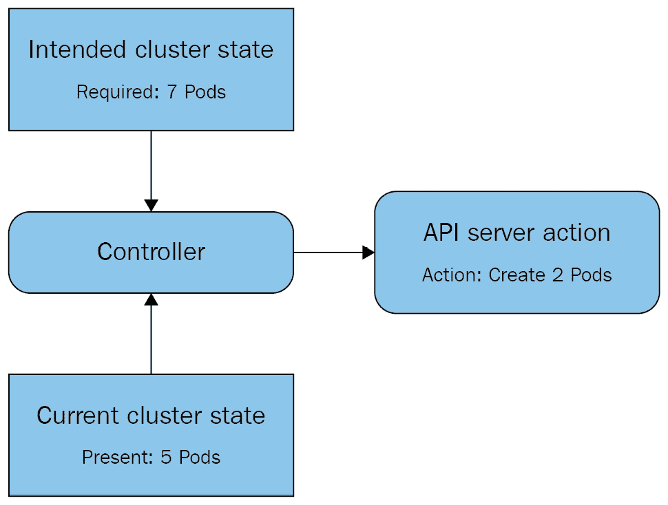
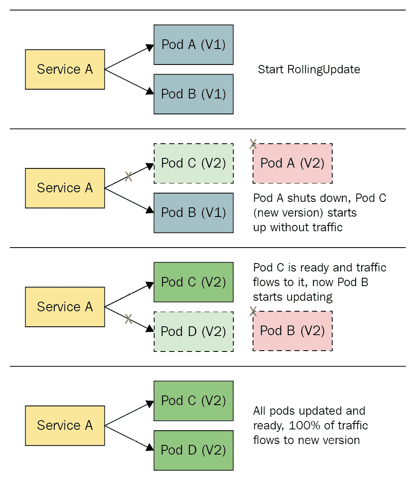
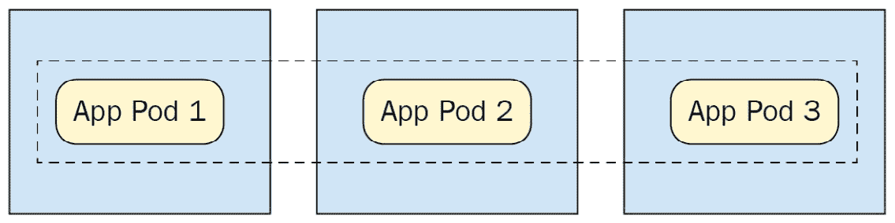

# 四、扩展和部署您的应用

在本章中，我们将了解用于运行应用和控制 Pods 的高级 Kubernetes 资源。首先，我们将讨论 Pod 的缺点，然后讨论最简单的 Pod 控制器，ReplicaSets。接下来我们将讨论部署，这是将应用部署到 Kubernetes 的最流行的方法。然后，我们将介绍特殊资源，帮助您部署特定类型的应用—水平 Pod 自动缩放器、DaemonSets、状态集和作业。最后，我们将通过一个完整的例子来说明如何在 Kubernetes 上运行一个复杂的应用。

在本章中，我们将涵盖以下主题:

*   了解 Pod 的缺点及其解决方案
*   使用复制集
*   控制部署
*   利用水平 Pod 自动缩放器
*   实现 DaemonSets
*   查看状态集和作业
*   把它们放在一起

# 技术要求

为了运行本章中详细介绍的命令，您将需要一台支持`kubectl`命令行工具的计算机以及一个工作正常的 Kubernetes 集群。参见 [*第 1 章*](01.html#_idTextAnchor016)*与 Kubernetes*通讯，了解几种与 Kubernetes 快速启动运行的方法，以及如何安装`kubectl`工具的说明。

本章使用的代码可以在本书的 GitHub 资源库中找到[https://GitHub . com/PacktPublishing/Cloud-Native-with-Kubernetes/tree/master/chapter 4](https://github.com/PacktPublishing/Cloud-Native-with-Kubernetes/tree/master/Chapter4)。

# 了解 Pod 的缺点及其解决方案

正如我们在前一章、 [*第三章*](03.html#_idTextAnchor091) 、*在 Kubernetes 上运行应用容器*中所述，Kubernetes 中的 Pod 是一个节点上运行的一个或多个应用容器的实例。只创建一个 Pod 就足以像在任何其他容器中一样运行应用。

也就是说，使用单个 Pod 运行应用首先会忽略运行容器的许多好处。容器允许我们将应用的每个实例视为无状态项，可以通过旋转应用的新实例来扩大或缩小以满足需求。

这有两个好处，一是允许我们轻松地扩展我们的应用，二是通过在给定时间提供我们的应用的多个实例，使我们的应用更加可用。如果我们的一个实例崩溃，应用仍将继续运行，并将自动扩展到崩溃前的水平。我们在 Kubernetes 上这样做的方法是使用 Pod 控制器资源。

## Pod 控制器

Kubernetes 为 Pod 控制器提供了几种开箱即用的选择。最简单的选择是使用复制集，它为特定的 Pod 维护给定数量的 Pod 实例。如果一个实例失败，复制集将启动一个新实例来替换它。

其次，还有部署，它们自己控制一个复制集。当在 Kubernetes 上运行应用时，部署是最受欢迎的控制器，它们使得使用跨复制集的滚动更新来升级应用变得容易。

水平 Pod 自动缩放器允许应用根据性能指标自动缩放到不同数量的实例，从而将部署提升到一个新的水平。

最后，有几个专业控制器在某些情况下可能很有价值:

*   DaemonSets，它在每个节点上运行应用的一个实例并维护它们
*   状态集，其中 Pod 标识保持静态，以帮助运行有状态工作负载
*   启动、运行到完成，然后在指定数量的 Pods 上关闭的作业

控制器的实际行为，无论是像复制集这样的默认 Kubernetes 控制器还是自定义控制器(例如 PostgreSQL 操作符)，都应该很容易预测。标准控制回路的简化视图如下图所示:



图 4.1–Kubernetes 控制器的基本控制回路

如你所见，控制器不断对照**当前集群状态**检查**预期集群状态**(我们想要这个应用的七个 PODS)(我们有这个应用的五个 PODS 在运行)。当预期状态与当前状态不匹配时，控制器将通过应用编程接口采取行动来纠正当前状态以匹配预期状态。

到目前为止，你应该理解为什么控制器在 Kubernetes 上是必要的:在交付高可用性应用时，Pod 本身还不是一个足够强大的原语。让我们继续讨论最简单的控制器:复制集。

# 使用复制集

复制集是最简单的 Kubernetes Pod 控制器资源。它们取代了旧的复制控制器资源。

复制器组和复制器控制器之间的主要区别在于复制器控制器使用更基本类型的选择器-决定应该控制哪些 Pod 的过滤器。

当复制控制器使用简单的基于权益的(*键=值*)选择器时，复制集使用具有多种可能格式的选择器，例如`matchLabels`和`matchExpressions`，这将在本章中讨论。

重要说明

没有任何理由在副本集上使用副本控制器——除非你有很好的理由不这样做，否则就坚持使用副本集。

复制集允许我们通知 Kubernetes 为特定的 Pod 规格保持一定数量的 Pod 。副本集的 YAML 与 Pod 的非常相似。事实上，整个 Pod 规范嵌套在复制集 YAML 中的`template`键下。

还有一些其他关键区别，可以在下面的代码块中观察到:

副本集. yaml

```
apiVersion: apps/v1
kind: ReplicaSet
metadata:
  name: myapp-group
  labels:
    app: myapp
spec:
 replicas: 3
 selector:
 matchLabels:
 app: myapp
  template:
    metadata:
      labels:
        app: myapp
    spec:
      containers:
      - name: myapp-container
        image: busybox
```

正如你所看到的，除了`template`部分(本质上是一个 Pod 定义)之外，我们的副本集规范中还有一个`selector`键和一个`replicas`键。先说`replicas`。

## 复制品

`replicas`键指定一个副本计数，我们的副本集将确保它始终在给定的时间运行。如果一个 Pod 死亡或停止工作，我们的复制集将创建一个新的 Pod 来代替它。这使得副本集成为一种自我修复的资源。

副本集控制器如何决定 Pod 何时停止工作？它会查看 Pod 的状态。如果 Pod 的当前状态不是“运行”*或“包含创造”**，复制集将尝试启动一个新的 Pod 。*

正如我们在 [*第 3 章*](03.html#_idTextAnchor091)*中讨论的，在 Kubernetes* 上运行应用容器，容器创建后容器的状态是由活跃度、就绪性和启动探测驱动的，可以专门为容器配置这些探测。这意味着您可以设置特定于应用的方法来知道 Pod 是否以某种方式损坏，并且您的副本集可以跳进去并在它的位置启动一个新的副本集。

## 选择器

`selector`键很重要，因为复制器集的工作方式——它是一个以选择器为核心的控制器。复制器组的工作是确保与其选择器匹配的运行 Pod 的数量是正确的。

例如，假设您有一个运行应用的现有 Pod`MyApp`。这个 Pod 标有`App=MyApp`的`selector`键。

现在假设您想用同一个应用创建一个副本集，这将为您的应用添加另外三个实例。您可以使用相同的选择器创建一个副本集，并指定三个副本，目的是总共运行四个实例，因为您已经运行了一个实例。

一旦启动复制集会发生什么？您会发现运行该应用的 Pods 总数将是三个，而不是四个。这是因为复制组有能力收养孤儿 PODS 并将其置于其统治之下。

当副本集启动时，它看到已经有一个现有的 Pod 匹配它的`selector`键。根据所需的副本数量，副本集将关闭现有的 Pods 或启动与`selector`匹配的新 Pods，以创建正确的数量。

## 模板

`template`部分包含 Pod，并支持与 Pod YAMLs 相同的所有字段，包括元数据部分和规范本身。大多数其他控制器遵循这种模式——它们允许您在更大的整体控制器 YAML 中定义 Pod 规范。

现在，您应该了解了复制集规范的各个部分及其作用。让我们继续使用我们的复制集实际运行应用。

## 测试复制集

现在，让我们部署我们的副本集。

复制前面列出的`replica-set.yaml`文件，并在您的集群上使用以下命令在与 YAML 文件相同的文件夹中运行它:

```
kubectl apply -f replica-set.yaml
```

要检查复制集是否已正确创建，运行`kubectl get pods`获取默认命名空间中的 Pods。

由于我们还没有为我们的复制集指定一个名称空间，它将被默认创建。`kubectl get pods`命令应给出以下内容:

```
NAME                            READY     STATUS    RESTARTS   AGE
myapp-group-192941298-k705b     1/1       Running   0          1m
myapp-group-192941298-o9sh8     1/1       Running   0        1m
myapp-group-192941298-n8gh2     1/1       Running   0        1m
```

现在，尝试使用以下命令删除其中一个复制集荚:

```
kubectl delete pod myapp-group-192941298-k705b
```

副本集将始终尝试保持指定数量的副本在线。

让我们使用`kubectl get`命令再次查看我们的运行舱:

```
NAME                         READY  STATUS             RESTARTS AGE
myapp-group-192941298-u42s0  1/1    ContainerCreating  0     1m
myapp-group-192941298-o9sh8  1/1    Running            0     2m
myapp-group-192941298-n8gh2  1/1    Running            0     2m
```

如您所见，我们的副本集控制器正在启动一个新的 pod，以将副本数量保持在三个。

最后，让我们使用以下命令删除我们的复制集:

```
kubectl delete replicaset myapp-group
```

随着我们的集群变得更加干净，让我们继续讨论更复杂的控制器——部署。

# 控制部署

虽然副本集包含了您想要运行高可用性应用的大部分功能，但大多数时候您会希望使用部署在 Kubernetes 上运行应用。

与副本集相比，部署有一些优势，它们实际上是通过拥有和控制副本集来工作的。

部署的主要优势在于，它允许您指定一个`rollout`过程，即如何将应用升级部署到部署中的各个单元。这使您可以轻松地配置控制，以阻止不良升级在其轨道上。

在我们回顾如何做到这一点之前，让我们看一下部署的整个规范:

deployment.yaml

```
apiVersion: apps/v1
kind: Deployment
metadata:
  name: myapp-deployment
  labels:
    app: myapp
spec:
  replicas: 3
  strategy:
    type: RollingUpdate
    rollingUpdate:
      maxSurge: 25%
      maxUnavailable: 25% 
  selector:
    matchLabels:
      app: myapp
  template:
    metadata:
      labels:
        app: myapp
    spec:
      containers:
      - name: myapp-container
        image: busybox
```

如您所见，这与副本集的规格非常相似。我们在这里看到的区别是规格中的一个新键:`strategy`。

使用`strategy`设置，我们可以通过`RollingUpdate`或`Recreate`告诉我们的部署升级我们的应用的方式。

`Recreate`是一个非常基础的部署方式:部署中的所有 Pods 都会被同时删除，新版本会创建新的 Pods。`Recreate`并不能让我们很好地控制糟糕的部署——如果新的 Pods 由于某种原因没有启动，我们将被一个完全不起作用的应用卡住。

另一方面，`RollingUpdate`的部署速度更慢，但控制力更强。首先，新的应用将一点一点地推出，一个接一个。我们可以指定`maxSurge`和`maxUnavailable`的值来调整策略。

滚动更新是这样工作的——当部署规范用新版本的 Pod 容器更新时，部署将一次关闭一个 Pod，用新的应用版本创建一个新的 Pod，等待新的 Pod 注册`Ready`，如就绪检查所确定的，然后继续下一个 Pod。

`maxSurge`和`maxUnavailable`参数允许您加快或减慢该过程。`maxUnavailable`允许您在部署过程中调整不可用 Pods 的最大数量。这可以是一个百分比，也可以是一个固定数字。`maxSurge`允许您调整在任何给定时间可以创建的部署副本数量上的最大 Pods 数量。就像`maxUnavailable`一样，这可以是一个百分比，也可以是一个固定的数字。

下图显示了`RollingUpdate`程序:



图 4.2–部署的滚动更新流程

如你所见，`RollingUpdate`程序遵循几个关键步骤。部署尝试逐个更新 Pods。只有在 Pod 成功更新后，更新才会进行到下一个 Pod。

## 用命令控制部署

正如我们已经讨论过的，我们可以通过使用声明性方法简单地更新它的 YAML 来改变我们的部署。然而，Kubernetes 也在`kubectl`中给了我们一些特殊命令来控制部署的几个方面。

首先，Kubernetes 允许我们手动扩展部署，也就是说，我们可以编辑应该运行的副本数量。

要将我们的`myapp-deployment`扩展到五个副本，我们可以运行以下命令:

```
kubectl scale deployment myapp-deployment --replicas=5
```

同样，如果需要，我们可以将`myapp-deployment`回滚到旧版本。为了演示这一点，首先让我们手动编辑我们的部署，以使用我们容器的新版本:

```
Kubectl set image deployment myapp-deployment myapp-container=busybox:1.2 –record=true
```

该命令告诉 Kubernetes 将我们部署中的容器版本更改为 1.2。然后，我们的部署将通过上图中的步骤来展开我们的变更。

现在，假设我们想在更新容器映像版本之前回到以前的版本。我们可以使用`rollout undo`命令轻松实现这一点:

```
Kubectl rollout undo deployment myapp-deployment
```

在我们之前的案例中，我们只有两个版本，初始版本和带有更新容器的版本，但是如果我们有其他版本，我们可以像这样在`undo`命令中指定它们:

```
Kubectl rollout undo deployment myapp-deployment –to-revision=10
```

这将让您一窥为什么部署如此有价值—它们让我们可以对应用新版本的部署进行微调控制。接下来，我们将讨论 Kubernetes 的智能缩放器，它与部署和复制集协同工作。

# 利用水平 Pod 自动缩放器

正如我们所看到的，部署和副本集允许您指定在特定时间应该可用的副本总数。然而，这两种结构都不允许自动缩放-它们必须手动缩放。

**水平 Pod 自动缩放器** ( **HPA** )通过作为更高级别的控制器存在来提供该功能，该控制器可以基于诸如 CPU 和内存使用等指标来改变部署或复制集的复制计数。

默认情况下，HPA 可以根据 CPU 利用率自动扩展，但通过使用自定义指标，该功能可以扩展。

住房公积金的 YAML 档案是这样的:

hpa，yaml

```
apiVersion: autoscaling/v1
kind: HorizontalPodAutoscaler
metadata:
  name: myapp-hpa
spec:
  maxReplicas: 5
  minReplicas: 2
  scaleTargetRef:
    apiVersion: apps/v1
    kind: Deployment
    name: myapp-deployment
  targetCPUUtilizationPercentage: 70
```

在前面的规范中，我们有`scaleTargetRef`，它指定了什么应该由 HPA 自动缩放，以及调谐参数。

`scaleTargetRef`的定义可以是部署、复制集或复制控制器。在本例中，我们定义了 HPA 来扩展我们之前创建的部署`myapp-deployment`。

对于调整参数，我们使用默认的基于 CPU 利用率的缩放，因此我们可以使用`targetCPUUtilizationPercentage`来定义运行我们的应用的每个 Pod 的预期 CPU 利用率。如果我们的 Pods 的平均 CPU 使用率增加超过 70%，我们的 HPA 将扩大部署规格，如果它下降足够长的时间，它将缩小部署。

典型的缩放事件如下所示:

1.  在三个副本上，一个部署的平均 CPU 使用率超过 70%。
2.  HPA 控制回路注意到了这种 CPU 利用率的增加。
3.  HPA 使用新的副本数量编辑部署规范。此计数是基于 CPU 利用率计算的，目的是使每个节点的 CPU 使用率稳定在 70%以下。
4.  部署控制器启动一个新的副本。
5.  此过程会重复进行，以向上或向下扩展部署。

总之，HPA 跟踪 CPU 和内存利用率，并在超出界限时启动扩展事件。接下来，我们将回顾 DaemonSets，它提供了一种非常特殊类型的 Pod 控制器。

# 实现 DaemonSets

从现在开始到本章结束，我们将回顾更多的小众选项，当涉及到运行具有特定需求的应用时。

我们将从 DaemonSets 开始，它类似于 replica set，只是副本的数量固定为每个节点一个副本。这意味着群集中的每个节点将随时保持应用的一个副本处于活动状态。

重要说明

重要的是要记住，在没有额外的 Pod 放置控件(如污点或节点选择器)的情况下，该功能将只为每个节点创建一个副本，我们将在 [*第 8 章*](08.html#_idTextAnchor186)*Pod 放置控件*中详细介绍。

对于典型的 DaemonSet，结果如下图所示:



图 4.3–daemmonset 分布在三个节点上

正如您在上图中看到的，每个节点(由一个框表示)包含一个应用 Pod，由 DaemonSet 控制。

这使得 daemmonsets 非常适合运行在节点级别收集指标或在每个节点基础上提供网络进程的应用。DaemonSet 规范如下所示:

daemmonset-1 . YAML

```
apiVersion: apps/v1 
kind: DaemonSet
metadata:
  name: log-collector
spec:
  selector:
      matchLabels:
        name: log-collector   
  template:
    metadata:
      labels:
        name: log-collector
    spec:
      containers:
      - name: fluentd
        image: fluentd
```

如您所见，这与您的典型副本集规范非常相似，只是我们没有指定副本的数量。这是因为 DaemonSet 会尝试在集群中的每个节点上运行 Pod。

如果要指定运行应用的节点子集，可以使用如下文件所示的节点选择器来实现:

daemmonset-2 . YAML

```
apiVersion: apps/v1 
kind: DaemonSet
metadata:
  name: log-collector
spec:
  selector:
      matchLabels:
        name: log-collector   
  template:
    metadata:
      labels:
        name: log-collector
    spec:
      nodeSelector:
        type: bigger-node 
      containers:
      - name: fluentd
        image: fluentd
```

这个 YAML 将把我们的 DaemonSet 限制在标签中与`type=bigger-node`选择器匹配的节点上。我们将在 [*第 8 章*](08.html#_idTextAnchor186)*Pod 放置控制*中了解更多关于节点选择器的信息。现在，让我们讨论一种非常适合运行有状态应用(如数据库)的控制器 StatefulSet。

# 了解状态集

状态集与复制集和部署非常相似，但有一个关键区别，使它们更适合于有状态工作负载。状态集维护每个 Pod 的顺序和身份，即使这些 Pod 被重新调度到新节点上。

例如，在 3 个副本的状态集合中，总是会有 Pod 1、Pod 2 和 Pod 3，这些 Pod 将在 Kubernetes 和存储中保持它们的身份(我们将在 [*第 7 章*](07.html#_idTextAnchor166)*在 Kubernetes* 上的存储中了解到这一点)，而不管发生任何重新调度。

让我们看看一个简单的 StatefulSet 配置:

statefulset.yaml .状态设定

```
apiVersion: apps/v1
kind: StatefulSet
metadata:
  name: stateful
spec:
  selector:
    matchLabels:
      app: stateful-app
  replicas: 5
  template:
    metadata:
      labels:
        app: stateful-app
    spec:
      containers:
      - name: app
        image: busybox
```

这个 YAML 将创建一个包含我们的应用的五个副本的状态集。

让我们看看状态集如何以不同于典型部署或复制集的方式维护 Pod 身份。让我们使用以下命令获取所有 Pods:

```
kubectl get pods
```

输出应该如下所示:

```
NAME      		   READY     STATUS    RESTARTS   AGE
stateful-app-0     1/1       Running   0         55s
stateful-app-1     1/1       Running   0         48s
stateful-app-2     1/1       Running   0         26s
stateful-app-3     1/1       Running   0         18s
stateful-app-4     0/1       Pending   0         3s
```

如您所见，在这个例子中，我们有五个 StatefulSet Pods，每个 Pods 都有一个数字指示器来指示它们的身份。该属性对于有状态应用(如数据库集群)非常有用。在 Kubernetes 上运行数据库集群的情况下，主 Pods 相对于副本 Pods 的身份很重要，我们可以使用 StatefulSet 身份来轻松管理它。

另一个有趣的点是，你可以看到最终的 PODS 仍然在启动，PODS 的年龄随着数字身份的增加而增加。这是因为 StatefulSet Pods 是按顺序一次创建一个的。

为了运行有状态的应用，StatefulSets 与持久的 Kubernetes 存储配合使用很有价值。我们将在 [*第 7 章*](07.html#_idTextAnchor166)*Kubernetes 上的存储*中了解更多信息，但现在，让我们讨论另一个具有非常具体用途的控制器:乔布斯。

# 使用作业

Kubernetes 中的 Job 资源的目的是运行可以完成的任务，这使得它们对于长时间运行的应用来说并不理想，但是对于批处理作业或类似的可以从并行性中获益的任务来说却很棒。

以下是 YAML 的工作规范:

工作-1.yaml

```
apiVersion: batch/v1
kind: Job
metadata:
  name: runner
spec:
  template:
    spec:
      containers:
      - name: run-job
        image: node:lts-jessie
        command: ["node", "job.js"]
      restartPolicy: Never
  backoffLimit: 4
```

此作业将启动单个 Pod，并运行命令`node job.js`，直到它完成，此时 Pod 将关闭。在本示例和以后的示例中，我们假设使用的容器映像有一个运行作业逻辑的文件`job.js`。`node:lts-jessie`容器映像默认不会有这个。这是一个没有并行运行的作业的示例。正如您可能从 Docker 用法中了解到的，多个命令参数必须作为字符串数组传递。

为了创建一个可以并行运行的作业(也就是说，多个副本同时运行该作业)，您需要开发您的应用代码，以便它可以在结束该过程之前告知作业已经完成。为了做到这一点，作业的每个实例都需要包含代码，以确保它完成更大批量任务的正确部分，并防止重复工作的发生。

有几种应用模式可以实现这一点，包括互斥锁和工作队列。此外，代码需要检查整个批处理任务的状态，这也可以通过更新数据库中的值来处理。一旦作业代码看到更大的任务完成，它应该退出。

完成后，您可以使用`parallelism`键将并行性添加到作业代码中。下面的代码块显示了这一点:

工作 2.yaml

```
apiVersion: batch/v1
kind: Job
metadata:
  name: runner
spec:
  parallelism: 3
  template:
    spec:
      containers:
      - name: run-job
        image: node:lts-jessie
        command: ["node", "job.js"]
      restartPolicy: Never
  backoffLimit: 4
```

如您所见，我们添加了带有三个副本的`parallelism`键。此外，您可以将纯作业并行度替换为指定的完成次数，在这种情况下，Kubernetes 可以跟踪作业已经完成了多少次。在这种情况下，您仍然可以设置并行度，但是如果不设置，它将默认为 1。

下一个规范将运行一个作业`4`次直到完成，`2`次迭代在任何给定的时间运行:

工作-3.yaml

```
apiVersion: batch/v1
kind: Job
metadata:
  name: runner
spec:
  parallelism: 2
  completions: 4
  template:
    spec:
      containers:
      - name: run-job
        image: node:lts-jessie
        command: ["node", "job.js"]
      restartPolicy: Never
  backoffLimit: 4
```

Kubernetes 上的作业提供了一种抽象一次性流程的好方法，许多第三方应用将它们链接到工作流中。如你所见，它们非常容易使用。

接下来，让我们看看一个非常相似的资源，CronJob。

## 克隆乔布斯

CronJobs 是一种用于计划作业执行的 Kubernetes 资源。这与您可能在最喜欢的编程语言或应用框架中找到的 CronJob 实现非常相似，只有一个关键区别。Kubernetes CronJobs 触发 Kubernetes Jobs，它提供了一个额外的抽象层，例如，可以用来在晚上，每天晚上触发批处理作业。

Kubernetes 中的 CronJobs 是使用非常典型的 cron 符号配置的。让我们看看完整的规格:

cronjob-1.yaml

```
apiVersion: batch/v1beta1
kind: CronJob
metadata:
  name: hello
spec:
  schedule: "0 1 * * *"
  jobTemplate:
    spec:
      template:
        spec:
          containers:
           - name: run-job
             image: node:lts-jessie
             command: ["node", "job.js"]
          restartPolicy: OnFailure
```

这个克隆作业将在每天凌晨 1 点创建一个与我们之前的作业规范相同的作业。关于 cron 时间符号的快速回顾，它将解释我们凌晨 1 点工作的语法，请继续阅读。关于 cron 符号的全面回顾，请查看[http://man7.org/linux/man-pages/man5/crontab.5.html](http://man7.org/linux/man-pages/man5/crontab.5.html)。

Cron 符号由五个值组成，用空格隔开。每个值可以是数字整数、字符或组合。五个值中的每一个都代表一个时间值，格式从左到右如下:

*   分钟
*   小时
*   一个月中的某一天(如`25`)
*   月
*   一周中的某一天(例如，`3` =星期三)

前一个 YAML 假设了一个非并行的 CronJob。如果我们想增加 CronJob 的批处理能力，我们可以像以前的作业规范一样添加并行性。下面的代码块显示了这一点:

cronjob-2.yaml

```
apiVersion: batch/v1beta1
kind: CronJob
metadata:
  name: hello
spec:
  schedule: "0 1 * * *"
  jobTemplate:
    spec:
      parallelism: 3
      template:
        spec:
          containers:
           - name: run-job
             image: node:lts-jessie
             command: ["node", "job.js"]
          restartPolicy: OnFailure
```

请注意，要做到这一点，您的 CronJob 容器中的代码需要优雅地处理并行性，这可以使用工作队列或其他类似模式来实现。

我们现在已经回顾了 Kubernetes 默认提供的所有基本控制器。让我们在下一节中利用我们的知识在 Kubernetes 上运行一个更复杂的应用示例。

# 把所有的放在一起

我们现在有了一个在 Kubernetes 上运行应用的工具集。让我们看一个真实的例子，看看如何将所有这些结合起来运行一个具有多层和跨 Kubernetes 资源分布的功能的应用:


图 4.4–多层应用图

如您所见，我们的图表应用包含一个运行. NET Framework 应用的 web 层、一个运行 Java 的中间层或服务层、一个运行 Postgres 的数据库层，最后还有一个日志/监控层。

我们为每一层选择的控制器取决于我们计划在每一层上运行的应用。对于 web 层和中间层，我们都在运行无状态应用和服务，因此我们可以有效地使用部署来处理推出更新、蓝/绿部署等。

对于数据库层，我们需要我们的数据库集群知道哪个 Pod 是副本，哪个是主副本，因此我们使用 StatefulSet。最后，我们的日志收集器需要在每个节点上运行，所以我们使用 DaemonSet 来运行它。

现在，让我们看一下我们每个层的 YAML 规格示例。

让我们从基于 JavaScript 的 web 应用开始。通过在 Kubernetes 上托管这个应用，我们可以进行加那利测试和蓝/绿部署。需要注意的是，本节中的一些示例使用了 DockerHub 中没有公开的容器映像名称。要使用这种模式，请将示例调整到您自己的应用容器中，或者如果您想在没有实际应用逻辑的情况下运行它，只需使用 busybox。

web 层的 YAML 文件可能如下所示:

示例-部署-web.yaml

```
apiVersion: apps/v1
kind: Deployment
metadata:
  name: webtier-deployment
  labels:
    tier: web
spec:
  replicas: 10
  strategy:
    type: RollingUpdate
    rollingUpdate:
      maxSurge: 50%
      maxUnavailable: 25% 
  selector:
    matchLabels:
      tier: web
  template:
    metadata:
      labels:
        tier: web
    spec:
      containers:
      - name: reactapp-container
        image: myreactapp
```

在前面的 YAML 中，我们使用`tier`标签来标记我们的应用，并将其用作我们的`matchLabels`选择器。

接下来是中端服务层。让我们来看看相关的 YAML:

示例-部署-mid.yaml

```
apiVersion: apps/v1
kind: Deployment
metadata:
  name: midtier-deployment
  labels:
    tier: mid
spec:
  replicas: 8
  strategy:
    type: RollingUpdate
    rollingUpdate:
      maxSurge: 25%
      maxUnavailable: 25% 
  selector:
    matchLabels:
      tier: mid
  template:
    metadata:
      labels:
        tier: mid
    spec:
      containers:
      - name: myjavaapp-container
        image: myjavaapp
```

正如您在前面的代码中所看到的，我们的中间层应用与 web 层设置非常相似，我们正在使用另一个部署。

有趣的部分来了——让我们看看 Postgres StatefulSet 的规范。为了适合页面，我们对这个代码块进行了一些删减，但是您应该能够看到最重要的部分:

示例-statefulset.yaml

```
apiVersion: apps/v1
kind: StatefulSet
metadata:
  name: postgres-db
  labels:
    tier: db
spec:
  serviceName: "postgres"
  replicas: 2
  selector:
    matchLabels:
      tier: db
  template:
    metadata:
      labels:
        tier: db
    spec:
      containers:
      - name: postgres
        image: postgres:latest
        envFrom:
          - configMapRef:
              name: postgres-conf
        volumeMounts:
        - name: pgdata
          mountPath: /var/lib/postgresql/data
          subPath: postgres
```

在 YAML 文件之前的中，我们可以看到一些我们尚未回顾的新概念——配置地图和卷。我们将分别在*第 6 章*、 *Kubernetes 应用配置*和 [*第 7 章*](07.html#_idTextAnchor166) 、*Kubernetes 上的存储*中更详细地了解这些是如何工作的，但现在让我们专注于规范的其余部分。我们有我们的`postgres`容器，以及一个设置在`5432`默认 Postgres 端口上的端口。

最后，让我们看看我们的日志应用的 DaemonSet。这是 YAML 文件的一部分，我们再次缩短了长度:

示例-daemmonset . YAML

```
apiVersion: apps/v1
kind: DaemonSet
metadata:
  name: fluentd
  namespace: kube-system
  labels:
    tier: logging
spec:
  updateStrategy:
    type: RollingUpdate
  template:
    metadata:
      labels:
        tier: logging
    spec:
      tolerations:
      - key: node-role.kubernetes.io/master
        effect: NoSchedule
      containers:
      - name: fluentd
        image: fluent/fluentd-kubernetes-daemonset:v1-debian-papertrail
        env:
          - name: FLUENT_PAPERTRAIL_HOST
            value: "mycompany.papertrailapp.com"
          - name: FLUENT_PAPERTRAIL_PORT
            value: "61231"
          - name: FLUENT_HOSTNAME
            value: "DEV_CLUSTER"
```

在这个 daemmonset 中，我们设置了 FluentD(一个流行的开源日志收集器)来将日志转发到 Papertrail，一个基于云的日志收集器和搜索工具。同样，在这个 YAML 的文件中，我们有一些东西我们以前没有审查过。例如，`node-role.kubernetes.io/master`的`tolerations`部分实际上将允许我们的 DaemonSet 将 Pods 放置在主节点上，而不仅仅是工作节点上。我们将在 [*第 8 章*](08.html#_idTextAnchor186)*Pod 放置控制*中回顾这是如何工作的。

我们还在 Pod 规范中直接指定环境变量，这对于相对基本的配置来说是可以的，但是可以通过使用 Secrets 或 ConfigMaps(我们将在 [*第 6 章*](06.html#_idTextAnchor143)*Kubernetes 应用配置*中回顾)来改进，以避免它出现在我们的 YAML 代码中。

# 总结

在本章中，我们回顾了在 Kubernetes 上运行应用的一些方法。首先，我们回顾了为什么 Pods 本身不足以保证应用的可用性，并引入了控制器。然后，我们回顾了一些简单的控制器，包括复制集和部署，然后继续讨论具有更具体用途的控制器，如高性能计算、作业、克隆作业、状态集和 DaemonSets。最后，我们利用我们所有的知识，用它来实现一个运行在 Kubernetes 上的复杂应用。

在下一章中，我们将学习如何使用服务和入口向世界展示我们的应用(它们现在以高可用性正常运行)。

# 问题

1.  复制集和复制控制器有什么区别？
2.  部署比复制集有什么优势？
3.  什么是工作的好用例？
4.  为什么 StatefulSets 更适合有状态工作负载？
5.  我们如何使用部署来支持金丝雀发布流？

# 进一步阅读

*   Kubernetes 官方文件:[https://kubernetes.io/docs/home/](https://kubernetes.io/docs/home/)
*   Kubernetes 作业资源文档:[https://Kubernetes . io/docs/concepts/workloads/controller/Job/](https://kubernetes.io/docs/concepts/workloads/controllers/job/)
*   FluentD DaemonSet 安装文档:[https://github.com/fluent/fluentd-kubernetes-daemonset](https://github.com/fluent/fluentd-kubernetes-daemonset)
*   *硬道*:[https://github . com/keleyhightower/kubrites—硬道](https://github.com/kelseyhightower/kubernetes-the-hard-way)