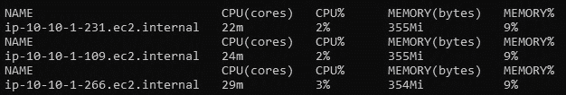
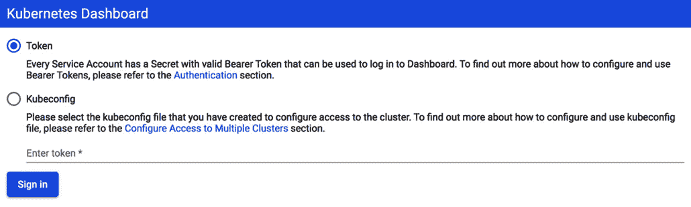
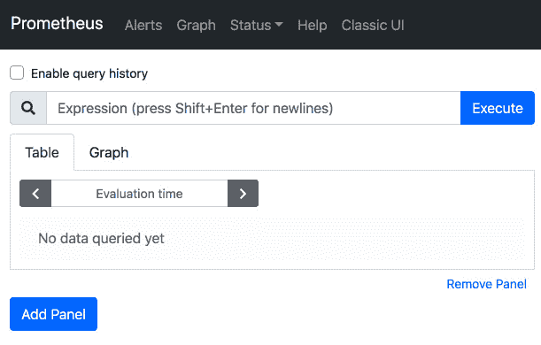
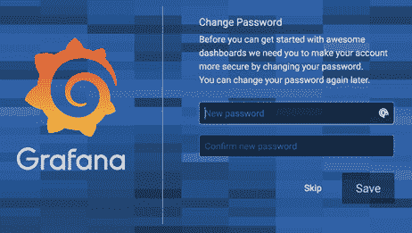
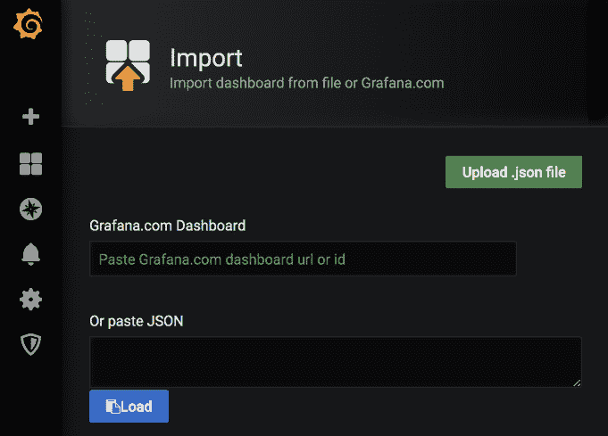
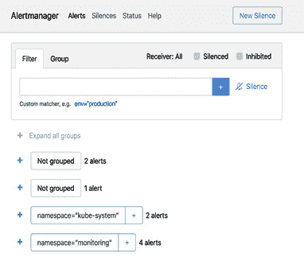
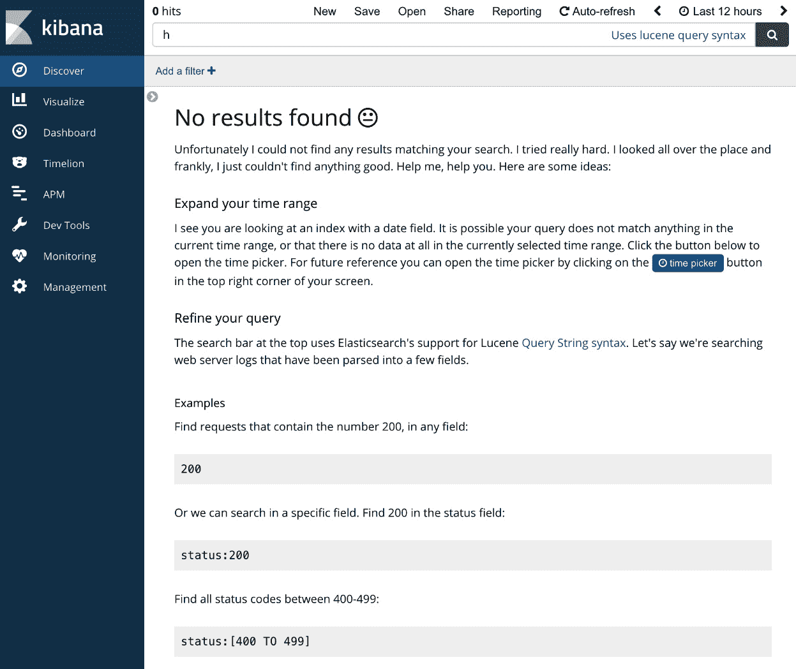
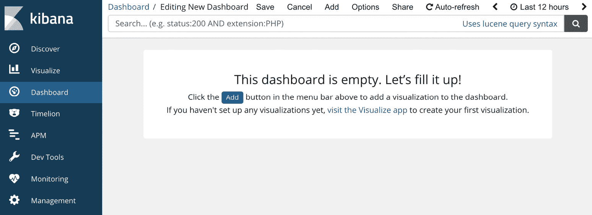
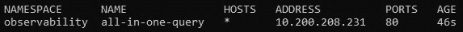
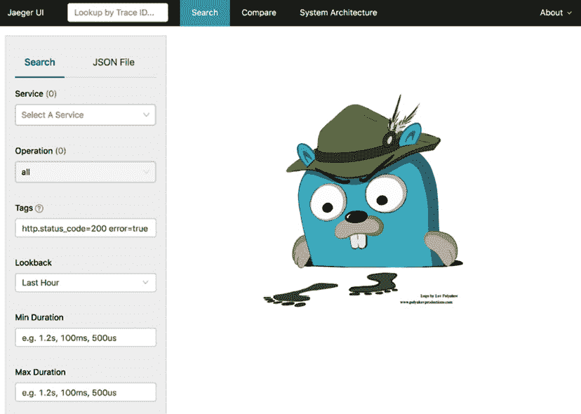

# 九、Kubernetes的可观测性

本章深入探讨了在生产中运行 Kubernetes 时强烈建议实现的功能。首先，我们讨论分布式系统(如 Kubernetes)的可观测性。然后，我们看一下内置的 Kubernetes 可观察性栈及其实现的功能。最后，我们学习如何从生态系统中用额外的可观察性、监控、日志记录和度量基础设施来补充内置的可观察性工具。本章中学习的技能将帮助您将可观察性工具部署到 Kubernetes 集群中，并使您能够了解集群(以及运行在其上的应用)的运行情况。

在本章中，我们将涵盖以下主题:

*   理解库伯内特的可观测性
*   使用默认的可观察性工具——度量、日志和仪表板
*   实现生态系统的最佳状态

首先，我们将学习 Kubernetes 为可观察性提供的现成工具和流程。

# 技术要求

为了运行本章中详细介绍的命令，您将需要一台支持`kubectl`命令行工具的计算机以及一个工作正常的 Kubernetes 集群。参见 [*第一章*](01.html#_idTextAnchor016)*与Kubernetes*通讯，了解几种快速启动和运行Kubernetes的方法，以及如何安装Kubernetes工具的说明。

本章中使用的代码可以在本书的 GitHub 存储库中找到:

[https://github . com/PacktPublishing/Cloud-Native-with-Kubernetes/tree/master/chapter 9](https://github.com/PacktPublishing/Cloud-Native-with-Kubernetes/tree/master/Chapter9)

# 了解Kubernetes的可观测性

没有一个生产系统是完整的没有办法监控它。在软件中，我们将可观察性定义为在任何时间点理解我们的系统如何运行的能力(最好的情况是，为什么)。可观察性在安全性、性能和操作能力方面带来显著优势。通过了解您的系统在虚拟机、容器和应用级别的响应情况，您可以调整它，使其高效运行，对事件做出快速反应，并更轻松地排除错误。

例如，让我们假设您的应用运行速度非常慢。为了找到瓶颈，您可以查看应用代码本身、Pod 的资源规格、部署中的 Pod 数量、Pod 级别或节点级别的内存和 CPU 使用情况，以及外部因素，例如运行在集群之外的 MySQL 数据库。

通过添加可观察性工具，您将能够诊断这些变量中的许多变量，并找出哪些问题可能会导致您的应用变慢。

Kubernetes 作为一个生产就绪的容器编排系统，为我们提供了一些监控应用的默认工具。为了本章的目的，我们将把可观察性分成四个概念:度量、日志、跟踪和警报。让我们看看他们每个人:

*   **指标**这里表示查看系统当前状态的数字表示的能力，特别关注 CPU、内存、网络、磁盘空间等等。这些数字使我们能够判断当前状态与系统最大容量之间的差距，并确保系统对用户可用。
*   **日志**是指从应用和系统中收集文本日志的做法。日志可能是 Kubernetes 控制平面日志和应用 Pods 本身的日志的组合。日志可以帮助我们诊断 Kubernetes 系统的可用性，但是它们也可以帮助分析应用错误。
*   **痕迹**指采集分布的痕迹。跟踪是一种可观察的模式，它提供了一系列请求的端到端可见性，这些请求可以是 HTTP 请求或其他请求。在使用微服务的分布式云原生环境中，这个主题尤其重要。如果您有许多微服务，并且它们相互调用，当一个端到端请求中涉及许多服务时,可能很难找到瓶颈或问题。跟踪允许您查看按服务到服务呼叫的每个分支细分的请求。
*   **提醒**对应于在某些事件发生时设置自动触摸点的做法。警报可以在*指标*和*日志*上设置，并通过多种媒介传递，从短信到电子邮件，再到第三方应用，等等。

在这四个方面的可观测性之间，我们应该能够了解我们集群的健康状况。但是，可以为指标、日志甚至警报配置许多不同的可能数据点。因此，知道寻找什么是重要的。下一节将讨论 Kubernetes 集群和应用健康最重要的可观察领域。

## 了解什么对 Kubernetes 集群和应用运行状况至关重要

在 Kubernetes 或针对 Kubernetes 的第三方可观察性解决方案能够提供的大量可能的指标和日志中，我们可以缩小最有可能导致您的集群出现重大问题的指标和日志的范围。无论最终使用哪种可观察性解决方案，您都应该将这些部分放在最前面和最中间。首先，让我们看看 CPU 使用和集群健康之间的联系。

### 节点中央处理器使用率

Kubernetes集群中各节点的 CPU 使用状态是一个非常重要的指标，可以用来关注整个可观测性解决方案。在前几章中，我们已经讨论了 Pods 如何定义资源请求和 CPU 使用限制。但是，当限制设置高于群集的最大 CPU 容量时，节点仍有可能超额预订其 CPU 使用。此外，运行我们的控制平面的主节点也会遇到 CPU 容量问题。

CPU 最大化的工作节点可能会表现不佳，或者限制 Pods 上运行的工作负载。如果对 Pod 没有设置限制，或者如果节点的 Pod 总资源限制大于其最大容量，即使其总资源请求较低，也很容易发生这种情况。具有封顶的 CPU 的主节点可能会损害调度器、kube-apiserver 或任何其他控制平面组件的性能。

一般来说，工作节点和主节点之间的 CPU 使用情况应该在您的可观察性解决方案中可见。最好通过指标组合(例如 Grafana 之类的图表解决方案，您将在本章稍后了解)和集群中节点的高 CPU 使用率警报来实现这一点。

与中央处理器类似，内存使用也是一个非常重要的跟踪指标。

### 节点内存使用

与 CPU 使用率一样，内存使用率是在集群中观察的一个极其重要的指标。使用 Pod 资源限制可以超额预订内存使用，并且许多与 CPU 使用相同的问题可以适用于群集中的主节点和工作节点。

同样，警报和指标的结合对于了解集群内存使用情况非常重要。我们将在本章后面学习一些工具。

对于下一个主要的可观察性部分，我们将不再关注度量标准，而是关注日志。

### 控制平面测井

### Kubernetes 控制平面的组件在运行时输出日志，这些日志可用于深入查看集群操作。这些日志对于故障排除也有很大帮助，正如我们将在 [*第 10 章*](10.html#_idTextAnchor230)*故障排除Kubernetes*中看到的。Kubernetes API 服务器、控制器管理器、调度器、kube 代理和 kubelet 的日志对于某些故障排除或可观察性原因都非常有用。

### 应用日志

应用日志也可以合并到 Kubernetes 的可观察性栈中——能够查看应用日志以及其他指标对操作员非常有帮助。

### 应用性能指标

与应用日志一样，应用性能指标和监控与您的应用在 Kubernetes 上的性能高度相关。应用级别的内存使用和 CPU 分析可能是可观察性栈中有价值的部分。

一般来说，Kubernetes 为应用监控和日志记录提供了数据基础结构，但是没有提供更高级别的功能，例如图表和搜索。考虑到这一点，让我们回顾一下 Kubernetes 默认情况下为解决这些问题而提供的工具。

# 使用默认的可观察性工具

Kubernetes 提供了可观察性工具，即使没有添加任何第三方解决方案。这些本地的 Kubernetes 工具构成了许多更健壮的解决方案的基础，因此讨论它们很重要。由于可观察性包括度量、日志、跟踪和警报，我们将依次讨论每一个，首先关注 Kubernetes-native 解决方案。首先，让我们讨论度量标准。

## 立方上的度量

只要运行`kubectl describe pod`，就可以获得很多关于你的应用的信息。我们可以看到关于我们的 Pod 规范的信息，它处于什么状态，以及阻止其功能的关键问题。

让我们假设我们的应用遇到了一些问题。具体来说，Pod 没有启动。为了调查，我们运行`kubectl describe pod`。关于 [*第一章*](01.html#_idTextAnchor016)*中提到的 kubectl 别名提醒，与 Kubernetes* 交流，`kubectl describe pod`同`kubectl describe pods`。以下是`describe pod`命令的输出示例–除了`Events`信息之外，我们已经剥离了所有内容:


图 9.1–描述 Pod 事件输出

如您所见，这个 Pod 没有被安排，因为我们的节点都没有内存了！这是一件值得进一步调查的好事。

让我们继续前进。通过运行`kubectl describe nodes`，我们可以了解很多关于我们的 Kubernetes Nodes。这些信息中的一些可能与我们系统的性能非常相关。这是另一个输出示例，这次来自`kubectl describe nodes`命令。不要把整个输出放在这里，这可能会很长，让我们关注两个重要的部分-`Conditions`和`Allocated resources`。首先，让我们回顾一下`Conditions`一节:


图 9.2–描述节点条件输出

如您所见，我们已经包含了`kubectl describe nodes`命令输出的`Conditions`块。这是一个寻找问题的好地方。正如我们在这里看到的，我们的节点实际上遇到了问题。我们的`MemoryPressure`条件是真的，`Kubelet`内存不足。难怪我们的豆荚不会安排！

接下来，查看`Allocated resources`块:

```
Allocated resources:
 (Total limits may be over 100 percent, i.e., overcommitted.)
 CPU Requests	CPU Limits    Memory Requests  Memory Limits
 ------------	----------    ---------------  -------------
 8520m (40%)	4500m (24%)   16328Mi (104%)   16328Mi (104%)
```

现在我们看到了一些指标！看起来我们的 Pod 请求了太多内存，导致了我们的节点和 Pod 问题。从这个输出可以看出，默认情况下，Kubernetes 已经在收集关于我们的节点的度量数据。没有这些数据，调度器将无法正常工作，因为用节点容量维护 Pod 资源请求是它最重要的功能之一。

但是，默认情况下，这些指标不会呈现给用户。事实上，它们正被每个节点的`Kubelet`收集，并交付给调度器以完成其工作。谢天谢地，我们可以通过将度量服务器部署到我们的集群来轻松获得这些度量。

度量服务器是一个官方支持的 Kubernetes 应用，它收集度量信息并将其显示在应用编程接口端点上以供使用。度量服务器实际上是使水平Pod 自动缩放器工作所必需的，但是默认情况下并不总是包括它，这取决于 Kubernetes 分布。

部署度量服务器非常快。截至本书撰写之时，最新版本可通过以下方式安装:

```
kubectl apply -f https://github.com/kubernetes-sigs/metrics-server/releases/download/v0.3.7/components.yaml
```

重要说明

关于如何使用度量服务器的完整文档可以在[https://github.com/kubernetes-sigs/metrics-server](https://github.com/kubernetes-sigs/metrics-server)找到。

一旦度量服务器运行，我们就可以使用全新的 Kubernetes 命令。`kubectl top`命令可以与 Pods 或 Nodes 一起使用，查看关于正在使用的内存和 CPU 容量的详细信息。

让我们看一些用法示例。运行`kubectl top nodes`查看节点级指标。以下是命令的输出:



图 9.3–节点指标输出

如您所见，我们能够看到绝对和相对的 CPU 和内存使用情况。

重要说明

CPU 内核以`millcpu`或`millicores`计量。1000`millicores`相当于一个虚拟 CPU。内存以字节为单位。

接下来，让我们看看`kubectl top pods`命令下的。用`–namespace kube-system`标志运行它，查看`kube-system`命名空间中的 Pods。

为此，我们运行以下命令:

```
Kubectl top pods -n kube-system 
```

我们得到如下输出:

```
NAMESPACE     NAME                CPU(cores)   MEMORY(bytes)   
default       my-hungry-pod       8m           50Mi            
default       my-lightweight-pod  2m           10Mi       
```

如您所见，该命令使用与`kubectl top nodes`相同的绝对单位–毫核心和字节。查看 Pod 级别的指标时，没有相对百分比。

接下来，我们将看看 Kubernetes 如何处理日志记录。

## 对库柏人的记载

我们可以将 Kubernetes 上的日志记录分为两个区域–*应用日志*和*控制平面日志*。让我们从控制平面日志开始。

### 控制平面日志

控制平面日志指的是由 Kubernetes 控制平面组件创建的日志，如调度器、API 服务器等。对于普通的 Kubernetes 安装，控制平面日志可以在节点本身上找到，并且需要直接访问节点才能看到。对于组件设置为使用`systemd`的集群，可以使用`journalctl`命令行界面工具找到日志(更多信息请参考以下链接:[https://manpages . debian . org/stretch/systemd/journal CTL . 1 . en . html](https://manpages.debian.org/stretch/systemd/journalctl.1.en.html))。

在主节点上，您可以在文件系统的以下位置找到日志:

*   在`/var/log/kube-scheduler.log`可以找到 Kubernetes 调度器日志。
*   在`/var/log/kube-controller-manager.log`处，您可以找到控制器管理器日志(例如，查看缩放事件)。
*   在`/var/log/kube-apiserver.log`可以找到 Kubernetes API 服务器日志。

在工作节点上，日志在文件系统的两个位置可用:

*   在`/var/log/kubelet.log`你可以找到 kubelet 日志。
*   在`/var/log/kube-proxy.log`可以找到 kube 代理日志。

虽然一般来说，集群运行状况会受到 Kubernetes 主节点和工作节点组件运行状况的影响，但是跟踪应用日志当然也很重要。

### 应用日志

在 Kubernetes 上很容易找到应用日志。在解释它的工作原理之前，让我们看一个例子。

要检查特定 Pod 的日志，可以使用`kubectl logs <pod_name>`命令。该命令的输出将显示写入容器的`stdout`或`stderr`的任何文本。如果 Pod 有多个容器，则必须在命令中包含容器名称:

```
kubectl logs <pod_name> <container_name> 
```

在引擎盖下，Kubernetes 通过使用容器引擎的日志驱动程序来处理 Pod 日志。通常情况下，`stdout`或`stderr`的任何日志都会保存到`/var/logs`文件夹中每个节点的磁盘上。根据 Kubernetes 分布，可以设置日志循环，以防止日志过度使用节点磁盘空间。此外，Kubernetes 组件，如调度器、kubelet 和 kube-apiserver 也将日志保存到 Node 磁盘空间，通常在`/var/logs`文件夹中。需要注意的是，这种默认的日志记录功能是多么的有限 Kubernetes 强大的可观察性栈肯定会包括一个用于日志转发的第三方解决方案，我们很快就会看到。

接下来，对于一般的 Kubernetes 可观察性，我们可以使用 Kubernetes Dashboard。

## 安装增压板

Kubernetes Dashboard 在一个 GUI 中提供了 kubectl 的所有功能——包括查看日志和编辑资源。设置仪表板非常容易，让我们看看如何设置。

仪表板可以通过单个`kubectl apply`命令安装。如需定制，请查看位于[https://github.com/kubernetes/dashboard](https://github.com/kubernetes/dashboard)的 Kubernetes 仪表板 GitHub 页面。

要安装 Kubernetes 仪表板的一个版本，运行以下`kubectl`命令，根据您使用的 Kubernetes 版本，用您想要的版本替换`<VERSION>`标签(同样，检查仪表板 GitHub 页面的版本兼容性):

```
kubectl apply -f https://raw.githubusercontent.com/kubernetes/dashboard/<VERSION> /aio/deploy/recommended.yaml
```

在我们的案例中，在撰写本书时，我们将使用 v 2 . 0 . 4–最终命令如下所示:

```
kubectl apply -f https://raw.githubusercontent.com/kubernetes/dashboard/v2.0.4/aio/deploy/recommended.yaml
```

一旦安装了 Kubernetes Dashboard，有几种方法可以访问它。

重要说明

通常不建议使用入口或公共负载平衡器服务，因为 Kubernetes Dashboard 允许用户更新集群对象。如果由于某种原因，您的仪表板登录方法被破坏或很容易被发现，您可能会面临很大的安全风险。

考虑到这一点，我们可以使用`kubectl port-forward`或`kubectl proxy`从本地机器查看我们的仪表板。

对于这个例子，我们将使用命令，因为我们还没有在一个例子中使用它。

与`kubectl port-forward`命令不同，`kubectl proxy`命令只需要一个命令来代理集群上运行的每个服务。它通过将 Kubernetes API 直接代理到本地机器上的一个端口来实现这一点，默认情况下这个端口是`8081`。有关`Kubectl proxy`命令的完整讨论，请查看[https://kubernetes . io/docs/reference/generated/ku bectl/ku bectl-commands # proxy](https://kubernetes.io/docs/reference/generated/kubectl/kubectl-commands#proxy)上的文档。

为了使用`kubectl proxy`访问特定的 Kubernetes 服务，您只需要拥有正确的路径。运行`kubectl proxy`后访问Kubernetes仪表板的路径如下:

```
http://localhost:8001/api/v1/namespaces/kubernetes-dashboard/services/https:kubernetes-dashboard:/proxy/
```

如您所见，我们在浏览器中放置的`kubectl proxy`路径位于 localhost 端口`8001`上，并提到了名称空间(`kubernetes-dashboard`)、服务名称和选择器(`https:kubernetes-dashboard`)以及代理路径。

让我们把我们的 Kubernetes 仪表板网址放在浏览器中，看看结果:



图 9.4-固定仪表板登录

当我们部署和访问 Kubernetes Dashboard 时，我们会看到一个登录屏幕。我们可以创建一个服务帐户(或者使用我们自己的)来登录仪表板，或者简单地链接我们本地的`Kubeconfig`文件。通过使用特定服务帐户的令牌登录 Kubernetes 仪表板，仪表板用户将继承该服务帐户的权限。这允许您指定用户可以使用 Kubernetes 仪表板采取的操作类型，例如只读权限。

让我们继续为我们的 Kubernetes 仪表板创建一个全新的服务帐户。您可以自定义此服务帐户并限制其权限，但目前我们将授予其管理员权限。为此，请遵循以下步骤:

1.  We can create a Service Account imperatively using the following Kubectl command:

    ```
    kubectl create serviceaccount dashboard-user
    ```

    这将产生以下输出，确认我们服务帐户的创建:

    ```
    serviceaccount/dashboard-user created
    ```

2.  Now, we need to link our Service Account to a ClusterRole. You could also use a Role, but we want our dashboard user to be able to access all namespaces. To link a Service Account to the `cluster-admin` default ClusterRole using a single command, we can run the following:

    ```
    kubectl create clusterrolebinding dashboard-user \--clusterrole=cluster-admin --serviceaccount=default:dashboard-user
    ```

    该命令将产生以下输出:

    ```
    clusterrolebinding.rbac.authorization.k8s.io/dashboard-user created
    ```

3.  After this command is run, we should be able to log in to our dashboard! First, we just need to find the token that we will use to log in. A Service Account's token is stored as a Kubernetes secret, so let's see what it looks like. Run the following command to see which secret our token is stored in:

    ```
    kubectl get secrets
    ```

    在输出中，您应该会看到如下所示的机密:

    ```
    NAME                         TYPE                                  DATA   AGE
    dashboard-user-token-dcn2g   kubernetes.io/service-account-token   3      112s
    ```

4.  Now, to get our token for signing in to the dashboard, we only need to describe the secret contents using the following:

    ```
    kubectl describe secret dashboard-user-token-dcn2g   
    ```

    结果输出如下所示:

    ```
    Name:         dashboard-user-token-dcn2g
    Namespace:    default
    Labels:       <none>
    Annotations:  kubernetes.io/service-account.name: dashboard-user
                  kubernetes.io/service-account.uid: 9dd255sd-426c-43f4-88c7-66ss91h44215
    Type:  kubernetes.io/service-account-token
    Data
    ====
    ca.crt:     1025 bytes
    namespace:  7 bytes
    token: < LONG TOKEN HERE >
    ```

5.  要登录仪表盘，复制`token`旁边的字符串，复制到 Kubernetes 仪表盘登录界面的令牌输入中，点击**登录**。您应该会看到 Kubernetes 仪表板概述页面！
6.  Go ahead and click around the dashboard – you should be able to see all the same resources you would be able to using kubectl, and you can filter by namespace in the left-hand sidebar. For instance, here's a view of the **Namespaces** page:

    

    图 9.5-无间隙仪表板详细信息

7.  You can also click on individual resources, and even edit those resources using the dashboard as long as the Service Account you used to log in has the proper permissions.

    以下是从部署详细信息页面编辑部署资源的视图:


图 9.6-无间隙仪表板 edit view

Kubernetes 仪表板还允许您查看 Pod 日志，并深入了解集群中的许多其他资源类型。要了解仪表板的全部功能，请查看前面提到的 GitHub 页面上的文档。

最后，为了完善我们对 Kubernetes 上的默认可观测性的讨论，让我们来看看警报。

## Kubernetes上的警报和踪迹

不幸的是，可观察性谜题的最后两个部分——警告——T2 和追踪——还不是Kubernetes的原生功能。为了创建这种类型的功能，让我们进入下一部分——结合Kubernetes生态系统的开源工具。

# 利用生态系统的最佳状态增强Kubernetes的可观测性

正如我们已经讨论过的，虽然 Kubernetes 为强大的可见性功能提供了基础，但是通常要由社区和供应商生态系统来为度量、日志、跟踪和警报创建更高级别的工具。出于本书的目的，我们将专注于完全开源的自托管解决方案。由于这些解决方案中的许多实现了度量、日志、跟踪和警报之间的多个可见性支柱，因此我们将分别审查每个解决方案，而不是在审查期间将解决方案分类到每个可见性支柱中。

让我们从常用的度量和警报技术组合开始:**普罗米修斯**和**格拉夫纳**。

## 引进普罗米修斯和格拉夫纳

普罗米修斯和格拉夫纳是Kubernetes上可见性技术的典型组合。普罗米修斯是一个具有许多集成的时间序列数据库、查询层和警报系统，而格拉夫纳是一个与普罗米修斯集成的复杂的图形和可视化层。我们将从普罗米修斯开始，向您介绍这些工具的安装和使用。

### 安装普罗米修斯和格拉夫纳

有许多方法可以在Kubernetes上安装普罗米修斯，但是大多数使用部署来扩展服务。出于我们的目的，我们将使用`kube-prometheus`项目([https://github.com/coreos/kube-prometheus](https://github.com/coreos/kube-prometheus))。该项目包括一个`operator`以及多个**自定义资源定义** ( **CRDs** )。它还会自动为我们安装 Grafana ！

操作员本质上是 Kubernetes 上的应用控制器(像 Pod 中的其他应用一样部署)，它碰巧向 Kubernetes API 发出命令，以便正确运行或操作其应用。

另一方面，CRD 允许我们在 Kubernetes API 内部建模定制功能。我们将在 [*第 13 章*](13.html#_idTextAnchor289)*中了解更多关于操作者和 CRD 的信息，但是现在只需将操作者视为创建*智能部署*的一种方式，在该部署中，应用可以适当地控制自己，并根据需要启动其他 Pods 和部署，并将 CRD 视为使用 Kubernetes 存储应用特定问题的一种方式。*

要安装普罗米修斯，首先我们需要下载一个版本，该版本可能会有所不同，具体取决于最新版本的普罗米修斯或您想要的 Kubernetes 版本:

```
curl -LO https://github.com/coreos/kube-prometheus/archive/v0.5.0.zip
```

接下来，使用任何工具解压缩文件。首先，我们需要安装 CRDs。一般来说，大多数 Kubernetes 工具安装说明会让您首先在 Kubernetes 上创建 CRDs，因为如果基础 CRD 尚未在 Kubernetes 上创建，任何使用 CRD 的附加设置都将失败。

让我们使用以下命令来安装:

```
kubectl apply -f manifests/setup
```

创建 CRD 时，我们需要等待几秒钟。该命令还将为我们的资源创建一个`monitoring`命名空间。一切准备就绪后，让我们使用以下命令加速剩余的普罗米修斯和格拉夫纳资源:

```
kubectl apply -f manifests/
```

让我们来谈谈这个命令实际上会创建什么。整个栈包括以下内容:

*   **普罗米修斯部署**:普罗米修斯应用的Pod 
*   **普罗米修斯操作员**:控制和操作普罗米修斯应用舱
*   **警报管理器部署**:普罗米修斯组件，用于指定和触发警报
*   **Grafana** :强大的可视化仪表盘
*   **库贝状态度量代理**:从库贝内特斯应用编程接口状态生成度量
*   **普罗米修斯节点导出器**:将节点硬件和操作系统级指标导出到普罗米修斯
*   **Kubernetes度量的普罗米修斯适配器**:Kubernetes资源度量 API 和自定义度量 API 的适配器，用于摄取到普罗米修斯中

所有这些组件一起将为我们的集群提供复杂的可见性，从命令平面到应用容器本身。

一旦创建了栈(使用`kubectl get po -n monitoring`命令检查)，我们就可以开始使用我们的组件了。让我们从普通的普罗米修斯开始，深入探讨的用法。

### 利用普罗米修斯

虽然普罗米修斯真正的力量在于它的数据存储、查询和警报层，但它确实为开发人员提供了一个简单的用户界面。正如您将在后面看到的，Grafana 提供了更多的功能和定制，但是熟悉普罗米修斯用户界面是值得的。

默认情况下，`kube-prometheus`将只为普罗米修斯、格拉夫纳和警报器管理器创建集群 IP 服务。我们有责任将它们暴露在集群之外。出于本教程的目的，我们只需将服务转发到本地机器。对于生产，您可能希望使用入口将请求路由到三个服务。

为了`port-forward`到普罗米修斯用户界面服务，使用`port-forward` kubectl 命令:

```
Kubectl -n monitoring port-forward svc/prometheus-k8s 3000:9090
```

我们需要为普罗米修斯用户界面使用端口`9090`。在`http://localhost:3000`访问您机器上的服务。

您应该会看到如下截图:



图 9.7–普罗米修斯用户界面

如您所见，普罗米修斯用户界面有一个**图形**页面，这是您可以在*图 9.4* 中看到的。它也有自己的用户界面来查看配置的警报，但是它不允许你通过用户界面创建警报。Grafana 和 Alertmanager 将帮助我们完成这项任务。

要执行查询，导航至**图形**页面，将查询命令输入**表达式**栏，然后单击**执行**。普罗米修斯使用了一种叫做`PromQL`的查询语言——我们不会在这本书里完整地呈现给你，但是普罗米修斯文档是一个很好的学习方式。您可以通过以下链接参考:[https://Prometheus . io/docs/Prometheus/latest/query/basic/](https://prometheus.io/docs/prometheus/latest/querying/basics/)。

为了展示这是如何工作的，让我们输入一个基本查询，如下所示:

```
kubelet_http_requests_total
```

该查询将针对每个请求类别列出对每个节点上的 kubelet 的 HTTP 请求总数，如下图所示:


图 9.8–HTTP 请求查询

点击**表格**旁边的**图形**标签，也可以看到图形形式的请求，如下图截图所示:


图 9.9–HTTP 请求查询–图形视图

这提供了来自前面截图的数据的时间系列图形视图。如您所见，绘图功能相当简单。

普罗米修斯还提供了**警报**选项卡，用于配置普罗米修斯警报。通常，这些警报是通过代码配置的，而不是使用**警报**选项卡用户界面，因此我们将在回顾中跳过该页面。有关更多信息，您可以查看位于[https://prometheus.io/docs/alerting/latest/overview/](https://prometheus.io/docs/alerting/latest/overview/)的普罗米修斯官方文档。

让我们转到格拉夫纳，在那里我们可以通过可视化扩展普罗米修斯强大的数据工具。

### 使用格拉夫纳

Grafana 为可视化指标提供了强大的工具，许多支持的图表类型可以实时更新。我们可以将格拉夫纳连接到普罗米修斯，以便在格拉夫纳用户界面上查看我们的集群指标。

要开始使用 Grafana，请执行以下操作:

1.  我们将结束当前的端口转发( *CTRL* + *C* 将完成此操作)并为 Grafana UI 设置一个新的端口转发监听器:

    ```
    Kubectl -n monitoring port-forward svc/grafana 3000:3000
    ```

2.  Again, navigate to `localhost:3000` to see the Grafana UI. You should be able to log in with **Username**: `admin` and **Password**: `admin`, at which point you should be able to change the initial password as shown in the following screenshot:

    

    图 9.10–格拉夫娜更改密码屏幕

3.  Upon login, you will see the following screen. Grafana does not come preconfigured with any dashboards, but we can add them easily by clicking the **+** sign as shown in the following screenshot:

    

    图 9.11–grafana 主页

4.  Each Grafana dashboard includes one or more graphs for different sets of metrics. To add a preconfigured dashboard (instead of creating one yourself), click the plus sign (**+**) on the left-hand menu bar and click **Import**. You should see a page like the following screenshot:

    

    图 9.12–grafana 控制板导入

    我们可以使用 JSON 配置或通过粘贴公共仪表板标识通过该页面添加仪表板。

5.  您可以在[https://grafana.com/grafana/dashboards/315](https://grafana.com/grafana/dashboards/315)找到公共仪表盘及其相关标识。仪表板#315 是 Kubernetes 的一个很好的入门仪表板——让我们把它添加到标有**Grafana.com 仪表板**的文本框中，然后点击**加载**。
6.  然后，在下一页，从**普罗米修斯**选项下拉列表中选择**普罗米修斯**数据源，如果可用，该选项用于在多个数据源之间进行选择。点击**导入**，应加载仪表盘，如下图所示:


图 9.13–grafana 控制板

这个特殊的 Grafana 仪表板提供了整个集群中网络、内存、中央处理器和文件系统利用率的高级概述，并按 Pod 和容器进行了细分。它配置有**网络输入/输出压力**、**集群内存使用情况**、**集群 CPU 使用情况**和**集群文件系统使用情况**的实时图表–尽管最后一个选项可能不会启用，具体取决于您如何安装 Prometheus。

最后，让我们看看 Alertmanager 用户界面。

### 使用警报器管理器

Alertmanager 是一个开源解决方案，用于管理普罗米修斯警报生成的警报。我们之前安装了 Alertmanager 作为栈的一部分，让我们看看它能做什么:

1.  首先，让我们使用以下命令来`port-forward`警报管理器服务:

    ```
    Kubectl -n monitoring port-forward svc/alertmanager-main 3000:9093
    ```

2.  像往常一样，导航到`localhost:3000`查看 UI，如下图截图所示。它看起来类似于普罗米修斯用户界面:



图 9.14-alert manager ui

警报管理器与普罗米修斯警报一起工作。您可以使用 Prometheus 服务器指定警报规则，然后使用 Alertmanager 将类似的警报分组到单个通知中，执行重复数据删除，并创建*静音*，这本质上是一种在警报符合特定规则时将其静音的方法。

接下来，我们将回顾一个流行的 Kubernetes 日志栈——elastic search、FluentD 和 Kibana。

## 在 Kubernetes 上实现 EFK 栈

类似于流行的 ELK 栈(弹性搜索、日志存储和基巴纳)，EFK 栈将日志存储替换为 FluentD 日志转发器，这在 Kubernetes 上得到了很好的支持。实现这个栈很容易，并且允许我们使用 Kubernetes 上的纯开源工具开始使用日志聚合和搜索功能。

### 安装 EFK 栈

在 Kubernetes 上安装 EFK 栈有很多方法，但是 Kubernetes GitHub 存储库本身有一些受支持的 YAML，所以我们就用这个吧:

1.  首先，使用以下命令克隆或下载 Kubernetes 存储库:

    ```
    git clone https://github.com/kubernetes/kubernetes
    ```

2.  The manifests are located in the `kubernetes/cluster/addons` folder, specifically under `fluentd-elasticsearch`:

    ```
    cd kubernetes/cluster/addons
    ```

    对于生产工作负载，我们可能会对这些清单进行一些更改，以便为我们的集群正确地定制配置，但是出于本教程的目的，我们将保留所有内容为默认设置。让我们开始启动 EFK 栈的过程。

3.  First, let's create the Elasticsearch cluster itself. This runs as a StatefulSet on Kubernetes, and also provides a Service. To create the cluster, we need to run two `kubectl` commands:

    ```
    kubectl apply -f ./fluentd-elasticsearch/es-statefulset.yaml
    kubectl apply -f ./fluentd-elasticsearch/es-service.yaml
    ```

    重要说明

    弹性搜索状态集的一个警告——默认情况下，每个 Pod 的资源请求是 3 GB 内存，因此如果您的节点都没有可用的内存，您将无法按照默认配置部署它。

4.  接下来，让我们部署 FluentD 日志代理。这些将作为一个 DaemonSet 运行—每个节点一个—并将日志从节点转发到弹性搜索。我们还需要创建包含基本 FluentD 代理配置的 ConfigMap YAML。这可以进一步定制，以添加日志过滤器和新来源等内容。
5.  要为代理及其配置安装 DaemonSet，请运行以下两个`kubectl`命令:

    ```
    kubectl apply -f ./fluentd-elasticsearch/fluentd-es-configmap.yaml
    kubectl apply -f ./fluentd-elasticsearch/fluentd-es-ds.yaml
    ```

6.  现在我们已经创建了配置图和 FluentD DaemonSet，我们可以创建我们的 Kibana 应用，这是一个用于与 Elasticsearch 交互的图形用户界面。这篇文章以一个部署，一个服务来运行。要将基巴纳部署到我们的集群，运行最后两个`kubectl`命令:

    ```
    kubectl apply -f ./fluentd-elasticsearch/kibana-deployment.yaml
    kubectl apply -f ./fluentd-elasticsearch/kibana-service.yaml
    ```

7.  一旦一切开始，这可能需要几分钟，我们可以像访问普罗米修斯和格拉夫纳一样访问基巴纳用户界面。要检查我们刚刚创建的资源的状态，我们可以运行以下命令:

    ```
    kubectl get po -A
    ```

8.  一旦 FluentD、Elasticsearch 和 Kibana 的所有 Pods 都处于**就绪**状态，我们就可以继续前进了。如果您的任何 Pods 处于**错误**或**故障回退**阶段，请查阅`addons`文件夹中的 Kubernetes GitHub 文档了解更多信息。
9.  Once we've confirmed that our components are working properly, let's use the `port-forward` command to access the Kibana UI. By the way, our EFK stack pieces will live in the `kube-system` namespace – so our command needs to reflect that. So, let's use the following command:

    ```
    kubectl port-forward -n kube-system svc/kibana-logging 8080:5601
    ```

    该命令将从基巴纳用户界面启动到本地机器端口的`port-forward`。

10.  Let's check out the Kibana UI at `localhost:8080`. It should look something like the following, depending on your exact version and configuration:

    

    图 9.15–基本基巴纳用户界面

    Kibana 为搜索和可视化日志、指标等提供了几种不同的功能。对于我们的目的来说，仪表板最重要的部分是**日志记录**，因为在我们的示例中，我们仅将 Kibana 用作日志搜索用户界面。

    然而，Kibana 还有许多其他功能，其中一些功能与 Grafana 相当。例如，它包括一个完整的可视化引擎、**应用性能监控** ( **APM** )功能，以及 Timelion，一个时间序列数据的表达式引擎，非常类似于普罗米修斯的 PromQL。基巴纳的度量功能类似于普罗米修斯和格拉夫纳。

11.  为了让 Kibana 工作，我们首先需要指定一个索引模式。为此，单击**可视化**按钮，然后单击**添加索引模式**。从模式列表中选择一个选项，选择带有当前日期的索引，然后创建索引模式。

现在我们已经设置好了，**发现**页面将为您提供搜索功能。这使用了 Apache Lucene 查询语法([https://www . elastic . co/guide/en/elastic search/reference/6.7/query-DSL-query-string-query . html # query-string-syntax](https://www.elastic.co/guide/en/elasticsearch/reference/6.7/query-dsl-query-string-query.html#query-string-syntax))，可以处理从简单的字符串匹配表达式到极其复杂的查询的一切。在下面的截图中，我们正在对字母`h`进行简单的字符串匹配:



图 9.16–发现用户界面

当基巴纳找不到任何结果时，它会给你一套便捷的可能解决方案，包括查询示例，如你在*图 9.13* 中所见。

现在您已经知道如何创建搜索查询，您可以在**可视化**页面上从查询创建可视化。可以从图形、图表等可视化类型中进行选择，然后使用特定查询进行定制，如下图所示:


图 9.17–新的可视化

接下来，这些可视化可以组合成仪表板。这与 Grafana 类似，在 Grafana 中，可以将多个可视化添加到仪表板中，然后可以保存和重用。

您还可以使用搜索栏来进一步过滤您的仪表板可视化效果——非常漂亮！下面的屏幕截图显示了仪表板如何绑定到特定的查询:



图 9.18–仪表板用户界面

如您所见，可以使用**添加**按钮为特定查询创建仪表板。

接下来，Kibana 提供了一个名为 *Timelion* 的工具，这是一个时间序列可视化合成工具。本质上，它允许您将单独的数据源组合成一个可视化。Timelion 非常强大，但是对其特性集的全面讨论不在本书的讨论范围之内。以下截图显示了 Timelion 用户界面——您可能会注意到与 Grafana 的一些相似之处，因为这两套工具提供了非常相似的功能:


图 9.19–time lion 用户界面

如您所见，在 Timelion 中，可以使用查询来驱动实时更新图，就像在 Grafana 中一样。

此外，尽管与本书不太相关，但基巴纳提供了 APM 功能，这需要一些进一步的设置，尤其是使用 Kubernetes。在本书中，我们依靠普罗米修斯来获取这类信息，同时使用 EFK 栈来从我们的应用中搜索日志。

现在，我们已经讨论了普罗米修斯和格拉夫纳的度量和警报，以及 EFK 栈的日志记录，只剩下一个可观察性难题。为了解决这个问题，我们将使用另一个优秀的开源软件——耶格。

## 用 Jaeger 实现分布式跟踪

Jaeger 是一个开源的分布式追踪解决方案，兼容 Kubernetes。Jaeger 实现了 OpenTracing 规范，这是一套定义分布式跟踪的标准。

耶格公开了一个查看痕迹的 UI，并与普罗米修斯集成。耶格的官方文档可以在[https://www.jaegertracing.io/docs/](https://www.jaegertracing.io/docs/)找到。一定要查看文档中的新信息，因为自从这本书出版以来，事情可能已经发生了变化。

### 使用耶格操作器安装耶格

为了安装耶格，我们将使用耶格算子，这是我们在本书中遇到的第一个算子。Kubernetes 中的一个*操作符*仅仅是一个用于创建使用 Kubernetes 语言的定制应用控制器的模式。这意味着不必为一个应用部署所有不同的 Kubernetes 资源，您可以部署单个 Pod(或者通常是单个 Deployment)，该应用将与 Kubernetes 对话，并为您加速所有其他所需的资源。它甚至可以更进一步，自我操作应用，在必要时进行资源更改。运营商可能非常复杂，但作为最终用户，他们让我们更容易在 Kubernetes 集群上部署商业或开源软件。

为了开始使用耶格运营商，我们需要为耶格创建一些初始资源，然后运营商将完成剩下的工作。安装耶格的先决条件是`nginx-ingress`控制器安装在我们的集群上，因为这是我们访问耶格用户界面的方式。

首先，我们需要为耶格创建一个名字空间。我们可以通过`kubectl create namespace`命令获得:

```
kubectl create namespace observability
```

现在我们的名字空间已经创建，我们需要创建一些 **CRDs** ，Jaeger 和操作者将使用它们。我们将在关于扩展 Kubernetes 的章节中深入讨论 CRD，但是现在，将它们视为一种选择 Kubernetes API 来为应用构建定制功能的方式。使用以下步骤，让我们安装 Jaeger:

1.  To create the Jaeger CRDs, run the following command:

    ```
    kubectl create -f https://raw.githubusercontent.com/jaegertracing/jaeger-operator/master/deploy/crds/jaegertracing.io_jaegers_crd.yaml
    ```

    创建了 CRD 后，操作员需要创建一些角色和绑定来完成工作。

2.  我们希望 Jaeger 在我们的集群中拥有集群范围的权限，因此我们也将创建一些可选的集群角色和集群角色绑定。为此，我们运行以下命令:

    ```
    kubectl create -n observability -f https://raw.githubusercontent.com/jaegertracing/jaeger-operator/master/deploy/service_account.yaml
    kubectl create -n observability -f https://raw.githubusercontent.com/jaegertracing/jaeger-operator/master/deploy/role.yaml
    kubectl create -n observability -f https://raw.githubusercontent.com/jaegertracing/jaeger-operator/master/deploy/role_binding.yaml
    kubectl create -f https://raw.githubusercontent.com/jaegertracing/jaeger-operator/master/deploy/cluster_role.yaml
    kubectl create -f https://raw.githubusercontent.com/jaegertracing/jaeger-operator/master/deploy/cluster_role_binding.yaml
    ```

3.  现在，我们终于拥有了操作员工作所需的所有部件。让我们用最后一个`kubectl`命令来安装操作员:

    ```
    kubectl create -n observability -f https://raw.githubusercontent.com/jaegertracing/jaeger-operator/master/deploy/operator.yaml
    ```

4.  最后，使用以下命令检查操作员是否正在运行:

    ```
    kubectl get deploy -n observability
    ```

如果操作员运行正常，您将看到类似于以下输出的内容，其中一个 Pod 可用于部署:


图 9.20–耶格操作员舱输出

我们现在已经启动并运行了耶格操作器，但耶格本身并没有运行。为什么会这样？Jaeger 是一个高度复杂的系统，可以在不同的配置下运行，操作员可以更容易地部署这些配置。

耶格操作员使用名为`Jaeger`的 CRD 读取耶格实例的配置，此时操作员将在 Kubernetes 上部署所有必要的 Pods 和其他资源。

耶格可以通过三种主要配置运行:*all one*、 *Production* 和 *Streaming* 。关于这些配置的完整讨论不在本书的讨论范围之内(查看之前分享的 Jaeger docs 链接)，但是我们将使用 AllInOne 配置。这种配置将耶格用户界面、收集器、代理和英格斯托尔结合到一个独立的容器中，不包含任何持久存储。这非常适合演示目的——要查看生产就绪配置，请查看 Jaeger 文档。

为了创建我们的耶格部署，我们需要告诉耶格操作员我们选择的配置。我们用我们早先创造的 CRD——耶格·CRD 来做这件事。为此 CRD 实例创建一个新文件:

机甲猎人，亚马尔

```
apiVersion: jaegertracing.io/v1
kind: Jaeger
metadata:
  name: all-in-one
  namespace: observability
spec:
  strategy: allInOne
```

我们只是使用了 Jaeger 类型配置的一小部分——同样，查看文档了解完整的故事。

现在，我们可以通过运行以下命令来创建 Jaeger 实例:

```
Kubectl apply -f jaeger-allinone.yaml
```

这个命令创建了我们之前安装的耶格 CRD 的一个实例。此时，耶格操作者应该意识到 CRD 已经被创造了。不到一分钟，我们真正的耶格Pod 应该会运行。我们可以通过使用以下命令列出可观察性名称空间中的所有 Pods 来检查它:

```
Kubectl get po -n observability
```

作为输出，您应该会看到新创建的 Jaeger Pod，用于我们的一体化实例:

```
NAME                         READY   STATUS    RESTARTS   AGE
all-in-one-12t6bc95sr-aog4s  1/1     Running   0          5m
```

当我们的集群上也有一个入口控制器运行时，Jaeger Operator 会创建一个入口记录。这意味着我们可以简单地使用 kubectl 列出我们的入口条目，看看在哪里可以访问 Jaeger 用户界面。

您可以使用以下命令列出项目:

```
Kubectl get ingress -n observability
```

输出应该显示耶格用户界面的新入口，如图所示:



图 9.21–耶格用户界面服务输出

现在，您可以导航到集群入口记录中列出的地址来查看耶格用户界面。它应该如下所示:



图 9.22–耶格用户界面

如你所见，耶格界面非常简单。顶部有三个标签–**搜索**、**比较**和**系统架构**。我们将重点关注**搜索**选项卡，但要了解其他两个选项卡的更多信息，请查看[https://www . jaegertracing . io](https://www.jaegertracing.io)上的 Jaeger 文档。

耶格**搜索**页面允许我们基于许多输入来搜索踪迹。我们可以根据跟踪中包含的服务进行搜索，也可以根据标签、持续时间等进行搜索。然而，现在我们的耶格系统里什么都没有。

这样做的原因是，即使我们已经启动并运行了耶格，我们的应用仍然需要配置为向耶格发送跟踪。这通常需要在代码或框架级别完成，超出了本书的范围。如果你想玩耶格的追踪功能，可以安装一个示例应用——参见[https://www . jaegertracing . io/docs/1.18/入门/#sample-app-hotrod](https://www.jaegertracing.io/docs/1.18/getting-started/#sample-app-hotrod) 的耶格文档页面。

通过服务向耶格发送跟踪，可以看到跟踪。耶格身上的一个痕迹看起来如下。为了可读性，我们已经裁剪出了跟踪的一些后续部分，但是这应该会让您很好地了解跟踪可能是什么样子:


图 9.23–耶格中的轨迹视图

如您所见，追踪的 Jaeger UI 视图将服务追踪分割成组成部分。每个服务到服务的调用，以及服务本身中的任何特定调用，在跟踪中都有自己的线路。您看到的水平条形图随着时间从左向右移动，跟踪中的每个单独调用都有自己的行。在这个痕迹中，可以看到我们有 HTTP 调用，SQL 调用，以及的一些 Redis 语句。

您应该能够看到 Jaeger 和 tracing 如何帮助开发人员理解服务到服务调用的网络，以及如何帮助找到瓶颈。

有了 Jaeger 的评论，我们有了一个完全开源的解决方案来解决可观察性桶中的每个问题。然而，这并不意味着没有商业解决方案有意义的用例——在许多情况下的确如此。

## 第三方工装

除了许多开源库，Kubernetes 上还有许多商业上可用的度量、日志和警报产品。其中一些可能比开源选项更强大。

通常，度量和日志记录中的大多数工具都要求您在集群上提供资源，以便将度量和日志转发给您选择的服务。在我们在本章中使用的示例中，这些服务在集群中运行，尽管在商业产品中，这些服务通常是独立的 SaaS 应用，您可以在其中登录以分析日志并查看指标。例如，使用我们在本章中提供的 EFK 栈，您可以向弹性支付托管解决方案的费用，该解决方案的弹性搜索和基巴纳部分将托管在弹性的基础架构上，从而降低解决方案的复杂性。这个领域还有很多其他的解决方案，供应商包括 Sumo Logic、Logz.io、New Relic、DataDog 和 AppDynamics。

对于生产环境，通常使用单独的计算(单独的群集、服务或 SaaS 工具)来执行日志和指标分析。这确保了运行您的实际软件的集群可以单独专用于该应用，并且任何昂贵的日志搜索或查询功能都可以单独处理。这也意味着，如果我们的应用集群出现故障，我们仍然可以查看日志和指标，直到出现故障。

# 总结

在这一章中，我们学习了 Kubernetes 上的可观测性。我们首先了解了可观察性的四个主要原则:度量、日志、跟踪和警报。然后我们发现了 Kubernetes 本身是如何为可观察性提供工具的，包括它如何管理日志和资源度量，以及如何部署 Kubernetes Dashboard。最后，我们学习了如何实现和使用一些关键的开源工具来为四大支柱提供可视化、搜索和警报。这些知识将帮助您为未来的 Kubernetes 集群构建强大的可观测性基础设施，并帮助您决定在集群中观测什么是最重要的。

在下一章中，我们将使用我们所学到的关于可观察性的知识来帮助我们解决 Kubernetes 上的应用问题。

# 问题

1.  解释指标和日志之间的区别。
2.  为什么会使用 Grafana，而不是简单的使用普罗米修斯 UI？
3.  在生产环境中运行 EFK 栈时(为了尽可能地减少生产应用集群的计算量)，栈的哪一部分将在生产应用集群上运行？哪一部分会从集群中流出？

# 进一步阅读

*   深入回顾 Kibana Timelon:[https://www . elastic . co/guide/en/Kibana/7.10/Timelon-教程-创建-时间序列-可视化. html](https://www.elastic.co/guide/en/kibana/7.10/timelion-tutorial-create-time-series-visualizations.html)