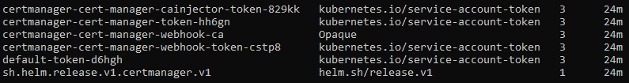
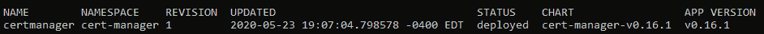

# 十一、Kubernetes上的模板代码生成和 CI/CD

本章讨论了一些更简单的方法来模板化和配置具有许多资源的大型 Kubernetes 部署。还详细介绍了在 Kubernetes 上实现**持续集成** / **持续部署** ( **CI** / **CD** )的多种方法，以及每种可能方法的优缺点。具体来说，我们讨论集群内配置项/光盘，其中一些或所有配置项/光盘步骤在我们的 Kubernetes 集群中执行，以及集群外配置项/光盘，其中所有步骤都在我们的集群之外执行。

本章的案例研究将包括从头开始创建一个 Helm 图表，并解释 Helm 图表的每一部分及其工作原理。

首先，我们将介绍 Kubernetes 资源模板生成的概况，以及应该使用模板生成工具的原因。然后，我们将介绍如何在 Kubernetes 上实现 CI/CD，首先使用 AWS 代码构建，然后使用 FluxCD。

在本章中，我们将涵盖以下主题:

*   了解在 Kubernetes 上生成模板代码的选项
*   用 Helm 和 Kustomize 在 Kubernetes 上实现模板
*   了解集群内和集群外Kubernetes的配置项/配置项范例
*   用 Kubernetes 实现集群内和集群外 CI/CD

# 技术要求

为了运行本章中详细介绍的命令，您将需要一台支持`kubectl`命令行工具的计算机以及一个工作正常的 Kubernetes 集群。参见 [*第一章*](01.html#_idTextAnchor016)*与Kubernetes的通讯*，了解几种快速启动和运行Kubernetes的方法，以及如何安装Kubernetes工具的说明。此外，您还需要一台支持 Helm CLI 工具的机器，该工具通常具有与 kubectl 相同的先决条件–有关详细信息，请查看位于[https://helm.sh/docs/intro/install/](https://helm.sh/docs/intro/install/)的 Helm 文档。

本章中使用的代码可以在本书的 GitHub 存储库中找到，网址为

[https://github . com/PacktPublishing/Cloud-Native-with-Kubernetes/tree/master/chapter 11](https://github.com/PacktPublishing/Cloud-Native-with-Kubernetes/tree/master/Chapter11)。

# 了解 Kubernetes 上模板代码生成的选项

正如在 [*第 1 章*](01.html#_idTextAnchor016)*中所讨论的，与 Kubernetes* 通信，Kubernetes i 最大的优势之一是它的 API 可以在声明性资源文件方面进行通信。这允许我们运行诸如`kubectl apply`这样的命令，并让控制平面确保集群中运行的任何资源都与我们的 YAML 或 JSON 文件相匹配。

然而，这种能力带来了一些不便。由于我们希望在配置文件中声明所有工作负载，因此任何大型或复杂的应用，尤其是包含许多微服务的应用，都可能导致需要编写和维护大量配置文件。

多种环境进一步加剧了这个问题。假设我们想要开发、试运行、UAT 和生产环境，这将需要每个 Kubernetes 资源有四个独立的 YAML 文件，假设我们想要保持每个文件一个资源的清洁度。

解决这些问题的一种方法是使用支持变量的模板系统，通过注入不同的变量集，允许单个模板文件适用于多个应用或多个环境。

为此，有几个流行的社区支持的开源选项。在这本书里，我们将集中讨论两个最受欢迎的:

*   舵
*   定制

还有很多其他的选择，包括 Kapitan、Ksonnet、Jsonnet 等等，但是对它们的全面回顾不在本书的范围之内。让我们先来回顾一下 Helm，它在很多方面都是最受欢迎的模板工具。

## 头盔

Helm 实际上扮演双重角色，一个模板/代码生成工具，一个 CI/CD 工具。它允许您创建基于 YAML 的模板，这些模板可以与变量结合，允许代码和模板跨应用和环境重用。它还附带了一个 Helm CLI 工具，可以根据模板本身推出对应用的更改。

由于这个原因，您可能会看到整个 Kubernetes 生态系统都将 Helm 作为安装工具或应用的默认方式。在本章中，我们将使用 Helm 来实现这两个目的。

现在，让我们继续讨论 Kustomize，它与 Helm 有很大不同。

## Kustomize

与 Helm 不同，Kustomize 由 Kubernetes 项目官方支持，支持直接集成到`kubectl`中。与Helm不同，Kustomize使用无变量的普通 YAML 操作，而是推荐一种*分叉和补丁*工作流程，根据所选的补丁，YAML 的部分地区被新 YAML 取代。

既然我们已经基本了解了这些工具的不同之处，我们就可以在实践中使用它们了。

# 用 Helm 和 Kustomize 在 Kubernetes 上实现模板

既然知道了我们的选项，我们就可以用一个示例应用实现每一个选项。这将允许我们理解每个工具如何处理变量和模板化过程的细节。让我们从Helm开始。

## 将头盔与 Kubernetes 一起使用

如前所述，Helm 是一个开源项目使得在 Kubernetes 上模板化和部署应用变得很容易。出于本书的目的，我们将关注最新版本(在撰写本文时)，Helm V3。之前的版本，Helm·V2，有更多的活动部件，包括一个名为*蒂勒*的控制器，可以在集群上运行。Helm V3 经过简化，仅包含 Helm CLI 工具。但是，它使用集群上的自定义资源定义来跟踪发布，我们很快就会看到。

让我们从安装 Helm 开始。

### 安装舵

如果你想使用特定版本的 Helm，可以按照[https://helm.sh/docs/intro/install/](https://helm.sh/docs/intro/install/)的特定版本文档进行安装。对于我们的用例，我们将简单地使用`get helm`脚本，它将安装最新版本。

您可以获取并运行脚本，如下所示:

```
curl -fsSL -o get_helm.sh https://raw.githubusercontent.com/helm/helm/master/scripts/get-helm-3
chmod 700 get_helm.sh
./get_helm.sh
```

现在，我们应该可以运行`helm`命令了。默认情况下，Helm 会自动使用您现有的`kubeconfig`集群和上下文，所以为了切换 Helm 的集群，您只需要使用`kubectl`来更改您的`kubeconfig`文件，就像您通常会做的那样。

要使用 Helm 安装应用，请运行`helm install`命令。但是 Helm 如何决定安装什么和如何安装呢？我们需要讨论Helm图表、Helm存储库和Helm版本的概念。

### 掌舵图、存储库和发行版

Helm 为提供了一种在 Kubernetes 上用变量模板化和部署应用的方法。为了做到这一点，我们通过一组模板指定工作负载，这被称为*舵图*。

Helm 图表由一个或多个模板、一些图表元数据和一个用最终值填充模板变量的`values`文件组成。在实践中，每个环境(或者应用，如果您正在为多个应用重用您的模板)将有一个`values`文件，这将使共享模板具有新的配置。模板和值的这种组合将用于在集群中安装或部署应用。

那么，在哪里可以存储 Helm 图表呢？您可以将它们放在 Git 存储库中，就像您可以放在任何其他 Kubernetes YAML(适用于大多数用例)一样，但是 Helm 也支持存储库的概念。一个 Helm 存储库由一个 URL 表示，可以包含多个 Helm 图表。例如，Helm在 https://hub.helm.sh/charts 有自己的官方存储库。同样，每个 Helm 图表由一个包含元数据文件的文件夹、`Chart.yaml`文件、一个或多个模板文件以及可选的值文件组成。

为了安装带有本地值文件的本地 Helm 图表，您可以为每个图表传递一个路径到`helm install`，如下命令所示:

```
helm install -f values.yaml /path/to/chart/root
```

但是，对于通常安装的图表，您也可以直接从图表存储库中安装图表，并且可以选择向本地 Helm 添加自定义存储库，以便能够从非官方来源轻松安装图表。

例如，为了通过官方的 Helm 图表安装 Drupal，您可以运行以下命令:

```
helm install -f values.yaml stable/drupal
```

这段代码从官方的 Helm 图表库中安装图表。要使用自定义存储库，您只需要首先将其添加到 Helm。例如，要安装`jetstack` Helm 存储库中托管的`cert-manager`，我们可以执行以下操作:

```
helm repo add jetstack https://charts.jetstack.io
helm install certmanager --namespace cert-manager jetstack/cert-manager
```

这段代码将`jetstack` Helm 存储库添加到本地 Helm CLI 工具中，然后通过那里托管的图表安装`cert-manager`。我们也将这次发布命名为`cert-manager`。Helm 发行版是一个使用 Helm V3 中的 Kubernetes 机密实现的概念。当我们在 Helm 中创建一个 Release 时，它将作为一个机密存储在同一个命名空间中。

为了说明这一点，我们可以使用前面的`install`命令创建一个 Helm 版本。现在就开始吧:

```
helm install certmanager --namespace cert-manager jetstack/cert-manager
```

该命令应产生以下输出，根据证书管理器的当前版本，该输出可能与略有不同。为了可读性，我们将把输出分成两部分。

首先，命令的输出给出了 Helm 版本的状态:

```
NAME: certmanager
LAST DEPLOYED: Sun May 23 19:07:04 2020
NAMESPACE: cert-manager
STATUS: deployed
REVISION: 1
TEST SUITE: None
```

如您所见，这一部分包含部署的时间戳、名称空间信息、版本和状态。接下来，我们将看到输出的注释部分:

```
NOTES:
cert-manager has been deployed successfully!
In order to begin issuing certificates, you will need to set up a ClusterIssuer
or Issuer resource (for example, by creating a 'letsencrypt-staging' issuer).
More information on the different types of issuers and how to configure them
can be found in our documentation:
https://cert-manager.io/docs/configuration/
For information on how to configure cert-manager to automatically provision
Certificates for Ingress resources, take a look at the `ingress-shim`
documentation:
https://cert-manager.io/docs/usage/ingress/
```

如您所见，我们的 Helm `install`命令产生了一条成功消息，这也给了我们一些来自`cert-manager`的关于如何使用它的信息。这个输出在安装 Helm 包时会很有帮助，因为包有时包含文档，比如前面的代码片段。现在，为了查看我们的发布对象在 Kubernetes 中的外观，我们可以运行以下命令:

```
Kubectl get secret -n cert-manager
```

这将产生以下输出:



图 11.1–kube CTL 的机密列表输出

如你所见，其中一个机密的类型是`helm.sh/release.v1`。这是Helm用来跟踪证书管理器发布的机密。

最后，要查看 Helm CLI 中列出的版本，我们可以运行以下命令:

```
helm ls -A
```

该命令将在所有名称空间中列出 Helm 版本(就像`kubectl get pods -A`将在所有名称空间中列出 pods 一样)。输出如下:



图 11.2–舵释放列表输出

现在，Helm 有了更多的运动部件，包括`upgrades`、`rollbacks`等，我们将在下一节回顾这些。为了展示Helm能做什么，我们将从头开始创建和安装一个图表。

### 创建掌舵图

因此，我们想为我们的应用创建一个 Helm 图表。让我们做好准备。我们的目标是将一个简单的 Node.js 应用轻松部署到多个环境中。为此，我们将使用应用的组件创建一个图表，然后将其与三个单独的值文件(`dev`、`staging`和`production`)组合，以便将我们的应用部署到我们的三个环境中。

让我们从 Helm 图表的文件夹结构开始。正如我们前面提到的，Helm 图表由模板、元数据文件和可选值组成。我们将在实际安装图表时注入这些值，但是我们可以这样构造我们的文件夹:

```
Chart.yaml
charts/
templates/
dev-values.yaml
staging-values.yaml
production-values.yaml
```

我们还没有提到的一件事是，你实际上可以在一个现有的图表中有一个Helm图表文件夹！这些子部分可以很容易地将复杂的应用分解成组件。出于本书的目的，我们将不使用子部分，但是如果您的应用对于单一图表来说变得过于复杂或模块化，这是一个有价值的特性。

此外，您可以看到，我们为每个环境准备了不同的环境文件，我们将在安装命令中使用这些文件。

那么，`Chart.yaml`文件是什么样子的呢？该文件将包含一些关于图表的基本元数据，通常至少如下所示:

```
apiVersion: v2
name: mynodeapp
version: 1.0.0
```

`Chart.yaml`文件支持许多可选字段，您可以在[https://helm.sh/docs/topics/charts/](https://helm.sh/docs/topics/charts/)上看到，但是出于本教程的目的，我们将保持简单。必填字段为`apiVersion`、`name`和`version`。

在我们的`Chart.yaml`文件中，`apiVersion`对应于图表对应的 Helm 版本。有点混乱的是，目前版本的 Helm，Helm V3 使用`apiVersion` `v2`，而包括 Helm V2 在内的旧版 Helm 也使用`apiVersion` `v2`。

接下来，`name`字段对应我们图表的名称。这是非常不言自明的，尽管请记住，我们有能力命名一个图表的特定版本，这对于多种环境来说都很方便。

最后，我们有`version`字段，它对应于图表的版本。该字段支持**版本**(语义版本控制)。

那么，我们的模板实际上是什么样子的呢？掌舵图使用引擎盖下的 Go 模板库(更多信息请参见[https://golang.org/pkg/text/template/](https://golang.org/pkg/text/template/))，支持各种强大的操作、辅助功能等等。现在，我们将保持事情极其简单，让您了解基本知识。对Helm图表创作的全面讨论可能会成为一本书！

首先，我们可以使用一个 Helm CLI 命令来自动生成我们的`Chart`文件夹，其中包含所有之前为您生成的文件和文件夹，减去子部分和值文件。让我们尝试一下——首先使用以下命令创建一个新的 Helm 图表:

```
helm create myfakenodeapp
```

该命令将在名为`myfakenodeapp`的文件夹中创建一个自动生成的图表。让我们使用以下命令检查`templates`文件夹的内容:

```
Ls myfakenodeapp/templates
```

该命令将产生以下输出:

```
helpers.tpl
deployment.yaml
NOTES.txt
service.yaml
```

这个自动生成的图表可以作为一个起点提供很多帮助，但是为了本教程的目的，我们将从头开始制作这些图表。

创建一个名为`mynodeapp`的新文件夹，并将我们之前展示的`Chart.yaml`文件放入其中。然后，在里面创建一个名为`templates`的文件夹。

需要记住的一点是:Kubernetes资源 YAML 本身就是一个有效的 Helm 模板。不需要在模板中使用任何变量。你可以只写普通的 YAML，Helm安装仍然会工作。

为了展示这一点，让我们从向模板文件夹添加一个模板文件开始。称之为`deployment.yaml`并包含以下非变量 YAML:

deployment.yaml:

```
apiVersion: apps/v1
kind: Deployment
metadata:
  name: frontend-myapp
  labels:
    app: frontend-myapp
spec:
  replicas: 2
  selector:
    matchLabels:
      app: frontend-myapp
  template:
    metadata:
      labels:
        app: frontend-myapp
    spec:
      containers:
      - name: frontend-myapp
        image: myrepo/myapp:1.0.0
        ports:
        - containerPort: 80
```

如你所见，这个 YAML 只是一个常规的Kubernetes资源 YAML。我们的模板中没有使用任何变量。

现在，我们有足够的资源来安装我们的图表。接下来让我们做那个。

### 安装和卸载 Helm 图表

要使用 Helm V3 安装一个图表，您可以从图表的`root`目录运行一个`helm install`命令:

```
helm install myapp .
```

这个安装命令创建一个名为`frontend-app`的 Helm 版本，并安装我们的图表。现在，我们的图表只包含一个带有两个Pod 的部署，我们应该能够看到它在集群中运行，命令如下:

```
kubectl get deployment
```

这将产生以下输出:

```
NAMESPACE  NAME            READY   UP-TO-DATE   AVAILABLE   AGE
default    frontend-myapp  2/2     2            2           2m
```

从输出中可以看到，我们的 Helm `install`命令已经在 Kubernetes 中成功创建了一个部署对象。

卸载我们的图表也同样容易。我们可以通过运行以下命令来安装通过我们的图表安装的所有 Kubernetes 资源:

```
helm uninstall myapp
```

这个`uninstall`命令(【Helm V2 中的 T1】)只是取了我们 Helm 版本的名字。

现在，到目前为止，我们还没有使用Helm的任何真正的力量——我们一直在使用它作为一个没有任何附加功能的替代物。让我们通过在图表中实现一些变量来改变这种情况。

### 使用模板变量

将变量添加到我们的 Helm 图表模板就像使用双括号–`{{ }}`–语法一样简单。我们放在双括号中的内容将直接取自我们使用点符号安装图表时使用的值。

让我们看一个简单的例子。到目前为止，我们已经将我们的应用名称(和容器映像名称/版本)硬编码到我们的 YAML 文件中。如果我们想要使用 Helm 图表来部署不同的应用或不同的应用版本，这将极大地限制我们。

为了解决这个问题，我们将向图表中添加模板变量。看看这个生成的模板:

模板化-deployment.yaml:

```
apiVersion: apps/v1
kind: Deployment
metadata:
  name: frontend-{{ .Release.Name }}
  labels:
    app: frontend-{{ .Release.Name }}
    chartVersion: {{ .Chart.version }}
spec:
  replicas: 2
  selector:
    matchLabels:
      app: frontend-{{ .Release.Name }}
  template:
    metadata:
      labels:
        app: frontend-{{ .Release.Name }}
    spec:
      containers:
      - name: frontend-{{ .Release.Name }}
        image: myrepo/{{ .Values.image.name }}
:{{ .Values.image.tag }}
        ports:
        - containerPort: 80
```

让我们看一下这个 YAML 文件，回顾一下我们的变量。我们在这个文件中使用了一些不同类型的变量，但是它们都使用相同的点符号。

Helm 实际上支持一些不同的顶级对象。这些是您可以在模板中引用的主要对象:

*   `.Chart`:用于引用`Chart.yaml`文件中的元数据值
*   `.Values`:用于引用安装时从`values`文件传入图表的值
*   `.Template`:用于引用当前模板文件的一些信息
*   `.Release`:用于参考头盔发布的信息
*   `.Files`:用于引用图表中非 YAML 模板的文件(例如`config`文件)
*   `.Capabilities`:用于引用目标 Kubernetes 集群的信息(换句话说就是版本)

在我们的 YAML 文件中，我们使用了其中的几个。首先，我们在几个地方引用了我们版本的`name`(包含在`.Release`对象中)。接下来，我们将利用`Chart`对象向`chartVersion`键注入元数据。最后，我们使用`Values`对象来引用容器映像`name`和`tag`。

现在，我们缺少的最后一件事是我们将通过`values.yaml`或命令行界面命令注入的实际值。其他一切都将使用`Chart.yaml`创建，或者我们将在运行时通过`helm`命令本身注入的值。

考虑到这一点，让我们从模板中创建我们的价值观文件，我们将传递我们的形象`name`和`tag`。因此，让我们以适当的格式包括这些内容:

```
image:
  name: myapp
  tag: 2.0.1
```

现在，我们可以通过我们的Helm图表安装我们的应用！使用以下命令执行此操作:

```
helm install myrelease -f values.yaml .
```

如您所见，我们正在用`-f`键传递我们的值(您也可以使用`--values`)。这个命令将安装我们应用的版本。

一旦我们有了版本，我们就可以使用 Helm CLI 升级到新版本或回滚到旧版本–我们将在下一节介绍这一点。

### 升级和回滚

现在我们有了一个活跃的头盔版本，我们可以升级它了。让我们对我们的`values.yaml`做一个小小的改变:

```
image:
  name: myapp
  tag: 2.0.2
```

为了使这成为我们版本的新版本，我们还需要更改我们的图表 YAML:

```
apiVersion: v2
name: mynodeapp
version: 1.0.1
```

现在，我们可以使用以下命令升级我们的版本:

```
helm upgrade myrelease -f values.yaml .
```

如果出于某种原因，我们想回滚到早期版本，可以使用以下命令:

```
helm rollback myrelease 1.0.0
```

如您所见，Helm 允许应用的无缝模板化、发布、升级和回滚。正如我们之前提到的，Kustomize 击中了许多相同的点，但以一种非常不同的方式做到了这一点——让我们看看是如何做到的。

## 用 Kubernetes 进行 Kustomize

虽然 Helm 图表可能会变得相当复杂，但 Kustomize 使用 YAML 时没有任何变量，而是使用了一种基于补丁和覆盖的方法，将不同的配置应用于基本的 Kubernetes 资源集。

使用 Kustomize 非常简单，正如我们在本章前面提到的，没有必备的 CLI 工具。一切都通过使用`kubectl apply -k /path/kustomize.yaml`命令工作，无需安装任何新的东西。但是，我们还将使用 Kustomize CLI 工具演示该流程。

重要说明

要安装 Kustomize CLI 工具，可以查看[https://kubernetes-sigs.github.io/kustomize/installation](https://kubernetes-sigs.github.io/kustomize/installation)的安装说明。

目前，安装使用以下命令:

```
curl -s "https://raw.githubusercontent.com/\
kubernetes-sigs/kustomize/master/hack/install_kustomize.sh"  | bash
```

现在我们已经安装了 Kustomize，让我们将 Kustomize 应用到我们现有的用例中。我们将从简单的Kubernetes YAML 开始(在我们开始添加Helm变量之前):

普通部署. yaml:

```
apiVersion: apps/v1
kind: Deployment
metadata:
  name: frontend-myapp
  labels:
    app: frontend-myapp
spec:
  replicas: 2
  selector:
    matchLabels:
      app: frontend-myapp
  template:
    metadata:
      labels:
        app: frontend-myapp
    spec:
      containers:
      - name: frontend-myapp
        image: myrepo/myapp:1.0.0
        ports:
        - containerPort: 80
```

创建了初始的`deployment.yaml`之后，我们现在可以创建一个 Kustomization 文件，我们称之为`kustomize.yaml`。

当我们稍后使用`-k`参数调用`kubectl`命令时，`kubectl`将查找这个`kustomize` YAML 文件，并使用它来确定哪些补丁应用于传递给`kubectl`命令的所有其他 YAML 文件。

Kustomize 允许我们修补单个值或设置要自动设置的公共值。一般来说，Kustomize 将创建新行，或者如果密钥已经存在于 YAML，则更新旧行。有三种方法可以应用这些更改:

*   直接在 Kustomization 文件中指定更改。
*   将`PatchStrategicMerge`策略与一个`patch.yaml`文件和一个 Kustomization 文件一起使用。
*   将`JSONPatch`策略与一个`patch.yaml`文件和一个 Kustomization 文件一起使用。

让我们从使用一个专门修补 YAML 的 Kustomization 文件开始。

### 直接在自定义文件中指定更改

如果我们想直接在 Kustomization 文件中指定更改，我们可以这样做，但是我们的选项有些有限。我们可以用于 Kustomization 文件的密钥类型如下:

*   `resources`–指定应用补丁时要自定义哪些文件
*   `transformers`–从 Kustomization 文件中直接应用补丁的方法
*   `generators`–从 Kustomization 文件创建新资源的方法
*   `meta`–设置可以影响生成器、转换器和资源的元数据字段

如果我们想在我们的 Kustomization 文件中指定直接补丁，我们需要使用转换器。前面提到的`PatchStrategicMerge`和`JSONPatch`合并策略是两种类型的变压器。但是，要将更改直接应用到 Kustomization 文件，我们可以使用几个变形金刚中的一个，包括`commonLabels`、`images`、`namePrefix`和`nameSuffix`。

在下面的 Kustomization 文件中，我们将使用`commonLabels`和`images`变压器对初始部署`YAML`进行更改。

部署-kustomization-1.yaml:

```
apiVersion: kustomize.config.k8s.io/v1beta1
kind: Kustomization
resources:
- deployment.yaml
namespace: default
commonLabels:
  app: frontend-app
images:
  - name: frontend-myapp
    newTag: 2.0.0
    newName: frontend-app-1
```

这个特殊的`Kustomization.yaml`文件将映像标签从`1.0.0`更新为`2.0.0`，将应用的名称从`frontend-myapp`更新为`frontend-app`，并将容器的名称从`frontend-myapp`更新为`frontend-app-1`。

要了解每台变压器的详细情况，您可以查看位于[https://kubernetes-sigs.github.io/kustomize/](https://kubernetes-sigs.github.io/kustomize/)的库斯托米兹医生。Kustomize 文件假设`deployment.yaml`与自身在同一个文件夹中。

要查看将 Kustomize 文件应用于部署时的结果，我们可以使用 Kustomize CLI 工具。我们将使用以下命令来生成 kustomized 输出:

```
kustomize build deployment-kustomization1.yaml
```

该命令将给出以下输出:

```
apiVersion: apps/v1
kind: Deployment
metadata:
  name: frontend-myapp
  labels:
    app: frontend-app
spec:
  replicas: 2
  selector:
    matchLabels:
      app: frontend-app
  template:
    metadata:
      labels:
        app: frontend-app
    spec:
      containers:
      - name: frontend-app-1
        image: myrepo/myapp:2.0.0
        ports:
        - containerPort: 80
```

如您所见，我们的 Kustomization 文件中的定制已经应用。因为一个`kustomize build`命令输出 Kubernetes YAML，我们可以很容易地将输出部署到 Kubernetes，如下所示:

```
kustomize build deployment-kustomization.yaml | kubectl apply -f -
```

接下来，让我们看看如何使用带有`PatchStrategicMerge`的 YAML 文件来修补我们的部署。

### 使用补丁策略合并指定更改

为了说明的一个`PatchStrategicMerge`策略，我们再次从我们相同的`deployment.yaml`文件开始。这一次，我们将通过`kustomization.yaml`文件和`patch.yaml`文件的组合发布我们的更改。

首先，让我们创建我们的`kustomization.yaml`文件，如下所示:

部署-kustomization-2.yaml:

```
apiVersion: kustomize.config.k8s.io/v1beta1
kind: Kustomization
resources:
- deployment.yaml
namespace: default
patchesStrategicMerge:
  - deployment-patch-1.yaml
```

如您所见，我们的 Kustomization 文件在`patchesStrategicMerge`部分引用了一个新文件`deployment-patch-1.yaml`。这里可以添加任意数量的 YAML 补丁文件。

然后，我们的`deployment-patch-1.yaml`文件是一个简单的文件，它反映了我们打算进行的更改的部署。这是它的样子:

部署-补丁-1.yaml:

```
apiVersion: apps/v1
kind: Deployment
metadata:
  name: frontend-myapp
  labels:
    app: frontend-myapp
spec:
  replicas: 4
```

此修补程序文件是原始部署中字段的子集。在这种情况下，它只是将`replicas`从`2`更新为`4`。同样，要应用更改，我们可以使用以下命令:

```
 kustomize build deployment-kustomization2.yaml
```

但是，我们也可以在`kubectl`命令中使用`-k`标志！事情是这样的:

```
Kubectl apply -k deployment-kustomization2.yaml
```

该命令相当于以下命令:

```
kustomize build deployment-kustomization2.yaml | kubectl apply -f -
```

类似于`PatchStrategicMerge`，我们也可以在我们的 Kustomization 中指定基于 JSON 的补丁——让我们现在来看看。

### 使用 JSONPatch 指定更改

要用 JSON 补丁文件指定更改，过程与涉及 YAML 补丁的过程非常相似。

首先，我们需要我们的 Kustomization 文件。看起来是这样的:

部署-kustomization-3.yaml:

```
apiVersion: kustomize.config.k8s.io/v1beta1
kind: Kustomization
resources:
- deployment.yaml
namespace: default
patches:
- path: deployment-patch-2.json
  target:
    group: apps
    version: v1
    kind: Deployment
    name: frontend-myapp
```

如您所见，我们的 Kustomize 文件有一个部分，`patches`，它引用了一个 JSON 补丁文件和一个目标。在本节中，您可以引用任意多的 JSON 补丁。`target`用于确定资源部分指定的哪个 Kubernetes 资源将接收补丁。

最后，我们需要我们的补丁 JSON 本身，如下所示:

部署-补丁-2.json:

```
[
  {
   "op": "replace",
   "path": "/spec/template/spec/containers/0/name",
   "value": "frontend-myreplacedapp"
  }
]
```

该补丁应用后，将对我们第一个容器的名称执行`replace`操作。您可以沿着我们原始的`deployment.yaml`文件的路径查看它是否引用了第一个容器的名称。它会用新值`frontend-myreplacedapp`替换这个名称。

现在，我们已经在 Kubernetes 资源模板化以及 Kustomize 和 Helm 的发布方面有了坚实的基础，我们可以转向 Kubernetes 的自动化部署。在下一节中，我们将研究用 Kubernetes 实现 CI/CD 的两种模式。

# 了解集群内和集群外 Kubernetes 上的 CI/CD 范例

对 Kubernetes 的持续集成和部署可以采取多种形式。

大多数 DevOps 工程师都会熟悉詹金斯、TravisCI 等工具。这些工具非常相似，因为它们提供了一个执行环境来构建应用、执行测试以及在受控环境中调用任意的 Bash 脚本。其中一些工具在容器中运行命令，而另一些则不运行。

说到 Kubernetes，在如何以及在哪里使用这些工具方面有多种学派。还有一种更新的 CI/CD 平台，它与 Kubernetes 原语的耦合要紧密得多，而且许多都是为在集群本身上运行而设计的。

为了彻底讨论工具如何与 Kubernetes 相关，我们将把我们的管道分成两个逻辑步骤:

1.  **构建**:编译、测试应用、构建容器映像并发送到映像存储库
2.  **部署**:通过 Kubernetes、Helm 或其他工具更新 Kubernetes 资源

出于本书的目的，我们将主要关注第二个以部署为中心的步骤。虽然许多可用的选项都处理构建和部署步骤，但是构建步骤几乎可以在任何地方发生，不值得我们在一本关于 Kubernetes 的细节的书中关注。

考虑到这一点，为了讨论我们的工具选项，我们将把我们的工具集分成两类，直到管道的部署部分:

*   群集外配置项/光盘
*   集群内配置项/光盘

## 簇外置信区间/置信区间

在第一个模式中，我们的 CI/CD 工具在目标 Kubernetes 集群之外运行。我们称之为集群外配置项/光盘。有一个灰色区域，该工具可能在一个单独的 Kubernetes 集群中运行，该集群专注于 CI/CD，但我们现在将忽略该选项，因为这两个类别之间的差异仍然主要有效。

您经常会发现像 Jenkins 这样的行业标准工具与这种模式一起使用，但是任何能够以安全的方式运行脚本和保留密钥的 CI 工具都可以在这里工作。几个例子是**git lab CI**`,`**circle CI****TravisCI****GitHub Actions****AWS CodeBuild**。Helm 也是这种模式的一大部分，因为集群外 CI 脚本可以调用 Helm 命令来代替 kubectl。

这种模式的一些优势在于它的简单性和可扩展性。这是一种基于`push`的模式，其中代码的变化同步触发 Kubernetes 工作负载的变化。

集群外 CI/CD 的一些弱点是在推送到许多集群时的可扩展性，以及需要将集群凭证保留在 CI/CD 管道中，以便它能够调用 kubectl 或 Helm 命令。

## 簇内置信区间/置信区间

在第二种模式中，我们的工具运行在我们的应用运行的同一个集群上，这意味着 CI/CD 发生在与我们的应用相同的 Kubernetes 上下文中，作为 pods。我们称之为集群内配置项/光盘。这种集群内模式仍然可以让“构建”步骤发生在集群外部，但是部署步骤发生在集群内部。

自 Kubernetes 发布以来，这些类型的工具越来越受欢迎，许多工具使用自定义资源定义和自定义控制器来完成它们的工作。例如 **FluxCD** 、 **Argo CD** 、 **JenkinsX** 和 **Tekton Pipelines** 。 **GitOps** 模式在这些工具中很受欢迎，在这种模式中，Git 存储库被用作集群上应该运行的应用的真实来源。

集群内 CI/CD 模式的一些优势是可伸缩性和安全性。通过让集群通过 GitOps 操作模型从 GitHub“拉”出变更，解决方案可以扩展到许多集群。此外，它消除了在配置项/光盘系统中保留强大的集群凭据的需要，而不是在集群本身上拥有 GitHub 凭据，从安全角度来看，这可能会好得多。

集群内 CI/CD 模式的缺点包括复杂性，因为这种基于拉的操作略微异步(因为`git pull`通常发生在循环上，而不总是在推送更改时准确发生)。

# 用 Kubernetes 实现簇内和簇外 CI/CD

既然有这么多的 CI/CD 和 Kubernetes 的选项，我们就选择两个选项，逐个实现，这样你就可以比较它们的特征集了。首先，我们将在 AWS CodeBuild 上实现 CI/CD 到 Kubernetes，这是一个很好的示例实现，可以在任何可以运行 Bash 脚本的外部 CI 系统上重用，包括 Bitbucket Pipelines、Jenkins 等。然后，我们将继续讨论 FluxCD，这是一个基于集群内 GitOps 的 CI 选项，是 Kubernetes 本地的。让我们从外部选项开始。

## 用 AWS 代码构建实现 Kubernetes CI

正如前面提到的，我们的 AWS CodeBuild CI 实现将很容易在任何基于脚本的 CI 系统中复制。在许多情况下，我们将使用的管道 YAML 定义几乎相同。同样，正如我们之前讨论的，我们将跳过容器映像的实际构建。相反，我们将关注实际的部署部分。

为了快速介绍 AWS CodeBuild，它是一个基于脚本的 CI 工具，运行 Bash 脚本，就像许多其他类似的工具一样。在高级工具 AWS CodePipeline 的上下文中，多个独立的 AWS CodeBuild 步骤可以组合成更大的管道。

在我们的示例中，我们将同时使用 AWS 代码构建和 AWS 代码管道。我们将不深入讨论如何使用这两个工具，而是将我们的讨论与如何使用它们来部署到 Kubernetes 保持特定的联系。

重要说明

我们强烈建议您阅读并查看代码管道和代码构建的文档，因为我们不会涵盖本章中的所有基础知识。代码构建可以在[https://docs . AWS . Amazon . com/code build/latest/user guide/welcome . html](https://docs.aws.amazon.com/codebuild/latest/userguide/welcome.html)找到文档，codepipeline 可以在[https://docs . AWS . Amazon . com/code pipeline/latest/user guide/welcome . html](https://docs.aws.amazon.com/codepipeline/latest/userguide/welcome.html)找到文档。

实际上，您将有两个代码管道，每个都有一个或多个代码构建步骤。第一个代码管道是在 AWS 代码提交或另一个 Git 存储库中(如 GitHub)的代码更改时触发的。

该管道的第一步代码构建运行测试并构建容器映像，将映像推送到 AWS **弹性容器存储库** ( **ECR** )。第一个管道的第二个代码构建步骤将新映像部署到 Kubernetes。

每当我们使用 Kubernetes 资源文件(基础设施存储库)向我们的二级 Git 存储库提交变更时，第二个代码管道就会被触发。它将使用相同的过程更新 Kubernetes 资源。

让我们从第一个代码管道开始。如前所述，它包含两个代码构建步骤:

1.  首先，测试和构建容器映像，并将其推送到 ECR
2.  其次，将更新的容器部署到 Kubernetes

正如我们在本节前面提到的，我们不会在代码到容器映像管道上花费太多时间，但是这里有一个示例(未准备好生产)`codebuild` YAML 来实现第一步:

Pipeline-1-codebuild-1.yaml:

```
version: 0.2
phases:
  build:
    commands:
      - npm run build
  test:
    commands:
      - npm test
  containerbuild:
    commands:
      - docker build -t $ECR_REPOSITORY/$IMAGE_NAME:$IMAGE_TAG .
  push:
    commands:
      - docker push_$ECR_REPOSITORY/$IMAGE_NAME:$IMAGE_TAG
```

这个代码构建管道由四个阶段组成。代码构建管道规范是在 YAML 编写的，并且包含一个对应于代码构建规范版本的`version`标签。然后，我们有一个`phases`部分，按顺序执行。这个代码构建首先运行一个`build`命令，然后在测试阶段运行一个`test`命令。最后，`containerbuild`阶段创建容器映像，`push`阶段将映像推送到我们的容器存储库中。

需要记住的一点是，在 CodeBuild 中，每个前面带有`$`的值都是一个环境变量。这些可以通过 AWS 控制台或 AWS 命令行界面定制，有些可以直接从 Git 存储库中获得。

现在让我们来看看 YAML 的第一个代码管道的第二个代码构建步骤:

管道-1-代码构建-2.yaml:

```
version: 0.2
phases:
  install:
    commands:
      - curl -o kubectl https://amazon-eks.s3.us-west-2.amazonaws.com/1.16.8/2020-04-16/bin/darwin/amd64/kubectl  
      - chmod +x ./kubectl
      - mkdir -p $HOME/bin && cp ./kubectl $HOME/bin/kubectl && export PATH=$PATH:$HOME/bin
      - echo 'export PATH=$PATH:$HOME/bin' >> ~/.bashrc
      - source ~/.bashrc
  pre_deploy:
    commands:
      - aws eks --region $AWS_DEFAULT_REGION update-kubeconfig --name $K8S_CLUSTER
  deploy:
    commands:
      - cd $CODEBUILD_SRC_DIR
      - kubectl set image deployment/$KUBERNETES-DEPLOY-NAME myrepo:"$IMAGE_TAG"
```

让我们把这个文件分解一下。我们的代码构建设置分为三个阶段:`install`、`pre_deploy`和`deploy`。在`install`阶段，我们安装 kubectl CLI 工具。

然后，在`pre_deploy`阶段，我们使用一个 AWS CLI 命令和几个环境变量来更新我们的`kubeconfig`文件，以便与我们的 EKS 集群通信。在任何其他配置项工具中(或者在不使用 EKS 时)，您可以使用不同的方法向配置项工具提供集群凭据。这里使用安全选项很重要，因为将`kubeconfig`文件直接包含在 Git 存储库中是不安全的。通常，环境变量的某种组合在这里会很好。Jenkins、CodeBuild、CircleCI 和更有自己的系统针对这一点。

最后，在`deploy`阶段，我们使用`kubectl`用第一个代码构建步骤中指定的新映像标签更新我们的部署(也包含在环境变量中)。这个`kubectl rollout restart`命令将确保为我们的部署启动新的Pod 。结合使用`Always`的`imagePullPolicy`，这将导致我们部署新的应用版本。

在这种情况下，我们使用 ECR 中的特定映像标签名称来修补我们的部署。`$IMAGE_TAG`环境变量将自动填充来自 GitHub 的最新标签，因此我们可以使用它来自动向我们的部署推出新的容器映像。

接下来，让我们看看我们的第二个代码管道。这一个只包含一个步骤——它从一个单独的 GitHub 存储库(我们的“基础设施存储库”)中监听变更。这个存储库不包含我们的应用本身的代码，而是包含 Kubernetes 资源 YAMLs。因此，我们可以更改 Kubernetes 资源的 YAML 值——例如，部署中副本的数量，并在代码管道运行后在 Kubernetes 中看到它的更新。这个模式可以很容易地扩展到使用 Helm 或 Kustomize。

让我们看看第二个代码管道的第一步，也是唯一一步:

Pipeline-2-codebuild-1.yaml:

```
version: 0.2
phases:
  install:
    commands:
      - curl -o kubectl https://amazon-eks.s3.us-west-2.amazonaws.com/1.16.8/2020-04-16/bin/darwin/amd64/kubectl  
      - chmod +x ./kubectl
      - mkdir -p $HOME/bin && cp ./kubectl $HOME/bin/kubectl && export PATH=$PATH:$HOME/bin
      - echo 'export PATH=$PATH:$HOME/bin' >> ~/.bashrc
      - source ~/.bashrc
  pre_deploy:
    commands:
      - aws eks --region $AWS_DEFAULT_REGION update-kubeconfig --name $K8S_CLUSTER
  deploy:
    commands:
      - cd $CODEBUILD_SRC_DIR
      - kubectl apply -f .
```

如您所见，这个代码构建规范与我们之前的非常相似。像以前一样，我们安装 kubectl 并准备好与我们的 Kubernetes 集群一起使用。因为我们在 AWS 上运行，所以我们使用 AWS 命令行界面来实现，但是这可以通过多种方式来实现，包括向我们的代码构建环境添加一个`Kubeconfig`文件。

不同之处在于，我们不是用新版本的应用修补特定的部署，而是在整个基础架构文件夹中运行一个全面的`kubectl apply`命令。这样就可以将 Git 中执行的任何更改应用到我们集群中的资源。例如，如果我们通过更改`deployment.yaml`文件中的值将我们的部署从 2 个副本扩展到 20 个副本，它将在这个代码管道步骤中部署到 Kubernetes，并且部署将会扩大。

现在我们已经介绍了使用集群外 CI/CD 环境对 Kubernetes 资源进行更改的基础知识，让我们来看看一个完全不同的 CI 范例，其中管道在我们的集群上运行。

## 用 FluxCD 实现 Kubernetes CI

对于我们的集群内配置项工具，我们将使用 **FluxCD** 。集群内 CI 有几个选项，包括 **ArgoCD** 和 **JenkinsX** ，但是我们喜欢 **FluxCD** 是因为它相对简单，并且它自动用新的容器版本更新 pods，而不需要任何额外的配置。另外，我们将使用 FluxCD 的 Helm 集成来管理部署。让我们从安装 FluxCD 开始(我们假设您已经安装了本章前面部分的 Helm)。在撰写本书时，这些安装遵循 Helm 兼容性的官方 FluxCD 安装说明。

官方的 FluxCD 文档可以在[https://docs.fluxcd.io/](https://docs.fluxcd.io/)找到，强烈推荐大家看一下！FluxCD 是一个非常复杂的工具，我们在这本书里只是在抓表面。全面回顾不在讨论范围之内，我们只是想向您介绍集群内 CI/CD 模式和相关工具。

让我们从在集群上安装 FluxCD 开始我们的回顾。

### 安装磁通卡(H3)

使用 Helm 只需几个步骤即可轻松安装 FluxCD:

1.  首先，我们需要添加通量舵图表库:

    ```
    helm repo add fluxcd https://charts.fluxcd.io
    ```

2.  接下来，我们需要添加一个自定义资源定义，FluxCD 需要该定义以便能够使用 Helm 版本:

    ```
    kubectl apply -f https://raw.githubusercontent.com/fluxcd/helm-operator/master/deploy/crds.yaml
    ```

3.  Before we can install the FluxCD Operator (which is the core of FluxCD functionality on Kubernetes) and the FluxCD Helm Operator, we need to create a namespace for FluxCD to live in:

    ```
    kubectl create namespace flux
    ```

    现在我们可以安装 FluxCD 的主要部分，但是我们需要给 FluxCD 一些关于我们的 Git 存储库的附加信息。

    为什么呢？因为 FluxCD 使用 GitOps 模式进行更新和部署。这意味着 FluxCD 将每隔几分钟主动联系我们的 Git 存储库，而不是响应 Git 钩子，例如 CodeBuild。

    FluxCD 还将通过基于拉动的策略来响应新的 ECR 映像，但我们稍后会谈到这一点。

4.  To install the main pieces of FluxCD, run the following two commands and replace `GITHUB_USERNAME` and `REPOSITORY_NAME` with the GitHub user and repository that you will be storing your workload specs (Kubernetes YAML or Helm charts) in.

    这个指令集假设 Git 存储库是公共的，但很可能不是。由于大多数组织都使用私有存储库，所以 FluxCD 有特定的配置来处理这种情况——只需在[https://docs . FluxCD . io/en/latest/tutories/get-start-helm/](https://docs.fluxcd.io/en/latest/tutorials/get-started-helm/)查看文档。事实上，要了解 FluxCD 的真正威力，您需要让它在任何情况下都能高级访问您的 Git 存储库，因为 FluxCD 可以写入您的 Git 存储库，并在创建新的容器映像时自动更新清单。然而，我们不会在本书中讨论这个功能。FluxCD 文档绝对值得仔细阅读，因为这是一项复杂的技术，具有许多特性。要告诉 FluxCD 要查看哪个 GitHub 存储库，可以在使用 Helm 安装时设置变量，如下命令所示:

    ```
    helm upgrade -i flux fluxcd/flux \
    --set git.url=git@github.com:GITHUB_USERNAME/REPOSITORY_NAME \
    --namespace flux
    helm upgrade -i helm-operator fluxcd/helm-operator \
    --set git.ssh.secretName=flux-git-deploy \
    --namespace flux
    ```

    如您所见，我们需要传递我们的 GitHub 用户名、我们的存储库的名称，以及一个将用于我们在 Kubernetes 中的 GitHub 机密的名称。

    此时，FluxCD 已完全安装在我们的集群中，并指向我们在 Git 上的基础架构存储库！如前所述，这个 GitHub 存储库将包含 Kubernetes YAML 或 Helm 图表，FluxCD 将在此基础上更新集群中运行的工作负载。

5.  为了让 Flux 真正有所作为，我们需要为 Flux 创建实际的清单。我们使用一个`HelmRelease` YAML 文件来完成，如下所示:

赫尔穆特-1：

```
apiVersion: helm.fluxcd.io/v1
kind: HelmRelease
metadata:
  name: myapp
  annotations:
    fluxcd.io/automated: "true"
    fluxcd.io/tag.chart-image: glob:myapp-v*
spec:
  releaseName: myapp
  chart:
    git: ssh://git@github.com/<myuser>/<myinfrastructurerepository>/myhelmchart
    ref: master
    path: charts/myapp
  values:
    image:
      repository: myrepo/myapp
      tag: myapp-v2
```

让我们把这个文件分开。我们正在指定 Git 存储库，Flux 将在其中为我们的应用找到 Helm 图表。我们还在`HelmRelease`上标注了`automated`标注，告知 Flux 每隔几分钟去轮询一次容器镜像库，看看是否有新版本需要部署。为了帮助实现这一点，我们包含了一个`chart-image`过滤器模式，标记的容器映像必须匹配该模式才能触发重新部署。最后，在值部分，我们有 Helm 值，将用于 Helm 图表的初始安装。

为了给 FluxCD 这个信息，我们只需要将这个文件添加到我们的 GitHub 存储库的根目录中，并推动一个更改。

一旦我们将这个发布文件`helmrelease-1.yaml`添加到我们的 Git 存储库中，Flux 将在几分钟内获取它，然后在`chart`值中查找指定的 Helm 图表。只有一个问题——我们还没有成功！

目前，我们在 GitHub 上的基础设施存储库只包含我们的单一 Helm 版本文件。文件夹内容如下所示:

```
helmrelease1.yaml
```

为了结束循环并允许 Flux 实际部署我们的 Helm 图表，我们需要将其添加到这个基础架构存储库中。让我们这样做，使 GitHub 存储库中的最终文件夹内容如下所示:

```
helmrelease1.yaml
myhelmchart/
  Chart.yaml
  Values.yaml
  Templates/
    … chart templates
```

现在，当 FluxCD 接下来检查 GitHub 上的基础设施存储库时，它将首先找到 Helm 发行版 YAML 文件，然后该文件将指向我们的新 Helm 图表。

FluxCD 有了新版本和 Helm 图表，然后将我们的 Helm 图表部署到 Kubernetes！

然后，每当对 Helm 发行版 YAML 或 Helm 图表中的任何文件进行更改时，FluxCD 都会将其取出，并在几分钟内(在其下一个循环中)部署更改。

此外，每当带有与过滤模式匹配的标签的新容器映像被推送到映像存储库时，就会自动部署新版本的应用——就这么简单。这意味着 FluxCD 正在监听两个位置——基础设施 GitHub 存储库和容器存储库，并将向其中任何一个位置部署任何更改。

您可以看到这是如何映射到我们的集群外配置项/光盘实现的，在该实现中，我们有一个代码管道来部署我们的应用容器的新版本，还有另一个代码管道来部署对我们的基础架构存储库的任何更改。FluxCD 以基于拉的方式做同样的事情。

# 总结

在本章中，我们学习了在 Kubernetes 上生成模板代码。我们回顾了如何使用 Helm 和 Kustomize 创建灵活的资源模板。有了这些知识，您将能够使用解决方案、创建或部署版本来模板化复杂的应用。然后，我们回顾了两种类型的 CI/CD；首先，通过 kubectl 将外部 CI/CD 部署到 Kubernetes，然后使用 FluxCD 实现集群内 CI 范例。有了这些工具和技术，您将能够为生产应用设置 CI/CD 到 Kubernetes。

在下一章中，我们将回顾 Kubernetes 上的安全性和合规性，这是当今软件环境中的一个重要主题。

# 问题

1.  Helm 和 Kustomize 模板化有什么区别？
2.  使用外部配置项/光盘设置时，应该如何处理Kubernetes应用编程接口凭据？
3.  为什么集群内配置项设置可能比集群外设置更可取，有哪些原因？反之亦然？

# 进一步阅读

*   kutomiza docs:https:[https://kubrines-sigs . github . io/kutomiza/](https://kubernetes-sigs.github.io/kustomize/)
*   helm docs[https://docs . flux CD . io/en/latest/教程/入门-helm/](https://docs.fluxcd.io/en/latest/tutorials/get-started-helm/)