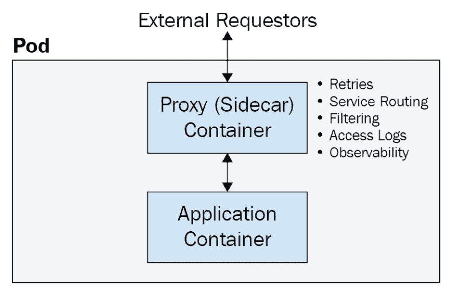
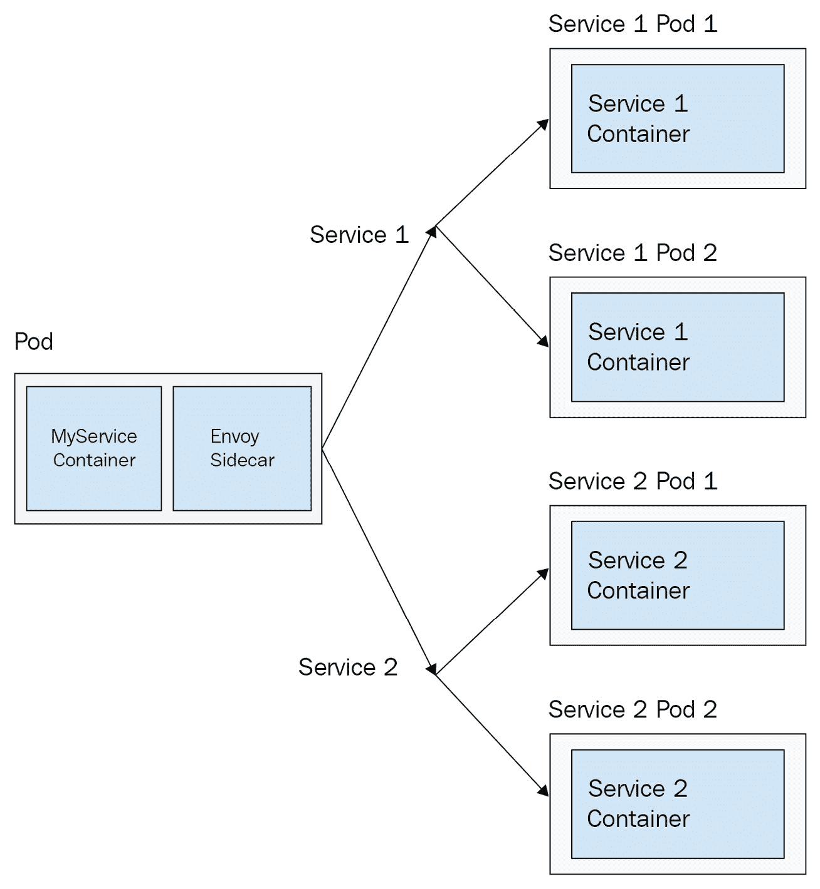
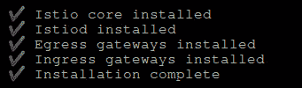
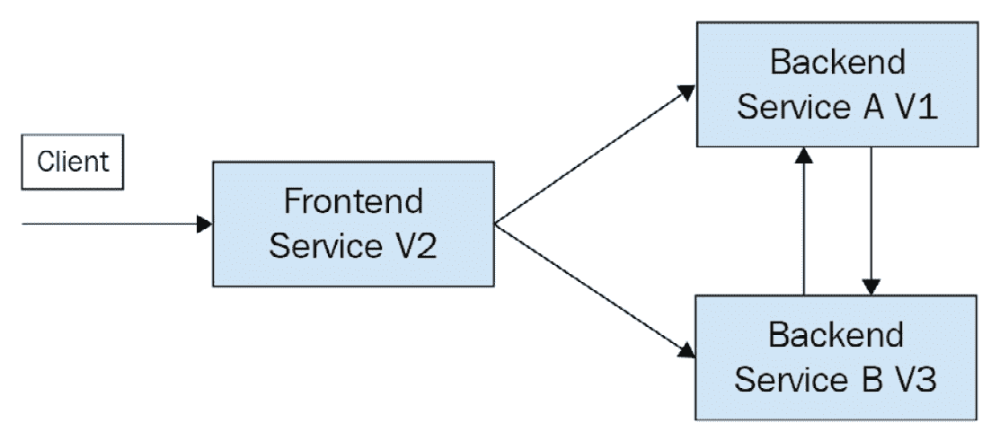

# 十四、服务网格和无服务器

本章讨论高级 Kubernetes 模式。首先，它详细介绍了流行的服务网格模式，其中可观察性和服务到服务的发现由 sidecar 代理处理，并提供了一个设置受欢迎的服务网格 Istio 的指南。最后，描述了无服务器模式以及如何在 Kubernetes 中应用。本章中的主要案例研究将包括为示例应用和服务发现设置 Istio，以及 Istio 入口网关。

让我们从讨论 sidecar 代理开始，它为服务网格构建了服务到服务连接的基础。

在本章中，我们将涵盖以下主题:

*   使用 sidecar 代理
*   向 Kubernetes 添加服务网格
*   在 Kubernetes 上实现无服务器

# 技术要求

为了运行本章中详细介绍的命令，您将需要一台支持`kubectl`命令行工具的计算机，以及一个工作正常的 Kubernetes 集群。参见 [*第一章*](01.html#_idTextAnchor016)*与Kubernetes*通讯，了解几种快速与Kubernetes一起起床跑步的方法，以及如何安装`kubectl`工具的说明。

本章使用的代码可以在本书的 GitHub 资源库中找到[https://GitHub . com/PacktPublishing/Cloud-Native-with-Kubernetes/tree/master/chapter 14](https://github.com/PacktPublishing/Cloud-Native-with-Kubernetes/tree/master/Chapter14)。

# 使用边车代理

正如我们在本书前面提到的，侧车是一种模式，其中除了要运行的实际应用容器之外，Pod 还包含另一个容器。这个额外的“额外”容器是边车。边车可以用于许多不同的原因。边车最常见的用途是监控、记录和代理。

对于日志记录，sidecar 容器可以从应用容器中获取应用日志(因为它们可以共享卷并在本地主机上通信)，然后将日志发送到集中的日志堆栈，或者解析日志以发出警报。监控也是类似的情况，边车Pod 可以跟踪和发送关于应用Pod 的指标。

使用 sidecar 代理，当请求进入 Pod 时，它们首先进入代理容器，然后代理容器将请求路由(在记录或执行其他过滤之后)到应用容器。类似地，当请求离开应用容器时，它们首先到达代理，代理可以提供 Pod 之外的路由。

通常，代理侧车，如 NGINX，只为进入 Pod 的请求提供代理。然而，在服务网格模式中，进入和离开 Pod 的请求都通过代理，这为服务网格模式本身提供了基础。

参考下图，了解 sidecar 代理如何与应用容器交互:



图 14.1–代理边车

如您所见，sidecar 代理负责将请求路由到 Pod 中的应用容器，并允许服务路由、日志记录和过滤等功能。

sidecar 代理模式是基于 DaemonSet 的代理的替代方案，其中每个节点上的代理 Pod 处理代理到该节点上的其他 Pod。Kubernetes 代理本身类似于 DaemonSet 模式。使用 sidecar 代理可以提供比使用 DaemonSet 代理更大的灵活性，但会牺牲性能效率，因为需要运行许多额外的容器。

Kubernetes 的一些流行代理选项包括:

*   *engine*
*   *幸福〔t1〕*
*   *特使*

虽然 NGINX 和 HAProxy 是更传统的代理，但特使是专门为分布式云原生环境构建的。由于这个原因，特使形成了流行服务网格的核心和为 Kubernetes 构建的 API 网关。

在我们谈到特使之前，让我们讨论安装其他代理作为侧车。

## 使用 NGINX 作为边车反向代理

在我们指定如何将 NGINX 用作边车代理之前，需要注意的是，在即将发布的 Kubernetes 版本中，边车将是一种 Kubernetes 资源类型，允许将边车容器轻松注入大量 Pods。但是，目前必须在 Pod 或控制器(副本集、部署和其他)级别指定侧车容器。

让我们看看如何将 NGINX 配置为边车，下面是部署 YAML，我们暂时还不会创建。这个过程比使用 NGINX 入口控制器更手动。

出于空间方面的原因，我们将 YAML 分成了两部分，并去掉了一些多余的部分，但是您可以在代码库中看到它的全部内容。让我们从部署的容器规范开始:

金克斯钢铁厂：

```
   spec:
     containers:
     - name: myapp
       image: ravirdv/http-responder:latest
       imagePullPolicy: IfNotPresent
     - name: nginx-sidecar
       image: nginx
       imagePullPolicy: IfNotPresent
       volumeMounts:
         - name: secrets
           mountPath: /app/cert
         - name: config
           mountPath: /etc/nginx/nginx.conf
           subPath: nginx.conf
```

如您所见，我们指定了两个容器，一个是我们的主应用容器`myapp`，另一个是`nginx`边车，我们通过卷装载注入了一些配置作为以及一些 TLS 证书。

接下来，让我们看看同一个文件中的`volumes`规格，我们注入了一些证书(来自一个秘密)和`config`(来自一个`ConfigMap`):

```
    volumes:
     - name: secrets
       secret:
         secretName: nginx-certificates
         items:
           - key: server-cert
             path: server.pem
           - key: server-key
             path: server-key.pem
     - name: config
       configMap:
         name: nginx-configuration
```

如您所见，我们需要证书和密钥。

接下来，我们需要使用`ConfigMap`创建 NGINX 配置。NGINX 配置如下所示:

engine x . conf 文件:

```
http {
    sendfile        on;
    include       mime.types;
    default_type  application/octet-stream;
    keepalive_timeout  80;
    server {
       ssl_certificate      /app/cert/server.pem;
      ssl_certificate_key  /app/cert/server-key.pem;
      ssl_protocols TLSv1.2;
      ssl_ciphers EECDH+AES128:RSA+AES128:EECDH+AES256:RSA+AES256:!EECDH+3DES:!RSA+3DES:!MD5;
      ssl_prefer_server_ciphers on;
      listen       443 ssl;
      server_name  localhost;
      location / {
        proxy_set_header X-Forwarded-For $proxy_add_x_forwarded_for;
        proxy_set_header Host $http_host;
        proxy_pass http://127.0.0.1:5000/;
      }
    }
}
worker_processes  1;
events {
    worker_connections  1024;
}
```

如您所见，我们有一些基本的 NGINX 配置。重要的是，我们有`proxy_pass`字段，它将请求代理到`127.0.0.1`或本地主机上的一个端口。由于Pod 中的集装箱可以共享本地主机端口，这就充当了我们的边车代理。出于本书的目的，我们不会回顾所有其他行，但请查看 NGINX 文档，了解每一行的更多信息([https://nginx.org/en/docs/](https://nginx.org/en/docs/))。

现在，让我们从这个文件创建`ConfigMap`。使用以下命令强制创建`ConfigMap`:

```
kubectl create cm nginx-configuration --from-file=nginx.conf=./nginx.conf
```

这将导致以下输出:

```
Configmap "nginx-configuration" created
```

接下来，让我们在 NGINX 中为 TLS 制作证书，并将它们嵌入到一个 Kubernetes 秘密中。您将需要安装 CFSSL (CloudFlare 的 PKI/TLS 开源工具包)库来遵循这些说明，但是您可以使用任何其他方法来创建您的证书。

首先，我们需要创建**证书颁发机构** ( **CA** )。从证书颁发机构的 JSON 配置开始:

金尼克卡：

```
{
   "CN": "mydomain.com",
   "hosts": [
       "mydomain.com",
       "www.mydomain.com"
   ],
   "key": {
       "algo": "rsa",
       "size": 2048
   },
   "names": [
       {
           "C": "US",
           "ST": "MD",
           "L": "United States"
       }
   ]
}
```

现在，使用 CFSSL创建 CA 证书:

```
cfssl gencert -initca nginxca.json | cfssljson -bare nginxca
```

接下来，我们将要求 CA 配置:

Nginxca-config.json：

```
{
  "signing": {
      "default": {
          "expiry": "20000h"
      },
      "profiles": {
          "client": {
              "expiry": "43800h",
              "usages": [
                  "signing",
                  "key encipherment",
                  "client auth"
              ]
          },
          "server": {
              "expiry": "20000h",
              "usages": [
                  "signing",
                  "key encipherment",
                  "server auth",
                  "client auth"
              ]
          }
      }
  }
}
```

我们还需要一个证书请求配置:

金尼克查德：

```
{
  "CN": "server",
  "hosts": [
    ""
  ],
  "key": {
    "algo": "rsa",
    "size": 2048
  }
}
```

现在，我们真的可以做证书了！使用以下命令:

```
cfssl gencert -ca=nginxca.pem -ca-key=nginxca-key.pem -config=nginxca-config.json -profile=server -hostname="127.0.0.1" nginxcarequest.json | cfssljson -bare server
```

作为我们的证书秘密的最后一步，通过最后一个`cfssl`命令，从证书文件的输出中创建 Kubernetes 秘密:

```
kubectl create secret generic nginx-certs --from-file=server-cert=./server.pem --from-file=server-key=./server-key.pem
```

现在，我们终于可以创建我们的部署:

```
kubectl apply -f nginx-sidecar.yaml 
```

这将产生以下输出:

```
deployment "myapp" created
```

为了检查 NGINX 代理功能，让我们创建一个服务来指导我们的部署:

engine-sidecar 服务：

```
apiVersion: v1
kind: Service
metadata:
 name:myapp
 labels:
   app: myapp
spec:
 selector:
   app: myapp
 type: NodePort
 ports:
 - port: 443
   targetPort: 443
   protocol: TCP
   name: https
```

现在，使用`https`访问集群的任何节点应该会产生一个工作的 HTTPS 连接！然而，由于我们的证书是自签名的，浏览器将显示一条*不安全的*消息。

现在，您已经了解了如何使用 NGINX 作为 Kubernetes 的侧车代理，让我们继续讨论更现代的云原生代理侧车-特使。

## 使用特使作为边车代理

特使是为云原生环境构建的现代代理。在本章稍后我们将讨论的 Istio 服务网格中，特使同时充当反向和正向代理。然而，在我们到达伊斯蒂欧之前，让我们尝试部署特使作为代理人。

我们将告诉特使使用路由、侦听器、集群和端点将各种请求路由到哪里。这一功能是 Istio 的核心，我们将在本章稍后部分回顾。

让我们浏览一下特使配置的每个部分，看看它是如何工作的。

### 特使听众

特使允许配置一个或多个侦听器。对于每个监听器，我们指定一个端口供特使监听，以及我们想要应用于监听器的任何过滤器。

过滤器可以提供复杂的功能，包括缓存、授权、**跨产地资源共享** ( **CORS** )配置等等。特使支持将多个过滤器链接在一起。

### 特使路线

某些过滤器具有路由配置，该配置指定应该接受请求的域、路由匹配和转发规则。

### 特使集群

特使中的集群代表一种逻辑服务，在这种服务中，请求可以被路由到侦听器中基于的路由。在云原生环境中，一个集群可能包含多个可能的 IP 地址，因此它支持负载平衡配置，例如*循环*。

### 特使端点

最后，端点在集群中被指定为服务的一个逻辑实例。特使支持从一个应用编程接口获取一个端点列表(这本质上是在 Istio 服务网格中发生的)以及它们之间的负载平衡。

在 Kubernetes 上的生产特使部署中，很可能会使用某种形式的动态、应用编程接口驱动的特使配置。特使的这个特性叫做 xDS，由 Istio 使用。此外，还有其他使用特使和 xDS 的开源产品和解决方案，包括大使应用编程接口网关。

出于本书的目的，我们将研究一些静态(非动态)特使配置；这样，我们就可以将配置的每一部分分开，当我们回顾 Istio 时，您会对每件事的工作原理有一个很好的了解。

现在，让我们进入特使配置的设置，其中单个 Pod 需要能够将请求路由到两个服务，即*服务 1* 和*服务 2* 。设置如下所示:



图 14.2–出站代理代理

如您所见，我们的应用 Pod 中的特使边车将具有路由到两个上游服务的配置，即*服务 1* 和*服务 2* 。两种服务都有两个可能的端点。

在特使 xDS 的动态设置中，端点的 Pod IPs 将从 API 加载，但是为了我们的审查目的，我们将在端点中显示静态 Pod IPs。我们将完全忽略 Kubernetes 服务，而是以循环配置直接访问 Pod IPs。在服务网格场景中，特使也将被部署在所有目的地 Pods 上，但是我们现在将保持简单。

现在，让我们看看这个网络图是如何在 YAML 特使配置中配置的(您可以在代码库中找到它的全部内容)。当然，这与 YAML 的 Kubernetes 资源有很大的不同——我们稍后会讲到这一部分。整个配置涉及很多 YAML，所以让我们一点一点来看。

### 了解特使配置文件

首先，让我们看一下配置的前几行——关于特使设置的一些基本信息:

特使-配置. yaml:

```
admin:
  access_log_path: "/dev/null"
  address:
    socket_address:
      address: 0.0.0.0
      port_value: 8001
```

如您所见，我们为特使的`admin`指定了一个端口和地址。与以下配置一样，我们将特使作为边车运行，因此地址将始终是本地的–`0.0.0.0`。接下来，我们从一个 HTTPS 听众开始我们的听众列表:

```
static_resources:
  listeners:
   - address:
      socket_address:
        address: 0.0.0.0
        port_value: 8443
    filter_chains:
    - filters:
      - name: envoy.filters.network.http_connection_manager
        typed_config:
          "@type": type.googleapis.com/envoy.config.filter.network.http_connection_manager.v2.HttpConnectionManager
          stat_prefix: ingress_https
          codec_type: auto
          route_config:
            name: local_route
            virtual_hosts:
            - name: backend
              domains:
              - "*"
              routes:
              - match:
                  prefix: "/service/1"
                route:
                  cluster: service1
              - match:
                  prefix: "/service/2"
                route:
                  cluster: service2
          http_filters:
          - name: envoy.filters.http.router
            typed_config: {}
```

如您所见，对于每个特使侦听器，我们都有一个侦听器的本地地址和端口(该侦听器是 HTTPS 侦听器)。然后，我们有一个过滤器列表——尽管在这种情况下，我们只有一个。每个特使过滤器类型的配置略有不同，我们不会逐行查看(更多信息请查看[https://www.envoyproxy.io/docs](https://www.envoyproxy.io/docs)特使文档)，但是这个特定过滤器匹配两条路线，`/service/1`和`/service/2`，并将它们路由到两个特使集群。仍然在 YAML 的第一个 HTTPS 监听器部分，我们有 TLS 配置，包括证书:

```
      transport_socket:
        name: envoy.transport_sockets.tls
        typed_config:
          "@type": type.googleapis.com/envoy.extensions.transport_sockets.tls.v3.DownstreamTlsContext
          common_tls_context:
            tls_certificates:
              certificate_chain:
                inline_string: |
                   <INLINE CERT FILE>
              private_key:
                inline_string: |
                  <INLINE PRIVATE KEY FILE>
```

如你所见，这个配置通过了一个`private_key`和一个`certificate_chain`。接下来，我们有第二个也是最后一个侦听器，一个 HTTP 侦听器:

```
  - address:
      socket_address:
        address: 0.0.0.0
        port_value: 8080
    filter_chains:
    - filters:
      - name: envoy.filters.network.http_connection_manager
        typed_config:
          "@type": type.googleapis.com/envoy.config.filter.network.http_connection_manager.v2.HttpConnectionManager
          codec_type: auto
          stat_prefix: ingress_http
          route_config:
            name: local_route
            virtual_hosts:
            - name: backend
              domains:
              - "*"
              routes:
              - match:
                  prefix: "/service1"
                route:
                  cluster: service1
              - match:
                  prefix: "/service2"
                route:
                  cluster: service2
          http_filters:
          - name: envoy.filters.http.router
            typed_config: {}
```

如您所见，这种配置与我们的 HTTPS 监听器非常相似，只是它监听不同的端口，并且不包括证书信息。接下来，我们进入集群配置。在我们的例子中，我们有两个集群，一个用于`service1`，一个用于`service2`。`service1`第一关:

```
  clusters:
  - name: service1
    connect_timeout: 0.25s
    type: strict_dns
    lb_policy: round_robin
    http2_protocol_options: {}
    load_assignment:
      cluster_name: service1
      endpoints:
      - lb_endpoints:
        - endpoint:
            address:
              socket_address:
                address: service1
                port_value: 5000
```

接下来，`Service 2`:

```
  - name: service2
    connect_timeout: 0.25s
    type: strict_dns
    lb_policy: round_robin
    http2_protocol_options: {}
    load_assignment:
      cluster_name: service2
      endpoints:
      - lb_endpoints:
        - endpoint:
            address:
              socket_address:
                address: service2
                port_value: 5000
```

对于这些集群中的每一个，我们指定请求应该被路由到哪里，以及哪个端口。例如，对于我们的第一个集群，请求被路由到`http://service1:5000`。我们还为连接指定了负载平衡策略(在本例中为循环)和超时。现在我们有了特使配置，我们可以继续创建我们的 Kubernetes Pod，并在特使配置的同时注入我们的边车。我们还将把这个文件分成两部分，因为它有点太大，无法理解:

特使-边车-部署. yaml:

```
apiVersion: apps/v1
kind: Deployment
metadata:
  name: my-service
spec:
  replicas: 1
  template:
    metadata:
      labels:
        app: my-service
    spec:
      containers:
      - name: envoy
        image: envoyproxy/envoy:latest
        ports:
          - containerPort: 9901
            protocol: TCP
            name: envoy-admin
          - containerPort: 8786
            protocol: TCP
            name: envoy-web
```

可以看到，这是典型的 YAML 部署。在这种情况下，我们实际上有两个容器。首先是特使代理容器(或边车)。它监听两个端口。接下来，再往下移动到 YAML，我们有了第一个容器的卷挂载(保存特使配置)以及一个启动命令和参数:

```
        volumeMounts:
          - name: envoy-config-volume
            mountPath: /etc/envoy-config/
        command: ["/usr/local/bin/envoy"]
        args: ["-c", "/etc/envoy-config/config.yaml", "--v2-config-only", "-l", "info","--service-cluster","myservice","--service-node","myservice", "--log-format", "[METADATA][%Y-%m-%d %T.%e][%t][%l][%n] %v"]
```

最后，我们在 Pod 中有了第二个容器，它是一个应用容器:

```
- name: my-service
        image: ravirdv/http-responder:latest
        ports:
        - containerPort: 5000
          name: svc-port
          protocol: TCP
      volumes:
        - name: envoy-config-volume
          configMap:
            name: envoy-config
            items:
              - key: envoy-config
                path: config.yaml
```

如您所见，这个应用在端口`5000`上响应。最后，我们还有 Pod 级别的卷定义，以匹配特使容器中装载的特使配置卷。在我们创建部署之前，我们需要用我们的特使配置创建一个`ConfigMap`。我们可以使用以下命令来实现这一点:

```
kubectl create cm envoy-config 
--from-file=config.yaml=./envoy-config.yaml
```

这将导致以下输出:

```
Configmap "envoy-config" created
```

现在，我们可以使用以下命令创建部署:

```
kubectl apply -f deployment.yaml
```

这将导致以下输出:

```
Deployment "my-service" created
```

最后，我们需要我们的下游服务，`service1`和`service2`。为此，我们将继续使用`http-responder`开源容器映像，它将在端口`5000`上做出响应。部署和服务规范可以在代码存储库中找到，我们可以使用以下命令创建它们:

```
kubectl create -f service1-deployment.yaml
kubectl create -f service1-service.yaml
kubectl create -f service2-deployment.yaml
kubectl create -f service2-service.yaml
```

现在，我们可以测试一下我们的特使配置了！从我们的`my-service`容器中，我们可以使用`/service1`路径向端口`8080`上的本地主机发出请求。这应该指向我们的一个`service1`Pod  IPs。要发出这个请求，我们使用以下命令:

```
Kubectl exec <my-service-pod-name> -it -- curl localhost:8080/service1
```

我们已经建立了服务来响应他们的请求。请看我们的`curl`命令的以下输出:

```
Service 1 Reached!
```

现在我们已经了解了特使如何使用静态配置工作，让我们继续讨论基于特使的动态服务网格——Istio。

# 向 Kubernetes 添加服务网格

一个*服务网格*模式是边车代理的逻辑扩展。通过将侧车代理连接到每个 Pod，服务网格可以控制服务对服务请求的功能，例如高级路由规则、重试和超时。此外，通过让每个请求都通过代理，服务网格可以实现服务之间的相互 TLS 加密，以提高安全性，并可以让管理员难以置信地观察到他们群集中的请求。

有几个服务网格项目支持 Kubernetes。最受欢迎的如下:

*   *浪费*
*   *左*
*   *熊掌*
*   领事

这些服务网格中的每一个都有不同的服务网格模式。 *Istio* 可能是最受欢迎和最全面的单一解决方案，但也相当复杂。 *Linkerd* 也是一个成熟的项目，但是更容易配置(虽然它使用自己的代理而不是特使)。*领事*是除了其他提供商之外支持特使的选项，不仅仅是在 Kubernetes 上。最后，*库马*是一个基于特使的选项，也越来越受欢迎。

探索所有选项超出了本书的范围，所以我们将坚持使用 Istio，因为它通常被认为是默认的解决方案。也就是说，所有这些网格都有的优缺点，在计划采用服务网格时，每一个都值得一看。

## 在Kubernetes群岛上建立 Istio

虽然 Istio 可以用 Helm 安装，但是 Helm 安装选项不再是官方支持的安装方式。

相反，我们使用`Istioctl`命令行界面工具将带配置的 Istio 安装到我们的集群上。这种配置可以完全定制，但就本书而言，我们将只使用“演示”配置:

1.  在集群上安装 Istio 的第一步是安装 Istio CLI 工具。我们可以通过以下命令来完成，该命令将安装最新版本的 CLI 工具:

    ```
    curl -L https://istio.io/downloadIstio | sh -
    ```

2.  接下来，为了便于使用，我们希望在路径中添加 CLI 工具:

    ```
    cd istio-<VERSION>
    export PATH=$PWD/bin:$PATH
    ```

3.  Now, let's install Istio! Istio configurations are called *profiles* and, as mentioned previously, they can be completely customized using a YAML file.

    在这个演示中，我们将使用带 Istio 的内置`demo`配置文件，它提供了一些基本的设置。使用以下命令安装配置文件:

    ```
    istioctl install --set profile=demo
    ```

    这将导致以下输出:

    

    图 14.3–Istioctl 剖面安装输出

4.  Since the sidecar resource has not been released yet as of Kubernetes 1.19, Istio will itself inject Envoy proxies into any namespace that is labeled with `istio-injection=enabled`.

    要用此标记任何命名空间，请运行以下命令:

    ```
    kubectl label namespace my-namespace istio-injection=enabled
    ```

5.  To test easily, label the `default` namespace with the preceding `label` command. Once the Istio components come up, any Pods in that namespace will automatically be injected with the Envoy sidecar, just like we created manually in the previous section.

    要从集群中删除 Istio，请运行以下命令:

    ```
    istioctl x uninstall --purge
    ```

    这将导致一条确认消息，告诉您 Istio 已被删除。

6.  Now, let's deploy a little something to test our new mesh with! We will deploy three different application services, each with a deployment and a service resource:

    a.服务前端

    b.服务后端

    c.服务后端

    以下是*服务前端*的部署:

    Istio-service-deployment.yaml:

    ```
    apiVersion: apps/v1
    kind: Deployment
    metadata:
      name: service-frontend
    spec:
      replicas: 1
      template:
        metadata:
          labels:
            app: service-frontend
            version: v2
        spec:
          containers:
          - name: service-frontend
            image: ravirdv/http-responder:latest
            ports:
            - containerPort: 5000
              name: svc-port
              protocol: TCP
    ```

    这里是*服务前端*的服务:

    机构服务：

    ```
    apiVersion: v1
    kind: Service
    metadata:
      name: service-frontend
    spec:
      selector:
        name: service-frontend
      ports:
        - protocol: TCP
          port: 80
          targetPort: 5000
    ```

    服务后端 A 和 B 的 YAML 将与*服务前端*相同，除了交换名称、图像名称和选择器标签。

7.  Now that we have a couple of services to route to (and between), let's start setting up some Istio resources!

    首先，我们需要一个`Gateway`资源。在这种情况下，我们不使用 NGINX 入口控制器，但这很好，因为 Istio 提供了一个`Gateway`资源，可以用于入口和出口。以下是“T2”的定义:

    Istio-gateway.yaml：

    ```
    apiVersion: networking.istio.io/v1alpha3
    kind: Gateway
    metadata:
      name: myapplication-gateway
    spec:
      selector:
        istio: ingressgateway
      servers:
      - port:
          number: 80
          name: http
          protocol: HTTP
        hosts:
        - "*"
    ```

    这些`Gateway`定义看起来非常类似于入口记录。我们有`name`和`selector`，Istio 使用它们来决定使用哪个 Istio 入口控制器。接下来，我们有一个或多个服务器，它们本质上是我们网关上的入口点。在这种情况下，我们不限制主机，我们接受端口`80`上的请求。

8.  Now that we have a gateway for getting requests into our cluster, we can start setting up some routes. We do this in Istio using `VirtualService`. `VirtualService` in Istio is a set of routes that should be followed when requests to a particular hostname are made. In addition, we can use a wildcard host to make global rules for requests from anywhere in the mesh. Let's take a look at an example `VirtualService` configuration:

    Istio-virtual-service-1.yaml:

    ```
    apiVersion: networking.istio.io/v1alpha3
    kind: VirtualService
    metadata:
      name: myapplication
    spec:
      hosts:
      - "*"
      gateways:
      - myapplication-gateway
      http:
      - match:
        - uri:
            prefix: /app
        - uri:
            prefix: /frontend
        route:
        - destination:
            host: service-frontend
            subset: v1
    ```

    在这个`VirtualService`中，如果请求与我们的`uri`前缀中的一个匹配，我们将请求路由到位于*服务前端*的入口点的任何主机。在这种情况下，我们在前缀上匹配，但是你也可以通过在 URI 匹配器中用`exact`替换`prefix`来使用精确匹配。

9.  So, now we have a setup fairly similar to what we would expect with an NGINX Ingress, with entry into the cluster dictated by a route match.

    然而，我们路线上的`v1`是什么？这实际上代表了我们的*前端服务*的一个版本。让我们继续并使用新的资源类型-Istio`DestinationRule`来指定这个版本。以下是`DestinationRule`配置的样子:

    istio-目的地-规则-1.yaml:

    ```
    apiVersion: networking.istio.io/v1alpha3
    kind: DestinationRule
    metadata:
      name: service-frontend
    spec:
      host: service-frontend
      subsets:
      - name: v1
        labels:
          version: v1
      - name: v2
        labels:
          version: v2
    ```

    如您所见，我们在 Istio 中指定了两个不同版本的前端服务，每个版本都查看一个标签选择器。从我们之前的部署和服务中，您可以看到我们当前的前端服务版本是`v2`，但是我们可以并行运行这两个版本！通过在入口虚拟服务中指定我们的`v2`版本，我们告诉 Istio 将所有请求路由到服务的`v2`。此外，我们还配置了我们的`v1`版本，这在之前的`VirtualService`中有参考。这个硬规则只是将请求路由到 Istio 中不同子集的一种可能方式。

    现在，我们已经设法通过网关将流量路由到我们的集群，并根据目的地规则路由到虚拟服务子集。在这一点上，我们有效地“进入”了我们的服务网格！

10.  Now, from our *Service Frontend*, we want to be able to route to *Service Backend A* and *Service Backend B*. How do we do this? More virtual services is the answer! Let's take a look at a virtual service for *Backend Service A*:

    Istio-virtual-service-2.yaml:

    ```
    apiVersion: networking.istio.io/v1alpha3
    kind: VirtualService
    metadata:
      name: myapplication-a
    spec:
      hosts:
      - service-a
      http:
        route:
        - destination:
            host: service-backend-a
            subset: v1
    ```

    如您所见，该`VirtualService`路由到我们服务的`v1`子集`service-backend-a`。我们还需要另一个`service-backend-b`的`VirtualService`，我们不会全部包括在内(但看起来几乎一样)。要查看完整的 YAML，请查看`istio-virtual-service-3.yaml`的代码库。

11.  一旦我们的虚拟服务准备好了，我们就需要一些目的地规则！*后端服务 A* 的`DestinationRule`如下:

istio-目的地-规则-2.yaml:

```
apiVersion: networking.istio.io/v1alpha3
kind: DestinationRule
metadata:
  name: service-backend-a
spec:
  host: service-backend-a
  trafficPolicy:
    tls:
      mode: ISTIO_MUTUAL
  subsets:
  - name: v1
    labels:
      version: v1
```

而*后端服务 B* 的`DestinationRule`也差不多，只是子集不同。我们不会包含代码，但是检查代码库中的`istio-destination-rule-3.yaml`以了解确切的规格。

这些目的地规则和虚拟服务加起来构成了以下路由图:



图 14.4–Istio 布线图

如您所见，来自*前端服务* Pods 的请求可以路由到*后端服务 A 版本 1* 或*后端服务 B 版本 3* ，并且每个后端服务也可以路由到另一个。这些对后端服务 A 或 B 的请求还涉及到 Istio 最有价值的特性之一——相互(双向)TLS。在此设置中，TLS 安全性在网格中的任意两点之间保持，这一切都是自动发生的！

接下来，让我们看一下使用 Kubernetes 的无服务器模式。

# 在 Kubernetes 上实现无服务器

云提供商的无服务器模式很快得到了的普及。无服务器体系结构由可以自动上下扩展的计算组成，甚至可以一直扩展到零(零计算容量被用来为功能或其他应用服务)。**功能即服务** ( **FaaS** )是无服务器模式的扩展，其中功能代码是唯一的输入，无服务器系统负责根据需要将请求路由到计算和扩展。AWS Lambda、Azure Functions 和 Google Cloud Run 是云提供商官方支持的一些更受欢迎的 FaaS/无服务器选项。Kubernetes 也有许多不同的无服务器框架和库，可以用来运行无服务器、零扩展的工作负载以及 Kubernetes 上的 FaaS。一些最受欢迎的如下:

*   *激活*
*   *无库*
*   *OpenFaaS*
*   裂变

关于 Kubernetes 上所有无服务器选项的完整讨论超出了本书的范围，因此我们将关注两个不同的选项，它们旨在为两个截然不同的用例提供服务: *OpenFaaS* 和 *Knative* 。

虽然 Knative 具有高度可扩展性和可定制性，但它使用了多个耦合组件，增加了复杂性。这意味着需要一些额外的配置来开始使用 FaaS 解决方案，因为函数只是 Knative 支持的许多其他模式之一。另一方面，OpenFaaS 使得在 Kubernetes 上启动和运行无服务器和 FaaS 变得非常容易。由于不同的原因，这两种技术都很有价值。

在这一章的教程中，我们将看看 Knative，它是最流行的无服务器框架之一，也通过其事件特性支持 FaaS。

## 在库伯内斯河上使用 FaaS 的克纳托

如前所述，Knative 是 Kubernetes 上无服务器模式的一组模块化构建块。由于这个原因，在我们能够进入实际功能之前，它需要一些配置。Knative 也可以安装 Istio，它将 Istio用作路由和扩展无服务器应用的基底。其他非 Istio 路由选项也可用。

要在 FaaS 使用克纳蒂，我们需要安装*克纳蒂服务*和*克纳蒂事件*。虽然 knactivity service 将允许我们运行无服务器工作负载，但 knactivity Eventing 将提供向这些零扩展工作负载发出 FaaS 请求的途径。让我们通过以下步骤来实现这一点:

1.  首先，让我们安装主动服务组件。我们将从安装 CRDs 开始:

    ```
    kubectl apply --filename https://github.com/knative/serving/releases/download/v0.18.0/serving-crds.yaml
    ```

2.  接下来，我们可以自己安装服务组件:

    ```
    kubectl apply --filename https://github.com/knative/serving/releases/download/v0.18.0/serving-core.yaml
    ```

3.  在这一点上，我们需要安装一个网络/路由层，供 Knative 使用。让我们使用 Istio:

    ```
    kubectl apply --filename https://github.com/knative/net-istio/releases/download/v0.18.0/release.yaml
    ```

4.  我们需要 Istio 的网关 IP 地址。根据您运行该程序的位置(换句话说，AWS 或本地)，该值可能会有所不同。使用以下命令拉动它:

    ```
    Kubectl get service -n istio-system istio-ingressgateway
    ```

5.  Knative requires a specific DNS setup for enabling the serving component. The easiest way to do this in a cloud setting is to use `xip.io` "Magic DNS," though this will not work for Minikube-based clusters. If you're running one of these (or just want to see all the options available), check out the Knative docs at [https://knative.dev/docs/install/any-kubernetes-cluster/](https://knative.dev/docs/install/any-kubernetes-cluster/).

    要设置魔法域名系统，请使用以下命令:

    ```
    kubectl apply --filename https://github.com/knative/serving/releases/download/v0.18.0/serving-default-domain.yaml
    ```

6.  现在我们已经安装了 Knative Serving，让我们安装 Knative Eventing 来交付我们的 FaaS 请求。首先，我们需要更多的 CRD。使用以下命令安装它们:

    ```
    kubectl apply --filename https://github.com/knative/eventing/releases/download/v0.18.0/eventing-crds.yaml
    ```

7.  Now, install the eventing components just like we did with serving:

    ```
    kubectl apply --filename https://github.com/knative/eventing/releases/download/v0.18.0/eventing-core.yaml
    ```

    此时，我们需要为我们的事件系统添加一个队列/消息层来使用。我们提到 Knative 支持许多模块化组件了吗？

    重要说明

    为了使事情变得简单，让我们只使用基本的内存消息传递层，但是了解您可以使用的所有选项是很好的。关于消息渠道的模块化选项，请查看[https://knative.dev/docs/eventing/channels/channels-crds/](https://knative.dev/docs/eventing/channels/channels-crds/)的文档。对于事件源选项，可以查看[https://knative.dev/docs/eventing/sources/](https://knative.dev/docs/eventing/sources/)。

8.  要安装`in-memory`消息层，请使用以下命令:

    ```
    kubectl apply --filename https://github.com/knative/eventing/releases/download/v0.18.0/in-memory-channel.yaml
    ```

9.  以为我们结束了？没有！最后一件事。我们需要安装一个代理，它将从消息传递层获取事件，并在正确的地方处理它们。让我们使用默认的代理层，MT-Channel 代理层。您可以使用以下命令安装它:

    ```
    kubectl apply --filename https://github.com/knative/eventing/releases/download/v0.18.0/mt-channel-broker.yaml
    ```

说完了，我们终于结束了。我们已经通过 Knative 安装了端到端的 FaaS 实现。正如你所知，这不是一项容易的任务。让 Knative 令人惊叹的是让它变得痛苦的同样一件事——它提供了如此多不同的模块化选项和配置，以至于即使在为每一步选择最基本的选项时，我们仍然花了很多时间来解释安装。还有其他可用的选项，例如 OpenFaaS，它们更容易启动和运行，我们将在下一节中探讨这一点！然而，从好的方面来说，现在我们终于准备好了，我们可以加入我们的 FaaS 了。

### 在加拿大实施 FaaS 模式

现在我们已经建立了 Knative，我们可以使用它来实现一个 FaaS 模式，其中事件将通过一个触发器触发 Knative 中运行的一些代码。要建立一个简单的 FaaS，我们需要三样东西:

*   从入口点发送事件的经纪人
*   消费者服务来实际处理我们的事件
*   指定何时将事件路由到使用者进行处理的触发器定义

首先，我们的经纪人需要创建。这很简单，类似于创建入口记录或网关。我们的 YAML 是这样的:

kna active-broker . YAML:

```
apiVersion: eventing.knative.dev/v1
kind: broker
metadata:
 name: my-broker
 namespace: default
```

接下来，我们可以创建一个消费者服务。这个组件实际上只是我们处理事件的应用——我们的函数本身！与其向您展示比您已经看到的更多的 YAML，不如让我们假设我们的消费者服务只是一个名为`service-consumer`的常规老Kubernetes服务，它路由到运行我们应用的四副本部署的 Pods。

最后，我们需要一个触发器。这决定了如何以及从代理路由哪些事件。扳机的 YAML 是这样的:

Knative-trigger.yaml:

```
apiVersion: eventing.knative.dev/v1
kind: Trigger
metadata:
  name: my-trigger
spec:
  broker: my-broker
  filter:
    attributes:
      type: myeventtype
  subscriber:
    ref:
     apiVersion: v1
     kind: Service
     name: service-consumer
```

在这个 YAML，我们创建了一个`Trigger`规则，通过我们的经纪人`my-broker`发生的任何事件，如果其类型为`myeventtype`，将自动被路由到我们的消费者`service-consumer`。有关 Knative 中触发器过滤器的完整文档，请查看[https://knative.dev/development/eventing/triggers/](https://knative.dev/development/eventing/triggers/)的文档。

那么，我们如何创造一些事件呢？首先，使用以下命令检查代理网址:

```
kubectl get broker
```

这将产生以下输出:

```
NAME      READY   REASON   URL                                                                                 AGE
my-broker   True             http://broker-ingress.knative-eventing.svc.cluster.local/default/my-broker     1m
```

我们现在终于可以测试我们的 FaaS 解决方案了。让我们旋转一个快速Pod ，我们可以从这里向触发器发出请求:

```
kubectl run -i --tty --rm debug --image=radial/busyboxplus:curl --restart=Never -- sh
```

现在，从这个Pod 中，我们可以继续测试我们的触发器，使用`curl`。我们需要发出的请求需要有一个等于`myeventtype`的`Ce-Type`头，因为这是我们的触发器所需要的。Knative 使用形式为`Ce-Id`、`Ce-Type`的头来进行路由，如下面的代码块所示。

`curl`请求如下所示:

```
curl -v "http://broker-ingress.knative-eventing.svc.cluster.local/default/my-broker" \
  -X POST \
  -H "Ce-Id: anyid" \
  -H "Ce-Specversion: 1.0" \
  -H "Ce-Type: myeventtype" \
  -H "Ce-Source: any" \
  -H "Content-Type: application/json" \
  -d '{"payload":"Does this work?"}'
```

如您所见，我们正在向代理 URL 发送`curl` `http`请求。此外，我们在 HTTP 请求中传递了一些特殊的头。重要的是，我们正在传递`type=myeventtype`，这是我们触发器上的过滤器发送处理请求所需要的。

在这个例子中，我们的消费者服务回显了主体 JSON 的有效载荷键，以及一个`200` HTTP 响应，因此运行这个`curl`请求会给我们以下信息:

```
> HTTP/1.1 200 OK
> Content-Type: application/json
{
  "Output": "Does this work?"
}
```

成功！我们已经测试了我们的 FaaS，它返回了我们所期待的。从这里开始，我们的解决方案将随着事件数量的增加而上下扩展到零，并且与 Knative 一样，有更多的定制和配置选项来根据我们的需求定制我们的解决方案。

接下来，我们将使用 OpenFaaS 而不是 Knative 来研究相同的模式，以突出这两种方法之间的差异。

## 在Kubernetes卫星上为 FaaS 使用开放式火焰原子吸收光谱法

既然我们已经讨论了开始使用 Knative，让我们用 OpenFaaS 做同样的。首先，为了安装 OpenFaaS 本身，我们将使用来自`faas-netes`资源库的 Helm 图表，该资源库位于[https://github.com/openfaas/faas-netes](https://github.com/openfaas/faas-netes)。

### 安装带头盔的开放式风扇组件

首先，我们将创建两个名称空间来保存我们的 OpenFaaS 组件:

*   `openfaas`保存 OpenFaas 的实际服务组件
*   `openfaas-fn`保持我们部署的功能

我们可以使用以下命令从`faas-netes`存储库中使用一个漂亮的 YAML 文件添加这两个名称空间:

```
kubectl apply -f https://raw.githubusercontent.com/openfaas/faas-netes/master/namespaces.yml
```

接下来，我们需要用以下 Helm 命令添加`faas-netes` `Helm` `repository`:

```
helm repo add openfaas https://openfaas.github.io/faas-netes/
helm repo update
```

最后，我们实际部署了 OpenFaaS！

前面`faas-netes`存储库中 OpenFaaS 的 Helm 图有几个可能的变量，但是我们将使用以下配置来确保创建了一组初始身份验证凭证，并且部署了入口记录:

```
helm install openfaas openfaas/openfaas \
    --namespace openfaas  \
    --set functionNamespace=openfaas-fn \
    --set ingress.enabled=true \
    --set generateBasicAuth=true 
```

现在，我们的 OpenFaaS 基础设施已经部署到我们的集群中，我们想要获取在 Helm 安装过程中生成的凭据。Helm 图表将创建这些作为钩子的一部分，并将它们存储在一个秘密中，因此我们可以通过运行以下命令来获取它们:

```
OPENFAASPWD=$(kubectl get secret basic-auth -n openfaas -o jsonpath="{.data.basic-auth-password}" | base64 --decode)
```

这就是我们需要的所有Kubernetes设置！

接下来，让我们安装 OpenFaas 命令行界面，这将使管理我们的 OpenFaas 功能变得极其容易。

### 安装调用 OpenFaaS 命令行界面并部署功能

要安装 OpenFaaS CLI，我们可以使用以下命令(对于 Windows，查看前面的 OpenFaaS 文档):

```
curl -sL https://cli.openfaas.com | sudo sh
```

现在，我们可以开始构建和部署一些功能了。通过命令行界面最容易做到这一点。

在为 OpenFaaS 构建和部署函数时，OpenFaaS 命令行界面提供了一种简单的方法来生成样板，并为特定的语言构建和部署函数。它通过“模板”做到这一点，并支持各种风格的节点、Python 等。有关模板类型的完整列表，请查看位于[https://github.com/openfaas/templates](https://github.com/openfaas/templates)的模板库。

使用 OpenFaaS 命令行界面创建的模板类似于您对托管无服务器平台(如 AWS Lambda)的期望。让我们使用以下命令创建一个全新的 Node.js 函数:

```
faas-cli new my-function –lang node
```

这将产生以下输出:

```
Folder: my-function created.
Function created in folder: my-function
Stack file written: my-function.yml
```

如您所见，`new`命令生成了一个文件夹，其中包含一些函数代码本身的样板，以及一个 OpenFaaS YAML 文件。

OpenFaaS YAML 文件将显示如下:

My-function.yml:

```
provider:
  name: openfaas
  gateway: http://localhost:8080
functions:
  my-function:
    lang: node
    handler: ./my-function
    image: my-function
```

实际的函数代码(在`my-function`文件夹中)由一个函数文件–`handler.js`和一个依赖清单`package.json`组成。对于其他语言，这些文件会有所不同，我们不会在 Node 中深究依赖关系的细节。但是，我们将编辑`handler.js`文件以返回一些文本。编辑后的文件是这样的:

处理者. js:

```
"use strict"
module.exports = (context, callback) => {
    callback(undefined, {output: "my function succeeded!"});
}
```

这段 JavaScript 代码将返回一个带有我们文本的 JSON 响应。

现在我们已经有了我们的函数和处理程序，我们可以继续构建和部署我们的函数了。OpenFaaS 命令行界面使构建函数变得简单，我们可以使用以下命令来完成:

```
faas-cli build -f /path/to/my-function.yml 
```

这个命令的输出很长，但是当它完成时，我们将在本地构建一个新的容器映像，并嵌入我们的函数处理程序和依赖项！

接下来，我们将我们的容器映像推送到容器存储库中，就像我们推送给任何其他容器一样。OpenFaaS 命令行界面为此提供了一个简洁的包装器命令，它会将映像推送到 Docker Hub 或备用容器映像存储库:

```
faas-cli push -f my-function.yml 
```

现在，我们可以将我们的功能部署到 OpenFaaS。命令行界面再次使这变得容易。使用以下命令部署它:

```
faas-cli deploy -f my-function.yml
```

现在一切都准备好了让我们测试我们的功能，部署在 OpenFaaS 上！我们在部署 OpenFaaS 时使用了入口设置，因此请求可以通过该入口。然而，我们的新函数生成的 YAML 文件被设置为在`localhost:8080`上发出请求，用于开发目的。我们可以为我们的入口网关将该文件编辑到正确的`URL`(关于如何做到这一点，请参考[https://docs.openfaas.com/deployment/kubernetes/](https://docs.openfaas.com/deployment/kubernetes/)的文档)，但是相反，让我们做一个快捷方式，让 OpenFaaS 在我们的本地主机上打开。

让我们使用`kubectl port-forward`命令在本地主机端口`8080`上打开我们的 OpenFaaS 服务。我们可以这样做:

```
export OPENFAAS_URL=http://127.0.0.1:8080
kubectl port-forward -n openfaas svc/gateway 8080:8080
```

现在，让我们将之前生成的身份验证凭据添加到 OpenFaaS 命令行界面，如下所示:

```
echo -n $OPENFAASPWD | faas-cli login -g $OPENFAAS_URL -u admin --password-stdin
```

最后，为了测试我们的函数，我们需要做的就是运行以下命令:

```
faas-cli invoke -f my-function.yml my-function
```

这将产生以下输出:

```
Reading from STDIN - hit (Control + D) to stop.
This is my message
{ output: "my function succeeded!"});}
```

正如您所看到的，我们已经成功收到了预期的响应！

最后，如果我们想要删除这个特定的函数，我们可以使用下面的命令来完成，类似于我们使用`kubectl delete -f`的方式:

```
faas-cli rm -f my-function.yml 
```

就这样！我们的功能被移除了。

# 总结

在本章中，我们学习了 Kubernetes 上的服务网格和无服务器模式。为了给这些做好准备，我们首先讨论了在 Kubernetes 上运行 sidecar 代理，特别是特使代理。

然后，我们继续学习服务网格，并学习如何安装和配置 Istio 服务网格，以便通过相互 TLS 进行服务到服务的路由。

最后，我们继续讨论 Kubernetes 上的无服务器模式，在这里您学习了如何配置和安装 Knative，以及用于无服务器事件的另一种方法 OpenFaaS 和 Kubernetes 上的 FaaS。

本章中使用的技巧将帮助您在 Kubernetes 上构建服务网格和无服务器模式，为您设置全自动的服务到服务发现和 FaaS 事件。

在下一章(也是最后一章)，我们将讨论在 Kubernetes 上运行有状态应用。

# 问题

1.  静态和动态特使配置有什么区别？
2.  特使配置的四个主要部分是什么？
3.  Knative 有哪些缺点，OpenFaaS 相比如何？

# 进一步阅读

*   CNCF 山水:[https://landscape.cncf.io/](https://landscape.cncf.io/)
*   官场久别论坛:[https://discuss . kubrintes . io/](https://discuss.kubernetes.io/)