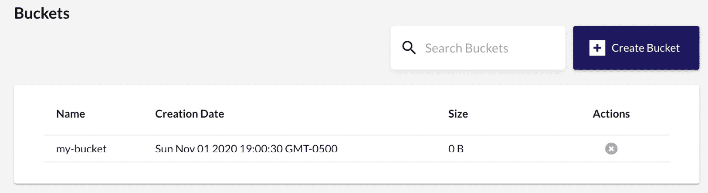
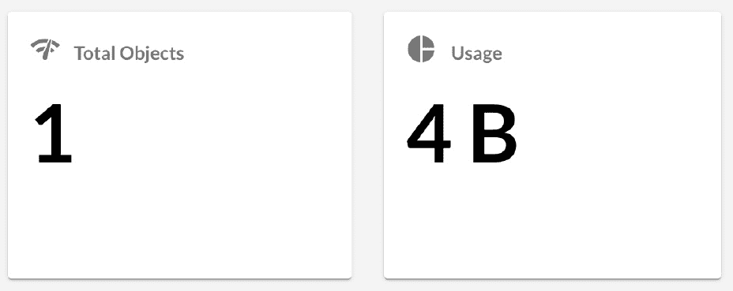
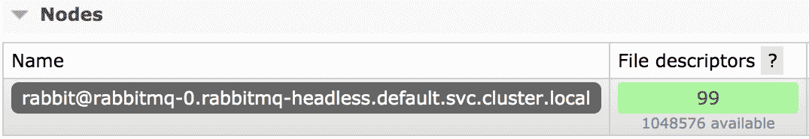
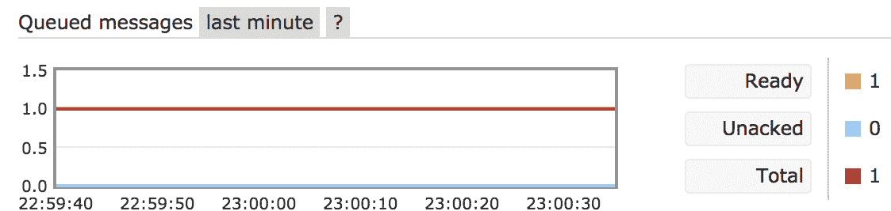

# 十五、Kubernetes上的有状态工作负载

本章详细介绍了在数据库中运行有状态工作负载的行业现状。我们将讨论使用 Kubernetes(和流行的开源项目)在 Kubernetes 上运行数据库、存储和队列。案例研究教程将包括在 Kubernetes 上运行对象存储、数据库和队列系统。

在本章中，我们将首先了解有状态应用如何在 Kubernetes 上运行，然后学习如何将 Kubernetes 存储用于有状态应用。然后我们将学习如何在 Kubernetes 上运行数据库，以及如何覆盖消息传递和队列。让我们从讨论为什么有状态应用比 Kubernetes 上的无状态应用复杂得多开始。

在本章中，我们将涵盖以下主题:

*   了解 Kubernetes 上的有状态应用
*   将 Kubernetes 存储用于有状态应用
*   在 Kubernetes 上运行数据库
*   在 Kubernetes 上实现消息传递和队列

# 技术要求

为了运行本章中详细介绍的命令，您将需要一台支持`kubectl`命令行工具的计算机以及一个工作正常的 Kubernetes 集群。参见 [*第一章*](01.html#_idTextAnchor016)*与Kubernetes*通讯，了解几种快速启动和运行Kubernetes的方法，以及如何安装Kubernetes工具的说明。

本章中使用的代码可以在本书的 GitHub 存储库中找到:

[https://github . com/PacktPublishing/Cloud-Native-with-Kubernetes/tree/master/chapter 15](https://github.com/PacktPublishing/Cloud-Native-with-Kubernetes/tree/master/Chapter15)

# 了解 Kubernetes 上的有状态应用

Kubernetes 为运行无状态和有状态应用提供了优秀的原语，但是有状态工作负载在 Kubernetes 上需要更长的时间才能成熟。然而，近年来，一些备受瞩目的基于 Kubernetes 的有状态应用框架和项目已经证明了 Kubernetes 上有状态应用的日益成熟。让我们先回顾一下其中的一些，以便为本章的其余部分做好准备。

## 流行的 Kubernetes-本地有状态应用

有状态应用有多种类型。虽然大多数应用都是有状态的，但是这些应用中只有某些组件存储*状态*数据。我们可以从应用中移除这些特定的有状态组件，并在我们的审查中关注这些组件。在本书中，我们将讨论数据库、队列和对象存储，不包括持久存储组件，例如我们在 [*第 7 章*](07.html#_idTextAnchor166)*中回顾的那些组件。我们还将讨论一些不太通用的组件，作为荣誉奖。让我们从数据库开始！*

### kubernetes 兼容数据库

除了典型的**数据库** ( **DBs** )和键值存储如 **Postgres** 、 **MySQL** 和 **Redis** 可以通过 StatefulSets 或社区运营商部署在 Kubernetes 上之外，还有一些主要的专为 Kubernetes 定制的选项:

*   **cocroach db**:可以无缝部署在 Kubernetes 上的分布式 SQL 数据库
*   **Vitess** :一个 MySQL 分片编排器，允许 MySQL 的全局可伸缩性，也可以通过一个操作器安装在 Kubernetes 上
*   **yugabbtedb**:类似**的分布式 SQL 数据库，也支持类似 Cassandra 的查询**

接下来，我们来看看在 Kubernetes 上的排队和消息传递。

### Kubernetes 上的队列、流和消息传递

此外还有行业标准选项如**卡夫卡**和**拉比 tmq**可以使用社区赫尔姆图和运营商部署在Kubernetes上，此外还有一些专门设计的开源和闭源选项:

*   **NATS** :开源消息和流媒体系统
*   **kubi eq**:kubi etes-native message broker

接下来，让我们看看 Kubernetes 上的对象存储。

### Kubernetes 上的对象存储

对象存储从 Kubernetes 获取基于卷的持久存储，并添加一个对象存储层，类似于(在许多情况下与)亚马逊 S3 的应用编程接口兼容:

*   **Minio** :专为高性能打造的 S3 兼容对象存储。
*   **开启 IO** :类似于 *Minio* ，这款性能很高，支持 S3 和 Swift 存储。

接下来，让我们来看看几个光荣的提及。

### 荣誉提名

除了前面的通用组件之外，还有一些更专门的(但仍然是分类的)有状态应用可以在 Kubernetes 上运行:

*   **密钥和授权管理** : **金库**、**密钥卡**
*   **集装箱登记处**:T2 港、**蜻蜓**、**码头**
*   **工作流管理** : **阿帕奇气流**带Kubernetes操作员

现在我们已经回顾了几类有状态的应用，让我们来谈谈这些重状态的应用通常是如何在 Kubernetes 上实现的。

## 了解在 Kubernetes 上运行有状态应用的策略

虽然在 Kubernetes 上使用 ReplicaSet 或 Deployment 部署有状态应用本身并没有什么问题，但是您会发现 Kubernetes 上的大多数有状态应用都使用 StatefulSets。我们在 [*第 4 章*](04.html#_idTextAnchor106)*中讨论了状态集，扩展和部署您的应用*，但是为什么它们对应用如此有用？我们将在本章中回顾和回答这个问题。

主要原因是 Pod 身份。许多分布式有状态应用都有自己的集群机制或共识算法。为了平滑这些类型的应用的过程，StatefulSets 提供基于序数系统的静态 Pod 命名，从`0`到`n`开始。这与滚动更新和创建方法相结合，使应用更容易进行自我集群，这对于云原生数据库(如 CockroachDB)极其重要。

为了说明 statefleset 如何以及为什么可以帮助在 Kubernetes 上运行有状态的应用，让我们看看如何使用 statefleset 在 Kubernetes 上运行 MySQL。

现在，明确地说，在 Kubernetes 上运行一个单独的 MySQL Pod 非常简单。我们需要做的就是找到一个 MySQL 容器镜像，并确保它有正确的配置和`startup`命令。

然而，当我们考虑扩展我们的数据库时，我们开始遇到问题。与简单的无状态应用不同，在无状态应用中，我们可以在不创建新状态的情况下扩展部署，MySQL(像许多其他数据库一样)有自己的集群和共识方法。MySQL 集群的每个成员都知道其他成员，最重要的是，它知道集群的哪个成员是领导者。这就是像 MySQL 这样的数据库如何提供一致性保证和**原子性、一致性、隔离性、持久性** ( **ACID** )合规性。

因此，由于 MySQL 集群中的每个成员都需要了解其他成员(最重要的是主成员)，因此我们需要以一种方式运行我们的 DB Pods，这意味着他们有一种通用的方法来查找 DB 集群的其他成员并与之通信。

正如我们在本节开头提到的，StatefulSets 提供的方式是通过顺序 Pod 编号。这样，在 Kubernetes 上运行时需要自我集群的应用就知道将使用从`0`到`n`的通用命名方案。此外，当特定顺序的 Pod 重新启动时(例如，`mysql-pod-2`)，相同的 PersistentVolume 将装载到在该顺序点启动的新 Pod 上。这使得 StatefulSet 中单个 Pod 的重启之间具有状态一致性，这使得应用更容易形成稳定的集群。

为了了解这在实践中是如何工作的，让我们来看看 MySQL 的 StatefulSet 规范。

### 在状态集上运行 MySQL

以下 YAML 规范改编自Kubernetes文档版本。它展示了我们如何在状态集上运行 MySQL 集群。我们将分别回顾 YAML 规范的每一部分，这样我们就可以确切地理解这些机制是如何与 StatefulSet 保证相互作用的。

让我们从规范的第一部分开始:

statefulset-mysql.yaml

```
apiVersion: apps/v1
kind: StatefulSet
metadata:
  name: mysql
spec:
  selector:
    matchLabels:
      app: mysql
  serviceName: mysql
  replicas: 3
  template:
    metadata:
      labels:
        app: mysql
```

如您所见，我们将创建一个包含三个`replicas`的 MySQL 集群。

这部作品没有太多其他令人兴奋的地方，所以让我们进入`initContainers`的开始。在`initContainers`和普通集装箱之间的这个Pod 中将有相当多的集装箱运行，所以我们将分别进行解释。接下来是第一个`initContainer`的例子:

```
    spec:
      initContainers:
      - name: init-mysql
        image: mysql:5.7
        command:
        - bash
        - "-c"
        - |
          set -ex
          [[ `hostname` =~ -([0-9]+)$ ]] || exit 1
          ordinal=${BASH_REMATCH[1]}
          echo [mysqld] > /mnt/conf.d/server-id.cnf
          echo server-id=$((100 + $ordinal)) >> /mnt/conf.d/server-id.cnf
          if [[ $ordinal -eq 0 ]]; then
            cp /mnt/config-map/master.cnf /mnt/conf.d/
          else
            cp /mnt/config-map/slave.cnf /mnt/conf.d/
          fi
        volumeMounts:
        - name: conf
          mountPath: /mnt/conf.d
        - name: config-map
          mountPath: /mnt/config-map
```

如你所见，第一个`initContainer`是 MySQL 容器图像。现在，这并不意味着我们不会让 MySQL 容器在 Pod 中持续运行。这是一个模式你会经常看到复杂的应用。有时，同一个容器图像在 Pod 中既用作`initContainer`实例，又用作正常运行的容器。这是因为该容器具有正确的嵌入式脚本和工具，可以以编程方式执行常见的设置任务。

在本例中，MySQL `initContainer`创建了一个文件`/mnt/conf.d/server-id.cnf`，并向该文件添加了一个`server`标识，对应于状态集中 Pod 的`ordinal`标识。当写入`ordinal`标识时，它会添加`100`作为偏移量，以避开在 MySQL 中为`0`的`server-id`标识保留的值。

然后，根据 Pod `ordinal` D 是否为`0`，它将主或从 MySQL 服务器的配置复制到卷中。

接下来，让我们来看下一节的第二个`initContainer`(为了简洁起见，我们省略了一些带有卷装入信息的代码，但是完整的代码可以在本书的 GitHub 存储库中找到):

```
      - name: clone-mysql
        image: gcr.io/google-samples/xtrabackup:1.0
        command:
        - bash
        - "-c"
        - |
          set -ex
          [[ -d /var/lib/mysql/mysql ]] && exit 0
          [[ `hostname` =~ -([0-9]+)$ ]] || exit 1
          ordinal=${BASH_REMATCH[1]}
          [[ $ordinal -eq 0 ]] && exit 0          ncat --recv-only mysql-$(($ordinal-1)).mysql 3307 | xbstream -x -C /var/lib/mysql
          xtrabackup --prepare --target-dir=/var/lib/mysql
```

可以看到，这个`initContainer`根本不是 MySQL！相反，容器映像是一个名为 Xtra Backup 的工具。我们为什么需要这个容器？

考虑一种情况，一个全新的 Pod，一个全新的空 PersistentVolume 加入集群。在这种情况下，数据复制过程需要通过复制从 MySQL 集群中的其他成员复制所有数据。对于大型数据库，这个过程可能会非常缓慢。

为此，我们有一个`initContainer`实例，它从 StatefulSet 中的另一个 MySQL Pod 加载数据，这样 MySQL 的数据复制功能就有了用武之地。在 MySQL Pod 中已经有数据的情况下，这种数据加载不会发生。`[[ -d /var/lib/mysql/mysql ]] && exit 0`线是检查是否存在数据的线。

一旦这两个`initContainer`实例成功完成了它们的任务，我们就拥有了第一个`initContainer`提供的所有 MySQL 配置，并且我们还拥有来自 MySQL StatefulSet 中另一个成员的一组最近的数据。

现在，让我们继续讨论 StatefulSet 定义中的实际容器，从 MySQL 本身开始:

```
      containers:
      - name: mysql
        image: mysql:5.7
        env:
        - name: MYSQL_ALLOW_EMPTY_PASSWORD
          value: "1"
        ports:
        - name: mysql
          containerPort: 3306
        volumeMounts:
        - name: data
          mountPath: /var/lib/mysql
          subPath: mysql
        - name: conf
          mountPath: /etc/mysql/conf.d
```

可以看到，这个 MySQL 容器设置是相当基础的。除了到一个环境变量，我们挂载之前创建的配置。这个Pod 也有一些活跃度和就绪探测器配置——请查看这本书的 GitHub 存储库。

现在，让我们继续检查我们的最终容器，它看起来很熟悉——它实际上是 Xtra Backup 的另一个实例！让我们看看它是如何配置的:

```
- name: xtrabackup
containerPort: 3307
command:
- bash
- "-c"
- |
set -ex
cd /var/lib/mysql if [[ -f xtrabackup_slave_info && "x$(<xtrabackup_slave_info)" != "x" ]]; thencat xtrabackup_slave_info | sed -E 's/;$//g' > change_master_to.sql.inrm -f xtrabackup_slave_info xtrabackup_binlog_info
elif [[ -f xtrabackup_binlog_info ]]; then[[ `cat xtrabackup_binlog_info` =~ ^(.*?)[[:space:]]+(.*?)$ ]] || exit 1
rm -f xtrabackup_binlog_info xtrabackup_slave_info
echo "CHANGE MASTER TO MASTER_LOG_FILE='${BASH_REMATCH[1]}',\
MASTER_LOG_POS=${BASH_REMATCH[2]}" > change_master_to.sql.in
fi if [[ -f change_master_to.sql.in ]]; then
echo "Waiting for mysqld to be ready (accepting connections)"
until mysql -h 127.0.0.1 -e "SELECT 1"; do sleep 1; done
echo "Initializing replication from clone position"
mysql -h 127.0.0.1 \
-e "$(<change_master_to.sql.in), \
MASTER_HOST='mysql-0.mysql', \
MASTER_USER='root', \
MASTER_PASSWORD='', \
MASTER_CONNECT_RETRY=10; \
START SLAVE;" || exit 1
mv change_master_to.sql.in change_master_to.sql.orig
fi exec ncat --listen --keep-open --send-only --max-conns=1 3307 -c \
"xtrabackup --backup --slave-info --stream=xbstream --host=127.0.0.1 --user=root"
```

这个容器设置有点复杂，所以让我们一节一节地回顾一下。

我们从`initContainers`中知道，Xtra Backup 从状态集合中的另一个 Pod 加载数据，以便让该 Pod 为状态集合中的其他成员之间的复制做好准备。

在这种情况下，Xtra Backup 容器是真正开始复制的容器！这个容器将首先检查它运行的 Pod 是否是应该是 MySQL 集群中的从 Pod。如果是，它将从主服务器启动数据复制过程。

最后，Xtra Backup 容器还将在端口`3307`上打开一个监听器，如果需要，该监听器将发送 Pod 中数据的克隆。当状态集中的其他 Pods 请求克隆时，此设置会将克隆数据发送给它们。请记住，第一个`initContainer`查看状态集中的其他荚，以便获得克隆。最后，除了运行可以向其他 Pod 发送数据克隆的进程之外，StatefulSet 中的每个 Pod 都能够请求克隆。

最后，为了总结我们的规范，让我们来看看`volumeClaimTemplate`。规范的这一部分还列出了前一个容器的卷安装和 Pod 的卷设置(但为了简洁起见，我们省略了这一部分。查看本书的 GitHub 存储库，了解其他内容):

```
  volumeClaimTemplates:
  - metadata:
      name: data
    spec:
      accessModes: ["ReadWriteOnce"]
      resources:
        requests:
          storage: 10Gi
```

如您所见，对于最后一个容器或卷列表的卷设置没有什么特别有趣的。然而，值得注意的是`volumeClaimTemplates`部分，因为只要 Pod 在相同的顺序点重新启动，数据就会保持不变。添加到集群中的新 Pod 将以空白的 PersistentVolume 开始，这将触发初始数据克隆。

总之，StatefulSets 的这些特性，结合 Pods 和工具的正确配置，允许在 Kubernetes 上轻松扩展有状态数据库。

既然我们已经讨论了为什么有状态的 Kubernetes 应用可能会使用 StatefulSets，让我们继续实现一些来证明它！我们将从对象存储应用开始。

# 在 Kubernetes 上部署对象存储

对象存储不同于文件系统或块存储。它提供了一个更高级别的抽象，封装了一个文件，给它一个标识符，并且通常包括版本控制。然后可以通过文件的特定标识符来访问该文件。

最受欢迎的对象存储服务可能是 AWS S3，但 Azure Blob Storage 和谷歌云存储是类似的替代品。此外，还有几种可以在 Kubernetes 上运行的自托管对象存储技术，我们在上一节对此进行了回顾。

对于这本书，我们将回顾一下 Kubernetes 上 **Minio** 的配置和用法。Minio 是一个强调高性能的对象存储引擎，可以部署在 Kubernetes 上，此外还有其他编排技术，如 **Docker Swarm** 和 **Docker Compose** 。

Minio 使用一个操作符和一个 Helm 图表支持 Kubernetes 部署。在本书中，我们将重点介绍操作员，但有关 Helm 图表的更多信息，请查看位于[https://docs.min.io/docs](https://docs.min.io/docs)的 Minio 文档。让我们从 Minio Operator 开始，它将让我们回顾一些酷的 kubectl 社区扩展。

## 安装迷你操作器

安装 Minio 操作器将与我们目前所做的任何事情大不相同。Minio 实际上提供了一个`kubectl`插件，以便整体管理运营商和 Minio 的安装和配置。

在这本书里，我们没有谈论太多`kubectl`插件，但是它们是 Kubernetes 生态系统中不断增长的一部分。`kubectl`插件可以以新的`kubectl`命令的形式提供额外的功能。

为了安装`minio` kubectl 插件，我们使用了 Krew，这是`kubectl`的插件管理器，通过一个命令就可以轻松搜索和添加`kubectl`插件。

## 安装 Krew 和 Minio kubectl 插件

所以首先，让我们安装 Krew。安装过程因您的操作系统和环境而异，但对于 macOS 来说，安装过程如下所示(更多信息，请查看 https://krew.sigs.k8s.io/docs T2 的 Krew 文档):

1.  首先，让我们使用以下终端命令安装 Krew CLI 工具:

    ```
    (
      set -x; cd "$(mktemp -d)" &&
      curl -fsSLO "https://github.com/kubernetes-sigs/krew/releases/latest/download/krew.tar.gz" &&
      tar zxvf krew.tar.gz &&
      KREW=./krew-"$(uname | tr '[:upper:]' '[:lower:]')_$(uname -m | sed -e 's/x86_64/amd64/' -e 's/arm.*$/arm/')" &&
      "$KREW" install krew
    )
    ```

2.  Now, we can add Krew to our `PATH` variable with the following command:

    ```
    export PATH="${KREW_ROOT:-$HOME/.krechw}/bin:$PATH"
    ```

    在一个新的外壳中，我们现在可以开始使用 Krew 了！使用`kubectl krew`命令访问 Krew。

3.  要安装 Minio kubectl 插件，您可以运行以下`krew`命令:

    ```
    kubectl krew install minio
    ```

现在，安装了 Minio kubectl 插件，让我们看看如何在集群上设置 Minio。

## 启动迷你操作器

首先，我们需要在我们的集群上实际安装 Minio Operator。该部署将控制我们稍后需要执行的所有 Minio 任务:

1.  We can install the Minio Operator using the following command:

    ```
    kubectl minio init
    ```

    这将导致以下输出:

    ```
    CustomResourceDefinition tenants.minio.min.io: created
    ClusterRole minio-operator-role: created
    ServiceAccount minio-operator: created
    ClusterRoleBinding minio-operator-binding: created
    MinIO Operator Deployment minio-operator: created
    ```

2.  要检查 Minio 操作员是否准备好出发，让我们使用以下命令检查我们的 Pods:

    ```
    kubectl get pods
    ```

您应该会在输出中看到 Minio 操作员舱正在运行:

```
NAMESPACE     NAME                               READY   STATUS    RESTARTS   AGE
default       minio-operator-85ccdcfb6-r8g8b     1/1     Running   0          5m37s
```

现在，Minio Operator 已经在 Kubernetes 上正常运行。接下来，我们可以创建一个 Minio 租户。

## 创建迷你租户

下一步是创建一个**租户**。由于 Minio 是一个多租户系统，除了独立的 PersistentVolumes 之外，每个租户都有自己的存储桶和对象命名空间分隔。此外，Minio 操作员以高可用性设置和数据复制在分布式模式下启动 Minio。

在创建我们的 Minio 租户之前，我们需要为 Minio 安装一个**容器存储接口** ( **CSI** )驱动程序。CSI 是存储提供商和容器之间接口的标准化方式–Kubernetes 实现 CSI 是为了允许第三方存储提供商编写自己的驱动程序，以便无缝集成到 Kubernetes。Minio 推荐直接 CSI 驱动程序，以便为 Minio 管理持久卷。

要安装 Direct CSI 驱动程序，我们需要用 Kustomize 运行一个`kubectl apply`命令。但是，直接 CSI 驱动程序安装需要设置一些环境变量，以便使用正确的配置创建直接 CSI 配置，如图所示:

1.  First, let's go ahead and create this environment file based on the Minio recommendations:

    默认. env

    ```
    DIRECT_CSI_DRIVES=data{1...4}
    DIRECT_CSI_DRIVES_DIR=/mnt
    KUBELET_DIR_PATH=/var/lib/kubelet
    ```

    正如您所看到的，这个环境文件决定了 Direct CSI 驱动程序将在哪里装载卷。

2.  一旦我们创建了`default.env`，让我们使用以下命令将这些变量加载到内存中:

    ```
    export $(cat default.env)
    ```

3.  Finally, let's install the Direct CSI driver with the following command:

    ```
    kubectl apply -k github.com/minio/direct-csi
    ```

    这将产生以下输出:

    ```
    kubenamespace/direct-csi created
    storageclass.storage.k8s.io/direct.csi.min.io created
    serviceaccount/direct-csi-min-io created
    clusterrole.rbac.authorization.k8s.io/direct-csi-min-io created
    clusterrolebinding.rbac.authorization.k8s.io/direct-csi-min-io created
    configmap/direct-csi-config created
    secret/direct-csi-min-io created
    service/direct-csi-min-io created
    deployment.apps/direct-csi-controller-min-io created
    daemonset.apps/direct-csi-min-io created
    csidriver.storage.k8s.io/direct.csi.min.io created
    ```

4.  Before we go ahead and create our Minio tenant, let's check to see whether our CSI Pods started up properly. Run the following command to check:

    ```
    kubectl get pods –n direct-csi
    ```

    如果 CSI Pods 已经启动，您应该会看到类似以下的输出:

    ```
    NAME                                          READY   STATUS    RESTARTS   AGE
    direct-csi-controller-min-io-cd598c4b-hn9ww   2/2     Running   0          9m
    direct-csi-controller-min-io-cd598c4b-knvbn   2/2     Running   0          9m
    direct-csi-controller-min-io-cd598c4b-tth6q   2/2     Running   0          9m
    direct-csi-min-io-4qlt7                       3/3     Running   0          9m
    direct-csi-min-io-kt7bw                       3/3     Running   0          9m
    direct-csi-min-io-vzdkv                       3/3     Running   0          9m
    ```

5.  Now with our CSI driver installed, let's create our Minio tenant – but first, let's take a look at the YAML that the `kubectl minio tenant create` command generates:

    ```
    kubectl minio tenant create --name my-tenant --servers 2 --volumes 4 --capacity 1Gi -o > my-minio-tenant.yaml
    ```

    如果您想在不检查 YAML 的情况下直接创建 Minio 租户，请使用以下命令:

    ```
    kubectl minio tenant create --name my-tenant --servers 2 --volumes 4 --capacity 1Gi
    ```

    该命令将只创建租户，而不会首先向您显示 YAML。但是，由于我们使用的是直接 CSI 实现，因此我们需要更新 YAML。因此，仅使用命令是行不通的。现在让我们看看生成的 YAML 文件。

    出于空间方面的原因，我们将不完整地查看文件，但让我们看一下`Tenant` **自定义资源定义** ( **CRD** )的某些部分，Minio 运营商将使用这些部分来创建托管我们的 Minio 租户所需的资源。首先，让我们看一下规范的上部，它应该是这样的:

    米迷你泰纳 yaml

    ```
    apiVersion: minio.min.io/v1
    kind: Tenant
    metadata:
      creationTimestamp: null
      name: my-tenant
      namespace: default
    scheduler:
      name: ""
    spec:
      certConfig:
        commonName: ""
        organizationName: []
        dnsNames: []
      console:
        consoleSecret:
          name: my-tenant-console-secret
        image: minio/console:v0.3.14
        metadata:
          creationTimestamp: null
          name: my-tenant
        replicas: 2
        resources: {}
      credsSecret:
        name: my-tenant-creds-secret
      image: minio/minio:RELEASE.2020-09-26T03-44-56Z
      imagePullSecret: {}
    ```

    可以看到，这个文件指定了`Tenant` CRD 的一个实例。我们规范的第一部分指定了两个容器，一个用于 Minio 控制台，一个用于 Minio `server`本身。此外，`replicas`值反映了我们在`kubectl minio tenant create`命令中指定的内容。最后，它为 Minio `console`指定了一个秘密的名字。

    接下来，让我们看看租户 CRD 的底部:

    ```
     liveness:
        initialDelaySeconds: 10
        periodSeconds: 1
        timeoutSeconds: 1
      mountPath: /export
      requestAutoCert: true
      zones:
      - resources: {}
        servers: 2
        volumeClaimTemplate:
          apiVersion: v1
          kind: persistentvolumeclaims
          metadata:
            creationTimestamp: null
          spec:
            accessModes:
            - ReadWriteOnce
            resources:
              requests:
                storage: 256Mi
          status: {}
        volumesPerServer: 2
    status:
      availableReplicas: 0
      currentState: ""
    ```

    如您所见，`Tenant`资源指定了与副本数量相匹配的服务器数量(也由`creation`命令指定)。它还指定了内部 Minio 服务的名称，以及要使用的`volumeClaimTemplate`实例。

    然而，这个规范并不适合我们的目的，因为我们使用的是直接客户满意度调查。让我们用一个新的使用直接 CSI 的`volumeClaimTemplate`更新`zones`键，如下所示(将此文件保存为`my-updated-minio-tenant.yaml`)。这只是我们更新的文件的`zones`部分:

    my-updated-minio-tenant.yaml

    ```
    zones:
      - resources: {}
        servers: 2
        volumeClaimTemplate:
          metadata:
            name: data
          spec:
            accessModes:
              - ReadWriteOnce
            resources:
              requests:
                storage: 256Mi
            storageClassName: direct.csi.min.io
    ```

6.  现在让我们开始创建我们的 Minio 租户吧！我们可以使用以下命令做到这一点:

    ```
    kubectl apply -f my-updated-minio-tenant.yaml
    ```

这将产生以下输出:

```
tenant.minio.min.io/my-tenant created
secret/my-tenant-creds-secret created
secret/my-tenant-console-secret created
```

此时，Minio Operator 将开始为我们的新 Minio 租户创建必要的资源，在几分钟后，您应该会看到除了 Operator 之外的一些 Pods 启动，如下所示:


图 15.1–Minio Pods 输出

我们现在已经完全启动并运行了我们的 Minio 租户！接下来，让我们看看 Minio 控制台，看看我们的租户看起来如何。

## 访问 Minio 控制台

首先，为了获取控制台的登录信息，我们需要获取两个密钥的内容，这两个密钥保存在自动生成的`<TENANT NAME>-console-secret`秘密中。

要获取控制台的`access`键和`secret`键(在我们的例子中是自动生成的)，让我们使用以下两个命令。在我们的案例中，我们使用我们的`my-tenant`租户来获取`access`钥匙:

```
echo $(kubectl get secret my-tenant-console-secret -o=jsonpath='{.data.CONSOLE_ACCESS_KEY}' | base64 --decode)
```

为了得到`secret`键，我们使用这个:

```
echo $(kubectl get secret my-tenant-console-secret -o=jsonpath='{.data.CONSOLE_SECRET_KEY}' | base64 --decode)
```

现在，我们的 Minio 控制台将在服务`<TENANT NAME>-console`上可用。

让我们使用`port-forward`命令访问这个控制台。在我们的情况下，这将如下所示:

```
kubectl port-forward service/my-tenant-console 8081:9443
```

我们的 Minio 控制台将于`https://localhost:8081`在您的浏览器上提供。您将需要接受浏览器安全警告，因为在本例中，我们没有为 localhost 的控制台设置 TLS 证书。输入上一步得到的`access`键和`secret`键登录！

现在我们已经登录到控制台，可以开始添加我们的 Minio 租户了。首先，让我们创建一个桶。为此，单击左侧边栏上的**时段**，然后单击**创建时段**按钮。

在弹出窗口中，输入桶的名称(在我们的例子中，我们将使用`my-bucket`)并提交表单。您应该会在列表中看到一个新的存储桶–参见下面的截图示例:



图 15.2–铲斗

我们现在已经准备好了我们的分布式 Minio 设置，以及一个要上传到的桶。让我们通过上传一个文件到我们全新的对象存储系统来总结这个例子！

我们将使用 Minio CLI 进行上传，这使得与 Minio 等 S3 兼容存储进行交互的过程变得更加容易。我们将从 Kubernetes 内部运行预加载了 Minio CLI 的容器映像，而不是从我们的本地机器使用 Minio CLI，因为 TLS 设置仅在从集群内部访问 Minio 时有效。

首先，我们需要获取 Minio `access`键和`secret`，它们不同于我们之前获取的控制台`access`键和`secret`。要获取这些密钥，运行以下控制台命令(在我们的例子中，我们的租户是`my-tenant`)。首先，拿到`access`键:

```
echo $(kubectl get secret my-tenant-creds-secret -o=jsonpath='{.data.accesskey}' | base64 --decode)
```

然后，按下`secret`键:

```
echo $(kubectl get secret my-tenant-creds-secret -o=jsonpath='{.data.secretkey}' | base64 --decode)
```

现在，让我们用 Minio 命令行界面启动这个容器。为此，让我们使用这个 Pod 规范:

迷你 mc-pod，yaml

```
apiVersion: v1
kind: Pod
metadata:
  name: minio-mc
spec:
  containers:
  - name: mc
    image: minio/mc
    command: ["/bin/sh", "-c", "sleep 10000000s"]
  restartPolicy: OnFailure
```

使用以下命令创建此 Pod:

```
kubectl apply -f minio-mc-pod.yaml
```

然后，到`exec`进入这个`minio-mc`Pod ，我们运行通常的`exec`命令:

```
Kubectl exec -it minio-mc -- sh
```

现在，让我们在 Minio CLI 中为新创建的 Minio 分布式集群配置访问。我们可以用下面的命令来完成(在这个配置中需要`--insecure`标志):

```
mc config host add my-minio https://<MINIO TENANT POD IP>:9000 --insecure
```

该命令的 Pod IP 可以是我们的任何一个租户 Minio Pods 的 IP，在我们的例子中，它们是`my-tenant-zone-0-0`和`my-tenant-zone-0-1`。运行此命令后，将提示您输入访问密钥和密钥。输入它们，如果成功，您将看到一条确认消息，如下所示:

```
Added `my-minio` successfully.
```

现在，为了测试 CLI 配置是否有效，我们可以使用以下命令创建另一个测试桶:

```
mc mb my-minio/my-bucket-2 --insecure
```

这将产生以下输出:

```
Bucket created successfully `my-minio/my-bucket-2`.
```

作为我们设置的最后测试，让我们上传一个文件到我们的 Minio 桶！

首先，仍然在`minio-mc` Pod 上，创建一个名为`test.txt`的文本文件。用你想要的任何文本填充文件。

现在，让我们使用以下命令将其上传到最近创建的存储桶中:

```
mc mv test.txt my-minio/my-bucket-2 --insecure
```

您应该会看到一个带有上传的加载栏，它应该以上传时的整个文件大小结束。

最后一个检查，进入 Minio 控制台上的**仪表盘**页面，查看对象是否出现，如下图所示:



图 15.3–仪表板

可以看到，我们的文件上传成功！

Minio 到此为止——在配置方面，您还可以做很多事情，但这超出了本书的范围。更多信息请查看[https://docs.min.io/](https://docs.min.io/)的文档。

接下来，让我们看看在 Kubernetes 上运行数据库。

# 在库柏上运行 DBs

现在我们已经了解了 Kubernetes 上的对象存储工作负载，我们可以继续讨论数据库。正如我们之前在本章和本书其他部分所讨论的，许多数据库支持在 Kubernetes 上运行，具有不同的成熟度。

首先，有几个遗留和现有的数据库引擎支持部署到 Kubernetes。通常，这些引擎会支持 Helm 图表或操作符。例如，像 PostgreSQL 和 MySQL 这样的 SQL 数据库都有不同组织支持的 Helm 图表和操作符。像 MongoDB 这样的 NoSQL 数据库也支持部署到 Kubernetes 的方法。

除了这些以前存在的数据库引擎之外，像 Kubernetes 这样的容器编排器还导致了一个新类别的创建——NewSQL 数据库。

除了符合 SQL 的 API 之外，这些数据库还提供了 NoSQL 数据库难以置信的可扩展性。它们可以被认为是在 Kubernetes(和其他管弦乐队)上轻松扩展 SQL 的一种方式。CockroachDB 在这里是一个受欢迎的选择，Vitess 也是如此，与其说它是一个替代 NewSQL 数据库，不如说它是一种轻松扩展 MySQL 引擎的方法。

在本章中，我们将重点介绍如何部署 CockroachDB，这是一个为分布式环境构建的现代 NewSQL 数据库，非常适合 Kubernetes。

## 在 Kubernetes 上运行 CockroachDB

要在我们的集群上运行cocroach db，我们将使用官方的cocroach db Helm 图表:

1.  The first thing we need to do is to add the CockroachDB Helm chart repository, using the following command:

    ```
    helm repo add cockroachdb https://charts.cockroachdb.com/
    ```

    这将产生以下输出:

    ```
    "cockroachdb" has been added to your repositories
    ```

2.  Before we install the chart, let's create a custom `values.yaml` file in order to tweak some of the default settings for CockroachDB. Our file for this demo looks like the following:

    蟑螂-db-values.yaml

    ```
    storage:
      persistentVolume:
        size: 2Gi
    statefulset:
      resources:
        limits:
          memory: "1Gi"
        requests:
          memory: "1Gi"
    conf:
      cache: "256Mi"
      max-sql-memory: "256Mi"
    ```

    如您所见，我们指定了`2` GB 的持久卷大小、`1` GB 的 Pod 内存限制和请求，以及 CockroachDB 的配置文件内容。该配置文件包括`cache`和最大`memory`的设置，其中设置为`256` MB 的内存限制大小的 25%。这个比率是一个最佳实践。请记住，这些并不都是生产就绪的设置，但它们将适用于我们的演示。

3.  At this point, let's go ahead and create our CockroachDB cluster using the following Helm command:

    ```
    helm install cdb --values cockroach-db-values.yaml cockroachdb/cockroachdb
    ```

    如果成功，您将看到来自 Helm 的冗长的部署消息，我们在此不再赘述。让我们使用以下命令来检查集群上到底部署了什么:

    ```
    kubectl get po 
    ```

    您将看到类似如下的输出:

    ```
    NAMESPACE     NAME                                          READY   STATUS      RESTARTS   AGE
    default       cdb-cockroachdb-0                             0/1     Running     0          57s
    default       cdb-cockroachdb-1                             0/1     Running     0          56s
    default       cdb-cockroachdb-2                             1/1     Running     0          56s
    default       cdb-cockroachdb-init-8p2s2                    0/1     Completed   0          57s
    ```

    如您所见，除了用于某些初始化任务的设置窗格之外，我们在 StatefulSet 中还有三个窗格。

4.  为了检查以查看我们的集群是否正常工作，我们可以使用一个在 CockroachDB Helm 图表输出中方便地给我们的命令(它将根据您的 Helm 版本名称而变化):

    ```
    kubectl run -it --rm cockroach-client \
            --image=cockroachdb/cockroach \
            --restart=Never \
            --command -- \
            ./cockroach sql --insecure --host=cdb-cockroachdb-public.default
    ```

如果成功，将打开一个控制台，并显示类似以下内容的提示:

```
root@cdb-cockroachdb-public.default:26257/defaultdb>
```

在下一节中，我们将使用 SQL 测试 CockroachDB。

## 用 SQL 测试 CockroachDB

现在，我们可以运行 SQL 命令到我们新的 cocroach db数据库！

1.  首先，让我们用以下命令创建一个数据库:

    ```
    CREATE DATABASE mydb;
    ```

2.  接下来，让我们创建一个简单的表:

    ```
    CREATE TABLE mydb.users (
        id UUID PRIMARY KEY DEFAULT gen_random_uuid(),
        first_name STRING,
        last_name STRING,
        email STRING
     );
    ```

3.  然后，让我们用这个命令添加一些数据:

    ```
    INSERT INTO mydb.users (first_name, last_name, email)
      VALUES
          ('John', 'Smith', 'jsmith@fake.com');
    ```

4.  最后，我们用这个来确认数据:

    ```
    SELECT * FROM mydb.users;
    ```

这将为您提供以下输出:

```
                  id                  | first_name | last_name |      email
---------------------------------------+------------+-----------+------------------
  e6fa342f-8fe5-47ad-adde-e543833ffd28 | John       | Smith     | jsmith@fake.com
(1 row)
```

成功！

如您所见，我们有一个功能齐全的分布式 SQL 数据库。让我们继续讨论最后一种有状态的工作负载类型:消息传递。

# 在 Kubernetes 上实现消息传递和队列

对于消息传递，我们将实现 RabbitMQ，一个支持 Kubernetes 的开放源消息队列系统。消息传递系统通常用于应用中，以分离应用的各种组件，从而支持规模和吞吐量，以及异步模式，如重试和服务工作人员队伍。例如，不是一个服务直接调用另一个服务，而是一个服务可以将一个消息放在一个持久的消息队列中，此时它将被一个正在监听队列的工作容器接收。与负载平衡方法相比，这允许容易的水平扩展和更大的整个组件停机容限。

RabbitMQ 是消息队列的众多选项之一。正如我们在本章第一节中提到的，RabbitMQ 是消息队列的行业标准选项，不一定是专门为 Kubernetes 构建的队列系统。然而，它仍然是一个很好的选择，并且非常容易部署，我们很快就会看到。

让我们从在 Kubernetes 上实现 RabbitMQ 开始！

## 在立方上部署 rabbitmq

在 Kubernetes 上安装rabbtmq 可以通过操作员或通过 Helm 图表轻松完成。在本教程中，我们将使用 Helm 图表:

1.  首先，让我们添加合适的`helm`存储库(由**比塔米**提供):

    ```
    helm repo add bitnami https://charts.bitnami.com/bitnami
    ```

2.  Next, let's create a custom values file to tweak some parameters:

    值-rabbitq . YAML

    ```
    auth:
      user: user
      password: test123
    persistence:
      enabled: false
    ```

    如您所见，在这种情况下，我们正在禁用持久性，这对于快速演示来说非常棒。

3.  Then, RabbitMQ can easily be installed on the cluster using the following command:

    ```
    helm install rabbitmq bitnami/rabbitmq --values values-rabbitmq.yaml
    ```

    一旦成功，您将会看到来自 Helm 的确认消息。RabbitMQ Helm 图表还包括一个管理用户界面，所以让我们用它来验证我们的安装是否有效。

4.  First, let's start a port forward to the `rabbitmq` service:

    ```
    kubectl port-forward --namespace default svc/rabbitmq 15672:15672
    ```

    然后，我们应该可以访问`http://localhost:15672`上的 RabbitMQ 管理 UI。它将如下所示:

    

    图 15.4–RabbTMq 管理控制台登录

5.  Now, we should be able to log in to the dashboard using the username and password specified in the values file. Upon login, you will see the RabbitMQ dashboard main view.

    重要的是，您将看到您的 RabbitMQ 集群中的节点列表。在我们的例子中，我们只有一个节点，显示如下:

    

    图 15.5–RabbTMq 管理控制台节点项目

    对于每个节点，您可以看到名称和一些元数据，包括内存、正常运行时间等。

6.  In order to add a new queue navigate to **Queues** on the top bar, click **Add a new queue** toward the bottom of the screen. Fill out the form as follows, then click **Add queue**:

    

    图 15.6–RabbTMq 管理控制台队列创建

    如果成功，屏幕将刷新，新队列将添加到列表中。这意味着我们的 RabbitMQ 设置工作正常！

7.  最后，现在我们有了一个队列，我们可以向它发布一条消息。为此，在**队列**页面点击您新创建的队列，然后点击**发布消息**。
8.  Write any text in the **Payload** text box and click **Publish Message**. You should see a confirmation popup telling you that your message has been published successfully, and the screen should refresh, showing your message on the queue, as shown in the following figure:

    

    图 15.7–RabbTMq 管理控制台队列状态

9.  最后，要模拟从队列中的获取消息，请单击页面底部附近的**获取消息**，该页面将展开以显示新的部分，然后单击**获取消息**按钮。您应该看到您发送的消息的输出，证明队列系统工作正常！

# 总结

在本章中，我们学习了在 Kubernetes 上运行有状态工作负载。首先，我们回顾了一些有状态工作负载类型的高级概述以及每个类型的一些示例。然后，我们继续在 Kubernetes 上实际部署其中一个工作负载—对象存储系统。接下来，我们对一个名为 cocroach db 的 NewSQL 数据库进行了同样的操作，向您展示了如何在 Kubernetes 上轻松部署 cocroach db 集群。

最后，我们向您展示了如何使用 Helm 图在 Kubernetes 上部署 RabbitMQ 消息队列。本章中使用的技巧将帮助您在 Kubernetes 上部署和使用流行的有状态应用模式。

如果你已经走了这么远，感谢你坚持阅读本书的全部 15 章！我希望您已经学会了如何使用广泛的 Kubernetes 功能，并且现在您已经拥有了在 Kubernetes 上构建和部署复杂应用所需的所有工具。

# 问题

1.  Minio 的 API 与什么云存储产品兼容？
2.  StatefulSet 对分布式数据库有什么好处？
3.  用你的话说，是什么让有状态应用难以在 Kubernetes 上运行？

# 进一步阅读

*   Minio 快速入门文档:[https://docs.min.io/docs/minio-quickstart-guide.html](https://docs.min.io/docs/minio-quickstart-guide.html)
*   CockroachDB Kubernetes 指南:[https://www . cocroach labs . com/docs/v 20.2/用 Kubernetes 编排一个本地集群](https://www.cockroachlabs.com/docs/v20.2/orchestrate-a-local-cluster-with-kubernetes)