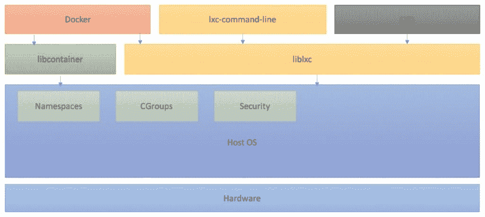
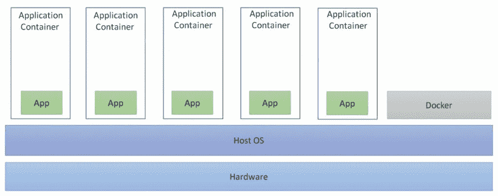

# 一、使用容器

本章涵盖容器和与它们相关的各种主题。在本章中，我们将涵盖以下主题:

*   虚拟化的历史背景
*   容器介绍
*   容器组件
*   容器类型
*   容器运行时工具的类型
*   码头工人的安装
*   码头工人动手

# 虚拟化的历史背景

传统虚拟化以 Xen 和 KVM 等虚拟机管理程序的形式出现在 Linux 内核上。这允许用户以**虚拟机** ( **虚拟机**)的形式隔离他们的运行时环境。虚拟机运行自己的操作系统内核。用户试图尽可能多地使用主机上的资源。然而，这种形式的虚拟化很难实现高密度，尤其是当部署的应用与内核相比体积较小时；主机的大部分内存被运行在其上的多个内核副本所消耗。因此，在这样的高密度工作负载中，机器使用诸如 *chroot 监狱*等技术进行划分，这些技术提供了不完善的工作负载隔离，并带来了安全隐患。

2001 年，以 Linux vServer 形式出现的操作系统虚拟化作为一系列内核补丁被引入。

这导致了早期形式的容器虚拟化。在这种形式的虚拟化中，内核对属于不同租户的进程进行分组和隔离，每个租户共享相同的内核。

下面的表格解释了实现操作系统虚拟化的各种发展:

| **年份和发展** | **描述** |
| 1979 年:chroot | 容器的概念早在 1979 年就随着 UNIX chroot 出现了。后来，在 1982 年，这被纳入 BSD。使用 chroot，用户可以更改任何正在运行的进程及其子进程的根目录，将其与主操作系统和目录分开。 |
| 2000 年:FreeBSD 监狱 | FreeBSD 监狱是 2000 年由 R&D 联合公司的德里克·t·伍尔沃斯为 FreeBSD 引进的。这是一个操作系统的系统调用，类似于 chroot，具有额外的进程沙箱功能，用于隔离文件系统、用户、网络等。 |
| 2001 年:linux vserver | 另一种监狱机制，可以安全地划分计算机系统上的资源(文件系统、中央处理器时间、网络地址和内存)。 |
| 2004 年:Solaris 容器 | Solaris 容器是为 x86 和 SPARC 系统引入的，并于 2004 年 2 月首次公开发布。它们是系统资源控制和分区提供的边界分隔的组合。 |
| 2005 年:OpenVZ | OvenVZ 类似于 Solaris 容器，并利用修补的 Linux 内核来提供虚拟化、隔离、资源管理和检查点。 |
| 2006 年:加工容器 | 流程容器于 2006 年在谷歌实现，用于限制、核算和隔离一组流程的资源使用(中央处理器、内存、磁盘输入/输出、网络等)。 |
| 2007 年:对照组 | 控制组，也称为 CGroups，由谷歌实现，并于 2007 年添加到 Linux 内核中。CGroups 有助于限制、核算和隔离进程集合的资源使用(内存、CPU、磁盘、网络等)。 |
| 2008 年:LXC | LXC 代表 Linux 容器，是使用 CGroups 和 Linux 命名空间实现的。与其他容器技术相比，LXC 在普通的 Linux 内核上工作。 |
| 2011 年:典狱长 | Warden 由 Cloud Foundry 于 2011 年实施，初期使用 LXC；后来，它被自己的实现所取代。 |
| 2013 年:伦敦金属交易所 | **LMCTFY** 代表**让我为你包容**。它是谷歌容器栈的开源版本，提供 Linux 应用容器。 |
| 2013 年:Docker | Docker 成立于 2016 年。如今，它是使用最广泛的容器管理工具。 |
| 2014:火箭 | Rocket 是 CoreOS 的另一个容器运行时工具。它的出现是为了解决 Docker 早期版本中的安全漏洞。Rocket 是替代 Docker 使用的另一种可能性或选择，具有最明确的安全性、可组合性、速度和生产要求。 |
| 2016 年:Windows 容器 | 微软在 2015 年为基于 Windows 的应用在微软 Windows Server 操作系统中添加了容器支持(Windows 容器)。在这个实现的帮助下，Docker 将能够在 Windows 上本地运行 Docker 容器，而不必运行虚拟机来运行。 |

# 容器介绍

Linux 容器是操作系统级虚拟化，它在单个主机上提供多个隔离的环境。它们共享主机操作系统内核和硬件，而不是像虚拟机那样使用专用的来宾操作系统。

在容器成为焦点之前，主要使用多任务处理和传统的基于虚拟机管理程序的虚拟化。多任务处理允许多个应用在同一台主机上运行，但是，它在不同应用之间提供的隔离较少。

传统的基于虚拟机管理程序的虚拟化允许多个客户机在主机上运行。每台客户机都运行自己的操作系统。这种方法提供了最高级别的隔离，并且能够在同一硬件上同时运行不同的操作系统。

然而，它有许多缺点:

*   每个操作系统都需要一段时间才能启动
*   每个内核都占用自己的内存和 CPU，因此虚拟化的开销很大
*   输入/输出效率较低，因为它必须通过不同的层
*   资源分配不是在细粒度的基础上完成的，例如，内存是在创建时分配给虚拟机的，一个虚拟机闲置的内存不能被其他虚拟机使用
*   保持每个内核最新的维护工作量很大

下图解释了虚拟化的概念:


容器提供了这两个词的精华。为了给容器提供一个隔离且安全的环境，他们使用了 Linux 内核特性，比如 chroot、名称空间、CGroups、AppArmor、se Linux 概要文件等等。

Linux 安全模块确保了从容器对主机内核的安全访问..启动更快，因为没有内核或操作系统启动。资源分配是细粒度的，由主机内核处理，允许有效的每容器服务质量(QoS)。下图解释了容器虚拟化。

然而，与传统的基于虚拟机管理程序的虚拟化相比，容器有一些缺点:客户操作系统仅限于那些可以使用相同内核的系统。

传统虚拟机管理程序提供了容器中无法提供的额外隔离，这意味着容器中的噪音邻居问题比传统虚拟机管理程序更为严重:


# 容器组件

Linux 容器通常由五个主要组件组成:

*   **内核命名空间**:命名空间是 Linux 容器的主要构建模块。它们将各种类型的 Linux 资源(如网络、进程、用户和文件系统)隔离到不同的组中。这允许不同的进程组对它们的资源有完全独立的视图。其他可以隔离的资源包括进程标识空间、进程间通信空间和信号量空间。
*   **控制组**:控制组，也称为 CGroups，在一组不同的进程中，限制和说明不同类型的资源使用，如 CPU、内存、磁盘 I/O、网络 I/O 等。它们有助于防止一个容器因另一个容器引起的资源匮乏或争用，从而保持服务质量。
*   **安全**:集装箱内的安全通过以下组件提供:
    *   **根能力**:这将有助于通过降低根的功率来在所谓的特权容器中实施命名空间，在某些情况下甚至完全没有功率。
    *   **自主访问控制(DAC)** :它基于用户应用的策略来调解对资源的访问，这样各个容器就不会相互干扰，并且可以由非根用户安全地运行。
    *   **强制访问控制(MAC)** :强制访问控制(MAC)，如 AppArmor 和 SELinux，在创建容器时并不是必需的，但往往是其安全性的关键要素。媒体访问控制确保容器代码本身和运行在容器中的代码的访问程度都不会超过进程本身的要求。这样，它最大限度地减少了授予流氓或受损进程的特权。
    *   **工具集**:在主机内核之上是用户空间工具集，例如 LXD、Docker 和其他库，它们有助于管理容器:



# 容器类型

容器的类型如下:

# 机器容器

机器容器是共享主机操作系统内核但提供用户空间隔离的虚拟环境。它们看起来更像虚拟机。它们有自己的初始化进程，并且可能运行有限数量的守护进程。程序可以像在任何客户操作系统上一样安装、配置和运行。与虚拟机类似，在容器内运行的任何东西都只能看到分配给该容器的资源。当用例运行一批相同或不同风格的发行版时，机器容器非常有用。

机器容器拥有自己的操作系统并不意味着它们运行的是自己内核的完整拷贝。相反，它们运行一些轻量级守护程序，并有许多必要的文件来在另一个操作系统中提供单独的操作系统。

LXC、OpenVZ、Linux vServer、BSD Jails 和 Solaris 区域等容器技术都适合创建机器容器。

下图显示了机器容器的概念:


# 应用容器

虽然机器容器设计用于运行多个进程和应用，但应用容器设计用于打包和运行单个应用。它们被设计得非常小。它们不需要包含外壳或`init`过程。应用容器所需的磁盘空间非常小。Docker 和 Rocket 等容器技术就是应用容器的例子。

下图详细说明了应用容器:

****

# 容器运行时工具的类型

目前有多种解决方案可用于管理容器。本节讨论容器的替代类型。

# 码头工人

**Docker** 是全球领先的集装箱平台软件。它从 2013 年开始提供。Docker 是一个容器运行时工具，旨在通过使用容器更容易地创建、部署和运行应用。Docker 通过容器化应用极大地降低了管理应用的复杂性。它允许应用使用与主机操作系统相同的 Linux 内核，不像虚拟机那样使用专用硬件创建全新的操作系统。Docker 容器可以在 Linux 和 Windows 工作负载上运行。Docker 容器已经在软件开发中实现了巨大的效率，但是需要运行时工具，如 Swarm 或 Kubernetes。

# 火箭

**Rocket** 是 CoreOS 的另一个容器运行时工具。它的出现是为了解决 Docker 早期版本中的安全漏洞。Rocket 是 Docker 的另一种可能性或选择，具有最明确的安全性、可组合性、速度和生产要求。火箭在很多方面都做了与 Docker 不同的事情。主要区别在于 Docker 运行一个具有根权限的中央守护进程，并派生出一个新的容器作为它的子进程，而 Rocket 从不派生具有根权限的容器。然而，Docker 总是建议在 SELinux 或 AppArmor 中运行容器。从那以后，Docker 提出了许多解决方案来解决这些缺陷。

# LXD

**LXD** 是 Ubuntu 管理 LXC 的容器虚拟机管理程序。LXD 是一个守护进程，它为运行容器和管理相关资源提供了一个 REST API。LXD 容器提供了与传统虚拟机相同的用户体验，但使用了 LXC，它提供了与容器相似的运行时性能，并提高了虚拟机的利用率。LXD 容器运行完整的 Linux 操作系统，因此通常运行时间很长，而 Docker 应用容器运行时间很短。这使得 LXD 成为一个不同于 Docker 的机器管理工具，更接近软件分发。

# openvz

**OpenVZ** 是一个基于容器的 Linux 虚拟化，允许在单个物理服务器上运行多个安全、隔离的 Linux 容器，也称为**虚拟环境** ( **VEs** )和**虚拟专用服务器** ( **VPS** )。OpenVZ 实现了更好的服务器利用率，并确保应用不会发生冲突。它类似于 LXC。它只能在基于 Linux 的操作系统上运行。由于所有 OpenVZ 容器与主机共享相同的内核版本，因此不允许用户进行任何内核修改。然而，由于共享的主机内核，它还具有内存占用小的优点。

# Windows 服务器容器

Windows Server 2016 将 Linux 容器引入到微软工作负载中。微软已经与 Docker 合作，将 Docker 容器的优势带给微软 Windows Server。他们还重新设计了核心 windows 操作系统，以支持容器技术。有两种类型的 Windows 容器:Windows 服务器容器和 Hyper-V 隔离。

Windows 服务器容器用于在 Microsoft 工作负载上运行应用容器。他们使用进程和名称空间隔离技术来确保多个容器之间的隔离。它们还与主机操作系统共享相同的内核，因为这些容器需要与主机相同的内核版本和配置。这些容器不提供严格的安全边界，不应用于隔离不可信的代码。

# Hyper-V 容器

Hyper-V 容器是一种 Windows 容器，与 Windows 服务器容器相比，它提供了更高的安全性。Hyper-V 在轻量级、高度优化的 **Hyper-V** 虚拟机中托管 Windows 服务器容器。因此，它们带来了更高程度的资源隔离，但代价是主机上的效率和密度。当主机操作系统的信任边界需要额外的安全性时，可以使用它们。在这种配置中，容器主机的内核不与同一主机上的其他容器共享。由于这些容器不与主机或主机上的其他容器共享内核，因此它们可以运行具有不同版本和配置的内核。用户可以选择在运行时运行带有或不带有 Hyper-V 隔离的容器。

# 透明容器

虚拟机是安全的，但非常昂贵且启动缓慢，而容器是快速的，提供了更有效的替代方案，但安全性较低。英特尔的 Clear containers 是基于虚拟机管理程序的虚拟机和 Linux 容器之间的折衷解决方案，它提供了类似于传统 Linux 容器的敏捷性，同时还提供了基于虚拟机管理程序的虚拟机的硬件强制工作负载隔离。

透明容器是包装在自己的超快速精简虚拟机中的容器，可提供安全性和效率。Clear 容器模型使用了快速且轻量级的 QEMU 虚拟机管理程序，该虚拟机管理程序经过优化以减少内存占用并提高启动性能。它还在内核中优化了系统和核心用户空间，以实现最小的内存消耗。与传统虚拟机相比，这些功能显著提高了资源利用效率，并提供了增强的安全性和速度。

英特尔 Clear 容器提供了一种轻量级机制，将来宾环境与主机隔离开来，并为工作负载隔离提供了基于硬件的实施。此外，操作系统层从主机透明且安全地共享到每个英特尔 Clear 容器的地址空间中，提供了高安全性和低开销的最佳组合。

随着 Clear containers 提供的安全性和敏捷性增强，他们已经看到了很高的采用率。如今，它们借助英特尔虚拟技术的额外保护，与 Docker 项目无缝集成。英特尔和 CoreOS 密切合作，将 Clear 容器纳入 CoreOS 的火箭(Rkt)容器运行时。

# 码头工人的安装

Docker 有两个版本，**社区版(CE)** 和**企业版(EE)** :

*   **Docker 社区版(CE)** :对于希望开始使用 Docker 的开发人员和小团队来说非常理想，并且可能正在尝试基于容器的应用
*   **Docker 企业版(EE)** :专为大规模生产中构建、运输和运行业务关键型应用的企业开发和 It 团队而设计

本节将演示在 Ubuntu 16.04 上安装 Docker CE 的说明。官方 Ubuntu 16.04 存储库中提供的 Docker 安装包可能不是最新版本。要获得最新最棒的版本，请从官方 Docker 存储库中安装 Docker。本节将向您展示如何做到这一点:

1.  首先，将正式 Docker 存储库的 GPG 密钥添加到系统中:

```
 $ curl -fsSL https://download.docker.com/linux/ubuntu/gpg |
        sudo apt-key add 
```

2.  将 Docker 存储库添加到 APT 源:

```
 $ sudo add-apt-repository "deb [arch=amd64]
 https://download.docker.com/linux/ubuntu $(lsb_release -cs) stable" 
```

3.  接下来，用新添加的存储库中的 Docker 包更新包数据库:

```
 $ sudo apt-get update 
```

4.  确保您要安装 Docker 存储库，而不是默认的 Ubuntu 16.04 存储库:

```
 $ apt-cache policy docker-ce 
```

5.  您应该会看到类似如下的输出:

```
 docker-ce:
          Installed: (none)
          Candidate: 17.06.0~ce-0~ubuntu
          Version table:
             17.06.0~ce-0~ubuntu 500
                500 https://download.docker.com/linux/ubuntu xenial/stable 
 amd64 Packages
             17.03.2~ce-0~ubuntu-xenial 500
                500 https://download.docker.com/linux/ubuntu xenial/stable 
 amd64 Packages
             17.03.1~ce-0~ubuntu-xenial 500
               500 https://download.docker.com/linux/ubuntu xenial/stable 
 amd64 Packages
             17.03.0~ce-0~ubuntu-xenial 500
              500 https://download.docker.com/linux/ubuntu xenial/stable 
 amd64 Packages
```

Notice that `docker-ce` is not installed, but the candidate for installation is from the Docker repository for Ubuntu 16.04\. The `docker-ce` version number might be different.

6.  最后，安装 Docker:

```
 $ sudo apt-get install -y docker-ce 
```

7.  现在应该安装 Docker，启动守护程序，并使进程能够在启动时启动。检查它是否正在运行:

```
 $ sudo systemctl status docker
        docker.service - Docker Application Container Engine
           Loaded: loaded (/lib/systemd/system/docker.service; enabled; 
 vendor preset: enabled)
           Active: active (running) since Sun 2017-08-13 07:29:14 UTC; 45s
 ago
             Docs: https://docs.docker.com
         Main PID: 13080 (dockerd)
           CGroup: /system.slice/docker.service
                   ├─13080 /usr/bin/dockerd -H fd://
                   └─13085 docker-containerd -l 
 unix:///var/run/docker/libcontainerd/docker-containerd.sock --
 metrics-interval=0 --start
```

8.  通过运行 hello-world 映像验证 Docker CE 是否安装正确:

```
 $ sudo docker run hello-world 
        Unable to find image 'hello-world:latest' locally 
        latest: Pulling from library/hello-world 
        b04784fba78d: Pull complete 
        Digest:
 sha256:f3b3b28a45160805bb16542c9531888519430e9e6d6ffc09d72261b0d26
 ff74f 
        Status: Downloaded newer image for hello-world:latest 

        Hello from Docker! 
 This message shows that your installation appears to be
 working correctly.
```

```
 To generate this message, Docker took the following steps:
 The Docker client contacted the Docker daemon
 The Docker daemon pulled the hello-world image from the Docker Hub
 The Docker daemon created a new container from that image, 
 which ran the executable that produced the output you are 
 currently reading 
 The Docker daemon streamed that output to the Docker client, 
 which sent it to your terminal
 To try something more ambitious, you can run an Ubuntu 
 container with the following:
 $ docker run -it ubuntu bash 
        Share images, automate workflows, and more with a free Docker ID: 
 https://cloud.docker.com/ 
 For more examples and ideas,
 visit: https://docs.docker.com/engine/userguide/.
```

# 码头工人动手

本节解释如何使用 Docker 在容器中运行任何应用。上一节中解释的 docker 安装还安装了 Docker 命令行实用程序或 Docker 客户端。让我们探索一下`docker`命令。使用`docker`命令包括向它传递一系列选项和命令，后跟参数。

语法采用以下形式:

```
$ docker [option] [command] [arguments]
# To see help for individual command
$ docker help [command]  
```

要查看有关 Docker 和 Docker 版本的系统范围信息，请使用以下命令:

```
$ sudo docker info
$ sudo docker version  
```

Docker 有许多子命令来管理由 Docker 守护进程管理的多个资源。以下是 Docker 支持的管理命令列表:

| **管理命令** | **描述** |
| `Config` | 坞站配置管理器 |
| `container` | 管理容器 |
| `image` | 管理图像 |
| `network` | 管理网络 |
| `Node` | 管理 Swarrn 节点 |
| `Plugin` | 管理器插件 |
| `secret` | 经理 docker 机密 |
| `Service` | 经理服务 |
| `Stack` | 经理码头工人栈 |
| `Swarm` | 管理群 |
| `System` | 经理码头工人 |
| `Volume` | 管理卷 |

在下一节中，我们将探索容器和图像资源。

# 使用 Docker 图像

映像是一个轻量级、独立的可执行包，包含运行一个软件所需的一切，包括代码、运行时、库、环境变量和配置文件。Docker 映像用于创建 Docker 容器。图像存储在 Docker 集线器中。

# 列出图像

通过运行 Docker images 子命令，可以列出 Docker 主机中可用的所有映像。默认的 Docker 图像将显示所有顶级图像、它们的存储库和标签以及它们的大小:

```
$ sudo docker images
REPOSITORY          TAG                 IMAGE ID            CREATED             SIZE
wordpress           latest              c4260b289fc7        10 days ago         406MB
mysql               latest              c73c7527c03a        2 weeks ago         412MB
hello-world         latest              1815c82652c0        2 months ago        1.84kB 
```

# 获取新图像

Docker 将自动下载 Docker 主机系统中不存在的任何映像。如果未提供标签，则`docker pull`子命令将始终下载该存储库中具有最新标签的图像。如果提供了一个标签，它将使用该标签提取特定图像。

要提取基础图像，请执行以下操作:

```
$ sudo docker pull Ubuntu 
# To pull specific version 
$ sudo docker pull ubuntu:16.04 
```

# 搜索 Docker 图像

Docker 最重要的一个特性就是很多人为了各种各样的目的创建了 Docker 图像。其中许多已经上传到 Docker Hub。通过使用 Docker 搜索子命令，您可以轻松地在 Docker Hub 注册表中搜索 Docker 图像:

```
$ sudo docker search ubuntu
NAME                                           DESCRIPTION                                     STARS     OFFICIAL   AUTOMATED
rastasheep/ubuntu-sshd                         Dockerized SSH service, built on top of of...   97                   [OK]
ubuntu-upstart                                 Upstart is an event-based replacement for ...   76        [OK]
ubuntu-debootstrap                             debootstrap --variant=minbase --components...   30        [OK]
nuagebec/ubuntu                                Simple always updated Ubuntu docker images...   22                   [OK]
tutum/ubuntu                                   Simple Ubuntu docker images with SSH access     18  
```

# 删除图像

要删除图像，请运行以下命令:

```
$ sudo docker rmi hello-world
Untagged: hello-world:latest
Untagged: hello-world@sha256:b2ba691d8aac9e5ac3644c0788e3d3823f9e97f757f01d2ddc6eb5458df9d801
Deleted: sha256:05a3bd381fc2470695a35f230afefd7bf978b566253199c4ae5cc96fafa29b37
Deleted: sha256:3a36971a9f14df69f90891bf24dc2b9ed9c2d20959b624eab41bbf126272a023  
```

请参考 Docker 文档了解与 Docker 映像相关的其余命令。

# 使用 Docker 容器

容器是图像的运行时实例。默认情况下，它完全独立于主机环境运行，仅访问主机文件和端口(如果配置了)。

# 创建容器

启动一个容器很简单，因为`docker run`传递了您想要运行的图像名称和在容器中运行它的命令。如果映像不存在于您的本地计算机上，Docker 将尝试从公共映像注册表中获取它:

```
$ sudo docker run --name hello_world ubuntu /bin/echo hello world  
```

在前面的示例中，容器将启动，打印 hello world，然后停止。容器被设计成一旦在其中执行的命令退出就停止。

例如，让我们使用 Ubuntu 中的最新图像运行一个容器。`-i`和`-t`开关的组合为您提供了对容器的交互式外壳访问:

```
$ sudo docker run -it ubuntu
root@a5b3bce6ed1b:/# ls
bin  boot  dev  etc  home  lib  lib64  media  mnt  opt  proc  root 
run  sbin  srv  sys  tmp  usr  var  
```

# 列出容器

您可以使用以下命令列出 Docker 主机上运行的所有容器:

```
# To list active containers
$ sudo docker ps

# To list all containers
$ sudo docker ps -a
CONTAINER ID        IMAGE               COMMAND                  CREATED             STATUS                      PORTS               NAMES
2db72a5a0b99        ubuntu              "/bin/echo hello w..." 
58 seconds ago      Exited (0) 58 seconds ago 
hello_world  
```

# 检查容器日志

您还可以使用以下内容查看正在运行的容器记录的信息:

```
$ sudo docker logs hello_world
hello world  
```

# 启动容器

您可以使用以下方法启动停止的容器:

```
$ sudo docker start hello_world  
```

同样，您可以使用停止、暂停、取消暂停、重新启动、重新启动等命令来操作容器。

# 删除容器

您也可以使用以下命令删除停止的容器:

```
$ sudo docker delete hello_world

# To delete a running container, use -force parameter
$ sudo docker delete --force [container]  
```

有关 Docker 容器的其余命令，请参考 Docker 文档。

# 摘要

在本章中，我们学习了容器及其类型。我们还了解了容器中的组件。我们看了不同的容器运行时工具。我们深入了解了 Docker，安装了它，并进行了动手练习。我们还学习了使用 Docker 管理容器和图像的命令。在下一章中，我们将了解目前可用的不同 COE 工具。