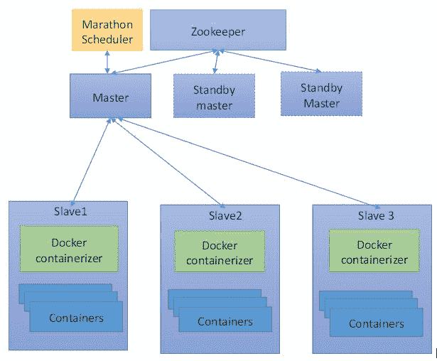
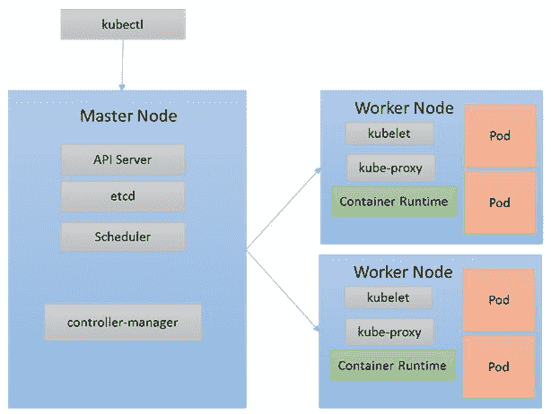

# 二、使用容器编排引擎

在本章中，我们将会看到**容器编排引擎** ( **COE** )。容器编排引擎是帮助管理运行在多个主机上的许多容器的工具。

在本章中，我们将涵盖以下主题:

*   COE简介
*   码头工人群
*   阿帕奇月
*   忽必烈忽必烈忽必烈忽必烈忽必烈忽必烈忽必烈忽必烈忽必烈忽必烈
*   不可思议的安装
*   双手合十

# COE简介

容器为用户提供了一种打包和运行应用的简单方法。打包包括定义用户应用运行所需的库和工具。这些包一旦转换成图像，就可以用来创建和运行容器。这些容器可以在任何地方运行，无论是在开发人员的笔记本电脑上、质量保证系统上还是在生产机器上，环境都不会发生任何变化。Docker 和其他容器运行时工具提供了管理这些容器生命周期的工具。

使用这些工具，用户可以构建和管理映像、运行容器、删除容器以及执行其他容器生命周期操作。但是这些工具只能在一台主机上管理一个容器。当我们在多个容器和多个主机上部署应用时，我们需要某种自动化工具。这种类型的自动化通常被称为编排。编排工具提供了许多功能，包括:

*   配置和管理将运行容器的主机
*   从存储库中提取图像并实例化容器
*   管理容器的生命周期
*   基于主机的资源可用性在主机上调度容器
*   当一个人死亡时开始一个新的容器
*   缩放容器以匹配应用的需求
*   在容器之间提供网络，以便它们可以在不同的主机上相互访问
*   将这些容器公开为服务，以便可以从外部访问它们
*   集装箱的健康监测
*   升级容器

通常，这类编排工具以 YAML 或 JSON 格式提供声明性配置。这些定义包含了与容器相关的所有信息，包括图像、网络、存储、缩放等。编排工具使用这些定义来应用相同的设置，以便每次都提供相同的环境。

有许多容器编排工具可用，例如 Docker Machine、Docker Compose、Kuberenetes、Docker Swarm 和 Apache Mesos，但本章只关注 Docker Swarm、Apache Mesos 和 Kubernetes。

# 码头工人群

**Docker Swarm** 是 Docker 本身的原生编排工具。它管理一个 Docker 主机池，并将它们变成一个虚拟 Docker 主机。Docker Swarm 提供了一个标准的 Docker API 来管理集群上的容器。如果用户已经在使用 Docker 来管理他们的容器，他们很容易转向 Docker Swarm。

Docker Swarm 遵循一个*交换、即插即用*的原则。这在集群中提供了可插入的调度算法、广泛的注册表和发现后端支持。用户可以根据需要使用各种调度算法和发现后端。下图显示了 Docker Swarm 体系结构:


# Docker Swarm 组件

以下部分解释了 Docker Swarm 中的各种组件。

# 结节

节点是参与群集的 Docker 主机的一个实例。单个 Swarm 集群部署中可以有一个或多个节点。节点根据其在系统中的角色分为管理者和工作者。

# 管理器节点

群集管理器节点管理群集中的节点。它提供了管理集群中的节点和容器的应用编程接口。管理节点将工作单元(也称为任务)分配给工作节点。如果有多个经理节点，则他们选择一个领导者来执行编排任务。

# 工作节点

工作节点接收并执行管理节点分配的任务。默认情况下，每个管理器节点也是一个工作节点，但它们可以配置为以独占方式运行管理器任务。工作节点运行代理，跟踪其上运行的任务，并报告它们。工作者节点还通知管理器节点已分配任务的当前状态。

# 任务

任务是一个单独的 Docker 容器，有一个在容器内部运行的命令。经理将任务分配给工作节点。任务是集群中最小的调度单元。

# 服务

服务是一组 Docker 容器或跨 Swarm 集群运行的任务的接口。

# 发现服务

发现服务存储集群状态，并提供节点和服务可发现性。Swarm 支持可插拔的后端架构，支持 etcd、Consul、Zookeeper、静态文件、IP 列表等等，作为发现服务。

# 调度程序

Swarm 调度器在系统的不同节点上调度任务。Docker Swarm 附带了许多内置的调度策略，使用户能够指导容器在节点上的放置，以便最大化或最小化集群中的任务分布。Swarm 也支持随机策略。它选择一个随机节点来放置任务。

# 群体模式

在 1.12 版本中，Docker 在其引擎中引入了 Swarm 模式。要运行集群，用户需要在每个 Docker 主机上执行两个命令:

要进入群体模式:

```
$ docker swarm init
```

要将节点添加到群集，请执行以下操作:

```
$ docker swarm join  
```

与 Swarm 不同，Swarm 模式自带服务发现、负载平衡、安全性、滚动更新和扩展等功能，内置于 Docker 引擎本身。集群模式使集群的管理变得容易，因为它不需要任何编排工具来创建和管理集群。

# 阿帕奇月

Apache Mesos 是一个开源的容错集群管理器。它管理一组称为从节点的节点，并将它们可用的计算资源提供给框架。框架从主框架获取资源可用性，并在从框架上启动任务。马拉松就是这样一个框架，它在 Mesos 集群上运行容器化的应用。Mesos 和 Marathon 一起成为了像 Swarm 或 Kubernetes 这样的容器编排引擎。

下图显示了整个体系结构:



# 阿帕奇介子及其组件

以下是 Apache Mesos 组件的列表:

# 掌握

主节点管理系统中的从节点。体制内可能有很多高手，但只有一个被选为领导。

# 奴隶

从节点是向主节点提供资源并运行框架提供的任务的节点。

# 结构

框架是由调度器组成的长时间运行的应用，这些调度器从主服务器获取资源并在从服务器上执行任务。

# 提供

Offer 只不过是每个从节点可用资源的集合。主节点从从节点获得这些提议，并将它们提供给框架，框架又在从节点上运行任务

# 任务

任务是框架安排在从节点上运行的最小工作单元。例如，容器化的应用可能是一项任务

# 动物园管理员

Zookeeper 是集群中的集中配置管理器。Mesos 使用 Zookeeper 来选择一个主人，并让奴隶加入集群

此外，Mesos Marathon 框架为长时间运行的应用(如容器)提供服务发现和负载平衡。马拉松还提供 REST 应用编程接口来管理工作负载。

# 忽必烈忽必烈忽必烈忽必烈忽必烈忽必烈忽必烈忽必烈忽必烈忽必烈

Kubernetes 是 Google 创建的容器编排引擎，旨在自动化容器化应用的部署、扩展和操作。它是发展最快的 Coe 之一，因为它为大规模构建分布式应用提供了一个可靠的平台。Kubernetes 自动化您的应用，管理其生命周期，并维护和跟踪服务器集群中的资源分配。它可以在物理或虚拟机集群上运行应用容器。

它提供了一个统一的应用编程接口来部署网络应用、数据库和批处理作业。它包含一组丰富的复杂功能:

*   自动缩放
*   自愈基础设施
*   批处理作业的配置和更新
*   服务发现和负载平衡
*   应用生命周期管理
*   配额管理

# 不可思议的建筑

本节概述了 Kubernetes 体系结构和交付运行中的集群的各种组件。

从顶层视图来看，Kubernetes 由以下组件组成:

*   外部请求
*   主网点
*   工作节点

下图显示了 Kubernetes 的体系结构:



我们将在下一节详细讨论每个组件。图中描绘了一些关键组件。

# 外部请求

用户通过 API 与 Kubernetes 集群交互；他们解释他们的需求是什么，他们的应用是什么样子，Kubernetes 做了所有艰苦的工作来管理他们的应用。`kubectl`是来自 Kubernetes 项目的命令行工具，以简单的方式调用 Kubernetes APIs。

# 主网点

主节点提供集群的控制平面。它就像集群中的控制器。大多数主要功能，如调度、服务发现、负载平衡、响应集群事件等，都是由仅在主节点上运行的组件完成的。现在，让我们来看看主组件及其功能。

# 多维数据集 apiserver

它公开了 Kubernetes APIs。所有的内部和外部请求都通过应用编程接口服务器。它验证所有传入请求的真实性和正确的访问级别，然后将请求转发给群集中的目标组件。

# 和 cd

`etcd`用于存储 Kubernetes 提供的所有集群状态信息。`etcd`是Kubernetes的关键成分。

# kube-控制器-管理器

Kubernetes 群集中有多个控制器，如节点控制器、复制控制器、端点控制器、服务帐户和令牌控制器。这些控制器作为后台线程运行，处理集群中的常规任务。

# 多维数据集调度程序

它监视所有新创建的 pods，并安排它们在一个节点上运行(如果它们没有分配给任何节点的话)。

请阅读 Kubernetes 文档([https://kubernetes.io/docs/concepts/overview/components/](https://kubernetes.io/docs/concepts/overview/components/))以了解控制平面中的其他组件，包括:

*   云控制器管理器
*   网络用户界面
*   集装箱资源监控
*   集群级日志记录

# 工作节点

工作节点运行用户的应用和服务。群集中可以有一个或多个工作节点。您可以在集群中添加或删除节点，以实现集群的可伸缩性。工作节点还运行多个组件来管理应用。

# 忽必烈忽必烈忽必烈忽必烈忽必烈忽必烈忽必烈忽必烈忽必烈忽必烈忽必烈忽必烈忽必烈忽必烈忽必烈忽必烈

`kubelet`是驻留在每个工作节点上的主代理。它监听`kube-apiserver`执行的命令。`kubelet`的一些功能包括安装Pod 的体积，下载Pod 的秘密，通过 Docker 或指定的容器运行时运行Pod 的容器，等等。

# 多维数据集代理

它通过维护主机上的网络规则和执行连接转发来实现 Kubernetes 的服务抽象。

# 容器运行时

Docker 或 Rocket 创建容器。

# 监督

`supervisord`是一个轻量级的过程监控系统，可用于保持`kubelet`和 Docker 运行。

# 流利

`fluentd`是一个帮助提供集群级日志记录的守护程序。

# 立方结构中的概念

在接下来的部分中，我们将学习用于表示集群的 Kubernetes 的概念。

# 豆荚

pod 是 Kubernetes 中最小的可部署计算单元。pod 是一组具有共享存储或共享网络的一个或多个容器，以及如何运行容器的规范。容器本身不会分配给主机，而密切相关的容器总是作为 pods 位于同一位置并共同调度在一起，并在共享上下文中运行。

pod 模拟特定于应用的逻辑主机；它包含一个或多个应用容器，且它们是相对紧密耦合。在预容器世界中，它们会在同一个物理或虚拟机上执行。使用 pods，我们具有更好的资源共享、保证命运共享、进程间通信和简化管理的优势。

# 副本集和复制控制器

副本集是下一代复制控制器。两者之间唯一的区别是副本集支持更高级的基于集的选择器，而复制控制器只支持基于等式的选择器，因此副本集比复制控制器更灵活。然而，以下解释适用于两者。

pod 是短暂的，如果它运行的节点发生故障，它不会被重新调度。副本集确保特定数量的 pod 实例(或副本)在任何给定时间运行。

# 部署

部署是创建副本集和荚的高级抽象。副本集在运行状态下保持所需数量的Pod 。部署提供了一种简单的方法，只需更改部署规范，即可升级、回滚和扩展或缩减 pods。

# 秘密

机密用于存储敏感信息，如用户名、密码、OAuth 令牌、证书和 SSH 密钥。将此类敏感信息存储在秘密中比将它们放在 pod 模板中更安全、更灵活。豆荚可以参考这些秘密，并利用其中的信息。

# 标签和选择器

标签是可以附加到对象的键值对，例如荚甚至节点。它们用于指定对用户有意义和相关的对象的识别属性。标签可以在创建时附加到对象上，并在以后添加或修改。它们用于组织和选择对象的子集。一些例子包括环境(开发、测试、生产、发布)、稳定、派克等等。

标签不提供唯一性。使用标签选择器，客户端或用户可以识别并随后管理一组对象。这是 Kubernetes 的核心分组原语，在很多情况下都会用到。

Kubernetes 支持两种选择器:基于等式的和基于集合的。基于等式的使用键值对基于基本等式或不等式进行过滤，而基于集合的功能更强大，允许根据一组值过滤键。

# 服务

由于 pods 在 Kubernetes 中是短命的对象，不能依赖分配给它们的 IP 地址长期稳定。这使得Pod 之间的通信变得困难。因此，Kubernetes 引入了服务的概念。一个服务是一个抽象，它建立在一系列单元和一个访问它们的策略之上，通常需要运行一个其他服务的代理来通过一个虚拟 IP 地址与之通信。

# 卷

卷为荚或容器提供持久存储。如果数据没有保存在外部存储上，那么一旦容器崩溃，它的所有文件都将丢失。卷也使得数据在容器内的多个容器之间共享变得容易。Kubernetes 支持多种类型的卷，pods 可以同时使用任意数量的卷。

# 不可思议的安装

Kubernetes 可以在各种平台上运行，从云提供商的笔记本电脑和虚拟机到裸机服务器机架。现在有多种解决方案可以安装和运行 Kubernetes 集群。阅读 Kubernetes 文档，为您的特定用例找到最佳解决方案。

在本章中，我们将使用`kubeadm`在 Ubuntu 16.04+上调出一个 Kubernetes 集群。`kubeadm`可用于通过每台机器的单个命令轻松调出集群。

在这个安装中，我们将使用一个名为`kubeadm`的工具，它是 Kubernetes 的一部分。安装`kubeadm`的前提条件是:

*   一台或多台运行 Ubuntu 16.04+的机器
*   每台机器至少 1 GB 或更多内存
*   群集中所有计算机之间的完全网络连接

集群中的所有计算机都需要安装以下组件:

1.  在所有机器上安装 Docker。根据 Kubernetes 文档，建议使用 1.12 版本。有关安装码头工人的说明，请参考[第 1 章](01.html#K0RQ0-08510d04d33546e798ef8c1140114deb)、*中的*安装码头工人*一节。*
2.  在每台机器上安装`kubectl`。`kubectl`是 Kubernetes 提供的命令行工具，用于在 Kubernetes 上部署和管理应用。您可以使用`kubectl`检查集群资源，创建、删除和更新组件，查看您的新集群并调出示例应用。同样，安装`kubectl`有多种选择。在本章中，我们将使用 curl 来安装它。有关更多选项，请参考 Kubernetes 文档。
    1.  使用 curl 下载最新版本的`kubectl`:

```
        $ curl -LO https://storage.googleapis.com/kubernetes-
        release/release/$(curl -s https://storage.googleapis.com/kubernetes
        release/release/stable.txt)/bin/linux/amd64/kubectl
```

2.  使`kubectl`二进制文件可执行:

```
        $ chmod +x ./kubectl  
```

3.  现在，在所有机器上安装`kubelet`和`kubeadm`。`kubelet`是在集群中的所有机器上运行的组件，并执行启动Pod 和容器等操作。`kubeadm`是引导集群的命令:
    1.  以 root 用户身份登录:

```
        $ sudo -i  
```

2.  更新并安装软件包:

```
        $ apt-get update && apt-get install -y apt-transport-https
```

3.  添加包的身份验证密钥:

```
        $ curl -s https://packages.cloud.google.com/apt/doc/apt-key.gpg 
        | apt-key add -  
```

4.  将 Kubernetes 源添加到`apt`列表中:

```
        $ cat <<EOF >/etc/apt/sources.list.d/kubernetes.list
        deb http://apt.kubernetes.io/ kubernetes-xenial main
        EOF  
```

5.  更新并安装工具:

```
        $ apt-get update
        $ apt-get install -y kubelet kubeadm  
```

以下步骤演示了如何使用`kubeadm`设置安全的 Kubernetes 集群。我们还将在集群上创建一个 pod 网络，以便应用组件可以相互通信。最后，在集群上安装一个示例微服务应用来验证安装。

1.  初始化主节点。要初始化主机，选择您先前安装的机器之一`kubeadm`并运行以下命令。我们已经指定`pod-network-cidr`为Pod 之间的通信提供网络:

```
          $ kubeadm init --pod-network-cidr=10.244.0.0/16  
```

请参考`kubeadm`参考文件，了解更多`kubeadm init`提供的标志。

这可能需要几分钟，因为`kubeadm init`将首先运行一系列预检查，以确保机器准备好运行 Kubernetes。根据预检查结果，它可能会显示警告并在出现错误时退出。然后，它将下载并安装控制平面组件和集群数据库。

前面命令的输出如下所示:

```
[kubeadm] WARNING: kubeadm is in beta, please do not use it for production clusters.
[init] Using Kubernetes version: v1.7.4
[init] Using Authorization modes: [Node RBAC]
[preflight] Running pre-flight checks
[preflight] WARNING: docker version is greater than the most recently validated version. Docker version: 17.06.1-ce. Max validated version: 1.12
[preflight] Starting the kubelet service
[kubeadm] WARNING: starting in 1.8, tokens expire after 24 hours by default (if you require a non-expiring token use --token-ttl 0)
[certificates] Generated CA certificate and key.
[certificates] Generated API server certificate and key.
[certificates] API Server serving cert is signed for DNS names [galvin kubernetes kubernetes.default kubernetes.default.svc kubernetes.default.svc.cluster.local] and IPs [10.96.0.1 10.0.2.15]
[certificates] Generated API server kubelet client certificate and key.
[certificates] Generated service account token signing key and public key.
[certificates] Generated front-proxy CA certificate and key.
[certificates] Generated front-proxy client certificate and key.
[certificates] Valid certificates and keys now exist in "/etc/kubernetes/pki"
[kubeconfig] Wrote KubeConfig file to disk: "/etc/kubernetes/admin.conf"
[kubeconfig] Wrote KubeConfig file to disk: "/etc/kubernetes/kubelet.conf"
[kubeconfig] Wrote KubeConfig file to disk: "/etc/kubernetes/controller-manager.conf"
[kubeconfig] Wrote KubeConfig file to disk: "/etc/kubernetes/scheduler.conf"
[apiclient] Created API client, waiting for the control plane to become ready
[apiclient] All control plane components are healthy after 62.001439 seconds
[token] Using token: 07fb67.033bd701ad81236a
[apiconfig] Created RBAC rules
[addons] Applied essential addon: kube-proxy
[addons] Applied essential addon: kube-dns  
Your Kubernetes master has initialized successfully:
mkdir -p $HOME/.kube
sudo cp -i /etc/kubernetes/admin.conf $HOME/.kube/config
sudo chown $(id -u):$(id -g) $HOME/.kube/config 
You should now deploy a pod network to the cluster.
Run kubectl apply -f [podnetwork].yaml with one of the options listed at: http://kubernetes.io/docs/admin/addons/.
You can now join any number of machines by running the following on each node as the root:
kubeadm join --token 07fb67.033bd701ad81236a 10.0.2.15:6443 
```

保存前面输出的`kubeadm join`命令。您将需要它来将节点加入您的 Kubernetes 集群。令牌用于主节点和节点之间的相互认证。

现在，要开始使用集群，请以普通用户身份运行以下命令:

```
$ mkdir -p $HOME/.kube
$ sudo cp -i /etc/kubernetes/admin.conf $HOME/.kube/config
$ sudo chown $(id -u):$(id -g) $HOME/.kube/config  
```

2.  安装 pod 网络。该网络用于集群中各单元之间的通信:

The network must be deployed before running any application. Also, services such as `kube-dns` will not start up before a network is installed. `kubeadm` only supports **Container Network Interface** (**CNI**) networks and does not support `kubenet`.

有多个网络附加项目可用于创建安全网络。要查看完整的列表，请访问 Kubernetes 文档以供参考。在本例中，我们将使用法兰绒进行联网。法兰绒是覆盖网络提供商:

```
 $ sudo kubectl apply -f 
https://raw.githubusercontent.com/coreos/flannel/master/Documentation/kube-flannel.yml
 serviceaccount "flannel" created
 configmap "kube-flannel-cfg" created
 daemonset "kube-flannel-ds" created
 $ sudo kubectl apply -f 
https://raw.githubusercontent.com/coreos/flannel/master/Documentation/kube-flannel-rbac.yml
 clusterrole "flannel" created
 clusterrolebinding "flannel" created  
```

您可以通过检查输出中的`kube-dns`Pod 是否已启动并运行来确认其正在工作:

```
$ kubectl get pods --all-namespaces
NAMESPACE     NAME                             READY     STATUS    RESTARTS   AGE
kube-system   etcd-galvin                      1/1       Running   0          2m
kube-system   kube-apiserver-galvin            1/1       Running   0          2m
kube-system   kube-controller-manager-galvin   1/1       Running   0          2m
kube-system   kube-dns-2425271678-lz9fp        3/3       Running   0          2m
kube-system   kube-flannel-ds-f9nx8            2/2       Running   2          1m
kube-system   kube-proxy-wcmdg                 1/1       Running   0          2m
kube-system   kube-scheduler-galvin            1/1       Running   0          2m  
```

3.  将节点加入集群。要将节点添加到 Kubernetes 集群，并将 SSH 添加到节点，请运行以下命令:

```
$ sudo kubeadm join --token <token> <master-ip>:<port>
[kubeadm] WARNING: kubeadm is in beta, please do not use it for production clusters.
[preflight] Running pre-flight checks
[discovery] Trying to connect to API Server "10.0.2.15:6443"
[discovery] Created cluster-info discovery client, requesting info from "https://10.0.2.15:6443"
[discovery] Cluster info signature and contents are valid, will use API Server "https://10.0.2.15:6443"
[discovery] Successfully established connection with API Server "10.0.2.15:6443"
[bootstrap] Detected server version: v1.7.4
[bootstrap] The server supports the Certificates API (certificates.k8s.io/v1beta1)
[csr] Created API client to obtain unique certificate for this node, generating keys and certificate signing request
[csr] Received signed certificate from the API server, generating KubeConfig...
[kubeconfig] Wrote KubeConfig file to disk: "/etc/kubernetes/kubelet.conf"  
Node join complete:
Certificate signing request sent to master and response
Received
Kubelet informed of new secure connection details
Run kubectl get nodes on the master to see this machine join.
```

现在，运行以下命令来验证节点的连接:

```
$ kubectl get nodes
NAME      STATUS    AGE       VERSION
brunno    Ready     14m       v1.7.4
```

通过创建一个 Nginx 样品盒来验证您的安装:

```
$ kubectl run my-nginx --image=nginx --replicas=2 --port=80
deployment "my-nginx" created

$ kubectl get pods 
NAME                        READY     STATUS    RESTARTS   AGE
my-nginx-4293833666-c4c5p   1/1       Running   0          22s
my-nginx-4293833666-czrnf   1/1       Running   0          22s  
```

# 双手合十

在上一节中，我们学习了如何安装 Kubernetes 集群。现在，让我们用 Kubernetes 创建一个更复杂的例子。在这个应用中，我们将使用官方 Docker 映像部署一个运行 WordPress 站点和 MySQL 数据库的应用。

1.  创建一个持久卷。WordPress 和 MySQL 都将使用这个卷来存储数据。我们将创建两个大小各为 5 GB 的本地持久卷。将以下内容复制到`volumes.yaml`文件中:

```
        apiVersion: v1
        kind: PersistentVolume
        metadata:
          name: pv-1
          labels:
            type: local
        spec:
          capacity:
            storage: 5Gi
          accessModes:
            - ReadWriteOnce
          hostPath:
            path: /tmp/data/pv-1
         storageClassName: slow 
        ---
        apiVersion: v1
        kind: PersistentVolume
        metadata:
          name: pv-2
          labels:
            type: local
        spec:
          capacity:
            storage: 5Gi
          accessModes:
            - ReadWriteOnce
          hostPath:
            path: /tmp/data/pv-2
        storageClassName: slow 

```

2.  现在，通过运行以下命令创建卷:

```
 $ kubectl create -f volumes.yaml 
 persistentvolume "pv-1" created
 persistentvolume "pv-2" created    
```

3.  检查卷是否已创建:

```
          $ kubectl get pv
          NAME      CAPACITY   ACCESSMODES   RECLAIMPOLICY   STATUS      
          CLAIM     STORAGECLASS   REASON    AGE
          pv-1      5Gi        RWO           Retain          Available                                     
          8s
          pv-2      5Gi        RWO           Retain          Available                                    
          8s  
```

4.  创建一个秘密来存储 MySQL 密码。这个秘密将被 MySQL 和 WordPress 容器引用，以便这些容器可以访问它:

```
        $ kubectl create secret generic mysql-pass -from-
        literal=password=admin
        secret "mysql-pass" created
```

5.  验证秘密是否已创建:

```
        $ kubectl get secrets
        NAME                  TYPE                                  DATA    
        AGE
        default-token-1tb58   kubernetes.io/service-account-token   3      
        3m
        mysql-pass            Opaque                                1   
        9s
```

6.  创建 MySQL 部署。我们现在将创建一个服务，该服务公开一个 MySQL 容器、一个 5 GB 的持久卷声明以及一个使用 MySQL 容器运行 pod 的部署。将以下内容复制到`mysql-deployment.yaml`文件中:

```
        apiVersion: v1
        kind: Service
        metadata:
          name: wordpress-mysql
          labels:
            app: wordpress
        spec:
          ports:
            - port: 3306
          selector:
            app: wordpress
            tier: mysql
          clusterIP: None
        ---
        apiVersion: v1
        kind: PersistentVolumeClaim
        metadata:
          name: mysql-pv-claim
          labels:
            app: wordpress
        spec:
          accessModes:
            - ReadWriteOnce
          resources:
            requests:
              storage: 5Gi
        storageClassName: slow 

        ---
        apiVersion: extensions/v1beta1
        kind: Deployment
        metadata:
          name: wordpress-mysql
          labels:
            app: wordpress
        spec:
          strategy:
            type: Recreate
          template:
            metadata:
              labels:
                app: wordpress
                tier: mysql
            spec:
              containers:
              - image: mysql:5.6
                name: mysql
                env:
                - name: MYSQL_ROOT_PASSWORD
                  valueFrom:
                    secretKeyRef:
                      name: mysql-pass
                      key: password
                    ports:
                - containerPort: 3306
                  name: mysql
                volumeMounts:
                - name: mysql-persistent-storage
                  mountPath: /var/lib/mysql
              volumes:
              - name: mysql-persistent-storage
                persistentVolumeClaim:
                   claimName: mysql-pv-claim  
```

7.  现在，启动 MySQL pod:

```
        $ kubectl create -f mysql-deployment.yaml 
          service "wordpress-mysql" created
          persistentvolumeclaim "mysql-pv-claim" created
          deployment "wordpress-mysql" created  
```

8.  检查Pod 的状态:

```
          $ kubectl get pods
          NAME                               READY     STATUS    RESTARTS
          AGE
            wordpress-mysql-2222028001-l8x9x   1/1       Running   0  
          6m      
```

9.  或者，您可以通过运行以下命令来检查 pod 的日志:

```
        $ kubectl logs wordpress-mysql-2222028001-l8x9x

        Initializing database
        2017-08-27 15:30:00 0 [Warning] TIMESTAMP with implicit DEFAULT 
        value is deprecated. Please use --explicit_defaults_for_timestamp 
        server 
        option (see documentation for more details).
        2017-08-27 15:30:00 0 [Note] Ignoring --secure-file-priv value as
        server is running with --bootstrap.
        2017-08-27 15:30:00 0 [Note] /usr/sbin/mysqld (mysqld 5.6.37)
        starting as process 36 ...

        2017-08-27 15:30:03 0 [Warning] TIMESTAMP with implicit DEFAULT
        value is deprecated. Please use --explicit_defaults_for_timestamp 
        server 
        option (see documentation for more details).
        2017-08-27 15:30:03 0 [Note] Ignoring --secure-file-priv value as 
        server is running with --bootstrap.
        2017-08-27 15:30:03 0 [Note] /usr/sbin/mysqld (mysqld 5.6.37)
        starting as process 59 ...
        Please remember to set a password for the MySQL root user!
 To do so, start the server, then issue the following 
 commands:
 /usr/bin/mysqladmin -u root password 'new-password' 
        /usr/bin/mysqladmin -u root -h wordpress-mysql-2917821887-dccql 
        password 'new-password' 
```

或者，您可以运行以下命令:

```
/usr/bin/mysql_secure_installation 
```

这还将为您提供删除默认创建的测试数据库和匿名用户的选项。强烈建议用于生产服务器。

Check the manual for more instructions:

Please report any problems at [http://bugs.mysql.com/](http://bugs.mysql.com/).

The latest information about MySQL is available on the web at [http://www.mysql.com](http://www.mysql.com).

Support MySQL by buying support/licenses at: [http://shop.mysql.com](http://shop.mysql.com).

请注意，没有创建新的默认`config`文件；请确保您的`config`文件是最新的。

The default `config` file, `/etc/mysql/my.cnf`, exists on the system.

默认情况下，该文件将由 MySQL 服务器读取。如果不想使用此功能，请将其删除或使用以下命令:

```
--defaults-file argument to mysqld_safe when starting the server

Database initialized
MySQL init process in progress...
2017-08-27 15:30:05 0 [Warning] TIMESTAMP with implicit DEFAULT 
value is deprecated. Please use --explicit_defaults_for_timestamp 
server option (see documentation for more details).
2017-08-27 15:30:05 0 [Note] mysqld (mysqld 5.6.37) starting as 
process 87 ...
Warning: Unable to load '/usr/share/zoneinfo/iso3166.tab' as time 
zone. Skipping it.
Warning: Unable to load '/usr/share/zoneinfo/leap-seconds.list' as
time zone. Skipping it.
Warning: Unable to load '/usr/share/zoneinfo/zone.tab' as time
zone. Skipping it.  
```

MySQL `init`流程现在已经完成。我们已准备好启动:

```
2017-08-27 15:30:11 0 [Warning] TIMESTAMP with implicit DEFAULT 
value is deprecated. Please use --explicit_defaults_for_timestamp
server 
option (see documentation for more details).
2017-08-27 15:30:11 0 [Note] mysqld (mysqld 5.6.37) starting as
process 5 ...  
```

通过运行以下命令检查永久卷声明的状态:

```
$ kubectl get pvc
NAME             STATUS    VOLUME    CAPACITY   ACCESSMODES   
STORAGECLASS   AGE
mysql-pv-claim   Bound     pv-1      5Gi        RWO         
slow           2h
wp-pv-claim      Bound     pv-2      5Gi        RWO         
slow           2h
```

创建 WordPress 部署。我们现在将创建一个服务，公开一个 WordPress 容器，一个 5 GB 的持久卷声明，以及一个使用 WordPress 容器运行 pod 的部署。将以下内容复制到`wordpress-deployment.yaml`文件中:

```
apiVersion: v1 
kind: Service 
metadata: 
  name: wordpress 
  labels: 
    app: wordpress 
spec: 
  ports: 
    - port: 80 
  selector: 
    app: wordpress 
    tier: frontend 
  type: NodePort 
--- 
apiVersion: v1 
kind: PersistentVolumeClaim 
metadata: 
  name: wp-pv-claim 
  labels: 
    app: wordpress 
spec: 
  accessModes: 
    - ReadWriteOnce 
  resources: 
    requests: 
      storage: 5Gi 
  storageClassName: slow  

--- 
apiVersion: extensions/v1beta1 
kind: Deployment 
metadata: 
  name: wordpress 
  labels: 
    app: wordpress 
spec: 
  strategy: 
    type: Recreate 
  template: 
    metadata: 
      labels: 
        app: wordpress 
        tier: frontend 
    spec: 
      containers: 
      - image: wordpress:4.7.3-apache 
        name: wordpress 
        env: 
        - name: WORDPRESS_DB_HOST 
          value: wordpress-mysql 
        - name: WORDPRESS_DB_PASSWORD 
          valueFrom: 
            secretKeyRef: 
              name: mysql-pass 
              key: password 
        ports: 
        - containerPort: 80 
          name: wordpress 
        volumeMounts: 
        - name: wordpress-persistent-storage 
          mountPath: /var/www/html 
      volumes: 
      - name: wordpress-persistent-storage 
        persistentVolumeClaim: 
          claimName: wp-pv-claim 
```

10.  现在，启动 WordPress pod:

```
    $ kubectl create -f wordpress-deployment.yaml 
      service "wordpress" created
      persistentvolumeclaim "wp-pv-claim" created
      deployment "wordpress" created

```

11.  检查服务的状态:

```
        $ kubectl get services wordpress
        NAME        CLUSTER-IP      EXTERNAL-IP   PORT(S)        AGE
        wordpress   10.99.124.161   <nodes>      80:31079/TCP   4m
```

应用现在已启动并运行！

下面列出了删除所有创建的资源所需的命令:

*   要删除您的机密:

```
        $ kubectl delete secret mysql-pass  
```

*   要删除所有部署和服务:

```
        $ kubectl delete deployment -l app=wordpress
        $ kubectl delete service -l app=wordpress
```

*   要删除永久卷声明和永久卷:

```
        $ kubectl delete pvc -l app=wordpress
        $ kubectl delete pv pv-1 pv-2  
```

# 摘要

在本章中，我们学习了容器编排引擎。我们观察了不同的 Coe，如 Docker Swarm 和 Apache Mesos。我们详细讨论了 Kubernetes 及其架构、组件和概念。

我们学习了如何使用`kubeadm`工具安装 Kubernetes 集群。最后，我们做了一个实践练习，在 Kubernetes 集群上运行一个 MySQL WordPress 应用。在下一章中，我们将了解 OpenStack 架构及其核心组件。