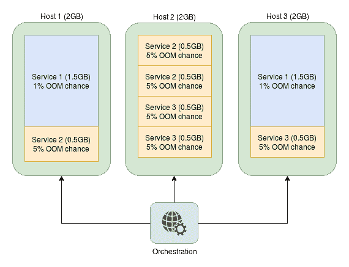
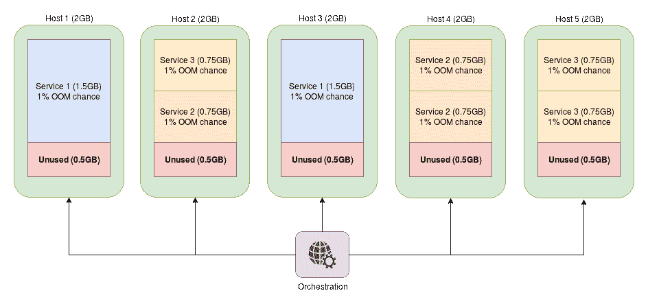
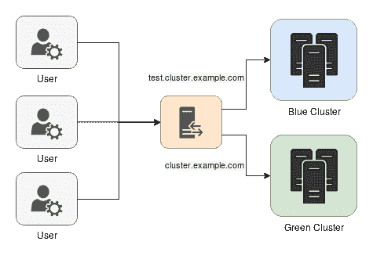

# 扩展的限制和解决方法

当您扩展您的系统时，您正在使用的每一个工具或框架都将达到崩溃的地步，或者只是不能按预期运行。对于某些事情来说，这个点会很高，而对于某些事情来说，这个点会很低，本章的目的是介绍在使用微服务集群时，您最有可能遇到的可伸缩性问题的策略和解决方法。在本章中，我们将涵盖以下主题:

*   提高服务密度和稳定性。
*   避免和减轻大规模部署的常见问题。
*   多服务容器。
*   零停机部署的最佳实践。

# 限制服务资源

到目前为止，我们还没有花任何时间讨论服务隔离与服务可用资源的关系，但是这是一个非常重要的话题。在不限制资源的情况下，恶意或行为不当的服务可能会导致整个集群崩溃，这取决于严重性，因此需要非常小心地指定各个服务任务应该使用的确切余量。

处理集群资源的普遍接受的策略如下:

*   如果超出预期值使用任何可能导致其他服务出错或失败的资源，强烈建议限制服务级别。这通常是内存分配，但可能包括中央处理器或其他。
*   任何有外部限制的资源，特别是硬件资源，也应该对 Docker 容器进行限制(例如，只允许您使用 1 Gbps NAS 连接的特定部分)。
*   任何需要在特定设备、机器或主机上运行的东西都应该以同样的方式锁定到这些资源。这种设置在只有一定数量的机器具有适合服务的硬件时非常常见，例如在 GPU 计算集群中。
*   您希望在群集内专门配给的任何资源通常都应该有一个应用限制。这包括降低低优先级服务的 CPU 时间百分比。
*   在大多数情况下，使用主机可用资源的正常分配，其余的资源应该没问题。

通过应用这些规则，我们将确保我们的集群更加稳定和安全，在服务之间精确地分配我们想要的资源。此外，如果指定了服务所需的确切资源，编排工具通常可以更好地决定在哪里调度新创建的任务，从而最大化每个引擎的服务密度。

# 内存限制

奇怪的是，尽管中央处理器可能被认为是最重要的计算资源，但集群服务的内存分配甚至更重要，因为内存过度使用会(并将)导致在同一台主机上运行的任何东西的**内存不足** ( **OOM** )进程和任务失败。随着软件内存泄漏的流行，这通常不是“如果”的问题，而是“何时”的问题，因此为内存分配设置限制通常是非常可取的，在某些编排配置中甚至是强制性的。遭受此问题通常通过在您的服务上看到`SIGKILL`、`"Process killed"`或`exit code -9`来表示。

Keep in mind, though, that these signals could very well be caused by other things but the most common cause is OOM failures.

通过限制可用内存，而不是主机上的随机进程被 OOM 管理器杀死，只有违规任务的进程将被作为杀死的目标，因此识别错误代码更加容易和快速，因为您可以看到该服务的大量故障，并且您的其他服务将保持运行，从而提高集群的稳定性。

OOM management is a huge topic and is much more broad than it would be wise to include in this section, but it is a very important thing to know if you spend a lot of time in the Linux kernel. If you are interested in this topic, I highly recommend that you visit [https://www.kernel.org/doc/gorman/html/understand/understand016.html](https://www.kernel.org/doc/gorman/html/understand/understand016.html) and read up on it. WARNING! On some of the most popular kernels, memory and/or swap cgroups are disabled due to their overhead. To enable memory and swap limiting on these kernels, your hosts kernel must be started with `cgroup_enable=memory` and `swapaccount=1` flags. If you are using GRUB for your bootloader, you can enable them by editing `/etc/default/grub` (or, on the latest systems, `/etc/default/grub.d/<name>`), setting `GRUB_CMDLINE_LINUX="cgroup_enable=memory swapaccount=1"`, running `sudo update-grub`, and then restarting your machine.

要使用内存限制`cgroup`配置，请结合以下标志运行容器:

*   `-m` / `--memory`:对容器可以使用的最大内存量的硬性限制。超过这个限制的新内存分配将失败，内核将终止您的容器中的一个进程，该进程通常是运行服务的主要进程。
*   `--memory-swap`:容器可以使用的包括交换在内的内存总量。这必须与前一个选项一起使用，并且必须大于它。默认情况下，容器最多可以使用容器允许的最大内存量的两倍。将此设置为`-1`允许容器使用与主机一样多的交换空间。
*   `--memory-swappiness`:系统将多么渴望将页面从物理内存移动到磁盘上的交换空间。该值介于`0`和`100`之间，其中`0`表示页面将尽可能多地停留在常驻内存中，反之亦然。在大多数机器上，该值是`80`并将被用作默认值，但是由于与内存相比，交换空间访问非常慢，我的建议是将该值设置为尽可能接近`0`。
*   `--memory-reservation`:服务的 RAM 使用的软限制，通常仅用于检测与一般预期的 RAM 使用相关的资源争用，以便编排引擎可以调度任务以获得最大的使用密度。该标志不能保证将服务的内存使用率保持在此水平以下。

还有一些标志可以用于内存限制，但是即使是前面的列表也比您可能需要担心的要详细一些。对于大多数部署，无论大小，您可能只需要使用`-m`并设置一个低值`--memory-swappiness`，后者通常通过`sysctl.d`引导设置在主机上完成，以便所有服务都可以使用它。

You can check what your `swappiness` setting is by running `sysctl vm.swappiness`. If you would like to change this, and in most cluster deployments you will, you can set this value by running the following command:
`$ echo "vm.swappiness = 10" | sudo tee -a /etc/sysctl.d/60-swappiness.conf`

为了看到这一点，我们将首先运行一个资源最密集的框架(JBoss)，内存限制为 30 MB，看看会发生什么:

```
$ docker run -it \
             --rm \
             -m 30m \
             jboss/wildfly 
Unable to find image 'jboss/wildfly:latest' locally
latest: Pulling from jboss/wildfly
<snip>
Status: Downloaded newer image for jboss/wildfly:latest
=========================================================================

 JBoss Bootstrap Environment

 JBOSS_HOME: /opt/jboss/wildfly

 JAVA: /usr/lib/jvm/java/bin/java

 JAVA_OPTS:  -server -Xms64m -Xmx512m -XX:MetaspaceSize=96M -XX:MaxMetaspaceSize=256m -Djava.net.preferIPv4Stack=true -Djboss.modules.system.pkgs=org.jboss.byteman -Djava.awt.headless=true

=========================================================================

*** JBossAS process (57) received KILL signal ***
```

不出所料，容器使用了太多的内存，很快就被内核杀死了。现在，如果我们尝试同样的东西，但给它 400 兆内存呢？

```

$ docker run -it \
             --rm \
             -m 400m \
             jboss/wildfly
=========================================================================

 JBoss Bootstrap Environment

 JBOSS_HOME: /opt/jboss/wildfly

 JAVA: /usr/lib/jvm/java/bin/java

 JAVA_OPTS:  -server -Xms64m -Xmx512m -XX:MetaspaceSize=96M -XX:MaxMetaspaceSize=256m -Djava.net.preferIPv4Stack=true -Djboss.modules.system.pkgs=org.jboss.byteman -Djava.awt.headless=true

=========================================================================

14:05:23,476 INFO  [org.jboss.modules] (main) JBoss Modules version 1.5.2.Final
<snip>
14:05:25,568 INFO  [org.jboss.ws.common.management] (MSC service thread 1-6) JBWS022052: Starting JBossWS 5.1.5.Final (Apache CXF 3.1.6) 
14:05:25,667 INFO  [org.jboss.as] (Controller Boot Thread) WFLYSRV0060: Http management interface listening on http://127.0.0.1:9990/management
14:05:25,667 INFO  [org.jboss.as] (Controller Boot Thread) WFLYSRV0051: Admin console listening on http://127.0.0.1:9990
14:05:25,668 INFO  [org.jboss.as] (Controller Boot Thread) WFLYSRV0025: WildFly Full 10.1.0.Final (WildFly Core 2.2.0.Final) started in 2532ms - Started 331 of 577 services (393 services are lazy, passive or on-demand)
```

我们的容器现在可以开始没有任何问题！

如果您在裸机环境中处理过很多应用程序，您可能会问自己，为什么 JBoss JVM 不提前知道它不能在如此受限的环境中运行，甚至更快地失败。这里的答案在于`cgroups`的一个非常不幸的怪癖(尽管我认为这可能被认为是一个特性，取决于你的观点)，它将主机的资源原封不动地呈现给容器，即使容器本身是受约束的。如果您运行一个内存有限的容器并打印出可用的内存限制，您可以很容易地看到这一点:

```
$ # Let's see what a low allocation shows
$ docker run -it --rm -m 30m ubuntu /usr/bin/free -h
 total        used        free      shared  buff/cache   available
Mem:           7.6G        1.4G        4.4G         54M        1.8G        5.9G
Swap:            0B          0B          0B

$ # What about a high one?
$ docker run -it --rm -m 900m ubuntu /usr/bin/free -h
 total        used        free      shared  buff/cache   available
Mem:           7.6G        1.4G        4.4G         54M        1.8G        5.9G
Swap:            0B          0B          0B
```

可以想象，这将导致在这样一个`cgroup`有限容器中启动的应用程序出现各种各样的级联问题，主要原因是应用程序根本不知道存在限制，因此它将继续尝试完成它的工作，假设它可以完全访问可用的内存。一旦应用程序达到预定义的限制，应用程序进程通常会被终止，容器也会死亡。对于能够应对高内存压力的应用程序和运行时来说，这是一个巨大的问题，因为它们可能能够使用更少的容器内存，但是因为它们无法识别自己正在受限制地运行，所以它们往往会以比应该的更高的速度吞噬内存。

可悲的是，集装箱方面的情况更糟。您不仅必须给服务一个足够大的内存限制来启动它，而且还必须足够大，以便它可以在服务的整个持续时间内处理任何动态分配的内存。如果你不这样做，同样的情况会发生，但发生的时间不太可预测。例如，如果您运行一个只有 4 MB 内存限制的 NGINX 容器，它会很好地启动，但是在与它进行几次连接后，内存分配将超过阈值，容器将会死亡。然后，服务可能会重新启动任务，除非您有日志机制或者您的编排为其提供了良好的工具，否则您最终得到的服务将处于`running`状态，但实际上，它无法处理任何请求。

如果这还不够，你也真的不应该随意设定上限。这是因为容器的目的之一是最大化给定硬件配置的服务密度。通过设置统计上运行的服务几乎不可能达到的限制，您实际上是在浪费这些资源，因为它们不能被其他服务使用。从长远来看，这既增加了基础架构的成本，也增加了维护基础架构所需的资源，因此有很大的动机将服务限制在能够安全运行的最低数量，而不是使用非常高的限制。

Orchestration tooling generally prevents overcommiting resources, although there has been some progress to support this feature in both Docker Swarm and Kubernetes, where you can specify a soft limit (memory request) versus the true limit (memory limit). However, even with those parameters, tweaking the RAM setting is a really challenging task because you may get either under-utilization or constant rescheduling, so all the topics covered here are still very relevant. For more information on orchestration-specific handling of overcommiting, I suggest you read the latest documentation for your specific orchestration tool.

因此，当我们考虑所有我们必须记住的事情时，调整限制比其他任何事情都更接近于一种艺术形式，因为它几乎就像著名的装箱问题([https://en.wikipedia.org/wiki/Bin_packing_problem](https://en.wikipedia.org/wiki/Bin_packing_problem))的变体，但也在它之上添加了服务的统计部分，因为与由于限制宽松而浪费的资源相比，您可能需要找出最佳的服务可用性。

假设我们有一项服务，其分布如下:

*   三台物理主机，每台具有 2 GB 内存(是的，这确实很低，但这是为了在较小规模上演示问题)
*   **内存限制为 1.5 GB 的服务 1** (数据库)，两个任务，超过硬限制的概率为 1%
*   **内存限制为 0.5 GB 的服务 2** (应用程序)，三个任务，超过硬限制的几率为 5%
*   **内存限制为 0.5 GB 的服务 3** (数据处理服务)，三个任务，超过硬限制的几率为 5%

调度器可以以这种方式分配服务:



WARNING! You should always have spare capacity on your clusters for rolling service updates, so having the configuration similar to the one shown in the diagram would not work well in the real world. Generally, this extra capacity is also a fuzzy value, just like RAM limits. Generally, my formula for it is the following, but feel free to tweak it as needed:
`overcapacity = avg(service_sizes) * avg(service_counts) * avg(max_rolling_service_restarts)`
We will discuss this a bit more further in the text.

如果我们举最后一个例子，现在说我们应该以 1%的 OOM 失败率全面运行，将我们的**服务 2** 和**服务 3** 内存限制从 0.5 GB 增加到 0.75 GB，而不考虑最终用户可能可以接受数据处理服务和应用程序任务具有更高的失败率(或者如果您使用消息队列，甚至不会注意到这一点)，会怎么样？

新的服务传播现在看起来像这样:



我们的新配置有大量非常明显的问题:

*   服务密度降低 25%。这个数字应该尽可能高，以获得使用微服务的所有好处。
*   硬件利用率降低 25%。实际上，在此设置中，1/4 的可用硬件资源被浪费了。
*   节点数量增加了 66%。大多数云提供商根据您运行的机器数量收费，假设它们是同一类型的。通过进行这一更改，您有效地将云成本提高了 66%，并且可能需要额外的运营支持来保持您的集群正常工作。

尽管这个例子被故意操纵，以便在调整时产生最大的影响，但是很明显，对这些限制的微小改变会对您的整个基础设施产生巨大的影响。虽然在现实场景中，这种影响将会降低，因为与示例中相比，将会有更大的主机，这将使它们能够在可用空间中更好地堆叠更小(相对于总容量)的服务，*不要*低估了增加服务资源分配的级联效应。

# 中央处理器限制

就像我们前面关于服务内存限制的部分一样，`docker run`还支持多种 CPU 设置和参数来调整服务的计算需求:

*   `-c` / `--cpu-shares`:在高负载主机上，默认情况下所有任务权重相等。在任务或服务上设置此选项(从`1024`的默认值开始)将增加或减少任务可调度的 CPU 利用率百分比。
*   `--cpu-quota`:此标志设置任务或服务在 100 毫秒(100，000 微秒)的默认时间段内可以使用 CPU 的微秒数。例如，为了只允许一个任务最多占用单个中央处理器核心的 50%，您可以将该标志设置为`50000`。对于多核，您需要相应地增加该值。
*   `--cpu-period`:这将改变之前评估`cpu-quota`的配额标志默认间隔(以微秒为单位)(100 毫秒/100，000 微秒)，并减少或增加该间隔，从而反向影响服务的 CPU 资源分配。
*   `--cpus`:一个浮点值，结合了`cpu-quota`和`cpu-period`的部分内容，以限制分配给任务的 CPU 内核数量。例如，如果您只希望一个任务使用多达四分之一的单个 CPU 资源，您可以将其设置为`0.25`，它将具有与`--cpu-quota 25000 --cpu-period 100000`相同的效果。
*   `--cpuset-cpus`:此数组标志允许服务只在从 0 开始索引的指定 CPU 上运行。如果你想让一个服务只使用处理器 0 和 3，你可以使用`--cpuset-cpus "0,3"`。该标志还支持输入范围值(即`1-3`)。

虽然看起来需要考虑的选项很多，但在大多数情况下，您只需要调整`--cpu-shares`和`--cpus`标志，但您可能需要对它们提供的资源进行更精细的控制。

不如我们看看`--cpu-shares`值能为我们做些什么？为此，我们需要模拟资源争用，在下一个示例中，我们将尝试在 60 秒的时间内，在机器上有多少个 CPU，就在多少个容器中尽可能多地递增一个整数变量。代码有点粗糙，但大部分是为了让 CPU 在所有内核上达到资源争用级别。

将以下内容添加到名为`cpu_shares.sh`的文件中(也可在[https://github.com/sgnn7/deploying_with_docker](https://github.com/sgnn7/deploying_with_docker)上获得):

```
#!/bin/bash -e

CPU_COUNT=$(nproc --all)
START_AT=$(date +%s)
STOP_AT=$(( $START_AT + 60 ))

echo "Detected $CPU_COUNT CPUs"
echo "Time range: $START_AT -> $STOP_AT"

declare -a CONTAINERS

echo "Allocating all cores but one with default shares"
for ((i = 0; i < $CPU_COUNT - 1; i++)); do
  echo "Starting container $i"
  CONTAINERS[i]=$(docker run \
                  -d \
                  ubuntu \
                  /bin/bash -c "c=0; while [ $STOP_AT -gt \$(date +%s) ]; do c=\$((c + 1)); done; echo \$c")
done

echo "Starting container with high shares"
  fast_task=$(docker run \
              -d \
              --cpu-shares 8192 \
              ubuntu \
              /bin/bash -c "c=0; while [ $STOP_AT -gt \$(date +%s) ]; do c=\$((c + 1)); done; echo \$c")

  CONTAINERS[$((CPU_COUNT - 1))]=$fast_task

echo "Waiting full minute for containers to finish..."
sleep 62

for ((i = 0; i < $CPU_COUNT; i++)); do
  container_id=${CONTAINERS[i]}
  echo "Container $i counted to $(docker logs $container_id)"
  docker rm $container_id >/dev/null
done
```

现在，我们将运行这段代码，看看我们的标志的效果:

```
$ # Make the file executable
$ chmod +x ./cpu_shares.sh

$ # Run our little program
$ ./cpu_shares.sh
Detected 8 CPUs
Time range: 1507405189 -> 1507405249
Allocating all cores but one with default shares
Starting container 0
Starting container 1
Starting container 2
Starting container 3
Starting container 4
Starting container 5
Starting container 6
Starting container with high shares
Waiting full minute for containers to finish...
Container 0 counted to 25380
Container 1 counted to 25173
Container 2 counted to 24961
Container 3 counted to 24882
Container 4 counted to 24649
Container 5 counted to 24306
Container 6 counted to 24280
Container 7 counted to 31938
```

虽然具有高`--cpu-share`值的容器没有得到预期的计数的完全增加，但是如果我们在更长的时间内使用更严格的 CPU 限制循环运行基准测试，差异将会更大。但是即使在我们的小例子中，您也可以看到最后一个容器比机器上所有其他运行的容器有明显的优势。

为了了解`--cpus`标志的比较情况，让我们来看看它在非竞争系统上可以做什么:

```
$ # First without any limiting
$ time docker run -it \
 --rm \
 ubuntu \
 /bin/bash -c 'for ((i=0; i<100; i++)); do sha256sum /bin/bash >/dev/null; done'
real    0m1.902s
user    0m0.030s
sys    0m0.006s

$ # Now with only a quarter of the CPU available
$ time docker run -it \
 --rm \
 --cpus=0.25 \
 ubuntu \
 /bin/bash -c 'for ((i=0; i<100; i++)); do sha256sum /bin/bash >/dev/null; done'
real    0m6.456s
user    0m0.018s
sys    0m0.017s
```

如您所见，`--cpus`标志对于确保即使机器上没有资源争用，任务也不会使用超过指定值的 CPU 非常有用。

Keep in mind that there are a few more options for limiting resource usage for containers that are a bit outside of the scope of the general ones that we have covered already, but they are mainly for device-specific limitations (such as device IOPS). If you are interested in seeing all of the available ways to limit resources to a task or a service, you should be able to find them all at [https://docs.docker.com/engine/reference/run/#runtime-constraints-on-resources](https://docs.docker.com/engine/reference/run/#runtime-constraints-on-resources).

# 避免陷阱

在大多数中小型部署中，您将永远看不到当您扩展到它们之外时开始看到的相同问题，因此本节将向您展示您将遇到的最常见问题，以及如何以尽可能干净的方式解决这些问题。虽然这个列表应该涵盖了您将会遇到的大部分突出问题，但是您自己的一些问题需要定制修复。您不应该害怕进行这些更改，因为几乎所有主机操作系统安装都不适合高负载多容器所需的配置。

WARNING! Many of the values and tweaks in this section have been based on personal experiences with deploying Docker clusters in the cloud. Depending on your combination of cloud provider, OS distribution, and infrastructure-specific configurations, the values may not need changing from the defaults, and some may even be detrimental to your system if used verbatim without spending some time learning what they mean and how to modify them. If you continue reading this section, please use the examples only as examples on how to change the values and not as something to copy/paste directly into configuration management tooling.

# ulimits

`ulimit`对于大多数 Linux 桌面用户来说，设置是鲜为人知的设置，但在使用服务器时，它们确实是一个非常痛苦且经常遇到的问题。简而言之，`ulimit`设置控制流程资源使用的许多方面，就像我们前面介绍的 Docker 资源调整一样，它们应用于已经启动的每个流程和外壳。这些限制几乎总是在发行版上设置，以防止一个混乱的进程关闭您的机器，但是这些数字通常是在考虑到常规桌面使用的情况下选择的，所以试图在不变的系统上运行服务器类型的代码肯定会至少达到打开文件的限制，并且可能达到一些其他的限制。

我们可以使用`ulimit -a`来查看我们当前(也称为**软**)的设置是什么:

```
$ ulimit -a
core file size          (blocks, -c) 0
data seg size           (kbytes, -d) unlimited
scheduling priority             (-e) 0
file size               (blocks, -f) unlimited
pending signals                 (-i) 29683
max locked memory       (kbytes, -l) 64
max memory size         (kbytes, -m) unlimited
open files                      (-n) 1024
pipe size            (512 bytes, -p) 8
POSIX message queues     (bytes, -q) 819200
real-time priority              (-r) 0
stack size              (kbytes, -s) 8192
cpu time               (seconds, -t) unlimited
max user processes              (-u) 29683
virtual memory          (kbytes, -v) unlimited
file locks                      (-x) unlimited
```

如您所见，这里只设置了几件事，但有一件事很突出:我们的“打开文件”限制(`1024`)对于一般应用程序来说是可以的，但是如果我们运行许多处理大量打开文件的服务(例如相当数量的 Docker 容器)，这个值必须更改，否则您将遇到错误，您的服务将实际上死亡。

您可以使用`ulimit -S <flag> <value>`更改当前外壳的该值:

```
$ ulimit -n
1024

$ # Set max open files to 2048
$ ulimit -S -n 2048

$ # Let's see the full list again
$ ulimit -a
<snip>
open files                      (-n) 2048
<snip>
```

但是如果我们试着把它设置得很高呢？

```
$ ulimit -S -n 10240
bash: ulimit: open files: cannot modify limit: Invalid argument
```

在这里，我们现在遇到了系统强加的硬限制。如果我们想在这些值之外对其进行修改，则需要在系统级别更改该限制。我们可以通过`ulimit -H -a`查看这些硬性限制是什么:

```
$ ulimit -H -a | grep '^open files'
open files                      (-n) 4096
```

因此，如果我们想将打开的文件数量增加到`4096`之外，我们确实需要更改系统级设置。还有，即使`4086`的软限制对我们来说没问题，设置也只是针对我们自己的 shell 及其子进程，所以不会影响系统上的其他任何服务或进程。

If you really wanted to, you actually can change the `ulimit` settings of an already-running process with `prlimit` from the `util-linux` package, but this method of adjusting the values is discouraged because the settings do not persist during process restarts and are thus pretty useless for that purpose. With that said, if you want to find out whether your `ulimit` settings have been applied to a service that is already running, this CLI tool is invaluable, so don't be afraid to use it in those cases.

要更改此设置，您需要根据您的分发进行选项组合:

*   创建安全限制配置文件。你可以通过在类似`/etc/security/limits.d/90-ulimit-open-files-increase.conf`的东西上加几行来完成。以下示例将打开文件软限制设置在`root`上，然后将所有其他帐户(`*`不适用于`root`帐户)设置为`65536`。你应该提前找出你的系统合适的数值:

    ```
    root soft nofile 65536
    root hard nofile 65536
    * soft nofile 65536
    * hard nofile 65536
    ```

*   将`pam_limits`模块添加到**可插拔认证模块** ( **PAM** )。这将反过来影响所有具有以前 ulimit 更改设置的用户会话，因为某些发行版不包含它，否则您的更改可能不会持续。在`/etc/pam.d/common-session`中增加以下内容:

    ```
    session required pam_limits.so
    ```

*   或者，在某些发行版上，您可以在覆盖文件

    ```
    LimitNOFILE=65536
    ```

    中的`systemd`中将设置直接添加到受影响的服务定义中

Overriding `systemd` services is a somewhat lengthy and distracting topic for this section, but it is a very common strategy for tweaking third-party services running on cluster deployments with that init system, so it is a very valuable skill to have. If you would like to know more about this topic, you can find a condensed version of the process at [https://askubuntu.com/a/659268](https://askubuntu.com/a/659268), and if you want the detailed version the upstream documentation can be found at [https://www.freedesktop.org/software/systemd/man/systemd.service.html](https://www.freedesktop.org/software/systemd/man/systemd.service.html). CAUTION! In the first example, we used the `*` wildcard, which affects all accounts on the machine. Generally, you want to isolate this setting to only the affected service accounts, if possible, for security reasons. We also used `root` because root values are specifically set by name in some distributions, which overrides the `*` wildcard setting due to the higher specificity. If you want to learn more about limits, you can find more information on these settings at [https://linux.die.net/man/5/limits.conf](https://linux.die.net/man/5/limits.conf).

# 最大文件描述符

就像我们对会话和进程有最大打开文件限制一样，内核本身对整个系统的最大打开文件描述符也有限制。如果达到此限制，将无法打开任何其他文件，因此这需要在可能同时打开大量文件的机器上进行调整。

该值是内核参数的一部分，因此可以通过`sysctl`看到:

```
$ sysctl fs.file-max
fs.file-max = 757778
```

虽然在这台机器上，这个值似乎是合理的，但我见过一些旧的发行版，其值低得惊人，如果您在系统上运行大量容器，很容易出错。

Most kernel configuration settings we discuss here and later in this chapter can be temporarily changed with `sysctl -w <key>="<value>"`. However, since those values are reset back to defaults on each reboot, they usually are of no long-term use for us and are not going to be covered here, but keep in mind that you can use such techniques if you need to debug a live system or apply a temporary time-sensitive fix.

要将其更改为在重新启动后仍然有效的值，我们需要将以下内容添加到`/etc/sysctl.d`文件夹(即`/etc/sysctl.d/10-file-descriptors-increase.conf`):

```
fs.file-max = 1000000
```

进行此更改后，重新启动，您现在应该能够在机器上打开多达 100 万个文件句柄！

# 套接字缓冲区

为了提高性能，增加套接字缓冲区的大小通常是非常有利的，因为它们不再执行单台机器的工作，而是在常规机器连接的基础上运行尽可能多的 Docker 容器的工作。为此，您可能应该设置一些设置，以确保套接字缓冲区不会难以跟上通过它们的所有流量。在写这本书的时候，大多数这些默认缓冲区设置在机器启动时通常都很小(我检查过的几台机器中有 200 KB)，它们应该是动态缩放的，但是你可以从一开始就强制它们变得更大。

在 Ubuntu LTS 16.04 安装中，以下是缓冲区设置的默认设置(尽管您的设置可能会有所不同):

```
net.core.optmem_max = 20480
net.core.rmem_default = 212992
net.core.rmem_max = 212992
net.core.wmem_default = 212992
net.core.wmem_max = 212992
net.ipv4.tcp_rmem = 4096 87380 6291456
net.ipv4.tcp_wmem = 4096 16384 4194304
```

我们将通过向`/etc/sysctl.d/10-socket-buffers.conf`添加以下内容来将这些值调高到一些合理的默认值，但请确保使用在您的环境中合理的值:

```
net.core.optmem_max = 40960
net.core.rmem_default = 16777216
net.core.rmem_max = 16777216
net.core.wmem_default = 16777216
net.core.wmem_max = 16777216
net.ipv4.tcp_rmem = 4096 87380 16777216
net.ipv4.tcp_wmem = 4096 87380 16777216
```

通过增加这些值，我们的缓冲区开始变大，并且应该能够以更好的吞吐量处理相当多的流量，这是我们在集群环境中想要的。

# 短暂的港口

如果您不熟悉临时端口，它们是所有出站连接在连接上没有明确指定始发端口时分配的端口号，这是绝大多数端口。例如，如果您对几乎每个客户端库执行任何类型的出站 HTTP 请求，您很可能会将这些短暂端口中的一个指定为连接的返回通信端口。

要查看机器上临时端口使用的一些示例，您可以使用`netstat`:

```
$ netstat -an | grep ESTABLISHED
tcp        0      0 192.168.56.101:46496     <redacted>:443      ESTABLISHED
tcp        0      0 192.168.56.101:45512     <redacted>:443      ESTABLISHED
tcp        0      0 192.168.56.101:42014     <redacted>:443      ESTABLISHED
<snip>
tcp        0      0 192.168.56.101:45984     <redacted>:443      ESTABLISHED
tcp        0      0 192.168.56.101:56528     <redacted>:443      ESTABLISHED
```

当您开发具有多个服务和大量出站连接的系统时(在使用 Docker 服务时，这实际上是强制性的)，您可能会注意到您被允许使用的端口数量是有限制的，并且可能会发现这些端口可能会与您的一些内部 Docker 服务正在使用的范围重叠，从而导致间歇性且经常令人讨厌的连接问题。为了解决这些问题，需要对临时端口范围进行更改。

由于这些也是内核设置，我们可以看到`sysctl`的当前范围，就像我们在前面几个例子中所做的那样:

```
$ sysctl net.ipv4.ip_local_port_range
net.ipv4.ip_local_port_range = 32768    60999
```

您可以看到，我们的范围在端口分配的上半部分，但是任何可能在该范围内开始侦听的服务都可能有问题。我们还可能需要超过 28，000 个端口。

You may be curious how you get or set the `ipv6` settings for this parameter, but luckily (at least for now) this same setting key is used for both `ipv4` and `ipv6` ephemeral port ranges. At some point, this setting name may change, but I think we are at least a couple of years away from that.

要更改该值，我们可以使用`sysctl -w`进行临时更改，或者使用`sysctl.d`进行永久更改:

```
$ # First the temporary change to get us up to 40000
$ # ports. For our services, we separately have to
$ # ensure none listen on any ports above 24999.
$ sudo sysctl -w net.ipv4.ip_local_port_range="25000 65000"
net.ipv4.ip_local_port_range = 25000 65000

$ # Sanity check
$ sysctl net.ipv4.ip_local_port_range
net.ipv4.ip_local_port_range = 25000    65000

$ # Now for the permanent change (requires restart)
$ echo "net.ipv4.ip_local_port_range = 25000 65000" | sudo tee /etc/sysctl.d/10-ephemeral-ports.conf
```

通过这一更改，我们有效地将可支持的出站连接数增加了 30%以上，但我们也可以轻松地使用相同的设置来确保临时端口不会与其他正在运行的服务发生冲突。

# 网络过滤器调整

可悲的是，到目前为止，我们看到的设置并不是唯一需要随着与服务器的网络连接的增加而调整的东西。随着服务器负载的增加，您也可能开始在`dmesg`和/或内核日志中看到`nf_conntrack: table full`错误。对于那些不熟悉`netfilter`的人来说，它是一个内核模块，在哈希表中跟踪所有**网络地址转换** ( **NAT** )会话，向其中添加任何新的连接，并在它们关闭并达到预定义的超时后清除它们，因此当您增加从一台机器到另一台机器的连接量时，您很可能会发现这些相关设置中的大多数都是相当保守的默认值，需要调整(尽管您的分布可能会有所不同-请确保验证您的设置！):

```
$ sysctl -a | grep nf_conntrack
net.netfilter.nf_conntrack_buckets = 65536
<snip>
net.netfilter.nf_conntrack_generic_timeout = 600
<snip>
net.netfilter.nf_conntrack_max = 262144
<snip>
net.netfilter.nf_conntrack_tcp_timeout_close = 10
net.netfilter.nf_conntrack_tcp_timeout_close_wait = 60
net.netfilter.nf_conntrack_tcp_timeout_established = 432000
net.netfilter.nf_conntrack_tcp_timeout_fin_wait = 120
net.netfilter.nf_conntrack_tcp_timeout_last_ack = 30
net.netfilter.nf_conntrack_tcp_timeout_max_retrans = 300
net.netfilter.nf_conntrack_tcp_timeout_syn_recv = 60
net.netfilter.nf_conntrack_tcp_timeout_syn_sent = 120
net.netfilter.nf_conntrack_tcp_timeout_time_wait = 120
net.netfilter.nf_conntrack_tcp_timeout_unacknowledged = 300
<snip>
```

其中有相当多是可以更改的，但是需要调整的错误的常见疑点如下:

*   `net.netfilter.nf_conntrack_buckets`:控制连接哈希表的大小。增加这个值是明智的，尽管它可以用更激进的超时来代替。请注意，这不能用常规`sysctl.d`设置来设置，而是需要用内核模块参数来设置。
*   `net.netfilter.nf_conntrack_max`:要保存的条目数。默认情况下，这是前一个条目值的四倍。
*   `net.netfilter.nf_conntrack_tcp_timeout_established`:这将保持开放连接的映射长达五天(！).为了不溢出您的连接跟踪表，这通常几乎是强制减少的，但是不要忘记它需要高于 TCP `keepalive`超时，否则您将会得到意外的连接中断。

要应用最后两个设置，您需要将以下内容添加到`/etc/sysctl.d/10-conntrack.conf`中，并为您自己的基础架构配置调整值:

```
net.netfilter.nf_conntrack_tcp_timeout_established = 43200
net.netfilter.nf_conntrack_max = 524288
```

netfilter is a massively complex topic to cover in a small section, so reading up on its impacts and configuration settings is highly recommended before changing these numbers. To get an idea of each of the settings, you can visit [https://www.kernel.org/doc/Documentation/networking/nf_conntrack-sysctl.txt](https://www.kernel.org/doc/Documentation/networking/nf_conntrack-sysctl.txt) and read up about it.

对于桶数，需要直接更改`nf_conntrack` `hashsize`内核模块参数:

```
echo '131072' | sudo tee /sys/module/nf_conntrack/parameters/hashsize
```

最后，为了确保在加载 netfilter 模块时遵循正确的顺序，以便这些值正确保持，您可能还需要在`/etc/modules`的末尾添加以下内容:

```
nf_conntrack_ipv4
nf_conntrack_ipv6
```

如果一切都做得正确，您的下一次重新启动应该已经设置了我们谈到的所有 netfilter 设置。

# 多服务容器

多服务容器是一个特别棘手的话题，因为 Docker 的整个概念和推荐使用是，您只在容器中运行单进程服务。正因为如此，不涉及这个主题有相当大的隐性压力，因为它很容易被不理解强烈反对这种做法的原因的开发人员误用和滥用。

然而，尽管如此，还是会有需要在一个紧密的逻辑分组中运行多个进程的时候，在这种情况下，多容器解决方案没有意义或者过于混乱，这就是为什么这个主题仍然很重要。说了这么多，我再怎么强调也不为过，你应该把这种服务搭配作为最后的手段。

在我们甚至写一行代码之前，我们必须讨论一个在同一个容器中运行多个进程的架构问题，这被称为`PID 1`问题。这个问题的关键是 Docker 容器运行在一个孤立的环境中，在获取孤立的子进程时，它们不会从主机的`init`进程中获得帮助。考虑一个示例进程`Parent Process`，这是一个基本的可执行文件，它启动了另一个进程`Child Process`，但是在此之后的某个时间点，如果相关的`Parent Process`退出或者被杀死，你将会留下僵尸`Child Process`在你的容器中游荡，因为`Parent Process`已经不在了，并且在容器沙箱中没有其他孤儿收割进程在运行。如果容器退出，那么僵尸进程将被清理，因为它们都被包装在一个名称空间中，但是对于长时间运行的任务来说，在单个映像中运行多个进程会带来严重的问题。

Terminology here might be confusing, but what was meant in simple terms is that every process is supposed be removed (also known as `reaped`) from the process table after it exits, either by the parent process or some other designated process (usually `init`) in the hierarchy that will take ownership of of it in order to finalize it. A process that does not have a running parent process in this context is called an orphan process.

有些工具有能力收割这些僵尸进程(比如 Bash 和其他几个 shells)，但即使是它们也不足以初始化我们的容器的进程，因为它们没有将`SIGKILL`、`SIGINT`等信号传递给其他子进程，所以停止容器或者在 Terminal 中按下 *Ctrl* + *C* 等东西都没有用，也不会终止容器。如果您真的想在容器中运行多个进程，那么您的启动进程必须进行孤儿收割，并将信号传递给孩子。因为我们不想从容器中使用像`systemd`这样的完整的初始化系统，这里有两个选择，但是在 Docker 的最新版本中，我们现在有了`--init`标志，它可以用一个真正的初始化运行程序运行我们的容器。

让我们看到这一点，并尝试退出一个启动过程为`bash`的程序:

```
$ # Let's try to run 'sleep' and exit with <Ctrl>-C
$ docker run -it \
 ubuntu \
 bash -c 'sleep 5000'
^C^C^C^C^C^C^C^C^C^C
<Ctrl-C not working>

$ # On second terminal
$ docker ps
CONTAINER ID IMAGE  COMMAND                CREATED            STATUS 
c7b69001271d ubuntu "bash -c 'sleep 5000'" About a minute ago Up About a minute

$ # Can we stop it?
$ docker stop c7b69001271d
<nothing happening>
^C

$ # Last resort - kill the container!
$ docker kill c7b69001271d
c7b69001271d
```

这一次，我们将运行带有`--init`标志的容器:

```
$ docker run -it \
 --init \
 ubuntu \
 bash -c 'sleep 5000'
^C

$ # <Ctrl>-C worked just fine!
```

如您所见，`--init`能够接收我们的信号，并将其传递给所有正在侦听的子进程，它作为孤儿进程收割器运行良好，尽管后者很难在基本容器中显示。有了这个标志和它的功能，您现在应该能够用一个 shell(比如 Bash)运行多个进程，或者升级到一个完整的进程管理工具(比如`supervisord`([【http://supervisord.org/】](http://supervisord.org/))而没有任何问题。

# 零停机部署

对于每个集群部署，在某个时候，您需要考虑代码重新部署，同时最大限度地减少对用户的影响。对于小型部署，您可能会有一个维护期，在此期间，您可以关闭一切，重建新映像，并重新启动服务，但这种部署方式实际上不是管理大中型集群的方式，因为您希望最大限度地减少维护集群所需的任何和所有直接工作。事实上，即使对于小型集群来说，以无缝方式处理代码和配置升级对于提高工作效率也是非常宝贵的。

# 滚动服务重新启动

如果新的服务代码没有改变它与其他服务(输入和输出)交互的基本方式，通常唯一需要的是重建(或替换)容器映像，然后将其放入 Docker 注册表，然后以有序和交错的方式重新启动服务。通过交错重启，总是至少有一个任务可以处理可用的服务请求，从外部角度来看，这种转换应该是完全无缝的。如果您更改或更新服务的任何设置，大多数编排工具都会自动为您执行此操作，但是由于它们非常特定于实现，我们将在示例中重点介绍 Docker Swarm:

```
$ # Create a new swarm
$ docker swarm init
Swarm initialized: current node (j4p08hdfou1tyrdqj3eclnfb6) is now a manager.
<snip>

$ # Create a service based on mainline NGINX and update-delay
$ # of 15 seconds
$ docker service create \
 --detach=true \
 --replicas 4 \
 --name nginx_update \
 --update-delay 15s \
 nginx:mainline
s9f44kn9a4g6sf3ve449fychv

$ # Let's see what we have
$ docker service ps nginx_update
ID            NAME            IMAGE           DESIRED STATE  CURRENT STATE
rbvv37cg85ms  nginx_update.1  nginx:mainline  Running        Running 56 seconds ago
y4l76ld41olf  nginx_update.2  nginx:mainline  Running        Running 56 seconds ago
gza13g9ar7jx  nginx_update.3  nginx:mainline  Running        Running 56 seconds ago
z7dhy6zu4jt5  nginx_update.4  nginx:mainline  Running        Running 56 seconds ago

$ # Update our service to use the stable NGINX branch
$ docker service update \
 --detach=true \
 --image nginx:stable \
 nginx_update
nginx_update

$ # After a minute, we can now see the new service status
$ docker service ps nginx_update
ID            NAME               IMAGE           DESIRED STATE  CURRENT STATE
qa7evkjvdml5  nginx_update.1     nginx:stable    Running        Running about a minute ago
rbvv37cg85ms  \_ nginx_update.1  nginx:mainline  Shutdown       Shutdown about a minute ago
qbg0hsd4nxyz  nginx_update.2     nginx:stable    Running        Running about a minute ago
y4l76ld41olf  \_ nginx_update.2  nginx:mainline  Shutdown       Shutdown about a minute ago
nj5gcf541fgj  nginx_update.3     nginx:stable    Running        Running 30 seconds ago
gza13g9ar7jx  \_ nginx_update.3  nginx:mainline  Shutdown       Shutdown 31 seconds ago
433461xm4roq  nginx_update.4     nginx:stable    Running        Running 47 seconds ago
z7dhy6zu4jt5  \_ nginx_update.4  nginx:mainline  Shutdown       Shutdown 48 seconds ago

$ # All our services now are using the new image
$ # and were started staggered!

$ # Clean up
$ docker service rm nginx_update 
nginx_update 
$ docker swarm leave --force 
Node left the swarm.
```

正如您所看到的，它应该足够简单，可以在不停机的情况下对您自己的代码进行同样的更改！

If you want to be able to restart multiple tasks instead of one at a time, Docker Swarm has an `--update-parallelism <count>` flag as well that can be set on a service. When using this flag, `--update-delay` is still observed but instead of a single task being restarted, they are done in batches of `<count>` size.

# 蓝绿色部署

滚动重启很好，但有时您需要应用的更改是在主机本身上，并且需要对集群中的每个 Docker Engine 节点进行更改，例如，如果您需要升级到较新的编排版本或升级操作系统版本。在这些情况下，在没有大型团队支持的情况下，通常采用被称为**蓝绿色部署**的方式。它首先部署一个与当前运行的集群并行的辅助集群，可能绑定到同一个数据存储后端，然后在最合适的时候将入口路由切换到指向新集群。一旦原始集群上的所有处理都停止，它就会被删除，新集群将成为主要的处理组。如果做得好，对用户的影响应该是察觉不到的，并且整个底层基础设施已经在这个过程中发生了变化。

该过程从创建辅助群集开始。此时，除了测试新集群的行为是否符合预期之外，没有任何有效的更改:


辅助群集运行后，路由器交换端点，处理继续在新群集上进行:



进行交换后，在完成所有处理后，原始群集将退出使用(或作为紧急备份):


但是这种部署模式在完整集群上的应用并不是它的唯一用途——在某些情况下，可以在同一个集群内的服务级别上这样做，使用相同的模式来交换一个更新的组件，但是有一个更好的系统来实现这一点，我们接下来将介绍它。

# 蓝绿色部署

随着代码的部署，事情变得有点棘手，因为在输入或输出端或者数据库模式上改变 API 会对具有分散版本代码的集群造成严重破坏。为了解决这个问题，有一个修改后的蓝绿色部署模式，称为**蓝绿色部署**，在这个模式下，代码试图与所有运行的版本保持兼容，直到部署了新代码，之后通过删除 compat 代码再次更新服务。

这里的过程非常简单:

1.  使用应用编程接口版本`x`的服务被同时支持应用编程接口版本`x`和应用编程接口版本`(x+1)`的新版本服务所取代。从用户的角度来看，这提供了零停机时间，但创建了一个具有更新的应用编程接口支持的新服务。
2.  一切更新后，具有旧 API 版本`x`的服务将从代码库中移除。
3.  另一个滚动重启是在服务上完成的，以消除不推荐使用的应用编程接口的痕迹，因此只剩下应用编程接口版本`(x+1)`支持。

当您正在使用的服务需要持久可用时，这种方法非常有价值，在许多情况下，如果您的集群基于队列，您可以很容易地用消息队列格式替换 API 版本。转换是平稳的，但是与硬交换的单次修改相比，需要两次修改服务会有开销，但是这是一个不错的折衷。当正在使用的服务处理可能需要迁移的数据库时，这种方法也非常有价值，因此当其他方法不够好时，您可能应该使用这种方法。

# 摘要

在这一章中，我们介绍了当您在简单原型之外增加基础设施规模时，您将需要的各种工具和技术。到目前为止，我们应该已经学会了如何限制对主机资源的服务访问，轻松处理最常见的陷阱，在单个容器中运行多个服务，以及处理零宕机部署和配置更改。

在下一章中，我们将利用迄今为止学到的许多东西，花时间部署我们自己的迷你版**平台即服务** ( **PAAS** )。