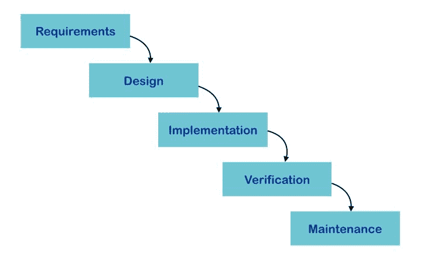
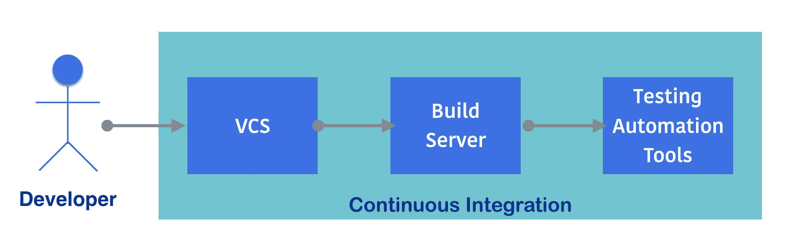
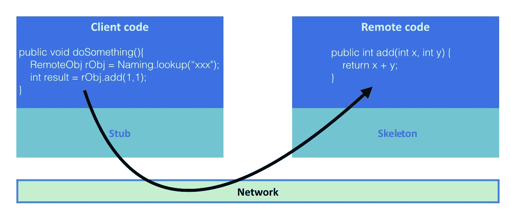
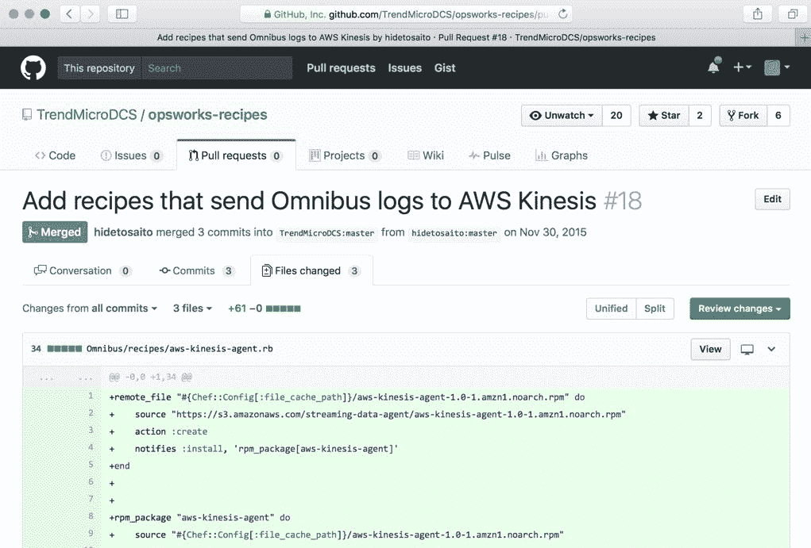
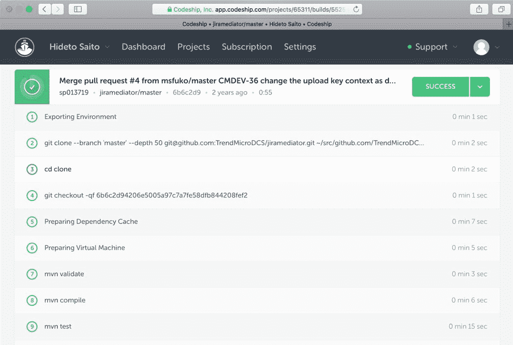
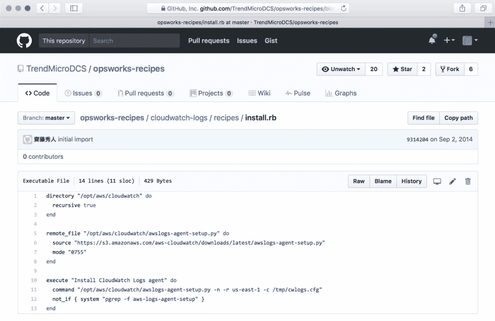
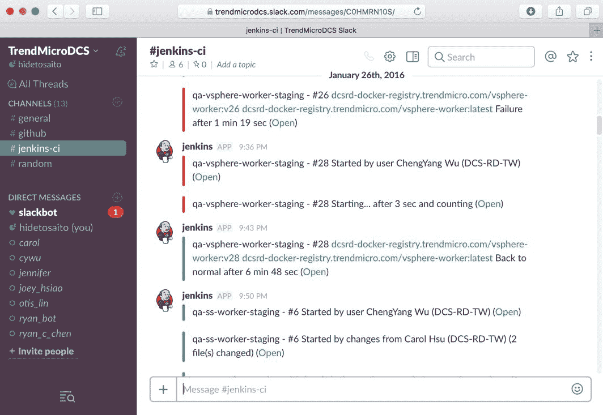
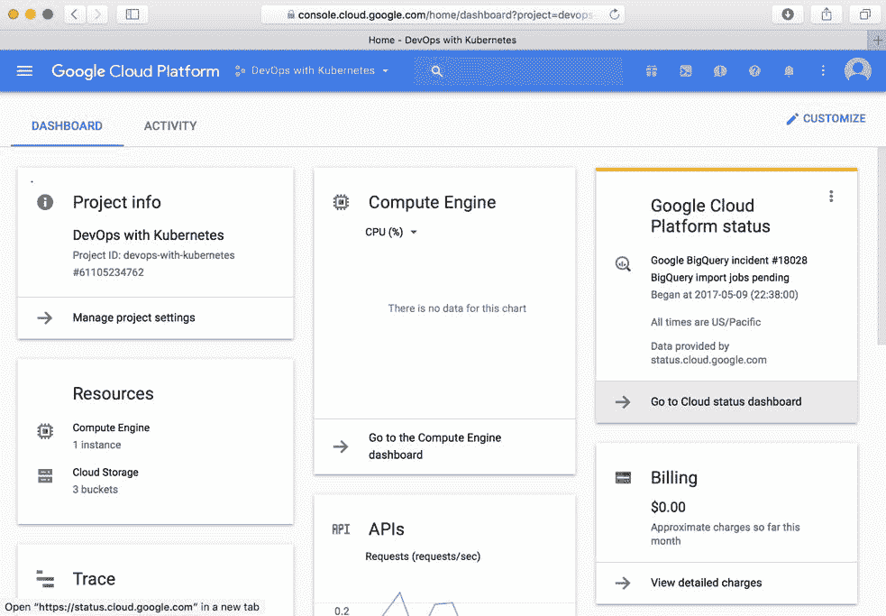

# 一、DevOps 简介

软件交付周期越来越短，而另一方面，应用规模越来越大。软件开发人员和信息技术运营商面临着找到解决方案的压力。有一个新的角色，叫做 **DevOps** ，专门支持软件的构建和交付。

本章涵盖以下主题:

*   软件交付方法有什么变化？
*   什么是微服务，人们为什么采用这种架构？
*   DevOps 如何支持构建应用并将其交付给用户？

# 软件交付挑战

构建计算机应用并将其交付给客户已经过讨论，并随着时间的推移而不断发展。与**软件开发生命周期** ( **SDLC** )相关；有几种类型的过程、方法和历史。在这一部分，我们将描述它的演变。

# 瀑布和实物交付

回到 20 世纪 90 年代，软件交付是通过一种**物理**方法来实现的，例如软盘或光盘。因此，SDLC 是一个非常长期的计划，因为它不容易(重新)交付给客户。

当时，一个主要的软件开发方法是**瀑布模型**，它有需求/设计/实现/验证/维护阶段，如下图所示:



在这种情况下，我们不能回到以前的阶段。例如，在开始或结束**实施**阶段后，回到**设计**阶段是不可接受的(例如，发现技术可扩展性问题)。这是因为它会影响整体进度和成本。项目倾向于继续进行并完成发布，然后进入下一个发布周期，包括新的设计。

它与物理软件交付完美匹配，因为它需要与物流管理部门协调，物流管理部门将软盘/光盘按下并交付给用户。瀑布模型和实物交付过去需要一年到几年的时间。

# 敏捷和电子交付

几年后，互联网被广泛接受，随后软件交付方式也从实物变为**电子**，如在线下载。因此，许多软件公司(也称为网络公司)试图找出如何缩短 SDLC 过程，以便交付能够击败竞争对手的软件。

许多开发人员开始采用新的方法，如增量、迭代或**敏捷**模型，然后更快地交付给客户。即使发现新的 bug，现在也更容易更新，并通过电子交付作为补丁交付给客户。微软视窗更新也是从视窗 98 开始推出的。

在这种情况下，软件开发人员只编写一个小的逻辑或模块，而不是一次性编写整个应用。然后，交付给 QA，然后开发人员继续添加新模块，最后再次交付给 QA。

当所需的模块或功能准备就绪时，它将被释放，如下图所示:


该模型使软件开发生命周期和软件交付更快，并且在过程中也易于调整，因为周期从几周到几个月，小到足以进行快速调整。

虽然这种模式目前受到大多数人的青睐，但在当时，应用软件交付意味着软件的二进制化，例如 EXE 程序，该程序旨在安装并运行在客户的电脑上。另一方面，基础设施(如服务器和网络)是非常静态的，并且是预先设置好的。因此，SDLC 还不倾向于将这些基础设施包括在范围内。

# 云上软件交付

几年后，智能手机(如 iPhone)和无线技术(如 Wi-Fi 和 4G 网络)被广泛接受，软件应用也从二进制转变为在线服务。网络浏览器是应用软件的接口，不再需要安装。另一方面，基础架构变得动态，因为应用需求不断变化，容量也需要增长。

虚拟化技术和**软件定义网络** ( **SDN** )使服务器机器动态化。现在**亚马逊网络服务**(**AWS**)**谷歌云平台** ( **GCP** )等云服务可以轻松创建和管理动态基础设施。

现在，基础设施是重要的组成部分之一，并且在软件开发交付周期的范围内，因为应用是在服务器端安装和运行的，而不是在客户端电脑上。因此，软件和服务交付周期需要几天到几周。

# 连续累计

如前所述，周围的软件交付环境不断变化；然而，交付周期越来越短。为了实现更高质量的快速交付，开发人员和质量保证开始采用一些自动化技术。流行的自动化技术之一是**持续集成** ( **CI** )。CI 包含一些工具组合，如**版本控制系统** ( **VCS** )、**构建服务器**、**测试自动化工具**。

VCS 帮助开发者在中央服务器上维护程序源代码。它防止覆盖或与其他开发人员的代码冲突，还保留了历史记录。因此，更容易保持源代码的一致性并交付给下一个周期。

与 VCS 一样，有一个集中的构建服务器，当开发人员将代码更新到 VCS 时，它连接 VCS，定期或自动检索源代码，然后触发新的构建。如果构建失败，它会及时通知开发人员。因此，当有人将损坏的代码提交到 VCS 时，它会帮助开发人员。

测试自动化工具也与构建服务器集成在一起，构建服务器在构建成功后调用单元测试程序，然后将结果通知给开发人员和 QA。它有助于识别何时有人编写了有问题的代码并存储到 VCS。

配置项的整个流程如下图所示:



CI 不仅可以帮助开发人员和质量保证人员提高质量，还可以缩短归档应用或模块包的周期。在向客户交付电子产品的时代，竞争情报已经足够了。但是，因为交付给客户意味着部署到服务器。

# 持续交付

CI+部署自动化是服务器应用向客户提供服务的理想流程。然而，有一些技术挑战需要解决。如何向服务器交付软件？如何优雅地关闭现有应用？如何替换和回滚应用？如果系统库也需要更换，如何升级或更换？如果需要，如何在操作系统中修改用户和组设置？等等。

因为基础架构包括服务器和网络，所以它完全依赖于开发/质量保证/试运行/生产等环境。每个环境都有不同的服务器配置和 IP 地址。

**持续交付** ( **光盘**)是可以实现的做法；它是配置项工具、配置管理工具和编排工具组合:


# 结构管理

配置管理工具有助于配置操作系统，包括用户、组和系统库，还可以管理多个服务器，如果我们更换服务器，这些服务器将保持与所需状态或配置一致。

它不是脚本语言，因为脚本语言是基于脚本逐行执行命令的。如果我们执行脚本两次，它可能会导致一些错误，例如，试图创建同一个用户两次。另一方面，配置管理看的是**状态**，所以如果已经创建了用户，配置管理工具什么都不做。但是，如果我们无意或有意删除用户，配置管理工具将再次创建该用户。

它还支持将应用部署或安装到服务器上。因为如果您告诉配置管理工具下载您的应用，然后设置它并运行该应用，它会尝试这样做。

此外，如果您告诉配置管理工具关闭您的应用，然后下载并替换为新的软件包(如果可用)，然后重新启动应用，它会保持最新版本。

当然，有些用户希望仅在需要时更新应用，例如蓝绿色部署。配置管理工具也允许您触发手动执行。

Blue-green deployments is a technique that prepares the two sets of application stack, then only one environment (example: blue) is servicing to the production. Then when you need to deploy a new version of application, deploy to the other side (example: green) then perform the final test. Then if it works fine, change the load balancer or router setting to switch the network flow from blue to green. Then green becomes a production, while blue becomes dormant and waiting for the next version deployment.

# 基础设施即代码

配置管理工具不仅支持操作系统或虚拟机，还支持云基础架构。如果您需要在云上创建和配置网络、存储和虚拟机，则需要一些云操作。

但是配置管理工具有助于通过配置文件自动设置云基础架构，如下图所示:


配置管理相对于维护操作手册**标准操作程序** ( **标准操作程序**)有一些优势。例如，使用 Git 等 **VCS** 维护配置文件，可以追溯环境设置如何变化的历史。

复制环境也很容易。例如，您需要一个额外的云环境。如果按照传统的方式(即阅读 SOP 文档来操作云)，总是会有潜在的人为错误和操作错误。另一方面，我们可以执行配置管理工具，快速自动地在云上创建环境。

Infrastructure as code may or may not be included in the CD process, because infrastructure replacement or update cost is higher than just replacing an application binary on the server.

# 管弦乐编曲

编排工具也被归类为配置管理工具之一。然而，在配置和分配云资源时，它更加智能和动态。例如，编排工具管理多个服务器资源和网络，然后当管理员想要增加应用实例时，编排工具可以确定可用的服务器，然后自动部署和配置应用和网络。

尽管编排工具超出了 SDLC 的范围，但当需要扩展应用和重构基础架构资源时，它有助于持续交付。

总的来说，软件开发生命周期已经发展到通过几个过程、工具和方法实现快速交付。最终，软件(服务)交付需要几个小时到一天的时间。与此同时，软件架构和设计也在发展，以实现大型和丰富的应用。

# 微服务的趋势

基于目标环境和应用的规模，软件架构和设计也在不断发展。

# 模块化程序设计

当应用的规模越来越大时，开发人员试图划分几个模块。每个模块应该是独立的和可重用的，并且应该由不同的开发团队来维护。然后，当我们开始实现一个应用时，应用只是初始化并使用这些模块来高效地构建一个更大的应用。

下面的例子展示了 Nginx([https://www.nginx.com](https://www.nginx.com))在 CentOS 7 上使用什么样的库。表示 Nginx 使用`OpenSSL`、`POSIX thread`库、`PCRE`正则表达式库、`zlib`压缩库、`GNU C`库等等。所以，Nginx 没有重新发明来实现 SSL 加密、正则表达式等等:

```
$ /usr/bin/ldd /usr/sbin/nginx
 linux-vdso.so.1 =>  (0x00007ffd96d79000)
 libdl.so.2 => /lib64/libdl.so.2 (0x00007fd96d61c000)
 libpthread.so.0 => /lib64/libpthread.so.0   
  (0x00007fd96d400000)
 libcrypt.so.1 => /lib64/libcrypt.so.1   
  (0x00007fd96d1c8000)
 libpcre.so.1 => /lib64/libpcre.so.1 (0x00007fd96cf67000)
 libssl.so.10 => /lib64/libssl.so.10 (0x00007fd96ccf9000)
 libcrypto.so.10 => /lib64/libcrypto.so.10   
  (0x00007fd96c90e000)
 libz.so.1 => /lib64/libz.so.1 (0x00007fd96c6f8000)
 libprofiler.so.0 => /lib64/libprofiler.so.0 
  (0x00007fd96c4e4000)
 libc.so.6 => /lib64/libc.so.6 (0x00007fd96c122000)
 ...
```

The `ldd` command is included in the `glibc-common` package on CentOS.

# 包装管理

Java 语言和几种轻量级编程语言(如 Python、Ruby 和 JavaScript)都有自己的模块或包管理工具。比如 Java 的 Maven([http://maven.apache.org](http://maven.apache.org))，Python 的 pip ( [https://pip.pypa.io](https://pip.pypa.io) )，RubyGems([https://rubygems.org](https://rubygems.org))和 JavaScript 的 NPM([https://www.npmjs.com](https://www.npmjs.com))。

包管理工具允许您将您的模块或包注册到集中或私有的存储库中，还允许下载必要的包。下面的截图显示了 AWS SDK 的 Maven 存储库:


当您向应用添加一些特定的依赖项时，Maven 会下载必要的包。以下截图是您在应用中添加`aws-java-sdk`依赖项时得到的结果:


模块化编程可以帮助你提高软件开发速度，减少重新发明轮子的时间，所以它是现在最流行的开发软件应用的方式。

然而，当我们不断添加特性和逻辑时，应用需要越来越多的模块、包和框架的组合。这使得应用更加复杂和庞大，尤其是服务器端应用。这是因为它通常需要连接到一个数据库，如 RDBMS，以及一个身份验证服务器，如 LDAP，然后通过适当设计的 HTML 将结果返回给用户。

因此，开发人员采用了一些软件设计模式来开发一个应用，在应用中包含一堆模块。

# MVC 设计模式

流行的应用设计模式之一是**模型视图和控制器** ( **MVC** )。它定义了三层。**视图**层负责**用户界面** ( **UI** ) **输入输出** ( **I/O** )。**模型**层负责数据查询和持久化，如加载和存储到数据库。然后，**控制器**层负责介于**视图**和**模型**之间的业务逻辑:


有一些框架可以帮助开发人员让 MVC 变得更容易，比如 Struts([https://struts.apache.org/](https://struts.apache.org/))、spring MVC([https://projects.spring.io/spring-framework/](https://projects.spring.io/spring-framework/))、Ruby on Rails([http://rubyonrails.org/](http://rubyonrails.org/))和 Django([https://www.djangoproject.com/](https://www.djangoproject.com/))。MVC 是一种成功的软件设计模式，它被用来作为现代 web 应用和服务的基础。

MVC 在每一层之间定义了一条边界线，允许许多开发人员共同开发同一个应用。然而，它会引起副作用。也就是说，应用中源代码的大小不断变大。这是因为数据库代码(**模型**)、呈现代码(**视图**)和业务逻辑(**控制器**)都在同一个 VCS 存储库中。它最终会对软件开发周期产生影响，而软件开发周期又变得更慢了！它被称为**单片**，其中包含了大量构建巨型 exe/war 程序的代码。

# 单片应用

单片应用定义没有明确的衡量标准，但它过去有 50 多个模块或包，50 多个数据库表，然后需要 30 多分钟来构建。当它需要添加或修改一个模块时，它会影响很多代码，因此开发人员会尽量减少应用代码的更改。这种犹豫会导致更糟糕的结果，以至于有时应用甚至会因为没有人想再维护代码而死亡。

因此，开发人员开始将单一应用分割成小块应用，并通过网络进行连接。

# 远程过程得

实际上，早在 20 世纪 90 年代，人们就已经尝试将应用分割成小块并通过网络进行连接。太阳微系统公司推出**太阳 RPC** ( **远程过程调用**)。它允许您远程使用该模块。热门的 Sun RPC 实现者之一是网络文件系统 T5(T6 T7)。中央处理器操作系统版本独立于 NFS 客户端和 NFS 服务器，因为它们基于 Sun RPC。

编程语言本身也支持 RPC 风格的功能。UNIX 和 C 语言都有`rpcgen`工具。它帮助开发人员生成一个存根代码，负责网络通信代码，这样开发人员就可以使用 C 函数风格，从困难的网络层编程中解脱出来。

Java 有 **Java** **远程方法调用** ( **RMI** )类似 Sun RPC，但是对于 Java 来说， **RMI 编译器** ( **rmic** )会生成连接远程 Java 进程的存根代码来调用方法并得到结果。下图显示了 Java RMI 过程流程:



目标 C 也有**分布式对象**和。NET 有**远程处理**，所以大多数现代编程语言都有开箱即用的远程过程调用功能。

这些远程过程调用设计的好处是将应用分成多个进程(程序)。单个程序可以有独立的源代码库。尽管机器资源(中央处理器、内存)在 20 世纪 90 年代和 21 世纪受到限制，但它运行良好。

然而，它的设计和意图是使用相同的编程语言，并且也是为客户机/服务器模型架构而设计的，而不是分布式架构。此外，安全考虑较少；因此，不建议在公共网络上使用。

在 2000 年代，有一个倡议 **web 服务**使用 **SOAP** (HTTP/SSL)作为数据传输，使用 XML 作为数据表示和服务定义 **web 服务描述语言** ( **WSDL** )，然后使用**通用描述、发现和集成** ( **UDDI** )作为服务注册表来查找 Web 服务应用。然而，由于机器资源不丰富，并且由于 web 服务编程的复杂性和可维护性，它没有被开发人员广泛接受。

# RESTful 设计

走到 2010 年代，现在机器功率甚至智能手机都有充足的 CPU 资源，除此之外到处都是几百 Mbps 的网络带宽。因此，开发人员开始利用这些资源来尽可能简化应用代码和系统结构，从而加快软件开发周期。

基于硬件资源，使用 HTTP/SSL 作为 RPC 传输是一个自然的决定，但是由于有过 web 服务困难的经验，开发人员将其简化如下:

*   通过使 HTTP 和 SSL/TLS 成为标准传输
*   使用 HTTP 方式进行**创建/加载/上传/删除** ( **CLUD** )操作，如`GET` / `POST` / `PUT` / `DELETE`
*   通过使用 URI 作为资源标识符，例如:用户 ID 123 作为`/user/123/`
*   通过使用 JSON 作为标准数据表示

它被称为 **RESTful** 设计，已经被很多开发者广泛接受，成为分布式应用事实上的标准。RESTful 应用允许任何编程语言，因为它是基于 HTTP 的，所以 RESTful 服务器是 Java，客户端 Python 非常自然。

它给开发人员带来了自由和机会，可以轻松地执行代码重构、升级库，甚至切换到另一种编程语言。它还鼓励开发人员通过多个 RESTful 应用构建分布式模块化设计，这被称为微服务。

如果您有多个 RESTful 应用，那么就需要考虑如何在 VCS 上管理多个源代码，以及如何部署多个 RESTful 服务器。然而，持续集成和持续交付自动化降低了构建和部署多 RESTful 服务器应用的难度。

因此，微服务设计越来越受到 web 应用开发人员的欢迎。

# 微服务

虽然名字是 micro，但与 20 世纪 90 年代或 21 世纪的应用相比，它实际上已经足够重了。它使用完整的 HTTP/SSL 服务器栈，并包含整个 MVC 层。微服务设计应该关注以下主题:

*   **无状态**:这不会将用户会话存储到系统中，这有助于更容易地横向扩展。
*   **无共享数据存储**:微服务应该拥有数据库等数据存储。它不应该与其他应用共享。它有助于将易于重构和更新数据库方案的后端数据库封装在单个微服务中。
*   **版本化和兼容性**:微服务可以改变和更新 API，但是应该定义一个版本，并且应该具有向后兼容性。这有助于其他微服务和应用之间的解耦。
*   **集成 CI/CD** :微服务应该采用 CI 和 CD 流程来消除管理工作。

有一些框架可以帮助构建微服务应用，例如 Spring Boot([https://projects.spring.io/spring-boot/)](https://projects.spring.io/spring-boot/))和 Flask([http://flask.pocoo.org)](http://flask.pocoo.org))。但是，有很多基于 HTTP 的框架，所以开发人员可以自由尝试和选择任何首选的框架甚至编程语言。这就是微服务设计的妙处。

下图是单片应用设计和微服务设计之间的比较。它表明微服务(也称 MVC)设计与单片是一样的，它包含接口层、业务逻辑层、模型层和数据存储。

但不同的是，应用(服务)是由多个微服务构建的，不同的应用可以在下面共享同一个微服务:


开发人员可以添加必要的微服务，并使用不会再影响现有应用(服务)的快速软件交付方法修改现有的微服务。

它是对整个软件开发环境和方法的突破，现在正被许多开发人员广泛接受。

尽管持续集成和持续交付自动化流程有助于开发和部署多个微服务，但虚拟机、操作系统、库以及磁盘卷和网络等资源的数量和复杂性无法与单一应用相比。

因此，有一些工具和角色可以支持云上的这些大型自动化环境。

# 自动化和工具

如前所述，自动化是实现快速软件交付的最佳实践，并解决了管理许多微服务的复杂性。然而，自动化工具不是普通的信息技术/基础设施应用，如**活动目录**、**绑定**(域名系统)和**发送邮件** (MTA)。为了实现自动化，有一个工程师既要有编写代码(尤其是脚本语言)的开发人员技能，又要有虚拟机、网络和存储等基础架构操作员技能。

DevOps 是*开发*和*运营*的组合，能够实现自动化流程，如持续集成、基础设施即代码和持续交付。DevOps 使用一些 DevOps 工具来实现这些自动化过程。

# 持续集成工具

VCS 流行的工具之一是 Git([https://git-scm.com](https://git-scm.com))。开发人员使用 Git 一直签入和签出代码。有一些托管 Git 服务:GitHub([https://github.com)](https://github.com))和 Bitbucket([https://bitbucket.org](https://bitbucket.org))。它允许您创建和保存您的 Git 存储库，并与其他用户协作。下面的截图是 GitHub 上的一个拉取请求示例:



构建服务器有很多变化。Jenkins([https://Jenkins . io](https://jenkins.io))是其中一个成熟的应用，它与 team city([https://www.jetbrains.com/teamcity/)](https://www.jetbrains.com/teamcity/))相同。除了构建服务器，您还拥有托管服务，**软件即服务(SaaS)** 如 Codeship([https://codeship.com)](https://codeship.com))和 Travis CI([https://travis-ci.org)](https://travis-ci.org))。SaaS 有实力与其他 SaaS 工具整合。

构建服务器能够调用外部命令，如单元测试程序；因此，构建服务器是 CI 管道中的一个关键工具。

下面的截图是使用 Codeship 构建的示例；它从 GitHub 中检出代码，并调用 Maven 来构建(`mvn compile`)和单元测试(`mvn test`):



# 连续交付工具

配置管理中最受欢迎的配置管理工具有 Puppet([https://puppet.com](https://puppet.com))、Chef([https://www . Chef . io](https://www.chef.io))和 ansi ble([https://www.ansible.com](https://www.ansible.com))等。

AWS OpsWorks([https://aws.amazon.com/opsworks/](https://aws.amazon.com/opsworks/))提供托管厨师平台。以下截图是使用 AWS OpsWorks 安装亚马逊 CloudWatch 日志代理的厨师食谱(配置)。当启动 EC2 实例时，它自动安装 CloudWatch 日志代理:



AWS 云信息([https://aws.amazon.com/cloudformation/)](https://aws.amazon.com/cloudformation/))有助于实现代码形式的基础设施。它支持自动气象站操作的自动化，例如，执行以下功能:

1.  创造一个 VPC。
2.  在 VPC 创建子网。
3.  在 VPC 创建一个互联网网关。
4.  创建路由表，将子网与互联网网关相关联。
5.  创建安全组。
6.  创建虚拟机实例。
7.  将安全组与虚拟机实例相关联。

云信息的配置由 JSON 编写，如下图所示:


它支持参数化，因此使用具有相同配置的 JSON 文件创建具有不同参数的附加环境(例如，VPC 和 CIDR)非常容易。此外，它支持更新操作。因此，如果需要更改基础架构的一部分，则无需重新创建。CloudFormation 可以识别配置的增量，并只代表您执行必要的基础架构操作。

AWS CodeDeploy([https://aws.amazon.com/codedeploy/)](https://aws.amazon.com/codedeploy/))也是一个有用的自动化工具。但是要专注于软件部署。它允许用户定义。以下是对 YAML 文件的一些操作:

1.  在哪里下载和安装。
2.  如何停止应用？
3.  如何安装应用？
4.  安装后，如何启动和配置应用。

以下截图是 AWS CodeDeploy 配置文件`appspec.yml`的示例:


# 监控和记录工具

一旦您开始使用云基础架构管理一些微服务，就有一些监控工具可以帮助您管理服务器。

**亚马逊** **CloudWatch** 是 AWS 上内置的监控工具。不需要安装代理；它会自动从 AWS 实例中收集一些指标，并为 DevOps 可视化。它还支持根据您设置的标准设置警报。以下截图是针对 EC2 实例的亚马逊云观察指标:


亚马逊云观察也支持收集应用日志。它需要在 EC2 实例上安装代理；但是，当您需要开始管理多个微服务实例时，集中式日志管理非常有用。

ELK 是 stack 的流行组合，代表 elastic search([https://www.elastic.co/products/elasticsearch](https://www.elastic.co/products/elasticsearch))、Logstash([https://www.elastic.co/products/logstash](https://www.elastic.co/products/logstash))和 Kibana([https://www.elastic.co/products/kibana](https://www.elastic.co/products/kibana))。Logstash 有助于聚合应用日志并转换为 JSON 格式，然后发送到 Elasticsearch。

Elasticsearch 是一个分布式 JSON 数据库。Kibana 可以可视化存储在 Elasticsearch 上的数据。以下示例是一个 Kibana，它显示了 Nginx 访问日志:


grafana([https://grafana.com](https://grafana.com))是另一个流行的可视化工具。过去与石墨([)https://graphiteapp.org(](https://graphiteapp.org)))或英夫西数据库([)https://www.influxdata.com(](https://www.influxdata.com)))等时间序列数据库连接。时间序列数据库旨在存储数据，这些数据是平面的、非标准化的数字数据，如 CPU 使用率和网络流量。与关系数据库管理系统不同，时间序列数据库有一些优化，以节省数据空间和更快地查询数字数据历史。大多数 DevOps 监控工具都是在后端使用时间序列数据库。

以下示例是一个 Grafana，显示了**消息队列服务器**的统计信息:


# 交流工具

一旦您开始使用我们前面看到的几个 DevOps 工具，您需要来回访问几个控制台来检查 CI 和 CD 管道是否正常工作。例如，考虑以下几点:

1.  将源代码合并到 GitHub。
2.  触发詹金斯的新版本。
3.  触发 AWS 代码部署来部署新版本的应用。

这些事件需要按时间顺序进行跟踪，如果出现一些麻烦，DevOps 需要和开发人员、QA 讨论，处理案例。然而，也有一些过度沟通的需求，因为 DevOps 需要一个接一个地捕捉事件，然后解释，可能是通过电子邮件。这是没有效率的，与此同时，这个问题还在继续。

有一些交流工具可以帮助集成这些 DevOps 工具，任何人都可以加入进来观看活动并互相评论。slack([https://slack.com](https://slack.com))和 HipChat([https://www.hipchat.com](https://www.hipchat.com))是最受欢迎的交流工具。

这些工具支持集成到 SaaS 服务，这样 DevOps 就可以在单个聊天室中看到事件。下面的截图是一个与 Jenkins 集成的 Slack 聊天室:



# 公共云

当与云技术一起使用时，CI 光盘和自动化工作可以轻松实现。尤其是公有云 API 帮助 DevOps 想出了很多 CI 光盘工具。亚马逊网络服务([https://aws.amazon.com)](https://aws.amazon.com))和谷歌云平台([https://cloud.google.com)](https://cloud.google.com))等公有云为 DevOps 提供了一些 API 来控制云基础设施。DevOps 可以缓解容量和资源的限制，只需在需要资源时随用随付。

公有云将以软件开发周期和架构设计同样的方式持续增长；这些都是最好的朋友，也是实现应用/服务成功的重要关键。

以下截图是亚马逊网络服务的网络控制台:


谷歌云平台也有一个网络控制台，如下所示:



这两种云服务都有一个免费试用期，DevOps 工程师可以用它来尝试和了解云基础设施的好处。

# 摘要

在这一章中，我们讨论了软件开发方法论、编程演进和 DevOps 工具的历史。这些方法和工具支持更快的软件交付周期。微服务设计也有助于持续的软件更新。然而，微服务使得环境管理变得复杂。

下一章将描述 Docker 容器技术，它有助于构建微服务应用，并以更有效和自动化的方式管理它。