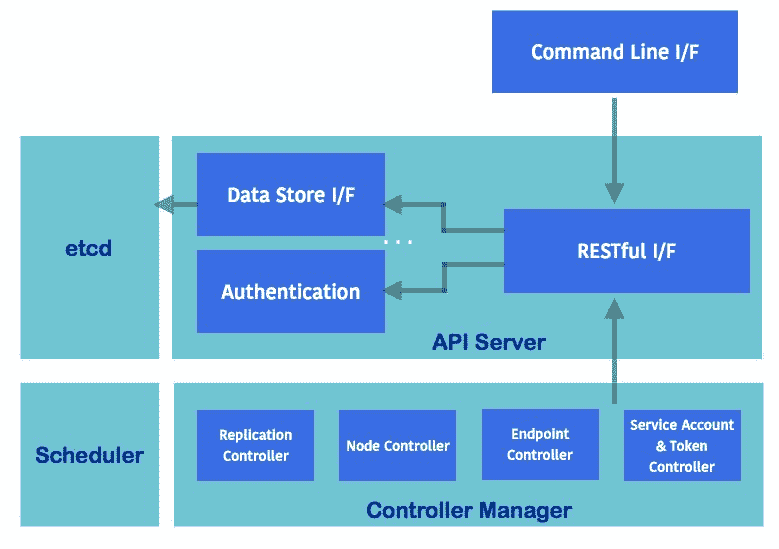
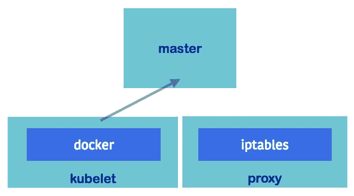
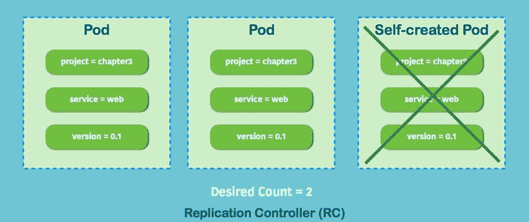
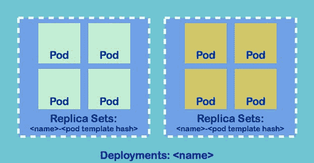
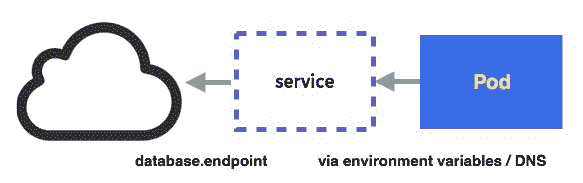
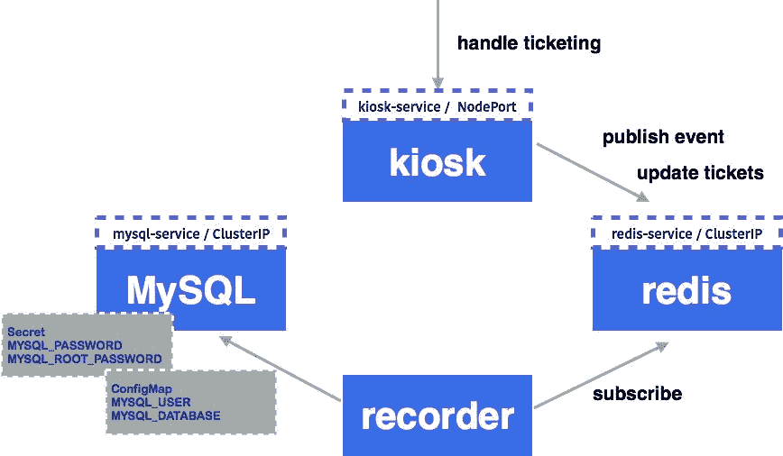

# 三、Kubernetes 入门

我们已经了解了容器可以给我们带来的好处，但是如果我们需要扩展我们的服务以满足业务需求呢？有没有一种方法可以跨多台机器构建服务，而无需处理繁琐的网络和存储设置？此外，是否有任何其他简单的方法来按照不同的服务周期管理和推出我们的微服务？Kubernetes就是这样出场的。在本章中，我们将学习:

*   不可思议的概念
*   库比特组件
*   Kubernetes 资源及其配置文件
*   如何启动 Kubernetes 的 kiosk 应用

# 对立方结构的认识

Kubernetes 是一个跨多个主机管理应用容器的平台。它为面向容器的应用提供了许多管理功能，例如自动扩展、滚动部署、计算资源和卷管理。与容器的性质相同，它被设计为在任何地方运行，因此我们能够在裸机、数据中心、公共云甚至混合云上运行它。

Kubernetes 考虑了应用容器的大部分操作需求。重点是:

*   容器部署
*   持久存储
*   容器健康监测
*   计算资源管理
*   自动缩放
*   按集群联盟划分的高可用性

Kubernetes 是微服务的完美搭配。使用 Kubernetes，我们可以创建一个`Deployment`来展开、翻转或回滚选定的容器([第 7 章](07.html#4REBM0-6c8359cae3d4492eb9973d94ec3e4f1e)、*连续交付*)。容器被认为是短暂的。我们可以将卷装入容器中，以便在单个主机环境中保存数据。在集群世界中，容器可能被安排在任何主机上运行。我们如何让卷装载无缝地作为永久存储工作？Kubernetes **卷**和**持久卷**的引入解决了这个问题([第 4 章](04.html#3279U0-6c8359cae3d4492eb9973d94ec3e4f1e)，*使用存储和资源*)。容器的寿命可能很短。当它们超过资源限制时，随时可能被杀死或停止，我们如何确保我们的服务始终服务于一定数量的容器？**复制控制器**或**在 Kubernetes 中复制设置**将确保一定数量的容器组可用。Kubernetes 甚至支持**活跃度探测器**来帮助您定义应用运行状况。为了更好的资源管理，我们还可以定义 Kubernetes 节点上的最大容量和每组容器的资源限制(也称为 **pod** )。Kubernetes 调度器将选择一个满足资源标准的节点来运行容器。我们将在[第 4 章](04.html#3279U0-6c8359cae3d4492eb9973d94ec3e4f1e)、*使用存储和资源*中了解这一点。Kubernetes 提供了一个可选的水平Pod 自动缩放功能。有了这个特性，我们可以通过资源或自定义指标水平扩展 pod。对于那些高级读者来说，Kubernetes 的设计具有高可用性( **HA** )。我们能够创建多个主节点来防止单点故障。

# 库比特组件

Kubernetes 包括两个主要玩家:

*   **大师**:大师是 Kubernetes 的心脏，控制和调度集群中的所有活动
*   **节点**:节点是运行我们容器的工人

# 主组件

主服务器包括应用编程接口服务器、控制器管理器、调度器等。所有组件都可以通过集群在不同的主机上运行。然而，从学习的角度来看，我们将使所有组件在同一个节点上运行。



Master components

# API 服务器（多维数据集 API 服务器）

应用编程接口服务器提供了一个 HTTP/HTTPS 服务器，它为 Kubernetes 主服务器中的所有组件提供了一个 RESTful 应用编程接口。例如，我们可以获取资源状态，如 pod、POST 来创建一个新的资源，也可以观察一个资源。API 服务器读取并更新 etcd，这是 Kubernetes 的后端数据存储。

# 控制器管理器

控制器管理器控制集群中许多不同的东西。复制控制器管理器确保所有复制控制器在所需的容器数量上运行。当节点关闭时，节点控制器管理器会做出响应，然后它会驱逐PODS。端点控制器用于关联服务和 pods 之间的关系。服务帐户和令牌控制器用于控制默认帐户和应用编程接口访问令牌。

# 和 cd

etcd 是一个开源分布式键值存储([https://coreos.com/etcd](https://coreos.com/etcd))。Kubernetes 在这里存储了所有的 RESTful API 对象。etcd 负责存储和复制数据。

# 调度程序

调度器根据节点上的资源容量或资源利用率的平衡来决定哪个节点适合 pods 运行。它还考虑将同一组中的PODS分散到不同的节点。

# 节点组件

需要在每个节点上配置和运行节点组件，节点组件向主节点报告 pod 的运行时状态。



Node components

# 忽必烈忽必烈忽必烈忽必烈忽必烈忽必烈忽必烈忽必烈忽必烈忽必烈忽必烈忽必烈忽必烈忽必烈忽必烈忽必烈

Kubelet 是节点中的一个主要进程，它定期向 kube-apiserver 报告节点活动，例如 pod 运行状况、节点运行状况和活跃度探测。如上图所示，它通过容器运行时运行容器，如 Docker 或 rkt。

# 代理（多维数据集代理）

代理处理 pod 负载平衡器(也称为**服务**)和 pod 之间的路由，它还提供从外部到服务的路由。有两种代理模式，userspace 和 iptables。用户空间模式通过切换内核空间和用户空间来产生大量开销。另一方面，Iptables 模式是最新的默认代理模式。它改变了 Linux 中的 iptables **NAT** ，实现了跨所有容器路由 TCP 和 UDP 数据包。

# Docker

如[第 2 章](02.html#1CQAE0-6c8359cae3d4492eb9973d94ec3e4f1e)、 *DevOps 带容器*所述，Docker 是一个容器实现。Kubernetes 使用 Docker 作为默认的容器引擎。

# Kubernetes 主节点和节点之间的交互

下图中，客户端使用 **kubectl** 向 API 服务器发送请求；API 服务器响应请求，从 etcd 中推送和提取对象信息。调度程序确定应该分配哪个节点来执行任务(例如，运行单元)。**控制器管理器**监控正在运行的任务，并在出现任何不希望的状态时做出响应。另一方面， **API 服务器**通过 kubelet 从 pods 获取日志，也是其他主组件之间的中枢。


Interaction between master and nodes

# Kubernetes 入门

在本节中，我们将学习如何在开始时设置一个小型单节点集群。然后我们将学习如何通过它的命令行工具 Kubernetes 进行交互。我们将遍历所有重要的 Kubernetes API 对象及其 YAML 格式的表达式，这是 kubectl 的输入，然后 kubectl 将相应地向 API 服务器发送请求。

# 准备环境

最简单的启动方式是运行 minikube([https://github.com/kubernetes/minikube](https://github.com/kubernetes/minikube))，这是一个在本地单个节点上运行 Kubernetes 的工具。它支持在 Windows、Linux 和 macOS 上运行。在下面的例子中，我们将在 macOS 上运行。Minikube 将启动一个安装了 Kubernetes 的虚拟机。然后我们将能够通过 kubectl 与它进行交互。

请注意，minikube 不适合生产或任何高负载环境。它的单节点特性有一些限制。我们将在[第 9 章](09.html#6NGV40-6c8359cae3d4492eb9973d94ec3e4f1e)、 *Kubernetes 在 AWS* 和[第 10 章](10.html#7BHQU0-6c8359cae3d4492eb9973d94ec3e4f1e)、 *Kubernetes 在 GCP* 中学习如何运行真正的集群。

在安装 minikube 之前，我们必须先安装家酿([https://brew.sh/](https://brew.sh/))和 VirtualBox([https://www.virtualbox.org/](https://www.virtualbox.org/))。自制程序是 macOS 中一个有用的包管理器。我们可以通过`/usr/bin/ruby -e "$(curl -fsSL [https://raw.githubusercontent.com/Homebrew/install/master/install)](https://raw.githubusercontent.com/Homebrew/install/master/install))"`命令轻松安装家酿，从甲骨文网站下载 VirtualBox 点击安装。

那就该开始了！我们可以通过`brew cask install minikube`安装 minikube:

```
// install minikube
# brew cask install minikube
==> Tapping caskroom/cask
==> Linking Binary 'minikube-darwin-amd64' to '/usr/local/bin/minikube'.
...
minikube was successfully installed!
```

安装 minikube 后，我们现在可以启动集群:

```
// start the cluster
# minikube start
Starting local Kubernetes v1.6.4 cluster...
Starting VM...
Moving files into cluster...
Setting up certs...
Starting cluster components...
Connecting to cluster...
Setting up kubeconfig...
Kubectl is now configured to use the cluster.
```

这将在本地启动一个 Kubernetes 集群。撰写本文时，最新版本为`v.1.6.4` minikube。继续在 VirtualBox 中启动名为 minikube 的虚拟机。然后将设置`kubeconfig`，这是一个配置文件，用于定义集群的上下文和身份验证设置。

借助`kubeconfig`，我们可以通过`kubectl`命令切换到不同的集群。我们可以使用`kubectl config view`命令查看`kubeconfig`中的当前设置:

```
apiVersion: v1

# cluster and certificate information
clusters:
- cluster:
 certificate-authority-data: REDACTED
 server: https://35.186.182.157
 name: gke_devops_cluster
- cluster:
 certificate-authority: /Users/chloelee/.minikube/ca.crt
 server: https://192.168.99.100:8443
 name: minikube

# context is the combination of cluster, user and namespace
contexts:
- context:
 cluster: gke_devops_cluster
 user: gke_devops_cluster
 name: gke_devops_cluster
- context:
 cluster: minikube
 user: minikube
 name: minikube
current-context: minikube
kind: Config
preferences: {}

# user information
users:
- name: gke_devops_cluster
user:
 auth-provider:
 config:
 access-token: xxxx
 cmd-args: config config-helper --format=json
 cmd-path: /Users/chloelee/Downloads/google-cloud-sdk/bin/gcloud
 expiry: 2017-06-08T03:51:11Z
 expiry-key: '{.credential.token_expiry}'
 token-key: '{.credential.access_token}'
 name: gcp

# namespace info
- name: minikube
user:
 client-certificate: /Users/chloelee/.minikube/apiserver.crt
 client-key: /Users/chloelee/.minikube/apiserver.key
```

这里我们知道我们当前使用的 minikube 上下文具有相同的集群和用户名称。上下文是身份验证信息和集群连接信息的组合。如果有多个上下文，可以使用`kubectl config use-context $context`强制切换上下文。

最后，我们需要在 minikube 中启用`kube-dns`插件。`kube-dns`是 Kuberentes 中的一项 DNS 服务:

```
// enable kube-dns addon
# minikube addons enable kube-dns
kube-dns was successfully enabled
```

# 库布特雷

`kubectl`是控制 Kubernetes 集群管理器的命令。最常见的用法是检查集群的版本:

```
// check Kubernetes version
# kubectl version
Client Version: version.Info{Major:"1", Minor:"6", GitVersion:"v1.6.2", GitCommit:"477efc3cbe6a7effca06bd1452fa356e2201e1ee", GitTreeState:"clean", BuildDate:"2017-04-19T20:33:11Z", GoVersion:"go1.7.5", Compiler:"gc", Platform:"darwin/amd64"}
Server Version: version.Info{Major:"1", Minor:"6", GitVersion:"v1.6.4", GitCommit:"d6f433224538d4f9ca2f7ae19b252e6fcb66a3ae", GitTreeState:"clean", BuildDate:"2017-05-30T22:03:41Z", GoVersion:"go1.7.3", Compiler:"gc", Platform:"linux/amd64"} 
```

然后我们知道我们的服务器版本是最新的，这是在撰写本文时的最新版本——版本 1.6.4。`kubectl`的一般语法是:

```
kubectl [command] [type] [name] [flags] 
```

`command`表示要执行的操作。如果您只需在终端中键入`kubectl help`，它将显示支持的命令。`type`指资源类型。我们将在下一节学习主要的资源类型。`name`是我们给资源命名的方式。一路上有清晰的信息性命名总是一种好的做法。对于`flags`，如果你输入`kubectl options`，它会显示所有你可以传递的旗帜。

`kubectl`派上了用场，我们可以随时添加`--help`来获取特定命令的更多详细信息。例如:

```
// show detailed info for logs command 
kubectl logs --help 
Print the logs for a container in a pod or specified resource. If the pod has only one container, the container name is 
optional. 

Aliases: 
logs, log 

Examples: 
  # Return snapshot logs from pod nginx with only one container 
  kubectl logs nginx 

  # Return snapshot logs for the pods defined by label   
  app=nginx 
  kubectl logs -lapp=nginx 

  # Return snapshot of previous terminated ruby container logs   
  from pod web-1 
  kubectl logs -p -c ruby web-1 
... 
```

然后我们在`kubectl logs`命令中获得完全支持的选项。

# Kubernetes资源公司

Kubernetes 对象是集群中的条目，存储在 etcd 中。它们代表集群的期望状态。当我们创建一个对象时，我们通过 kubectl 或 RESTful API 将请求发送到 API 服务器。应用编程接口服务器将状态存储到 etcd 中，并与其他主组件交互，以确保对象存在。Kubernetes 根据不同的团队、用途、项目或环境，使用名称空间来虚拟隔离对象。每个对象都有自己的名称和唯一的标识。Kubernetes 还支持标签和注释，让我们标记我们的对象。标签尤其可以用来将对象组合在一起。

# 永恒的物体

对象规范描述了 Kubernetes 对象的期望状态。大多数情况下，我们编写一个对象规范，并通过 kubectl 将规范发送到应用编程接口服务器。Kubernetes 将尝试实现所需的状态并更新对象状态。

对象规格可以用 YAML([http://www.yaml.org/](http://www.yaml.org/))或 JSON([http://www.json.org/](http://www.json.org/)[)](http://www.json.org/))编写。YAML 在Kubernetes世界更常见。我们将在本书的其余部分使用 YAML 格式来编写对象规格。以下代码块显示了 YAML 格式的规范片段:

```
apiVersion: Kubernetes API version 
kind: object type 
metadata:  
  spec metadata, i.e. namespace, name, labels and annotations 
spec: 
  the spec of Kubernetes object 
```

# 命名空间

Kubernetes 命名空间被认为是多个虚拟集群的隔离。不同命名空间中的对象彼此不可见。当不同的团队或项目共享同一个集群时，这很有用。大多数资源都在一个命名空间下(也称为 namespace resources)；但是，一些通用资源，如节点或名称空间本身，不属于任何名称空间。默认情况下，Kubernetes 有三个名称空间:

*   系统默认值
*   立方体系统
*   kube-public

如果不显式地将命名空间分配给 namespace 资源，它将位于当前上下文下的命名空间中。如果我们从不添加新的命名空间，将使用默认的命名空间。

Kube-system 命名空间由 Kubernetes 系统创建的对象使用，如 addon，它是实现集群功能的 pods 或服务，如 dashboard。Kube-public 命名空间是在 Kubernetes 1.6 中新引入的，它由测试版控制器管理器(BootstrapSigner[https://kubernetes.io/docs/admin/bootstrap-tokens](https://kubernetes.io/docs/admin/bootstrap-tokens)使用，将签名的集群位置信息放入`kube-public`命名空间中，因此该信息可以被经过身份验证/未经身份验证的用户看到。

在以下部分中，所有命名空间资源都将位于默认命名空间中。命名空间对于资源管理和角色也非常重要。我们将在[第 8 章](08.html#5J99O0-6c8359cae3d4492eb9973d94ec3e4f1e)、*集群管理*中介绍更多。

# 名字

Kubernetes 中的每个对象都有自己的名称。一个资源中的对象名在同一命名空间中唯一标识。Kubernetes 使用对象名作为到 API Server 的资源 URL 的一部分，因此它必须是字母数字字符的小写组合，破折号和点，少于 254 个字符。除了对象名，Kubernetes 还为每个对象分配一个唯一的标识(UID)，以区分相似实体的历史出现。

# 标签和选择器

标签是一组键/对值，用于附加到对象。标签旨在为对象指定有意义的标识信息。常见用法是微服务名称、层、环境和软件版本。用户可以定义有意义的标签，这些标签可以在以后与选择器一起使用。对象规范中的标签语法为:

```
labels: 
  $key1: $value1 
  $key2: $value2 
```

标签选择器与标签一起用于过滤对象集。用逗号分隔，多个需求将由`AND`逻辑运算符连接。有两种过滤方式:

*   基于平等的要求
*   基于集合的需求

基于平等的需求支持`=`、`==`、`!=`的操作。例如，如果选择器是`chapter=2,version!=0.1`，结果将是**对象 C** 。如果要求是`version=0.1`，结果将是**对象 A****对象 B** 。如果我们在支持的对象规范中编写需求，它将如下所示:

```
selector: 
  $key1: $value1 
```


Selector example

基于集合的需求支持`in`、`notin`和`exists`(仅适用于按键)。比如需求为`chapter in (3, 4),version`，则返回对象 A。如果要求是`version notin (0.2), !author_info`，结果将是**对象 A** 和**对象 B** 。如果我们编写支持基于集合的需求的对象规范，下面是一个例子:

```
selector: 
  matchLabels:  
    $key1: $value1 
  matchExpressions: 
{key: $key2, operator: In, values: [$value1, $value2]} 
```

`matchLabels`和`matchExpressions`的要求结合在一起。这意味着过滤后的对象需要在两个需求上都是真实的。

我们将在本章中学习复制控制器、服务、复制集和部署。

# 注释

注释是一组用户指定的键/值对，用于指定非标识性元数据。例如，对于普通标记等注释行为，用户可以向注释添加时间戳、提交哈希或内部版本号。一些 kubectl 命令支持`--record`选项来记录对注释对象进行更改的命令。注释的另一个用例是存储配置，如 Kubernetes Deployments([https://Kubernetes . io/docs/concepts/workloads/controller/deployment](https://kubernetes.io/docs/concepts/workloads/controllers/deployment))或 Critical Add-On pods([https://coreos . com/Kubernetes/docs/latest/deploy-addons . html](https://coreos.com/kubernetes/docs/latest/deploy-addons.html))。元数据部分的注释语法如下:

```
annotations: 
  $key1: $value1 
  $key2: $value2 
```

Namespace, name, label, and annotation are located in the metadata section of object spec. Selector is located in the spec section of selector-supported resources, such as ReplicationController, service, ReplicaSet, and Deployment.

# 分离舱

Pod 是 Kubernetes 中最小的可部署单元。它可以包含一个或多个容器。大多数时候，我们只需要一个容器。在某些特殊情况下，同一 pod 中包含多个容器，如 Sidecar 容器([http://blog . kubernetes . io/2015/06/the-distributed-system-toolkit-patterns . html](http://blog.kubernetes.io/2015/06/the-distributed-system-toolkit-patterns.html))。同一个 pod 中的容器运行在同一个节点上的共享上下文中，共享网络命名空间和共享卷。Pod 也被设计成凡人。当一个PODS因为某些原因死亡，比如在缺乏资源时被 Kubernetes 控制器杀死，它不会自己恢复。相反，Kubernetes 使用控制器来为我们创建和管理PODS的期望状态。

我们可以使用`kubectl explain <resource>`通过命令行获取资源的详细描述。它将显示资源支持的字段:

```
// get detailed info for `pods` 
# kubectl explain pods 
DESCRIPTION: 
Pod is a collection of containers that can run on a host. This resource is created by clients and scheduled onto hosts. 

FIELDS: 
   metadata  <Object> 
     Standard object's metadata. More info: 
     http://releases.k8s.io/HEAD/docs/devel/api- 
     conventions.md#metadata 

   spec  <Object> 
     Specification of the desired behavior of the pod. 
     More info: 
     http://releases.k8s.io/HEAD/docs/devel/api-
     conventions.md#spec-and-status 

   status  <Object> 
     Most recently observed status of the pod. This data 
     may not be up to date. 
     Populated by the system. Read-only. More info: 
     http://releases.k8s.io/HEAD/docs/devel/api-
     conventions.md#spec-and-status 

   apiVersion  <string> 
     APIVersion defines the versioned schema of this 
     representation of an 
     object. Servers should convert recognized schemas to 
     the latest internal 
     value, and may reject unrecognized values. More info: 
     http://releases.k8s.io/HEAD/docs/devel/api-
     conventions.md#resources 

   kind  <string> 
     Kind is a string value representing the REST resource  
     this object represents. Servers may infer this from 
     the endpoint the client submits 
     requests to. Cannot be updated. In CamelCase. More 
         info: 
     http://releases.k8s.io/HEAD/docs/devel/api-
     conventions.md#types-kinds 
```

在下面的示例中，我们将展示如何在一个 pod 中创建两个容器，并演示它们如何相互访问。请注意，这既不是一个有意义的，也不是一个经典的 Sidecar 模式的例子。这些用于非常具体的场景。以下只是我们如何访问 pod 中其他容器的一个示例:

```
// an example for creating co-located and co-scheduled container by pod
# cat 3-2-1_pod.yaml
apiVersion: v1
kind: Pod
metadata:
 name: example
spec:
 containers:
 - name: web
 image: nginx
 - name: centos
 image: centos
 command: ["/bin/sh", "-c", "while : ;do curl http://localhost:80/; sleep 10; done"]
```


Containers inside a Pod are visible via localhost

该规范将创建两个容器，`web`和`centos`。Web 是一个 nginx 容器([https://hub.docker.com/_/nginx/](https://hub.docker.com/_/nginx/))。默认情况下暴露容器端口`80`，由于 centos 与 nginx 共享相同的上下文，在 [http://localhost:80/](http://localhost:80/) 中做 curl 时，应该可以访问 nginx。

接下来，使用`kubectl create`命令启动 pod `-f`选项，让 kubectl 知道如何使用文件中的数据:

```
// create the resource by `kubectl create` - Create a resource by filename or stdin
# kubectl create -f 3-2-1_pod.yaml
pod "example" created  
```

Adding `--record=true` at the end of the `kubectl` command when we create the resources. Kubernetes will add the latest command while creating or updating this resource. Therefore, we won't forget which resources are created by which spec.

我们可以使用`kubectl get <resource>`命令获取对象的当前状态。在这种情况下，我们使用`kubectl get pods`命令。

```
// get the current running pods 
# kubectl get pods
NAME      READY     STATUS              RESTARTS   AGE
example   0/2       ContainerCreating   0          1s
```

Add `--namespace=$namespace_name` could access the object in different namespaces. The following is an example to check the pods in the `kube-system` namespace, which is used by system-type pods:

`# kubectl get pods --namespace=kube-system`

`NAME READY STATUS RESTARTS AGE`

`kube-addon-manager-minikube 1/1 Running 2 3d`

`kube-dns-196007617-jkk4k 3/3 Running 3 3d`

`kubernetes-dashboard-3szrf 1/1 Running 1 3d`

Most of the objects have their short names, which come in handy when we use `kubectl get <object>` to list their status. For example, pods could be called po, services could be called svc, and deployment could be called deploy. Type `kubectl get` to know more.

我们的示例Pod 的状态是`ContainerCreating`。在这个阶段，Kubernetes 已经接受了请求，试图安排 pod 并拉下映像。零个容器当前正在运行。稍等片刻后，我们可以再次获得状态:

```
// get the current running pods
# kubectl get pods
NAME      READY     STATUS    RESTARTS   AGE
example   2/2       Running   0          3s  
```

我们可以看到两个容器当前正在运行。正常运行时间为三秒。使用`kubectl logs <pod_name> -c <container_name>`可以得到容器的`stdout`，类似于`docker logs <container_name>`:

```
// get stdout for centos
# kubectl logs example -c centos
<!DOCTYPE html>
<html>
<head>
<title>Welcome to nginx!</title>
...
```

pod 中的 Centos 通过 localhost 与 nginx 共享相同的网络！Kubernetes 与 pod 一起创建了一个网络容器。网络容器的功能之一是在一个容器内的容器之间转发流量。我们将在[第 5 章](05.html#3O56S0-6c8359cae3d4492eb9973d94ec3e4f1e)、*网络与安全*中了解更多信息。

If we specify labels in pod spec, we could use the `kubectl get pods -l <requirement>` command to get the pods that are satisfying the requirements. For example, `kubectl get pods -l 'tier in (frontend, backend)'`. Additionally, if we use `kubectl pods -owide`, it will list down which pod is running on which nodes.

我们可以使用`kubectl describe <resource> <resource_name>`来获取资源的详细信息:

```
// get detailed information for a pod
# kubectl describe pods example
Name:    example
Namespace:  default
Node:    minikube/192.168.99.100
Start Time:  Fri, 09 Jun 2017 07:08:59 -0400
Labels:    <none>
Annotations:  <none>
Status:    Running
IP:    172.17.0.4
Controllers:  <none>
Containers:  
```

在这一点上，我们知道这个 pod 在哪个节点上运行，在 minikube 中，我们只得到一个节点，所以不会有任何区别。在真实的集群环境中，知道哪个节点对故障排除有用。我们没有为它关联任何标签、注释和控制器:

```
web:
 Container ID:    
 docker://a90e56187149155dcda23644c536c20f5e039df0c174444e 0a8c8  7e8666b102b
   Image:    nginx
   Image ID:    docker://sha256:958a7ae9e56979be256796dabd5845c704f784cd422734184999cf91f24c2547
   Port:
   State:    Running
      Started:    Fri, 09 Jun 2017 07:09:00 -0400
   Ready:    True
   Restart Count:  0
   Environment:  <none>
   Mounts:
      /var/run/secrets/kubernetes.io/serviceaccount from 
      default-token-jd1dq (ro)
     centos:
     Container ID:  docker://778965ad71dd5f075f93c90f91fd176a8add4bd35230ae0fa6c73cd1c2158f0b
     Image:    centos
     Image ID:    docker://sha256:3bee3060bfc81c061ce7069df35ce090593bda584d4ef464bc0f38086c11371d
     Port:
     Command:
       /bin/sh
       -c
       while : ;do curl http://localhost:80/; sleep 10; 
       done
      State:    Running
       Started:    Fri, 09 Jun 2017 07:09:01 -0400
      Ready:    True
      Restart Count:  0
      Environment:  <none>
      Mounts:
          /var/run/secrets/kubernetes.io/serviceaccount from default-token-jd1dq (ro)
```

在容器部分，我们将看到这个容器中包含两个容器。它们的状态、映像和重启计数:

```
Conditions:
 Type    Status
 Initialized   True
 Ready   True
 PodScheduled   True
```

一个Pod 有一个`PodStatus`，它包括一个表示为`PodConditions`的阵列图。`PodConditions`可能的键是`PodScheduled`、`Ready`、`Initialized`和`Unschedulable`。值将为真、假或未知。如果没有相应地创建 pod，`PodStatus`将为我们提供哪个零件出现故障的简要视图:

```
Volumes:
 default-token-jd1dq:
 Type:  Secret (a volume populated by a Secret)
 SecretName:  default-token-jd1dq
 Optional:  false
```

Pod 与一个服务帐户相关联，该帐户为运行 pod 的进程提供标识。它由应用编程接口服务器中的服务帐户和令牌控制器控制。

它会将只读卷装载到包含 API 访问令牌的 pod 中`/var/run/secrets/kubernetes.io/serviceaccount`下的每个容器中。Kubernetes 创建一个默认服务帐户。我们可以使用`kubectl get serviceaccounts`命令来列出它们:

```
QoS Class:  BestEffort
Node-Selectors:  <none>
Tolerations:  <none>
```

我们还没有给这个Pod 分配任何选择器。服务质量意味着资源服务质量。容错用于限制一个节点可以使用多少个PODS。我们将在[第 8 章](08.html#5J99O0-6c8359cae3d4492eb9973d94ec3e4f1e)*集群管理:*中了解更多信息

```
Events:
 FirstSeen  LastSeen  Count  From      SubObjectPath    Type     
  Reason    Message
  ---------  --------  -----  ----      -------------    ------ 
  --  ------    -------
  19m    19m    1  default-scheduler        Normal    Scheduled  
  Successfully assigned example to minikube
  19m    19m    1  kubelet, minikube  spec.containers{web}  
  Normal    Pulling    pulling image "nginx"
  19m    19m    1  kubelet, minikube  spec.containers{web}  
  Normal    Pulled    Successfully pulled image "nginx"
  19m    19m    1  kubelet, minikube  spec.containers{web}  
  Normal    Created    Created container with id 
  a90e56187149155dcda23644c536c20f5e039df0c174444e0a8c87e8666b102b
  19m    19m    1  kubelet, minikube  spec.containers{web}   
  Normal    Started    Started container with id  
 a90e56187149155dcda23644c536c20f5e039df0c174444e0a8c87e86 
 66b102b
  19m    19m    1  kubelet, minikube  spec.containers{centos}  
  Normal    Pulling    pulling image "centos"
  19m    19m    1  kubelet, minikube  spec.containers{centos}  
  Normal    Pulled    Successfully pulled image "centos"
  19m    19m    1  kubelet, minikube  spec.containers{centos}  
  Normal    Created    Created container with id 
 778965ad71dd5f075f93c90f91fd176a8add4bd35230ae0fa6c73cd1c 
 2158f0b
  19m    19m    1  kubelet, minikube  spec.containers{centos}  
  Normal    Started    Started container with id 
 778965ad71dd5f075f93c90f91fd176a8add4bd35230ae0fa6c73cd1c 
 2158f0b 
```

通过查看事件，我们可以知道 Kubernetes 运行节点的步骤。首先，scheduler 将任务分配给一个节点，这里它被命名为 minikube。然后 minikube 上的 kubelet 开始拉第一个映像，并相应地创建一个容器。然后 kubelet 拉下第二个容器并运行。

# 复制集和复制控制器

PODS不是自愈的。当Pod 遇到故障时，它不会自行恢复。**副本集** ( **RS** )和**副本控制器** ( **RC** )因此进场。复制集和复制控制器都将确保指定数量的复制盒始终在集群中启动和运行。如果一个Pod 因任何原因崩溃，复制集和复制控制器将请求启动一个新的Pod 。

最新的 Kubernetes 之后，ReplicationController 逐渐被 ReplicaSet 取代。它们有相同的概念，只是对 pod 选择器使用不同的要求。复制控制器使用基于等式的选择器要求，而复制集使用基于集合的选择器要求。复制集通常不是由用户创建的，而是由 Kubernetes Deployments 对象创建的，而复制控制器是由用户自己创建的。在本节中，我们将首先通过示例来解释 RC 的概念，这更容易理解。然后我们会在最后引入副本集。


ReplicationController with desired count 2

假设我们想要创建一个`ReplicationController`对象，期望计数为 2。这意味着我们将永远有两个Pod 在服务。在我们为复制控制器编写规范之前，我们必须先决定 pod 模板。Pod 模板类似于 pod 的规格。在复制控制器中，元数据部分中的标签是必需的。复制控制器使用容器选择器来选择它所管理的容器。标签允许复制控制器区分是否所有匹配选择器的Pod 都在轨道上。

在本例中，我们将创建两个带有标签`project`、`service`和`version`的PODS，如上图所示:

```
// an example for rc spec
# cat 3-2-2_rc.yaml
apiVersion: v1
kind: ReplicationController
metadata:
 name: nginx
spec:
 replicas: 2
 selector:
 project: chapter3
 service: web
 version: "0.1"
 template:
 metadata:
 name: nginx
 labels:
 project: chapter3
 service: web
 version: "0.1"
 spec:
 containers:
 - name: nginx
 image: nginx
 ports:
 - containerPort: 80
// create RC by above input file
# kubectl create -f 3-2-2_rc.yaml
replicationcontroller "nginx" created  
```

然后我们可以使用`kubectl`获取当前的 RC 状态:

```
// get current RCs
# kubectl get rc
NAME      DESIRED   CURRENT   READY     AGE
nginx     2         2         2         5s  
```

它显示我们有两个想要的Pod ，我们目前有两个Pod ，两个Pod 准备好了。我们现在有多少个PODS？

```
// get current running pod
# kubectl get pods
NAME          READY     STATUS    RESTARTS   AGE
nginx-r3bg6   1/1       Running   0          11s
nginx-sj2f0   1/1       Running   0          11s  
```

它显示我们有两个Pod 运行。如前所述，复制控制器管理所有与选择器匹配的PODS。如果我们手动创建一个具有相同标签的 pod，理论上，它应该与我们刚刚创建的 RC 的 pod 选择器相匹配。让我们试一试:

```
// manually create a pod with same labels
# cat 3-2-2_rc_self_created_pod.yaml
apiVersion: v1
kind: Pod
metadata:
 name: our-nginx
 labels:
 project: chapter3
 service: web
 version: "0.1"
spec:
 containers:
 - name: nginx
 image: nginx
 ports:
 - containerPort: 80
// create a pod with same labels manually
# kubectl create -f 3-2-2_rc_self_created_pod.yaml 
pod "our-nginx" created  
```

让我们看看它是否启动并运行:

```
// get pod status
# kubectl get pods
NAME          READY     STATUS        RESTARTS   AGE
nginx-r3bg6   1/1       Running       0          4m
nginx-sj2f0   1/1       Running       0          4m
our-nginx     0/1       Terminating   0          4s  
```

它是预定的，复制控制器捕捉到它。PODS的数量变成了三个，超过了我们想要的数量。PODS最终被杀死:

```
// get pod status
# kubectl get pods
NAME          READY     STATUS    RESTARTS   AGE
nginx-r3bg6   1/1       Running   0          5m
nginx-sj2f0   1/1       Running   0          5m  
```



ReplicationController makes sure pods are in desired state

如果我们想按需扩展，我们可以简单地使用`kubectl edit <resource> <resource_name>`来更新规格。这里我们将副本数量从`2`更改为`5`:

```
// change replica count from 2 to 5, default system editor will pop out. Change `replicas` number
# kubectl edit rc nginx
replicationcontroller "nginx" edited  
```

让我们检查钢筋混凝土信息:

```
// get rc information
# kubectl get rc
NAME      DESIRED   CURRENT   READY     AGE
nginx     5         5         5         5m      
```

我们现在有五个Pod 。让我们来看看 RC 是如何工作的:

```
// describe RC resource `nginx`
# kubectl describe rc nginx
Name:    nginx
Namespace:  default
Selector:  project=chapter3,service=web,version=0.1
Labels:    project=chapter3
 service=web
 version=0.1
Annotations:  <none>
Replicas:  5 current / 5 desired
Pods Status:  5 Running / 0 Waiting / 0 Succeeded / 0 Failed
Pod Template:
 Labels:  project=chapter3
 service=web
 version=0.1
 Containers:
 nginx:
 Image:    nginx
 Port:    80/TCP
 Environment:  <none>
 Mounts:    <none>
 Volumes:    <none>
Events:
 FirstSeen  LastSeen  Count  From      SubObjectPath  Type      
  Reason      Message
---------  --------  -----  ----      -------------  --------  ------      -------
34s    34s    1  replication-controller      Normal    SuccessfulCreate  Created pod: nginx-r3bg6 
34s    34s    1  replication-controller      Normal    SuccessfulCreate  Created pod: nginx-sj2f0 
20s    20s    1  replication-controller      Normal    SuccessfulDelete  Deleted pod: our-nginx
15s    15s    1  replication-controller      Normal    SuccessfulCreate  Created pod: nginx-nlx3v
15s    15s    1  replication-controller      Normal    SuccessfulCreate  Created pod: nginx-rqt58
15s    15s    1  replication-controller      Normal    SuccessfulCreate  Created pod: nginx-qb3mr  
```

通过描述命令；我们可以了解 RC 的规格，也可以了解事件。在我们创建`nginx` RC 的时候，它按照规格推出了两个容器。然后我们根据另一个规范手动创建了另一个Pod ，命名为`our-nginx`。RC 检测到 pod 与其 pod 选择器相匹配。然后数量超过了我们期望的数量，所以它驱逐了它。然后我们将复制品缩小到五个。RC 检测到它没有达到我们想要的状态，发射了三个Pod 来填补空白。

如果我们想删除一个钢筋混凝土，只需使用`kubectl delete <resource> <resource_name>`的`kubectl`命令。由于我们手头有一个配置文件，我们还可以使用`kubectl delete -f <configuration_file>`删除文件中列出的资源:

```
// delete a rc
# kubectl delete rc nginx
replicationcontroller "nginx" deleted
// get pod status
# kubectl get pods
NAME          READY     STATUS        RESTARTS   AGE
nginx-r3bg6   0/1       Terminating   0          29m  
```

同样的概念也被带到了副本集。以下是`3-2-2.rc.yaml`的 RS 版本。两个主要区别是:

*   `apiVersion`是写作时的`extensions/v1beta1`
*   选择器需求被更改为基于集合的需求，使用`matchLabels`和`matchExpressions`语法

在前面的例子中遵循相同的步骤应该在 RC 和 RS 之间完全相同。这只是一个例子；但是，我们不应该自己创建 RS，而应该始终由 Kubernetes `deployment`对象管理。我们将在下一部分了解更多信息:

```
// RS version of 3-2-2_rc.yaml 
# cat 3-2-2_rs.yaml
apiVersion: extensions/v1beta1
kind: ReplicaSet
metadata:
 name: nginx
spec:
 replicas: 2
 selector:
 matchLabels:
 project: chapter3
 matchExpressions:
 - {key: version, operator: In, values: ["0.1", "0.2"]}
   template:
     metadata:
       name: nginx
        labels:
         project: chapter3
         service: web
         version: "0.1"
     spec:
       containers:
        - name: nginx
          image: nginx
          ports:
         - containerPort: 80
```

# 部署

在 1.2 版之后，部署是在 Kubernetes 中管理和部署我们的软件的最佳基础。它支持优雅地部署、滚动更新和回滚 pod 和 ReplicaSets。我们通过声明式的部署来定义我们想要的软件更新，然后部署将逐步为我们完成。

Before deployment, ReplicationController and kubectl rolling-update were the major way to implement rolling-update for the software, which is more imperative and slower. Deployment now becomes the major high-level object to manage our application.

让我们看一看它是如何工作的。在本节中，我们将了解如何创建部署，如何执行滚动更新和回滚。[第 7 章](07.html#4REBM0-6c8359cae3d4492eb9973d94ec3e4f1e)、*持续交付*有更多关于我们如何将部署集成到我们的持续交付管道中的信息和实例。

首先，我们可以使用`kubectl run`命令为我们创建一个`deployment`:

```
// using kubectl run to launch the Pods
# kubectl run nginx --image=nginx:1.12.0 --replicas=2 --port=80
deployment "nginx" created

// check the deployment status
# kubectl get deployments
NAME      DESIRED   CURRENT   UP-TO-DATE   AVAILABLE   AGE
nginx     2         2         2            2           4h  
```

Before Kubernetes 1.2, the `kubectl run` command would create pods instead.

通过部署部署了两个Pod :

```
// check if pods match our desired count
# kubectl get pods
NAME                     READY     STATUS        RESTARTS   AGE
nginx-2371676037-2brn5   1/1       Running       0          4h
nginx-2371676037-gjfhp   1/1       Running       0          4h  
```



The relationship in deployments, ReplicaSets, and pods

如果我们删除其中一个Pod ，被替换的Pod 将被安排并立即启动。这是因为部署会在幕后创建一个副本集，这将确保副本的数量与我们期望的数量相匹配。通常，部署管理复制集，复制集管理单元。请注意，我们不应该手动操作部署管理的复制集，就像如果它们由复制集管理，那么直接更改 pods 是没有意义的:

```
// list replica sets
# kubectl get rs
NAME               DESIRED   CURRENT   READY     AGE
nginx-2371676037   2         2         2         4h      
```

我们也可以通过`kubectl`命令公开端口进行部署:

```
// expose port 80 to service port 80
# kubectl expose deployment nginx --port=80 --target-port=80
service "nginx" exposed

// list services
# kubectl get services
NAME         CLUSTER-IP   EXTERNAL-IP   PORT(S)   AGE
kubernetes   10.0.0.1     <none>        443/TCP   3d
nginx        10.0.0.94    <none>        80/TCP    5s  
```

部署也可以通过规范来创建。kubectl 以前启动的部署和服务可以转换为以下规范:

```
// create deployments by spec
# cat 3-2-3_deployments.yaml
apiVersion: apps/v1beta1
kind: Deployment
metadata:
 name: nginx
spec:
 replicas: 2
 template:
 metadata:
 labels:
 run: nginx
 spec:
 containers:
 - name: nginx
 image: nginx:1.12.0
 ports:
 - containerPort: 80
---
kind: Service
apiVersion: v1
metadata:
 name: nginx
 labels:
 run: nginx
spec:
 selector:
 run: nginx
 ports:
 - protocol: TCP
 port: 80
 targetPort: 80
 name: http

// create deployments and service
# kubectl create -f 3-2-3_deployments.yaml
deployment "nginx" created
service "nginx" created  
```

为了执行滚动更新，我们必须添加滚动更新策略。有三个参数用于控制过程:

| **参数** | **描述** | **默认值** |
| `minReadySeconds` | 热身时间。新创建的 pod 被认为可用的时间。默认情况下，Kubernetes 假设应用一旦成功启动就可用。 | Zero |
| `maxSurge` | 做滚动更新过程中可以激增多少荚。 | 25% |
| `maxUnavailable` | 进行滚动更新过程时，有多少Pod 不可用。 | 25% |

`minReadySecond`是一个重要的设定。如果我们的应用在Pod 启动时不能立即使用，Pod 在没有适当等待的情况下滚动得太快。虽然所有新的Pod 都已启动，但应用可能仍在预热；可能会发生服务中断。在下面的例子中，我们将配置添加到`Deployment.spec`部分:

```
// add to Deployments.spec, save as 3-2-3_deployments_rollingupdate.yaml
minReadySeconds: 3 
strategy:
 type: RollingUpdate
 rollingUpdate:
 maxSurge: 1
 maxUnavailable: 1  
```

这表明我们允许一个Pod 一次不可用，并且在滚动Pod 时可以再启动一个Pod 。进行下一步操作前的预热时间为三秒。我们可以使用`kubectl edit deployments nginx`(直接编辑)或`kubectl replace -f 3-2-3_deployments_rollingupdate.yaml`更新策略。

假设我们想要模拟新软件的推出，从 nginx 1.12.0 到 1.13.1。我们仍然可以使用前面两个命令来更改映像版本，或者使用`kubectl set image deployment nginx nginx=nginx` `:1.13.1`来触发更新。如果我们使用`kubectl describe`来检查发生了什么，我们将看到部署通过删除/创建Pod 触发了副本集的滚动更新:

```
// check detailed rs information
# kubectl describe rs nginx-2371676037 
Name:    nginx-2371676037 
Namespace:  default
Selector:  pod-template-hash=2371676037   ,run=nginx
Labels:    pod-template-hash=2371676037 
 run=nginx
Annotations:  deployment.kubernetes.io/desired-replicas=2
 deployment.kubernetes.io/max-replicas=3
 deployment.kubernetes.io/revision=4
 deployment.kubernetes.io/revision-history=2
Replicas:  2 current / 2 desired
Pods Status:  2 Running / 0 Waiting / 0 Succeeded / 0 Failed
Pod Template:
 Labels:  pod-template-hash=2371676037 
 run=nginx
Containers:
nginx:
Image:    nginx:1.13.1
Port:    80/TCP
...
Events:
FirstSeen  LastSeen  Count  From      SubObjectPath  Type    Reason      Message
---------  --------  -----  ----      -------------  --------  ------      -------
3m    3m    1  replicaset-controller      Normal    SuccessfulCreate  Created pod: nginx-2371676037-f2ndj
3m    3m    1  replicaset-controller      Normal    SuccessfulCreate  Created pod: nginx-2371676037-9lc8j
3m    3m    1  replicaset-controller      Normal    SuccessfulDelete  Deleted pod: nginx-2371676037-f2ndj
3m    3m    1  replicaset-controller      Normal    SuccessfulDelete  Deleted pod: nginx-2371676037-9lc8j
```


Illustration of deployments

上图显示了部署的图示。在某个时间点，我们有两个(期望计数)和一个(`maxSurge`)PODS。在启动每个新的Pod 后，Kubernetes 将等待三(`minReadySeconds`)秒，然后执行下一个动作。

如果我们使用命令`kubectl set image deployment nginx nginx=nginx:1.12.0 to previous version 1.12.0`，部署将为我们完成回滚。

# 服务

Kubernetes 中的服务是一个抽象层，用于将流量路由到一组逻辑单元。有了服务，我们不需要跟踪每个 pod 的 IP 地址。服务通常使用标签选择器来选择它需要路由到的Pod (在某些情况下，服务是在没有选择器的情况下创建的)。服务抽象是强大的。它实现了解耦，并使微服务之间的通信成为可能。目前 Kubernetes 服务支持 TCP 和 UDP。

服务不关心我们如何创建 pod。就像复制控制器一样，它只关心PODS是否与其标签选择器相匹配，因此PODS可能属于不同的复制控制器。以下是一个示例:


Service maps pods via label selector

在图中，所有的 pod 都与服务选择器相匹配，因此服务将负责将流量分配到所有的 pod 中，而无需显式分配。

**服务类型**

有四种类型的服务:集群 IP、节点端口、负载平衡器和外部名称。


LoadBalancer includes the features of NodePort and ClusterIP

群集 IP

ClusterIP 是默认服务类型。它在群集内部的 IP 上公开服务。集群中的 Pods 可以通过 IP 地址、环境变量或 DNS 来访问服务。在下面的示例中，我们将学习如何使用本机服务环境变量和 DNS 来访问集群中服务背后的 pods。

在启动服务之前，我们希望创建两组 RC，如图所示:

```
// create RC 1 with nginx 1.12.0 version
# cat 3-2-3_rc1.yaml
apiVersion: v1
kind: ReplicationController
metadata:
 name: nginx-1.12
spec:
 replicas: 2
 selector:
 project: chapter3
 service: web
 version: "0.1"
template:
 metadata:
 name: nginx
 labels:
 project: chapter3
 service: web
 version: "0.1"
 spec:
 containers:
 - name: nginx
 image: nginx:1.12.0
 ports:
 - containerPort: 80
// create RC 2 with nginx 1.13.1 version
# cat 3-2-3_rc2.yaml
apiVersion: v1
kind: ReplicationController
metadata:
 name: nginx-1.13
spec:
 replicas: 2
 selector:
 project: chapter3
 service: web
 version: "0.2"
 template:
 metadata:
 name: nginx
 labels:
 project: chapter3
 service: web
 version: "0.2"
spec:
 containers:
- name: nginx
 image: nginx:1.13.1
 ports:
 - containerPort: 80  
```

然后，我们可以针对项目和服务标签制作 pod 选择器:

```
// simple nginx service 
# cat 3-2-3_service.yaml
kind: Service
apiVersion: v1
metadata:
 name: nginx-service
spec:
 selector:
 project: chapter3
 service: web
 ports:
 - protocol: TCP
 port: 80
 targetPort: 80
 name: http

// create the RCs 
# kubectl create -f 3-2-3_rc1.yaml
replicationcontroller "nginx-1.12" created 
# kubectl create -f 3-2-3_rc2.yaml
replicationcontroller "nginx-1.13" created

// create the service
# kubectl create -f 3-2-3_service.yaml
service "nginx-service" created  
```

Since `service` object might create a DNS label, service name must follow the combination of characters a-z, 0-9, or - (hyphen). A hyphen at the beginning or end of a label is not allowed.

然后我们可以使用`kubectl describe service <service_name>`来检查服务信息:

```
// check nginx-service information
# kubectl describe service nginx-service
Name:      nginx-service
Namespace:    default
Labels:      <none>
Annotations:    <none>
Selector:    project=chapter3,service=web
Type:      ClusterIP
IP:      10.0.0.188
Port:      http  80/TCP
Endpoints:    172.17.0.5:80,172.17.0.6:80,172.17.0.7:80 + 1 more...
Session Affinity:  None
Events:      <none>
```

One service could expose multiple ports. Just extend `.spec.ports` list in the service spec.

我们可以看到它是一个集群 IP 类型的服务，分配的内部 IP 是 10.0.0.188。端点显示我们在服务背后有四个 IP。可以通过`kubectl describe pods <pod_name>`命令找到Pod  IP。Kubernetes 创建了一个`endpoints`对象和一个`service`对象，用于将流量路由到匹配的Pod 。

当使用选择器创建服务时，Kubernetes 将创建相应的端点条目并不断更新，这将告诉服务路由到的目的地:

```
// list current endpoints. Nginx-service endpoints are created and pointing to the ip of our 4 nginx pods.
# kubectl get endpoints
NAME            ENDPOINTS                                               AGE
kubernetes      10.0.2.15:8443                                          2d
nginx-service   172.17.0.5:80,172.17.0.6:80,172.17.0.7:80 + 1 more...   10s  
```

ClusterIP could be defined within your cluster, though most of the time we don't explicitly use IP address to access clusters. Using `.spec.clusterIP` could do the work.

默认情况下，Kubernetes 将为每个服务公开七个环境变量。在大多数情况下，前两个将用于使用`kube-dns`插件为我们进行服务发现:

*   `${SVCNAME}_SERVICE_HOST`
*   `${SVCNAME}_SERVICE_PORT`
*   `${SVCNAME}_PORT`
*   `${SVCNAME}_PORT_${PORT}_${PROTOCAL}`
*   `${SVCNAME}_PORT_${PORT}_${PROTOCAL}_PROTO`
*   `${SVCNAME}_PORT_${PORT}_${PROTOCAL}_PORT`
*   `${SVCNAME}_PORT_${PORT}_${PROTOCAL}_ADDR`

在下面的例子中，我们将在另一个Pod 中使用`${SVCNAME}_SERVICE_HOST`来检查我们是否能够访问我们的 nginx Pod :


The illustration of accessing ClusterIP via environment variables and DNS names

然后我们将创建一个名为`clusterip-chk`的容器，通过`nginx-service`访问 nginx 容器:

```
// access nginx service via ${NGINX_SERVICE_SERVICE_HOST}
# cat 3-2-3_clusterip_chk.yaml
apiVersion: v1
kind: Pod
metadata:
 name: clusterip-chk
spec:
 containers:
 - name: centos
 image: centos
 command: ["/bin/sh", "-c", "while : ;do curl    
http://${NGINX_SERVICE_SERVICE_HOST}:80/; sleep 10; done"]  
```

我们可以通过`kubectl logs`命令检查`cluserip-chk`Pod 的`stdout`:

```
// check stdout, see if we can access nginx pod successfully
# kubectl logs -f clusterip-chk
% Total    % Received % Xferd  Average Speed   Time    Time     Time  Current
                                     Dload  Upload   Total   Spent    Left  Speed
100   612  100   612    0     0   156k      0 --:--:-- --:--:-- --:--:--  199k
 ...
<title>Welcome to nginx!</title>
    ...  
```

这种抽象层次分离了Pod 之间的通信。PODS是凡人。有了 RC 和服务，我们就可以构建强大的服务，而不用担心一个 pod 是否会影响所有的微服务。

启用`kube-dns`插件后，具有服务的同一个集群和同一个命名空间中的 pods 可以通过服务 DNS 记录访问服务。Kube-dns 通过观看 Kubernetes API 为新创建的服务创建 dns 记录。集群 IP 的 DNS 格式为`$servicename.$namespace`，端口为`_$portname_$protocal.$servicename.$namespace`。`clusterip_chk`Pod 的规格与环境变量 1 相似。在我们前面的例子中，只需将网址更改为 [`http://nginx-service.default:_http_tcp.nginx-service.default/`](http://nginx-service.default:_http_tcp.nginx-service.default/) ，它们的工作原理应该完全相同！

节点端口

如果将服务设置为 NodePort，Kubernetes 将在每个节点上的某个范围内分配一个端口。去往该端口上节点的任何流量都将被路由到服务端口。端口号可以由用户指定。如果未指定，Kubernetes 将随机选择 30000 到 32767 范围内的一个端口，不会发生冲突。另一方面，如果指定，用户应该负责自己管理冲突。节点端口包括集群 IP 的特性。Kubernetes 为服务分配一个内部 IP。在下面的示例中，我们将看到如何创建节点端口服务并利用它:

```
// write a nodeport type service
# cat 3-2-3_nodeport.yaml
kind: Service
apiVersion: v1
metadata:
 name: nginx-nodeport
spec:
 type: NodePort
 selector:
 project: chapter3
 service: web
 ports:
 - protocol: TCP
 port: 80
 targetPort: 80

// create a nodeport service
# kubectl create -f 3-2-3_nodeport.yaml
service "nginx-nodeport" created  
```

然后您应该可以通过`http://${NODE_IP}:80`访问该服务。节点可以是任何节点。`kube-proxy`监视服务和端点的任何更新，并相应地更新 iptables 规则(如果使用默认的 iptables 代理模式)。

If you're using minikube, you could access the service via the `minikube service [-n NAMESPACE] [--url] NAME` command. In this example, it's `minikube service nginx-nodeport`.

**负载平衡器**

此类型仅在云提供商支持下可用，如谷歌云平台([第 10 章](10.html#7BHQU0-6c8359cae3d4492eb9973d94ec3e4f1e)、*GCP*上的 Kubernetes)和亚马逊网络服务([第 9 章](09.html#6NGV40-6c8359cae3d4492eb9973d94ec3e4f1e)、*AWS*上的 Kubernetes)。通过创建负载平衡器服务，Kubernetes 将由云提供商向服务提供负载平衡器。

外部名称(kube DNS 版本> = 1.7)

有时我们在云中利用不同的服务。Kubernetes 足够灵活，可以混合使用。外部名称是为集群中的外部端点创建 **CNAME** 的桥梁之一。

**不带选择器的服务**

服务使用选择器匹配Pod 来引导流量。但是，有时您需要实现一个代理，作为 Kubernetes 集群和另一个名称空间、另一个集群或外部资源之间的桥梁。在下面的例子中，我们将演示如何在集群中实现[http://www.google.com](http://www.google.com)的代理。这只是一个示例，而代理的来源可能是您的数据库或云中其他资源的端点:



Illustration of how service without selector works

配置文件与上一个相似，只是没有选择器部分:

```
// create a service without selectors
# cat 3-2-3_service_wo_selector_srv.yaml
kind: Service
apiVersion: v1
metadata:
 name: google-proxy
spec:
 ports:
 - protocol: TCP
 port: 80
 targetPort: 80

// create service without selectors
# kubectl create -f 3-2-3_service_wo_selector_srv.yaml
service "google-proxy" created  
```

由于没有选择器，将不会创建 Kubernetes 端点。Kubernetes 不知道将流量路由到哪里，因为没有选择器可以匹配PODS。我们必须自己创造。

在`Endpoints`对象中，源地址不能是 DNS 名称，所以我们将使用`nslookup`从域中找到当前的 Google IP，并将其添加到`Endpoints.subsets.addresses.ip`中:

```
// get an IP from google.com
# nslookup www.google.com
Server:    192.168.1.1
Address:  192.168.1.1#53

Non-authoritative answer:
Name:  google.com
Address: 172.217.0.238

// create endpoints for the ip from google.com
# cat 3-2-3_service_wo_selector_endpoints.yaml
kind: Endpoints
apiVersion: v1
metadata:
 name: google-proxy
subsets:
 - addresses:
 - ip: 172.217.0.238
 ports:
 - port: 80

// create Endpoints
# kubectl create -f 3-2-3_service_wo_selector_endpoints.yaml
endpoints "google-proxy" created  
```

让我们在集群中创建另一个 pod 来访问我们的 Google 代理:

```
// pod for accessing google proxy
# cat 3-2-3_proxy-chk.yaml
apiVersion: v1
kind: Pod
metadata:
 name: proxy-chk
spec:
 containers:
 - name: centos
 image: centos
 command: ["/bin/sh", "-c", "while : ;do curl -L http://${GOOGLE_PROXY_SERVICE_HOST}:80/; sleep 10; done"]

// create the pod
# kubectl create -f 3-2-3_proxy-chk.yaml
pod "proxy-chk" created  
```

让我们从Pod 中查看`stdout`:

```
// get logs from proxy-chk
# kubectl logs proxy-chk
% Total    % Received % Xferd  Average Speed   Time    Time     Time  Current
                                     Dload  Upload   Total   Spent    Left  Speed
100   219  100   219    0     0   2596      0 --:--:-- --:--:-- --:--:--  2607
100   258  100   258    0     0   1931      0 --:--:-- --:--:-- --:--:--  1931
<!doctype html><html itemscope="" itemtype="http://schema.org/WebPage" lang="en-CA">
 ...  
```

万岁！我们现在可以确认代理工作。服务的流量将被路由到我们指定的端点。如果不起作用，请确保将适当的入站规则添加到外部资源网络中。

端点不支持 DNS 作为源。或者，我们可以使用 ExternalName，它也没有选择器。它需要 kube-dns 版本> = 1.7。

In some use cases, users need neither load balancing nor proxy functionalities for the service. In that case, we can set `CluterIP = "None"` as so-called headless services. For more information, please refer to [https://kubernetes.io/docs/concepts/services-networking/service/#headless-services](https://kubernetes.io/docs/concepts/services-networking/service/#headless-services).

# 卷

容器是短暂的，它的磁盘也是。我们要么使用`docker commit [CONTAINER]`命令，要么将数据卷装入一个容器中([第 2 章](02.html#1CQAE0-6c8359cae3d4492eb9973d94ec3e4f1e)，*将数据卷装入容器*)。在 Kubernetes 的世界中，卷管理变得至关重要，因为 pods 可以在任何节点上运行。此外，确保同一容器中的容器可以共享相同的文件变得非常困难。这是 Kubernetes 的一个大话题。[第 4 章](04.html#3279U0-6c8359cae3d4492eb9973d94ec3e4f1e)、*使用存储和资源*介绍卷管理。

# 机密

Secret，就像它的名字一样，是一个以键值格式存储机密的对象，用于向 pods 提供敏感信息，可以是密码、访问密钥或令牌。机密没有落到磁盘上；相反，它存储在每个节点的`tmpfs`文件系统中。模式下的 Kubelet 将创建一个`tmpfs`文件系统来存储机密。出于存储管理方面的考虑，Secret 并不旨在存储大量数据。一个机密的当前大小限制是 1MB。

我们可以通过启动 kubectl 来创建一个机密命令，或者通过 spec，基于文件、目录或指定的文字值来创建一个机密。有三种类型的机密格式:通用(或不透明，如果编码的话)、docker 注册表和 TLS。

通用/不透明是我们将在应用中使用的文本。Docker 注册表用于存储私有 docker 注册表的凭据。TLS 机密用于存储用于群集管理的 CA 证书捆绑包。

The docker-registry type of secret is also called **imagePullSecrets**, which is used to pass the password of a private docker registry via kubelet when pulling the image. This comes in handy so that we don't need to do `docker login` for each provisioned node. The command is `kubectl create secret docker-registry` `<registry_name>` `--docker-server``=<docker_server> --docker-username=<docker_username>` `-``-docker-password=<docker_password> --docker-email=<docker_email>`

我们将从一个通用类型的示例开始，展示它是如何工作的:

```
// create a secret by command line
# kubectl create secret generic mypassword --from-file=./mypassword.txt
secret "mypassword" created  
```

The options for creating secrets based on directory and literal value are pretty similar with the file ones. If specifying a directory after `--from-file`, the files in the directory will be iterated, the file name will be the secret key if its a legal secret name, and other non-regular files will be ignored subdirectories, symlinks, devices, pipes. On the other hand, `--from-literal=<key>=<value>` is the option if you want to specify plain text directly from the command, for example, `--from-literal=username=root`.

这里，我们从文件`mypassword.txt`中创建一个机密名称`mypassword`。默认情况下，机密的密钥是文件名，相当于`--from-file=mypassword=./mypassword.txt`选项。我们也可以追加多个`--from-file`。使用`kubectl get secret` `<secret_name>` `-o yaml`命令可以检查出机密的详细信息:

```
// get the detailed info of the secret
# kubectl get secret mypassword -o yaml
apiVersion: v1
data:
 mypassword: bXlwYXNzd29yZA==
kind: Secret
metadata:
 creationTimestamp: 2017-06-13T08:09:35Z
 name: mypassword
 namespace: default
 resourceVersion: "256749"
 selfLink: /api/v1/namespaces/default/secrets/mypassword
 uid: a33576b0-500f-11e7-9c45-080027cafd37
type: Opaque  
```

我们可以看到机密的类型变成`Opaque`，因为文本已经被 kubectl 加密了。它是 base64 编码的。我们可以使用一个简单的 bash 命令来解码它:

```
# echo "bXlwYXNzd29yZA==" | base64 --decode
mypassword  
```

PODS有两种方法可以找回机密。第一种是通过文件，第二种是通过环境变量。第一种方法是按卷实现的。语法是在容器规格中添加`containers.volumeMounts`，并添加一个带有机密配置的卷部分。

**通过文件检索机密**

让我们先来看看如何从 pod 内的文件中读取机密:

```
// example for how a Pod retrieve secret 
# cat 3-2-3_pod_vol_secret.yaml 
apiVersion: v1 
kind: Pod 
metadata: 
  name: secret-access 
spec: 
  containers: 
  - name: centos 
    image: centos 
    command: ["/bin/sh", "-c", "cat /secret/password-example; done"] 
    volumeMounts: 
      - name: secret-vol 
        mountPath: /secret 
        readOnly: true 
  volumes: 
    - name: secret-vol 
      secret: 
        secretName: mypassword 
        # items are optional 
        items: 
        - key: mypassword  
          path: password-example 

// create the pod 
# kubectl create -f 3-2-3_pod_vol_secret.yaml 
pod "secret-access" created 
```

机密文件将安装在`/<mount_point>/<secret_name>`中，而不指定Pod 中的`items` `key`和`path`或`/<mount_point>/<path>`。这种情况下在`/secret/password-example`下面。如果我们描述这个Pod ，我们可以发现在这个Pod 中有两个挂载点。第一个是存储我们的机密的只读卷，第二个存储与 API 服务器通信的凭证，由 Kubernetes 创建和管理。我们将在[第 5 章](05.html#3O56S0-6c8359cae3d4492eb9973d94ec3e4f1e)、*网络和安全*中了解更多信息:

```
# kubectl describe pod secret-access
...
Mounts:
 /secret from secret-vol (ro)
 /var/run/secrets/kubernetes.io/serviceaccount from default-token-jd1dq (ro)
...  
```

我们可以使用`kubectl delete secret` `<secret_name>`命令删除一个机密。

描述完Pod 后，我们可以发现一个`FailedMount`事件，因为体积不再存在:

```
# kubectl describe pod secret-access
...
FailedMount  MountVolume.SetUp failed for volume "kubernetes.io/secret/28889b1d-5015-11e7-9c45-080027cafd37-secret-vol" (spec.Name: "secret-vol") pod "28889b1d-5015-11e7-9c45-080027cafd37" (UID: "28889b1d-5015-11e7-9c45-080027cafd37") with: secrets "mypassword" not found
...  
```

同样的想法，如果PODS是在机密创建之前生成的，PODS也会遇到失败。

我们现在将学习如何通过命令行创建一个机密。接下来，我们将简要介绍它的规格格式:

```
// secret example # cat 3-2-3_secret.yaml 
apiVersion: v1 
kind: Secret 
metadata:  
  name: mypassword 
type: Opaque 
data:  
  mypassword: bXlwYXNzd29yZA==
```

由于规范是纯文本，我们需要自己`echo -n <password>` `| base64`对机密进行编码。请注意这里的类型变成了`Opaque`。接下来的工作应该和我们通过命令行创建的一样。

**通过环境变量检索机密**

或者，我们可以使用环境变量来检索 secret，这对于短凭据(如密码)来说更灵活。这样，应用能够使用环境变量来检索数据库密码，而无需处理文件和卷:

Secret should always be created before the pods that need it. Otherwise the pods won't get launched successfully.

```
// example to use environment variable to retrieve the secret
# cat 3-2-3_pod_ev_secret.yaml
apiVersion: v1
kind: Pod
metadata:
 name: secret-access-ev
spec:
 containers:
 - name: centos
 image: centos
 command: ["/bin/sh", "-c", "while : ;do echo $MY_PASSWORD; sleep 10; done"]
 env:
 - name: MY_PASSWORD
 valueFrom:
 secretKeyRef:
 name: mypassword
 key: mypassword

// create the pod 
# kubectl create -f 3-2-3_pod_ev_secret.yaml
pod "secret-access-ev" created 
```

申报在`spec.containers[].env[]`下。我们需要机密名称和密钥名称。这种情况下两者都是`mypassword`。该示例应该与通过文件检索的示例相同。

# ConfigMap(配置地图)

配置映射是一种能够将您的配置留在 Docker 映像之外的方法。它将配置数据作为键值对注入 pods。它的属性类似于 secret，更具体地说，secret 用于存储敏感数据，如密码，ConfigMap 用于存储不敏感的配置数据。

与机密相同，配置映射可以基于文件、目录或指定的文字值。使用类似的带有机密的语法/命令，ConfigMap 使用`kubectl create configmap`代替:

```
// create configmap
# kubectl create configmap example --from-file=config/app.properties --from-file=config/database.properties
configmap "example" created  
```

由于两个`config`文件位于同一个文件夹名称`config`中，我们可以传递一个`config`文件夹，而不是逐个指定文件。在这种情况下，创建的等效命令是`kubectl create configmap example --from-file=config`。

如果我们描述配置映射，它将显示当前信息:

```
// check out detailed information for configmap
# kubectl describe configmap example
Name:    example
Namespace:  default
Labels:    <none>
Annotations:  <none>

Data
====
app.properties:
----
name=DevOps-with-Kubernetes
port=4420

database.properties:
----
endpoint=k8s.us-east-1.rds.amazonaws.com
port=1521  
```

我们可以使用`kubectl edit configmap` `<configmap_name>`在创建后更新配置。

We also could use `literal` as the input. The equivalent commands for the preceding example will be `kubectl create configmap example --from-literal=app.properties.name=name=DevOps-with-Kubernetes` which is not always so practical when we have many configurations in an app.

让我们看看如何在PODS里利用它。在 pod 中使用 ConfigMap 也有两种方法:通过卷或环境变量。

# 通过卷使用配置映射

类似于机密部分前面的例子，我们用语法`configmap`挂载一个卷，并在容器模板中添加`volumeMounts`。`centos`中的命令将循环至`cat ${MOUNTPOINT}/$CONFIG_FILENAME`:

```
cat 3-2-3_pod_vol_configmap.yaml
apiVersion: v1
kind: Pod
metadata:
 name: configmap-vol
spec:
 containers:
 - name: configmap
 image: centos
 command: ["/bin/sh", "-c", "while : ;do cat /src/app/config/database.properties; sleep 10; done"]
 volumeMounts:
 - name: config-volume
 mountPath: /src/app/config
 volumes:
 - name: config-volume
 configMap:
 name: example

// create configmap
# kubectl create -f 3-2-3_pod_vol_configmap.yaml
pod "configmap-vol" created

// check out the logs
# kubectl logs -f configmap-vol
endpoint=k8s.us-east-1.rds.amazonaws.com
port=1521  
```

然后，我们可以使用这种方法将我们的非敏感配置注入到 pod 中。

# 通过环境变量使用配置映射

要在窗格中使用配置映射，您必须在`env`部分使用`configMapKeyRef`作为值源。它会将整个配置映射对填充到环境变量中:

```
# cat 3-2-3_pod_ev_configmap.yaml
apiVersion: v1
kind: Pod
metadata:
 name: config-ev
spec:
 containers:
 - name: centos
 image: centos
 command: ["/bin/sh", "-c", "while : ;do echo $DATABASE_ENDPOINT; sleep 10;    
   done"]
 env:
 - name: MY_PASSWORD
 valueFrom:
 secretKeyRef:
 name: mypassword
 key: mypassword

// create configmap
# kubectl create -f 3-2-3_pod_ev_configmap.yaml
pod "configmap-ev" created

// check out the logs
# kubectl logs configmap-ev
endpoint=k8s.us-east-1.rds.amazonaws.com port=1521  
```

Kubernetes 系统本身也利用 ConfigMap 进行一些身份验证。例如，kube-dns 使用它来放置客户端 CA 文件。在描述配置图时，可以通过添加`--namespace=kube-system`来检查系统配置图。

# 多容器编排

在本节中，我们将重新讨论我们的票务服务:作为前端的 kiosk web 服务，提供获取/放置门票的界面。有一个 Redis 作为缓存，管理我们有多少票。Redis 还充当发布者/订阅者通道。一旦门票售出，kiosk 将向其中发布活动。订阅者被称为记录者，它会写一个时间戳并将其记录到 MySQL 数据库中。详细的 Dockerfile 和 Docker compose 实现请参考[第 2 章](02.html#1CQAE0-6c8359cae3d4492eb9973d94ec3e4f1e)、*中的最后一节。我们将使用`Deployment`、`Service`、`Secret`、`Volume`和`ConfigMap`对象在 Kubernetes 中实现这个例子。源代码可以在[https://github . com/devo PS-wit-Kubernetes/examples/tree/master/chapter 3/3-3 _ kiosk](https://github.com/DevOps-with-Kubernetes/examples/tree/master/chapter3/3-3_kiosk)找到。*



An example of kiosk in Kubernetes world

我们需要四种PODS。部署是管理/部署Pod 的最佳选择。它将通过其部署策略功能减少我们将来进行部署时的痛苦。由于 kiosk、Redis 和 MySQL 将被其他组件访问，我们将把服务与它们的 pods 相关联。MySQL 充当一个数据存储，为了简单起见，我们将在其中装入一个本地卷。请注意，Kubernetes 提供了很多选择。请查看[第 4 章](04.html#3279U0-6c8359cae3d4492eb9973d94ec3e4f1e)、*使用存储和资源*中的详细信息和示例。敏感信息，如我们的 MySQL 根目录和用户密码，我们希望它们存储在机密中。其他不敏感的配置，如数据库名称或数据库用户名，我们将留给配置映射。

我们将首先推出 MySQL，因为记录器依赖于它。在创建 MySQL 之前，我们必须先创建相应的`secret`和`ConfigMap`。要创建`secret`，我们需要生成 base64 加密数据:

```
// generate base64 secret for MYSQL_PASSWORD and MYSQL_ROOT_PASSWORD
# echo -n "pass" | base64
cGFzcw==
# echo -n "mysqlpass" | base64
bXlzcWxwYXNz
```

然后我们就能创造出这个机密:

```
# cat secret.yaml
apiVersion: v1
kind: Secret
metadata:
 name: mysql-user
type: Opaque
data:
 password: cGFzcw==

---
# MYSQL_ROOT_PASSWORD
apiVersion: v1
kind: Secret
metadata:
 name: mysql-root
type: Opaque
data:
 password: bXlzcWxwYXNz

// create mysql secret
# kubectl create -f secret.yaml --record
secret "mysql-user" created
secret "mysql-root" created
```

然后我们来到我们的配置图。这里，我们以数据库用户和数据库名称为例:

```
# cat config.yaml
kind: ConfigMap
apiVersion: v1
metadata:
 name: mysql-config
data:
 user: user
 database: db

// create ConfigMap
# kubectl create -f config.yaml --record
configmap "mysql-config" created  
```

那么是时候推出 MySQL 及其服务了:

```
// MySQL Deployment
# cat mysql.yaml
apiVersion: apps/v1beta1
kind: Deployment
metadata:
 name: lmysql
spec:
 replicas: 1
 template:
 metadata:
 labels:
 tier: database
 version: "5.7"
 spec:
 containers:
 - name: lmysql
 image: mysql:5.7
 volumeMounts:
 - mountPath: /var/lib/mysql
 name: mysql-vol
 ports:
 - containerPort: 3306
 env:
 - name: MYSQL_ROOT_PASSWORD
 valueFrom:
 secretKeyRef:
 name: mysql-root
 key: password
 - name: MYSQL_DATABASE
 valueFrom:
 configMapKeyRef:
 name: mysql-config
 key: database
 - name: MYSQL_USER
 valueFrom:
 configMapKeyRef:
 name: mysql-config
 key: user
 - name: MYSQL_PASSWORD
 valueFrom:
 secretKeyRef:
 name: mysql-user
 key: password
 volumes:
 - name: mysql-vol
 hostPath:
 path: /mysql/data
---
kind: Service
apiVersion: v1
metadata:
 name: lmysql-service
spec:
 selector:
 tier: database
 ports:
 - protocol: TCP
 port: 3306
 targetPort: 3306
 name: tcp3306  
```

通过添加三个破折号作为分隔符，我们可以将多个规范放入一个文件中。在这里，我们沿着路径`/var/lib/mysql`将`hostPath /mysql/data`安装到Pod 中。在环境部分，我们通过`secretKeyRef`和`configMapKeyRef`利用 secret 和 ConfigMap 的语法。

创建 MySQL 后，Redis 将是下一个好的候选，因为它是其他人的依赖，但它不需要先决条件:

```
// create Redis deployment
# cat redis.yaml
apiVersion: apps/v1beta1
kind: Deployment
metadata:
 name: lcredis
spec:
 replicas: 1
 template:
 metadata:
 labels:
 tier: cache
 version: "3.0"
 spec:
 containers:
 - name: lcredis
 image: redis:3.0
 ports:
 - containerPort: 6379
minReadySeconds: 1
strategy:
 type: RollingUpdate
 rollingUpdate:
 maxSurge: 1
 maxUnavailable: 1
---
kind: Service
apiVersion: v1
metadata:
 name: lcredis-service
spec:
 selector:
 tier: cache
 ports:
 - protocol: TCP
 port: 6379
 targetPort: 6379
 name: tcp6379

// create redis deployements and service
# kubectl create -f redis.yaml
deployment "lcredis" created
service "lcredis-service" created  
```

那么这将是开始 kiosk 的好时机:

```
# cat kiosk-example.yaml
apiVersion: apps/v1beta1
kind: Deployment
metadata:
 name: kiosk-example
spec:
 replicas: 5
 template:
 metadata:
 labels:
 tier: frontend
 version: "3"
 annotations:
 maintainer: cywu
 spec:
 containers:
 - name: kiosk-example
 image: devopswithkubernetes/kiosk-example
 ports:
 - containerPort: 5000
 env:
 - name: REDIS_HOST
 value: lcredis-service.default
 minReadySeconds: 5
 strategy:
 type: RollingUpdate
 rollingUpdate:
 maxSurge: 1
 maxUnavailable: 1
---
kind: Service
apiVersion: v1
metadata:
 name: kiosk-service
spec:
 type: NodePort
 selector:
 tier: frontend
 ports:
 - protocol: TCP
 port: 80
 targetPort: 5000
 name: tcp5000

// launch the spec
# kubectl create -f kiosk-example.yaml
deployment "kiosk-example" created
service "kiosk-service" created    
```

在这里，我们将`lcredis-service.default`暴露给 kiosk pods 的环境变量，kiosk pods 是 kube-dns 为`Service`对象创建的 DNS 名称(在本章中称为服务)。因此，kiosk 可以通过环境变量访问 Redis 主机。

最后，我们将创建记录器。记录仪不对外暴露任何接口，所以不需要`Service`对象:

```
# cat recorder-example.yaml
apiVersion: apps/v1beta1
kind: Deployment
metadata:
 name: recorder-example
spec:
 replicas: 3
 template:
 metadata:
 labels:
 tier: backend
 version: "3"
 annotations:
 maintainer: cywu
 spec:
 containers:
 - name: recorder-example
 image: devopswithkubernetes/recorder-example
 env:
 - name: REDIS_HOST
 value: lcredis-service.default
 - name: MYSQL_HOST
 value: lmysql-service.default
 - name: MYSQL_USER
 value: root
 - name: MYSQL_ROOT_PASSWORD
 valueFrom:
 secretKeyRef:
 name: mysql-root
 key: password
minReadySeconds: 3
strategy:
 type: RollingUpdate
 rollingUpdate:
 maxSurge: 1
 maxUnavailable: 1
// create recorder deployment
# kubectl create -f recorder-example.yaml
deployment "recorder-example" created  
```

记录器需要同时访问 Redis 和 MySQL。它使用通过机密注入的根凭据。Redis 和 MySQL 的两个端点都是通过服务域名`<service_name>.<namespace>`访问的。

然后我们可以检查`deployment`物体:

```
// check deployment details
# kubectl get deployments
NAME               DESIRED   CURRENT   UP-TO-DATE   AVAILABLE   AGE
kiosk-example      5         5         5            5           1h
lcredis            1         1         1            1           1h
lmysql             1         1         1            1           1h
recorder-example   3         3         3            3           1h  
```

不出所料，我们有四个`deployment`对象，它们具有不同的荚数。

当我们将 kiosk 公开为 NodePort 时，我们应该能够访问它的服务端点，并查看它是否正常工作。假设我们有一个节点，IP 是`192.168.99.100`，Kubernetes 分配的 NodePort 是 30520。

If you're using minikube, `minikube service [-n NAMESPACE] [--url] NAME` could help you access service NodePort via your default browser:

`// open kiosk console`

`# minikube service kiosk-service`

`Opening kubernetes service default/kiosk-service in default browser...`

这样我们就可以知道 IP 和端口。

然后我们可以通过`POST`和`GET /tickets`创建并获得一张票:

```
// post ticket
# curl -XPOST -F 'value=100' http://192.168.99.100:30520/tickets
SUCCESS

// get ticket
# curl -XGET http://192.168.99.100:30520/tickets
100  
```

# 摘要

在这一章中，我们学习了 Kubernetes 的基本概念。我们了解到 Kubernetes master 有 kube-apiserver 来处理请求，控制器管理器是 Kubernetes 的控制中心，例如，它确保我们期望的容器数量得到满足，控制端点关联 pods 和服务，并控制 API 访问令牌。我们还有 Kubernetes 节点，它们是托管容器的工作人员，从 master 接收信息，并根据配置路由流量。

然后，我们使用 minikube 演示基本的 Kubernetes 对象，包括 pod、复制集、复制控制器、部署、服务、机密和配置映射。最后，我们演示了如何将我们学到的所有概念结合到 kiosk 应用部署中。

正如我们前面提到的，当容器消失时，容器中的数据也将消失。因此，在容器世界中保持数据的量是极其重要的。在下一章中，我们将学习卷如何工作及其选项，如何使用持久卷，等等。