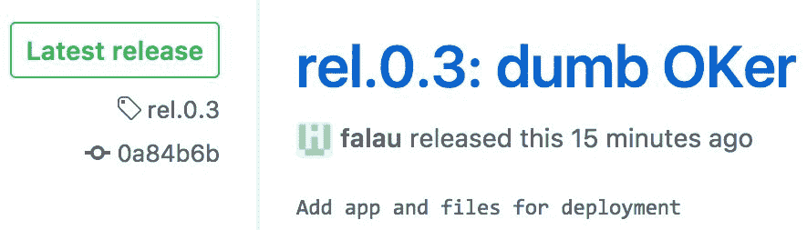
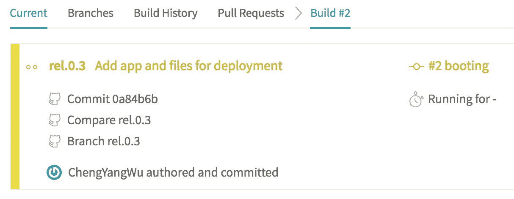
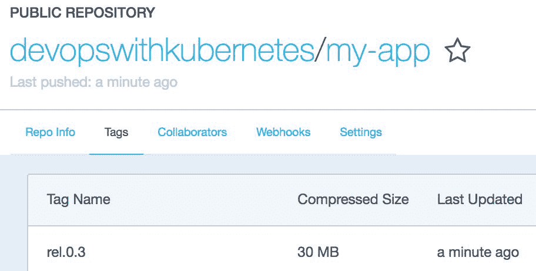
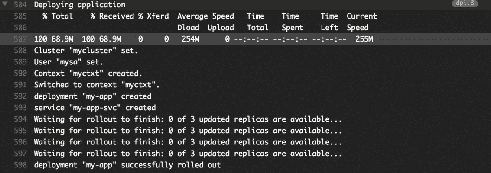

# 七、持续交付

我们到目前为止讨论的主题使我们能够在 Kubernetes 中运行我们的服务。有了监控系统，我们对服务更有信心了。要使我们的服务走上正轨，我们希望实现的下一件事是如何在 Kubernetes 中持续提供我们的最新功能以及对我们服务的改进，我们将在本章的以下主题中了解这一点:

*   更新 Kubernetes 资源
*   设置交付管道
*   改进部署过程的技术

# 更新资源

持续交付的属性与我们在[第 1 章](01.html#KVCC0-6c8359cae3d4492eb9973d94ec3e4f1e)、*介绍 DevOps* 中描述的一样，一套操作包括**持续集成** ( **CI** )和后续部署任务。配置项流程包括版本控制系统、建筑和不同级别的自动化测试等元素。实现 CI 功能的工具通常在应用层，它可以独立于底层基础设施，但是当涉及到实现部署时，理解和处理基础设施是不可避免的，因为部署任务与我们的应用运行的平台紧密相关。在软件在物理或虚拟机上运行的环境中，我们会利用配置管理工具、协调器和脚本来部署我们的软件。然而，如果我们在像 Heroku 这样的应用平台上运行服务，或者甚至在无服务器模式下运行服务，那么设计部署管道将是完全不同的情况。总之，部署任务的目标是确保我们的软件在正确的地方正常工作。在 Kubernetes 中，它是关于如何正确地更新资源，尤其是豆荚。

# 触发更新

在[第 3 章](03.html#22O7C0-6c8359cae3d4492eb9973d94ec3e4f1e)、*开始使用 Kubernetes* 中，我们已经讨论了部署的Pod 滚动更新机制。让我们回顾一下触发更新过程后会发生什么:

1.  部署根据更新的清单创建一个带有`0`Pod 的新`ReplicaSet`。
2.  新的`ReplicaSet`逐渐放大，而之前的`ReplicaSet`不断缩小。
3.  在所有旧的豆荚被替换后，该过程结束。

这样的机制是由 Kubernetes 自动完成的，它免除了我们对更新过程的监督。要触发它，我们只需要通知 Kubernetes 部署的 pod 规范已经更新，也就是说，修改 Kubernetes 中一个资源的清单。假设我们有一个部署`my-app`(参见本节示例目录下的`ex-deployment.yml`)，我们可以使用`kubectl`的子命令修改清单，如下所示:

*   `kubectl patch`:根据输入的 JSON 参数，部分修补对象的清单。如果我们想将`my-app`的形象从`alpine:3.5`更新为`alpine:3.6`，那就是:

```
$ kubectl patch deployment my-app -p '{"spec":{"template":{"spec":{"containers":[{"name":"app","image":"alpine:3.6"}]}}}}'
```

*   `kubectl set`:对对象的某些属性进行更改。这是直接更改某些属性的快捷方式，部署的映像是它支持的属性之一:

```
$ kubectl set image deployment my-app app=alpine:3.6
```

*   `kubectl edit`:打开一个编辑器，转储当前的清单，这样我们就可以交互编辑了。修改后的版本将在保存后立即生效。
*   `kubectl replace`:用另一个提交的模板文件替换一个清单。如果资源尚未创建或包含无法更改的属性，则会产生错误。例如，在我们的示例模板`ex-deployment.yml`中有两个资源，即部署`my-app`及其服务`my-app-svc`。让我们用一个新的规范文件来替换它们:

```
$ kubectl replace -f ex-deployment.yml
deployment "my-app" replaced
The Service "my-app-svc" is invalid: spec.clusterIP: Invalid value: "": field is immutable
$ echo $?
1
```

在它们被替换后，我们会看到错误代码将是`1`，即使结果是预期的，即更新部署而不是服务。当为配置项/光盘流编写自动化脚本时，尤其应该注意这种行为。

*   `kubectl apply`:还是应用清单文件。换句话说，如果一个资源存在于 Kubernetes 中，那么它将被更新，否则它将被创建。当`kubectl apply`用于创建资源时，在功能上大致相当于`kubectl create --save-config`。应用的规范文件将相应地保存到注释字段`kubectl.kubernetes.io/last-applied- configuration`，我们可以使用子命令`edit-last-applied`、`set-last-applied`和`view-last-applied`来操作它。例如，我们可以查看之前提交的模板，无论`ex-deployment.yml`的实际内容是什么:

```
$ kubectl apply -f ex-deployment.yml view-last-applied
```

保存的清单信息将与我们发送的信息完全相同，不像我们通过`kubectl get -o yaml/json`检索的信息，除了规范之外，它还包含对象的实时状态。

虽然在本节中，我们只关注于操作部署，但是这里的命令也用于更新所有其他 Kubernetes 资源，如服务、角色等。

Changes to `ConfigMap` and secret usually take seconds to propagate to pods.

推荐的与Kubernetes的应用编程接口服务器交互的方式是`kubectl`。如果你在一个受限的环境中，也有 REST APIs 来操纵 Kubernetes 的资源。例如，我们之前使用的`kubectl patch`命令将如下所示:

```
$ curl -X PATCH -H 'Content-Type: application/strategic-merge-patch+json' --data '{"spec":{"template":{"spec":{"containers":[{"name":"app","image":"alpine:3.6"}]}}}}' 'https://$KUBEAPI/apis/apps/v1beta1/namespaces/default/deployments/my-app'
```

这里变量`$KUBEAPI`是 API 服务器的端点。更多信息参见 API 参考:[https://kubernetes.io/docs/api-reference/v1.7/](https://kubernetes.io/docs/api-reference/v1.7/)。

# 管理推广

一旦推出过程被触发，Kubernetes将默默完成背景后面的所有任务。让我们尝试一些动手实验。同样，即使我们用前面提到的命令修改了一些东西，滚动更新过程也不会被触发，除非相关 pod 的规范被更改。我们准备的示例是一个简单的脚本，它会用主机名和运行它的 Alpine 版本来响应任何请求。我们首先创建部署，并在另一个终端中不断检查其响应:

```
$ kubectl apply -f ex-deployment.yml
deployment "my-app" created
service "my-app-svc" created
$ kubectl proxy
Starting to serve on 127.0.0.1:8001
// switch to another terminal #2
$ while :; do curl localhost:8001/api/v1/proxy/namespaces/default/services/my-app-svc:80/; sleep 1; 

done
my-app-3318684939-pwh41-v-3.5.2 is running...
my-app-3318684939-smd0t-v-3.5.2 is running...
...
```

现在我们把它的图像换成另一个版本，看看有什么反应:

```
$ kubectl set image deployment my-app app=alpine:3.6
deployment "my-app" image updated
// switch to terminal #2
my-app-99427026-7r5lr-v-3.6.2 is running...
my-app-3318684939-pwh41-v-3.5.2 is running...
...
```

来自 3.5 版和 3.6 版的消息是交错的，直到更新过程结束。为了从 Kubernetes 中立即确定更新过程的状态，而不是轮询服务端点，有`kubectl rollout`用于管理滚动更新过程，包括检查正在进行的更新的进度。让我们看看带有子命令`status`的“表演”卷展栏:

```
$ kubectl rollout status deployment my-app
Waiting for rollout to finish: 3 of 5 updated replicas are available...
Waiting for rollout to finish: 3 of 5 updated replicas are available...
Waiting for rollout to finish: 4 of 5 updated replicas are available...
Waiting for rollout to finish: 4 of 5 updated replicas are available...
deployment "my-app" successfully rolled out
```

此时，终端#2 的输出应该全部来自 3.6 版本。子命令`history`允许我们查看`deployment`之前的更改:

```
$ kubectl rollout history deployment my-app
REVISION    CHANGE-CAUSE
1           <none>
2           <none>  
```

但是`CHANGE-CAUSE`字段没有显示任何有助于我们了解修订细节的有用信息。为了利用它，在每个导致变化的命令后添加一个标志`--record`，比如我们前面介绍的。当然，`kubectl create`也支持记录旗。

让我们对部署做一些改变，比如修改`my-app`的Pod 的环境变量`DEMO`。因为它导致了 pod 规范的改变，所以将立即开始部署。这种行为允许我们在不构建新映像的情况下触发更新。为了简单起见，我们使用`patch`来修改变量:

```
$ kubectl patch deployment my-app -p '{"spec":{"template":{"spec":{"containers":[{"name":"app","env":[{"name":"DEMO","value":"1"}]}]}}}}' --record
deployment "my-app" patched
$ kubectl rollout history deployment my-app
deployments "my-app"
REVISION    CHANGE-CAUSE
1           <none>
2           <none>
3           kubectl patch deployment my-app --
patch={"spec":{"template":{"spec":{"containers":
[{"name":"app","env":[{"name":"DEMO","value":"1"}]}]}}}} --record=true  
```

`REVISION 3`的`CHANGE-CAUSE`清楚地记录了提交的命令。尽管如此，只有命令会被记录下来，这意味着`edit` / `apply` / `replace`的任何修改都不会被明确标记下来。如果我们想获得以前版本的清单，只要我们的更改是通过`apply`进行的，我们就可以检索保存的配置。

出于各种原因，有时我们希望回滚我们的应用，即使在一定程度上推广是成功的。可以通过子命令`undo`实现:

```
$ kubectl rollout undo deployment my-app
deployment "my-app" rolled back
```

整个过程基本上与更新相同，即应用以前的清单，并执行滚动更新。此外，我们可以利用标志`--to-revision=<REVISION#>`回滚到特定的版本，但是只有保留的修订才能回滚。Kubernetes 根据部署对象中的`revisionHistoryLimit`参数确定它将保留多少修订。

更新的进度由`kubectl rollout pause`和`kubectl rollout resume`控制。正如他们的名字所示，他们应该成对使用。部署的暂停不仅意味着停止正在进行的部署，还意味着冻结任何滚动更新，即使规范被修改，除非它被恢复。

# 正在更新 DaemonSet 和 StatefulSet

Kubernetes 支持为不同类型的工作负载编排 pods 的各种方法。除了部署，还有用于长时间运行的非批处理工作负载的`DaemonSet`和`StatefulSet`。由于它们产生的Pod 比部署有更多的限制，我们应该知道处理它们更新的注意事项

# daemmonset

`DaemonSet`顾名思义，是为系统守护进程设计的控制器。因此，一个`DaemonSet`在每个节点上恰好启动并维护一个Pod ，也就是说，一个`DaemonSet`的Pod 总数被附加到一个集群中的多个节点上。由于这些限制，更新`DaemonSet`并不像更新部署那样简单。例如，部署有一个`maxSurge`参数(`.spec.strategy.rollingUpdate.maxSurge`)，用于控制在更新过程中可以创建多少超过所需数量的冗余Pod 。但是我们不能对 pod 采用与`DaemonSet`通常占用主机资源(如端口)相同的策略。如果我们在一个节点上同时有两个或多个系统单元，这可能会导致错误。因此，更新的形式是在主机上终止旧 pod 后创建新 pod。

Kubernetes 为`DaemonSet`实现了两种更新策略，即`OnDelete`和`rollingUpdate`。一个演示如何编写`DaemonSet`模板的例子在`7-1_updates/ex-daemonset.yml`。更新策略设置在路径`.spec.` `updateStrategy` `.type`处，在 Kubernetes 1.7 中默认为`OnDelete`，从 Kubernetes 1.8 开始变为`rollingUpdate`:

*   `OnDelete` : Pods 只有手动删除后才会更新。
*   `rollingUpdate`:实际上和`OnDelete`一样工作，但是豆荚的删除是由 Kubernetes 自动执行的。有一个可选参数`.spec.updateStrategy.rollingUpdate.maxUnavailable`，类似于部署中的参数。它的默认值是`1`，这意味着 Kubernetes 一个节点一个节点地替换一个 pod。

滚动更新过程的触发器与部署的触发器相同。此外，我们还可以利用`kubectl rollout`来管理我们的`DaemonSet`的推出。但是不支持`pause`和`resume`。

Rolling updates for `DaemonSet` are only available at Kubernetes 1.6 and onward.

# StatefulSet

`StatefulSet`和`DaemonSet`的更新几乎是一样的——它们在更新过程中不会创建冗余的Pod ，它们的更新策略也是类似的。在`7-1_updates/ex-statefulset.yml`也有一个模板文件可以练习。更新策略的选项设置在路径`.spec.` `updateStrategy` `.type`:

*   `OnDelete` : Pods 只有手动删除后才会更新。
*   `rollingUpdate`:像每一次滚动更新一样，Kubernetes 以可控的方式删除和创建豆荚。但是Kubernetes知道`StatefulSet`中的顺序很重要，所以它会以相反的顺序替换豆荚。假设我们一个`StatefulSet`有三个Pod ，分别是`my-ss-0`、`my-ss-1`、`my-ss-2`。更新顺序从`my-ss-2`到`my-ss-0`开始。删除过程不尊重 pod 管理策略，也就是说，即使我们将 pod 管理策略设置为`Parallel`，更新仍然会一个接一个地进行。

类型`rollingUpdate`的唯一参数是分区(`.spec.updateStrategy.rollingUpdate.partition`)。如果指定了它，任何序号小于分区号的 pod 都会保持当前版本，不会被更新。例如，如果我们在一个有 3 个Pod 的`StatefulSet`中将其设置为 1，那么在首次展示后只有Pod -1 和Pod -2 会被更新。这个参数允许我们在一定程度上控制进度，对于等待数据同步、用金丝雀测试版本或者我们只想进行更新等场景来说，它特别方便。

Pod management policies and rolling updates are two features implemented in Kubernetes 1.7 and later.

# 建立输送管道

为容器化应用实现连续交付管道非常简单。让我们记住到目前为止我们对 Docker 和 Kubernetes 的了解，并将它们组织到 CD 管道中。假设我们已经完成了代码、Dockerfile 和相应的 Kubernetes 模板。要将它们部署到我们的集群，我们需要完成以下步骤:

1.  `docker build`:产生一个可执行的不可变工件。
2.  `docker run`:通过一些简单的测试来验证构建是否有效。

3.  `docker tag`:如果好的话，用有意义的版本标记构建。
4.  `docker push`:将构建移动到工件仓库进行分发。
5.  `kubectl apply`:将构建部署到所需的环境中。
6.  `kubectl rollout status`:跟踪部署任务的进度。

这就是一个简单但可行的交付管道的全部内容。

# 选择工具

为了使管道持续构建，我们至少需要三种工具，即版本控制系统、构建服务器和用于存储容器工件的存储库。在本节中，我们将基于我们在前面章节中介绍的 SaaS 工具设置一个参考光盘管道。分别是*GitHub*([https://github.com](https://github.com))*Travis CI*([https://Travis-ci.org](https://travis-ci.org))和*Docker Hub*([https://hub.docker.com](https://hub.docker.com))，都是免费开源项目。我们在这里使用的每一种工具都有许多替代方案，比如 VCS 的 GitLab，或者 CI 的 Jenkins。下图是我们基于前面三项服务的光盘流程:

>

工作流从将代码提交到 GitHub 上的存储库中开始，提交将调用 Travis CI 上的构建作业。我们的Docker形象就是在这个阶段建立起来的。同时，我们经常在配置项服务器上运行不同级别的测试，以确保构建的质量是可靠的。此外，由于通过 Docker Compose 或 Kubernetes 运行应用栈比以往任何时候都更容易，我们能够在构建作业中运行涉及许多组件的测试。之后，验证过的图像被标记上标识符，并被推送到公共 Docker 注册表服务 Docker Hub。

我们的管道中没有专用于部署任务的块。相反，我们依赖特拉维斯 CI 来部署我们的构建。事实上，部署任务只是在推送映像后，在某些构建上应用 Kubernetes 模板。最后，在 Kubernetes 的滚动更新过程结束后，交付就完成了。

# 步骤已解释

我们的例子`my-app`是一个不断回应`OK`的 web 服务，部署的代码和文件都提交到我们在 GitHub 的存储库中:([https://github.com/DevOps-with-Kubernetes/my-app](https://github.com/DevOps-with-Kubernetes/my-app))。

在 Travis CI 上配置我们的构建之前，让我们先在 Docker Hub 上创建一个映像存储库，以备后用。登录 Docker Hub 后，按下右上角巨大的“创建存储库”，然后按照屏幕上的步骤创建一个。推拉`my-app`的图像注册在`devopswithkubernetes/my-app`([https://hub.docker.com/r/devopswithkubernetes/my-app/](https://hub.docker.com/r/devopswithkubernetes/my-app/))。

将 Travis CI 与 GitHub 存储库连接起来非常简单，我们只需要授权 Travis CI 访问我们的 GitHub 存储库，并使 Travis CI 能够在配置文件页面([https://travis-ci.org/profile](https://travis-ci.org/profile))构建存储库。

Travis CI 中作业的定义配置在同一个存储库下的文件`.travis.yml`中。这是一个 YAML 格式的模板，由 shell 脚本块组成，告诉 Travis CI 在构建期间应该做什么。我们的`.travis.yml`([https://github . com/DevOps-wit-Kubernetes/my-app/blob/master/. Travis . yml](https://github.com/DevOps-with-Kubernetes/my-app/blob/master/.travis.yml))的区块说明如下:

# 包封/包围（动词 envelop 的简写）

本节定义了在整个构建过程中可见的环境变量:

```
DOCKER_REPO=devopswithkubernetes/my-app     BUILD_IMAGE_PATH=${DOCKER_REPO}:b${TRAVIS_BUILD_NUMBER}
RELEASE_IMAGE_PATH=${DOCKER_REPO}:${TRAVIS_TAG}
RELEASE_TARGET_NAMESPACE=default  
```

在这里，我们设置了一些可能会被更改的变量，如名称空间和构建映像的 docker 注册表路径。此外，还有以环境变量形式从 Travis CI 传递的关于构建的元数据，它们记录在这里:[https://docs . Travis-CI . com/user/Environment-Variables/# Default-Environment-Variables](https://docs.travis-ci.com/user/environment-variables/#Default-Environment-Variables)。例如，`TRAVIS_BUILD_NUMBER`代表当前构建的编号，我们用它作为一个标识符来区分我们跨构建的图像。

环境变量的另一个来源是在 Travis CI 上手动配置的。因为在那里配置的变量会被公开隐藏，所以我们在那里存储了一些敏感数据，比如 Docker Hub 和 Kubernetes 的凭证:


每个 CI 工具都有自己处理秘密的最佳实践。例如，一些配置项工具也允许我们将变量保存在配置项服务器中，但它们仍然会打印在构建日志中，因此在这种情况下，我们不太可能将机密保存在配置项服务器中。

# 脚本

这一部分是我们运行构建和测试的地方:

```
docker build -t my-app .
docker run --rm --name app -dp 5000:5000 my-app
sleep 10
CODE=$(curl -IXGET -so /dev/null -w "%{http_code}" localhost:5000)
'[ ${CODE} -eq 200 ] && echo "Image is OK"'
docker stop app  
```

当我们在 Docker 上时，构建只是一行脚本。我们的测试也很简单——用构建的映像启动一个容器，并对它提出一些请求，以确定它的正确性和完整性。当然，我们可以做任何事情，比如添加单元测试，进行多阶段构建，或者运行自动化集成测试，以便在这个阶段更好地生成工件。

# 成功后

只有在前一阶段结束时没有任何错误，才会执行该块。一旦它来到这里，我们就好发布我们的形象:

```
docker login -u ${CI_ENV_REGISTRY_USER} -p "${CI_ENV_REGISTRY_PASS}"
docker tag my-app ${BUILD_IMAGE_PATH}
docker push ${BUILD_IMAGE_PATH}
if [[ ${TRAVIS_TAG} =~ ^rel.*$ ]]; then
 docker tag my-app ${RELEASE_IMAGE_PATH}
 docker push ${RELEASE_IMAGE_PATH}
fi
```

我们的图像标签通常使用 Travis CI 上的内部版本号，但是使用提交的散列或版本号来标记图像也很常见。但是，强烈建议不要使用默认标签`latest`，因为这可能会导致版本混乱，例如运行两个不同的图像，但它们具有相同的名称。最后一个条件块是在特定的分支标签上发布图像，实际上并不需要，因为我们只想在单独的轨道上继续构建和发布。在推送图像之前，请记住向 Docker Hub 进行身份验证。

Kubernetes decides whether the image should be pulled by the `imagePullPolicy`: [https://kubernetes.io/docs/concepts/containeimg/#updating-images](https://kubernetes.io/docs/concepts/containeimg/#updating-images).

因为我们只在发布时将项目部署到实际的机器上，所以构建可能会在那个时候停止并返回。让我们看看这个构建的日志:[https://Travis-ci.org/DevOps-with-Kubernetes/my-app/builds/268053332](https://travis-ci.org/DevOps-with-Kubernetes/my-app/builds/268053332)。该日志保留了 Travis CI 执行的脚本和脚本每一行的输出:


正如我们所看到的，我们的构建是成功的，因此图像在这里发布:

[https://hub . docker . com/r/devpswithinhabits/my-app/tags/](https://hub.docker.com/r/devopswithkubernetes/my-app/tags/)。

构建引用标记`b1`，我们现在可以在 CI 服务器之外运行它:

```
$ docker run --name test -dp 5000:5000 devopswithkubernetes/my-app:b1
72f0ef501dc4c86786a81363e278973295a1f67555eeba102a8d25e488831813
$ curl localhost:5000
OK
```

# 部署

尽管我们可以实现端到端的全自动管道，但由于业务原因，我们经常会遇到阻碍部署构建的情况。因此，我们告诉 Travis CI 仅在发布新版本时运行部署脚本。

要从 Travis CI 操作 Kubernetes 集群中的资源，我们需要授予 Travis CI 足够的权限。我们的示例使用 RBAC 模式下的服务帐户`cd-agent`代表我们创建和更新部署。后面的章节会有更多关于 RBAC 的描述。创建帐户和权限的模板位于:[https://github . com/DevOps-wit-Kubernetes/examples/tree/master/chapter 7/7-2 _ service-account-for-ci-tool](https://github.com/DevOps-with-Kubernetes/examples/tree/master/chapter7/7-2_service-account-for-ci-tool)。该帐户在名称空间`cd`下创建，并被授权跨名称空间创建和修改大多数类型的资源。

Here we use a service account that is able to read and modify most resources across namespaces, including secrets of the whole cluster. Due to security concerns, its always encouraged to restrict permissions of a service account to resources the account actually used, or it could be a potential vulnerability.

因为 Travis CI 位于我们的集群之外，所以我们必须从 Kubernetes 导出凭据，以便我们可以配置 CI 作业来使用它们。在这里，我们提供了一个简单的脚本来帮助导出这些凭据。脚本位于:[https://github.com/DevOps-with-·Kubernetes/示例/blob/master/chapter 7/get-sa-token . sh](https://github.com/DevOps-with-Kubernetes/examples/blob/master/chapter7/get-sa-token.sh)。

```
$ ./get-sa-token.sh --namespace cd --account cd-agent
API endpoint:
https://35.184.53.170
ca.crt and sa.token exported
$ cat ca.crt | base64
LS0tLS1C...
$ cat sa.token
eyJhbGci...
```

导出的 API 端点、`ca.crt`、`sa.token`对应的变量分别为`CI_ENV_K8S_MASTER`、`CI_ENV_K8S_CA`、`CI_ENV_K8S_SA_TOKEN`。客户端证书(`ca.crt`)被编码为 base64 以便移植，它将在我们的部署脚本中被解码。

部署脚本([https://github.com/DevOps-with-Kubernetes/my- app/blob/master/deployment/deploy . sh](https://github.com/DevOps-with-Kubernetes/my-app/blob/master/deployment/deploy.sh))首先下载`kubectl`，并对`kubectl`进行相应的环境变量配置。然后，在部署模板中填充当前版本的映像路径，并应用模板。最后，在部署完成后，我们的部署就完成了。

让我们看看整个流程的运行情况。

一旦我们在 GitHub 发布了一个版本:

[https://github . com/devps-with-kublets/my-app/releases/tag/rel . 0.3](https://github.com/DevOps-with-Kubernetes/my-app/releases/tag/rel.0.3)



特拉维斯 CI 在那之后开始建立我们的工作:



一段时间后，构建的映像被推送到 Docker Hub 上:



此时，Travis CI 应该开始运行部署任务，让我们查看构建日志以了解我们部署的状态:

[https://Travis-ci . org/devo PS-wit-Kubernetes/my-app/builds/268107714](https://travis-ci.org/DevOps-with-Kubernetes/my-app/builds/268107714)



可以看到，我们的应用已经成功铺开，应该开始用`OK`欢迎大家了:

```
$ kubectl get deployment
NAME      DESIRED   CURRENT   UP-TO-DATE   AVAILABLE   AGE
my-app    3         3         3            3           30s
$ kubectl proxy &
$ curl localhost:8001/api/v1/namespaces/default/services/my-app-svc:80/proxy/
OK
```

我们在本节中构建和演示的管道是在 Kubernetes 中连续交付代码的经典流程。尽管如此，由于不同团队的工作风格和文化不同，为您的团队设计一个量身定制的持续交付管道会提高效率。

# 加深对豆荚的理解

虽然出生和死亡只是一个生命周期中的一个瞬间，但它们是服务中最脆弱的一点。现实世界中常见的情况，比如将请求路由到一个未准备好的盒子，或者残忍地切断所有与终端机器的空中连接，都是我们想要避免的。因此，即使是 Kubernetes 也为我们处理了大多数事情，我们应该知道如何正确配置它，以便在部署时获得更大的信心。

# 启动Pod 

默认情况下，一旦Pod 启动，Kubernetes 就会将Pod 的状态转换为“正在运行”。如果 pod 在服务后面，端点控制器会立即向 Kubernetes 注册一个端点。稍后 kube-proxy 会观察端点的变化，并相应地向 iptables 添加规则。来自外部世界的请求现在转到了 pods。Kubernetes 使 pod 注册变得非常快，所以变化是请求在应用准备就绪之前到达 pod，尤其是在庞大的软件上。另一方面，如果一个Pod 在运行中出现故障，我们应该有一个自动的方法来立即移除它。

The `minReadySeconds` field of Deployment and other controllers doesn't postpone a pod from becoming ready. Instead, it delays a pod from becoming available, which is meaningful during a rollout process: a rollout is successful only when all pods are available.

# 活跃度和就绪性探测器

探测器是容器健康的指示器。它通过 kubelet 定期对容器执行诊断操作来判断健康状况:

*   **活跃度** **探头**:表示容器是否还活着。如果一个容器在这个探测器上失败了，kubelet 会杀死它，并可能基于一个容器的`restartPolicy`重新启动它。
*   **准备状态探测器**:指示容器是否准备好接收交通。如果服务后面的 pod 还没有准备好，那么直到 pod 准备好，它的端点才会被创建。

`retartPolicy` tells how Kubernetes treats a pod on failures or terminations. It has three modes: `Always`, `OnFailure`, or `Never`. Default is set to `Always`.

可以配置三种操作处理程序来针对容器执行:

*   `exec`:在容器内部执行定义的命令。退出代码为`0`视为成功。
*   `tcpSocket`:通过 TCP 测试给定端口，如果端口打开则成功。
*   `httpGet`:对目标容器的 IP 地址执行`HTTP GET`。要发送的请求中的头是可定制的。如果状态代码满足:`400 > CODE >= 200`，则该检查被认为是健康的。

此外，有五个参数可以定义探测器的行为:

*   `initialDelaySeconds`:在第一次探查之前，kubelet 应该等待多长时间。
*   `successThreshold`:当连续探测成功次数超过该阈值时，容器被认为是健康的。
*   `failureThreshold`:同上，但定义了负边。
*   `timeoutSeconds`:单个探头动作的时间限制。
*   `periodSeconds`:探测动作之间的间隔。

下面的代码片段演示了就绪探测器的用法，完整的模板在这里:[https://github.com/DevOps-with-·Kubernetes/示例/blob/master/chapter 7/7-3 _ on _ pods/probe . yml](https://github.com/DevOps-with-Kubernetes/examples/blob/master/chapter7/7-3_on_pods/probe.yml)

```
...
 containers:
 - name: main
 image: devopswithkubernetes/my-app:b5
 readinessProbe:
 httpGet:
 path: /
 port: 5000
 periodSeconds: 5
 initialDelaySeconds: 10
 successThreshold: 2
 failureThreshold: 3 
 timeoutSeconds: 1
 command:
...
```

下图说明了探针的行为:


上面的时间线是一个Pod 的真正准备状态，下面的另一条线是在Kubernetes看来它的准备状态。第一次探测在 pod 创建后 10 秒执行，在两次探测成功后 pod 被视为就绪。几秒钟后，Pod 由于未知原因停止工作，在接下来的三次故障后，它变得没有准备好。尝试部署前面的示例并观察其输出:

```
...
Pod is created at 1505315576
starting server at 1505315583.436334
1505315586.443435 - GET / HTTP/1.1
1505315591.443195 - GET / HTTP/1.1
1505315595.869020 - GET /from-tester
1505315596.443414 - GET / HTTP/1.1
1505315599.871162 - GET /from-tester
stopping server at 1505315599.964793
1505315601 readiness test fail#1
1505315606 readiness test fail#2
1505315611 readiness test fail#3
...
```

在我们的示例文件中，还有另一个 pod `tester`，它不断地向我们的服务发出请求，而我们服务中的日志条目`/from-tester`就是由其测试人员引起的。从测试仪的活动日志中，我们可以观察到来自`tester`的流量在我们的服务未准备就绪后被停止:

```
$ kubectl logs tester
1505315577 - nc: timed out
1505315583 - nc: timed out
1505315589 - nc: timed out
1505315595 - OK
1505315599 - OK
1505315603 - HTTP/1.1 500
1505315607 - HTTP/1.1 500
1505315612 - nc: timed out
1505315617 - nc: timed out
1505315623 - nc: timed out
...
```

由于我们没有在服务中配置活跃度探测器，不健康的容器不会被重新启动，除非我们手动杀死它。因此，一般来说，我们会同时使用两个探针，从而使愈合过程自动化。

# 初始化容器

即使`initialDelaySeconds`允许我们在接收流量之前封锁一个Pod 一段时间，它仍然是有限的。想象一下，如果我们的应用正在提供一个在初始化时从某个地方获取的文件，那么准备时间可能会因文件大小而有很大不同。因此，初始化容器在这里就派上了用场。

Init 容器是一个或多个容器，它们在应用容器之前启动，并按顺序一个接一个地运行到完成。如果任何一个容器出现故障，它会以一个容器的`restartPolicy`为准，重新开始，直到所有容器都以代码`0`退出。

定义初始化容器类似于常规容器:

```
...
spec:
 containers:
 - name: my-app
 image: <my-app>
 initContainers:
 - name: init-my-app
 image: <init-my-app>
...
```

它们的不同之处仅在于:

*   Init 容器没有就绪探测器，因为它们会一直运行到完成
*   初始化容器中定义的端口不会被 pod 前面的服务捕获
*   资源的请求/限制用`max(sum(regular containers), max(init containers))`计算，这意味着如果一个初始化容器设置了比其他初始化容器更高的资源限制以及所有常规容器的资源限制之和，Kubernetes 根据初始化容器的资源限制调度 pod

init 容器的用处不仅仅是阻塞应用容器。例如，我们可以利用它们来配置一个映像，方法是共享一个`emptyDir`卷到 Init 容器和应用容器，而不是构建另一个只在基础映像上运行`awk` / `sed`的映像，在 Init 容器而不是应用容器中安装和使用秘密。

# 终止Pod 

关闭事件的顺序类似于启动 pod 时的事件。接收到删除调用后，Kubernetes 向待删除的 pod 发送`SIGTERM`，pod 的状态变为终止。与此同时，如果 pod 正在支持一项服务，Kubernetes 会删除该 pod 的端点以停止进一步的请求。有时候，有些豆荚根本不会放弃。这可能是Pod 不尊重`SIGTERM`，或者仅仅是因为他们的任务没有完成。在这种情况下，Kubernetes会派一个`SIGKILL`在终止期后强行杀死那些豆荚。在 pod 规范下，周期长度设置在`.spec.terminationGracePeriodSeconds`。尽管如此，尽管 Kubernetes 有回收这种豆荚的机制，我们仍然应该确保我们的豆荚可以被正确关闭。

此外，就像启动 pod 一样，这里我们还需要处理一个可能影响我们服务的情况，也就是说，在相应的 iptables 规则被完全移除之前，在 pod 中服务请求的过程被关闭。

# 处理 SIGTERM

优雅的终止并不是一个新的想法，它是编程中的一种常见做法，对于关键业务任务尤其重要。

实施主要包括三个步骤:

1.  添加一个处理程序来捕获终止信号。
2.  执行处理程序中要求的所有操作，如返回资源、释放分发锁或关闭连接。
3.  程序关闭。我们前面的例子演示了这个想法:关闭处理程序`graceful_exit_handler`中`SIGTERM`上的控制器线程。代码可以在这里找到。

事实上，未能顺利退出的常见陷阱不在程序方面:

# SIGTERM 不会被转发到容器进程

在[第 2 章](02.html#1CQAE0-6c8359cae3d4492eb9973d94ec3e4f1e)、 *DevOps with Container* 中，我们了解到在编写 Dockerfile 时有两种形式可以调用我们的程序，即 shell 形式和 exec 形式，运行 shell 形式命令的 shell 在 Linux 容器上默认为`/bin/sh`。让我们看看下面的例子([https://github.com/DevOps-with-·Kubernetes/例子/树/主/第 7 章/7-3 _ on _ pods/manner _ docker](https://github.com/DevOps-with-Kubernetes/examples/tree/master/chapter7/7-3_on_pods/graceful_docker)):

```
--- Dockerfile.shell-sh ---
FROM python:3-alpine
EXPOSE 5000
ADD app.py .
CMD python -u app.py
```

我们知道发送到容器的信号会被容器内的`PID 1`进程捕获，所以让我们构建并运行它。

```
$ docker run -d --rm --name my-app my-app:shell-sh
8962005f3722131f820e750e72d0eb5caf08222bfbdc5d25b6f587de0f6f5f3f 
$ docker logs my-app
starting server at 1503839211.025133
$ docker kill --signal TERM my-app
my-app
$ docker ps --filter name=my-app --format '{{.Names}}'
my-app
```

我们的容器还在。让我们看看容器内发生了什么:

```
$ docker exec my-app ps
PID   USER     TIME    COMMAND
1     root      0:00  /bin/sh -c python -u app.py
5     root      0:00  python -u app.py
6     root      0:00  ps  
```

`PID 1`进程就是外壳本身，它显然不会把我们的信号转发给子进程。在这个例子中，我们使用 Alpine 作为基础图像，它使用`ash`作为默认外壳。如果我们用`/bin/sh`执行任何事情，它实际上与`ash`相关联。同样，Debian 家族的默认外壳是`dash`，它也不转发信号。还有一个转发信号的外壳，比如`bash`。为了利用`bash`，我们可以安装一个额外的外壳，或者将基本图像切换到使用`bash`的发行版。但是两者都相当麻烦。

相反，仍然有不使用`bash`来解决信号问题的选项。一个是用 shell 形式的`exec`运行我们的程序:

```
CMD exec python -u app.py
```

我们的流程将取代外壳流程，从而成为`PID 1`流程。另一个选择也是推荐的选择是用 EXEC 形式写`Dockerfile`:

```
CMD [ "python", "-u", "app.py" ] 
```

让我们用 EXEC 形式的例子再次尝试这个例子:

```
---Dockerfile.exec-sh---
FROM python:3-alpine
EXPOSE 5000
ADD app.py .
CMD [ "python", "-u", "app.py" ]
---
$ docker run -d --rm --name my-app my-app:exec-sh
5114cabae9fcec530a2f68703d5bc910d988cb28acfede2689ae5eebdfd46441
$ docker exec my-app ps
PID   USER     TIME   COMMAND
1     root       0:00  python -u app.py
5     root       0:00  ps
$ docker kill --signal TERM my-app && docker logs -f my-app
my-app
starting server at 1503842040.339449
stopping server at 1503842134.455339 
```

执行表单的工作方式很有魅力。正如我们所看到的，容器中的进程是我们所预期的，我们的处理程序现在正确接收`SIGTERM`。

# SIGTERM 不调用终止处理程序

在某些情况下，进程的终止处理程序不是由`SIGTERM`触发的。例如，向 nginx 发送`SIGTERM`实际上会导致快速关机。为了优雅地关闭 nginx 控制器，我们必须用`nginx -s quit`代替`SIGQUIT`发送。

The full list of supported actions on the signal of nginx is listed here: [http://nginx.org/en/docs/control.html](http://nginx.org/en/docs/control.html).

现在又出现了另一个问题——在删除一个 pod 时，我们如何向容器发送除`SIGTERM`以外的信号？我们可以修改程序的行为来捕获 SIGTERM，但是对于像 nginx 这样的流行工具，我们无能为力。对于这种情况，生命周期挂钩能够解决问题。

# 容器生命周期挂钩

生命周期挂钩是针对容器执行的事件感知操作。它们像一个单独的 Kubernetes 探测动作一样工作，但是在容器的生命周期中，每个事件至少会触发一次。目前，支持两个事件:

*   `PostStart`:创建容器后立即执行。因为这个钩子和容器的入口点是异步触发的，所以不能保证钩子会在容器启动之前执行。因此，我们不太可能使用它来初始化容器的资源。
*   `PreStop`:在将`SIGTERM`发送到容器之前立即执行。与`PostStart`钩子的一个区别是`PreStop`钩子是同步调用，换句话说，`SIGTERM`只是在`PreStop`钩子退出后发送。

因此，我们的 nginx 停机问题可以通过`PreStop`挂钩轻松解决:

```
...
 containers:
 - name: main
 image: nginx
 lifecycle:
 preStop:
 exec:
 command: [ "nginx", "-s", "quit" ]
... 
```

此外，钩子的一个重要特性是它们可以在某些方面影响Pod 的状态:Pod 不会运行，除非它的`PostStart`钩子成功退出；删除时 pod 被设置为立即终止，但是`SIGTERM`不会被发送，除非`PreStop`钩子成功退出。因此，对于我们前面提到的情况，容器在其 iptables 规则被移除之前退出，我们可以通过`PreStop`钩子解决它。下图说明了如何使用钩子消除不需要的间隙:


实现只是添加了一个休眠几秒钟的钩子:

```
...
 containers:
 - name: main
 image: my-app
 lifecycle:
 preStop:
 exec:
 command: [ "/bin/sh", "-c", "sleep 5" ]
...
```

# 放置豆荚

大多数情况下，我们并不关心我们的 pods 在哪个节点上运行，因为调度 pods 是 Kubernetes 的一个基本特性。然而，在调度 pod 时，Kubernetes 并不知道节点的地理位置、可用性区域或机器类型等因素。此外，有时我们希望在一个独立的实例组中部署运行测试构建的 pods。因此，为了完成调度，Kubernetes 提供了不同级别的相似性，允许我们主动地将Pod 分配给特定的节点。

pod 的节点选择器是手动放置 pod 的最简单方法。它类似于服务的 pod 选择器。pod 只能放在标签匹配的节点上。该字段设置为`.spec.nodeSelector`。例如，以下 pod 的片段`spec`将 pod 调度到带有标签`purpose=sandbox,disk=ssd`的节点。

```
...
 spec:
 containers:
 - name: main
 image: my-app
 nodeSelector:
 purpose: sandbox
 disk: ssd
...
```

检查节点上的标签与我们检查 Kubernetes 中其他资源的方式相同:

```
$ kubectl describe node gke-my-cluster-ins-49e8f52a-lz4l
Name:       gke-my-cluster-ins-49e8f52a-lz4l
Role:
Labels:   beta.kubernetes.io/arch=amd64
 beta.kubernetes.io/fluentd-ds-ready=true
 beta.kubernetes.io/instance-type=g1-small
 beta.kubernetes.io/os=linux
 cloud.google.com/gke-nodepool=ins
 failure-domain.beta.kubernetes.io/region=us-  
          central1
 failure-domain.beta.kubernetes.io/zone=us-
          central1-b
 kubernetes.io/hostname=gke-my-cluster-ins- 
          49e8f52a-lz4l
... 
```

如我们所见，我们的节点上已经有标签了。这些标签是默认设置的，默认标签如下:

*   `kubernetes.io/hostname`
*   `failure-domain.beta.kubernetes.io/zone`
*   `failure-domain.beta.kubernetes.io/region`
*   `beta.kubernetes.io/instance-type`
*   `beta.kubernetes.io/os`
*   `beta.kubernetes.io/arch`

如果我们想要标记一个节点来安排我们的示例 pods，我们可以更新该节点的清单或者使用快捷命令`kubectl label`:

```
$ kubectl label node gke-my-cluster-ins-49e8f52a-lz4l \
 purpose=sandbox disk=ssd
node "gke-my-cluster-ins-49e8f52a-lz4l" labeled
$ kubectl get node --selector purpose=sandbox,disk=ssd
NAME                               STATUS    AGE       VERSION
gke-my-cluster-ins-49e8f52a-lz4l   Ready     5d        v1.7.3
```

除了将豆荚放在一个节点上，一个节点也可以拒绝豆荚，也就是*污染和容忍*，我们将在下一章学习。

# 摘要

在本章中，我们不仅讨论了构建连续交付管道的主题，还讨论了加强每个部署任务的技术。pods 的滚动更新是一个强大的工具，它以受控的方式执行更新。要触发滚动更新，我们需要做的是更新 pod 的规范。虽然更新是由 Kubernetes 管理的，但是我们还是可以用`kubectl rollout`来控制。

后来，我们通过`GitHub/DockerHub/Travis-CI`制造了一个可扩展的连续输送管道。接下来，我们移动我们的步骤，以了解更多关于 pod 的生命周期，以防止任何可能的故障，包括使用就绪和活性探针来保护 pod，用 Init 容器初始化 pod，通过在 exec 表单中写入`Dockerfile`来正确处理`SIGTERM`，利用生命周期挂钩来停止 pod 的就绪及其终止，以便在正确的时间移除 iptables 规则，以及使用节点选择器将 pod 分配给特定节点。

在下一章中，我们将学习如何用逻辑边界分割我们的集群，以便在 Kubernetes 中更稳定和安全地共享资源。