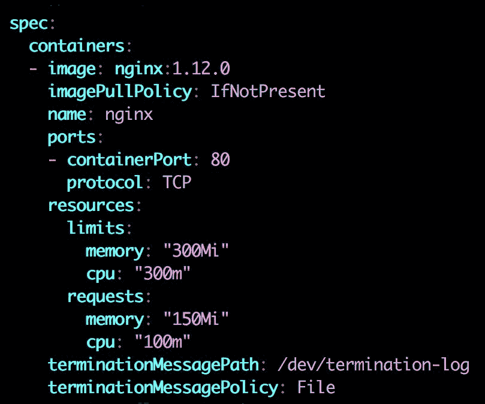

# 八、集群管理

在前面的章节中，我们已经通过 Kubernetes 学习了大部分基本的 DevOps 技能，从如何将我们的应用容器化到通过连续部署将我们的容器化软件无缝部署到 Kubernetes 中。现在，是时候深入了解如何管理 Kubernetes 集群了。

在本章中，我们将学习:

*   如何利用命名空间来设置管理边界
*   使用 kubeconfig 在多个集群之间切换
*   Kubernetes 身份验证
*   不可否认的授权

虽然 minikube 是一个相当简单的环境，但是我们将使用**谷歌容器引擎** ( **GKE** )和 AWS 中的自托管集群作为例子，而不是本章中的 minikube。详细设置请参考 AWS 上的[第 9 章](09.html#6NGV40-6c8359cae3d4492eb9973d94ec3e4f1e)、 *Kubernetes，以及 GCP* 上的[第 10 章](10.html#7BHQU0-6c8359cae3d4492eb9973d94ec3e4f1e)、 *Kubernetes。*

# 不可组合的命名空间

Kubernetes 有一个命名空间概念，将资源从一个物理集群划分到多个虚拟集群。这样，不同的组可以隔离共享同一个物理集群。每个命名空间提供:

*   名称范围；每个命名空间中的对象名都是唯一的
*   确保可信身份验证的策略
*   能够为资源管理设置资源配额

名称空间非常适合同一公司的不同团队或项目，因此不同的组可以有自己的虚拟集群，它们具有资源隔离，但共享同一个物理集群。一个命名空间中的资源对于其他命名空间是不可见的。不同的资源配额可以设置为不同的名称空间，并提供不同级别的服务质量。请注意，并非所有对象都在一个命名空间中，例如属于整个集群的节点和持久卷。

# 默认命名空间

默认情况下，Kubernetes 有三个名称空间:`default`、`kube-system`和`kube-public`。`default`命名空间包含在没有指定任何命名空间的情况下创建的对象，`kube-system`包含由 Kubernetes 系统创建的对象，通常由系统组件使用，如 Kubernetes 仪表板或 Kubernetes DNS。`kube-public`是 1.6 新推出的，意在定位大家都可以访问的资源。它现在主要关注公共配置图，比如集群信息。

# 创建新的命名空间

让我们看看如何创建命名空间。命名空间也是一个 Kubernetes 对象。我们可以像其他对象一样指定名称空间的类型。下面是创建一个命名空间`project1`的示例:

```
// configuration file of namespace
# cat 8-1-1_ns1.yml
apiVersion: v1
kind: Namespace
metadata:
name: project1

// create namespace for project1
# kubectl create -f 8-1-1_ns1.yml
namespace "project1" created

// list namespace, the abbreviation of namespaces is ns. We could use `kubectl get ns` to list it as well.
# kubectl get namespaces
NAME          STATUS    AGE
default       Active    1d
kube-public   Active    1d
kube-system   Active    1d
project1      Active    11s
```

然后让我们尝试通过在`project1`命名空间中部署来启动两个 nginx 容器:

```
// run a nginx deployment in project1 ns
# kubectl run nginx --image=nginx:1.12.0 --replicas=2 --port=80 --namespace=project1 
```

当我们按`kubectl get pods`列出豆荚时，我们在集群中将什么也看不到。为什么呢？因为 Kubernetes 使用当前上下文来决定哪个命名空间是当前的。如果我们没有在上下文或`kubectl`命令行中明确指定名称空间，将使用`default`名称空间:

```
// We'll see the Pods if we explicitly specify --namespace
# kubectl get pods --namespace=project1
NAME                     READY     STATUS    RESTARTS   AGE
nginx-3599227048-gghvw   1/1       Running   0          15s
nginx-3599227048-jz3lg   1/1       Running   0          15s  
```

You could use `--namespace <namespace_name>`, `--namespace=<namespace_name>`, `-n <namespace_name>` or `-n=<namespace_name>` to specify the namespace for a command. To list the resources across namespaces, use `--all-namespaces` parameter.

另一种方法是将当前上下文更改为指向所需的命名空间，而不是默认命名空间。

# 语境

**上下文**是集群信息、用于认证的用户和名称空间的组合的概念。例如，以下是我们在 GKE 的一个集群的上下文信息:

```
- context:
cluster: gke_devops-with-kubernetes_us-central1-b_cluster
user: gke_devops-with-kubernetes_us-central1-b_cluster
name: gke_devops-with-kubernetes_us-central1-b_cluster  
```

我们可以使用`kubectl config current-context`命令查看当前上下文:

```
# kubectl config current-context
gke_devops-with-kubernetes_us-central1-b_cluster
```

To list all config info including contexts, you could use the `kubectl config view` command; to checkout what context is currently in use, use `kubectl config get-contexts` command.

# 创建上下文

下一步是创建一个上下文。与前面的例子一样，我们需要为上下文设置一个用户名和集群名。如果我们不指定这些，空值将被设置。创建上下文的命令是:

```
$ kubectl config set-context <context_name> --namespace=<namespace_name> --cluster=<cluster_name> --user=<user_name>  
```

可以在同一个群集中创建多个上下文。以下是如何在我的 GKE 集群`gke_devops-with-kubernetes_us-central1-b_cluster`中为`project1`创建上下文的示例:

```
// create a context with my GKE cluster
# kubectl config set-context project1 --namespace=project1 --cluster=gke_devops-with-kubernetes_us-central1-b_cluster --user=gke_devops-with-kubernetes_us-central1-b_cluster
Context "project1" created.  
```

# 切换当前上下文

然后我们可以通过`use-context`子命令切换上下文:

```
# kubectl config use-context project1
Switched to context "project1".  
```

上下文切换后，我们通过`kubectl`调用的每个命令都在`project1`上下文下。我们不需要显式指定名称空间来查看我们的 pods:

```
// list pods
# kubectl get pods
NAME                     READY     STATUS    RESTARTS   AGE
nginx-3599227048-gghvw   1/1       Running   0          3m
nginx-3599227048-jz3lg   1/1       Running   0          3m  
```

# 资源配额

默认情况下，Kubernetes 中的豆荚是资源无限的。那么运行中的 pods 可能会耗尽集群中的所有计算或存储资源。ResourceQuota 是一个资源对象，它允许我们限制命名空间可以使用的资源消耗。通过设置资源限制，我们可以减少噪音邻居症状。为`project1`工作的团队不会耗尽物理集群中的所有资源。

然后，我们可以确保在共享同一物理集群的其他项目中工作的其他团队的服务质量。Kubernetes 1.7 支持三种资源配额。每种包括不同的资源名称，([https://kubernetes.io/docs/concepts/policy/resource-quotas](https://kubernetes.io/docs/concepts/policy/resource-quotas)):

*   计算资源配额(中央处理器、内存)
*   存储资源配额(请求的存储，永久卷声明)
*   对象计数配额(pod、RCs、配置映射、服务、负载平衡器)

创建的资源不会受到新创建的资源配额的影响。如果资源创建请求超过指定的资源配额，资源将无法启动。

# 为命名空间创建资源配额

现在，让我们学习`ResourceQuota`的语法。下面是一个例子:

```
# cat 8-1-2_resource_quota.yml
apiVersion: v1
kind: ResourceQuota
metadata:
 name: project1-resource-quota
spec:
 hard:# the limits of the sum of memory request
 requests.cpu: "1"               # the limits of the sum   
   of requested CPU
   requests.memory: 1Gi            # the limits of the sum  
   of requested memory 
   limits.cpu: "2"           # the limits of total CPU  
   limits
   limits.memory: 2Gi        # the limits of total memory 
   limit 
   requests.storage: 64Gi    # the limits of sum of 
   storage requests across PV claims
   pods: "4"                 # the limits of pod number   
```

模板和其他物体一样，只是这种变成了`ResourceQuota`。我们指定的配额对处于成功或失败状态(即非终端状态)的 pod 有效。支持多种资源限制。在前面的示例中，我们演示了如何设置计算资源配额、存储资源配额和对象计数配额。任何时候，我们仍然可以使用`kubectl`命令来检查我们设置的配额:`kubectl describe resourcequota <resource_quota_name>`。

现在让我们通过命令`kubectl edit deployment nginx`修改我们现有的 nginx 部署，将副本从`2`更改为`4`并保存。让我们现在列出州。

```
# kubectl describe deployment nginx
Replicas:         4 desired | 2 updated | 2 total | 2 available | 2 unavailable
Conditions:
 Type                  Status      Reason
 ----                  ------      ------
 Available             False MinimumReplicasUnavailable
 ReplicaFailure  True  FailedCreate  
```

这表明一些Pod 在创建时失败了。如果我们检查相应的复制集，我们可以找出原因:

```
# kubectl describe rs nginx-3599227048
...
Error creating: pods "nginx-3599227048-" is **forbidden**: failed quota: project1-resource-quota: must specify limits.cpu,limits.memory,requests.cpu,requests.memory  
```

由于我们已经指定了内存和 CPU 的请求限制，Kubernetes 不知道新希望的三个 pod 的默认请求限制。我们可以看到最初的两个Pod 仍在运行，因为资源配额不适用于现有资源。我们现在使用`kubectl edit deployment nginx`修改容器规格，如下所示:



这里，我们在 pod 规范中指定了对 CPU 和内存的请求和限制。它表示 pod 不能超过指定的配额，否则将无法启动:

```
// check the deployment state
# kubectl get deployment
NAME      DESIRED   CURRENT   UP-TO-DATE   AVAILABLE   AGE
nginx     4         3         2            3           2d  
```

可用的豆荚变成了四个而不是两个，但是仍然不等于我们想要的四个。出了什么问题？如果我们后退一步，检查我们的资源配额，我们可以发现我们已经使用了所有的豆荚配额。由于默认情况下部署使用滚动更新部署机制，因此需要大于 4 的 pod 号，这正是我们之前设置的对象限制:

```
# kubectl describe resourcequota project1-resource-quota
Name:             project1-resource-quota
Namespace:        project1
Resource          Used  Hard
--------          ----  ----
limits.cpu        900m  4
limits.memory     900Mi 4Gi
pods              4     4
requests.cpu      300m  4
requests.memory   450Mi 16Gi
requests.storage  0     64Gi  
```

通过`kubectl edit resourcequota project1-resource-quota`命令将Pod 配额从`4`修改为`8`后，部署有足够的资源启动Pod 。一旦`Used`配额超过`Hard`配额，资源配额接纳控制器将拒绝该请求，否则，将更新资源配额使用以确保充足的资源分配。

Since ResourceQuota won't affect already created resources, sometimes we might need to tweak the failed resources, such as deleting an empty change set of RS or scale up and down Deployment, in order to let Kubernetes create new pods or RS which will soak the latest quota limits.

# 具有默认计算资源限制的请求单元

我们还可以为名称空间指定默认的资源请求和限制。如果我们在 pod 创建期间没有指定请求和限制，将使用默认设置。诀窍是使用`LimitRange`资源对象。一个`LimitRange`对象包含一组`defaultRequest`(请求)和`default`(限制)。

LimitRange is controlled by the LimitRanger admission controller plugin. Be sure you enable it if you launch a self-hosted solution. For more information, check out the admission controller section in this chapter.

下面是我们设置`cpu.request`为`250m`、`limits`为`500m`、`memory.request`为`256Mi`、`limits`为`512Mi`的例子:

```
# cat 8-1-3_limit_range.yml
apiVersion: v1
kind: LimitRange
metadata:
 name: project1-limit-range
spec:
 limits:
 - default:
 cpu: 0.5
 memory: 512Mi
 defaultRequest:
 cpu: 0.25
 memory: 256Mi
 type: Container

// create limit range
# kubectl create -f 8-1-3_limit_range.yml
limitrange "project1-limit-range" created  
```

当我们在这个名称空间中启动 pods 时，我们不需要随时指定`cpu`和`memory`请求以及`limits`，即使我们在 ResourceQuota 中设置了总限制。

The unit of CPU is core, which is an absolute quantity. It can be an AWS vCPU, a GCP core or a hyperthread on a machine with hyperthreading processor equipped. The unit of memory is a byte. Kubernetes uses the first alphabet or power-of-two equivalents. For example, 256M would be written as 256,000,000, 256 M or 244 Mi.

此外，我们可以在“限制范围”中设置 pod 的最小和最大 CPU 和内存值。它作为默认值的作用不同。默认值仅在 pod 规范不包含任何请求和限制时使用。最小和最大约束用于验证 pod 是否请求过多资源。语法是`spec.limits[].min`和`spec.limits[].max`。如果请求超过最小值和最大值，将从服务器中抛出禁止。

```
limits: 
   - max: 
      cpu: 1 
      memory: 1Gi 
     min: 
      cpu: 0.25 
      memory: 128Mi 
    type: Container 
```

Quality of service for pods: There are three QoS classes for pods in Kubernetes: Guaranteed, Burstable and BestEffort. It's tied together with the namespace and resource management concept we learned above. We also learned QoS in [Chapter 4](04.html#3279U0-6c8359cae3d4492eb9973d94ec3e4f1e), *Working with Storage and Resources*. Please refer to the last section *Kubernetes Resource Management* in [Chapter 4](04.html#3279U0-6c8359cae3d4492eb9973d94ec3e4f1e), *Working with Storage and Resources* for recap.

# 删除命名空间

就像任何其他资源一样，删除一个名称空间就是`kubectl delete namespace <namespace_name>`。请注意，如果删除一个命名空间，与该命名空间相关联的所有资源都将被收回。

# 忽必烈忽必烈忽必烈忽必烈忽必烈忽必烈忽必烈忽必烈忽必烈忽必烈忽必烈忽必烈忽必烈忽必烈忽必烈忽必烈

Kubeconfig 是一个文件，您可以使用它通过切换上下文来切换多个集群。我们可以使用`kubectl config view`查看设置。以下是`kubeconfig`文件中 minikube 集群的示例。

```
# kubectl config view
apiVersion: v1
clusters:  
- cluster:
 certificate-authority: /Users/k8s/.minikube/ca.crt
 server: https://192.168.99.100:8443
 name: minikube
contexts:
- context:
 cluster: minikube
 user: minikube
 name: minikube
current-context: minikube
kind: Config
preferences: {}
users:
- name: minikube
 user:
 client-certificate: /Users/k8s/.minikube/apiserver.crt
 client-key: /Users/k8s/.minikube/apiserver.key
```

就像我们之前学的一样。我们可以使用`kubectl config use-context`来切换集群进行操作。我们也可以使用`kubectl config --kubeconfig=<config file name>`来指定我们想要使用哪个`kubeconfig`文件。将只使用指定的文件。我们也可以通过环境变量`$KUBECONFIG`来指定`kubeconfig`文件。这样，配置文件可以被合并。例如，以下命令将合并`kubeconfig-file1`和`kubeconfig-file2`:

```
# export KUBECONFIG=$KUBECONFIG: kubeconfig-file1: kubeconfig-file2  
```

你可能会发现我们之前没有做任何特定的设置。那么`kubectl config view`的输出来自哪里呢？默认情况下，它存在于`$HOME/.kube/config`下。如果没有设置上述任何一项，将加载该文件。

# 服务帐户

与普通用户不同的是，**服务帐户**由 pod 内部的进程用来联系 Kubernetes API 服务器。默认情况下，Kubernetes 集群为不同的目的创建不同的服务帐户。在 GKE，已经创建了许多服务帐户:

```
// list service account across all namespaces
# kubectl get serviceaccount --all-namespaces
NAMESPACE     NAME                         SECRETS   AGE
default       default                      1         5d
kube-public   default                      1         5d
kube-system   namespace-controller         1         5d
kube-system   resourcequota-controller     1         5d
kube-system   service-account-controller   1         5d
kube-system   service-controller           1         5d
project1      default                      1         2h
...  
```

Kubernetes 将在每个名称空间中创建一个默认服务帐户，如果在 pod 创建期间 pod 规范中没有指定服务帐户，将使用该帐户。让我们看看默认服务帐户是如何为我们的`project1`命名空间服务的:

```
# kubectl describe serviceaccount/default
Name:       default
Namespace:  project1
Labels:           <none>
Annotations:      <none>
Image pull secrets:     <none>
Mountable secrets:      default-token-nsqls
Tokens:                 default-token-nsqls  
```

我们可以看到服务帐户基本上是使用可挂载的机密作为令牌。让我们深入了解一下令牌中包含哪些内容:

```
// describe the secret, the name is default-token-nsqls here
# kubectl describe secret default-token-nsqls
Name:       default-token-nsqls
Namespace:  project1
Annotations:  kubernetes.io/service-account.name=default
              kubernetes.io/service-account.uid=5e46cc5e- 
              8b52-11e7-a832-42010af00267
Type: kubernetes.io/service-account-token
Data
====
ca.crt:     # the public CA of api server. Base64 encoded.
namespace:  # the name space associated with this service account. Base64 encoded
token:      # bearer token. Base64 encoded
```

机密将被自动装入目录`/var/run/secrets/kubernetes.io/serviceaccount`。当 pod 访问 API 服务器时，API 服务器将检查证书和令牌以进行身份验证。服务帐户的概念将在以下几节中介绍。

# 认证和授权

从 DevOps 的角度来看，身份验证和授权非常重要。身份验证会验证用户，并检查用户是否真的是他们所代表的自己。另一方面，授权检查用户的权限级别。Kubernetes 支持不同的身份验证和授权模块。

下面是一个插图，显示了 Kubernetes API 服务器在接收到请求时如何处理访问控制。


Access control in API server

当请求到达应用编程接口服务器时，首先，它通过在应用编程接口服务器中的**证书颁发机构** ( **CA** )验证客户端的证书来建立 TLS 连接。API 服务器中的 CA 通常在`/etc/kubernetes/`，客户端的证书通常在`$HOME/.kube/config`。握手之后，进入认证阶段。在 Kuberentes 中，认证模块是基于链。我们可以使用多个身份验证和授权模块。当请求到来时，Kubernetes 将逐个尝试所有授权码，直到成功。如果请求在所有身份验证模块上都失败，它将作为 HTTP 401 Unauthorized 被拒绝。否则，其中一个身份验证器会验证用户的身份，并且请求会得到验证。然后 Kubernetes 授权模块将开始发挥作用。它将验证用户是否有权执行一组策略要求他们执行的操作。授权模块也是基于链的。它不断尝试每个模块，直到成功。如果请求在所有模块上都失败了，它将得到一个 HTTP 403 禁止响应。准入控制是应用编程接口服务器中的一组可配置插件，用于确定请求是被允许还是被拒绝。在这个阶段，如果请求没有通过其中一个插件，那么请求会被立即拒绝。

# 证明

默认情况下，服务帐户是基于令牌的。当您使用默认服务帐户创建服务帐户或命名空间时，Kubernetes 会创建令牌并将其存储为由 base64 编码的机密，并将该机密作为卷装入 pod。然后，pod 内部的进程能够与集群进行对话。另一方面，用户帐户代表普通用户，他们可能使用`kubectl`直接操纵资源。

# 服务帐户身份验证

当我们创建服务帐户时，Kubernetes 服务帐户准入控制器插件会自动创建一个签名的承载令牌。

在[第 7 章](07.html#4REBM0-6c8359cae3d4492eb9973d94ec3e4f1e)、*持续交付*中，在我们演示如何进行`my-app`部署的示例中，我们创建了一个名为`cd`的命名空间，并使用脚本`get-sa-token.sh`([https://github . com/DevOps-wit-Kubernetes/examples/blob/master/Chapter 7/get-sa-token . sh](https://github.com/DevOps-with-Kubernetes/examples/blob/master/chapter7/get-sa-token.sh))为我们导出令牌。然后我们通过`kubectl config set-credentials <user> --token=$TOKEN`命令创建一个用户`mysa`:

```
# kubectl config set-credentials mysa --token=${CI_ENV_K8S_SA_TOKEN}  
```

接下来，我们将上下文设置为与用户和名称空间绑定:

```
# kubectl config set-context myctxt --cluster=mycluster --user=mysa  
```

最后，我们将我们的上下文`myctxt`设置为默认上下文:

```
# kubectl config use-context myctxt  
```

当服务帐户发送请求时，令牌将由应用编程接口服务器验证，以检查请求者是否合格，以及它是否是它声称的那样。

# 用户帐户验证

用户帐户身份验证有几种实现方式。从客户端证书、承载令牌、静态文件到 OpenID 连接令牌。您可以选择多个作为身份验证链。在这里，我们将演示客户端证书如何工作。

在[第 7 章](07.html#4REBM0-6c8359cae3d4492eb9973d94ec3e4f1e)*连续配送*中，我们学习了如何导出服务账户的证书和代币。现在，让我们学习如何为用户做到这一点。假设我们仍然在`project1`命名空间内，我们想为我们的新 DevOps 成员 Linda 创建一个用户，她将帮助我们为我的应用进行部署。

首先，我们将通过 OpenSSL 生成一个私钥([https://www.openssl.org](https://www.openssl.org)):

```
// generate a private key for Linda
# openssl genrsa -out linda.key 2048  
```

接下来，我们将为 Linda 创建一个证书签名请求(`.csr`):

```
// making CN as your username
# openssl req -new -key linda.key -out linda.csr -subj "/CN=linda"  
```

现在，`linda.key`和`linda.csr`应该位于当前文件夹中。为了批准签名请求，我们需要找到 Kubernetes 集群的 CA。

In minikube, it's under `~/.minikube/`. For other self-hosted solutions, normally it's under `/etc/kubernetes/`. If you use kops to deploy the cluster, the location is under `/srv/kubernetes`, where you could find the path in `/etc/kubernetes/manifests/kube-apiserver.manifest` file.

假设我们在当前文件夹下有`ca.crt`和`ca.key`，我们可以通过我们的签名请求生成证书。使用`-days`参数，我们可以定义过期日期:

```
// generate the cert for Linda, this cert is only valid for 30 days.
# openssl x509 -req -in linda.csr -CA ca.crt -CAkey ca.key -CAcreateserial -out linda.crt -days 30
Signature ok
subject=/CN=linda
Getting CA Private Key  
```

在我们的集群签署证书之后，我们可以在集群中设置一个用户。

```
# kubectl config set-credentials linda --client-certificate=linda.crt --client-key=linda.key
User "linda" set.  
```

记住上下文的概念:它是集群信息、用于身份验证的用户和名称空间的组合。现在，我们将在`kubeconfig`中设置一个上下文条目。请记住从以下示例中替换您的群集名称、命名空间和用户:

```
# kubectl config set-context devops-context --cluster=k8s-devops.net --namespace=project1 --user=linda
Context "devops-context" modified.  
```

琳达应该没有权限:

```
// test for getting a pod 
# kubectl --context=devops-context get pods
Error from server (Forbidden): User "linda" cannot list pods in the namespace "project1". (get pods)  
```

琳达现在通过了认证阶段，而Kubernetes知道她是琳达。但是，为了让 Linda 拥有部署权限，我们需要在授权模块中设置策略。

# 批准

Kubernetes 支持几个授权模块。在我们撰写本文时，它支持:

*   列线图
*   RBAC
*   节点授权
*   web 手册
*   自定义模块

**基于属性的访问控制** ( **ABAC** )是引入**基于角色的访问控制** ( **RBAC** )之前的主要授权模式。kubelet 使用节点授权向 API 服务器发出请求。Kubernetes 支持 webhook 授权模式，与外部 RESTful 服务建立 HTTP 回调。每当面临授权决定时，它都会进行开机自检。另一种常见的方式是，您可以通过遵循预定义的授权者界面来实现您的内部模块。更多实现信息，请参考[https://kubernetes . io/docs/admin/authorization/# custom-modules](https://kubernetes.io/docs/admin/authorization/#custom-modules)。在本节中，我们将描述 ABAC 和 RBAC 的更多细节。

# 基于属性的访问控制(ABAC)

ABAC 允许管理员在一个文件中定义一组用户授权策略，每行一个 JSON 格式。ABAC 模式的主要缺点是启动应用编程接口服务器时必须存在策略文件。文件中的任何更改都需要使用`--authorization-policy-file=<policy_file_name>`命令重新启动 API 服务器。自 Kubernetes 1.6 以来，RBAC 引入了另一种授权方法。这样更灵活，不需要重启 API 服务器。RBAC 现在已经成为最常见的授权模式。

以下是 ABAC 如何工作的一个例子。策略文件的格式是每行一个 JSON 对象。该策略的配置文件类似于我们的其他配置文件。只是规范中的语法不同。ABAC 有四大房产:

| **属性类型** | **支持值** |
| 主题匹配 | 用户、组 |
| 资源匹配 | `apiGroup`、名称空间和资源 |
| 非资源匹配 | 用于非资源类型请求，如`/version`、`/apis`、`/cluster` |
| 只读的 | 对还是错 |

以下是一些例子:

```
{"apiVersion": "abac.authorization.kubernetes.io/v1beta1", "kind": "Policy", "spec": {"user":"admin", "namespace": "*", "resource": "*", "apiGroup": "*"}} 
{"apiVersion": "abac.authorization.kubernetes.io/v1beta1", "kind": "Policy", "spec": {"user":"linda", "namespace": "project1", "resource": "deployments", "apiGroup": "*", "readonly": true}} 
{"apiVersion": "abac.authorization.kubernetes.io/v1beta1", "kind": "Policy", "spec": {"user":"linda", "namespace": "project1", "resource": "replicasets", "apiGroup": "*", "readonly": true}} 
```

在前面的例子中，我们有一个可以访问所有内容的用户管理员。另一个名为`linda`的用户只能读取命名空间`project1`中的部署和复制集。

# 基于角色的访问控制(RBAC)

RBAC 在 Kubernetes 1.6 测试版中，默认情况下是启用的。在 RBAC，管理员创建几个`Roles`或`ClusterRoles`，它们定义了细粒度的权限，指定了角色可以访问和操作的一组资源和动作(动词)。之后，管理员通过`RoleBinding`或`ClusterRoleBindings`向用户授予`Role`权限。

If you're running a minikube, add `--extra-config=apiserver.Authorization.Mode=RBAC` when doing `minikube start`. If you're running self-hosted cluster on AWS via kops, adding `--authorization=rbac` when launching the cluster. Kops launches API server as a pod; using `kops edit cluster` command could modify the spec of the containers.

# 角色和集群角色

Kubernetes 中的`Role`绑定在一个名称空间内，而`ClusterRole`则是集群范围的。下面是`Role`的一个例子，它可以完成所有的操作，包括`get`、`watch`、`list`、`create`、`update`、`delete`、`patch`到资源部署、复制集和Pod 。

```
# cat 8-5-2_role.yml
kind: Role
apiVersion: rbac.authorization.k8s.io/v1beta1
metadata:
 namespace: project1
 name: devops-role
rules:
- apiGroups: ["", "extensions", "apps"]
 resources:
 - "deployments"
 - "replicasets"
 - "pods"
 verbs: ["*"]
```

我们写书的时候`apiVersion`还是`v1beta1`。如果碰巧 API 版本发生了变化，Kubernetes 会抛出错误并提醒您进行更改。在`apiGroups`中，空字符串表示核心应用编程接口组。API 组是 RESTful API 调用的一部分。核心表示原始的 API 调用路径，如`/api/v1`。较新的 REST 路径中有组名和 API 版本，如`/apis/$GROUP_NAME/$VERSION`；要查找您想要使用的应用编程接口组，请查看[https://kubernetes.io/docs/reference](https://kubernetes.io/docs/reference)的应用编程接口参考。在“资源”下，您可以添加要授予访问权限的资源，在“动词”下，列出此角色可以执行的一系列操作。让我们进入`ClusterRoles`的一个更高级的示例，我们在上一章中将其用作连续交付角色:

```
# cat cd-clusterrole.yml
apiVersion: rbac.authorization.k8s.io/v1beta1
kind: ClusterRole
metadata:
 name: cd-role
rules:
- apiGroups: ["extensions", "apps"]
 resources:
 - deployments
 - replicasets
 - ingresses
 verbs: ["*"]
 - apiGroups: [""]
 resources:
 - namespaces
 - events
 verbs: ["get", "list", "watch"]
 - apiGroups: [""]
 resources:
 - pods
 - services
 - secrets
 - replicationcontrollers
 - persistentvolumeclaims
 - jobs
 - cronjobs
 verbs: ["*"]
```

`ClusterRole`是集群范围。有些资源不属于任何名称空间，比如节点，只能由`ClusterRole`控制。它可以访问的名称空间取决于它关联的`ClusterRoleBinding`中的`namespaces`字段。我们可以看到，我们授予了该角色在扩展和应用组中读写部署、复制集和导入的权限。在核心 API 组中，我们只授予对名称空间和事件的访问权限，以及对其他资源(如 pods 和服务)的所有权限。

# 角色绑定和集群角色绑定

一个`RoleBinding`用于将一个`Role`或`ClusterRole`绑定到一个用户或服务账户列表。如果一个`ClusterRole`绑定了一个`RoleBinding`而不是一个`ClusterRoleBinding`，它将只被授予`RoleBinding`指定的名称空间内的权限。以下是`RoleBinding`规格的示例:

```
# cat 8-5-2_rolebinding_user.yml  
kind: RoleBinding
apiVersion: rbac.authorization.k8s.io/v1beta1
metadata:
 name: devops-role-binding
 namespace: project1
subjects:
- kind: User
 name: linda
 apiGroup: [""]
roleRef:
 kind: Role
 name: devops-role
 apiGroup: [""]
```

在本例中，我们通过`roleRef`将`Role`与用户绑定。Kubernetes支持不同种类的`roleRef`；我们可以在这里替换从`Role`到`ClusterRole`的那种:

```
roleRef:
kind: ClusterRole
name: cd-role
apiGroup: rbac.authorization.k8s.io 
```

那么`cd-role`只能访问命名空间`project1`中的资源。

另一方面，一个`ClusterRoleBinding`用于在所有名称空间中授予权限。让我们回顾一下我们在[第 7 章](07.html#4REBM0-6c8359cae3d4492eb9973d94ec3e4f1e)、*持续交付*中所做的工作。我们首先创建了一个名为`cd-agent`的服务帐户，然后创建了一个名为`cd-role`的`ClusterRole`。最后，我们为`cd-agent`和`cd-role`创建了一个`ClusterRoleBinding`。然后，我们使用`cd-agent`代表我们进行部署:

```
# cat cd-clusterrolebinding.yml
apiVersion: rbac.authorization.k8s.io/v1beta1
kind: ClusterRoleBinding
metadata:
 name: cd-agent
roleRef:
 apiGroup: rbac.authorization.k8s.io
 kind: ClusterRole
 name: cd-role
subjects:
- apiGroup: rbac.authorization.k8s.io
 kind: User
 name: system:serviceaccount:cd:cd-agent  
```

`cd-agent`通过`ClusterRoleBinding`与`ClusterRole`绑定，因此它可以跨名称空间拥有`cd-role`中指定的权限。因为服务帐户是在命名空间中创建的，所以我们需要指定它的全名，包括命名空间:

```
system:serviceaccount:<namespace>:<serviceaccountname> 
```

让我们通过`8-5-2_role.yml`和`8-5-2_rolebinding_user.yml:`启动`Role`和`RoleBinding`

```
# kubectl create -f 8-5-2_role.yml
role "devops-role" created
# kubectl create -f 8-5-2_rolebinding_user.yml
rolebinding "devops-role-binding" created  
```

现在，我们不再被禁止:

```
# kubectl --context=devops-context get pods
No resources found.
```

如果 Linda 想列出名称空间呢，允许吗？：

```
# kubectl --context=devops-context get namespaces
Error from server (Forbidden): User "linda" cannot list namespaces at the cluster scope. (get namespaces)  
```

答案是否定的，因为琳达没有被授予列出名称空间的权限。

# 准入控制

准入控制发生在 Kubernetes 处理请求之前以及通过身份验证和授权之后。通过增加`--admission-control`参数启动 API 服务器时启用。Kubernetes 官方建议，如果集群版本为> = 1.6.0，则集群附带以下插件。

```
--admission-control=NamespaceLifecycle,LimitRanger,ServiceAccount,PersistentVolumeLabel,DefaultStorageClass,DefaultTolerationSeconds,ResourceQuota  
```

下面介绍这些插件的用法，以及我们为什么需要它们。有关支持的准入控制插件的更多最新信息，请访问官方文档[https://kubernetes.io/docs/admin/admission-controllers](https://kubernetes.io/docs/admin/admission-controllers)。

# 命名空间生命周期

正如我们之前了解到的，当一个命名空间被删除时，该命名空间中的所有对象也将被逐出。该插件确保在终止或不存在的命名空间中不会产生新的对象创建请求。它还可以防止 Kubernetes 本地命名空间被删除。

# 极限游侠

这个插件确保`LimitRange`可以正常工作。借助`LimitRange`，我们可以在一个名称空间中设置默认的请求和限制，在启动 pod 时使用，而无需指定请求和限制。

# 服务帐户

如果使用服务帐户对象，必须添加服务帐户插件。有关服务帐户的更多信息，请再次访问本章中的服务帐户部分。

# PersistentVolumeLabel

`PersistentVolumeLabel`根据底层云提供商提供的标签，为新创建的 PV 添加标签。从 1.8 开始，此准入控制器已被弃用。

# DefaultStorageClass

如果在持久卷声明中没有设置`StorageClass`，该插件确保默认存储类可以正常工作。不同云提供商的不同供应工具将利用`DefaultStorageClass`(如 GKE 使用谷歌云持久盘)。请确保您已启用此功能。

# 资源配额

就像`LimitRange`一样，如果你使用`ResourceQuota`对象来管理不同级别的服务质量，这个插件必须被启用。资源配额应该总是放在准入控制插件列表的末尾。正如我们在 ResourceQuota 部分中提到的，如果使用的配额小于硬配额，将更新资源配额使用情况，以确保群集有足够的资源接受请求。如果请求最终被下列控制器拒绝，将其放入准入控制器列表的末尾可以防止该请求过早增加配额使用。

# 默认容差秒

在介绍这个插件之前，我们必须了解**污染**和**容忍**是什么。

# 污点和宽容

污点和容忍被用来阻止一组Pod 在某些节点上调度运行。污点被应用于节点，而容忍被指定给荚。污点的值可能是`NoSchedule`或`NoExecute`。如果运行一个受污染节点的单元没有匹配的容忍度，这些单元将被驱逐。

假设我们有两个节点:

```
# kubectl get nodes
NAME                            STATUS    AGE       VERSION  
ip-172-20-56-91.ec2.internal Ready 6h v1.7.2
ip-172-20-68-10.ec2.internal Ready 29m v1.7.2
```

现在让我们通过`kubectl run nginx --image=nginx:1.12.0 --replicas=1 --port=80`命令运行一个 nginx Pod 。

pod 正在第一个节点`ip-172-20-56-91.ec2.internal`上运行:

```
# kubectl describe pods nginx-4217019353-s9xrn
Name:       nginx-4217019353-s9xrn
Node:       ip-172-20-56-91.ec2.internal/172.20.56.91
Tolerations:    node.alpha.kubernetes.io/notReady:NoExecute for 300s
node.alpha.kubernetes.io/unreachable:NoExecute for 300s  
```

通过 pod 的描述，我们可以看到有两个默认的容忍附加到 pod。这意味着，如果节点尚未准备好或无法访问，请等待 300 秒，然后将 pod 从节点中逐出。这两个容差由默认容差秒接纳控制器插件应用。我们以后再谈这个。接下来，我们将为第一个节点设置一个污点:

```
# kubectl taint nodes ip-172-20-56-91.ec2.internal experimental=true:NoExecute
node "ip-172-20-56-91.ec2.internal" tainted  
```

由于我们将动作设置为`NoExecute`，并且`experimental=true`与我们的 pod 上的任何容忍不匹配，pod 将立即从节点中移除并重新计划。多重污点可以应用于一个节点。为了在该节点上运行，pods 必须匹配所有的容差。下面是一个可以传递受感染节点的示例:

```
# cat 8-6_pod_tolerations.yml
apiVersion: v1
kind: Pod
metadata:
 name: pod-with-tolerations
spec:
 containers:
 - name: web
 image: nginx
 tolerations:
 - key: "experimental"
 value: "true"
 operator: "Equal"
 effect: "NoExecute"  
```

除了`Equal`运算符，我们还可以使用`Exists`。在这种情况下，我们不需要指定值。只要键出现并且效果匹配，那么 pod 就有资格在那个被污染的节点上运行。

`DefaultTolerationSeconds`插件用于设置那些没有任何容忍设置的豆荚。然后它将为污点`notready:NoExecute`和`unreachable:NoExecute`应用 300 秒的默认容忍。如果你不想这个行为发生在集群中，禁用这个插件可能会起作用。

# 波德诺选择器

该插件用于设置`node-selector`对名称空间的注释。启用插件后，使用以下格式传递带有`--admission-control-config-file`命令的配置文件:

```
podNodeSelectorPluginConfig:
 clusterDefaultNodeSelector: <default-node-selectors-  
  labels>
 namespace1: <namespace-node-selectors-labels-1>
 namespace2: <namespace-node-selectors-labels-2>
```

然后`node-selector`注释将应用于名称空间。然后，该命名空间上的 pods 将在匹配的节点上运行。

# 总是承认

这总是允许所有的请求，它可能只用于测试。

# AlwaysPullImages

拉取策略定义了 kubelet 拉取图像时的行为。默认的拉取策略是`IfNotPresent`，也就是说，如果图像不在本地，它会拉取图像。如果启用该插件，默认的拉取策略将变为`Always`，即始终拉取最新的图像。如果你的集群被不同的团队共享，这个插件还会带来另一个好处。每当一个 pod 被调度时，它总是拉最新的图像，不管该图像是否存在于本地。然后，我们可以确保 pod 创建请求始终通过对映像的授权检查。

# 总是否认

这总是会拒绝所有请求。它只能用于测试。

# DenyEscalatingExec

该插件拒绝任何`kubectl exec`和`kubectl attach`命令升级特权模式。具有特权模式的 Pods 可以访问主机名称空间，这可能会带来安全风险。

# 其他准入控制器插件

我们还可以使用更多的其他准入控制器插件，例如限制 kubelet 权限的 NodeRestriciton、建立控制映像访问的 Webhook 的 ImagePolicyWebhook、控制 pod 或容器权限的 SecurityContextDeny。其他插件请参考([https://kubernetes.io/docs/admin/admission-controllers)](https://kubernetes.io/docs/admin/admission-controllers/))官方文档。

# 摘要

在本章中，我们学习了什么是命名空间和上下文，它们是如何工作的，如何通过设置上下文在物理集群和虚拟集群之间切换。然后，我们了解了重要的对象——服务帐户，它用于识别 pod 中运行的进程。然后我们了解如何在 Kubernetes 中控制访问流。我们了解了身份验证和授权之间的区别，以及它们在 Kubernetes 中的工作方式。我们还学习了如何利用 RBAC 向用户提供细粒度的权限。最后，我们学习了几个准入控制器插件，它们是访问控制流程中的最后一个守门员。

AWS 是公共 IaaS 提供商中最主要的参与者。在本章中，我们将它作为自托管集群的例子使用了很多次。在下一章[第 9 章](09.html#6NGV40-6c8359cae3d4492eb9973d94ec3e4f1e)、*AWS 上的 Kubernetes*中，我们将最终了解如何在 AWS 上部署集群以及使用 AWS 时的基本概念。