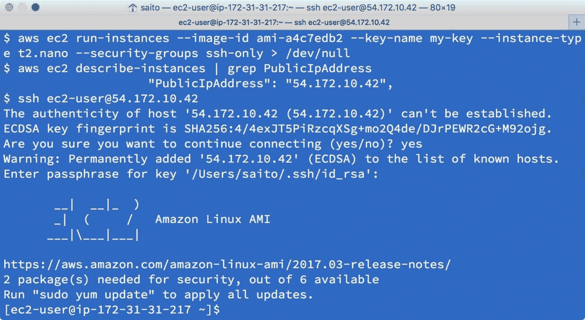
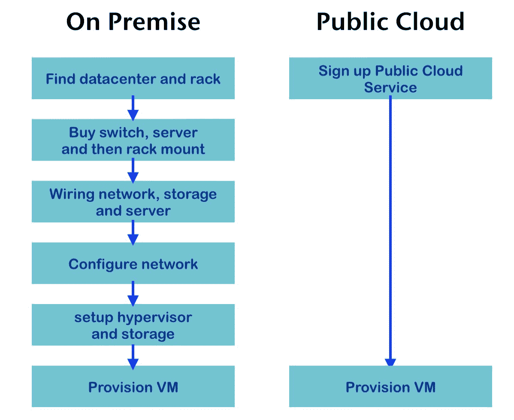
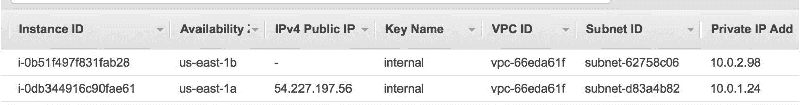
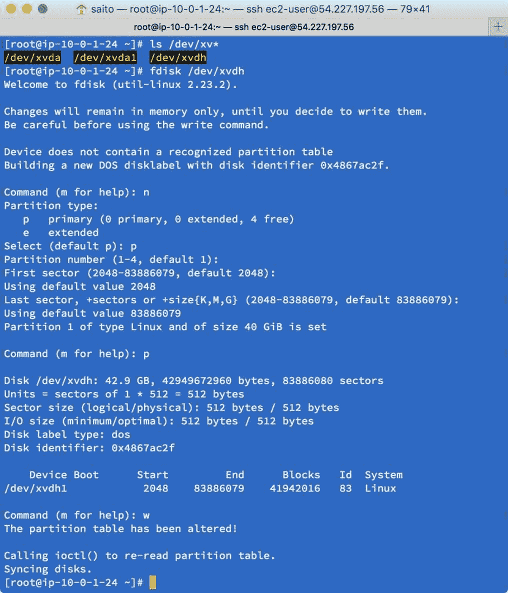
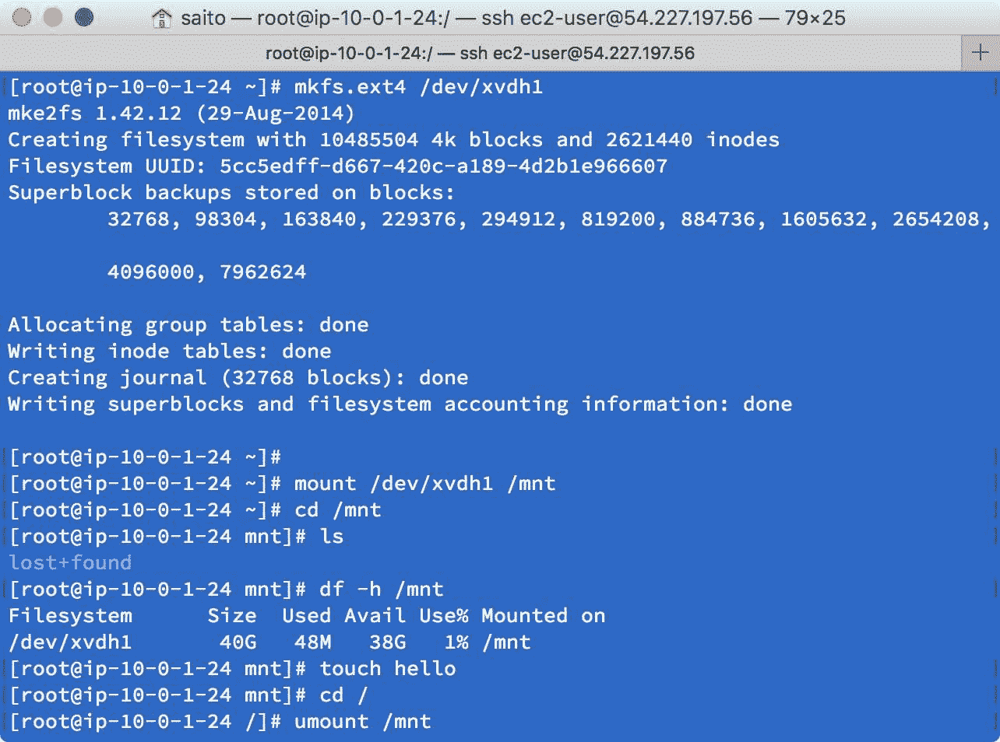
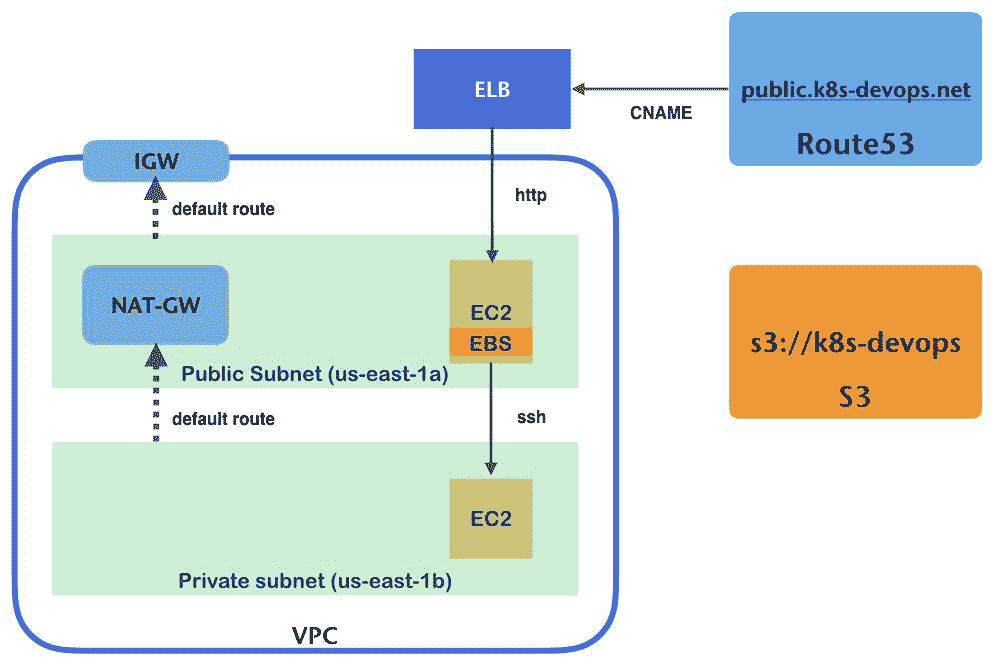
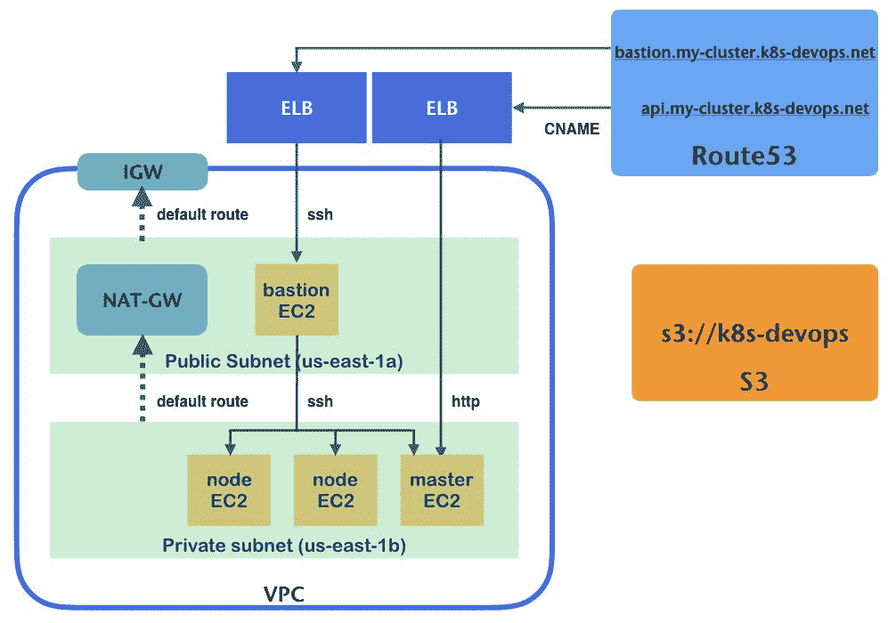
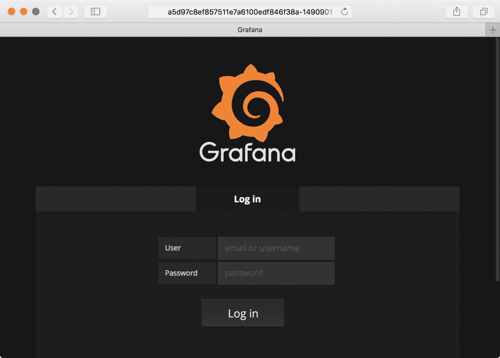
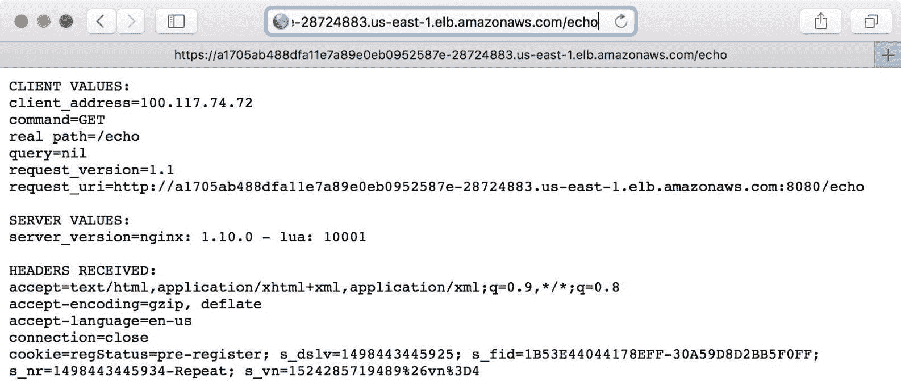

# 宇宙魔方在 AWS

在公共云上使用 Kubernetes 对于您的应用程序来说是灵活且可扩展的。AWS 是公有云行业的热门服务之一。在本章中，您将了解什么是 AWS，如何在 AWS 上设置 Kubernetes，以及以下主题:

*   了解公共云
*   使用和理解 AWS 组件
*   kops 的 Kubernetes 设置和管理
*   云提供商

# AWS 简介

当您在公共网络上运行应用程序时，您需要网络、虚拟机和存储等基础架构。显然，公司借用或构建自己的数据中心来准备这些基础架构，然后雇佣数据中心工程师和操作员来监控和管理这些资源。

然而，购买和维护这些资产需要大量的资本支出；您还需要数据中心工程师/操作员的运营费用。您还需要一段阅读时间来完全设置这些基础架构，例如购买服务器、安装到数据中心机架、布线网络，然后是操作系统的初始配置/安装，等等。

因此，快速分配具有适当资源容量的基础架构是决定企业成功的重要因素之一。

为了使基础设施管理更容易、更快，有许多技术可以帮助数据中心。比如，对于虚拟化来说，**软件定义网络** ( **SDN** )、**存储区域网络** ( **SAN** )等等。但是结合这种技术存在一些敏感的兼容性问题，难以稳定；因此需要聘请这个行业的专家，最终使得运营成本更高。

# 公共云

有一些公司已经提供了在线基础设施服务。AWS 是一种众所周知的提供在线基础设施的服务，称为云或公共云。早在 2006 年，AWS 就正式推出了虚拟机服务，名为**弹性计算云** ( **EC2** )、在线对象商店服务，名为**简单存储服务** ( **S3** )和在线消息队列服务，名为**简单队列服务** ( **SQS** )。

这些服务足够简单，但从数据中心管理的角度来看，由于现收现付定价模式(每小时或每年向 AWS 支付使用费)，它们减轻了基础架构预分配并减少了读取时间。因此，AWS 变得如此受欢迎，以至于许多公司已经从自己的数据中心转向公共云。

An antonym of the public cloud, your own data center is called **on- premises**.

# 应用编程接口和基础设施作为代码

使用公共云而不是内部数据中心的独特优势之一是公共云提供了一个控制基础架构的应用编程接口。AWS 提供命令行工具( **AWS CLI** )来控制 AWS 基础设施。比如注册 AWS([https://aws.amazon.com/free/](https://aws.amazon.com/free/))后，再安装 AWS CLI([http://docs . AWS . Amazon . com/CLI/latest/user guide/installing . html](http://docs.aws.amazon.com/cli/latest/userguide/installing.html))，那么如果你想启动一个虚拟机(EC2 实例)，使用 AWS CLI 如下:



如您所见，注册 AWS 后，只需几分钟即可访问您的虚拟机。另一方面，如果您从头开始建立自己的内部数据中心会怎么样？下图是使用内部数据中心还是使用公共云的高级比较:



可以看到，公有云太简单快捷；这就是为什么公共云不仅对于新兴的，而且对于永久的使用都是灵活和方便的。

# AWS 组件

AWS 有一些配置网络和存储的组件。这些对于理解公共云如何工作很重要，对于了解如何配置 Kubernetes 也很重要。

# VPC 和子网

在 AWS 上，首先需要创建自己的网络；它被称为**虚拟私有云** ( **VPC** )并使用 SDN 技术。AWS 允许您在 AWS 上创建一个或多个 VPC。每个 VPC 可以根据需要相互连接。创建 VPC 时，只需定义一个网络 CIDR 区块和 AWS 区域。比如`us-east-1`上的 CIDR `10.0.0.0/16`。无论您是否可以访问公共网络，您都可以定义任何网络地址范围(在/16 到/28 网络掩码范围之间)。VPC 的创建非常快，一旦创建了 VPC，然后你需要在 VPC 内创建一个或多个子网。

在以下示例中，通过 AWS 命令行创建了一个 VPC:

```
//specify CIDR block as 10.0.0.0/16
//the result, it returns VPC ID as "vpc-66eda61f"
$ aws ec2 create-vpc --cidr-block 10.0.0.0/16
{
 "Vpc": {
 "VpcId": "vpc-66eda61f", 
   "InstanceTenancy": "default", 
   "Tags": [], 
   "State": "pending", 
   "DhcpOptionsId": "dopt-3d901958", 
   "CidrBlock": "10.0.0.0/16"
  }
}
```

子网是一个逻辑网络块。它必须属于一个 VPC，此外，还必须属于一个可用性区域。比如 VPC`vpc-66eda61f``us-east-1b`。那么 CIDR 网络一定在 VPC 的 CIDR 境内。例如，如果 VPC CIDR 是`10.0.0.0/16` ( `10.0.0.0` - `10.0.255.255`)那么一个子网 CIDR 可能是`10.0.1.0/24` ( `10.0.1.0` - `10.0.1.255`)。

在以下示例中，在`vpc-66eda61f`上创建了两个子网(`us-east-1a`和`us-east-1b`):

```
//1<sup class="calibre45">st</sup> subnet 10.0."1".0/24 on us-east-1"a" availability zone
$ aws ec2 create-subnet --vpc-id vpc-66eda61f --cidr-block 10.0.1.0/24 --availability-zone us-east-1a
{
 "Subnet": {
    "VpcId": "vpc-66eda61f", 
    "CidrBlock": "10.0.1.0/24", 
    "State": "pending", 
    "AvailabilityZone": "us-east-1a", 
    "SubnetId": "subnet-d83a4b82", 
    "AvailableIpAddressCount": 251
  }
} 

//2<sup class="calibre45">nd</sup> subnet 10.0."2".0/24 on us-east-1"b"
$ aws ec2 create-subnet --vpc-id vpc-66eda61f --cidr-block 10.0.2.0/24 --availability-zone us-east-1b
{
   "Subnet": {
    "VpcId": "vpc-66eda61f", 
    "CidrBlock": "10.0.2.0/24", 
    "State": "pending", 
    "AvailabilityZone": "us-east-1b", 
    "SubnetId": "subnet-62758c06", 
    "AvailableIpAddressCount": 251
   }
}
```

让我们将第一个子网设为面向公共的子网，将第二个子网设为私有子网。这意味着面向公众的子网可以从互联网访问，这允许它有一个公共的 IP 地址。另一方面，私有子网不能有公共 IP 地址。为此，您需要设置网关和路由表。

In order to make high availability for public networks and private networks, it is recommended to create at least four subnets (two public and two private on different availability zones).
But to simplify examples that are easy to understand, these examples create one public and one private subnet.

# 互联网网关和网络地址转换网关

在大多数情况下，您的 VPC 需要与公共互联网连接。在这种情况下，您需要创建一个 **IGW** ( **互联网网关**)来连接到您的 VPC。

在以下示例中，创建了一个 IGW 并将其附加到`vpc-66eda61f`:

```
//create IGW, it returns IGW id as igw-c3a695a5
$ aws ec2 create-internet-gateway 
{
   "InternetGateway": {
      "Tags": [], 
      "InternetGatewayId": "igw-c3a695a5", 
      "Attachments": []
   }
}

//attach igw-c3a695a5 to vpc-66eda61f
$ aws ec2 attach-internet-gateway --vpc-id vpc-66eda61f --internet-gateway-id igw-c3a695a5  
```

连接 IGW 后，为指向 IGW 的子网设置路由表(默认网关)。如果默认网关指向 IGW，则该子网能够拥有公共 IP 地址并访问互联网。因此，如果默认网关没有指向 IGW，它将被确定为私有子网，这意味着没有公共访问。

在以下示例中，创建了指向 IGW 的路由表，并将其设置为第一个子网:

```
//create route table within vpc-66eda61f
//it returns route table id as rtb-fb41a280
$ aws ec2 create-route-table --vpc-id vpc-66eda61f
{
 "RouteTable": {
 "Associations": [], 
 "RouteTableId": "rtb-fb41a280", 
 "VpcId": "vpc-66eda61f", 
 "PropagatingVgws": [], 
 "Tags": [], 
 "Routes": [
 {
 "GatewayId": "local", 
 "DestinationCidrBlock": "10.0.0.0/16", 
 "State": "active", 
 "Origin": "CreateRouteTable"
 }
 ]
 }
}

//then set default route (0.0.0.0/0) as igw-c3a695a5
$ aws ec2 create-route --route-table-id rtb-fb41a280 --gateway-id igw-c3a695a5 --destination-cidr-block 0.0.0.0/0
{
 "Return": true
}

//finally, update 1<sup class="calibre45">st</sup> subnet (subnet-d83a4b82) to use this route table
$ aws ec2 associate-route-table --route-table-id rtb-fb41a280 --subnet-id subnet-d83a4b82
{
 "AssociationId": "rtbassoc-bf832dc5"
}

//because 1<sup class="calibre45">st</sup> subnet is public, assign public IP when launch EC2
$ aws ec2 modify-subnet-attribute --subnet-id subnet-d83a4b82 --map-public-ip-on-launch  
```

另一方面，第二个子网虽然是私有子网，但不需要公共 IP 地址，然而，私有子网有时需要接入互联网。例如，下载一些包并访问 AWS 服务访问。在这种情况下，我们仍然可以选择连接到互联网。叫做**网络地址转换网关** ( **NAT-GW** )。

NAT-GW 允许私有子网通过 NAT-GW 访问公共互联网。因此，NAT-GW 必须位于公共子网，私有子网路由表指向 NAT-GW 作为默认网关。请注意，为了在公共网络上访问 NAT-GW，需要将**弹性 IP** ( **EIP** )附在 NAT-GW 上。

在以下示例中，创建了一个网络地址转换网关:

```
//allocate EIP, it returns allocation id as eipalloc-56683465
$ aws ec2 allocate-address 
{
 "PublicIp": "34.233.6.60", 
 "Domain": "vpc", 
 "AllocationId": "eipalloc-56683465"
}

//create NAT-GW on 1<sup class="calibre45">st</sup> public subnet (subnet-d83a4b82
//also assign EIP eipalloc-56683465
$ aws ec2 create-nat-gateway --subnet-id subnet-d83a4b82 --allocation-id eipalloc-56683465
{
 "NatGateway": {
 "NatGatewayAddresses": [
 {
 "AllocationId": "eipalloc-56683465"
 }
 ], 
 "VpcId": "vpc-66eda61f", 
 "State": "pending", 
 "NatGatewayId": "nat-084ff8ba1edd54bf4", 
 "SubnetId": "subnet-d83a4b82", 
 "CreateTime": "2017-08-13T21:07:34.000Z"
 }
}  
```

Unlike an IGW, AWS charges you an additional hourly cost for Elastic IP and NAT-GW. Therefore, if you wish to save costs, launch an NAT-GW only while accessing the internet.

创建 NAT-GW 需要几分钟的时间，然后一旦创建了 NAT-GW，就更新一个指向 NAT-GW 的专用子网路由表，然后任何 EC2 实例都能够访问互联网，但是同样，由于专用子网上没有公共 IP 地址，因此没有机会从公共互联网访问专用子网 EC2 实例。

在以下示例中，第二个子网的更新路由表指向 NAT-GW 作为默认网关:

```
//as same as public route, need to create a route table first
$ aws ec2 create-route-table --vpc-id vpc-66eda61f
{
 "RouteTable": {
 "Associations": [], 
 "RouteTableId": "rtb-cc4cafb7", 
 "VpcId": "vpc-66eda61f", 
 "PropagatingVgws": [], 
 "Tags": [], 
 "Routes": [
 {
 "GatewayId": "local", 
 "DestinationCidrBlock": "10.0.0.0/16", 
 "State": "active", 
 "Origin": "CreateRouteTable"
 }
 ]
 }
}

//then assign default gateway as NAT-GW
$ aws ec2 create-route --route-table-id rtb-cc4cafb7 --nat-gateway-id nat-084ff8ba1edd54bf4 --destination-cidr-block 0.0.0.0/0
{
 "Return": true
}

//finally update 2<sup class="calibre45">nd</sup> subnet that use this routing table
$ aws ec2 associate-route-table --route-table-id rtb-cc4cafb7 --subnet-id subnet-62758c06
{
 "AssociationId": "rtbassoc-2760ce5d"
}
```

总体而言，有两个子网被配置为公共子网和专用子网。每个子网都有使用 IGW 和 NAT-GW 的默认路由，如下所示。请注意，标识会因 AWS 分配的唯一标识符而异:

| **子网类型** | **CIDR 街区** | **子网 ID** | **路由表 ID** | **默认网关** | **在 EC2 启动时分配公共 IP** |
| 公众 | 10.0.1.0/24 | `subnet-d83a4b82` | `rtb-fb41a280` | `igw-c3a695a5` (IGW) | 是 |
| 私人的 | 10.0.2.0/24 | `subnet-62758c06` | `rtb-cc4cafb7` | `nat-084ff8ba1edd54bf4` (NAT-GW) | 否(默认) |

Technically, you can still assign a public IP to private subnet EC2 instance, but there is no default gateway to the internet (IGW). Therefore, a public IP will just be wasted and absolutely not have connectivity from the internet.

现在，如果您在公共子网上启动一个 EC2 实例，它将成为面向公共的，因此您可以从这个子网为您的应用程序提供服务。

另一方面，如果您在专用子网上启动一个 EC2 实例，它仍然可以通过 NAT-GW 访问互联网，但不会有来自互联网的访问。但是，它仍然可以从公共子网的 EC2 实例访问它。因此，您可以部署内部服务，如数据库、中间件和监控工具。

# 安全组

一旦 VPC 和具有相关网关/路由的子网准备就绪，您就可以创建 EC2 实例。但是，至少需要预先创建一个访问控制，称为**安全组**。它可以定义防火墙规则，即入口(传入网络访问)和出口(传出网络访问)。

在以下示例中，为公共子网主机创建了一个安全组和一个规则，允许从您的计算机的 IP 地址进行 ssh，并在全球范围内开放 HTTP(80/tcp):

When you define a security group for public subnet, it is highly recommended it to be reviewed by a security expert. Because once you deploy an EC2 instance onto the public subnet, it has a public IP address and then everyone including crackers and bots are able to access your instances directly.

```

//create one security group for public subnet host on vpc-66eda61f
$ aws ec2 create-security-group --vpc-id vpc-66eda61f --group-name public --description "public facing host"
{
 "GroupId": "sg-7d429f0d"
}

//check your machine's public IP (if not sure, use 0.0.0.0/0 as temporary)
$ curl ifconfig.co
107.196.102.199

//public facing machine allows ssh only from your machine
$ aws ec2 authorize-security-group-ingress --group-id sg-7d429f0d --protocol tcp --port 22 --cidr 107.196.102.199/32

//public facing machine allow HTTP access from any host (0.0.0.0/0)
$ aws ec2 authorize-security-group-ingress --group-id sg-d173aea1 --protocol tcp --port 80 --cidr 0.0.0.0/0  
```

接下来，为私有子网主机创建一个安全组，允许来自公共子网主机的 ssh。在这种情况下，指定公共子网安全组标识(`sg-7d429f0d`)而不是 CIDR 块是很方便的:

```
//create security group for private subnet
$ aws ec2 create-security-group --vpc-id vpc-66eda61f --group-name private --description "private subnet host"
{
 "GroupId": "sg-d173aea1"
}

//private subnet allows ssh only from ssh bastion host security group
//it also allows HTTP (80/TCP) from public subnet security group
$ aws ec2 authorize-security-group-ingress --group-id sg-d173aea1 --protocol tcp --port 22 --source-group sg-7d429f0d

//private subnet allows HTTP access from public subnet security group too
$ aws ec2 authorize-security-group-ingress --group-id sg-d173aea1 --protocol tcp --port 80 --source-group sg-7d429f0d
```

总体而言，创建了两个安全组，如下所示:

| **名称** | **安全组 ID** | **允许 ssh (22/TCP)** | **允许 HTTP (80/TCP)** |
| 公众 | `sg-7d429f0d` | 你的机器(`107.196.102.199`) | `0.0.0.0/0` |
| 私人的 | `sg-d173aea1` | 公共 sg ( `sg-7d429f0d`) | 公共 sg ( `sg-7d429f0d`) |

# EC2 和 EBS

EC2 是 AWS 中的一项重要服务，您可以在 VPC 上启动虚拟机。根据硬件规格(中央处理器、内存和网络)，AWS 上有几种类型的 EC2 实例。启动 EC2 实例时，需要指定 VPC、子网、安全组和 ssh 密钥对。因此，所有这些都必须事先创建。

由于前面的例子，最后一步是 ssh keypair。让我们制作一个 ssh 密钥:

```
//create keypair (internal_rsa, internal_rsa.pub)
$ ssh-keygen 
Generating public/private rsa key pair.
Enter file in which to save the key (/Users/saito/.ssh/id_rsa): /tmp/internal_rsa
Enter passphrase (empty for no passphrase): 
Enter same passphrase again: 
Your identification has been saved in /tmp/internal_rsa.
Your public key has been saved in /tmp/internal_rsa.pub.

//register internal_rsa.pub key to AWS
$ aws ec2 import-key-pair --key-name=internal --public-key-material "`cat /tmp/internal_rsa.pub`"
{
 "KeyName": "internal", 
   "KeyFingerprint":  
 "18:e7:86:d7:89:15:5d:3b:bc:bd:5f:b4:d5:1c:83:81"
} 

//launch public facing host, using Amazon Linux on us-east-1 (ami-a4c7edb2)
$ aws ec2 run-instances --image-id ami-a4c7edb2 --instance-type t2.nano --key-name internal --security-group-ids sg-7d429f0d --subnet-id subnet-d83a4b82

//launch private subnet host
$ aws ec2 run-instances --image-id ami-a4c7edb2 --instance-type t2.nano --key-name internal --security-group-ids sg-d173aea1 --subnet-id subnet-62758c06  
```

几分钟后，检查 AWS 网络控制台上的 EC2 实例状态；它显示了具有公共 IP 地址的公共子网主机。另一方面，私有子网主机没有公共 IP 地址:



```
//add private keys to ssh-agent
$ ssh-add -K /tmp/internal_rsa
Identity added: /tmp/internal_rsa (/tmp/internal_rsa)
$ ssh-add -l
2048 SHA256:AMkdBxkVZxPz0gBTzLPCwEtaDqou4XyiRzTTG4vtqTo /tmp/internal_rsa (RSA)

//ssh to the public subnet host with -A (forward ssh-agent) option
$ ssh -A ec2-user@54.227.197.56
The authenticity of host '54.227.197.56 (54.227.197.56)' can't be established.
ECDSA key fingerprint is SHA256:ocI7Q60RB+k2qbU90H09Or0FhvBEydVI2wXIDzOacaE.
Are you sure you want to continue connecting (yes/no)? yes
Warning: Permanently added '54.227.197.56' (ECDSA) to the list of known hosts.

           __|  __|_  )
           _|  (     /   Amazon Linux AMI
          ___|\___|___|

    https://aws.amazon.com/amazon-linux-ami/2017.03-release-notes/
    2 package(s) needed for security, out of 6 available
    Run "sudo yum update" to apply all updates.
```

现在你在公共子网主机(`54.227.197.56`)但是这个主机也有一个内部(私有)IP 地址，因为这个主机部署在 10.0.1.0/24 子网(`subnet-d83a4b82`)，所以私有地址范围必须是`10.0.1.1` - `10.0.1.254`:

```
$ ifconfig eth0
eth0      Link encap:Ethernet  HWaddr 0E:8D:38:BE:52:34 
          inet addr:10.0.1.24  Bcast:10.0.1.255      
          Mask:255.255.255.0
```

让我们在公共主机上安装 nginx web 服务器，如下所示:

```
$ sudo yum -y -q install nginx
$ sudo /etc/init.d/nginx start
Starting nginx:                                            [  OK  ]
```

然后，回到你的机器上查看`54.227.197.56`的网站:

```
$ exit
logout
Connection to 52.227.197.56 closed.

//from your machine, access to nginx
$ curl -I 54.227.197.56
HTTP/1.1 200 OK
Server: nginx/1.10.3
...
Accept-Ranges: bytes  
```

此外，在同一个 VPC 内，还有其他可用性区域的可达性，因此您可以从该主机 ssh 到专用子网主机(`10.0.2.98`)。请注意，我们使用的是转发 ssh 代理的`ssh -A`选项，因此不需要创建`~/.ssh/id_rsa`文件:

```
[ec2-user@ip-10-0-1-24 ~]$ ssh 10.0.2.98
The authenticity of host '10.0.2.98 (10.0.2.98)' can't be established.
ECDSA key fingerprint is 1a:37:c3:c1:e3:8f:24:56:6f:90:8f:4a:ff:5e:79:0b.
Are you sure you want to continue connecting (yes/no)? yes
    Warning: Permanently added '10.0.2.98' (ECDSA) to the list of known hosts.

           __|  __|_  )
           _|  (     /   Amazon Linux AMI
          ___|\___|___|

https://aws.amazon.com/amazon-linux-ami/2017.03-release-notes/
2 package(s) needed for security, out of 6 available
Run "sudo yum update" to apply all updates.
[ec2-user@ip-10-0-2-98 ~]$ 
```

除了 EC2，还有一个重要的功能，那就是磁盘管理。AWS 提供了一种叫做**弹性块存储** ( **EBS** )的灵活磁盘管理服务。您可以创建一个或多个可以连接到 EC2 实例的持久性数据存储。从 EC2 的角度来看，EBS 是 HDD/SSD 之一。一旦您终止(删除)了一个 EC2 实例，EBS 及其内容可能会保留下来，然后重新附加到另一个 EC2 实例。

在以下示例中，创建了一个容量为 40 GB 的卷；然后连接到公共子网主机(实例 ID `i-0db344916c90fae61`):

```
//create 40GB disk at us-east-1a (as same as EC2 host instance)
$ aws ec2 create-volume --availability-zone us-east-1a --size 40 --volume-type standard
{
    "AvailabilityZone": "us-east-1a", 
    "Encrypted": false, 
    "VolumeType": "standard", 
    "VolumeId": "vol-005032342495918d6", 
    "State": "creating", 
    "SnapshotId": "", 
    "CreateTime": "2017-08-16T05:41:53.271Z", 
    "Size": 40
}

//attach to public subnet host as /dev/xvdh
$ aws ec2 attach-volume --device xvdh --instance-id i-0db344916c90fae61 --volume-id vol-005032342495918d6
{
    "AttachTime": "2017-08-16T05:47:07.598Z", 
    "InstanceId": "i-0db344916c90fae61", 
    "VolumeId": "vol-005032342495918d6", 
    "State": "attaching", 
    "Device": "xvdh"
}
```

将 EBS 卷附加到 EC2 实例后，Linux 内核按照指定识别`/dev/xvdh`，然后您需要进行分区才能使用该设备，如下所示:



在本例中，我们将一个分区设为`/dev/xvdh1`，因此您可以在`/dev/xvdh1`上创建一个格式为`ext4`的文件系统，然后您可以在 EC2 实例上挂载并使用该设备:



卸载该卷后，您可以随意分离该卷，然后在需要时重新连接它:

```
//detach volume
$ aws ec2 detach-volume --volume-id vol-005032342495918d6
{
    "AttachTime": "2017-08-16T06:03:45.000Z", 
    "InstanceId": "i-0db344916c90fae61", 
    "VolumeId": "vol-005032342495918d6", 
    "State": "detaching", 
    "Device": "xvdh"
}
```

# 53 号公路

AWS 还提供名为**53 号公路**的托管域名服务。路由 53 允许你管理你自己的域名和相关的 FQDN 到一个 IP 地址。例如，如果你想要一个域名`k8s-devops.net`，你可以通过 53 号路由订购注册你的域名。

下图截图显示订购一个域名`k8s-devops.net`；完成注册可能需要几个小时:


注册完成后，您可能会收到来自 AWS 的通知电子邮件，然后您可以通过 AWS 命令行或网络控制台控制该域名。让我们添加一条记录(FQDN 到 IP 地址)，将`public.k8s-devops.net`与面向公众的 EC2 主机公共 IP 地址`54.227.197.56`相关联。为此，获取托管区域标识，如下所示:

```
$ aws route53 list-hosted-zones | grep Id
"Id": "/hostedzone/Z1CTVYM9SLEAN8",   
```

现在您获得了一个托管区域 id`/hostedzone/Z1CTVYM9SLEAN8`，所以让我们准备一个 JSON 文件来更新 DNS 记录，如下所示:

```
//create JSON file
$ cat /tmp/add-record.json 
{
 "Comment": "add public subnet host",
  "Changes": [
   {
     "Action": "UPSERT",
     "ResourceRecordSet": {
       "Name": "public.k8s-devops.net",
       "Type": "A",
       "TTL": 300,
       "ResourceRecords": [
         {
          "Value": "54.227.197.56"
         }
       ]
     }
   }
  ]
}

//submit to Route53
$ aws route53 change-resource-record-sets --hosted-zone-id /hostedzone/Z1CTVYM9SLEAN8 --change-batch file:///tmp/add-record.json 

//a few minutes later, check whether A record is created or not
$ dig public.k8s-devops.net

; <<>> DiG 9.8.3-P1 <<>> public.k8s-devops.net
;; global options: +cmd
;; Got answer:
;; ->>HEADER<<- opcode: QUERY, status: NOERROR, id: 18609
;; flags: qr rd ra; QUERY: 1, ANSWER: 1, AUTHORITY: 0, ADDITIONAL: 0

;; QUESTION SECTION:
;public.k8s-devops.net.       IN    A

;; ANSWER SECTION:
public.k8s-devops.net.  300   IN    A     54.227.197.56  
```

看起来不错，所以现在通过域名`public.k8s-devops.net`访问 nginx:

```
$ curl -I public.k8s-devops.net
HTTP/1.1 200 OK
Server: nginx/1.10.3
...  
```

# 英国文学学士（bachelor of english literature）

AWS 提供了一个强大的基于软件的负载平衡器，称为**弹性负载平衡器** ( **ELB** )。它允许您对一个或多个 EC2 实例的网络流量进行负载平衡。此外，ELB 可以卸载 SSL/TLS 加密/解密，还支持多可用性区域。

在下面的示例中，创建了一个 ELB，并将其与公共子网主机 nginx (80/TCP)相关联。因为 ELB 也需要一个安全小组，先为 ELB 创建一个新的安全小组:

```
$ aws ec2 create-security-group --vpc-id vpc-66eda61f --group-name elb --description "elb sg"
{
  "GroupId": "sg-51d77921"
} 
$ aws ec2 authorize-security-group-ingress --group-id sg-51d77921 --protocol tcp --port 80 --cidr 0.0.0.0/0

$ aws elb create-load-balancer --load-balancer-name public-elb --listeners Protocol=HTTP,LoadBalancerPort=80,InstanceProtocol=HTTP,InstancePort=80 --subnets subnet-d83a4b82 --security-groups sg-51d77921
{
   "DNSName": "public-elb-1779693260.us-east- 
    1.elb.amazonaws.com"
}

$ aws elb register-instances-with-load-balancer --load-balancer-name public-elb --instances i-0db344916c90fae61

$ curl -I public-elb-1779693260.us-east-1.elb.amazonaws.com
HTTP/1.1 200 OK
Accept-Ranges: bytes
Content-Length: 3770
Content-Type: text/html
...  
```

让我们更新指向 ELB 的 53 号公路域名系统记录`public.k8s-devops.net`。在这种情况下，ELB 已经有了一个`A`记录，因此使用一个`CNAME`(化名)指向 ELB FQDN:

```
$ cat change-to-elb.json 
{
 "Comment": "use CNAME to pointing to ELB",
  "Changes": [
    {
      "Action": "DELETE",
      "ResourceRecordSet": {
        "Name": "public.k8s-devops.net",
        "Type": "A",
        "TTL": 300,
        "ResourceRecords": [
          {
           "Value": "52.86.166.223"
          }
        ]
      }
    },
    {
      "Action": "UPSERT",
      "ResourceRecordSet": {
        "Name": "public.k8s-devops.net",
        "Type": "CNAME",
        "TTL": 300,
        "ResourceRecords": [
          {
           "Value": "public-elb-1779693260.us-east-           
1.elb.amazonaws.com"
          }
        ]
      }
 }
 ]
}

$ dig public.k8s-devops.net

; <<>> DiG 9.8.3-P1 <<>> public.k8s-devops.net
;; global options: +cmd
;; Got answer:
;; ->>HEADER<<- opcode: QUERY, status: NOERROR, id: 10278
;; flags: qr rd ra; QUERY: 1, ANSWER: 3, AUTHORITY: 0, ADDITIONAL: 0

;; QUESTION SECTION:
;public.k8s-devops.net.       IN    A

;; ANSWER SECTION:
public.k8s-devops.net.  300   IN    CNAME public-elb-1779693260.us-east-1.elb.amazonaws.com.
public-elb-1779693260.us-east-1.elb.amazonaws.com. 60 IN A 52.200.46.81
public-elb-1779693260.us-east-1.elb.amazonaws.com. 60 IN A 52.73.172.171

;; Query time: 77 msec
;; SERVER: 10.0.0.1#53(10.0.0.1)
;; WHEN: Wed Aug 16 22:21:33 2017
;; MSG SIZE  rcvd: 134

$ curl -I public.k8s-devops.net
HTTP/1.1 200 OK
Accept-Ranges: bytes
Content-Length: 3770
Content-Type: text/html
...  
```

# S3

AWS 提供了一个有用的对象数据存储服务，叫做**简单存储服务** ( **S3** )。它不像 EBS，没有 EC2 实例可以作为文件系统装载。相反，使用 AWS 应用编程接口将文件传输到 S3。因此，AWS 可以使可用性(99.999999999%)和多个实例可以同时访问它。最好存储非吞吐量和随机访问敏感文件，如配置文件、日志文件和数据文件。

在以下示例中，一个文件从您的机器上传到 AWS S3:

```
//create S3 bucket "k8s-devops"
$ aws s3 mb s3://k8s-devops
make_bucket: k8s-devops

//copy files to S3 bucket
$ aws s3 cp add-record.json s3://k8s-devops/
upload: ./add-record.json to s3://k8s-devops/add-record.json 
$ aws s3 cp change-to-elb.json s3://k8s-devops/
upload: ./change-to-elb.json to s3://k8s-devops/change-to-elb.json 

//check files on S3 bucket
$ aws s3 ls s3://k8s-devops/
2017-08-17 20:00:21        319 add-record.json
2017-08-17 20:00:28        623 change-to-elb.json  
```

总的来说，我们已经讨论了如何在 VPC 配置 AWS 组件。下图显示了主要组件和关系:



# 在 AWS 上安装库

我们已经讨论了一些很容易设置网络、虚拟机和存储的 AWS 组件。因此，在 AWS 上设置 Kubernetes 的方式有很多种，比如 kube dam([https://github.com/kubernetes/kubeadm](https://github.com/kubernetes/kubeadm))、kops([https://github.com/kubernetes/kops](https://github.com/kubernetes/kops))和 kube spray([https://github.com/kubernetes-incubator/kubespray](https://github.com/kubernetes-incubator/kubespray))。设置 Kubernetes 的推荐方法之一是使用 kops，这是一个生产级设置工具，支持大量配置。在本章中，我们将使用 kops 在 AWS 上配置 Kubernetes。请注意，kops 代表 Kubernetes 操作。

# 安装 kop

首先，你需要在你的机器上安装 kop。支持 Linux 和 macOS。Kops 是单二进制，所以只需按照建议将`kops`命令复制到`/usr/local/bin`即可。之后，为 kops 创建一个`IAM`用户和角色来处理 kops 操作。详情请参考官方文件([https://github.com/kubernetes/kops/blob/master/docs/aws.md](https://github.com/kubernetes/kops/blob/master/docs/aws.md))。

# 跑 kops

Kops 需要一个存储配置和状态的 S3 桶。此外，使用 Route 53 向域名系统注册 Kubernetes API 服务器名和 etcd 服务器名。因此，使用 S3 桶并使用我们在前面部分中创建的 53 号路线。

Kops 支持多种配置，例如部署到公共子网、私有子网、使用不同类型和数量的 EC2 实例、高可用性和覆盖网络。让我们用上一节中类似的网络配置来配置 Kubernetes，如下所示:

Kops has an option to reuse existing VPC and subnets. However, it behaves tricky and may encounter some issues based on settings; it is recommended to create a new VPC by kops. For details, you may find a document at [https://github.com/kubernetes/kops/blob/master/docs/run_in_existing_vpc.md](https://github.com/kubernetes/kops/blob/master/docs/run_in_existing_vpc.md).

| **参数** | **值** | **指** |
| `--name` | `my-cluster.k8s-devops.net` | 在`k8s-devops.net`域下设置`my-cluster` |
| `--state` | `s3://k8s-devops` | 使用 k8s-devops S3 铲斗 |
| `--zones` | `us-east-1a` | 部署在`us-east-1a`可用性区域 |
| `--cloud` | `aws` | 使用 AWS 作为云提供商 |
| `--network-cidr` | `10.0.0.0/16` | 使用 CIDR 10.0.0.0/16 创建新 VPC |
| `--master-size` | `t2.large` | 使用 EC2 `t2.large`实例作为主实例 |
| `--node-size` | `t2.medium` | 对节点使用 EC2 `t2.medium`实例 |
| `--node-count` | `2` | 设置两个节点 |
| `--networking` | `calico` | 将印花布用于覆盖网络 |
| `--topology` | `private` | 设置公共子网和私有子网，并将主节点和节点部署到私有子网 |
| `--ssh-puglic-key` | `/tmp/internal_rsa.pub` | 使用`/tmp/internal_rsa.pub`作为堡垒主机 |
| `--bastion` |  | 在公共子网上创建 ssh 堡垒服务器 |
| `--yes` |  | 立即执行 |

因此，运行以下命令来运行 kops:

```
$ kops create cluster --name my-cluster.k8s-devops.net --state=s3://k8s-devops --zones us-east-1a --cloud aws --network-cidr 10.0.0.0/16 --master-size t2.large --node-size t2.medium --node-count 2 --networking calico --topology private --ssh-public-key /tmp/internal_rsa.pub --bastion --yes

I0818 20:43:15.022735   11372 create_cluster.go:845] Using SSH public key: /tmp/internal_rsa.pub
...
I0818 20:45:32.585246   11372 executor.go:91] Tasks: 78 done / 78 total; 0 can run
I0818 20:45:32.587067   11372 dns.go:152] Pre-creating DNS records
I0818 20:45:35.266425   11372 update_cluster.go:247] Exporting kubecfg for cluster
Kops has set your kubectl context to my-cluster.k8s-devops.net

Cluster is starting.  It should be ready in a few minutes.  
```

看到前面的消息后，可能需要大约 5 到 10 分钟才能完全完成。这是因为它要求我们创建 VPC、子网和 NAT-GW，启动 EC2s，然后安装 Kubernetes 主节点和节点，启动 ELB，然后更新 Route 53，如下所示:



一旦完成，机器上的`kops`更新`~/.kube/config`指向你的库本内特斯应用编程接口服务器。Kops 创建一个 ELB，并将 53 号公路上相应的 FQDN 记录设置为`https://api.<your-cluster-name>.<your-domain-name>/`，因此，您可以直接从机器上运行`kubectl`命令，查看节点列表，如下所示:

```
$ kubectl get nodes
NAME                          STATUS         AGE       VERSION
ip-10-0-36-157.ec2.internal   Ready,master   8m        v1.7.0
ip-10-0-42-97.ec2.internal    Ready,node     6m        v1.7.0
ip-10-0-42-170.ec2.internal   Ready,node     6m        v1.7.0

```

万岁！从头开始在 AWS 上设置 AWS 基础设施和 Kubernetes 只需几分钟。现在你可以通过`kubectl`命令部署吊舱。但是您可能希望 ssh 到主节点/节点，看看发生了什么。

但是由于安全原因，如果指定`--topology private`，只能 ssh 到堡垒主机。然后使用私有 IP 地址 ssh 到主/节点主机。这类似于上一节，ssh 到公共子网主机，然后使用 ssh-agent ( `-A`选项)ssh 到私有子网主机。

在下面的例子中，我们 ssh 到堡垒主机(kops 创建 Route 53 条目作为`bastion.my-cluster.k8s-devops.net`)，然后 ssh 到主机(`10.0.36.157`):

>

# 云提供商

在 kops 设置 Kubernetes 的同时，还将 Kubernetes 云提供商配置为 AWS。这意味着当您将 Kubernetes 服务与 LoadBalancer 一起使用时，它将使用 ELB。还以**弹性积木商店** ( **EBS** )为其`StorageClass`。

# L4 负载平衡器

当你向外界公开库本内特服务时，使用 ELB 就更有意义了。将服务类型设置为负载平衡器将调用 ELB 创建，并将其与节点相关联:

```
$ cat grafana.yml 
apiVersion: apps/v1beta1
kind: Deployment
metadata:
 name: grafana
spec:
 replicas: 1
 template:
 metadata:
 labels:
 run: grafana
 spec:
 containers:
 - image: grafana/grafana
 name: grafana
 ports:
 - containerPort: 3000
---
apiVersion: v1
kind: Service
metadata:
 name: grafana
spec:
 ports:
 - port: 80
 targetPort: 3000
 type: LoadBalancer
 selector:
 run: grafana

$ kubectl create -f grafana.yml 
deployment "grafana" created
service "grafana" created

$ kubectl get service
NAME         CLUSTER-IP       EXTERNAL-IP        PORT(S)        AGE
grafana      100.65.232.120   a5d97c8ef8575...   80:32111/TCP   11s
kubernetes   100.64.0.1       <none>             443/TCP        13m

$ aws elb describe-load-balancers | grep a5d97c8ef8575 | grep DNSName
 "DNSName": "a5d97c8ef857511e7a6100edf846f38a-1490901085.us-east-1.elb.amazonaws.com",  
```

如你所见，ELB 已经被自动创建，域名系统是`a5d97c8ef857511e7a6100edf846f38a-1490901085.us-east-1.elb.amazonaws.com`，所以现在你可以在`http://a5d97c8ef857511e7a6100edf846f38a-1490901085.us-east-1.elb.amazonaws.com`访问格拉夫纳。

You may use `awscli` to update Route 53 to assign a `CNAME` such as `grafana.k8s-devops.net`. Alternatively, the Kubernetes incubator project `external-dns` ([https://github.com/kubernetes-incubator/external-dns)](https://github.com/kubernetes-incubator/external-dns)) can automate to update Route 53 in this situation.



# L7 负载平衡器(输入)

从 kops 1 . 7 . 0 版本开始，它还没有开箱即用地设置入口控制器。但是，kops 提供了一些扩展 Kubernetes 特性的附加组件([https://github.com/kubernetes/kops/tree/master/addons](https://github.com/kubernetes/kops/tree/master/addons))。其中一个插件 ingress-nginx([https://github . com/kubernetes/kops/tree/master/addons/ingress-nginx](https://github.com/kubernetes/kops/tree/master/addons/ingress-nginx))使用 AWS ELB 和 nginx 的组合来实现 Kubernetes 入口控制器。

为了安装`ingress-nginx`插件，键入以下命令来设置入口控制器:

```
$ kubectl create -f https://raw.githubusercontent.com/kubernetes/kops/master/addons/ingress-nginx/v1.6.0.yaml
namespace "kube-ingress" created
serviceaccount "nginx-ingress-controller" created
clusterrole "nginx-ingress-controller" created
role "nginx-ingress-controller" created
clusterrolebinding "nginx-ingress-controller" created
rolebinding "nginx-ingress-controller" created
service "nginx-default-backend" created
deployment "nginx-default-backend" created
configmap "ingress-nginx" created
service "ingress-nginx" created
deployment "ingress-nginx" created
```

之后，使用节点端口服务部署 nginx 和 echoserver，如下所示:

```
$ kubectl run nginx --image=nginx --port=80
deployment "nginx" created
$ 
$ kubectl expose deployment nginx --target-port=80 --type=NodePort
service "nginx" exposed
$ 
$ kubectl run echoserver --image=gcr.io/google_containers/echoserver:1.4 --port=8080
deployment "echoserver" created
$ 
$ kubectl expose deployment echoserver --target-port=8080 --type=NodePort
service "echoserver" exposed

// URL "/" point to nginx, "/echo" to echoserver
$ cat nginx-echoserver-ingress.yaml 
apiVersion: extensions/v1beta1
kind: Ingress
metadata:
 name: nginx-echoserver-ingress
spec:
 rules:
 - http:
 paths:
 - path: /
 backend:
 serviceName: nginx
 servicePort: 80
 - path: /echo
 backend:
 serviceName: echoserver
 servicePort: 8080

//check ingress
$ kubectl get ing -o wide
NAME                       HOSTS     ADDRESS                                                                 PORTS     AGE
nginx-echoserver-ingress   *         a1705ab488dfa11e7a89e0eb0952587e-28724883.us-east-1.elb.amazonaws.com   80        1m 
```

几分钟后，入口控制器将 nginx 服务和 echoserver 服务与 ELB 相关联。当您使用 URI“`/`”访问 ELB 服务器时，nginx 屏幕显示如下:


另一方面，如果您访问同一个 ELB，但使用 URI“`/echo`”，它显示回声服务器如下:



与标准的 Kubernetes 负载平衡器服务相比，一个负载平衡器服务消耗一个 ELB。另一方面，使用 nginx 入口插件，它可以将多个 Kubernetes 节点端口服务整合到单个 ELB 上。这将有助于更容易地构建您的 RESTful 服务。

# 存储类

正如我们在[第 4 章](04.html#3279U0-6c8359cae3d4492eb9973d94ec3e4f1e)、*中讨论的那样，使用存储和资源*，有一个`StorageClass`可以动态分配持久卷。Kops 将提供者设置为`aws-ebs`，它使用 EBS:

```
$ kubectl get storageclass
NAME            TYPE
default         kubernetes.io/aws-ebs 
gp2 (default)   kubernetes.io/aws-ebs 

$ cat pvc-aws.yml 
apiVersion: v1
kind: PersistentVolumeClaim
metadata:
 name: pvc-aws-1
spec:
 storageClassName: "default"
 accessModes:
 - ReadWriteOnce
 resources:
 requests:
 storage: 10Gi

$ kubectl create -f pvc-aws.yml 
persistentvolumeclaim "pvc-aws-1" created

$ kubectl get pv
NAME                                       CAPACITY   ACCESSMODES   RECLAIMPOLICY   STATUS    CLAIM               STORAGECLASS   REASON    AGE
pvc-94957090-84a8-11e7-9974-0ea8dc53a244   10Gi       RWO           Delete          Bound     default/pvc-aws-1   default                  3s  
```

这将自动创建 EBS 卷，如下所示:

```
$ aws ec2 describe-volumes --filter Name=tag-value,Values="pvc-51cdf520-8576-11e7-a610-0edf846f38a6"
{
 "Volumes": [
    {
      "AvailabilityZone": "us-east-1a", 
    "Attachments": [], 
      "Tags": [
       {
...
     ], 
    "Encrypted": false, 
    "VolumeType": "gp2", 
    "VolumeId": "vol-052621c39546f8096", 
    "State": "available", 
    "Iops": 100, 
    "SnapshotId": "", 
    "CreateTime": "2017-08-20T07:08:08.773Z", 
       "Size": 10
       }
     ]
   }
```

总体而言，AWS 的 Kubernetes 云提供商用于将 ELB 映射到 Kubernetes 服务，以及将 EBS 映射到 Kubernetes 持久卷。对 Kubernetes 使用 AWS 是一个很大的好处，因为不需要预先分配或购买物理负载平衡器或存储，只需随用随付；它为您的业务创造了灵活性和可扩展性。

# kops 维护 Kubernetes 集群

当您需要更改 Kubernetes 配置时，例如节点数量甚至 EC2 实例类型，kops 可以支持这种用例。例如，如果您想将 Kubernetes 节点实例类型从`t2.medium`更改为`t2.micro`，并且为了节省成本，还想将数量从 2 减少到 1，则需要修改 kops 节点实例组(`ig`)设置，如下所示:

```
$ kops edit ig nodes --name my-cluster.k8s-devops.net --state=s3://k8s-devops   
```

它启动 vi 编辑器，您可以按如下方式更改 kops 节点实例组的设置:

```
apiVersion: kops/v1alpha2
kind: InstanceGroup
metadata:
 creationTimestamp: 2017-08-20T06:43:45Z
 labels:
 kops.k8s.io/cluster: my-cluster.k8s-devops.net
 name: nodes
spec:
 image: kope.io/k8s-1.6-debian-jessie-amd64-hvm-ebs-2017- 
 05-02
 machineType: t2.medium
 maxSize: 2
 minSize: 2
 role: Node
 subnets:
 - us-east-1a  
```

在这种情况下，将`machineType`改为`t2.small`，将`maxSize` / `minSize`改为`1`，然后保存。之后，运行`kops update`命令应用设置:

```
$ kops update cluster --name my-cluster.k8s-devops.net --state=s3://k8s-devops --yes 

I0820 00:57:17.900874    2837 executor.go:91] Tasks: 0 done / 94 total; 38 can run
I0820 00:57:19.064626    2837 executor.go:91] Tasks: 38 done / 94 total; 20 can run
...
Kops has set your kubectl context to my-cluster.k8s-devops.net
Cluster changes have been applied to the cloud.

Changes may require instances to restart: kops rolling-update cluster  
```

正如您在前面的消息中看到的，您需要运行`kops rolling-update cluster`命令来反映现有的实例。将现有实例替换为新实例可能需要几分钟时间:

```
$ kops rolling-update cluster --name my-cluster.k8s-devops.net --state=s3://k8s-devops --yes
NAME              STATUS     NEEDUPDATE  READY MIN   MAX   NODES
bastions          Ready       0           1     1     1     0
master-us-east-1a Ready       0           1     1     1     1
nodes             NeedsUpdate 1           0     1     1     1
I0820 01:00:01.086564    2844 instancegroups.go:350] Stopping instance "i-07e55394ef3a09064", node "ip-10-0-40-170.ec2.internal", in AWS ASG "nodes.my-cluster.k8s-devops.net".  
```

现在 Kubernetes 节点实例已经从`2`减少到`1`，如下所示:

```
$ kubectl get nodes
NAME                          STATUS         AGE       VERSION
ip-10-0-36-157.ec2.internal   Ready,master   1h        v1.7.0
ip-10-0-58-135.ec2.internal   Ready,node     34s       v1.7.0  
```

# 摘要

在本章中，我们讨论了公共云。AWS 是最受欢迎的公共云服务，它提供了以编程方式控制 AWS 基础设施的应用编程接口。我们可以通过代码轻松实现自动化和基础设施。特别是，kops 让我们从头开始超快 AWS 和 Kubernetes 设置。Kubernetes 和 kops 开发都相当活跃。请继续监控这些项目，它们将在不久的将来有更多的功能和配置。

下一章将介绍**谷歌云平台** ( **GCP** )，这是另一种流行的公共云服务。**谷歌容器引擎** ( **GKE** )是托管的 Kubernetes 服务，使得使用 Kubernetes 变得更加容易。