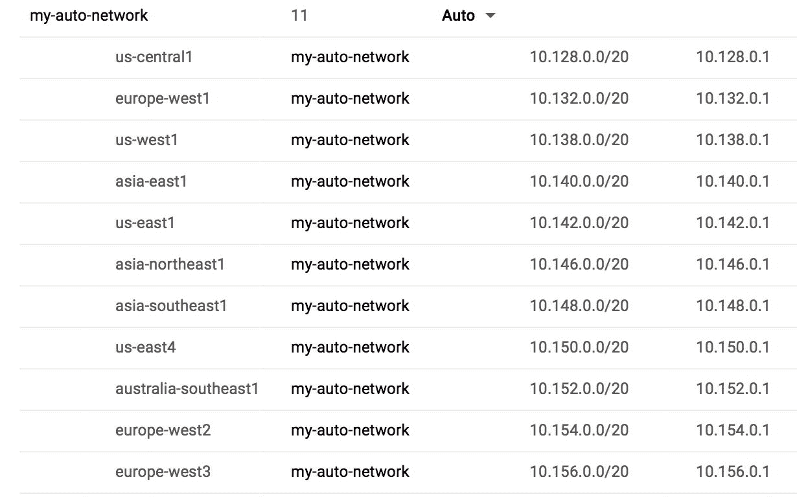
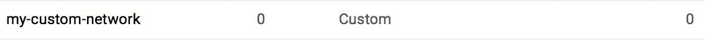
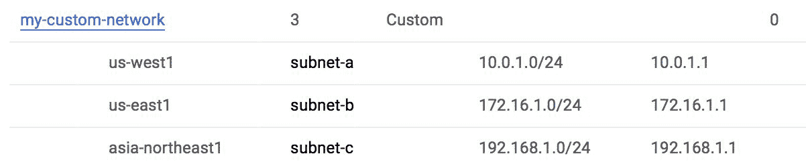
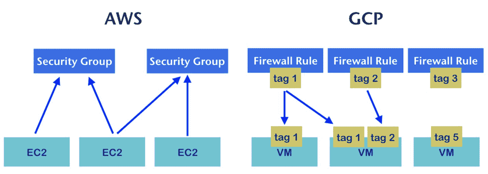
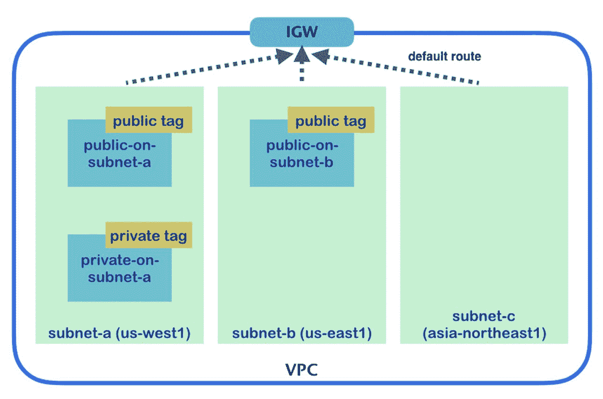
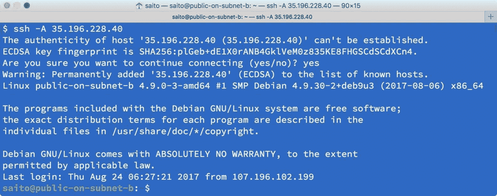
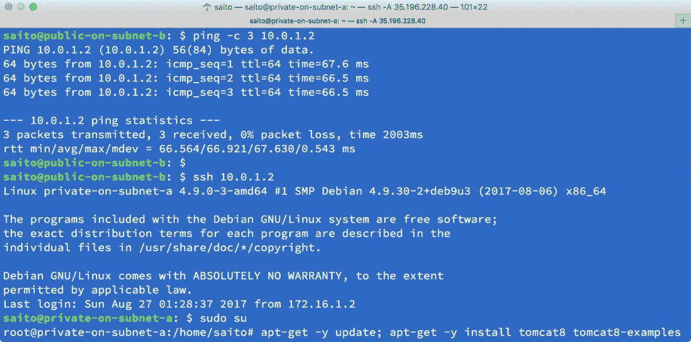
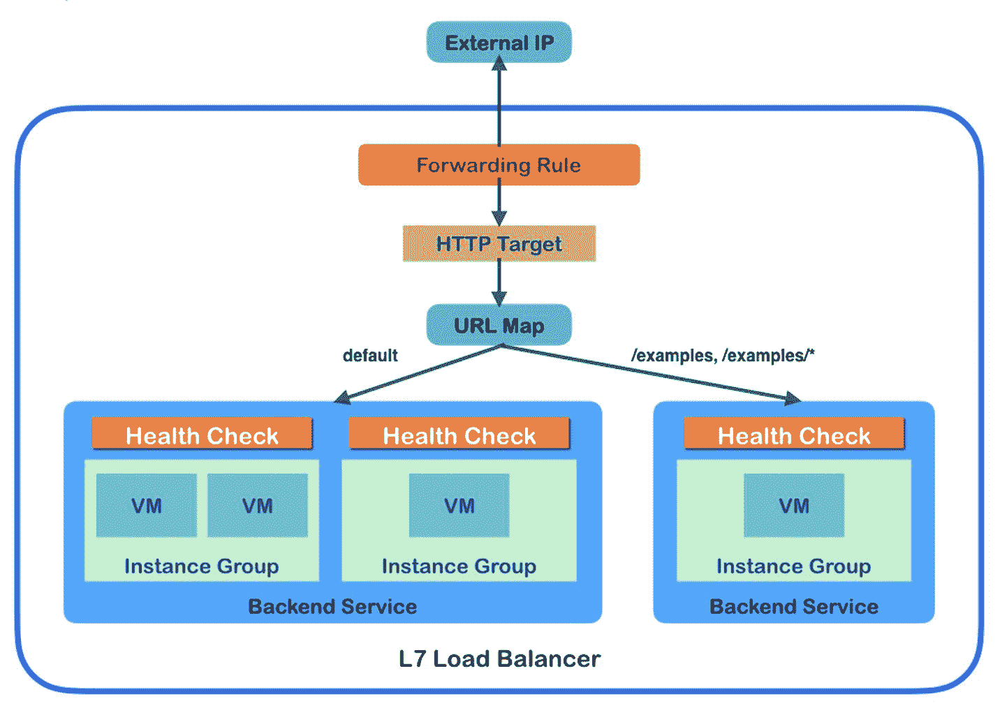
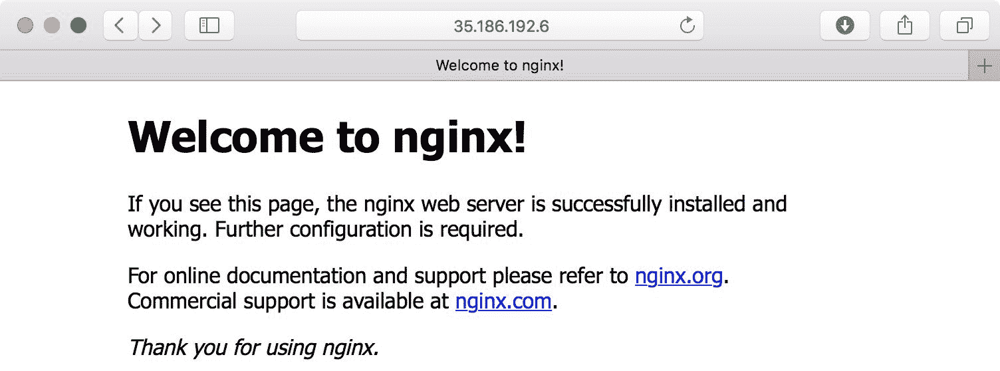
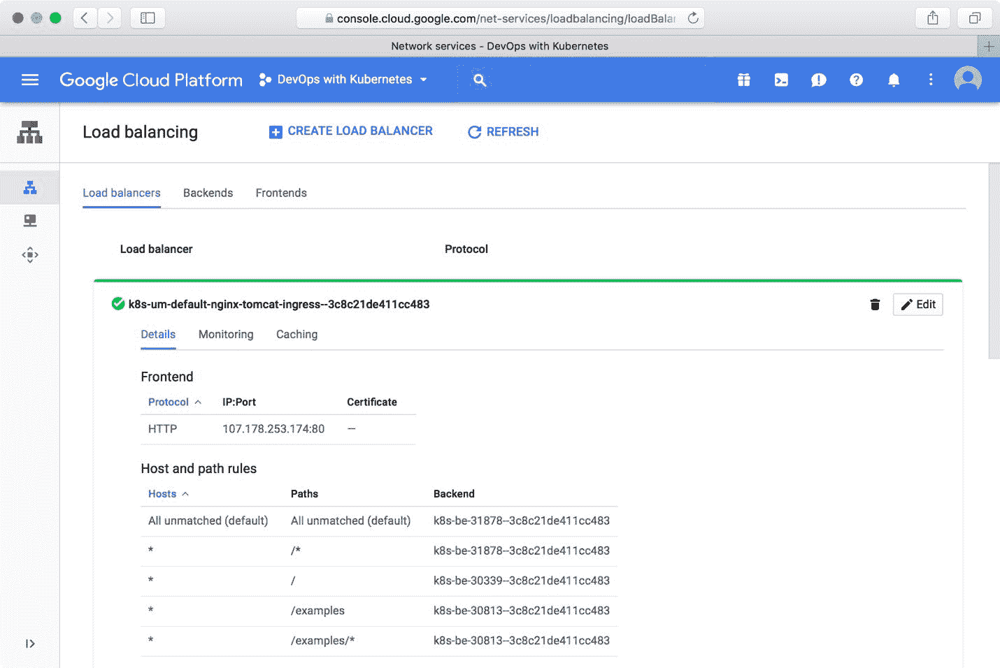

# 库比涅斯对 GCP

**谷歌云平台** ( **GCP** )在谷歌提供的公有云行业越来越受欢迎。GCP 有类似于 AWS 的概念，如 VPC、计算引擎、持久磁盘、负载平衡和一些托管服务。在本章中，您将通过以下主题了解 GCP 以及如何在 GCP 设置 Kubernetes:

*   了解 GCP
*   使用和理解 GCP 组件
*   使用**谷歌容器引擎** ( **GKE** )，托管的 Kubernetes 服务

# GCP 简介

GCP 于 2011 年正式启动。但不像 AWS 当初，GCP 先提供 **PaaS** ( **平台即服务**)。因此，您可以直接部署应用，而不是启动虚拟机。之后，继续增强支持各种服务的功能。

Kubernetes 用户最重要的服务是 GKE，这是一个托管的 Kubernetes 服务。因此，您可以从 Kubernetes 的安装、升级和管理中得到一些缓解。它采用现收现付的方式来使用 Kubernetes 集群。GKE 也是一个非常活跃的服务，不断及时地提供新版本的 Kubernetes，也不断地为 Kubernetes 提供新的功能和管理工具。

让我们看看 GCP 提供了什么样的基础和服务，然后探索 GKE。

# GCP 组件

GCP 提供了网络控制台和**命令行界面** ( **命令行界面**)。控制 GCP 的基础设施既简单又直接，但需要谷歌账户(如 Gmail)。一旦你有了谷歌账户，进入 GCP 注册页面([https://cloud.google.com/free/](https://cloud.google.com/free/))设置你的 GCP 账户创建。

如果想通过 CLI 进行控制，需要安装 Cloud SDK([https://cloud.google.com/sdk/gcloud/](https://cloud.google.com/sdk/gcloud/))，类似 AWS CLI，可以用来列表、创建、更新、删除 GCP 资源。安装云软件开发工具包后，您需要使用以下命令对其进行配置，以将其与 GCP 帐户相关联:

```
$ gcloud init
```

# VPC

与 AWS 相比，GCP 的 VPC 政策完全不同。首先，您不需要将 CIDR 前缀设置为 VPC，换句话说，您不能将 CIDR 设置为 VPC。相反，您只需向 VPC 添加一个或几个子网。由于子网总是伴随着某些 CIDR 区块，因此，GCP VPC 被确定为一组逻辑子网，VPC 内部的子网可以相互通信。

注意，GCP VPC 有两种模式，要么**自动**要么**自定义**。如果您选择自动，它将在每个区域上使用预定义的 CIDR 区块创建一些子网。例如，如果键入以下命令:

```
$ gcloud compute networks create my-auto-network --mode auto
```

它将创建 11 个子网，如下图所示(因为截至 2017 年 8 月，GCP 有 11 个地区):



自动模式 VPC 可能是一个很好的开始。但是，在自动模式下，您不能指定 CIDR 前缀，来自所有地区的 11 个子网可能不适合您的使用情况。例如，如果您希望通过虚拟专用网集成到您的内部数据中心，或者希望仅从特定区域创建子网。

在这种情况下，选择自定义模式 VPC，然后您可以手动创建具有所需 CIDR 前缀的子网。键入以下命令创建自定义模式 VPC:

```
//create custom mode VPC which is named my-custom-network
$ gcloud compute networks create my-custom-network --mode custom  
```

因为自定义模式 VPC 不会创建任何子网，如下图所示，让我们将子网添加到此自定义模式 VPC:



# 子网络

在 GCP，子网总是跨越区域内的多个区域(可用性区域)。换句话说，您不能在像 AWS 这样的单个区域上创建子网。创建子网时，您总是需要指定整个区域。

此外，没有像 AWS(路由和互联网网关或 NAT 网关的组合，以确定是公共子网还是私有子网)这样的公共子网和私有子网的重要概念。这是因为 GCP 的所有子网都有通往互联网网关的路由。

GCP 不使用子网级访问控制，而是使用**网络标签**进行主机(实例)级访问控制，确保网络安全。这将在下一节中更详细地描述。

这可能会让网络管理员感到紧张，但是，GCP 最佳实践为您带来了更加简化和可扩展的 VPC 管理，因为您可以随时添加子网来扩展整个网络块。

Technically, you can launch VM instance to set up as a NAT gateway or HTTP proxy, and then create a custom priority route for the private subnet that points to the NAT/proxy instance to achieve an AWS–like private subnet.
Please refer to the following online document for details:
[https://cloud.google.com/compute/docs/vpc/special-configurations](https://cloud.google.com/compute/docs/vpc/special-configurations)

还有一点，GCP·VPC 的一个有趣而独特的概念是，你可以在单个 VPC 中添加不同的 CIDR 前缀网络块。例如，如果您有自定义模式 VPC，则添加以下三个子网:

*   `subnet-a` ( `10.0.1.0/24`)来自`us-west1`
*   `subnet-b` ( `172.16.1.0/24`)来自`us-east1`
*   `subnet-c` ( `192.168.1.0/24`)来自`asia-northeast1`

以下命令将使用不同的 CIDR 前缀从三个不同的区域创建三个子网:

```
$ gcloud compute networks subnets create subnet-a --network=my-custom-network --range=10.0.1.0/24 --region=us-west1
$ gcloud compute networks subnets create subnet-b --network=my-custom-network --range=172.16.1.0/24 --region=us-east1
$ gcloud compute networks subnets create subnet-c --network=my-custom-network --range=192.168.1.0/24 --region=asia-northeast1  
```

结果将是下面的网络控制台。如果你熟悉 AWS VPC，你不会相信这些 CIDR 前缀组合在一个单一的 VPC！这意味着，每当您需要扩展网络时，您可以随意指定另一个 CIDR 前缀来添加到 VPC。



# 防火墙规则

如前所述，GCP 防火墙规则对于实现网络安全非常重要。但 GCP 防火墙比 AWS **安全组** ( **SG** )更简单灵活。例如，在 AWS 中，当您启动 EC2 实例时，您必须分配至少一个与 EC2 和 SG 紧密耦合的 SG。另一方面，在 GCP，你不能直接分配任何防火墙规则。相反，防火墙规则和虚拟机实例通过**网络标签**松散耦合。因此，防火墙规则和虚拟机实例之间没有直接关联。下图是 AWS 安全组和 GCP 防火墙规则之间的比较。EC2 需要安全组，另一方面，GCP VM 实例只是设置了一个标签。这与相应的防火墙是否具有相同的标签无关。



例如，为公共主机(使用网络标签`public`)和私有主机(使用网络标签`private`)创建防火墙规则，如下命令所示:

```
//create ssh access for public host
$ gcloud compute firewall-rules create public-ssh --network=my-custom-network --allow="tcp:22" --source-ranges="0.0.0.0/0" --target-tags="public"

//create http access (80/tcp for public host)
$ gcloud compute firewall-rules create public-http --network=my-custom-network --allow="tcp:80" --source-ranges="0.0.0.0/0" --target-tags="public"

//create ssh access for private host (allow from host which has "public" tag)
$ gcloud compute firewall-rules create private-ssh --network=my-custom-network --allow="tcp:22" --source-tags="public" --target-tags="private"

//create icmp access for internal each other (allow from host which has either "public" or "private")
$ gcloud compute firewall-rules create internal-icmp --network=my-custom-network --allow="icmp" --source-tags="public,private"
```

它创建了四个防火墙规则，如下图所示。让我们创建虚拟机实例来使用`public`或`private`网络标签，看看它是如何工作的:


# 虚拟机实例

GCP 的虚拟机实例与 AWS EC2 非常相似。您可以从各种具有不同硬件配置的机器(实例)类型中进行选择。以及基于 Linux 或 Windows 操作系统或您定制的操作系统的操作系统映像，您可以选择。

正如在讨论防火墙规则时提到的，您可以指定零个或多个网络标签。标签不需要预先创建。这意味着您可以首先启动带有网络标签的虚拟机实例，即使没有创建防火墙规则。它仍然有效，但是在这种情况下没有应用防火墙规则。然后创建一个防火墙规则来获得一个网络标签。最终，防火墙规则将应用于虚拟机实例。这就是虚拟机实例和防火墙规则松散耦合的原因，这为用户提供了灵活性。


在启动虚拟机实例之前，您需要首先创建一个 ssh 公钥，与 AWS EC2 相同。最简单的方法是运行以下命令来创建和注册新密钥:

```
//this command create new ssh key pair
$ gcloud compute config-ssh

//key will be stored as ~/.ssh/google_compute_engine(.pub)
$ cd ~/.ssh
$ ls -l google_compute_engine*
-rw-------  1 saito  admin  1766 Aug 23 22:58 google_compute_engine
-rw-r--r--  1 saito  admin   417 Aug 23 22:58 google_compute_engine.pub  
```

现在，让我们开始在 GCP 上启动一个虚拟机实例。

在`subnet-a`和`subnet-b`上部署两个实例作为公共实例(使用`public`网络标签)，然后在`subnet-a`上启动另一个实例作为私有实例(使用`private`网络标签):

```
//create public instance ("public" tag) on subnet-a
$ gcloud compute instances create public-on-subnet-a --machine-type=f1-micro --network=my-custom-network --subnet=subnet-a --zone=us-west1-a --tags=public

//create public instance ("public" tag) on subnet-b
$ gcloud compute instances create public-on-subnet-b --machine-type=f1-micro --network=my-custom-network --subnet=subnet-b --zone=us-east1-c --tags=public

//create private instance ("private" tag) on subnet-a with larger size (g1-small)
$ gcloud compute instances create private-on-subnet-a --machine-type=g1-small --network=my-custom-network --subnet=subnet-a --zone=us-west1-a --tags=private

//Overall, there are 3 VM instances has been created in this example as below
$ gcloud compute instances list
NAME                                           ZONE           MACHINE_TYPE  PREEMPTIBLE  INTERNAL_IP  EXTERNAL_IP      STATUS
public-on-subnet-b                             us-east1-c     f1-micro                   172.16.1.2   35.196.228.40    RUNNING
private-on-subnet-a                            us-west1-a     g1-small                   10.0.1.2     104.199.121.234  RUNNING
public-on-subnet-a                             us-west1-a     f1-micro                   10.0.1.3     35.199.171.31    RUNNING  
```



您可以登录这些机器，检查防火墙规则是否按预期工作。首先，您需要向机器上的 ssh 代理添加一个 ssh 密钥:

```
$ ssh-add ~/.ssh/google_compute_engine
Enter passphrase for /Users/saito/.ssh/google_compute_engine: 
Identity added: /Users/saito/.ssh/google_compute_engine (/Users/saito/.ssh/google_compute_engine)  
```

然后检查 ICMP 防火墙规则是否可以拒绝来自外部的请求，因为 ICMP 只允许公共或私有的标记主机，所以它不能允许从您的机器 ping，如下图所示:


另一方面，公共主机允许从您的机器进行 ssh，因为 public-ssh 规则允许任何(`0.0.0.0/0`)。



当然，由于`internal-icmp`规则和`private-ssh`规则，该主机可以通过私有 IP 地址 ping 和 ssh 到`subnet-a` ( `10.0.1.2`)上的私有主机。

让我们 ssh 到一个私有主机，然后安装`tomcat8`和`tomcat8-examples`包(它将把`/examples/`应用安装到 Tomcat 上)。



记住`subnet-a`是`10.0.1.0/24` CIDR 前缀，`subnet-b`是`172.16.1.0/24` CIDR 前缀。但是在同一个 VPC 内部，彼此之间是有联系的。这是使用 GCP 的一大好处和优势，您可以随时扩展网络地址块。

现在，将 nginx 安装到公共主机(`public-on-subnet-a`和`public-on-subnet-b`):

```
//logout from VM instance, then back to your machine
$ exit

//install nginx from your machine via ssh
$ ssh 35.196.228.40 "sudo apt-get -y install nginx"
$ ssh 35.199.171.31 "sudo apt-get -y install nginx"

//check whether firewall rule (public-http) work or not
$ curl -I http://35.196.228.40/
HTTP/1.1 200 OK
Server: nginx/1.10.3
Date: Sun, 27 Aug 2017 07:07:01 GMT
Content-Type: text/html
Content-Length: 612
Last-Modified: Fri, 25 Aug 2017 05:48:28 GMT
Connection: keep-alive
ETag: "599fba2c-264"
Accept-Ranges: bytes  
```

但是，此时，您不能在私有主机上访问 Tomcat。即使它有一个公共的 IP 地址。这是因为私有主机还没有任何允许 8080/tcp 的防火墙规则:

```
$ curl http://104.199.121.234:8080/examples/
curl: (7) Failed to connect to 104.199.121.234 port 8080: Operation timed out  
```

接下来，不仅仅是为 Tomcat 创建一个防火墙规则，还将设置一个负载平衡器，从一个负载平衡器配置 nginx 和 Tomcat 访问。

# 负载平衡

GCP 提供以下几种类型的负载平衡器:

*   第 4 层 TCP 负载平衡器
*   第 4 层 UDP 负载平衡器
*   第 7 层 HTTP(S)负载平衡器

第 4 层，TCP 和 UDP，负载平衡器类似于 AWS 经典 ELB。另一方面，第 7 层 HTTP 负载平衡器具有基于内容(上下文)的路由。例如，URL /img 将转发到实例-a，其他所有内容都将转发到实例-b。因此，它更像是一个应用层负载平衡器。

AWS also provides **Application Load Balancer** (**ALB** or **ELBv2**), which is quite similar to GCP Layer 7 HTTP(S) LoadBalancer. For details, please visit [https://aws.amazon.com/blogs/aws/new-aws-application-load-balancer/](https://aws.amazon.com/blogs/aws/new-aws-application-load-balancer/).

为了设置负载平衡器，与 AWS ELB 不同，需要几个步骤来预先配置一些项目:

| **配置项** | **目的** |
| 实例组 | 确定一组虚拟机实例或虚拟机模板(操作系统映像)。 |
| 健康检查 | 设置运行状况阈值(间隔、超时等)以确定实例组的运行状况。 |
| 后端服务 | 为实例组设置负载阈值(最大 CPU 或每秒请求数)和会话关联性(粘性会话)，并关联到运行状况检查。 |
| 网址映射(负载平衡器) | 这是一个实际的占位符，代表一个 L7 负载平衡器，它关联后端服务和目标 HTTP(S)代理 |
| 目标 HTTP 代理 | 这是一个连接器，它在前端转发规则和负载平衡器之间建立关系 |
| 前端转发规则 | 将 IP 地址(临时的或静态的)、端口号与目标 HTTP 代理相关联 |
| 外部 IP(静态) | (可选)为负载平衡器分配静态外部 IP 地址 |

下图是构建 L7 负载平衡器的所有前面组件的关联:



让我们首先设置一个实例组。在本例中，要创建三个实例组。一个用于私有主机 Tomcat 实例(8080/tcp)，另两个实例组用于每个区域的公共 HTTP 实例。

为此，请执行以下命令对其中三个进行分组:

```
//create instance groups for HTTP instances and tomcat instance
$ gcloud compute instance-groups unmanaged create http-ig-us-west --zone us-west1-a
$ gcloud compute instance-groups unmanaged create http-ig-us-east --zone us-east1-c
$ gcloud compute instance-groups unmanaged create tomcat-ig-us-west --zone us-west1-a

//because tomcat uses 8080/tcp, create a new named port as tomcat:8080
$ gcloud compute instance-groups unmanaged set-named-ports tomcat-ig-us-west --zone us-west1-a --named-ports tomcat:8080

//register an existing VM instance to correspond instance group
$ gcloud compute instance-groups unmanaged add-instances http-ig-us-west --instances public-on-subnet-a --zone us-west1-a
$ gcloud compute instance-groups unmanaged add-instances http-ig-us-east --instances public-on-subnet-b --zone us-east1-c
$ gcloud compute instance-groups unmanaged add-instances tomcat-ig-us-west --instances private-on-subnet-a --zone us-west1-a  
```

# 健康检查

让我们通过执行以下命令来设置标准设置:

```
//create health check for http (80/tcp) for "/"
$ gcloud compute health-checks create http my-http-health-check --check-interval 5 --healthy-threshold 2 --unhealthy-threshold 3 --timeout 5 --port 80 --request-path /

//create health check for Tomcat (8080/tcp) for "/examples/"
$ gcloud compute health-checks create http my-tomcat-health-check --check-interval 5 --healthy-threshold 2 --unhealthy-threshold 3 --timeout 5 --port 8080 --request-path /examples/  
```

# 后端服务

首先，我们需要创建一个指定健康检查的后端服务。然后添加每个具有阈值的实例组，对于 HTTP 和 Tomcat，其 CPU 利用率最高可达 80%，最大容量为 100%；

```
//create backend service for http (default) and named port tomcat (8080/tcp)
$ gcloud compute backend-services create my-http-backend-service --health-checks my-http-health-check --protocol HTTP --global
$ gcloud compute backend-services create my-tomcat-backend-service --health-checks my-tomcat-health-check --protocol HTTP --port-name tomcat --global

//add http instance groups (both us-west1 and us-east1) to http backend service
$ gcloud compute backend-services add-backend my-http-backend-service --instance-group http-ig-us-west --instance-group-zone us-west1-a --balancing-mode UTILIZATION --max-utilization 0.8 --capacity-scaler 1 --global
$ gcloud compute backend-services add-backend my-http-backend-service --instance-group http-ig-us-east --instance-group-zone us-east1-c --balancing-mode UTILIZATION --max-utilization 0.8 --capacity-scaler 1 --global

//also add tomcat instance group to tomcat backend service
$ gcloud compute backend-services add-backend my-tomcat-backend-service --instance-group tomcat-ig-us-west --instance-group-zone us-west1-a --balancing-mode UTILIZATION --max-utilization 0.8 --capacity-scaler 1 --global  
```

# 创建负载平衡器

负载平衡器需要绑定`my-http-backend-service`和`my-tomcat-backend-service`。在这种情况下，只有`/examples`和`/examples/*`会将流量转发到`my-tomcat-backend-service`。除此之外，每个 URI 都将流量转发到`my-http-backend-service`:

```
//create load balancer(url-map) to associate my-http-backend-service as default
$ gcloud compute url-maps create my-loadbalancer --default-service my-http-backend-service

//add /examples and /examples/* mapping to my-tomcat-backend-service
$ gcloud compute url-maps add-path-matcher my-loadbalancer --default-service my-http-backend-service --path-matcher-name tomcat-map --path-rules /examples=my-tomcat-backend-service,/examples/*=my-tomcat-backend-service

//create target-http-proxy that associate to load balancer(url-map)
$ gcloud compute target-http-proxies create my-target-http-proxy --url-map=my-loadbalancer

//allocate static global ip address and check assigned address
$ gcloud compute addresses create my-loadbalancer-ip --global
$ gcloud compute addresses describe my-loadbalancer-ip --global
address: 35.186.192.6

//create forwarding rule that associate static IP to target-http-proxy
$ gcloud compute forwarding-rules create my-frontend-rule --global --target-http-proxy my-target-http-proxy --address 35.186.192.6 --ports 80
```

If you don't specify an `--address` option, it will create and assign an ephemeral external IP address.

最后，创建了负载平衡器。然而，还剩下一个缺失的配置。私有主机没有任何防火墙规则来允许 Tomcat 流量(8080/tcp)。这就是为什么当您看到负载平衡器状态时，`my-tomcat-backend-service`的健康状态保持为低(0)。


在这种情况下，您需要再添加一个防火墙规则，允许从负载平衡器连接到专用子网(使用`private`网络标签)。根据 GCP 文件([https://cloud . Google . com/compute/docs/load-balancing/health-checks # https _ SSL _ proxy _ TCP _ proxy _ and _ internal _ load _ balancing](https://cloud.google.com/compute/docs/load-balancing/health-checks#https_ssl_proxy_tcp_proxy_and_internal_load_balancing))，健康检查心跳将来自地址范围`130.211.0.0/22`和`35.191.0.0/16`:

```
//add one more Firewall Rule that allow Load Balancer to Tomcat (8080/tcp)
$ gcloud compute firewall-rules create private-tomcat --network=my-custom-network --source-ranges 130.211.0.0/22,35.191.0.0/16 --target-tags private --allow tcp:8080  
```

几分钟后，`my-tomcat-backend-service`健康状态会起来(`1`)；现在，您可以从网络浏览器访问负载平衡器。当访问`/`时，应该路由到`my-http-backend-service`，它在公共主机上有 nginx 应用:



另一方面，如果访问`/examples/` URL 时使用相同的 LoadBalancer IP 地址，它会路由到`my-tomcat-backend-service`，这是一个私有主机上的 Tomcat 应用，如下图截图所示:


总的来说，需要执行一些步骤来设置负载平衡器，但是将不同的 HTTP 应用集成到一个负载平衡器上以最少的资源高效地交付您的服务是非常有用的。

# 永久磁盘

GCE 还有一个名为**持久磁盘** ( **PD** )的存储服务，与 AWS EBS 非常相似。您可以在每个区域分配所需的大小和类型(标准或固态硬盘)，并随时连接/分离到虚拟机实例。

让我们创建一个 PD，然后连接到虚拟机实例。请注意，将 PD 连接到虚拟机实例时，两者必须位于相同的区域。这种限制与 AWS EBS 相同。因此，在创建 PD 之前，再次检查虚拟机实例位置:

```
$ gcloud compute instances list
NAME                                           ZONE           MACHINE_TYPE  PREEMPTIBLE  INTERNAL_IP  EXTERNAL_IP      STATUS
public-on-subnet-b                             us-east1-c     f1-micro                   172.16.1.2   35.196.228.40    RUNNING
private-on-subnet-a                            us-west1-a     g1-small                   10.0.1.2     104.199.121.234  RUNNING
public-on-subnet-a                             us-west1-a     f1-micro                   10.0.1.3     35.199.171.31    RUNNING  
```

让我们选择`us-west1-a`然后将其附加到`public-on-subnet-a`上:

```
//create 20GB PD on us-west1-a with standard type
$ gcloud compute disks create my-disk-us-west1-a --zone us-west1-a --type pd-standard --size 20

//after a few seconds, check status, you can see existing boot disks as well
$ gcloud compute disks list
NAME                                           ZONE           SIZE_GB  TYPE         STATUS
public-on-subnet-b                             us-east1-c     10       pd-standard  READY
my-disk-us-west1-a                             us-west1-a     20       pd-standard  READY
private-on-subnet-a                            us-west1-a     10       pd-standard  READY
public-on-subnet-a                             us-west1-a     10       pd-standard  READY

//attach PD(my-disk-us-west1-a) to the VM instance(public-on-subnet-a)
$ gcloud compute instances attach-disk public-on-subnet-a --disk my-disk-us-west1-a --zone us-west1-a

//login to public-on-subnet-a to see the status
$ ssh 35.199.171.31
Linux public-on-subnet-a 4.9.0-3-amd64 #1 SMP Debian 4.9.30-2+deb9u3 (2017-08-06) x86_64

The programs included with the Debian GNU/Linux system are free software;
the exact distribution terms for each program are described in the
individual files in /usr/share/doc/*/copyright.

Debian GNU/Linux comes with ABSOLUTELY NO WARRANTY, to the extent
permitted by applicable law.
Last login: Fri Aug 25 03:53:24 2017 from 107.196.102.199
**saito@public-on-subnet-a**:**~**$ sudo su
root@public-on-subnet-a:/home/saito# dmesg | tail
[ 7377.421190] systemd[1]: apt-daily-upgrade.timer: Adding 25min 4.773609s random time.
[ 7379.202172] systemd[1]: apt-daily-upgrade.timer: Adding 6min 37.770637s random time.
[243070.866384] scsi 0:0:2:0: Direct-Access     Google   PersistentDisk   1    PQ: 0 ANSI: 6
[243070.875665] sd 0:0:2:0: [sdb] 41943040 512-byte logical blocks: (21.5 GB/20.0 GiB)
[243070.883461] sd 0:0:2:0: [sdb] 4096-byte physical blocks
[243070.889914] sd 0:0:2:0: Attached scsi generic sg1 type 0
[243070.900603] sd 0:0:2:0: [sdb] Write Protect is off
[243070.905834] sd 0:0:2:0: [sdb] Mode Sense: 1f 00 00 08
[243070.905938] sd 0:0:2:0: [sdb] Write cache: enabled, read cache: enabled, doesn't support DPO or FUA
[243070.925713] sd 0:0:2:0: [sdb] Attached SCSI disk  
```

您可能会在`/dev/sdb`看到 PD 已被附加。类似于 AWS EBS，你必须格式化这个磁盘。因为这是一个 Linux 操作系统操作，所以步骤与[第 9 章](09.html#6NGV40-6c8359cae3d4492eb9973d94ec3e4f1e)、*AWS 上的 Kubernetes*中描述的完全相同。

# 谷歌容器引擎(GKE)

总的来说，在前面的章节中已经介绍了一些 GCP 组件。现在，您可以开始使用这些组件在 GCP 虚拟机实例上设置 Kubernetes。你甚至可以在 AWS 上使用也在[第 9 章](09.html#6NGV40-6c8359cae3d4492eb9973d94ec3e4f1e)、 *Kubernetes 中介绍的 kops。*

然而，GCP 有一个名为 GKE 的托管Kubernetes服务。下面，它使用了一些 GCP 组件，如 VPC、虚拟机实例、分布式处理、防火墙规则和负载平衡器。

当然，像往常一样，您可以使用`kubectl`命令来控制您在 GKE 的 Kubernetes 集群，该集群包含在 Cloud SDK 中。如果您尚未在机器上安装`kubectl`命令，请键入以下命令通过云软件开发工具包安装`kubectl`:

```
//install kubectl command
$ gcloud components install kubectl  
```

# 在 GKE 建立你的第一个Kubernetes集群

您可以使用`gcloud`命令在 GKE 建立一个 Kubernetes 集群。它需要指定几个参数来确定一些配置。其中一个重要的参数就是网络。您必须指定要部署的 VPC 和子网。虽然 GKE 支持部署多个区域，但是您需要为 Kubernetes 主节点指定至少一个区域。这一次，它使用以下参数启动 GKE 集群:

| **参数** | **描述** | **值** |
| `--cluster-version` | 指定立方版本 | `1.6.7` |
| `--machine-type` | Kubernetes节点的虚拟机实例类型 | `f1-micro` |
| `--num-nodes` | Kubernetes 节点的初始数量大小 | `3` |
| `--network` | 指定 GCP·VPC | `my-custom-network` |
| `--subnetwork` | 如果 VPC 是自定义模式，请指定 GCP 子网 | `subnet-c` |
| `--zone` | 指定单个区域 | `asia-northeast1-a` |
| `--tags` | 将分配给 Kubernetes 节点的网络标签 | `private` |

在这种情况下，您需要键入以下命令来启动 GCP 上的 Kubernetes 集群。这可能需要几分钟才能完成，因为在幕后，它将启动几个虚拟机实例，并设置 Kubernetes 主节点和节点。请注意，Kubernetes master 和 etcd 将完全由 GCP 管理。这意味着主节点和 etcd 不会消耗您的虚拟机实例:

```
$ gcloud container clusters create my-k8s-cluster --cluster-version 1.6.7 --machine-type f1-micro --num-nodes 3 --network my-custom-network --subnetwork subnet-c --zone asia-northeast1-a --tags private

Creating cluster my-k8s-cluster...done. 
Created [https://container.googleapis.com/v1/projects/devops-with-kubernetes/zones/asia-northeast1-a/clusters/my-k8s-cluster].
kubeconfig entry generated for my-k8s-cluster.
NAME            ZONE               MASTER_VERSION  MASTER_IP      MACHINE_TYPE  NODE_VERSION  NUM_NODES  STATUS
my-k8s-cluster  asia-northeast1-a  1.6.7           35.189.135.13  f1-micro      1.6.7         3          RUNNING

//check node status
$ kubectl get nodes
NAME                                            STATUS    AGE       VERSION
gke-my-k8s-cluster-default-pool-ae180f53-47h5   Ready     1m        v1.6.7
gke-my-k8s-cluster-default-pool-ae180f53-6prb   Ready     1m        v1.6.7
gke-my-k8s-cluster-default-pool-ae180f53-z6l1   Ready     1m        v1.6.7  
```

请注意，我们指定了`--tags private`选项，因此 Kubernetes 节点 VM 实例的网络标签为`private`。因此，它的行为与其他具有`private`标签的常规虚拟机实例相同。因此，你不能从公共互联网 ssh，也不能从互联网 HTTP。但是您可以从另一个带有`public`网络标签的虚拟机实例 ping 和 ssh。

一旦所有节点都准备好了，让我们访问默认安装的 Kubernetes UI。为此，使用`kubectl proxy`命令作为代理连接到您的机器。然后通过代理访问用户界面:

```
//run kubectl proxy on your machine, that will bind to 127.0.0.1:8001
$ kubectl proxy
Starting to serve on 127.0.0.1:8001

//use Web browser on your machine to access to 127.0.0.1:8001/ui/
http://127.0.0.1:8001/ui/
```


# 节点池

启动 Kubernetes 集群时，可以使用`--num-nodes`选项指定节点数量。GKE 将 Kubernetes 节点作为节点池进行管理。这意味着您可以管理一个或多个连接到 Kubernetes 集群的节点池。

如果需要添加更多节点或者删除一些节点怎么办？GKE 提供了一个调整节点池大小的功能，方法是按照命令将 Kubernetes 节点从 3 更改为 5:

```
//run resize command to change number of nodes to 5
$ gcloud container clusters resize my-k8s-cluster --size 5 --zone asia-northeast1-a

//after a few minutes later, you may see additional nodes
$ kubectl get nodes
NAME                                            STATUS    AGE       VERSION
gke-my-k8s-cluster-default-pool-ae180f53-47h5   Ready     5m        v1.6.7
gke-my-k8s-cluster-default-pool-ae180f53-6prb   Ready     5m        v1.6.7
gke-my-k8s-cluster-default-pool-ae180f53-f8ps   Ready     30s       v1.6.7
gke-my-k8s-cluster-default-pool-ae180f53-qzxz   Ready     30s       v1.6.7
gke-my-k8s-cluster-default-pool-ae180f53-z6l1   Ready     5m        v1.6.7  
```

如果您需要横向扩展节点容量，增加节点数量会有所帮助。但是，在这个场景中，它仍然使用最小的实例类型(`f1-micro`，它只有 0.6 GB 的内存)。如果单个容器需要超过 0.6 GB 的内存，这可能没有帮助。在这种情况下，您需要扩大规模，这意味着您需要添加更大规模的虚拟机实例类型。

在这种情况下，您必须向集群中添加另一组节点池。因为在同一个节点池中，所有虚拟机实例都配置相同。因此，您不能在同一个节点池中更改实例类型。

因此，向集群添加一个新的节点池，该节点池具有两组新的`g1-small` (1.7 GB 内存)虚拟机实例类型。然后可以用不同的硬件配置扩展 Kubernetes 节点。

By default, there are some quotas that you can create a number limit of VM instances within one region (for example, up to eight cpu cores on `us-west1`). If you wish to increase this quota, you must change your account to be a paid account. Then request quota change to GCP. For more details, please read online documentation from [https://cloud.google.com/compute/quotas](https://cloud.google.com/compute/quotas) and [https://cloud.google.com/free/docs/frequently-asked-questions#how-to-upgrade](https://cloud.google.com/free/docs/frequently-asked-questions#how-to-upgrade).

运行以下命令，添加具有两个`g1-small`实例的附加节点池:

```
//create and add node pool which is named "large-mem-pool"
$ gcloud container node-pools create large-mem-pool --cluster my-k8s-cluster --machine-type g1-small --num-nodes 2 --tags private --zone asia-northeast1-a

//after a few minustes, large-mem-pool instances has been added
$ kubectl get nodes
NAME                                              STATUS    AGE       VERSION
gke-my-k8s-cluster-default-pool-ae180f53-47h5     Ready     13m       v1.6.7
gke-my-k8s-cluster-default-pool-ae180f53-6prb     Ready     13m       v1.6.7
gke-my-k8s-cluster-default-pool-ae180f53-f8ps     Ready     8m        v1.6.7
gke-my-k8s-cluster-default-pool-ae180f53-qzxz     Ready     8m        v1.6.7
gke-my-k8s-cluster-default-pool-ae180f53-z6l1     Ready     13m       v1.6.7
gke-my-k8s-cluster-large-mem-pool-f87dd00d-9v5t   Ready     5m        v1.6.7
gke-my-k8s-cluster-large-mem-pool-f87dd00d-fhpn   Ready     5m        v1.6.7  
```

现在，集群中总共有七个 CPU 内核和 6.4 GB 内存，容量更大。但是由于硬件类型较大，Kubernetes 调度器可能会先分配部署 pod 到`large-mem-pool`，因为它有足够的内存容量。

但是，您可能希望保留`large-mem-pool`节点，以防大应用需要大堆内存大小(例如，Java 应用)。因此，您可能需要区分`default-pool`和`large-mem-pool`。

在这种情况下，Kubernetes 标签`beta.kubernetes.io/instance-type`有助于区分节点的实例类型。因此，使用`nodeSelector`为 pod 指定所需的节点。例如，以下`nodeSelector`参数将强制使用`f1-micro`节点进行 nginx 应用:

```
//nodeSelector specifies f1-micro
$ cat nginx-pod-selector.yml 
apiVersion: v1
kind: Pod
metadata:
 name: nginx
spec:
 containers:
 - name: nginx
 image: nginx
 nodeSelector:
 beta.kubernetes.io/instance-type: f1-micro

//deploy pod
$ kubectl create -f nginx-pod-selector.yml 
pod "nginx" created

//it uses default pool
$ kubectl get pods nginx -o wide
NAME      READY     STATUS    RESTARTS   AGE       IP           NODE
nginx     1/1       Running   0          7s        10.56.1.13   gke-my-k8s-cluster-default-pool-ae180f53-6prb
```

If you want to specify a particular label instead of `beta.kubernetes.io/instance-type`, use `--node-labels` option to create a node pool. That assigns your desired label for the node pool.
For more details, please read the following online document:
[https://cloud.google.com/sdk/gcloud/reference/container/node-pools/create](https://cloud.google.com/sdk/gcloud/reference/container/node-pools/create).

当然，如果不再需要，您可以随意删除节点池。为此，运行以下命令删除`default-pool` ( `f1-micro` x 5 个实例)。如果`default-pool`有一些Pod 在运行，该操作将涉及Pod 迁移(在`default-pool`上终止Pod ，在`large-mem-pool`上重新启动)；

```
//list Node Pool
$ gcloud container node-pools list --cluster my-k8s-cluster --zone asia-northeast1-a
NAME            MACHINE_TYPE  DISK_SIZE_GB  NODE_VERSION
default-pool    f1-micro      100           1.6.7
large-mem-pool  g1-small      100           1.6.7

//delete default-pool
$ gcloud container node-pools delete default-pool --cluster my-k8s-cluster --zone asia-northeast1-a

//after a few minutes, default-pool nodes x 5 has been deleted
$ kubectl get nodes
NAME                                              STATUS    AGE       VERSION
gke-my-k8s-cluster-large-mem-pool-f87dd00d-9v5t   Ready     16m       v1.6.7
gke-my-k8s-cluster-large-mem-pool-f87dd00d-fhpn   Ready     16m       v1.6.7  
```

您可能已经注意到，前面的所有操作都发生在一个区域(`asia-northeast1-a`)中。因此，如果`asia-northeast1-a`区域中断，您的集群将会关闭。为了避免区域故障，您可以考虑设置一个多区域集群。

# 多区域集群

GKE 支持多区域集群，允许您在多个区域启动 Kubernetes 节点，但仅限于同一区域。在前面的示例中，它仅在`asia-northeast1-a`进行了资源调配，因此让我们重新调配一个总共有三个分区的`asia-northeast1-a`、`asia-northeast1-b`和`asia-northeast1-c`的集群。

很简单；创建新集群时，只需追加一个`--additional-zones`参数。

As of August, 2017, there is a beta feature that supports to update existing clusters from single zones to multi zones. Use a beta command as follows:
`$ gcloud beta container clusters update my-k8s-cluster --additional-zones=asia-northeast1-b,asia-northeast1-c`.
To change an existing cluster to multi zone, it may need an additional SDK tool installation, but out of SLA.

让我们删除之前的集群，并创建一个带有`--additional-zones`选项的新集群:

```
//delete cluster first
$ gcloud container clusters delete my-k8s-cluster --zone asia-northeast1-a

//create a new cluster with --additional-zones option but 2 nodes only
$ gcloud container clusters create my-k8s-cluster --cluster-version 1.6.7 --machine-type f1-micro --num-nodes 2 --network my-custom-network --subnetwork subnet-c --zone asia-northeast1-a --tags private --additional-zones asia-northeast1-b,asia-northeast1-c  
```

在本例中，它将为每个区域创建两个节点(`asia-northeast1-a`、`b`和`c`)；因此，总共将添加六个节点:

```
$ kubectl get nodes
NAME                                            STATUS    AGE       VERSION
gke-my-k8s-cluster-default-pool-0c4fcdf3-3n6d   Ready     44s       v1.6.7
gke-my-k8s-cluster-default-pool-0c4fcdf3-dtjj   Ready     48s       v1.6.7
gke-my-k8s-cluster-default-pool-2407af06-5d28   Ready     41s       v1.6.7
gke-my-k8s-cluster-default-pool-2407af06-tnpj   Ready     45s       v1.6.7
gke-my-k8s-cluster-default-pool-4c20ec6b-395h   Ready     49s       v1.6.7
gke-my-k8s-cluster-default-pool-4c20ec6b-rrvz   Ready     49s       v1.6.7  
```

You may also distinguish node zone by Kubernetes label `failure-domain.beta.kubernetes.io/zone` so that you can specify desired zones to deploy a pod.

# 集群升级

一旦开始管理 Kubernetes，在升级 Kubernetes 集群时可能会遇到一些困难。因为 Kubernetes 项目非常激进，大约每三个月就会有一个新的发布，比如 1 . 6 . 0(2017 年 3 月 28 日 <sup class="calibre46">th</sup> 发布)到 1 . 7 . 0(2017 年 6 月 29 日 <sup class="calibre46">th</sup> 发布)。

GKE 还不断及时增加新版本支持。它允许我们通过`gcloud`命令升级主机和节点。您可以运行以下命令来查看 GKE 支持哪个 Kubernetes 版本:

```
$ gcloud container get-server-config

Fetching server config for us-east4-b
defaultClusterVersion: 1.6.7
defaultImageType: COS
validImageTypes:
- CONTAINER_VM
- COS
- UBUNTU
validMasterVersions:
- 1.7.3
- 1.6.8
- 1.6.7
validNodeVersions:
- 1.7.3
- 1.7.2
- 1.7.1
- 1.6.8
- 1.6.7
- 1.6.6
- 1.6.4
- 1.5.7
- 1.4.9  
```

因此，您可能会看到目前在主节点和节点上都支持的最新版本是 1.7.3。由于前面安装的示例是版本 1.6.7，让我们更新到 1.7.3。首先，你需要先升级主控:

```
//upgrade master using --master option
$ gcloud container clusters upgrade my-k8s-cluster --zone asia-northeast1-a --cluster-version 1.7.3 --master
Master of cluster [my-k8s-cluster] will be upgraded from version 
[1.6.7] to version [1.7.3]. This operation is long-running and will 
block other operations on the cluster (including delete) until it has 
run to completion.

Do you want to continue (Y/n)?  y

Upgrading my-k8s-cluster...done. 
Updated [https://container.googleapis.com/v1/projects/devops-with-kubernetes/zones/asia-northeast1-a/clusters/my-k8s-cluster].  
```

根据环境，大约需要 10 分钟，之后您可以通过以下命令进行验证:

```
//master upgrade has been successfully to done
$ gcloud container clusters list --zone asia-northeast1-a
NAME            ZONE               MASTER_VERSION  MASTER_IP       MACHINE_TYPE  NODE_VERSION  NUM_NODES  STATUS
my-k8s-cluster  asia-northeast1-a  1.7.3           35.189.141.251  f1-micro      1.6.7 *       6          RUNNING  
```

现在，您可以将所有节点升级到版本 1.7.3。由于 GKE 尝试执行滚动升级，它将对每个节点逐一执行以下步骤:

1.  从集群中注销目标节点。
2.  删除旧的虚拟机实例。
3.  调配新的虚拟机实例。
4.  使用 1.7.3 版本设置节点。
5.  向主人登记。

因此，它需要比主升级长得多的时间:

```
//node upgrade (not specify --master)
$ gcloud container clusters upgrade my-k8s-cluster --zone asia-northeast1-a --cluster-version 1.7.3 
All nodes (6 nodes) of cluster [my-k8s-cluster] will be upgraded from 
version [1.6.7] to version [1.7.3]. This operation is long-running and will block other operations on the cluster (including delete) until it has run to completion.

Do you want to continue (Y/n)?  y  
```

在滚动升级过程中，您可以看到节点状态如下，它显示了滚动更新的中间过程(两个节点已升级到 1.7.3，一个节点正在升级，三个节点待定):

```
NAME                                            STATUS                        AGE       VERSION
gke-my-k8s-cluster-default-pool-0c4fcdf3-3n6d   Ready                         37m       v1.6.7
gke-my-k8s-cluster-default-pool-0c4fcdf3-dtjj   Ready                         37m       v1.6.7
gke-my-k8s-cluster-default-pool-2407af06-5d28   NotReady,SchedulingDisabled   37m       v1.6.7
gke-my-k8s-cluster-default-pool-2407af06-tnpj   Ready                         37m       v1.6.7
gke-my-k8s-cluster-default-pool-4c20ec6b-395h   Ready                         5m        v1.7.3
gke-my-k8s-cluster-default-pool-4c20ec6b-rrvz   Ready                         1m        v1.7.3  
```

# 云提供商

GKE 还整合了与 GCP 基础设施深度集成的 Kubernetes 云提供商；例如，通过 VPC 路由覆盖网络，通过永久磁盘存储负载，以及通过 L4 负载平衡器服务。最好的部分是 L7 负载平衡器的入口。让我们看看它是如何工作的。

# 存储类

根据 AWS 上的 kops，GKE 还默认设置了 StorageClass，它使用持久磁盘:

```
$ kubectl get storageclass
NAME                 TYPE
standard (default)   kubernetes.io/gce-pd 

$ kubectl describe storageclass standard
Name:       standard
IsDefaultClass:   Yes
Annotations:      storageclass.beta.kubernetes.io/is-default-class=true
Provisioner:      kubernetes.io/gce-pd
Parameters: type=pd-standard
Events:           <none>  
```

因此，在创建永久卷声明时，它会自动将 GCP 永久磁盘分配为Kubernetes永久卷。关于持久卷声明和动态资源调配，请参考[第 4 章](04.html#3279U0-6c8359cae3d4492eb9973d94ec3e4f1e)、*使用存储和资源*:

```
$ cat pvc-gke.yml 
apiVersion: v1
kind: PersistentVolumeClaim
metadata:
 name: pvc-gke-1
spec:
 storageClassName: "standard"
 accessModes:
 - ReadWriteOnce
 resources:
 requests:
 storage: 10Gi

//create Persistent Volume Claim
$ kubectl create -f pvc-gke.yml 
persistentvolumeclaim "pvc-gke-1" created

//check Persistent Volume
$ kubectl get pv
NAME                                       CAPACITY   ACCESSMODES   RECLAIMPOLICY   STATUS    CLAIM               STORAGECLASS   REASON    AGE
pvc-bc04e717-8c82-11e7-968d-42010a920fc3   10Gi       RWO           Delete          Bound     default/pvc-gke-1   standard                 2s

//check via gcloud command
$ gcloud compute disks list 
NAME                                                             ZONE               SIZE_GB  TYPE         STATUS
gke-my-k8s-cluster-d2e-pvc-bc04e717-8c82-11e7-968d-42010a920fc3  asia-northeast1-a  10       pd-standard  READY  
```

# L4 负载平衡器

与 AWS 云提供商类似，GKE 也支持对 Kubernetes 服务使用 L4 负载平衡器。只需将`Service.spec.type`指定为负载均衡器，GKE 就会自动设置配置 L4 负载均衡器。

请注意，L4 负载平衡器到 Kubernetes 节点之间对应的防火墙规则可以由云提供商自动创建。如果您想将您的应用快速公开到互联网上，这很简单，但足够强大:

```
$ cat grafana.yml 
apiVersion: apps/v1beta1
kind: Deployment
metadata:
 name: grafana
spec:
 replicas: 1
 template:
 metadata:
 labels:
 run: grafana
 spec:
 containers:
 - image: grafana/grafana
 name: grafana
 ports:
 - containerPort: 3000
---
apiVersion: v1
kind: Service
metadata:
 name: grafana
spec:
 ports:
 - port: 80
 targetPort: 3000
 type: LoadBalancer
 selector:
 run: grafana

//deploy grafana with Load Balancer service
$ kubectl create -f grafana.yml 
deployment "grafana" created
service "grafana" created

//check L4 Load balancer IP address
$ kubectl get svc grafana
NAME      CLUSTER-IP     EXTERNAL-IP     PORT(S)        AGE
grafana   10.59.249.34   35.189.128.32   80:30584/TCP   5m

//can reach via GCP L4 Load Balancer
$ curl -I 35.189.128.32
HTTP/1.1 302 Found
Location: /login
Set-Cookie: grafana_sess=f92407d7b266aab8; Path=/; HttpOnly
Set-Cookie: redirect_to=%252F; Path=/
Date: Wed, 30 Aug 2017 07:05:20 GMT
Content-Type: text/plain; charset=utf-8  
```

# L7 负载平衡器(输入)

GKE 还支持 Kubernetes 入口，它可以设置 GCP L7 负载平衡器，根据 URL 向目标服务发送 HTTP 请求。您只需要设置一个或多个节点端口服务，然后创建入口规则来指向服务。在幕后，Kubernetes 自动创建和配置防火墙规则、运行状况检查、后端服务、转发规则和 URL 映射。

让我们首先创建使用 nginx 和 Tomcat 部署到 Kubernetes 集群的相同示例。这些服务使用绑定到节点端口的 Kubernetes 服务，而不是负载平衡器:

****

此时，您无法访问服务，因为还没有防火墙规则允许从互联网访问 Kubernetes 节点。因此，让我们创建指向这些服务的 Kubernetes 入口。

You can use `kubectl port-forward <pod name> <your machine available port><: service port number>` to access via the Kubernetes API server. For the preceding case, use `kubectl port-forward tomcat-670632475-l6h8q 10080:8080.`.
After that, open your web browser to `http://localhost:10080/` and then you can access Tomcat pod directly.

Kubernetes 入口定义与 GCP 后端服务定义非常相似，因为它需要指定 URL 路径、Kubernetes 服务名称和服务端口号的组合。所以在这个场景中，URL `/`和`/*`指向 nginx 服务，URL `/examples`和`/examples/*`也指向 Tomcat 服务，如下所示:

```
$ cat nginx-tomcat-ingress.yaml 
apiVersion: extensions/v1beta1
kind: Ingress
metadata:
 name: nginx-tomcat-ingress
spec:
 rules:
 - http:
 paths:
 - path: /
 backend:
 serviceName: nginx
 servicePort: 80
 - path: /examples
 backend:
 serviceName: tomcat
 servicePort: 8080
 - path: /examples/*
 backend:
 serviceName: tomcat
 servicePort: 8080

$ kubectl create -f nginx-tomcat-ingress.yaml 
ingress "nginx-tomcat-ingress" created  
```

完全配置 GCP 组件(如运行状况检查、转发规则、后端服务和 url 映射)大约需要 10 分钟:

```
$ kubectl get ing
NAME                   HOSTS     ADDRESS           PORTS     AGE
nginx-tomcat-ingress   *         107.178.253.174   80        1m  
```

您也可以在 web 控制台上检查状态，如下所示:



一旦完成 L7 负载平衡器的设置，您就可以访问负载平衡器的公共 IP 地址(`http://107.178.253.174/`)来查看 nginx 页面。除了访问`http://107.178.253.174/examples/`外，您还可以看到`tomcat example`页面。

在前面的步骤中，我们为 L7 负载平衡器创建并分配了一个临时的 IP 地址。但是，使用 L7 负载平衡器的最佳做法是分配一个静态 IP 地址，因为您还可以将域名系统(FQDN)与静态 IP 地址相关联。

为此，请更新入口设置，添加注释`kubernetes.io/ingress.global-static-ip-name`以关联 GCP 静态 IP 地址名称，如下所示:

```
//allocate static IP as my-nginx-tomcat
$ gcloud compute addresses create my-nginx-tomcat --global

//check assigned IP address
$ gcloud compute addresses list 
NAME             REGION  ADDRESS         STATUS
my-nginx-tomcat          35.186.227.252  IN_USE

//add annotations definition
$ cat nginx-tomcat-static-ip-ingress.yaml 
apiVersion: extensions/v1beta1
kind: Ingress
metadata:
 name: nginx-tomcat-ingress
 annotations:
 kubernetes.io/ingress.global-static-ip-name: my-nginx- 
tomcat
spec:
 rules:
 - http:
 paths:
 - path: /
 backend:
 serviceName: nginx
 servicePort: 80
 - path: /examples
 backend:
 serviceName: tomcat
 servicePort: 8080
 - path: /examples/*
 backend:
 serviceName: tomcat
 servicePort: 8080

//apply command to update Ingress
$ kubectl apply -f nginx-tomcat-static-ip-ingress.yaml 

//check Ingress address that associate to static IP
$ kubectl get ing
NAME                   HOSTS     ADDRESS          PORTS     AGE
nginx-tomcat-ingress   *         35.186.227.252   80        48m  
```

所以，现在你可以通过一个静态的 IP 地址作为`http://35.186.227.252/` (nginx)和`http://35.186.227.252/examples/` (Tomcat)来访问入口。

# 摘要

在这一章中，我们讨论了谷歌云平台。基本概念与 AWS 类似，但部分政策和概念有所不同。尤其是谷歌容器引擎，因为使用 Kubernetes 作为生产级是非常强大的服务。Kubernetes 集群和节点管理相当容易，不仅安装，而且升级。云提供商也完全集成到 GCP，尤其是入口，因为它可以用一个命令配置 L7 负载平衡器。因此，如果您计划在公共云上使用 Kubernetes，强烈建议尝试 GKE。

下一章将提供一些新特性和替代服务的预览来对抗Kubernetes。