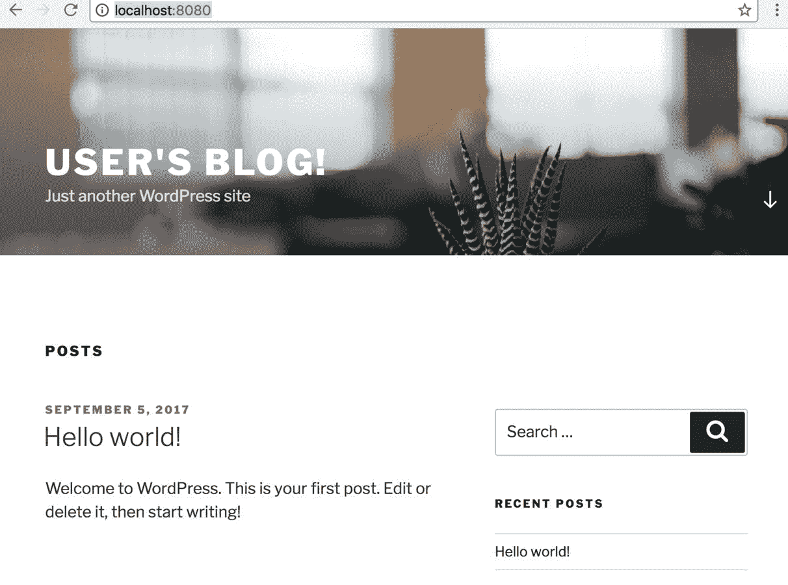

# 下一步是什么

到目前为止，我们已经全面讨论了围绕在 Kubernetes 上执行 DevOps 任务的主题。然而，在现实环境中实现知识总是具有挑战性的，因此你可能想知道 Kubernetes 是否能够解决你当前面临的特定问题。在本章中，我们将学习以下主题来应对挑战:

*   高级 Kubernetes 功能
*   Kubernetes 社区
*   其他容器编排器框架

# 探索Kubernetes的可能性

Kubernetes 每天都在发展，并且以每季度发布一个主要版本的速度发展。除了每一个新的 Kubernetes 发行版附带的内置功能之外，社区的贡献也在生态系统中扮演着重要的角色，我们将在本节中围绕它们进行一次参观。

# 掌握忽必烈

Kubernetes 的对象和资源分为三个 API 轨道，即 alpha、beta 和 stable，以表示它们的成熟度。每个资源头上的`apiVersion`字段表示它们的级别。如果一个特性有版本控制，比如 v1alpha1，它就属于 alpha 级别的 API，beta API 也是这样命名的。默认情况下，阿尔法级应用编程接口是禁用的，如有更改，恕不另行通知。

默认情况下启用测试级应用编程接口；它经过了良好的测试，被认为是稳定的，但是模式或对象语义也可以改变。其余部分是稳定的，通常可用的。一旦一个 API 进入稳定阶段，就不太可能再被更改了。

即使我们已经广泛地讨论了关于 Kubernetes 的概念和实践，仍然有相当多的特性我们没有提到，它们处理各种工作负载和场景，并使 Kubernetes 极其灵活。它们可能适用于也可能不适用于每个人的需求，并且在特定情况下不够稳定。让我们简单看一下流行的。

# 作业和 CronJob

它们也是高级 pod 控制器，允许我们运行最终将终止的容器。一项工作确保一定数量的Pod 成功运行到完成；CronJob 确保在给定的时间调用作业。如果我们需要运行批处理工作负载或计划任务，我们会知道有内置控制器发挥作用。相关信息见:[https://kubernetes . io/docs/concepts/workloads/controller/jobs-run-to-complete/](https://kubernetes.io/docs/concepts/workloads/controllers/jobs-run-to-completion/)。

# 荚果和节之间的亲和性和反亲和性

我们知道可以用节点选择器将一个 pod 手动分配给一些节点，节点可以拒绝带有污点的 pod。然而，当涉及到更灵活的情况时，比如说，我们可能希望一些Pod 位于同一位置，或者我们希望Pod 在可用性区域中平均分布，通过节点选择器或节点污点来安排我们的Pod 可能需要很大的努力。因此，亲和度被设计来解决这种情况:[https://kubernetes . io/docs/concepts/configuration/assign-pod-node/#亲和度和反亲和度](https://kubernetes.io/docs/concepts/configuration/assign-pod-node/#affinity-and-anti-affinity)。

# Pod 的自动缩放

几乎所有现代基础设施都支持自动扩展运行应用的实例组，Kubernetes 也是如此。Pod 水平缩放器(`PodHorizontalScaler`)能够使用控制器(如部署)中的中央处理器/内存指标来缩放Pod 副本。从 Kubernetes 1.6 开始，定标器正式支持基于自定义指标的定标，比如每秒事务数。更多信息可在[https://kubernetes . io/docs/tasks/run-application/horizontal-pod-autoscale/](https://kubernetes.io/docs/tasks/run-application/horizontal-pod-autoscale/)找到。

# 防止和减轻Pod 中断

我们知道 pods 是不稳定的，随着集群的扩展，它们会在节点间被终止和重新启动。如果一个应用中有太多的单元同时被销毁，可能会导致服务级别降低，甚至应用失败。尤其是当应用是有状态的或基于仲裁的，它可能几乎不能容忍 pod 中断。为了减轻中断，我们可以利用`PodDisruptionBudget`通知 Kubernetes 在任何给定时间我们的应用可以容忍多少不可用的Pod ，以便 Kubernetes 能够在知道应用的情况下采取适当的行动。更多信息，请参考。

另一方面，由于`PodDisruptionBudget`是一个被管理对象，它仍然不能排除由 Kubernetes 之外的因素引起的中断，例如节点的硬件故障，或者节点组件由于内存不足而被系统杀死。因此，我们可以将诸如节点问题检测器之类的工具合并到我们的监控堆栈中，并正确配置节点资源的阈值，以通知 Kubernetes 哪个节点开始耗尽节点或驱逐过多的 pods，从而防止情况变得更糟。有关节点问题检测器和资源阈值的更多详细指南，请参考以下主题:

*   [https://kubernetes . io/docs/tasks/debug-application-cluster/monitor-node-health/](https://kubernetes.io/docs/tasks/debug-application-cluster/monitor-node-health/)
*   [https://kubernetes . io/docs/tasks/administrator-cluster/资源不足/](https://kubernetes.io/docs/tasks/administer-cluster/out-of-resource/)

# 忽必烈联合会

联盟是一组集群。换句话说，它由多个 Kubernetes 集群组成，可以从单个控制平面访问。在联盟上创建的资源将在所有连接的集群上同步。从 Kubernetes 1.7 开始，可以联合的资源包括命名空间、配置映射、秘密、部署、DaemonSet、服务和入口。

当设计我们的软件时，联邦构建混合平台的能力给我们带来了另一个层次的灵活性。例如，我们可以联合部署在内部数据中心和各种公共云中的集群，以按成本分配工作负载，并利用特定于平台的功能，同时保持灵活性。另一个典型的使用案例是联合分散在不同地理位置的集群，以降低全球客户的边缘延迟。此外，由 etcd3 支持的单个 Kubernetes 集群支持 5，000 个节点，同时保持 p99 的 API 响应时间不到 1 秒(在 1.6 版本上)。如果需要一个具有数千个或更多节点的集群，我们当然可以联合集群来实现。

联盟指南可在以下链接找到:[https://kubernetes . io/docs/tasks/Federation/setup-cluster-Federation-kube fed/](https://kubernetes.io/docs/tasks/federation/set-up-cluster-federation-kubefed/)。

# 群集加载项

集群插件是为增强 Kubernetes 集群而设计或配置的程序，它们被认为是 Kubernetes 的固有部分。例如，我们在[第 6 章](06.html#43JDK0-6c8359cae3d4492eb9973d94ec3e4f1e)、*监控和日志*中使用的 Heapster 是一个附加组件，我们前面提到的节点问题检测器也是。

由于集群加载项可能用于一些关键功能，一些托管的 Kubernetes 服务(如 GKE)部署加载项管理器来保护加载项的状态不被修改或删除。托管加载项将在 pod 控制器上使用标签`addonmanager.kubernetes.io/mode`进行部署。如果模式为`Reconcile`，对规范的任何修改将回滚到其初始状态；`EnsureExists`模式只检查控制器是否存在，不检查其规格是否修改。例如，默认情况下，以下部署部署在 1.7.3 GKE 集群上，并且它们都在`Reconcile`模式下受到保护:


如果您想在自己的集群中部署加载项，可以在以下网址找到它们:[https://github . com/kubernetes/kubernetes/tree/master/cluster/addons](https://github.com/kubernetes/kubernetes/tree/master/cluster/addons)。

# Kubernetes 和社区

当选择一个开源工具来使用时，我们肯定想知道在我们开始使用它之后，它的支持度如何。支持度包括谁在领导项目、项目是否固执己见、项目受欢迎程度如何等因素。

Kubernetes 源于谷歌，现在得到了**云原生计算基金会** ( **CNCF** 、 [https://www.cncf.io](https://www.cncf.io) )的支持。在 Kubernetes 1.0 发布时，谷歌与 Linux 基金会合作成立了 CNCF，并捐赠了 Kubernetes 作为种子项目。CNCF 旨在促进容器化、动态编排和面向微服务的应用的开发。

由于 CNCF 的所有项目都是基于容器的，他们当然可以流畅地与 Kubernetes 一起工作。我们在[第 6 章](06.html#43JDK0-6c8359cae3d4492eb9973d94ec3e4f1e)、*监测和记录*中演示和提到的普罗米修斯、Fluentd 和 OpenTracing 都是 CNCF 的成员项目。

# 忽必烈的孵化器

Kubernetes 孵化器是一个支持 Kubernetes 项目的过程:

[https://github . com/kubrines/community/blob/master/incubator . MD](https://github.com/kubernetes/community/blob/master/incubator.md)。

分级项目可能会成为 Kubernetes 的一个核心功能，一个集群插件，或者 Kubernetes 的一个独立工具。在整本书中，我们已经看到并使用了其中的许多，包括 Heapster、cAdvisor、dashboard、minikube、kops、kube-state-metrics 和 kube-problem-detector，无论是什么让 Kubernetes 越来越好。你可以在Kubernetes([https://github.com/kubernetes](https://github.com/kubernetes))或者孵化器([https://github.com/kubernetes-incubator](https://github.com/kubernetes-incubator)下探索这些项目。

# 舵轮和海图

helm([https://github.com/kubernetes/helm](https://github.com/kubernetes/helm))是一个包管理器，它简化了在 Kubernetes 上运行软件的第 0 天到第 n 天的操作。这也是孵化器毕业的项目。

正如我们在[第 7 章](07.html#4REBM0-6c8359cae3d4492eb9973d94ec3e4f1e)、*持续交付*中了解到的，向 Kubernetes 部署一个容器化的软件基本上就是写清单。尽管如此，一个应用可能是用几十个 Kubernetes 资源构建的。如果我们要多次部署这样的应用，重命名冲突部分的任务可能会很麻烦。如果我们引入模板引擎的思想来解决重命名地狱，我们将很快意识到我们应该有一个地方来存储模板以及呈现的清单。因此，掌舵人就是要解决这些烦人的琐事。

Helm 中的包称为图表，它是运行应用的配置、定义和清单的集合。社区贡献的图表在此发布:[https://github.com/kubernetes/charts](https://github.com/kubernetes/charts)。即使我们不打算使用它，我们仍然可以在那里找到某个包的验证清单。

使用 Helm 非常简单。首先通过运行这里的官方安装脚本获得 Helm:[https://raw . githubusercontent . com/kubernetes/Helm/master/scripts/get](https://raw.githubusercontent.com/kubernetes/helm/master/scripts/get)。

在运行 Helm 二进制文件后，它获取我们的 kubectl 配置来连接到集群。我们需要在 Kubernetes 集群中有一个管理器`Tiller`来管理 Helm 的每个部署任务:

```
$ helm init
$HELM_HOME has been configured at /Users/myuser/.helm.

Tiller (the Helm server-side component) has been installed into your Kubernetes Cluster.
Happy Helming!  
```

If we'd like to initialize the Helm client without installing the Tiller to our Kubernetes cluster, we can add the `--client-only` flag to `helm init`. Furthermore, using the `--skip-refresh` flag together allows us to initialize the client offline.

Helm 客户端能够从命令行搜索可用的图表:

```
$ helm search
NAME                          VERSION     DESCRIPTION
stable/aws-cluster-autoscaler 0.2.1       Scales worker nodes within autoscaling groups.
stable/chaoskube              0.5.0       Chaoskube periodically kills random pods in you...
...
stable/uchiwa                 0.2.1       Dashboard for the Sensu monitoring framework
stable/wordpress              0.6.3       Web publishing platform for building blogs and ...  
```

让我们从存储库中安装一个图表，比如最后一个，`wordpress`:

```
$ helm install stable/wordpress
NAME:   plinking-billygoat
LAST DEPLOYED: Wed Sep  6 01:09:20 2017
NAMESPACE: default
STATUS: DEPLOYED
...  
```

Helm 中部署的图表是一个版本。在这里，我们安装了一个版本`plinking-billygoat`。一旦Pod 和服务准备就绪，我们就可以连接到我们的站点并检查结果:



一个版本的拆卸也只需要一行命令:

```
$ helm delete plinking-billygoat
release "plinking-billygoat" deleted 
```

Helm leverages ConfigMap to store the metadata of a release, but deleting a release with `helm delete` won't delete its metadata. To wholly clear these metadata, we could either manually delete these ConfigMaps or add the `--purge` flag when executing `helm delete`.

除了管理我们集群中的包之外，Helm 带来的另一个价值是它被建立为共享包的标准，因此它允许我们直接安装流行的软件，比如我们安装的 Wordpress，而不是为我们使用的每个软件重写清单。

# 被未来的基础设施所吸引

很难判断一个工具是否合适，尤其是在选择集群管理软件来支持业务任务时，因为每个人面临的困难和挑战各不相同。除了诸如性能、稳定性、可用性、可伸缩性和可用性等客观问题之外，实际情况也是决定的重要部分。例如，选择堆栈来开发绿地项目和在庞大的遗留系统上构建附加层的观点可能是多种多样的。同样，由一个高凝聚力的 DevOps 团队和一个以旧方式工作的组织提供的运营服务也可能导致不同的选择。

除了 Kubernetes 之外，还有其他平台也以编排容器为特色，它们都提供了一些简单的入门方法。让我们后退一步，对它们进行概述，找出最适合的。

# 码头工人群体模式

swarm mode([https://docs.docker.com/engine/swarm/](https://docs.docker.com/engine/swarm/))是 Docker 自 1.12 版本以来集成在 Docker 引擎中的原生管弦乐器。因此，它与 Docker 本身共享相同的应用编程接口和用户界面，包括 Docker 编写文件的使用。这种程度的集成被认为是有利也有弊，这取决于人们是否愿意使用堆栈，因为所有组件都来自同一个供应商。

集群由管理者和工作人员组成，其中管理者是共识组的一部分，以保持集群的状态，同时保持高可用性。启用集群模式非常容易。大致来说，这里只有两步:用`docker swarm init`创建集群，用`docker swarm join`加入其他管理人员和工人。此外，Docker 提供的 Docker Cloud([https://cloud.docker.com/swarm](https://cloud.docker.com/swarm))帮助我们在各种云提供商上引导一个 swam 集群。

群模式附带的特性是我们期望在容器平台中拥有的特性，也就是说，容器生命周期管理、两种调度策略(复制和全局，分别类似于 Kubernetes 中的 Deployment 和 DaemonSet)、服务发现、秘密管理等等。还有一个入口网络，工作方式类似于 Kubernetes 中的 NodePort 类型的服务，但是如果我们需要一个 L7 层的 LoadBalancer，我们将不得不调出一些东西，比如 nginx 或者 Traefik。

总之，集群模式提供了一个选项来编排容器化的应用，一旦开始使用 Docker，这些应用就会开箱即用。与此同时，由于它与 Docker 和简单架构使用相同的语言，它也被认为是所有选择中最容易的平台。因此，选择集群模式来快速完成一些事情确实是合理的。然而，它的简单性有时会导致缺乏灵活性。例如，在 Kubernetes 中，我们仅仅通过操作选择器和标签就可以使用蓝/绿部署策略，但是在集群模式中没有简单的方法可以做到这一点。由于群模式仍在积极开发中，例如在 17.06 版本中引入了类似于 Kubernetes 中的 ConfigMap 的存储配置数据的功能，我们肯定可以期待群模式在保持其简单性的同时在未来变得更加强大。

# 亚马逊 EC2 集装箱服务

EC2 集装箱服务(ECS，[https://aws.amazon.com/ecs/](https://aws.amazon.com/ecs/))是 AWS 对 Docker 热潮的回应。与谷歌云平台和微软 Azure 提供开源集群管理器(如 Kubernetes、Docker Swarm 和 DC/OS)不同，AWS 坚持自己的方式来响应容器服务的需求。

ECS 将它的 Docker 作为它的容器运行时，它也接受语法版本 2 中的 Docker Compose 文件。此外，ECS 和 Docker Swarm 模式的术语几乎是一样的，比如任务和服务的概念。然而相似之处仅止于此。尽管 ECS 的核心功能很简单，甚至是初级的，但作为 AWS 的一部分，ECS 充分利用其他 AWS 产品来增强自己，例如用于容器联网的 VPC、用于监控和日志记录的 CloudWatch 和 CloudWatch 日志、用于服务发现的带有目标组的应用负载平衡器和网络负载平衡器、用于基于 DNS 的服务发现的带有路由 53 的 Lambda、用于 CronJob 的 CloudWatch 事件、用于数据持久性的 EBS 和 EFS、用于 docker 注册表的 ECR、用于存储配置文件和机密的参数存储和 KMS、用于 CI/CD 的 CodePipeline 等等。还有一个 AWS 产品，AWS Batch([https://aws.amazon.com/batch/](https://aws.amazon.com/batch/))构建在 ECS 之上，用于处理批处理工作负载。此外，来自 AWS ECS 团队的开源工具 Blox([https://Blox . github . io](https://blox.github.io))通过将 AWS 产品连接起来，增强了定制 ECS 未附带的调度的能力，例如类似 DaemonSet 的策略。从另一个角度来看，如果我们把 AWS 作为一个整体来评价 ECS，它确实很强大。

设置一个 ECS 集群很容易:通过 AWS 控制台或 API 创建一个 ECS 集群，并将带有 ECS 代理的 EC2 节点加入集群。好的一点是，主端由 AWS 管理，这样我们就不用再对主端保持警惕了。

总的来说，ECS 很容易上手，尤其是对于熟悉 Docker 以及 AWS 产品的人来说。另一方面，如果我们对当前提供的原语不满意，我们必须用前面提到的其他 AWS 服务或第三方解决方案来完成一些工作，这可能会导致这些服务的不必要的成本以及配置和维护工作，以确保每个组件都能很好地协同工作。此外，ECS 仅在 AWS 上可用，这也可能是人们会认真对待它的一个顾虑。

# 阿帕奇月

*Mesos*([http://mesos.apache.org/)](http://mesos.apache.org/))早在 Docker 掀起容器潮流之前就已经创建了，其目标是在支持不同工作负载的同时，解决在包含通用硬件的集群中管理资源的困难。为了构建这样一个通用平台，Mesos 利用两层架构来划分资源分配和任务执行。因此，执行部分理论上可以扩展到任何类型的任务，包括编排 Docker 容器。

尽管我们在这里只讨论了 Mesos 这个名字，但事实上它基本上负责一层工作，执行部分由其他称为 Mesos 框架的组件完成。例如，Marathon([https://mesosphere.github.io/marathon/](https://mesosphere.github.io/marathon/))和 Chronos([https://mesos.github.io/chronos/](https://mesos.github.io/chronos/))是两个分别部署长时间运行和批处理任务的流行框架，它们都支持 Docker 容器。这样，当提到术语“介子”时，它指的是一个堆栈，如介子/马拉松/超时空或介子/极光。事实上，在 Mesos 的双层架构下，将 Kubernetes 作为 Mesos 框架运行也是可行的。

坦率地说，一个组织得当的 Mesos 堆栈和 Kubernetes 在功能方面几乎是一样的，只是 Kubernetes 要求在其上运行的所有东西都应该被容器化，而不管 Docker、rkt 或虚拟机管理程序容器如何。另一方面，由于 Mesos 专注于其通用调度并倾向于保持其核心小，一些基本功能应该单独安装、测试和操作，这可能会带来额外的努力。

中间层发布的 DC/OS([https://dcos.io/](https://dcos.io/))利用中间层的优势构建了一个全栈集群管理平台，在能力上更接近 Kubernetes。作为构建在 Mesos 之上的每个解决方案的一站式商店，它捆绑了几对组件来驱动整个系统，马拉松用于常见的工作负载，节拍器用于计划的作业，Mesos-DNS 用于服务发现，等等。尽管这些构建块看起来很复杂，但 DC 操作系统通过云信息/地形模板及其包管理系统中间层宇宙，极大地简化了安装和配置工作。从 DC/OS 1.10 开始，Kubernetes 正式集成到 DC/OS 中，可以通过宇宙安装。托管的 DC/操作系统也可以在一些云提供商上使用，例如微软 Azure。

下面的截图是 DC/操作系统的网络控制台界面，它聚合了来自每个组件的信息:


到目前为止，我们已经讨论了 DC/操作系统的社区版本，但是一些功能仅在企业版中可用。他们大多是关于安全和合规的，名单可以在[https://mesosphere.com/pricing/](https://mesosphere.com/pricing/)找到。

# 摘要

在本章中，我们简要讨论了适用于某些更具体用例的 Kubernetes 特性，并指导了在哪里以及如何利用强大的社区，包括 Kubernetes 孵化器和包管理器 Helm。

最后，我们回到开头，为同一个目标概述了其他三种流行的替代方案:编排容器，以便在选择下一代基础架构时将结论留在脑海中。