# 二、使用 Docker 容器

在本章中，我们将介绍以下食谱:

*   列出/搜索映像
*   绘制映像
*   列出映像
*   启动容器
*   列出容器
*   查看容器日志
*   停止容器
*   移除容器
*   移除所有停止的容器
*   在容器上设置重启策略
*   获得容器内部的特权访问
*   访问容器内的主机设备
*   将新流程注入运行中的容器
*   读取容器的元数据
*   标签和过滤容器
*   阅读容器内的僵尸

# 介绍

在前一章中，在安装了 Docker 之后，我们提取了一个映像，并从中创建了一个容器。Docker 的主要目标是运行容器。在本章中，我们将看到我们可以对容器执行的不同操作，例如启动、停止、列出、删除等等。这将有助于我们将 Docker 用于不同的用例，例如测试、CI/CD、设置 PaaS 等等，我们将在后面的章节中介绍。在开始之前，让我们通过运行以下命令来验证 Docker 安装:

```
 $ docker version 
```

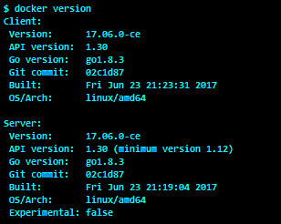

这将给出 Docker 客户端和服务器版本，以及其他细节。

I am using Ubuntu 18.04 as my primary environment in which to run these recipes. They should also work with the other environments.

# 列出/搜索映像

我们需要一个映像来启动容器。让我们看看如何在 Docker 注册表中搜索映像。正如我们在[第 1 章](01.html)、*介绍和安装*中看到的，注册表保存 Docker 映像，可以是公共的也可以是私有的。默认情况下，搜索在默认的公共注册中心进行，该注册中心是 Docker Hub，位于[https://hub.docker.com/](https://hub.docker.com/.)。

# 准备好

确保 Docker 守护程序正在主机上运行，并且可以通过 Docker 客户端进行连接。

# 怎么做...

`docker search`命令允许您在 Docker 注册表中搜索映像。以下是其语法:

```
    docker search [OPTIONS] TERM 
```

以下是搜索`alpine`映像的示例:

```
 $ docker search --limit 5 alpine 
```

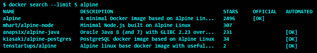

前面的截图列出了该图片的名称、描述和星星数量。它还指出映像是否是官方的和自动化的:

*   `STARS`表示有多少人喜欢给定的映像。
*   `OFFICIAL`栏帮助我们识别映像是否是从可信来源构建的。
*   `AUTOMATED`列是一种方式，告诉你当一个映像被推入 GitHub 或 Bitbucket 存储库时，它是否是自动构建的。关于`AUTOMATED`的更多细节可以在下一章找到。

The convention for an image name is `<user>/<name>`, but it can be anything.

# 它是如何工作的...

Docker 在 Docker 公共注册中心搜索映像，该注册中心在[https://index.docker.io/v1/](https://index.docker.io/v1/.)有一个映像存储库。

我们也可以配置我们的私有注册表，这样它也可以在那里搜索映像。

# 还有更多...

*   要列出获得超过`20`星并且是自动的映像，运行以下命令:

```
    $ docker search \
          --filter is-automated=true \
          --filter stars=20 alpine

```

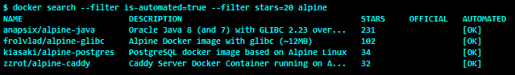

在[第 3 章](03.html)、*使用 Docker Images* 中，我们将看到如何设置自动化构建。

从 Docker 1.3 开始，为 Docker 守护程序提供了`--insecure-registry`选项，它允许我们从不安全的注册表中搜索/提取/提交映像。更多详情，请看[https://docs.docker.com/registry/insecure/](https://docs.docker.com/registry/insecure/)。

# 请参见

通过运行以下命令查看 Docker `search`上的帮助:

```
    $ docker search --help  
```

这个的文档在 Docker 网站上:https://docs . Docker . com/edge/engine/reference/command line/search/。

# 绘制映像

搜索完映像后，我们可以通过运行 Docker 守护程序将其拉至系统。让我们看看如何做到这一点。

# 准备好

确保 Docker 守护程序正在主机上运行，并且可以通过 Docker 客户端进行连接。

# 怎么做...

要从 Docker 注册表中提取映像，您可以运行以下命令:

```
 docker image pull [OPTIONS] NAME[:TAG|@DIGEST]
```

或者传统命令:

```
 docker pull [OPTIONS] NAME[:TAG|@DIGEST]
```

以下是拉动`ubuntu`映像的示例:

```
    $ docker image pull ubuntu
```

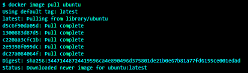

# 它是如何工作的...

`pull`命令从 Docker 注册表下载本地创建该映像所需的所有图层。我们将在下一章看到关于层的细节。

# 还有更多...

映像标签将相同类型的映像分组。例如，CentOS 可以有带有标签的映像，如`centos6`、`centos7`等。例如，要提取带有特定标签的映像，请运行以下命令:

```
    $ docker image pull centos:centos7
```

默认情况下，带有最新标记的映像会被拉取。要拉取所有标签对应的所有映像，请使用以下命令:

```
    $ docker image pull --all-tags alpine  
```

从 Docker 1.6([https://blog.docker.com/2015/04/docker-release-1-6/](https://blog.docker.com/2015/04/docker-release-1-6/))中，我们可以通过称为`digest`的新内容可寻址标识符来构建和引用映像。当我们想要处理特定的映像而不是标签时，这是一个非常有用的特性。要提取具有特定摘要的映像，我们可以使用以下语法:

```
    $ docker image pull <image>@sha256:<digest>
```

以下是使用上述命令的示例:

```
    $ docker image pull nginx@sha256:788fa27763db6d69ad3444e8ba72f947df9e7e163bad7c1f5614f8fd27a311c3 
```

只有 Docker 注册表的版本 2 支持摘要。

一旦映像被提取，它就驻留在本地缓存(存储)中，因此后续的提取将非常快。这个特性在构建 Docker 分层映像中起着非常重要的作用。

# 请参见

查看`docker image pull`的`help`选项:

```
$ docker image pull --help
```

*   Docker 网站上的相关文档可以在这里找到:[https://docs . Docker . com/engine/reference/command line/image _ pull/](https://docs.docker.com/engine/reference/commandline/image_pull/)。

# 列出映像

我们可以通过运行 Docker 守护程序来列出系统上可用的映像。这些映像可能是从注册表中提取的，通过`docker image pull`命令导入的，或者通过 Dockerfile 创建的。

# 准备好

确保 Docker 守护程序正在主机上运行，并且可以通过 Docker 客户端进行连接。

# 怎么做...

运行以下任一命令来列出映像:

```
    $ docker image ls
    $ docker images
```

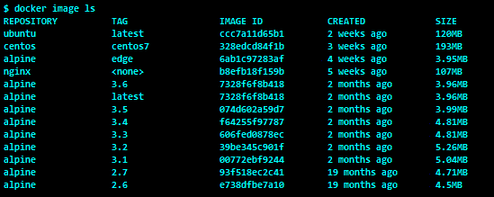

# 它是如何工作的...

Docker 客户端与 Docker 引擎对话，并获得下载(拉)到 Docker 主机的映像列表。

# 还有更多...

下载所有同名但不同标签的图片。这里要注意的有趣的事情是，它们有相同的名称，但不同的标签。同样的`IMAGE ID`有两个不同的标签，分别是`7328f6f8b418`。

# 请参见

查看`docker image ls`的`help`选项:

```
    $ docker image ls --help
```

Docker 网站上的文档可以在这里找到:[https://docs . Docker . com/engine/reference/command line/image _ ls/](https://docs.docker.com/engine/reference/commandline/image_ls/)。

# 启动容器

一旦我们有了映像，我们就可以用它们来启动容器。在这个食谱中，我们将以`ubuntu:latest`映像开始一个容器，看看幕后发生了什么。

# 准备好

确保 Docker 守护程序正在主机上运行，并且可以通过 Docker 客户端进行连接。

# 怎么做...

我们可以使用以下任一语法启动容器:

```
    docker run [OPTIONS] IMAGE [COMMAND] [ARG...]
    docker container run [OPTIONS] IMAGE [COMMAND] [ARG...]
```

The `docker container run` command is recommended over `docker run` because, in version 1.13, Docker logically grouped container operations under the `docker container management` command, and so `docker run` might be obsolete in the future.

下面是使用`docker container run`命令的一个例子:

```
    $ docker container run -i -t --name mycontainer ubuntu /bin/bash
```

默认情况下，Docker 选取带有最新标签的映像:

*   通过保持`STDIN`打开，`-interactive`或`-i`选项以交互模式启动容器
*   `--tty`或`-t`选项分配一个`pseudo-tty`并将其附加到标准输入

因此，使用前面的命令，我们可以从`ubuntu:latest`映像开始一个容器，附加`pseudo-tty`，将其命名为`mycontainer`，并运行`/bin/bash`命令。如果未指定名称，则将随机分配一个字符串作为名称。

此外，如果映像在本地不可用，则它将首先从注册表中下载，然后运行。

# 它是如何工作的...

在引擎盖下，Docker 将:

*   合并所有的层，组成使用 UnionFS 的映像。
*   为容器分配一个唯一的标识，称为容器标识。
*   为容器分配文件系统并安装读/写层。该层上的任何更改都是临时的，如果没有提交，将被丢弃。
*   分配一个网桥网络接口。
*   为容器分配一个 IP 地址。
*   执行用户指定的过程。

同样，使用默认的 Docker 配置，它会创建一个目录(容器的 ID 在`/var/lib/docker/containers`内)，其中包含容器的特定信息，如主机名、配置详细信息、日志和`/etc/hosts`。

# 还有更多...

要退出容器，请按 *Ctrl* + *D* 或键入`exit`。这类似于从外壳中退出，但这将停止容器。或者，按下*Ctrl*+*P*+*Q*从容器上拆下。被分离的容器将自己从终端上分离，将控制权交还给 Docker 主机外壳，并等待`docker container attach`命令重新连接到容器。

`run`命令创建并启动容器。使用 Docker 1.3 或更高版本，可以只使用`create`命令创建容器，然后使用`start`命令运行它，如下例所示:

```
    $ ID=$(docker container create -t -i ubuntu /bin/bash)
    $ docker container start -a -i $ID
```

容器可以在后台启动，然后我们可以随时附加到它。我们需要使用`-d`选项在后台启动容器:

```
    $ docker container run -d -i -t ubuntu /bin/bash 
    0df95cc49e258b74be713c31d5a28b9d590906ed9d6e1a2dc75672aa48f28c4f
```

前面的命令返回容器的容器标识，我们可以稍后附加到它，如下所示:

```
    $ ID=$(docker container run -d -t -i ubuntu /bin/bash)`
    $ docker attach $ID
```

在前一种情况下，我们选择`/bin/bash`在容器内运行。如果我们连接到容器，我们将获得一个交互式外壳。我们可以运行一个非交互的进程，并在后台运行它来制作一个去监控的容器，如下所示:

```
    $ docker container run -d  ubuntu \
           /bin/bash -c  \
           "while [ true ]; do date; sleep 1; done"
```

要在容器退出后将其取出，请使用`--rm`选项启动容器，如下所示:

```
    $ docker run --rm ubuntu date
```

一旦`date`命令退出，容器将被移除。

`run`命令的`--read-only`选项将在`read-only`模式下挂载根文件系统:

```
    $ docker container run --read-only --rm \
          ubuntu touch file
    touch: cannot touch 'file': Read-only file system
```

您还可以为容器设置自定义标签，这可用于根据标签对容器进行分组。详见本章*标签和过滤容器*配方。

A container can be referred to in three ways: by name, by its short container ID (`0df95cc49e25`), and by its container ID (`0df95cc49e258b74be713c31d5a28b9d590906ed9d6e1a2dc75672aa48f28c4f`).

# 请参见

查看`docker run`的`help`选项:

```
    $ docker container run --help
```

Docker 网站上的文档可以在这里找到:[https://docs . Docker . com/engine/reference/command line/container _ run/](https://docs.docker.com/engine/reference/commandline/container_run/)。

# 列出容器

我们可以列出运行和停止的容器。

# 准备好

确保 Docker 守护程序正在主机上运行，并且可以通过 Docker 客户端进行连接。您还需要一些运行和/或停止的容器。

# 怎么做...

要列出容器，请运行以下命令:

```
    docker container ls [OPTIONS]
```

或者运行以下旧命令:

```
    docker ps [OPTIONS]
```

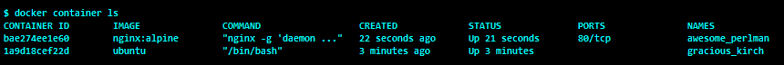

# 它是如何工作的...

Docker 守护程序将查看与容器相关联的元数据并列出它们。默认情况下，该命令返回以下内容:

*   容器标识
*   创建它的映像
*   启动容器后运行的命令
*   创建时间的详细信息
*   当前状态
*   从容器露出的端口
*   容器的名称

# 还有更多...

要列出正在运行和已停止的容器，请使用-a 选项，如下所示:

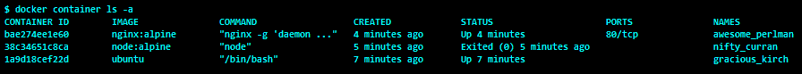

要返回所有容器的容器标识，请使用如下的`-aq`选项:


要显示上次创建的容器，包括未运行的容器，请运行以下命令:

```
    $ docker container ls -l
```

使用`--filter/-f`选项到`ps`，我们可以列出带有特定标签的容器。详见本章*标签和过滤容器*配方。

# 请参见

查看`docker container ls`的`help`选项:

```
    $ docker container ls --help
```

Docker 网站上的文档可以在这里找到:[https://docs . Docker . com/engine/reference/command line/container _ ls/](https://docs.docker.com/engine/reference/commandline/container_ls/)。

# 查看容器日志

如果容器在`STDOUT` / `STDERR`上发出日志或输出，那么我们无需登录容器就可以获取。

# 准备好

确保 Docker 守护程序正在主机上运行，并且可以通过 Docker 客户端进行连接。您还需要一个运行容器，在`STDOUT`上发出日志/输出。

# 怎么做...

要从容器中获取日志，请运行以下命令:

```
    docker container logs [OPTIONS] CONTAINER
```

或者运行以下旧命令:

```
    docker logs [OPTIONS] CONTAINER
```

让我们举一个前面的例子，我们运行了一个后台容器并查看了日志:

```
    $ docker container run -d  ubuntu \
           /bin/bash -c  \
           "while [ true ]; do date; sleep 1; done"
```

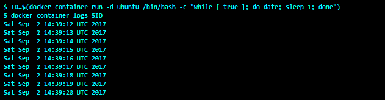

# 它是如何工作的...

Docker 将从`/var/lib/docker/containers/<Container ID>/<Container ID>-json.log`开始查看容器的特定日志文件并显示结果。

# 还有更多...

使用`-t`选项，我们可以获得每个日志行的时间戳，使用`-f`我们可以获得类似尾部的行为。

# 请参见

查看`docker container logs`的`help`选项:

```
    $ docker container logs --help
```

Docker 网站上的文档可以在这里找到:[https://docs . Docker . com/engine/reference/command line/container _ logs/](https://docs.docker.com/engine/reference/commandline/container_logs/)。

# 停止容器

我们可以一次停止一个或多个容器。在这个食谱中，我们将首先启动一个容器，然后停止它。

# 准备好

确保 Docker 守护程序正在主机上运行，并且可以通过 Docker 客户端进行连接。您还需要一个或多个运行容器。

# 怎么做...

要停止容器，请运行以下命令:

```
    docker container stop [OPTIONS] CONTAINER [CONTAINER...]
```

或者运行以下旧命令:

```
    docker stop [OPTIONS] CONTAINER [CONTAINER...]
```

如果你已经有正在运行的容器，那么你可以继续并停止它们；否则，我们可以创建一个，然后按如下方式停止它:

```
    $ ID=$(docker run -d -i ubuntu /bin/bash)
    $ docker stop $ID
```

# 它是如何工作的...

这将通过停止容器内运行的进程，将容器从运行状态移动到停止状态。如果需要，停止的容器可以再次启动。

# 还有更多...

要在等待一段时间后停止容器，请使用`--time/-t`选项。

要停止所有正在运行的容器，请运行以下命令:

```
    $ docker stop $(docker ps -q)
```

# 请参见

查看`docker container stop`的`help`选项:

```
    $ docker container stop --help
```

Docker 网站上的文档可以在这里找到:[https://docs . Docker . com/engine/reference/command line/container _ stop/](https://docs.docker.com/engine/reference/commandline/container_stop/)。

# 移除容器

我们可以永久移除容器，但在此之前，我们必须停止容器或使用强制选项。在这个食谱中，我们将创建和删除一个容器。

# 准备好

确保 Docker 守护程序正在主机上运行，并且可以通过 Docker 客户端进行连接。您还需要一些处于停止或运行状态的容器来删除它们。

# 怎么做...

使用以下命令:

```
    $ docker container rm [OPTIONS] CONTAINER [CONTAINER]
```

或者运行以下旧命令:

```
    $ docker rm [OPTIONS] CONTAINER [CONTAINER]
```

让我们首先创建一个容器，然后使用以下命令将其删除:

```
    $ ID=$(docker container create ubuntu /bin/bash)
    $ docker container stop $ID
    $ docker container rm $ID
```

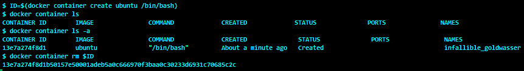

从前面的截图中我们可以看到，容器并没有出现，只是被停止后进入了`docker container ls`命令。为了列出它，我们必须提供`-a`选项。

# 还有更多...

要移除正在运行的容器，必须先使用`docker container stop`命令停止容器，然后使用`docker container rm`命令移除容器。

使用`docker container rm`命令的`-f`选项，强制移除没有中间停止的容器。

要移除所有容器，我们首先需要停止所有正在运行的容器，然后移除它们。运行这些命令之前要小心，因为它们会删除正在运行和已停止的容器:

```
    $ docker container stop $(docker container ls -q)
    $ docker container rm $(docker container ls -aq)
```

有一些选项可以删除与容器相关联的指定链接和卷，我们将在后面探讨。

# 它是如何工作的...

Docker 守护程序将删除在启动容器时创建的读/写层。

# 请参见

查看`docker container rm`的`help`选项:

```
    $ docker container rm --help
```

Docker 网站上的文档可以在这里找到:[https://docs . Docker . com/engine/reference/command line/container _ RM/](https://docs.docker.com/engine/reference/commandline/container_rm/)。

# 移除所有停止的容器

我们可以用一个命令删除所有停止的容器。在这个食谱中，我们将创建一堆处于停止状态的容器，然后删除它们。

# 准备好

确保 Docker 守护程序 1.13(及以上版本)在主机上运行，并且可以通过 Docker 客户端进行连接。您还需要一些处于停止或运行状态的容器来删除它们。

# 怎么做...

使用以下命令:

```
    $ docker container prune [OPTIONS]
```

让我们首先创建一个容器，然后使用以下命令将其删除:

```
    $ docker container create --name c1 ubuntu /bin/bash
    $ docker container run --name c2 ubuntu /bin/bash
    $ docker container prune
```


# 还有更多...

默认情况下，`docker container prune`命令确认提示用户确认，然后移除未处于运行状态的容器。

您可以使用`docker container prune`命令的`-f`或`--force`选项来避免上述确认。

# 它是如何工作的...

Docker 守护程序将遍历没有运行的容器，并将它们移除。

# 请参见

查看`docker container prune`的`help`选项:

```
    $ docker container prune --help
```

Docker 网站上的文档可以在这里找到:[https://docs . Docker . com/engine/reference/command line/container _ prune/](https://docs.docker.com/engine/reference/commandline/container_prune/)。

# 在容器上设置重启策略

在 Docker 1.2 之前，当容器因任何原因退出或 Docker 主机重新启动时，必须使用`restart`命令手动重新启动容器。随着 Docker 1.2 的发布，基于策略的重启功能被添加到 Docker 引擎中，以自动重启容器。该功能使用`run`命令的`--restart`选项激活，它支持在 Docker 主机启动时以及当容器出现故障时重新启动容器。

# 准备好

确保 Docker 守护程序正在主机上运行，并且可以通过 Docker 客户端进行连接。

# 怎么做...

您可以使用以下语法设置重启策略:

```
    $ docker container run --restart=POLICY [OPTIONS] IMAGE[:TAG]  [COMMAND] [ARG...] 
```

下面是使用上述命令的示例:

```
    $ docker container run --restart=always -d -i -t ubuntu /bin/bash
```

有三种重启策略可供选择:

*   `no`:如果容器死亡，这不会启动容器
*   `on-failure`:如果容器失败，并且退出代码不为零，这将重新启动容器
*   `always`:这总是重新启动容器，而不用担心返回代码

# 还有更多...

您也可以通过`on-failure`策略获得可选的重启次数，如下所示:

```
    $ docker container run --restart=on-failure:3 \
          -d -i -t ubuntu /bin/bash
```

如果出现任何故障，前面的命令只会重新启动容器三次。

# 请参见

查看`docker container run`的`help`选项:

```
    $ docker container run --help
```

你可以在 Docker 的网站上找到帮助:https://docs . Docker . com/engine/reference/command line/concon con con _ run/[，https://docs . Docker . com/engine/reference/run/# restart-policies-restart](https://docs.docker.com/engine/reference/run/#restart-policies-restart)。

Docker 关于自动启动容器的文档可以在这里找到:[https://docs . docker . com/engine/admin/start-containers-automatic/](https://docs.docker.com/engine/admin/start-containers-automatically/)。

如果重启策略不符合您的要求，则使用流程经理，如`systemd`、主管或新贵。

# 获得容器内部的特权访问

Linux 将传统上与超级用户相关的特权划分为不同的单元，称为功能(在基于 Linux 的系统上运行`man capabilities`)，可以独立启用和禁用。例如，`net_bind_service`功能允许非用户进程将端口绑定到 1，024 以下。默认情况下，Docker 以有限的功能启动容器。通过容器内的特权访问，我们分配了更多的能力来执行通常由根用户完成的操作。为了更好地理解特权模式，让我们首先在非特权容器上尝试一个简单的挂载，并观察其效果:


# 准备好

确保 Docker 守护程序正在主机上运行，并且可以通过 Docker 客户端进行连接。

# 怎么做...

要使用`privileged`模式，请使用以下命令:

```
    $ docker container run --privileged [OPTIONS] IMAGE [COMMAND] [ARG...]
```

现在，让我们用特权访问来尝试前面的例子:

```
    $ docker container run --privileged -i -t ubuntu /bin/bash
```


# 它是如何工作的...

这提供了容器内的几乎所有功能。

# 还有更多...

这种模式会导致安全风险，因为容器可以在 Docker 主机上获得根级访问权限。在 Docker 1.2 或更高版本中，添加了两个名为`--cap-add`和`--cap-del`的新标志，以提供容器内部的细粒度控制。例如，要防止容器内出现任何`chown`，请使用以下命令:

```
    $ docker container run --cap-drop=CHOWN [OPTIONS] IMAGE [COMMAND]  
 [ARG...]
```

详见[第九章](09.html)、*Docker 安全*。

# 请参见

查看`docker container run`的`help`选项:

```
    $ docker container run --help
```

Docker 网站上的文档可以在这里找到:

*   [https://docs . docker . com/engine/reference/command line/container _ run/](https://docs.docker.com/engine/reference/commandline/container_run/)
*   [https://docs . docker . com/engine/reference/run/# runtime-priority-and-Linux-capabilities](https://docs.docker.com/engine/reference/run/#runtime-privilege-and-linux-capabilities)

Docker 1.2 发布公告可以在这里找到:[http://blog.docker.com/2014/08/announcing-docker-1-2-0/](http://blog.docker.com/2014/08/announcing-docker-1-2-0/)。

# 访问容器内的主机设备

从 Docker 1.2 开始，我们可以按照`run`命令，使用`--device`选项授予主机设备对容器的访问权限。之前，你必须用`-v`选项绑定挂载它，而这必须用`--privileged`选项来完成。

# 准备好

确保 Docker 守护程序正在主机上运行，并且可以通过 Docker 客户端进行连接。您还需要一个设备来传递容器。

# 怎么做...

您可以使用以下语法授予主机设备对容器的访问权限:

```
    docker container run --device=<Host Device>:<Container Device Mapping>:<Permissions> [OPTIONS] IMAGE [COMMAND]  [ARG...]

```

下面是使用上述命令的示例:

```
    $ docker container run --device=/dev/sdc:/dev/xvdc \
              -i -t ubuntu /bin/bash
```

# 它是如何工作的...

前面的命令将访问容器内的`/dev/sdc`。

# 请参见

查看`docker container run`的`help`选项:

```
    $ docker container run --help
```

Docker 网站上的文档可以在这里找到:[https://docs . Docker . com/engine/reference/command line/container _ run/](https://docs.docker.com/engine/reference/commandline/container_run/)。

# 将新流程注入运行中的容器

在进行开发和调试时，我们可能希望查看已经运行的容器内部。有几个实用程序，比如`nsenter`([【https://github.com/jpetazzo/nsenter】](https://github.com/jpetazzo/nsenter))，允许我们进入容器的命名空间来检查它的状态。通过在 Docker 1.3 中添加的`exec`选项，我们可以在运行的容器中注入一个新的进程。

# 准备好

确保 Docker 守护程序正在主机上运行，并且您可以通过 Docker 客户端进行连接。您可能还需要一个正在运行的容器来将进程注入其中。

# 怎么做...

您可以使用以下命令将进程注入正在运行的容器中:

```
     $ docker exec [OPTIONS] CONTAINER COMMAND [ARG...]
```

让我们启动一个`nginx`容器，然后将`bash`注入其中:

```
    $ ID=$(docker container run -d redis)
    $ docker container exec -it $ID /bin/bash
```

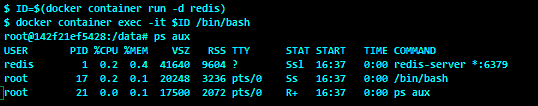

# 它是如何工作的...

`exec`命令进入容器的命名空间，开始新的进程。

# 请参见

查看 Docker 检查的`help`选项:

```
       $ docker container exec --help
```

Docker 网站上的文档可以在这里找到:[https://docs . Docker . com/engine/reference/command line/container _ exec/](https://docs.docker.com/engine/reference/commandline/container_exec/)。

# 读取容器的元数据

在进行调试、自动化等工作时，我们需要容器的配置细节。Docker 提供了`container inspect`命令来轻松获取这些。

# 准备好

确保 Docker 守护程序正在主机上运行，并且可以通过 Docker 客户端进行连接。

# 怎么做...

要检查容器，请运行以下命令:

```
    $ docker container inspect [OPTIONS] CONTAINER [CONTAINER...]
```

我们将启动一个容器，然后检查它，就像这样:

```
    $ ID=$(docker container run -d -i ubuntu /bin/bash)
    $ docker container inspect $ID
```


# 它是如何工作的...

Docker 将查看给定容器的元数据和配置，并以 JSON 格式呈现它。使用像`jq`这样的工具，这个 JSON 格式的输出可以进一步后处理。

# 还有更多...

通过`-f | --format`选项，我们可以使用 Go(编程语言)模板来获取这些特定信息。以下命令将为我们提供容器的 IP 地址:

```
    $ docker container inspect \
         --format='{{.NetworkSettings.IPAddress}}'  $ID
    172.17.0.2
```

# 请参见

查看`docker container inspect`的`help`选项:

```
       $ docker container inspect --help
```

Docker 网站上的文档可以在这里找到:[https://docs . Docker . com/engine/reference/command line/container _ inspect/](https://docs.docker.com/engine/reference/commandline/container_inspect/)。

# 标签和过滤容器

在 Docker 1.6 中，增加了一个特性，这样我们就可以标记容器和映像，通过它们我们可以将任意键值对作为元数据附加。您可以将它们视为环境变量，这些变量对于在容器内运行的应用来说是不可用的，但是对于管理映像和容器的 Docker 客户端来说是可用的。附加到映像上的标签也会应用到开始使用这些映像的容器上。我们也可以在启动容器时给它们贴上标签。标记了映像或容器后，标签可用于过滤或选择目的。

对于这个食谱，让我们假设我们有一个标签为`com.example.image=docker-cookbook`的映像。我们将在下一章中看到如何为映像分配标签:

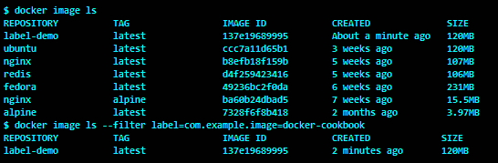

从前面的截图中可以看到，如果我们使用带有`docker image ls`命令的过滤器，我们只能得到在映像元数据中找到相应标签的映像。

# 准备好

确保 Docker 守护程序 1.6 或更高版本正在主机上运行，并且可以通过 Docker 客户端连接到。

# 怎么做...

使用`docker container run`命令的`--label`或`-l`选项向容器的元数据添加标签，如下所示:

```
    $ docker container run \
    --label com.example.container=docker-cookbook \ 
       label-demo date
```

让我们从一个没有标签的容器开始，然后从另外两个标签相同的容器开始:


现在，如果我们在没有任何过滤器的情况下运行`docker container ls -a`，它将列出所有容器。但是，我们可以通过使用`--filter`或`-f`选项对`docker container ls -a`命令进行过滤，将容器列表限制为我们标记的容器:

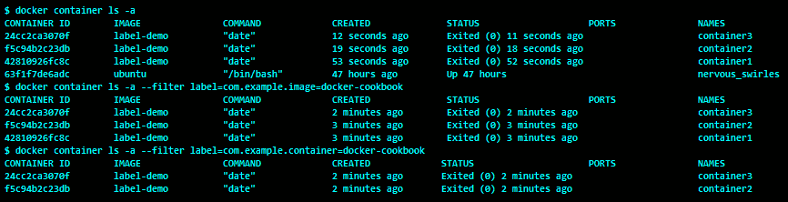

# 它是如何工作的...

Docker 在启动容器时将标签元数据附加到容器，并在列出容器或执行其他相关操作时匹配标签。

# 还有更多...

所有贴在容器上的标签都可以通过`docker container inspect`命令列出。如我们所见，`inspect`命令返回映像和附着在容器上的容器标签:

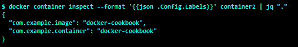

您可以使用`--label-file`选项将文件中的标签应用于容器。该文件应该有一个标签列表，由一个新的 EOL 分隔。

这些标签不同于 Kubernetes 标签，我们将在[第 8 章](08.html)、 *Docker 编排和托管平台*中探讨。

# 请参见

Docker 网站上的文档可以在这里找到:[https://docs . Docker . com/engine/reference/command line/container _ run/](https://docs.docker.com/engine/reference/commandline/container_run/)。

标注关键格式推荐可以在这里找到:[https://docs . docker . com/engine/user guide/labels-custom-metadata/# key-format-推荐](https://docs.docker.com/engine/userguide/labels-custom-metadata/#key-format-recommendations)。

标注价值指引可以在这里找到:[https://docs . docker . com/engine/user guide/labels-custom-metadata/# value-指引](https://docs.docker.com/engine/userguide/labels-custom-metadata/#value-guidelines)。

关于为 Docker 添加标签支持的详细信息，请参见:[http://rancher.com/docker-labels/](http://rancher.com/docker-labels/)。

# 阅读容器内的僵尸

在 Linux(以及所有类似 Unix 的)操作系统上，当一个进程退出时，除了进程表中的条目之外，与该进程相关的所有资源都会被释放。进程表中的这个条目一直保留到父进程读取该条目以了解其子进程的退出状态。一个过程的这种短暂状态被称为**僵尸**。一旦父进程读取了条目，僵尸进程就会从进程表中移除，这称为收割。如果父进程先于子进程退出，`init`进程(PID 1)采用子进程(PID 1)，并且当它们退出时，它最终收获被采用的子进程:

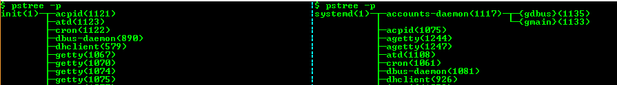

在前面的截图中，我们截取了左边 Ubuntu 14.04 和右边 Ubuntu 18.04 的进程树。正如我们所看到的，两个过程树的左边和右边都有 PID 1 处的`init`过程。

`systemd` is a variant of the `init` system and is adopted by many Linux distributions.

如果我们回到 Docker 的命名空间讨论，Docker 引擎会为每个`docker`容器创建一个新的 PID 命名空间，这样容器内的第一个进程就会映射到 PID 1。Docker 被设计为每个容器运行一个进程，通常在容器内运行的进程不会创建子进程。但是，如果容器内部的进程创建了子进程，那么就需要一个`init`系统来收获僵尸进程。在这个食谱中，我们将看看如何为我们的容器配置一个`init`进程来收获僵尸进程。

# 准备好

确保 Docker 守护程序 1.13 或更高版本正在主机上运行，并且可以通过 Docker 客户端进行连接。

# 怎么做...

您可以使用 Docker 容器运行命令的`--init`选项启动带有`init`进程的容器，如下语法所示:

```
    docker container run --init [OPTIONS] IMAGE [COMMAND] [ARG...]   
```

让我们创建四个容器，两个没有`--init`选项，另外两个有`--init`选项，并使用`pstree`命令比较过程树:

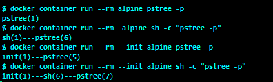

# 还有更多...

默认情况下，`docker container run --init`命令使用`tini`([https://github.com/krallin/tini](https://github.com/krallin/tini))作为`init`进程。

守护程序标志`--init-path`允许您配置自己的`init`进程。

# 它是如何工作的...

Docker 守护程序将以`init`作为第一个进程启动容器，然后是指定的命令。

# 请参见

查看`docker container run`的`help`选项:

```
    $ docker container run --help
```

Docker 网站上的文档可以在这里找到:[https://docs . Docker . com/engine/reference/command line/container _ run/](https://docs.docker.com/engine/reference/commandline/container_run/)。