# 三、使用 Docker 映像

在本章中，我们将介绍以下食谱:

*   从容器创建映像
*   使用 Docker 集线器创建帐户
*   登录和退出 Docker 映像注册表
*   将映像发布到注册表
*   看着映像的历史
*   移除映像
*   导出映像
*   导入映像
*   使用 Dockerfile 构建映像
*   构建 Apache 映像 Dockerfile 示例
*   设置私有索引/注册表
*   自动化构建——使用 GitHub 和 Bitbucket
*   创建自定义基础映像
*   使用基础映像创建最小映像
*   分多个阶段构建映像
*   可视化映像层次结构

# 介绍

Docker 映像是 Docker 启发的容器化范例的基本构件。正如您已经知道的，Docker 容器是从 Docker 映像创建的。根据您的应用需求，您可以选择使用 Docker 映像创建复杂的服务，这些映像由 Docker 或第三方的人员构建和提供。如果现有映像不符合您的要求，您也可以扩展现有映像或自定义构建您自己的映像。

在本章中，我们将向您介绍 Docker Hub，并向您展示如何通过 Docker Hub 共享映像以及如何托管您自己的 Docker 注册表。我们还将向您展示构建自己形象的不同方法，以及一些 Docker 形象管家操作。

We are using Ubuntu 18.04 as our primary environment on which to run the z=zx. They should also work with other environments.

# 从容器创建映像

有几种方法可以创建映像。一种是在容器内手动进行更改，然后提交映像。另一种是使用 Dockerfile 构建一个。在这个配方中，我们将查看前一个配方，并在本章后面查看 Dockerfiles。

当我们开始一个新的容器时，一个读/写层被附加到它上面。如果我们不保存它，这层就会被破坏。在本食谱中，我们将学习如何保存该图层，并使用`docker container commit`命令从运行或停止的容器中制作新映像。以下是`docker container commit`命令的语法:

```
    $ docker container commit [OPTIONS] CONTAINER [REPOSITORY[:TAG]]
```

# 准备好

确保 Docker 守护程序正在运行，并且可以访问 Ubuntu 映像。

# 怎么做...

请执行以下步骤:

1.  让我们使用`docker container run`命令从`ubuntu`映像开始一个容器:

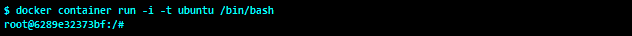

2.  启动容器后，从容器提示发出`apt-get update`同步包列表，如下图截图所示:


3.  使用`apt-get install`命令安装`apache2`包:


4.  现在，打开另一个终端，使用`docker container run`命令创建一个映像:

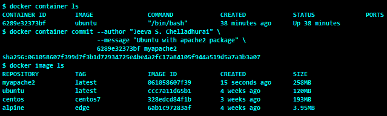

如您所见，新映像现在被提交到本地存储库，其中`myapache2`作为名称，`latest`作为标签。

# 它是如何工作的...

在[第 1 章](01.html)、*介绍和安装*中，我们了解到 Docker 映像是分层的，并且每一层都堆叠在其父映像之上。当我们启动一个容器时，会创建一个读/写临时文件系统层。通过`apt-get`更新和`install`命令对文件系统的更改(即文件的添加、修改或删除)保留在这个读/写临时文件系统层中。如果我们停止并删除该容器，与该容器相关联的短暂层将被移除，本质上，我们将丢失应用于该容器的所有更改。

在这个配方中，我们通过使用`docker container commit`命令来保持容器的短暂层。实际上，`commit`操作会创建另一个映像层，并将其与其他映像一起保存在 Docker 宿主中。

# 还有更多...

`docker container diff`命令列出了容器文件系统映像中的所有更改，如以下代码所示:

```
    $ docker diff 6289e32373bf
    ...OUTPUT SNIPPED...
    C /var/log
    C /var/log/alternatives.log
    A /var/log/apache2
    A /var/log/apache2/access.log
    A /var/log/apache2/error.log
    A /var/log/apache2/other_vhosts_access.log
    ... OUTPUT SNIPPED... 
```

我们可以看到输出的每个条目前都有一个前缀。以下是这些前缀的列表:

*   `A`:这是添加了文件/目录的时候
*   `C`:用于文件/目录被修改的情况
*   `D`:用于文件/目录被删除的情况

默认情况下，容器在提交时会暂停。可以通过传递`--pause=false`来改变其行为进行提交。

# 请参见

参见`docker container commit`的`help`选项:

```
      $ docker container commit --help
```

更多信息，可在 Docker 网站[https://docs . Docker . com/engine/reference/command line/container _ commit/](https://docs.docker.com/engine/reference/commandline/container_commit/)阅读文档。

# 使用 Docker 集线器创建帐户

Docker Hub 是一个基于云的公共注册服务，用于托管公共和私有映像、共享它们以及与其他人协作。它与 GitHub 和 Bitbucket 集成，可以触发自动化构建。

要在 Docker Hub 中托管您的映像，您需要创建您的 Docker ID。这使您能够在 Docker Hub 中创建任意数量的公共存储库。

Docker Hub also gives you one free private repository. If you need more than one private repository, you can upgrade to a paid plan. A repository can hold different versions of an image.

# 准备好

要注册，您需要访问任何标准的网络浏览器。

# 怎么做...

请执行以下步骤:

1.  转到 [https://hub.docker.com](https://hub.docker.com) :

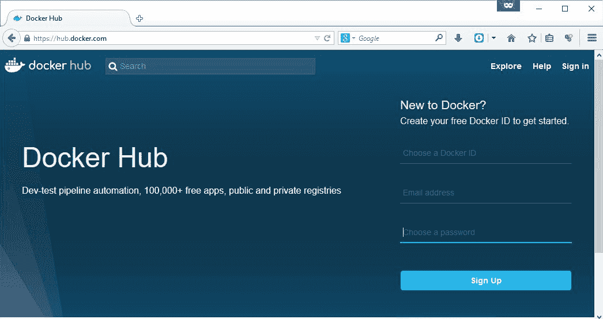

2.  在“注册”部分的字段中输入您首选的 Docker ID、有效的电子邮件地址和密码，然后单击“注册”按钮。
3.  成功创建帐户后，Docker Hub 将显示以下信息:


4.  As shown in the preceding screenshot, your account is not activated yet. In order to activate your account, you have to confirm your email by pressing the Confirm Your Email button in the email from Docker that you will have received in the inbox of the email account that you provided, as shown in the following screenshot:

    

5.  一旦您确认您的电子邮件，您将登陆欢迎使用 Docker 页面，如下图所示:

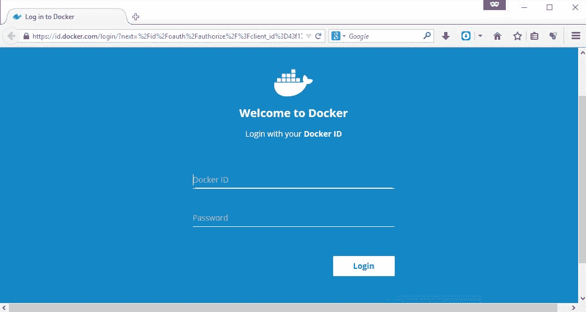

现在，您已经成功创建并激活了您的 Docker Hub 帐户。

# 它是如何工作的...

前面的步骤已经为您创建了一个 Docker Hub 帐户。帐户创建后，您将收到一封确认电子邮件，您需要通过该邮件确认您的身份。

# 请参见

*   Docker 网站上的文档:
    *   [https://docs . docker . com/docker 中枢](https://docs.docker.com/docker-hub)
    *   [https://docs . docker . com/docker-hub/accounts](https://docs.docker.com/docker-hub/accounts)
    *   [https://hub . docker . com/help](https://hub.docker.com/help)

# 登录和退出 Docker 映像注册表

在你穿越容器化世界的旅程中，你经常会发布你的映像供公众使用，或者使用 Docker 注册表私下共享映像。要将映像推送到公共存储库，您必须登录到 Docker 注册表，并且您必须是该存储库的所有者。在私有存储库的情况下，拉和推都是允许的，但是只允许您登录一次。在这个食谱中，我们将看到如何登录和注销 Docker 注册表。

# 准备好

请确保您拥有有效的 Docker ID 或 GitLab 帐户。

# 怎么做...

`docker login`命令允许您同时登录多个 Docker 注册表。类似地，`docker logout`命令允许您从指定的服务器注销。以下是 Docker 登录和注销命令的语法:

```
$ docker login [OPTIONS] [SERVER]
$ docker logout [SERVER]
```

默认情况下，`docker login`和`docker logout`命令都假定[https://hub.docker.com/](https://hub.docker.com/)为默认注册表，但这可以更改。

让我们通过以下实验来进一步了解这个过程，如下图所示:

*   登录到默认的 Docker 注册表
*   登录位于[https://about.gitlab.com/](https://about.gitlab.com/)的注册中心
*   读取持久化的登录详细信息
*   从所有这些区域注销

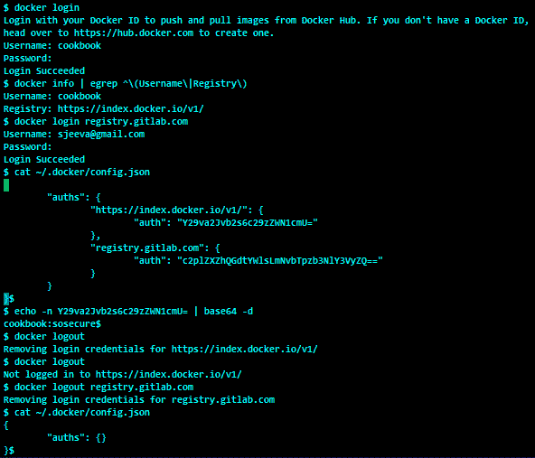

# 它是如何工作的...

在这个食谱中，我们使用`docker login`命令登录了两个注册表，然后探索了登录信息是如何存储的。我们还使用`base64`来检索登录的用户标识，而它也显示了存储的密码。然后我们继续使用`docker logout`命令从两个注册表中注销。

# 还有更多...

默认情况下，`docker login`命令交互提示用户输入用户名和密码。您可以通过使用`-u`或`--username`选项提供用户名，使用`-p`或`--password`选项提供密码，将此交互行为更改为批处理模式。

In the preceding recipe, the password stored in the `$HOME/.docker/config.json` file can be easily decoded using `base64`. This is not desirable in all environments, however; in other scenarios, you could resort to tools such as `docker-credential-helpers`.

# 请参见

*   `docker login`和`docker logout`选项的`help`选项:

```
        $ docker login -help
        $ docker logout --help 
```

*   Docker 网站上的文档:
    *   [https://docs.docker.com/engine/reference/commandline/login/](https://docs.docker.com/engine/reference/commandline/login/)
    *   [https://docs . docker . com/engine/reference/command line/注销/](https://docs.docker.com/engine/reference/commandline/logout/)
*   Docker 凭据助手的 GitHub 存储库:
    *   [https://github.com/docker/docker-credential-helpers](https://github.com/docker/docker-credential-helpers)

# 将映像发布到注册表

正如前面提到的方法，Docker 映像注册表充当存储和共享映像的中心。在这个食谱中，我们将看到如何使用`docker image push`命令将映像推送到注册表。在本章的后面，我们将介绍如何设置私有注册表。

# 准备好

确保您已成功登录 hub.docker.com，因为在本食谱中，我们将向 hub.docker.com 推送映像。或者，您可以使用私有或第三方 Docker 映像注册表。

# 怎么做...

以下是用于将 Docker 映像推送到注册表的命令的两种语法:

```
    $ docker image push [OPTIONS] NAME[:TAG]
    $ docker push [OPTIONS] NAME[:TAG] 
```

要将映像推送到 Docker 注册表，请执行以下步骤:

1.  首先，使用`docker image tag`命令在 Docker 集线器中为适当的用户或组织标记映像，如以下代码所示:

```
        $ docker image tag myapache2 cookbook/myapache2 
```

这里，映像被标记为`cookbook/myapache2`，因为在下一步中，我们将把这个映像推送给 Docker Hub 用户`cookbook`。

2.  现在，让我们使用`docker image push`将映像推送到 Docker Hub，如下图截图所示:


3.  将映像推送到 Docker Hub 后，我们可以登录 Docker Hub 并验证映像，如下图所示:

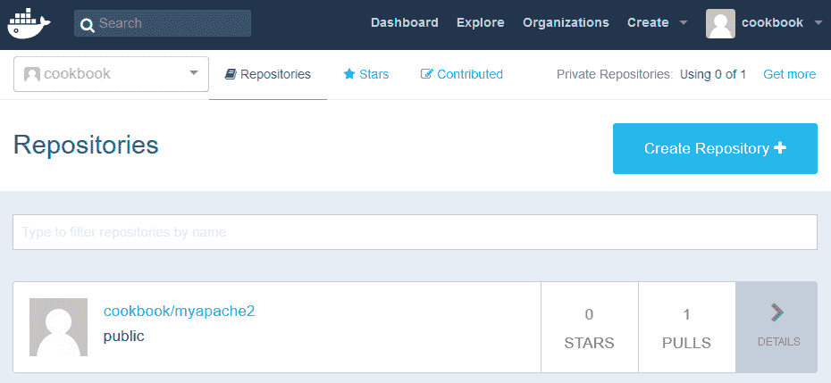

# 它是如何工作的...

`docker image push`命令识别组成要推送的映像的所有映像层，并检查这些映像是否已经在注册表中可用。然后`push`命令上传注册表中不存在的所有映像。

# 还有更多...

假设您想要将映像推送到本地托管的注册表中。为此，您首先需要用注册表主机名或运行注册表的端口号标记映像，然后推送映像。

比如说我们的注册表配置在`shadowfax.example.com`上。要标记映像，我们将使用以下命令:

```
    $ docker tag myapache2 \ 
       shadowfax.example.com:5000/cookbook/myapache2
```

然后，要推送映像，我们将使用以下命令:

```
       $ docker push shadowfax.example.com:5000/cookbook/myapache2  
```

# 请参见

*   `docker image push`的`help`选项:

```
        $ docker push --help
```

*   Docker 网站上的文档:
    *   [https://docs . docker . com/engine/reference/command line/image _ push/](https://docs.docker.com/engine/reference/commandline/image_push/)

# 看着映像的历史

对我们来说，有必要对我们正在使用的 Docker 映像有更深的理解。`docker image history`命令帮助我们找到映像中的所有图层、其映像 ID、创建时间、创建方式、大小以及与该图层相关的任何附加注释。

# 准备好

在我们开始下一个食谱之前，首先拉或导入任何 Docker 映像。

# 怎么做...

要查看映像的历史记录，请考虑以下语法:

```
    $ docker image history [OPTIONS] IMAGE  
```

下面是一个使用前面语法的例子:

```
    $ docker image history myapache2 
```


# 它是如何工作的...

当我们构建 Docker 映像时，Docker 引擎将构建指令保留在映像元数据中。稍后，`docker image history`命令递归地将这些构建指令从指定映像收集到基础映像，并以良好的格式呈现。

# 还有更多...

如果您回忆起*从容器*配方中创建映像，在提交映像时，我们添加了一条消息，而这条消息在`docker image history`命令的输出中是看不到的。您可以使用`docker image inspect`命令，如以下代码所示:

```
    $ docker image inspect --format='{{.Comment}}' myapache2
    Ubuntu with apache2 package  
```

嗯！`docker image inspect`命令一次只能处理一个映像，但是如果你想看到所有映像图层的注释，那么你必须遍历每个映像或者通过一些脚本自动操作。顺便说一句，注释是可选的，因此您可能无法在所有映像上找到注释。

# 请参见

*   `docker image history`的`help`选项:

```
        $ docker image history --help  
```

*   Docker 网站上的文档:

[https://docs . docker . com/engine/reference/command line/image _ history/](https://docs.docker.com/engine/reference/commandline/image_history/)

# 移除映像

`docker image rm`命令允许您从 Docker 主机中移除映像。此命令可以删除一个或多个映像，并且您可以使用以下标识符之一指定映像:

*   映像的短标识。
*   映像的长标识。
*   映像摘要。
*   映像的名称及其标签。如果未指定标签，则默认采用`latest`标签。

如果映像恰好有多个标签与之关联，则在移除映像之前必须移除这些标签。或者，您可以使用`docker image rm`命令的`-f`或`--force`选项强制移除它们。在这种情况下，所有标签也将自动移除。

以下是`docker image rm`命令的语法:

```
docker image rm [OPTIONS] IMAGE [IMAGE...]
```

在这个食谱中，我们将为一个映像创建多个标签，并演示如何移除它们。

# 准备好

一个或多个 Docker 映像应该在 Docker 主机中本地可用。

# 怎么做...

请执行以下步骤:

1.  让我们选择一个现有的映像，并向其中添加多个标签，如下图所示:

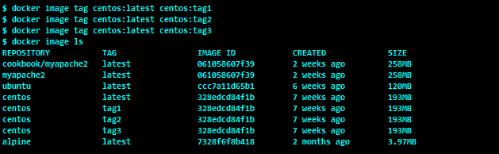

在这里，我们选择了映像标识为`328edcd84f1b`的`centos`映像，并添加了另外三个标签:`tag1`、`tag2`和`tag3`。所有标签都有相同的`328edcd84f1b`映像标识。

2.  现在，让我们尝试删除 ID 为`328edcd84f1b`的映像，并观察结果:

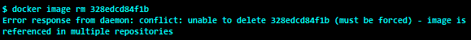

显然，`docker image rm`未能移除映像，因为有四个标签引用相同的映像标识。

3.  从映像中移除标签，直到移除所有标签并删除映像，如下图所示:


很明显，`docker image rm`命令移除了标签，最后在没有标签的时候移除了映像。

# 还有更多...

*   在前面的食谱中，我们一个接一个地移除标签，直到所有的标签都被移除，映像也被删除。也许你可以使用`docker image rm`的`-f`或`--force`选项一次删除所有标签和映像。
*   在使用`--force`选项之前，确保该映像没有从该映像衍生的任何容器。否则，你最终会有悬空的映像。
*   虽然不建议这样做，但是如果出于任何原因您想要删除所有容器和映像，那么您可以使用以下命令:
*   要停止所有容器，请使用以下命令:

```
        $ docker container stop $(docker container ls -q) 
```

*   要删除所有容器，请使用以下命令:

```
        $ docker container rm $(docker container ls -a -q)`  
```

*   要删除所有映像，请使用以下命令:

```
        $ docker image rm $(docker image ls -q)  
```

# 请参见

*   `docker image rm`的`help`选项:

```
        $ docker image rm --help
```

*   Docker 网站上的文档:

[https://docs . docker . com/engine/reference/command line/image _ RM/](https://docs.docker.com/engine/reference/commandline/image_rm/)

# 导出映像

假设您有一个客户，他有非常严格的政策，不允许他们使用公共领域的映像。在这种情况下，您可以通过 tarballs 共享一个或多个映像，这些映像随后可以导入到另一个系统中。

`docker image save`命令允许您将映像保存或导出为目标球。命令语法如下:

```
docker image save [-o|--output]=file.tar IMAGE [IMAGE...]
```

在本食谱中，我们将学习如何使用`docker image save`命令导出映像。

# 准备好

开始之前，请先在 Docker 主机上拉取或导入一个或多个 Docker 映像。

# 怎么做...

让我们选择在*中创建的`myapache2`映像，从容器*配方中创建一个映像，并将该映像导出为`.tar`文件，如以下代码所示:

```
    $ docker image save --output=myapache2.tar myapache2  
```

前面的命令生成`myapache2.tar`文件，可以按照下一个配方中的描述导入。

# 还有更多...

您也可以使用以下命令导出容器的文件系统:

```
    $ docker container export --output=myapache2_cont.tar c71ae52e382d  
```

# 请参见

*   `docker image save``docker container export`的`help`选项:

```
        $ docker image save -help
        $ docker container export --help

```

*   Docker 网站上的文档:

[https://docs . docker . com/engine/reference/command line/image _ save/](https://docs.docker.com/engine/reference/commandline/image_save/)

[https://docs . docker . com/engine/reference/command line/container _ export/](https://docs.docker.com/engine/reference/commandline/container_export/)

# 导入映像

要获取映像的本地副本，我们需要从可访问的注册表中获取它，或者从已经导出的映像中导入它，就像我们在前面的食谱中看到的那样。`docker image import`命令允许您从一个目标球导入一个或多个映像。`docker image import`命令语法如下:

```
docker image import [OPTIONS] file|URL|- [REPOSITORY[:TAG]]
```

# 准备好

开始之前，您需要导出的 Docker 映像的本地副本。

# 怎么做...

请执行以下步骤:

1.  使用您最喜欢的任何文件传输工具，将我们在之前的配方中创建的`myapache2.tar`文件传输到新的 Docker 主机。
2.  现在，在新的 Docker 主机上，导入传输的`myapache2.tar`文件，如下代码所示:

```
 $ docker image import myapache2.tar apache2:imported
```

3.  在这里，我们已经将`myapache2.tar`文件导入为`apache2:imported`映像。

# 还有更多...

您也可以通过指定存储在远程位置的 TAR 文件的 URL 来导入这些文件。

# 请参见

*   `docker image import`的`help`选项:

```
      $ docker image import --help
```

*   Docker 网站上的文档:
    *   [https://docs . docker . com/engine/reference/command line/image _ import/](https://docs.docker.com/engine/reference/commandline/image_import/)

# 使用 Dockerfile 构建映像

Dockerfile 是一个基于文本的构建指令文件，它使我们能够定义 Docker 映像的内容并自动创建映像。Docker 构建引擎逐行读取`Dockerfile`中的指令，并按照规定构建映像。换句话说，`Dockerfile`帮助我们以自动化的方式重复制作映像。使用`Dockerfiles`创建的映像被认为是不可变的。

# 准备好

在开始之前，我们需要一个带有构建指令的 Dockerfile。要制作一个，我们需要经过以下步骤:

1.  创建一个空目录:

```
       $ mkdir sample_image
       $ cd sample_image

```

2.  创建一个名为`Dockerfile`的文件，内容如下:

```
       $ cat Dockerfile
       # Use ubuntu as the base image 
       FROM ubuntu 

       # Add author's name 
       LABEL maintainer="Jeeva S. Chelladhurai" 

       # Add the command to run at the start of container 
       CMD date  
```

# 怎么做...

请执行以下步骤:

1.  在我们创建`Dockerfile`的目录中运行以下命令来构建映像:

```
        $ docker image build . 
```


In the preceding setup, we did not specify any repository and tag name while building the image. It is always recommended that you build the image with a repository name for easy reference in the future.

2.  现在，让我们继续使用`docker image build`命令的`-t`选项创建我们自己的存储库名称，如下所示:

```
        $ docker image build -t sample .   
```

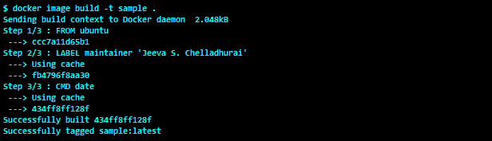

如果您比较步骤 1 和步骤 2 的输出，您可以注意到细微的差异。在步骤 1 的输出中，您可以看到`LABEL`和`CMD`指令后的文本`Running`，而对于步骤 2，它被打印为`Using cache`。这表明 Docker 正在重用步骤 1 中构建的映像的中间层。如果层没有变化，Docker 构建系统总是重用先前构建的映像中的层。如果您不想让构建系统重用中间层，那么就在构建中添加`--no-cache`选项。

# 它是如何工作的...

当我们使用`docker image build`命令构建 Docker 映像时，我们指定了一个目录。该命令将整个目录树捆绑为构建上下文，并将其传输到 Docker 引擎以创建 Docker 映像。从构建输出`Sending build context to Docker daemon 2.048 kB`消息中可以明显看出这一点。如果在当前工作目录中有一个名为`.dockerignore`的文件，并且有文件和目录列表(新行分隔)，那么这些文件和目录将在构建上下文中被忽略。更多关于`.dockerignore`的详细信息可以在[上找到。](https://docs.docker.com/reference/builder/#the-dockerignore-file.)

现在，Docker 构建系统将读取 Dockerfile 中的每个指令，启动一个中间容器，在容器内部执行指令或更新元数据，将中间容器作为映像层提交，并移除中间容器。这个过程一直持续到 Dockerfile 中的所有指令都被执行。

# 还有更多...

文件的格式如下:

```
    INSTRUCTION arguments
```

通常，指令以大写形式给出，但不区分大小写。它们是按顺序评估的。开头的`#`暗语被当作注释。

让我们看看不同类型的指令:

*   `FROM`:这必须是任何 Dockerfile 的第一条指令，并为后续指令设置基础映像。默认情况下，最新的标签假定如下:

```
       FROM  <image>
```

或者，考虑以下标签:

```
       FROM  <images>:<tag> 
```

一个 Dockerfile 中可以有多个`FROM`指令来创建多个映像。

如果只给出映像名称，如`fedora`和`Ubuntu`，则映像将从默认的 Docker 注册表(Docker Hub)中下载。如果您想使用私人或第三方映像，那么您必须包括它们，如下所示:

```
      [registry_hostname[:port]/][user_name/](repository_name:version_tag)  
```

以下是使用前面语法的示例:

```
        FROM registry-host:5000/cookbook/apache2
        FROM  <images>:<tag> AS <build stage> 
```

您也可以指定用于多阶段映像构建的构建阶段，正如您将在*多阶段构建映像*配方中看到的。

*   `RUN`:我们可以通过两种方式执行`RUN`指令。首先，我们可以在 shell ( `sh -c`)中运行它:

```
        RUN <command> <param1> ... <pamamN>
```

其次，我们可以直接运行一个可执行文件:

```
        RUN ["executable", "param1",...,"paramN" ]
```

正如我们所知，使用 Docker，我们创建一个覆盖层——一个层在另一个层之上——来制作结果映像。通过每个`RUN`指令，我们在之前提交的层之上创建并提交一个层。容器可以从任何提交的层启动。

默认情况下，Docker 会尝试缓存不同`RUN`指令提交的层，以便它们可以在后续构建中使用。但是，在构建映像时，可以使用`--no-cache flag`关闭此行为。

*   `LABEL` : Docker 1.6 为附加的 Docker 映像和容器的任意键值对增加了一个新特性。我们在[第 2 章](02.html)、*使用 Docker 容器*中的*标签和过滤容器*配方中介绍了部分内容。要给映像添加标签，我们使用 Dockerfile 中的`LABEL`指令，例如`LABEL distro=ubuntu`。
*   `CMD`:`CMD`指令在启动容器时提供默认的可执行文件。如果`CMD`指令没有任何可执行文件(参数 2)，那么它将为`ENTRYPOINT`提供参数:

```
        CMD  ["executable", "param1",...,"paramN" ]
        CMD ["param1", ... , "paramN"]
        CMD <command> <param1> ... <pamamN>  
```

Dockerfile 中只允许一条`CMD`指令。如果指定了不止一个，那么将只考虑最后一个。

*   `ENTRYPOINT`:这有助于我们将容器配置为可执行文件。与`CMD`类似，`ENTRYPOINT`最多可以有一条指令；如果指定了一个以上，则仅最后一个将被接受:

```
        ENTRYPOINT  ["executable", "param1",...,"paramN" ]
        ENTRYPOINT <command> <param1> ... <pamamN>
```

一旦用`ENTRYPOINT`指令定义了参数，它们在运行时就不能被覆盖。但是`ENTRYPOINT`可以作为`CMD`，如果我们想对`ENTRYPOINT`使用不同的参数。

*   `EXPOSE`:这暴露了容器上的网络端口，它将在运行时监听这些端口:

```
        EXPOSE  <port> [<port> ... ]
```

我们还可以在启动容器时公开一个端口。我们在[第 2 章](02.html)、*使用 Docker 容器*中的*在启动容器时暴露港口*配方中介绍了这一点。

*   `ENV`:这会将环境变量`<key>`设置为`<value>`。它将被传递给所有后续指令，并在从结果映像运行容器时保持不变:

```
        ENV <key> <value>
```

*   `ADD`:这将文件从源复制到目标:

```
        ADD <src> <dest> 
```

以下`ADD`指令适用于包含空格的路径:

```
        ADD ["<src>"... "<dest>"] 
```

*   `<src>`:这必须是构建目录中的文件或目录，我们从其中构建映像，这也称为构建的上下文。源也可以是远程网址。
*   `<dest>`:这必须是容器内部的绝对路径，来自源的文件/目录将被复制到其中。
*   `COPY`:这和`ADD. COPY <src> <dest>`类似:

```
          COPY  ["<src>"... "<dest>"]  
```

`COPY`指令可选地支持多级构建的`--from`选项。

*   `VOLUME`:此指令将使用给定的名称创建一个装载点，并使用以下语法将其标记为装载外部卷:

```
          VOLUME ["/data"]    
```

或者，您可以使用以下代码:

```
        VOLUME /data
```

*   `USER`:这将使用以下语法为以下任何运行指令设置用户名:

```
        USER  <username>/<UID>  
```

*   `WORKDIR`:这为跟随它的任何`RUN`、`CMD`和`ENTRYPOINT`指令设置工作目录。它可以在同一个 Dockerfile 中有多个条目。可以使用以下语法给出相对于较早的`WORKDIR`指令的相对路径:

```
         WORKDIR <PATH> 
```

*   `ONBUILD`:这将触发指令添加到稍后执行的映像中，此时该映像将被用作另一个映像的基础映像。该触发器将作为下游 Dockerfile 中`FROM`指令的一部分运行，使用以下语法:

```
        ONBUILD [INSTRUCTION]
```

# 请参见

*   `docker image build`的`help`选项:

```
        $ docker image build --help  
```

*   Docker 网站上的文档:
    *   [https://docs.docker.com/engine/reference/builder/](https://docs.docker.com/engine/reference/builder/)

# 构建阿帕奇映像–docker file 示例

现在，我们已经很好地理解了`Dockerfile`构造，在这个食谱中，我们将构建一个非常简单的 Docker 映像，它捆绑了`apache2`网络服务器，并且还添加了元数据，以便每当从这个映像创建新容器时，在容器内部启动`apache2`应用。

# 准备好

在我们开始之前，`git`存储库[https://github.com/docker-cookbook/apache2](https://github.com/docker-cookbook/apache2)有一个`Dockerfile`来构建一个`apache2`映像，所以克隆存储库，如下代码所示:

```
    $ git clone https://github.com/docker-cookbook/apache2.git  
```

现在，转到`apache2`目录:

```
    $ cd apache2
    $ cat Dockerfile
    FROM alpine:3.6

    LABEL maintainer="Jeeva S. Chelladhurai <sjeeva@gmail.com>"

    RUN apk add --no-cache apache2 && \
        mkdir -p /run/apache2 && \
        echo "<html><h1>Docker Cookbook</h1></html>" > \
            /var/www/localhost/htdocs/index.html

    EXPOSE 80

    ENTRYPOINT ["/usr/sbin/httpd", "-D", "FOREGROUND"]
```

# 怎么做...

使用以下`build`命令，我们可以构建一个新的映像:

```
    $ docker image build -t apache2 .
    Sending build context to Docker daemon  52.74kB
    Step 1/5 : FROM alpine:3.6
    3.6: Pulling from library/alpine
    88286f41530e: Pull complete
    Digest: sha256:f006ecbb824d87947d0b51ab8488634bf69fe4094959d935c0c103f4820a417d
    Status: Downloaded newer image for alpine:3.6
     ---> 76da55c8019d
    Step 2/5 : LABEL maintainer "Jeeva S. Chelladhurai <sjeeva@gmail.com>"
     ---> Running in 83e2c061c956
     ---> f77381e55873
    Removing intermediate container 83e2c061c956
    Step 3/5 : RUN apk add --no-cache apache2 && 
    mkdir -p /run/apache2 && 
               echo "<html><h1>Docker Cookbook</h1></html>" >
                    /var/www/localhost/htdocs/index.html
     ---> Running in 3abde4480544
    fetch http://dl-cdn.alpinelinux.org/alpine/v3.6/main/x86_64/APKINDEX.tar.gz
    fetch http://dl-cdn.alpinelinux.org/alpine/v3.6/community/x86_64/APKINDEX.tar.gz
    (1/6) Installing libuuid (2.28.2-r2)
    (2/6) Installing apr (1.5.2-r1)
    (3/6) Installing expat (2.2.0-r1)
    (4/6) Installing apr-util (1.5.4-r3)
    (5/6) Installing pcre (8.41-r0)
    (6/6) Installing apache2 (2.4.27-r1)
    Executing apache2-2.4.27-r1.pre-install
    Executing busybox-1.26.2-r5.trigger
    OK: 7 MiB in 17 packages
     ---> d7585e779ee8
    Removing intermediate container 3abde4480544
    Step 4/5 : EXPOSE 80
     ---> Running in ac761e55a45c
     ---> 63bbb379239f
    Removing intermediate container ac761e55a45c
    Step 5/5 : ENTRYPOINT /usr/sbin/httpd -D FOREGROUND
     ---> Running in fa3e5be6b893
     ---> 97f0bac0f021
    Removing intermediate container fa3e5be6b893
    Successfully built 97f0bac0f021
    Successfully tagged apache2:latest   
```

# 它是如何工作的...

构建过程从 Docker Hub 中提取`alpine`基本映像，安装`apache2`包，并创建一个简单的 HTML 页面。然后继续，将端口`80`作为一段元数据添加到映像中，最后设置在容器开始时启动 Apache 应用的指令。

# 还有更多...

让我们从创建的映像运行一个`apache2`容器，获取它的 IP 地址，并从它访问网页:


# 请参见

*   `docker image build`的`help`选项:

```
        $ docker image build --help
```

*   Docker 网站上的文档:
    *   [https://docs . docker . com/engine/reference/command line/imaim _ build/](https://docs.docker.com/engine/reference/commandline/imaim_build/)

# 设置私有索引/注册表

之前，我们使用 Docker 托管的注册表([https://hub.docker.com](https://hub.docker.com))来推送和拉取映像。尽管如此，您经常会遇到必须在基础架构中托管私有注册表的用例。在这个食谱中，我们将使用 Docker 的`registry:2`映像来托管我们自己的私有注册表。

# 准备好

确保主机上正在运行 Docker 守护程序 1.6.0 或更高版本。

# 怎么做...

请执行以下步骤:

1.  让我们从使用以下命令在容器上启动本地注册表开始:

```
        $ docker container run -d -p 5000:5000 \
                           --name registry registry:2 
```

2.  要将映像推送到本地注册表，您需要使用 Docker image tag 命令在存储库名称前加上`localhost`主机名或 IP 地址`127.0.0.1`和注册表端口`5000`，如以下代码所示:

```
        $ docker tag apache2 localhost:5000/apache2  
```

在这里，我们将重用我们在之前的食谱中构建的`apache2`映像。

3.  现在，让我们使用`docker image push`命令将映像推送到本地注册表，如下图所示:

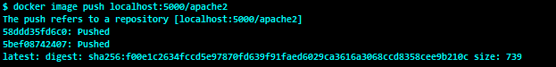

# 它是如何工作的...

前面的拉映像命令将从 Docker Hub 下载官方注册表映像，并在端口`5000`上运行。`-p`选项将容器端口发布到主机系统的端口。我们将在下一章探讨关于端口发布的细节。

# 还有更多...

注册表有一个通知框架，当它收到一个推或拉请求时，可以调用网络钩子。这些网络钩子可以和你的开发工作流链接在一起。

# 请参见

*   GitHub 上的文档:
    *   [https://github . com/docker/docker 登录](https://github.com/docker/docker-registry)

# 自动化构建–使用 GitHub 和 Bitbucket

我们之前看到了如何将 Docker 映像推送到 Docker Hub。Docker Hub 允许我们使用其构建集群从 GitHub 或 Bitbucket 存储库中创建自动化映像。GitHub/Bitbucket 存储库应该包含 Dockerfile 以及要在映像中复制/添加的内容。我们将在接下来的章节中看到一个 GitHub 示例。

# 准备好

为此，您需要一个有效的 Docker ID 和 GitHub 帐户。

此外，请访问 https://github.com/docker-cookbook/apache2 获取 apache2 文档。

# 怎么做...

请执行以下步骤:

1.  登录到 Docker 集线器(https://hub . docker . com/)。

2.  创建自动构建的第一步是链接您的 GitHub 或 Bitbucket 帐户。帐户链接功能在链接帐户和服务网络向导中可用。您可以通过浏览“设置”菜单或通过“创建”下拉列表中的“创建自动生成”菜单来访问此向导。在这里，我们将选择前一个选项，即“设置”菜单，可从最右侧的下拉菜单中访问:


3.  在前面的向导中，单击链接 Github 选项；在下一个屏幕中，您将看到两个选项，如下图所示。在这里，让我们单击公共和私有(推荐)选项下的选择按钮:


4.  将打开一个新窗口或选项卡，供您输入 GitHub 凭据，如下图所示:


5.  成功登录到您的 GitHub 帐户后，继续授予 GitHub 帐户中的组织权限。在本例中，我们已经向`docker-cookbook`组织授予了权限。单击授权摘要按钮:


正如您在下面的截图中看到的，现在 Docker Hub 帐户链接到了 GitHub 帐户:

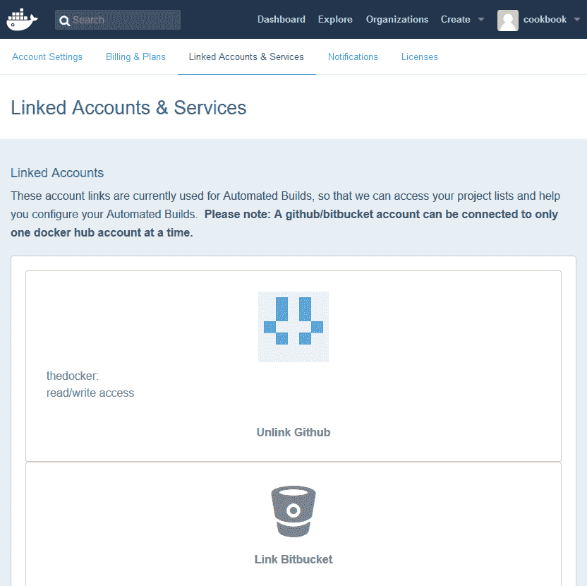

正如我们在前面的截图中看到的，GitHub 帐户成功链接到 Docker Hub 帐户。现在，我们可以继续配置自动化构建。

6.  从创建下拉菜单中选择创建自动构建选项，如下图所示:


7.  您将看到两个选项:为 Github 创建自动构建和链接帐户以将您的帐户链接到 Bitbucket，如下图所示:


我们将把我们的账户与比特币链接，因为我们还没有链接任何比特币账户。

8.  单击创建自动构建选项:

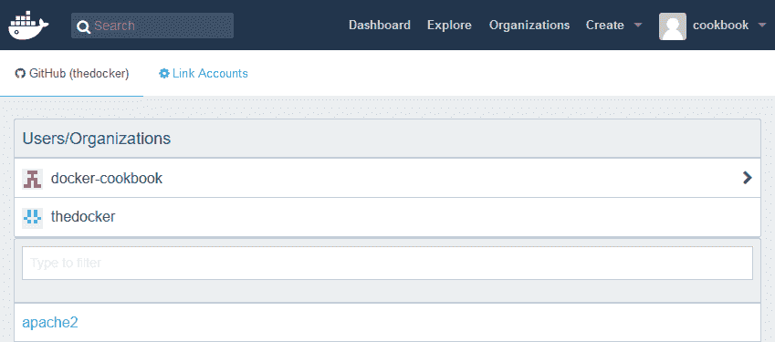

9.  点击[https://github.com/docker-cookbook/apache2](https://github.com/docker-cookbook/apache2)的岔口 apache2 选项:

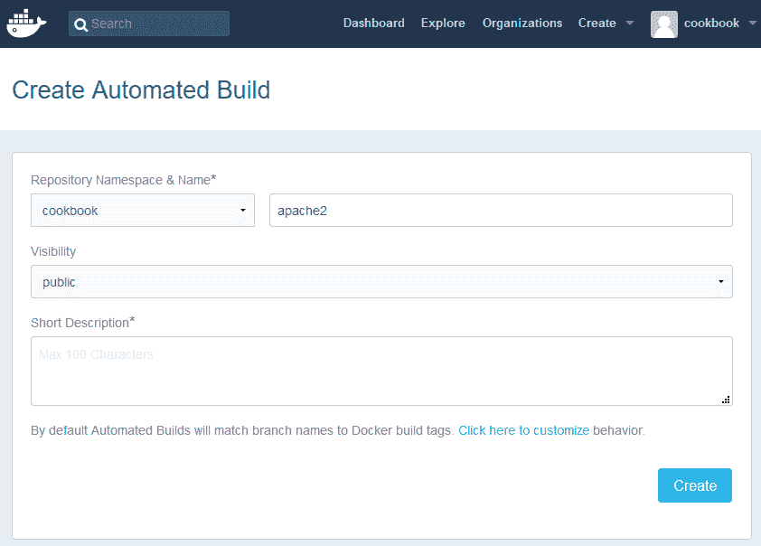

10.  提供简短描述，然后单击创建:

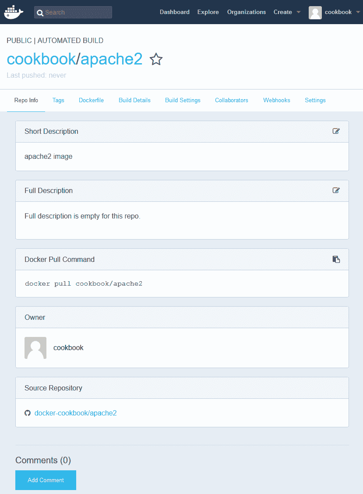

万岁！您已经成功地自动化了构建过程，当您在分叉的存储库中进行任何更改时，映像构建过程将被触发。

11.  现在，您可以导航到“构建详细信息”选项卡来查看构建状态。

# 它是如何工作的...

当我们为自动化构建选择一个 GitHub 存储库时，GitHub 会为该存储库启用 Docker 服务。您可以通过查看 GitHub 存储库中“设置”选项卡的“集成和服务”部分来确认这一点:


每当我们对任何源代码进行任何更改并提交到 GitHub 存储库中时，自动构建就会被触发，并使用 GitHub 存储库中的 Docker 文件构建 Docker 映像。

# 还有更多...

您可以通过导航到存储库中的 Dockerfile 选项卡来查看 Dockerfile。

您还可以通过在存储库的“构建设置”选项卡中链接另一个存储库，在更新另一个 Docker Hub 存储库时触发您的构建。

使用 Bitbucket 设置自动化构建的步骤几乎是相同的。自动构建的钩子在 Bitbucket 存储库的设置部分的钩子部分进行配置。

# 请参见

*   Docker 网站上的文档:
    *   [https://docs . docker . com/docker-hub/build/](https://docs.docker.com/docker-hub/builds/)

# 创建自定义基础映像

Docker 拥有丰富的基础映像库，我们强烈建议您选择一个适合您的应用的精简映像。但是，您可以选择从一开始就定制您的基础映像。在这里，在这个食谱中，我们将使用`debootstrap`来创建我们的 Ubuntu 18.04 LTS (Xenial Xerus)基础映像。`debootstrap`实用程序可以通过从适当的存储库中下载来创建任何基于 Debian 的系统。

# 准备好

使用以下命令在任何基于 Debian 的系统上安装`debootstrap`:

```
    $ apt-get install debootstrap     
```

# 怎么做...

请执行以下步骤:

1.  创建要在其上填充所有分发文件的目录:

```
        $ mkdir xenial 
```

2.  现在，使用`debootstrap`，在我们之前创建的目录中安装 Xenial Xerus:

```
        $ sudo debootstrap xenial ./xenial 
```

您将在安装 Xenial Xerus 的目录中看到类似于任何 Linux 根文件系统的目录树:

```
        $ ls ./xenial
        bin  boot  dev  etc  home  lib  lib64  media  mnt  opt  proc  
     root  run  sbin  srv  sys  tmp  usr  var 
```

3.  现在，我们可以使用以下命令将目录导出为 Docker 映像:

```
        $ sudo tar -C xenial/ -c . | docker image import - xenial  
```

4.  看`docker image ls`输出。你应该有一个以`xenial`为名字的新形象。

# 它是如何工作的...

`debootstrap`命令将所有 Ubuntu 18.04 (Xenial Xerus)包从包存储库中拉入目录。然后，它们被捆绑为一个 TAR 文件，并被推送到 Docker 映像导入命令来创建 Docker 映像。

# 请参见

*   `debootstrap`维基页面:
    *   [https://wiki.debian.org/Debootstrap](https://wiki.debian.org/Debootstrap)。
*   创建基础映像的替代方法:
    *   [https://docs.docker.com/articles/baseimg/](https://docs.docker.com/articles/baseimg/)。

# 使用基础映像创建最小映像

在前面的配方中，我们自定义创建了一个没有任何父映像的基础映像。然而，该映像被 Ubuntu 18.04 发行版附带的所有二进制文件和库所膨胀。通常，要运行一个应用，我们不需要映像中捆绑的大多数二进制文件和库。此外，它会留下很大的映像足迹，从而成为可移植性问题。为了克服这个问题，您可以勤奋地手工挑选将构成您的映像的二进制文件和库，然后捆绑 Docker 映像。或者，您可以使用 Docker 的保留映像(称为暂存映像)来构建。这个临时映像是一个明确的空映像，它不会给你的映像添加任何额外的层。此外，与前面的方法不同，您可以使用 Dockerfile 自动创建映像。在这个食谱中，我们将使用一个简单的构建器模式来创建一个静态链接的二进制文件，并使用一个暂存库映像来创建一个 Docker 映像。

# 准备好

首先，确保 Docker 守护程序正在运行，并且可以访问`gcc`和暂存映像。您还应该确保您有一个克隆的[https://github.com/docker-cookbook/scratch.git](https://github.com/docker-cookbook/scratch.git)，并且存储库包含`demo.c`和一个 Dockerfile。

`demo.c`的内容应如下:

```
#include <stdio.h>                                                      void main()                                                            {                                                                                                                                        printf("Statically built for demo\n");                                
}
```

文件的内容应该如下:

```
FROM scratch
ADD demo /
CMD ["/demo"]
```

# 怎么做...

执行以下步骤，使用基本暂存映像创建较小的映像:

1.  更改存储库目录:

```
$ cd scratch
```

2.  现在，使用`gcc:7.2`运行时容器从`demo.c`文件构建一个静态可执行演示，如以下代码所示:

```
 $ docker container run --rm \ 
 -v ${PWD}:/src \
 -w /src \
 gcc:7.2 \
 gcc -static -o demo demo.c
```

3.  构建静态链接的可执行文件后，可以快速验证二进制文件:

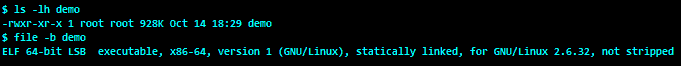

4.  继续使用上一步创建的可执行演示从基本映像构建映像，如以下代码所示:


5.  最后，让我们通过旋转前面映像中的容器并检查映像大小来验证映像:

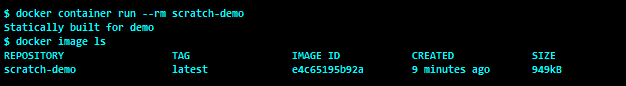

显然，这个映像要小得多，Docker 映像只比可执行演示大 20 个字节。

# 它是如何工作的...

Docker 构建系统直观地理解`FROM`指令中的保留映像名称`scratch`，并开始捆绑映像，而不为基础映像添加任何附加层。因此，在这个配方中，Docker 构建系统只是捆绑了静态链接的可执行演示和映像的元数据。

# 还有更多...

如前所述，`scratch`映像不会给映像添加任何附加层。这里`docker image history`命令可以列出映像中的图层，如下代码所示:


我们可以看到，基础映像`scratch`没有额外的图层。

# 请参见

*   Docker 中心的文件:
    *   [https://hub . docker . com/_/scratch/](https://hub.docker.com/_/scratch/)
*   创建基础映像的替代方法:
    *   [https://docs.docker.com/articles/baseimg/](https://docs.docker.com/articles/baseimg/)

# 分多个阶段构建映像

在前面的配方中，我们使用`gcc`构建器容器创建了一个静态链接的可执行文件，然后使用`scratch`映像捆绑该可执行文件。使用构建器模式构建管道非常常见，因为在构建期间，您将需要重量级的构建和支持工具。然而，产生的工件在执行时通常不需要这些工具。因此，工件通常是使用具有附加功能的适当运行时构建的，然后生成的工件与运行时打包在一起，刚好足以运行工件。虽然这个解决方案运行得很好，但是这个构建管道的复杂性是通过脚本在 Docker 生态系统之外进行管理的。为了解决这个复杂问题，Docker 在版本`17.05`中引入了一个叫做多阶段构建的很酷的特性。

Docker 的多阶段构建使我们能够在单个 docker 文件中编排复杂的构建阶段。在 Dockerfile 中，我们可以用适当的父映像和构建生态系统来定义一个或多个中间阶段，以构建工件。Dockerfile 在使用 Dockerfile 构建映像时提供了前面提到的基本原语，以将工件复制到后续阶段，并最终构建一个具有足够运行时间和工件的 Docker 映像。

# 准备好

*   在我们开始之前，请确保 Docker 守护程序正在运行，并且可以访问`gcc`和`scratch`映像。此外，确保有一个克隆的[https://github.com/docker-cookbook/multistage.git](https://github.com/docker-cookbook/multistage.git)，并且存储库同时包含`src/app.c`和`Dockerfile.`
*   `src/app.c`的内容应如下:

```
#include <stdio.h>
void main()
{
    printf("This is a Docker multistage build demo\n");
}
```

*   `Dockerfile`的内容应如下:

```
FROM gcc:7.2 AS builder
COPY src /src
RUN gcc -static -o /src/app /src/app.c && strip -R .comment -s /src/app
FROM scratch
COPY --from=builder /src/app .
CMD ["./app"]
```

# 怎么做...

执行以下步骤，使用基本暂存映像创建较小的映像:

1.  更改存储库目录:

```
 $ cd multistage
```

2.  使用 Docker 映像`build`命令构建映像，如下图所示:


3.  现在映像已经成功构建，让我们从上一步创建的映像开始旋转容器，如下图所示:

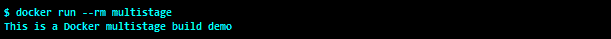

# 它是如何工作的...

Docker 构建系统直观地理解`FROM`指令中的保留映像名称`scratch`，并开始捆绑映像，而不为基础映像添加任何附加层。所以在这个配方中，Docker 构建系统只是捆绑了静态链接的可执行演示和映像的元数据。

# 还有更多...

如前所述，`scratch`映像不会给映像添加任何附加层。`docker image history`命令在这里可以列出映像中的图层，如下图所示:


我们可以看到，基础映像`scratch`没有额外的图层。

# 请参见

*   Docker 中心的文档:

[https://hub . docker . com/_/scratch/](https://hub.docker.com/_/scratch/)

# 可视化映像层次结构

Docker 提供了多个命令来了解文本格式的映像。然而，一张图片抵得上千言万语，因此我们必须能够通过图形来可视化映像层次。虽然 Docker 不支持任何映像可视化工具，但是有许多解决方案可以可视化映像层次结构。在本食谱中，我们将使用`nate/dockviz`容器和`Graphviz`可视化映像层次结构。

# 准备好

在开始之前，我们需要主机上的一个或多个 Docker 映像来运行 Docker 守护程序。我们还需要确保`Graphviz`已安装。

# 怎么做...

通过提供`images --dot`作为命令行参数来运行`nate/dockviz`容器，并将输出传送到`dot` ( `Graphviz`)命令，如下代码所示，以生成映像层次结构:

```
    $ docker run --rm \
                 -v /var/run/docker.sock:/var/run/docker.sock \
                 nate/dockviz \
                 images --dot  | dot -Tpng -o images-graph.png
```

以下是 Docker 主机中映像的图形视图:

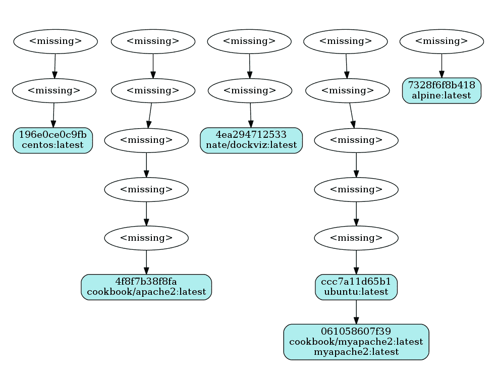

这里，在图形视图中，带有`<missing>`的节点是映像中的层。

# 它是如何工作的...

`nate/dockviz`工具写在`go`中，迭代 Docker 映像的元数据并生成`Graphviz`点输出，使用`Graphviz`将其转换为`png`映像。

# 还有更多...

您也可以使用`nate/dockviz`来可视化链接容器之间的依赖关系。以下是可视化容器依赖关系的命令:

```
    $ docker run --rm \
                 -v /var/run/docker.sock:/var/run/docker.sock \
                 nate/dockviz \
                 containers --dot  | dot -Tpng -o containers-graph.png

```

# 请参见

*   `nate/dockerviz`上的文件:

[https://github . com/justonen/dock viz](https://github.com/justone/dockviz)