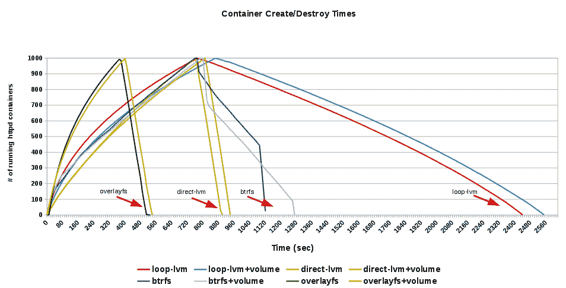
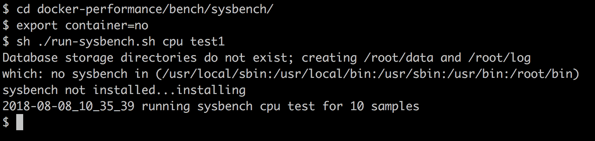
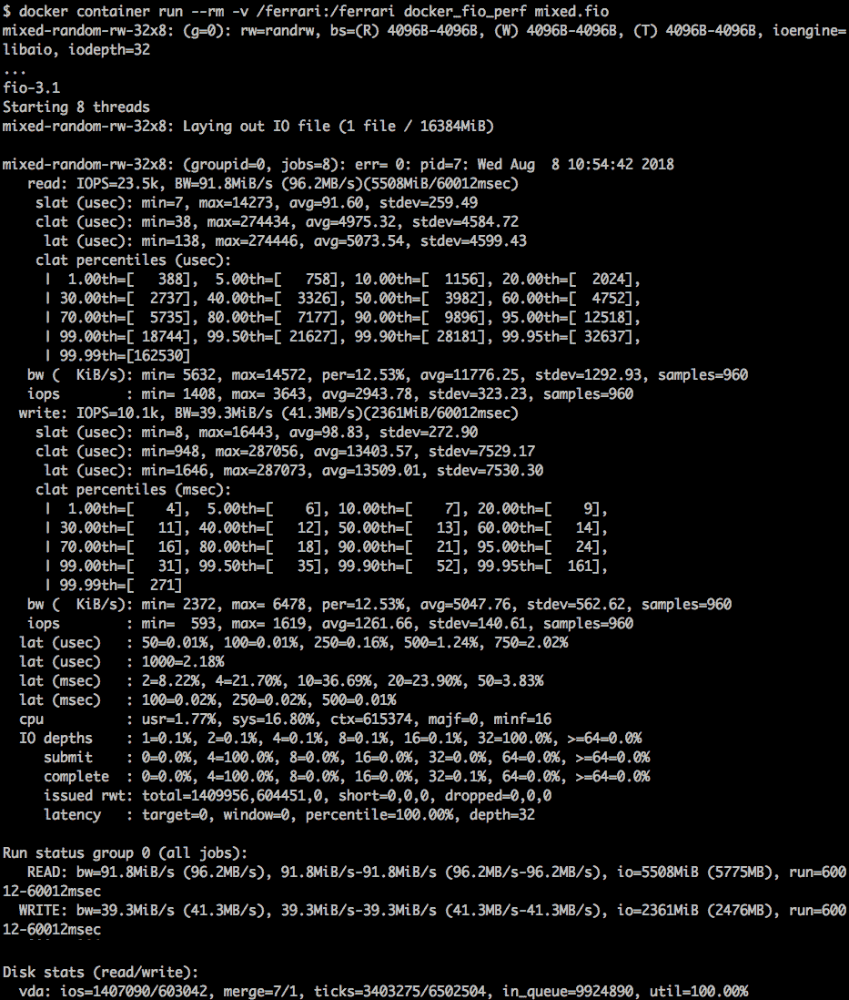
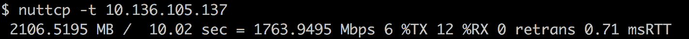
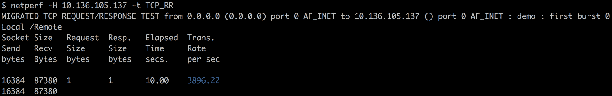
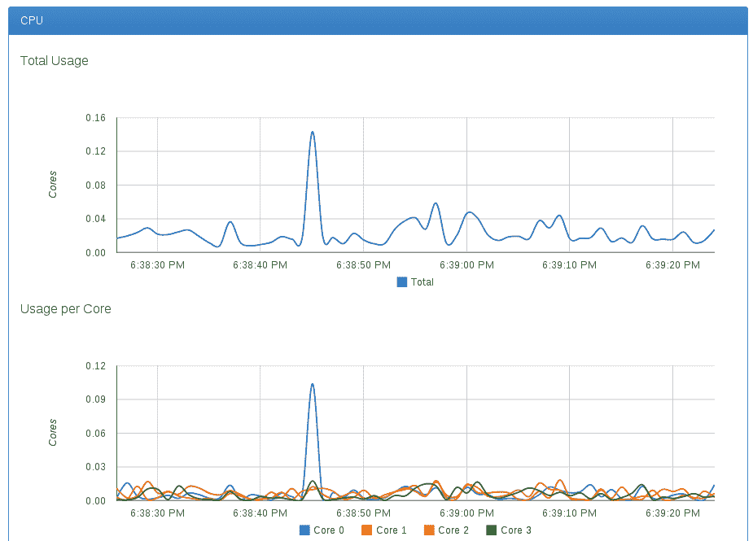

# Docker绩效

在本章中，我们将介绍以下食谱:

*   基准测试中央处理器性能
*   磁盘性能基准测试
*   网络性能基准测试
*   使用统计功能获取容器资源使用情况
*   设置性能监控

# 介绍

在[第 3 章](03.html)、*使用 Docker Images* 中，我们看到了如何使用 Dockerfiles 创建由不同服务/软件组成的映像。后来在[第四章](04.html)、*集装箱的网络和数据管理*中，我们看到了一个 Docker 集装箱是如何与外部世界就数据和网络进行对话的。在[第 5 章](05.html)*Docker 用例*中，我们研究了 Docker 的不同用例，在第 6 章*Docker API 和 SDKs* 中，我们研究了如何使用远程 API 连接到远程 Docker 主机。

易用性固然很好，但在投入生产之前，性能是需要考虑的关键因素之一。在本章中，我们将看到影响性能的 Docker 特性，以及我们可以遵循什么方法来对不同的子系统进行基准测试。在进行性能评估时，我们需要将 Docker 的性能与以下内容进行比较:

*   仅金属
*   虚拟计算机
*   虚拟机内部运行的 Docker

在这一章中，我们将只关注一种可以用来进行性能评估的方法，而不是从运行中收集性能数据来进行比较。不过，我会指出不同公司做的业绩比较，大家可以参考。

让我们先来看一些影响 Docker 性能的特性:

*   **卷**:放下任何企业级工作负载时，您都希望相应地调整底层存储。您不应该使用容器用来存储数据的主/根文件系统。Docker 提供了通过卷连接/安装外部存储的工具。正如我们在[第 4 章](04.html)、*集装箱的网络和数据管理*中看到的，有两种类型的卷，如下所示:
    *   使用-volume 选项通过主机装载的卷
    *   使用-volumes-from 选项通过另一个容器装载的卷
*   **存储驱动**:我们在第一章*介绍和安装*中看到了不同的存储驱动，分别是 vfs、aufs、btrfs、zfs、devicemapper 和 overlayFS。如果在[https://github . com/Moby/Moby/blob/master/daemon/graph driver/driver _ Linux . go](https://github.com/moby/moby/blob/master/daemon/graphdriver/driver_linux.go)没有选择任何内容作为 Docker 开始时间，您可以检查当前支持的存储驱动程序及其选择优先级。

如果您正在运行 Fedora、CentOS 或 RHEL，则设备映射器将是默认的存储驱动程序。你可以在[https://github . com/Moby/Moby/tree/master/daemon/graph driver/dev mapper](https://github.com/moby/moby/tree/master/daemon/graphdriver/devmapper)找到一些设备映射器特定的调优。

您可以使用`-s`选项将默认存储驱动程序更改为 Docker 守护程序。您可以更新特定于分发的配置/系统文件，以便为服务重启做出更改。对于 Fedora/RHEL/CentOS，您将在`/etc/docker/daemon.json`中更新*存储驱动程序*字段—类似于以下内容，以便您可以使用`btrfs`后端:

```
 "storage-driver": "btrfs"
```

下图显示了启动和停止具有不同存储驱动程序配置的 1，000 个容器所需的时间:



如您所见，overlayFS 的性能优于其他存储驱动程序。

*   `--net=host`:我们知道，默认情况下，Docker 会创建一个桥，并将它的 IPs 关联到容器。使用`--net=host`通过跳过为容器创建网络命名空间，将主机网络堆栈暴露给容器。从测试中，我们可以看到，与桥接选项相比，该选项总是提供更好的性能。

这给了我们一些限制，比如我们不能让两个容器或主机应用程序监听同一个端口。

*   `cgroups` : Docker 的默认执行驱动 libcontainer 公开了不同的`cgroups`旋钮，可以用来微调容器性能。其中一些如下:
    *   **CPU 共享**:有了这个，我们可以给容器按比例加权，这样资源就可以共享了。默认情况下，所有容器获得相同比例的 CPU 周期。要从默认值 1024 修改比例，请使用`-c`或`--cpu-shares`标志将权重设置为 2 或更高。该比例仅在 CPU 密集型进程运行时适用。当一个容器中的任务空闲时，其他容器可以使用剩余的 CPU 时间。考虑以下示例:

        ```
         $ docker container run -it -c 100 alpine ash 
        ```

        *   **CPUsets** :使用 CPUsets 将允许您将容器限制为仅在选定的 CPU 内核上运行。例如，以下代码将只在第 0 个和第 3 个内核的容器内运行线程:

            ```
            $ docker container run -it --cpuset=0,3 alpine ash 
            ```

    *   **内存限制**:我们可以给一个容器设置内存限制。例如，下面将容器的内存使用限制为 512 MB:

```
 $ docker container run -it -m 512M alpine ash
```

*   **sysctl 和 ulimit 设置**:在少数情况下，您可能需要根据用例更改一些`sysclt`值来获得最佳性能，例如更改打开文件的数量。您可以使用以下命令更改`ulimit`设置:

```
 $ docker container run -it --ulimit data=8192 alpine ash
```

前面的命令是容器特定的设置。我们还可以通过 Docker 守护程序的配置文件设置其中一些设置，默认情况下，这些设置将适用于所有容器。例如，查看 Docker 的配置文件，您会在`/etc/docker/daemon.json`中看到如下内容:

```
    {
        "default-ulimits": {
            "nofile": "1048576",
            "nproc": "1048576",
            "core": "-1"
        }
    }
```

请随意更改值以适合您的用例。如果您使用的是 Mac 或 Windows 的 Docker，您可以从他们的首选项菜单中更改这些值。

你可以通过研究别人做的工作来了解 Docker 的表现。以下是一些公司发布的与 Docker 绩效相关的研究:

*   来自红帽子:
    *   红帽企业 Linux 上 Docker 的性能分析；
        *   [https://developers . RedHat . com/blog/2014/08/19/performance-analysis-docker-red-hat-enterprise-Linux-7](https://developers.redhat.com/blog/2014/08/19/performance-analysis-docker-red-hat-enterprise-linux-7)
        *   [https://github . com/red hat-performance/dock-performance](https://github.com/redhat-performance/docker-performance)
    *   Docker 存储可扩展性综合概述:

        *   [https://developers . RedHat . com/blog/2014/09/30/overview-storage-scalability-docker/](https://developers.redhat.com/blog/2014/09/30/overview-storage-scalability-docker/)
    *   超越微基准–特斯拉效率下的突破性集装箱性能:

        *   [https://developers . red hat . com/blog/2014/10/21/beyond-micro benchmark-突破-容器-性能-与特斯拉合作-效率/](https://developers.redhat.com/blog/2014/10/21/beyond-microbenchmarks-breakthrough-container-performance-with-tesla-efficiency/)
    *   用红帽企业 Linux 将数据库容器化:
        *   [http://rhelblog . RedHat . com/2014/10/29/containing-databases-with-red-hat-enterprise-Linux/](http://rhelblog.redhat.com/2014/10/29/containerizing-databases-with-red-hat-enterprise-linux/)

*   来自 IBM:
    *   虚拟机和 Linux 容器的最新性能比较:
        *   [http://domino . research . IBM . com/library/cyber dig . NSF/papers/0929052195 DD 819 c 85257d 2300681 e7b/$ File/RC 25482 . pdf](http://domino.research.ibm.com/library/cyberdig.nsf/papers/0929052195DD819C85257D2300681E7B/%24File/rc25482.pdf)
        *   [https://github . com/thewmf/KVM dock 比较](https://github.com/thewmf/kvm-docker-comparison)

*   来自 VMware:
    *   VMware 虚拟环境中的 Docker 容器性能:
        *   [http://blogs . VMware . com/performance/2014/10/docker-containers-performance-VMware-v sphere . html](http://blogs.vmware.com/performance/2014/10/docker-containers-performance-vmware-vsphere.html)

为了进行基准测试，我们需要在不同的环境(裸机/虚拟机/Docker)上运行类似的工作负载，然后收集具有不同性能统计的结果。为了简化事情，我们可以编写可以在不同环境中运行的通用基准测试脚本。我们还可以创建 Dockerfiles 来分离带有工作负载生成脚本的容器。例如，在前面列出的 Red Hat Enterprise Linux 上 docker 的性能分析文章([https://github . com/Red Hat-Performance/Docker-Performance/blob/master/Dockerfile/Docker file](https://github.com/redhat-performance/docker-performance/blob/master/Dockerfiles/Dockerfile)中，作者使用 Docker file 创建了 CentOS 映像，并使用容器环境变量为基准脚本`run-sysbench.sh`选择了 Docker 和非 Docker 环境。

同样，Dockerfiles 和相关脚本由 IBM 发布，可在[https://github.com/thewmf/kvm-docker-comparison](https://github.com/thewmf/kvm-docker-comparison)获得。

我们将使用本章食谱中前面提到的一些 Docker 文件和脚本。

# 基准测试中央处理器性能

我们可以使用 Linpack([http://www.netlib.org/linpack/](http://www.netlib.org/linpack/))和 sysbench([https://github.com/nuodb/sysbench](https://github.com/nuodb/sysbench))等基准来对 CPU 性能进行基准测试。对于这个配方，我们将使用 sysbench。我们将看到如何在裸金属和容器内部运行基准测试。类似的步骤可以在其他环境中执行，就像我们之前提到的那样。

# 准备好

我们将使用 CentOS 7 容器在容器内部运行基准测试。理想情况下，我们应该安装一个带有 CentOS 7 的系统，以便在裸机上获得基准测试结果。对于容器测试，让我们从前面提到的 Git 存储库中构建映像:

```
 $ git clone https://github.com/redhat-performance/docker-performance.git
 $ cd docker-performance/Dockerfiles/
 $ docker image build -t c7perf --rm .
 $ docker image ls
 REPOSITORY      TAG       IMAGE ID      CREATED            SIZE 
 c7perf          latest    59a10df39a82  1 minute ago      678.3 MB
```

# 怎么做…

在同一个 Git 存储库中，我们有一个脚本来运行`sysbench`，也就是`docker-performance/bench/sysbench/run-sysbench.sh`。它有一些配置，您可以根据需要进行修改:

1.  作为根用户，在主机上创建`/results`目录:

```
$ mkdir -p /results
```

现在，在将容器环境变量设置为 Docker 之外的某个值后运行基准测试，我们在主机上构建`c7perf`映像时使用了该值，命令如下:

```
$ cd docker-performance/bench/sysbench
$ export container=no
$ sh ./run-sysbench.sh  cpu test1
```

如果您在 CentOS 以外的操作系统上运行，您可能需要手动安装 sysbench，并以稍微不同的方式运行脚本。例如，以下是如何使用 Ubuntu 18.04 运行脚本:

```
 $ apt-get install sysbench
 $ cd docker-performance/bench/sysbench
 $ export container=no
 $ bash ./run-sysbench.sh cpu test1
```

默认情况下，结果收集在`/results`中。请确保您对其具有写权限，或者更改基准脚本中的`OUTDIR`参数:



2.  要在容器内运行基准测试，我们需要首先启动容器，然后运行基准测试脚本:

```
$ mkdir -p /results_container
$ docker container run -it -v /results_container:/results c7perf bash
# /root/docker-performance/bench/sysbench/run-sysbench.sh cpu test1
```

当我们在`/results`容器中装载主机目录`/results_container`时，将在主机上收集结果:


3.  在启用了 SELinux 的 Fedora/RHEL/CentOS 上运行前面的测试时，您将获得一个权限被拒绝的错误。要修复此问题，请在将主机目录装入容器时重新标记主机目录，如下所示:

```
 $ docker container run -it -v /results_container:/results:z c7perf bash
```

或者，暂时将 SELinux 置于许可模式:

```
 $  setenforce 0
```

然后，测试结束后，将其放回许可模式:

```
 $  setenforce 1
```

关于 SELinux 的更多信息，请参考第 9 章 *Docker 安全*。

# 它是如何工作的…

基准测试脚本在内部为给定的输入调用 sysbench 的 CPU 基准测试。使用 Euklid 算法进行素数计算，通过使用 64 位整数操作对 CPU 进行基准测试。每次运行的结果都收集在相应的结果目录中，可用于比较。

# 还有更多…

据报道，裸机和 Docker 的 CPU 性能几乎没有区别。

# 请参见

在本章前面提到的链接中，查看在 IBM 和 VMware 中使用 Linpack 发布的 CPU 基准测试结果。

# 磁盘性能基准测试

有 Iozone([http://www.iozone.org](http://www.iozone.org))、small file([https://github.com/bengland2/smallfile](https://github.com/bengland2/smallfile))和 Flexible IO([https://github.com/axboe/fio](https://github.com/axboe/fio)等工具可以用来测试磁盘性能。对于这个食谱，我们将使用 FIO。为此，我们需要编写一个作业文件，模拟您想要运行的工作负载。使用这个作业文件，我们可以模拟目标上的工作负载。对于这个食谱，让我们以 IBM 已经发布的基准测试结果中的 FIO 为例([https://github . com/thewmf/KVM-docker-comparison/tree/master/FIO](https://github.com/thewmf/kvm-docker-comparison/tree/master/fio))。

# 准备好

在裸机/虚拟机/Docker 容器上，安装 FIO，并为`/ferrari`下的每个测试或 FIO 作业文件中提到的任何内容安装包含文件系统的磁盘。在裸机上，可以原生挂载；在虚拟机上，您可以使用虚拟磁盘驱动程序装载或执行设备传递。在 Docker 上，我们可以使用 Docker 卷从主机附加文件系统。

准备工作量文件。我们将选择:[https://github . com/thewmf/KVM-docker-comparison/blob/master/fio/mixed . fio](https://github.com/thewmf/kvm-docker-comparison/blob/master/fio/mixed.fio):

```
$ curl -o mixed.fio https://raw.githubusercontent.com/thewmf/kvm-docker-comparison/master/fio/mixed.fio
$ cat mixed.fio
[global]
ioengine=libaio
direct=1
size=16g
group_reporting
thread
filename=/ferrari/fio-test-file

[mixed-random-rw-32x8]
stonewall
rw=randrw
rwmixread=70
bs=4K
iodepth=32
numjobs=8
runtime=60
```

This recipe is specific to Linux; it may work on Docker for Mac or Windows with some minor changes.

使用前面的作业文件，我们可以在 16 GB 的文件上使用 libaio 驱动程序在具有 4K 块大小的`/ferrari/fio-test-file`上进行随机直接 IO。输入/输出深度为 32，并行作业数为 8。这是一个混合工作负载，其中 70%是读操作，30%是写操作。

# 怎么做...

请遵循以下步骤:

1.  对于裸机和虚拟机测试，您可以只运行 FIO 作业文件并收集结果:

```
 $ fio mixed.fio
```

2.  对于 Docker 测试，您可以准备如下 Docker 文件:

```
FROM ubuntu:18.04
RUN apt-get update
RUN apt-get -qq install -y fio
ADD mixed.fio /
VOLUME ["/ferrari"]
ENTRYPOINT ["fio"]
```

3.  现在，使用以下命令创建一个映像:

```
 $ docker image build -t docker_fio_perf .
```

4.  如下所示启动容器，运行基准测试并收集结果，如下图所示:

```
 $ docker container run --rm -v /ferrari:/ferrari 
 docker_fio_perf mixed.fio
```



5.  在启用了 SELinux 的 Fedora/RHEL/CentOS 上运行前面的测试时，您将获得权限被拒绝的错误。要修复此问题，请在将主机目录装入容器时重新标记主机目录，如下所示:

```
 $ docker container run --rm -v /ferrari:/ferrari:z 
    docker_fio_perf mixed.fio
```

# 它是如何工作的...

FIO 将运行作业文件中给出的工作负载，并吐出结果。

# 还有更多…

一旦收集到结果，您就可以进行结果比较。您甚至可以使用作业文件尝试不同类型的输入/输出模式，并获得所需的结果。当您查看结果时，您想要检查的几件事如下:

*   **iops** :每秒的输入输出操作数；越高越好。
    *   **带宽(bw)** :数据传输速率、比特率或吞吐量；越高越好。
*   **延迟(lat)** :从提交给内核到 IO 完成之间经过的时间，越低越好。

# 请参见

查看本章前面提到的链接中使用 FIO 在 IBM 和 VMware 中发布的磁盘基准测试结果。

# 网络性能基准测试

在容器环境中部署应用程序时，网络是需要考虑的关键因素之一。为了与裸机、虚拟机和容器进行性能比较，我们必须考虑如下不同的场景:

*   裸机到裸机
*   虚拟机到虚拟机
*   Docker 容器转换为具有默认网络模式(网桥)的容器
*   Docker 容器到带有主机网的容器(`--net=host`)
*   在虚拟机内部与外部世界一起运行的 Docker 容器

在上述任何一种情况下，我们都可以选择两个端点来进行基准测试。我们可以使用 nut CP([http://www.nuttcp.net](http://www.nuttcp.net))和 netperf([https://github.com/HewlettPackard/netperf](https://github.com/HewlettPackard/netperf))等工具分别测量网络带宽和请求/响应。

# 准备好

确保两个端点可以相互连接，并且安装了必要的软件包/软件。在 Ubuntu 上，您可以使用以下命令安装 nuttcp 和 netperf:

```
$ sudo apt-get install -y nuttcp netperf
```

# 怎么做…

要使用 nuttcp 测量网络带宽，请执行以下步骤:

1.  在一个端点上启动 nuttcp 服务器:

```
 $ nuttcp -S
```

2.  使用以下命令测量客户端的传输吞吐量(客户端到服务器)，并参考下面的截图:

```
 $ nuttcp -t <SERVER_IP>
```



3.  使用以下命令测量客户端(服务器到客户端)上的接收器吞吐量，并参考下面的屏幕截图:

```
 $ nuttcp -r <SERVER_IP>
```


4.  使用 netperf 运行请求/响应基准测试；执行以下步骤:
    *   从一个端点开始`netserver`:

```
 $ netserver
```

`netserver` starts up automatically on install. If `netserver` is already running and you run this command, you might get an error like Unable to start `netserver` with  `IN(6)ADDR_ANY` port `12865` and family `AF_UNSPEC`. That is fine, it just means it is already running. To confirm it is running, you can run use `ps -ef | grep netserver`.

*   从另一个端点连接到服务器并运行请求/响应测试，请参考以下截图中的输出:
    *   对于 TCP:

```
 $ netperf  -H 172.17.0.6 -t TCP_RR 
```



*   对于 UDP:

```
 $ netperf  -H 172.17.0.6 -t UDP_RR
```


# 它是如何工作的…

在前面提到的两种情况下，一个端点成为客户端，并将请求发送到另一个端点上的服务器。

# 还有更多…

我们可以收集不同场景的基准测试结果并进行比较。`netperf`也可用于吞吐量测试。

# 请参见

查看本章前面提到的链接中由 IBM 和 VMware 发布的网络基准测试结果。

# 使用统计功能获取容器资源使用情况

Docker 有一个特性，可以轻松获取它所管理的容器的资源使用情况。下面的食谱告诉你如何使用它。

# 准备好

您将需要一个可以通过 Docker 客户端访问的 Docker 主机。另外，启动一些容器来获取一些统计数据。

# 怎么做...

请遵循以下步骤:

1.  运行以下命令从一个或多个容器中获取统计信息:

```
 $ docker stats [OPTIONS] [CONTAINERS]
```

例如，如果我们有两个名为 some-mysql 和 backstabbing_turing 的容器，那么运行以下命令来获取统计信息，如下图所示:

```
 $ docker stats some-mysql backstabbing_turing
```


# 它是如何工作的...

Docker 守护程序从`cgroups`获取资源信息，并通过 API 为其提供服务。

# 请参见

参考 https://docs.docker.com/engine/reference/commandline/stats/的Docker统计文档。

# 设置性能监控

我们有 SNMP、Nagios 等工具来监控裸机、虚拟机性能。同样，也有一些工具/插件可以用来监控容器性能，比如 cAdvisor([https://github.com/google/cadvisor](https://github.com/google/cadvisor))和 Prometheus([https://Prometheus . io](https://prometheus.io))。在这个食谱中，让我们看看如何配置 cAdvisor。

# 准备好

执行以下操作来设置 cAdvisor:

*   运行 cAdvisor 最简单的方法是运行其`docker container`，这可以通过以下命令来完成:

```
$ sudo docker container run \
 --volume=/:/rootfs:ro \
 --volume=/var/run:/var/run:rw \
 --volume=/sys:/sys:ro \
 --volume=/var/lib/docker/:/var/lib/docker:ro \
 --publish=8080:8080 \
 --detach=true \
 --name=cadvisor \
 google/cadvisor:latest
```

*   如果您想在 Docker 之外运行 cAdvisor，那么请按照 cAdvisor 主页上给出的说明操作:[https://github . com/Google/cAdvisor/blob/master/docs/running . MD # standalone](https://github.com/google/cadvisor/blob/master/docs/running.md#standalone)。

# 怎么做...

容器启动后，将浏览器指向`http://localhost:8080`。您将首先获得主机的 CPU、内存使用情况和其他信息的图表。然后，通过点击 Docker Containers 链接，您将在 Subcontainers 部分下获得机器上运行的容器的 URL。如果您单击其中的任何一个，您将看到相应容器的资源使用信息。下面的截图显示了一个这样的容器:



# 它是如何工作的...

使用`docker run`命令，我们已经以只读模式从主机装载了几个卷。cAdvisor 将从这些文件中读取相关信息，例如容器的 Cgroup 详细信息，并以图形方式显示它们。

# 还有更多…

cAdvisor 支持将性能矩阵导出到 influx db([https://www.influxdata.com](https://www.influxdata.com))。

# 请参见

你可以从 Docker 网站的文档中的组中查看 cAdvisor 使用的矩阵:[https://docs.docker.com/config/containers/runmetrics/](https://docs.docker.com/config/containers/runmetrics/)。