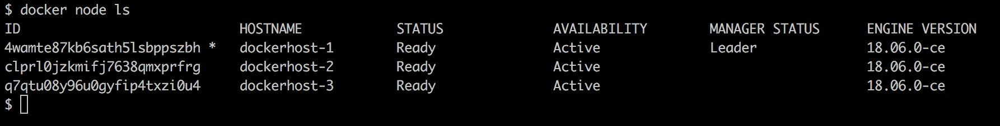
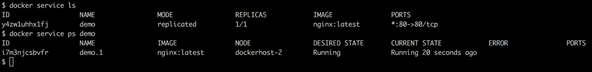
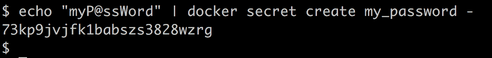
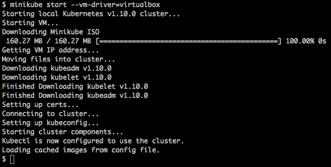
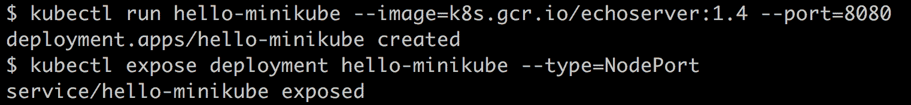
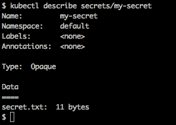
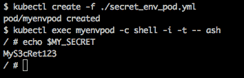
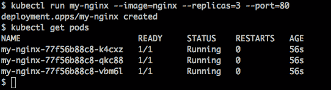
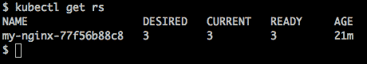

# 八、编排和托管平台

这一章，我们将涵盖以下食谱:

*   使用 Docker 编写运行应用
*   使用 Docker Swarm 设置集群
*   与DockerSwarm一起使用秘密
*   设置 Kubernetes 集群
*   在 Kubernetes 集群中向上和向下扩展
*   和Kubernetes一起使用秘密
*   用 Kubernetes 集群设置 WordPress

# 介绍

在单个主机上运行 Docker 可能对开发环境有好处，但是真正的价值来自于我们跨越多个主机。然而，这不是一项微不足道的任务。你必须安排好这些容器。因此，在本章中，我们将介绍一些编排工具和托管平台。

Docker Inc .宣布了两个这样的工具:

*   docker Compose([https://docs.docker.com/compose](https://docs.docker.com/compose))，创建由多个容器组成的应用。
*   Docker Swarm([https://docs.docker.com/engine/swarm/](https://docs.docker.com/engine/swarm/))，用于群集多个 Docker 主机。Docker Compose 以前叫做 Fig(T2)。

谷歌启动了 Kubernetes([http://kubernetes.io/](http://kubernetes.io/))Docker 编排。Kubernetes 提供了应用部署、调度、更新、维护和扩展的机制。

就连微软也宣布([http://azure . Microsoft . com/blog/2015/04/08/Microsoft-揭幕-新-容器-技术-面向下一代云/](http://azure.microsoft.com/blog/2015/04/08/microsoft-unveils-new-container-technologies-for-the-next-generation-cloud/) )为 Docker 推出了专门的操作系统。

跨整个数据中心和云环境提供资源管理和调度的 Apache Mesos([http://mesos.apache.org](http://mesos.apache.org))也增加了对 Docker 的支持([http://Mesos . Apache . org/documents/latest/Docker-container/](http://mesos.apache.org/documentation/latest/docker-containerizer/))。

VMware 还推出了一款名为 VMware Photon([http://vmware.github.io/photon/](http://vmware.github.io/photon/))的容器专用主机。

前面所有的工具和平台都需要单独的章节。但是在这一章中，我们将探索作曲、Swarm 和 Kubernetes。

# 使用 Docker 编写运行应用

Docker Compose([http://docs.docker.com/compose/](http://docs.docker.com/compose/))是运行组成应用的相互依赖的容器的本地 Docker 工具。我们在单个文件中定义了一个多容器应用，并将其提供给 Docker Compose，Docker Compose 将设置该应用。在本食谱中，我们将再次使用 WordPress 作为运行的示例应用。

# 准备好

要安装 Docker Compose，请运行以下命令:

```
$ sudo pip install docker-compose
```

# 怎么做

请遵循以下步骤:

1.  为应用创建一个目录，并在其中创建`docker-compose.yml`来定义应用:

```
$ cd wordpress_compose/
$ cat docker-compose.yml
version: '3.1'
services:
  wordpress:
    image: wordpress
    restart: always
    ports:
      - 8080:80
    environment:
      WORDPRESS_DB_PASSWORD: example
  mysql:
    image: mysql:5.7
    restart: always
    environment:
      MYSQL_ROOT_PASSWORD: example
```

2.  我们从 Docker Hub([https://registry.hub.docker.com/_/wordpress/](https://registry.hub.docker.com/_/wordpress/))上的官方 WordPress Docker 存储库中获取了前面的示例。
3.  在应用目录中，运行以下命令来构建和启动应用:

```
$ docker-compose up
```

4.  构建完成后，从`http://localhost:8080`或`http://<host-ip>:8080`进入 WordPress 安装页面。

# 它是如何工作的...

Docker Compose 下载 MySQL 和 WordPress 的映像，如果不能从正式的 Docker 注册表本地获得的话。首先，它从 MySQL 映像启动数据库容器；然后，它启动 WordPress 容器。

# 还有更多...

我们甚至可以在合成过程中从 Dockerfile 构建映像，然后将其用于应用。例如，为了构建 WordPress 映像，我们可以使用相应的 Dockerfile，并将其放在应用编写目录中:

```
$ cat Dockerfile
FROM wordpress:latest
# extend the base wordpress image with anything custom
# you might need for local dev.
ENV CUSTOM_ENV env-value
```

然后我们需要更新`docker-compose.yml`文件，这样我们就可以从上面引用 Dockerfile 了。这将允许我们更改 WordPress 映像，并进行官方映像中没有的自定义更改:

```
$ cat docker-compose.yml
version: "3.1"
services:
 wordpress:
 build: .
 restart: always
 ports:
 - 8080:80
 environment:
 WORDPRESS_DB_PASSWORD: example
    mysql:
        image: mysql:5.7
        restart: always
        environment:
            MYSQL_ROOT_PASSWORD: example
```

*   一旦进行了这些更改，就可以像以前一样启动堆栈:

```
    $ docker-compose up
```

*   要在启动堆栈后将其放下，请执行以下操作:

```
 $ docker-compose down
```

*   在堆栈中构建容器:

```
 $ docker-compose build
```

*   进入运行中的 WordPress 容器:

```
 $ docker-compose exec wordpress bash
```

*   列出堆栈中正在运行的容器:

```
 $ docker-compose ps
```

# 请参见

您也可以查看以下参考资料:

*   Docker 合成 YAML 文件参考于:https://docs . docker . com/compose/compose-file/。
*   在 https://docs.docker.com/compose/reference/overview/编写命令行引用。
*   Docker 合成 GitHub 存储库 at:https://github . com/docker/compose。

# 使用 Docker Swarm 设置集群

Docker Swarm([https://docs.docker.com/engine/swarm/](https://docs.docker.com/engine/swarm/))是 Docker 内置的本地集群。它将多个 Docker 主机分组到一个池中，您可以在其中启动容器。为了简单起见，这里我们将使用 VirtualBox 作为后端来配置主机。

Swarm 有两个版本。在本食谱中，我们将使用两种模式中较新的一种，称为 Docker Swarm 模式，它基于 Swarm kit([https://github.com/docker/swarmkit](https://github.com/docker/swarmkit))。较新的版本使其更容易启动和运行，并删除了许多以前需要的步骤。集群模式内置于 Docker 守护程序中，因此使用它不需要额外的软件。

Docker Swarm 模式支持两种类型的节点；一个经理和一个工人。管理器节点为 Swarm 执行编排和集群管理功能。他们把称为任务的工作单位分派给工人。管理节点使用 Raft 共识算法([http://thesecretlivesofdata.com/raft/](http://thesecretlivesofdata.com/raft/))来管理全局集群状态。工作节点接收并执行管理人员分派的任务。

为了让 Raft 正常工作，您需要奇数个经理才能让领导人选举正常工作。这意味着，如果您想要一个容错的 Swarm 集群，您应该有三个或五个管理器。如果您有三个管理器，则可以处理一个管理器节点故障，如果有五个管理器节点，则可以在 Raft 共识丢失之前处理多达两个节点故障。选择最适合您工作负荷的集群大小。

# 准备好

请遵循以下步骤:

1.  在您的系统上安装 VirtualBox([https://www.virtualbox.org/](https://www.virtualbox.org/))。配置 VirtualBox 的说明不在本书的讨论范围内。
2.  使用 VirtualBox，创建三个名为`dockerhost-1`、`dockerhost-2`和`dockerhost-3`的虚拟机，并在其上安装最新版本的 Docker。

3.  确保在`dockerhost-1`、`dockerhost-2`和`dockerhost-3`之间没有防火墙阻止访问。

# 怎么做

请遵循以下步骤:

1.  登录`dockerhost-1`并初始化蜂群。`--advertise-addr`参数是您将监听群流量的主机的 IP 地址:

```
$ docker swarm init --advertise-addr <your host ip>

Swarm initialized: current node (4daiatuoef7eh0ne6kawtflml) is now a manager.
To add a worker to this swarm, run the following command:

docker swarm join --token SWMTKN-1-2nyaeu0l2rw7fv6wpgco4o1spos0elazjxob3nitlnfy9bv15y-bdch9bt28qsviddpmc38r5hv1 10.10.0.6:2377

To add a manager to this swarm, run 'docker swarm join-token manager' and follow the instructions.
```

The Swarm token that is returned by the Swarm `init` command will be different for everyone. Make sure you use the one that you get when you start your Swarm.

2.  登录`dockerhost-2`和`dockerhost-3`，作为工作人员加入群:

```
$ docker swarm join --token SWMTKN-1-2nyaeu0l2rw7fv6wpgco4o1spos0elazjxob3nitlnfy9bv15y-bdch9bt28qsviddpmc38r5hv1 10.10.0.6:2377
```

3.  在`host1`上，列出 Swarm 集群中的节点，如下图所示:

```
$ docker node ls
```



如您所见，集群中有三个节点:一个管理人员和两个工作人员。现在你有了一个群，你可以在群上安排任务。

4.  在群集上启动服务:

```
 $ docker service create --name demo --publish 80:80 nginx
```

5.  通过参考下面的屏幕截图来查看服务的状态:

```
 $ docker service ls
 $ docker service ps demo
```



6.  将服务扩展到 3:

```
 $ docker service scale demo=3
```

7.  检查以确保服务已经扩展到`3`。缩放事件可能需要几分钟才能完成:


# 它是如何工作的…

使用初始化群时从管理节点获得的唯一令牌，我们将工作节点添加到集群中。然后我们创建了一个简单的`nginx`服务，并将其扩展到`3`；这为 Swarm 中的每个节点启动了一个容器。

# 还有更多...

如果要向集群添加管理器，您需要执行以下操作:

*   在现有管理器上，运行以下命令:

```
 $ docker swarm join-token manager
 To add a manager to this swarm, run the following command:

 docker swarm join --token SWMTKN-1-0trltcq6gwhz9w40j3wpuqedjwviwdgksuz8zulaz6qon118s4-2ui4f15uu7ceow6k2gc9xutb5 10.10.0.6:2377
```

*   登录到潜在的新 manager 主机，并从上面运行命令:

```
 $ docker swarm join --token SWMTKN-1-0trltcq6gwhz9w40j3wpuqedjwviwdgksuz8zulaz6qon118s4-2ui4f15uu7ceow6k2gc9xutb5 10.10.0.6:2377

 This node joined a swarm as a manager.
```

# 请参见

您可以在Docker网站[https://docs.docker.com/engine/swarm/](https://docs.docker.com/engine/swarm/)查看 Swarm 文档，了解更多信息。

# 与DockerSwarm一起使用秘密

当您使用容器时，您需要做的一件常见的事情是连接到一些外部资源，如数据库、缓存或 web 服务。这些资源通常需要凭据。将这些凭证传递给容器的一种流行方式是使它们成为在容器启动时填充的环境变量。这允许您在不同的开发环境中使用相同的 Docker 映像，并且不需要在映像中存储密码。这是由 Heroku([https://www.heroku.com](https://www.heroku.com))推出的十二因素应用([https://12factor.net](https://12factor.net))的一个共同特点。

在运行时向容器中添加环境变量非常容易，但也有它的缺点。当一个环境变量被添加到容器中时，在该容器中运行的所有东西都可以访问它。这意味着，不仅您的代码可以看到它，来自第三方库的代码也可以。这使得这些密码很容易意外暴露在容器外。

当错误发生时，这通常会意外发生，在生成的错误堆栈跟踪中，它会列出所有当前环境变量。这最初是为了帮助您调试问题而添加的，但是他们几乎不知道，通过公开所有的环境变量，他们也共享了您的密码，并且在此过程中创造了另一个问题。

为了解决这个问题，Docker 推出了一个名为 Docker Secrets([https://docs.docker.com/engine/swarm/secrets/](https://docs.docker.com/engine/swarm/secrets/))的新功能。Docker Secrets 目前仅适用于 Swarm 服务。秘密可以是您不想与其他人共享的任何数据块，如密码、顶级域名证书等。

这是一个很大的收获，让我们来看一个例子。

# 准备好

你将需要进入一个设置了 Docker Swarm 的系统。

# 怎么做...

请遵循以下步骤:

1.  向 Swarm 添加一个秘密，如下图所示:

```
 $ echo "myP@ssWord" | docker secret create my_password -
```



2.  创建使用该密码的服务:

```
 $ docker service create --name="my-service" --secret="my_password" redis
```

3.  因为我们使用的是 Swarm，所以容器可以在集群中的任何节点上运行。要找出您的 Swarm 容器正在哪个节点上运行，您可以使用`docker service ps`命令；参考下面的截图:

```
    $ docker service ps my-service
```


4.  现在您已经知道容器在哪个节点上运行，连接到该节点并运行以下命令来查看容器内未加密的秘密，如下图所示:

```
 $ docker container exec $(docker container ls --filter name=my-service -q) cat /run/secrets/my_password
```


# 它是如何工作的...

它是这样工作的，当你向 Swarm 添加一个秘密时，它会将这个加密的秘密存储在它的内部 Raft 存储中。当您创建服务并引用该秘密时，Swarm 会让这些容器访问该秘密，并将未加密的秘密作为内存中的文件系统装载添加到容器中。为了读取这个秘密，您的应用需要查看文件系统挂载，而不是环境。

如果秘密被移除，或者服务被更新以移除秘密，则该秘密将不再对容器可用。

# 还有更多...

让我们看看一些附加功能:

*   使用以下代码检查机密:

```
 $ docker secret inspect <secret name>
```

*   使用以下代码列出秘密:

```
 $ docker secret ls
```

*   使用以下代码删除机密:

```
 $ docker secret rm <secret name>
```

*   使用以下代码更新服务以删除机密:

```
 $ docker service update --secret-rm <secret name> <service name>  
```

# 请参见

您可以在[https://docs.docker.com/engine/swarm/secrets/](https://docs.docker.com/engine/swarm/secrets/)查看 Docker Secrets 文档了解更多信息。

# 设置 Kubernetes 集群

Kubernetes 是一个开源容器编排工具，用于集群中的多个节点。它是由谷歌发起的，现在，其他公司的开发者也在为此做出贡献。它提供了应用部署、调度、更新、维护和扩展的机制。Kubernetes 的自动放置、自动重启和自动复制功能确保应用的所需状态得到维护，这是由用户定义的。用户通过 YAML 或 JSON 文件定义应用，我们将在本食谱的后面部分看到。这些 YAML 和 JSON 文件还包含标识模式的应用编程接口版本(API version 字段)。

让我们看看 Kubernetes 的一些关键组件和概念:

*   **吊舱**:由一个或多个容器组成的吊舱，是 Kubernetes 的部署单元。容器中的每个容器与同一容器中的其他容器共享不同的名称空间。例如，pod 中的每个容器共享相同的网络命名空间，这意味着它们都可以通过 localhost 进行通信。
*   **节点/仆从**:之前被称为仆从的节点，是 Kubernetes 集群中的工作节点，通过主节点进行管理。Pods 部署在一个节点上，该节点包括运行它们所需的以下服务:
    *   `docker`，运行容器
    *   `kubelet`，与主人互动
    *   `proxy` ( `kube-proxy`)，将服务连接到相应的 pod
*   **主机**:主机集群级控制服务，如:
    *   **API 服务器**:这个有 RESTful APIs，可以和主节点和节点交互。这是与 etcd 实例对话的唯一组件。
    *   **调度器**:这个调度集群中的作业，比如在节点上创建 pods。
    *   **副本集**:这确保用户指定数量的 pod 副本在任何给定时间运行。要使用副本集管理副本，我们必须定义一个配置文件，其中包含 pod 的副本数量。

Master 还与`etcd`通信，T0 是分布式键值对。`etcd`用于存储主节点和节点都使用的配置信息。`etcd`的监视功能用于通知集群中的变化。`etcd`可以托管在主机上或一组不同的系统上。

*   **服务**:在 Kubernetes 中，每个 pod 都有自己的 IP 地址，并且会根据复制控制器的配置不时地创建和销毁 pod。因此，我们不能依靠吊舱的 IP 地址来迎合一个应用。为了克服这个问题，Kubernetes 定义了一个抽象，它定义了一组逻辑单元和访问它们的策略。这种抽象被称为服务。标签用于定义我们的服务管理的逻辑集。
*   **标签**:标签是可以附着到对象上的键值对。使用这些，我们可以选择对象的子集。例如，一个服务可以选择所有带有 mysql 标签的 pods。
*   **卷**:卷是容器可以访问的目录。它与 Docker 卷相似，但不相同。Kubernetes 支持不同类型的卷，其中一些是 emptyDir(临时)、hostPath、gcePersistentDisk、awsElasticBlockStore 和 NFS。正在积极开发以支持更多类型的卷。更多详情可在[https://kubernetes.io/docs/concepts/storage/](https://kubernetes.io/docs/concepts/storage/)找到。

Kubernetes 可以安装到虚拟机、物理机和云中。完整的矩阵，看看[https://kubernetes.io/docs/setup/pick-right-solution/](https://kubernetes.io/docs/setup/pick-right-solution/)。在第 1 章*介绍和安装中，*我们向您展示了如何为 Mac 安装 Docker 和为 Windows 安装 Docker。这两个工具都允许您通过单击按钮轻松创建本地 Kubernetes 集群。更多细节请参考那一章。

在这个食谱中，我们将看到在本地主机上安装 Kubernetes 的另一种方法，使用 MiniKube 和 VirtualBox。在 Kubernetes 的 v1.10.0 版上尝试了 Kubernetes 上的这个和下面的食谱。

# 准备好

做好以下准备:

*   从[https://www.virtualbox.org/wiki/Downloads](https://www.virtualbox.org/wiki/Downloads)安装最新的 VirtualBox。设置这些的说明超出了本书的范围。
*   必须在计算机的 BIOS 中启用 VT-x 或 AMD-v 虚拟化。

*   install kubectl:
    *   您可以通过以下方式在 macOS 上安装带有 home brew([https://brew . sh](https://brew.sh))的 Kubectl:

```
$ brew install kubernetes-cli
```

*   您可以通过以下方式在 Windows 上安装带有巧克力的 Kubectl([https://chocolatey.org](https://chocolatey.org)):

```
$ choco install kubernetes-cli
```

*   您可以通过 Linux 上的`curl`安装`kubectl`二进制文件:

```
$ curl -LO https://storage.googleapis.com/kubernetes-release/release/v1.10.0/bin/linux/amd64/kubectl
$ chmod +x ./kubectl
$ sudo mv ./kubectl /usr/local/bin/kubectl
```

*   安装迷你裙(https://github . com/Kubernetes/迷你裙/版本:
    *   在 Linux 上:

```
$ curl -Lo minikube https://storage.googleapis.com/minikube/releases/v0.28.2/minikube-linux-amd64
$ chmod +x minikube
$ sudo mv minikube /usr/local/bin/
```

```
$ curl -Lo minikube https://storage.googleapis.com/minikube/releases/v0.28.2/minikube-darwin-amd64
$ chmod +x minikube
$ sudo mv minikube /usr/local/bin/
```

# 怎么做...

运行以下命令，使用带 VirtualBox 的 MiniKube 设置 Kubernetes，并参考下面的截图:

```
$ minikube start --vm-driver=virtualbox
```



# 它是如何工作的...

MiniKube 将下载 MiniKube ISO，在 VirtualBox 中创建新的 VM，然后在内部配置 Kubernetes。最后，它将集群设置为 kubectl 的默认集群。

# 还有更多...

如果你需要对集群运行命令，你必须使用`kubectl`命令。以下是您日常使用的一些常见命令:

*   要创建新的部署，可以使用`kubctl run`命令。输入以下命令启动 echo web 服务，并参考下面的屏幕截图:

```
 $ kubectl run hello-minikube --image=k8s.gcr.io/echoserver:1.4 --port=8080
 $ kubectl expose deployment hello-minikube --type=NodePort
```



检查以确保它已启动并运行:

```
 $ kubectl get pod
```


使用`curl`连接到新服务，以确保其正常工作:

```
 $ curl $(minikube service hello-minikube --url)
```


您可以使用以下代码删除服务和部署:

```
 $ kubectl delete service hello-minikube
 $ kubectl delete deployment hello-minikube
```

*   您可以使用以下代码获得节点列表:

```
 $ kubectl get nodes
```

*   您可以使用以下代码获得一个豆荚列表:

```
 $ kubectl get pods
```

*   您可以使用以下代码获得服务列表:

```
 $ kubectl get services
```

*   您可以使用以下代码获得副本集列表:

```
 $ kubectl get rs
```

*   您可以使用以下代码停止 MiniKube 集群:

```
 $ minikube stop 
```

*   您可以使用以下代码删除 MiniKube 集群:

```
 $ minikube delete
```

您将会看到列出了一些 pod、服务和复制控制器，因为 Kubernetes 创建它们是为了供内部使用。如果没有看到，可以使用`-all-namespaces`命令行标志。

# 请参见

您也可以查看以下参考资料:

*   配置迷你裙:[https://kubrines . io/docs/setup/mini kube/](https://kubernetes.io/docs/setup/minikube/)。
*   kuble documentation:[https://kubriones . io/docs/home/](https://kubernetes.io/docs/home/)。
*   Kubernetes API 约定:[https://Kubernetes. io/docs/reference/using-API/](https://kubernetes.io/docs/reference/using-api/)。

# 和Kubernetes一起使用秘密

在使用 Docker Swarm 秘方中，我们展示了如何使用 Docker Swarm 使用秘方以安全的方式存储密码。Kubernetes 也有类似的功能，让我们看看它是如何工作的。

# 准备好

您将需要设置和配置一个 Kubernetes 集群，如前面的方法所述。

# 怎么做...

请遵循以下步骤:

1.  将您的密码添加到本地计算机上的文件中:

```
 $ echo -n "MyS3cRet123" > ./secret.txt
```

2.  将您的秘密添加到 Kubernetes:

```
 $ kubectl create secret generic my-secret --from-file=./secret.txt
 secret/my-secret created
```

3.  查看机密以确保其添加正确:

```
 $ kubectl describe secrets/my-secret
```



4.  在一个盒子里用一个卷来使用你的秘密。

创建一个名为`secret_pod.yml`的文件，并将以下内容放入其中。我们将使用该文件创建一个 pod，该 pod 有一个卷，我们将在其中装载我们的机密:

```
apiVersion: v1
kind: Pod
metadata:
 name: mypod
spec:
 containers:
 - name: shell
 image: alpine
 command:
 - "bin/ash"
 - "-c"
 - "sleep 10000"
 volumeMounts:
 - name: secretvol
 mountPath: "/tmp/my-secret"
 readOnly: true
 volumes:
 - name: secretvol
 secret:
 secretName: my-secret
```

5.  使用`secret_pod.yml`创建一个吊舱:

```
 $ kubectl create -f ./secret_pod.yml
```

6.  查看吊舱中的秘密:


# 它是如何工作的...

当您创建一个秘密时，Kubernetes 将对其进行`base64`编码，并将该秘密存储在支持 REST API 的数据存储中，例如`etcd`。如果您创建了一个引用机密的容器，当容器被创建时，它将获得使用该机密的权限。当它被部署时，它将创建并挂载一个秘密卷，并且秘密值被`base64`解码并作为文件存储在该卷中。您的应用需要引用这些文件才能访问机密。

# 还有更多...

即使不建议这样做，您也可以将秘密作为环境变量公开。为此，创建一个名为`secret_env_pod.yml`的新文件，如下所示，并参考下面的截图:

```
apiVersion: v1
kind: Pod
metadata:
 name: myenvpod
spec:
 containers:
 - name: shell
 image: alpine
 env:
 - name: MY_SECRET
 valueFrom:
 secretKeyRef:
 name: my-secret
 key: secret.txt
 command:
 - "bin/ash"
 - "-c"
 - "sleep 10000"
```



# 请参见

您可以在[https://kubernetes.io/docs/concepts/configuration/secret/](https://kubernetes.io/docs/concepts/configuration/secret/)查看Kubernetes斯秘密文件了解更多信息。

# 在 Kubernetes 集群中向上和向下扩展

在上一节中，我们提到复制集确保用户指定数量的 pod 复制在任何给定时间运行。要使用副本集管理副本，我们必须定义一个配置文件，其中包含 pod 的副本数量。此配置可以在运行时更改。

# 准备好

确保 Kubernetes 安装程序正在运行，如前面的配方中所述，并且您位于 Kubernetes 目录中，该目录是用前面的安装创建的。

# 怎么做...

请遵循以下步骤:

1.  用副本计数 3 启动 nginx 容器:

```
 $ kubectl run my-nginx --image=nginx --replicas=3 --port=80
```

2.  这将启动 nginx 容器的三个副本。列出吊舱以获取状态，如下图所示:

```
 $ kubectl get pods
```



3.  获取副本测试配置:

```
 $ kubectl get rs
```



如您所见，我们有一个`my-nginx`控制器，它的副本数为`3`。

4.  缩小到 1 的副本并更新副本集:

```
 $ kubectl scale --replicas=1 deployment/my-nginx
 $ kubectl get rs
```


5.  获取吊舱列表，以验证这是否有效；您应该只看到 nginx 的一个 pod:

```
 $ kubectl get pods
```

# 它是如何工作的...

我们请求在主节点上运行的 ReplicSet 服务更新 pod 的副本，这会更新配置，并请求节点/从属节点相应地执行调整大小的操作。

# 还有更多...

使用以下代码获取服务:

```
$ kubectl get services
```


如您所见，我们没有为之前启动的`nginx`容器定义任何服务。这意味着，尽管我们有一个正在运行的容器，但我们不能从外部访问，因为没有定义相应的服务。

# 用 Kubernetes 集群设置 WordPress

在本食谱中，我们将使用 Kubernetes 文档中给出的 WordPress 示例([https://Kubernetes . io/docs/tutorials/stated-application/MySQL-WordPress-persistent-volume/](https://kubernetes.io/docs/tutorials/stateful-application/mysql-wordpress-persistent-volume/))。这个例子有三个部分:创建一个秘密、部署 MySQL 和部署 WordPress。

# 准备好

遵循以下先决条件:

*   确保Kubernetes集群已经设置好，如前一个配方中所述。
*   我们需要下载两个 pod 文件。你可以在这里找到它们:
    *   [https://kubernetes . io/examples/application/WordPress/MySQL-deployment . YAML](https://kubernetes.io/examples/application/wordpress/mysql-deployment.yaml)
    *   [https://kubernetes . io/examples/application/WordPress/WordPress-deployment . YAML](https://kubernetes.io/examples/application/wordpress/wordpress-deployment.yaml)
*   这些 YAML 文件分别描述了 MySQL 和 WordPress 的 pods 和服务。
*   MySQL 和 WordPress 都需要一个地方来存储它们的数据。在 Kubernetes 中，这被称为持久卷。当我们部署我们的 pod 时，将创建 PersistentVolumeClaims。不同的群集有不同的默认存储类，确保您使用的存储类适合您的使用模式。

# 怎么做...

请遵循以下步骤:

1.  我们在之前的食谱中了解到了 Kubernetes 的秘密。我们需要创建一个来存储 MySQL 密码。运行以下命令创建您的密码，并确保您将`THE_PASSWORD`更改为唯一的值:

```
 $ kubectl create secret generic mysql-pass --from-literal=password=THE_PASSWORD
```

检查以确保秘密已成功创建:

```
 $ kubectl get secrets
```

2.  使用`mysql-deployment.yaml`文件部署 MySQL pod:

```
 $ kubectl create -f ./mysql-deployment.yaml
```

确保`PersistentVolume`已创建。

It may take a few minutes, so if it isn't ready right away, wait a little longer.

我们可以通过查看以下命令的输出来检查它的状态。如果它看起来像下面的例子，你就可以走了:

```
 $ kubectl get pvc
```


验证 pod 是否已启动并运行:

```
 $ kubectl get pods
```

3.  现在我们已经启动并运行了 MySQL 数据库，我们需要部署 WordPress。这个 pod 也有持久存储，它使用我们在步骤 1 中创建的秘密作为 MySQL 密码。由于我们想要接受来自集群外部的流量，我们还需要设置一个负载平衡器。

*   使用`wordpress-deployment.yaml`文件部署 WordPress 服务和部署:

```
 $ kubectl create -f ./wordpress-deployment.yml
```

*   验证`PersistentVolume`是否已创建:

```
 $ kubectl get pvc
```

*   验证服务是否已启动并运行:

```
 $ kubectl get services wordpress
```

If you are using Minikube for this example, it can only expose services through NodePort. NodePort, as the name implies, opens a specific port on the host, and any traffic that is sent to this port is forwarded to the service. Since Minikube doesn't offer an integrated load balancer, the EXTERNAL-IP is always going to be pending.

现在我们已经启动并运行了服务，我们需要获取 IP 地址:

```
 $ minikube service wordpress --url
```

用你喜欢的网页浏览器，连接到 IP 地址；然后您应该会看到 WordPress 设置页面。

Make sure you complete the setup wizard by creating a username and password. If you do not, someone else can find it, and set it up for you. If you won't be using it, make sure that you delete it.

# 它是如何工作的...

在这个食谱中，我们首先创建了一个秘密来存储我们的 MySQL 密码。然后，我们使用秘密中提供的密码启动了一个 MySQL 数据库，并将数据存储在主机上的 PersistentStore 中，这样我们就不会在容器重启之间丢失数据。接下来，我们部署了一个 WordPress 服务，该服务使用我们的密码来获取连接到 MySQL 数据库的密码。我们还配置了一个负载平衡器，这样集群之外的流量就可以到达我们的 WordPress 安装。

# 还有更多...

要清理 WordPress 安装，请运行以下命令:

```
$ kubectl delete secret mysql-pass
 $ kubectl delete deployment -l app=wordpress
 $ kubectl delete service -l app=wordpress
 $ kubectl delete pvc -l app=wordpress
```

# 请参见

您可以在[https://kubernetes.io/docs/home/](https://kubernetes.io/docs/home/)查看 Kubernetes 文档了解更多信息。