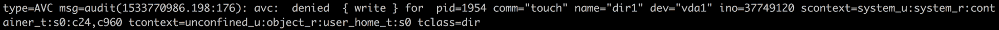
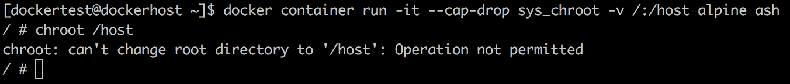
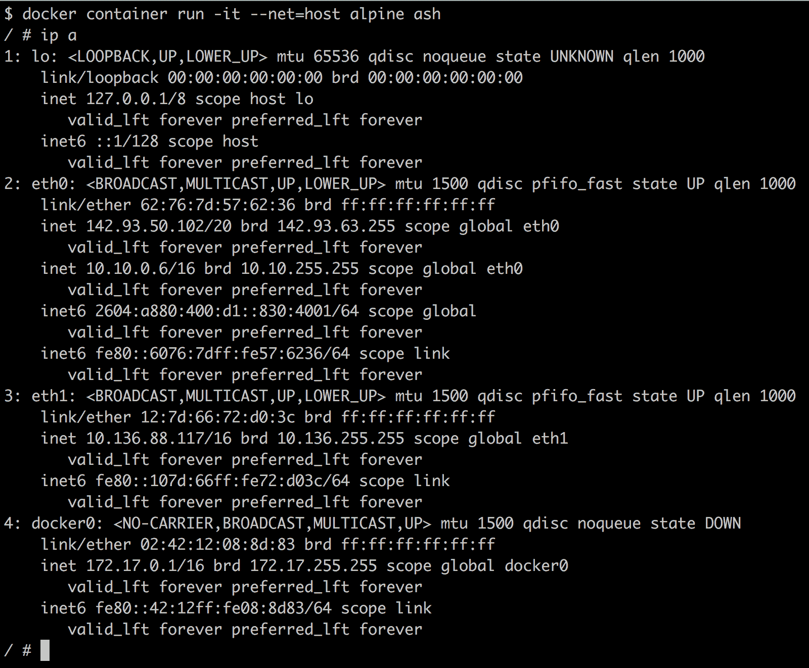

# 九、Docker安全

在本章中，我们将介绍以下食谱:

*   用 SELinux 设置**强制访问控制** ( **MAC**
*   允许在 SELinux 打开的情况下写入从主机装载的卷
*   移除分解容器内根用户的能力
*   在主机和容器之间共享命名空间

# 介绍

Docker 容器实际上不是沙盒应用，这意味着不建议它们以 Docker 的根用户身份在系统上运行随机应用。您应该始终将运行服务/进程的容器视为运行在主机系统上的服务/进程，并将所有安全措施放在您放在主机系统上的容器中。

我们在第 1 章*介绍和安装*中看到了 Docker 如何使用名称空间进行隔离。Docker 使用的六个命名空间是进程、网络、装载、主机名、共享内存和用户。在 Linux 中，并不是所有的东西都是有命名空间的，例如 SELinux、Cgroups、Devices ( `/dev/mem`、`/dev/sd*`)和 Kernel Modules。`/sys`、`/proc/sys`、`/proc/sysrq-trigger`、`/proc/irq`和`/proc/bus`下的文件系统也没有命名空间，但默认情况下，它们在容器运行时以只读方式装载。

为了使 Docker 成为一个安全的环境，在最近的过去已经做了大量的工作，更多的工作正在进行中。

*   由于 Docker 映像是基本的构建模块，因此选择正确的基础映像非常重要。Docker 有官方映像的概念，由 Docker、供应商或其他人维护。如果您记得第 2 章*使用 Docker 容器*，我们可以使用以下语法在 Docker Hub 上搜索映像:

```
 $ docker search <image name>
```

例如，考虑以下命令:

```
 $ docker search ubuntu
```


我们将看到一列`OFFICIAL`，如果映像是官方的，您将在该列中看到与该映像相对应的`[OK]`。Docker 中有一个功能，在拉取官方图片后进行数字信号验证。如果映像被篡改，将通知 be，但不会阻止用户运行它。

More details about official images can be found at [https://github.com/docker-library/official-images](https://github.com/docker-library/official-images). 

*   在[第 6 章](06.html)、*Docker API 和 SDK* 中，我们看到了当通过 TCP 配置 Docker 守护程序访问时，如何保护 Docker 远程 API。
*   我们也可以考虑通过 Docker 主机上的`--icc=false`关闭网络上默认的容器间通信；尽管容器仍然可以通过链接进行通信，这覆盖了 iptables 的默认 DROP 策略，但它们是通过`--icc=false`选项设置的。
*   我们还可以设置 Cgroups 资源限制，通过系统资源限制来防止**拒绝服务** ( **DoS** )攻击。
*   Docker 利用了特殊的设备 Cgroups，它允许我们指定哪些设备节点可以在容器中使用。它阻止进程创建和使用可用于攻击主机的设备节点。
*   在映像上预先创建的任何设备节点都不能用于与内核对话，因为映像是使用 nodev 选项装载的。

以下是您可以遵循以实现安全 Docker 环境的一些准则(可能不完整):

*   以非根用户身份运行服务，并将容器中的根用户以及容器外的根用户视为根用户。
*   使用来自受信任方的映像来运行容器；避免使用`-insecure-registry=[]`选项。
*   不要从 Docker 注册表或任何其他地方运行随机容器。
*   让您的主机内核保持最新。
*   尽可能避免使用- privileged，并尽快删除容器权限。
*   通过 SELinux 或 AppArmor 配置**强制访问控制** ( **MAC** )。
*   收集日志进行审核。
*   做定期审计。
*   在主机上运行容器，主机是专门为运行容器而设计的。考虑使用原子项目、CoreOS 或类似的解决方案。
*   使用`--device`选项安装设备，而不是使用`--privileged`选项在容器内使用设备。
*   容器内禁止 SUID 和 SGID。

Docker 和互联网安全中心([http://www.cisecurity.org/](http://www.cisecurity.org/))发布了 Docker 安全的最佳实践指南，该指南涵盖了之前的大部分内容，并在[https://blog . Docker . com/2015/05/understanding-Docker-Security-and-best-practices/](https://blog.docker.com/2015/05/understanding-docker-security-and-best-practices/)发布了更多指南。

在[第 1 章](01.html)*介绍和安装*中，我们介绍了如何在 CentOS 7.5 上安装 Docker。让我们使用默认安装来尝试一个实验:

1.  使用以下命令禁用 SELinux:

```
 $ sudo setenforce 0
```

2.  创建一个用户并将其添加到默认的 docker 组，这样用户就可以运行 Docker 命令而无需`sudo`:

```
 $ sudo useradd dockertest
 $ sudo passwd dockertest
 $ sudo groupadd docker
 $ sudo gpasswd -a dockertest docker
```

3.  使用我们之前创建的用户登录，并按如下方式启动容器:

```
 $ su - dockertest
 $ docker container run -it -v /:/host alpine ash
```

4.  从容器，`chroot`到`/host`并运行关机命令:

```
 $ chroot /host
 $ shutdown
```


我们可以看到，Docker 组中的用户可以关闭主机系统。Docker 当前没有授权控制，因此如果您可以与 Docker 套接字通信，则允许您运行任何 Docker 命令。类似于`/etc/sudoers`:

`USERNAME ALL=(ALL) NOPASSWD: ALL`

这真的不好。让我们在本章的其余部分看看如何防范这种情况。

# 使用 SELinux 设置强制访问控制

建议您在 Docker 主机上设置某种形式的 MAC，可以通过 SELinux 或 AppArmor，具体取决于 Linux 发行版。在这个食谱中，我们将看到如何在安装了 Fedora/RHEL/CentOS 的系统上设置 SELinux。我们先来看看 SELinux 是什么:

*   SELinux 是一个标签系统
*   每个过程都有一个标签
*   每个文件、目录和系统对象都有一个标签
*   策略规则控制标记的进程和标记的对象之间的访问
*   内核执行规则

对于 Docker 容器，我们使用两种类型的 SELinux 强制:

*   **类型强制**:用于保护主机系统免受容器进程的影响。每个容器进程都标有`svirt_lxc_net_t`，每个容器文件都标有`svirt_sandbox_file_t`。`svirt_lxc_net_t`类型允许管理任何标有`svirt_sandbox_file_t`的内容。容器进程只能访问/写入容器文件。
*   **多类别安全强制**:通过设置类型强制，所有容器进程将使用`svirt_lxc_net_t`标签运行，所有内容将使用`svirt_sandbox_file_t`标签。然而，仅仅通过这些设置，我们并没有保护一个容器免受另一个容器的影响，因为它们的标签是相同的。

我们使用**多类别安全** ( **MCS** )执法来保护一个容器免受另一个容器的影响，这是基于**多级别安全** ( **MLS** )。当一个容器启动时，Docker 守护程序挑选一个随机的 MCS 标签，例如`s0:c41,c717`，并将其与容器元数据一起保存。当任何容器进程启动时，Docker 守护程序会告诉内核应用正确的 MCS 标签。由于 MCS 标签保存在元数据中，如果容器重新启动，它将获得相同的 MCS 标签。

# 准备好

您将需要安装了最新版本 Docker 的 Fedora/RHEL/CentOS 主机，可以通过 Docker 客户端访问该主机。

# 怎么做…

Fedora/RHEL/CentOS 在强制模式下默认安装 SELinux，Docker 守护程序设置为从 SELinux 开始。要检查是否满足这些条件，请执行以下步骤。

1.  运行以下命令，确保 SELinux 已启用:

```
 $ sudo setenforce 1
    $ getenforce
```


如果前面的命令返回`Enforcing`，那么一切都好。如果没有，那么我们需要通过更新 SELinux 配置文件(`/etc/selinux/config`)并重新启动系统来更改它。

2.  Docker 应该使用`--selinux-enabled`选项运行。您可以检查 Docker 守护程序配置(`/etc/docker/daemon.json`)文件。此外，交叉检查 Docker 服务是否已使用 SELinux 选项启动:


```
 $ docker info
```


前面的命令假设您不是在守护程序模式下手动启动 Docker。

让我们在将主机目录装载为卷后启动一个容器(没有特权选项)，并尝试在其中创建一个文件:


不出所料，我们看到权限被拒绝，因为带有`svirt_lxc_net_t`标签的容器进程无法在主机的文件系统上创建文件。如果我们查看主机上的 SELinux 日志(`/var/log/audit/audit.log`)，我们将看到类似以下内容的消息:



`s0:c24,c960`标签是容器上的 MCS 标签。

# 它是如何工作的…

当为 SELinux 和 Docker 设置了正确的选项时，SELinux 会同时设置类型和多类别安全强制。Linux 内核实施这些强制措施。

# 还有更多...

我们可以用 SELinux 做很多事情来帮助我们的系统更加安全。以下是一些提示:

*   如果 SELinux 处于强制模式，并且 Docker 守护程序被配置为使用 SELinux，那么我们将无法从容器中关闭主机，就像我们在本章前面所做的那样:


*   正如我们所知，默认情况下，所有容器都将使用`svirt_lxc_net_t`标签运行，但是我们也可以根据自定义需求调整 SELinux 标签。尝试访问[http://opensource.com/business/15/3/docker-security-tuning](http://opensource.com/business/15/3/docker-security-tuning)的调整 SELinux 标签部分。
*   用 Docker 容器设置 MLS 也是可能的。尝试访问[http://opensource.com/business/15/3/docker-security-tuning](http://opensource.com/business/15/3/docker-security-tuning)的多级安全模式部分。

# 请参见

SELinux 着色书可在[https://people . RedHat . com/Duffy/SELinux/SELinux-着色书 _A4-Stapled.pdf.](https://people.redhat.com/duffy/selinux/selinux-coloring-book_A4-Stapled.pdf) 获得

# 允许在 SELinux 打开的情况下写入从主机装载的卷

正如我们在前面的方法中看到的，当配置 SELinux 时，非特权容器不能访问从主机系统装载目录后创建的卷上的文件。但是，有时需要允许从容器访问主机文件。在这个食谱中，我们将看到如何在这种情况下允许访问。

# 准备好

您将需要安装了最新版本 Docker 的 Fedora/RHEL/CentOS 主机，可以通过 Docker 客户端访问该主机。此外，SELinux 应该设置为强制执行，Docker 守护程序配置为使用 SELinux。

# 怎么做...

使用`z`或`Z`选项安装卷，如下所示:

```
$ docker container run -it -v /tmp:/tmp/host:z alpine ash
```

```
$ docker container run -it -v /tmp:/tmp/host:Z alpine ash
```


# 它是如何工作的…

安装卷时，Docker 将重新标记卷以允许访问。

The `z` option tells Docker that the volume content will be shared between containers. Docker will label the content with a shared content label. The shared volume label allows all containers to read/write content. The `Z` option tells Docker to label the content with a private unshared label. Private volumes can only be used by the current container.

# 请参见

[http://opensource.com/business/14/9/security-for-docker.](http://opensource.com/business/14/9/security-for-docker)的体积安装部分

# 移除分解容器内根用户的能力

简单来说，有了能力，我们就可以分解一个根用户的力量。请注意主功能页面中的以下内容:

For the purpose of performing permission checks, traditional UNIX implementations distinguish two categories of processes: privileged processes (whose effective user ID is 0, referred to as superuser or root), and unprivileged processes (whose effective UID is non-zero). Privileged processes bypass all kernel permission checks, while unprivileged processes are subject  to  full  permission checking based on the process's credentials (usually: effective UID, effective GID, and supplementary group list).

从内核 2.2 开始，Linux 将传统上与超级用户相关的特权划分为不同的单元，称为功能，可以独立启用和禁用。功能是每个线程的属性。

一些功能示例如下:

*   `CAP_SYSLOG`:这修改了内核 printk 行为
*   `CAP_NET_ADMIN`:这将配置网络
*   `CAP_SYS_ADMIN`:这有助于你抓住所有的能力

内核中只有 32 个插槽可用于功能。有一种能力，`CAP_SYS_ADMIN`，抓住了所有的能力；这在有疑问的时候使用。

Docker 能够添加或删除容器的功能。它默认使用`chown`、`dac_override`、`fowner`、`kill`、`setgid`、`setuid`、`setpcap`、`net_bind_service`、`net_raw`、`sys_chroot`、`mknod`、`setfcap`和`audit_write`功能，并默认删除容器的以下功能:

*   `CAP_SETPCAP`:这修改了过程能力
*   `CAP_SYS_MODULE`:这将插入/移除内核模块
*   `CAP_SYS_RAWIO`:这会修改内核内存
*   `CAP_SYS_PACCT`:这配置了流程核算
*   `CAP_SYS_NICE`:这修改了进程的优先级
*   `CAP_SYS_RESOURCE`:这将覆盖资源限制
*   `CAP_SYS_TIME`:这会修改系统时钟
*   `CAP_SYS_TTY_CONFIG`:这将配置`tty`设备
*   `CAP_AUDIT_WRITE`:这将写入审核日志
*   `CAP_AUDIT_CONTROL`:配置审计子系统
*   `CAP_MAC_OVERRIDE`:这将忽略内核 MAC 策略
*   `CAP_MAC_ADMIN`:这将配置媒体访问控制配置
*   `CAP_SYSLOG`:这修改了内核 printk 行为
*   `CAP_NET_ADMIN`:这配置网络
*   `CAP_SYS_ADMIN`:这有助于你抓住所有的容器

我们需要非常小心我们删除了哪些功能，因为如果应用没有足够的功能来运行，它们可能会崩溃。要添加和删除容器的功能，可以分别使用`--cap-add`和`--cap-drop`选项。

# 准备好

您将需要一个安装了最新版本 Docker 的主机，可以通过 Docker 客户端进行访问。

# 怎么做...

如果您想使用添加和删除功能，您需要知道如何使用它。以下是一些常见的用例示例:

1.  要删除功能，请运行类似以下的命令:

```
 $ docker container run --cap-drop <CAPABILITY> <image> <command>
```

2.  同样，要添加功能，请运行类似以下内容的命令:

```
 $ docker container run --cap-add <CAPABILITY> <image> <command>
```

3.  要从容器中删除`setuid`和`setgid`功能，使其无法运行设置了这些位的二进制文件，请运行以下命令:

```
 $ docker container run -it --cap-drop  setuid --cap-drop setgid    alpine ash
```

4.  要添加所有功能并直接删除`sys_admin`，运行以下命令:

```
 $ docker container run -it --cap-add all --cap-drop sys_admin alpine ash
```

# 它是如何工作的...

在启动容器之前，Docker 在容器内部为根用户设置功能，这会影响容器进程的命令执行。

# 还有更多...

让我们重温一下我们在本章开头看到的例子，我们看到主机系统通过一个容器关闭。让 SELinux 在主机系统上被禁用；但是，在启动容器时，放下`sys_choot`功能:

```
 $ docker container run -it --cap-drop sys_chroot -v /:/host alpine ash
 $ chroot /host
```



# 请参见

*   丹·沃什在 http://opensource.com/business/14/9/security-for-docker 和 T2 的文章。
*   有选择地禁止来自容器进程的系统调用，以提供更严格的安全性。访问 http://opensource.com/business/15/3/docker-security-future的赛科普区。
*   与自定义名称空间和功能类似，Docker run 支持`--cgroup-parent`标志来传递特定的 Cgroup 来运行容器。尝试访问[https://docs . docker . com/engine/reference/command line/run/# options。](https://docs.docker.com/engine/reference/commandline/run/#options)

# 在主机和容器之间共享命名空间

我们知道，在启动容器时，默认情况下，Docker 为一个容器创建六个不同的名称空间:进程、网络、装载、主机名、共享内存和用户。在某些情况下，我们可能希望在两个或多个容器之间共享一个命名空间。例如，在 Kubernetes 中，pod 中的所有容器共享同一个网络命名空间。

在某些情况下，我们可能希望与容器共享主机系统的名称空间。例如，我们在主机和容器之间共享相同的网络名称空间，以在容器内获得接近线速的速度。在这个食谱中，我们将看到如何在主机和容器之间共享名称空间。

# 准备好

您将需要一个安装了最新版本 Docker 的主机，可以通过 Docker 客户端进行访问。

# 怎么做...

请执行以下步骤:

1.  要与容器共享主机网络命名空间，请运行以下命令:

```
 $ docker container run -it --net=host alpine ash
```

如果您看到容器中的网络详细信息，请运行以下命令:

```
 $ ip a
```



您将看到与主机相同的结果:


2.  要与容器共享主机网络、PID 和 IPC 命名空间，请运行以下命令:

```
 $ docker container run -it --net=host --pid=host --ipc=host alpine ash
```


# 它是如何工作的...

当这样的参数被传递给容器时，Docker 不会为容器创建单独的名称空间。