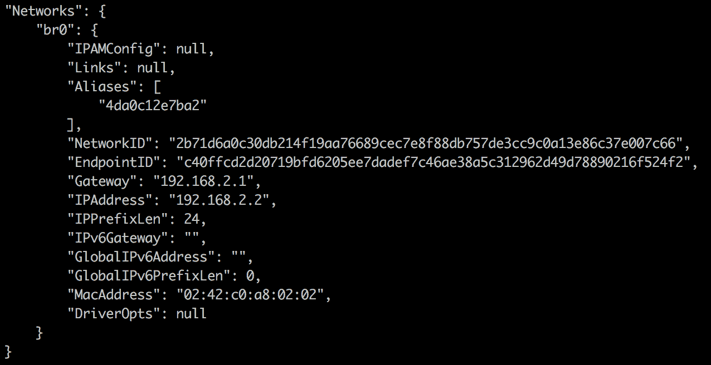

# 十、获取帮助、提示和技巧

在这一章中，我们将看看以下食谱:

*   在调试模式下启动 Docker
*   从源代码构建 Docker 二进制文件
*   不使用缓存图层构建映像
*   构建自己的容器通信桥梁
*   更改默认 OCI 运行时
*   为容器选择日志驱动程序
*   获取容器的实时 Docker 事件

# 介绍

随着我们对 Docker 了解的越来越多，我们会变得越来越好奇。邮件列表和 IRC 渠道是获得帮助、学习和分享 Docker 知识的最佳场所。Docker 在[freenode.net](http://freenode.net/)有几个 IRC 频道，比如，`#docker`和`#docker-dev`分别讨论 Docker 的一般情况和`dev-related`的素材。如果你更喜欢 Slack 而不是 IRC，还有一个 Slack 社区，你可以在这里报名:[https://community.docker.com/network-groups](https://community.docker.com/network-groups)。

在 Docker 上工作时，如果发现任何 bug，可以在[https://github.com/moby/moby/issues](https://github.com/moby/moby/issues)的 GitHub 上举报。同样，如果您已经修复了一个 bug，您可以发送拉取请求，它将被检查，然后被合并到代码库中。

Docker 在[https://forums.docker.com](https://forums.docker.com)和[https://www.youtube.com/user/dockerrun](https://www.youtube.com/user/dockerrun)分别还有一个论坛和 YouTube 频道，也是很好的学习资源。

世界各地有许多 Docker meeting up 小组，在这里你可以遇到志同道合的人，并通过在[https://events.docker.com/chapters/](https://events.docker.com/chapters/)分享经验来学习。

在这一章中，我还将介绍一些小技巧和诀窍，帮助您更好地使用 Docker。

# 在调试模式下启动 Docker

我们可以在调试模式下启动 Docker 来调试日志。

# 准备好

我希望你现在已经在你的系统上安装了 Docker。

# 怎么做...

请遵循以下步骤:

1.  使用调试选项`-D`启动 docker 守护程序。要从命令行启动，您可以运行以下命令:

```
 $ dockerd  -D
```

2.  您还可以在 Docker 配置文件中添加调试选项，以便在调试模式下启动:

```
 $ cat /etc/docker/daemon.json
 { "debug": true }
```

# 它是如何工作的...

前面的命令将以守护模式启动 Docker。启动守护程序时，您将看到许多有用的消息，例如加载现有映像、防火墙设置(`iptables`)等。如果启动容器，您将看到如下消息:

```
$ docker container run alpine echo "hello world"
```

在 Ubuntu 18.04 上，可以通过运行以下命令来查看 Docker 守护程序日志:

```
$ journalctl -u docker.service
```

If you are using something other than Ubuntu 18.04, your Docker logs might be located somewhere else. Refer to this page in the documentation to see where to find the logs for your system: [https://docs.docker.com/config/daemon/#read-the-logs](https://docs.docker.com/config/daemon/#read-the-logs).

```
[info] POST /v1.30/containers/create
[99430521] +job create()
......
......
```

在接下来的日志片段中，您将能够看到 Docker 客户端向 Docker 守护程序发出的创建新容器的 API 请求。如果某件事不起作用，查看日志是获取更多信息的好方法，可以帮助您诊断是什么导致了您的问题。

# 请参见

有关更多信息，请参见 Docker 守护程序配置文档:[https://docs.docker.com/config/daemon/](https://docs.docker.com/config/daemon/)。

# 从源代码构建 Docker 二进制文件

Docker 最近重组了 Docker 引擎，并将其分成不同的部分。主要部件有 RuNC([https://github.com/opencontainers/runc](https://github.com/opencontainers/runc))、containerD([https://containerD . io](https://containerd.io))和莫比([https://mobyproject.org](https://mobyproject.org))。其中一些项目被捐赠给其他组织来维护。Docker，这个产品，现在是这些不同项目的组合。

有时，需要从源代码构建一个 Docker 二进制文件来测试补丁。从源代码构建 Docker 二进制文件非常容易。为了构建一个，你需要使用来自莫比项目的源代码。按照以下步骤构建您自己的二进制文件。

# 准备好

遵循以下先决条件:

1.  使用 Git 下载莫比源代码:

```
 $ git clone https://github.com/moby/moby.git
```

2.  在 Ubuntu 上安装`make`，像这样:

```
 $ apt-get install -y make
```

3.  确保 Docker 在您构建代码的主机上运行，并且您可以通过 Docker 客户端访问它，因为我们在这里讨论的构建发生在一个容器中。

# 怎么做...

请遵循以下步骤:

1.  进入克隆目录:

```
 $ cd moby
```

2.  运行`make`命令:

```
 $ sudo make
```

This will take a little while and require more then 1 GB of RAM. If you do not give it enough resources, the build might fail.

# 它是如何工作的...

这将创建一个容器，并从其中的主分支编译代码。一旦完成，就会吐出`bundles/binary-daemon/`目录里面的二进制。

# 还有更多...

您也可以使用以下命令运行测试:

```
 $ sudo make test
```

# 请参见

查看莫比网站上的文档了解更多信息:[https://github . com/Moby/Moby/blob/master/docs/contributing/setup-dev-env . MD](https://github.com/moby/moby/blob/master/docs/contributing/set-up-dev-env.md)。

# 不使用缓存图层构建映像

默认情况下，当我们构建一个映像时，Docker 会尝试使用缓存的图层，这样构建起来花费的时间就会更少。然而，有时，从头开始构建是必要的。例如，您将需要强制系统更新，如 yum `-y`更新。让我们看看如何在这个食谱中做到这一点。

# 准备好

获取一个 Dockerfile 来构建映像。对于这个例子，我们将使用下面的 Dockerfile，它在 Alpine Linux 容器中安装`nginx` web 服务器:

```
FROM alpine:3.8
RUN apk add --update nginx && mkdir /tmp/nginx && rm -rf /var/cache/apk/*
EXPOSE 80 443
CMD ["nginx", "-g", "daemon off;"]
```

# 怎么做...

构建映像时，按如下方式通过`-no-cache`选项:

```
 $ docker image build -t test --no-cache - < Dockerfile
```


# 它是如何工作的...

`--no-cache`选项将丢弃任何缓存的图层，从头开始构建一个 Dockerfile。

# 还有更多...

有时，我们也想在几条指令后丢弃缓存。在这种情况下，我们可以添加任何不影响映像的任意命令，例如创建或设置环境变量。

# 构建自己的容器通信桥梁

我们已经知道，当 Docker 守护进程启动时，它会创建一个名为`docker0`的桥，所有的容器都会从中获取 IP。有时，我们可能希望对一些容器使用不同的桥。让我们看看如何在这个食谱中做到这一点。

# 准备好

我假设你已经设置了 Docker。

# 怎么做...

请遵循以下步骤:

1.  用名称`br0`创建一个新的自定义桥:

```
 $ docker network create br0 --subnet 192.168.2.1/24
```

2.  确认网络已经创建:

```
 $ docker network ls
```


3.  使用新网络启动容器，并确保它使用正确的子网:

```
 $ docker container run -d --network br0 --name br0demo redis
 $ docker container inspect br0demo
```



# 它是如何工作的...

前面的步骤将创建一个新的网桥，它将把来自`192.168.2.0`子网的 IP 分配给分配给该网络的任何容器。

# 还有更多...

如果不再需要网络，可以通过运行以下命令将其删除:

```
$ docker network rm br0
```

# 请参见

更多信息参见 Docker 网站上的文档:[https://docs.docker.com/network/](https://docs.docker.com/network/)。

# 更改默认 OCI 运行时

Docker 守护程序依赖于 OCI 兼容的运行时来与 Linux 内核接口。默认情况下，Docker 使用 runC，但是如果需要，您可以将它切换到任何符合 OCI 的运行时。在本食谱中，我们将向您展示如何将运行时更改为另一个符合 OCI 标准的运行时，即英特尔 Clear Containers。

# 准备好

在 Ubuntu 16.04.5 系统上安装 Docker，如果你还没有这样做的话。

使用以下命令安装英特尔透明容器 3.0 组件:

```
$ sudo sh -c "echo 'deb http://download.opensuse.org/repositories/home:/clearcontainers:/clear-containers-3/xUbuntu_$(lsb_release -rs)/ /' >> /etc/apt/sources.list.d/clear-containers.list"
$ wget -qO - http://download.opensuse.org/repositories/home:/clearcontainers:/clear-containers-3/xUbuntu_$(lsb_release -rs)/Release.key | sudo apt-key add -
$ sudo -E apt-get update
$ sudo -E apt-get -y install cc-runtime cc-proxy cc-shim
```

英特尔透明容器不会在每台机器上运行–它只会在启用了 KVM 的机器上运行，这意味着如果您在 VirtualBox 内部使用虚拟机，它将无法工作。在运行此配方之前，请务必检查系统要求，以确保您的机器兼容:[https://github.com/clearcontainers/runtime](https://github.com/clearcontainers/runtime)。您还可以运行以下命令，该命令将检查您的系统，并让您知道您的系统是否能够运行它:

```
$ cc-runtime cc-check
```

# 怎么做...

请遵循以下步骤:

1.  更改 Docker 守护程序配置(`/etc/docker/daemon.json`)，以使清除容器成为默认运行时:

```
    {
      "default-runtime": "cc-runtime",
      "runtimes": {
        "cc-runtime": {
          "path": "/usr/bin/cc-runtime"
       }
      }
    }
```

2.重新加载 Docker 守护程序并重新启动它:

```
 $ systemctl daemon-reload
 $ systemctl restart docker
```

3.使用英特尔透明容器启动容器:

```
 $ docker container run -it busybox sh
```

# 它是如何工作的...

Docker 使用`runC`访问命名空间和 CGroups 等内核特性来运行容器。我们将`runC`换成了另一个符合 OCI 标准的运行时，叫做英特尔透明容器。

# 请参见

更多信息请参见 Docker 网站上的文档，网址为:[https://docs . Docker . com/engine/reference/command line/Docker/# Docker-runtime-execution-options](https://docs.docker.com/engine/reference/commandline/dockerd/#docker-runtime-execution-options)。

# 为容器选择日志驱动程序

Docker 允许您在启动 Docker 守护程序时选择日志驱动程序。随着 Docker 18.03 的发布，支持十一种类型的日志驱动程序:

| **驾驶员** | **描述** |
| 没有人 | 容器没有可用的日志，`docker container logs`不返回任何输出。 |
| `json-file`(默认) | 日志被格式化为 JSON。 |
| `syslog` | 将日志消息写入主机上的`syslog`守护程序。 |
| `journald` | 将日志消息写入主机上的`journald`守护程序。 |
| `gelf` | 将日志消息写入一个**灰色日志扩展日志格式** ( **GELF** )端点，如灰色日志或日志存储。 |
| `fluentd` | 将日志消息写入主机上的`fluentd`守护程序。 |
| `awslogs` | 将日志消息写入亚马逊云观察日志。 |
| `splunk` | 使用 HTTP 事件收集器将日志消息写入`splunk`。 |
| `etwlogs` | 将日志消息作为**事件跟踪写入窗口** ( **ETW** )事件(仅限窗口)。 |
| `gcplogs` | 将日志消息写入**谷歌云平台** ( **GCP** )日志。 |
| `logentries` | 将日志消息写入 Rapid7 日志条目。 |

# 准备好

在系统上安装 Docker，如果你还没有这样做的话。

# 怎么做

请遵循以下步骤:

1.  使用所需的日志驱动程序启动 Docker 守护程序，如下所示:

```
 $ dockerd --log-driver=none
 $ dockerd --log-driver=syslog
```

您也可以在 Docker 配置文件(`/etc/docker/daemon.json`)中添加此选项:

```
    {
      "log-driver": "json-file",
      "log-opts": {
        "labels": "production_status",
        "env": "os,customer"
      }
    }
```

2.  如果您想启动一个使用不同于系统默认日志驱动程序的容器，您可以使用`--log-driver`选项:

```
 $ docker container run -it --log-driver syslog alpine ash
```

# 它是如何工作的...

根据日志驱动程序配置，Docker 守护程序选择相应的日志驱动程序。

# 还有更多...

`docker logs`命令仅适用于以下两个驾驶员:`json-file`和`journald`。

# 请参见

更多信息请参见 Docker 网站上的文档，网址为:[https://docs . Docker . com/config/containers/logging/configure/](https://docs.docker.com/config/containers/logging/configure/)。

# 获取容器的实时 Docker 事件

由于我们将在生产中运行许多容器，如果我们能够出于监控和调试的目的观察实时容器事件，将会很有帮助。Docker 容器可以报告诸如`create`、`destroy`、`die`、`export`、`kill`、`oom`、`pause`、`restart`、`start`、`stop`和`unpause`等事件。在这个食谱中，我们将看到如何启用事件日志，然后使用过滤器来选择特定的事件类型、映像和容器。

# 准备好...

确保 Docker 守护程序正在主机上运行，并且您可以通过 Docker 客户端进行连接。

# 怎么做...

请遵循以下步骤:

1.  使用以下命令启动 Docker 事件记录:

```
 $ docker events
```

2.  在另一个终端上，执行一些与容器/映像相关的操作，您将在第一个终端上看到类似于下面截图的结果:


事件收集开始后，我创建了一个容器，只需向控制台写入一条消息。从前面的截图中我们可以看到，一个容器被创建、启动和死亡。

# 它是如何工作的...

通过 Docker 事件，Docker 开始列出事件。

# 还有更多...

您可以对 Docker 事件使用`--since`或`--until`选项来缩小所选时间戳的结果范围:

```
 --since=""         Show all events created since timestamp
 --until=""         Stream events until this timestamp
```

考虑以下示例:

```
 $ docker events --since '2015-01-01'
```

使用过滤器，我们可以根据事件、容器和映像进一步缩小事件日志，如下所示:

*   要仅列出开始事件，请使用以下命令:

```
 $ docker events --filter 'event=start'
```

*   要仅从映像 Alpine 中列出事件，请使用以下命令:

```
 $ docker events --filter 'image=alpine:3.5'
```

*   要列出特定容器中的事件，请使用以下命令:

```
 $ docker events --filter 'container=b3619441cb444b87b4'
```

使用格式选项，您可以控制事件消息的输出:

*   要仅显示部分事件信息，您可以像这样更改格式:

```
 $ docker events --format 'ID={{.ID }} Type={{.Type}} Status= 
     {{.Status}}'
```

*   如果希望事件作为有效的 JSON 行进行流式传输，则可以使用以下命令:

```
 $ docker events --format '{{json .}}'
```

# 请参见

Docker 事件文档可以在这里找到:[https://docs . Docker . com/engine/reference/command line/events/](https://docs.docker.com/engine/reference/commandline/events/)。