# Docker 简介

在本章中，我们将做的第一件事是解释 Docker 及其架构背后的推理。我们将涵盖 Docker 概念，如映像、层和容器。接下来，我们将安装 Docker，并学习如何从`remote`注册表中提取一个示例、基本的 Java 应用程序映像，并在本地机器上运行。

Docker 是作为平台即服务公司 dotCloud 的内部工具而创建的。2013 年 3 月，以开源方式向公众发布。其源代码在 GitHub 上免费提供给所有人，网址为:[h](https://github.com/docker/docker)[t](https://github.com/docker/docker)[t](https://github.com/docker/docker)[p](https://github.com/docker/docker)[s](https://github.com/docker/docker)[://g](https://github.com/docker/docker)[I](https://github.com/docker/docker)t[h](https://github.com/docker/docker)[u](https://github.com/docker/docker)[b](https://github.com/docker/docker)[。](https://github.com/docker/docker)[c](https://github.com/docker/docker)[o](https://github.com/docker/docker)[m](https://github.com/docker/docker)[/d](https://github.com/docker/docker)T32】oT34】cT36】kT38】eT40】rT42】/dT44】oT46】cT48】k[e](https://github.com/docker/docker)T52】r。不仅仅是 Docker Inc .的核心团队致力于 Docker 的开发，还有很多大牌赞助他们的时间和精力来提升 Docker，为 Docker 做贡献，比如谷歌、微软、IBM、红帽、思科系统等等。Kubernetes 是一个由谷歌开发的工具，用于根据他们在博格(谷歌的自制容器系统)上学习到的最佳实践，在计算机集群之间部署容器。它补充了 Docker 在编排、自动化部署、管理和扩展容器方面的不足；它通过在集群中保持容器部署的平衡来管理 Docker 节点的工作负载。Kubernetes 还为容器提供了相互通信的方式，而不需要打开网络端口。Kubernetes 也是一个开源项目，在 GitHub 上以[h](https://github.com/kubernetes/kubernetes)T56】tT58t[p](https://github.com/kubernetes/kubernetes)T62】sT64】://gT66】IT68T70】hT72】uT74】bT76[c](https://github.com/kubernetes/kubernetes)[o](https://github.com/kubernetes/kubernetes)[m](https://github.com/kubernetes/kubernetes)[/k](https://github.com/kubernetes/kubernetes)[u](https://github.com/kubernetes/kubernetes)[b](https://github.com/kubernetes/kubernetes)T90】eT92】rT94】nT96】eT98】tT100】eT102】s[/每个人都可以贡献。让我们先从 Docker 开始我们的旅程。以下内容将在中介绍:](https://github.com/kubernetes/kubernetes)

*   我们将从这个出色工具背后的基本理念开始，并展示与传统虚拟化相比，使用它所获得的优势
*   我们将在三个主要平台上安装 Docker:macOS、Linux 和 Windows

# Docker 背后的想法

Docker 背后的想法是将一个应用程序及其所需的所有依赖项打包到一个单一的标准化部署单元中。这些依赖项可以是二进制文件、库、JAR 文件、配置文件、脚本等等。Docker 将所有这些打包成一个完整的文件系统，其中包含了您的 Java 应用程序运行虚拟机本身、应用服务器(如 Wildfly 或 Tomcat)、应用程序代码和`runtime`库所需的所有内容，以及您将在服务器上安装和部署以使应用程序运行的所有内容。将所有这些打包成一个完整的映像保证了它的可移植性；无论部署在什么环境中，它都将始终以相同的方式运行。使用 Docker，您可以运行 Java 应用程序，而不必在主机上安装 Java 运行时。所有与 JDK 或 JRE 不兼容、应用服务器版本错误等相关的问题都消失了。升级也很容易，毫不费力；您只需在主机上运行容器的新版本。

如果你需要做一些清理，你可以直接破坏 Docker 映像，就好像什么都没发生过一样。想想 Docker，它不是一种编程语言或框架，而是一种帮助解决常见问题(如安装、分发和管理软件)的工具。它允许开发人员和开发人员在任何地方构建、发布和运行他们的代码。Anywhere 也意味着在多台机器上，这就是 Kubernetes 派上用场的地方；我们将很快回到这个话题。

将您的所有应用程序代码和运行时依赖项打包为一个完整的软件单元，看起来可能与虚拟化引擎相同，但事实远非如此，我们现在将对此进行解释。要完全了解 Docker 到底是什么，首先我们需要了解传统虚拟化和容器化之间的区别。现在让我们比较一下这两种技术。

# 虚拟化和容器化比较

传统虚拟机代表硬件级虚拟化。本质上，它是一个完整的虚拟化物理机，安装了基本输入输出系统和操作系统。它运行在主机操作系统之上。您的 Java 应用程序在虚拟化环境中运行，就像它通常在您自己的机器上运行一样。将虚拟机用于您的应用程序有很多优势。每个虚拟机可以有完全不同的操作系统；例如，这些可以是不同的 Linux 风格、Solaris 或 Windows。根据定义，虚拟机也非常安全；它们是完全隔离的，盒子里完整的操作系统。

然而，没有什么是没有代价的。虚拟机包含操作系统运行所需的所有功能:核心系统库、设备驱动程序等。有时，他们可能是资源饥渴和重量级的。虚拟机需要完全安装，这有时会很麻烦，并且不太容易设置。最后但同样重要的是，您将需要更多的计算能力和资源来在虚拟机中执行您的应用程序虚拟机管理程序需要首先导入虚拟机，然后启动它，这需要时间。然而，我认为，当运行 Java 应用程序时，拥有完整的虚拟化环境并不是我们经常想要的。Docker带着容器化的概念前来救援。Java 应用程序(当然，不限于 Java)在 Docker 上运行在一个名为容器的隔离环境中。容器不是通俗意义上的虚拟机。它表现为一种操作系统虚拟化，但根本没有仿真。主要区别在于，虽然每个传统虚拟机映像运行在独立的客户操作系统上，但 Docker 容器运行在主机上运行的同一内核中。容器是自给自足的，不仅与底层操作系统隔离，还与其他容器隔离。它有自己独立的文件系统和环境变量。当然，容器可以相互通信(例如作为应用程序和数据库容器)，也可以共享磁盘上的文件。与传统虚拟化相比，主要区别在于容器运行在同一个内核中，它们使用的系统资源更少。所有操作系统核心软件都将从 Docker 映像中删除。基本容器可以是并且通常是非常轻的。没有与经典虚拟化虚拟机管理程序和来宾操作系统相关的开销。这样，您可以为您的 Java 应用程序实现几乎裸机的核心性能。此外，由于容器的开销最小，容器化的 Java 应用程序的启动时间通常很短。您还可以在几秒钟内推出数百个应用程序容器，以减少配置软件所需的时间。在接下来的章节中，我们将使用 Kubernetes 实现这一点。虽然 Docker 与传统的虚拟化引擎有很大的不同。请注意，容器不能替代所有用例的虚拟机；仍然需要经过深思熟虑的评估来确定什么最适合您的应用。两种解决方案都有各自的优势。一方面，我们有性能一般的完全隔离的安全虚拟机。另一方面，我们的容器缺少一些关键功能，但配备了可以快速调配的高性能。让我们看看在使用 Docker 容器化时，您还会获得哪些其他好处。

# 使用 Docker 的好处

正如我们之前所说的，使用 Docker 的主要明显优势将是非常快的性能和短的资源调配时间。您可以快速轻松地创建或销毁容器。容器与其他 Docker 容器有效地共享资源，例如操作系统的内核和所需的库。因此，在容器中运行的应用程序的多个版本将非常轻量级。其结果是更快的部署、更容易的迁移和启动时间。

Docker 在部署 Java 微服务时特别有用。在接下来的一章中，我们将详细回到微服务。微服务应用程序由一系列离散的服务组成，通过应用编程接口与其他服务通信。微服务将一个应用分成大量的小进程。它们与单一应用程序相反，单一应用程序将所有操作作为单个进程或一组大型进程运行。

使用 Docker 容器使您能够部署随时可以运行的软件，它是可移植的，并且非常容易分发。您的容器化应用程序只是在其容器内运行；不需要安装。缺少安装过程有巨大的优势；它消除了软件和库冲突甚至驱动程序兼容性问题等问题。Docker容器是便携式的；它们可以从任何地方运行:您的本地机器、远程服务器以及私有或公共云。所有主要的云计算提供商，如**亚马逊网络服务** ( **AWS** )和谷歌的计算平台现在都支持 Docker。比方说，一个运行在 Amazon EC2 实例上的容器可以很容易地转移到其他环境中，实现完全相同的一致性和功能。Docker 在您的基础结构层之上提供的额外抽象级别是一个不可或缺的特性。开发人员可以创建软件，而不用担心以后运行的平台。Docker 有着和 Java 一样的承诺；写一次，跑遍任何地方；除了不使用代码之外，您可以完全按照您想要的方式配置您的服务器(通过选择操作系统、调整配置文件、安装依赖项)，并且您可以确定您的服务器模板将在运行 Docker 的任何主机上完全相同地运行。

由于 Docker 的可复制构建环境，它特别适合测试，尤其是在您的持续集成或持续交付流程中。您可以快速启动相同的环境来运行测试。而且因为容器映像每次都是相同的，所以您可以分配工作负载并并行运行测试，而不会出现问题。开发人员可以在他们的机器上运行相同的映像，这些映像将在以后的生产中运行，这在测试中也有巨大的优势。

Docker 容器的使用加速了持续集成。不再有无休止的构建-测试-部署周期；Docker 容器确保应用程序在开发、测试和生产环境中运行相同。代码随着时间的推移而增长，变得越来越麻烦。这就是为什么不可改变的基础设施的想法现在变得越来越流行，容器化的概念变得如此流行。通过将您的 Java 应用程序放入容器中，您可以简化部署和扩展的过程。通过拥有一个几乎不需要配置管理的轻量级 Docker 主机，您可以简单地通过向主机部署和重新部署容器来管理您的应用程序。同样，因为容器非常轻，只需要几秒钟。

我们已经谈论了很多关于映像和容器的内容，但没有深入细节。让我们现在就做，看看什么是 Docker 映像和容器。

# Docker 概念-映像和容器

在处理 Kubernetes 时，我们将使用 Docker 容器；它是一个开源的容器集群管理器。要运行我们自己的 Java 应用程序，我们需要首先创建一个映像。让我们从 Docker 映像的概念开始。

# 形象

将映像视为只读模板，这是创建容器的基础。它与包含应用程序运行所需的一切定义的配方是一样的。它可以是带有应用服务器的 Linux(例如 Tomcat 或 Wildfly)和您的 Java 应用程序本身。每个映像都从一个基础映像开始；比如 Ubuntu 一个 Linux 映像。虽然您可以从一个简单的映像开始，并在其上构建您的应用程序堆栈，但是您也可以从互联网上的数百个可用映像中挑选一个已经准备好的映像。有很多图片对 Java 开发人员特别有用:`openjdk`、`tomcat`、`wildfly`以及其他很多图片。我们将在以后使用它们作为我们自己映像的基础。比方说，将 Wildfly 正确安装和配置作为自己映像的起点要容易得多。然后，您可以专注于您的 Java 应用程序。如果你是一个构建映像的新手，下载一个专门的基础映像是一个很好的方法，与自己开发一个相比，可以大大提高速度。

映像是使用一系列称为指令的命令创建的。指令放在 Dockerfile 中。Dockerfile 只是一个纯文本文件，包含`root`文件系统更改的有序集合(与运行启动应用服务器的命令、添加文件或目录、创建环境变量等相同)。)以及稍后在容器运行时中使用的相应执行参数。当您开始构建映像并逐一执行指令时，Docker 将读取 Dockerfile。结果将是最终的映像。每个指令都会在映像中创建新层。然后，该映像层成为由下一条指令创建的层的父层。Docker 映像可以跨主机和操作系统高度移植；映像可以在运行 Docker 的任何主机上的 Docker 容器中运行。Docker 在 Linux 中是本地支持的，但是必须在 Windows 和 macOS 上的虚拟机中运行。重要的是要知道 Docker 使用映像来运行您的代码，而不是 Dockerfile。当您运行`docker build`命令时，Dockerfile 用于创建映像。此外，如果您将映像发布到 Docker Hub，则发布的是带有图层的结果映像，而不是源 Dockerfile 本身。

我们之前说过，Dockerfile 中的每个指令都会创建一个新层。图层是映像的内在本质；Docker 映像就是由它们组成的。现在我们来解释一下它们是什么，它们的特点是什么。

# 层

每个映像由一系列堆叠的层组成，一个在另一个之上。其实每一层都是一个中间形象。通过使用**联合文件系统**，Docker 将所有这些层组合成一个映像实体。union 文件系统允许透明地覆盖不同文件系统的文件和目录，从而产生一个单一的、一致的文件系统，如下图所示:

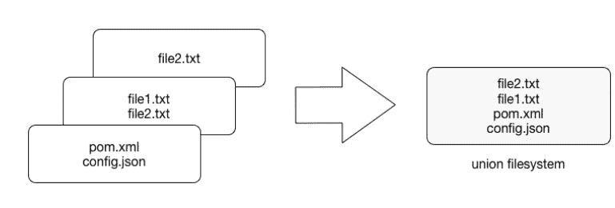

在这些独立的文件系统中具有相同路径的目录的内容和结构将一起出现在新的、类似虚拟的文件系统中的一个合并目录中。换句话说，顶层的文件系统结构将与底层的结构合并。与上一层路径相同的文件和目录将覆盖下面的文件和目录。移除上层将再次显示和展示以前的目录内容。正如我们前面提到的，层被放置在一个堆栈中，一个在另一个之上。为了保持层的顺序，Docker 使用了层标识和指针的概念。每个层都包含标识和指向其父层的指针。没有指针引用父层的层是堆栈中的第一层，即基层。您可以在下图中看到这种关系:


图层有一些有趣的特征。首先，它们是可重用和可缓存的。在前面的图中，指向父层的指针非常重要。当 Docker 正在处理您的 Docker 文件时，它看到了两件事:正在执行的 Docker 文件指令和父映像。Docker 将扫描父层的所有子层，并查找其命令与当前指令匹配的子层。如果找到匹配，Docker 会跳到下一个 Dockerfile 指令并重复该过程。如果在缓存中找不到匹配的图层，则会创建一个新图层。对于将文件添加到您的映像的说明(我们将在稍后详细了解)，Docker 会为每个文件内容创建一个校验和。在构建过程中，将该校验和与现有映像的校验和进行比较，以检查该图层是否可以从缓存中重用。如果两个不同的映像有一个共同的部分，比如说一个 Linux shell 或 Java 运行时，跟踪所有提取的层的 Docker 将在两个映像中重用 shell 层。这是一个安全的操作；正如您已经知道的，图层是只读的。当下载另一个映像时，图层将被重用，并且只有差异将从 Docker Hub 中提取。这当然节省了时间、带宽和磁盘空间，但它还有另一个巨大的优势。如果您修改您的 Docker 映像，例如通过修改您的容器化 Java 应用程序，只有应用层会被修改。从 Dockerfile 成功构建映像后，您会注意到同一 Dockerfile 的后续构建完成得更快。一旦 Docker 缓存了指令的映像层，就不需要重新构建。稍后，您只推送更新的部分，而不是分发整个映像。它使过程变得更简单、更快速。如果您在连续部署流程中使用 Docker，这尤其有用:推送 Git 分支将触发构建映像，然后为用户发布应用程序。由于层重用特性，整个过程要快得多。

可重用层的概念也是 Docker 与不共享任何东西的完整虚拟机相比如此轻量级的原因。多亏了图层，当你拉一个映像时，你最终不需要下载它的所有文件系统。如果您已经有了另一个映像，其中包含您提取的映像的一些图层，那么实际上只会下载缺失的图层。不过，有一个警告词与层的另一个特性有关:除了可重用之外，层也是附加的。如果您在容器中创建了一个大文件，然后提交(我们稍后会谈到这一点)，然后删除该文件，并再次提交；该文件仍将出现在图层历史记录中。想象一下这个场景:你拉基本的 Ubuntu 映像，并安装 Wildfly 应用服务器。然后你改变主意，卸载 Wildfly 并安装 Tomcat。从 Wildfly 安装中删除的所有文件仍将出现在映像中，尽管它们已被删除。映像尺寸将很快增长。理解 Docker 的分层文件系统可以大大改变映像的大小。当您将映像发布到注册表时，大小会成为一个问题；它需要更多的请求，传输时间也更长。

例如，当需要在集群中部署数千个容器时，大型映像就成为一个问题。您应该始终意识到层的可加性，并尝试在 Dockerfile 的每一步优化映像，例如，与使用命令链接相同。稍后在创建 Java 应用程序映像时，我们将使用命令链接技术。

因为图层是可叠加的，所以它们提供了特定映像是如何构建的完整历史。这给了你另一个很好的特性:可以回滚到映像历史中的某个点。由于每个映像都包含其所有的构建步骤，如果我们愿意，我们可以轻松地返回到上一步。这可以通过标记某个层来完成。我们将在本书的后面介绍映像标记。

图层和映像是密切相关的。如前所述，Docker 映像存储为一系列只读层。这意味着一旦创建了容器映像，它就不会改变。但是让所有文件系统都是只读的没有多大意义。修改映像怎么样？或者将您的软件添加到基础 web 服务器映像中？当我们启动一个容器时，Docker 实际上获取了只读映像(及其所有只读层)，并在层堆栈的顶部添加了一个可写层。现在让我们把重点放在容器上。

# 容器

映像的运行实例称为容器。Docker 使用 Docker 映像作为只读模板来启动它们。如果您启动一个映像，您就有一个运行该映像的容器。自然，您可以有许多相同映像的运行容器。事实上，我们经常会在稍后使用 Kubernetes 来实现。

要运行容器，我们使用`docker run  `命令:

```
docker run [OPTIONS] IMAGE [COMMAND] [ARG...]  
```

有很多`run`命令选项和开关可以使用；我们以后会了解他们的。一些选项包括网络配置，例如(我们将在[第 2 章](02.html)、*网络和持久存储*中解释 Docker 的网络概念)。其他，和`-it`一样(来自交互)，告诉 Docker 引擎行为不同；在这种情况下，使容器具有交互性，并将终端附加到它的输出和输入。让我们只关注容器的想法，以便更好地理解整个画面。我们稍后将使用`docker run`命令来测试我们的设置。

那么，当我们运行`docker run`命令时，引擎盖下会发生什么？Docker 将检查您想要运行的映像在您的本地机器上是否可用。如果没有，将从`remote`库中下拉。Docker 引擎获取映像，并在映像的层堆栈上添加一个可写层。接下来，它初始化映像的名称、标识和资源限制，如中央处理器和内存。在这个阶段，Docker 还将通过从池中查找并附加一个可用的 IP 地址来设置容器的 IP 地址。执行的最后一步将是实际命令，作为`docker run`命令的最后一个参数传递。如果使用了`it`选项，Docker 将捕获并提供容器输出，它将显示在控制台中。现在，您可以做一些在准备操作系统运行应用程序时通常会做的事情。这可以是安装软件包(例如通过`apt-get`)，用 Git 拉源代码，用 Maven 构建你的 Java 应用程序，等等。所有这些操作都将修改顶层可写层中的文件系统。如果您随后执行`commit`命令，将会创建一个包含您所有更改的新映像，该映像有点冻结，准备稍后运行。要停止容器，使用`docker stop`命令:

```
docker stop  
```

容器停止后将保留所有设置和文件系统更改(在可写的顶层)。容器中运行的所有进程都将停止，您将丢失内存中的所有内容。这就是停止的容器与 Docker 映像的区别。

要列出系统中所有正在运行或已停止的容器，请执行`docker ps`命令:

```
docker ps -a
```

因此，Docker 客户端将列出一个表，其中包含容器 id(您可以在其他命令中用来引用容器的唯一标识符)、创建日期、用于启动容器的命令、状态、公开的端口和一个名称，可以是您分配的，也可以是 Docker 为您挑选的有趣名称。要移除容器，只需使用`docker rm`命令。如果您想一次移除几个容器，您可以使用容器列表(由`docker ps`命令给出)和过滤器:

```
docker rm $(docker ps -a -q -f status=exited)
```

我们已经说过，Docker 映像总是只读且不可变的。如果它没有改变映像的可能性，它就不会很有用。那么，除了修改 Dockerfile 并进行重建之外，映像修改怎么可能呢？当容器启动时，层堆栈顶部的可写层供我们处置。我们实际上可以对正在运行的容器进行更改；这可以是添加或修改文件，与安装软件包、配置操作系统等相同。如果在运行的容器中修改文件，该文件将从底层(父)只读层中取出，并放在顶层可写层中。我们的改变只可能发生在顶层。然后，联合文件系统将覆盖底层文件。原始的基础文件不会被修改；它仍然安全地存在于底层的只读层中。通过发出`docker commit`命令，您可以从一个正在运行的容器中创建一个新的只读映像(并且它在可写层中的所有变化):

```
docker commit <container-id> <image-name>  
```

`docker commit`命令将您对容器所做的更改保存在可写层中。为了避免数据损坏或不一致，Docker 将暂停正在提交更改的容器。`docker commit`命令的结果是一个全新的只读映像，您可以通过它创建新的容器:


作为对成功提交的响应，Docker 将输出新生成的映像的完整 ID。如果您在没有首先发出`commit`的情况下移除容器，然后再次重新启动相同的映像，Docker 将启动一个新的容器，而不会对之前运行的容器进行任何更改。无论是哪种情况，无论有没有`commit`，您对文件系统的更改都不会影响基本映像。在调试和实验时，通过改变容器中最上面的可写层来创建映像是很有用的，但是使用 Dockerfile 以一种有文档记录和可维护的方式来管理映像通常更好。

我们现在已经了解了我们的容器化世界的构建(Dockerfile 和 image)和运行时(container)部分。我们仍然缺少最后一个元素，分发组件。Docker 的分发组件由 Docker 注册表、索引和存储库组成。现在让我们把注意力集中在他们身上，以便有一个完整的画面。

# Docker 注册表、存储库和索引

Docker 分发系统中的第一个组件是注册表。Docker 利用分层系统存储映像，如下图所示:


你构建的映像可以存储在`remote`注册表中供他人使用。`Docker`注册表是一个存储你的 Docker 映像的服务(实际上是一个应用程序)。Docker Hub 是一个公开注册的例子；它是免费的，服务于大量不断增长的现有映像集合。另一方面，存储库是相关映像的集合(命名空间)，通常提供同一应用程序或服务的不同版本。它是不同 Docker 映像的集合，具有相同的名称和不同的标签。

如果你的应用程序被命名为`hello-world-java`，而你在注册表中的用户名(或名字空间)为`dockerJavaDeveloper`，那么你的映像将被放置在`dockerJavaDeveloper/hello-world-java`存储库中。您可以标记一个映像，并将具有不同标识的映像的多个版本存储在一个命名的存储库中，并使用特殊语法(如`username/image_name:tag`)访问映像的不同标记版本。`Docker`存储库与 Git 存储库非常相似。例如，`Git`，`Docker`存储库由 URI 标识，可以是公共的，也可以是私有的。URI 看起来和下面一样:

```
{registryAddress}/{namespace}/{repositoryName}:{tag}  
```

Docker Hub 是默认注册表，如果不指定注册表地址，Docker 将从 Docker Hub 中提取映像。要在注册表中搜索映像，执行`docker search`命令；例如:

```
$ docker search hello-java-world  
```

在不指定`remote`注册表的情况下，Docker 将在 Docker Hub 上进行搜索，并输出符合您的搜索标准的映像列表:


注册表和存储库之间的区别在开始时可能会令人困惑，所以让我们描述一下如果您执行以下命令会发生什么:

```
$ docker pull ubuntu:16.04  
```

该命令从 Docker Hub 注册表下载`ubuntu`存储库中标记为`16.04`的映像。官方的`ubuntu`存储库不使用用户名，所以在这个例子中省略了名称空间部分。

尽管 Docker Hub 是公共的，但您可以通过 Docker Hub 用户帐户免费获得一个私有存储库。最后，但并非最不重要的是，您应该知道的组件是索引。索引管理搜索和标记，以及用户帐户和权限。事实上，注册表将身份验证委托给索引。在执行远程命令时，如`push`或`pull`，索引首先会查看映像的名称，然后检查它是否有相应的存储库。如果是，索引将验证您是否被允许访问或修改映像。如果是，操作将被批准，并且注册表将获取或发送映像。

让我们总结一下到目前为止所学的内容:

*   Dockerfile 是构建映像的方法。这是一个包含有序指令的文本文件。每个 Dockerfile 都有一个您构建的基础映像
*   映像是文件系统的特定状态:活动容器的只读、冻结的不可变快照
*   映像由表示文件系统在不同时间点的变化的层组成；层有点像 Git 存储库的提交历史。Docker 使用层缓存
*   容器是映像的运行时实例。它们可以运行或停止。您可以运行同一映像的多个容器
*   您可以对容器上的文件系统进行更改，并提交它们以使它们持久化。提交总是会创建一个新映像
*   只能提交文件系统更改，内存更改将丢失
*   一个注册中心保存一个命名存储库的集合，这些存储库本身就是由它们的标识跟踪的映像的集合。注册表与 Git 存储库相同:您可以`push`和`pull`映像

现在，您应该已经了解了映像及其图层和容器的本质。但是 Docker 不仅仅是一个 Dockerfile 处理器和运行时引擎。让我们看看还有什么可用的。

# 附加工具

它是一个完整的包，包含大量工具和 API，在开发人员和 DevOp 的日常工作中很有帮助。例如，有一个在 Windows 和 macOS X 上使用 Docker 的动态桌面开发环境

从 Java 开发人员的角度来看，有一些工具是可用的，它们在程序员的日常工作中特别有用，比如 IntelliJ IDEA Docker 集成插件(我们将在接下来的章节中大量使用这个插件)。Eclipse 爱好者可以使用 Eclipse 的 Docker 工具，该工具从 Eclipse Mars 开始提供。NetBeans 还支持 Docker 命令。无论您选择哪种开发环境，这些加载项都允许您下载和构建 Docker 映像、创建和启动容器，以及直接从您最喜欢的 IDE 执行其他相关任务。

Docker 现在如此受欢迎，难怪已经开发了数百个第三方工具来使 Docker 更加有用。其中最突出的是 Kubernetes，我们将在本书中重点介绍它。但是除了库本内特斯，还有很多其他的。他们将为您提供与 Docker 相关的操作支持，例如持续集成/持续交付、部署和基础架构，或者优化映像。现在有数十种托管服务支持运行和管理 Docker 容器。

随着 Docker 获得更多关注，几乎每个月都会弹出越来越多与 Docker 相关的工具。您可以在 GitHub awesome Docker 列表中找到一份精心制作的 Docker 相关工具和服务列表，该列表位于[h](https://github.com/veggiemonk/awesome-docker)[t](https://github.com/veggiemonk/awesome-docker)[t](https://github.com/veggiemonk/awesome-docker)T6【p】T7[s](https://github.com/veggiemonk/awesome-docker)T10】://g[I](https://github.com/veggiemonk/awesome-docker)[t](https://github.com/veggiemonk/awesome-docker)[h](https://github.com/veggiemonk/awesome-docker)[u](https://github.com/veggiemonk/awesome-docker)[b](https://github.com/veggiemonk/awesome-docker)[。](https://github.com/veggiemonk/awesome-docker)T24】cT26】oT28】mT30】vT32】eT34】gT36】gT38】IT40】eT42】mT44】oT46】nT48】kT50】aT52】wT55

但是不仅有可用的工具。此外，Docker 提供了一组非常方便的 API。其中之一是用于管理映像和容器的远程应用编程接口。使用这个应用编程接口，您将能够将您的映像分发到运行时 Docker 引擎。还有统计应用编程接口，它将公开容器的实时资源使用信息(如中央处理器、内存、网络输入/输出和块输入/输出)。这个应用编程接口端点可以用来创建显示容器行为的工具；例如，在生产系统上。

现在我们知道了 Docker 背后的思想、虚拟化和容器化之间的区别以及使用 Docker 的好处，让我们开始行动吧。我们将首先安装 Docker。

# 安装 Docker

在本节中，我们将了解如何在 Windows、macOS 和 Linux 操作系统上安装 Docker。接下来，我们将运行一个示例`hello-world`映像来验证设置，并检查安装过程后是否一切正常。

Docker 的安装非常简单，但是您需要关注一些事情来使它顺利运行。我们将指出它们，使安装过程无痛。你应该知道 Linux 是 Docker 的自然环境。如果您运行容器，它将在 Linux 内核上运行。如果你在 Linux 上运行的 Docker 上运行你的容器，它将使用你自己机器的内核。在 macOS 和 Windows 中并非如此；这就是为什么如果你想在这些操作系统上运行 Docker 容器，就需要虚拟化 Linux 内核的原因。Docker 引擎在 macOS 或 MS Windows 上运行时，将使用专门为运行 Docker 容器而制作的轻量级 Linux 发行版。它完全从内存中运行，只使用几兆字节，几秒钟就能启动。在 macOS 和 Windows 上安装主 Docker 包后，将默认使用 OS 内置的虚拟化引擎。因此，对您的机器有一些特殊要求。对于最新的本机 Docker 设置，它已深入集成到您的操作系统中的本机虚拟化引擎中，您将需要 64 位 Windows 10 专业版或企业版。对于 macOS，最新的 Docker for Mac 是从头开始开发的本机 Mac 应用程序，具有本机用户界面，集成了 OS X 本机虚拟化、虚拟机管理程序框架、网络和文件系统。强制性要求将是约塞米蒂 10.10.3 或更高版本。让我们从在 macOS 上安装开始。

# 在 macOS 上安装

要获得 Mac 的原生 Docker 版本，请前往[h](http://www.docker.com)[t](http://www.docker.com)[t](http://www.docker.com)[p](http://www.docker.com)[://w](http://www.docker.com)[w](http://www.docker.com)[w](http://www.docker.com)[。](http://www.docker.com)T17】dT19】oT21【cT23】kT25】eT27】rT29】。[c](http://www.docker.com)[o](http://www.docker.com)[m](http://www.docker.com)然后是 Get Docker macOS 部分。Docker 是一个标准的原生`dmg`包，你可以挂载。您会发现包中只有一个应用程序:

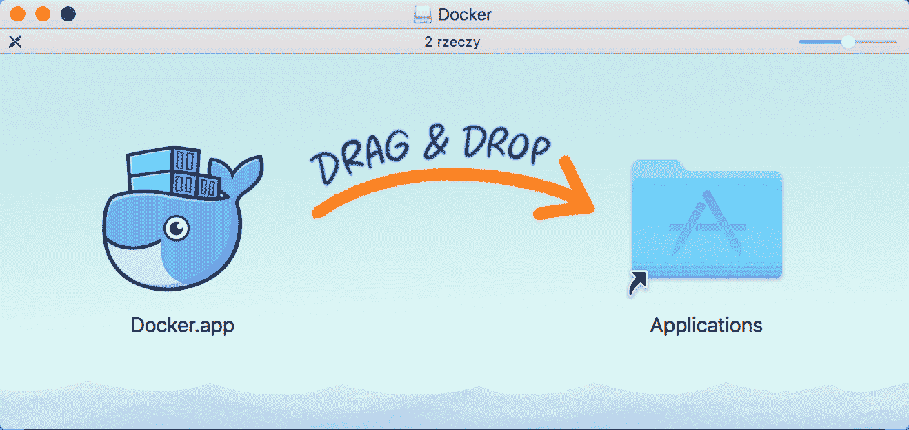

现在只要把`Docker.app`移到你的`Applications`文件夹里，你就都准备好了。再简单不过了。如果你运行 Docker，它将作为一个小鲸鱼图标出现在你的 macOS 菜单中。图标将在 Docker 启动过程中显示动画，并在完成后保持稳定:

*   如果您现在单击该图标，它将为您提供一个带有 Docker 状态和一些附加选项的便捷菜单:


*   Mac 的 Docker 具有自动更新功能，这对于保持您的安装是很好的。第一个偏好...窗格为您提供了自动检查更新的可能性；默认情况下，它被标记为:

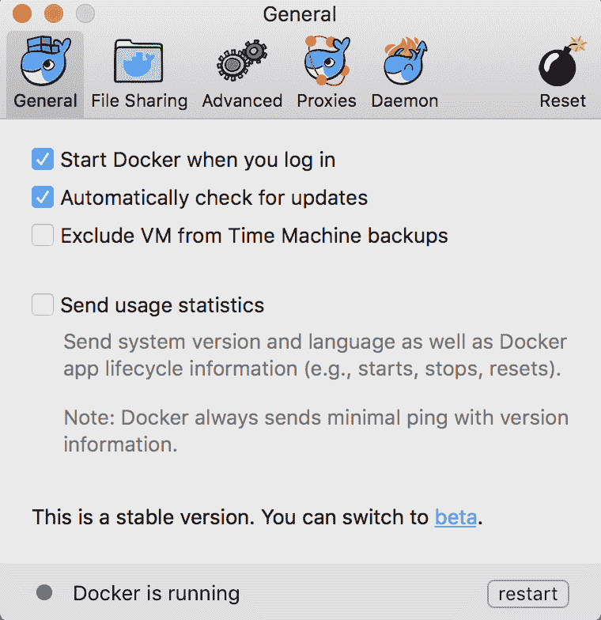

*   如果你是一个勇敢的灵魂，你也可以切换到 beta 频道获取更新。通过这种方式，您可以始终拥有最新和最棒的 Docker 功能，但有降低稳定性的风险，测试版软件也是如此。还要注意的是，切换到测试版频道将卸载你当前稳定版本的 Docker，并销毁你所有的设置和容器。Docker 会就此警告你，以确保你真的想这么做:

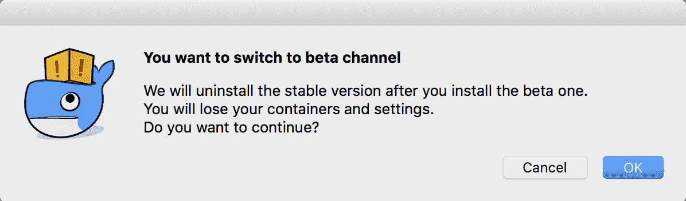

*   偏好设置的“文件共享”面板...将为您提供一个选项，将您机器上的 macOS 目录标记为绑定装载到稍后要运行的 Docker 容器中。我们将在本书后面详细解释挂载目录。目前，让我们有一组默认的选择目录:

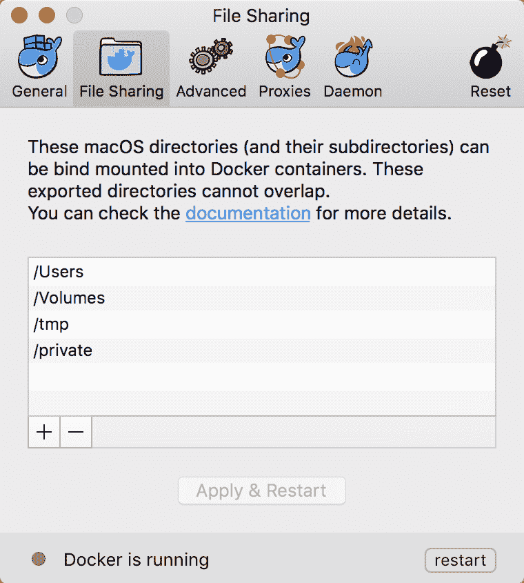

*   “高级”面板有一些选项可用于调整 Docker 可用的计算机资源，即处理器数量和内存量。如果您从 macOS 上的 Docker 开始，默认设置通常是一个好的开始:


*   “代理”窗格为您提供了设置代理的可能性，如果您的计算机上需要它的话。您可以选择使用系统或手动设置，如下图所示:


*   在下一页，您可以编辑一些 Docker 守护程序设置。这将包括添加注册表和注册表镜像。Docker 在拉图片时会用到它们。“高级”选项卡包含一个文本字段，您可以在其中输入包含守护程序配置的 JSON 文本:


*   在守护程序窗格中，您还可以关闭 Docker 实验特性。一段时间以来，默认情况下已经启用了实验特性。Docker 的新版本不时会带来新的实验特性。在撰写本书时，它们将包括，例如，检查点和恢复(一个允许您通过检查点来冻结正在运行的容器的功能)、Docker 图形驱动程序插件(使用外部/进程外图形驱动程序与 Docker 引擎一起使用，作为使用内置存储驱动程序的替代)以及其他一些。看到 Docker 的新版本中包含了哪些新功能总是很有趣。单击 Daemon 页面中的链接将带您进入 GitHub 页面，该页面列出并解释了所有新的实验特性。
*   最后的偏好...窗格是重置。如果您发现您的 Docker 无法启动或表现不佳，您可以尝试将 Docker 安装重置为出厂默认值:

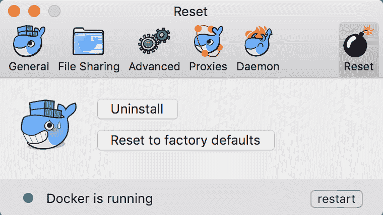

但是，应该警告您，将 Docker 重置为出厂状态也将删除您机器上所有下载的映像和容器。如果您有尚未推送至任何地方的映像，首先进行备份总是一个好主意。

Docker 菜单中的 Open Kitematic 是打开我们前面提到的 Kitematic 应用程序的便捷快捷方式。这是一个在 Windows 和 Mac OS X 上使用 Docker 的桌面实用程序。如果您尚未安装 Kitematic，Docker 将为您提供安装包的链接:

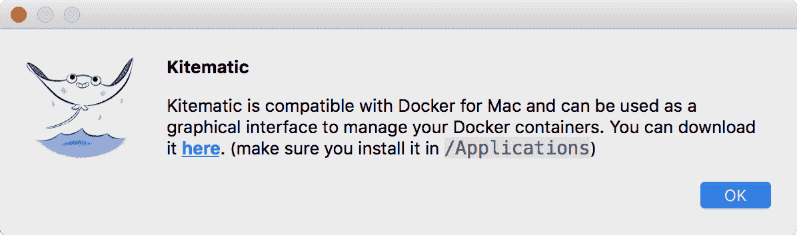

*   如果您运行 Kitematic，它将首先显示 Docker Hub 登录屏幕。您现在可以注册 Docker Hub，然后提供您的用户名和密码登录:


单击“立即跳过”将带您进入映像列表，而无需登录 Docker Hub。让我们通过拉取和运行一个映像来测试我们的安装。我们来搜索`hello-java-world`，如下图截图所示:

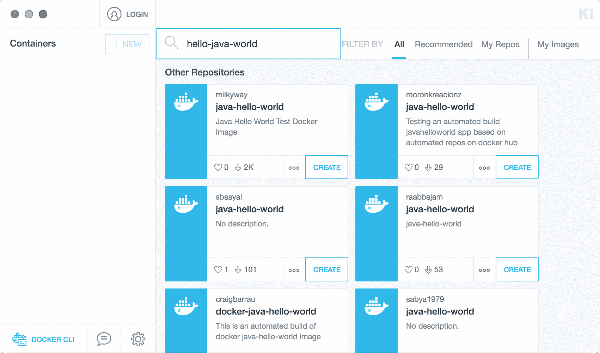

从注册表中取出映像后，启动它。Kitematic 将呈现正在运行的容器日志，这将是著名的`hello world`消息，来自一个容器化的 Java 应用程序:


这就是在 Kitematic 中运行容器的原因。让我们试着从外壳开始做同样的事情。在终端中执行以下操作:

```
$ docker run milkyway/java-hello-world 
```

因此，您将看到同样的问候，来自一个容器化的 Java 应用程序，这次是在 macOS 终端:

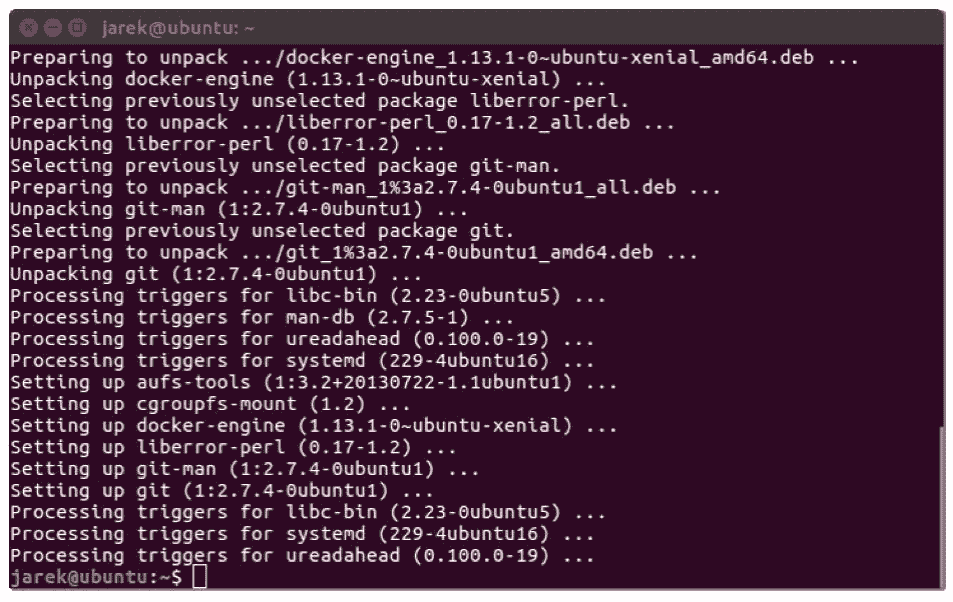

就是这样，我们有一个本地 Docker 在我们的 macOS 上运行。让我们也在 Linux 上安装它。

# 在 Linux 上安装

有很多不同的 Linux 发行版，每个 Linux 发行版的安装过程可能会有所不同。我将在最新的 16.04 Ubuntu 桌面上安装 Docker:

1.  首先，我们需要允许`apt`包管理器使用 HTTPS 协议上的存储库。从外壳执行:

```
$ sudo apt-get install -y --no-install-recommends apt-transport-https ca-certificates curl software-properties-common
```

2.  接下来我们要做的是将 Docker 的`apt`存储库`gpg`键添加到我们的`apt`来源列表中:

```
$ curl -fsSL https://download.docker.com/linux/ubuntu/gpg | sudo apt-key add –
```

3.  如果成功，一个简单的`OK`将是响应。使用以下命令设置稳定的存储库:

```
$ sudo add-apt-repository "deb [arch=amd64] https://download.docker.com/linux/ubuntu $(lsb_release -cs) stable"
```

4.  接下来，我们需要更新`apt`包索引:

```
$ sudo apt-get update  
```

5.  现在我们需要确保`apt`安装程序将使用正式的 Docker 存储库，而不是默认的 Ubuntu 存储库(可能包含 Docker 的旧版本):

```
$ apt-cache policy docker-ce  
```

6.  使用此命令安装最新版本的 Docker:

```
$ sudo apt-get install -y docker-ce
```

7.  `apt`包管理器会下载很多包；这些将是所需的依赖项和`docker-engine`本身:


8.  就这样，你应该准备好了。让我们验证 Docker 是否适用于我们的 Linux 盒子:

```
$sudo docker run milkyway/java-hello-world  
```

9.  如您所见，Docker 引擎将从 Docker Hub 中拉出带有所有图层的`milkyway/java-hello-world`映像，并以问候回应:


但是我们需要用`sudo?`运行 Docker 命令吗，原因是 Docker 守护进程总是作为`root`用户运行，并且由于 Docker 版本为 0.5.2，Docker 守护进程绑定到一个 Unix 套接字而不是 TCP 端口。默认情况下，该 Unix 套接字属于用户`root`，因此，默认情况下，您可以使用 sudo 访问它。让我们将其修复，以便能够作为普通用户运行`Docker`命令:

1.  首先，添加`Docker`组，如果它还不存在的话:

```
$ sudo groupadd docker
```

2.  然后，将您自己的用户添加到 Docker 组。更改用户名以匹配您的首选用户:

```
$ sudo gpasswd -a jarek docker  
```

3.  重新启动停靠守护进程:

```
$ sudo service docker restart  
```

4.  现在让我们注销再登录，再执行一次`docker run`命令，这次不用`sudo`了。如您所见，您现在可以作为正常的非`root`用户使用 Docker:


5.  就这样。我们的 Linux Docker 安装已经准备好了。现在让我们在 Windows 盒子上进行安装。

# 在 Windows 上安装

本机 Docker 包可以在 64 位 Windows 10 专业版或企业版上运行。它使用 Windows 10 虚拟化引擎来虚拟化 Linux 内核。这就是安装包不再包含 VirtualBox 设置的原因，就像以前版本的窗口 Docker 一样。本机应用程序来自典型的`.msi`安装包。如果你运行它，它会向你发出友好的信息，说从现在开始，它将生活在你的任务栏托盘中，在小鲸鱼图标下:

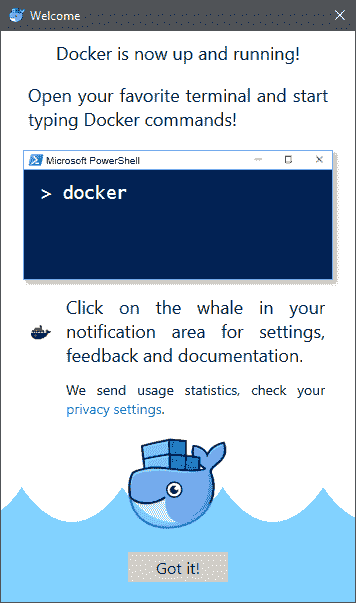

托盘中的 Docker 图标通知您 Docker 引擎的状态。它还包含一个小而有用的上下文菜单:


让我们探索首选项设置，看看有什么可用的。第一个选项卡“常规”允许您将 Docker 设置为在登录时自动运行。如果您每天使用 Docker，这可能是推荐的设置。您还可以标记为自动检查更新并发送使用统计信息。发送使用统计数据将有助于 Docker 团队在未来版本中改进该工具；除非您有一些关键的、安全的工作要做，否则我建议您打开这个选项。这是为这一重要工具的未来版本做出贡献的好方法:


第二个选项卡“共享驱动器”允许您选择本地 Windows 驱动器，这些驱动器可用于您将运行的 Docker 容器:

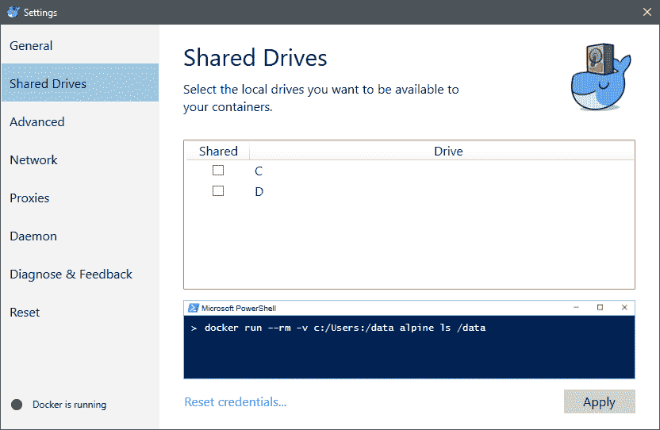

我们将在[第 2 章](02.html)、*网络和持久存储*中介绍 Docker 卷。在此选择驱动器意味着您可以从本地系统映射一个目录，并将其作为 Windows 主机读取到 Docker 容器中。下一个首选项页面“高级”允许我们对运行在我们的 Windows 电脑上的 Docker 引擎进行一些限制，并选择带有 Linux 内核的虚拟机映像的位置:


默认值通常是现成的，除非您在开发过程中遇到问题，否则我建议保持原样。网络允许您配置 Docker 与网络的工作方式，与子网地址和掩码或 DNS 服务器相同。我们将在[第 2 章](02.html)、*网络和持久存储*中介绍 Docker 网络:

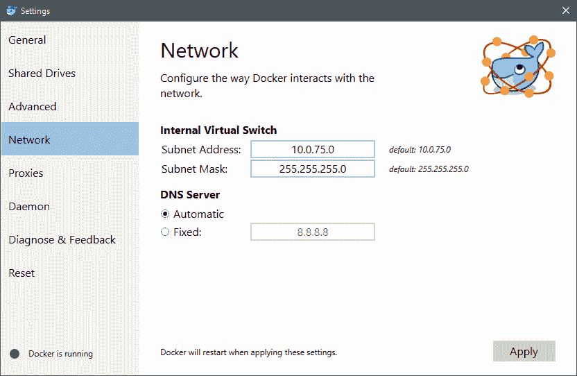

如果您在网络中使用代理，并且希望 Docker 访问互联网，您可以在“代理”选项卡中设置代理设置:


该对话框类似于您在其他应用程序中发现的对话框，您可以在其中定义代理设置。它不接受任何代理、系统代理设置或手动设置(HTPP 和 HTTPS 通信使用不同的代理)。下一个窗格可用于配置 Docker 守护程序:


基本开关意味着 Docker 使用基本配置。您可以将其切换到高级，并以 JSON 结构的形式提供自定义设置。实验特性与我们在 macOS 上的 Docker 安装期间已经提到的相同，例如，这将是检查点&恢复或启用 Docker 图形驱动程序插件。您还可以指定远程注册表的列表。Docker 将只使用普通 HTTP 而不是 HTTPS 从不安全的注册中心提取映像。

使用最后一个窗格上的重置选项，您可以重新启动 Docker 或将 Docker 重置为出厂设置:

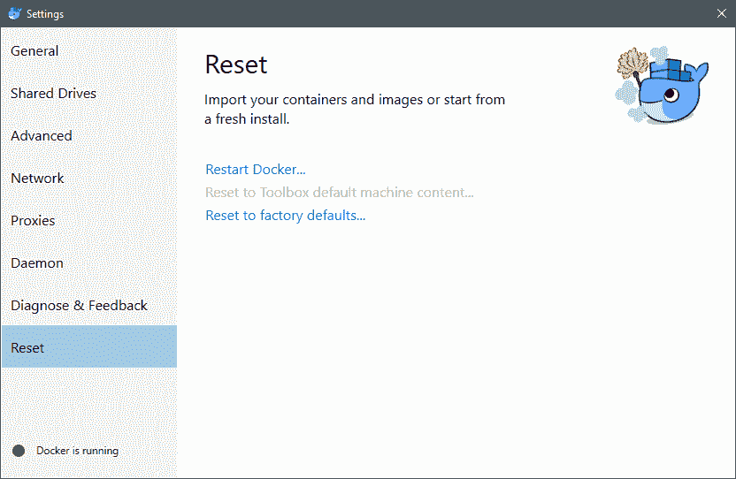

请注意，将 Docker 重置为其初始设置也将删除您机器上当前存在的所有映像和容器。

开放的厨房...选项，它也存在于 Docker 托盘图标上下文菜单中，是启动 Kitematic 的快速快捷方式。如果您是第一次下载，并且没有安装 Kitematic，Docker 会询问您是否想第一次下载:

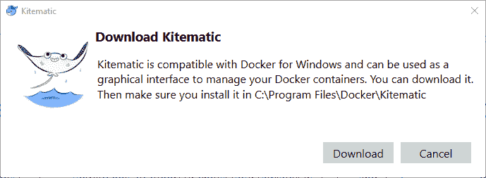

这就是为 Windows 安装 Docker 的原因。这是一个相当无痛的过程。作为安装过程的最后一步，让我们检查 Docker 是否可以从命令提示符运行，因为这可能是您将来启动它的方式。在命令提示符或 PowerShell 中执行以下命令:

```
docker run milkyway/java-hello-world  
```


正如您在前面的截图中看到的，我们有一条 Hello World 消息，来自作为 Docker 容器启动的 Java 应用程序。

# 摘要

就这样。我们的窗口安装 Docker 功能齐全。在本章中，我们已经了解了 Docker 背后的思想以及传统虚拟化和容器化之间的主要区别。我们非常了解 Docker 的核心概念，例如映像、层、容器和注册表。我们应该已经在本地机器上安装了 Docker 现在是时候继续学习更高级的 Docker 功能了，例如网络和持久存储。