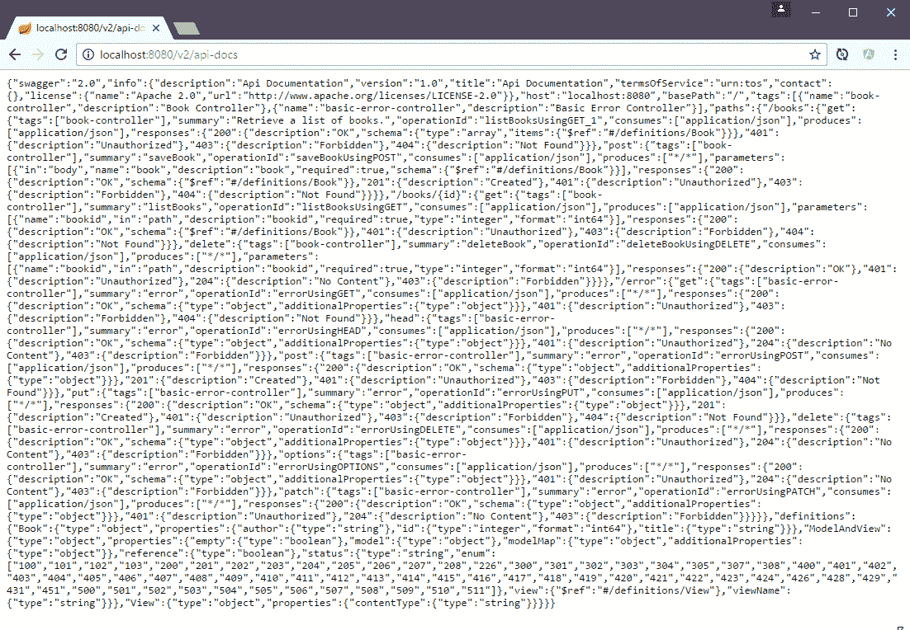
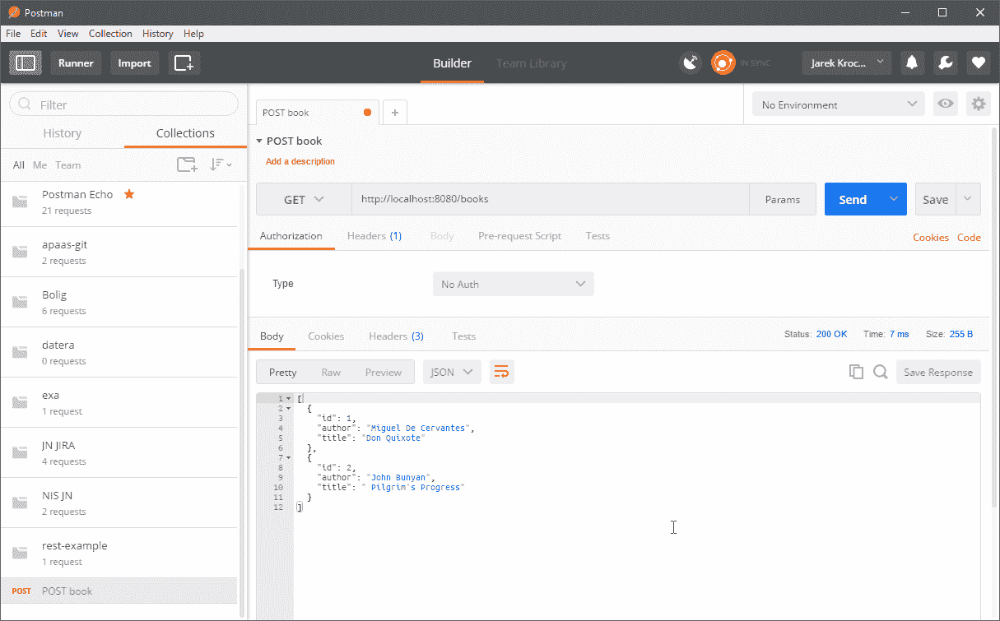

# 四、创建 Java 微服务

我们在[第 3 章](03.html)、*使用微服务*中已经看到了很多微服务架构背后的理论。是时候做一些实践了；我们将实现我们自己的微服务。这将是一个简单的 REST 服务，接受`GET`、`POST`等`HTTP`方法来检索和更新实体。在用 Java 开发微服务时，有几个选择。在这一章中，我们将概述两种主要的方法，可能最流行的是 JEE7 和 Spring Boot。我们将简要了解如何使用 JEE·JAX-RS 对微服务进行编码。我们还将创建一个在 Spring Boot 运行的微服务。事实上，在[第 5 章](05.html)、*用 Java 应用*创建映像中，我们将从 Docker 容器中运行我们的 Spring Boot 微服务。正如我们在[第三章](03.html)、*中所说的与微服务*一起工作，微服务通常使用 REST 与外界进行通信。我们的 REST 微服务将尽可能简单；我们只需要使用 Docker 和 Kubernetes 部署一些东西。我们将不关注高级微服务特性，如身份验证、安全性、过滤器等，因为这超出了本书的范围。我们示例的目的是让您了解如何开发 REST 服务，然后使用 Docker 和 Kubernetes 部署它们。本章将涵盖以下主题:

*   REST 简介
*   使用 Java EE7 注释在 Java 中创建 REST 服务
*   使用 Spring Boot 创建 REST 服务
*   运行服务，然后用不同的 HTTP 客户端调用它

在这一章的最后，我们将熟悉一些有用的工具——我们将使用一些代码生成工具，比如 Spring Initialzr 来快速引导一个 Spring Boot 服务项目。在我们开始编写自己的微服务之前，让我们简单解释一下什么是 REST。

# REST 简介

REST 首字母缩略词代表代表性状态转移。这是一种建筑风格，也是一种基于网络的软件设计。它描述了一个系统如何与另一个系统进行状态通信。这非常适合微服务领域。从[第 3 章](03.html)、*与微服务*一起工作，基于微服务架构的软件应用是一堆相互独立的服务。

在我们更进一步之前，我们需要了解 REST 中的一些概念:

*   `resource`:这是 REST 架构中的主要概念。任何信息都可以是一种资源。银行账户、个人、映像、书。资源的表示必须是**无状态的**
*   `representation`:一种特定的资源表示方式。例如，银行帐户资源可以用 JSON、XML 或 HTML 来表示。不同的客户端可能请求不同的资源表示，一个可以接受 JSON，而另一个则需要 XML
*   `server`:服务提供商。它公开了客户端可以使用的服务
*   `client`:服务消费者。例如，这可能是另一个微服务、应用，或者只是运行 Angular 应用的用户网络浏览器

正如定义所说，REST 被用来在网络上传输这些资源表示。表示本身是通过某种媒体类型创建的。媒体类型可以不同。媒体类型的一些例子包括 JSON、XML 或 RDF。JSON 媒体类型被广泛接受，可能是最常用的。在我们的示例中，我们还将使用 JSON 与我们的服务进行通信。当然，REST 不是微服务通信的唯一选择；还有其他的，比如谷歌非常优秀的 gRPC，它带来了很多优势，比如 HTTP/2 和 protobuff。在 REST 架构中，资源由组件操纵。事实上，这些组件就是我们的微服务。组件通过标准的统一接口请求和操作资源。REST 不依赖于任何特定的协议；然而，REST 呼叫通常使用最流行的`HTTP`或`HTTPS`协议进行。在`HTTP`的情况下，这个统一接口由标准的 HTTP 方法组成，如`GET`、`PUT`、`POST`和`DELETE`。

REST is not tied to any specific protocol.

在我们开始实现响应`HTTP`调用的服务之前，了解一下我们将要使用的 HTTP 方法是值得的。我们现在将更加关注他们。

# HTTP 方法

基于 REST 的架构使用标准 HTTP 方法:`PUT`、`GET`、`POST`和`DELETE`。下表对这些操作进行了说明:

*   `GET`授予对资源的读取权限。调用`GET`应该不会产生任何副作用。这意味着`GET`运算是幂等的。资源从未通过`GET`请求改变；例如，请求没有副作用。这意味着它是幂等的
*   `PUT`创建新资源。类似`GET`，也应该是幂等的
*   `DELETE`移除一个或多个资源。重复调用`DELETE`操作不应给出不同的结果
*   `POST`将更新现有资源或创建新资源

RESTful 网络服务只是一个基于`REST`资源概念和使用 HTTP 方法的网络服务。它应该为公开的方法、支持的 MIME 类型(如 XML、文本或 JSON)以及服务处理的操作集(`POST`、`GET`、`PUT`和`DELETE`)定义基本 URI。根据 RESTful 原则，HTTP 对于 REST 来说非常简单和自然。这些原则是一组约束，确保客户端(例如服务消费者、其他服务或浏览器)能够以灵活的方式与服务器通信。现在让我们看看它们。

在 REST 原则客户端-服务器通信中，所有以 RESTful 风格构建的应用原则上也必须是客户端-服务器。应该有一个服务器(服务提供商)和一个客户端(服务消费者)。拥有这一点可以实现服务器和客户端的松散耦合和独立演进。这非常符合微服务的概念。从[第 3 章](03.html)、*开始，你会记得使用微服务*时，它们必须是独立的:

*   **无状态**:对服务器的每个`client`请求都要求完全表示其状态。服务器必须能够完全理解`client`请求，而不使用任何服务器上下文或服务器会话状态。换句话说，所有状态都必须在客户端进行管理。每个 REST 服务都应该是**无状态的**。后续请求不应依赖于临时存储的前一个请求的某些数据。信息应该是自我描述的。
*   **可缓存**:响应数据可以标记为可缓存或不可缓存。任何标记为可缓存的数据都可以重新用作对同一后续请求的响应。每个响应都应该指出它是否可以缓存。
*   **统一接口**:所有组件必须通过单一统一接口进行交互。因为所有组件交互都是通过这个接口进行的，所以与不同服务的交互非常简单。
*   **分层系统**:服务的消费者不应该假设直接连接到服务提供商。换句话说，在任何时候，客户端都无法判断它是连接到终端服务器还是中间服务器。中间层通过实现负载平衡来帮助实施安全策略并提高系统的可伸缩性。由于请求可以被缓存，客户端可能会从中间层获得缓存的响应。
*   **通过表示操纵资源**:一个资源可以有多个表示。应该可以通过带有这些表示的消息来修改资源。
*   **超媒体作为应用状态引擎(HATEOAS)**:RESTful 应用的消费者应该只知道一个固定的服务 URL。所有后续资源都应该可以从资源表示中包含的链接中发现。

前面的概念代表了 REST 的定义特征，并将 REST 体系结构与其他体系结构(如网络服务)区分开来。值得注意的是，REST 服务是一个 web 服务，但是 web 服务不一定是 REST 服务。REST 微服务应该代表实体的状态。例如，让我们的实体是一本书(连同它的属性，如标识、标题和作者)，表示为 XML、JSON 或纯文本。考虑 REST 最基本的方式是将其作为格式化服务 URL 的一种方式。例如，拥有我们的`book`资源，我们可以想象在服务中定义以下操作:

*   `/books`将允许访问所有的书籍
*   `/books/:id`将是查看基于其唯一 ID 检索的单本书的操作
*   向`/books`发送`POST`请求将是你如何实际创建一本新书并将其存储在数据库中
*   向`/books/:id`发送`PUT`请求将是你如何更新给定书籍的属性，同样由它的唯一标识来标识
*   向`/books/:id`发送`DELETE`请求将是您删除特定书籍的方式，同样通过其唯一标识来识别

值得尝试理解的是，REST 不是 HTTP。它经常使用 HTTP，因为在其最一般的形式中，REST 是关于将动词的概念映射到任意的名词集合，并且非常适合 HTTP 方法。HTTP 包含一组有用的通用动词(`GET`、`POST`、`PUT`、`PATCH`等等)。在 REST 中，我们不传输实际的对象，而是以特定的形式传输它的表示，如 XML、文本或 JSON。REST 作为一种建筑风格意味着它只是一个概念。如何实施取决于你。Java 非常适合开发 REST 服务。让我们看看我们怎么做。

# Java 中的 REST

在用 Java 开发 REST 服务时，我们至少有几个可以使用的框架选项。最受欢迎的将是带有 JAX RS 的纯 JEE7 或带有 Spring Boot 的 Spring Framework。您可以使用其中的任何一种，也可以将它们混合在一起。让我们现在更详细地看看这两个，从 JAX-RS 开始。

# 爪哇 EE7 - JAX-RS 与泽西岛

JAX-RS 的诞生源于 **Java 规范请求** ( **JSR** ) 311。正如官方定义所说，JAX-RS 是 RESTful 网络服务的 Java 应用编程接口。这是一个规范，为根据 REST 架构模式创建 web 服务提供支持。JAX-RS 使用 Java SE 5 中引入的 Java 注释来简化 web 服务客户端和端点的开发和部署。从 1.1 版本开始，JAX-RS 是 Java EE 的官方部分。作为 Java EE 的一个官方部分，一个显著的特点是开始使用 JAX-RS 不需要任何配置。

带有 JAX-RS 2.0 的 Java EE 7 带来了几个有用的特性，进一步简化了微服务的开发。JAX-RS 2.0 最重要的新特性之一是遵循 REST 的 HATEOAS 原则支持超媒体。`Jersey`，一个来自 Oracle 的库，可能是最广为人知的库，它实现了这个规范。

Jersey is the reference implementation for the JSR 311 specification.

泽西岛实现提供了一个库来实现 Java servlet 容器中的 RESTful 网络服务。在服务器端，Jersey 提供了一个 servlet 实现，它扫描预定义的类来识别 RESTful 资源。泽西岛让编写 RESTful 服务变得容易多了。它将你需要自己做的大量低级编码抽象出来。使用泽西岛，你用一种声明的方式。在您的`web.xml`文件中注册的 servlet 分析传入的`HTTP`请求，并选择正确的类和方法来响应该请求。它通过查看类和方法级别的注释来找到合适的执行方法。带注释的类可以驻留在不同的包中，但是您可以通过`web.xml`命令泽西 servlet 扫描某些包中的带注释的类。

JAX-RS 支持通过用于 XML 绑定的 **Java 架构** ( **JAXB** )来创建 XML 和 JSON。泽西的实现还提供了一个`client`库来与 RESTful 网络服务进行通信。

如前所述，我们使用 Java 注释开发 JAX-RS 应用。和它一起工作既轻松又愉快。现在让我们描述那些注释。

# JAX 遥感注释

下表列出了 JAX 遥感中最重要的注释:

| **标注** | **表示** |
| `@PATH` | 将路径设置为基础`URL + /your_path`。基本网址基于您的应用名称、servlet 和`web.xml`配置文件中的网址模式。 |
| `@POST` | 表示以下方法将响应`HTTP POST`请求。 |
| `@GET` | 表示以下方法将响应`HTTP GET`请求。 |
| `@PUT` | 表示以下方法将响应`HTTP PUT`请求。 |
| `@DELETE` | 表示以下方法将响应`HTTP DELETE`请求。 |
| `@Produces` | 定义哪个 MIME 类型是由一个用`@GET`注释的方法传递的。例如可以是`"text/plain"`、`"application/xml"`或者`"application/json"`。 |
| `@Consumes` | 定义此方法使用的 MIME 类型。 |
| `@PathParam` | 用于将 URL 中的值提取(注入)到方法参数中。例如，通过这种方式，您可以将资源的标识注入到方法中，以获得正确的对象。 |
| `@QueryParam` | 用于提取(注入)请求附带的 URI 查询参数。**统一资源标识符** ( **URI** )是一个字符串，用于标识互联网上的名称或资源。 |
| `@DefaultValue` | 指定默认值。对可选参数有用。 |
| `@CookieParam` | 允许您将客户端请求发送的 cookies 注入到您的 JAX-RS 资源方法中的注释。 |
| `@Provider` | `@Provider`注释用于 JAX-RS 运行时感兴趣的任何内容，例如`MessageBodyReader`和`MessageBodyWriter`。对于`HTTP`请求，`MessageBodyReader`用于将`HTTP`请求实体映射到方法参数。在响应端，使用`MessageBodyWriter`将返回值映射到`HTTP`响应实体体。如果应用需要提供额外的元数据，如`HTTP`头或不同的状态代码，方法可以返回一个包装实体的响应，并且可以使用`Response.ResponseBuilder`构建。 |
| `@ApplicationPath` | `@ApplicationPath`注释用于定义应用的网址映射。由`@ApplicationPath`指定的路径是由`resource`类中的`@Path`注释指定的所有资源 URIs 的基本 URI。您只能将`@ApplicationPath`应用于`javax.ws.rs.core.Application`的子类。 |

乍一看，注释名称可能不清楚或不言自明。让我们看看 REST 端点实现的示例，它会变得更加清晰。应用本身标有`@ApplicationPath`注释。默认情况下，在启动符合 JEE 标准的服务器期间，JAX-RS 将扫描 Java 应用归档中的所有资源，以找到暴露的端点。我们可以覆盖`getClasses()`方法，在 JAX-RS 运行时手动注册应用中的`resource`类。您可以在以下示例中看到它:

```
package pl.finsys.jaxrs_example 
@ApplicationPath("/myApp") 
public class MyApplication extends Application { 
   @Override 
   public Set<Class<?>> getClasses() { 
      final Set<Class<?>> classes = new HashSet<>(); 
      classes.add(MyBeansExposure.class); 
      return classes; 
   } 
} 
```

在前面的例子中，我们只是注册了一个 REST 应用，给了它`/myApp`基础 URI 路径。只有一个`REST`方法处理程序(端点)`MyBeansExposure`类，我们在 REST 应用中注册了它。在单独的 Java 类中实现的简化 REST 端点看起来可能与此相同:

```
package pl.finsys.jaxrs_example 
import javax.annotation.PostConstruct; 
import javax.enterprise.context.ApplicationScoped; 
import javax.ws.rs.DELETE; 
import javax.ws.rs.GET; 
import javax.ws.rs.POST; 
import javax.ws.rs.Path; 
import javax.ws.rs.PathParam; 
import javax.ws.rs.container.ResourceContext; 
import javax.ws.rs.core.Context; 
import javax.ws.rs.core.Response; 

@ApplicationScoped 
@Path("beans") 
public class MyBeansExposure { 
    @Context ResourceContext rc; 
    private Map<String, Bean> myBeans; 

    @GET 
    @Produces("application/json") 
    public Collection<Bean> allBeans() { 
        return Response.status(200).entity(myBeans.values()).build(); 
    } 

    @GET 
    @Produces("application/json") 
    @Path("{id}") 
    public Bean singleBean(@PathParam("id") String id) { 
        return Response.status(200).entity(myBeans.get(id)).build(); 
    } 

    @POST 
    @Consumes("application/json") 
    public Response add(Bean bean) { 
        if (bean != null) { 
            myBeans.put(bean.getName(), bean); 
        } 
        final URI id = URI.create(bean.getName()); 
        return Response.created(id).build(); 
    } 

    @DELETE 
    @Path("{id}") 
    public void remove(@PathParam("id") String id) { 
        myBeans.remove(id); 
    } 

} 
```

在前面的例子中可以看到，我们有类级`@Path`标注。每个标有`@GET`、`@PUT`、`@DELETE`或`@POST`注释的方法都会响应从基础`@Path`开始的对 URI 的调用。此外，我们可以在方法级别上使用`@Path`注释；它将在某种程度上扩展特定方法响应的 URI 路径。在我们的例子中，用 URI 路径`myApp/beans`执行的`HTTP GET`将调用`allBeans()`方法，返回 JSON 格式的 beans 集合。使用`myApp/beans/12` URI 路径执行的`GET`方法将调用`singleBean()`方法，并且`{id}`参数将因为`@PathParam`注释而转移到该方法。在`myApp|beans|12` URI 上调用`HTTP DELETE`方法将执行带有`id`参数值`12`的`remove()`方法。为了给你几乎无限的灵活性，`@Path`注释支持正则表达式。考虑以下示例:

```
package pl.finsys.jaxrs_example 
import javax.ws.rs.GET; 
import javax.ws.rs.Path; 
import javax.ws.rs.PathParam; 
import javax.ws.rs.core.Response; 

@Stateless 
@Path("/books") 
public class BookResource { 

   @GET 
   @Path("{title : [a-zA-Z][a-zA-Z_0-9]}") 
    public Response getBookByTitle(@PathParam("title") String title) { 
      return Response.status(200).entity("getBookByTitle is called, title : " + title).build(); 
   } 

   @GET 
   @Path("{isbn : \\d+}") 
   public Response getBookByISBN(@PathParam("isbn") String isbn) { 
      return Response.status(200).entity("getBookByISBN is called, isbn : " + isbn).build(); 
   } 
} 
```

在前面的例子中，我们有两个`@GET`映射，每个映射都有相同的`/books/`路径。第一个参数是`/{title : [a-zA-Z][a-zA-Z_0-9]}`参数，只对字母和数字有反应。第二个参数是`/{isbn : \\d+}`参数，只有当你拨打 URI 时提供一个号码才会被执行。如您所见，我们已经映射了两条相同的路径，但是每条路径都会对不同类型的传入路径参数做出反应。

除了使用`@PathParam`之外，我们还可以使用`@QueryParams`使用请求参数来提供参数。看看下面的例子:

```
package pl.finsys.jaxrs_example 
import java.util.List; 
import javax.ws.rs.GET; 
import javax.ws.rs.Path; 
import javax.ws.rs.core.Context; 
import javax.ws.rs.core.Response; 
import javax.ws.rs.core.UriInfo; 

@Stateless 
@Path("/users") 
public class UserResource { 
   @EJB private UserService userService; 
   @GET 
   @Path("/query") 
   @Produces("application/json") 
   public Response getUsers( 
      @QueryParam("from") int from, 
      @QueryParam("to") int to, 
      @QueryParam("orderBy") List<String> orderBy)) { 
      List<User> users = userService.getUsers(from, to, orderBy); 
      return Response.status(200).entity(users).build(); 
   } 
} 
```

在前面的例子中，当在`/users/query?from=1&to=100&orderBy=name`上调用`HTTP GET`时，JAX-RS 会将 URI 参数传递到`getUsers()`方法参数中，并调用注入的`userService`来获取数据(例如，从数据库中)。

为了打包 JAX-RS 应用，我们当然需要一个 Maven `pom.xml`文件。在其最简单的形式中，它可以看起来像下面一样:

```
<?xml version="1.0" encoding="UTF-8"?> 
<project  
         xmlns:xsi="http://www.w3.org/2001/XMLSchema-instance" 
         xsi:schemaLocation="http://maven.apache.org/POM/4.0.0 http://maven.apache.org/xsd/maven-4.0.0.xsd"> 
    <modelVersion>4.0.0</modelVersion> 

    <groupId>pl.finsys</groupId> 
    <artifactId>jee7-rest</artifactId> 
    <packaging>war</packaging> 
    <version>1.0-SNAPSHOT</version> 

    <dependencies> 
        <dependency> 
            <groupId>javax</groupId> 
            <artifactId>javaee-api</artifactId> 
            <version>7.0</version> 
            <scope>provided</scope> 
        </dependency> 
    </dependencies> 
    <build> 
        <finalName>jee7-rest</finalName> 
    </build> 

    <properties> 
        <maven.compiler.source>1.8</maven.compiler.source> 
        <maven.compiler.target>1.8</maven.compiler.target> 
        <failOnMissingWebXml>false</failOnMissingWebXml> 
    </properties> 
</project> 
```

创建 JEE7 REST 服务非常简单，不是吗？通过构建项目并将其部署到符合 JEE 标准的应用服务器，我们已经准备好了几个端点，等待通过`HTTP`调用。但是还有一个更简单更快速的方法。毕竟，在微服务时代，我们希望以最小的开销更快地创建单个组件。Spring Boot 来了。我们现在来看看。

# Spring Boot

Spring 本身是一个非常流行的基于 Java 的框架，用于构建 web 和企业应用。这不仅仅是专注于依赖注入的 Spring Core。Spring Framework 提供了许多特性，可以让开发人员的生活变得更加轻松，并允许您更快地交付所需的特性。名单很长；这里只是几个例子:

*   **春季数据**:简化关系型和 NoSQL 型数据存储的数据访问
*   **春季批次**:提供强大的批次处理框架
*   **春季安全**:提供多种保护应用的方法
*   **春季社交**:支持与 Twitter、脸书、GitHub 等社交网站融合
*   **Spring 集成**:企业集成模式的实现，使用轻量级消息传递和声明性适配器来促进与其他企业应用的集成

但是为什么春天变得如此受欢迎呢？这有几个原因:

*   它使用依赖注入方法，鼓励编写可测试的、松散耦合的代码
*   包含数据库事务管理功能很容易
*   例如，与其他流行的 Java 框架如 JPA/Hibernate 的集成
*   它包括一个最先进的 MVC 框架，用于更快地构建 web 应用，将视图与业务逻辑分开

在 Spring 框架中配置 beans 可以通过多种方式完成，例如 XML 定义文件、Java 注释和代码配置。这可能是一个乏味的过程。此外，我们经常为不同的应用做大量的样板配置。Spring Boot 的诞生是为了解决配置的复杂性。我们可以将 Spring Boot 用于我们自己的目的，开发小型的、独立的、可以运行的服务。它可以是一个可运行的 fat JAR 文件，包含运行应用所需的所有 Java 依赖项。不需要应用服务器或复杂的部署描述符配置。事实上，在幕后，Spring Boot 会为你启动一个嵌入式服务器。当然，您不会被迫使用嵌入式应用服务器。例如，您总是可以构建一个 WAR 文件，将其部署在自己的 Tomcat 或 Wildfly 上。值得了解的是，尽管大多数事情会在运行 Spring Boot 应用时自动发生，但它不是一个代码生成框架。

所有这些是否会让您想起 Docker 容器的简单性和可移植性？当然有，但在应用层面上。正如我们在[第 3 章](03.html)、*中讨论的那样，与微服务*合作，我们正朝着具有更小的、可独立部署的微服务的架构发展。这意味着我们将需要能够快速离开地面，并开始运行新的组件。在使用 Spring Boot 时，我们有很多现成的功能。这些特性是以 Maven 工件的形式交付的，您可以将它包含在您的 Maven `pom.xml`文件中。

下表显示了我们将使用的由 Spring Boot 提供的一些重要的初始项目:

| **项目** | **描述** |
| `spring-boot-starter` | Spring Boot 应用的基本启动器。为自动配置和日志记录提供支持。 |
| `spring-boot-starter-web` | 用于构建基于 Spring MVC 的 web 应用或 RESTful 应用的入门项目。这使用 Tomcat 作为默认的嵌入式 servlet 容器。 |
| `spring-boot-starter-data-jpa` | 为春季数据 JPA 提供支持。默认实现是 Hibernate。 |
| `spring-boot-starter-validation` | 为 Java Bean 验证应用编程接口提供支持。默认实现是 Hibernate Validator。 |
| `spring-boot-starter-test` | 为各种单元测试框架提供支持，如 JUnit、Mockito 和 Hamcrest 匹配器 |

还有很多项目，可能对你有用。我们不打算使用它们，但让我们看看还有什么可用的:

| `spring-boot-starter-web-services` | 开发基于 XML 的网络服务的初始项目 |
| `spring-boot-starter-activemq` | 支持使用活动 MQ 上的 JMS 进行基于消息的通信 |
| `spring-boot-starter-integration` | 支持 Spring 集成，这个框架提供了企业集成模式的实现 |
| `spring-boot-starter-jdbc` | 为使用 Spring JDBC 提供支持。默认情况下，配置 Tomcat JDBC 连接池。 |
| `spring-boot-starter-hateoas` | HATEOAS 代表作为应用状态引擎的超媒体。使用`HATEOAS`的 RESTful 服务除了返回数据之外，还返回与当前上下文相关的其他资源的链接。 |
| `spring-boot-starter-jersey` | JAX-RS 是开发 REST APIs 的 Java EE 标准。泽西岛是默认的实现。这个初始项目为构建基于 JAX 遥感的遥感应用编程接口提供了支持。 |
| `spring-boot-starter-websocket` | `HTTP`是无状态的。Web 套接字允许维护服务器和浏览器之间的连接。这个初始项目为 Spring 网络套接字提供了支持。 |
| `spring-boot-starter-aop` | 为面向方面的编程提供支持。还为高级面向方面编程提供了对 AspectJ 的支持。 |
| `spring-boot-starter-amqp` | 默认为`RabbitMQ`，这个初始项目提供与 AMQP 的消息传递。 |
| `spring-boot-starter-security` | 这个初始项目实现了 Spring Security 的自动配置。 |
| `spring-boot-starter-batch` | 为使用 Spring Batch 开发批处理应用提供支持。 |
| `spring-boot-starter-cache` | 使用 Spring 框架对缓存的基本支持。 |
| `spring-boot-starter-data-rest` | 支持使用 Spring Data REST 公开 REST 服务。 |

让我们用这些好东西来编写我们自己的 Spring Boot 微服务。

# 编码 Spring Boot 微服务

我们知道我们有一些可用的启动器，所以让我们利用它们来节省一些时间。我们将要创建的服务将是简单的 REST 微服务，用于存储和检索数据库中的实体:在我们的例子中是书籍。我们不打算实现身份验证和安全功能，只是为了使它尽可能干净和简单。书籍将存储在内存关系型 H2 数据库中。我们将使用 Maven 构建和运行我们的书店，所以让我们从`pom.xml`构建文件开始。

# Maven 构建文件

正如您将看到的，我们自己的服务的父项目是 spring-boot-starter-parent。这是为基于 Spring Boot 的应用提供依赖和插件管理的父项目。这给了我们很多特性。我们还包括两个启动器:

*   `spring-boot-starter-web`:这是因为我们将使用之前使用 JEE7 JAX-RS 所做的`@Path`注释来创建我们的请求映射(类似于`@GET`或`@POST`映射)
*   `spring-boot-starter-data-jpa`:因为我们要把书保存在内存中的 H2 数据库里

启动器是为不同目的定制的简化依赖描述符。例如，`spring-boot-starter-web`是使用 Spring MVC 构建 web 和 RESTful 应用的开始。它使用 Tomcat 作为默认的嵌入式容器。我们还包括 Spring Boot·马文插件，它允许我们在适当的位置运行应用，而无需构建一个 JAR 或 WAR，或者为将来的部署准备一个 JAR 或 WAR 文件。我们完整的`pom.xml`应该和这个一样:

```
<?xml version="1.0" encoding="UTF-8"?> 
<project  xmlns:xsi="http://www.w3.org/2001/XMLSchema-instance" 
         xsi:schemaLocation="http://maven.apache.org/POM/4.0.0 http://maven.apache.org/xsd/maven-4.0.0.xsd"> 
    <modelVersion>4.0.0</modelVersion> 

    <groupId>pl.finsys</groupId> 
    <artifactId>rest-example</artifactId> 
    <version>0.1.0</version> 

    <parent> 
        <groupId>org.springframework.boot</groupId> 
        <artifactId>spring-boot-starter-
 parent</artifactId> 
        <version>1.5.2.RELEASE</version> 
    </parent> 

    <dependencies> 
        <dependency> 
            <groupId>org.springframework.boot</groupId> 
            <artifactId>spring-boot-starter-
 web</artifactId> 
        </dependency> 
        <dependency> 
            <groupId>org.springframework.boot</groupId> 
            <artifactId>spring-boot-starter-data-
 jpa</artifactId> 
        </dependency> 
        <dependency> 
            <groupId>org.hibernate</groupId> 
            <artifactId>hibernate-validator</artifactId> 
        </dependency> 
        <dependency> 
            <groupId>org.hsqldb</groupId> 
            <artifactId>hsqldb</artifactId> 
            <scope>runtime</scope> 
        </dependency> 

        <!--test dependencies--> 
        <dependency> 
            <groupId>org.springframework.boot</groupId> 
            <artifactId>spring-boot-starter-test</artifactId> 
            <scope>test</scope> 
        </dependency> 
        <dependency> 
            <groupId>com.jayway.jsonpath</groupId> 
            <artifactId>json-path</artifactId> 
            <scope>test</scope> 
        </dependency> 
    </dependencies> 

    <properties> 
        <java.version>1.8</java.version> 
    </properties> 

    <build> 
        <plugins> 
            <plugin> 
                <groupId>org.springframework.boot</groupId> 
                <artifactId>spring-boot-maven-plugin</artifactId> 
            </plugin> 
        </plugins> 
    </build> 

    <repositories> 
        <repository> 
            <id>spring-releases</id> 
            <url>https://repo.spring.io/libs-release</url> 
        </repository> 
    </repositories> 
    <pluginRepositories> 
        <pluginRepository> 
            <id>spring-releases</id> 
            <url>https://repo.spring.io/libs-release</url> 
        </pluginRepository> 
    </pluginRepositories> 
</project> 
```

首先，在`pom.xml`文件中，我们定义了父 Maven 工件。由于我们的应用是 Spring Boot 应用，我们从`spring-boot-starter-parent`神器继承了我们的`pom.xml`。这给了我们所有开箱即用的 Spring Boot 好东西，比如启动机制、依赖注入等等。通过添加`spring-boot-starter-data-jpa`作为依赖项，我们将能够使用所有与数据库相关的特性，例如 JDBC 事务管理、实体类的 JPA 注释等等。准备好`pom.xml`后，让我们继续定义微服务的入口点。

# 应用入口点

我们的应用入口点将被命名为`BookStoreApplication`和`BookstoreApplication.java`:

```
package pl.finsys.example; 

import org.springframework.boot.SpringApplication; 
import org.springframework.boot.autoconfigure.SpringBootApplication; 

@SpringBootApplication 
public class BookstoreApplication { 

    public static void main(final String[] args) { 
        SpringApplication.run(BookstoreApplication.class, args); 
    } 
} 
```

就这样。整整九行代码，不算空行。再简洁不过了。`@SpringBootApplication`是一种快捷标注，非常方便。它将替换以下所有注释:

*   `@Configuration`:用该注释标记的类成为应用上下文的 bean 定义的来源
*   `@EnableAutoConfiguration`:这个注释让 Spring Boot 根据类路径设置、其他 bean 以及各种属性设置来添加 bean
*   `@EnableWebMvc`:通常您会为 Spring MVC 应用添加`this one`，但是 Spring Boot 在类路径中看到`spring-webmvc`时会自动添加它。这将应用标记为网络应用，进而激活关键行为，如设置`DispatcherServlet`
*   `@ComponentScan`:告诉 Spring 寻找其他组件、配置和服务，让它找到控制器

目前为止一切顺利。我们需要一些模型来服务。我们将在数据库中保存一些实体；这就是`spring-boot-starter-data-jpa`启动器派上用场的地方。我们将能够使用 JPA(用 Hibernate 实现)和`javax.transaction-api`，甚至不用显式声明。我们的书店需要一个实体模型。

# 领域模型和存储库

我们服务中的域模型将是一个`Book`类，在`Book.java`文件中定义:

```
package pl.finsys.example.domain; 

import javax.persistence.Column; 
import javax.persistence.Entity; 
import javax.persistence.Id; 
import javax.validation.constraints.NotNull; 
import javax.validation.constraints.Size; 

@Entity 
public class Book { 

    @Id 
    @NotNull 
    @Column(name = "id", nullable = false, updatable = false) 
    private Long id; 

    @NotNull 
    @Size(max = 64) 
    @Column(name = "author", nullable = false) 
    private String author; 

    @NotNull 
    @Size(max = 64) 
    @Column(name = "title", nullable = false) 
    private String title; 

    public Book() { 
    } 

    public Book(final Long id, final String author, final String title) { 
        this.id = id; 
        this.title = title; 
        this.author = author; 
    } 

    public Long getId() { 
        return id; 
    } 

    public String getAuthor() { 
        return author; 
    } 

    public String getTitle() { 
        return title; 
    } 

    public void setTitle(String title) { 
        this.title = title; 
    } 

    @Override 
    public String toString() { 
        return "Book{" + 
                "id=" + id + 
                ", author='" + author + '\'' + 
                ", title='" + title + '\'' + 
                '}'; 
    } 
} 
```

正如您在前面的清单中看到的那样，`Book`类是一个简单的 POJO，带有一些注释、属性以及 getters 和 setters。`@Entity`注释来自`javax.persistence`包，并将 POJO 标记为数据库实体，使 JPA 能够从 H2 数据库中存储或检索它。`@Column`标注指定数据库列的名称，对应的图书属性将存储在这些列中。在进入数据库之前，`@NotNull`和`@Size`注释将确保我们的实体填写了正确的值。

我们定义了我们的实体；现在是时候有一个机制来读取它并将其存储在数据库中了。为此，我们将使用 Spring 的`JpaRepository`。我们存储库的名称将是`BookRepository.java`文件中的`BookRepository`:

```
package pl.finsys.example.repository; 

import pl.finsys.example.domain.Book; 
import org.springframework.data.jpa.repository.JpaRepository; 

public interface BookRepository extends JpaRepository<Book, Long> { 
} 
```

Spring Data JPA 提供了一个存储库编程模型，它从每个托管域对象的一个接口开始。定义这个接口有两个目的。首先，通过扩展`JPARepository`接口，我们得到了一堆通用的 CRUD 方法到我们的类型中，允许保存我们的实体，删除它们，等等。例如，以下方法可用(在我们正在扩展的`JPARepository`接口中声明):

*   `List<T> findAll();`
*   `List<T> findAll(Sort sort);`
*   `List<T> findAll(Iterable<ID> ids);`
*   `<S extends T> List<S> save(Iterable<S> entities);`
*   `T getOne(ID id);`
*   `<S extends T> S save(S entity);`
*   `<S extends T> Iterable<S> save(Iterable<S> entities);`
*   `T findOne(ID id);`
*   `boolean exists(ID id);`
*   `Iterable<T> findAll();`
*   `Iterable<T> findAll(Iterable<ID> ids);`
*   `long count();`
*   `void delete(ID id);`
*   `void delete(T entity);`
*   `void delete(Iterable<? extends T> entities);`
*   `void deleteAll();`

没有 SQL 编码，没有 JPA-QL 查询，什么都没有。只需扩展 Spring `JPARepository`接口，所有这些方法都在我们的掌握之中。当然，我们并不局限于此。我们可以在界面中声明自己的方法，比如`findByTitle(String title)`。它将在运行时被 Spring 捡起来，并且会根据它的标题为我们找到一本书。我强烈建议阅读 Spring Data 项目文档并进一步尝试；使用起来非常方便。直接从控制器使用`entity`存储库通常不是很好的做法，所以是时候提供图书服务了。这将是一个`BookService`界面，在`BookService.java`中定义:

```
package pl.finsys.example.service; 

import pl.finsys.example.domain.Book; 
import javax.validation.Valid; 
import javax.validation.constraints.NotNull; 
import java.util.List; 

public interface BookService { 
    Book saveBook(@NotNull @Valid final Book book); 
    List<Book> getList(); 
    Book getBook(Long bookId); 
    void deleteBook(final Long bookId); 
} 
```

在`BookServiceImpl.java`中，实现可以如下所示:

```
package pl.finsys.example.service; 

import org.springframework.beans.factory.annotation.Autowired; 
import pl.finsys.example.domain.Book; 
import pl.finsys.example.repository.BookRepository; 
import pl.finsys.example.service.exception.BookAlreadyExistsException; 
import org.slf4j.Logger; 
import org.slf4j.LoggerFactory; 
import org.springframework.stereotype.Service; 
import org.springframework.transaction.annotation.Transactional; 
import org.springframework.validation.annotation.Validated; 

import javax.validation.Valid; 
import javax.validation.constraints.NotNull; 
import java.util.List; 

@Service 
@Validated 
public class BookServiceImpl implements BookService { 

    private static final Logger LOGGER = LoggerFactory.getLogger(BookServiceImpl.class); 
    private final BookRepository repository; 

    @Autowired 
    public BookServiceImpl(final BookRepository repository) { 
        this.repository = repository; 
    } 

    @Override 
    @Transactional 
    public Book saveBook(@NotNull @Valid final Book book) { 
        LOGGER.debug("Creating {}", book); 
        Book existing = repository.findOne(book.getId()); 
        if (existing != null) { 
            throw new BookAlreadyExistsException( 
                    String.format("There already exists a book with id=%s", book.getId())); 
        } 
        return repository.save(book); 
    } 

    @Override 
    @Transactional(readOnly = true) 
    public List<Book> getList() { 
        LOGGER.debug("Retrieving the list of all users"); 
        return repository.findAll(); 
    } 

    @Override 
    public Book getBook(Long bookId) { 
        return repository.findOne(bookId); 
    } 

    @Override 
    @Transactional 
    public void deleteBook(final Long bookId) { 
        LOGGER.debug("deleting {}", bookId); 
        repository.delete(bookId); 
    } 

} 
```

前面的清单展示了`BookService`的实现。注意，我们已经在构造函数中注入了`BookRepository`。所有的实现方式，如`saveBook()`、`getBook()`、`deleteBook()`、`getList()`都会使用注入的`BookRepository`对数据库中的图书实体进行操作。最后一个类的时间到了，这个实际的控制器将把前面所有的类连接在一起。

# 静止控制器

REST 控制器定义服务将要响应的 URI 路径。它声明了每个控制器方法应该响应的路径和相应的`HTTP`方法。我们使用注释来定义所有这些。这种方法非常类似于泽西的 JAX-RS。我们的服务只有一个单一的`book`资源，所以首先我们只有一个控制器。它将是`BookController`类，在`BookController.java`中定义:

```
package pl.finsys.example.controller; 

import org.springframework.beans.factory.annotation.Autowired; 
import pl.finsys.example.domain.Book; 
import pl.finsys.example.service.BookService; 
import pl.finsys.example.service.exception.BookAlreadyExistsException; 
import org.slf4j.Logger; 
import org.slf4j.LoggerFactory; 
import org.springframework.http.HttpStatus; 
import org.springframework.web.bind.annotation.*; 

import javax.validation.Valid; 
import java.util.List; 

@RestController 
public class BookController { 

   private static final Logger LOGGER =     LoggerFactory.getLogger(BookController.class); 
private final BookService bookService; 

    @Autowired 
    public BookController(final BookService bookService) { 
        this.bookService = bookService; 
    } 

@RequestMapping(value = "/books", method = RequestMethod.POST, consumes={"application/json"}) 
    public Book saveBook(@RequestBody @Valid final Book book) { 
        LOGGER.debug("Received request to create the {}", book); 
        return bookService.saveBook(book); 
    } 

@RequestMapping(value = "/books", method = RequestMethod.GET, produces={"application/json"}) 
    public List<Book> listBooks() {             
        LOGGER.debug("Received request to list all books"); 
        return bookService.getList(); 
    } 

@RequestMapping(value = "/books/{id}", method = RequestMethod.GET, produces={"application/json"}) 
    public Book singleBook(@PathVariable Long id) { 
        LOGGER.debug("Received request to list a specific book"); 
        return bookService.getBook(id); 
    } 

@RequestMapping(value = "/books/{id}", method = RequestMethod.DELETE) 
    public void deleteBook(@PathVariable Long id) { 
        LOGGER.debug("Received request to delete a specific book"); 
        bookService.deleteBook(id); 
    } 
    @ExceptionHandler 
    @ResponseStatus(HttpStatus.CONFLICT) 
   public String handleUserAlreadyExistsException(BookAlreadyExistsException e) { 
        return e.getMessage(); 
    } 
} 
```

如您在前面的示例中所见，该类使用`@RestController`注释进行了注释。事实上，这就是它成为控制器的原因。事实上，这是一个方便的注释，它本身带有`@Controller`和`@ResponseBody`注释。`@Controller`表示带注释的类是控制器(web 控制器)，也允许通过 Spring 的类路径扫描自动检测实现类。控制器中应该响应特定 URI 调用的每个方法都映射了`@RequestMapping`注释。`@RequestMapping`取参数，最重要的有:

*   `value`:会指定 URI 路径
*   `method`:指定要处理的`HTTP`方法
*   `headers`:映射请求的头部，格式为`myHeader=myValue`。只有当发现传入的请求头具有给定值时，方法才会使用 headers 参数处理请求
*   `consumes`:指定映射请求可以使用的媒体类型，如`"text/plain"`或`"application/json"`。这可以是媒体类型的列表，例如:`{"text/plain", "application/json"}`
*   `produces`:指定映射请求可以产生的媒体类型，如`"text/plain"`或`"application/json"`。这也可以是媒体类型的列表，例如:`{"text/plain", "application/json"}`

`Similar to JAX-RS``@PathParam``@QueryParam`指定控制器方法的输入参数`,`现在我们有`@PathVariable`和`@RequestParam`在 Spring。如果您需要让您的方法参数进入请求主体(作为您想要保存的整个 JSON 对象，与我们的`saveBook()`方法相同)，您将需要使用`@RequestBody`注释映射参数。至于输出，`@ResponseBody`注释可以告诉我们的控制器，方法返回值应该绑定到 web 响应体。

在现实的服务中，您可能会有许多控制器，映射了许多路径。当向世界公开这样的服务时，记录服务的应用编程接口通常是一个很好的做法。该应用编程接口文档是服务合同。手动完成这项工作可能是一个乏味的过程。此外，如果您进行了更改，最好同步应用编程接口文档。有一个工具可以让它变得容易得多，斯瓦格。

# 记录应用编程接口

在客户端可以使用服务之前，它需要一个服务契约。服务合同定义了服务的所有细节；例如，如何调用服务，服务的 URI，以及请求和响应格式是什么。您的客户需要知道如何与您的应用编程接口交互。在过去的几年里，在主要供应商的支持下，swag 获得了大量的支持。swag 的规范以 JSON 格式呈现了服务资源和操作的所有细节。该规范的格式被称为 OpenAPI 规范(斯瓦格 RESTful API 文档规范)。它是人和机器可读的，易于解析、传输和集成使用。`SpringFox`库可以用来从 RESTful 服务代码生成 Swagger 文档。更重要的是，有一个叫做 Swagger UI 的很棒的工具，当集成到应用中时，它提供了人类可读的文档。在这一部分，我们将为我们的服务生成斯瓦格文档。位于 http://springfox.github.io/springfox/和马文中心的`SpringFox`库可在 GitHub 上获得，它是一个自动为使用 Spring 构建的应用编程接口构建 JSON 应用编程接口文档的工具。更好的是，该库提供了斯瓦格用户界面工具。该工具将与您的服务一起部署，并且可以使用，以非常方便的方式浏览生成的 API 文档。让我们向斯瓦格介绍我们的服务。我们首先向我们的服务`pom.xml`文件添加所需的依赖项:

```
<dependency> 
   <groupId>io.springfox</groupId> 
   <artifactId>springfox-swagger2</artifactId> 
   <version>2.6.1</version> 
</dependency> 

<dependency> 
   <groupId>io.springfox</groupId> 
   <artifactId>springfox-swagger-ui</artifactId> 
   <version>2.5.0</version> 
</dependency> 
```

在我们的应用的类路径中有了这个库，我们需要打开它。下一步将是添加配置类来启用和生成 Swagger 文档。我们通过创建一个用 Spring `@Configuration`注释进行注释的类来实现，与下面的示例相同:

```
package pl.finsys.example.configuration; 

import org.springframework.context.annotation.Bean; 
import org.springframework.context.annotation.Configuration; 
import springfox.documentation.builders.PathSelectors; 
import springfox.documentation.builders.RequestHandlerSelectors; 
import springfox.documentation.spi.DocumentationType; 
import springfox.documentation.spring.web.plugins.Docket; 
import springfox.documentation.swagger2.annotations.EnableSwagger2; 

@Configuration 
@EnableSwagger2 
public class SwaggerConfig { 
    @Bean 
    public Docket api() { 
        return new Docket(DocumentationType.SWAGGER_2) 
                .select() 
                .apis(RequestHandlerSelectors.any()) 
                .paths(PathSelectors.any()).build(); 
    } 
} 
```

这里解释几句。`@Configuration`表示带注释的类正在定义 Spring 配置，`@EnableSwagger2`关闭 Swagger 支持。`Docket`是一个构建器类，用于配置斯瓦格文档的生成，配置`DocumentationType.SWAGGER_2`用于生成斯瓦格 2 兼容的应用编程接口文档。在`Docket` bean 实例上调用的`select()`方法返回一个`ApiSelectorBuilder`，它提供了`apis()`和`paths()`方法来过滤使用字符串谓词记录的控制器和方法。在我们的示例中，我们希望记录所有控制器和所有映射路径；这就是为什么我们使用`.apis(RequestHandlerSelectors.any()).paths(PathSelectors.any())`

您也可以使用传递给`paths()`的`regex`参数来提供额外的过滤器，只为匹配正则表达式的路径生成文档。

就是这样；这是为您的 API 生成文档的最简单形式。如果您现在运行该服务(我们将在短时间内完成此操作)，将有两个端点可用:

*   `http://localhost:8080/v2/api-docs`
*   `http://localhost:8080/swagger-ui.html`

第一个包含 JSON 格式的斯瓦格 2 兼容文档，如下面的截图所示:



要以更有用的形式浏览应用编程接口文档，请将浏览器指向第二个网址。您将看到斯瓦格用户界面工具界面:


斯瓦格用户界面是 HTML、JavaScript 和 CSS 资产的集合，这些资产从符合斯瓦格的应用编程接口动态生成漂亮的文档。它列出了您的服务操作及其请求和响应格式。最重要的是，您可以使用这个工具，通过执行特定的请求来测试您的服务。事实上，这是一个快速测试你的服务的好工具。我们的文档描述性不是很强。当然，我们有一个公开端点的列表，以及它们的输入和输出描述。如果我们能够用一些更具体的细节来增强文档，那就太好了。我们可以做到，我们可以在服务代码中使用 Java 注释来增强生成的文档。注释来自斯瓦格注释包，如果您在项目中使用`springfox-swagger2`库，该包将可用。例如，考虑以下代码片段:

```
@ApiOperation(value = "Retrieve a list of books.",
responseContainer = "List")
@RequestMapping(value = "/books", method = RequestMethod.GET, produces = {"application/json"})
public List<Book> listBooks() {
LOGGER.debug("Received request to list all books");
return bookService.getList();
}
```

在前面的代码中，我们使用`@ApiOperation`注释来提供操作的更详细描述。还有更多:`@ApiImplicitParam`用于描述参数，`@Authorization`提供将在此资源/操作上使用的授权方案的名称，`@License`提供关于许可证的信息，等等。所有这些注释都将由`springfox-swagger2`提取，并用于增强生成的文档。我强烈建议查看 swag-annotations JavaDoc；您将能够以详细、专业的方式记录您的 API。

我猜我们的小服务已经准备好了；是时候让它起死回生了。

# 运行应用

因为我们已经在我们的`pom.xml`构建文件中定义了 Spring Boot 插件，我们现在可以使用 Maven 启动应用。您所需要的只是系统路径上的 Maven，但作为一名 Java 开发人员，您可能已经具备了这一点。要运行应用，请从命令外壳(MacOS 上的终端或 Windows 上的`cmd.exe`)执行以下命令:

```
$ mvn spring-boot:run  
```

过一会儿，Spring splash 日志将出现在控制台中，您的微服务将准备好接受`HTTP`请求。很快，在[第 5 章](05.html)、*用 Java 应用创建映像*中，我们的目标将是从 Docker 容器中看到同样的东西:


如果您愿意，您也可以直接从 IDE 运行应用，无论是 IntelliJ IDEA、Eclipse 还是 Netbeans。我们`BookstoreApplication`班有`main()`法；您只需要在 IDE 中创建一个运行时配置并运行它。这与 JE7 JAX-RS 服务不同。在这种情况下，您需要在符合 JEE 标准的应用服务器上部署该服务，以便能够运行它。定义`main()`方法在调试您的服务时非常方便。只需以`BookstoreApplication`为切入点开始调试会话。不需要创建远程调试会话。让我们的服务运行起来，是时候对其公开的端点进行一些调用了。

# 打电话

调用服务公开的操作可以使用任何能够执行`HTTP`请求的工具或库来完成。第一个显而易见的选择就是网络浏览器。但是网络浏览器只方便执行`GET`请求(比如从我们的书店服务中获取图书列表)。如果您需要执行其他方法，如`POST`或`PUT`或提供额外的请求参数、头值等，您将需要使用一些替代方法。第一个选择可能是 CUlR，一个使用各种协议传输数据的命令行工具。让我们看看其他的选择。

# Spring RestTemplate(弹簧剩馀模板)

如果你需要从另一个服务调用一个服务，你将需要一个`HTTP`客户端。Spring 提供了非常有用的`RestTemplate`类。它为您提供了同步客户端`HTTP`访问，简化了与 HTTP 服务器的通信，并实施了 RESTful 原则。它处理 HTTP 连接，留下应用代码来提供 URL(带有可能的模板变量)并提取结果。默认情况下，`RestTemplate`依靠标准的 JDK 设施来建立 HTTP 连接。您可以通过其`setRequestFactory()`方法切换到您选择的不同 HTTP 库，如 Apache `HttpComponents`、`Netty`和`OkHttp`。调用`REST`资源用`ID = 1`取书可以简单如下:

```
package pl.finsys.example.client; 

import org.springframework.http.ResponseEntity; 
import org.springframework.web.client.RestTemplate; 
import pl.finsys.example.domain.Book; 

public class ExampleClient { 
    public static void main(String[] args) { 
        try { 
            RestTemplate restTemplate = new RestTemplate(); 
            ResponseEntity<Book> response = restTemplate.getForEntity("http://localhost:8080/books/1", Book.class); 
            System.out.println(response.getBody()); 
        } catch (Exception e) { 
            e.printStackTrace(); 
        } 
    } 
} 
```

当然，这只是一个简化的客户端示例，向您展示这个想法。您可以使用`RestTemplate`创建对 REST 资源的更复杂的客户端调用。

# HTTPie

cURL 的一个很好的命令行替代品是 HTTPie，可在[https://httpie.org](https://httpie.org)获得。这是一个命令行`HTTP`客户端。幸运的是，名字中的`*ie*`并不是来自于 Internet Explorer。如果您更喜欢从 shell 或命令行工作，`HTTPie`只是一个单一的命令，它为 cUrl 增加了以下功能:可感知的默认值、表达性和直观的命令语法、彩色和格式化的终端输出、内置的 JSON 支持、持久会话、表单和文件上传、代理和身份验证支持，以及对任意请求数据和头的支持。它是用 Python 编写的，可以在 Linux、macOSX 和 Windows 上运行。

# 邮递员

邮递员是许多开发人员的首选工具。它可以作为 Chrome 插件或独立实用程序在[https://www.getpostman.com](https://www.getpostman.com)获得。邮递员使用起来非常方便。它是一个强大的图形用户界面平台，可以使您的应用编程接口开发更快、更容易，从构建应用编程接口请求到测试、文档和共享。您可以保存您的`HTTP`请求供以后使用，并将其组织成集合。如果您在多个环境中工作，例如您的本地主机，当以后开发服务和生产环境时，邮递员引入了环境的概念。环境使您能够使用变量定制您的请求。这样，您可以轻松地在不同设置之间切换，而无需更改您的请求。每个环境都表示为一组键值对。这使得在多种环境下工作变得容易。它还有一个非常方便的用户界面来编辑您的`HTTP`请求:



您可以定义请求头、cookies 和正文。如果您的服务支持身份验证，Postman 包含许多身份验证助手:它可以是基本身份验证、摘要身份验证和 OAuth。可以在三个视图之一中查看响应正文:漂亮、原始和预览。漂亮模式格式化 JSON 或 XML 响应，这样它们更容易查看，并且标题在标题选项卡中显示为键/值对。这是一个非常强大和令人愉快的工具。如果你在苹果电脑上工作，还有更好的东西。

# 苹果的爪子

**Paw** 是一个功能齐全的`HTTP`客户端，允许您测试您构建或使用的 API。它有一个漂亮的本地 OS X 接口来编写请求，检查服务器响应，并生成开箱即用的客户端代码。正如您在下面的截图中看到的，它还包含一个强大的编辑器来编写您的请求:

****

它还支持许多身份验证模式，包括 OAuth 1 和 2、基本身份验证、摘要身份验证、Hawk、AWS 签名版本 4 和亚马逊 S3。与邮差类似，Paw 也允许你在文件夹中组织你的请求。您还可以快速定义和切换不同的环境。有趣的特性是 Paw 可以生成客户端代码来执行您的请求。它可以为 cURL、HTTPie、Objective-C、Python、JavaScript、Ruby、PHP、Java、Go 和许多其他语言生成代码。你猜怎么着？Paw 还可以导入我们一直在讨论的 Swagger 文档。您可以使用此功能来测试您获得文档的服务。

如果您需要快速启动新服务，有几个工具可能会派上用场。其中之一是 **Initializr** 。

# 弹簧初始化 zr

Spring Initializr 是一个基于网络的工具，可在 [https://start.spring.io](https://start.spring.io) 获得。这是 Spring 项目的快速启动生成器。弹簧初始化器可以如下使用:

*   来自[的网页浏览器](https://start.spring.io)
*   在您的集成开发环境中(IntelliJ IDEA Ultimate 或 NetBeans，使用插件)
*   从命令行使用 Spring Boot 命令行界面或简单地使用 cURL 或 HTTPie

使用 web 应用非常方便；您所需要做的就是提供关于您的应用 Maven 原型的细节，比如组、工件名称、描述等等:


在“依赖项”部分，您可以输入想要包含的功能的关键字，如 JPA、web 等。您还可以将用户界面切换到高级视图，列出所有功能并准备好进行选择:


作为输出，Spring Initializr 将使用您想要开始的基本 Maven 项目创建一个 ZIP 存档。Spring Initializr 创建的项目是一个 Maven 项目，遵循标准的`Maven`目录布局。这在创建新的 Spring 项目时确实节省了很多时间。您不再需要搜索特定的 Maven 原型并寻找它们的版本。Initializr 会自动为您生成`pom.xml`。`pom.xml`中依赖项的存在很重要，因为当在类路径中发现某些东西时，Spring Boot 将决定自动创建什么。例如，如果 H2 数据库的依赖项存在，并且在应用运行时存在于类路径中，Spring Boot 将自动创建一个数据连接和一个嵌入式 H2 数据库。

# 摘要

如您所见，开发 Java 微服务并不像听起来那么棘手。你可以选择 JEE7 JAX-RS 或 Spring Boot，连线一些课程，基本服务就准备好了。您不限于使用 Spring MVC 来创建您的 REST 端点。如果您更熟悉 Java EE JAX-RS 规范，那么您可以轻松地将 JAX-RS 集成到 Spring 应用中，尤其是 Spring Boot 应用。然后你可以从两者中选择最适合你的。

当然，在现实世界中，您可能希望包含一些更高级的功能，例如身份验证和安全性。在开发自己的服务时，让 Spring Initializr 可用可以大大提高速度。在[第 5 章](05.html)、*用 Java 应用创建映像*中，我们将把我们的书店服务打包成 Docker 映像，并使用 Docker Engine 运行它。