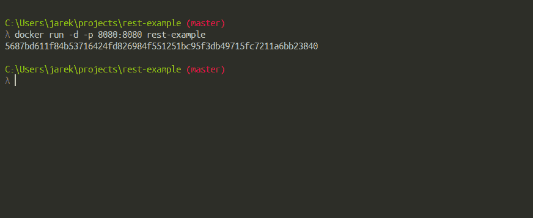
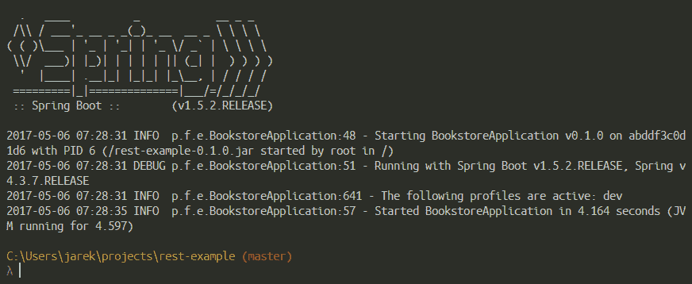
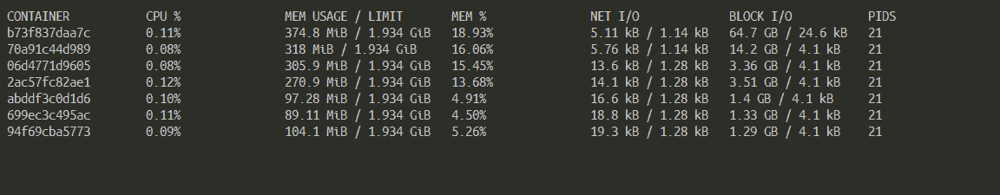
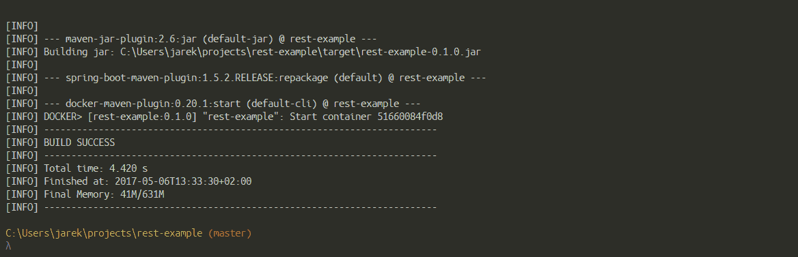

# 六、使用 Java 应用运行容器

在[第 5 章](05.html)、*用 Java 应用创建映像*中，我们了解了 Dockerfile 的结构以及如何构建映像。此时，您应该能够创建自己的 Docker 映像并开始使用它。实际上，我们确实运行了几次容器，但没有深入了解细节。我们使用 Dockerfile 手动构建映像，然后发出`docker build`命令。我们也一直在使用 Maven 来自动化构建过程。我们创建的映像包含我们简单的 REST Java 服务。我们已经运行了它，目的是检查它是否真的有效。然而，这一次，我们将从我们的映像中了解更多关于运行容器的细节。本章将包括以下概念:

*   启动和停止容器
*   容器运行模式
*   监控容器
*   容器重启策略
*   资源的运行时约束
*   使用 Maven 运行容器

# 启动和停止容器

让我们返回一点，从基础开始:如何从 shell 或命令行手动运行和停止 Docker 容器。

# 开始

正如您在前面章节中看到的，要从映像中旋转容器，我们使用`docker run`命令。运行中的容器将有自己的文件系统、网络堆栈和独立于主机的独立进程树。从[第 5 章](05.html)、*用 Java 应用创建映像*中，您会记得，每个单独的`docker run`命令都会创建一个新的容器，并执行 Dockerfile、`CMD`或`ENTRYPOINT`中指定的命令。

`docker run`命令的语法如下:

```
$ docker run [OPTIONS] IMAGE[:TAG|@DIGEST] [COMMAND] [ARG...]
```

该命令采用映像名称，可选`TAG`或`DIGEST`。如果您跳过`TAG`和`DIGEST`命令参数，Docker 将根据标记为`latest`的映像运行容器。`docker run`命令还采用了一组您可能会发现有用的可能选项，例如运行时模式、分离或前台、网络设置或对 CPU 和内存的运行时限制。我们将在本章后面讨论这些内容。当然，您可以执行`docker run`命令，除了映像名称之外，几乎没有任何参数。它将运行并采用映像中定义的默认选项。指定选项使您有机会覆盖映像作者指定的选项以及 Docker 引擎的运行时默认值。

`COMMAND`参数不是强制的，映像的作者可能已经使用`Dockerfile`中的`CMD`指令提供了默认的`COMMAND`。`CMD`在一个文件中只出现一次，通常是最后一条指令。从映像启动容器时，我们可以忽略`CMD`指令，只需提供我们自己的命令或参数作为`docker run`的`COMMAND`参数。出现在`docker run`命令中映像名称之后的任何内容都将被传递给容器，并被视为`CMD`参数。如果映像还指定了`ENTRYPOINT`，则`CMD`或`COMMAND`将作为参数追加到`ENTRYPOINT`中。但是你猜怎么着，我们也可以使用`docker run`命令的`--entrypoint`选项来覆盖`ENTRYPOINT`。

# 填料

要停止一个或多个正在运行的 Docker 容器，我们使用`docker stop`命令。语法很简单:

```
$ docker stop [OPTIONS] CONTAINER [CONTAINER...]  
```

您可以指定一个或多个要停止的容器。`docker stop`的唯一选项是`-t` ( `--time`)，它允许我们指定在停止容器之前等待的时间。10 秒是默认值，这应该足以让容器优雅地停止。要以更残酷的方式停止容器，可以执行以下命令:

```
$ docker kill  CONTAINER [CONTAINER...]  
```

`docker stop`和`docker kill`有什么区别？它们都将停止运行容器。但是有一个重要的区别:

*   `docker stop`:容器内的主进程首先会收到一个`SIGTERM`，经过一段宽限期后会收到一个`SIGKILL`
*   `docker kill`:容器内的主要过程将被发送`SIGKILL`(默认)或选项`--signal`指定的任何信号

换句话说，`docker stop`试图通过发送标准 POSIX 信号`SIGTERM`来触发正常关闭，而`docker kill`只是残忍地终止了进程，因此关闭了容器。

# 列出正在运行的容器

要列出正在运行的容器，只需执行`docker ps`命令:

```
$ docker ps  
```

要包含 Docker 主机上的所有容器，请包含`-a`选项:

```
$ docker ps -a  
```

您也可以使用`-f`选项指定过滤器来过滤列表。过滤器需要以`key=value`格式提供。当前可用的过滤器包括:

*   `id`:按容器 id 过滤
*   `label`:按标签过滤
*   `name`:按容器名称过滤
*   `exited`:根据容器的退出代码进行过滤
*   `status`:按状态过滤，可创建、重启、运行、删除、暂停、退出或停止
*   `volume`:指定卷名或装入点时，将包括装入指定卷的容器
*   `network`:当用网络 id 或名称指定时，将包括连接到指定网络的容器

考虑以下示例，该示例将获取 Docker 主机上存在的所有容器，并通过运行状态将其过滤掉:

```
$ docker ps -a -f status=running
```

# 移除容器

要从主机中移除容器，我们使用`docker rm`命令。语法如下:

```
$ docker rm [OPTIONS] CONTAINER [CONTAINER...]  
```

您可以一次指定一个或多个容器。如果您多次运行短期前台进程，这些文件系统的大小可能会快速增长。对此有一个解决方案:告诉 Docker 自动清理容器，并在容器退出时移除文件系统，而不是手动清理。您可以通过添加`--rm`标志来实现这一点，这样容器数据将在流程完成后自动移除。

`--rm` flag will make Docker remove container after it has been shut down.

例如，使用`run`命令，如下例所示:

```
$ docker run --rm -it Ubuntu /bin/bash  
```

前面的命令告诉 Docker，如果容器关闭，就移除它。

启动 Docker 容器时，您可以决定是在默认模式下运行容器，还是在前台或后台运行容器，即所谓的分离模式。让我们解释一下区别是什么。

# 容器运行模式

Docker 有两种容器运行模式，前台和分离。让我们从默认的前景模式开始。

# 前景

在前台模式下，您用来执行`docker run`的控制台将附加到标准输入、输出和错误流。这是默认值；Docker 会将`STDIN`、`STDOUT`和`STDERR`流连接到您的 shell 控制台。如果需要，您可以更改此行为，并使用`-a`开关执行`docker run`命令。作为`-a`开关的参数，您可以使用要附加到控制台的流的名称。例如:

```
$ docker run -a stdin -a stdout -i -t centos /bin/bash  
```

前面的命令将把`stdin`和`stdout`流连接到您的控制台。

有用的`docker run`选项是`-i`或`--interactive`(用于保持`STDIN`流打开，即使未连接)和`-t`或`-tty`(用于连接`pseudo-tty`)开关，通常一起用作`-it`，您需要使用它们为容器中运行的过程分配一个`pseudo-tty`控制台。实际上，当我们运行 REST 服务时，我们在[第 5 章](05.html)、*中使用了这个选项。*

```
$ docker run -it rest-example  
```

简单来说，`-it`是用来组合在容器启动后将命令行附加到容器上的。这样，您就可以在 shell 控制台中看到正在运行的容器中发生了什么，并在需要时与容器进行交互。

# 分离的

您可以使用`-d`选项在分离模式下启动 Docker 容器。它与前景模式相反。容器在后台启动和运行，与守护程序或服务相同。让我们尝试在后台运行我们的 rest 示例，执行以下命令:

```
$ docker run -d -p 8080:8080 rest-example  
```

容器启动后，您将获得一个控件，并且可以使用 shell 或命令行来执行其他命令。Docker 将只输出容器 ID，如下图所示:



您可以使用容器标识在其他 docker 命令中引用容器，例如，如果您需要停止容器或附加到它。我们的服务在后台仍然有效:Spring Boot 应用在端口`8080`上监听`HTTP` `GET`或`POST`请求。请注意，以分离模式启动的容器在用于运行容器的根进程退出时停止。理解这一点很重要，即使您有一些进程在后台运行(从 Dockerfile 中的指令开始)，如果启动容器的命令完成，Docker 也会停止容器。在我们的例子中，Spring Boot 应用正在运行和监听，同时防止 Docker 关闭容器。要将容器从后台放回控制台的前台，您需要连接到它。

# 连接到运行的容器

要保持对分离容器的控制，请使用`docker attach`命令。`docker attach`的语法很简单:

```
$ docker attach [OPTIONS] <container ID or name>  
```

在我们的例子中，这是容器启动时给我们的 ID:

```
$ docker attach 5687bd611f84b53716424fd826984f551251bc95f3db49715fc7211a6bb23840  
```

此时，如果有东西被打印出来，比如我们正在运行的 REST 服务的另一个日志行，您将在控制台上看到它。如您所见，如果您需要实时查看写入`stdout`流的内容，则`docker attach`命令可以派上用场。它将基本上*重新将*您的控制台连接到容器中运行的进程。换句话说，它会将`stdout`输入你的屏幕，并将`stdin`映射到你的键盘，让你输入命令并查看它们的输出。请注意，在连接容器的同时按下 *CTRL + C* 键盘顺序会杀死容器的运行过程，而不是从控制台上脱离。使用默认的 *CTRL+P* 和 *CTRL+Q* 键盘顺序来脱离进程。如果 *CTRL + P* 和 *CTRL + Q* 序列与您现有的键盘快捷键冲突，您可以通过为`docker attach`命令设置`--detach-keys`选项来提供自己的分离序列。如果您希望能够使用 *CTRL + C* 分离，您可以通过使用设置为`false`的`sig-proxy`参数告诉 Docker 不要将`sig-term`发送到容器中运行的进程:

```
$ docker attach --sig-proxy=false [container-name or ID]  
```

如果容器在后台运行，那么能够监控它的行为就好了。Docker 为此提供了一组特性。让我们看看如何监控正在运行的容器。

# 监控容器

有一些监视正在运行的 Docker 容器的方法。它可以查看日志文件，查看容器事件和统计信息，还可以检查容器属性。让我们从 Docker 拥有的强大日志功能开始。对日志条目的访问是至关重要的，尤其是当您的容器在分离运行时模式下运行时。让我们看看 Docker 在日志机制方面能提供什么。

# 查看日志

大多数应用将其日志条目输出到标准的`stdout`流。如果容器在前台模式下运行，您将在控制台中看到它。但是，在分离模式下运行容器时，您在控制台上只会看到容器标识。然而，Docker 引擎将运行容器的所有`stdout`输出收集到主机上的历史文件中。您可以使用`docker logs`命令显示。该命令的语法如下:

```
$ docker logs -f <container name or ID>  
```

`docker logs`命令将把日志的最后几行输出到控制台。由于容器仍在后台工作(在分离模式下)，您将立即得到回显提示，如您在下面的屏幕截图中所见，显示了我们 REST 服务的日志文件片段:



`-f`标志在 Linux `tail`命令中充当相同的标志，它会在控制台上持续显示新的日志条目。完成后，点击 *CTRL + C* 停止在控制台上显示日志文件。请注意，这不同于在连接到容器时点击 *CTRL + C* ，其中 *CTRL + C* 会终止容器内运行的进程。这一次，它将停止显示日志文件，并且是安全的。

日志文件是永久的，即使在容器停止后也是可用的，只要它的文件系统仍然存在于磁盘上(直到它被`docker rm`命令删除)。默认情况下，日志条目存储在位于`/var/lib/docker`目录的 JSON 文件中。您可以使用`docker inspect`命令并使用模板提取`LogPath`来查看日志文件的完整路径(稍后我们将介绍`inspect`和模板)。

我们已经说过，默认情况下，日志条目将转到 JSON 文件。但是这很容易改变，因为 Docker 利用了日志驱动程序的概念。通过使用不同的驱动程序，您可以为容器日志选择其他存储。默认的驱动是`json-file`驱动，它只是把条目写到 JSON 文件中。每个驱动程序都可以接受额外的参数。例如，JSON 驱动程序接受:

```
--log-opt max-size=[0-9+][k|m|g]
--log-opt max-file=[0-9+]  
```

正如您可能已经猜到的，它类似于我们的 Java 应用中的滚动文件。`max-size`指定可以创建的最大文件大小；达到指定大小后，Docker 将创建一个新文件。您可以使用大小后缀`k`、`m`或`g`，其中 k 代表千字节，`m`代表兆字节，`g`代表千兆字节。将日志拆分成单独的文件可以更容易地传输、存档等。此外，如果文件较小，搜索日志文件会方便得多。

The `docker log` command only displays log entries from the latest log file.

还有其他一些可用的日志驱动程序。该清单包括:

*   `none`:它将完全关闭日志记录
*   `syslog`:是 Docker 的`syslog`日志驱动。它会将日志信息写入系统`syslog`
*   `journald`:将消息记录到`journald`。`systemd-journald`是一个负责事件日志记录的守护程序，只附加二进制文件作为其日志文件
*   `splunk`:使用`Event Http`收集器向 Splunk 提供日志消息的写入。Splunk 可以用作企业级日志分析器。你可以在[https://www.splunk.com](https://www.splunk.com)了解更多
*   `gelf`:将日志条目写入 GELF 端点，如灰色日志或日志存储。Graylog 可在[https://www.graylog.org](https://www.graylog.org)获得，是一个开源日志管理，支持搜索、分析和提醒所有日志文件。你可以在[https://www.elastic.co/products/Logstash](https://www.elastic.co/products/logstash)找到 logstash，它是一个处理来自任何来源的任何数据(包括日志数据)的管道
*   `fluentd`:将日志消息写入`fluentd`。Fluentd 是一个用于统一日志记录层的开源数据收集器。Fluentd 的主要特点是，它通过在数据源和后端系统之间提供统一的日志记录层来分离数据源和后端系统。它体积小，速度快，并且有数百个插件，这是一个非常灵活的解决方案。你可以在[https://www.fluentd.org](https://www.fluentd.org)的网站上了解更多关于`fluentd`的信息
*   `gcplogs`:将日志条目发送到谷歌云日志
*   `awslogs`:这个驱动会把日志消息写入亚马逊 CloudWatch 日志。

正如您所看到的，Docker 的可插拔架构在运行容器时给了您几乎无限的灵活性。要切换到另一个日志驱动程序，使用`docker run`命令的`--log-driver`选项。例如，要在`syslog`中存储日志条目，请执行以下操作:

```
$ docker run --log-driver=syslog rest-example  
```

请注意，`docker logs`命令仅适用于`json-file`和`journald`驾驶员。要访问写入另一个日志引擎的日志，您需要使用与您选择的驱动程序相匹配的工具。使用专门的工具浏览日志条目通常会更方便；实际上，这通常是您选择另一个日志驱动程序的原因。例如，在 Logstash 或 Splunk 中搜索和浏览日志比在充满 JSON 条目的文本文件中挖掘要快得多。

查看日志条目是监视我们的应用在主机上的行为的便捷方式。有时，看到正在运行的容器的属性也很好，例如映射的网络端口或正在映射的卷等等。要显示容器属性，我们使用`docker inspect`命令，这非常有用。

# 检查容器

我们一直用来列出正在运行的容器的`docker ps`命令给了我们很多关于容器的信息，比如它们的 id、正常运行时间、映射的端口等等。要显示运行容器的更多细节，我们可以使用`docker inspect`。该命令的语法如下:

```
$ docker inspect [OPTIONS] CONTAINER|IMAGE|TASK [CONTAINER|IMAGE|TASK...]  
```

默认情况下，`docker inspect`命令将以 JSON 数组格式输出关于容器或映像的信息。因为有很多属性，所以可能不太可读。如果我们知道我们在寻找什么，我们可以提供一个模板来处理输出，使用`-f`(或`--format`)选项。模板使用来自 Go 语言的模板格式(顺便说一下，Docker 本身是用 Go 编写的)。`docker inspect`命令最简单也是最常用的模板只是一个简短的模板，用来准确提取您需要的信息，例如:

```
$ docker inspect -f '{{.State.ExitCode}}' jboss/wildfly  
```

由于`inspect`命令接受 Go 模板来形成容器或映像元数据的输出，因此该功能为您处理和转换结果提供了几乎无限的可能性。Go 模板引擎非常强大，因此，您可以使用模板引擎来进一步处理结果，而不是通过 grep 管道传输输出，这很快但很麻烦。

`--format`的参数只是一个模板，我们希望将其应用于容器的元数据。在这个模板中，我们可以使用条件语句、循环和其他 Go 语言功能。例如，下面将查找具有非零退出代码的所有容器的名称:

```
$ docker inspect -f '{{if ne 0.0 .State.ExitCode }}{{.Name}} {{.State.ExitCode}}{{ end }}' $(docker ps -aq)  
```

请注意，我们提供的是`$(docker ps -aq)`而不是容器 ID 或名称。因此，所有正在运行的容器的标识将被传送到`docker inspect`命令，这可能是一个非常方便的快捷方式。卷曲的括号`{{}}`表示围棋模板指令，除此之外的任何东西都会被直接打印出来。Go 模板中的点(`.`)表示上下文。大多数情况下，当前上下文将是元数据的整个数据结构，但它可以在需要时反弹，包括使用`with`动作。例如，这两个`inspect`命令将打印出完全相同的结果:

```
$ docker inspect -f '{{.State.ExitCode}}' wildfly

$ docker inspect -f '{{with .State}} {{.ExitCode}} {{end}}' wildfly  
```

如果你在绑定的上下文中，美元符号(`$`)总是会得到`root`上下文。我们可以执行以下命令:

```
$ docker inspect -f '{{with .State}} {{$.Name}} exited with {{.ExitCode}} exit code \ {{end}}' wildfly  
```

然后，它将输出:

```
/wildfly exited with 0 exit code.  
```

模板引擎支持逻辑功能，如`and`、`or`、`not`；它们将返回一个布尔结果。同时支持比较功能，如`eq`(等于)、`ne`(不等于)、`lt`(小于)、`le`(小于或等于)、`gt`(大于)和`ge`(大于或等于)。比较函数可以比较字符串、浮点或整数。与`if`等条件函数一起，当从`inspect`命令创建一些更复杂的输出时，所有这些都非常有用:

```
$ docker inspect -f '{{if eq .State.ExitCode 0.0}} \
Normal Exit \
{{else if eq .State.ExitCode 1.0}} \
Not a Normal Exit \
{{else}} \
Still Not a Normal Exit \
{{end}}' wildfly
```

有时`docker inspect`命令的巨大输出会相当混乱。由于输出是 JSON 格式的，`jq`工具可以用来获得输出的概述，并挑选出感兴趣的部分。

`jq`工具在[https://stedolan.github.io/jq/](https://stedolan.github.io/jq/)免费提供。这是一个轻量级且灵活的命令行 JSON 处理器，例如用于 JSON 数据的`sed`命令。例如，让我们从元数据中提取容器 IP 地址:

```
$ docker inspect <containerID> | jq -r '.[0].NetworkSettings.IPAddress'  
```

如您所见，`docker inspect`命令提供了关于 Docker 容器的有用信息。结合 Go 模板特性和可选的`jq`工具，它为您提供了一个获取容器信息的强大工具，并且可以在脚本中进一步使用。但是除了元数据，还有另一个有价值的信息来源。这是运行时统计数据，我们现在将重点关注它。

# 统计数字

要查看容器的 CPU、内存、磁盘 i/o 和网络 i/o 统计数据，请使用`docker stats`命令。该命令的语法如下:

```
docker stats [OPTIONS] [CONTAINER...]  
```

您可以通过指定由空格分隔的容器标识或名称列表，将统计度量限制为一个或多个特定的容器。默认情况下，如果没有指定容器，该命令将显示所有正在运行的容器的统计信息，如下图所示:



`docker stats`命令接受选项，包括:

*   `--no-stream`:这将禁用流统计，并且只提取第一个结果
*   `-a` ( `--all`):这将显示所有(不仅仅是运行中的)容器的统计数据

统计数据可以用来查看我们的容器在运行时是否表现良好。这些信息有助于检查我们是否需要对要应用于容器的资源进行一些约束，我们将在本章稍后介绍运行时约束。

查看日志、容器元数据和运行时统计数据，在监控运行中的容器时，为您提供了几乎无限的可能性。除此之外，我们还可以看到您的 docker 主机在全球范围内发生了什么。当主机上的 docker 引擎收到命令时，它会发出一个我们可以观察到的事件。现在我们来看看这个机制。

# 容器事件

为了实时观察进入 docker 引擎的事件，我们使用`docker events`命令。如果容器已经启动、停止、暂停等等，事件将被发布。如果您想知道在容器运行时发生了什么，这将非常有用。这是一个强大的监控功能。Docker 容器报告了一个巨大的事件列表，您可以使用`docker events`命令列出这些事件。该清单包括:

```
attach, commit, copy, create, destroy, detach, die, exec_create, exec_detach, exec_start, export, health_status, kill, oom, pause, rename, resize, restart, start, stop, top, unpause, update 
```

`docker events`命令可以带`-f`开关，如果你在寻找特定的东西，它会过滤输出。如果未提供过滤器，将报告所有事件。目前，可能的过滤器列表包括:

*   容器(`container=<name or id>`)
*   事件(`event=<event action>`)
*   映像(`image=<tag or id>`)
*   插件(实验性)(`plugin=<name or id>`)
*   标签(“T0”)
*   类型(`type=<container or image or volume or network or daemon>`)
*   卷(`volume=<name or id>`)
*   网络(`network=<name or id>)`
*   守护进程(`daemon=<name or id>`)

看看下面的例子。`docker events`命令已经在一个控制台窗口中运行，而`docker run rest-example`已经在单独的控制台中发出。从下面的截图中可以看到，`docker events`将为我们的 rest 示例容器报告创建、附加、连接和启动事件:


因此，您将获得时间戳和事件名称，以及导致事件的容器的标识。`docker events`命令可以采用额外的选项，例如`--since`和`--until`，它们可以用来指定您想要从中获取事件的时间范围。监视容器事件是查看 docker 主机上发生了什么的一个很好的工具。然而，还有更多。例如，您还可以影响容器在崩溃时的行为。我们为此使用容器重启策略。

# 重启策略

通过使用带有`docker run`命令的`--restart`选项，您可以指定重启策略。这告诉 Docker 当容器关闭时如何反应。然后可以重新启动容器，以最大限度地减少停机时间，例如，如果在生产服务器上运行。然而，在解释 Docker 重启策略之前，让我们先关注一下退出代码。退出代码是至关重要的信息，它告诉容器为什么不能运行或者为什么退出。有时它与您将作为参数给`docker run`的包含命令有关。当`docker run`命令以非零代码结束时，退出代码遵循`chroot`标准，如下图所示:

*   退出代码`125`:`docker run`命令自行失败
*   退出代码`126`:无法调用提供的命令
*   退出代码`127`:找不到提供的命令
*   其他非零应用相关退出代码

大家可能还记得，在前面的章节中，我们已经使用`docker ps`命令列出了正在运行的容器。为了列出未运行的容器，我们可以为`docker ps`命令添加`-a`开关。当容器完成时，退出代码可以在状态列中`docker ps -a`命令的输出中找到。通过在启动容器时指定重启策略，可以自动重启崩溃的容器。通过`docker run`命令的-restart 开关来指定所需的重启策略，如示例所示:

```
$ docker run --restart=always rest-example  
```

目前，Docker 有四种重启策略。让我们现在一个一个地了解他们，从最简单的开始:`no`。

# 不

`no`策略是默认的重启策略，在任何情况下都不会重启容器。实际上，您不必指定此策略，因为这是默认行为。除非您有一些可配置的设置来运行 Docker 容器，否则`no`策略可以用作关闭开关。

# 总是

如果无论命令有什么退出代码，我们都希望容器重新启动，我们可以使用`always`重新启动策略。基本上，它说到做到；Docker 会在每种情况下重启容器。重启策略将始终重启容器。这是真的，即使容器在重新启动之前已经停止。每当 Docker 服务重新启动时，使用总是策略的容器也将重新启动，无论它们是否正在执行。

With the `always` restart policy, the Docker daemon will try to restart the container **indefinitely.**

# 接通故障

这是一种特殊的重启策略，可能是最常用的。通过使用`on-failure`重启策略，您可以指示 Docker 在容器以非零退出状态退出时重启容器，否则不重启。这就是我们开始用退出代码解释重启策略的原因。您可以选择为 Docker 提供尝试重新启动容器的次数。这个重启策略的语法也有点不同，因为使用这个策略，您还可以指定 Docker 自动重启容器的最大尝试次数。

考虑这个例子:

```
$ docker run --restart=on-failure:5 rest-example  
```

前面的命令将使用我们的 REST 服务运行容器，并在失败的情况下尝试重启五次，然后放弃。`on-failures`重启策略的主要好处是，当一个应用以成功的退出代码退出时(这意味着应用中没有错误；它刚执行完)，容器就不会重新启动。容器的重启次数可以通过我们已经知道的`docker inspect`命令获得。例如，要获取具有特定标识或名称的容器的重新启动次数:

```
$ docker inspect -f "{{ .RestartCount }}" <ContainerID>  
```

您还可以发现容器上次再次启动的时间:

```
$ docker inspect -f "{{ .State.StartedAt }}" <ContainerID>  
```

您应该知道 Docker 在重启容器之间使用延迟，以防止类似洪水的保护。这是一个不断增加的延迟；它从 100 毫秒的值开始，然后 Docker 会将之前的延迟增加一倍。实际上，守护程序将等待 100 毫秒，然后是 200 毫秒、400、800 毫秒，以此类推，直到达到`on-failure`限制，或者当您使用`docker stop,`停止容器，或者通过执行`docker rm -f`命令来执行强制移除。

If a container is successfully restarted, the delay is reset to the default value of 100 milliseconds.

# 除非-停止

同样，与`always`类似，如果我们希望不管退出代码如何都重新启动容器，我们可以使用`unless-stopped`。`unless-stopped`重启策略的行为与`always`相同，但有一个例外，无论退出状态如何，它都将重启容器，但如果容器之前已被置于停止状态，则不要在守护程序启动时启动它。这意味着，使用`unless-stopped`重启策略，如果容器在重启前正在运行，一旦系统重启，容器就会重启。当 Docker 容器中的应用退出时，该容器也将暂停。如果在容器中运行的应用崩溃，容器将停止，并且该容器将保持停止状态，直到有人或某物重新启动它。

在对容器应用重启策略之前，最好先考虑容器将用于做什么样的工作。这也取决于将在容器上运行的软件类型。例如，数据库可能应该应用`always`或`unless-stopped`策略。如果您的容器应用了一些重启策略，当您使用`docker ps`命令列出您的容器时，它将显示为`Restarting`或`Up`状态。

# 更新正在运行的容器上的重启策略

有时，需要在容器已经启动后更新 Docker 运行时参数，*在运行中*。例如，如果您想防止容器消耗 Docker 主机上的太多资源。要在运行时设置策略，我们可以使用`docker update`命令。除了其他运行时参数(例如内存或中央处理器限制，我们将在本章后面讨论)，命令`docker update`为您提供了在运行的容器上更新重启策略的选项。语法非常简单，您只需要提供您希望容器拥有的新重启策略以及容器的 ID 或名称:

```
$ docker update --restart=always <CONTAINER_ID or NAME>  
```

在容器上运行`docker update`命令后，新的重启策略将立即生效。另一方面，如果您在停止的容器上执行`update`命令，该策略将在您稍后启动容器时使用。可能的选项与启动容器时可以指定的选项完全相同:

*   `no`(默认)
*   `always`
*   `on-failure`
*   `unless-stopped`

If you have more than one container running on the Docker host, and want to specify a new restart policy on all of them at once, just provide all of their IDs or names, separated by a space.

您还可以看到使用`docker events`命令应用了哪个重启策略，您在上一节已经知道了。可用于观察容器已报告的运行时事件历史的`docker events`也将报告`docker update`事件，为您提供已更改内容的详细信息。如果容器已经应用了重启策略，事件将被发布。如果您想检查正在运行的容器的重启策略，请使用带有容器标识的`docker inspect`或带有为值路径设置的`--format`参数的名称:

```
$ docker inspect --format '{{ .HostConfig.RestartPolicy.Name }}' <ContainerID>  
```

如果您的映像是自包含的，并且不需要执行更复杂的编排任务，那么在逐个容器的基础上设置重启策略的能力非常好。重启策略不是运行容器时唯一可以更改的参数。

# 资源的运行时约束

在运行时限制 Docker 容器对资源的使用可能会很有用。Docker 为您提供了许多设置内存、CPU 使用或磁盘访问使用限制的可能性。让我们从设置内存限制开始。

# 记忆

值得了解的是，默认情况下，也就是说，如果您使用没有任何约束的默认设置，运行的容器可以使用所有的主机内存。要改变这种行为，我们可以使用`docker run`命令的`--memory`(或简称为`-m`)开关。它采用通常的后缀`k`、`m`或`g`，分别代表千字节、兆字节和千兆字节。

设置了内存约束的`docker run`命令的语法如下:

```
$ docker run -it -m 512m ubuntu  
```

前面的命令将执行 Ubuntu 映像，其最大内存可由半个千兆字节的容器使用。

If you do not set the limit on memory that the container can allocate, this can lead to random issues where a single container can easily make the whole host system unstable and/or unusable. So it's a wise decision to always use the memory constraints on the container.

除了用户内存限制，还有内存预留和内核内存限制。让我们解释一下什么是内存预留限制。在正常工作条件下，正在运行的容器可以，并且很可能会，使用所需的内存，直到您使用`docker run`命令的`--memory` ( `-m`)开关设置的限制。当应用内存预留时，Docker 将检测到内存不足的情况，并将尝试强制容器将其消耗限制在预留限制内。如果不设置内存预留限制，将与`-m`开关设置的硬内存限制完全相同。

内存预留不是一个硬限制特性。不能保证不会超过限额。内存预留功能将尝试确保根据预留设置分配内存。

考虑以下示例:

```
$ docker run -it -m 1G --memory-reservation 500M ubuntu /bin/bash  
```

前面的命令将硬内存限制设置为`1g`，然后将内存预留设置为半千兆。设置了这些约束后，当容器消耗的内存大于`500M`且小于`1G`时，Docker 会尝试将容器内存缩小到小于`500M`。

在下一个示例中，我们将在不设置硬内存限制的情况下设置内存预留:

```
$ docker run -it --memory-reservation 1G ubuntu /bin/bash  
```

在前面的例子中，当容器启动时，它可以使用它的进程所需要的内存。`--memory-reservation`开关设置将防止容器长时间消耗太多内存，因为每次内存回收都会将容器的内存使用量缩小到预留中指定的大小。

内核内存与用户内存完全不同，主要区别是内核内存不能换出到磁盘。它包括栈页、板页、套接字内存压力和 TCP 内存压力。您可以使用- kernel-memory 开关设置内核内存限制来约束这些类型的内存。与设置用户内存限制一样，只需为千字节、兆字节或千兆字节分别提供一个带有后缀的数字，如`k`、`b`和`g,`，尽管以千字节为单位设置可能是非常罕见的情况。

例如，每个进程都会吃掉一些堆栈页。通过限制内核内存，您可以防止在内核内存使用率过高时启动新进程。此外，由于主机无法将内核内存交换到磁盘，因此容器会通过消耗过多的内核内存来阻塞整个主机服务。

设置内核内存限制很简单。我们可以单独设置`--kernel-memory`，不用`-m`限制总内存，如下例:

```
$ docker run -it --kernel-memory 100M ubuntu  /bin/bash  
```

在前面的例子中，容器中的进程可以按需取内存，但只能消耗`100M`的内核内存。我们还可以设置硬内存限制，如以下命令所示:

```
$ docker run -it -m 1G --kernel-memory 100M ubuntu /bin/bash  
```

在前面的命令中，我们设置了内存和内核内存，所以容器中的进程总共可以使用`1G`内存，而这个`1G`将包括内核内存的`100M`。

另一个与内存相关的约束是 swappines 约束，它在运行容器时非常有用。我们通过使用`--memory-swappiness`开关到`docker run`命令来应用约束。当您想要避免与内存交换相关的性能下降时，这可能会很有帮助。`--memory-swappiness`开关的参数是可以换出的匿名内存页面的百分比，因此它从`0`到`100`取值。将该值设置为零，将根据您的内核版本，禁用交换或使用最小交换。相比之下，`100`值将所有匿名页面设置为换出的候选页面。例如:

```
$ docker run -it --memory-swappiness=0 ubuntu /bin/bash  
```

在前面的命令中，我们将交换完全转向我们的`ubuntu`容器。

除了设置内存使用限制之外，您还可以指示 Docker 如何将处理器能力分配给它将要运行的容器。

# 处理器

通过使用`docker run`命令开关的`-c`(或等效的`--cpu-shares`)，可以指定容器可以分配的 CPU 份额值。默认情况下，每个新容器都有 1024 个 CPU 份额，并且所有容器都获得相同部分的 CPU 周期。可以通过相对于所有其他正在运行的容器的权重来移动容器的 CPU 份额权重来改变该百分比。但是请注意，您无法设置容器可以使用的精确处理器速度。这是一个**相对权重**，与真实处理器速度无关。事实上，没有办法准确地说一个容器应该有权只使用主机处理器的 2 GHz。

CPU share is just a number, it's not related at all to the CPU speed.

如果我们启动两个容器，并且两个容器都将使用 100%的 CPU，那么处理器时间将在两个容器之间平均分配。原因是两个容器将具有相同数量的处理器份额。但是如果您将一个容器的处理器份额限制为 512，它将只获得一半的 CPU 时间。这并不意味着它只能使用一半的 CPU 该比例仅在 CPU 密集型进程运行时适用。如果另一个容器(与`1024`共享)空闲，我们的容器将被允许使用 100%的处理器时间。根据系统上运行的容器数量，实际的 CPU 时间会有所不同。用具体的例子更容易理解。

考虑三个容器，一个(姑且称之为`Container1`)为`1024`设置`--cpu-shares`，另外两个(`Container2`和`Container3`)为`512`设置`--cpu-shares`。当所有三个容器中的进程试图使用所有的 CPU 功率时，`Container1`将获得总 CPU 时间的 50%，因为与其他运行容器的总和相比，(`Container2`和`Container3`)它拥有允许的 CPU 使用量的一半。如果我们添加第四个容器(`Container4`)的`--cpu-share`为 1024，我们的第一个`Container1`将只能获得 33%的 CPU，因为相对来说，它现在分配了总 CPU 功率的三分之一。`Container2`将获得 16.5%，`Container3`也是 16.5%，最后一个，`Container4`同样，将被允许使用 33%的 CPU。

虽然`docker run`命令的`-c`或`--cpu_shares`标志相对于所有其他运行容器的权重修改了容器的 CPU 份额权重，但它并不限制容器从主机使用 CPU。但是还有另一个标志来限制容器的 CPU 使用:`--cpu-quota`。其默认值为`100000`，表示允许 100%的 CPU 使用。我们可以使用`--cpu-quota`来限制 CPU 的使用，例如:

```
$ docker run -it  --cpu-quota=50000 ubuntu /bin/bash  
```

在前面的命令中，容器的限制是 CPU 资源的 50%。`--cpu-quota`通常与`docker run`的`--cpu-period`旗一起使用。这是 CPU CFS(完全公平调度程序)周期的设置。默认周期值为 100000，即 100 毫秒。看一下这个例子:

```
$ docker run -it --cpu-quota=25000 --cpu-period=50000  ubuntu /bin/bash  
```

这意味着容器每 50 ms 可以获得 50%的 CPU 使用率。

限制 CPU 份额和使用并不是我们可以在容器上设置的唯一与处理器相关的约束。我们还可以将容器的进程分配给特定的处理器或处理器内核。当我们想要这样做时，`docker run`命令的`--cpuset`开关就派上了用场。考虑以下示例:

```
$ docker run -it --cpuset 4 ubuntu  
```

前面的命令将运行`ubuntu`映像，并允许容器使用所有四个处理器内核。要启动容器并只允许使用一个处理器内核，您可以将`--cpuset`值更改为`1`:

```
$ docker run -it --cpuset 1 ubuntu  
```

You can of course mix the option `--cpuset` with `--cpu_shares` to tweak you container's CPU constraints.

# 更新运行容器上的约束

与重启策略一样，约束也可以在容器已经运行时更新。如果您看到容器占用了太多 Docker 主机系统资源，并且想要限制这种使用，这可能会有所帮助。同样，我们使用`docker update`命令来实现这一点。

与重启策略一样，`docker update`命令的语法与启动容器时相同，您指定所需的约束作为 docker update 命令的参数，然后给出容器 ID(例如取自`docker ps`命令输出)或其名称。同样，如果您想一次更改多个容器的约束，只需提供它们的 id 或名称，用空格隔开即可。让我们看一些如何在运行时更新约束的例子:

```
$ docker update --cpu-shares 512 abbdef1231677  
```

前面的命令将把中央处理器份额限制为 512。当然，您可以同时对多个容器应用 CPU 和内存限制:

```
docker update --cpu-shares 512 -m 500M abbdef1231677 dabdff1231678  
```

前面的命令将更新两个容器的 CPU 份额和内存限制，由`abbdef1231677`和`dabdff1231678`标识。

当然，在更新运行时约束时，您也可以在一个命令中应用所需的重启策略，如下例所示:

```
$ docker update --restart=always -m 300M aabef1234716 
```

如您所见，在运行 Docker 容器时，设置约束的能力为您提供了很大的灵活性。但值得注意的是，应用约束并不总是可能的。原因是约束设置特性在很大程度上依赖于 Docker 主机的内部，尤其是它的内核。例如，设置内核内存限制或`memory swappiness`并不总是可能的，例如，有时您得到的只是`Your kernel does not support kernel memory limit or kernel does not support memory swappiness capabilities`消息。有时这些限制是可配置的，有时不是。例如，如果你得到了`WARNING: Your kernel does not support cgroup swap limit on Ubuntu`，你可以用 Grub 配置文件中的`cgroup_enable=memory swapaccount=1`设置来调整你的 Grub 引导加载程序，例如，这将是 Ubuntu 中的`/etc/default/grub`。阅读 Docker 打印出来的日志很重要，以确保您的约束到位。

Always take note of the warnings Docker outputs during the container startup or after updating your constraints on the fly, it may happen that your constraints will not take action!

我们已经知道如何使用命令行中可用的命令来运行和观察容器。但是，如果您需要在开发流程中加速容器，例如集成测试，就不太方便了。我们在[第 5 章](05.html)*中使用的 Fabric8 Docker Maven 插件通过 Java 应用*创建映像来构建映像，如果我们需要运行容器的话，这个插件也会派上用场。现在就开始吧。

# 和马文一起跑步

该插件提供了两个与启动和停止容器相关的 Maven 目标。这将是`docker:start`和`docker:stop`。容器由`docker:start`创建和启动，由`docker:stop`停止和销毁。如果您需要在集成测试期间运行容器，典型的用例将包括 Maven 构建阶段的那些目标:`docker:start`将绑定到`pre-integration-test`和`docker:stop`到`post-integration-test`阶段。

# 插件配置

该插件使用来自`pom.xml`文件中`<configuration>`的`<run>`子元素的配置。最重要的配置元素列表如下:

| `cmd` | 应该在容器启动结束时执行的命令。如果没有给出，则使用映像的默认命令。 |
| `entrypoint` | 容器的入口点。 |
| `log` | 是否以及如何打印来自正在运行的容器的日志消息的日志配置。这也可以配置要使用的日志驱动程序。 |
| `memory` | 以字节为单位的内存限制 |
| n `amingStrategy` | 如何创建容器名称的命名策略:

*   `none`:使用 Docker 随机分配的名称(默认)
*   `alias `:使用镜像配置中指定的别名。如果具有此名称的容器已经存在，则会引发错误。

 |
| `network` | `<network>`元素可用于配置容器的网络模式。它知道以下子元素:

*   `<mode>`:网络模式，可以是以下值之一:
    *   `bridge`:带默认 Docker 桥的桥接模式(默认)
    *   `host`:共享 Docker 主机网络接口
    *   `container`:连接到指定容器的网络

容器的名称取自`<name>`元素:

*   `custom`:使用自定义网络，该网络必须在使用 Docker 网络创建之前创建
*   `none`:不设置网络

 |
| `ports` | `<ports>`配置包含端口映射列表。每个映射都有多个部分，每个部分由一个冒号分隔。当使用带有选项`-p`的`docker run`命令时，这相当于端口映射。一个示例条目可能如下所示:

```
<ports>   
<port>8080:8080</port>   
</ports>   
```

 |
| `restartPolicy` | 提供了我们在本章前面讨论过的重启策略。示例条目可能如下所示:

```
<restartPolicy>   
<name> on-failure</name>   
<retry>5</retry>   
</restartPolicy>   
```

 |
| `volumes` | 用于绑定到主机目录和其他容器的卷配置。示例配置可能如下所示:

```
<volumes>   
<bind>   
<volume>/logs</volume><volume>/opt/host_export:/opt/container_import</volume> </bind>   
</volumes>   
```

 |

我们的 Java REST 服务的完整的`<configuration>`元素可以如下所示。这是一个非常基本的例子，我们只在这里配置运行时端口映射:

```
<configuration> 
<images> 
<image> 
<name>rest-example:${project.version}</name> 
<alias>rest-example</alias> 
<build> 
<from>openjdk:latest</from> 
<assembly> 
<descriptorRef>artifact</descriptorRef> 
</assembly> 
<cmd>java -jar maven/${project.name}-${project.version}.jar</cmd> 
</build> 
<run> 
<ports> 
<port>8080:8080</port> 
</ports> 
</run> 
</image> 
</images> 
</configuration> 
```

配置好容器后，让我们尝试使用 Maven 运行它。

# 启动和停止容器

要启动容器，请执行以下操作:

```
$ mvn clean package docker:start  
```

Maven 将从源代码构建我们的 REST 服务，构建映像并在后台启动容器。作为输出，我们将获得容器的 ID，如您在下面的截图中所见:



容器现在正在后台运行。为了测试它是否正在运行，我们可以发出`docker ps`来列出所有正在运行的容器，或者通过在映射的`8080`端口上执行一些`HTTP`方法来调用服务，例如`GET`或`POST`。端口已经暴露在`<build>`配置元素中，并暴露在`<run>`配置元素中。这很方便，不是吗？但是，如果我们希望看到容器的输出，而不是在后台运行它呢？那也很容易；让我们首先通过发出以下命令来停止它:

```
$ mvn docker:stop  
```

10 秒钟后(您会记得，这是停止容器之前的默认超时时间)，Maven 将输出一条声明，表明容器已经停止:

```
[INFO] DOCKER> [rest-example:0.1.0] "rest-example": Stop and removed container 51660084f0d8 after 0 ms  
```

让我们再次运行容器，这次使用 Maven `docker:run`目标而不是`docker:start`。执行以下操作:

```
$ mvn clean package docker:run  
```

这一次，Maven Docker 插件将运行容器，我们将在控制台上看到 Spring Boot 横幅，如您在下面的截图中所见:


我猜你现在可以辨别`docker:start`和`docker:run`的区别了。正确，`docker:run`相当于`docker run`命令的选项`-i`。`docker:run`也会自动开启`showLogs`选项，这样你就可以看到容器内发生的事情。或者，您可以提供`docker.follow`作为系统属性，这样`docker:start`将永远不会返回，而是阻塞，直到按下 *CTRL + C* ，与您执行`docker:run` Maven 目标时完全相同。

如您所见，Fabric8 Docker Maven 插件为您提供了与从外壳或命令行运行和停止容器时相同的控制。但是 Maven 构建过程本身的优势来了:您可以自动化事情。Docker 容器现在可以在构建、集成测试和您可能拥有的持续交付流程中使用；你说吧。

# 摘要

在本章中，我们学习了如何管理容器的寿命，使用不同的运行模式(前台和分离)启动它，停止或移除它。我们还知道如何创建约束，通过使用运行时约束来限制中央处理器和内存的使用，从而使容器按照我们希望的方式运行。让我们的容器运行，我们现在能够以多种方式检查容器的行为，它将读取日志输出，查看事件或浏览统计数据。如果您正在使用 Maven，并且您可能是 Java 开发人员，那么您现在可以配置 Docker Maven 插件来自动启动或停止容器。

我们已经了解了很多关于 Docker 的知识，我们可以构建和运行映像。是时候更进一步了。我们将使用 Kubernetes 自动化容器化应用的部署、扩展和管理。这是真正的乐趣开始的时刻。