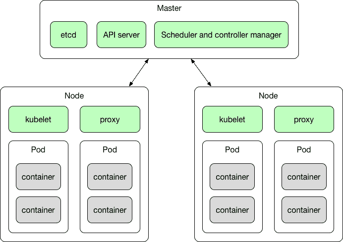

# 忽必烈的概论

在阅读了[第 6 章](06.html)、*用 Java 应用程序运行容器*之后，您现在已经对使用 Docker 打包您的 Java 应用程序有了很多了解。现在是时候更进一步，专注于我们缺少的东西——容器管理和编排。市场上有一些合适的工具，例如 Nomad、Docker Swarm、Apache Mesos 或 AZK。在这一章中，我们将集中讨论可能最受欢迎的一个，Kubernetes。Kubernetes(有时也称为 k8s)是一个面向 Docker 容器的开源编排系统，由 Google 在 2015 年创建。谷歌开发的第一个统一集装箱管理系统是内部称为博格的系统；库本内斯是它的后代。本章涵盖的主题列表为:

*   为什么以及什么时候我们需要集装箱管理
*   《忽必烈的概论》
*   基本立方结构概念

让我们从回答这个问题开始，为什么我们甚至需要 Kubernetes？我们将研究容器管理和编排背后的原因。

# 为什么我们需要 Kubernetes？

正如您已经知道的，Docker 容器为运行打包成小型独立软件的 Java 服务提供了极大的灵活性。Docker 容器使应用程序的组件可移植——您可以跨不同的环境移动单个服务，而无需担心依赖关系或底层操作系统。只要操作系统能够运行 Docker 引擎，您的 Java 容器就可以在这个系统上运行。

此外，正如您从[第 1 章](01.html)*对 Docker* 的介绍中所记得的，Docker 隔离容器的概念与传统的虚拟化相去甚远。不同之处在于 Docker 容器利用了主机操作系统的资源——它们轻便、快速且易于启动。一切都很好，但也有一些风险。您的应用程序由多个独立的微服务组成。服务的数量可能会随着时间的推移而增长。此外，如果您的应用程序开始经历更高的负载，增加具有相同服务的容器的数量会很好，只是为了分配负载。这并不意味着你只需要使用你自己的服务器基础设施——你的容器可以上云。今天我们有很多云提供商，比如谷歌或亚马逊。通过有可能在云中运行您的容器，它给了您很多优势。首先，您不需要管理自己的服务器。其次，在大多数云中，您只为真正的使用付费。如果负载达到峰值，云服务的成本当然会增加，因为您将使用更多的计算能力。但是如果没有负荷，你就什么都不会付出。这说起来容易，但是监控您的服务器使用情况，尤其是在一个或多个应用程序运行大量组件的情况下，可能会很棘手。你需要仔细查看云公司的账单，确保你没有一个容器坐在云上旋转而无所事事。如果特定服务对您的应用程序不那么重要，并且不需要快速响应，您可以将其转移到最便宜的机器上。另一方面，如果另一个服务经历了更高的负载并且很关键，您将希望将其移动到一个更强大的机器上，或者启动更多的实例。最重要的是，通过使用 Kubernetes，它可以实现自动化。通过拥有管理 Docker 容器的正确工具，这可以在运行中完成。您的应用程序可以以非常敏捷的方式自我调整——最终用户可能甚至不知道他们正在使用的应用程序驻留在哪里。集装箱管理和监控软件可以通过更好地利用您支付的硬件来大大降低硬件成本。Kubernetes 处理计算集群中节点的调度，并主动管理工作负载，以确保它们的状态与用户声明的意图相匹配。使用标签和 Pods 的概念(我们将在本章后面介绍)，Kubernetes 将组成应用程序的容器分组到逻辑单元中，以便于管理和发现。

让您的应用程序以一组容器的形式在托管环境中运行也改变了软件开发的视角。您可以开发一个新版本的服务，当它准备好的时候，您可以动态地进行滚动更新。这也意味着将重点放在应用程序运行的机器上，因此，允许开发团队以更灵活、更小和模块化的方式进行操作。它允许软件开发真正敏捷，这是我们一直想要的。微服务规模小且独立，构建和部署时间大大缩短。此外，发布的风险更小，因此您可以更频繁地发布更小的更改，最大限度地降低了一次发布所有内容可能发生的巨大失败的可能性。

在开始介绍基本的 Kubernetes 概念之前，让我们总结一下 Kubernetes 给我们的列表:

*   快速、可预测地部署应用程序
*   动态缩放
*   无缝发布新功能
*   防故障
*   将硬件使用仅限于所需的资源
*   敏捷应用程序开发
*   操作系统、主机和云提供商之间的可移植性

这是一个不能轻易击败的特征列表。为了理解这是如何实现的，我们需要理解 Kubernetes 的核心概念。到目前为止，我们只知道一个来自 Docker 的概念——容器——它是一个可移植的、独立的软件单元。容器可以包含我们想要的任何东西，无论是数据库还是 Java REST 微服务。让我们了解剩下的部分。

# 基本立方结构概念

集群是一组节点；它们可以是安装了 Kubernetes 平台的物理服务器或虚拟机。下图显示了基本的 Kubernetes 体系结构:



如您所见，Kubernetes 集群由一个主节点和多个工作节点组成，其中包含一些组件。虽然乍一看它可能看起来很可怕和复杂，但如果我们从 Pod 开始逐一描述概念，就会更容易理解。

# 分离舱

Pod 由一个或多个 Docker 容器组成。这是 Kubernetes 平台的基本单元，也是 Kubernetes 工作的基本执行部分。吊舱的示意图如下所示:


在同一个 Pod 中运行的容器共享相同的公共网络命名空间、磁盘和安全上下文。事实上，建议在同一 Pod 上运行的容器之间通过 localhost 进行通信。每个容器还可以与集群中的任何其他 Pod 或服务进行通信。

正如您从[第 2 章](02.html)、*网络和持久存储*中所记得的，您可以在 Docker 容器中装载卷。Kubernetes 也支持卷的概念。连接到容器的卷可以安装在该容器上运行的一个或多个容器内。Kubernetes 支持许多不同的卷类型，作为挂载 GitHub 存储库、网络磁盘、本地硬盘等的本机支持。

如果您的应用程序需要分布式存储并且需要处理大量数据，那么您不仅仅局限于本地硬盘。Kubernetes 还支持批量提供商。目前，可用的持久卷提供程序列表包括:

*   **GCE** :哪个是谷歌云平台
*   **AWS** :亚马逊网络服务
*   **GlusterFS** :可扩展的网络文件系统。使用免费的开源软件 GlusterFS，您可以使用现有的存储硬件来创建大型分布式存储解决方案
*   **OpenStack child**:面向 OpenStack Nova 计算平台用户的块存储服务
*   **CephRBD** :一个**可靠的自主分布式对象存储** ( **RADOS** )，它在单个统一存储集群中为您的应用程序提供对象、数据块和文件系统存储
*   QuoByte
*   立方体-阿里云

网络命名空间和卷不是 Pod 的唯一属性。正如您在 Pod 的图表上看到的，Pod 可以附加标签和注释。标签在 Kubernetes 中非常重要。它们是附加到对象的键/值对，在本例中是附加到 Pods。标签背后的想法是，它们可以用来识别对象——标签对用户来说是有意义和相关的。标签的一个例子可以是:

```
app=my-rest-service 
layer=backend  
```

稍后，我们将使用标签选择器来选择具有指定标签的对象(如 Pods)。通过标签选择器(Kubernetes 中的核心分组原语)，客户端或用户可以识别一个对象或一组对象。选择器类似于标签，也是使用匹配标签标识资源的键值表达式。例如，选择器表达式`app = my-rest-service`将选择所有带有标签`app = my-rest-service`的豆荚。另一方面，注释是一种可以附加到 Pods 的元数据。它们不是用来识别属性的；它们是可以被库工具读取的属性。注释应该包含什么没有规则，这取决于你。注释可以包含诸如构建或发布版本、时间戳、Git 分支名称、Git `pull`请求号等信息，或者任何其他信息，如手机号码。

标签旨在识别有关库本内特对象(如 Pods)的信息。注释只是附加到对象的元数据。

我们之前说过，Pod 是 Kubernetes 中的一个基本执行单元。它可以包含多个容器。一个真实的例子是一个带有多个 Docker 容器的 Pod，它可以是我们的 Java REST 微服务 Pod。出于前面几章的示例目的，我们的微服务一直将其数据库数据存储在内存中。在现实生活中，数据可能应该进入真实的数据库。我们的 Pod 可能有一个包含 Java JRE 和 Spring Boot 应用程序本身的容器，以及第二个包含 PostgreSQL 数据库的容器，微服务使用该数据库来存储其数据。其中两个容器组成了一个 Pod——一个独立的、解耦的执行单元，包含我们的 REST 服务需要操作的所有内容。

Pod 的定义是一个名为`Pod`清单的 JSON 或 YAML 文件。看一个简单的例子，有一个容器:

```
apiVersion: v1
kind: Pod
metadata:
 name: rest_service
spec:
 containers:
 name: rest_service
 image: rest_service
 ports:
 - containerPort: 8080
```

JSON 文件中相同的`pod`清单看起来如下:

```
{
 "apiVersion": "v1", 
 "kind": "Pod",
 "metadata":{
 "name": ”rest_service”,
 "labels": {
 "name": "rest_service"
 }
 },
 "spec": {
 "containers": [{
 "name": "rest_service",
 "image": "rest_service",
 "ports": [{"containerPort": 8080}],
 }]
 }
}
```

容器的`image`是 Docker 图像名称。`containerPort`从 REST 服务容器中公开该端口，这样我们就可以在 Pod 的 IP 上连接到服务。默认情况下，正如您从[第 1 章](01.html)*到 Docker* 的介绍中所记得的那样，`image`中定义的入口点是将要运行的内容。

意识到豆荚的生命是脆弱的是非常重要的。因为 Pods 被视为无状态的、独立的单位，如果其中一个不健康或者只是被更新的版本所取代，Kubernetes 大师不会怜悯它——它只是杀死它并处置它。

事实上，Pods 有一个严格定义的生命周期。以下列表描述了 Pod 生命的各个阶段:

*   `pending`:这个阶段意味着 Pod 已经被 Kubernetes 系统接受，但是一个或多个 Docker 容器映像还没有创建。Pods 可以在这个阶段停留一段时间，例如，如果图像需要从互联网上下载。
*   `running`:Pod 已经被放到一个节点上，并且 Pod 的所有 Docker 容器都已经被创建。
*   `succeeded`:Pod 中的所有 Docker 容器都已终止，状态为成功。
*   `failed`:Pod 中的所有 Docker 容器都已终止，但至少有一个容器以故障状态终止或被系统终止。
*   `unknown`:这通常表示与 Pod 主机的通信有问题；由于某种原因，无法检索 Pod 的状态。

当一个豆荚被拖垮时，不仅仅是因为它失败了。更多时候，如果我们的应用程序需要处理增加的负载，我们需要运行更多的 Pods。另一方面，如果负载减少或者根本没有负载，运行大量的 Pods 就没有意义了——我们可以处理掉它们。当然，我们可以手动启动和停止 Pods，但自动化总是更好。这就引出了复制集的概念。

# 复制集

复制集是通过使用复制来扩展应用程序时使用的概念。Kubernetes 复制对什么有用？通常，您会出于几个原因想要复制您的容器(实际上是您的应用程序)，包括:

*   **扩展**:当负载增加并且对于现有实例的数量变得太重时，Kubernetes 使您能够轻松地扩展您的应用程序，根据需要创建额外的实例。
*   **负载均衡**:我们可以轻松地将流量分配给不同的实例，防止单个实例或节点过载。由于 Kubernetes 的架构，负载平衡开箱即用，非常方便。
*   **可靠性和容错**:通过拥有一个应用程序的多个版本，如果一个或多个出现故障，您可以防止出现问题。如果系统替换任何失败的容器，这一点尤其正确。

复制适用于许多用例，包括基于微服务的应用程序，其中多个独立的小型服务提供非常具体的功能，或者基于任何组件都可能随时发生故障的理论的云原生应用程序。复制是实现它们的完美解决方案，因为多个实例自然适合该体系结构。

副本集确保在任何给定时间运行指定数量的 Pod 克隆(称为副本)。如果有太多，他们将被关闭。如果需要更多，例如他们中的一些人因为错误或崩溃而死亡，或者可能有更高的负载，一些更多的 Pods 将被复活。复制集由部署使用。让我们看看什么是部署。

# 部署

部署负责创建和更新应用程序的实例。创建部署后，Kubernetes 主节点会将应用程序实例调度到集群中的各个节点上。部署是更高层次的抽象；它在进行 Pod 编排、创建、删除和更新时管理复制集。部署为 Pods 和复制集提供声明性更新。该部署允许轻松更新副本集，并能够回滚到以前的部署。

您只需指定需要的副本数量和要在每个 Pod 中运行的容器，部署控制器就会加速它们。YAML 文件中的示例部署清单定义如下所示:

```
apiVersion: 1.0
kind: Deployment
metadata:
 name: rest_service-deployment
spec:
 replicas: 3
 template:
 metadata:
 labels:
 app: rest_service
 spec:
 containers:
 - name: rest_service
 image: rest_service
 ports:
 - containerPort: 8080
```

在前面的例子中，部署控制器将创建一个包含三个运行我们的 Java REST 服务的 Pods 的复制集。

部署是一种控制结构，负责吊舱的上升或下降。部署通过创建或关闭副本来处理一个或一组 Pod 的状态。部署还管理对 Pods 的更新。部署是一个更高的抽象，它创建复制集资源。副本设置监视 Pods，并确保始终运行正确数量的副本。当您想要更新 Pod 时，您需要修改部署清单。此修改将创建一个新的复制集，该复制集将被放大，而以前的复制集将被缩小，不提供应用程序的停机部署。

部署的主要目的是进行滚动更新和回滚。滚动更新是以串行、逐个的方式将应用程序更新到较新版本的过程。通过一次更新一个实例，您可以保持应用程序正常运行。如果您只是同时更新所有实例，您的应用程序很可能会出现宕机。此外，执行滚动更新允许您在过程中捕获错误，以便您可以在影响所有用户之前回滚。

部署还允许我们轻松回滚。要进行回滚，我们只需设置要回滚到的版本。Kubernetes 将放大相应的复制集，缩小当前的复制集，这将导致回滚到我们服务的指定版本。事实上，我们将在[第 8 章](08.html)*中大量使用部署，使用带有 Java 的 Kubernetes】，向集群推出我们服务的更新。*

复制是 Kubernetes 的一大特色。如你所见，豆荚的生命是微妙而短暂的。因为 Pods 和它们的克隆体总是来来去去，我们需要一些永久的和有形的东西，一些将永远存在的东西，这样我们的应用程序的用户(或者其他 Pods)就可以发现和调用。这就引出了 Kubernetes 服务的概念。现在让我们关注他们。

# 服务

Kubernetes 服务将一个或多个 Pods 分组到一个内部或外部进程中，该进程需要长时间运行并可从外部访问，例如我们的 Java REST API 端点或数据库主机。这就是我们给 Pods 贴的标签变得非常重要的地方；服务通过寻找特定的标签来找到要分组的 Pods。我们使用标签选择器来选择带有特定标签的 Pods，并将服务或复制集应用于它们。其他应用程序可以通过 Kubernetes 服务发现找到我们的服务。

服务是 Kubernetes 的抽象，它为一个或多个 Pods 提供网络连接。虽然(正如您在关于 Docker 网络的一章中所记得的)，默认情况下，Docker 使用主机专用网络，但是容器只有在它们位于同一台主机上时才能与其他容器通信。在 Kubernetes 中，集群 Pods 可以与其他 Pods 通信，无论它们降落在哪个主机上。这是可能的，因为服务。每个服务都有自己的 IP 地址和端口，在服务的生命周期内保持不变。服务具有集成的负载平衡器，可将网络流量分配给所有 Pods。虽然 Pod 的生命可能是脆弱的，因为它们会根据您的应用程序需求而加速或减速，但服务是一个更恒定的概念。每个 Pod 都有自己的 IP 地址，但是当它死亡时，另一个 Pod 被赋予生命，IP 地址可能会有所不同。这可能会成为一个问题——如果一组 Pods 向 Kubernetes 集群中的其他 Pods 提供功能，一个 Pods 可能会失去对另一个 Pods 的 IP 地址的跟踪。服务，通过拥有一个终身分配的 IP 地址，解决了这个问题。服务抽象实现了解耦。假设我们的 Java REST 服务运行在 Spring Boot 应用程序之上。我们需要一种方法将 HTTP 请求，如`GET`或`POST`，从互联网路由到我们的 Docker 容器。我们将通过设置一个 Kubernetes 服务来实现这一点，该服务使用负载平衡器将来自公共 IP 地址的请求路由到其中一个容器。我们将把带有 REST 服务的容器组合成一个 Pod，并命名它，比如说，我们的小 REST 服务。然后，我们将定义一个 Kubernetes 服务，它将为我们的小 REST 服务箱中的任何集装箱提供港口`8080`服务。Kubernetes 然后将使用负载平衡器在指定的容器之间划分流量。让我们总结一下 Kubernetes 的服务特性:

*   服务是持久的和永久的
*   他们提供发现
*   它们提供负载平衡
*   它们暴露了一个稳定的网络 IP 地址
*   他们发现 Pods 可以通过标签的使用进行分组

我们已经说过，有一个内置的服务发现机制。Kubernetes 支持两种查找服务的主要模式:环境变量和 DNS。服务发现是找出如何连接到服务的过程。Kubernetes 包含一个用于此目的的内置 DNS 服务器:kube-dns。

# cube-dns

Kubernetes 提供了一个 DNS 集群插件，每次集群启动时都会自动启动。DNS 服务本身作为集群服务运行——它的 SkyDNS——是一个分布式服务，用于通告和发现建立在`etcd`之上的服务(您将在本章后面了解 etcd 是什么)。它利用域名系统查询来发现可用的服务。它支持正向查找(A 记录)、服务查找(SRV 记录)和反向 IP 地址查找(PTR 记录)。实际上，服务是 Kubernetes 分配 DNS 名称的唯一对象类型；Kubernetes 生成一个内部 DNS 条目，解析为服务的 IP 地址。服务以`service-name.namespace-name.svc.cluster.local`的形式被分配一个域名系统记录。这将解析为服务的群集 IP。例如，对于名为`my-rest-service`的服务，DNS 插件将确保该服务可通过`my-rest-service.default.svc.cluster.local`主机名用于集群中的其他 Pods(和其他服务)。基于域名系统的服务发现提供了一种灵活且通用的方式来连接整个集群中的服务。

Note that when using the `hostNetwork=true` option, Kubernetes will use the host's DNS servers and will not use the cluster's DNS server.

在我们的 Kubernetes 之旅中，还有一个概念会不时出现——命名空间。让我们看看它是干什么用的。

# 命名空间

名称空间在 Kubernetes 中充当分组机制。Pods、卷、复制集和服务可以在一个名称空间内轻松协作，但是该名称空间提供了与集群其他部分的隔离。这种隔离的可能用例是什么？名称空间允许您在同一个集群中管理不同的环境。例如，您可以在同一计算机群集中拥有不同的测试和试运行环境。

这可能会节省基础设施中的一些资源，但也可能是危险的；如果没有名称空间，推出新版本的软件来测试环境是有风险的，让预发布版本在同一个集群上运行。通过使名称空间可用，您可以在同一个集群中的不同环境上操作，而不用担心影响其他环境。

因为 Kubernetes 使用`default`命名空间，所以使用命名空间是可选的，但建议使用。

我们已经解释了所有的 Kubernetes 抽象——我们知道有 Pods、复制集、部署和服务。现在是时候转向 Kubernetes 架构的物理执行层了。所有那些小而脆弱的豆荚都需要生活在某个地方。它们生活在节点中，我们现在将了解这一点。

# 节点

节点是库本内特斯架构中的一匹工作马。根据您的基础架构，它可能是虚拟机或物理机。工作节点按照主节点的指示运行任务，我们将很快解释这一点。节点(在早期的库本内特生命中，它们被称为奴才)可以运行一个或多个 Pods。它们在容器化环境中提供特定于应用程序的虚拟主机。

When a worker node dies, the Pods running on the node die as well.

下图显示了节点的内容:


从上图中可以看到，Kubernetes 中的一个节点内部运行着一些进程，每个进程都非常重要。让我们一个一个解释他们的目的。

# 忽必烈忽必烈忽必烈忽必烈忽必烈忽必烈忽必烈忽必烈忽必烈忽必烈忽必烈忽必烈忽必烈忽必烈忽必烈忽必烈

库布雷可能是库本内特斯最重要的控制者。这是一个对来自主节点的命令做出响应的过程(我们稍后将解释主节点是什么)。每个节点都有这个进程监听。主人称之为管理豆荚和它们的容器。Kubelet 运行 Pods(正如您已经知道的，Pods 是共享一个 IP 和卷的容器的集合)。库伯莱([https://kubernetes.io/v1.0/docs/admin/kubelet/](https://kubernetes.io/v1.0/docs/admin/kubelet/))负责在一台单独的机器上运行什么，它有一个任务:给定一组要运行的容器，以确保它们都在运行。换句话说，Kubelet 是代理的名称，节点是我们所说的代理运行的机器。值得了解的是，每个 Kubelet 还有一个内部`HTTP`服务器，它监听 HTTP 请求并响应一个简单的 API 调用来提交一个新的清单。

# 代理

代理是一种网络代理，它创建一个客户端可以访问的虚拟 IP 地址。网络呼叫将透明地代理到 Kubernetes 服务中的 Pods。正如您已经知道的，服务提供了一种将 Pods 分组为某种单一业务流程的方法，这可以在通用访问策略下实现。通过在节点上运行代理，我们可以调用服务的 IP 地址。从技术上讲，节点的代理是一个`kube-proxy`([【https://kubernetes.io/docs/admin/kube-proxy/】](https://kubernetes.io/docs/admin/kube-proxy/))进程，该进程对`iptables`规则进行编程，以阻止对服务 IP 地址的访问。Kubernetes 网络代理运行在每个节点上。没有它，我们将无法访问该服务。

`kube-proxy` knows only UDP and TCP, does not understand HTTP, provides load balancing, and is just used to reach services.

# 码头工人

最后，每个节点都需要一些东西来运行。它将是一个 Docker 容器运行时，负责拉取图像和运行容器。

所有这些节点，就像现实世界中的任何其他工人群体一样，都需要一个经理。在 Kubernetes 中，节点管理器的角色由一个特殊的节点执行:主节点。

# 主节点

主节点不运行任何容器——它只是处理和管理集群。主节点是提供集群统一视图的中央控制点。有一个主节点控制多个工作节点，它们实际上运行我们的容器。主节点通过考虑每个节点上的可用资源，自动处理群集中工作节点之间的 Pods 调度。主节点的结构如下图所示:


让我们从`etcd`开始，一片一片地解剖主节点。

# 和 cd

Kubernetes 将其所有集群状态存储在 [`etcd`](https://github.com/coreos/etcd) 中，这是一个具有强一致性模型的分布式数据存储。`etcd`是分布式系统中最关键数据的分布式可靠键值存储，重点是:

*   **简单**:定义明确、面向用户的 API
*   **安全**:自动 TLS，可选客户端证书认证
*   **快速**:以 10，000 次写入/秒为基准
*   **可靠**:使用筏适当分布

这种状态包括集群中存在哪些节点，应该运行哪些 Pods，它们在哪些节点上运行，等等。整个集群状态存储在`etcd`的一个实例中。这提供了一种可靠地存储配置数据的方法。主节点上运行的另一个关键组件是应用编程接口服务器。

# 应用编程接口服务器

驻留在主节点上的主要组件之一是应用编程接口服务器。这非常重要，有时，您可能会发现主节点通常被称为应用编程接口服务器。从技术上讲，这是一个名为`kube-apiserver`的过程，它使用 JSON 接受并响应`HTTP` `REST`的请求。它的主要目的是为应用编程接口对象验证和配置数据，这些对象是 pod、服务、复制集和其他对象。应用编程接口服务器提供了集群共享状态的前端，所有其他组件都可以通过它进行交互。API 服务器是中央管理实体，是唯一连接到 etcd 的 Kubernetes 组件。所有其他组件必须通过应用编程接口服务器才能与集群状态一起工作。我们将在[第 9 章](09.html)、*与库本内特斯原料药合作*中详细介绍库本内特斯原料药。

The Master node does not run any containers--it just handles and manages the whole cluster. The nodes that actually run the containers are the worker nodes.

# 调度程序

如前所述，如果您创建了一个部署，主节点将调度应用程序实例在集群中各个节点上的分布。一旦应用程序实例启动并运行，部署控制器将持续监控这些实例。这是一种自我修复机制——如果一个节点宕机或被删除，部署控制器会替换它。

现在我们知道了构成其架构的库本内特特定组件是什么，让我们看看有哪些工具可供我们使用。

# 可用工具

在本书的剩余部分，我们将使用几个工具。先说最重要的一个:`kubectl`。

# 库布特雷

`kubectl`是针对 Kubernetes 集群运行命令的命令行界面。事实上，这是使用 Kubernetes 时最常用的命令。在[第 8 章](08.html)、*将 Kubernetes 与 Java 一起使用*中，我们将介绍该命令的语法和可能的用法。使用`kubectl`，您将与您的集群进行交互。当然，有了主节点和应用编程接口服务器公开的应用编程接口，我们可以使用我们选择的`HTTP`客户端来实现，但是使用`kubectl`要快得多，也更方便。`kubectl`提供了许多功能，例如列出资源、显示关于资源的详细信息、打印日志、管理集群以及在 Pod 中的容器上执行命令。

# 仪表盘

Kubernetes Dashboard 是一个用于 Kubernetes 集群的漂亮、干净的基于网络的用户界面。使用仪表板，您可以管理集群本身以及在其中运行的应用程序，并对其进行故障排除。你可以说这是 Kubernetes 的用户界面。对于那些喜欢使用图形用户界面的人来说，仪表板可以成为一个方便的工具，用于部署容器化的应用程序，获得集群上运行的应用程序的概述，以及创建或修改单个资源，如部署、Pods 和服务。例如，您可以使用部署向导扩展部署、启动滚动更新、重新启动 Pod 或部署新应用程序。我们还将在[第 8 章](08.html)、*中使用仪表板，将 Kubernetes 与 Java 一起使用*。

# 迷你库比

运行集群似乎是一个复杂的过程，需要大量的设置。这不一定是事实。实际上，为了学习、测试和开发的目的，让 Kubernetes 集群在本地机器上运行是非常容易的。位于[https://github.com/kubernetes/minikube](https://github.com/kubernetes/minikube)的 GitHub 提供的`minikube`工具允许您在自己的机器上设置本地集群。它适用于所有主要平台，包括 Linux、macOS 和 Windows。开始的集群当然将是单节点集群，但是开始做真实的 Kubernetes 例子就足够了。事实上，在[第 8 章](08.html)、*将 Kubernetes 与 Java 一起使用*中，在我们开始将我们的`REST`服务部署到集群中之前，我们将在本地运行 Kubernetes。

除了前面提到的那些，你可能会在互联网上找到许多其他与 Kubernetes 配合得非常好的工具和实用程序。

# 摘要

这一章介绍了很多新概念。让我们简要总结一下我们对 Kubernetes 架构的了解。

Kubernetes (k8s)是一个开源平台，用于自动化容器操作，如跨节点集群的部署、调度和可伸缩性。使用 Kubernetes，您可以:

*   自动化容器的部署和复制
*   动态缩放容器
*   将容器分组，并在它们之间提供负载平衡
*   轻松推出新版本的应用程序容器
*   为您的应用程序提供容错机制——如果容器死亡，它将被替换
*   Kubernetes 包括:
    *   **一个集群**:一组节点。
    *   **节点**:充当工作者的物理机或虚拟机。每个节点运行 kubelet、代理和 Docker 引擎进程。
    *   **主节点**:提供集群的统一视图。它提供了 Kubernetes API 服务器。API 服务器提供了一个`REST`端点，可以用来与集群进行交互。主机还包括用于创建和复制 Pods 的控制器。
    *   **Pods** :调度到节点。每个 Pod 运行一个容器或一组容器和卷。同一 Pod 中的容器共享相同的网络命名空间和卷，并且可以使用 localhost 相互通信。他们的生命是脆弱的；他们会一直生老病死。
    *   **标签** : Pods 有标签，附有键/值对。标签用于精确选择吊舱。
    *   **服务**:定义一组 Pods 和访问它们的策略的抽象。服务通过使用标签选择器找到他们的 Pods 组。因为单个 Pod 的 IP 可以改变，所以该服务提供了一个永久的 IP 地址供其客户端使用。

这是一个可能有点难以置信的理论。别担心，在[第 8 章](08.html)、*用 Java 使用 Kubernetes*中，我们要运行本地的 Kubernetes 集群。我们的计划将包括使用`minikube`创建一个本地 Kubernetes 集群。然后，我们将使用我们的 Java REST 微服务部署和管理 Docker 容器。通过做一些实际的、动手的操作，Kubernetes 架构将变得更加清晰。经营一个当地的库本内斯并不是我们唯一要做的事情。稍后，在[第 10 章](10.html)、*在云中的 Kubernetes 上部署 Java*中，我们将把我们的应用放在真正的云中——一个 Kubernetes 真正闪耀的地方。