# 八、在 Java 中使用 Kubernetes

在[第 7 章](07.html)、*Kubernetes家介绍*中，我们了解了Kubernetes家的建筑和概念。我们了解节点、Pods 和服务。在这一章中，我们将进行一些实际操作，并将我们的 Java REST 服务部署到本地 Kubernetes 集群中。出于学习目的，我们将使用 Minikube 工具在本地机器上创建一个集群。在本地机器上学习 Kubernetes 比一开始就去云上更容易。因为 Minikube 在本地运行，而不是通过云提供商运行，所以某些特定于提供商的功能，如负载平衡器和持久卷，将无法开箱即用。但是，您可以使用`NodePort`、`HostPath`、持久卷和几个插件(如域名系统)或仪表板在本地测试您的应用，然后再推送到真正的生产级集群。在[第 10 章](10.html)、*在云*中的 Kubernetes 上部署 Java，我们将使用**亚马逊 Web 服务** ( **AWS** )运行 Kubernetes，并在 Google 容器引擎中托管 Kubernetes。

接下来，我们需要准备好以下工具:

*   `Docker`:构建我们想要部署的 Docker 映像
*   `minikube`:当地的库本内斯环境
*   `kubectl`:Kubernetes 命令行界面

本章将涵盖以下主题:

*   在 macOS、Windows 和 Linux 上安装 Minikube
*   使用 Minikube 启动本地 Kubernetes 集群
*   在本地集群上部署 Java 应用
*   与容器交互:缩放、自动缩放和查看集群事件
*   使用 Kubernetes 仪表板

我假设到目前为止 Docker 已经启动并运行，那么让我们关注一下`minikube`实用程序。我们已经在[第七章](07.html)*中提到了`minikube`库本内斯介绍；*现在，我们将深入一些细节，从安装过程开始。

# 安装 Minikube

Minikube 工具的源代码和所有文档都可以在 https://github.com/kubernetes/minikube 的 GitHub 上获得。

# 在苹果电脑上安装

以下命令序列将下载`minikube`二进制文件，设置可执行标志并将其复制到`/usr/local/bin`文件夹，这将使其在 macOS shell 中可用:

```
$ curl -Lo minikube https://storage.googleapis.com/minikube/releases/v0.12.2/minikube-darwin-amd64
$ chmod +x minikube
$ sudo mv minikube /usr/local/bin/  
```

或者，如果您使用自制软件包管理器(可在 [https://brew.sh](https://brew.sh) 上免费获得)，顺便说一下，这非常方便，值得推荐，您只需键入以下内容即可安装`minikube`:

```
$ brew cask install minikube
```

# 在 Windows 上安装

Windows 的 Minikube 也只是一个可执行文件。你总能在迷你库的网站上找到最新的版本，在[https://github.com/kubernetes/minikube](https://github.com/kubernetes/minikube)。您只需要下载最新的可执行文件，将其重命名为`minikube.exe`，并将其放在您的系统路径中，以便可以从命令行获得它。

# 在 Linux 上安装

Linux 上的安装过程与 macOS 相同。唯一的区别是可执行文件的名称。以下命令将下载最新的 Minikube 版本，设置可执行位，并将其移动到`/usr/local/bin`目录:

```
$ curl -Lo minikube https://storage.googleapis.com/minikube/releases/latest/minikube-linux-amd64 && chmod +x minikube && sudo mv minikube /usr/local/bin/
```

仅此而已，启动本地集群只需要一个 Minikube 和 Docker。是时候让它活起来了:

# 启动本地 Kubernetes 集群

我们正在使用`minikube`提供的本地 Kubernetes 集群。以下列方式启动集群:

```
$ minikube start 
```

Minikube 在自己的虚拟机上工作。根据您的主机操作系统，您可以在几种虚拟化驱动程序之间进行选择。目前支持的有`virtualbox`、`vmwarefusion`、`xhyve`、`hyperv`和`kvm` ( **基于内核的虚拟机**)。默认虚拟机驱动程序是虚拟机箱。您可以覆盖此选项。这是使用`xhyve`的 macOS 启动命令行示例:

```
$ minikube start --vm-driver=xhyve
```

第一次启动 Minikube 的时候，会看到它在下载 Minikube ISO，所以过程会稍微长一点。然而，这是一次性的行动。Minikube 配置将保存在您的`home`目录下的`.minikube`文件夹中，例如 Linux 或 macOS 上的`~/.minikube`。在第一次运行时，Minikube 还将配置`kubectl`命令行工具(我们稍后将回到这一点)来使用本地`minikube`集群。该设置称为`kubectl`上下文。它确定`kubectl`正在与哪个集群交互。所有可用的上下文都存在于`~/.kube/config`文件中。

由于集群现在正在运行，并且我们默认启用了`dashboard`插件，您可以使用以下命令查看(仍然是空的)Kubernetes 仪表板:

```
$ minikube dashboard
```

它将打开您的默认浏览器，其中包含集群仪表板的网址:

**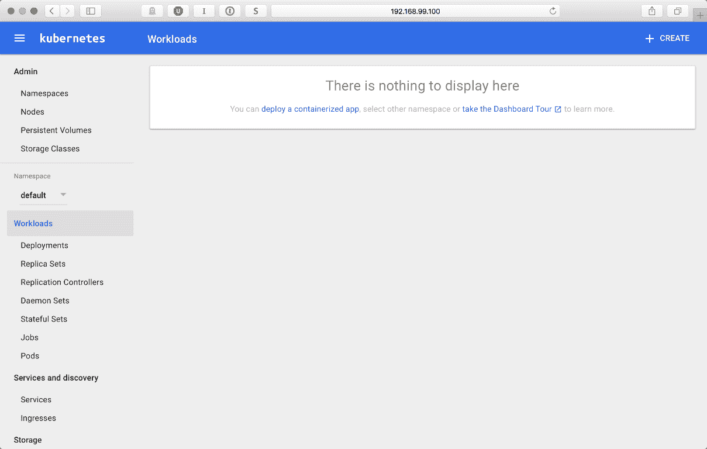**

如您所见，仪表板现在是空的。如果您浏览“名称空间”菜单，您会注意到 Minikube 创建了一些名称空间，其中用于我们的名称空间被简单地命名为默认名称空间。Minikube 安装的各个部分，如 DNS 或 Dashboard，也在集群本身上运行，具有独立的名称空间，如 kube-public 和 kube-system。

随意浏览菜单和部分；到目前为止，没有造成任何伤害，这是一个本地开发集群，目前没有运行任何东西。我们将在本章的最后一节回到仪表板，看看我们如何使用它从 nice UI 部署我们的服务，如果您喜欢这样做，而不是使用命令行的外壳。

当然，让集群空着运行是没有用的，所以我们需要一个工具来管理它。虽然我们几乎可以使用仪表板做任何事情，但是有一个命令行工具要方便得多。`kubectl`控制库本内斯星团。我们将大量使用`kubectl`命令行工具来部署、调度和扩展我们的应用和微服务。该工具是一个独立的二进制文件，适用于苹果电脑、Linux 和视窗系统。在下一节中，您将找到不同平台的安装说明。

# 安装 kubectl

`kubectl`适用于所有主要平台。让我们从安装 macOS 开始。

# 在苹果电脑上安装

以下命令序列将下载`kubectl`二进制文件，设置可执行标志，并将其复制到`/usr/local/bin`文件夹，使其在 macOS 外壳中可用:

```
$ curl -O https://storage.googleapis.com/kubernetes-release/release/v1.5.2
/bin/darwin/amd64/kubectl
$ chmod +x kubectl
$ sudo cp kubectl /usr/local/bin  
```

自制程序提供了最方便的方式来安装`kubectl`并保持更新。要安装，请使用以下命令:

```
$ brew install kubectl
```

要更新，请使用以下命令:

```
$ brew upgrade kubectl
```

# 在 Windows 上安装

你可以在[https://github.com/eirslett/kubectl-windows/releases](https://github.com/eirslett/kubectl-windows/releases)的 GitHub 上找到 Windows `kubectl`版本列表。与 Minikube 类似，kubectl 只是一个单独的`.exe`文件。写这本书的时候是[https://github . com/eir slett/kube CTL-windows/releases/download/v 1 . 6 . 3/kube CTL . exe](https://github.com/eirslett/kubectl-windows/releases/download/v1.6.3/kubectl.exe)。您需要下载`exe`文件并将其放入系统路径中，以便在命令行中使用。

# 在 Linux 上安装

同样，安装过程与 macOS 非常相似。以下命令将获取`kubectl`二进制文件，给它一个可执行标志，然后将其移动到`/usr/local/bin`以使其在 shell 中可用:

```
$ curl -O https://storage.googleapis.com/kubernetes-release/release/v1.5.2
/bin/linux/amd64/kubectl
$ chmod +x kubectl
$ sudo cp kubectl /usr/local/bin/kubectl  
```

要验证您的本地集群是否已启动并运行，以及`kubectl`是否已正确配置，请执行以下命令:

```
$ kubectl cluster-info       
```

在输出中，您将获得关于集群的基本信息，包括它的 IP 地址，以及运行 Minikube 插件(我们将在本章后面回到插件):

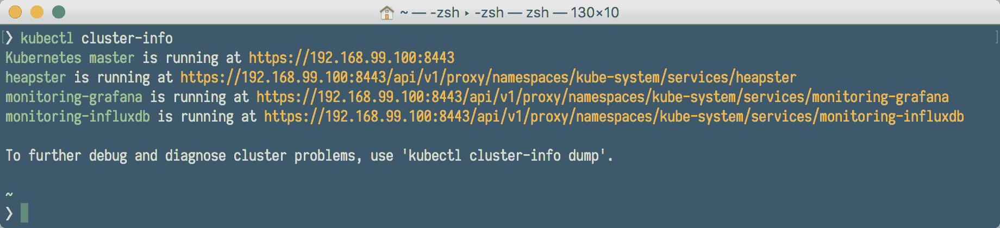

要列出集群中运行的节点，请执行`get nodes`命令:

```
$ kubectl get nodes      
```

当然，这只是一个单节点集群，因此在前面命令的输出中没有什么值得惊讶的:

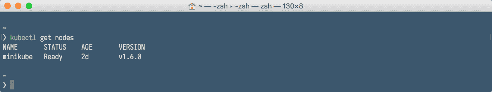

我们的集群已启动并运行；是时候在上面部署我们的服务了。

# 在 Kubernetes 集群上部署

我们通过定义服务开始在 Kubernetes 集群上部署软件的过程。正如您从[第 7 章](07.html)*对 Kubernetes* 的介绍中所记得的，服务将一组 Pods 抽象为单个 IP 和端口，允许简单的 TCP/UDP 加载，并允许 Pods 列表动态变化。让我们从服务创建开始。

# 创建服务

默认情况下，每个 Pod 只能通过其在 Kubernetes 集群中的内部 IP 地址进行访问。为了使容器可以从 Kubernetes 虚拟网络外部访问，我们需要将 Pod 公开为 Kubernetes 服务。为了创建一个服务，我们将使用简单的`.yaml`文件，带有一个服务清单。YAML 是一种人类可读的数据序列化语言，通常用于配置文件。我们的 Java `rest-example`的一个示例服务清单可能如下所示:

```
apiVersion: v1
kind: Service
metadata:
 name: rest-example
 labels:
 app: rest-example
 tier: backend
spec:
 type: NodePort
 ports:
 - port: 8080
 selector:
 app: rest-example
 tier: backend
```

请注意，服务的清单并不引用 Docker 映像。这是因为，正如您从[第 7 章](07.html)、*对 Kubernetes* 的介绍中所记得的，Kubernetes 中的服务只是一个抽象，它为一个或多个 Pods 提供网络连接。每个服务都有自己的 IP 地址和端口，在服务的生命周期内保持不变。每个 Pod 需要有一个特定的标签，由服务发现，服务找到 Pod 进行分组使用和标签`selectors`。在我们前面的示例中，`selector`将拾取标签为`app`值为`rest-example`和标签为`tier`值为`backend`的所有 Pods:

```
selector:
 app: rest-example
 tier: backend
```

正如您从[第 7 章](07.html)*对 Kubernetes* 的介绍中所记得的，Kubernetes 集群中的每个节点都运行一个 kube 代理进程。kube 代理在 Kubernetes 服务中起着至关重要的作用。其目的是为他们暴露一个虚拟 IP。由于 Kubernetes 1.2，iptables 代理是默认的。您有两个选项可以用来设置代理:userspace 和 iptables。这些设置指的是实际处理连接转发的内容。在这两种情况下，都会安装本地 iptables 规则来拦截具有与服务相关联的目标 IP 地址的出站 TCP 连接。这两种模式之间有一个重要的区别:

*   `Proxy-mode: userspace`:在用户空间模式下，iptables 规则转发到一个本地端口，kube-proxy 正在该端口监听连接。运行在用户空间中的 kube 代理终止连接，为服务建立到后端的新连接，然后将请求转发到后端，并将响应返回给本地进程。用户空间模式的一个优点是，因为连接是从应用创建的，如果连接被拒绝，应用可以重试到不同的后端。
*   `Proxy-mode: iptables`:在这种模式下，iptables 规则被安装为直接将去往服务的数据包转发到该服务的后端。这比将数据包从内核转移到 kube-proxy，然后再转移回内核更有效，因此它会带来更高的吞吐量和更好的尾部延迟。然而，与用户空间模式不同，如果最初选择的 Pod 没有响应，使用 iptables 模式就不可能自动重试另一个 Pod，因此这取决于是否有工作就绪探测器。

如您所见，在这两种情况下，节点上都将运行 kube-proxy 二进制文件。在用户空间模式下，它将自己作为代理插入；在 iptables 模式下，它将配置 iptables，而不是自己代理连接。

服务类型可以具有以下值:

*   **节点端口**:通过指定`NodePort`的服务类型，我们声明在集群外公开服务。Kubernetes 主机将从标志配置的范围(`default: 30000-32767`)中分配一个端口，集群的每个节点将代理该端口(每个节点上的端口号相同)到您的服务中
*   **负载平衡器**:这将在支持外部负载平衡器的云提供商上创建负载平衡器(例如，在亚马逊 AWS 云上)。使用 Minikube 时，此功能不可用
*   **集群 IP** :这将只在集群内公开服务。这是默认值，如果您不提供其他值，将使用该值

准备好`service.yml`文件后，我们可以通过执行以下`kubectl`命令来创建第一个 Kubernetes 服务:

```
$ kubectl create -f service.yml
```

要查看我们的服务是否创建正确，我们可以执行`kubectl get services`命令:

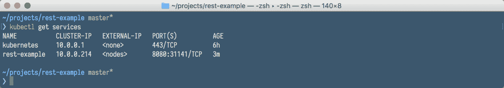

我们还可以通过添加`--all-namespaces`开关来列出其他服务(包括`minikube`集群本身提供的服务，如果你好奇的话):

```
$ kubectl get services --all-namespaces
```

要查看特定服务的详细信息，我们使用`describe`命令。执行以下操作查看我们的`rest-example` Java 服务的详细信息:

```
$ kubectl describe service rest-example
```

在输出中，我们看到了最有用的服务属性，尤其是端点(我们的内部容器 IP 和端口，在本例中只有一个，因为我们有一个 Pod 在服务中运行)、服务内部端口和代理节点端口:


将所有设置保存在`.yaml`文件中非常方便。但是，有时需要以更动态的方式创建服务；例如在一些自动化流程中。在这种情况下，我们可以通过向`kubectl`命令本身提供所有参数和选项来手动创建服务，而不是先创建`.yaml`文件。但是，在此之前，您需要先创建部署，因为手动创建服务只是使用`kubectl`命令公开部署。毕竟，服务是一个公开的部署，事实上，它只是一组 Pods。这种暴露的例子，将导致服务创建，看起来和这个一样:

```
$ kubectl expose deployment rest-example--type="NodePort"  
```

# 创建部署

在创建部署之前，我们需要准备好 Docker 映像并发布到注册表中，例如 Docker Hub。当然，它也可以是您组织中托管的私有存储库。正如你从[第 7 章](07.html)*对库本内斯*的介绍中所记得的，一个吊舱中的每个Docker容器都有自己的形象。默认情况下，Pod 中的 kubectl 进程会尝试从指定的注册表中提取每个映像。您可以通过在部署描述符中为`imagePullPolicy`属性指定一个值来更改此行为。它可以具有以下值:

*   `IfNotPresent`:使用此设置，只有当映像不在本地主机上时，才会从注册表中提取
*   `Never`:有了这个，kubelet 将只使用本地图片

创建部署时用值`IfNotPresent`设置`imagePullPolicy`是有用的；否则，Minikube 会在本地主机上寻找映像之前尝试下载映像。

Kubernetes 对映像使用与 Docker 本身相同的语法，包括私有注册表和标签。

请务必在映像名称中提供标签。否则，Kubernetes 在存储库中查找您的映像时将使用最新的标签，就像 Docker 一样。

在使用本地 Kubernetes 集群时，使用本地构建的映像有点棘手。Minikube 在单独的虚拟机中运行，因此它不会看到您在机器上使用 Docker 在本地构建的映像。有一个解决办法。您可以执行以下命令:

```
$ eval $(minikube docker-env)  
```

前面的命令实际上将利用运行在`minikube`上的 Docker 守护程序，并在 Minikube 的 Docker 上构建您的映像。这样，本地构建的映像将可用于 Minikube，而无需从外部注册表中提取。这不是很方便，将 Docker 映像推送到`remote`注册表当然更容易。让我们把剩下的例子图片放入`DockerHub`注册表。

1.  首先，我们需要登录:

```
$ docker login  
```

2.  然后，我们将使用`docker tag`命令标记我们的映像(并不是说您需要提供自己的 DockerHub 用户名而不是`$DOCKER_HUB_USER`):

```
$ docker tag 54529c0ebed7 $DOCKER_HUB_USER/rest-example  
```

3.  最后一步是使用`docker push`命令将我们的映像推送到 Docker Hub:

```
$ docker push $DOCKER_HUB_USER/rest-example
```

4.  现在我们在注册表中有了一个可用的映像，我们需要一个部署清单。又是一个`.yaml`文件，看起来可以和这个一样:

```
 apiVersion: extensions/v1beta1
kind: Deployment
metadata:
  name: rest-example
spec:
  replicas: 1
  template:
    metadata:
      labels:
        app: rest-example
        tier: backend
    spec:
      containers:
      - name: rest-example
        image: jotka/rest-example
        imagePullPolicy: IfNotPresent
        resources:
          requests:
            cpu: 100m
            memory: 100Mi
        env:
        - name: GET_HOSTS_FROM
          value: dns
        ports:
        - containerPort: 8080
```

要使用`kubectl`在集群上创建此部署，您需要执行以下命令，该命令与创建服务时完全相同，只是文件名不同:

```
$ kubectl create -f deployment.yml
```

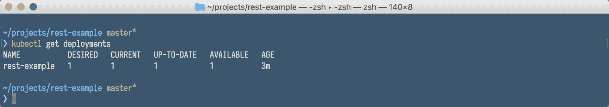

您可以通过以下方式查看部署属性:

```
$ kubectl describe deployment rest-service
```

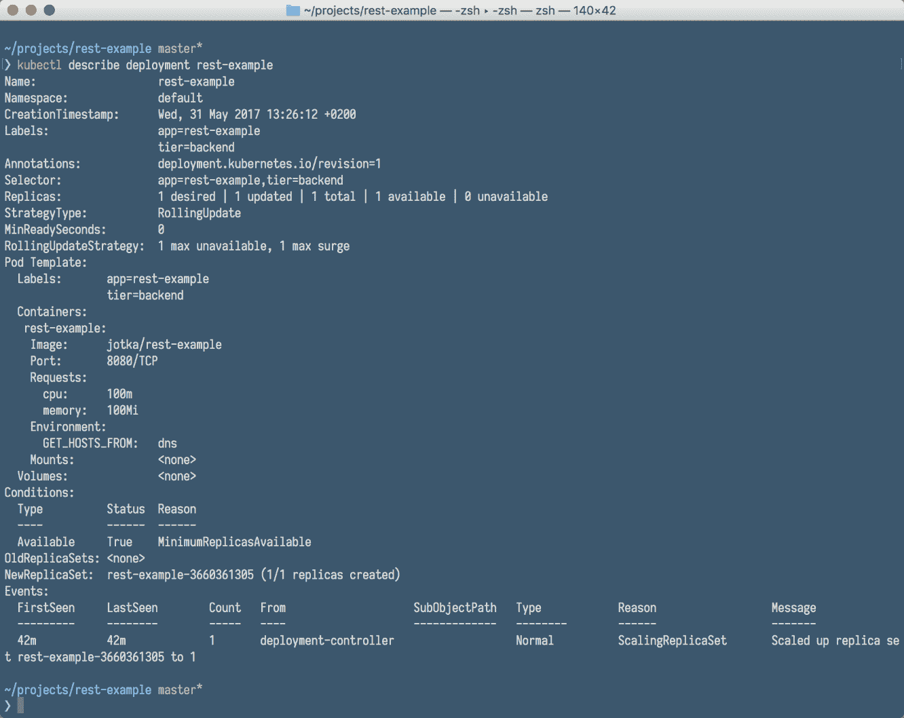

如您所见，已经创建了一个 Pod 以及一个复制集和默认的滚动更新策略。您也可以通过以下方式查看 Pods:

```
$ kubectl get pods
```

`get pods`命令的输出将给出部署中运行的 Pods 的名称。这一点在后面会很重要，因为如果您想与特定的 Pod 进行交互，您需要知道它的名称:


作为`.yaml`文件中部署描述符的替代，您可以使用带有选项的`kubectl run`命令从命令行创建部署，如下例所示:

```
$ kubectl run rest-example --image=jotka/rest-example --replicas=1 --port=8080 --labels="app:rest-example;tier:backend" --expose       
```

让我们用一些例子在表格中总结一下与创建资源和获取资源信息相关的`kubectl`命令:

| **示例命令** | **表示** |
| `kubectl create -f ./service.yaml` | 创建资源 |
| `kubectl create -f ./service.yaml -f ./deployment.yaml` | 从多个文件创建 |
| `kubectl create -f ./dir` | 在指定目录的所有清单文件中创建资源 |
| `kubectl create -f https://sampleUrl` | 从网址创建资源 |
| `kubectl run nginx --image=nginx` | 启动 nginx 的单个实例 |
| `Kubectl get pods` | 获取`pod`的文档 |
| `kubectl get pods --selector=app=rest-example` | 列出所有符合指定标签的豆荚`selector` |
| `kubectl explain pods` | 显示所有 Pods 的详细信息 |
| `kubectl get services` | 列出所有创建的服务 |
| `kubectl explain service` | 显示指定服务的详细信息 |
| `kubectl explain services` | 显示所有已创建服务的详细信息 |
| `kubectl get deployments` | 列出所有创建的部署 |
| `kubectl get deployment` | 显示指定服务的详细信息 |
| `kubectl explain deployment` | 显示指定部署的详细信息 |
| `kubectl explain deployments` | 显示所有已创建部署的详细信息 |
| `kubectl get nodes` | 列出所有集群节点 |
| `kubectl explain node` | 显示指定节点的详细信息 |

```
 Calling the service  
```

正如我们在`kubectl`描述服务`rest-example`命令输出中看到的，我们的`rest-example service`可以通过端口`8080`和域名`rest-example`在集群内访问。在我们的例子中，端点的完整网址是`http://rest-example:8080`。但是，为了能够从外部执行服务，我们使用了`NodePort`映射，我们知道它被赋予了端口`31141`。我们需要调用的服务是集群的 IP。我们可以使用以下命令获得它:

```
$ minikube ip  
```

有一个快捷方式可以了解外部可访问的服务网址和端口号。我们可以使用`minikube service`命令来告诉我们确切的服务地址:

```
$ minikube service rest-example --url  
```

前一个命令的输出将是带有映射端口号的服务 URL。如果您跳过`--url`开关，`minikube`将使用默认的网络浏览器打开服务的网址。这有时很方便。

有了端点的完整 URL，我们可以使用任何`HTTP`客户端访问服务，例如`curl`:

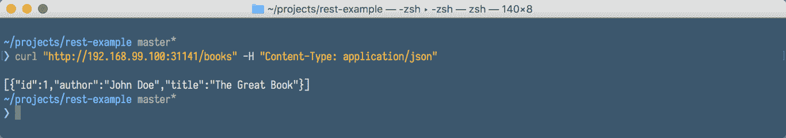

当服务运行时，应用日志通常可以帮助您了解集群内部发生的情况。日志对于调试问题和监控集群活动特别有用。让我们看看如何访问我们的容器日志。

# 与容器交互并查看日志

大多数现代应用都有某种日志机制。例如，我们的 Java REST 服务使用 slf4j 从 REST 控制器输出日志。对于容器化的应用来说，最简单的日志记录方法就是写入标准输出和标准错误流。Kubernetes 支持开箱即用。

假设我们已经使用浏览器或 curl 向我们的新 web 服务发送了请求，我们现在应该能够看到一些日志。在此之前，我们需要有一个在部署期间自动创建的 Pods 名称。要获取 Pod 的名称，请使用`kubectl get pods`命令。之后，您可以显示指定 Pod 的日志:

```
$ kubectl logs rest-example-3660361385-gkzb8 
```

正如您在下面的截图中看到的，我们将获得一个著名的 Spring Boot 横幅，它来自一个在 Pod 中运行的服务:


查看日志并不是我们对特定 Pod 唯一能做的事情。类似于 Docker(实际上一个 Pod 正在运行 Docker)，我们可以通过使用`kubectl exec`命令与一个容器进行交互。例如，要获取运行容器的外壳:

```
$ kubectl exec -it rest-example-3660361385-gkzb8 -- /bin/bash
```

前面的命令将您的 shell 控制台附加到运行容器中的 shell 中，您可以在其中与它进行交互，例如列出进程，如下面的屏幕截图所示:


`kubectl exec`命令的语法与 Docker 中的`exec`命令非常相似，只有一点不同，正如您从[第 7 章](07.html)、*对 Kubernetes* 的介绍中所记得的，一个 Pod 可以运行多个容器。在这种情况下，我们可以使用`--container`或`-c`命令开关在`kubectl exec`命令中指定一个容器。例如，假设我们有一个名为`rest-example-3660361385-gkzb8`的 Pod。这个 Pod 有两个名为服务和数据库的容器。以下命令将打开服务容器的外壳:

```
$ kubectl exec -it rest-example-3660361385-gkzb8 --container service -- /bin/bash 
```

能够查看日志并与容器进行交互，这为您提供了很大的灵活性，可以查明您在运行 Pods 时可能遇到的潜在问题。让我们总结一下与查看日志和与表格中的 Pods 交互相关的`kubectl`命令:

| **示例命令** | **表示** |
| `kubectl logs myPod` | 转储`pod`日志(`stdout`) |
| `kubectl logs myPod -c myContainer` | 倾倒`pod`容器原木(`stdout`，多容器箱) |
| `kubectl logs -f myPod` | 流`pod`日志(`stdout`) |
| `kubectl logs -f myPod -c myContainer` | 流`pod`容器原木(`stdout`，多容器箱) |
| `kubectl run -i --tty busybox --image=busybox -- sh` | `run pod`作为交互外壳 |
| `kubectl attach myPod -i` | 连接到运行容器 |
| `kubectl port-forward myPod 8080:8090` | 将 Pod 的端口`8080`转发到本地机器上的`8090` |
| `kubectl exec myPod -- ls /` | 现有`pod`中的`run`命令(一个容器箱) |
| `kubectl exec myPod -c myContainer -- ls /` | 现有`pod`中的`run`命令(多容器情况) |
| `kubectl top pod POD_NAME --containers` | 显示给定`pod`及其容器的度量 |

正如你已经知道的，豆荚和容器是易碎的。它们可能会坠毁或被杀死。您可以使用`kubectl`日志从带有`--previous`标志的容器的先前实例中检索日志，以防容器崩溃。假设我们的服务运行良好，但是由于[第 7 章](07.html)、*介绍的原因，比如更高的负载，比如你决定增加运行的容器数量。Kubernetes 为您提供了增加每个服务中运行的 Pod 实例数量的可能性。这可以手动或自动完成。让我们首先关注手动缩放。*

# 手动缩放

创建部署后，还会自动创建新的复制集。从[第 7 章](07.html)、*库本内斯*的介绍中你会记得，一个复制集确保指定数量的豆荚克隆体(称为`replicas`)在任何给定的时间运行。如果有太多，其中一些将被关闭。如果需要更多，例如，如果他们中的一些人因错误或崩溃而死亡，将创建新的 Pods。请注意，如果您尝试直接缩放复制器集，那么它将(在很短的时间内)拥有您想要的 Pods 数量的新计数，例如三个。但是，如果部署控制器看到您已经将副本集修改为三个，因为它知道它应该是一个(在部署清单中定义)，它会将其重置回一个。通过手动修改为您创建的副本集，您在某种程度上是在对抗系统控制器。

You need to scale your deployment instead of the replica set directly.

当然，我们的 Java `rest-example`服务将其数据保存在内存中，所以它不是无状态的，所以它可能不是扩展的最佳示例；如果另一个实例被激活，它将拥有自己的数据。然而，它是一个 Kubernetes 服务，所以我们无论如何都可以用它来演示扩展。要将我们的`rest-example`部署从一个吊舱扩展到三个吊舱，请执行以下`kubectl scale`命令:

```
$ kubectl scale deployment rest-example --replicas=3 
```

过了一会儿，为了检查，执行以下命令，您将看到现在部署中有三个 Pods 正在运行:

```
$ kubectl get deployments
$ kubectl get pods      
```

在下表中，您可以看到更多与手动缩放相关的`kubectl`命令示例:

| **示例命令** | **表示** |
| `kubectl scale deployment rest-example --replicas=3` | 将名为`rest-example`的部署扩展到`3`单元 |
| `kubectl scale --replicas=3 -f deployment.yaml` | 将`deployment.yaml`文件中指定的资源缩放至`3` |
| `kubectl scale deployment rest-example --current-replicas=2 --replicas=3` | 如果名为`rest-example`的部署当前大小为`2`，将其扩展至`3`吊舱 |
| `kubectl scale --replicas=5 deployment/foo deployment/bar` | 一次扩展多个部署 |

例如，如果服务负载增加，Kubernetes 可以自动进行缩放。

# 自动缩放

使用水平 Pod 自动扩展，Kubernetes 会根据观察到的 CPU 利用率自动扩展部署或复制集中的 Pod 数量。Kubernetes 控制器定期调整部署中 Pod `replicas`的数量，以使观察到的平均 CPU 利用率与您指定的目标相匹配。

水平自动缩放器只是 Kubernetes 中的另一种资源，因此我们可以使用`kubectl`命令将其创建为任何其他资源:

*   `kubectl get hpa`:列出自动标尺
*   `kubectl describe hpa`:获取详细描述
*   `kubectl delete hpa`:删除自动标尺

此外，还有一个特殊的`kubectl autoscale `命令，用于轻松创建水平吊舱自动缩放器。例如:

```
$ kubectl autoscale deployment rest-example --cpu-percent=50 --min=1 --max=10  
```

前面的命令将为我们的`rest-example`部署创建一个自动缩放器，将目标 CPU 利用率设置为`50` %以及`1`和`10`之间的`replicas`数量。

所有集群事件都将被注册，包括那些来自手动或自动缩放的事件。当监控集群上正在执行的操作时，查看集群事件会很有帮助。

# 查看集群事件

要查看集群事件，请键入以下命令:

```
$ kubectl get events  
```

它将呈现一个巨大的表，其中记录了集群上的所有事件:

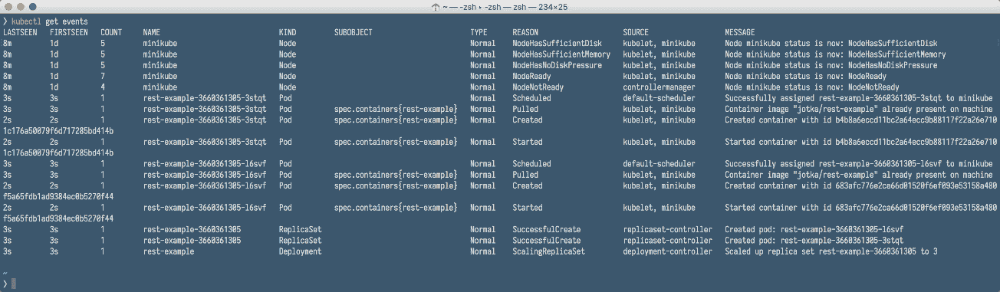

该表将包括节点状态的变化、拉取 Docker 映像、启动和停止容器的事件等。可以非常方便地看到整个集群的图片。

# 使用 Kubernetes 仪表板

Kubernetes 仪表板是一个通用的、基于 web 的 Kubernetes 集群用户界面。它允许用户管理集群中运行的应用并对其进行故障排除，以及管理集群本身。我们还可以编辑部署、服务或 Pods 的清单文件。例如，Kubernetes 将立即接受这些更改，因此它为我们提供了缩小或扩大部署的能力。

如果您使用`minikube dashboard`命令打开仪表板，它将使用仪表板网址打开您的默认浏览器。从这里，您可以列出集群上的所有资源，例如部署、服务、Pods 等。我们的仪表盘不再是空的，如下图截图所示；我们有一个名为`rest-example`的部署:

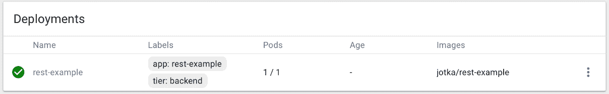

如果您点击它的名称，您将进入部署详细信息页面，该页面将显示您可以通过`kubectl describe deployment`命令获得的相同信息，并具有良好的用户界面:


仪表板不仅是只读工具。每个资源都有一个方便的菜单，您可以使用它来删除或编辑它的清单:


如果您选择查看/编辑 YAML 菜单选项，您将能够使用方便的编辑器编辑清单:


请注意，如果您更改一个值，例如`replicas`的数量，并单击更新，更改将被发送到 Kubernetes 并执行。例如，通过这种方式，您还可以扩展您的部署。

由于部署已自动创建了一个复制集，复制集也将在仪表板中可见:

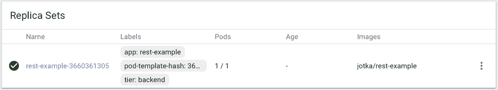

这同样适用于服务。如果您浏览到“服务”菜单，它将显示在群集上创建的所有服务的列表:

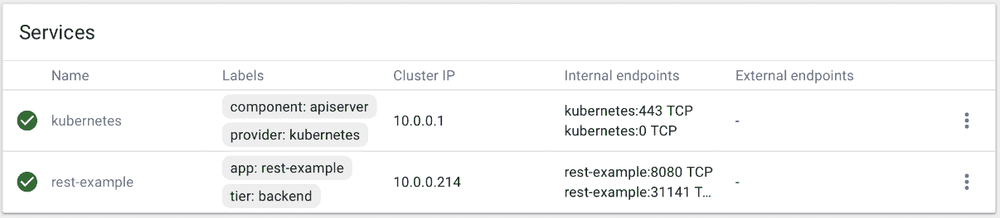

单击服务名称将带您进入详细信息页面:

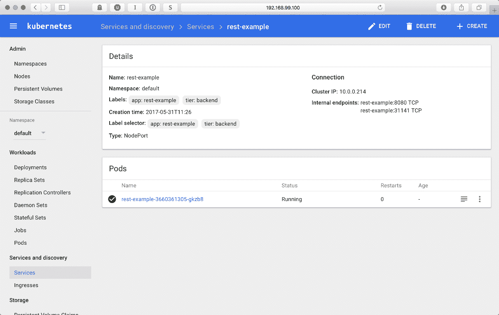

在详细信息屏幕上，列出了所有重要信息。这包括标签选择器，它将用于查找 Pods、端口类型、集群 IP、内部端点，当然还有服务内部运行的 Pods 列表。通过单击 Pod 的名称，您可以看到正在运行的 Pod 的详细信息，包括其日志输出，如下图所示:


仪表板是一个非常方便的工具，可以与您现有的部署、服务和 Pods 交互。但还有更多。如果您单击仪表板工具栏右上角的“创建”按钮，您将看到“部署容器化应用”屏幕。从这里，您实际上可以创建一个新部署:


您有机会使用`.yaml`文件，就像我们之前使用命令行一样，但是您也可以手动指定部署的细节，提供要使用的应用名称和容器映像，并可选地为部署创建服务。很方便，不是吗？仪表板只是可用的 Minikube 附加组件之一。让我们看看我们还有什么可以利用的。

# 迷你库布阿登

Minikube 自带几个插件，比如 Kubernetes 仪表盘、Kubernetes DNS 等等。我们可以通过执行以下命令列出可用的插件:

```
$ minikube addons list
```

前一个命令的输出将列出可用的插件及其当前状态，例如:

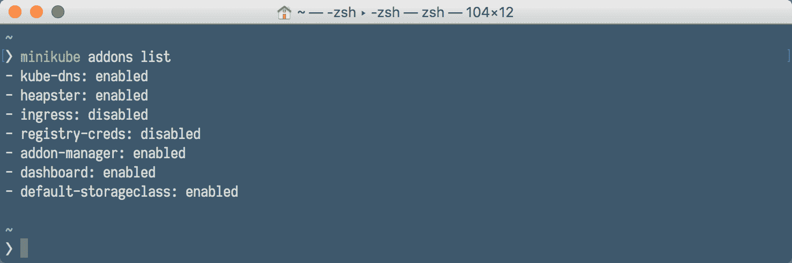

要启用或禁用插件，我们分别使用`minikube addons disable`或`minikube addons enable`，例如:

```
$ minikube addons disable dashboard
$ minikube addons enable heapster  
```

如果启用了插件，我们可以通过执行`addon open`命令来打开相应的网页用户界面，例如:

```
$ minikube addons open heapster  
```

# 清理

如果您已经完成部署和服务，或者想从头开始，您可以通过删除部署或服务来进行一些群集清理:

```
$ kubectl delete deployment rest-example
$ kubectl delete service rest-example      
```

此代码也可以组合在一个命令中，例如:

```
$ kubectl delete service,deployment rest-example
```

`kubectl delete`支持标签`selectors`和命名空间。让我们在表格中查看该命令的其他一些示例:

| **示例命令** | **表示** |
| `kubectl delete pod,service baz foo` | 删除名称相同的豆荚和服务`baz`和`foo` |
| `kubectl delete pods,services -l name=myLabel` | 删除带有标签`name=myLabel`的豆荚和服务 |
| `kubectl -n my-ns delete po,svc --all` | 删除命名空间`my-ns`中的所有 pods 和服务 |

要停止`minikube`集群，只需发出:

```
$ minikube stop 
```

如果您想删除当前的`minikube`集群，您可以发出以下命令来完成:

```
$ minikube delete 
```

# 摘要

如您所见，Minikube 是试用 Kubernetes 并将其用于本地开发的简单方法。运行本地集群并不像开始时看起来那么可怕。最重要的是，本地`minikube`集群是有效的 Kubernetes 集群。如果您通过在本地使用 Kubernetes 来了解它，您将能够在真正的云中部署您的应用，而没有任何问题。让我们总结一下在 Kubernetes 集群上运行我们的 Java 应用需要执行的步骤。

首先，我们需要为微服务编写一些代码。这可以基于您想要的任何东西，它可以是运行在 Tomcat、JBoss 或 Spring Bootstrap 上的微服务。没关系，您只需选择您希望软件运行的技术:

*   接下来，将代码放入 Docker 映像。你可以通过创建一个 Dockerfile 手工完成，或者你可以使用 Docker Maven 插件来自动完成
*   创建 Kubernetes 元数据，如部署清单和服务清单
*   通过展开部署和创建服务来应用元数据
*   根据您的需求扩展您的应用
*   从命令行或仪表板管理您的集群

在[第 9 章](09.html)、*与Kubernetes斯 API* 合作中，我们将了解一下Kubernetes斯 API。这是一种与 Kubernetes 集群交互的好方法。因为 API，可能性几乎是无止境的，你可以创建自己的开发流程，比如使用 Jenkins 的持续交付。有了这个应用编程接口，您不仅仅局限于现有的工具来将您的软件部署到 Kubernetes。事情可以变得更有趣。