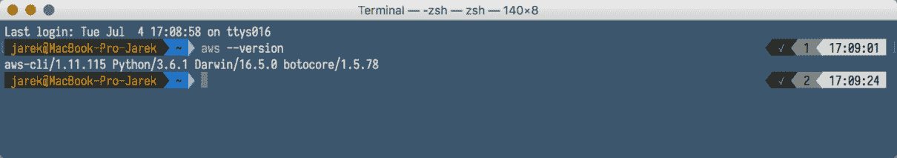
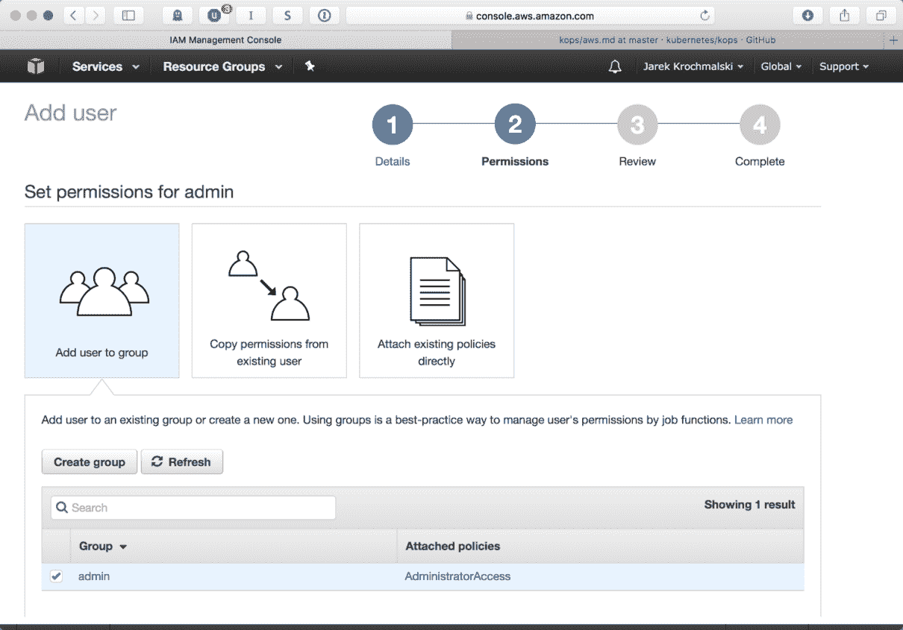
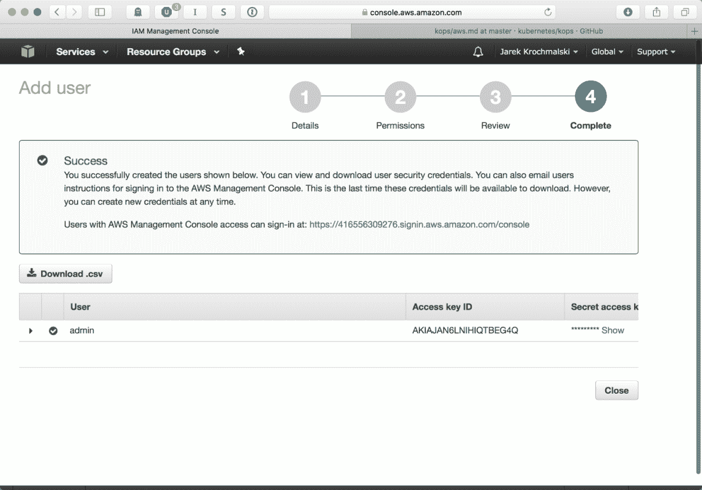
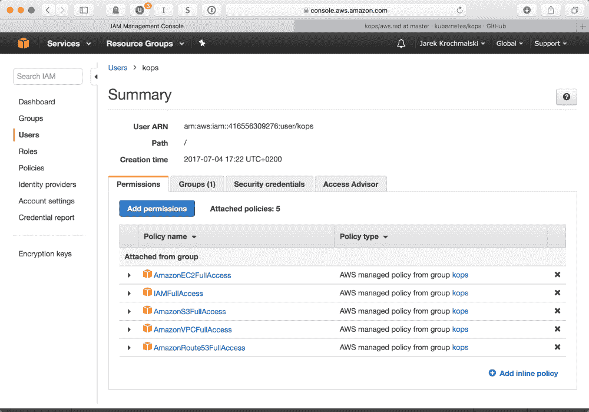
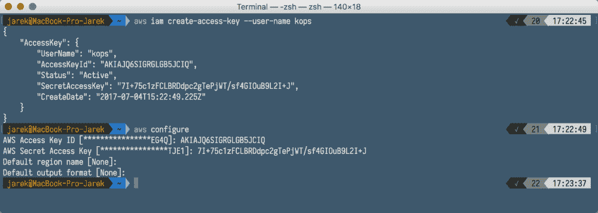
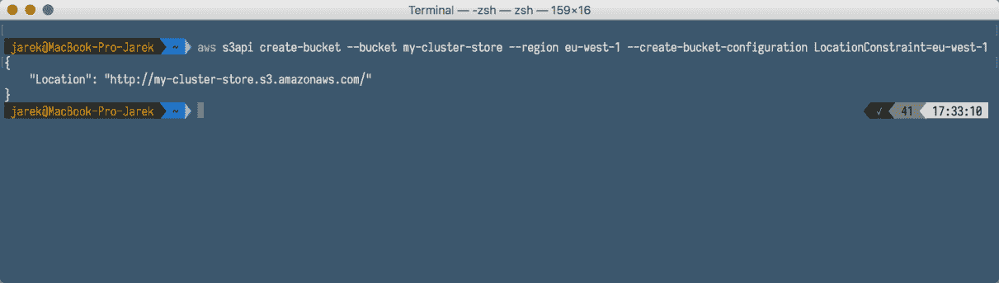
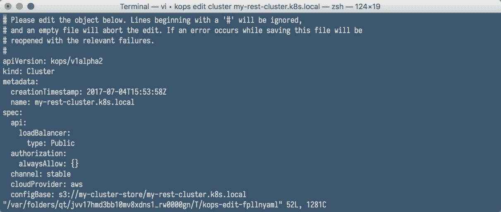
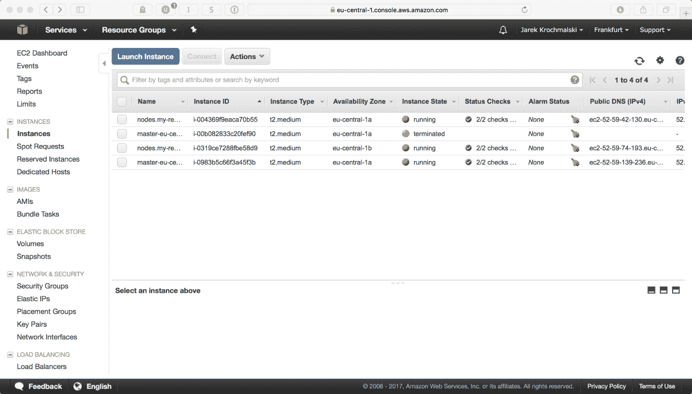
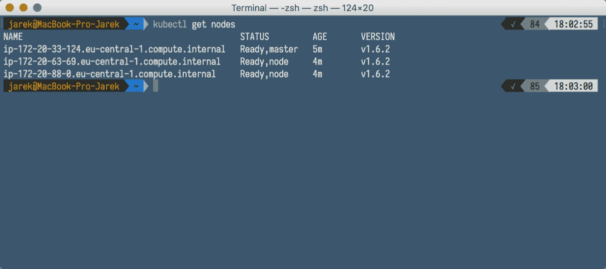

# 在云中的 Kubernetes 上部署 Java

在前几章中，我们已经设法在本地运行了 Kubernetes 集群。使用`minikube`是学习 Kubernetes 并在自己的机器上进行实验的好方法。`minikube`供电集群的行为与服务器上运行的普通集群完全相同。但是，如果您决定在生产环境中运行集群软件，那么云是最好的解决方案之一。在本章中，我们将简要介绍在 Docker 上运行的微服务环境中使用云环境的优势。接下来，我们将在亚马逊 AWS 上部署我们的 Kubernetes 集群。配置 AWS 并在其上运行 Kubernetes 从一开始就不是最简单和最直接的过程，但是，遵循本章将向您概述该过程，您将能够快速运行自己的云集群并在其上部署自己或第三方的 Docker 映像。

涵盖的主题列表包括:

*   使用云、Docker 和 Kubernetes 的好处
*   安装所需的工具
*   配置 AWS
*   部署集群

让我们从使用云部署的 Kubernetes 集群的优势开始。

# 使用云、Docker 和 Kubernetes 的好处

在 Kubernetes 集群上部署应用程序有其优势。它具有故障恢复能力、可扩展性和高效的体系结构。拥有自己的基础设施和使用云有什么区别？这归结于几个因素。首先，它可以显著降低成本。对于不使用时可能会关闭的小型服务或应用程序，在云中部署应用程序的价格可以更低，因为硬件成本更低，物理资源的使用会更有效。您不必为不使用计算能力或网络带宽的节点付费。

拥有自己的服务器需要您支付硬件、能源和操作系统软件的费用。Docker 和 Kubernetes 是免费的，即使是出于商业目的；所以，如果你在云中运行，云提供商的费用将是唯一的成本。云提供商经常更新他们的软件堆栈；拥有最新、最好的操作系统软件版本，您可以从中受益。

说到计算能力或网络带宽，亚马逊或谷歌等大型云提供商无法轻易被击败。他们的云基础设施非常庞大。因为他们为许多不同的客户提供服务，所以他们购买大型、高性能的系统，这些系统提供的性能水平远远高于小公司内部运行的能力。此外，正如您将在本章的下一节中看到的，云提供商可以在几分钟甚至几秒钟内启动新的服务器或服务。因此，如果有需要，新的实例将以对你的软件用户几乎透明的方式被激活。如果您的应用程序需要处理大量请求，有时将它部署在云中可能是唯一的选择。

至于容错，因为云提供商的基础设施遍布全球(如 AWS 区域，您将在本章后面看到)，所以您的软件可以防故障。停电、火灾或地震等任何单一事故都不能阻止您的应用程序运行。向等式中添加 Kubernetes 可以向上或向下扩展部署，并将提高应用程序的容错能力，甚至将完全失败的可能性降至零。

让我们将软件迁移到云上。为此，我们需要首先通过安装所需的软件来创建一个工具集。

# 安装工具

为了能够在 Amazon EC2 上管理 Kubernetes 集群，我们首先需要安装一些命令行工具。当然，使用亚马逊 EC2 网络界面也是可以的。旋转一个集群是一个相当复杂的过程；您将需要一个具有适当访问和权限的用户、集群状态的存储、运行 Kubernetes 主节点和工作节点的 EC2 实例，等等。手动做任何事情都是可能的，但是会很耗时并且容易出错。幸运的是，我们有工具可以为我们自动化大多数事情，这将是 AWS 命令行客户端(`awscli`)和`kops`、Kubernetes 操作、生产级 K8s 安装、升级和管理。尽管有一些要求。`Kops`运行在 Linux 和 macOS 上，是用 Go 写的，跟 Docker 一样。`awscli`是用 Python 写的，所以我们先来关注一下 Python 的安装。

# Python 和 PIP

要运行 AWS 命令行工具(`awscli`，我们需要`python3`出现在我们的机器上。

它可能已经存在，您可以使用以下命令验证:

```
$ python3 --version  
```

如果输出是`command not found`，最快的安装方式就是使用你系统上的包管理器，比如 Debian/Ubuntu 上的`apt`，Fedora 上的`yum`，或者 macOS 上的 Homebrew。如果你在 macOS 上工作，没有安装 Homebrew，我强烈建议你这样做；这是一个很棒的工具，让你有可能轻松地安装成千上万个包以及所有需要的依赖项。家酿啤酒在[https://brew.sh/](https://brew.sh/)免费提供。要安装它，请执行以下操作:

```
$ ruby -e "$(curl -fsSL https://raw.githubusercontent.com/Homebrew/install/master/install)"  
```

从现在开始，您应该可以在您的 macOS 终端中使用`brew`命令。

要使用`apt`包管理器(在 Debian 或 Ubuntu 上)在 Linux 上安装 Python，请执行以下命令:

```
$ sudo apt-get update
$ sudo apt-get install python3.6  
```

在 macOS 上，这将是以下命令:

```
$ brew install python3  
```

安装 Python 的过程取决于您的机器速度和互联网连接，但应该不会花很长时间。一旦安装了 Python，我们将需要另一个工具，那就是`pip`。`pip`是安装 Python 包的推荐工具。它是用 Python 本身编写的。您可以使用自己选择的包管理器安装它，例如，在 Ubuntu 或 Debian 上执行以下操作:

```
$ sudo apt-get install python3-pip  
```

安装`pip`的另一种方法是使用安装脚本。在这种情况下，Linux 和 macOS 的流程完全相同。首先，我们需要使用以下命令下载安装脚本:

```
$ curl -O https://bootstrap.pypa.io/get-pip.py  
```

过一会儿，我们需要通过执行以下命令来运行安装脚本:

```
$ python3 get-pip.py -user  
```

过一会儿，终端外壳里`pip`应该可以给你了。要验证它是否工作，请执行以下命令:

```
$ pip -V
or 
$ pip --version  
```

现在我们已经安装了 Python 和 pip 并正常工作，是时候继续进行更有趣的事情了，安装亚马逊 AWS 命令行实用程序。

# AWS 命令行工具

亚马逊 **AWS 命令行工具** ( **awscli** )界面是管理您的 AWS 服务的统一工具。`awscli`建立在 Python 的 AWS SDK 之上，提供与 AWS 服务交互的命令。只需最少的配置(实际上，提供登录 id 和密码就足够了，我们稍后会做)，您就可以开始使用 AWS 管理控制台网络界面提供的所有功能。此外，`awscli`不仅是关于我们将用来部署集群的 EC2，还包括其他服务，例如 S3(一种存储服务)。

要安装`awscli`，执行以下`pip`命令:

```
$ pip3 install --user --upgrade awscli  
```

过一会儿，`pip`会在你的驱动器上下载并安装`python3`文件夹结构中的必要文件。在 macOS 和 Python 3.6 的情况下将是`~/Library/Python/3.6/bin`。将这个文件夹添加到`PATH`环境变量中非常方便，可以在 shell 中的任何地方使用。这很简单；您需要在其中一个文件中编辑`PATH`变量，这取决于您使用的 shell:

*   **痛击** : `.bash_profile`、`.profile`或`.bash_login`
*   **Zsh** : `.zshrc`
*   **Tcsh**:T0、`.cshrc`或`.login`

在苹果电脑上，一个示例`PATH`条目可能看起来与此相同:

```
export PATH=~/Library/Python/3.6/bin/:$PATH
```

重新登录或启动新终端后，您可以通过执行以下命令来验证`aws`命令是否可用:

```
$ aws -version
```

正如您在输出中看到的，这将为您提供一个详细的`aws`命令行工具版本，以及运行它的 Python 版本:



`awscli`可以使用了，但是我们还有一个工具要添加到我们的工具设置中。将是库本内斯`kops`。

# 肺

Kubernetes operations 简称`kops`，是生产级 Kubernetes 的安装、升级和管理工具。这是一个命令行实用程序，可以帮助您在 AWS 上创建、销毁、升级和维护高可用性的 Kubernetes 集群。该工具正式支持 AWS。你可以在 GitHub 上找到`kops`版本:[https://github.com/kubernetes/kops/releases](https://github.com/kubernetes/kops/releases)

要在 macOS 或 Linux 上安装，您只需要下载二进制文件，将权限更改为可执行文件，然后就完成了。下载、执行，例如:

```
$ wget \ https://github.com/kubernetes/kops/releases/download/1.6.1/kops-darwin-amd64 $ chmod +x kops-darwin-amd64
$ mv kops-darwin-amd64 /usr/local/bin/kops  
```

或者，如果您使用的是 Linux，请执行以下命令:

```
$ wget \ https://github.com/kubernetes/kops/releases/download/1.6.2/kops-linux-amd64
$ chmod +x kops-linux-amd64
$ mv kops-linux-amd64 /usr/local/bin/kops  
```

或者，使用包管理器将是获取最新的`kops`二进制文件的最简单方法，例如在 macOS 上使用`brew`:

```
$ brew update && brew install kops  
```

请注意，您必须安装`kubectl`([https://kubernetes.io/docs/tasks/tools/install-kubectl/](https://kubernetes.io/docs/tasks/tools/install-kubectl/))才能使`kops`工作。如果使用包管理器，对`kubectl`的依赖可能会在`kops`包中定义，所以会先安装`kubernetes-cli`。

最后一个工具是`jq`。虽然不是强制性的，但在处理 JSON 数据时非常有用。所有的 AWS、Kubernetes 和`kops`命令都会发布和接收 JSON 对象，所以有一个解析 JSON 的工具就派上用场了，我强烈推荐安装`jq`。

# japan quarterly 日本季刊

`jq`是一个命令行 JSON 处理器。对于 JSON 数据，它的工作方式类似于`sed`；您可以使用它来过滤、解析和转换结构化数据，就像`sed`、`awk`或`grep`处理原始文本一样简单。`Jq`可在 https://stedolan.github.io/jq/的 GitHub 上获得。安装非常简单；它只是一个单一的二进制文件，可用于 Windows、macOS 和 Linux。只需下载它，并将其复制到您系统上的可用文件夹`PATH`中，以便能够从 shell 或命令行运行它。

假设我们在开始使用 kops 之前已经安装了所有工具，我们将需要首先配置我们的 AWS 帐户。这将创建一个管理用户，然后使用`aws`命令行工具，创建运行`kops`的用户。

# 配置亚马逊 AWS

在建立 Kubernetes 集群之前，AWS 的配置基本上可以归结为创建一个用户。其余都或多或少由`kops`命令自动完成。在我们可以从命令行使用`kops`之前，最好有一个用户专用于`kops`。但是首先，我们需要创建一个管理员用户。我们将从网络管理控制台进行。

# 创建管理用户

根据您选择的自动气象站区域，自动气象站管理控制台在`console.aws.amazon.com`子域可用，例如，这将是[https://eu-central-1.console.aws.amazon.com](https://eu-central-1.console.aws.amazon.com)。登录后，转到安全、身份和合规部分的 IAM 页面，然后切换到用户页面，然后单击添加用户按钮。

您将看到用户创建屏幕:


我们将需要这个用户来使用`awscli`，所以我们需要标记的唯一选项是编程访问。点击下一步:权限后，让我们通过将我们的`admin`用户添加到`admin`组来赋予他完全的管理权限:



在用户创建向导的最后一页，您将能够看到访问密钥标识和秘密访问密钥标识。不要关闭页面，我们需要两者在短时间内使用`awscli`进行验证:



就这样。我们已经创建了一个拥有所有管理权限和访问密钥的管理员用户。这就是我们使用`awscli`管理 AWS 实例所需要的一切。使用`admin`用户运行`kops`可能不是最好的主意，所以让我们为此创建一个单独的用户。但是，这一次，我们将从命令行执行。与在网络控制台上点击用户界面相比，这要容易得多。首先，让我们使用用户创建向导最后一页上显示的管理员用户的访问密钥标识和`Secret access key ID`进行身份验证。

# 为 kops 创建用户

`kops`用户需要在 AWS 中拥有以下权限才能正常运行:

*   `AmazonEC2FullAccess`
*   `AmazonS3FullAccess`
*   `AmazonRoute53FullAccess`
*   `IAMFullAccess`
*   `AmazonVPCFullAccess`

首先，我们将创建一个名为`kops`的组，并将所需的权限授予该组。执行以下命令列表来创建组并分配权限:

```
$ aws iam create-group --group-name kops

$ aws iam attach-group-policy --policy-arn $ arn:aws:iam::aws:policy/AmazonEC2FullAccess --group-name kops

$ aws iam attach-group-policy --policy-arn arn:aws:iam::aws:policy/AmazonS3FullAccess --group-name kops

$ aws iam attach-group-policy --policy-arn arn:aws:iam::aws:policy/AmazonRoute53FullAccess --group-name kops

$ aws iam attach-group-policy --policy-arn arn:aws:iam::aws:policy/IAMFullAccess --group-name kops

$ aws iam attach-group-policy --policy-arn arn:aws:iam::aws:policy/AmazonVPCFullAccess --group-name kops
```

`create-group`命令会给你一些 JSON 响应，但是如果一切顺利的话，在给组附加权限(组策略)的时候不会有响应:


接下来，让我们创建`kops` IAM 用户，并使用以下命令将该用户添加到`kops`组:

```
$ aws iam create-user --user-name kops
$ aws iam add-user-to-group --user-name kops --group-name kops  
```

如果你感到好奇，你现在可以登录到网络 AWS 控制台。您将看到我们的`kops`用户拥有我们需要的所有权限:



要列出所有注册用户，请执行以下命令:

```
$ aws iam list-users        
```

从下面的截图中可以看到，我们现在应该有两个用户:`admin`和`kops`:


关于我们的新`kops`用户，我们需要做的最后一件事是生成访问密钥。我们需要他们使用`aws configure`命令进行身份验证。执行以下操作为`kops`用户生成访问密钥:

```
$ aws iam create-access-key --user-name kops  
```

从下面的截图中可以看到，AWS 会用包含`AccessKeyId`和`SecretAccessKey`的 JSON 响应进行回答；当使用`aws configure`命令进行身份验证时，我们将需要这两者:



我们现在需要做的就是使用`aws configure`命令进行身份验证，提供我们在响应中得到的`AccessKeyId`和`SecretAccessKey`。执行以下操作:

```
$ aws configure   
```

因为`aws configure`命令没有导出这些变量供`kops`使用，所以我们现在需要导出它们:

```
$ export AWS_ACCESS_KEY_ID=<access key>
$ export AWS_SECRET_ACCESS_KEY=<secret key>  
```

就这样，我们已经通过了名为`kops`的新用户的身份验证，该用户拥有启动 Kubernetes 集群所需的所有权限。从现在开始，我们执行的每个`kops`命令都将使用 AWS `kops`用户。是时候回到正题，最终创建我们的集群了。

# 创建集群

我们将创建一个包含一个主节点和两个工作节点的简单集群。要使用`kops`完成，我们需要:

*   在`~/.aws/credentials`中声明的用户配置文件(如果您使用`aws configure`进行身份验证，这将自动完成)。
*   一个 S3 桶来存储`kops`集群状态。为了存储集群的表示及其状态，我们需要创建一个专用的 S3 桶供`kops`使用。这个桶将成为我们集群配置的真理之源。
*   已配置 DNS。这意味着我们将需要在同一个 AWS 帐户中有一个 53 号公路托管区域。亚马逊 53 号路线是一个高度可用和可扩展的云**域名系统** ( **域名系统**)网络服务。Kops 将使用它来创建集群所需的记录。如果您使用较新的 kops (1.6.2 或更高版本)，则 DNS 配置是可选的。相反，可以很容易地创建一个基于流言的集群。为了简单起见，我们将使用基于流言的集群。要使其工作，集群名称必须以`k8s.local`结尾。不过，让我们看看关于域名系统设置的其他选项。

# DNS 设置

对于我们集群的域，基本上有四种可能的情况:托管在 AWS 上的根域，托管在 AWS 上的域的子域，对托管在其他地方的域使用 Amazons Route 53，最后，在 Route 53 中为您的集群设置子域，同时在其他地方拥有根域。现在让我们简单看看这些设置。

# AWS 托管域上的根域

如果您购买了您的域名并将其托管在 AWS 上，您可能已经自动为您配置了 53 号路由。如果您想将此根级域用于您的群集，您不需要做任何事情就可以将该域名用于您的群集。

# 托管在 AWS 上的域的子域

如果您购买了您的域并将其托管在 AWS 上，但希望将该子域用于群集，则需要在 53 号路由中创建新的托管区域，然后将新路由委派给该新区域。这基本上是关于将您子域的 NS 服务器复制到 53 号路由的父域。假设我们的领地是[mydomain.com](http://www.mydomain.com/)；我们需要先得到一些信息。请注意，`jq`命令行工具现在在执行`aws`命令时派上了用场。首先，我们需要主父区域的 ID:

```
$ aws route53 list-hosted-zones | jq '.HostedZones[] \ 
| select(.Name=="mydomain.com.") | .Id'  
```

要创建新子域，请执行以下操作:

```
$ aws route53 create-hosted-zone --name myservice.mydomain.com \ 
--caller-reference $ID | jq .DelegationSet.NameServers  
```

请注意，前面的命令将列出新域的名称服务器。如果您之前创建了子域，并且想要列出名称服务器(要将 NS 服务器列表复制到父区域，我们需要先了解它们)，请执行以下命令获取子域区域 ID:

```
$ aws route53 list-hosted-zones | jq '.HostedZones[] | \ select(.Name==" myservice.mydomain.com.") | .Id' 
```

有了子域区域的标识，我们可以通过执行以下命令来列出它的名称服务器:

```
$ aws route53 get-hosted-zone --id <your-subdomain-zoneID> \
| jq .DelegationSet.NameServers  
```

到目前为止，我们已经有了我们父母的区域标识、子域区域标识和子域名称服务器列表。我们准备将它们复制到父对象中。最方便的方法是准备 JSON 文件，因为这是一个相当长的输入。该文件看起来与以下内容相同:

```
{
 "Changes": [
 {
 "Action": "CREATE",
 "ResourceRecordSet": {
 "Name": "myservice.mydomain.com",
 "Type": "NS",
 "TTL": 300,
 "ResourceRecords": [
 {
 "Value": "ns-1.awsdns-1.com"
 },
 {
 "Value": "ns-2.awsdns-2.org"
 },
 {
 "Value": "ns-3.awsdns-3.com"
 },
 {
 "Value": "ns-4.awsdns-4.net"
 }
 ]
 }
 }
 ]
}
```

你需要把它保存为一个文件，比如说`my-service-subdomain.json`，然后执行最后一个命令。它会将名称服务器列表复制到父区域:

```
$ aws route53 change-resource-record-sets 
--change-batch file://my-service-subdomain.json \
--hosted-zone-id <your-parent-zone-id>  
```

过一会儿，所有到`*.myservice.mydomain.com`的网络流量将被路由到 AWS 路由中正确的子域托管区域。

# 向另一个注册商购买的域名的路由 53

如果您在其他地方购买了您的域，并希望将整个域专用于您的 AWS 托管集群，事情可能会变得有点复杂，因为这种设置需要您在另一个域注册器中进行重要的更改。

If the registrar for your domain is also the DNS service provider for the domain (which is, actually, very often the case), it's recommended to transfer your DNS service to Amazon Route 53 before you continue with the process to transfer the domain registration.

其原因是，当您转移注册时，先前的注册者可能会在收到来自路由 53 的转移请求后立即禁用该域的 DNS 服务。因此，您在该域上拥有的任何服务(如 web 应用程序或电子邮件)都可能变得不可用。要将域注册从另一个注册服务商转移到 53 号路由，您需要使用 53 号路由控制台，该控制台可在[https://console.aws.amazon.com/route53/](https://console.aws.amazon.com/route53/)获得。在导航窗格中，选择已注册的域，然后选择传输域，输入要传输的域名，然后单击检查。如果域不可用于传输，控制台将列出可能的原因和建议的处理方法。如果一切正常，并且域可供转移，您将可以选择将其添加到购物车中。您需要输入一些详细信息，例如您的联系信息、转账授权码(您应该从以前的注册服务商那里获得)和名称服务器设置。我强烈建议选择路由 63 管理的域名系统服务器，因为它非常容易配置和可靠。63 号公路将负责与您以前的注册服务商沟通，但您可能会收到一些电子邮件，要求您确认一些事情。传输过程可能需要更长的时间，但完成后，您可以按照与前两种情况相同的方式继续为基于 AWS 的集群配置域。

# AWS 路由中群集的子域，其他地方的域

如果您在亚马逊以外的注册机构注册了您的域名，并希望使用该域名的子域来指向您的集群，则需要在注册机构中修改您的域名服务器条目。这将需要在 53 号公路上创建一个新的托管区域子域，然后将该子域的名称服务器记录迁移到您的注册服务商。

类似于 AWS 托管域上的子域，让我们首先通过执行以下命令来创建一个子域:

```
$ aws route53 create-hosted-zone \
--name myservice.mydomain.com \
--caller-reference $ID | jq .DelegationSet.NameServers  
```

前面命令的输出将列出子域的名称服务器。您需要登录到注册器的设置页面，并创建一个新的子域，提供从上一个命令接收到的四个名称服务器记录。您可以在特定的注册服务商帮助指南中找到如何编辑域名服务器的详细说明。

前面的指南应该使您的集群在特定的域或子域下可用。然而，在本章的剩余部分，我们将运行基于流言的集群。

在我们在 AWS 上创建任何东西之前，我们必须看看有哪些区域可供使用。您应该知道，亚马逊 EC2 在全球多个地方托管。这些位置由区域和可用性区域组成。每个地区都是一个独立的地理区域。每个区域都有多个独立的位置，称为可用性区域。您可以选择您想要的位置，但是首先，您需要检查区域的可用性。我们现在就开始吧。

# 检查区域的可用性

要列出特定区域的可用区域，请执行以下命令:

```
$ aws ec2 describe-availability-zones --region eu-central-1  
```

正如您在下面的截图中看到的，AWS 将在响应中给出区域列表:


# 创建存储

我们的集群需要在某个地方存储它的状态。为此，Kops 使用亚马逊 S3 水桶。S3 存储桶是**亚马逊网络服务** ( **AWS** )对象存储服务、**简单存储解决方案** ( **S3** ) *中的逻辑存储单元。*存储桶用于存储对象，对象由数据和描述数据的元数据组成。要创建桶，执行以下`aws`命令:

```
$ aws s3api create-bucket \
--bucket my-cluster-store \
--region eu-central-1 \
--create-bucket-configuration LocationConstraint=eu-central-1  
```

正如您将在下面的截图中看到的，AWS 将向您返回关于商店位置的简明信息:



创建商店后，我们需要在创建集群时将其提供给`kops`。为此，我们需要将桶的名称导出到`KOPS_STATE_STORE`环境变量中，以便:

```
$ export KOPS_STATE_STORE=s3://my-cluster-store  
```

我们现在准备创建一个集群。

As you remember, we are going to use a gossip-based cluster instead of configured DNS, so the name must end with `k8s.local`.

# 创建集群

让我们首先将集群名导出到环境变量中。这将非常有用，因为我们将经常提到集群的名称。执行以下命令导出群集名称:

```
$ export NAME=my-rest-cluster.k8s.local  
```

`kops create cluster`是我们将要用来创建集群的命令。请注意，这不会影响我们的亚马逊 EC2 实例。该命令的结果将只是一个本地集群模板，我们可以在 AWS 上推出真实的物理更改之前查看和编辑该模板。

该命令的语法非常简单:

```
$ kops create cluster [options]  
```

这个命令有很多选项；你总能在[https://GitHub . com/kubernetes/kops/blob/master/docs/CLI/kops _ create _ cluster . MD](https://github.com/kubernetes/kops/blob/master/docs/cli/kops_create_cluster.md)找到 GitHub 上的最新描述。让我们关注最重要的几个问题:

| **选项** | **描述** |
| `--master-count [number]` | 设置主节点的数量。默认情况下，每个主区域有一个主节点。 |
| `--master-size [string]` | 设置主控形状的实例大小，例如:`--master-size=t2.medium`。 |
| `--master-volume-size [number]` | 以千兆字节为单位设置主节点的实例卷大小。 |
| `--master-zones [zone1,zone2]` | 指定要在其中运行主机的 AWS 区域(这必须是奇数)。 |
| `--zones [zone1,zone2 ]` | 运行集群的区域，例如:`--zones eu-central-1a,eu-central-1b`。 |
| `--node-count [number]` | 设置节点数。 |
| `--node-size [string]` | 设置节点的实例大小，例如:`--node-size=t2.medium`。 |
| `--node-volume-size int32` | 为节点设置实例卷大小(以 GB 为单位)。 |

如果您想将群集设为私有(默认情况下是公共的)，您需要考虑另外使用这些选项:

| **选项** | **描述** |
| `--associate-public-ip [true&#124;false]` | 指定您是否希望您的群集分配公共 IP。 |
| `--topology [public&#124;private]` | 指定集群的内部网络拓扑，可以是`public`或`private`。 |
| `--bastion` | `--bastion`标志启用堡垒实例组。该选项仅适用于专用拓扑。它将为集群实例的 SSH 访问生成一个专用的 SSH 跳转主机。跳转主机提供了进入集群专用网络的入口点。它可以启动和停止，以启用或禁用来自互联网的入站 SSH 通信。 |

让我们现在使用以下命令创建集群:

```
$ kops create cluster --v=0 \
--cloud=aws --node-count 2 \
--master-size=t2.medium \
--master-zones=eu-central-1a \
--zones eu-central-1a,eu-central-1b  \
--name=${NAME} \
--node-size=t2.medium  
```

在响应中，`kops`将列出已创建的配置的所有详细信息，并建议您可以对新集群配置采取的一些后续步骤:


运行命令后，`kops`将配置您的`kubectl` Kubernetes 客户端指向您的新集群；这将是我们例子中的`my-rest-cluster.k8s.local`。

正如我们之前所说的，在这个阶段，只创建集群的模板，而不是集群本身。您仍然可以通过编辑集群来更改任何选项:

```
$ kops edit cluster my-rest-cluster.k8s.local  
```

这将打开您在 shell 中定义的默认编辑器，您可以在其中看到已经生成的集群模板。它将包含更多的设置，不仅仅是您在运行`cluster create`命令时指定的设置:



如果您对您的集群模板感到满意，那么是时候加速它来创建真正的基于云的资源了，例如网络和 EC2 实例。一旦基础设施准备就绪，`kops`将在 EC2 实例上安装 Kubernetes。开始吧。

# 启动集群

要启动集群并加速所有必要的 EC2 实例，您需要执行`update`命令。在`kops`手册中建议您应该在没有`--yes`开关的预览模式下首先进行。这不会加速任何 EC2 实例:

```
$ kops update cluster ${NAME}   
```

如果一切正常，使用`--yes`开关执行更新命令:

```
$ kops update cluster ${NAME} --yes  
```


您的群集正在启动，应该会在几分钟内准备好。如果您现在登录到 WAS 管理控制台，您将看到您的 EC2 实例正在启动，如下图所示:



您还可以通过发出以下命令来检查整个集群状态:

```
$ kops validate cluster  
```

输出将包含有关群集节点数量和状态的信息，包括主节点:


当然，由于`kubectl`现在被配置为作用于我们的 AWS 集群，我们可以使用`kubectl get nodes`命令列出节点，这与我们在[第 9 章](09.html)、*中使用库本内斯 API* 、使用`minikube`基础集群所做的完全相同。执行以下命令:

```
$ list nodes: kubectl get nodes --show-labels  
```

您将获得有关集群节点的名称和状态的信息:



# 更新群集

`Kops`的行为类似于`kubectl`；在对集群进行任何更改之前，您可以在编辑器中编辑配置文件。`kops update`命令将应用配置更改，但不会修改运行的基础设施。要更新正在运行的集群，您需要执行`rolling-update`命令。以下操作将启动群集基础架构的更新或重新创建过程:

```
$ kops rolling-update cluster –yes
```

我们的新集群正在运行，但它是空的。让我们部署一些东西。

# 安装仪表板

让集群运行起来，最好部署一个仪表板，以查看您的服务、部署、pods 等的状态。仪表板默认包含在`minikube`集群中，但是在我们全新的亚马逊集群上，我们需要手动安装它。这是一个简单的过程。由于我们已经将`kubectl`配置为作用于远程集群，因此我们可以使用`kubernetes-dashboard.yaml`模板作为输入来执行以下`kubectl create`命令:

```
$ kubectl create -f \
https://rawgit.com/kubernetes/dashboard/master/src/deploy
kubernetes-dashboard.yaml  
```

下一步是代理网络流量，使用下面我们已经知道的`kubectl proxy`命令:

```
$ kubectl proxy 
```

就这样！一段时间后，仪表板将被部署，我们将能够使用本地主机地址访问它:

`http://localhost:8001/`，正如你在下面的截图中看到的，是我们已经在[第 9 章](09.html)*中看到的同一个仪表盘，使用 Kubernetes API* :


从现在开始，您可以使用`kubectl`和仪表板来管理您的集群，就像我们之前在[第 9 章](09.html)、*中使用 Kubernetes API* 一样。所有`kubectl create`命令的工作方式与本地集群相同。然而，这一次，你的软件将走向云端。

如果您决定删除群集，请执行以下命令:

```
$ kops delete cluster -name=${NAME} --yes  
```

注意，如果你刚刚创建了集群模板，没有先执行`kops update cluster ${NAME} --yes`，也可以删除集群，如下图截图所示:


如果已经在 Amazon 上创建了集群，删除集群的过程将花费更长的时间，因为需要首先关闭主节点和工作节点的所有 EC2 实例。

# 摘要

在这一章中，我们已经在真实的云中建立了一个集群，亚马逊 AWS。`Kops`是我们目前可用的管理 AWS 上 Kubernetes 的最佳工具之一。使用它，您可以轻松地在 AWS 上创建和管理集群。它可以是测试级或生产级集群；`kops`将使 it 的创建和管理变得轻而易举。