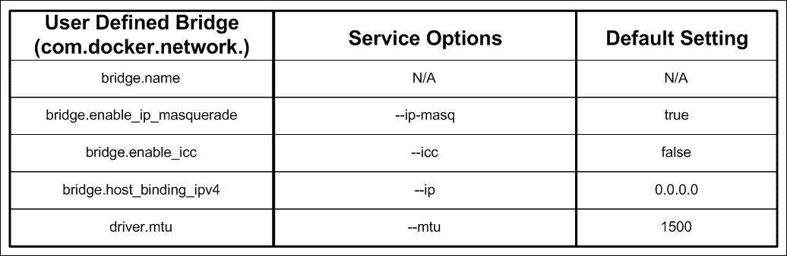
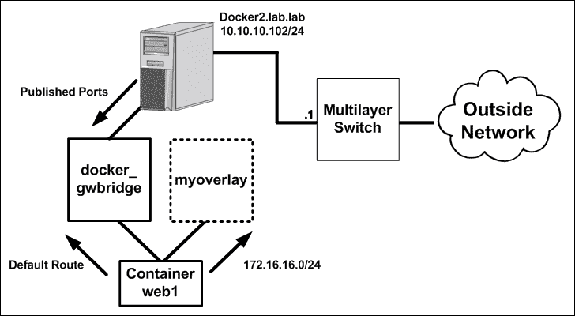
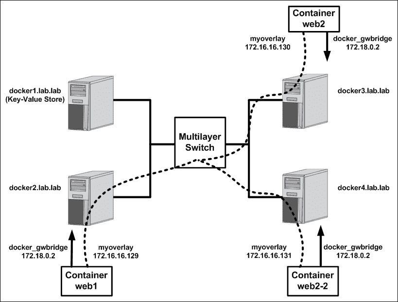

# 第三章。用户定义的网络

在本章中，我们将介绍以下食谱:

*   查看 Docker 网络配置
*   创建用户定义的网络
*   将容器连接到网络
*   定义用户定义的桥接网络
*   创建用户定义的覆盖网络
*   隔离网络

# 简介

Docker 的早期版本依赖于一个主要是静态的网络模型，这种模型对于大多数容器网络需求来说运行得相对较好。然而，如果你想做一些不同的事情，你没有太多的选择。例如，您可以告诉 Docker 将容器部署到不同的桥上，但是在 Docker 和网络之间没有强大的集成点。随着 Docker 1.9 中引入用户定义的网络，游戏发生了变化。您现在可以直接通过 Docker 引擎创建和管理网桥和多主机网络。此外，还为第三方网络插件通过 libnetwork 及其**容器网络模型** ( **CNM** )模型与 Docker 集成打开了大门。

### 注

CNM 是 Docker 定义容器网络模型的模型。在[第 7 章](07.html "Chapter 7. Working with Weave Net")、*与 Weave Net* 合作中，我们将考察一个可以集成为 Docker 驱动程序的第三方插件(Weave)。本章的重点将是 Docker 引擎固有的默认网络驱动程序。

转向基于驱动程序的模式象征着 Docker 网络的巨大变化。除了定义新的网络，您现在还能够动态地连接和断开容器接口。这种固有的灵活性为连接容器打开了许多新的可能性。

# 查看 Docker 网络配置

如上所述，现在可以通过 Docker 直接定义和管理网络，并添加`network`子命令。`network`命令为您提供了构建网络和将容器连接到网络所需的所有选项:

```
user@docker1:~$ docker network --help

docker network --help

Usage:  docker network COMMAND

Manage Docker networks

Options:
      --help   Print usage

Commands:
  connect     Connect a container to a network
  create      Create a network
  disconnect  Disconnect a container from a network
  inspect     Display detailed information on one or more networks
  ls          List networks
  rm          Remove one or more networks

Run 'docker network COMMAND --help' for more information on a command.
user@docker1:~$
```

在这个食谱中，我们将学习如何查看已定义的 Docker 网络，以及检查它们的具体细节。

## 做好准备

`docker network`子命令是在 Docker 1.9 中引入的，所以你需要一个 Docker 主机至少运行那个版本。在我们的例子中，我们将使用 Docker 版本。您还需要对当前的网络布局有一个很好的了解，以便我们检查当前的配置时，您可以跟着做。假设每个 Docker 主机都处于其本机配置。

## 怎么做…

我们要做的第一件事是找出 Docker 认为已经定义的网络。这可以使用`network ls`子命令来完成:

```
user@docker1:~$ docker network ls
NETWORK ID          NAME                DRIVER              SCOPE
200d5292d5db        bridge              bridge              local
12e399864b79        host                host                local
cb6922b8b84f        none                null                local
user@docker1:~$
```

正如我们所见，Docker 显示我们已经定义了三个不同的网络。要查看有关网络的更多信息，我们可以使用`network inspect`子命令检索有关网络定义及其当前状态的详细信息。让我们仔细看看每个定义的网络。

### 桥梁

桥网络表示 Docker 引擎默认创建的`docker0`桥:

```
user@docker1:~$ docker network inspect bridge
[
    {
        "Name": "bridge",
        "Id": "62fcda0787f2be01e65992e2a5a636f095970ea83c59fdf0980da3f3f555c24e",
        "Scope": "local",
 "Driver": "bridge",
        "EnableIPv6": false,
        "IPAM": {
            "Driver": "default",
            "Options": null,
            "Config": [
                {
 "Subnet": "172.17.0.0/16"
                }
            ]
        },
        "Internal": false,
        "Containers": {},
        "Options": {
 "com.docker.network.bridge.default_bridge": "true",
 "com.docker.network.bridge.enable_icc": "true",
 "com.docker.network.bridge.enable_ip_masquerade": "true",
 "com.docker.network.bridge.host_binding_ipv4": "0.0.0.0",
 "com.docker.network.bridge.name": "docker0",
 "com.docker.network.driver.mtu": "1500"
        },
        "Labels": {}
    }
]
user@docker1:~$  
```

`inspect`命令的输出向我们展示了关于已定义网络的大量信息:

*   `Driver`:在这种情况下，我们可以看到网桥实现了`Driver`桥。虽然这看起来很明显，但重要的是要指出，所有网络功能，包括本机功能，都是通过驱动程序实现的。
*   `Subnet`:在这种情况下，`subnet`是我们期望从`docker0`桥，`172.17.0.1/16`得到的默认值。
*   `bridge.default_bridge`:值`true`表示 Docker 将向该桥提供所有容器，除非另有说明。也就是说，如果您在没有指定网络(`--net`)的情况下启动一个容器，该容器将在此桥上结束。
*   `bridge.host_binding_ipv4`:默认设置为`0.0.0.0`或所有接口。正如我们在[第 2 章](02.html "Chapter 2. Configuring and Monitoring Docker Networks")、*配置和监控Docker网络*中看到的，我们可以通过将`--ip`标志作为Docker选项传递给服务来告诉服务级别的Docker限制这一点。
*   `bridge.name`:如我们所料，这个网络代表了`docker0`桥。
*   `driver.mtu`:默认设置为`1500`。正如我们在[第 2 章](02.html "Chapter 2. Configuring and Monitoring Docker Networks")、*配置和监控Docker网络*中所看到的，我们可以通过将`--mtu`标志作为Docker选项传递给服务，在服务级别告诉Docker更改 **MTU** ( **最大传输单元**)。

### 无

`none`网络只代表它所说的，没有任何东西。当您希望定义一个绝对没有网络定义的容器时，使用`none`模式。检查网络后，我们可以看到，就网络定义而言，没有太多内容:

```
user@docker1:~$ docker network inspect none
[
    {
        "Name": "none",
        "Id": "a191c26b7dad643ca77fe6548c2480b1644a86dcc95cde0c09c6033d4eaff7f2",
        "Scope": "local",
        "Driver": "null",
        "EnableIPv6": false,
        "IPAM": {
            "Driver": "default",
            "Options": null,
            "Config": []
        },
        "Internal": false,
        "Containers": {},
        "Options": {},
        "Labels": {}
    }
]
user@docker1:~$
```

如你所见，`Driver`由`null`代表，暗示这根本不是这个网络的`Driver`。`none`网络模式有几个用例，我们将在稍后讨论容器与已定义网络的连接和断开时介绍这些用例。

### 宿主

*主机*网络代表我们在[第 2 章](02.html "Chapter 2. Configuring and Monitoring Docker Networks")、*配置和监控Docker网络*中看到的主机模式，其中一个容器直接绑定到Docker主机自己的网络接口。通过仔细观察，我们可以看到很像`none`网络，这个网络没有太多定义:

```
user@docker1:~$ docker network inspect host
[
    {
        "Name": "host",
        "Id": "4b94353d158cef25b9c9244ca9b03b148406a608b4fd85f3421c93af3be6fe4b",
        "Scope": "local",
        "Driver": "host",
        "EnableIPv6": false,
        "IPAM": {
            "Driver": "default",
            "Options": null,
            "Config": []
        },
        "Internal": false,
        "Containers": {},
        "Options": {},
        "Labels": {}
    }
]
user@docker1:~$
```

虽然主机网络确实比`none`模式做得更多，但从对其定义的考察来看，并不是这样。这里的关键区别是，这个网络使用的是主机`Driver`。由于这种网络类型使用现有主机的网络接口，我们不需要将其中任何一个定义为网络的一部分。

使用`network ls`命令时，您可以通过附加参数进一步过滤或改变输出:

*   `--quiet` ( `-q`):这仅显示数字网络标识
*   `--no-trunc`:这样可以防止命令在输出中自动截断网络 ID，让你看到完整的网络 ID
*   `--filter` ( `-f`):这将根据网络 ID、网络名称或网络定义(内置或用户定义)过滤输出

例如，我们可以使用此过滤器显示所有用户定义的网络:

```
user@docker1:~$ docker network ls -f type=custom
NETWORK ID          NAME                DRIVER              SCOPE
a09b7617c550        mynetwork           bridge              local
user@docker1:~$
```

或者我们可以用包含`158`的网络 ID 显示所有网络:

```
user@docker1:~$ docker network ls -f id=158
NETWORK ID          NAME                DRIVER              SCOPE
4b94353d158c        host                host                local
user@docker1:~$
```

# 创建用户定义的网络

正如我们到目前为止所看到的，至少有两种不同的网络驱动程序是每个 Docker 安装、网桥和主机固有的一部分。除了这两个，虽然由于先决条件最初没有定义，但还有另一个现成可用的`Driver`覆盖。本章后面的食谱将会包括关于桥和覆盖驱动的细节。

因为使用主机`Driver`创建主机网络的另一个迭代是没有意义的，所以内置的用户定义网络仅限于网桥和覆盖驱动程序。在本食谱中，我们将向您展示创建用户定义网络的基础知识，以及与`network create`和`network rm` Docker 子命令相关的选项。

## 做好准备

`docker network`子命令是在 Docker 1.9 中引入的，所以你需要一个 Docker 主机至少运行那个版本。在我们的例子中，我们将使用 Docker 版本。您还需要很好地了解您当前的网络布局，这样您就可以在我们检查当前配置时跟随。假设每个 Docker 主机都处于其本机配置。

### 注

警告:在 Linux 主机上创建网络接口时必须小心谨慎。Docker 会尽最大努力防止你搬起石头砸自己的脚，但是在 Docker 主机上定义新网络之前，你必须对自己的网络拓扑有一个很好的了解。要避免的一个常见错误是定义一个与网络中其他子网重叠的新网络。在远程管理的情况下，这可能会导致主机和容器连接问题。

## 怎么做…

使用`network create`子命令定义网络，该命令有以下选项:

```
user@docker1:~$ docker network create --help

Usage:  docker network create [OPTIONS] NETWORK

Create a network

Options:
--aux-address value    Auxiliary IPv4 or IPv6 addresses used by Network driver (default map[])
-d, --driver string    Driver to manage the Network (default "bridge")
--gateway value        IPv4 or IPv6 Gateway for the master subnet (default [])
--help                 Print usage
--internal             Restrict external access to the network
--ip-range value       Allocate container ip from a sub-range (default [])
--ipam-driver string   IP Address Management Driver (default "default")
--ipam-opt value       Set IPAM driver specific options (default map[])
--ipv6                 Enable IPv6 networking
--label value          Set metadata on a network (default [])
-o, --opt value        Set driver specific options (default map[])
--subnet value         Subnet in CIDR format that represents a network segment (default [])
user@docker1:~$
```

让我们花一点时间来讨论这些选项的含义:

*   `aux-address`:这可以让你定义 Docker 在容器产生时不应该分配给容器的 IP 地址。这些相当于 DHCP 作用域中的 IP 保留。
*   `Driver`:网络实施的是哪个`Driver`。内置选项包括桥和覆盖，但你也可以使用第三方驱动程序。
*   `gateway`:网络的网关。如果未指定，Docker 将假设它是子网中第一个可用的 IP 地址。
*   `internal`:该选项允许您隔离网络，本章稍后将详细介绍。
*   `ip-range`:这个可以让你在定义的网络子网中指定一个较小的子网，用于容器寻址。
*   `ipam-driver`:在除了消费第三方网络驱动，还可以利用第三方 IPAM 驱动。出于本书的目的，我们将主要关注默认或内置的 IPAM `Driver`。
*   `ipv6`:此在网络上启用 IPv6 网络。
*   `label`:此允许您指定将作为元数据存储的网络附加信息。
*   `ipam-opt`:这个允许你指定传递给 IPAM `Driver`的选项。
*   `opt`:这个可以让你指定可以传递到网络的选项`Driver`。每个内置`Driver`的具体选项将在相关食谱中讨论。
*   `subnet`:此定义了与您正在创建的网络类型相关联的子网。

您可能会注意到，我们可以在 Docker 网络的服务级别上定义的一些设置与前面术语列表中列出的用户定义选项有些重叠。检查选项时，您可能会尝试比较以下配置标志:


虽然这些设置在很大程度上是等效的，但它们并不完全相同。仅有的两个行为方式完全相同的是`--fixed-cidr`和`ip-range`。这两个选项都定义了用于容器 IP 寻址的较大主网络的较小子网。另外两个选项相似，但不完全相同。

在服务选项的情况下，`--bip`适用于`docker0`桥，`--default-gateway`适用于容器本身。在用户定义方面，`--subnet`和`--gateway`选项直接应用于被定义的网络结构(在这个比较中，是一个桥)。回想一下`--bip`选项期望在网络中接收一个 IP 地址，而不是网络本身。以这种方式定义的网桥 IP 覆盖了子网和网关，这两者在定义用户定义的网络时是分开定义的。也就是说，服务定义更加灵活，因为它允许您定义桥的接口以及分配给容器的网关。

遵循具有合理默认值的主题，创建用户定义的网络实际上不需要这些选项。只需给它一个名称，您就可以创建第一个用户定义的网络:

```
user@docker1:~$ docker network create mynetwork
3fea20c313e8880538ab50fd591398bdfdac2378abac29aacb1be131cbfab40f
user@docker1:~$
```

检查后，我们可以看到 Docker 使用什么作为默认值:

```
user@docker1:~$ docker network inspect mynetwork
[
    {
        "Name": "mynetwork",
        "Id": "a09b7617c5504d4afd80c26b82587000c64046f1483de604c51fa4ba53463b50",
        "Scope": "local",
        "Driver": "bridge",
        "EnableIPv6": false,
        "IPAM": {
            "Driver": "default",
            "Options": {},
            "Config": [
                {
                    "Subnet": "172.18.0.0/16",
                    "Gateway": "172.18.0.1/16"
                }
            ]
        },
        "Internal": false,
        "Containers": {},
        "Options": {},
        "Labels": {}
    }
]
user@docker1:~$
```

Docker 假设，如果您没有指定一个`Driver`，您希望使用网桥`Driver`创建一个网络。如果您在创建网络时没有定义子网，它也会自动为该网桥选择和分配子网。

### 注

建议您为自己创建的网络指定子网。正如我们稍后将看到的，并非所有的网络拓扑都依赖于将容器网络隐藏在主机接口之后。在这些情况下，定义一个可路由的非重叠子网是必要的。

它还自动为子网选择第一个可用的 IP 地址作为网关。因为我们没有定义任何特定于`Driver`的选项，网络没有，但是在这种情况下使用了默认值。这些将在与每个特定`Driver`相关的食谱中讨论。

空的网络，即没有活动端点的网络，可以使用`network rm`命令删除:

```
user@docker1:~$ docker network rm mynetwork
user@docker1:~$
```

这里值得注意的另一个项目是 Docker 使用户定义的网络持久化。在大多数情况下，任何手动定义的 Linux 网络结构都会在系统重新启动时丢失。Docker 会记录网络配置，并在 Docker 服务重新启动时负责回放。这是通过 Docker 而不是自己建立网络的巨大优势。

# 将容器连接到网络

虽然拥有创建自己的网络的能力是一个巨大的飞跃，但是如果没有连接容器的手段，这就毫无意义。在 Docker 的早期版本中，这通常是在容器运行时通过传递指定容器应该使用哪个网络的`--net`标志来完成的。虽然这种情况仍然存在，但是`docker network`子命令也允许您将正在运行的容器与现有网络连接和断开。

## 做好准备

`docker network`子命令是在 Docker 1.9 中引入的，所以你需要一个 Docker 主机至少运行那个版本。在我们的例子中，我们将使用 Docker 版本。您还需要对当前的网络布局有一个很好的了解，以便我们检查当前的配置时，您可以跟着做。假设每个 Docker 主机都处于其本机配置。

## 怎么做…

通过`network connect`和`network disconnect`子命令连接和断开容器:

```
user@docker1:~$ docker network connect --help
Usage:  docker network connect [OPTIONS] NETWORK CONTAINER
Connects a container to a network
  --alias=[]         Add network-scoped alias for the container
  --help             Print usage
  --ip               IP Address
  --ip6              IPv6 Address
  --link=[]          Add link to another container
user@docker1:~$
```

让我们回顾一下将容器连接到网络的选项:

*   **别名**:这允许在连接容器的网络中定义容器名称解析的别名。我们将在[第 5 章](05.html "Chapter 5. Container Linking and Docker DNS")、*容器链接和 Docker DNS* 中对此进行更多讨论，我们将在这里讨论 DNS 和链接。
*   **IP** :这定义了一个用于容器的 IP 地址。只要的 IP 地址当前没有被使用，这就可以工作。一旦分配，只要容器正在运行或暂停，它就会保持保留状态。停止容器将删除预订。
*   **IP6** :这个定义了一个用于容器的 IPv6 地址。适用于 IPv4 地址的相同分配和保留要求也适用于 IPv6 地址。
*   **链接**:这允许指定到另一个容器的链接。我们将在[第 5 章](05.html "Chapter 5. Container Linking and Docker DNS")、*容器链接和 Docker DNS* 中对此进行更多讨论，我们将在这里讨论 DNS 和链接。

一旦发送了`network connect`请求，Docker 将处理所有需要的配置，以便容器开始使用新的接口。让我们看一个简单的例子:

```
user@docker1:~$ docker run --name web1 -d jonlangemak/web_server_1
e112a2ab8197ec70c5ee49161613f2244f4353359b27643f28a18be47698bf59
user@docker1:~$
user@docker1:~$ docker exec web1 ip addr
1: lo: <LOOPBACK,UP,LOWER_UP> mtu 65536 qdisc noqueue state UNKNOWN qlen 1
    link/loopback 00:00:00:00:00:00 brd 00:00:00:00:00:00
    inet 127.0.0.1/8 scope host lo
       valid_lft forever preferred_lft forever
    inet6 ::1/128 scope host
       valid_lft forever preferred_lft forever
8: eth0@if9: <BROADCAST,MULTICAST,UP,LOWER_UP> mtu 1500 qdisc noqueue state UP
    link/ether 02:42:ac:11:00:02 brd ff:ff:ff:ff:ff:ff
    inet 172.17.0.2/16 scope global eth0
       valid_lft forever preferred_lft forever
    inet6 fe80::42:acff:fe11:2/64 scope link
       valid_lft forever preferred_lft forever
user@docker1:~$
```

在上面的输出中，我们启动了一个简单的容器，没有指定任何与网络相关的配置。结果是容器被映射到`docker0`桥。现在，让我们尝试将此容器连接到我们在之前的配方`mynetwork`中创建的网络:

```
user@docker1:~$ docker network connect mynetwork web1
user@docker1:~$
user@docker1:~$ docker exec web1 ip addr
1: lo: <LOOPBACK,UP,LOWER_UP> mtu 65536 qdisc noqueue state UNKNOWN qlen 1
    link/loopback 00:00:00:00:00:00 brd 00:00:00:00:00:00
    inet 127.0.0.1/8 scope host lo
       valid_lft forever preferred_lft forever
    inet6 ::1/128 scope host
       valid_lft forever preferred_lft forever
8: eth0@if9: <BROADCAST,MULTICAST,UP,LOWER_UP> mtu 1500 qdisc noqueue state UP
    link/ether 02:42:ac:11:00:02 brd ff:ff:ff:ff:ff:ff
    inet 172.17.0.2/16 scope global eth0
       valid_lft forever preferred_lft forever
    inet6 fe80::42:acff:fe11:2/64 scope link
       valid_lft forever preferred_lft forever
10: eth1@if11: <BROADCAST,MULTICAST,UP,LOWER_UP> mtu 1500 qdisc noqueue state UP
    link/ether 02:42:ac:12:00:02 brd ff:ff:ff:ff:ff:ff
    inet 172.18.0.2/16 scope global eth1
       valid_lft forever preferred_lft forever
    inet6 fe80::42:acff:fe12:2/64 scope link
       valid_lft forever preferred_lft forever
user@docker1:~$
```

正如你看到的，容器现在在网络`mynetwork`上有一个 IP 接口。如果我们现在再次检查网络，我们应该会看到一个容器关联:

```
user@docker1:~$ docker network inspect mynetwork
[
    {
        "Name": "mynetwork",
        "Id": "a09b7617c5504d4afd80c26b82587000c64046f1483de604c51fa4ba53463b50",
        "Scope": "local",
        "Driver": "bridge",
        "EnableIPv6": false,
        "IPAM": {
            "Driver": "default",
            "Options": {},
            "Config": [
                {
                    "Subnet": "172.18.0.0/16",
                    "Gateway": "172.18.0.1/16"
                }
            ]
        },
        "Internal": false,
        "Containers": {           "e112a2ab8197ec70c5ee49161613f2244f4353359b27643f28a18be47698bf59": {
 "Name": "web1",
 "EndpointID": "678b07162dc958599bf7d463da81a4c031229028ebcecb1af37ee7d448b54e3d",
 "MacAddress": "02:42:ac:12:00:02",
 "IPv4Address": "172.18.0.2/16",
 "IPv6Address": ""
            }
        },
        "Options": {},
        "Labels": {}
    }
]
user@docker1:~$
```

网络也可以轻松断开。例如，我们现在可以通过将容器从网桥网络中移除来将其从`docker0`网桥中移除:

```
user@docker1:~$ docker network disconnect bridge web1
user@docker1:~$
user@docker1:~$ docker exec web1 ip addr
1: lo: <LOOPBACK,UP,LOWER_UP> mtu 65536 qdisc noqueue state UNKNOWN qlen 1
    link/loopback 00:00:00:00:00:00 brd 00:00:00:00:00:00
    inet 127.0.0.1/8 scope host lo
       valid_lft forever preferred_lft forever
    inet6 ::1/128 scope host
       valid_lft forever preferred_lft forever
10: eth1@if11: <BROADCAST,MULTICAST,UP,LOWER_UP> mtu 1500 qdisc noqueue state UP
    link/ether 02:42:ac:12:00:02 brd ff:ff:ff:ff:ff:ff
    inet 172.18.0.2/16 scope global eth1
       valid_lft forever preferred_lft forever
    inet6 fe80::42:acff:fe12:2/64 scope link
       valid_lft forever preferred_lft forever
user@docker1:~$
```

有趣的是，当您从容器连接和断开网络时，Docker 还负责确保容器的连接。例如，在将容器从网桥网络断开之前，容器的默认网关仍然在`docker0`网桥之外:

```
user@docker1:~$ docker exec web1 ip route
default via 172.17.0.1 dev eth0
172.17.0.0/16 dev eth2  proto kernel  scope link  src 172.17.0.2
172.18.0.0/16 dev eth1  proto kernel  scope link  src 172.18.0.2
user@docker1:~$
```

这很有意义，因为我们不想在将容器连接到新网络时中断容器连接。但是，一旦我们通过断开接口到网桥网络的连接来移除托管默认网关的网络，我们会看到 Docker 将默认网关更新到`mynetwork`网桥之外的剩余接口:

```
user@docker1:~$ docker exec web1 ip route
default via 172.18.0.1 dev eth1
172.18.0.0/16 dev eth1  proto kernel  scope link  src 172.18.0.2
user@docker1:~$
```

这确保了容器无论连接到哪个网络都具有连通性。

最后，我想指出`none`网络类型的一个有趣的方面，当你连接和断开容器到网络时。正如我前面提到的，`none`网络类型告诉 Docker 不要将容器分配给任何网络。然而，这并不仅仅意味着最初，它是一种配置状态，告诉 Docker 容器不应该有任何与之相关的网络。例如，假设我们用`none`网络启动以下容器:

```
user@docker1:~$ docker run --net=none --name web1 -d jonlangemak/web_server_1
9f5d73c55ee859335cd2449b058b68354f5b71cf37e57b72f5c984afcafb4b21
user@docker1:~$ docker exec web1 ip addr
1: lo: <LOOPBACK,UP,LOWER_UP> mtu 65536 qdisc noqueue state UNKNOWN qlen 1
    link/loopback 00:00:00:00:00:00 brd 00:00:00:00:00:00
    inet 127.0.0.1/8 scope host lo
       valid_lft forever preferred_lft forever
    inet6 ::1/128 scope host
       valid_lft forever preferred_lft forever
user@docker1:~$
```

正如您所看到的，容器除了它的环回之外没有任何网络接口。现在，让我们尝试将这个容器连接到一个新网络:

```
user@docker1:~$ docker network connect mynetwork web1
Error response from daemon: Container cannot be connected to multiple networks with one of the networks in private (none) mode
user@docker1:~$
```

Docker 告诉我们，这个容器被定义为没有网络，并阻止我们将容器连接到任何网络。如果我们检查`none`网络，可以看到这个容器其实是连着它的:

```
user@docker1:~$ docker network inspect none
[
    {
        "Name": "none",
        "Id": "a191c26b7dad643ca77fe6548c2480b1644a86dcc95cde0c09c6033d4eaff7f2",
        "Scope": "local",
        "Driver": "null",
        "EnableIPv6": false,
        "IPAM": {
            "Driver": "default",
            "Options": null,
            "Config": []
        },
        "Internal": false,
        "Containers": {            "931a0d7ad9244c135a19de6e23de314698112ccd00bc3856f4fab9b8cb241e60": {
 "Name": "web1",
 "EndpointID": "6a046449576e0e0a1e8fd828daa7028bacba8de335954bff2c6b21e01c78baf8",
 "MacAddress": "",
 "IPv4Address": "",
 "IPv6Address": ""
            }
        },
        "Options": {},
        "Labels": {}
    }
]
user@docker1:~$
```

为了将此容器连接到新网络，我们首先必须将其从`none`网络断开:

```
user@docker1:~$ docker network disconnect none web1
user@docker1:~$ docker network connect mynetwork web1
user@docker1:~$ docker exec web1 ip addr
1: lo: <LOOPBACK,UP,LOWER_UP> mtu 65536 qdisc noqueue state UNKNOWN qlen 1
    link/loopback 00:00:00:00:00:00 brd 00:00:00:00:00:00
    inet 127.0.0.1/8 scope host lo
       valid_lft forever preferred_lft forever
    inet6 ::1/128 scope host
       valid_lft forever preferred_lft forever
18: eth0@if19: <BROADCAST,MULTICAST,UP,LOWER_UP> mtu 1500 qdisc noqueue state UP
    link/ether 02:42:ac:12:00:02 brd ff:ff:ff:ff:ff:ff
    inet 172.18.0.2/16 scope global eth0
       valid_lft forever preferred_lft forever
    inet6 fe80::42:acff:fe12:2/64 scope link
       valid_lft forever preferred_lft forever
user@docker1:~$
```

一旦您将其从`none`网络断开，您就可以自由地将其连接到任何其他定义的网络。

# 定义用户定义的桥接网络

通过桥`Driver`的使用，用户可以设置自定义桥来连接容器。您可以创建任意多个，唯一真正的限制是您必须在每个网桥上使用唯一的 IP 地址。也就是说，您不能与其他网络接口上已经定义的现有子网重叠。

在本食谱中，我们将学习如何定义用户定义的桥，以及在创建过程中您可以使用的一些独特选项。

## 做好准备

`docker network`子命令是在 Docker 1.9 中引入的，所以你需要一个 Docker 主机至少运行那个版本。在我们的例子中，我们将使用 Docker 版本。您还需要对当前的网络布局有一个很好的了解，以便我们检查当前的配置时，您可以跟着做。假设每个 Docker 主机都处于其本机配置。

## 怎么做…

在上一个配方中，我们讨论了定义用户定义网络的过程。虽然这里讨论的选项与所有网络类型都相关，但是我们可以通过传递`--opt`标志将其他选项传递给我们的网络实现。让我们快速回顾一下桥`Driver`的可用选项:

*   `com.docker.network.bridge.name`:这是你希望给桥起的名字。
*   `com.docker.network.bridge.enable_ip_masquerade`:这指示 Docker 主机在该容器试图离开本地主机时，将该网络中的所有容器隐藏或伪装在 Docker 主机的接口后面。
*   `com.docker.network.bridge.enable_icc`:这将打开或关闭桥的**容器间连接** ( **ICC** )模式。在[第 6 章](06.html "Chapter 6. Securing Container Networks")、*保护容器网络*中更详细地介绍了该功能。
*   `com.docker.network.bridge.host_binding_ipv4`:这定义了应该用于端口绑定的主机接口。
*   `com.docker.network.driver.mtu`:这将设置连接到此桥的容器的 MTU。

这些选项可以直接与我们在 Docker 服务下定义的选项进行比较，以对默认的`docker0`桥进行更改。



上表将影响`docker0`网桥的服务级别设置与您在定义用户定义的网桥网络时可以使用的设置进行了比较。它还列出了在任一情况下未指定设置时使用的默认设置。

在驱动程序特定选项和属于`network create`子命令的通用选项之间，我们在定义容器网络时有相当大的灵活性。让我们通过几个快速构建用户定义桥的例子来介绍一下:

### 实施例 1

```
docker network create --driver bridge \
--subnet=10.15.20.0/24 \
--gateway=10.15.20.1 \
--aux-address 1=10.15.20.2 --aux-address 2=10.15.20.3 \
--opt com.docker.network.bridge.host_binding_ipv4=10.10.10.101 \
--opt com.docker.network.bridge.name=linuxbridge1 \
testbridge1
```

前面的`network create`语句定义了具有以下特征的网络:

*   用户定义的网络类型`bridge`
*   `10.15.20.0/24`的一个`subnet`
*   一个`gateway`或者`10.15.20.1`的桥接 IP 接口
*   两个保留地址:`10.15.20.2`和`10.15.20.3`
*   主机上`10.10.10.101`的一个端口绑定接口
*   `linuxbridge1`的一个 Linux 接口名称
*   `testbridge1`的一个 Docker 网络名称

请记住这些选项中的一些仅用于示例目的。实际上，我们不需要为前面例子中的网络`Driver`定义`Gateway`，因为默认值将覆盖我们。

如果我们在检查时创建前面提到的网络，我们应该看到我们定义的属性:

```
user@docker1:~$ docker network inspect testbridge1
[
    {
 "Name": "testbridge1",
        "Id": "97e38457e68b9311113bc327e042445d49ff26f85ac7854106172c8884d08a9f",
        "Scope": "local",
 "Driver": "bridge",
        "EnableIPv6": false,
        "IPAM": {
            "Driver": "default",
            "Options": {},
            "Config": [
                {
 "Subnet": "10.15.20.0/24",
 "Gateway": "10.15.20.1",
                    "AuxiliaryAddresses": {
 "1": "10.15.20.2",
 "2": "10.15.20.3"
                    }
                }
            ]
        },
        "Internal": false,
        "Containers": {},
        "Options": {
 "com.docker.network.bridge.host_binding_ipv4": "10.10.10.101",
 "com.docker.network.bridge.name": "linuxbridge1"
        },
        "Labels": {}
    }
]
user@docker1:~$
```

### 注

您传递给网络的选项未被验证。也就是说，如果你把`host_binding`拼错为`host_bniding`，Docker 还是会让你创建网络，选项会被定义；然而，这是行不通的。

### 实施例 2

```
docker network create \
--subnet=192.168.50.0/24 \
--ip-range=192.168.50.128/25 \
--opt com.docker.network.bridge.enable_ip_masquearde=false \
testbridge2
```

`network create`之前的语句定义了具有以下特征的网络:

*   用户定义的网络类型`bridge`
*   `192.168.50.0/24`的一个`subnet`
*   一个`gateway`或者`192.168.50.1`的桥接 IP 接口
*   `192.168.50.128/25`的容器网络范围
*   主机上的 IP 伪装已关闭
*   一个名叫`testbridge2`的Docker网络

如示例 1 所述，如果我们要创建桥接网络，我们不需要定义驱动程序类型。此外，如果我们认为网关是容器定义的子网中的第一个可用 IP，我们也可以将其从定义中排除。创建后检查此网络应该会向我们显示类似如下的结果:

```
user@docker1:~$ docker network inspect testbridge2
[
    {
 "Name": "testbridge2",
        "Id": "2c8270425b14dab74300d8769f84813363a9ff15e6ed700fa55d7d2c3b3c1504",
        "Scope": "local",
 "Driver": "bridge",
        "EnableIPv6": false,
        "IPAM": {
            "Driver": "default",
            "Options": {},
            "Config": [
                {
 "Subnet": "192.168.50.0/24",
 "IPRange": "192.168.50.128/25"
                }
            ]
        },
        "Internal": false,
        "Containers": {},
        "Options": {
            "com.docker.network.bridge.enable_ip_masquearde": "false"
        },
        "Labels": {}
    }
]
user@docker1:~$
```

# 创建用户定义的覆盖网络

虽然创建自己的桥的能力确实很有吸引力，但你的范围仍然仅限于一个 Docker 主机。覆盖网络`Driver`旨在通过允许您使用覆盖网络跨多个 Docker 主机扩展一个或多个子网来解决这个问题。覆盖网络是一种在现有网络上构建隔离网络的方法。在这种情况下，现有网络为覆盖层提供传输，通常被命名为**底层网络**。覆盖层`Driver`实现了 Docker 所说的多主机联网。

在本食谱中，我们将学习如何配置覆盖`Driver`的先决条件，以及部署和验证基于覆盖的网络。

## 做好准备

在以下示例中，我们将使用此实验拓扑:


拓扑由总共四个 Docker 主机组成，其中两个位于`10.10.10.0/24`子网和子网，另外两个位于`192.168.50.0/24`子网。当我们浏览这个配方时，图表中显示的主机将扮演以下角色:

*   `docker1`:Docker主持人服务于领事**键值存储**
*   `docker2` : Docker 主机参与覆盖网络
*   `docker3` : Docker 主机参与覆盖网络
*   `docker4` : Docker 主机参与覆盖网络

如前所述，默认情况下不会实例化覆盖图`Driver`。这是因为叠加`Driver`工作需要几个先决条件。

### 键值存储

由于我们现在处理的是分布式系统，Docker 需要一个地方来存储关于覆盖网络的信息。为此，Docker 使用键值存储，并为此目的支持 Consul、etcd 和 ZooKeeper。它将存储需要跨所有节点保持一致性的信息，如 IP 地址分配、网络标识和容器端点。在我们的示例中，我们将部署领事。

幸运的是，Consul 本身可以部署为 Docker 容器:

```
user@docker1:~$ docker run -d -p 8500:8500 -h consul \
--name consul progrium/consul -server -bootstrap
```

运行此映像将启动 Consul 键值存储的单个实例。我们只需要一个实例就可以进行基本的实验室测试。在我们的例子中，我们将在主机`docker1`上开始这个图像。所有参与覆盖的 Docker 主机必须能够通过网络访问键值存储。

### 注

只有一个集群成员运行 Consul 只能用于演示目的。您至少需要三个集群成员才能具有任何类型的容错能力。确保研究您决定部署的键值存储，并了解其配置和故障容限。

### 3.16 的 Linux 内核版本

你的 Linux 内核版本需要是 3.16 或者更高。您可以使用以下命令检查当前的内核版本:

```
user@docker1:~$ uname -r
4.2.0-34-generic
user@docker1:~$ 
```

### 开放港口

Docker 主机必须能够使用以下端口相互通信:

*   TCP 和 UDP`7946`(self)
*   UDP(交换机)
*   TCP `8500`(咨询键值存储)

### Docker 服务配置选项

所有参与覆盖的主机都需要访问键值存储。为了告诉他们它在哪里，我们定义了几个服务级别选项:

```
ExecStart=/usr/bin/dockerd --cluster-store=consul://10.10.10.101:8500/network --cluster-advertise=eth0:0
```

集群存储变量定义了键值存储的位置。在我们的例子中，它是一个运行在主机`docker1` ( `10.10.10.101`)上的容器。我们还需要启用`cluster-advertise`功能，并为其传递一个接口和端口。这种配置更多地与使用 Swarm 集群有关，但该标志也用作启用多主机网络的一部分。也就是说，您需要向它传递一个有效的接口和端口。在这种情况下，我们使用主机物理接口和端口`0`。在我们的示例中，我们将这些选项添加到主机`docker2`、`docker3`和`docker4`中，因为这些是我们将参与覆盖网络的主机。

添加选项后，重新加载`systemd`配置并重新启动 Docker 服务。您可以通过检查`docker info`命令的输出来验证 Docker 是否接受了该命令:

```
user@docker2:~$ docker info
…<Additional output removed for brevity>…
Cluster store: consul://10.10.10.101:8500/network
Cluster advertise: 10.10.10.102:0
…<Additional output removed for brevity>…
```

## 怎么做…

现在我们已经满足了使用覆盖`Driver`的先决条件，我们可以部署我们的第一个用户定义的覆盖网络。定义用户定义的覆盖网络的过程与定义用户定义的桥接网络的过程非常相似。例如，让我们使用以下命令配置我们的第一个覆盖网络:

```
user@docker2:~$ docker network create -d overlay myoverlay
e4bdaa0d6f3afe1ae007a07fe6a1f49f1f963a5ddc8247e716b2bd218352b90e
user@docker2:~$
```

很像用户定义的桥，我们不需要输入很多信息来创建我们的第一个覆盖网络。事实上，这里唯一的区别是我们必须将`Driver`指定为类型叠加，因为默认的`Driver`类型是桥接。输入命令后，我们应该能够看到参与覆盖网络的任何节点上定义的网络。

```
user@docker3:~$ docker network ls
NETWORK ID          NAME                DRIVER              SCOPE
55f86ddf18d5        bridge              bridge              local
8faef9d2a7cc        host                host                local
3ad850433ed9        myoverlay           overlay             global
453ad78e11fe        none                null                local
user@docker3:~$

user@docker4:~$ docker network ls
NETWORK ID          NAME                DRIVER              SCOPE
3afd680b6ce1        bridge              bridge              local
a92fe912af1d        host                host                local
3ad850433ed9        myoverlay           overlay             global
7dbc77e5f782        none                null                local
user@docker4:~$
```

主机`docker2`在创建网络时将网络配置推送到存储中。现在所有主机都可以看到新网络，因为它们都在同一个键值存储中读写数据。创建网络后，参与覆盖的任何节点(配置了正确的服务级别选项)都可以查看、连接容器和删除覆盖网络。

例如，如果我们转到主机`docker4`，我们可以删除我们最初在主机`docker2`上创建的网络:

```
user@docker4:~$ docker network rm myoverlay
myoverlay
user@docker4:~$ docker network ls
NETWORK ID          NAME                DRIVER              SCOPE
3afd680b6ce1        bridge              bridge              local
a92fe912af1d        host                host                local
7dbc77e5f782        none                null                local
user@docker4:~$
```

现在让我们用更多的配置来定义一个新的覆盖。与用户定义的桥不同，覆盖层`Driver`当前不支持在创建过程中使用`--opt`标志传递给它的任何附加选项。也就是说，我们可以在覆盖型网络上配置的唯一选项是`network create`子命令的一部分。

*   `aux-address`:与用户定义的桥 一样，该命令允许您定义 Docker 在容器产生时不应分配给容器的 IP 地址。
*   `gateway`:虽然你可以为网络定义一个网关，如果你没有，Docker 会为你做，但这实际上并没有用在覆盖网络中。也就是说，该 IP 地址没有分配到的接口。
*   `internal`:该选项允许您隔离网络，本章稍后将详细介绍。
*   `ip-range`:允许指定已定义网络子网中较小的子网用于容器寻址。
*   `ipam-driver`:除了消费第三方网络驱动，还可以利用第三方 IPAM 驱动。出于本书的目的，我们将主要关注默认或内置的 IPAM 驱动程序。
*   `ipam-opt`:这个可以让你指定传递给 IPAM 司机的选项。
*   `subnet`:此定义了与您正在创建的网络类型相关联的子网。

让我们重新定义主机`docker4`上的网络`myoverlay`:

```
user@docker4:~$ docker network create -d overlay \
--subnet 172.16.16.0/24  --aux-address ip2=172.16.16.2 \
--ip-range=172.16.16.128/25 myoverlay
```

在本例中，我们使用以下属性定义网络:

*   `172.16.16.0/24`的一个`subnet`
*   `172.16.16.2`的保留或辅助地址(回想一下，尽管实际上没有使用，Docker 还是会分配一个网关 IP 作为子网中的第一个 IP。在这种情况下，这意味着`.1`和`.2`在这一点上是技术保留的。)
*   `172.16.16.128/25`的容器可分配 IP 范围
*   `myoverlay`的一个名字

像以前一样，这个网络现在可以在参与覆盖配置的所有三台主机上使用。现在让我们从主机`docker2`定义覆盖网络上的第一个容器:

```
user@docker2:~$ docker run --net=myoverlay --name web1 \
-d -P jonlangemak/web_server_1
3d767d2d2bda91300827f444aa6c4a0762a95ce36a26537aac7770395b5ff673
user@docker2:~$
```

在这里，我们要求主机启动一个名为`web1`的容器，并将其连接到网络`myoverlay`。现在让我们检查容器的 IP 接口配置:

```
user@docker2:~$ docker exec web1 ip addr
1: lo: <LOOPBACK,UP,LOWER_UP> mtu 65536 qdisc noqueue state UNKNOWN
    link/loopback 00:00:00:00:00:00 brd 00:00:00:00:00:00
    inet 127.0.0.1/8 scope host lo
       valid_lft forever preferred_lft forever
    inet6 ::1/128 scope host
       valid_lft forever preferred_lft forever
7: eth0@if8: <BROADCAST,MULTICAST,UP,LOWER_UP> mtu 1450 qdisc noqueue state UP
    link/ether 02:42:ac:10:10:81 brd ff:ff:ff:ff:ff:ff
    inet 172.16.16.129/24 scope global eth0
       valid_lft forever preferred_lft forever
    inet6 fe80::42:acff:fe10:1081/64 scope link
       valid_lft forever preferred_lft forever
10: eth1@if11: <BROADCAST,MULTICAST,UP,LOWER_UP> mtu 1500 qdisc noqueue state UP
    link/ether 02:42:ac:12:00:02 brd ff:ff:ff:ff:ff:ff
    inet 172.18.0.2/16 scope global eth1
       valid_lft forever preferred_lft forever
    inet6 fe80::42:acff:fe12:2/64 scope link
       valid_lft forever preferred_lft forever
user@docker2:~$
```

令人惊讶的是，容器有两个接口。`eth0`接口连接到与覆盖网络`myoverlay`相关联的网络，但是`eth1`与新网络`172.18.0.0/16`相关联。

### 注

至此，您可能已经注意到容器中接口的名称使用了 VETH 对命名语法。Docker 使用 VETH 对将容器连接到网桥，并直接在容器端接口上配置容器 IP 地址。这将在[第 4 章](04.html "Chapter 4. Building Docker Networks")、*构建Docker网络*中详细介绍，我们将在其中详细介绍Docker如何将容器连接到网络。

为了弄清楚连接到哪里，让我们试着找到容器的`eth1`接口连接到的 VETH 对的另一端。如[第 1 章](01.html "Chapter 1. Linux Networking Constructs")、 *Linux 网络结构*所示，我们可以使用`ethtool`来查找`interface ID`中的 VETH 对对等体。然而，在查看用户定义的网络时，有一种更简单的方法可以做到这一点。请注意，在前面的输出中，VETH 对名称的语法为:

```
<interface name>@if<peers interface ID>
```

幸运的是，`if`后显示的数字是 VETH 对另一侧的`interface ID`。因此，在前面的输出中，我们看到`eth1`接口的匹配接口有一个`11`的`interface ID`。查看本地 Docker 主机，可以看到我们定义了一个接口`11`，其`peer interface ID`为`10`，与容器中的`interface ID`匹配:

```
user@docker2:~$ ip addr show
…<Additional output removed for brevity>…
9: docker_gwbridge: <BROADCAST,MULTICAST,UP,LOWER_UP> mtu 1500 qdisc noqueue state UP group default
    link/ether 02:42:af:5e:26:cc brd ff:ff:ff:ff:ff:ff
    inet 172.18.0.1/16 scope global docker_gwbridge
       valid_lft forever preferred_lft forever
    inet6 fe80::42:afff:fe5e:26cc/64 scope link
       valid_lft forever preferred_lft forever
11: veth02e6ea5@if10: <BROADCAST,MULTICAST,UP,LOWER_UP> mtu 1500 qdisc noqueue master docker_gwbridge state UP group default
    link/ether ba:c7:df:7c:f4:48 brd ff:ff:ff:ff:ff:ff
    inet6 fe80::b8c7:dfff:fe7c:f448/64 scope link
       valid_lft forever preferred_lft forever
user@docker2:~$
```

注意VETH 对(`interface ID 11`)的这一端有一个名为`docker_gwbridge`的主节点。也就是说，VETH 对的这一端是桥`docker_gwbridge`的一部分。让我们再次看看 Docker 主机上定义的网络:

```
user@docker2:~$ docker network ls
NETWORK ID          NAME                DRIVER
9c91f85550b3        myoverlay           overlay
b3143542e9ed        none                null
323e5e3be7e4        host                host
6f60ea0df1ba        bridge              bridge
e637f106f633        docker_gwbridge     bridge
user@docker2:~$
```

除了我们的覆盖网络，还有一个新的用户定义的同名网桥。如果我们检查这个桥，我们会看到我们的容器如预期的那样连接到它，并且网络定义了一些选项:

```
user@docker2:~$ docker network inspect docker_gwbridge
[
    {
        "Name": "docker_gwbridge",
        "Id": "10a75e3638b999d7180e1c8310bf3a26b7d3ec7b4e0a7657d9f69d3b5d515389",
        "Scope": "local",
        "Driver": "bridge",
        "EnableIPv6": false,
        "IPAM": {
            "Driver": "default",
            "Options": null,
            "Config": [
                {
                    "Subnet": "172.18.0.0/16",
                    "Gateway": "172.18.0.1/16"
                }
            ]
        },
        "Internal": false,
        "Containers": {
            "e3ae95368057f24fefe1a0358b570848d8798ddfd1c98472ca7ea250087df452": {
 "Name": "gateway_e3ae95368057",
 "EndpointID": "4cdfc1fb130de499eefe350b78f4f2f92797df9fe7392aeadb94d136abc7f7cd",
 "MacAddress": "02:42:ac:12:00:02",
 "IPv4Address": "172.18.0.2/16",
 "IPv6Address": ""
 }
        },
        "Options": {
 "com.docker.network.bridge.enable_icc": "false",
 "com.docker.network.bridge.enable_ip_masquerade": "true",
 "com.docker.network.bridge.name": "docker_gwbridge"
        },
        "Labels": {}
    }
]
user@docker2:~$
```

正如我们所看到的，这个桥的 ICC 模式被禁用。ICC 防止同一网桥上的容器直接相互通信。但是这个桥的目的是什么，为什么在`myoverlay`网络上产生的容器被连接到它上面？

`docker_gwbridge`网络是覆盖连接容器的外部容器连接的解决方案。覆盖网络可视为第 2 层网段。您可以将多个容器连接到它们，网络上的任何东西都可以通过本地网段进行通信。然而，这不允许容器与网络之外的资源对话。这限制了 Docker 通过发布的端口访问容器资源的能力以及容器与外部网络对话的能力。如果我们检查容器的路由配置，我们可以看到它的默认网关指向`docker_gwbridge`的接口:

```
user@docker2:~$ docker exec web1 ip route
default via 172.18.0.1 dev eth1
172.16.16.0/24 dev eth0  proto kernel  scope link  src 172.16.16.129
172.18.0.0/16 dev eth1  proto kernel  scope link  src 172.18.0.2
user@docker2:~$ 
```

再加上`docker_gwbridge`启用了 IP 伪装，这意味着容器仍然可以与外部网络对话:

```
user@docker2:~$ docker exec -it web1 ping 4.2.2.2
PING 4.2.2.2 (4.2.2.2): 48 data bytes
56 bytes from 4.2.2.2: icmp_seq=0 ttl=50 time=27.473 ms
56 bytes from 4.2.2.2: icmp_seq=1 ttl=50 time=37.736 ms
--- 4.2.2.2 ping statistics ---
2 packets transmitted, 2 packets received, 0% packet loss
round-trip min/avg/max/stddev = 27.473/32.605/37.736/5.132 ms
user@docker2:~$
```

与默认网桥网络一样，如果容器试图通过路由到达外部网络，它们将隐藏在 Docker 主机 IP 接口后面。

这也意味着自从我使用`-P`标志在这个容器上发布端口以来，Docker 已经使用`docker_gwbridge`发布了那些端口。我们可以使用`docker port`子命令验证端口是否已发布:

```
user@docker2:~$ docker port web1
80/tcp -> 0.0.0.0:32768
user@docker2:~$
```

并通过检查`iptables`的网络过滤规则来验证端口是否在`docker_gwbridge`上发布:

```
user@docker2:~$ sudo iptables -t nat -L
…<Additional output removed for brevity>…
Chain DOCKER (2 references)
target     prot opt source      destination
RETURN     all  --  anywhere    anywhere
RETURN     all  --  anywhere    anywhere
DNAT       tcp  --  anywhere    anywhere  tcp dpt:32768 to:172.18.0.2:80
user@docker2:~$
```

正如您在前面的输出中看到的，Docker 正在使用`docker_gwbridge`上的容器接口向 Docker 主机的接口提供端口发布。

此时，我们的容器拓扑如下所示:



将容器添加到覆盖网络会自动创建桥`docker_gwbridge`，该桥用于容器与主机之间的连接。`myoverlay`覆盖网络仅用于与定义的`subnet`、`172.16.16.0/24`相关的连接。

现在让我们再启动两个容器，一个在主机`docker3`上，另一个在主机`docker4`上:

```
user@docker3:~$ docker run --net=myoverlay --name web2 -d jonlangemak/web_server_2
da14844598d5a6623de089674367d31c8e721c05d3454119ca8b4e8984b91957
user@docker3:~$
user@docker4:~$  docker run --net=myoverlay --name web2 -d jonlangemak/web_server_2
be67548994d7865ea69151f4797e9f2abc28a39a737eef48337f1db9f72e380c
docker: Error response from daemon: service endpoint with name web2 already exists.
user@docker4:~$
```

请注意，当我试图在两台主机上运行同一个容器时，Docker 告诉我容器`web2`已经存在。Docker 不允许您在同一覆盖网络上运行同名的容器。回想一下，Docker 正在键值存储中的覆盖上存储与每个容器相关的信息。当我们开始谈论 Docker 名称解析时，使用唯一的名称变得很重要。

### 注

此时，您可能会注意到容器可以通过名称相互解析。这是用户定义网络真正强大的功能之一。我们将在[第 5 章](05.html "Chapter 5. Container Linking and Docker DNS")、*容器链接和 Docker DNS* 中更详细地讨论这一点，在这里我们讨论 DNS 和链接。

用唯一的名称在`docker4`上重新启动容器:

```
user@docker4:~$ docker run --net=myoverlay --name web2-2 -d jonlangemak/web_server_2
e64d00093da3f20c52fca52be2c7393f541935da0a9c86752a2f517254496e26
user@docker4:~$
```

现在我们有三个容器在运行，每个参与覆盖的主机上有一个。让我们花一点时间想象一下这里发生了什么:



我删除了图表中的主机和底层网络，以便于阅读。如上所述，每个容器都有两个 IP 网络接口。一个 IP 地址在共享覆盖网络上，在`172.16.16.128/25`网络中。另一个在网桥`docker_gwbridge`上，在每台主机上都是一样的。由于`docker_gwbridge`独立存在于每台主机上，因此不需要为该接口设置唯一的地址。该桥上的容器接口仅用作容器与外部网络对话的手段。也就是说，同一台主机上的每个容器(在覆盖型网络上有一个网络接口)都将在同一个网桥上接收一个 IP 地址。

您可能想知道这是否会引起安全问题，因为所有具有覆盖网络的容器，无论它们连接到哪个网络，都将在共享桥(`docker_gwbridge`)上有一个接口。回想一下之前我指出`docker_gwbridge`禁用了 ICC 模式。这意味着，虽然许多容器可以部署到桥上，但它们都不能通过桥上的 IP 接口直接相互通信。我们将在[第 6 章](06.html "Chapter 6. Securing Container Networks")、*保护容器网络*中详细讨论这一点，在这里我们将讨论容器安全，但是现在我们知道 ICC 防止 ICC 在共享桥上发生。

覆盖网络上的容器认为它们在同一个网段上，或者彼此相邻的第 2 层。让我们通过从容器`web1`连接到容器`web2`上的 web 服务来证明这一点。回想一下，当我们提供容器`web2`时，我们没有要求它发布任何端口。

与其他 Docker 网络结构一样，连接到同一覆盖网络的容器可以在绑定了服务的任何端口上直接相互对话，而无需发布端口:

### 注

重要的是要记住，Docker 主机没有直接的方法来连接到覆盖连接的容器。对于桥网络类型，这是可行的，因为主机在桥上有一个接口，在覆盖类型网络的情况下，这个接口不存在。

```
user@docker2:~$ docker exec web1 curl -s http://172.16.16.130
<body>
  <html>
    <h1><span style="color:#FF0000;font-size:72px;">Web Server #2 - Running on port 80</span></h1>
</body>
  </html>
user@docker2:~$
```

如您所见，我们可以从容器`web1`成功访问运行在容器`web2`中的 web 服务器。这些容器不仅位于完全不同的主机上，而且主机本身也位于完全不同的子网中。这种类型的通信以前只有当两个容器位于同一个主机上并连接到同一个桥时才可用。我们可以通过检查每个容器上的 ARP 和 MAC 条目来证明容器认为自己是第 2 层相邻的:

```
user@docker2:~$ docker exec web1 arp -n
Address         HWtype  HWaddress         Flags Mask            Iface
172.16.16.130   ether   02:42:ac:10:10:82 C                     eth0
172.18.0.1      ether   02:42:07:3d:f3:2c C                     eth1
user@docker2:~$

user@docker3:~$ docker exec web2 ip link show dev eth0
6: eth0@if7: <BROADCAST,MULTICAST,UP,LOWER_UP> mtu 1450 qdisc noqueue state UP
    link/ether 02:42:ac:10:10:82 brd ff:ff:ff:ff:ff:ff
user@docker3:~$ 
```

我们可以看到容器有一个来自远程容器的 ARP 条目，指定了它的 IP 地址和 MAC 地址。如果容器不在同一个网络上，容器`web1`就不会有`web2`的 ARP 条目。

我们可以从主机`docker4`上的容器`web2-2`验证我们在所有三个容器之间都有本地连接:

```
user@docker4:~$ docker exec -it web2-2 ping 172.16.16.129 -c 2
PING 172.16.16.129 (172.16.16.129): 48 data bytes
56 bytes from 172.16.16.129: icmp_seq=0 ttl=64 time=0.642 ms
56 bytes from 172.16.16.129: icmp_seq=1 ttl=64 time=0.777 ms
--- 172.16.16.129 ping statistics ---
2 packets transmitted, 2 packets received, 0% packet loss
round-trip min/avg/max/stddev = 0.642/0.710/0.777/0.068 ms

user@docker4:~$ docker exec -it web2-2 ping 172.16.16.130 -c 2
PING 172.16.16.130 (172.16.16.130): 48 data bytes
56 bytes from 172.16.16.130: icmp_seq=0 ttl=64 time=0.477 ms
56 bytes from 172.16.16.130: icmp_seq=1 ttl=64 time=0.605 ms
--- 172.16.16.130 ping statistics ---
2 packets transmitted, 2 packets received, 0% packet loss
round-trip min/avg/max/stddev = 0.477/0.541/0.605/0.064 ms

user@docker4:~$ docker exec -it web2-2 arp -n
Address         HWtype  HWaddress         Flags Mask            Iface
172.16.16.129   ether   02:42:ac:10:10:81 C                     eth0
172.16.16.130   ether   02:42:ac:10:10:82 C                     eth0
user@docker4:~$
```

现在我们知道了覆盖图的工作原理，让我们来谈谈它是如何实现的。用于覆盖传输的机制是 VXLAN。通过查看物理网络上的数据包捕获，我们可以看到容器生成的数据包穿过底层网络:


在之前截图的截图中，我想指出几个问题:

*   外部 IP 包来源于`docker2`主机(`10.10.10.102`)，目的地为`docker3`主机(`192.168.50.101`)。
*   我们可以看到，外部的 IP 数据包是 UDP，被检测为 VXLAN 封装。
*   **【VNI】**(**VXLAN 网络标识**)或段号为`260`。VNI 在每个子网中都是唯一的。
*   内部帧具有第 2 层和第 3 层报头。第 2 层报头具有容器`web2`的目的地媒体访问控制地址，如前所示。IP 包显示了容器的来源`web1`和容器的目的地`web2`。

Docker 主机使用自己的 IP 接口封装覆盖流量，并通过底层网络将其发送到目标 Docker 主机。键值存储中的信息用于确定给定容器在哪个主机上，以便 VXLAN 封装将流量发送到正确的主机。

您现在可能想知道这个 VXLAN 覆盖的所有配置在哪里。在这一点上，我们还没有看到任何实际上谈论 VXLAN 或隧道的配置。为了提供 VXLAN 封装，Docker 为每个用户定义的覆盖网络创建了一个我称之为*覆盖命名空间*。正如我们在[第 1 章](01.html "Chapter 1. Linux Networking Constructs")、 *Linux 网络构造*中看到的，您可以使用`ip netns`工具与网络命名空间进行交互。然而，由于 Docker 将它们的网络名称空间存储在非默认位置，我们将无法使用`ip netns`工具看到任何名称空间。默认情况下，名称空间存储在`/var/run/netns`中。问题是 Docker 将其网络名称空间存储在`/var/run/docker/netns`中，这意味着`ip netns`工具在错误的位置查看 Docker 创建的网络名称空间。为了解决这个问题，我们可以创建一个`symlink`，将`/var/run/docker/netns/`链接到`/var/run/nents`，如下所示:

```
user@docker4:~$ cd /var/run
user@docker4:/var/run$ sudo ln -s /var/run/docker/netns netns
user@docker4:/var/run$ sudo ip netns list
eb40d6527d17 (id: 2)
2-4695c5484e (id: 1) 
user@docker4:/var/run$ 
```

请注意，定义了两个网络命名空间。覆盖命名空间将用以下语法`x-<id>`来标识，其中`x`是一个随机数。

### 注

输出中显示的另一个命名空间与主机上运行的容器相关联。在下一章中，我们将深入探讨 Docker 如何创建和使用这些名称空间。

所以在我们的例子中，覆盖命名空间是`2-4695c5484e`，但是它是从哪里来的呢？如果我们检查这个名称空间的网络配置，我们会看到它定义了一些不寻常的接口:

```
user@docker4:/var/run$ sudo ip netns exec 2-4695c5484e ip link show
1: lo: <LOOPBACK,UP,LOWER_UP> mtu 65536 qdisc noqueue state UNKNOWN mode DEFAULT group default qlen 1
    link/loopback 00:00:00:00:00:00 brd 00:00:00:00:00:00
2: br0: <BROADCAST,MULTICAST,UP,LOWER_UP> mtu 1450 qdisc noqueue state UP mode DEFAULT group default
    link/ether a6:1e:2a:c4:cb:14 brd ff:ff:ff:ff:ff:ff
11: vxlan1: <BROADCAST,MULTICAST,UP,LOWER_UP> mtu 1450 qdisc noqueue master br0 state UNKNOWN mode DEFAULT group default
    link/ether a6:1e:2a:c4:cb:14 brd ff:ff:ff:ff:ff:ff link-netnsid 0
13: veth2@if12: <BROADCAST,MULTICAST,UP,LOWER_UP> mtu 1450 qdisc noqueue master br0 state UP mode DEFAULT group default
    link/ether b2:fa:2d:cc:8b:51 brd ff:ff:ff:ff:ff:ff link-netnsid 1
user@docker4:/var/run$ 
```

这些接口定义了我前面提到的覆盖网络名称空间。前面我们看到容器`web2-2`有两个接口。`eth1`接口是 VETH 对的一端，另一端放在`docker_gwbridge`上。前面的覆盖网络名称空间中显示的 VETH 对代表容器的`eth0`接口对的一侧。我们可以通过匹配`interface ID`的 VETH 对的边来证明这一点。请注意，VETH 对的这一端显示另一端的`interface ID`为`12`。如果我们看一下容器`web2-2`，我们会看到它的`eth0`接口有一个`12`的 ID。反过来，容器的接口显示了一对 ID`13`，这与我们在覆盖命名空间中看到的输出相匹配:

```
user@docker4:/var/run$ docker exec web2-2 ip link show
1: lo: <LOOPBACK,UP,LOWER_UP> mtu 65536 qdisc noqueue state UNKNOWN qlen 1
    link/loopback 00:00:00:00:00:00 brd 00:00:00:00:00:00
12: eth0@if13: <BROADCAST,MULTICAST,UP,LOWER_UP> mtu 1450 qdisc noqueue state UP
    link/ether 02:42:ac:10:10:83 brd ff:ff:ff:ff:ff:ff
14: eth1@if15: <BROADCAST,MULTICAST,UP,LOWER_UP> mtu 1500 qdisc noqueue state UP
    link/ether 02:42:ac:12:00:02 brd ff:ff:ff:ff:ff:ff
user@docker4:/var/run$ 
```

现在我们知道了容器的覆盖接口(`eth0`)是如何连接的，我们需要知道进入覆盖名称空间的流量是如何被封装并发送到其他 Docker 主机的。这是通过覆盖命名空间的`vxlan1`界面完成的。此接口有特定的转发条目，描述覆盖层上的所有其他端点:

```
user@docker4:/var/run$ sudo ip netns exec 2-4695c5484e \
bridge fdb show dev vxlan1
a6:1e:2a:c4:cb:14 master br0 permanent
a6:1e:2a:c4:cb:14 vlan 1 master br0 permanent
02:42:ac:10:10:82 dst 192.168.50.101 link-netnsid 0 self permanent
02:42:ac:10:10:81 dst 10.10.10.102 link-netnsid 0 self permanent
user@docker4:/var/run$
```

请注意，我们有两个条目引用了一个媒体访问控制地址和一个目的地。媒体访问控制地址代表覆盖层上另一个容器的媒体访问控制地址，而 IP 地址是容器所在的 Docker 主机。我们可以通过检查其他主机来验证这一点:

```
user@docker2:~$ ip addr show dev eth0
2: eth0: <BROADCAST,MULTICAST,UP,LOWER_UP> mtu 1500 qdisc pfifo_fast state UP group default qlen 1000
    link/ether f2:e8:00:24:e2:de brd ff:ff:ff:ff:ff:ff
    inet 10.10.10.102/24 brd 10.10.10.255 scope global eth0
       valid_lft forever preferred_lft forever
    inet6 fe80::f0e8:ff:fe24:e2de/64 scope link
       valid_lft forever preferred_lft forever
user@docker2:~$
user@docker2:~$ docker exec web1 ip link show dev eth0
7: eth0@if8: <BROADCAST,MULTICAST,UP,LOWER_UP> mtu 1450 qdisc noqueue state UP
    link/ether 02:42:ac:10:10:81 brd ff:ff:ff:ff:ff:ff
user@docker2:~$
```

有了这些信息，覆盖命名空间知道，为了到达目的地媒体访问控制地址，它需要将流量封装在 VXLAN 中，并将其发送到`10.10.10.102` ( `docker2`)。

# 隔离网络

用户定义的网络可以支持所谓的内部模式。我们在早期关于创建用户定义网络的食谱中看到了这个选项，但没有花太多时间讨论它。创建网络时使用`--internal`标志可防止连接到网络的容器与任何外部网络通话。

## 做好准备

`docker network`子命令是在 Docker 1.9 中引入的，所以你需要一个 Docker 主机至少运行那个版本。在我们的例子中，我们将使用 Docker 版本。您还需要很好地了解您当前的网络布局，以便我们检查当前的配置时您可以跟进。假设每个 Docker 主机都处于其本机配置。

## 怎么做…

创建用户定义的内部网络非常简单，只需在`network create`子命令中添加选项`--internal`。因为用户定义的网络可以是桥接类型或覆盖类型，所以我们应该理解 Docker 在这两种情况下是如何实现隔离的。

### 创建内部用户定义的桥

定义一个用户定义的桥，并传递给它`internal`标志，以及在主机上给桥一个自定义名称的标志。我们可以用这个命令来完成:

```
user@docker2:~$ docker network create --internal \
-o com.docker.network.bridge.name=mybridge1 myinternalbridge
aa990a5436fb2b01f92ffc4d47c5f76c94f3c239f6e9005081ff5c5ecdc4059a
user@docker2:~$
```

现在，让我们看看 Docker 分配给网桥的 IP 信息:

```
user@docker2:~$ ip addr show dev mybridge1
13: mybridge1: <NO-CARRIER,BROADCAST,MULTICAST,UP> mtu 1500 qdisc noqueue state DOWN group default
    link/ether 02:42:b5:c7:0e:63 brd ff:ff:ff:ff:ff:ff
    inet 172.19.0.1/16 scope global mybridge1
       valid_lft forever preferred_lft forever
user@docker2:~$
```

根据这些信息，我们现在检查并查看 Docker 在 netfilter 中为这个桥编程了什么。让我们检查一下过滤器表，看看:

### 注

在这种情况下，我使用`iptables-save`语法来查询当前规则。有时，这可能比查看单个表更易读。

```
user@docker2:~$ sudo iptables-save
# Generated by iptables-save v1.4.21
…<Additional output removed for brevity>… 
-A DOCKER-ISOLATION ! -s 172.19.0.0/16 -o mybridge1 -j DROP
-A DOCKER-ISOLATION ! -d 172.19.0.0/16 -i mybridge1 -j DROP 
-A DOCKER-ISOLATION -j RETURN
COMMIT
# Completed on Tue Oct  4 23:45:24 2016
user@docker2:~$
```

在这里，我们可以看到 Docker 增加了两个规则。第一种说法是，任何不是来自网桥子网并且正在离开网桥接口的流量都应该被丢弃。这可能很难理解，所以用一个例子来思考这个问题是最容易的。假设您网络上的一台主机试图访问此桥上的某个内容。该流的源 IP 地址不在网桥子网中，这满足了规则的第一部分。它也将试图脱离(或进入)`mybridge1`满足规则的第二部分。该规则有效地阻止了所有入站通信。

第二个规则寻找在网桥子网中没有目的地并且具有网桥入口接口的流量`mybridge1`。在这种情况下，容器的 IP 地址可能是 172.19.0.5/16。如果它试图谈论它的本地网络，目的地将不在符合规则第一部分的`172.19.0.0/16`中。当它试图离开网桥进入外部网络时，它将匹配规则的第二部分，因为它将进入`mybridge1`界面。该规则有效地阻止了所有出站通信。

在这两条规则之间，不允许车辆进出这座桥。然而，这并不妨碍同一桥上的容器之间的容器到容器的连接。

应该注意的是，Docker 将允许您在对内部桥运行容器时指定发布(`-P`)标志。但是，不会映射任何端口:

```
user@docker2:~$ docker run --net=myinternalbridge --name web1 -d -P jonlangemak/web_server_1
b5f069a40a527813184c7156633c1e28342e0b3f1d1dbb567f94072bc27a5934
user@docker2:~$ docker port web1
user@docker2:~$
```

### 创建内部用户定义的覆盖

创建内部覆盖遵循相同的过程。我们只需将`--internal`标志传递给`network create`子命令。然而，在覆盖网络的情况下，隔离模型要简单得多。我们可以如下创建内部覆盖网络:

```
user@docker2:~$ docker network create -d overlay \
--subnet 192.10.10.0/24 --internal myinternaloverlay
1677f2c313f21e58de256d9686fd2d872699601898fd5f2a3391b94c5c4cd2ec
user@docker2:~$
```

一旦创建，它实际上与非内部覆盖没有什么不同。当我们在内部覆盖层上运行容器时，差别就来了:

```
user@docker2:~$ docker run --net=myinternaloverlay --name web1 -d -P jonlangemak/web_server_1
c5b05a3c829dfc04ecc91dd7091ad7145cbce96fc7aa0e5ad1f1cf3fd34bb02b
user@docker2:~$
```

检查容器接口配置，可以看到容器只有一个接口，是覆盖网络的成员(`192.10.10.0/24`)。通常将容器连接到外部连接的`docker_gwbridge` ( `172.18.0.0/16`)网络的接口缺失:

```
user@docker2:~$ docker exec -it web1 ip addr
1: lo: <LOOPBACK,UP,LOWER_UP> mtu 65536 qdisc noqueue state UNKNOWN qlen 1
    link/loopback 00:00:00:00:00:00 brd 00:00:00:00:00:00
    inet 127.0.0.1/8 scope host lo
       valid_lft forever preferred_lft forever
    inet6 ::1/128 scope host
       valid_lft forever preferred_lft forever
11: eth0@if12: <BROADCAST,MULTICAST,UP,LOWER_UP> mtu 1450 qdisc noqueue state UP
    link/ether 02:42:c0:0a:0a:02 brd ff:ff:ff:ff:ff:ff
    inet 192.10.10.2/24 scope global eth0
       valid_lft forever preferred_lft forever
    inet6 fe80::42:c0ff:fe0a:a02/64 scope link
       valid_lft forever preferred_lft forever
user@docker2:~$ 
```

覆盖网络本质上是隔离的，因此需要`docker_gwbridge`。没有将容器接口映射到`docker_gwbridge`意味着没有办法在提供隔离的覆盖网络中进出。