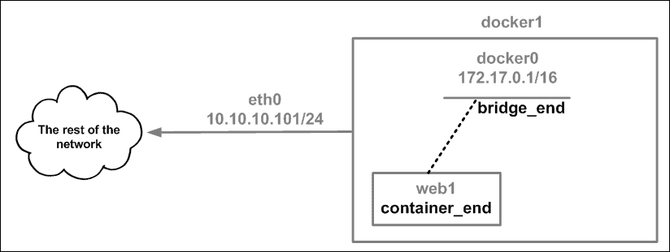
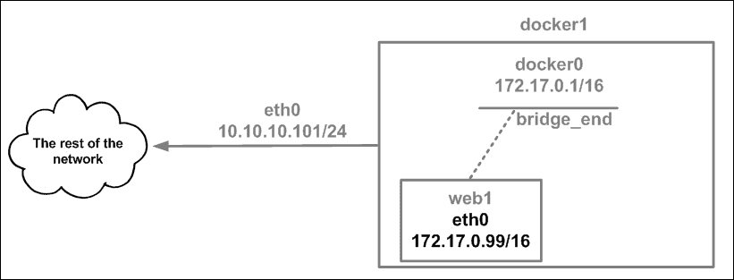
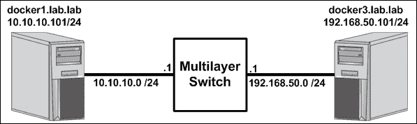

# 第四章。构建Docker网络

在本章中，我们将介绍以下食谱:

*   手动联网容器
*   指定您自己的桥
*   使用 OVS 大桥
*   使用 OVS 桥连接 Docker 主机
*   OVS 和多克在一起

# 简介

正如我们在前面几章中看到的，Docker 在处理许多容器网络需求方面做得很好。但是，这并不限制您只使用 Docker 提供的网络元素来连接容器。因此，虽然 Docker 可以为您简化网络，但您也可以手动连接容器。这种方法的缺点是 Docker 不知道容器的网络状态，因为它不涉及网络供应。正如我们将在[第 7 章](07.html "Chapter 7. Working with Weave Net")、*中看到的，与 Weave Net* 一起工作，Docker 现在还支持定制或第三方网络驱动程序，有助于弥合本机 Docker 与第三方或定制容器网络配置之间的差距。

# 手动联网容器

在[第 1 章](01.html "Chapter 1. Linux Networking Constructs")、 *Linux 网络结构*和[第 2 章](02.html "Chapter 2. Configuring and Monitoring Docker Networks")、*配置和监控 Docker 网络*中，我们回顾了常见的 Linux 网络结构，并介绍了容器网络的 Docker 原生选项。在本食谱中，我们将介绍如何像 Docker 在默认桥接网络模式中所做的那样手动网络容器。理解 Docker 如何处理容器的网络供应是理解容器网络的非本地选项的关键组成部分。

## 做好准备

在本食谱中，我们将在单个 Docker 主机上演示配置。假设该主机安装了 Docker，并且 Docker 处于默认配置。为了查看和操作网络设置，您需要确保安装了`iproute2`工具集。如果系统上没有，可以使用以下命令进行安装:

```
sudo apt-get install iproute2 
```

为了对主机进行网络更改，您还需要根级访问。

## 怎么做…

为了手动配置容器的网络，我们需要明确告诉 Docker 不要在运行时配置容器的网络。为此，我们使用`none`的网络模式运行一个容器。例如，我们可以使用以下语法在没有任何网络配置的情况下启动一个 web 服务器容器:

```
user@docker1:~$ docker run --name web1 --net=none -d \
jonlangemak/web_server_1
c108ca80db8a02089cb7ab95936eaa52ef03d26a82b1e95ce91ddf6eef942938
user@docker1:~$
```

容器启动后，我们可以使用`docker exec`子命令检查其网络配置:

```
user@docker1:~$ docker exec web1 ip addr
1: lo: <LOOPBACK,UP,LOWER_UP> mtu 65536 qdisc noqueue state UNKNOWN qlen 1
    link/loopback 00:00:00:00:00:00 brd 00:00:00:00:00:00
    inet 127.0.0.1/8 scope host lo
       valid_lft forever preferred_lft forever
    inet6 ::1/128 scope host
       valid_lft forever preferred_lft forever
user@docker1:~$ 
```

正如您所看到的，除了本地环回接口之外，容器没有定义任何接口。此时，没有办法连接到容器。我们所做的基本上是在一个泡泡里创造了一个容器:


因为我们的目标是模仿默认的网络配置，我们现在需要找到一种方法将容器`web1`连接到`docker0`桥，并从桥的 IP 分配中为其分配一个 IP 地址(`172.17.0.0/16`)。

也就是说，我们需要做的第一件事是创建接口，我们将使用这些接口将容器连接到`docker0`桥。正如我们在[第 1 章](01.html "Chapter 1. Linux Networking Constructs")、 *Linux 网络结构*中看到的，Linux 有一个名为**虚拟以太网** ( **VETH** )对的网络组件，它将很好地实现这一目的。接口的一端将连接到`docker0`桥，另一端将连接到容器。

让我们从创建我们的 VETH 对开始:

```
user@docker1:~$ sudo ip link add bridge_end type veth \
peer name container_end
user@docker1:~$ ip link show
…<Additional output removed for brevity>…
5: container_end@bridge_end: <BROADCAST,MULTICAST,M-DOWN> mtu 1500 qdisc noop state DOWN mode DEFAULT group default qlen 1000
    link/ether ce:43:d8:59:ac:c1 brd ff:ff:ff:ff:ff:ff
6: bridge_end@container_end: <BROADCAST,MULTICAST,M-DOWN> mtu 1500 qdisc noop state DOWN mode DEFAULT group default qlen 1000
    link/ether 72:8b:e7:f8:66:45 brd ff:ff:ff:ff:ff:ff
user@docker1:~$
```

正如预期的那样，我们现在有两个相互直接关联的接口。现在让我们将一端绑定到`docker0`桥，并打开界面:

```
user@docker1:~$ sudo ip link set dev bridge_end master docker0
user@docker1:~$ sudo ip link set bridge_end up
user@docker1:~$ ip link show bridge_end
6: bridge_end@container_end: <NO-CARRIER,BROADCAST,MULTICAST,UP,M-DOWN> mtu 1500 qdisc pfifo_fast master docker0 state LOWERLAYERDOWN mode DEFAULT group default qlen 1000
    link/ether 72:8b:e7:f8:66:45 brd ff:ff:ff:ff:ff:ff
user@docker1:~$

```

### 注

此时界面的状态将显示为`LOWERLAYERDOWN`。这是因为接口的另一端未绑定，仍处于关闭状态。

下一步是将 VETH 对的另一端连接到容器。这就是事情变得有趣的地方。Docker 在自己的网络命名空间中创建每个容器。这意味着 VETH 对的另一端需要落在容器的网络命名空间中。诀窍是确定容器的网络名称空间是什么。给定容器的命名空间可以以两种不同的方式定位。

第一种方式依赖于将容器的**进程标识** ( **PID** )与定义的网络名称空间相关联。它比第二种方法更复杂，但是为您提供了一些关于网络名称空间内部的良好背景。您可能还记得[第 3 章](03.html "Chapter 3. User-Defined Networks")、*用户定义的网络*，默认情况下，我们不能使用命令行工具`ip netns`来查看 Docker 创建的名称空间。为了查看它们，我们需要创建一个符号链接，将 Docker 存储其网络名称空间的位置(`/var/run/docker/netns`)与`ip netns`正在查看的位置(`/var/run/netns`)联系起来:

```
user@docker1:~$ cd /var/run
user@docker1:/var/run$ sudo ln -s /var/run/docker/netns netns
```

现在，如果我们尝试列出名称空间，我们应该会在返回中看到至少一个名称空间:

```
user@docker1:/var/run$ sudo ip netns list
712f8a477cce
default
user@docker1:/var/run$
```

但是我们如何知道这是与这个容器相关联的命名空间呢？为了做出这个决定，我们首先需要找到有问题的容器的 PID。我们可以通过检查容器来检索这些信息:

```
user@docker1:~$ docker inspect web1
…<Additional output removed for brevity>…
        "State": {
            "Status": "running",
            "Running": true,
            "Paused": false,
            "Restarting": false,
            "OOMKilled": false,
            "Dead": false,
            "Pid": 3156,
            "ExitCode": 0,
            "Error": "",
            "StartedAt": "2016-10-05T21:32:00.163445345Z",
            "FinishedAt": "0001-01-01T00:00:00Z"
        },
…<Additional output removed for brevity>…
user@docker1:~$ 
```

现在我们有了 PID，我们可以使用`ip netns identify`子命令从 PID 中找到网络命名空间名称:

```
user@docker1:/var/run$ sudo ip netns identify 3156
712f8a477cce
user@docker1:/var/run$ 
```

### 注

即使您选择使用第二种方法，也要确保您创建了符号链接，以便`ip netns`为后面的步骤工作。

第二种方式找到容器网络命名空间要容易得多。我们可以简单地检查和参考容器的网络配置:

```
user@docker1:~$ docker inspect web1
…<Additional output removed for brevity>… 
"NetworkSettings": {
            "Bridge": "",
            "SandboxID": "712f8a477cceefc7121b2400a22261ec70d6a2d9ab2726cdbd3279f1e87dae22",
            "HairpinMode": false,
            "LinkLocalIPv6Address": "",
            "LinkLocalIPv6PrefixLen": 0,
            "Ports": {},
 "SandboxKey": "/var/run/docker/netns/712f8a477cce",
            "SecondaryIPAddresses": null,
            "SecondaryIPv6Addresses": null,
            "EndpointID": "", 
…<Additional output removed for brevity>… 
user@docker1:~$
```

请注意名为`SandboxKey`的字段。您会注意到文件路径引用了我们所说的 Docker 存储其网络名称空间的位置。此路径中引用的文件名是容器网络命名空间的名称。Docker 将网络名称空间称为沙箱，因此使用了命名约定。

现在我们有了网络命名空间名称，我们可以在容器和`docker0`桥之间建立连接。回想一下，VETH 对可以用来将网络名称空间连接在一起。在这个例子中，我们将把 VETH 对的容器端放在容器的网络名称空间中。这将把容器桥接到`docker0`桥上的默认网络命名空间。为此，我们将首先将 VETH 对的容器端移动到我们之前发现的命名空间中:

```
user@docker1:~$ sudo ip link set container_end netns 712f8a477cce

```

我们可以使用`docker exec`子命令验证 VETH 对是否在命名空间中:

```
user@docker1:~$ docker exec web1 ip link show
1: lo: <LOOPBACK,UP,LOWER_UP> mtu 65536 qdisc noqueue state UNKNOWN
    link/loopback 00:00:00:00:00:00 brd 00:00:00:00:00:00
5: container_end@if6: <BROADCAST,MULTICAST> mtu 1500 qdisc noop state DOWN qlen 1000
    link/ether 86:15:2a:f7:0e:f9 brd ff:ff:ff:ff:ff:ff
user@docker1:~$
```

至此，我们已经使用 VETH 对成功地将容器和默认命名空间桥接在一起，因此我们的连接现在看起来如下所示:



然而，容器`web1`仍然缺乏任何类型的 IP 连接，因为它还没有被分配一个可路由的 IP 地址。回想一下[第一章](01.html "Chapter 1. Linux Networking Constructs")、 *Linux 网络构造*，我们看到一个 VETH 对接口可以直接分配一个 IP 地址。为了给容器一个可路由的 IP 地址，Docker 只需从`docker0`桥子网分配一个未使用的 IP 地址到 VETH 对的容器端。

### 注

IPAM 是一个巨大的优势，允许 Docker 为您管理您的容器网络。没有 IPAM，你将需要自己跟踪分配，并确保你不会分配任何重叠的 IP 地址。

```
user@docker1:~$ sudo ip netns exec 712f8a477cce ip \
addr add 172.17.0.99/16 dev container_end
```

在这一点上，我们可以打开接口，我们应该可以从主机到达容器。但在此之前，让我们将`container_end` VETH 对重新命名为`eth0`，让事情变得更加清晰:

```
user@docker1:~$ sudo ip netns exec 712f8a477cce ip link \
set dev container_end name eth0
```

现在我们可以调出新命名的`eth0`界面，这是 VETH 对的容器端:

```
user@docker1:~$ sudo ip netns exec 712f8a477cce ip link \
set eth0 up
user@docker1:~$ ip link show bridge_end
6: bridge_end@if5: <BROADCAST,MULTICAST,UP,LOWER_UP> mtu 1500 qdisc pfifo_fast master docker0 state UP mode DEFAULT group default qlen 1000
    link/ether 86:04:ed:1b:2a:04 brd ff:ff:ff:ff:ff:ff
user@docker1:~$ sudo ip netns exec 4093b3b4e672 ip link show eth0
5: eth0@if6: <BROADCAST,MULTICAST,UP,LOWER_UP> mtu 1500 qdisc pfifo_fast state UP mode DEFAULT group default qlen 1000
    link/ether 86:15:2a:f7:0e:f9 brd ff:ff:ff:ff:ff:ff
user@docker1:~$ sudo ip netns exec 4093b3b4e672 ip addr show eth0
5: eth0@if6: <BROADCAST,MULTICAST,UP,LOWER_UP> mtu 1500 qdisc pfifo_fast state UP group default qlen 1000
    link/ether 86:15:2a:f7:0e:f9 brd ff:ff:ff:ff:ff:ff
    inet 172.17.0.99/16 scope global eth0
       valid_lft forever preferred_lft forever
    inet6 fe80::8415:2aff:fef7:ef9/64 scope link
       valid_lft forever preferred_lft forever
user@docker1:~$
```

如果我们从主机检查，我们现在应该可以到达容器:

```
user@docker1:~$ ping 172.17.0.99 -c 2
PING 172.17.0.99 (172.17.0.99) 56(84) bytes of data.
64 bytes from 172.17.0.99: icmp_seq=1 ttl=64 time=0.104 ms
64 bytes from 172.17.0.99: icmp_seq=2 ttl=64 time=0.045 ms
--- 172.17.0.99 ping statistics ---
2 packets transmitted, 2 received, 0% packet loss, time 999ms
rtt min/avg/max/mdev = 0.045/0.074/0.104/0.030 ms
user@docker1:~$
user@docker1:~$ curl http://172.17.0.99
<body>
  <html>
    <h1><span style="color:#FF0000;font-size:72px;">Web Server #1 - Running on port 80</span></h1>
</body>
  </html>
user@docker1:~$
```

连接就绪后，我们的拓扑现在如下所示:



因此，虽然我们有 IP 连接，但它只适用于同一子网中的主机。最后剩下的部分将是解决主机级别的容器连接问题。对于出站连接，主机将容器的 IP 地址隐藏在主机接口的 IP 地址后面。对于入站连接，在默认网络模式下，Docker 使用端口映射将 Docker 主机网卡上的随机高端口映射到容器的公开端口。

在这种情况下，解决出站问题就像给容器一个指向`docker0`桥的默认路由，并确保您有一个网络过滤器伪装规则来覆盖它一样简单:

```
user@docker1:~$ sudo ip netns exec 712f8a477cce ip route \
add default via 172.17.0.1
user@docker1:~$ docker exec -it web1 ping 4.2.2.2 -c 2
PING 4.2.2.2 (4.2.2.2): 48 data bytes
56 bytes from 4.2.2.2: icmp_seq=0 ttl=50 time=39.764 ms
56 bytes from 4.2.2.2: icmp_seq=1 ttl=50 time=40.210 ms
--- 4.2.2.2 ping statistics ---
2 packets transmitted, 2 packets received, 0% packet loss
round-trip min/avg/max/stddev = 39.764/39.987/40.210/0.223 ms
user@docker1:~$
```

如果您使用的是`docker0`桥，就像我们在这个例子中所做的那样，您不需要添加一个自定义的网络过滤器伪装规则。这是因为默认伪装规则已经覆盖了`docker0`网桥的整个子网:

```
user@docker1:~$ sudo iptables -t nat -L
…<Additional output removed for brevity>…
Chain POSTROUTING (policy ACCEPT)
target     prot opt source               destination
MASQUERADE  all  --  172.17.0.0/16        anywhere
…<Additional output removed for brevity>…
user@docker1:~$
```

对于入站服务，我们需要创建一个自定义规则，使用**网络地址转换** ( **NAT** )将主机上的随机高端口映射到容器中暴露的服务端口。我们可以用这样的规则来做到:

```
user@docker1:~$ sudo iptables -t nat -A DOCKER ! -i docker0 -p tcp -m tcp \
--dport 32799 -j DNAT --to-destination 172.17.0.99:80
```

在这个案例中，我们将主机接口上的端口`32799`NAT 到容器上的端口`80`。这将允许外部网络上的系统通过端口`32799`上的 Docker 主机接口访问运行在`web1`的网络服务器。

最后，我们成功复制了 Docker 在默认网络模式下提供的功能:


这应该会让你对 Docker 在幕后所做的事情有所了解。跟踪容器 IP 寻址、已发布端口的端口分配和`iptables`规则集是 Docker 代表您跟踪的三件主要事情。鉴于容器的短暂性，这几乎不可能手动完成。

# 指定自己的桥

在的大多数网络场景中，Docker 严重依赖`docker0`桥。`docker0`桥在 Docker 引擎服务启动时自动创建，是 Docker 服务产生的任何容器的默认连接点。我们还在早期的食谱中看到，可以在服务级别修改这个桥的一些属性。在这个食谱中，我们将向您展示如何告诉 Docker 使用一个完全不同的桥。

## 做好准备

在本食谱中，我们将在单个 Docker 主机上演示配置。假设该主机安装了 Docker，并且 Docker 处于默认配置。为了查看和操作网络设置，您需要确保安装了`iproute2`工具集。如果系统上没有，可以使用以下命令进行安装:

```
sudo apt-get install iproute2 
```

为了对主机进行网络更改，您还需要根级访问。

## 怎么做…

与任何其他服务级别参数一样，为 Docker 指定不同的桥是通过更新我们在[第 2 章](02.html "Chapter 2. Configuring and Monitoring Docker Networks")、*中向您展示如何创建的系统插件文件*来完成的。

在我们指定新的桥之前，让我们首先确保没有容器在运行，停止 Docker 服务，并删除`docker0`桥:

```
user@docker1:~$ docker ps -a
CONTAINER ID        IMAGE               COMMAND             CREATED             STATUS              PORTS               NAMES
user@docker1:~$
user@docker1:~$ sudo systemctl stop docker
user@docker1:~$
user@docker1:~$ sudo ip link delete dev docker0
user@docker1:~$
user@docker1:~$ ip link show dev docker0
Device "docker0" does not exist.
user@docker1:~$
```

此时，默认的`docker0`桥已经被删除。现在，让我们创建一个新的桥供 Docker 使用。

### 注

如果您不熟悉`iproute2`命令行工具，请参考[第 1 章](01.html "Chapter 1. Linux Networking Constructs")、 *Linux 网络结构*中的示例。

```
user@docker1:~$ sudo ip link add mybridge1 type bridge
user@docker1:~$ sudo ip address add 10.11.12.1/24 dev mybridge1
user@docker1:~$ sudo ip link set dev mybridge1 up
user@docker1:~$ ip addr show dev mybridge1
7: mybridge1: <BROADCAST,MULTICAST,UP,LOWER_UP> mtu 1500 qdisc noqueue state UNKNOWN group default
    link/ether 9e:87:b4:7b:a3:c0 brd ff:ff:ff:ff:ff:ff
    inet 10.11.12.1/24 scope global mybridge1
       valid_lft forever preferred_lft forever
    inet6 fe80::9c87:b4ff:fe7b:a3c0/64 scope link
       valid_lft forever preferred_lft forever
user@docker1:~$
```

我们首先创建了一个名为`mybridge1`的桥，然后给它一个`10.11.12.1/24`的 IP 地址，最后打开了接口。此时，接口已启动并可到达。我们现在可以告诉 Docker 使用这个桥作为它的默认桥。为此，请编辑 Docker 的 systemd 插件文件，并确保最后一行内容如下:

```
ExecStart=/usr/bin/dockerd --bridge=mybridge1
```

现在保存文件，重新加载系统配置，并启动 Docker 服务:

```
user@docker1:~$ sudo systemctl daemon-reload
user@docker1:~$ sudo systemctl start docker
```

现在如果我们启动一个容器，我们应该看到它被分配到桥`mybridge1`:

```
user@docker1:~$ docker run --name web1 -d -P jonlangemak/web_server_1
e8a05afba6235c6d8012639aa79e1732ed5ff741753a8c6b8d9c35a171f6211e
user@docker1:~$ ip link show
1: lo: <LOOPBACK,UP,LOWER_UP> mtu 65536 qdisc noqueue state UNKNOWN mode DEFAULT group default qlen 1
    link/loopback 00:00:00:00:00:00 brd 00:00:00:00:00:00
2: eth0: <BROADCAST,MULTICAST,UP,LOWER_UP> mtu 1500 qdisc pfifo_fast state UP mode DEFAULT group default qlen 1000
    link/ether 62:31:35:63:65:63 brd ff:ff:ff:ff:ff:ff
3: eth1: <BROADCAST,MULTICAST> mtu 1500 qdisc noop state DOWN mode DEFAULT group default qlen 1000
    link/ether 36:b3:5c:94:c0:a6 brd ff:ff:ff:ff:ff:ff
17: mybridge1: <BROADCAST,MULTICAST,UP,LOWER_UP> mtu 1500 qdisc noqueue state UP mode DEFAULT group default qlen 1000
    link/ether 7a:1b:30:e6:94:b7 brd ff:ff:ff:ff:ff:ff
22: veth68fb58a@if21: <BROADCAST,MULTICAST,UP,LOWER_UP> mtu 1500 qdisc noqueue master mybridge1 state UP mode DEFAULT group default
    link/ether 7a:1b:30:e6:94:b7 brd ff:ff:ff:ff:ff:ff link-netnsid 0
user@docker1:~$
```

请注意，服务启动时并未创建`docker0`桥。另外，请注意，我们在默认名称空间中看到了主接口为`mybridge1`的 VETH 对的一侧。

利用我们从本章第一个食谱中学到的知识，我们还可以确认 VETH 对的另一端在容器的网络命名空间中:

```
user@docker1:~$ docker inspect web1 | grep SandboxKey
            "SandboxKey": "/var/run/docker/netns/926ddab911ae",
user@docker1:~$ 
user@docker1:~$ sudo ip netns exec 926ddab911ae ip link show
1: lo: <LOOPBACK,UP,LOWER_UP> mtu 65536 qdisc noqueue state UNKNOWN mode DEFAULT group default qlen 1
    link/loopback 00:00:00:00:00:00 brd 00:00:00:00:00:00
21: eth0@if22: <BROADCAST,MULTICAST,UP,LOWER_UP> mtu 1500 qdisc noqueue state UP mode DEFAULT group default
    link/ether 02:42:0a:0b:0c:02 brd ff:ff:ff:ff:ff:ff link-netnsid 0
user@docker1:~$ 
```

我们可以判断这是一个 VETH 对，因为它使用了`<interface>@<interface>`命名语法。如果我们比较 VETH 对接口号，我们可以看到这两个与 VETH 对的主机端匹配，索引为`22`，连接到 VETH 对的容器端，索引为`21`。

### 注

您可能会注意到，我在使用`ip netns exec`和`docker exec`命令来执行容器内的命令之间切换。这样做的目的不是为了混淆视听，而是为了表明 Docker 正在为你做什么。需要注意的是，为了使用`ip netns exec`语法，你需要符号链接，我们在之前的配方中已经演示过了。只有在手动配置名称空间时，才需要使用`ip netns exec`。

如果我们查看容器的网络配置，我们可以看到 Docker 在`mybridge1`子网范围内为其分配了一个 IP 地址:

```
user@docker1:~$ docker exec web1 ip addr show dev eth0
8: eth0@if9: <BROADCAST,MULTICAST,UP,LOWER_UP> mtu 1500 qdisc noqueue state UP
    link/ether 02:42:0a:0b:0c:02 brd ff:ff:ff:ff:ff:ff
    inet 10.11.12.2/24 scope global eth0
       valid_lft forever preferred_lft forever
    inet6 fe80::42:aff:fe0b:c02/64 scope link
       valid_lft forever preferred_lft forever
user@docker1:~$
```

Docker 现在也在跟踪桥的 IP 分配，因为它分配容器 IP 地址。IP 地址管理是 Docker 在容器网络空间中提供的一个被低估的大值。将 IP 地址映射到容器并自行管理将是一项重大任务。

最后一部分是处理容器的 NAT 配置。由于`10.11.12.0/24`空间是不可路由的，我们需要在 Docker 主机上的物理接口后面隐藏或伪装容器的 IP 地址。幸运的是，只要 Docker 为您管理桥，Docker 仍然会负责制定适当的网络过滤器规则。我们可以通过检查网络过滤器规则集来确保这一点:

```
user@docker1:~$ sudo iptables -t nat -L -n
…<Additional output removed for brevity>…
Chain POSTROUTING (policy ACCEPT)
target     prot opt source               destination
MASQUERADE  all  --  10.11.12.0/24        0.0.0.0/0
…<Additional output removed for brevity>…
Chain DOCKER (2 references)
target     prot opt source               destination
RETURN     all  --  0.0.0.0/0            0.0.0.0/0
DNAT       tcp  --  0.0.0.0/0            0.0.0.0/0            tcp dpt:32768 to:10.11.12.2:80

```

此外，由于我们用`-P`标志公开了容器上的端口，入站 NAT 也被分配了。我们也可以在前面相同输出的 DOCKER 链中看到这种 NAT 转换。总之，只要您使用的是 Linux 桥，Docker 就会像处理`docker0`桥一样为您处理整个配置。

# 使用 OVS 大桥

对于正在寻找附加功能的用户来说，**openvsswitch**(**OVS**)正在成为原生 Linux 桥的热门替代品。OVS 以稍微高一点的复杂性为代价，对 Linux 桥进行了戏剧性的增强。例如，一个 OVS 桥不能被我们一直使用的`iproute2`工具集直接管理，它需要自己的命令行管理工具。然而，如果你正在寻找 Linux 桥上不存在的特性，OVS 可能是你最好的选择。Docker 不能本地管理 OVS 桥，所以使用它需要您手动建立桥和容器之间的连接。也就是说，我们不能只告诉 Docker 服务使用 OVS 桥而不是默认的`docker0`桥。在本食谱中，我们将展示如何安装、配置容器，并将容器直接连接到 OVS 桥，而不是标准的`docker0`桥。

## 做好准备

在本食谱中，我们将在单个 Docker 主机上演示配置。假设该主机安装了 Docker，并且 Docker 处于默认配置。为了查看和操作网络设置，您需要确保安装了`iproute2`工具集。如果系统上没有，可以使用以下命令进行安装:

```
sudo apt-get install iproute2 
```

为了对主机进行网络更改，您还需要根级访问。

## 怎么做…

我们需要执行的第一步是在 Docker 主机上安装 OVS。为此，我们可以直接下拉 OVS 包:

```
user@docker1:~$ sudo apt-get install openvswitch-switch
```

如前所述，OVS 有自己的命令行工具集，其中一个工具名为`ovs-vsctl`，用于直接管理 OVS 大桥。更具体地说，`ovs-vsctl`用于查看和操作 OVS 配置数据库。为了确保正确安装 OVS，我们可以运行以下命令:

```
user@docker1:~$ sudo ovs-vsctl -V
ovs-vsctl (Open vSwitch) 2.5.0
Compiled Mar 10 2016 14:16:49
DB Schema 7.12.1
user@docker1:~$ 
```

这将返回 OVS 版本号，并验证我们与 OVS 有通信。我们接下来要做的是建造一座 OVS 大桥。为此，我们将再次使用`ovs-vsctl`命令行工具:

```
user@docker1:~$ sudo ovs-vsctl add-br ovs_bridge
```

该命令将添加一个名为`ovs_bridge`的 OVS 桥。创建后，我们可以像查看任何其他网络接口一样查看网桥接口:

```
user@docker1:~$ ip link show dev ovs_bridge
6: ovs_bridge: <BROADCAST,MULTICAST> mtu 1500 qdisc noop state DOWN mode DEFAULT group default qlen 1
    link/ether b6:45:81:aa:7c:47 brd ff:ff:ff:ff:ff:ff
user@docker1:~$ 
```

然而，要查看任何特定于桥的信息，我们将再次需要依赖`ocs-vsctl`命令行工具。我们可以使用`show`子命令查看有关桥梁的信息:

```
user@docker1:~$ sudo ovs-vsctl show
0f2ced94-aca2-4e61-a844-fd6da6b2ce38
    Bridge ovs_bridge
        Port ovs_bridge
            Interface ovs_bridge
                type: internal
    ovs_version: "2.5.0"
user@docker1:~$ 
```

给 OVS 桥分配一个 IP 地址并改变它的状态可以再次使用更熟悉的`iproute2`工具来完成:

```
user@docker1:~$ sudo ip addr add dev ovs_bridge 10.11.12.1/24
user@docker1:~$ sudo ip link set dev ovs_bridge up
```

一旦启动，该接口就像任何其他桥接接口一样工作。我们可以看到 IP 接口已打开，本地主机可以直接访问它:

```
user@docker1:~$ ip addr show dev ovs_bridge
6: ovs_bridge: <BROADCAST,MULTICAST,UP,LOWER_UP> mtu 1500 qdisc noqueue state UNKNOWN group default qlen 1
    link/ether b6:45:81:aa:7c:47 brd ff:ff:ff:ff:ff:ff
    inet 10.11.12.1/24 scope global ovs_bridge
       valid_lft forever preferred_lft forever
    inet6 fe80::b445:81ff:feaa:7c47/64 scope link
       valid_lft forever preferred_lft forever
user@docker1:~$ 
user@docker1:~$ ping 10.11.12.1 -c 2
PING 10.11.12.1 (10.11.12.1) 56(84) bytes of data.
64 bytes from 10.11.12.1: icmp_seq=1 ttl=64 time=0.036 ms
64 bytes from 10.11.12.1: icmp_seq=2 ttl=64 time=0.025 ms
--- 10.11.12.1 ping statistics ---
2 packets transmitted, 2 received, 0% packet loss, time 999ms
rtt min/avg/max/mdev = 0.025/0.030/0.036/0.007 ms
user@docker1:~$
```

我们要做的下一件事是创建我们的 VETH 对，我们将使用它将一个容器连接到 OVS 桥:

```
user@docker1:~$ sudo ip link add ovs_end1 type veth \
peer name container_end1
```

一旦创建，我们需要将 VETH 对的 OVS 端添加到 OVS 桥。这是 OVS 不同于标准 Linux 桥的一大领域。到 OVS 的每一个连接都是以港口的形式。这是一个比 Linux 桥提供的物理交换机更强的模仿。同样，因为我们直接与 OVS 桥交互，我们需要使用`ovs-vsctl`命令行工具:

```
user@docker1:~$ sudo ovs-vsctl add-port ovs_bridge ovs_end1
```

添加后，我们可以查询 OVS 以查看该桥的所有端口:

```
user@docker1:~$ sudo ovs-vsctl list-ports ovs_bridge
ovs_end1
user@docker1:~$
```

如果您检查已定义的接口，您将看到 VETH 对的 OVS 端将`ovs-system`列为其主接口:

```
user@docker1:~$ ip link show dev ovs_end1
8: ovs_end1@container_end1: <BROADCAST,MULTICAST> mtu 1500 qdisc noop master ovs-system state DOWN mode DEFAULT group default qlen 1000
    link/ether 56:e0:12:94:c5:43 brd ff:ff:ff:ff:ff:ff
user@docker1:~$
```

在不涉及太多细节的情况下，这是意料之中的。`ovs-system`界面代表 OVS 数据路径。目前，只知道这是意料之中的行为。

现在 OVS 端已经完成，我们需要关注容器端。这里的第一步是启动一个没有任何网络配置的容器。接下来，我们将按照前面相同的步骤手动将容器命名空间连接到 VETH 对的另一端:

*   启动容器:

    ```
    docker run --name web1 --net=none -d jonlangemak/web_server_1
    ```

*   找到容器网络名称空间:

    ```
    docker inspect web1 | grep SandboxKey
    "SandboxKey": "/var/run/docker/netns/54b7dfc2e422"
    ```

*   将 VETH 对的容器端移到该名称空间中:

    ```
    sudo ip link set container_end1 netns 54b7dfc2e422
    ```

*   将 VETH 界面重命名为`eth0` :

    ```
    sudo ip netns exec 54b7dfc2e422 ip link set dev \
    container_end1 name eth0
    ```

*   将`eth0`接口的 IP 地址设置为该子网中的有效 IP:

    ```
    sudo ip netns exec 54b7dfc2e422 ip addr add \
    10.11.12.99/24 dev eth0
    ```

*   调出容器侧界面

    ```
    sudo ip netns exec 54b7dfc2e422 ip link set dev eth0 up
    ```

*   将 VETH 配对中的 OVS 一方拉上来:

    ```
    sudo ip link set dev ovs_end1 up
    ```

此时，容器已成功连接到 OVS，并可通过主机访问:

```
user@docker1:~$ ping 10.11.12.99 -c 2
PING 10.11.12.99 (10.11.12.99) 56(84) bytes of data.
64 bytes from 10.11.12.99: icmp_seq=1 ttl=64 time=0.469 ms
64 bytes from 10.11.12.99: icmp_seq=2 ttl=64 time=0.028 ms
--- 10.11.12.99 ping statistics ---
2 packets transmitted, 2 received, 0% packet loss, time 999ms
rtt min/avg/max/mdev = 0.028/0.248/0.469/0.221 ms
user@docker1:~$
```

如果我们想更深入地了解 OVS，我们可以使用以下命令检查交换机的媒体访问控制地址表:

```
user@docker1:~$ sudo ovs-appctl fdb/show ovs_bridge
port  VLAN  MAC                Age
LOCAL     0  b6:45:81:aa:7c:47    7
 1     0  b2:7e:e8:42:58:39    7 
user@docker1:~$
```

请注意它在端口`1`上获知的媒体访问控制地址。但是什么是端口`1`？要查看给定 OVS 的所有端口，可以使用以下命令:

```
user@docker1:~$ sudo ovs-dpctl show
system@ovs-system:
        lookups: hit:13 missed:11 lost:0
        flows: 0
        masks: hit:49 total:1 hit/pkt:2.04
        port 0: ovs-system (internal)
 port 1: ovs_bridge (internal)
        port 2: ovs_end1 
user@docker1:~$
```

在这里，我们可以看到`port 1`是我们提供的 OVS 桥，也是我们将 VETH 对的 OVS 端连接到的桥。

正如我们所看到的，连接到 OVS 需要大量的工作。幸运的是，有一些很好的工具可以帮助使这变得容易得多。其中一个比较著名的工具是由杰罗姆·佩塔佐尼制造的，名叫**管道**。它可以在 GitHub 上找到，网址如下:

[https://github . com/jpetazzo/pipework](https://github.com/jpetazzo/pipework)

如果我们使用管道工程来测量与 OVS 的连接，并假设桥梁已经建立，我们可以采取从`6`到`1`将容器连接到桥梁所需的步骤数。

要使用管道工程，您必须首先从 GitHub 下载它。这可以通过使用 Git 客户端来完成:

```
user@docker1:~$ git clone https://github.com/jpetazzo/pipework
…<Additional output removed for brevity>… 
user@docker1:~$ cd pipework/
user@docker1:~/pipework$ ls
docker-compose.yml  doctoc  LICENSE  pipework  pipework.spec  README.md
user@docker1:~/pipework$
```

为了演示如何使用管道工程，让我们在没有任何网络配置的情况下启动一个名为`web2`的新容器:

```
user@docker1:~$ docker run --name web2 --net=none -d \
jonlangemak/web_server_2
985384d0b0cd1a48cb04de1a31b84f402197b2faade87d073e6acdc62cf29151
user@docker1:~$
```

现在，要将这个容器连接到我们现有的 OVS 桥，我们所要做的就是运行以下命令，该命令指定 OVS 桥的名称、容器名称以及我们希望分配给容器的 IP 地址:

```
user@docker1:~/pipework$ sudo ./pipework ovs_bridge \
web2 10.11.12.100/24
Warning: arping not found; interface may not be immediately reachable
user@docker1:~/pipework$
```

管道为我们处理所有的分支工作，包括将容器名称解析为网络名称空间，创建唯一的 VETH 对，将 VETH 对的末端正确地放置在容器中和指定的桥上，以及为容器分配一个 IP 地址。

管道还可以帮助我们在运行中为容器添加额外的接口。考虑到我们以网络模式`none`启动了该容器，基于第一管道配置，该容器目前仅连接到 OVS。但是，我们也可以使用管道工程将连接添加到`docker0`桥上:

```
user@docker1:~/pipework$ sudo ./pipework docker0 -i eth0 web2 \
172.17.0.100/16@172.17.0.1
```

语法类似，但是在这种情况下，我们指定了我们想要使用的接口名称(`eth0`)，并且还为`172.17.0.1`的接口添加了一个网关。这将允许容器使用`docker0`桥作为默认网关，进而允许它使用默认的 Docker 伪装规则进行出站访问。我们可以通过几个`docker exec`命令来验证容器中的配置:

```
user@docker1:~/pipework$ docker exec web2 ip addr
1: lo: <LOOPBACK,UP,LOWER_UP> mtu 65536 qdisc noqueue state UNKNOWN qlen 1
    link/loopback 00:00:00:00:00:00 brd 00:00:00:00:00:00
    inet 127.0.0.1/8 scope host lo
       valid_lft forever preferred_lft forever
    inet6 ::1/128 scope host
       valid_lft forever preferred_lft forever
9: eth1@if10: <BROADCAST,MULTICAST,UP,LOWER_UP> mtu 1500 qdisc noqueue state UP qlen 1000
    link/ether da:40:35:ec:c2:45 brd ff:ff:ff:ff:ff:ff
    inet 10.11.12.100/24 scope global eth1
       valid_lft forever preferred_lft forever
    inet6 fe80::d840:35ff:feec:c245/64 scope link
       valid_lft forever preferred_lft forever
11: eth0@if12: <BROADCAST,MULTICAST,UP,LOWER_UP> mtu 1500 qdisc noqueue state UP qlen 1000
    link/ether 2a:d0:32:ef:e1:07 brd ff:ff:ff:ff:ff:ff
    inet 172.17.0.100/16 scope global eth0
       valid_lft forever preferred_lft forever
    inet6 fe80::28d0:32ff:feef:e107/64 scope link
       valid_lft forever preferred_lft forever
user@docker1:~/pipework$ docker exec web2 ip route
default via 172.17.0.1 dev eth0
10.11.12.0/24 dev eth1  proto kernel  scope link  src 10.11.12.100
172.17.0.0/16 dev eth0  proto kernel  scope link  src 172.17.0.100
user@docker1:~/pipework$ 
```

因此，虽然管道工程可以使许多手动工作变得更容易，但您应该始终查看 Docker 是否有本地方法来提供您正在寻找的网络连接。让 Docker 管理您的容器网络连接有很多好处，包括自动 IPAM 分配和对容器的入站和出站连接的网络过滤器配置。这些非本地配置中的许多已经有第三方 Docker 网络插件在工作，这将允许您从 Docker 无缝利用它们。

# 使用 OVS 桥连接 Docker 主机

之前的配方显示了我们如何使用 OVS 来代替标准的 Linux 桥。这本身并不是很有趣，因为它并不比标准的 Linux 桥做得更多。有趣的是，将 OVS 的一些更高级的特性与您的 Docker 容器结合使用。例如，一旦创建了 OVS 桥，在两个不同的 Docker 主机之间配置 GRE 隧道就变得相当简单了。这将允许连接到任一 Docker 主机的任何容器直接相互对话。在本食谱中，我们将讨论使用 OVS 提供的 GRE 隧道连接两台 Docker 主机所需的配置。

### 注

同样，这个食谱只是为了举例。Docker 的用户定义覆盖网络类型已经支持这种行为。如果出于某种原因你需要使用 GRE 而不是 VXLAN，这可能是一个合适的选择。一如既往，在开始定制自己的网络结构之前，请确保使用任何 Docker 本机网络结构。它会为你省下一段时间的头痛！

## 做好准备

在这个配方中，我们将在两台 Docker 主机上演示配置。主机需要能够通过网络相互通信。假设主机安装了 Docker，并且 Docker 处于默认配置。为了查看和操作网络设置，您需要确保安装了`iproute2`工具集。如果系统上没有，可以使用以下命令进行安装:

```
sudo apt-get install iproute2 
```

为了对主机进行网络更改，您还需要根级访问。

## 怎么做…

出于本食谱的目的，我们将从假设本示例中使用的两台主机上的基本配置开始。也就是说，每台主机只安装了 Docker，其配置与默认配置没有变化。

我们将使用的拓扑如下图所示。位于两个不同子网的两台 Docker 主机:



该配置的目标是在每台主机上配置 OVS，将容器连接到 OVS，然后将两台 OVS 交换机连接在一起，以允许 OVS 到 OVS 通过 GRE 直接通信。我们将在每台主机上按照以下步骤来完成:

1.  安装的
2.  增加一座名为`ovs_bridge`的 OVS 大桥。
3.  为网桥分配一个 IP 地址。
4.  运行网络模式设置为`none`的容器。
5.  使用管道将容器连接到 OVS 桥(假设您在每个主机上都安装了管道。如果没有，请参考之前的安装步骤)。
6.  使用 OVS 构建到另一台主机的 GRE 隧道。

让我们开始在第一台主机`docker1`上的配置:

```
user@docker1:~$ sudo apt-get install openvswitch-switch
…<Additional output removed for brevity>… 
Setting up openvswitch-switch (2.0.2-0ubuntu0.14.04.3) ...
openvswitch-switch start/running
user@docker1:~$
user@docker1:~$ sudo ovs-vsctl add-br ovs_bridge
user@docker1:~$ sudo ip addr add dev ovs_bridge 10.11.12.1/24
user@docker1:~$ sudo ip link set dev ovs_bridge up
user@docker1:~$
user@docker1:~$ docker run --name web1 --net=none -dP \
jonlangemak/web_server_1
5e6b335b12638a7efecae650bc8e001233842bb97ab07b32a9e45d99bdffe468
user@docker1:~$
user@docker1:~$ cd pipework
user@docker1:~/pipework$ sudo ./pipework ovs_bridge \
web1 10.11.12.100/24
Warning: arping not found; interface may not be immediately reachable
user@docker1:~/pipework$
```

此时，您应该有一个已经启动并运行的容器。您应该能够从本地 Docker 主机到达容器:

```
user@docker1:~$ curl http://10.11.12.100
<body>
  <html>
    <h1><span style="color:#FF0000;font-size:72px;">Web Server #1 - Running on port 80</span>
    </h1>
</body>
  </html>
user@docker1:~$
```

现在，让我们在第二台主机`docker3`上执行类似的配置:

```
user@docker3:~$ sudo apt-get install openvswitch-switch
…<Additional output removed for brevity>… 
Setting up openvswitch-switch (2.0.2-0ubuntu0.14.04.3) ...
openvswitch-switch start/running
user@docker3:~$
user@docker3:~$ sudo ovs-vsctl add-br ovs_bridge
user@docker3:~$ sudo ip addr add dev ovs_bridge 10.11.12.2/24
user@docker3:~$ sudo ip link set dev ovs_bridge up
user@docker3:~$
user@docker3:~$ docker run --name web2 --net=none -dP \
jonlangemak/web_server_2
155aff2847e27c534203b1ae01894b0b159d09573baf9844cc6f5c5820803278
user@docker3:~$
user@docker3:~$ cd pipework
user@docker3:~/pipework$ sudo ./pipework ovs_bridge web2 10.11.12.200/24
Warning: arping not found; interface may not be immediately reachable
user@docker3:~/pipework$
```

这就完成了第二台主机的配置。确保您能够连接到本地主机上运行的`web2`容器:

```
user@docker3:~$ curl http://10.11.12.200
<body>
  <html>
    <h1><span style="color:#FF0000;font-size:72px;">Web Server #2 - Running on port 80</span>
    </h1>
</body>
  </html>
user@docker3:~$
```

此时，我们的拓扑如下所示:


如果我们的目标是允许容器`web1`直接与容器`web2`对话，我们将有两个选择。首先，由于 Docker 不知道 OVS 交换机，因此它不会尝试基于与其连接的容器应用网络过滤规则。也就是说，通过正确的路由配置，这两个容器可以本地相互路由。然而，即使在这个微不足道的例子中，这也是一个很大的配置。由于我们在两台主机之间共享一个公共子网(Docker 在默认模式下也是如此)，因此配置变得不那么简单。要做到这一点，您需要做以下事情:

*   在每个容器中添加路由，告诉他们另一个容器的特定`/32`路由位于子网外。这是因为每个容器都认为整个`10.11.12.0/24`网络是本地的，因为它们在该网络上都有一个接口。你需要一个比`/24`更具体(更小)的前缀来强制容器到达目的地。
*   在每个 Docker 主机上添加路由，告诉他们其他容器的特定`/32`路由位于子网外。同样，这是因为每台主机都认为整个`10.11.12.0/24`网络是本地的，因为它们在该网络上都有一个接口。您需要一个比`/24`更具体(更小)的前缀来强制主机路由到达目的地。
*   在多层交换机上添加路由，这样就知道`10.11.12.100`可以通过`10.10.10.101` ( `docker1`)到达，`10.11.12.200`可以通过`192.168.50.101` ( `docker3`)到达。

现在想象一下，如果您使用的是真实的网络，并且必须在路径中的每台设备上添加这些路由。第二个也是更好的选择是在两座 OVS 大桥之间修建一条隧道。这将阻止网络看到`10.11.12.0/24`流量，这意味着它不需要知道如何路由它:


幸运的是对于我们来说，这个配置在 OVS 很容易做到。我们只需添加另一个 GRE 类型的 OVS 端口，指定另一个 Docker 主机作为远程隧道目的地。

在主机`docker1`上，按照以下步骤构建 GRE 隧道:

```
user@docker1:~$ sudo ovs-vsctl add-port ovs_bridge ovs_gre \
-- set interface ovs_gre type=gre options:remote_ip=192.168.50.101
```

在主机`docker3`上，按照以下步骤构建 GRE 隧道:

```
user@docker3:~$ sudo ovs-vsctl add-port ovs_bridge ovs_gre \
-- set interface ovs_gre type=gre options:remote_ip=10.10.10.101
```

此时，两个容器应该能够直接相互通信:

```
user@docker1:~$ docker exec -it web1 curl http://10.11.12.200
<body>
  <html>
    <h1><span style="color:#FF0000;font-size:72px;">Web Server #2 - Running on port 80</span>
    </h1>
</body>
  </html>
user@docker1:~$

user@docker3:~$ docker exec -it web2 curl http://10.11.12.100
<body>
  <html>
    <h1><span style="color:#FF0000;font-size:72px;">Web Server #1 - Running on port 80</span>
    </h1>
</body>
  </html>
user@docker3:~$
```

作为穿越 GRE 隧道的最后证明，我们可以在主机的一个物理接口上运行`tcpdump`，同时在容器之间执行 ping 测试:


# OVS 和多克在一起

在此之前的配方已经展示了手动配置 Docker 网络时可能出现的几种可能性。虽然这些都是可能的解决方案，但它们都需要相当多的手动干预和配置，并且在当前形式下不容易消耗。如果我们以前面的配方为例，有几个明显的缺点:

*   您负责跟踪容器上的 IP 分配，这增加了您将冲突的 IP 地址分配给不同容器的风险
*   没有动态端口映射或固有的出站伪装来促进容器和网络其余部分之间的通信
*   虽然我们使用管道工程来减轻配置负担，但仍有相当多的手动配置需要完成，以将容器连接到 OVS 大桥
*   默认情况下，大多数配置不会在主机重新启动时保持不变

也就是说，利用我们到目前为止所学的知识，有一种不同的方法可以利用 OVS 的 GRE 能力，同时仍然使用 Docker 来管理容器网络。在本食谱中，我们将回顾该解决方案，并描述如何使其成为一个更持久的解决方案，在主机重新启动后仍然存在。

### 注

同样，这个食谱只是为了举例。Docker 的用户定义覆盖网络类型已经支持这种行为。如果出于某种原因，您需要使用 GRE 而不是 VXLAN，这可能是一个合适的替代方案。一如既往，在开始定制自己的网络结构之前，请确保使用任何 Docker 本机网络结构。它会为你省下一段时间的头痛！

## 做好准备

在这个配方中，我们将在两台 Docker 主机上演示配置。主机需要能够通过网络相互通信。假设主机安装了 Docker，并且 Docker 处于默认配置。为了查看和操作网络设置，您需要确保安装了`iproute2`工具集。如果系统上没有，可以使用以下命令进行安装:

```
sudo apt-get install iproute2 
```

为了对主机进行网络更改，您还需要根级访问。

## 怎么做…

使用之前的灵感配方，我们的新拓扑看起来相似，但有一个显著的不同:


你会注意到每个主机现在都有一个名为`newbridge`的 Linux 桥。我们将告诉 Docker 使用这个桥而不是`docker0`桥来实现默认的容器连接。这意味着我们只是利用 OVS 的 GRE 能力，把它变成了 T2 的奴隶。将 Linux 桥用于容器连接意味着 Docker 能够为我们做 IPAM 以及处理入站和出站网络过滤规则。使用除`docker0`之外的桥更多的是与配置有关，而不是可用性，我们很快就会看到。

我们将再次从头开始配置，假设每台主机的默认配置中只安装了 Docker。我们要做的第一件事是配置我们将在每台主机上使用的两个网桥。我们先从主机`docker1`开始:

```
user@docker1:~$ sudo apt-get install openvswitch-switch
…<Additional output removed for brevity>…
Setting up openvswitch-switch (2.0.2-0ubuntu0.14.04.3) ...
openvswitch-switch start/running
user@docker1:~$
user@docker1:~$ sudo ovs-vsctl add-br ovs_bridge
user@docker1:~$ sudo ip link set dev ovs_bridge up
user@docker1:~$
user@docker1:~$ sudo ip link add newbridge type bridge
user@docker1:~$ sudo ip link set newbridge up
user@docker1:~$ sudo ip address add 10.11.12.1/24 dev newbridge
user@docker1:~$ sudo ip link set newbridge up
```

此时，我们在主机上配置了一个 OVS 桥和一个标准 Linux 桥。为了完成网桥配置，我们需要在 OVS 网桥上创建 GRE 接口，然后将 OVS 网桥绑定到 Linux 网桥:

```
user@docker1:~$ sudo ovs-vsctl add-port ovs_bridge ovs_gre \
-- set interface ovs_gre type=gre options:remote_ip=192.168.50.101
user@docker1:~$
user@docker1:~$ sudo ip link set ovs_bridge master newbridge
```

现在桥配置完成，我们可以告诉 Docker 使用`newbridge`作为其默认桥。我们通过编辑 systemd 插件文件并添加以下选项来做到这一点:

```
ExecStart=/usr/bin/dockerd --bridge=newbridge --fixed-cidr=10.11.12.128/26
```

注意除了告诉 Docker 使用不同的桥，我还告诉 Docker 只从`10.11.12.128/26`分配容器 IP 寻址。当我们配置第二个 Docker 主机(`docker3`)时，我们将告诉 Docker 只分配来自`10.11.12.192/26`的容器 IP 地址。这是一种黑客攻击，但它可以防止两台 Docker 主机发出重叠的 IP 地址，而不必知道另一台主机已经分配了什么。

### 注

[第 3 章](03.html "Chapter 3. User-Defined Networks")、*用户定义网络*演示了本地覆盖网络通过跟踪参与覆盖网络的所有主机之间的 IP 分配来解决这个问题。

为了让 Docker 使用新选项，我们需要重新加载系统配置并重新启动 Docker 服务:

```
user@docker1:~$ sudo systemctl daemon-reload
user@docker1:~$ sudo systemctl restart docker
```

最后，在不指定网络模式的情况下启动容器:

```
user@docker1:~$ docker run --name web1 -d -P jonlangemak/web_server_1
82c75625f8e5436164e40cf4c453ed787eab102d3d12cf23c86d46be48673f66
user@docker1:~$
user@docker1:~$ docker exec web1 ip addr
…<Additional output removed for brevity>…
8: eth0@if9: <BROADCAST,MULTICAST,UP,LOWER_UP> mtu 1500 qdisc noqueue state UP
    link/ether 02:42:0a:0b:0c:80 brd ff:ff:ff:ff:ff:ff
    inet 10.11.12.128/24 scope global eth0
       valid_lft forever preferred_lft forever
    inet6 fe80::42:aff:fe0b:c80/64 scope link
       valid_lft forever preferred_lft forever
user@docker1:~$
```

不出所料，我们运行的第一个容器获得了`10.11.12.128/26`网络中第一个可用的 IP 地址。现在，让我们继续配置第二台主机`docker3`:

```
user@docker3:~$ sudo apt-get install openvswitch-switch
…<Additional output removed for brevity>…
Setting up openvswitch-switch (2.0.2-0ubuntu0.14.04.3) ...
openvswitch-switch start/running
user@docker3:~$
user@docker3:~$ sudo ovs-vsctl add-br ovs_bridge
user@docker3:~$ sudo ip link set dev ovs_bridge up
user@docker3:~$
user@docker3:~$ sudo ip link add newbridge type bridge
user@docker3:~$ sudo ip link set newbridge up
user@docker3:~$ sudo ip address add 10.11.12.2/24 dev newbridge
user@docker3:~$ sudo ip link set newbridge up
user@docker3:~$
user@docker3:~$ sudo ip link set ovs_bridge master newbridge
user@docker3:~$ sudo ovs-vsctl add-port ovs_bridge ovs_gre \
-- set interface ovs_gre type=gre options:remote_ip=10.10.10.101
user@docker3:~$
```

在这个主机上，告诉 Docker 通过编辑 systemd 插件文件来使用以下选项:

```
ExecStart=/usr/bin/dockerd --bridge=newbridge --fixed-cidr=10.11.12.192/26
```

重新加载系统配置，重启 Docker 服务:

```
user@docker3:~$ sudo systemctl daemon-reload
user@docker3:~$ sudo systemctl restart docker
```

现在在此主机上旋转一个容器:

```
user@docker3:~$ docker run --name web2 -d -P jonlangemak/web_server_2
eb2b26ee95580a42568051505d4706556f6c230240a9c6108ddb29b6faed9949
user@docker3:~$
user@docker3:~$ docker exec web2 ip addr
…<Additional output removed for brevity>…
9: eth0@if10: <BROADCAST,MULTICAST,UP,LOWER_UP> mtu 1500 qdisc noqueue state UP
    link/ether 02:42:0a:0b:0c:c0 brd ff:ff:ff:ff:ff:ff
    inet 10.11.12.192/24 scope global eth0
       valid_lft forever preferred_lft forever
    inet6 fe80::42:aff:fe0b:cc0/64 scope link
       valid_lft forever preferred_lft forever
user@docker3:~$
```

在这一点上，每个容器应该能够通过 GRE 隧道与其他容器进行对话:

```
user@docker3:~$ docker exec -it web2 curl http://10.11.12.128
<body>
  <html>
    <h1><span style="color:#FF0000;font-size:72px;">Web Server #1 - Running on port 80</span>
    </h1>
</body>
  </html>
user@docker3:~$
```

此外，每个主机仍然拥有 Docker 通过 IPAM、发布端口和容器伪装出站访问提供的所有优势。

我们可以验证端口发布:

```
user@docker1:~$ docker port web1
80/tcp -> 0.0.0.0:32768
user@docker1:~$ curl http://localhost:32768
<body>
  <html>
    <h1><span style="color:#FF0000;font-size:72px;">Web Server #1 - Running on port 80</span>
    </h1>
</body>
  </html>
user@docker1:~$
```

我们可以通过默认的 Docker 伪装规则验证出站访问:

```
user@docker1:~$ docker exec -it web1 ping 4.2.2.2 -c 2
PING 4.2.2.2 (4.2.2.2): 48 data bytes
56 bytes from 4.2.2.2: icmp_seq=0 ttl=50 time=30.797 ms
56 bytes from 4.2.2.2: icmp_seq=1 ttl=50 time=31.399 ms
--- 4.2.2.2 ping statistics ---
2 packets transmitted, 2 packets received, 0% packet loss
round-trip min/avg/max/stddev = 30.797/31.098/31.399/0.301 ms
user@docker1:~$
```

这种设置的最后一个优点是，我们可以很容易地使它在主机重新启动时保持不变。唯一需要重新创建的配置是 Linux 桥`newbridge`的配置以及`newbridge`和 OVS 桥之间的连接。为了使持久化，我们可以在每个主机的网络配置文件(`/etc/network/interfaces`)中添加以下配置。

### 注

Ubuntu 不会在接口文件中处理与网桥相关的配置，除非您在主机上安装了网桥实用程序包。

```
sudo apt-get install bridge-utils
```

*   主机`docker1` :

    ```
    auto newbridge
    iface newbridge inet static
      address 10.11.12.1
      netmask 255.255.255.0
      bridge_ports ovs_bridge
    ```

*   主机`docker3` :

    ```
    auto newbridge
    iface newbridge inet static
      address 10.11.12.2
      netmask 255.255.255.0
      bridge_ports ovs_bridge
    ```

通过将`newbridge`配置信息放入网络启动脚本中，我们完成了两个任务。首先，我们创建 Docker 期望在实际 Docker 服务启动之前使用的桥。如果没有这个，Docker 服务将无法启动，因为它找不到桥。其次，这种配置允许我们将 OVS 绑定到`newbridge`，同时通过指定桥梁的`bridge_ports`来创建桥梁。因为这种配置以前是通过`ip link`命令手动完成的，所以绑定不会在系统重新启动时保持不变。