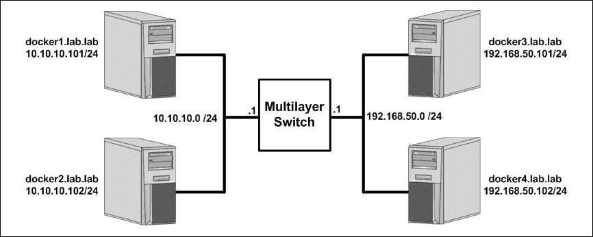
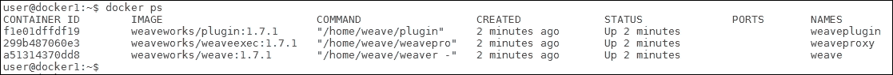
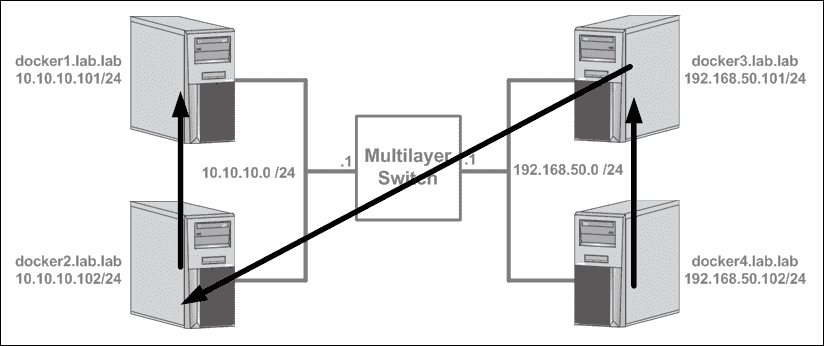
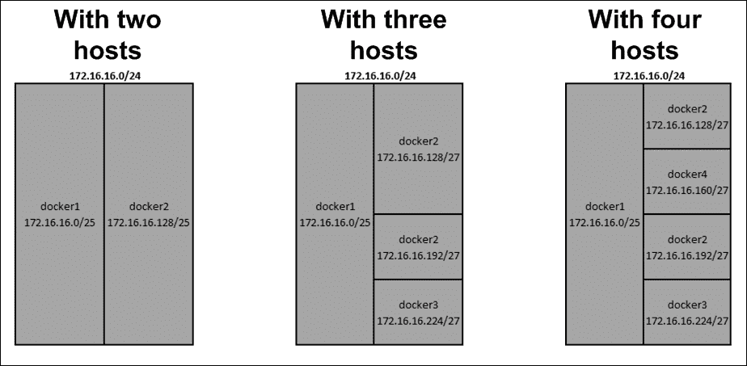
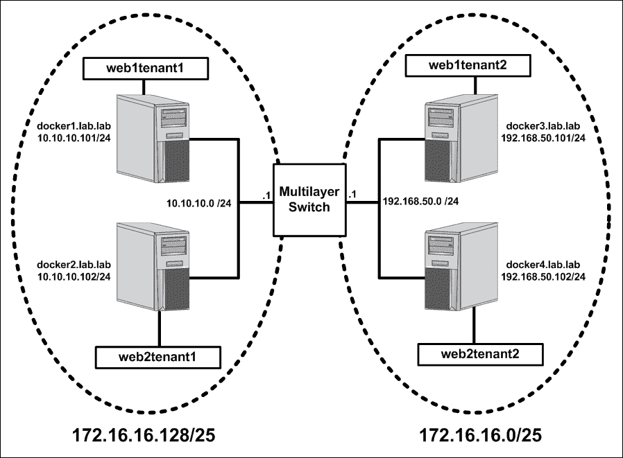

# 七、使用 Weave 网络

在本章中，我们将介绍以下食谱:

*   安装和配置 Weave
*   运行 Weave 连接的容器
*   理解 Weave IPAM
*   使用 Weave 域名系统
*   Weave 安全
*   使用 Weave 网络插件

# 简介

Weave Net(简称 Weave)是 Docker 的第三方网络解决方案。在早期，它为用户提供了 Docker 固有功能之外的附加网络功能。例如，在 Docker 开始支持用户定义的覆盖网络和嵌入式 DNS 之前，Weave 就提供了覆盖网络和 **WeaveDNS** 。然而，随着最新版本的发布，Docker 已经开始从网络角度与 Weave 实现功能对等。话虽如此，Weave 仍然有很多可以提供的，并且是第三方工具如何与 Docker 交互以提供容器网络的一个有趣的例子。在本章中，我们将介绍安装和配置 Weave 的基础知识，以便与 Docker(T2)一起工作，并从网络的角度描述 Weave 的一些功能。虽然我们将花一些时间演示 Weave 的一些特性，但这并不是整个 Weave 解决方案的操作指南。Weave 有许多特性，本章不做介绍。我建议您查看他们的网站，了解关于特性和功能的最新信息([https://www.weave.works/](https://www.weave.works/))。

# 安装和配置 Weave

在本食谱中，我们将介绍 Weave 的安装以及如何在 Docker 主机上提供 Weave 服务。我们还将展示 Weave 如何处理连接希望加入 Weave 网络的主机。

## 做好准备

在本例中，我们将使用我们在[第 3 章](03.html "Chapter 3. User-Defined Networks")、*用户定义网络*中使用的相同实验室拓扑，其中我们讨论了用户定义的覆盖网络:



您将需要两台主机，最好其中一些位于不同的子网。假设本实验中使用的 Docker 主机处于默认配置。在某些情况下，我们所做的更改可能要求您具有对系统的根级访问权限。

## 怎么做…

Weave 是通过 Weave 命令行界面工具安装和管理的。下载后，它不仅管理与 Weave 相关的配置，还管理 Weave 服务的供应。在要配置的每台主机上，只需运行以下三个命令:

*   将 Weave 二进制文件下载到您的本地系统中:

    ```
    user@docker1:~$ sudo curl -L git.io/weave -o \
    /usr/local/bin/weave
    ```

*   使文件可执行:

    ```
    user@docker1:~$ sudo chmod +x /usr/local/bin/weave
    ```

*   运行 Weave:

    ```
    user@docker1:~$ weave launch

    ```

如果所有这些命令成功完成，您的 Docker 主机现在可以使用 Weave 进行 Docker 联网了。要验证，您可以使用`weave status`命令检查 Weave 状态:

```
user@docker1:~$ weave status
        Version: 1.7.1 (up to date; next check at 2016/10/11 01:26:42)

        Service: router
       Protocol: weave 1..2
           Name: 12:d2:fe:7a:c1:f2(docker1)
     Encryption: disabled
  PeerDiscovery: enabled
        Targets: 0
    Connections: 0
          Peers: 1
 TrustedSubnets: none

        Service: ipam
         Status: idle
          Range: 10.32.0.0/12
  DefaultSubnet: 10.32.0.0/12

        Service: dns
         Domain: weave.local.
       Upstream: 10.20.30.13
            TTL: 1
        Entries: 0

        Service: proxy
        Address: unix:///var/run/weave/weave.sock

        Service: plugin
     DriverName: weave
user@docker1:~$ 
```

该输出为您提供了有关 Weave 的所有五种网络相关服务的信息。分别是`router`、`ipam`、`dns`、`proxy`和`plugin`。此时，您可能想知道所有这些服务都在哪里运行。与 Docker 主题保持一致，它们都在主机上的容器内运行:



如您所见，主机上运行着三个与 Weave 相关的容器。运行`weave launch`命令产生了所有三个容器。每个容器都提供独特的服务，Weave 使用这些服务来网络容器。`weaveproxy`容器充当垫片层，允许直接从 Docker CLI 利用 Weave。`weaveplugin`容器为 Docker 实现了一个定制的网络驱动程序。“`weave`”容器通常被称为 Weave 路由器，并提供与 Weave 网络相关的所有其他服务。

每个容器都可以独立配置和运行。使用`weave launch`命令运行 Weave 假设您想要使用所有三个容器，并使用一组合理的默认值来部署它们。但是，如果您希望更改与特定容器相关的设置，您需要独立启动容器。这可以通过以下方式实现:

```
weave launch-router
weave launch-proxy
weave launch-plugin
```

如果您希望随时清理特定主机上的 Weave 配置，您可以发出`weave reset`命令，该命令将清理所有与 Weave 相关的服务容器。首先，我们将只使用 Weave 路由器容器。让我们清除 Weave 配置，然后在我们的主机上启动那个容器`docker1`:

```
user@docker1:~$ weave reset
user@docker1:~$ weave launch-router
e5af31a8416cef117832af1ec22424293824ad8733bb7a61d0c210fb38c4ba1e
user@docker1:~$
```

Weave 路由器(Weave 容器)是我们提供大部分网络功能所需的唯一容器。让我们看看默认情况下通过检查 Weave 容器配置传递给 Weave 路由器的配置选项:

```
user@docker1:~$ docker inspect weave
…<Additional output removed for brevity>…
        "Args": [
            "--port",
            "6783",
            "--name",
            "12:d2:fe:7a:c1:f2",
            "--nickname",
            "docker1",
            "--datapath",
            "datapath",
            "--ipalloc-range",
            "10.32.0.0/12",
            "--dns-effective-listen-address",
            "172.17.0.1",
            "--dns-listen-address",
            "172.17.0.1:53",
            "--http-addr",
            "127.0.0.1:6784",
            "--resolv-conf",
            "/var/run/weave/etc/resolv.conf" 
…<Additional output removed for brevity>… 
user@docker1:~$
```

在前面的输出中有一些项目值得指出。IP 分配范围给出为`10.32.0.0/12`。这与我们习惯在`docker0`桥上默认处理的`172.17.0.0/16`有很大不同。此外，还有一个定义为的 IP 地址用作 DNS 监听地址。回想一下，Weave 还提供了 WeaveDNS，可用于通过名称解析 Weave 网络上其他容器的名称。请注意，该 IP 地址是主机上`docker0`网桥接口的地址。

现在，让我们将另一台主机配置为 Weave 网络的一部分:

```
user@docker2:~$ sudo curl -L git.io/weave -o /usr/local/bin/weave
user@docker2:~$ sudo chmod +x /usr/local/bin/weave
user@docker2:~$ weave launch-router 10.10.10.101
48e5035629b5124c8d3bedf09fca946b333bb54aff56704ceecef009b53dd449
user@docker2:~$
```

请注意，我们以与之前相同的方式安装了 Weave，但是当我们启动路由器容器时，我们是通过指定第一台 Docker 主机的 IP 地址来完成的。在 Weave 中，这是我们将多个主机对等在一起的方式。您希望连接到 Weave 网络的任何主机只需指定 Weave 网络上任何现有节点的 IP 地址。如果我们在这个新连接的节点上检查 Weave 的状态，我们应该看到它显示为已连接:

```
user@docker2:~$ weave status
        Version: 1.7.1 (up to date; next check at 2016/10/11 03:36:22)
        Service: router
       Protocol: weave 1..2
           Name: e6:b1:90:cd:76:da(docker2)
     Encryption: disabled
  PeerDiscovery: enabled
        Targets: 1
 Connections: 1 (1 established)
 Peers: 2 (with 2 established connections)
 TrustedSubnets: none
…<Additional output removed for brevity>…
user@docker2:~$
```

安装 Weave 后，我们可以继续以相同的方式连接其余两个节点:

```
user@docker3:~$ weave launch-router 10.10.10.102
user@docker4:~$ weave launch-router 192.168.50.101

```

在每种情况下，我们将先前加入的 Weave 节点指定为我们尝试加入的节点的对等节点。在我们的例子中，我们的连接模式如下图所示:



但是，我们可以让每个节点加入任何其他现有节点，并获得相同的结果。也就是说，将节点`docker2`、`docker3`和`docker4`连接到`docker1`会产生相同的结束状态。这是因为 Weave 只需要与现有的节点进行对话，就可以获得有关 Weave 网络当前状态的信息。因为所有现有的成员都有这些信息，所以为了将新节点加入 Weave 网络，他们与哪个成员交谈并不重要。如果我们现在检查任何一个 Weave 节点的状态，我们应该看到我们总共有四个对等节点:

```
user@docker4:~$ weave status
        Version: 1.7.1 (up to date; next check at 2016/10/11 03:25:22)

        Service: router
       Protocol: weave 1..2
           Name: 42:ec:92:86:1a:31(docker4)
     Encryption: disabled
  PeerDiscovery: enabled
        Targets: 1
 Connections: 3 (3 established)
 Peers: 4 (with 12 established connections)
 TrustedSubnets: none 
…<Additional output removed for brevity>… 
user@docker4:~$
```

我们可以看到这个节点有三个连接，一个连接到其他每个连接的节点。这使我们总共有四个对等体，有十二个连接，每个 Weave 节点三个。因此，尽管只配置了三个节点之间的对等，但我们最终得到了一个完整的网格，用于所有主机之间的容器连接:


现在，Weave 的配置已经完成，我们在所有支持 Weave 的 Docker 主机之间有了一个完整的网状网络。您可以使用`weave status connections`命令验证每台主机与其他对等主机的连接:

```
user@docker1:~$ weave status connections
-> 192.168.50.102:6783   established fastdp 42:ec:92:86:1a:31(docker4)
<- 10.10.10.102:45632    established fastdp e6:b1:90:cd:76:da(docker2)
<- 192.168.50.101:38411  established fastdp ae:af:a6:36:18:37(docker3)
user@docker1:~$ 
```

您会注意到，这种配置不需要配置独立的键值存储。

还需要注意的是可以使用 Weave 命令行界面`connect`和`forget`命令手动管理 Weave 对等体。如果在实例化 Weave 时未能指定 Weave 网络的现有成员，可以使用 Weave 连接手动连接到现有成员。此外，如果您从 Weave 网络中删除了一个成员，并且不希望它返回，您可以使用`forget`命令告诉网络完全忘记该对等方。

# 运行 Weave 连接的容器

Weave 是一个有趣的例子，展示了第三方解决方案与 Docker 交互的不同方式。它提供了几种不同的与 Docker 交互的方法。第一个是 Weave 命令行界面，您不仅可以在其中配置 Weave，还可以像通过 Docker 命令行界面一样生成容器。第二个是网络插件，它直接连接到 Docker，允许您从 Docker 向 Weave 网络提供容器。在本食谱中，我们将介绍如何使用 Weave 命令行界面将容器连接到 Weave 网络。Weave 网络插件将在本章后面的食谱中介绍。

### 注

Weave 还提供了一个应用编程接口代理服务，允许 Weave 透明地将自己插入 Docker 和 Docker 命令行界面之间。该配置将不在本章中介绍，但他们在以下链接中有关于该功能的大量文档:

[https://www.weave.works/docs/net/latest/weave-docker-api/](https://www.weave.works/docs/net/latest/weave-docker-api/)

## 做好准备

假设您是在我们在本章第一个食谱中创建的实验室的基础上构建的。还假设主机安装了 Docker 和 Weave。我们在上一章中定义的 Weave 对等也是假定的。

## 怎么做…

使用 Weave 命令行界面管理容器连接时，有两种方法可以将容器连接到 Weave 网络。

首先是使用`weave`命令运行一个容器。Weave 通过将您在`weave run`之后指定的任何内容传递给`docker run`来实现这一点。这种方法的优点是，Weave 知道这种联系，因为它实际上是告诉 Docker 运行容器的。

这将使 Weave 处于一个完美的位置，以确保容器以正确的配置启动，以便在 Weave 网络上工作。例如，我们可以使用以下语法在主机`docker1`上启动名为`web1`的容器:

```
user@docker1:~$ weave run -dP --name=web1 jonlangemak/web_server_1
```

请注意，`run`命令的语法与 Docker 相同。

### 注

尽管有相似之处，但也有一些值得注意的不同之处。Weave 只能在后台或`-d`模式下启动容器。此外，您不能在容器完成执行后指定`--rm`标志来移除容器。

一旦容器以这种方式启动，让我们看看容器的接口配置:

```
user@docker1:~$ docker exec web1 ip addr
…<Loopback interface removed for brevity>…
20: eth0@if21: <BROADCAST,MULTICAST,UP,LOWER_UP> mtu 1500 qdisc noqueue state UP
    link/ether 02:42:ac:11:00:02 brd ff:ff:ff:ff:ff:ff
    inet 172.17.0.2/16 scope global eth0
       valid_lft forever preferred_lft forever
    inet6 fe80::42:acff:fe11:2/64 scope link
       valid_lft forever preferred_lft forever
22: ethwe@if23: <BROADCAST,MULTICAST,UP,LOWER_UP> mtu 1410 qdisc noqueue state UP
    link/ether a6:f2:d0:36:6f:bd brd ff:ff:ff:ff:ff:ff
    inet 10.32.0.1/12 scope global ethwe
       valid_lft forever preferred_lft forever
    inet6 fe80::a4f2:d0ff:fe36:6fbd/64 scope link
       valid_lft forever preferred_lft forever
user@docker1:~$
```

请注意，容器现在有一个名为`ethwe`的附加接口，其 IP 地址为`10.32.0.1/12`。这是 Weave 网络接口，是对 Docker 网络接口(`eth0`)的补充。如果我们检查一下，我们会注意到自从我们通过了`-P`标志，Docker 已经向几个`eth0`接口发布了容器暴露的端口:

```
user@docker1:~$ docker port web1
80/tcp -> 0.0.0.0:32785
user@docker1:~$ sudo iptables -t nat -S
…<Additional output removed for brevity>…
-A DOCKER ! -i docker0 -p tcp -m tcp --dport 32768 -j DNAT --to-destination 172.17.0.2:80 
user@docker1:~$
```

这证明了我们之前看到的所有端口发布功能仍然是通过 Docker 网络结构完成的。除了现有的 Docker 本地网络接口之外，还添加了 Weave 接口。

将容器连接到 Weave 网络的第二种方法可以通过两种不同的方式实现，但产生的结果基本相同。现有的 Docker 容器可以通过使用 Weave CLI 启动当前停止的容器，或者通过将正在运行的容器附加到 Weave 来添加到 Weave 网络。让我们看看每种方法。首先，让我们以通常使用 Docker CLI 的方式在主机`docker2`上启动一个容器，然后使用 Weave 重新启动它:

```
user@docker2:~$ docker run -dP --name=web2 jonlangemak/web_server_2
5795d42b58802516fba16eed9445950123224326d5ba19202f23378a6d84eb1f
user@docker2:~$ docker stop web2
web2
user@docker2:~$ weave start web2
web2
user@docker2:~$ docker exec web2 ip addr
…<Loopback interface removed for brevity>…
15: eth0@if16: <BROADCAST,MULTICAST,UP,LOWER_UP> mtu 1500 qdisc noqueue state UP
    link/ether 02:42:ac:11:00:02 brd ff:ff:ff:ff:ff:ff
    inet 172.17.0.2/16 scope global eth0
       valid_lft forever preferred_lft forever
    inet6 fe80::42:acff:fe11:2/64 scope link
       valid_lft forever preferred_lft forever
17: ethwe@if18: <BROADCAST,MULTICAST,UP,LOWER_UP> mtu 1410 qdisc noqueue state UP
    link/ether e2:22:e0:f8:0b:96 brd ff:ff:ff:ff:ff:ff
    inet 10.44.0.0/12 scope global ethwe
       valid_lft forever preferred_lft forever
    inet6 fe80::e022:e0ff:fef8:b96/64 scope link
       valid_lft forever preferred_lft forever
user@docker2:~$
```

如您所见，当使用 Weave CLI 重新启动容器时，Weave 已经注意将 Weave 接口添加到容器中。同样，我们可以在主机`docker3`上启动我们的`web1`容器的第二个实例，然后使用`weave attach`命令将其动态连接到 Weave 网络:

```
user@docker3:~$ docker run -dP --name=web1 jonlangemak/web_server_1
dabdf098964edc3407c5084e56527f214c69ff0b6d4f451013c09452e450311d
user@docker3:~$ docker exec web1 ip addr
…<Loopback interface removed for brevity>…
5: eth0@if6: <BROADCAST,MULTICAST,UP,LOWER_UP> mtu 1500 qdisc noqueue state UP
    link/ether 02:42:ac:11:00:02 brd ff:ff:ff:ff:ff:ff
    inet 172.17.0.2/16 scope global eth0
       valid_lft forever preferred_lft forever
    inet6 fe80::42:acff:fe11:2/64 scope link
       valid_lft forever preferred_lft forever
user@docker3:~$ 
user@docker3:~$ weave attach web1
10.36.0.0
user@docker3:~$ docker exec web1 ip addr
…<Loopback interface removed for brevity>…
5: eth0@if6: <BROADCAST,MULTICAST,UP,LOWER_UP> mtu 1500 qdisc noqueue state UP
    link/ether 02:42:ac:11:00:02 brd ff:ff:ff:ff:ff:ff
    inet 172.17.0.2/16 scope global eth0
       valid_lft forever preferred_lft forever
    inet6 fe80::42:acff:fe11:2/64 scope link
       valid_lft forever preferred_lft forever
15: ethwe@if16: <BROADCAST,MULTICAST,UP,LOWER_UP> mtu 1410 qdisc noqueue state UP
    link/ether de:d6:1c:03:63:ba brd ff:ff:ff:ff:ff:ff
    inet 10.36.0.0/12 scope global ethwe
       valid_lft forever preferred_lft forever
    inet6 fe80::dcd6:1cff:fe03:63ba/64 scope link
       valid_lft forever preferred_lft forever
user@docker3:~$
```

正如我们在前面的输出中看到的，容器没有`ethwe`接口，直到我们手动将其连接到 Weave 网络。附件是动态完成的，不需要重新启动容器。除了向 Weave 网络添加容器，您还可以使用`weave detach`命令从 Weave 中动态移除容器。

此时，您应该在所有现在连接到 Weave 网络的容器之间建立连接。在我的案例中，他们被分配了以下 IP 地址:

*   `web1`在主机`docker1`上:`10.32.0.1`
*   `web2`在主机`docker2`上:`10.44.0.0`
*   `web1`在主机`docker3`上:`10.36.0.0`

```
user@docker1:~$ docker exec -it web1 ping 10.44.0.0 -c 2
PING 10.40.0.0 (10.40.0.0): 48 data bytes
56 bytes from 10.40.0.0: icmp_seq=0 ttl=64 time=0.447 ms
56 bytes from 10.40.0.0: icmp_seq=1 ttl=64 time=0.681 ms
--- 10.40.0.0 ping statistics ---
2 packets transmitted, 2 packets received, 0% packet loss
round-trip min/avg/max/stddev = 0.447/0.564/0.681/0.117 ms
user@docker1:~$ docker exec -it web1 ping 10.36.0.0 -c 2
PING 10.44.0.0 (10.44.0.0): 48 data bytes
56 bytes from 10.44.0.0: icmp_seq=0 ttl=64 time=1.676 ms
56 bytes from 10.44.0.0: icmp_seq=1 ttl=64 time=0.839 ms
--- 10.44.0.0 ping statistics ---
2 packets transmitted, 2 packets received, 0% packet loss
round-trip min/avg/max/stddev = 0.839/1.257/1.676/0.419 ms
user@docker1:~$
```

这证明了 Weave 网络工作正常，容器在正确的网段上。

# 了解 Weave IPAM

正如我们在前面的章节中多次看到的，IPAM 是任何容器网络解决方案的关键组成部分。当您开始在多个 Docker 主机上使用公共网络时，IPAM 的重要性变得更加明显。随着 IP 分配的数量开始扩大，能够通过名称解析这些容器也变得至关重要。与 Docker 非常相似，Weave 也为其容器网络解决方案提供了自己的集成 IPAM。在本章中，我们将展示如何配置和利用 Weave IPAM 来管理整个 Weave 网络中的 IP 分配。

## 做好准备

假设您是在我们在本章第一个食谱中创建的实验室的基础上构建的。还假设主机安装了 Docker 和 Weave。Docker 应该处于默认配置，Weave 应该已安装但尚未对等。如果需要删除前面示例中定义的对等，请在每台主机上发出`weave reset`命令。

## 怎么做…

Weave 对 IPAM 的解决方案依赖于使用一个大子网的整个 Weave 网络，然后将其分割成更小的部分，并直接分配给每个主机。然后，主机从分配的 IP 地址池中分配容器 IP 地址。为了做到这一点，Weave 集群必须就分配给每个主机的 IP 分配达成一致。它通过首先在集群内达成共识来做到这一点。如果您对集群的规模有一个大概的了解，那么您可以在初始化期间向 Weave 提供一些细节，帮助它做出更好的决定。

### 注

本食谱的目标不是要详细说明优化 Weave 与 IPAM 使用的共识算法。有关详细信息，请参见以下链接:

[https://www.weave.works/docs/net/latest/ipam/](https://www.weave.works/docs/net/latest/ipam/)

为了这个配方，我们假设您不知道您的集群有多大，我们将假设它从两个主机开始，并从那里扩展。

重要的是要理解，在您供应第一个容器之前，Weave 中的 IPAM 一直处于闲置状态。例如，让我们从在主机`docker1`上配置 Weave 开始:

```
user@docker1:~$ weave launch-router --ipalloc-range 172.16.16.0/24
469c81f786ac38618003e4bd08eb7303c1f8fa84d38cc134fdb352c589cbc42d
user@docker1:~$
```

首先要注意的是参数`--ipalloc-range`的增加。正如我们前面提到的，Weave 基于一个大子网的概念。默认情况下，该子网为`10.32.0.0/12`。通过将`--ipalloc-range`标志传递给 Weave，可以在 Weave 初始化期间覆盖该默认设置。为了让这些示例更容易理解，我决定将默认子网更改为更易于管理的子网；在这种情况下，`172.16.16.0/24`。

让我们也在主机`docker2`上运行相同的命令，但是将主机`docker1`的 IP 地址传递给它，这样它就可以立即对等:

```
user@docker2:~$ weave launch-router --ipalloc-range \
172.16.16.0/24 10.10.10.101
9bfb1cb0295ba87fe88b7373a8ff502b1f90149741b2f43487d66898ffad775d
user@docker2:~$
```

请注意，我再次将同一个子网传递给了 Weave。运行 Weave 的每台主机上的 IP 分配范围必须相同。只有同意相同 IP 分配范围的主机才能正常运行。现在让我们检查 Weave 服务的状态:

```
user@docker2:~$ weave status
…<Additional output removed for brevity>…
Connections: 1 (1 established)
          Peers: 2 (with 2 established connections)
 TrustedSubnets: none

        Service: ipam
         Status: idle
          Range: 172.16.16.0/24
  DefaultSubnet: 172.16.16.0/24 
…<Additional output removed for brevity>… 
user@docker2:~$
```

输出显示两个对等体，表明我们对`docker1`的对等是成功的。请注意，IPAM 服务显示状态为`idle`。`idle`的地位意味着 Weave 在决定哪些主机将获得什么 IP 分配之前，正在等待更多的对等机加入。让我们看看当我们运行一个容器时会发生什么:

```
user@docker2:~$ weave run -dP --name=web2 jonlangemak/web_server_2
379402b05db83315285df7ef516e0417635b24923bba3038b53f4e58a46b4b0d
user@docker2:~$
```

如果我们再次检查 Weave 状态，我们应该看到 IPAM 现在已经从**空闲**变为**准备好**:

```
user@docker2:~$ weave status
…<Additional output removed for brevity>… 
    Connections: 1 (1 established)
          Peers: 2 (with 2 established connections)
 TrustedSubnets: none

        Service: ipam
         Status: ready
          Range: 172.16.16.0/24
  DefaultSubnet: 172.16.16.0/24 
…<Additional output removed for brevity>… 
user@docker2:~$
```

运行连接到 Weave 网络的第一个容器迫使 Weave 达成共识。此时，Weave 已决定集群大小为 2，并已尽最大努力在主机之间分配可用的 IP 地址。让我们在主机`docker1`上运行一个容器，然后检查分配给每个容器的 IP 地址:

```
user@docker1:~$ weave run -dP --name=web1 jonlangemak/web_server_1
fbb3eac421159308f41d795638c3a4689c92a9401718fd1988083bfc12047844
user@docker1:~$ weave ps
weave:expose 12:d2:fe:7a:c1:f2
fbb3eac42115 02:a7:38:ab:73:23 172.16.16.1/24
user@docker1:~$
```

使用 **weave ps** 命令，我们可以看到我们刚刚在主机`docker1`上生成的容器收到了一个`172.16.16.1/24`的 IP 地址。如果我们检查主机`docker2`上的容器`web2`的 IP 地址，我们会看到它有一个`172.16.16.128/24`的 IP 地址:

```
user@docker2:~$ weave ps
weave:expose e6:b1:90:cd:76:da
dde411fe4c7b c6:42:74:89:71:da 172.16.16.128/24
user@docker2:~$
```

这说得很有道理。Weave 知道它在网络中有两个成员，所以它直接将分配分成两半，本质上是给每个主机自己的`/25`网络分配。`docker1`从`/24`的上半场开始分配，`docker2`从下半场开始。

尽管完全分配了整个空间，但这并不意味着我们现在没有知识产权空间了。这些初始分配更像是保留，可以根据 Weave 网络的大小进行更改。例如，我们现在可以将主机`docker3`添加到 Weave 网络中，并在其上启动另一个`web1`容器实例:

```
user@docker3:~$ weave launch-router --ipalloc-range \
172.16.16.0/24 10.10.10.101
8e8739f48854d87ba14b9dcf220a3c33df1149ce1d868819df31b0fe5fec2163
user@docker3:~$ weave run -dP --name=web1 jonlangemak/web_server_1
0c2193f2d7569943171764155e0e93272f5715c257adba75ed544283a2794d3e
user@docker3:~$ weave ps
weave:expose ae:af:a6:36:18:37
0c2193f2d756 76:8d:4c:ee:08:db 172.16.16.224/24
user@docker3:~$ 
```

因为网络现在有更多的成员，Weave 只是进一步将初始分配分成更小的块。根据分配给每台主机上的容器的 IP 地址，我们可以看到 Weave 试图将分配保持在有效的子网内。下图显示了当第三和第四台主机加入 Weave 网络时，IP 分配会发生什么情况:



重要的是要记住，虽然分配给每台服务器的分配是灵活的，但是当它们将 IP 地址分配给容器时，它们都使用与初始分配相同的掩码。这确保了所有容器都假设它们在同一个网络上，并且彼此之间具有直接连接，从而消除了路由指向其他主机的需要。

为了证明所有主机的初始 IP 分配必须相同，我们可以尝试使用不同的子网加入最后一台主机`docker4`:

```
user@docker4:~$ weave launch-router --ipalloc-range 172.64.65.0/24 10.10.10.101
9716c02c66459872e60447a6a3b6da7fd622bd516873146a874214057fe11035
user@docker4:~$ weave status
…<Additional output removed for brevity>…
        Service: router
       Protocol: weave 1..2
           Name: 42:ec:92:86:1a:31(docker4)
     Encryption: disabled
  PeerDiscovery: enabled
        Targets: 1
 Connections: 1 (1 failed)
…<Additional output removed for brevity>…
user@docker4:~$
```

如果我们检查 Weave 路由器的容器日志，我们会发现它无法加入现有的 Weave 网络，因为定义了错误的 IP 分配:

```
user@docker4:~$ docker logs weave
…<Additional output removed for brevity>… 
INFO: 2016/10/11 02:16:09.821503 ->[192.168.50.101:6783|ae:af:a6:36:18:37(docker3)]: connection shutting down due to error: Incompatible IP allocation ranges (received: 172.16.16.0/24, ours: 172.64.65.0/24) 
…<Additional output removed for brevity>… 
```

加入现有 Weave 网络的唯一方法是使用与所有现有节点相同的初始 IP 分配。

最后，需要强调的是，以这种方式使用 Weave IPAM 并不是必须的。您可以通过在`weave run`期间指定一个 IP 地址来手动分配 IP 地址，如下所示:

```
user@docker1:~$ weave run 1.1.1.1/24 -dP --name=wrongip \
jonlangemak/web_server_1
259004af91e3b0367bede723c9eb9d3fbdc0c4ad726efe7aea812b79eb408777
user@docker1:~$
```

指定单个 IP 地址时，可以选择任意喜欢的 IP 地址。正如您将在后面的菜谱中看到的，您还可以指定一个子网进行分配，并让 Weave 跟踪 IPAM 的子网分配。从子网分配 IP 地址时，子网必须是初始 Weave 分配的一部分。

如果您希望手动将 IP 地址分配给某些容器，明智的做法是在初始 Weave 配置期间配置一个额外的 Weave 参数，以限制动态分配的范围。您可以在启动期间将`--ipalloc-default-subnet`参数传递给 Weave，以限制动态分配给主机的 IP 地址的范围。例如，您可以传递这个:

```
weave launch-router --ipalloc-range 172.16.16.0/24 \
--ipalloc-default-subnet 172.16.16.0/25
```

这将把 Weave 子网配置为`172.16.16.0/25`，让更大网络的其余部分可供手动分配。我们将在后面的食谱中看到，这种类型的配置在 Weave 如何处理整个 Weave 网络的网络隔离中起着重要作用。

# 使用 Weave 域名系统

自然，IPAM 之后要考虑的下一件事是名称解析。无论规模大小，通过除了 IP 地址之外的方式来定位和识别容器成为一种必要。很像 Docker 的更新版本，Weave 提供了自己的 DNS 服务来解析存在于 Weave 网络上的容器名称。在这份食谱中，我们将回顾 Weave 域名系统的默认配置，并展示它是如何实现的，以及一些相关的配置设置来帮助您启动和运行。

## 做好准备

假设您正在构建我们在本章第一个食谱中创建的实验室。还假设主机安装了 Docker 和 Weave。Docker 应该处于默认配置，Weave 应该在所有四个主机成功对等的情况下安装，就像我们在本章的第一个食谱中所做的那样。

## 怎么做…

如果您一直关注到本章的这一点，那么您已经提供了 WeaveDNS。Weave 域名系统与 Weave 路由器容器一起提供，默认情况下是启用的。我们可以通过查看 Weave 状态看到这一点:

```
user@docker1:~$ weave status
…<Additional output removed for brevity>…
        Service: dns
         Domain: weave.local.
       Upstream: 10.20.30.13
            TTL: 1
        Entries: 0
…<Additional output removed for brevity>…
```

当 Weave 提供 DNS 服务时，它以一些合理的默认值开始。在这种情况下，它检测到我的主机域名系统服务器是`10.20.30.13`，因此它将其配置为上游解析器。还选择了`weave.local`作为域名。如果我们使用 weave run 语法启动一个容器，weave 将确保以允许容器使用该 DNS 服务的方式提供容器。例如，让我们在主机`docker1`上启动一个容器:

```
user@docker1:~$ weave run -dP --name=web1 jonlangemak/web_server_1
c0cf29fb07610b6ffc4e55fdd4305f2b79a89566acd0ae0a6de09df06979ef36
user@docker1:~$ docker exec –t web1 more /etc/resolv.conf
nameserver 172.17.0.1
user@docker1:~$
```

启动容器后，我们可以看到 Weave 配置容器的`resolv.conf`文件的方式与 Docker 不同。回想一下，默认情况下，在非用户定义的网络中，Docker 将为容器提供与 Docker 本身相同的 DNS 配置。在这种情况下，Weave 给了容器一个名称服务器`172.17.0.1`，默认情况下，这是分配给`docker0`桥的 IP 地址。您可能想知道 Weave 如何期望容器通过与`docker0`桥对话来解析自己的域名系统。解决方法很简单。Weave 路由器容器在主机模式下运行，并且有一个绑定到端口`53`的服务:

```
user@docker1:~$ docker network inspect host
…<Additional output removed for brevity>… 
"Containers": {        "03e3e82a5e0ced0b973e2b31ed9c2d3b8fe648919e263965d61ee7c425d9627c": {
                "Name": "weave",
…<Additional output removed for brevity>…
```

如果我们检查绑定在主机上的端口，我们可以看到 Weave 路由器正在暴露端口`53`:

```
user@docker1:~$ sudo netstat -plnt
Active Internet connections (only servers)
…<some columns removed to increase readability>…
Proto Local Address State       PID/Program name
tcp   172.17.0.1:53 LISTEN      2227/weaver

```

这意味着 Weave 容器中的 WeaveDNS 服务将在`docker0`桥接口上监听 DNS 请求。让我们在主机`docker2`上启动另一个容器:

```
user@docker2:~$ weave run -dP --name=web2 jonlangemak/web_server_2
b81472e86d8ac62511689185fe4e4f36ac4a3c41e49d8777745a60cce6a4ac05
user@docker2:~$ docker exec -it web2 ping web1 -c 2
PING web1.weave.local (10.32.0.1): 48 data bytes
56 bytes from 10.32.0.1: icmp_seq=0 ttl=64 time=0.486 ms
56 bytes from 10.32.0.1: icmp_seq=1 ttl=64 time=0.582 ms
--- web1.weave.local ping statistics ---
2 packets transmitted, 2 packets received, 0% packet loss
round-trip min/avg/max/stddev = 0.486/0.534/0.582/0.048 ms
user@docker2:~$ 
```

只要两个容器都在 Weave 网络上并且有适当的设置，Weave 就会自动生成一个带有容器名称的 DNS 记录。我们可以从任何启用了 Weave 的主机上使用`weave status dns`命令查看 Weave 知道的所有名称记录:

```
user@docker2:~$ weave status dns
web1         10.32.0.1       86029a1305f1 12:d2:fe:7a:c1:f2
web2         10.44.0.0       56927d3bf002 e6:b1:90:cd:76:da
user@docker2:~$ 
```

在这里，我们可以看到目的主机的 Weave 网络接口的容器名称、IP 地址、容器 ID 和 MAC 地址。

这种方法效果很好，但是依赖于使用适当的设置配置容器。这是另一个使用 Weave 命令行界面相当有帮助的场景，因为它确保这些设置在容器运行时就位。例如，如果我们用 Docker CLI 在主机`docker3`上启动另一个容器，然后将其附加到 Docker，它将不会获得 DNS 记录:

```
user@docker3:~$ docker run -dP --name=web1 jonlangemak/web_server_1
cd3b043bd70c0f60a03ec24c7835314ca2003145e1ca6d58bd06b5d0c6803a5c
user@docker3:~$ weave attach web1
10.36.0.0
user@docker3:~$ docker exec -it web1 ping web2
ping: unknown host
user@docker3:~$
```

这不起作用有两个原因。首先，容器不知道从哪里寻找 Weave DNS，它试图通过 Docker 提供的 DNS 服务器来解决这个问题。在本例中，这是在 Docker 主机上配置的:

```
user@docker3:~$ docker exec -it web1 more /etc/resolv.conf
# Dynamic resolv.conf(5) file for glibc resolver(3) generated by resolvconf(8)
#     DO NOT EDIT THIS FILE BY HAND -- YOUR CHANGES WILL BE OVERWRITTEN
nameserver 10.20.30.13
search lab.lab
user@docker3:~$
```

其次，当容器被附加时，Weave 没有在 WeaveDNS 中注册记录。为了让 Weave 在 WeaveDNS 中为容器生成记录，容器必须在同一个域中。为此，当 Weave 通过其 CLI 运行容器时，它会传递容器的主机名和域名。我们可以通过在 Docker 中运行容器时提供主机名来模拟这种行为。例如:

```
user@docker3:~$ docker stop web1
user@docker3:~$ docker rm web1
user@docker3:~$ docker run -dP --hostname=web1.weave.local \
--name=web1 jonlangemak/web_server_1
04bb1ba21b692b4117a9b0503e050d7f73149b154476ed5a0bce0d049c3c9357
user@docker3:~$
```

现在，当我们将容器附加到 Weave 网络时，我们应该会看到为其生成的 DNS 记录:

```
user@docker3:~$ weave attach web1
10.36.0.0
user@docker3:~$ weave status dns
web1         10.32.0.1       86029a1305f1 12:d2:fe:7a:c1:f2
web1         10.36.0.0       5bab5eae10b0 ae:af:a6:36:18:37
web2         10.44.0.0       56927d3bf002 e6:b1:90:cd:76:da
user@docker3:~$
```

### 注

如果你想让这个容器也能够解析 Weave 域名系统中的记录，你还需要将`--dns=172.17.0.1`标志传递给容器，以确保它的域名系统服务器被设置为`docker0`桥的 IP 地址。

您可能已经注意到，我们现在在 WeaveDNS 中有两个条目用于相同的容器名称。这就是 Weave 在 Weave 网络中提供基本负载平衡的方式。例如，如果我们返回到`docker2`主机，让我们尝试 ping 名称`web1`几次:

```
user@docker2:~$ docker exec -it web2 ping web1 -c 1
PING web1.weave.local (10.32.0.1): 48 data bytes
56 bytes from 10.32.0.1: icmp_seq=0 ttl=64 time=0.494 ms
--- web1.weave.local ping statistics ---
1 packets transmitted, 1 packets received, 0% packet loss
round-trip min/avg/max/stddev = 0.494/0.494/0.494/0.000 ms
user@docker2:~$ docker exec -it web2 ping web1 -c 1
PING web1.weave.local (10.36.0.0): 48 data bytes
56 bytes from 10.36.0.0: icmp_seq=0 ttl=64 time=0.796 ms
--- web1.weave.local ping statistics ---
1 packets transmitted, 1 packets received, 0% packet loss
round-trip min/avg/max/stddev = 0.796/0.796/0.796/0.000 ms
user@docker2:~$ docker exec -it web2 ping web1 -c 1
PING web1.weave.local (10.32.0.1): 48 data bytes
56 bytes from 10.32.0.1: icmp_seq=0 ttl=64 time=0.507 ms
--- web1.weave.local ping statistics ---
1 packets transmitted, 1 packets received, 0% packet loss
round-trip min/avg/max/stddev = 0.507/0.507/0.507/0.000 ms
user@docker2:~$
```

注意在第二次 ping 尝试期间，容器如何解析到不同的 IP 地址。由于在织入域名系统中有多个相同名称的记录，我们可以只使用域名系统来提供基本的负载平衡功能。Weave 还将跟踪容器的状态，并将死容器从 WeaveDNS 中拉出。例如，如果我们在主机`docker3`上杀死容器，我们应该看到其中一个`web1`记录从 DNS 中掉出，只留下一个记录给`web1`:

```
user@docker3:~$ docker stop web1
web1
user@docker3:~$ weave status dns
web1         10.32.0.1       86029a1305f1 12:d2:fe:7a:c1:f2
web2         10.44.0.0       56927d3bf002 e6:b1:90:cd:76:da
user@docker3:~$
```

### 注

有许多不同的配置选项可供您定制 Weave 域名系统的工作方式。要查看整个指南，请查看[https://www.weave.works/docs/net/latest/weavedns/](http:// https://www.weave.works/docs/net/latest/weavedns/)的文档。

# 织安全

Weave 提供了几个属于安全范畴的特性。由于 Weave 是一种基于覆盖的网络解决方案，它能够在覆盖流量穿过物理或底层网络时对其进行加密。当您的容器可能需要穿越公共网络时，这可能特别有用。此外，Weave 允许您在某些网段内隔离容器。Weave 依赖于为每个隔离网段使用不同的子网来实现这一点。在本食谱中，我们将介绍如何配置覆盖加密，以及如何在 Weave 网络中为不同的容器提供隔离。

## 做好准备

假设您正在构建我们在本章第一个食谱中创建的实验室。还假设主机安装了 Docker 和 Weave。Docker 应该处于默认配置，Weave 应该已安装但尚未对等。如果需要删除前面示例中定义的对等，请在每台主机上发出`weave reset`命令。

## 怎么做…

配置 Weave 来加密覆盖网络非常简单；但是，必须在 Weave 的初始配置期间完成。使用前面配方中相同的实验拓扑，让我们运行以下命令来构建 Weave 网络:

*   主机上`docker1` :

    ```
    weave launch-router --password notverysecurepwd \
    --trusted-subnets 192.168.50.0/24 --ipalloc-range \
    172.16.16.0/24 --ipalloc-default-subnet 172.16.16.128/25
    ```

*   在主机`docker2`、`docker3`和`docker4` :

    ```
    weave launch-router --password notverysecurepwd \
    --trusted-subnets 192.168.50.0/24 --ipalloc-range \
    172.16.16.0/24 --ipalloc-default-subnet \
    172.16.16.128/25 10.10.10.101
    ```

    上

您会注意到，我们在主机上运行的命令基本上是相同的，除了最后三个主机指定`docker1`作为对等体，以便构建 Weave 网络。无论是哪种情况，在 Weave 初始化期间，我们都向路由器传递了一些额外的参数:

*   `--password`:这就是启用 Weave 节点之间通信加密的原因。与我的示例不同，您应该选择一个非常安全的密码来使用。这需要在运行 Weave 的每个节点上相同。
*   `--trusted-subnets`:这个可以让你把主机的子网定义为可信的，也就是说它们不需要对它们的通信进行加密。当 Weave 进行加密时，它会退回到比通常使用的更慢的数据路径。由于使用`--password`参数会端到端开启加密，因此将一些子网定义为不需要加密可能是有意义的
*   `--ipalloc-range`:这里我们把更大的 Weave 网定义为`172.16.16.0/24`。我们在早期的食谱中看到了这个命令:
*   `--ipalloc-default-subnet`:这指示 Weave，默认情况下，从较大 Weave 分配的较小子网中分配容器 IP 地址。在这种情况下，那就是`172.16.16.128/25`。

现在，让我们在每台主机上运行以下容器:

*   `docker1` :

    ```
    weave run -dP --name=web1tenant1 jonlangemak/web_server_1
    ```

*   `docker2` :

    ```
    weave run -dP --name=web2tenant1 jonlangemak/web_server_2
    ```

*   `docker3` :

    ```
    weave run net:172.16.16.0/25 -dP --name=web1tenant2 \
    jonlangemak/web_server_1
    ```

*   `docker4` :

    ```
    weave run net:172.16.16.0/25 -dP --name=web2tenant2 \
    jonlangemak/web_server_2
    ```

你会注意到在主机`docker3`和`docker4`上，我增加了`net:172.16.16.0/25`参数。回想一下，当我们开始 Weave 网络时，我们告诉 Weave 默认情况下从`172.16.16.128/25`中分配 IP 地址。我们可以在容器运行时覆盖它，并为 Weave 提供一个新的子网，只要它在更大的 Weave 网络中就可以使用。在这种情况下，`docker1`和`docker2`上的容器将在`172.16.16.128/25`内获得一个 IP 地址，因为这是默认的。`docker3`和`docker4`上的容器将在`172.16.16.0/25`内获得一个 IP 地址，因为我们覆盖了默认值。我们可以在您启动所有容器后确认这一点:

```
user@docker4:~$ weave status dns
web1tenant1  172.16.16.129   26c58ef399c3 12:d2:fe:7a:c1:f2
web1tenant2  172.16.16.64    4c569073d663 ae:af:a6:36:18:37
web2tenant1  172.16.16.224   211c2e0b388e e6:b1:90:cd:76:da
web2tenant2  172.16.16.32    191207a9fb61 42:ec:92:86:1a:31
user@docker4:~$
```

正如我前面提到的，使用不同的子网是 Weave 提供容器分段的方式。在这种情况下，拓扑如下所示:



虚线象征着 Weave 在覆盖网络中为我们提供的隔离。由于`tenant1`容器是独立于`tenant2`容器的子网，因此它们不会有连接。通过这种方式，Weave 使用基本网络来实现容器隔离。我们可以通过一些测试来证明这一点:

```
user@docker4:~$ docker exec -it web2tenant2 curl http://web1tenant2
<body>
  <html>
    <h1><span style="color:#FF0000;font-size:72px;">Web Server #1 - Running on port 80</span>
    </h1>
</body>
  </html>
user@docker4:~$ docker exec -it web2tenant2 curl http://web1tenant1
user@docker4:~$ docker exec -it web2tenant2 curl http://web2tenant1
user@docker4:~$
user@docker4:~$ docker exec -it web2tenant2 ping web1tenant1 -c 1
PING web1tenant1.weave.local (172.16.16.129): 48 data bytes
--- web1tenant1.weave.local ping statistics ---
1 packets transmitted, 0 packets received, 100% packet loss
user@docker4:~$
```

您会注意到，当`web2tenant2`容器试图访问其自己的租户(子网)内的服务时，它会按预期工作。尝试访问`tenant1`中的服务没有收到响应。但是，由于域名系统在 Weave 网络中共享，容器仍然可以解析`tenant1`中容器的 IP 地址。

这个也说明了一个加密的例子，以及我们如何指定某些主机是可信的。无论容器位于哪个子网，Weave 仍然会在所有主机之间建立连接。由于我们在 Weave 初始化期间启用了加密，所有这些连接现在都应该加密了。但是，我们还指定了一个受信任的网络。可信网络定义的节点之间不需要加密。在我们的例子中，我们指定`192.168.50.0/24`为可信。由于有两个节点有这些 IP 地址，`docker3`和`docker4`，我们应该看到它们之间的连接是未加密的。我们可以在主机上使用 Weave 状态连接命令来验证这一点。我们应该得到以下回应:

*   `docker1`(截断输出):

    ```
    <- 10.10.10.102:45888    established encrypted   sleeve 
    <- 192.168.50.101:57880  established encrypted   sleeve 
    <- 192.168.50.102:45357  established encrypted   sleeve 
    ```

*   `docker2`(截断输出):

    ```
    <- 192.168.50.101:35207  established encrypted   sleeve 
    <- 192.168.50.102:34640  established encrypted   sleeve 
    -> 10.10.10.101:6783     established encrypted   sleeve 
    ```

*   `docker3`(截断输出):

    ```
    -> 10.10.10.101:6783     established encrypted   sleeve 
    -> 192.168.50.102:6783   established unencrypted fastdp 
    -> 10.10.10.102:6783     established encrypted   sleeve 
    ```

*   `docker4`(截断输出):

    ```
    -> 10.10.10.102:6783     established encrypted   sleeve 
    <- 192.168.50.101:36315  established unencrypted fastdp 
    -> 10.10.10.101:6783     established encrypted   sleeve 
    ```

您可以看到除了主机`docker3` ( `192.168.50.101`)和主机`docker4` ( `192.168.50.102`)之间的连接外，所有连接都显示为加密状态。由于两台主机都需要就什么是可信网络达成一致，主机`docker1`和`docker2`永远不会同意它们的连接不加密。

# 使用 Weave 网络插件

使 Weave 与众不同的一点是，它可以以几种不同的方式运行。正如我们在本章前面的菜谱中看到的，Weave 有自己的 CLI，我们可以使用它将容器直接调配到 Weave 网络上。虽然这肯定是一个运行良好的紧密集成，但它需要您利用 Weave 命令行界面或 Weave 应用编程接口代理来与 Docker 集成。除了这些选项，Weave 还编写了一个本机 Docker 网络插件。这个插件允许你直接从 Docker 使用 Weave。也就是说，一旦注册了插件，就不再需要使用 Weave 命令行界面将容器提供给 Weave。在这个食谱中，我们将回顾如何安装和使用 Weave 网络插件。

## 做好准备

假设您正在构建我们在本章第一个食谱中创建的实验室。还假设主机安装了 Docker 和 Weave。Docker 应该处于默认配置，应该安装 Weave，所有四个主机成功地对等在一起，就像我们在本章的第一个食谱中所做的那样。

## 怎么做…

像 Weave 的其他组件一样，利用 Docker 插件再容易不过了。你只需要告诉 Weave 启动它。例如，如果我决定在主机`docker1`上使用 Docker 插件，我可以这样启动该插件:

```
user@docker1:~$ weave launch-plugin
3ef9ee01cc26173f2208b667fddc216e655795fd0438ef4af63dfa11d27e2546
user@docker1:~$ 
```

很像其他服务，插件以容器的形式出现。运行完前面的命令后，您应该会看到插件作为名为`weaveplugin`的容器运行:


运行后，您还应该看到它注册为网络插件:

```
user@docker1:~$ docker info
…<Additional output removed for brevity>… 
Plugins:
 Volume: local
 Network: host weavemesh overlay bridge null 
…<Additional output removed for brevity>… 
user@docker1:~$ 
```

我们也可以使用`docker network`子命令将其视为已定义的网络类型:

```
user@docker1:~$ docker network ls
NETWORK ID        NAME              DRIVER            SCOPE
79105142fbf0      bridge            bridge            local
bb090c21339c      host              host              local
9ae306e2af0a      none              null              local
20864e3185f5      weave             weavemesh         local
user@docker1:~$ 
```

此时，将容器连接到 Weave 网络可以直接通过 Docker 完成。你只需要在启动容器时指定`weave`的网络名称即可。例如，我们可以运行:

```
user@docker1:~$ docker run -dP --name=web1 --net=weave \
jonlangemak/web_server_1
4d84cb472379757ae4dac5bf6659ec66c9ae6df200811d56f65ffc957b10f748
user@docker1:~$
```

如果我们看一下容器接口，我们应该会看到我们习惯于用 Weave 连接的容器看到的两个接口:

```
user@docker1:~$ docker exec web1 ip addr
…<loopback interface removed for brevity>…
83: ethwe0@if84: <BROADCAST,MULTICAST,UP,LOWER_UP> mtu 1410 qdisc noqueue state UP
    link/ether 9e:b2:99:c4:ac:c4 brd ff:ff:ff:ff:ff:ff
    inet 10.32.0.1/12 scope global ethwe0
       valid_lft forever preferred_lft forever
    inet6 fe80::9cb2:99ff:fec4:acc4/64 scope link
       valid_lft forever preferred_lft forever
86: eth1@if87: <BROADCAST,MULTICAST,UP,LOWER_UP> mtu 1500 qdisc noqueue state UP
    link/ether 02:42:ac:12:00:02 brd ff:ff:ff:ff:ff:ff
    inet 172.18.0.2/16 scope global eth1
       valid_lft forever preferred_lft forever
    inet6 fe80::42:acff:fe12:2/64 scope link
       valid_lft forever preferred_lft forever
user@docker1:~$
```

然而，您可能会注意到`eth1`的 IP 地址不在`docker0`桥上，而是在`docker_gwbridge`上，我们在前面几章展示 Docker 覆盖驱动程序时看到使用了这个地址。使用网关网桥而不是`docker0`网桥的好处是默认情况下网关网桥禁用了 ICC。如果启用了 ICC 模式，这可以防止本应隔离的 Weave 连接容器意外地跨`docker0`桥进行串扰。

插件方法的一个缺点是 Weave 不在中间告诉 Docker 与 DNS 相关的配置，这意味着容器没有注册它们的名称。即使它们是，它们也没有收到解析 WeaveDNS 所需的正确的名称解析设置。有两种方法可以指定容器的正确设置。无论是哪种情况，我们都需要在容器运行时手动指定参数。第一种方法包括自己手动指定所有需要的参数。手动完成，如下所示:

```
user@docker1:~$ docker run -dP --name=web1 \
--hostname=web1.weave.local --net=weave --dns=172.17.0.1 \
--dns-search=weave.local jonlangemak/web_server_1
6a907ee64c129d36e112d0199eb2184663f5cf90522ff151aa10c2a1e6320e16
user@docker1:~$
```

为了注册域名系统，您需要前面代码中显示的四个粗体设置:

*   `--hostname=web1.weave.local`:如果不在`weave.local`内将容器的主机名设置为一个名称，DNS 服务器不会注册该名称。
*   `--net=weave`:任何一个都必须在 Weave 网络上才能工作。
*   `--dns=172.17.0.1`:我们需要告诉它使用 Weave DNS 服务器监听`docker0`桥 IP 地址。然而，你可能已经注意到这个容器在`docker0`桥上实际上没有一个 IP 地址。相反，由于我们连接到`docker-gwbridge`，我们在`172.18.0.0/16`网络中有一个 IP 地址。在任一情况下，由于两个桥都有 IP 接口，容器可以通过`docker_gwbridge`到达`docker0`桥上的 IP 接口。
*   `--dns-search=weave.local`:这允许容器在不指定**完全限定域名** ( **FQDN** )的情况下解析名称。

一旦容器使用这些设置启动，您应该会看到在 WeaveDNS 中注册的记录:

```
user@docker1:~$ weave status dns
web1         10.32.0.1       7b02c0262786 12:d2:fe:7a:c1:f2
user@docker1:~$
```

第二种解决方案仍然是手动的，但涉及从 Weave 本身提取域名系统信息。您可以直接从 Weave 注入域名，而不是指定域名系统服务器和搜索域。Weave 有一个名为`dns-args`的命令，会为你返回相关信息。因此，我们无需指定它，只需将该命令作为容器参数的一部分，如下所示:

```
user@docker2:~$ docker run --hostname=web2.weave.local \
--net=weave $(weave dns-args) --name=web2 -dP \
jonlangemak/web_server_2
597ffde17581b7203204594dca84c9461c83cb7a9076ed3d1ed3fcb598c2b77d
user@docker2:~$
```

当然，这并不妨碍指定容器的网络或 FQDN 的需要，但是它确实减少了一些输入。此时，您应该会看到在 WeaveDNS 中定义的所有记录，并且能够通过名称访问整个 Weave 网络中的服务:

```
user@docker1:~$ weave status dns
web1         10.32.0.1       7b02c0262786 12:d2:fe:7a:c1:f2
web2         10.32.0.2       b154e3671feb 12:d2:fe:7a:c1:f2
user@docker1:~$
user@docker2:~$ docker exec -it web2 ping web1 -c 2
PING web1 (10.32.0.1): 48 data bytes
56 bytes from 10.32.0.1: icmp_seq=0 ttl=64 time=0.139 ms
56 bytes from 10.32.0.1: icmp_seq=1 ttl=64 time=0.130 ms
--- web1 ping statistics ---
2 packets transmitted, 2 packets received, 0% packet loss
round-trip min/avg/max/stddev = 0.130/0.135/0.139/0.000 ms
user@docker1:~$
```

您可能会注意到，这些容器的 DNS 配置与您预期的不完全一样。例如，`resolv.conf`文件没有显示我们在容器运行时指定的 DNS 服务器:

```
user@docker1:~$ docker exec web1 more /etc/resolv.conf
::::::::::::::
/etc/resolv.conf
::::::::::::::
search weave.local
nameserver 127.0.0.11
options ndots:0
user@docker1:~$
```

但是，如果您检查容器的配置，您将看到正确的 DNS 服务器被正确定义:

```
user@docker1:~$ docker inspect web1
…<Additional output removed for brevity>…
            "Dns": [
                "172.17.0.1"
            ],
…<Additional output removed for brevity>…
user@docker1:~$
```

回想一下用户定义的网络需要使用 Docker 的嵌入式 DNS 系统。我们在容器`resolv.conf`文件中看到的 IP 地址引用了 Docker 的嵌入式 DNS 服务器。反过来，当我们为容器指定一个域名系统服务器时，嵌入式域名系统服务器会将该服务器添加为嵌入式域名系统中的转发器。这意味着，尽管请求仍然首先到达嵌入式域名系统服务器，但是请求正在被转发到 Weave 域名系统进行解析。

### 注

Weave 插件还允许您使用 Weave 驱动程序创建其他用户定义的网络。然而，由于 Docker 认为这些在范围上是全局的，它们需要使用外部密钥存储。如果您对以这种方式使用 Weave 感兴趣，请参考 https://www.weave.works/docs/net/latest/plugin/的 Weave 文档。