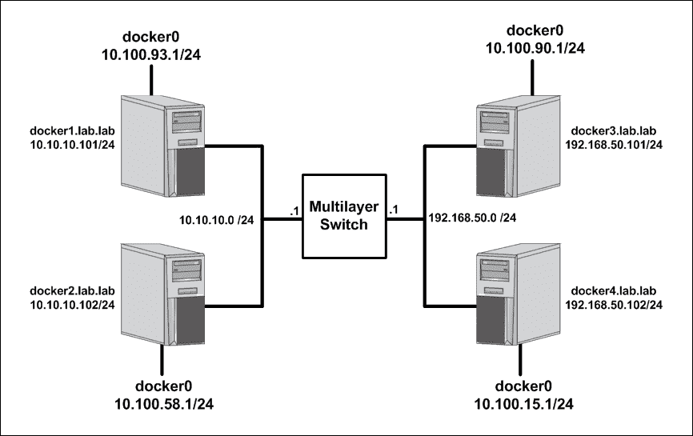
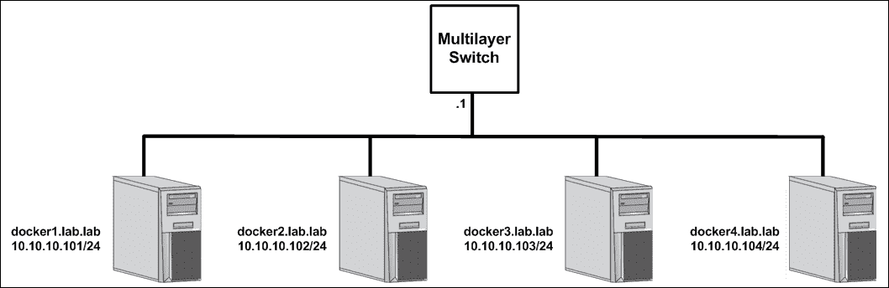
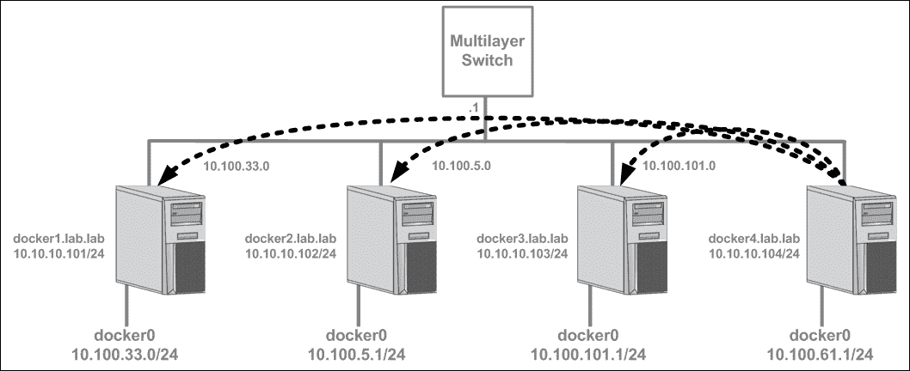
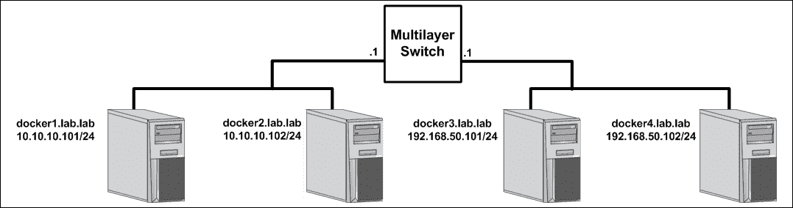
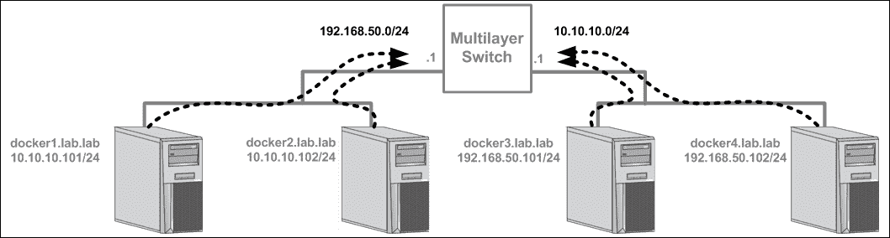

# 第八章。使用法兰绒

在本章中，我们将介绍以下食谱:

*   安装和配置法兰绒
*   将法兰绒与 Docker 集成
*   使用 VXLAN 后端
*   使用主机网关后端
*   指定法兰绒选项

# 简介

法兰绒是 Docker 的第三方网络解决方案，由该团队在 T2 开发。法兰绒是早期的项目之一，旨在给每个容器一个唯一可路由的 IP 地址。这消除了主机间容器到容器通信使用已发布端口的要求。与我们讨论的其他一些解决方案非常相似，法兰绒使用键值存储来跟踪分配和各种其他配置设置。然而，与 Weave 不同，法兰绒不提供与 Docker 服务的直接集成，也不提供插件。相反，法兰绒依赖于您告诉 Docker 使用法兰绒网络来供应容器。在本章中，我们将介绍如何安装法兰绒以及它的各种配置选项。

# 安装和配置法兰绒

在这个食谱中，我们将走一遍法兰绒的安装。法兰绒需要安装密钥存储和法兰绒服务。由于这些依赖关系，它们需要被配置为 Docker 主机上的实际服务。为此，我们将利用`systemd`单元文件来定义每个相应的服务。

## 做好准备

在本例中，我们将使用我们在[第 3 章](03.html "Chapter 3. User-Defined Networks")、*用户定义网络*中使用的相同实验室拓扑，其中我们讨论了用户定义的覆盖网络:


您将需要几台主机，最好其中一些位于不同的子网中。假设本实验中使用的 Docker 主机处于默认配置。在某些情况下，我们所做的更改可能要求您具有对系统的根级访问权限。

## 怎么做…

如上所述，法兰绒依靠键值存储向参与法兰绒网络的所有节点提供信息。在其他例子中，我们运行了一个基于容器的键值存储，比如 Consul 来提供这个功能。由于法兰绒是由 CoreOS 打造的，我们将利用他们名为`etcd`的关键价值商店。虽然`etcd`是以容器格式提供的，但由于法兰绒工作所需的一些先决条件，我们不能轻易使用基于容器的版本。也就是说，我们将为`etcd`和法兰绒下载二进制文件，并将它们作为服务在我们的主机上运行。

让我们从`etcd`开始吧，因为这是法兰绒的一个额外收获。你需要做的第一件事是下载代码。在本例中，我们将利用`etcd`版本 3.0.12，并在主机`docker1`上运行键值存储。要下载二进制文件，我们将运行以下命令:

```
user@docker1:~$ curl -LO \
https://github.com/coreos/etcd/releases/download/v3.0.12/\
etcd-v3.0.12-linux-amd64.tar.gz
```

下载后，我们可以使用以下命令从归档文件中提取二进制文件:

```
user@docker1:~$ tar xzvf etcd-v3.0.12-linux-amd64.tar.gz
```

然后，我们可以将所需的二进制文件移动到正确的位置，使它们可执行。在这种情况下，位置是`/usr/bin`，我们想要的二进制文件是`etcd`服务本身及其名为`etcdctl`的命令行工具:

```
user@docker1:~$ cd etcd-v3.0.12-linux-amd64
user@docker1:~/etcd-v2.3.7-linux-amd64$ sudo mv etcd /usr/bin/
user@docker1:~/etcd-v2.3.7-linux-amd64$ sudo mv etcdctl /usr/bin/
```

现在我们已经准备好了所有的部分，我们需要做的最后一件事就是在系统上创建一个服务来负责运行`etcd`。由于我们的版本的 Ubuntu 正在使用`systemd`，我们需要为`etcd`服务创建一个单元文件。要创建服务定义，可以在`/lib/systemd/system/`目录下创建服务单元文件:

```
user@docker1:~$  sudo vi /lib/systemd/system/etcd.service
```

然后，您可以创建一个服务定义来运行`etcd`。`etcd`服务的示例单位文件如下所示:

```
[Unit]
Description=etcd key-value store
Documentation=https://github.com/coreos/etcd
After=network.target

[Service]
Environment=DAEMON_ARGS=
Environment=ETCD_NAME=%H
Environment=ETCD_ADVERTISE_CLIENT_URLS=http://0.0.0.0:2379
Environment=ETCD_LISTEN_CLIENT_URLS=http://0.0.0.0:2379
Environment=ETCD_LISTEN_PEER_URLS=http://0.0.0.0:2378
Environment=ETCD_DATA_DIR=/var/lib/etcd/default
Type=notify
ExecStart=/usr/bin/etcd $DAEMON_ARGS
Restart=always
RestartSec=10s
LimitNOFILE=65536

[Install]
WantedBy=multi-user.target
```

### 注

请记住`systemd`可以根据您的需求以多种不同的方式进行配置。前面给出的单元文件演示了一种将`etcd`配置为服务的方法。

一旦单元文件到位，我们可以重新加载`systemd`然后启用并启动服务:

```
user@docker1:~$ sudo systemctl daemon-reload
user@docker1:~$ sudo systemctl enable etcd
user@docker1:~$ sudo systemctl start etcd
```

如果由于某些原因服务没有启动或保持启动，您可以使用`systemctl status etcd`命令检查服务的状态:

```
user@docker1:~$ systemctl status etcd
  etcd.service - etcd key-value store
   Loaded: loaded (/lib/systemd/system/etcd.service; enabled; vendor preset: enabled)
   Active: active (running) since Tue 2016-10-11 13:41:01 CDT; 1h 30min ago
     Docs: https://github.com/coreos/etcd
 Main PID: 17486 (etcd)
    Tasks: 8
   Memory: 8.5M
      CPU: 22.095s
   CGroup: /system.slice/etcd.service
           └─17486 /usr/bin/etcd

Oct 11 13:41:01 docker1 etcd[17486]: setting up the initial cluster version to 3.0
Oct 11 13:41:01 docker1 etcd[17486]: published {Name:docker1 ClientURLs:[http://0.0.0.0:2379]} to cluster cdf818194e3a8c32
Oct 11 13:41:01 docker1 etcd[17486]: ready to serve client requests
Oct 11 13:41:01 docker1 etcd[17486]: serving insecure client requests on 0.0.0.0:2379, this is strongly  iscouraged!
Oct 11 13:41:01 docker1 systemd[1]: Started etcd key-value store.
Oct 11 13:41:01 docker1 etcd[17486]: set the initial cluster version to 3.0
Oct 11 13:41:01 docker1 etcd[17486]: enabled capabilities for version 3.0
Oct 11 15:04:20 docker1 etcd[17486]: start to snapshot (applied: 10001, lastsnap: 0)
Oct 11 15:04:20 docker1 etcd[17486]: saved snapshot at index 10001
Oct 11 15:04:20 docker1 etcd[17486]: compacted raft log at 5001
user@docker1:~$
```

稍后，如果启用法兰绒的节点无法与`etcd`对话，请检查并确保`etcd`允许访问所有接口(`0.0.0.0`)，如前面粗体输出所示。这在提供的样本单元文件中已定义，但如果未定义，`etcd`将默认只监听本地环回接口(`127.0.0.1`)。这将阻止远程服务器访问该服务。

### 注

由于键值存储配置是为了演示法兰绒而明确进行的，因此我们不会介绍键值存储的基础知识。这些配置选项足以让您在单个节点上启动并运行，并且不打算在生产环境中使用。在生产环境中使用`etcd`之前，请确保您了解其工作原理。

一旦`etcd`服务启动，我们就可以使用`etcdctl`命令行工具来配置法兰绒中的一些基本设置:

```
user@docker1:~$ etcdctl mk /coreos.com/network/config \
'{"Network":"10.100.0.0/16"}'
```

我们将在后面的食谱中讨论这些配置选项，但是现在，只要知道我们定义为`Network`参数的子网定义了法兰绒全局范围。

现在已经配置好了`etcd`，我们可以重点配置法兰绒本身了。法兰绒作为系统服务的配置与我们刚刚为`etcd`所做的非常相似。主要区别在于，我们将在所有四台实验主机上进行相同的配置，而键值存储仅在一台主机上配置。我们将展示法兰绒在单个主机`docker4`上的安装，但是您需要在实验室环境中希望成为法兰绒网络成员的每台主机上重复这些步骤:

首先，我们将下载法兰绒二进制文件。在本例中，我们将使用版本 0.5.5:

```
user@docker4:~$ cd /tmp/
user@docker4:/tmp$ curl -LO \
https://github.com/coreos/flannel/releases/download/v0.6.2/\
flannel-v0.6.2-linux-amd64.tar.gz
```

然后，我们需要从档案中提取文件，并将`flanneld`二进制文件移动到正确的位置。请注意，没有与法兰绒交互的命令行工具，就像与`etcd`交互一样:

```
user@docker4:/tmp$ tar xzvf flannel-v0.6.2-linux-amd64.tar.gz
user@docker4:/tmp$ sudo mv flanneld /usr/bin/
```

和`etcd`一样，我们想要定义一个`systemd`单元文件，这样我们就可以在每台主机上运行`flanneld`作为服务。要创建服务定义，可以在`/lib/systemd/system/`目录下创建另一个服务单元文件:

```
user@docker4:/tmp$ sudo vi /lib/systemd/system/flanneld.service
```

然后，您可以创建一个服务定义来运行`etcd`。`etcd`服务的示例单位文件如下所示:

```
[Unit]
Description=Flannel Network Fabric
Documentation=https://github.com/coreos/flannel
Before=docker.service
After=etcd.service

[Service]
Environment='DAEMON_ARGS=--etcd-endpoints=http://10.10.10.101:2379'
Type=notify
ExecStart=/usr/bin/flanneld $DAEMON_ARGS
Restart=always
RestartSec=10s
LimitNOFILE=65536

[Install]
WantedBy=multi-user.target
```

一旦单元文件同步，我们可以重新加载`systemd`，然后启用并启动服务:

```
user@docker4:/tmp$ sudo systemctl daemon-reload
user@docker4:/tmp$ sudo systemctl enable flanneld
user@docker4:/tmp$ sudo systemctl start flanneld
```

如果由于某些原因服务没有启动或保持启动，您可以使用`systemctl status flanneld`命令检查服务的状态:

```
user@docker4:/tmp$ systemctl status flanneld
  flanneld.service - Flannel Network Fabric
   Loaded: loaded (/lib/systemd/system/flanneld.service; enabled; vendor preset: enabled)
   Active: active (running) since Wed 2016-10-12 08:50:54 CDT; 6s ago
     Docs: https://github.com/coreos/flannel
 Main PID: 25161 (flanneld)
    Tasks: 6
   Memory: 3.3M
      CPU: 12ms
   CGroup: /system.slice/flanneld.service
           └─25161 /usr/bin/flanneld --etcd-endpoints=http://10.10.10.101:2379

Oct 12 08:50:54 docker4 systemd[1]: Starting Flannel Network Fabric...
Oct 12 08:50:54 docker4 flanneld[25161]: I1012 08:50:54.409928 25161 main.go:126] Installing signal handlers
Oct 12 08:50:54 docker4 flanneld[25161]: I1012 08:50:54.410384 25161 manager.go:133] Determining IP address of default interface
Oct 12 08:50:54 docker4 flanneld[25161]: I1012 08:50:54.410793 25161 manager.go:163] Using 192.168.50.102 as external interface
Oct 12 08:50:54 docker4 flanneld[25161]: I1012 08:50:54.411688 25161 manager.go:164] Using 192.168.50.102 as external endpoint
Oct 12 08:50:54 docker4 flanneld[25161]: I1012 08:50:54.423706 25161 local_manager.go:179] Picking subnet in range 10.100.1.0 ... 10.100.255.0
Oct 12 08:50:54 docker4 flanneld[25161]: I1012 08:50:54.429636 25161 manager.go:246] Lease acquired: 10.100.15.0/24
Oct 12 08:50:54 docker4 flanneld[25161]: I1012 08:50:54.430507 25161 network.go:98] Watching for new subnet leases
Oct 12 08:50:54 docker4 systemd[1]: Started Flannel Network Fabric.
user@docker4:/tmp$
```

您应该会在日志中看到类似的输出，表明法兰绒在您在`etcd`中配置的全局范围分配中找到了租约。这些租约对每个主机都是本地的，我经常称它们为本地范围或网络。下一步是在其余主机上完成此配置。通过检查每台主机上的法兰绒日志，我可以知道为每台主机分配了哪些子网。就我而言，这就是我的结局:

*   `docker1` : `10.100.93.0/24`
*   `docker2` : `10.100.58.0/24`
*   `docker3` : `10.100.90.0/24`
*   `docker4` : `10.100.15.0/24`

此时，法兰绒已完全配置完毕。在下一个食谱中，我们将讨论如何配置 Docker 来使用法兰绒网络。

# 将法兰绒与 Docker 融为一体

正如我们前面提到的，目前法兰绒和 Docker 之间没有直接的集成。也就是说，我们需要找到一种方法，在 Docker 不直接知道发生了什么的情况下，将容器放到法兰绒网络上。在本食谱中，我们将展示如何做到这一点，讨论导致我们当前配置的一些额外条件，并了解法兰绒如何处理主机到主机的通信。

## 做好准备

假设您正在构建上一份食谱中描述的实验室。在某些情况下，我们所做的更改可能要求您拥有对系统的根级访问权限。

## 怎么做…

在前面的配方中，我们配置了法兰绒，但是我们没有从网络角度检查法兰绒配置实际上做了什么。让我们快速查看一下我们的一台支持法兰绒的主机的配置，看看发生了什么变化:

```
user@docker4:~$ ip addr
…<loopback interface removed for brevity>…
2: eth0: <BROADCAST,MULTICAST,UP,LOWER_UP> mtu 1500 qdisc pfifo_fast state UP group default qlen 1000
    link/ether d2:fe:5e:b2:f6:43 brd ff:ff:ff:ff:ff:ff
    inet 192.168.50.102/24 brd 192.168.50.255 scope global eth0
       valid_lft forever preferred_lft forever
    inet6 fe80::d0fe:5eff:feb2:f643/64 scope link
       valid_lft forever preferred_lft forever
3: flannel0: <POINTOPOINT,MULTICAST,NOARP,UP,LOWER_UP> mtu 1472 qdisc pfifo_fast state UNKNOWN group default qlen 500
 link/none
 inet 10.100.15.0/16 scope global flannel0
 valid_lft forever preferred_lft forever
4: docker0: <NO-CARRIER,BROADCAST,MULTICAST,UP> mtu 1500 qdisc noqueue state DOWN group default
    link/ether 02:42:16:78:74:cf brd ff:ff:ff:ff:ff:ff
    inet 172.17.0.1/16 scope global docker0
       valid_lft forever preferred_lft forever 
user@docker4:~$
```

您会注意到添加了一个名为`flannel0`的新界面。您还会注意到，它在`/24`本地范围内有一个分配给该主机的 IP 地址。如果再深入一点，我们可以用`ethtool`判断这个界面是一个虚拟的`tun`界面:

```
user@docker4:~$ ethtool -i flannel0
driver: tun
version: 1.6
firmware-version:
bus-info: tun
supports-statistics: no
supports-test: no
supports-eeprom-access: no
supports-register-dump: no
supports-priv-flags: no
user@docker4:~$
```

法兰绒在运行法兰绒服务的每台主机上创建此接口。注意`flannel0`接口的子网掩码是一个`/16`，它覆盖了我们在`etcd`中定义的整个全局范围分配。尽管给主机分配了一个`/24`范围，但主机认为通过`flannel0`接口可以到达整个`/16`:

```
user@docker4:~$ ip route
default via 192.168.50.1 dev eth0
10.100.0.0/16 dev flannel0  proto kernel  scope link  src 10.100.93.0
172.17.0.0/16 dev docker0  proto kernel  scope link  src 172.17.0.1
192.168.50.0/24 dev eth0  proto kernel  scope link  src 192.168.50.102
user@docker4:~$
```

有了这个接口，就创建了这条路由，确保发往其他主机上任何指定本地范围的流量都要通过`flannel0`接口。我们可以通过 ping 其他主机上的其他`flannel0`接口来证明这一点:

```
user@docker4:~$ ping 10.100.93.0 -c 2
PING 10.100.93.0 (10.100.93.0) 56(84) bytes of data.
64 bytes from 10.100.93.0: icmp_seq=1 ttl=62 time=0.901 ms
64 bytes from 10.100.93.0: icmp_seq=2 ttl=62 time=0.930 ms
--- 10.100.93.0 ping statistics ---
2 packets transmitted, 2 received, 0% packet loss, time 1001ms
rtt min/avg/max/mdev = 0.901/0.915/0.930/0.033 ms
user@docker4:~$
```

由于物理网络不知道`10.100.0.0/16`网络空间，法兰绒必须在流量穿过物理网络时对其进行封装。为了做到这一点，它需要知道哪个物理 Docker 主机被分配了给定的范围。回想一下我们在之前的配方中检查的法兰绒日志，法兰绒根据主机的默认路由为每台主机选择了一个外部接口:

```
I0707 09:07:01.733912 02195 main.go:130] Determining IP address of default interface
I0707 09:07:01.734374 02195 main.go:188] Using 192.168.50.102 as external interface

```

这些信息以及分配给每个主机的范围都被注册到键值存储中。使用这些信息，法兰绒可以确定哪个主机分配了哪个范围，并可以使用该主机的外部接口作为目的地来发送封装的流量。

### 注

法兰绒支持多个后端或传输机制。默认情况下，它将流量封装在端口`8285`的 UDP 中。在接下来的食谱中，我们将讨论其他后端选项。

现在我们知道了法兰绒是如何工作的，我们需要理清如何将实际的 Docker 容器放到法兰绒网络上。最简单的方法是让 Docker 使用分配的范围作为`docker0`桥的子网。法兰绒将范围信息写入保存在`/run/flannel/subnet.env`中的文件:

```
user@docker4:~$ more /run/flannel/subnet.env
FLANNEL_NETWORK=10.100.0.0/16
FLANNEL_SUBNET=10.100.15.1/24
FLANNEL_MTU=1472
FLANNEL_IPMASQ=false
user@docker4:~$
```

利用这些信息，我们可以配置 Docker 为其网桥接口使用正确的子网。法兰绒提供了两种方法。第一个涉及使用法兰绒二进制文件附带的脚本生成一个新的 Docker 配置文件。该脚本允许您输出一个新的 Docker 配置文件，该文件使用来自`subnet.env`文件的信息。例如，我们可以使用脚本生成如下新配置:

```
user@docker4:~$ cd /tmp
user@docker4:/tmp$ ls
flannel-v0.6.2-linux-amd64.tar.gz  mk-docker-opts.sh  README.md  
user@docker4:~/flannel-0.5.5$ ./mk-docker-opts.sh -c -d \
example_docker_config
user@docker4:/tmp$ more example_docker_config
DOCKER_OPTS=" --bip=10.100.15.1/24 --ip-masq=true --mtu=1472"
user@docker4:/tmp$
```

在不利用`systemd`的系统中，在大多数情况下，Docker 会自动检查文件`/etc/default/docker`中的服务级别选项。这意味着我们可以简单地让法兰绒将前面提到的配置文件写到`/etc/default/docker`，这将允许 Docker 在服务重新加载时使用新的设置。但是，由于我们的系统使用`systemd`，该方法需要更新我们的 Docker 插件文件(`/etc/systemd/system/docker.service.d/docker.conf`)如下所示:

```
[Service]
EnvironmentFile=/etc/default/docker
ExecStart=
ExecStart=/usr/bin/dockerd $DOCKER_OPTS

```

粗线表示服务应该检查文件`etc/default/docker`，然后加载变量`$DOCKER_OPTS`在运行时传递给服务。如果您使用这种方法，为了简单起见，在`etc/default/docker`中定义您的所有服务级别选项可能是明智的。

### 注

应该注意的是，第一种方法依赖于运行脚本来生成配置文件。如果您手动运行脚本来生成文件，如果法兰绒配置发生变化，配置文件可能会过期。后面显示的第二种方法更加动态，因为`/run/flannel/subnet.env`文件是由法兰绒服务更新的。

虽然第一种方法确实有效，但我更喜欢使用稍微不同的方法，我只是从`/run/flannel/subnet.env`文件加载变量，并在插入文件中使用它们。为此，我们将 Docker 插件文件更改如下:

```
[Service]
EnvironmentFile=/run/flannel/subnet.env
ExecStart=
ExecStart=/usr/bin/dockerd --bip=${FLANNEL_SUBNET} --mtu=${FLANNEL_MTU}
```

通过将`/run/flannel/subnet.env`指定为`EnvironmentFile`，我们使文件中定义的变量在服务定义中可供使用。然后，我们只是将它们作为选项，在服务启动时传递给它。如果我们在 Docker 主机上进行这些更改，重新加载`systemd`配置，并重新启动 Docker 服务，我们应该会看到我们的`docker0`接口现在反映了法兰绒子网:

```
user@docker4:~$ ip addr show dev docker0
8: docker0: <NO-CARRIER,BROADCAST,MULTICAST,UP> mtu 1500 qdisc noqueue state DOWN group default
    link/ether 02:42:24:0a:e3:c8 brd ff:ff:ff:ff:ff:ff
    inet 10.100.15.1/24 scope global docker0
       valid_lft forever preferred_lft forever
user@docker4:~$ 
```

您也可以根据法兰绒配置自己手动更新 Docker 服务级别参数。只要确保使用`/run/flannel/subnet.env`文件中的信息即可。无论您选择哪种方法，请确保`docker0`网桥在所有四台 Docker 主机上使用法兰绒指定的配置。我们的拓扑现在应该如下所示:



由于每台 Docker 主机仅使用法兰绒分配的子网范围，因此每台主机都认为包括在全局法兰绒网络中的其余子网仍然可以通过`flannel0`接口到达。只有指定本地范围的特定`/24`可以通过本地的`docker0`桥到达:

```
user@docker4:~$ ip route
default via 192.168.50.1 dev eth0 onlink
10.100.0.0/16 dev flannel0  proto kernel  scope link src 10.100.15.0
10.100.15.0/24 dev docker0  proto kernel  scope link src 10.100.15.1 
192.168.50.0/24 dev eth0  proto kernel  scope link src 192.168.50.102
user@docker4:~$
```

此时，我们可以通过在两台不同的主机上运行两个不同的容器来验证法兰绒的运行情况:

```
user@docker1:~$ docker run -dP --name=web1 jonlangemak/web_server_1
7e44a55c7ea7704d97a8804bfa211344c66f9fb83b3ac17f697c504b3b193e2d
user@docker1:~$
user@docker4:~$ docker run -dP --name=web2 jonlangemak/web_server_2
39a47920588b5e0d77ca9d2838988e2d8de893dee6198759f9ddbd3b38cea80d
user@docker4:~$
```

我们现在可以通过 IP 地址直接到达在每个容器上运行的服务。首先，找到其中一个容器的 IP 地址:

```
user@docker1:~$ docker exec -it web1 ip addr show dev eth0
12: eth0@if13: <BROADCAST,MULTICAST,UP,LOWER_UP> mtu 1472 qdisc noqueue state UP
    link/ether 02:42:0a:64:5d:02 brd ff:ff:ff:ff:ff:ff
    inet 10.100.93.2/24 scope global eth0
       valid_lft forever preferred_lft forever
    inet6 fe80::42:aff:fe64:5d02/64 scope link
       valid_lft forever preferred_lft forever
user@docker1:~$
```

然后，从第二个容器访问服务:

```
user@docker4:~$ docker exec -it web2 curl http://10.100.93.2
<body>
  <html>
    <h1><span style="color:#FF0000;font-size:72px;">Web Server #1 - Running on port 80</span>
    </h1>
</body>
  </html>
user@docker4:~$
```

连接工作正常。现在我们已经有了与 Docker 一起工作的整个法兰绒配置，说出我们做事的顺序是很重要的。我们看到的其他解决方案能够将他们解决方案的某些部分进行容器化。例如，Weave 能够以容器的形式提供他们的服务，而不是像我们使用法兰绒那样需要本地服务。有了法兰绒，每个组件都有一个额外的工作。

例如，我们需要在法兰绒注册之前运行`etcd`服务。这本身并不是一个大问题，如果`etcd`和法兰绒都在容器中运行，你可以很容易地解决这个问题。但是，由于 Docker 需要对其网桥 IP 地址进行的更改是在服务级别完成的，因此 Docker 需要在开始之前了解法兰绒范围。这意味着我们不能在 Docker 容器中运行`etcd`和法兰绒服务，因为没有法兰绒基于从`etcd`读取密钥生成的信息，我们无法启动 Docker。在这种情况下，理解每个组件的先决条件很重要。

### 注

在 CoreOS 中运行法兰绒时，他们能够在容器中运行这些组件。对此的解决方案在他们的文档中有详细说明，位于发动机罩下的*部分:*

[https://coreos.com/flannel/docs/latest/flannel-config.html](https://coreos.com/flannel/docs/latest/flannel-config.html)

# 使用 VXLAN 后端

如前所述，法兰绒支持多种不同的后端配置。后端被认为是法兰绒在启用法兰绒的主机之间传递流量的方式。默认情况下，这是通过 UDP 完成的，就像我们在前面的食谱中看到的那样。不过法兰绒也支持 VXLAN。与 UDP 相比，使用 VXLAN 的优势在于较新的主机在内核中支持 VXLAN。在本食谱中，我们将演示如何将法兰绒后端类型更改为 VXLAN。

## 做好准备

假设您是在本章前面的配方中描述的实验室基础上构建的。您将需要与 Docker 集成的支持法兰绒的主机，如本章前两部分所述。在某些情况下，我们所做的更改可能要求您具有对系统的根级访问权限。

## 怎么做…

您希望使用的后端类型是在第一次在`etcd`内实例化您的网络时定义的。由于我们在定义网络`10.100.0.0/16`时没有指定类型，法兰绒默认使用 UDP 后端。这可以通过更新我们最初在`etcd`中设置的配置来更改。回想一下，我们的法兰绒网络最初是用以下命令定义的:

```
etcdctl mk /coreos.com/network/config '{"Network":"10.10.0.0/16"}'
```

注意我们如何使用`etcdctl`的`mk`命令来制作密钥。如果我们想将后端类型更改为 VXLAN，我们可以运行以下命令:

```
etcdctl set /coreos.com/network/config '{"Network":"10.100.0.0/16", "Backend": {"Type": "vxlan"}}'
```

注意，由于我们正在更新对象，我们现在使用`set`命令代替`mk`。虽然有时很难看到纯文本形式，但我们传递给`etcd`的格式正确的 JSON 看起来是这样的:

```
{
    "Network": "10.100.0.0/16",
    "Backend": {
        "Type": "vxlan",
    }
}
```

这将这个后端的类型定义为 VXLAN。虽然前面的配置本身足以改变后端类型，但有时我们可以指定附加参数作为后端的一部分。例如，当定义类型为 VXLAN 时，我们还可以指定一个 **VXLAN 标识符** ( **VNI** )和一个 UDP 端口。如果未指定，VNI 默认为`1`，端口默认为`8472`。为了演示，我们将默认设置作为配置的一部分:

```
user@docker1:~$ etcdctl set /coreos.com/network/config \
'{"Network":"10.100.0.0/16", "Backend": {"Type": "vxlan","VNI": 1, "Port": 8472}}'
```

这在格式正确的 JSON 中是这样的:

```
{
    "Network": "10.100.0.0/16",
    "Backend": {
        "Type": "vxlan",
        "VNI": 1,
        "Port": 8472
    }
}
```

如果我们运行命令，本地`etcd`实例配置将被更新。我们可以通过`etcdctl`命令行工具查询`etcd`来验证`etcd`的配置是否正确。要阅读配置，我们可以使用`etcdctl get`子命令:

```
user@docker1:~$ etcdctl get /coreos.com/network/config
{"Network":"10.100.0.0/16", "Backend": {"Type": "vxlan", "VNI": 1, "Port": 8472}}
user@docker1:~$
```

虽然我们已经成功更新了`etcd`，但是每个节点上的法兰绒服务不会在这个新配置上起作用。这是因为每个主机上的法兰绒服务仅在服务启动时读取这些变量。为了使此更改生效，我们需要在每个节点上重新启动法兰绒服务:

```
user@docker4:~$ sudo systemctl restart flanneld
```

确保在每台主机上重新启动法兰绒服务。如果一些主机使用 VXLAN 后端，而其他主机使用 UDP 后端，主机将无法通信。重启后，我们可以再次检查 Docker 主机的接口:

```
user@docker4:~$ ip addr show
…<Additional output removed for brevity>… 
11: flannel.1: <BROADCAST,MULTICAST,UP,LOWER_UP> mtu 1450 qdisc noqueue state UNKNOWN group default
    link/ether 2e:28:e7:34:1a:ff brd ff:ff:ff:ff:ff:ff
    inet 10.100.15.0/16 scope global flannel.1
       valid_lft forever preferred_lft forever
    inet6 fe80::2c28:e7ff:fe34:1aff/64 scope link
       valid_lft forever preferred_lft forever 
```

在这里，我们可以看到主机现在有了一个名为`flannel.1`的新界面。如果用`ethtool`检查接口，可以看到它使用的是 VXLAN 驱动:

```
user@docker4:~$ ethtool -i flannel.1
driver: vxlan
version: 0.1
firmware-version:
bus-info:
supports-statistics: no
supports-test: no
supports-eeprom-access: no
supports-register-dump: no
supports-priv-flags: no
user@docker4:~$
```

我们应该仍然能够使用法兰绒 IP 地址访问服务:

```
user@docker4:~$ docker exec -it web2 curl http://10.100.93.2
<body>
  <html>
    <h1><span style="color:#FF0000;font-size:72px;">Web Server #1 - Running on port 80</span>
    </h1>
</body>
  </html>
user@docker4:~$
```

### 注

如果您要指定不同的 VNI，法兰绒界面将被定义为`flannel.<VNI number>`。

重要的是要知道法兰绒不负责清理旧配置的工件。例如，如果您在`etcd`中更改 VXLAN ID 并重新启动法兰绒服务，您将在同一网络中拥有两个接口。您需要手动删除使用旧 VNI 命名的旧接口。此外，如果您更改分配给法兰绒的子网，您将希望在重新启动法兰绒服务后重新启动 Docker 服务。回想一下，当 Docker 服务加载时，Docker 从法兰绒中读取配置变量。如果这些更改生效，您需要重新加载配置。

# 使用主机网关后端

正如我们已经看到的，法兰绒支持两种类型的覆盖网络。使用 UDP 或 VXLAN 封装，法兰绒可以在 Docker 主机之间构建覆盖网络。这样做的明显优势是，您可以跨不同的 Docker 节点调配网络，而不必接触物理底层网络。然而，一些类型的覆盖网络也引入了显著的性能损失，尤其是对于在用户空间中执行封装的进程。主机网关模式旨在通过不使用覆盖网络来解决这个问题。然而，这也有其自身的局限性。在本食谱中，我们将回顾主机网关模式可以提供什么，并展示如何配置它。

## 做好准备

在这个食谱中，我们将稍微修改我们一直使用到现在的实验室。实验室拓扑如下所示:



在这种情况下，主机`docker3`和`docker4`现在的 IP 地址与`docker1`和`docker2`位于同一子网。也就是说，所有主机现在都是第 2 层，彼此相邻，可以直接对话，而不需要通过网关路由。一旦您在此拓扑中重新配置了主机，我们将需要擦除法兰绒配置。为此，请执行以下步骤:

*   在运行`etcd`服务的主机上:

    ```
    sudo systemctl stop etcd
    sudo rm -rf /var/lib/etcd/default 
    sudo systemctl start etcd
    ```

*   在运行法兰绒服务的所有主机上:

    ```
    sudo systemctl stop flanneld
    sudo ip link delete flannel.1
    sudo systemctl --no-block start flanneld
    ```

### 注

您会注意到，当我们启动`flanneld`时，我们传递了带有`--no-block`参数的`systemctl`命令。由于我们从`etcd`中删除了法兰绒配置，法兰绒服务正在搜索用于初始化的配置。由于服务的定义方式(如类型 notify)，需要传递此参数以防止命令挂在 CLI 上。

## 怎么做…

此时，您的法兰绒节点将搜索它们的配置。由于我们删除了`etcd`数据存储，告知法兰绒节点如何配置服务的密钥目前丢失，法兰绒服务将继续轮询`etcd`主机，直到我们进行适当的配置。我们可以通过检查其中一台主机上的日志来验证这一点:

```
user@docker4:~$ journalctl -f -u flanneld
-- Logs begin at Wed 2016-10-12 12:39:35 CDT. –
Oct 12 12:39:36 docker4 flanneld[873]: I1012 12:39:36.843784 00873 manager.go:163] Using 10.10.10.104 as external interface
Oct 12 12:39:36 docker4 flanneld[873]: I1012 12:39:36.844160 00873 manager.go:164] Using 10.10.10.104 as external endpoint
Oct 12 12:41:22 docker4 flanneld[873]: E1012 12:41:22.102872 00873 network.go:106] failed to retrieve network config: 100: Key not found (/coreos.com) [4]
Oct 12 12:41:23 docker4 flanneld[873]: E1012 12:41:23.104904 00873 network.go:106] failed to retrieve network config: 100: Key not found (/coreos.com) [4] 
```

需要注意的是，此时法兰绒已经通过查看哪个接口支持主机的默认路由来决定其外部端点的 IP 地址:

```
user@docker4:~$ ip route
default via 10.10.10.1 dev eth0
10.10.10.0/24 dev eth0  proto kernel  scope link  src 10.10.10.104
user@docker4:~$
```

由于这恰好是`eth0`，法兰绒选择该接口的 IP 地址作为其外部地址。要配置主机网关模式，我们可以将以下配置放入`etcd`:

```
{  
   "Network":"10.100.0.0/16",
   "Backend":{  
      "Type":"host-gw"
   }
}
```

正如我们之前看到的，我们仍然指定一个网络。唯一的区别是我们提供了`host-gw`的`type`。将此插入`etcd`的命令如下:

```
user@docker1:~$ etcdctl set /coreos.com/network/config \
'{"Network":"10.100.0.0/16", "Backend": {"Type": "host-gw"}}'
```

在我们插入这个配置之后，法兰绒节点应该都获得了新的配置。让我们检查主机上法兰绒的服务日志`docker4`来验证这一点:

```
user@docker4:~$ journalctl -r -u flanneld
-- Logs begin at Wed 2016-10-12 12:39:35 CDT, end at Wed 2016-10-12 12:55:38 CDT. --
Oct 12 12:55:06 docker4 flanneld[873]: I1012 12:55:06.797289 00873 network.go:83] Subnet added: 10.100.23.0/24 via 10.10.10.103
Oct 12 12:55:06 docker4 flanneld[873]: I1012 12:55:06.796982 00873 network.go:83] Subnet added: 10.100.20.0/24 via 10.10.10.101
Oct 12 12:55:06 docker4 flanneld[873]: I1012 12:55:06.796468 00873 network.go:83] Subnet added: 10.100.43.0/24 via 10.10.10.102
Oct 12 12:55:06 docker4 flanneld[873]: I1012 12:55:06.785464 00873 network.go:51] Watching for new subnet leases
Oct 12 12:55:06 docker4 flanneld[873]: I1012 12:55:06.784436 00873 manager.go:246] Lease acquired: 10.100.3.0/24
Oct 12 12:55:06 docker4 flanneld[873]: I1012 12:55:06.779349 00873 local_manager.go:179] Picking subnet in range 10.100.1.0 ... 10.100.255.0

```

### 注

`journalctl`命令对于查看与由`systemd`管理的服务相关的所有日志非常有用。在前面的例子中，我们传递了`-r`参数来以相反的顺序显示日志(顶部的最新日志)。我们还传递了`-u`参数来指定我们想要查看哪个服务的日志。

我们看到的最早的日志条目是该主机的法兰绒服务挑选并注册了`10.100.0.0/16`子网内的一个范围。这与 UDP 和 VXLAN 后端的工作方式相同。接下来的三个日志条目显示法兰绒正在检测其他三个法兰绒节点范围的注册。由于`etcd`正在跟踪每个法兰绒节点的外部 IP 地址及其注册范围，所有法兰绒主机现在都知道可以使用什么外部 IP 地址来到达每个注册的法兰绒范围。在覆盖模式(UDP 或 VXLAN)下，该外部 IP 地址被用作封装流量的目的地。在主机网关模式下，此外部 IP 地址用作路由目的地。如果我们检查路由表，我们可以看到每台主机的路由条目:

```
user@docker4:~$ ip route
default via 10.10.10.1 dev eth0 onlink
10.10.10.0/24 dev eth0  proto kernel  scope link  src 10.10.10.104
10.100.20.0/24 via 10.10.10.101 dev eth0
10.100.23.0/24 via 10.10.10.103 dev eth0
10.100.43.0/24 via 10.10.10.102 dev eth0
user@docker4:~$
```

在这种配置中，法兰绒仅仅依靠基本路由来提供到所有法兰绒注册范围的可达性。在这种情况下，主机`docker4`具有到所有其他 Docker 主机的路由，以便到达它们的法兰绒网络范围:



这不仅比处理覆盖网络要简单得多，而且比要求每台主机为覆盖网络进行封装要高效得多。这种方法的缺点是，每台主机都需要在同一网络上有一个接口才能工作。如果主机不在同一个网络上，法兰绒无法添加这些路由，因为它需要上游网络设备(主机的默认网关)也有关于如何到达远程主机的路由信息。虽然法兰绒节点可以将静态路由指向其默认网关，但物理网络不知道`10.100.0.0/16`网络，因此无法传送流量。最终效果是主机网关模式限制了放置启用法兰绒的 Docker 主机的位置。

最后，需要指出的是，在 Docker 服务已经运行之后，法兰绒可能已经改变了状态。如果是这种情况，您将需要重新启动 Docker，以确保它从法兰绒中提取新的变量。如果您在重新配置主机的网络接口时重新启动主机，您可能只需要启动 Docker 服务。系统启动时，服务可能无法加载，因为缺少法兰绒配置信息(现在应该有)。

### 注

法兰绒也有 GCE、AWS 等各种云提供商的后端。您可以查看他们的文档，以找到关于这些后端类型的更具体的信息。

# 指定法兰绒选项

除了配置不同的后端类型，您还可以通过`etcd`以及法兰绒客户端本身指定其他选项。这些选项允许您限制 IP 分配范围，并指定特定接口用作法兰绒节点的外部 IP 端点。在本食谱中，我们将回顾您可以在本地和全球使用的其他配置选项。

## 做好准备

我们将继续构建上一章中配置主机网关后端的实验。但是，实验室拓扑将恢复到以前的配置，Docker 主机`docker3`和`docker4`位于`192.168.50.0/24`子网:



一旦您在此拓扑中配置了主机，我们将希望消除法兰绒配置。为此，请执行以下步骤:

*   在运行`etcd`服务的主机上:

    ```
    sudo systemctl stop etcd
    sudo rm -rf /var/lib/etcd/default 
    sudo systemctl start etcd
    ```

*   在运行法兰绒服务的所有主机上:

    ```
    sudo systemctl stop flanneld
    sudo ip link delete flannel.1
    sudo systemctl --no-block start flanneld
    ```

在某些情况下，我们所做的更改可能要求您具有对系统的根级访问权限。

## 怎么做…

前面的方法展示了几个如何指定整体法兰绒网络或全局范围以及更改后端网络类型的示例。我们还看到一些后端网络类型允许额外的配置选项。除了我们已经看到的选项，我们还可以全局配置其他参数，这些参数决定法兰绒的整体工作方式。还有三个其他主要参数会影响分配给法兰绒节点的范围:

*   `SubnetLen`:该参数以整数的形式指定，并规定了分配给每个节点的作用域的大小。如我们所见，这默认为`/24`
*   `SubnetMin`:该参数以字符串的形式指定，并指示范围分配应该开始的起始 IP 范围
*   `SubnetMax`:该参数以字符串的形式指定，表示子网分配应该结束的 IP 范围的结束

在分配网络时，将这些选项与`Network`标志结合使用会给我们带来很大的灵活性。例如，让我们使用这种配置:

```
{  
   "Network":"10.100.0.0/16",
   "SubnetLen":25,
   "SubnetMin":"10.100.0.0",
   "SubnetMax":"10.100.1.0",
   "Backend":{  
      "Type":"host-gw"
   }
}
```

这定义了每个法兰绒节点应该获得一个`/25`的范围分配，第一个子网应该在`10.100.0.0`开始，最后一个子网应该在`10.100.1.0`结束。您可能已经注意到，在这种情况下，我们在该分配中只有三个子网的空间:

*   `10.100.0.0/25`
*   `10.100.0.128./25`
*   `10.100.1.0/25`

这样做的目的是为了显示当法兰绒在全局范围内耗尽空间时会发生什么。现在让我们使用以下命令将该配置置于`etcd`中:

```
user@docker1:~$ etcdctl set /coreos.com/network/config \
 '{"Network":"10.100.0.0/16","SubnetLen": 25, "SubnetMin": "10.100.0.0", "SubnetMax": "10.100.1.0", "Backend": {"Type": "host-gw"}}'
```

一旦就位，您应该看到大多数主机都收到了本地范围分配。但是，如果我们检查我们的主机，我们将看到一个主机未能收到分配。就我而言，那就是主持人`docker4`。我们可以在法兰绒服务日志中看到这一点:

```
user@docker4:~$ journalctl -r -u flanneld
-- Logs begin at Wed 2016-10-12 12:39:35 CDT, end at Wed 2016-10-12 13:17:42 CDT. --
Oct 12 13:17:42 docker4 flanneld[1422]: E1012 13:17:42.650086 01422 network.go:106] failed to register network: failed to acquire lease: out of subnets
Oct 12 13:17:42 docker4 flanneld[1422]: I1012 13:17:42.649604 01422 local_manager.go:179] Picking subnet in range 10.100.0.0 ... 10.100.1.0
```

由于我们只允许在全局范围内为三个分配空间，第四个主机无法接收本地范围，将继续请求一个，直到有一个可用为止。这可以通过将`SubnetMax`参数更新为`10.100.1.128`并在未能接收到本地范围分配的主机上重新启动法兰绒服务来解决。

正如我提到的，我们还可以将配置参数传递给每台主机上的法兰绒服务。

### 注

法兰绒客户端支持多种参数，运行`flanneld --help`即可查看所有参数。其中涵盖了新的和即将推出的功能，以及与基于 SSL 的通信相关的配置，在您无法控制的基础架构上运行这些类型的服务时，审查这些配置非常重要。

从网络角度来看，最有价值的配置选项可能是`--iface`参数，该参数允许您指定希望将哪个主机接口用作法兰绒的外部端点。要了解这一点的重要性，让我们看一下我们的多主机实验拓扑的快速示例:



如果您还记得，在主机网关模式下，法兰绒要求所有法兰绒节点位于第 2 层相邻或同一网络上。这种情况下，左边的`10.10.10.0/24`网络上有两台主机，右边的`192.168.50.0/24`网络上有两台主机。为了相互交谈，他们需要通过多层交换机进行路由。像这样的场景通常需要一个覆盖后端模式，通过多层交换机隧道传输容器流量。但是，如果出于性能或其他原因需要主机网关模式，那么如果您能够为主机提供额外的接口，您可能仍然能够使用它。例如，假设这些主机实际上是虚拟机，我们可以相对容易地在每台主机上配置另一个接口，称之为`eth1`:


该接口可以专用于法兰绒流量，允许每台主机仍然为法兰绒流量而相邻第 2 层，同时仍然保持其通过`eth0`的现有默认路由。然而，仅仅提供接口是不够的。回想一下，默认情况下，法兰绒通过引用主机的默认路由来选择其外部端点接口。由于默认路由在此模型中没有变化，法兰绒将无法添加合适的路由:

```
user@docker4:~$ journalctl -ru flanneld
-- Logs begin at Wed 2016-10-12 14:24:51 CDT, end at Wed 2016-10-12 14:31:14 CDT. --
Oct 12 14:31:14 docker4 flanneld[1491]: E1012 14:31:14.463106 01491 network.go:116] Error adding route to 10.100.1.128/25 via 10.10.10.102: network is unreachable
Oct 12 14:31:14 docker4 flanneld[1491]: I1012 14:31:14.462801 01491 network.go:83] Subnet added: 10.100.1.128/25 via 10.10.10.102
Oct 12 14:31:14 docker4 flanneld[1491]: E1012 14:31:14.462589 01491 network.go:116] Error adding route to 10.100.0.128/25 via 10.10.10.101: network is unreachable
Oct 12 14:31:14 docker4 flanneld[1491]: I1012 14:31:14.462008 01491 network.go:83] Subnet added: 10.100.0.128/25 via 10.10.10.101
```

由于法兰绒仍然使用`eth0`接口作为其外部端点 IP 地址，它知道另一个子网中的主机不能直接到达。我们可以通过将`--iface`选项传递给法兰绒服务，告诉法兰绒使用`eth1`界面来解决这个问题。

例如，我们可以通过更新法兰绒服务定义(`/lib/systemd/system/flanneld.service`)来更改法兰绒配置，如下所示:

```
[Unit]
Description=Flannel Network Fabric
Documentation=https://github.com/coreos/flannel
Before=docker.service
After=etcd.service

[Service]
Environment= 'DAEMON_ARGS=--etcd-endpoints=http://10.10.10.101:2379 --iface=eth1'
Type=notify
ExecStart=/usr/bin/flanneld $DAEMON_ARGS
Restart=always
RestartSec=10s
LimitNOFILE=65536

[Install]
WantedBy=multi-user.target
```

通过这种配置，法兰绒将使用`eth1`接口作为其外部端点，允许所有主机直接通过`10.11.12.0/24`网络进行通信。然后，您可以通过重新加载`systemd`配置并在所有主机上重新启动服务来加载新配置:

```
sudo systemctl daemon-reload
sudo systemctl restart flanneld
```

请记住，法兰绒使用外部端点 IP 地址来跟踪法兰绒节点。更改此值意味着法兰绒将为每个法兰绒节点分配一个新的范围。最好在加入法兰绒节点之前配置这些选项。在我们的例子中，由于`etcd`已经配置好了，我们想要再次删除现有的`etcd`配置并重新配置它，以便作用域变得可用:

```
user@docker1:~$ sudo systemctl stop etcd
user@docker1:~$ sudo rm -rf /var/lib/etcd/default
user@docker1:~$ sudo systemctl start etcd
user@docker1:~$ etcdctl set /coreos.com/network/config \
 '{"Network":"10.100.0.0/16","SubnetLen": 25, "SubnetMin": "10.100.0.0", "SubnetMax": "10.100.1.128", "Backend": {"Type": "host-gw"}}'
```

如果您检查一台主机，您现在应该看到它有三条法兰绒路由——其他三台主机的每个分配范围一条:

```
user@docker1:~$ ip route
default via 10.10.10.1 dev eth0 onlink
10.10.10.0/24 dev eth0  proto kernel  scope link src 10.10.10.101
10.11.12.0/24 dev eth1  proto kernel  scope link src 10.11.12.101
10.100.0.0/25 via 10.11.12.102 dev eth1
10.100.1.0/25 via 10.11.12.104 dev eth1
10.100.1.128/25 via 10.11.12.103 dev eth1
10.100.0.128/25 dev docker0  proto kernel  scope link src 10.100.75.1 
user@docker1:~$
```

此外，如果您将通过 NAT 使用法兰绒，您可能还想查看`--public-ip`选项，该选项允许您定义节点的公共 IP 地址。这在云环境中尤其相关，在云环境中，服务器的真实 IP 地址可能隐藏在 NAT 之后。