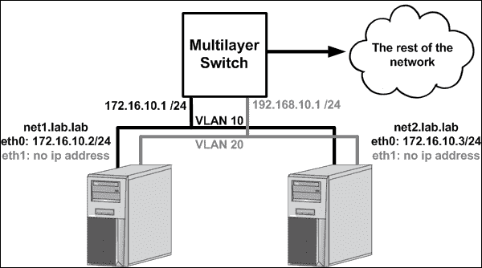
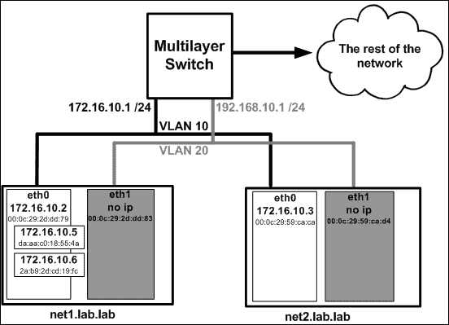
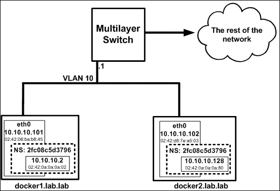
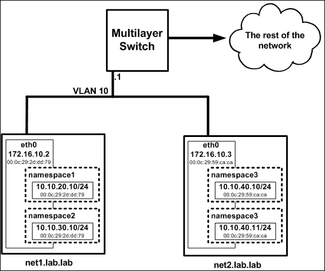
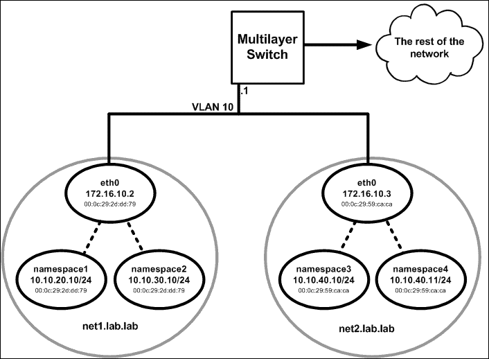
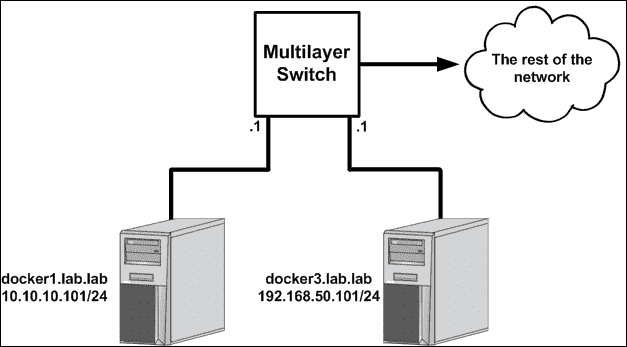
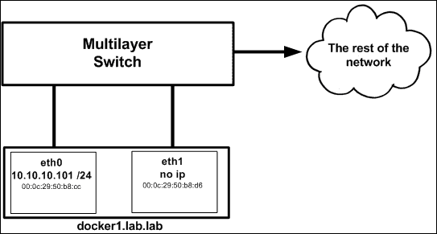

# 第九章。探索网络特征

在本章中，我们将介绍以下食谱:

*   使用预发行版本的 Docker
*   理解 MacVLAN 接口
*   使用 Docker MacVLAN 网络驱动程序
*   了解 IPVLAN 接口
*   使用 Docker IPVLAN 网络驱动程序
*   用 MacVLAN 和 IPVLAN 网络标记 VLAN 标识

# 简介

虽然我们在前面章节中讨论的许多特性从第一天就已经存在了，但是许多特性是最近才引入的。Docker 是一个快速发展的开源软件，有许多贡献者。为了管理特性的引入、测试和潜在的发布，Docker 以两种不同的方式发布代码。在本章中，我们将向您展示如何探索该软件的生产或发布版本中尚未包含的功能。作为其中的一部分，我们将回顾 Docker 引入的两个较新的网络功能。其中一个，MacVLAN，最近被合并到 1.12 版本的软件发布版本中。第二个，IPVLAN，还在预发行软件通道。在我们回顾了如何使用 Docker 预发行软件通道之后，我们将讨论 MacVLAN 和 IPVLAN 网络接口的基本操作，然后讨论它们如何作为驱动程序在 Docker 中实现。

# 使用预发行版本的 Docker

Docker 提供了两个不同的频道，您可以在其中预览未发布的代码。这给了用户一个机会去回顾那些已经计划发布的特性，以及那些完全是实验性的特性，可能永远也不会成为一个真正的发布版本。回顾这些特性并提供反馈是开源软件开发的一个重要部分。Docker 认真对待收到的反馈，许多在这些渠道中测试过的伟大想法都被纳入了产品代码版本。在这个食谱中，我们将回顾如何安装测试和实验性的 Docker 版本。

## 做好准备

在这个食谱中，我们将使用新安装的 Ubuntu 16.04 主机。尽管不是必需的，但建议您在当前未安装 Docker 的主机上安装 Docker 的预发行版本。如果安装程序脚本检测到 Docker 已经安装，它将警告您不要安装实验或测试代码。也就是说，我建议在专用的开发服务器上测试来自这些渠道的软件。在许多情况下，虚拟机用于此目的。如果您使用虚拟机，我建议您安装基本操作系统，然后对虚拟机进行快照，为自己提供一个还原点。如果安装出现问题，您始终可以恢复到此快照，从已知良好的系统启动。

正如 Docker 在他们的文档中所说:

> *实验特性还没有准备好生产。它们是为您的沙盒环境中的测试和评估而提供的。*

当使用任一非生产代码序列时，请记住这一点。强烈建议您在 GitHub 上提供任何一个频道中的所有功能的反馈。

## 怎么做…

如上所述，终端用户可以使用两种不同的预发行软件渠道。

*   [https://experimental.docker.com/](https://experimental.docker.com/):这是脚本下载安装 Docker 实验版的 URL。这个版本包括完全实验性的特性。这些期货中的许多可能在稍后的某个时间点被集成到产品发布中。然而，许多人不会也不会仅仅为了实验而进入这个渠道。
*   [https://test.docker.com/](https://test.docker.com/):这是脚本下载和安装 Docker 测试版的 URL。Docker 也称之为**发布候选** ( **RC** )版本的代码。这是具有特性的代码，这些特性计划发布，但尚未集成到 Docker 的生产或发布版本中。

要安装任一版本，只需从网址下载脚本并将其传递给外壳。例如:

*   要安装实验版本，运行以下命令:

    ```
    curl -sSL https://experimental.docker.com/ | sh
    ```

*   要安装测试或发布候选，发布运行该命令:

    ```
    curl -sSL https://test.docker.com/ | sh
    ```

### 注

有趣的是，您还可以使用类似的配置来下载 Docker 的生产版本。除了[https://test.docker.com/](https://test.docker.com/)和[https://experimental.docker.com/](https://experimental.docker.com/)之外，还有[https://get.docker.com/](https://get.docker.com/)将安装该软件的生产版本。

如上所述，这些脚本的使用应该在当前没有安装 Docker 的机器上完成。安装后，您可以通过检查`docker info`的输出来验证是否安装了适当的版本。例如，在安装实验版本时，您可以在输出中看到实验标志集:

```
user@docker-test:~$ sudo docker info
Containers: 0
 Running: 0
 Paused: 0
 Stopped: 0
Images: 0
Server Version: 1.12.2
…<Additional output removed for brevity>…
Experimental: true
Insecure Registries:
 127.0.0.0/8
user@docker-test:~$
```

在测试或 RC 版本中，您会看到类似的输出；但是，在 Docker info 的输出中不会列出实验变量:

```
user@docker-test:~$ sudo docker info
Containers: 0
 Running: 0
 Paused: 0
 Stopped: 0
Images: 0
Server Version: 1.12.2-rc3
…<Additional output removed for brevity>…
Insecure Registries:
 127.0.0.0/8
user@docker-test:~$
```

通过脚本安装后，您应该会发现 Docker 已经安装并运行，就像您已经通过操作系统的默认软件包管理器安装了 Docker 一样。虽然脚本应该在安装结束时提示您，但建议将您的用户帐户添加到 Docker 组。这可以防止您必须通过`sudo`升级您的权限才能使用 Docker CLI 命令。要将您的用户帐户添加到 Docker 组，请使用以下命令:

```
user@docker-test:~$ sudo usermod -aG docker <your username>
```

确保您注销并重新登录，以使设置生效。

请记住，这些脚本也可以用于更新到任一渠道的最新版本。在这些情况下，该脚本仍然会提示您是否有可能在现有的 Docker 安装上进行安装，但它会提供冗长的说明，表明您可以忽略以下消息:

```
user@docker-test:~$ curl -sSL https://test.docker.com/ | sh
Warning: the "docker" command appears to already exist on this system.

If you already have Docker installed, this script can cause trouble, which is why we're displaying this warning and provide the opportunity to cancel the installation.

If you installed the current Docker package using this script and are using it again to update Docker, you can safely ignore this message.

You may press Ctrl+C now to abort this script.
+ sleep 20
```

虽然这不是获得测试和实验代码的唯一方法，但肯定是最简单的。您也可以下载预构建的二进制文件或自己构建二进制文件。关于如何做到这两点的信息可以在 Docker 位于[https://github.com/docker/docker/tree/master/experimental](https://github.com/docker/docker/tree/master/experimental)的 GitHub 页面上找到。

# 了解 MacVLAN 接口

我们将看到的第一个功能是 MacVLAN。在这个食谱中，我们将在 Docker 之外实现 MacVLAN，以便更好地理解它是如何工作的。理解 MacVLAN 在 Docker 之外如何工作对于理解 Docker 如何使用 MacVLAN 至关重要。在下一个食谱中，我们将介绍 MacVLAN 的 Docker 网络驱动程序实现。

## 做好准备

在本食谱中，我们将使用两台 Linux 主机(`net1`和`net2`)来演示 MacVLAN 功能。我们的实验室拓扑如下所示:



假设主机处于基本配置，并且每台主机都有两个网络接口。`eth0`接口将定义一个静态 IP 地址，并作为每个主机的默认网关。`eth1`接口将配置无 IP 地址。作为参考，您可以找到以下每台主机的网络配置文件(`/etc/network/interfaces`):

*   `net1.lab.lab`

    ```
    auto eth0
    iface eth0 inet static
            address 172.16.10.2
            netmask 255.255.255.0
            gateway 172.16.10.1
            dns-nameservers 10.20.30.13
            dns-search lab.lab

    auto eth1
    iface eth1 inet manual
    ```

*   `net2.lab.lab`

    ```
    auto eth0
    iface eth0 inet static
            address 172.16.10.3
            netmask 255.255.255.0
            gateway 172.16.10.1
            dns-nameservers 10.20.30.13
            dns-search lab.lab

    auto eth1
    iface eth1 inet manual
    ```

### 注

虽然我们将在本食谱中介绍创建拓扑所需的所有步骤，但如果有些步骤不清楚，您可能希望参考[第 1 章](01.html "Chapter 1. Linux Networking Constructs")、 *Linux 网络结构*。[第 1 章](01.html "Chapter 1. Linux Networking Constructs")、 *Linux 网络结构*，更深入地介绍了基本的 Linux 网络结构和 CLI 工具。

## 怎么做…

MacVLAN 代表了一种完全不同的配置接口的方式，这种方式与我们到目前为止所看到的完全不同。我们研究的早期 Linux 网络配置依赖于松散模拟物理网络结构的结构。MacVLAN 接口本质上是逻辑的，并且绑定到现有的网络接口。支持 MacVLAN 接口的接口称为**父级**接口，可以支持一个或多个 MacVLAN 逻辑接口。让我们看一个在我们的实验室主机上配置一个 MacVLAN 接口的快速例子。

配置 MacVLAN 类型接口的方式与 Linux 网络接口上的所有其他类型非常相似。使用`ip`命令行工具，我们可以使用`link`子命令定义界面:

```
user@net1:~$ sudo ip link add macvlan1 link eth0 type macvlan 
```

在本书的第一章中，我们定义了多种不同的接口类型，您应该对这个语法很熟悉。创建后，下一步是为其配置一个 IP 地址。这也是通过`ip`命令完成的:

```
user@net1:~$ sudo ip address add 172.16.10.5/24 dev macvlan1

```

最后，我们需要确保打开界面。

```
user@net1:~$ sudo ip link set dev macvlan1 up
```

界面现已打开，我们可以使用`ip addr show`命令检查配置:

```
user@net1:~$ ip addr show
1: …<loopback interface configuration removed for brevity>…
2: eth0: <BROADCAST,MULTICAST,UP,LOWER_UP> mtu 1500 qdisc pfifo_fast state UP group default qlen 1000
    link/ether 00:0c:29:2d:dd:79 brd ff:ff:ff:ff:ff:ff
    inet 172.16.10.2/24 brd 172.16.10.255 scope global eth0
       valid_lft forever preferred_lft forever
    inet6 fe80::20c:29ff:fe2d:dd79/64 scope link
       valid_lft forever preferred_lft forever
3: eth1: <BROADCAST,MULTICAST,UP,LOWER_UP> mtu 1500 qdisc pfifo_fast state UP group default qlen 1000
    link/ether 00:0c:29:2d:dd:83 brd ff:ff:ff:ff:ff:ff
    inet6 fe80::20c:29ff:fe2d:dd83/64 scope link
       valid_lft forever preferred_lft forever
4: macvlan1@eth0: <BROADCAST,MULTICAST,UP,LOWER_UP> mtu 1500 qdisc noqueue state UNKNOWN group default
    link/ether da:aa:c0:18:55:4a brd ff:ff:ff:ff:ff:ff
    inet 172.16.10.5/24 scope global macvlan1
       valid_lft forever preferred_lft forever
    inet6 fe80::d8aa:c0ff:fe18:554a/64 scope link
       valid_lft forever preferred_lft forever
user@net1:~$
```

现在我们已经配置了接口，有几个有趣的项目需要指出。首先，MacVLAN 接口的名称使得识别接口的父接口变得容易。回想一下，我们提到过每个 MacVLAN 接口必须与一个父接口相关联。在这种情况下，我们可以通过查看 MacVLAN 接口名称中`macvlan1@`后面列出的名称来判断这个 MacVLAN 接口的父接口是`eth0`。其次，分配给 MacVLAN 接口的 IP 地址与父接口位于同一子网(`eth0`)。这是有意允许外部连接。让我们在同一个父接口上定义第二个 MacVLAN 接口，以演示允许哪种连接:

```
user@net1:~$ sudo ip link add macvlan2 link eth0 type macvlan
user@net1:~$ sudo ip address add 172.16.10.6/24 dev macvlan2
user@net1:~$ sudo ip link set dev macvlan2 up
```

我们的网络拓扑如下:



我们有两个 MacVLAN 接口绑定到 net1 的`eth0`接口。如果我们试图从外部子网到达任何一个接口，连接应该如预期的那样工作:

```
user@test_server:~$ ip addr show dev eth0 |grep inet
    inet 10.20.30.13/24 brd 10.20.30.255 scope global eth0
user@test_server:~$ ping 172.16.10.5 -c 2
PING 172.16.10.5 (172.16.10.5) 56(84) bytes of data.
64 bytes from 172.16.10.5: icmp_seq=1 ttl=63 time=0.423 ms
64 bytes from 172.16.10.5: icmp_seq=2 ttl=63 time=0.458 ms
--- 172.16.10.5 ping statistics ---
2 packets transmitted, 2 received, 0% packet loss, time 1000ms
rtt min/avg/max/mdev = 0.423/0.440/0.458/0.027 ms
user@test_server:~$ ping 172.16.10.6 -c 2
PING 172.16.10.6 (172.16.10.6) 56(84) bytes of data.
64 bytes from 172.16.10.6: icmp_seq=1 ttl=63 time=0.510 ms
64 bytes from 172.16.10.6: icmp_seq=2 ttl=63 time=0.532 ms
--- 172.16.10.6 ping statistics ---
2 packets transmitted, 2 received, 0% packet loss, time 1000ms
rtt min/avg/max/mdev = 0.510/0.521/0.532/0.011 ms
```

在前面的输出中，我试图从位于`net1`主机子网之外的测试服务器到达`172.16.10.5`和`172.16.10.6`。在这两种情况下，我们都能够到达 MacVLAN 接口的 IP 地址，这意味着路由工作正常。这就是为什么我们在服务器`eth0`接口的现有子网内给了 MacVLAN 接口 IP 地址。由于多层交换机知道`172.16.10.0/24`住在 VLAN 10 之外，它只需向 VLAN 10 上的新 IP 地址发出 ARP 请求，就可以获得它们的 MAC 地址。Linux 主机已经有一条指向交换机的默认路由，允许返回流量到达测试服务器。然而，这绝不是 MacVLAN 接口的要求。我本可以很容易地选择另一个 IP 子网作为接口，但这会妨碍外部路由本身的工作。

需要指出的另一点是，父接口不需要有与之关联的 IP 地址。例如，让我们通过再构建两个 MacVLAN 接口来扩展拓扑。一个在主机`net1`上，另一个在主机`net2`上:

```
user@net1:~$ sudo ip link add macvlan3 link eth1 type macvlan
user@net1:~$ sudo ip address add 192.168.10.5/24 dev macvlan3
user@net1:~$ sudo ip link set dev macvlan3 up

user@net2:~$ sudo ip link add macvlan4 link eth1 type macvlan
user@net2:~$ sudo ip address add 192.168.10.6/24 dev macvlan4
user@net2:~$ sudo ip link set dev macvlan4 up
```

我们的拓扑如下:


尽管没有在物理接口上定义 IP 地址，但是主机现在认为`192.168.10.0/24`网络已经定义，并且认为网络是本地连接的:

```
user@net1:~$ ip route
default via 172.16.10.1 dev eth0
172.16.10.0/24 dev eth0  proto kernel  scope link  src 172.16.10.2
172.16.10.0/24 dev macvlan1  proto kernel  scope link  src 172.16.10.5
172.16.10.0/24 dev macvlan2  proto kernel  scope link  src 172.16.10.6
192.168.10.0/24 dev macvlan3  proto kernel  scope link  src 192.168.10.5
user@net1:~$
```

这意味着两台主机可以通过该子网中的关联 IP 地址直接联系到对方:

```
user@net1:~$ ping 192.168.10.6 -c 2
PING 192.168.10.6 (192.168.10.6) 56(84) bytes of data.
64 bytes from 192.168.10.6: icmp_seq=1 ttl=64 time=0.405 ms
64 bytes from 192.168.10.6: icmp_seq=2 ttl=64 time=0.432 ms
--- 192.168.10.6 ping statistics ---
2 packets transmitted, 2 received, 0% packet loss, time 1000ms
rtt min/avg/max/mdev = 0.405/0.418/0.432/0.024 ms
user@net1:~$
```

此时，您可能想知道为什么要使用 MacVLAN 接口类型。从表面上看，这与仅仅创建逻辑子接口没有太大区别。真正的区别在于接口是如何构建的。通常，子接口都使用父接口的相同媒体访问控制地址。您可能在前面的输出和图表中注意到，MacVLAN 接口的 MAC 地址与其关联的父接口不同。我们也可以在上游多层交换机(网关)上验证这一点:

```
switch# show ip arp vlan 10
Protocol  Address          Age (min)  Hardware Addr   Type   Interface
Internet  172.16.10.6             8   a2b1.0cd4.4e73  ARPA   Vlan10
Internet  172.16.10.5             8   4e19.f07f.33e0  ARPA   Vlan10
Internet  172.16.10.2             0   000c.292d.dd79  ARPA   Vlan10
Internet  172.16.10.3            62   000c.2959.caca  ARPA   Vlan10
Internet  172.16.10.1             -   0021.d7c5.f245  ARPA   Vlan10
```

### 注

在测试中，您可能会发现 Linux 主机为您配置中的每个 IP 地址提供了相同的 MAC 地址。根据您运行的操作系统，您可能需要更改以下内核参数，以防止主机显示相同的 MAC 地址:

```
echo 1 | sudo tee /proc/sys/net/ipv4/conf/all/arp_ignore
echo 2 | sudo tee /proc/sys/net/ipv4/conf/all/arp_announce
echo 2 | sudo tee /proc/sys/net/ipv4/conf/all/rp_filter
```

请记住，以这种方式应用这些设置不会一直持续到重新启动。

查看 MAC 地址，我们可以看到父接口(`172.16.10.2`)和两个 MacVLAN 接口(`172.16.10.5 and .6`)的 MAC 地址不同。MacVLAN 允许您使用不同的 MAC 地址呈现多个接口。最终结果是，您可以有多个 IP 接口，每个接口都有自己唯一的 MAC 地址，它们都使用相同的物理接口。

由于父接口负责多个媒体访问控制地址，它需要处于混杂模式。当一个接口被选为父接口时，主机应该自动将它置于混杂模式。您可以通过检查 ip 链接详细信息来验证:

```
user@net2:~$ ip -d link
…<output removed for brevity>…
2: eth1: <BROADCAST,MULTICAST,UP,LOWER_UP> mtu 1500 qdisc pfifo_fast state UP mode DEFAULT group default qlen 1000
    link/ether 00:0c:29:59:ca:d4 brd ff:ff:ff:ff:ff:ff promiscuity 1
…<output removed for brevity>…
```

### 注

如果担心父接口处于混杂模式，您可能会对本章后面的食谱感兴趣，我们将在其中讨论 IPVLAN 配置。

和我们已经看到的其他 Linux 接口类型一样，MacVLAN 接口也是命名空间感知的。这可以带来一些有趣的配置选项。现在让我们看看在唯一的网络名称空间中部署 MacVLAN 接口。

让我们从删除所有现有的 MacVLAN 接口开始:

```
user@net1:~$ sudo ip link del macvlan1
user@net1:~$ sudo ip link del macvlan2
user@net1:~$ sudo ip link del macvlan3
user@net2:~$ sudo ip link del macvlan4
```

就像我们在第一章、 *Linux 网络结构*中所做的一样，我们可以创建一个接口，然后将其移动到一个名称空间中。我们从创建命名空间开始:

```
user@net1:~$ sudo ip netns add namespace1
```

然后，我们创建 MacVLAN 接口:

```
user@net1:~$ sudo ip link add macvlan1 link eth0 type macvlan
```

接下来，我们将接口移动到新创建的网络命名空间中:

```
user@net1:~$ sudo ip link set macvlan1 netns namespace1
```

最后，从命名空间中，我们为它分配一个 IP 地址，并将其调出:

```
user@net1:~$ sudo ip netns exec namespace1 ip address \
add 172.16.10.5/24 dev macvlan1
user@net1:~$ sudo ip netns exec namespace1 ip link set \
dev macvlan1 up
```

为了测试的目的，让我们在第二个命名空间中创建第二个接口:

```
user@net1:~$ sudo ip netns add namespace2
user@net1:~$ sudo ip link add macvlan2 link eth0 type macvlan
user@net1:~$ sudo ip link set macvlan2 netns namespace2
user@net1:~$ sudo ip netns exec namespace2 ip address \
add 172.16.10.6/24 dev macvlan2
user@net1:~$ sudo ip netns exec namespace2 ip link set \
dev macvlan2 up
```

### 注

当您使用不同的配置时，创建和删除同一个界面很多次是很常见的。这样做，您可能会生成具有相同 IP 地址但不同 MAC 地址的接口。因为我们将这些媒体访问控制地址呈现给上游物理网络，所以一定要确保上游设备或网关拥有您试图到达的 IP 的最新 ARP 条目。许多交换机和路由器通常会有很长的 ARP 超时值，在此期间，它们不会为较新的 MAC 条目进行 ARP。

此时，我们有一个拓扑，看起来像这样:


父接口(`eth0`)和以前一样有一个 IP 地址，但这次，MacVLAN 接口位于它们自己唯一的名称空间内。尽管位于不同的命名空间中，但它们仍然共享同一个父级，因为这是在将它们移入命名空间之前完成的。

此时你应该注意到外部主机不再能 ping 通所有的 IP 地址。而是只能到达`172.16.10.2`的`eth0` IP 地址。原因很简单。大家会记得，名称空间相当于一个**虚拟路由和转发** ( **VRF** )并且有自己的路由表。如果您检查这两个名称空间的路由表，您会发现它们都没有默认路由:

```
user@net1:~$ sudo ip netns exec namespace1 ip route
172.16.10.0/24 dev macvlan1  proto kernel  scope link  src 172.16.10.5
user@net1:~$ sudo ip netns exec namespace2 ip route
172.16.10.0/24 dev macvlan2  proto kernel  scope link  src 172.16.10.6
user@net1:~$
```

为了使这些接口可以通过网络到达，我们需要给每个名称空间一个指向该子网中网关的默认路由(`172.16.10.1`)。同样，这也是寻址与父接口位于同一子网中的 MacVLAN 接口的好处。路由已经在物理网络上了。添加路线并再次测试:

```
user@net1:~$ sudo ip netns exec namespace1 ip route \
add 0.0.0.0/0 via 172.16.10.1
user@net1:~$ sudo ip netns exec namespace2 ip route \
add 0.0.0.0/0 via 172.16.10.1
```

从外部测试主机(为简洁起见，删除了一些输出):

```
user@test_server:~$ ping 172.16.10.2 -c 2
PING 172.16.10.2 (172.16.10.2) 56(84) bytes of data.
64 bytes from 172.16.10.2: icmp_seq=1 ttl=63 time=0.459 ms
64 bytes from 172.16.10.2: icmp_seq=2 ttl=63 time=0.441 ms
user@test_server:~$ ping 172.16.10.5 -c 2
PING 172.16.10.5 (172.16.10.5) 56(84) bytes of data.
64 bytes from 172.16.10.5: icmp_seq=1 ttl=63 time=0.521 ms
64 bytes from 172.16.10.5: icmp_seq=2 ttl=63 time=0.528 ms
user@test_server:~$ ping 172.16.10.6 -c 2
PING 172.16.10.6 (172.16.10.6) 56(84) bytes of data.
64 bytes from 172.16.10.6: icmp_seq=1 ttl=63 time=0.524 ms
64 bytes from 172.16.10.6: icmp_seq=2 ttl=63 time=0.551 ms

```

因此，虽然外部连接看起来像预期的那样工作，但您会注意到没有一个接口可以相互通信:

```
user@net1:~$ sudo ip netns exec namespace2 ping 172.16.10.5
PING 172.16.10.5 (172.16.10.5) 56(84) bytes of data.
--- 172.16.10.5 ping statistics ---
5 packets transmitted, 0 received, 100% packet loss, time 0ms
user@net1:~$ sudo ip netns exec namespace2 ping 172.16.10.2 
PING 172.16.10.2 (172.16.10.2) 56(84) bytes of data.
--- 172.16.10.2 ping statistics ---
5 packets transmitted, 0 received, 100% packet loss, time 0ms
user@net1:~$
```

这似乎很奇怪，因为它们都共享同一个父接口。问题在于 MacVLAN 接口是如何配置的。MacVLAN 接口类型支持四种不同的模式:

*   **VEPA**:**虚拟以太网端口聚合器** ( **VEPA** )模式会强制所有来源于 MacVLAN 接口的流量离开父接口，而不考虑目的地。即使是发往共享同一父接口的另一个 MacVLAN 接口的流量也要遵守此政策。在第 2 层场景中，由于标准的生成树规则，两个 MacVLAN 接口之间的通信可能会被阻塞。您可以在上游路由器上在两者之间进行路由。
*   **网桥**:MAC VLAN 网桥模式模仿标准的 Linux 网桥。允许同一父接口上的两个 MacVLAN 接口之间的通信直接发生，而无需将父接口从主机上转移出去。这对于您期望高级接口在同一父接口上进行接口通信的场景非常有用。
*   **Private** :这个模式类似于 VEPA 模式，增加了完全阻断同一父接口上接口之间通信的能力。即使您允许流量通过父节点，然后再重新进入主机，通信也会中断。
*   **直通**:意在作为直接将父接口绑定到 MacVLAN 接口的手段。在这种模式下，每个父节点只允许有一个 MacVLAN 接口，并且 MacVLAN 接口从父节点继承 MAC 地址。

虽然不知道从哪里看不容易辨别，但我们的 MacVLAN 接口碰巧是 VEPA 类型的，这恰好是默认的。我们可以通过将详细信息(`-d`)标志传递给`ip`命令来看到这一点:

```
user@net1:~$ sudo ip netns exec namespace1 ip -d link show
1: lo: <LOOPBACK> mtu 65536 qdisc noop state DOWN mode DEFAULT group default
    link/loopback 00:00:00:00:00:00 brd 00:00:00:00:00:00 promiscuity 0
20: macvlan1@if2: <BROADCAST,MULTICAST,UP,LOWER_UP> mtu 1500 qdisc noqueue state UNKNOWN mode DEFAULT group default
    link/ether 36:90:37:f6:08:cc brd ff:ff:ff:ff:ff:ff promiscuity 0
 macvlan  mode vepa
user@net1:~$
```

在我们的例子中，VEPA 模式阻止了两个名称空间接口直接对话。更常见的是，MacVLAN 接口被定义为类型`bridge`，以允许同一父接口上的接口之间的通信。然而，即使在这种模式下，子接口也不允许直接与直接分配给父接口的 IP 地址通信(在这种情况下为`172.16.10.2`)。这应该是一个单独的段落。

```
user@net1:~$ sudo ip netns del namespace1
user@net1:~$ sudo ip netns del namespace2
```

现在我们可以重新创建两个接口，为每个 MacVLAN 接口指定`bridge`模式:

```
user@net1:~$ sudo ip netns add namespace1
user@net1:~$ sudo ip link add macvlan1 link eth0 type \
macvlan mode bridge
user@net1:~$ sudo ip link set macvlan1 netns namespace1
user@net1:~$ sudo ip netns exec namespace1 ip address \
add 172.16.10.5/24 dev macvlan1
user@net1:~$ sudo ip netns exec namespace1 ip link set \
dev macvlan1 up

user@net1:~$ sudo ip netns add namespace2
user@net1:~$ sudo ip link add macvlan2 link eth0 type \
macvlan mode bridge
user@net1:~$ sudo ip link set macvlan2 netns namespace2
user@net1:~$ sudo ip netns exec namespace2 sudo ip address \
add 172.16.10.6/24 dev macvlan2
user@net1:~$ sudo ip netns exec namespace2 ip link set \
dev macvlan2 up
```

指定`bridge`模式后，我们可以验证两个接口可以直接相互连接:

```
user@net1:~$ sudo ip netns exec namespace1 ping 172.16.10.6 -c 2
PING 172.16.10.6 (172.16.10.6) 56(84) bytes of data.
64 bytes from 172.16.10.6: icmp_seq=1 ttl=64 time=0.041 ms
64 bytes from 172.16.10.6: icmp_seq=2 ttl=64 time=0.030 ms
--- 172.16.10.6 ping statistics ---
2 packets transmitted, 2 received, 0% packet loss, time 999ms
rtt min/avg/max/mdev = 0.030/0.035/0.041/0.008 ms
user@net1:~$
```

但是，我们也注意到，我们仍然无法到达在父接口(`eth0`)上定义的主机 IP 地址:

```
user@net1:~$ sudo ip netns exec namespace1 ping 172.16.10.2 -c 2
PING 172.16.10.2 (172.16.10.2) 56(84) bytes of data.
--- 172.16.10.2 ping statistics ---
2 packets transmitted, 0 received, 100% packet loss, time 1008ms
user@net1:~$
```

# 使用 Docker MacVLAN 网络驱动程序

当我开始写这本书的时候，Docker 的当前版本是 1.10，那个时候 MacVLAN 功能已经包含在 Docker 的发布候选版本中。此后 1.12 版本发布，将 MacVLAN 推入软件的发布版本。也就是说，使用 MacVLAN 驱动程序的唯一要求是确保您安装了 1.12 或更新版本的 Docker。在本章中，我们将回顾如何为 Docker 提供的容器使用 MacVLAN 网络驱动程序。

## 做好准备

在这个食谱中，我们将使用两个运行 Docker 的 Linux 主机。我们的实验室拓扑将由位于同一网络上的两台 Docker 主机组成。它看起来像这样:


假设每台主机运行的 Docker 版本为 1.12 或更高，以便能够访问 MacVLAN 驱动程序。主机应该只有一个 IP 接口，Docker 应该处于默认配置。在某些情况下，我们所做的更改可能要求您具有对系统的根级访问权限。

## 怎么做…

与所有其他用户定义的网络类型一样，MacVLAN 驱动程序通过`docker network`子命令来处理。创建一个 MacVLAN 类型的网络就像创建任何其他网络类型一样简单，但是有一些事情需要记住，这是特定于这个驱动程序的。

*   定义网络时需要指定上游网关。请记住，MacVLAN 接口呈现在父接口的同一接口上。他们需要主机或接口上游网关来访问外部子网。
*   在其他用户定义的网络类型中，如果您决定不指定子网，Docker 会生成一个子网供您使用。尽管 MacVLAN 驱动程序仍然是这种情况，但除非您指定父接口可以访问的网络，否则它将无法正常工作。就像我们在上一份食谱中看到的那样，MacVLAN 依赖于上游网络设备知道如何路由 MacVLAN 接口。这是通过在父接口所在的同一子网上为容器定义 MacVLAN 接口来实现的。您也可以选择使用没有定义 IP 地址的父接口。在这些情况下，只需确保在 Docker 中定义网络时指定的网关可以从父接口到达。
*   作为驱动程序的一个选项，您需要指定一个接口，您希望将该接口用作所有附加了 MacVLAN 接口的容器的父接口。如果不指定父接口作为选项，Docker 将创建一个虚拟网络接口，并将其用作父接口。这将阻止从该网络到外部网络的任何通信。
*   使用 MacVLAN 驱动程序创建网络时，`--internal flag`可用。指定后，父接口被定义为虚拟接口，防止流量离开主机。
*   MacVLAN 用户定义的网络和父接口之间存在一对一的关系。也就是说，您只能在给定的父接口上定义一个 MacVLAN 类型的网络。
*   一些交换机供应商限制了每个端口可以获知的媒体访问控制地址的数量。虽然这个数字通常非常高，但请确保在使用这种网络类型时考虑到这一点。
*   与其他用户定义的网络类型一样，您可以指定一个 IP 范围或一组辅助地址，您希望 Docker 的 IPAM 不要分配给容器。在 MacVLAN 模式下，这些设置更加重要，因为您将容器直接呈现在物理网络上。

考虑到这些点和我们当前的实验拓扑，我们可以在每台主机上定义如下网络:

```
user@docker1:~$ docker network create -d macvlan \
--subnet 10.10.10.0/24 --ip-range 10.10.10.0/25 \
--gateway=10.10.10.1 --aux-address docker1=10.10.10.101 \
--aux-address docker2=10.10.10.102 -o parent=eth0 macvlan_net

user@docker2:~$ docker network create -d macvlan \
--subnet 10.10.10.0/24 --ip-range 10.10.10.128/25 \
--gateway=10.10.10.1 --aux-address docker1=10.10.10.101 \
--aux-address docker2=10.10.10.102 -o parent=eth0 macvlan_net
```

通过这种配置，网络上的每台主机将使用已定义的可用子网的一半，在本例中为`/25`。由于 Dockers IPAM 自动为我们保留网关 IP 地址，因此没有必要通过将其定义为辅助地址来阻止它被分配。然而，由于 Docker 主机接口本身确实在这个范围内，我们确实需要保留那些带有辅助地址的接口。

我们现在可以在每台主机上定义容器，并验证它们是否可以相互通信:

```
user@docker1:~$ docker run -d --name=web1 \
--net=macvlan_net jonlangemak/web_server_1
user@docker1:~$ docker exec web1 ip addr
1: lo: <LOOPBACK,UP,LOWER_UP> mtu 65536 qdisc noqueue state UNKNOWN qlen 1
    link/loopback 00:00:00:00:00:00 brd 00:00:00:00:00:00
    inet 127.0.0.1/8 scope host lo
       valid_lft forever preferred_lft forever
    inet6 ::1/128 scope host
       valid_lft forever preferred_lft forever
7: eth0@if2: <BROADCAST,MULTICAST,UP,LOWER_UP> mtu 1500 qdisc noqueue state UNKNOWN
    link/ether 02:42:0a:0a:0a:02 brd ff:ff:ff:ff:ff:ff
    inet 10.10.10.2/24 scope global eth0
       valid_lft forever preferred_lft forever
    inet6 fe80::42:aff:fe0a:a02/64 scope link
       valid_lft forever preferred_lft forever
user@docker1:~$
user@docker2:~$ docker run -d --name=web2 \
--net=macvlan_net jonlangemak/web_server_2
user@docker2:~$ docker exec web2 ip addr
1: lo: <LOOPBACK,UP,LOWER_UP> mtu 65536 qdisc noqueue state UNKNOWN qlen 1
    link/loopback 00:00:00:00:00:00 brd 00:00:00:00:00:00
    inet 127.0.0.1/8 scope host lo
       valid_lft forever preferred_lft forever
    inet6 ::1/128 scope host
       valid_lft forever preferred_lft forever
4: eth0@if2: <BROADCAST,MULTICAST,UP,LOWER_UP> mtu 1500 qdisc noqueue state UNKNOWN
    link/ether 02:42:0a:0a:0a:80 brd ff:ff:ff:ff:ff:ff
    inet 10.10.10.128/24 scope global eth0
       valid_lft forever preferred_lft forever
    inet6 fe80::42:aff:fe0a:a80/64 scope link
       valid_lft forever preferred_lft forever
user@docker2:~$
```

您会注意到在容器运行时不需要发布端口。由于此时容器具有唯一可路由的 IP 地址，因此不需要发布端口。任何容器都可以在其唯一的 IP 地址上提供任何服务。

与其他网络类型非常相似，Docker 为每个容器创建一个网络名称空间，然后将容器映射到 MacVLAN 接口中。此时，我们的拓扑如下所示:



### 注

命名空间名称可以通过检查容器本身或链接 Docker `netns`目录来找到，正如我们在前面章节中看到的，因此`ip netns`子命令可以查询 Docker 定义的网络命名空间。

从位于子网外的外部测试主机，我们可以验证每个容器服务都可以通过容器的 IP 地址到达:

```
user@test_server:~$ curl http://10.10.10.2
<body>
  <html>
    <h1><span style="color:#FF0000;font-size:72px;">Web Server #1 - Running on port 80</span>
    </h1>
</body>
  </html>
user@test_server:~$ curl http://10.10.10.128
<body>
  <html>
    <h1><span style="color:#FF0000;font-size:72px;">Web Server #2 - Running on port 80</span>
    </h1>
</body>
  </html>
[root@tools ~]#
```

但是，您会注意到，尽管连接到 MacVLAN 网络的容器位于同一接口上，但无法从本地主机访问:

```
user@docker1:~$ ping 10.10.10.2
PING 10.10.10.2 (10.10.10.2) 56(84) bytes of data.
From 10.10.10.101 icmp_seq=1 Destination Host Unreachable
--- 10.10.10.2 ping statistics ---
5 packets transmitted, 0 received, +1 errors, 100% packet loss, time 0ms
user@docker1:~$
```

Docker 的当前实现仅在 MacVLAN 桥接模式下支持 MacVLAN。我们可以通过检查容器中接口的详细信息来验证这是 MacVLAN 接口的操作模式:

```
user@docker1:~$ docker exec web1 ip -d link show
1: lo: <LOOPBACK,UP,LOWER_UP> mtu 65536 qdisc noqueue state UNKNOWN
    link/loopback 00:00:00:00:00:00 brd 00:00:00:00:00:00
5: eth0@if2: <BROADCAST,MULTICAST,UP,LOWER_UP> mtu 1500 qdisc noqueue state UNKNOWN
    link/ether 02:42:0a:0a:0a:02 brd ff:ff:ff:ff:ff:ff
 macvlan  mode bridge
user@docker1:~$
```

# 了解 IPVLAN 接口

MacVLAN 的另一种选择是 IPVLAN。IPVLAN 有两种口味。第一种是 L2 模式，除了 MAC 地址的分配方式之外，它的运行方式与 MacVLAN 非常相似。在 IPVLAN 模式下，所有逻辑 IP 接口都使用相同的 MAC 地址。这使您可以将父网卡排除在混杂模式之外，并防止您遇到任何可能的网卡或交换机端口 MAC 限制。第二种模式是 IPVLAN 第三层。在第 3 层模式下，IPVLAN 就像路由器一样，将单播数据包进出 IPVLAN 连接的网络。在本食谱中，我们将介绍基本的 IPVLAN 网络结构，以了解它是如何工作的以及如何实现的。

## 做好准备

在本食谱中，我们将使用本章中*理解 MacVLAN 接口*食谱中相同的 Linux 主机(`net1`和`net2`)。有关拓扑的更多信息，请参考*了解 MacVLAN* 配方的*准备*部分。

### 注

`iproute2`工具集的旧版本不包括对 IPVLAN 的完全支持。如果这些命令不适用于 IPVLAN 配置，很有可能您使用的是没有支持的旧版本。您可能需要更新才能获得完全支持的更新版本。旧版本对 IPVLAN 有一些支持，但缺乏定义模式(L2 或 L3)的能力。

## 怎么做…

如前所述，L2 模式下的 IPVLAN 在功能上几乎与 MacVLAN 相同。主要区别在于，对于连接到同一主机的所有 IPVLAN 接口，IPVLAN 利用相同的媒体访问控制地址。您会记得，每个连接到同一个父接口的 MacVLAN 接口都利用了不同的 MAC 地址。

我们可以创建与 MacVLAN 配方中相同的接口，以显示接口地址是用相同的 MAC 地址创建的:

```
user@net1:~$ sudo ip link add ipvlan1 link eth0  type ipvlan mode l2
user@net1:~$ sudo ip address add 172.16.10.5/24 dev ipvlan1
user@net1:~$ sudo ip link set dev ipvlan1 up

user@net1:~$ sudo ip link add ipvlan2 link eth0 type ipvlan mode l2
user@net1:~$ sudo ip address add 172.16.10.6/24 dev ipvlan2
user@net1:~$ sudo ip link set dev ipvlan2 up
```

请注意，配置的唯一区别是我们将类型指定为 IPVLAN，将模式指定为 L2。在 IPVLAN 的情况下，默认模式是 L3，因此我们需要指定 L2，以便让接口以这种方式运行。由于 IPVLAN 接口继承了父接口的 MAC 地址，因此我们的拓扑应该如下所示:


我们可以通过检查接口本身来证明这一点:

```
user@net1:~$ ip -d link
…<loopback interface removed for brevity>…
2: eth0: <BROADCAST,MULTICAST,UP,LOWER_UP> mtu 1500 qdisc pfifo_fast state UP mode DEFAULT group default qlen 1000
    link/ether 00:0c:29:2d:dd:79 brd ff:ff:ff:ff:ff:ff promiscuity 1 addrgenmode eui64
3: eth1: <BROADCAST,MULTICAST,UP,LOWER_UP> mtu 1500 qdisc pfifo_fast state UP mode DEFAULT group default qlen 1000
    link/ether 00:0c:29:2d:dd:83 brd ff:ff:ff:ff:ff:ff promiscuity 0 addrgenmode eui64
28: ipvlan1@eth0: <BROADCAST,MULTICAST,UP,LOWER_UP> mtu 1500 qdisc noqueue state UNKNOWN mode DEFAULT group default
    link/ether 00:0c:29:2d:dd:79 brd ff:ff:ff:ff:ff:ff promiscuity 0
    ipvlan  mode l2 addrgenmode eui64
29: ipvlan2@eth0: <BROADCAST,MULTICAST,UP,LOWER_UP> mtu 1500 qdisc noqueue state UNKNOWN mode DEFAULT group default
    link/ether 00:0c:29:2d:dd:79 brd ff:ff:ff:ff:ff:ff promiscuity 0
    ipvlan  mode l2 addrgenmode eui64
user@net1:~$
```

如果我们从本地子网之外向这些 IP 发起流量，我们可以通过检查上游网关上的 ARP 表来验证每个 IP 报告相同的 MAC 地址:

```
switch#show ip arp vlan 10
Protocol  Address          Age (min)  Hardware Addr   Type   Interface
Internet  172.16.10.6             0   000c.292d.dd79  ARPA   Vlan30
Internet  172.16.10.5             0   000c.292d.dd79  ARPA   Vlan30
Internet  172.16.10.2           111   000c.292d.dd79  ARPA   Vlan30
Internet  172.16.10.3           110   000c.2959.caca  ARPA   Vlan30
Internet  172.16.10.1             -   0021.d7c5.f245  ARPA   Vlan30
```

虽然我们不会在这里展示一个例子，但是 L2 模式下的 IPVLAN 接口也是有名称空间意识的，就像我们在上一组关于 MacVLAN 接口类型的食谱中看到的一样。唯一的区别是接口的媒体访问控制地址，正如我们在前面的代码中看到的。同样的限制适用于父接口不能与子接口对话，反之亦然。

现在我们知道了 L2 模式下的 IPVLAN 是如何工作的，下面我们来讨论一下 L3 模式下的 IPVLAN。到目前为止，L3 模式与我们看到的有很大不同。顾名思义，L3 模式这种接口类型在所有连接的子接口之间路由流量。这在名称空间配置中最容易理解。例如，让我们看看这个快速的实验拓扑:



在上图中，您可以看到我在我们的两台实验室主机上创建了四个独特的名称空间。我还创建了四个唯一的 IPVLAN 接口，将它们映射到不同的名称空间中，并给它们每个都一个唯一的 IP 地址。由于这些是 IPVLAN 接口，您会注意到所有 IPVLAN 接口都共享父接口的媒体访问控制地址。为了构建此拓扑，我在每台主机上使用了以下配置:

```
user@net1:~$ sudo ip link del dev ipvlan1
user@net1:~$ sudo ip link del dev ipvlan2
user@net1:~$ sudo ip netns add namespace1
user@net1:~$ sudo ip netns add namespace2
user@net1:~$ sudo ip link add ipvlan1 link eth0 type ipvlan mode l3
user@net1:~$ sudo ip link add ipvlan2 link eth0 type ipvlan mode l3
user@net1:~$ sudo ip link set ipvlan1 netns namespace1
user@net1:~$ sudo ip link set ipvlan2 netns namespace2
user@net1:~$ sudo ip netns exec namespace1 ip address \
add 10.10.20.10/24 dev ipvlan1
user@net1:~$ sudo ip netns exec namespace1 ip link set dev ipvlan1 up
user@net1:~$ sudo ip netns exec namespace2 sudo ip address \
add 10.10.30.10/24 dev ipvlan2
user@net1:~$ sudo ip netns exec namespace2 ip link set dev ipvlan2 up

user@net2:~$ sudo ip netns add namespace3
user@net2:~$ sudo ip netns add namespace4
user@net2:~$ sudo ip link add ipvlan3 link eth0 type ipvlan mode l3
user@net2:~$ sudo ip link add ipvlan4 link eth0 type ipvlan mode l3
user@net2:~$ sudo ip link set ipvlan3 netns namespace3
user@net2:~$ sudo ip link set ipvlan4 netns namespace4
user@net2:~$ sudo ip netns exec namespace3 ip address \
add 10.10.40.10/24 dev ipvlan3
user@net2:~$ sudo ip netns exec namespace3 ip link set dev ipvlan3 up
user@net2:~$ sudo ip netns exec namespace4 sudo ip address \
add 10.10.40.11/24 dev ipvlan4
user@net2:~$ sudo ip netns exec namespace4 ip link set dev ipvlan4 up
```

一旦配置完成，您会注意到唯一可以相互通信的接口是主机`net2` ( `10.10.40.10`和`10.10.40.11`)上的接口。让我们从逻辑上来看一下这个拓扑，以了解为什么:



从逻辑上看，它开始看起来像一个路由网络。您会注意到所有分配的 IP 地址都是唯一的，没有任何重叠。正如我前面提到的，IPVLAN L3 模式就像路由器一样。从概念角度来看，您可以将父接口视为该路由器。如果我们从第 3 层的角度来看，只有名称空间 3 和 4 中的接口可以说话是有意义的，因为它们在同一个广播域中。其他名称空间需要通过网关进行路由，才能相互对话。让我们检查所有名称空间的路由表，看看情况如何:

```
user@net1:~$ sudo ip netns exec namespace1 ip route
10.10.20.0/24 dev ipvlan1  proto kernel  scope link  src 10.10.20.10
user@net1:~$ sudo ip netns exec namespace2 ip route
10.10.30.0/24 dev ipvlan2  proto kernel  scope link  src 10.10.30.10
user@net2:~$ sudo ip netns exec namespace3 ip route
10.10.40.0/24 dev ipvlan3  proto kernel  scope link  src 10.10.40.10
user@net2:~$ sudo ip netns exec namespace4 ip route
10.10.40.0/24 dev ipvlan4  proto kernel  scope link  src 10.10.40.11
```

不出所料，每个名称空间只知道本地网络。因此，为了让这些接口进行通信，它们至少需要有一个默认路由。这就是事情变得有点有趣的地方。IPVLAN 接口不允许广播或多播流量。这意味着，如果我们将接口的网关定义为上游交换机，它将永远无法到达它，因为它将无法为它进行 ARP。然而，由于父节点就像一种路由器，我们可以让名称空间使用 IPVLAN 接口本身作为网关。我们可以通过以这种方式添加默认路由来做到这一点:

```
user@net1:~$ sudo ip netns exec namespace1 ip route add \
default dev ipvlan1
user@net1:~$ sudo ip netns exec namespace2 ip route add \
default dev ipvlan2
user@net2:~$ sudo ip netns exec namespace3 ip route add \
default dev ipvlan3
user@net2:~$ sudo ip netns exec namespace4 ip route add \
default dev ipvlan4
```

添加完这些路由后，您还需要在每台 Linux 主机上添加路由，以告诉它们从哪里到达这些远程子网。由于本例中的两台主机是第 2 层相邻的，因此最好在主机本身上进行。虽然您也可以依赖默认的路由，并在不理想的上游网络设备上配置这些路由。您实际上是在网关上路由进出同一个 L3 接口，这不是很好的网络设计实践。如果主机不是相邻的第 2 层，则需要在多层交换机上添加路由:

```
user@net1:~$ sudo ip route add 10.10.40.0/24 via 172.16.10.3
user@net2:~$ sudo ip route add 10.10.20.0/24 via 172.16.10.2
user@net2:~$ sudo ip route add 10.10.30.0/24 via 172.16.10.2
```

安装所有路由后，您应该能够从任何其他名称空间访问所有名称空间:

```
user@net1:~$ sudo ip netns exec namespace1 ping 10.10.30.10 -c 2
PING 10.10.30.10 (10.10.30.10) 56(84) bytes of data.
64 bytes from 10.10.30.10: icmp_seq=1 ttl=64 time=0.047 ms
64 bytes from 10.10.30.10: icmp_seq=2 ttl=64 time=0.033 ms
--- 10.10.30.10 ping statistics ---
2 packets transmitted, 2 received, 0% packet loss, time 999ms
rtt min/avg/max/mdev = 0.033/0.040/0.047/0.007 ms
user@net1:~$ sudo ip netns exec namespace1 ping 10.10.40.10 -c 2
PING 10.10.40.10 (10.10.40.10) 56(84) bytes of data.
64 bytes from 10.10.40.10: icmp_seq=1 ttl=64 time=0.258 ms
64 bytes from 10.10.40.10: icmp_seq=2 ttl=64 time=0.366 ms
--- 10.10.40.10 ping statistics ---
2 packets transmitted, 2 received, +3 duplicates, 0% packet loss, time 1001ms
rtt min/avg/max/mdev = 0.258/0.307/0.366/0.042 ms
user@net1:~$ sudo ip netns exec namespace1 ping 10.10.40.11 -c 2
PING 10.10.40.11 (10.10.40.11) 56(84) bytes of data.
64 bytes from 10.10.40.11: icmp_seq=1 ttl=64 time=0.246 ms
64 bytes from 10.10.40.11: icmp_seq=2 ttl=64 time=0.366 ms
--- 10.10.40.11 ping statistics ---
2 packets transmitted, 2 received, +3 duplicates, 0% packet loss, time 1001ms
rtt min/avg/max/mdev = 0.246/0.293/0.366/0.046 ms
user@net1:~$ s
```

正如你所看到的，IPVLAN L3 模式与我们到目前为止所看到的是不同的动物。与 MacVLAN 或 IPVLAN L2 不同，您需要告诉网络如何到达这些新接口。

# 使用 Docker IPVLAN 网络驱动程序

正如我们在前面的食谱中看到的，IPVLAN 提供了一些有趣的操作模式，这些模式可能与大规模容器部署相关。截至目前，Docker 在其实验软件通道中支持 IPVLAN。在这个食谱中，我们将回顾如何使用 Docker IPVLAN 驱动程序来使用 IPVLAN 连接的容器。

## 做好准备

在这个食谱中，我们将使用两个运行 Docker 的 Linux 主机。我们的实验室拓扑如下所示:



假设每台主机都在运行 Docker 的实验通道，以便访问实验性 IPVLAN 网络驱动程序。关于实验软件通道的使用和消耗，请参见配方 1。主机应该只有一个 IP 接口，Docker 应该处于默认配置。在某些情况下，我们所做的更改可能要求您具有对系统的根级访问权限。

## 怎么做…

一旦您的主机运行了实验代码，通过查看`docker info`的输出来验证您的版本是否正确:

```
user@docker1:~$ docker info
…<Additional output removed for brevity>…
Server Version: 1.12.2
…<Additional output removed for brevity>…
Experimental: true
user@docker1:~$
```

在撰写本文的时刻，您需要在 Docker 的实验版本上，IPVLAN 驱动程序才会出现。

Docker IPVLAN 网络驱动程序提供第 2 层和第 3 层操作模式。由于 IPVLAN L2 模式与我们前面介绍的 MacVLAN 配置非常相似，因此我们将在本食谱中重点介绍 L3 模式的实现。我们需要做的第一件事是定义网络。在此之前，在使用 IPVLAN 网络驱动程序时，有几件事要记住:

*   虽然它允许您在定义网络时指定网关，但该设置会被忽略。回想一下之前的方法，您需要使用 IPVLAN 接口本身作为网关，而不是上游网络设备。Docker 会为您配置这个。
*   作为驱动程序的一个选项，您需要指定您希望用作所有附加了 IPVLAN 接口的容器的父接口的接口。如果不指定父接口作为选项，Docker 将创建一个虚拟网络接口，并将其用作父接口。这将阻止从该网络到外部网络的任何通信。
*   使用 IPVLAN 驱动程序创建网络时，`--internal`标志可用。指定后，父接口被定义为虚拟接口，防止流量离开主机。
*   如果您没有指定子网，Docker IPAM 将为您选择一个。不建议这样做，因为这些子网是可路由的。不同 Docker 主机上的 IPAM 可能会选择相同的子网。始终指定您希望定义的子网。
*   IPVLAN 用户定义的网络和父接口之间存在一对一的关系。也就是说，您只能在给定的父接口上定义一个 IPVLAN 类型的网络。

您会注意到，前面的许多要点与适用于 Docker MacVLAN 驱动程序的要点相似。一个显著的区别在于，我们不希望使用与父接口相同的网络。在我们的示例中，我们将使用主机`docker1`上的子网`10.10.20.0/24`和主机`docker3`上的子网`10.10.30.0/24`。现在让我们定义每台主机上的网络:

```
user@docker1:~$ docker network  create -d ipvlan -o parent=eth0 \
--subnet=10.10.20.0/24 -o ipvlan_mode=l3 ipvlan_net
16a6ed2b8d2bdffad04be17e53e498cc48b71ca0bdaed03a565542ba1214bc37

user@docker3:~$ docker network  create -d ipvlan -o parent=eth0 \
--subnet=10.10.30.0/24 -o ipvlan_mode=l3 ipvlan_net
6ad00282883a83d1f715b0f725ae9115cbd11034ec59347524bebb4b673ac8a2
```

创建后，我们可以在使用 IPVLAN 网络的每台主机上启动一个容器:

```
user@docker1:~$ docker run -d --name=web1 --net=ipvlan_net \
jonlangemak/web_server_1
93b6be9e83ee2b1eaef26abd2fb4c653a87a75cea4b9cd6bf26376057d77f00f

user@docker3:~$ docker run -d --name=web2 --net=ipvlan_net \
jonlangemak/web_server_2
89b8b453849d12346b9694bb50e8376f30c2befe4db8836a0fd6e3950f57595c
```

您会注意到我们再次不需要处理发布端口。该容器被分配了一个完全可路由的 IP 地址，并且可以在该 IP 上提供它想要的任何服务。分配给容器的 IP 地址将来自指定的子网。在本例中，我们的拓扑如下所示:


一旦运行，您会注意到容器没有任何连接。这是因为网络不知道如何到达每个 IPVLAN 网络。为此，我们需要告诉上游网络设备如何到达每个子网。为此，我们将在多层交换机上添加以下路由:

```
ip route 10.10.20.0 255.255.255.0 10.10.10.101
ip route 10.10.30.0 255.255.255.0 192.168.50.101
```

一旦这个路由到位，我们将能够路由到远程容器并访问它们提供的任何服务:

```
user@docker1:~$ docker exec web1 curl -s http://10.10.30.2
<body>
  <html>
    <h1><span style="color:#FF0000;font-size:72px;">Web Server #2 - Running on port 80</span>
    </h1>
</body>
  </html>
user@docker1:~$
```

您会注意到，在这种模式下，容器也可以到达主机接口:

```
user@docker1:~$ docker exec -it web1 ping 10.10.10.101 -c 2
PING 10.10.10.101 (10.10.10.101): 48 data bytes
56 bytes from 10.10.10.101: icmp_seq=0 ttl=63 time=0.232 ms
56 bytes from 10.10.10.101: icmp_seq=1 ttl=63 time=0.321 ms
--- 10.10.10.101 ping statistics ---
2 packets transmitted, 2 packets received, 0% packet loss
round-trip min/avg/max/stddev = 0.232/0.277/0.321/0.045 ms
user@docker1:~$
```

虽然这是可行的，但重要的是要知道这是通过遍历父接口到多层交换机，然后再返回来实现的。我们可以看到，如果我们尝试反向 ping，上游交换机(网关)会生成 ICMP 重定向:

```
user@docker1:~$ ping 10.10.20.2 -c 2
PING 10.10.20.2 (10.10.20.2) 56(84) bytes of data.
From 10.10.10.1: icmp_seq=1 Redirect Host(New nexthop: 10.10.10.101)
64 bytes from 10.10.20.2: icmp_seq=1 ttl=64 time=0.270 ms
From 10.10.10.1: icmp_seq=2 Redirect Host(New nexthop: 10.10.10.101)
64 bytes from 10.10.20.2: icmp_seq=2 ttl=64 time=0.368 ms
--- 10.10.20.2 ping statistics ---
2 packets transmitted, 2 received, 0% packet loss, time 1000ms
rtt min/avg/max/mdev = 0.270/0.319/0.368/0.049 ms
user@docker1:~$
```

因此，尽管主机到容器的连接是可行的，但如果您要求主机与容器在本地进行通信，这并不是最好的模式。

# 用 MacVLAN 和 IPVLAN 网络标记 VLAN 标识

MacVLAN 和 IPVLAN Docker 网络类型都具有的一个特性是能够标记特定 VLAN 的容器。这种是可能的，因为两种网络类型都利用一个父接口。在本食谱中，我们将向您展示如何创建 VLAN 标记或 VLAN 感知的 Docker 网络类型。由于这种功能在任一种网络类型的情况下都是一样的，我们将重点介绍如何使用 MacVLAN 类型的网络来配置这种功能。

## 做好准备

在本食谱中，我们将作为一台 Docker 主机来演示 Linux 主机如何向上游网络设备发送 VLAN 标记的帧。我们的实验室拓扑如下:



假设该主机运行的是 1.12 版。主机有两个网络接口，`eth0`的 IP 地址为`10.10.10.101`和`eth1`为 up，但没有配置 IP 地址。

## 怎么做…

【MacVLAN 和 IPVLAN 网络驱动程序附带的有趣功能之一是提供子接口的能力。子接口是物理接口的逻辑分区。划分物理接口的标准方法是利用虚拟局域网。您通常会听到这被称为 dot1q 中继或 VLAN 标记。为此，上游网络接口必须准备好接收标记帧，并能够解释标记。在我们前面的所有示例中，上游网络端口被硬编码到特定的 VLAN。这个服务器的`eth0`接口就是这种情况。它被插入交换机上为 VLAN 10 静态配置的端口。除此之外，交换机在 VLAN 10 上还有一个 IP 接口，在我们这里是`10.10.10.1/24`。它充当服务器的默认网关。从服务器`eth0`接口发送的帧被交换机接收，最终到达 VLAN 10。那件事很简单。

另一个选项是让服务器告诉交换机它希望在哪个 VLAN。为此，我们在服务器上创建一个特定于给定 VLAN 的子接口。离开该接口的流量被标记为 VLAN 号码，并在途中发送到交换机。为此，交换机端口需要配置为**中继**。中继是可以承载多个虚拟局域网的接口，并且支持 VLAN 标签(dot1q)。当交换机收到帧时，它会参考帧中的 VLAN 标签，并根据该标签将流量放入正确的 VLAN。从逻辑上讲，您可以将中继配置描述如下:


我们将`eth1`接口描述为一个宽通道，可以支持与大量虚拟局域网的连接。我们可以看到，中继端口可以根据它收到的标签连接到所有可能的 VLAN 接口。`eth0`接口静态绑定到 VLAN 10 接口。

### 注

在生产环境中，限制中继端口上允许的虚拟局域网是明智的。不这样做将意味着某人可能通过指定正确的 dot1q 标签就可以访问交换机上的任何 VLAN。

这项功能已经存在很长时间了，Linux 系统管理员可能熟悉用于创建 VLAN 标记子接口的手动过程。有趣的是，Docker 现在可以为您管理这个。例如，我们可以创建两个不同的 MacVLAN 网络:

```
user@docker1:~$ docker network create -d macvlan -o parent=eth1.19 \
 --subnet=10.10.90.0/24 --gateway=10.10.90.1 vlan19
8f545359f4ca19ee7349f301e5af2c84d959e936a5b54526b8692d0842a94378

user@docker1:~$ docker network create -d macvlan -o parent=eth1.20 \
--subnet=192.168.20.0/24 --gateway=192.168.20.1 vlan20
df45e517a6f499d589cfedabe7d4a4ef5a80ed9c88693f255f8ceb91fe0bbb0f
user@docker1:~$
```

这些接口的定义与任何其他 MacVLAN 接口非常相似。不同的是，我们在父接口名称上指定了`.19`和`.20`。在接口名称后指定带数字的点是定义子接口的常见语法。如果我们看一下主机的网络接口，我们会发现增加了两个新接口:

```
user@docker1:~$ ip -d link show
…<Additional output removed for brevity>…
5: eth1.19@eth1: <BROADCAST,MULTICAST,UP,LOWER_UP> mtu 1500 qdisc noqueue state UP mode DEFAULT group default
    link/ether 00:0c:29:50:b8:d6 brd ff:ff:ff:ff:ff:ff promiscuity 0
 vlan protocol 802.1Q id 19 <REORDER_HDR> addrgenmode eui64
6: eth1.20@eth1: <BROADCAST,MULTICAST,UP,LOWER_UP> mtu 1500 qdisc noqueue state UP mode DEFAULT group default
    link/ether 00:0c:29:50:b8:d6 brd ff:ff:ff:ff:ff:ff promiscuity 0
    vlan protocol 802.1Q id 20 <REORDER_HDR> addrgenmode eui64
user@docker1:~$
```

从这个输出中我们可以判断出这些要么是 MacVLAN 要么是 IPVLAN 接口，其父接口恰好是物理接口`eth1`。

如果我们在这两个网络上启动容器，我们将看到它们最终会出现在 VLAN 19 或 VLAN 20 中，具体取决于我们指定的网络:

```
user@docker1:~$ docker run --net=vlan19 --name=web1 -d \
jonlangemak/web_server_1
7f54eec28098eb6e589c8d9601784671b9988b767ebec5791540e1a476ea5345
user@docker1:~$
user@docker1:~$ docker run --net=vlan20 --name=web2 -d \
jonlangemak/web_server_2
a895165c46343873fa11bebc355a7826ef02d2f24809727fb4038a14dd5e7d4a
user@docker1:~$
user@docker1:~$ docker exec web1 ip addr show dev eth0
7: eth0@if5: <BROADCAST,MULTICAST,UP,LOWER_UP> mtu 1500 qdisc noqueue state UNKNOWN
    link/ether 02:42:0a:0a:5a:02 brd ff:ff:ff:ff:ff:ff
    inet 10.10.90.2/24 scope global eth0
       valid_lft forever preferred_lft forever
    inet6 fe80::42:aff:fe0a:5a02/64 scope link
       valid_lft forever preferred_lft forever
user@docker1:~$
user@docker1:~$ docker exec web2 ip addr show dev eth0
8: eth0@if6: <BROADCAST,MULTICAST,UP,LOWER_UP> mtu 1500 qdisc noqueue state UNKNOWN
    link/ether 02:42:c0:a8:14:02 brd ff:ff:ff:ff:ff:ff
    inet 192.168.20.2/24 scope global eth0
       valid_lft forever preferred_lft forever
    inet6 fe80::42:c0ff:fea8:1402/64 scope link
       valid_lft forever preferred_lft forever
user@docker1:~$
```

如果我们尝试向其中一个网关发送流量，我们会发现这两个网关都是可达的:

```
user@docker1:~$ docker exec -it web1 ping 10.10.90.1 -c 2
PING 10.10.90.1 (10.10.90.1): 48 data bytes
56 bytes from 10.10.90.1: icmp_seq=0 ttl=255 time=0.654 ms
56 bytes from 10.10.90.1: icmp_seq=1 ttl=255 time=0.847 ms
--- 10.10.90.1 ping statistics ---
2 packets transmitted, 2 packets received, 0% packet loss
round-trip min/avg/max/stddev = 0.654/0.750/0.847/0.097 ms
user@docker1:~$ docker exec -it web2 ping 192.168.20.1 -c 2
PING 192.168.20.1 (192.168.20.1): 48 data bytes
56 bytes from 192.168.20.1: icmp_seq=0 ttl=255 time=0.703 ms
56 bytes from 192.168.20.1: icmp_seq=1 ttl=255 time=0.814 ms
--- 192.168.20.1 ping statistics ---
2 packets transmitted, 2 packets received, 0% packet loss
round-trip min/avg/max/stddev = 0.703/0.758/0.814/0.056 ms
user@docker1:~$
```

如果我们在帧离开服务器时捕获它们，我们甚至可以在第 2 层报头中看到 dot1q (VLAN)标记:


与 Docker 创建的其他网络结构一样，Docker 也会在您删除这些用户定义的网络时负责清理。此外，如果您更喜欢自己构建子接口，Docker 可以使用您已经创建的接口，只要名称与您指定的父接口相同。

能够将 VLAN 标签指定为用户定义网络的一部分是一件大事，这使得向物理网络呈现容器变得更加容易。