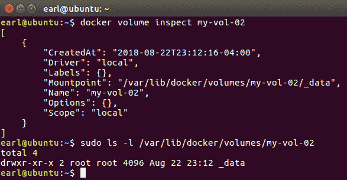
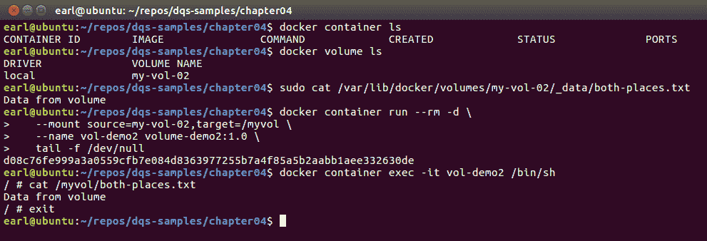
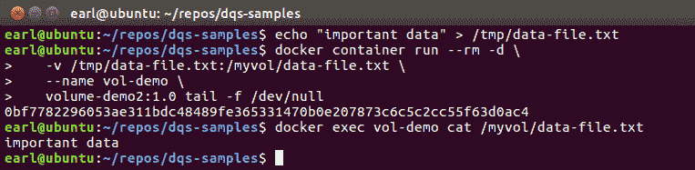
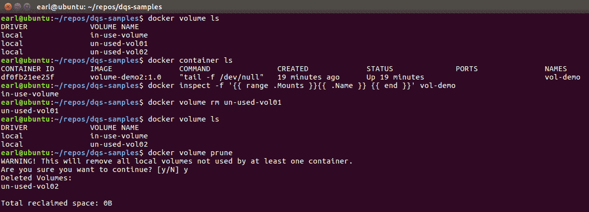
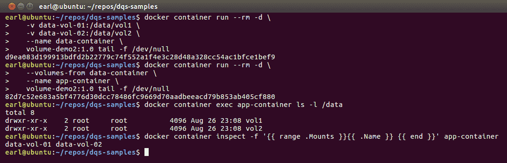

# Docker卷

在本章中，我们将学习 Docker 卷的秘密。我们将学习如何在 Docker 容器中使用工作站上的文件夹，以及如何创建和使用持久卷，从而允许多个容器共享数据。我们将学习如何清理未使用的卷。为了完善这一章，我们将学习如何创建数据量容器来成为其他容器的卷源。

Approximately 675 shipping containers are lost at sea each year. In 1992, a 40 ft container full of toys actually fell into the Pacific Ocean and 10 months later some of its toys drifted ashore on the Alaskan coastline – [https://www.clevelandcontainers.co.uk/blog/16-fun-facts-about-containers](https://www.clevelandcontainers.co.uk/blog/16-fun-facts-about-containers)

在本章中，我们将涵盖以下主题:

*   什么是 Docker 卷？
*   创建 Docker 卷
*   移除 Docker 卷的两种方法
*   使用数据量容器在容器之间共享数据

# 技术要求

您将从 Docker 的公共报告中提取 Docker 映像，因此需要基本的互联网访问来执行本章中的示例。

本章代码文件可在 GitHub:
[https://GitHub . com/PacktPublishing/Docker-Quick-Start-Guide/tree/master/chapter 04](https://github.com/PacktPublishing/Docker-Quick-Start-Guide/tree/master/Chapter04)

查看以下视频，查看正在运行的代码:
[http://bit.ly/2QqK78a](http://bit.ly/2QqK78a)

# 什么是 Docker 卷？

正如我们在[第 3 章](3.html)、*创建 Docker 映像*中了解到的，Docker 使用一个名为**联合文件系统**的特殊文件系统。这是 Docker 分层映像模型的关键，并且允许使用 Docker 的许多特性。然而，联合文件系统没有提供的一点是数据的持久存储。如果您还记得，Docker 映像的图层是只读的。当您从 Docker 映像运行容器时，Docker 守护程序会创建一个新的读写层，用于保存代表您的容器的所有实时数据。当您的容器对其文件系统进行更改时，这些更改会进入读写层。因此，当您的容器消失时，读写层也随之消失，容器对该层中的数据所做的任何和所有更改都将被删除并永远消失。这相当于非持久性存储。然而，请记住，总的来说这是一件好事。事实上，这是件好事。很多时候，这正是我们想要发生的。容器注定是短暂的，它们的状态数据也是短暂的。然而，持久数据有很多用例，比如购物网站的客户订单数据。如果一个集装箱坏了或者不得不重新堆叠，所有的订单数据都被丢弃，这将是一个非常糟糕的设计。

输入 Docker 卷。Docker 卷是一个完全在联合文件系统之外的存储位置。因此，它不受放置在映像只读层或容器读写层上的相同规则的约束。Docker 卷是一个存储位置，默认情况下，它位于运行使用该卷的容器的主机上。当容器因设计或灾难性事件而消失时，Docker 卷会保留下来，并可供其他容器使用。Docker 卷可以同时被多个容器使用。

描述 Docker 卷的最简单的方法是这样的:Docker 卷是存在于 Docker 主机上的文件夹，并且在运行的 Docker 容器中装载和访问。可访问性是双向的，允许从容器内部或文件夹所在的 Docker 主机上修改该文件夹的内容。

现在，这个描述有点一般化。使用不同的卷驱动程序，作为卷装载的文件夹的实际位置可以托管在 Docker 主机之外的某个地方。借助卷驱动程序，您可以在远程主机或云提供商上创建卷。例如，您可以使用 NFS 驱动程序在远程 NFS 服务器上创建 Docker 卷。

像 Docker 映像和 Docker 容器一样，卷命令代表它们自己的管理类别。如您所料，卷的顶级管理命令如下:

```
# Docker volume managment command
docker volume
```

卷管理组中可用的子命令包括:

```
# Docker volume management subcommands
docker volume create # Create a volume
docker volume inspect # Display information on one or more volumes
docker volume ls # List volumes
docker volume rm # Remove one or more volumes
docker volume prune          # Remove all unused local volumes
```

有几种不同的方法可以创建 Docker 卷，所以让我们通过创建一些来继续我们对 Docker 卷的研究。

# 参考

有关更多信息，请查看以下链接:

*   使用Docker卷的Docker参考:https://docs.docker.com/storage/volumes/
*   坞站卷插件信息:https://docs . docker . com/engine/extend/plugins _ volume/
*   Docker 引擎卷插件:[https://docs . docker . com/engine/extend/legacy _ plugins/# volume-plugins](https://docs.docker.com/engine/extend/legacy_plugins/#volume-plugins)

# 创建 Docker 卷

有几种方法可以创建 Docker 卷。一种方法是使用`volume create`命令。该命令的语法如下:

```
# Syntax for the volume create command
Usage: docker volume create [OPTIONS] [VOLUME]
```

除了可选的卷名参数外，`create`命令还允许以下选项:

```
# The options available to the volume create command:
-d, --driver string         # Specify volume driver name (default "local")
--label list                # Set metadata for a volume
-o, --opt map               # Set driver specific options (default map[])
```

让我们从最简单的例子开始:

```
# Using the volume create command with no optional parameters
docker volume create
```

执行前面的命令将创建一个新的 Docker 卷，并为其分配一个随机名称。该卷将使用内置的本地驱动程序创建(默认情况下)。使用`volume ls`命令，您可以看到 Docker 守护进程为我们的新卷分配了什么随机名称。它看起来像这样:


让我们更进一步，创建另一个卷，这次使用命令提供一个可选的卷名。该命令看起来如下所示:

```
# Create a volume with a fancy name
docker volume create my-vol-02
```

这一次，卷被创建，并按照要求被赋予名称`my-vol-02`:


这个卷仍然使用默认的本地驱动程序。使用本地驱动程序只是意味着这个卷所代表的文件夹的实际位置可以在 Docker 主机上本地找到。我们可以使用 volume inspect 子命令来查看该文件夹的实际位置:



正如您在前面的截图中看到的，卷的挂载点在 Docker 主机的文件系统上`/var/lib/docker/volumes/my-vol-02/_data`。请注意，文件夹路径归 root 所有，这意味着您需要提升权限才能从主机访问该位置。还要注意，这个例子是在 Linux 主机上运行的。

如果您正在使用 OS X，您需要记住您的 Docker 安装实际上是使用一个几乎无缝的虚拟机。接缝确实出现的一个领域是 Docker 卷的使用。在 OS X 主机上创建 Docker 卷时创建的装载点存储在虚拟机的文件系统中，而不是 OS X 文件系统中。当您使用 docker volume inspect 命令并看到卷装入点的路径时，它不是 OS X 文件系统上的路径，而是隐藏虚拟机文件系统上的路径。

有一种方法可以查看隐藏虚拟机的文件系统(和其他功能)。通过一个命令，通常被称为魔屏命令，您可以访问正在运行的 Docker 虚拟机。该命令如下所示:

```
# The Magic Screen command
screen ~/Library/Containers/com.docker.docker/Data
/com.docker.driver.amd64-linux/tty
# or if you are using Mac OS High Sierra
screen ~/Library/Containers/com.docker.docker/Data/vms/0/tty
```

Use *Ctrl* + *AK* to kill the screen session.
You can detach with *Ctrl* + *A Ctrl* + *D,* then use `screen -r` to reconnect, but don't detach and then start a new screen session. Running more than one screen to the VM will give you tty garbage.

以下是访问在 OS X 主机上创建的卷的装载点的示例。以下是设置:

```
# Start by creating a new volume
docker volume create my-osx-volume
# Now find the Mountpoint
docker volume inspect my-osx-volume -f "{{json .Mountpoint}}"
# Try to view the contents of the Mountpoint's folder
sudo ls -l /var/lib/docker/volumes/my-osx-volume
# "No such file or directory" because the directory does not exist on the OS X host
```

这是设置的样子:


现在，下面是如何使用 magic screen 命令来完成我们想要的任务，即访问卷装载点:

```
# Now issue the Magic Screen command and hit <enter> to get a prompt
screen ~/Library/Containers/com.docker.docker/Data/vms/0/tty
# You are now root in the VM, and can issue the following command
ls -l /var/lib/docker/volumes/my-osx-volume
# The directory exists and you will see the actual Mountpoint sub folder "_data"
# Now hit control-a followed by lower case k to kill the screen session
<CTRL-a>k 
```

瞧...


现在是指出我们在没有创建或使用 Docker 容器的情况下创建这些卷的好时机。这表明 Docker 卷超出了正常容器联合文件系统的范围。

我们在 [第 3 章](3.html)*创建 Docker 映像*中看到，我们也可以使用容器运行命令上的参数或者通过在 Dockerfile 中添加`VOLUME`指令来创建卷。如您所料，您可以通过使用容器运行参数，即`--mount`参数，将使用 Docker `volume create`命令预先创建的卷装入容器，例如，如下所示:

```
# mount a pre-created volume with --mount parameter
docker container run --rm -d \
--mount source=my-vol-02,target=/myvol \
--name vol-demo2 \
volume-demo2:1.0 tail -f /dev/null
```

本示例将运行一个新的容器，该容器将装载名为`my-vol-02`的现有卷。它将在`/myvol`处将该体积安装在容器中。请注意，前面的示例也可以在没有预先创建`my-vol-02:volume`的情况下运行，并且使用`--mount`参数运行容器的行为将创建卷作为启动容器过程的一部分。请注意，装载卷时，映像的装载点文件夹中定义的任何内容都将添加到卷中。但是，如果一个文件存在于映像的装载点文件夹中，它也存在于主机的装载点中，并且主机文件的内容将最终出现在该文件中。使用这个 Dockerfile 中的映像，如下所示:

```
# VOLUME instruction Dockerfile for Docker Quick Start
FROM alpine
RUN mkdir /myvol
RUN echo "Data from image" > /myvol/both-places.txt
CMD ["sh"]
```

注意`Data from image`线。现在，使用一个预先创建的卷，该卷包含一个名为`both-places.txt`的匹配文件，但该文件中有`Data from volume`的内容，我们将基于该映像运行一个容器。事情是这样的:



如您所见，即使 Dockerfile 创建了一个包含`Data from image`内容的文件，当我们从该映像运行一个容器并装载了一个包含相同文件的卷时，该卷(`Data from volume`)中的内容占优势，并且是在运行的容器中找到的内容。

请记住，您不能通过 Dockerfile 中的`VOLUME`指令装载预先创建的卷。不存在名为 volume 的 Dockerfile `VOLUME`指令。其原因是 Dockerfile 无法指定装载卷的主机位置。出于几个原因，允许这样做是不好的。首先，由于 Dockerfile 创建了一个映像，从该映像运行的每个容器都将尝试装载到相同的主机位置。很快就会变得很糟糕。其次，由于容器映像可以在不同的主机操作系统上运行，因此一个操作系统的主机路径定义很可能在另一个操作系统上不起作用。再次，糟糕。第三，定义卷主机路径会打开各种安全漏洞。坏，坏，坏！正因为如此，从带有带有`VOLUME`指令的 Dockerfile 的映像构建中运行一个容器将总是在主机上创建一个新的、唯一命名的装载点。在 Dockerfile 中使用`VOLUME`指令有一些有限的用例，例如当一个容器将运行一个应用程序，该应用程序将总是需要读取或写入文件系统中特定位置的数据，但不应该是联合文件系统的一部分。

还可以创建主机上文件与容器中文件的一对一映射。为此，向容器运行命令添加一个`-v`参数。您需要提供要从主机共享的文件的路径和文件名，以及容器中文件的完全限定路径。容器运行命令可能如下所示:

```
# Map a single file from the host to a container
echo "important data" > /tmp/data-file.txt
docker container run --rm -d \
 -v /tmp/data-file.txt:/myvol/data-file.txt \
 --name vol-demo \
 volume-demo2:1.0 tail -f /dev/null
# Prove it
docker exec vol-demo cat /myvol/data-file.txt
```

以下是可能的情况:



有几种不同的方法可以在容器运行命令中定义卷。为了说明这一点，请看下面的运行命令，每个命令将完成相同的事情:

```
# Using --mount with source and target
docker container run --rm -d \
 --mount source=my-volume,target=/myvol,readonly \
 --name vol-demo1 \
 volume-demo:latest tail -f /dev/null

# Using --mount with source and destination
docker container run --rm -d \
 --mount source=my-volume,destination=/myvol,readonly \
 --name vol-demo2 \
 volume-demo:latest tail -f /dev/null

# Using -v 
docker container run --rm -d \
 -v my-volume:/myvol:ro \
 --name vol-demo3 \
 volume-demo:latest tail -f /dev/null
```

前面的三个容器运行命令将创建一个以只读模式装载了相同卷的容器。这可以通过以下命令来验证:

```
# Check which container have mounted a volume by name
docker ps -a --filter volume=in-use-volume
```


# 参考

查看这些链接了解更多信息:

*   Docker `volume create`参考:[https://docs . Docker . com/engine/reference/command line/volume _ create/](https://docs.docker.com/engine/reference/commandline/volume_create/)
*   Docker存储参考文件:[https://docs.docker.com/storage/](https://docs.docker.com/storage/)

# 删除卷

我们已经看到并使用了卷列表命令，`volume ls`，inspect 命令，`volume inspect`，我想你应该很好的掌握了这些命令的作用。卷管理组中还有另外两个命令，都用于卷删除。第一个是`volume rm`命令，您可以使用该命令按名称删除一个或多个卷。然后，有`volume prune`命令；使用清理命令，您可以删除所有未使用的卷。使用此命令时要格外小心。以下是删除和清理命令的语法:

```
# Remove volumes command syntax
Usage: docker volume rm [OPTIONS] VOLUME [VOLUME...]
# Prune volumes command syntax
Usage: docker volume prune [OPTIONS]
```

以下是使用删除和清理命令的一些示例:



由于`in-use-volume`卷安装在`vol-demo`容器中，因此它不会被删除命令删除。您可以使用卷列表命令上的过滤器来查看哪些卷与容器不相关联，因此可以使用清理命令删除这些卷。以下是过滤后的 ls 命令:

```
# Using a filter on the volume ls command
docker volume ls --filter dangling=true
```

# 参考

有关更多信息，请查看以下链接:

*   卷删除命令的 Docker 的 Wiki 文档:[https://docs . docker . com/engine/reference/command line/volume _ RM/](https://docs.docker.com/engine/reference/commandline/volume_rm/)
*   卷清理命令的 Docker 的 Wiki 文档:[https://docs . docker . com/engine/reference/command line/volume _ prune](https://docs.docker.com/engine/reference/commandline/volume_prune)/
*   关于修剪 Docker 对象的信息:[https://docs.docker.com/config/pruning/](https://docs.docker.com/config/pruning/)

# 使用数据量容器在容器之间共享数据

Docker 卷还有另一个功能，允许您与其他容器共享一个 Docker 容器中装载的卷。它被称为**数据量容器**。使用数据量容器基本上是一个两步的过程。在第一步中，您运行一个创建或装载 Docker 卷(或两者都有)的容器，在第二步中，您在运行其他容器时使用特殊的卷参数`--volumes-from`，将它们配置为装载第一个容器中装载的所有卷。这里有一个例子:

```
# Step 1
docker container run \
 --rm -d \
 -v data-vol-01:/data/vol1 -v data-vol-02:/data/vol2 \
 --name data-container \
 vol-demo2:1.0 tail -f /dev/null
# Step 2
docker container run \
 --rm -d \
 --volumes-from data-container \
 --name app-container \
 vol-demo2:1.0 tail -f /dev/null
# Prove it
docker container exec app-container ls -l /data
# Prove it more
docker container inspect -f '{{ range .Mounts }}{{ .Name }} {{ end }}' app-container
```

以下是执行时的情况:



在本例中，第一个容器运行命令是创建卷，但是它们也可以很容易地用早期的容器运行命令或者从`volume create`命令预先创建。

# 参考

这里有一篇关于数据卷容器的优秀文章，包括使用它们进行数据备份和恢复:[https://www . tricksofthetrades . net/2016/03/14/docker-data-volumes/](https://www.tricksofthetrades.net/2016/03/14/docker-data-volumes/)。

# 摘要

在这一章中，我们深入探讨了 Docker 卷。我们了解了 Docker 卷实际上是什么，以及创建它们的几种方法。我们了解了使用`volume create`命令、容器运行命令和 Dockerfile `VOLUME`指令创建 Docker 卷之间的区别。我们研究了几种删除卷的方法，以及如何使用数据容器与其他容器共享卷。总而言之，你现在应该对你的 Docker 卷技能很有信心。到目前为止，我们已经建立了强大的 Docker 知识基础。

在[第 5 章](5.html)*Docker群*中，我们将通过学习Docker群来增加这个基础。这是事情真正开始变得令人兴奋的地方。如果你准备好了解更多，请翻开新的一页！