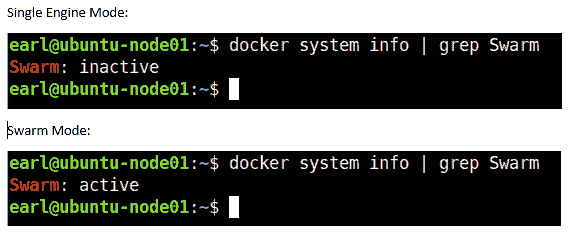
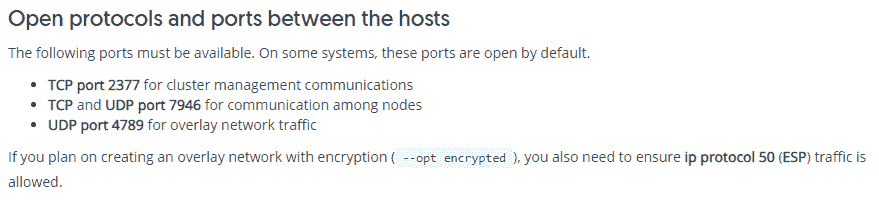
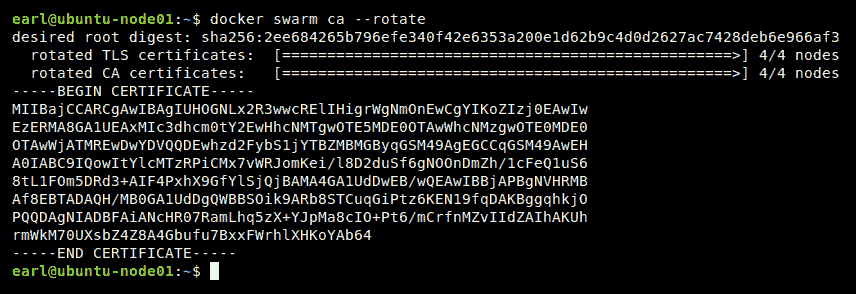
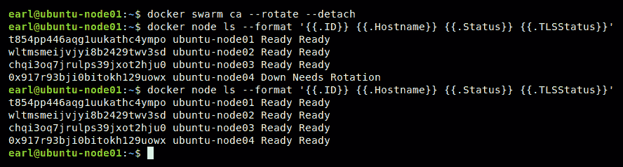
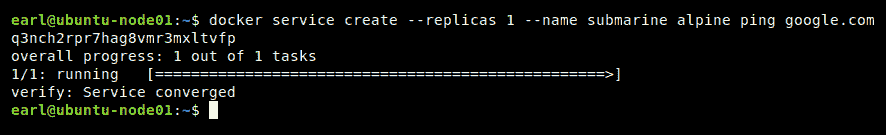
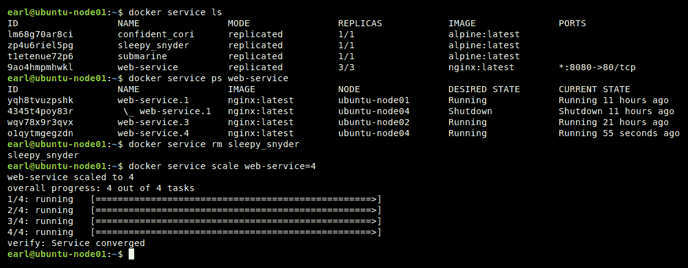
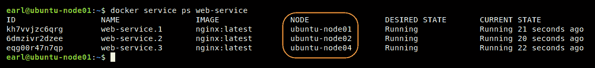
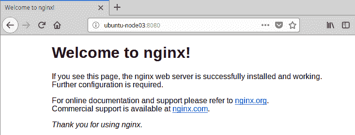

# 码头工人群

在本章中，我们将学习什么是 Docker swarm，以及如何设置 Docker swarm 集群。我们将了解所有的群管理命令，然后我们将了解更多关于群管理器和群工作者的信息。接下来，我们将发现集群服务。最后，我们将了解访问运行在集群中任何节点上的容器应用程序有多容易。

There are currently over 17,000,000 shipping containers in the world, and 5 or 6,000,000 of them are currently shipping around the world on vessels, trucks, and trains. In total, they make around 200,000,000 trips a year. – [https://www.billiebox.co.uk/facts-about-shipping-containers](https://www.billiebox.co.uk/facts-about-shipping-containers)

在本章中，我们将涵盖以下主题:

*   什么是 Docker 群？
*   建立码头工人集群
*   经理和工人
*   群集服务
*   访问群中的容器应用程序

# 技术要求

您将从 Docker 的公共报告中提取 Docker 图像，因此需要基本的互联网访问来执行本章中的示例。您将设置一个多节点群集，因此您将需要多个节点来完成本章中的示例。您可以使用物理服务器、EC2 实例、虚拟空间或工作站上的虚拟机，甚至虚拟机箱上的虚拟机。我在 Vmware 工作站上为我的节点利用了 6 台虚拟机。每个虚拟机都配置有 1 GB 内存、1 个 CPU 和 20 GB 硬盘。使用的客户操作系统是 Xubuntu 18.04，因为它体积小，功能齐全。徐邦图可以从[https://xubuntu.org/download/](https://xubuntu.org/download/)下载。实际上，节点可以接受任何现代 Linux 操作系统选择。

本章代码文件可在 GitHub:
[https://GitHub . com/PacktPublishing/Docker-Quick-Start-Guide/tree/master/chapter 05](https://github.com/PacktPublishing/Docker-Quick-Start-Guide/tree/master/Chapter05)

查看以下视频，查看正在运行的代码:
[http://bit.ly/2KENJOD](http://bit.ly/2KENJOD)

# 什么是 Docker 群？

您可能没有注意到这一点，但是到目前为止，我们在示例中使用的所有 Docker 工作站部署或节点都是在单引擎模式下运行的。这是什么意思？它告诉我们 Docker 安装是作为独立的 Docker 环境直接管理的。虽然这很有效，但效率不是很高，而且不能很好地扩展。当然，Docker 理解这些限制，并为这个问题提供了一个强有力的解决方案。它被称为 Docker 群。Docker swarm 是一种将 Docker 节点链接在一起的方法，它可以高效、大规模地管理这些节点以及在这些节点上运行的 Docker 化应用程序。简而言之，Docker 群是一组作为集群或群连接和管理的 Docker 节点。Docker swarm 内置于 Docker 引擎中，因此使用它不需要额外的安装。当 Docker 节点是群的一部分时，它以群模式运行。如果有任何疑问，您可以使用`docker system info`命令轻松检查运行 Docker 的系统是群的一部分还是在单引擎模式下运行:



提供集群模式的特性是 Docker SwarmKit 的一部分，Docker swarm kit 是一个大规模编排分布式系统的工具，也就是 Docker swarm 集群。一旦 Docker 节点加入群，它就成为群节点，成为管理器节点或工作器节点。我们将很快讨论经理和工人之间的区别。现在，知道第一个加入新群的 Docker 节点成为第一个管理器，也称为 Leader。当第一个节点加入一个群体(实际上，它创建并初始化群体，然后加入它)并成为领导者时，会发生很多技术魔法。以下是发生的一些奇迹(没有特别的顺序):

*   创建并加密基于 Swarm-ETCD 的配置数据库或集群存储
*   为所有节点间通信设置了相互 TLS (mTLS)身份验证和加密
*   容器编排已启用，它负责管理哪些容器在哪些节点上运行
*   群集存储被配置为自动复制到所有管理器节点
*   节点被分配一个加密标识
*   启用了基于 Raft 的分布式共识管理系统
*   该节点成为管理器，并被选为群领导者
*   群管理器是为高可用性配置的
*   公钥基础设施系统被创建
*   该节点成为证书颁发机构，允许它向加入群的任何节点颁发客户端证书
*   在证书颁发机构上配置了默认的 90 天证书轮换策略

*   节点获得其客户端证书，包括其名称、标识、群标识以及节点在群中的角色
*   创建新的加密连接令牌以添加新的群管理器
*   为添加新的群工作人员创建新的加密连接令牌

该列表代表了通过将第一个节点加入群而获得的许多强大功能。而且，巨大的权力伴随着巨大的责任，这意味着你真的需要准备好做大量的工作来创建你的 Docker 群，正如你可能想象的那样。因此，让我们进入下一部分，我们将讨论如何在设置集群集群时启用所有这些功能。

# 参考

有关更多信息，请查看以下链接:

*   群集工具包的存储库:[https://github.com/docker/swarmkit](https://github.com/docker/swarmkit)
*   筏共识算法:[https://raft.github.io/](https://raft.github.io/)

# 如何建立 Docker 集群

您刚刚了解了创建 Docker 集群时启用和设置的所有令人难以置信的功能。现在，我将向您展示设置 Docker 集群所需的所有步骤。你准备好了吗？它们在这里:

```
# Set up your Docker swarm cluster
docker swarm init
```

什么事？等等？剩下的在哪里？没有。什么也没少。上一节中描述的所有设置和功能都是通过一个简单的命令实现的。使用单个`swarm init`命令，创建群集群，将节点从单实例节点转换为群模式节点，将管理器的角色分配给该节点，并将其选为群的领导者，创建集群存储，该节点成为集群的证书颁发机构，并为自己分配包括加密标识的新证书，为管理器创建新的加密加入令牌，为工作器创建另一个，等等。这就是变得简单的复杂性。

群命令组成了另一个 Docker 管理组。以下是群管理命令:


我们稍后将回顾这些命令的用途，但在此之前，我想让您了解一些重要的网络配置。我们将在[第 6 章](6.html)、 *Docker Networking* 中更多地讨论 Docker 网络，但是现在请注意，您可能需要打开对 Docker 节点上的一些协议和端口的访问，以允许 Docker 群集正常运行。以下是直接来自 Docker 的*群模式入门*维基的信息:



您可能需要为 REST API 打开的另外两个端口如下:

*   用于 Docker REST API 的 TCP 2375(纯文本)
*   TCP 2376 for Docker REST API (ssl)

好了，让我们继续复习蜂群命令。

# 码头工人群初始化

您已经看到了 init 命令的作用，即创建集群集群，向其中添加(这个)第一个 Docker 节点，然后设置并启用我们刚刚介绍的所有集群特性。init 命令可以像使用它一样简单，没有参数，但是有许多可选的参数可以用来微调初始化过程。像往常一样，您可以通过使用`--help`获得可选参数的完整列表，但是现在让我们考虑一些可用的参数:

*   `--autolock`:使用此参数启用管理器自动锁定。
*   `--cert-expiry duration`:使用此参数更改节点证书的默认有效期(90 天)。
*   `--external-ca external-ca`:使用此参数指定一个或多个证书签名端点，即外部 ca。

# 坞站 swarm 连接令牌

当您通过在第一个节点上运行`swarm init`命令来初始化集群时，执行的一个函数会创建唯一的加密连接令牌，一个连接其他管理节点，一个连接工作节点。使用`join-token`命令，您可以获得这两个加入令牌。事实上，使用`join-token`命令将为您指定的任何角色提供完整的连接命令。角色参数是必需的。以下是该命令的示例:

```
# Get the join token for adding managers
docker swarm join-token manager
# Get the join token for adding workers
docker swarm join-token worker
```

这是它的样子:


```
# Rotate the worker join token
docker swarm join-token --rotate worker
```

请注意，这不会使已经使用旧的、现在无效的连接令牌的现有工作人员无效。它们仍然是群的一部分，不受加入令牌变化的影响。只有您希望加入群的新节点需要使用新令牌。

# 码头工人群加入

您已经看到了在前面的*码头工人群连接标记*部分中使用的连接命令。join 命令与加密连接令牌一起用于向群添加 Docker 节点。除了第一个节点之外，所有节点都将使用 join 命令成为群的一部分(当然，第一个节点使用“init”命令)。join 命令有几个参数，其中最重要的是`--token`参数。这是所需的连接令牌，可通过`join-token`命令获得。这里有一个例子:

```
# Join this node to an existing swarm
docker swarm join --token SWMTKN-1-3ovu7fbnqfqlw66csvvfw5xgljl26mdv0dudcdssjdcltk2sen-a830tv7e8bajxu1k5dc0045zn 192.168.159.156:2377
```

您会注意到该命令不需要该角色。这是因为令牌本身与为其创建的角色相关联。当您执行联接时，输出会提供一条信息性消息，告诉您节点作为管理者或工作者加入了什么角色。如果您无意中使用了一个管理器令牌来加入一个工作人员，反之亦然，您可以使用`leave`命令从群中移除一个节点，然后将该令牌用于实际需要的角色，将该节点重新加入群。

# 码头工人群 ca

当您想要查看群的当前证书，或者您需要旋转当前群证书时，使用`swarm ca`命令。要旋转证书，您需要包括`--rotate`参数:

```
# View the current swarm certificate
docker swarm ca
# Rotate the swarm certificate
docker swarm ca --rotate
```

`swarm ca`命令只能在群管理器节点上成功执行。您可能使用轮换群组证书功能的一个原因是，您是从内部根证书颁发机构移动到外部证书颁发机构，或者反之亦然。您可能需要轮换群证书的另一个原因是，万一一个或多个管理器节点受损。在这种情况下，轮换群集证书将阻止所有其他管理人员与轮换证书的管理人员或使用旧证书的其他管理人员进行通信。当您轮换证书时，该命令将保持活动状态，直到更新了所有群节点(包括管理人员和工作人员)为止。下面是一个在非常小的集群上轮换证书的示例:



由于该命令将保持活动状态，直到所有节点都更新了 TLS 证书和 CA 证书，因此如果群集中有节点处于离线状态，就会出现问题。当这是一个潜在的问题时，您可以包含`--detach`参数，该命令将启动证书轮换并立即将控制权返回给会话。请注意，当您使用`--detach`可选参数时，您将不会获得关于证书轮换的进度、成功或失败的任何状态。您可以使用 node ls 命令查询群集内证书的状态，以检查进度。以下是您可以使用的完整命令:

```
# Query the state of the certificate rotation in a swarm cluster
docker node ls --format '{{.ID}} {{.Hostname}} {{.Status}} {{.TLSStatus}}'
```

`ca rotate`命令将继续尝试完成，无论是在前台，还是在后台，如果分离的话。如果启动轮换时某个节点处于脱机状态，并且它重新联机，则证书轮换将会完成。这里有一个例子`node04`在执行旋转命令时离线，然后过了一会儿，它又回来了；检查状态发现它成功旋转:



另一个需要记住的要点是，轮换证书会立即使当前的两个加入令牌无效。

# 码头工人群体解锁

您可能还记得关于`docker swarm init`命令的讨论，您可以在`init`命令中包含的可选参数之一是`--autolock`。使用此参数将在群集上启用自动锁定功能。这是什么意思？当集群被配置为使用自动锁定时，每当管理器节点的 docker 守护程序脱机，然后重新联机(即重新启动)时，都需要输入解锁密钥来允许该节点重新加入集群。你为什么要使用自动锁定功能来锁定你的蜂群？自动锁定功能有助于保护群的相互 TLS 加密密钥，以及群的 raft 日志使用的加密和解密密钥。这是旨在补充 Docker Secrets 的附加安全功能。当 docker 守护程序在锁定群的管理器节点上重新启动时，您必须输入解锁密钥。以下是使用解锁钥匙的样子:


顺便说一下，对于群的其余部分，未解锁的管理器节点将报告为关闭，即使 docker 守护程序正在运行。可以使用`swarm update`命令在现有集群上启用或禁用集群自动锁定功能，我们将很快对此进行介绍。解锁密钥是在群集初始化期间生成的，届时将显示在命令行上。如果您丢失了解锁密钥，您可以使用`swarm unlock-key`命令在解锁的管理器节点上检索它。

# 码头工人群解锁钥匙

`swarm unlock-key`命令很像`swarm ca`命令。unlock-key 命令可用于检索当前的群解锁密钥，也可用于将解锁密钥旋转到新的密钥:

```
# Retrieve the current unlock key
docker swarm unlock-key
# Rotate to a new unlock key
docker swarm unlock-key --rotate
```

根据集群的大小，所有管理器节点更新解锁密钥可能需要一段时间。

It is a good idea to keep the current (old) key handy for a while when you rotate the unlock key, on the off-chance that a manager node goes offline before getting the updated key. That way, you can still unlock the node using the old key. Once the node is unlocked and receives the rotated (new) unlock key, the old key can be discarded.

如您所料，`swarm unlock-key`命令仅在启用了自动锁定功能的集群管理器节点上发出时有用。如果您的集群没有启用自动锁定功能，您可以使用`swarm update`命令启用它。

# 码头工人群体更新

当您通过`docker swarm init`命令在第一个管理器节点上初始化集群时，会启用或配置几个集群集群功能。在群集初始化后，您可能需要更改启用、禁用或配置的功能。为此，您需要使用`swarm update`命令。例如，您可能希望为集群启用自动锁定功能。或者，您可能希望更改证书的有效期。这些是您可以使用`swarm update`命令执行的更改类型。这样做可能看起来像这样:

```
# Enable autolock on your swarm cluster
docker swarm update --autolock=true
# Adjust certificate expiry to 30 days
docker swarm update --cert-expiry 720h
```

以下是可受`swarm update`命令影响的设置列表:


# 码头工人蜂拥离开

这个和你想象的差不多。您可以使用`leave`命令从群中移除码头工人节点。下面是一个需要使用`leave`命令来纠正用户错误的例子:


节点 03 旨在成为管理器节点。我不小心添加了作为工作人员的节点。意识到自己的错误，我使用`swarm leave`命令将节点从群中移除，使其回到单实例模式。然后，使用*管理器*加入令牌，我将该节点作为管理器重新添加到群中。唷！危机避免了。

# 参考

查看这些链接了解更多信息:

*   群体模式入门教程:[https://docs.docker.com/engine/swarm/swarm-tutorial/](https://docs.docker.com/engine/swarm/swarm-tutorial/)
*   `docker swarm init`命令维基文档:[https://docs . docker . com/engine/reference/command line/swarm _ init/](https://docs.docker.com/engine/reference/commandline/swarm_init/)
*   `docker swarm ca`命令维基文档:[https://docs . docker . com/engine/reference/command line/swarm _ ca/](https://docs.docker.com/engine/reference/commandline/swarm_ca/)
*   `docker swarm join-token`命令维基文档:[https://docs . docker . com/engine/reference/command line/swarm _ join-token/](https://docs.docker.com/engine/reference/commandline/swarm_join-token/)

*   `docker swarm join`命令维基文档:[https://docs . docker . com/engine/reference/command line/swarm _ join/](https://docs.docker.com/engine/reference/commandline/swarm_join/)
*   `docker swarm unlock`命令维基文档:[https://docs . docker . com/engine/reference/command line/swarm _ unlock/](https://docs.docker.com/engine/reference/commandline/swarm_unlock/)
*   `docker swarm unlock-key`命令维基文档:[https://docs . docker . com/engine/reference/command line/swarm _ unlock-key/](https://docs.docker.com/engine/reference/commandline/swarm_unlock-key/)
*   `docker swarm update`命令维基文档:[https://docs . docker . com/engine/reference/command line/swarm _ update/](https://docs.docker.com/engine/reference/commandline/swarm_update/)
*   `docker swarm leave`命令维基文档:[https://docs . docker . com/engine/reference/command line/swarm _ leave/](https://docs.docker.com/engine/reference/commandline/swarm_leave/)
*   了解更多关于码头工人的秘密:[https://docs.docker.com/engine/swarm/secrets/](https://docs.docker.com/engine/swarm/secrets/)

# 经理和工人

在前面的章节中，我们已经讨论了一点群管理器，但是让我们仔细看看群管理器是做什么的。群体经理做的正是你所期望的。它们管理和维护集群的状态。他们安排群服务，我们将在本章的*群服务*部分讨论，但是现在，把群服务想象成运行的容器。管理器节点还服务于集群的应用编程接口端点，允许通过 REST 进行编程访问。管理器还将流量导向正在运行的服务，这样就可以通过任何管理器节点访问任何容器，而不必知道哪个节点实际上正在运行容器。作为维护集群状态的一部分，管理器将处理系统中节点的丢失，如果丢失的管理器是领导者，则选举一个新的领导者节点，并且如果容器或节点出现故障，它们将保持期望数量的服务容器运行。

群体中经理数量的最佳实践是三个、五个或七个。您会注意到，所有这些选项都代表奇数个管理器节点。这样，如果领袖节点丢失，raft 共识算法可以更容易地为群体选择新的领袖。您可以用一个管理器节点运行集群集群，这实际上是比有两个管理器节点更好的选择。但是，对于可用性更高的集群，建议您至少有三个管理器节点。对于较大的集群，有五七个经理是好的，但不建议超过七个。一旦在同一个集群中有七个以上的管理器，您实际上会体验到性能下降。

管理器节点的另一个重要考虑因素是它们之间的网络性能。管理者需要低延迟的网络连接来获得最佳性能。例如，如果你在 AWS 中运行你的群，你可能不希望群中的经理分布在不同的区域。如果你这样做，你可能会遇到群体问题。如果您将群内的管理人员放在单个区域内的不同可用性区域中，您应该不会有任何与网络性能相关的问题。

工作节点除了运行容器之外什么也不做。当领导者节点关闭时，他们在选举新领导者方面没有发言权。他们不处理应用编程接口调用。他们不指挥交通。他们除了运行容器什么也不做。事实上，不能有一个只有工作者节点的群。另一方面，您可以有一个只有一个管理器节点的群，在这种情况下，管理器除了管理器职责之外，还将充当工作器并运行容器。

默认情况下，所有管理节点实际上都是工作节点。这意味着他们可以并且将运行容器。如果您想让您的经理不运行工作负载，您需要更改节点的可用性设置。将其更改为排放将会小心地停止管理器节点上标记为排放的任何正在运行的容器，并将在其他(非排放)节点上启动这些容器。在耗尽模式下，不会在节点上启动新的容器工作负载，例如:

```
# Set node03's availability to drain
docker node update --availability drain ubuntu-node03
```

有时，您可能想要或需要更改群中 docker 节点的角色。您可以将工作节点提升为经理状态，也可以将经理节点降级为工作节点状态。以下是这些活动的一些例子:

```
# Promote worker nodes 04 and 05 to manager status
docker node promote ubuntu-node04 ubuntu-node05
# Demote manager nodes 01 and 02 to worker status
docker node demote ubuntu-node01 ubuntu-node02
```

# 参考

查看[节点如何工作的官方文档 https://docs . docker . com/engine/swarm/how-swarm-mode-work/nodes/](https://docs.docker.com/engine/swarm/how-swarm-mode-works/nodes/)。

# 群集服务

好吧。现在，您已经非常了解如何建立 Docker 集群，以及它的节点如何从单引擎模式进入集群模式。您还知道，这一点的意义在于将您从直接管理单个运行容器中解放出来。所以，你可能开始怀疑，如果我现在不直接单独管理我的容器，我该如何管理它们？你来对地方了！这就是集群服务发挥作用的地方。swarm 服务允许您根据容器应该有多少个并发运行的副本来定义容器应用程序的期望状态。让我们快速了解一下在 swarm 服务的管理组中有哪些命令可供我们使用，然后我们将讨论这些命令:


您可能想做的第一件事是创建一个新的服务，因此我们将使用`service create`命令开始我们的集群服务讨论。以下是`service create`命令的语法和基本示例:

```
# Syntax for the service create command
# Usage: docker service create [OPTIONS] IMAGE [COMMAND] [ARG...]
# Create a service
docker service create --replicas 1 --name submarine alpine ping google.com
```

好的。让我们分解这里显示的示例`service create`命令。首先，您有管理组服务，后跟`create`命令。然后，我们开始进入参数；第一个是`--replicas`。这定义了应该同时运行的容器副本的数量。接下来，我们有`--name`参数。这个非常明显，是我们正在创建的服务的名称，在本例中为`submarine`。我们将能够在其他服务命令中使用指定的名称。在 name 参数之后，我们有完全限定的 Docker 图像名称。在这种情况下，只是`alpine`。它可能是像`alpine:3.8`或`alpine:latest`这样的东西，或者是像`tenstartups/alpine:latest`这样更合格的东西。在用于服务的图像名称之后是运行容器时要使用的命令以及传递给该命令的参数——分别是`ping`和`google.com`。因此，前面的示例`service create`命令将从`alpine`图像启动单个容器，该容器将运行带有 google.com 参数的`ping`命令，然后命名服务`submarine`。这是它的样子:



现在，您已经了解了创建 docker 服务的基本知识。但是，在你变得过于兴奋之前，仍然有很多理由来掩盖`service create`命令。事实上，这个命令有如此多的选项，在这本书里把它们全部列出来需要两页。因此，与其这样做，我希望您现在使用`--help`功能并输入以下命令:

```
# Get help with the service create command
docker service create --help
```

我知道，对吧？有很多*可选参数可以使用。别担心。我不会把你留在这里晾干的。我会给你一些指导，帮助你为创建服务打下坚实的基础，然后你可以扩展并尝试一些你在`--help`中看到的其他参数。*

 *正如你所知，我们到目前为止使用的两个参数`--replicas`和`--name`，都是可选的。如果您不提供要使用的副本数量，该服务将以默认值 1 创建。此外，如果您不为服务提供一个名称，一个奇特的名称将被编造出来并提供给服务。这与我们在[第 2 章](2.html)、*学习 Docker 命令*中使用`docker container run`命令时看到的默认命名类型相同。对于发出的每个`service create`命令，通常最好同时提供这两个选项。

另外，请注意，一般来说，前面示例中提供的图像的命令和命令参数也是可选的。在这种特定的情况下，它们是必要的，因为从 alpine 图像运行的没有其他命令或参数提供的容器将会退出。在示例中，这将显示为聚合服务失败，Docker 将永远尝试重新启动服务。换句话说，如果正在使用的图像内置了命令及其参数(例如 Dockerfile 的`CMD`或`ENTRYPOINT`指令)，则可以省略它们。

现在让我们继续更多的创建参数。您应该还记得[第 2 章](2.html)、*学习码头工人命令*中有一个`--publish`参数，您可以在`docker container run`命令中使用，该参数定义码头工人主机上公开的端口和主机端口映射到的容器中的端口。它看起来像这样:

```
# Create a nginx web-server that redirects host traffic from port 8080 to port 80 in the container docker container run --detach --name web-server1 --publish 8080:80 nginx
```

嗯，集群服务需要相同的功能，在他们看来，Docker 使用于`container run`命令和`service create`命令的参数相同:`--publish`。您可以使用我们之前看到的相同的缩写格式，`--publish 8080:80`，或者您可以使用更详细的格式:`--publish published=8080`，`target=80`。这仍然转化为将主机流量从端口`8080`重定向到容器中的端口 80。让我们尝试另一个例子，这次使用`--publish`参数。我们将再次运行`nginx`图像:

```
# Create a nginx web-server service using the publish parameter
docker service create --name web-service --replicas 3 --publish published=8080,target=80 nginx
```

这个例子将创建一个新的服务，运行三个容器副本，使用`nginx`图像并暴露容器上的端口`80`和主机上的端口`8080`。看一看:


现在，你正在到达那里。让我们快速讨论另外三个参数，您将准备好接受这个世界(至少是 swarm 服务)。首先，`--restart-window`。此参数用于告诉 Docker 守护程序，在测试容器是否健康之前，需要等待多长时间来启动它的应用程序。默认值为五秒。如果你在你的容器中创建了一个应用程序，需要超过 5 秒的时间来启动并报告为健康，你将希望在你的`service create`中包含一个`--restart-window`参数。接下来，`--restart-max-attempts`。此参数告诉 Docker 守护程序在放弃之前，要尝试启动一个报告不健康的容器副本多少次。默认为*永不放弃*。*永不投降*！最后，我们来谈谈`--mode`参数。群组服务的默认模式是*复制*。这意味着 Docker 守护程序将继续为您的服务建立容器，直到并发运行的容器数量等于您在`--replicas`参数中提供的值(如果您不提供参数，则为 1)。例如，使用`--replicas 3`参数，您将获得三个为您的服务在群中运行的容器。还有一种模式，叫做**全局**。如果在创建服务时提供`--mode global`参数，Docker 守护程序将在集群中的每个节点上只支持一个容器。如果您有一个六节点集群，那么最终将运行六个容器，每个节点一个。对于 12 节点集群，您将获得 12 个容器，依此类推。当您拥有为每个主机提供功能的服务时，这是一个非常方便的选择，例如监控应用程序或日志转发器。

让我们回顾一下您想要了解和使用的其他一些服务命令。一旦您创建了一些服务，您可能需要这些服务的列表。这可以通过`service list`命令来实现。看起来是这样的:

```
# List services in the swarm
# Usage: docker service ls [OPTIONS]
docker service list
```

一旦您查看了正在运行的服务列表，您可能会想要更多关于这些服务的详细信息。为此，您可以使用`service ps`命令。看一看:

```
# List the tasks associated with a service
# Usage: docker service ps [OPTIONS] SERVICE [SERVICE...]
docker service ps
```

一旦服务不再有用，您可能想要终止它。这样做的命令是`service remove`命令。这是它的样子:

```
# Remove one or more services from the swarm
# Usage: docker service rm SERVICE [SERVICE...]
docker service remove sleepy_snyder
```

如果您想删除群集中运行的所有服务，您可以组合这些命令并执行如下操作:

```
# Remove ALL the services from the swarm
docker service remove $(docker service list -q)
```

最后，如果您意识到当前配置的副本数量没有设置为所需数量，可以使用`service scale`命令进行调整。以下是您的操作方法:

```
# Adjust the configured number of replicas for a service
# Usage: docker service scale SERVICE=REPLICAS [SERVICE=REPLICAS...]
docker service scale web-service=4
```



这应该足以让你忙碌一段时间。在我们进入第 6 章*码头工人网络*之前，让我们在这一章再讨论一个话题:访问你的在集群中运行的容器应用程序。

# 参考

在[https://docs . Docker . com/engine/reference/command line/service _ create/](https://docs.docker.com/engine/reference/commandline/service_create/)阅读更多关于 Docker 服务创建引用的信息。

# 访问群中的容器应用程序

所以，现在你有一个群运行着奇数个管理节点和工人节点。您已经部署了一些集群服务来运行您最喜欢的容器化应用程序。下一步是什么？嗯，你可能只是想访问一个或多个在你的群中运行的应用程序。也许您已经部署了一个 web 服务器应用程序。如果能访问那个网络服务器共享的网页就好了，对吗？让我们快速浏览一下，看看这样做有多容易。

群管理器为我们处理的特性之一是将流量导向我们的服务。在前面的例子中，我们设置了一个 web 服务，该服务在群中运行三个副本。我目前使用的群恰好有三个管理节点和三个工作节点。所有六个节点都有资格运行工作负载，因此当服务启动时，六个节点中的三个将最终运行一个容器。如果我们使用`service ps`命令查看服务任务的细节，您可以看到六个节点中的哪一个正在运行 web 服务容器:



在本例中，您可以看到 web 服务容器正在节点 01、02 和 04 上运行。奇妙的是，您不需要知道哪些节点正在运行您的服务容器。您可以通过群中的任何节点访问该服务。当然，您可能希望能够访问节点 01、02 或 04 上的容器，但是请看一下:



拥有从群中任何节点访问服务的能力有一个不幸的副作用。你能想到它可能是什么吗？我不会让你悬念太久。副作用是您只能为群中的一个服务分配一个(主机)端口。在我们的例子中，我们将端口`8080`用于我们的网络服务。这意味着我们不能将端口`8080`用于我们希望在该群集中运行的任何其他服务的主机端口:


# 参考

有关更多信息，请查看以下链接:

*   Wiki 文档包含了在集群上部署服务的非常详细的概述:[https://docs.docker.com/v17.09/engine/swarm/services/](https://docs.docker.com/v17.09/engine/swarm/services/)
*   服务如何工作:[https://docs . docker . com/engine/swarm/how-swarm-mode-works/services/](https://docs.docker.com/engine/swarm/how-swarm-mode-works/services/)
*   Docker 开始进行群体模式训练:[https://docs.docker.com/v17.09/engine/swarm/swarm-tutorial/](https://docs.docker.com/v17.09/engine/swarm/swarm-tutorial/)

# 摘要

在这一章中，我们终于开始把一些片段组合在一起，让一些有趣的事情发生。我们了解了通过启用集群模式和创建集群集群可以获得多少功能。而且，我们发现使用一个`swarm init`命令设置一切是多么容易。然后，我们学习了如何增长和管理我们的群集群，最后，我们学习了如何在新的群集群中运行容器作为服务。很有趣，对吧？！

现在，让我们把事情推进到下一个层次。在[第 6 章](6.html)*Docker Networking*中，我们将了解 Docker Networking。如果你准备好了更多的好东西，请翻开新的一页。*