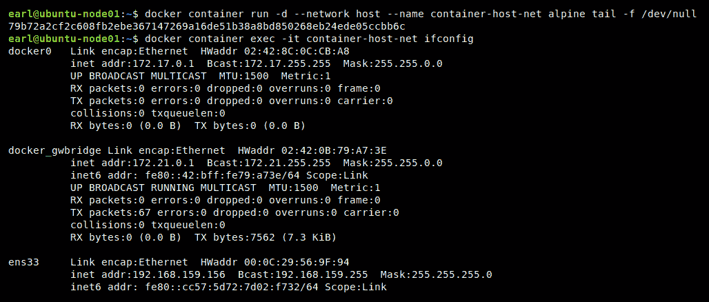
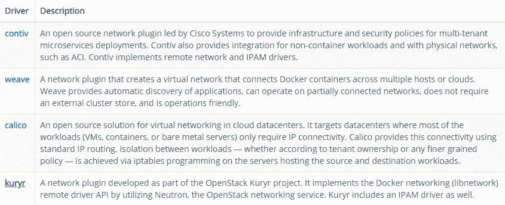
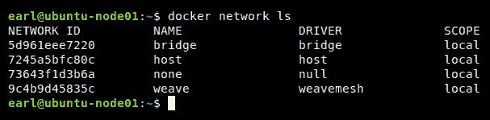
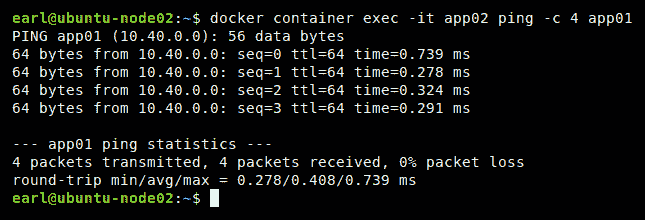
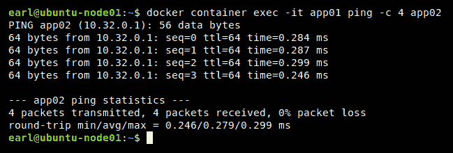
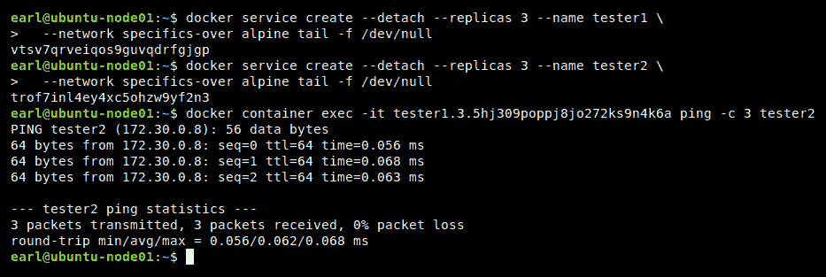

# Docker网络

在本章中，我们将了解 Docker 网络。我们将深入 Docker 网络，学习容器如何隔离，它们如何相互通信，以及它们如何与外部世界通信。我们将探讨 Docker 在开箱即用安装中提供的本地网络驱动程序。然后，我们将通过一个 Weave 驱动程序的部署示例来检查远程网络驱动程序的使用。之后，我们将学习如何创建 Docker 网络。我们将通过了解 Docker 网络提供的免费服务来结束讨论。

"Approximately 97% of all shipping containers are manufactured in China. It is far easier to produce the container close to the shipment than to re-position containers around the world." – [https://www.billiebox.co.uk/](https://www.billiebox.co.uk/)

在本章中，我们将涵盖以下主题:

*   什么是 Docker 网络？
*   内置(也称为**本地** ) Docker 网络是关于什么的
*   那么第三方(也称**远程** ) Docker 网络呢？
*   如何创建 Docker 网络
*   免费服务发现和负载平衡功能
*   适合您需求的 Docker 网络驱动程序

# 技术要求

您将从 Docker 的公共报告中获取 Docker 映像，并从 Weave 安装网络驱动程序，因此需要基本的互联网访问来执行本章中的示例。另外，我们将使用`jq software`包，所以如果您还没有安装它，请查看如何安装的说明—它们可以在[第 2 章](2.html)*学习Docker命令*的*集装箱检查命令*部分找到。

本章代码文件可在 GitHub:
[https://GitHub . com/PacktPublishing/Docker-Quick-Start-Guide/tree/master/chapter 06](https://github.com/PacktPublishing/Docker-Quick-Start-Guide/tree/master/Chapter06)

查看以下视频，查看正在运行的代码:
[http://bit.ly/2FJ2iBK](http://bit.ly/2FJ2iBK)

# 什么是 Docker 网络？

正如你已经知道的，网络是一个链接系统，允许计算机和其他硬件设备进行通信。Docker 网络也是如此。它是一个链接系统，允许 Docker 容器在同一个 Docker 主机上相互通信，或者与容器主机之外的容器、计算机和硬件通信，包括在其他 Docker 主机上运行的容器。

如果你熟悉宠物和牛的云计算类比，你就明白能够大规模管理资源的必要性。Docker 网络允许您这样做。它们抽象出网络的大部分复杂性，为您的容器化应用程序提供易于理解、易于记录和易于使用的网络。Docker 网络基于 Docker 创建的标准，称为**集装箱网络模型** ( **CNM** )。有一个竞争网络标准，由 CoreOS 创建，称为**集装箱网络接口** ( **CNI** )。CNI 标准已经被几个项目采用，最著名的是 Kubernetes，可以提出论据来支持它的使用。然而，在本章中，我们将把注意力集中在 Docker 的 CNM 标准上。

libnetwork 项目已经实现了 CNM，您可以通过本节参考资料中的链接了解该项目的更多信息。用 Go 编写的 CNM 实现由三个结构组成:沙箱、端点和网络。沙箱是一个网络命名空间。每个容器都有自己的沙箱。它保存容器网络堆栈的配置。这包括它的路由表、接口以及 IP 和 MAC 地址的 DNS 设置。沙箱还包含容器的网络端点。接下来，端点是将沙箱加入网络的东西。端点本质上是网络接口，如 **eth0** 。一个容器的沙箱可能有多个端点，但是每个端点将只连接到一个网络。最后，网络是连接端点的集合，允许连接之间的通信。每个网络都有名称、地址空间、标识和网络类型。

Libnetwork 是一个可插拔的架构，它允许网络驱动程序实现我们刚刚描述的组件的细节。每种网络类型都有自己的网络驱动程序。Docker 提供内置驱动程序。这些默认或本地驱动程序包括桥驱动程序和覆盖驱动程序。除了内置驱动程序，libnetwork 还支持第三方创建的驱动程序。这些驱动程序被称为远程驱动程序。远程驱动程序的一些示例包括 Calico、Contiv 和 Weave。

你现在对什么是 Docker 网络有了一点了解，看完这些细节，你可能会想，他说的*容易*在哪里？坚持住。现在我们将开始讨论您创建和使用 Docker 网络有多容易。与 Docker 卷一样，网络命令代表它们自己的管理类别。如您所料，网络的顶级管理命令如下:

```
# Docker network managment command
docker network 
```

网络管理组中可用的子命令包括:

```
# Docker network management subcommands
docker network connect # Connect a container to a network
docker network create            # Create a network
docker network disconnect        # Disconnect a container from a network
docker network inspect # Display network details
docker network ls # List networks
docker network rm # Remove one or more networks
docker network prune # Remove all unused networks
```

现在让我们看看内置或本地网络驱动程序。

# 参考

有关更多信息，请查看以下链接:

*   宠物与牛的对话幻灯片平台:[https://www . slide share . net/Randy bias/面向开放和可扩展云的架构](https://www.slideshare.net/randybias/architectures-for-open-and-scalable-clouds)
*   Libnetwork 项目:[https://github.com/docker/libnetwork](https://github.com/docker/libnetwork)
*   Libnetwork 设计:[https://github . com/docker/lib network/blob/master/docs/design . MD](https://github.com/docker/libnetwork/blob/master/docs/design.md)
*   卡利科网络驱动程序:[https://www.projectcalico.org/](https://www.projectcalico.org/)
*   Contiv 网络驱动程序: [http://contiv.github.io/](http://contiv.github.io/)
*   织网驱动:[https://www.weave.works/docs/net/latest/overview/](https://www.weave.works/docs/net/latest/overview/)

# 内置(本地)Docker 网络

Docker 的开箱即用安装包括一些内置的网络驱动程序。这些也被称为本地司机。两个最常用的驱动程序是桥接网络驱动程序和覆盖网络驱动程序。其他内置驱动程序包括无、主机和 MACVLAN。此外，如果不创建网络，您的新安装将会有几个预先创建的网络可供使用。使用`network ls`命令，我们可以很容易地看到新安装中可用的预创建网络列表:


在这个列表中，您会注意到每个网络都有其唯一的标识、名称、用于创建它的驱动程序(以及控制它的驱动程序)和网络范围。不要混淆本地的范围和驱动程序的类别，后者也是本地的。本地类别用于区分驾驶员的来源和具有远程类别的第三方驾驶员。范围值“本地”表示网络的通信限制在本地 Docker 主机内。澄清一下，如果两个 Docker 主机，H1 和 H2，都包含一个具有本地范围的网络，H1 上的容器将永远无法与 H2 上的容器直接通信，即使它们使用相同的驱动程序并且网络具有相同的名称。另一个范围值是 swarm，我们稍后将详细讨论它。

The pre-created networks that are found in all deployments of Docker are special in that they cannot be removed. It is not necessary to attach containers to any of them, but attempts to remove them with the `docker network rm` command will always result in an error.

有三种内置网络驱动程序具有本地范围:网桥、主机和无。主机网络驱动程序利用 Docker 主机的网络堆栈，基本上绕过了 Docker 的网络。主机网络上的所有容器都能够通过主机的接口相互通信。使用主机网络驱动程序的一个显著限制是每个端口只能由一个容器使用。也就是说，例如，您不能运行两个都绑定到端口`80`的 nginx 容器。您可能已经猜到，因为主机驱动程序利用了运行它的主机的网络，所以每个 Docker 主机只能有一个使用主机驱动程序的网络:



接下来是空或无网络。使用空网络驱动程序会创建一个网络，当容器连接到该网络时，该网络会提供完整的网络堆栈，但不会在容器内配置任何接口。这使得容器完全隔离。该驱动程序主要是为了向后兼容的目的而提供的，与主机驱动程序一样，在 Docker 主机上只能创建一个空类型的网络:


范围为 local 的第三个网络驱动程序是桥驱动程序。桥接网络是最常见的类型。任何连接到同一桥接网络的容器都能够相互通信。Docker 主机可以使用网桥驱动程序创建多个网络。但是，连接到一个网桥网络的容器无法与不同网桥网络上的容器通信，即使这些网络位于同一个 Docker 主机上。请注意，内置网桥网络和任何用户创建的网桥网络在功能上略有不同。最佳做法是创建自己的网桥网络并加以利用，而不是使用内置的网桥网络。下面是一个使用桥接网络运行容器的示例:


除了创建具有本地范围的网络的驱动程序之外，还有创建具有群范围的网络的内置网络驱动程序。这种网络将跨越群中的所有主机，并允许连接到它们的容器进行通信，尽管它们运行在不同的 Docker 主机上。正如你可能已经猜测的，使用具有集群范围的网络需要 Docker 集群模式。事实上，当您将 Docker 主机初始化为集群模式时，会为您创建一个具有集群范围的特殊新网络。这个群范围网络被命名为*入口*，并使用内置的覆盖驱动程序创建。该网络对于群模式的负载平衡功能至关重要，该功能用于 [第 5 章](5.html)*Docker Swarm*的*访问群中的容器应用程序*部分。在`swarm init`中还创建了一个新的桥接网络，名为 docker_gwbridge。这个网络被 swarm 用来对外通信，有点像默认网关。以下是新 Docker 群中的默认内置网络:


使用覆盖驱动程序可以创建跨越 Docker 主机的网络。这些是第 2 层网络。当您创建覆盖网络时，会有许多网络管道在幕后铺设。群中的每台主机都获得一个带有网络堆栈的网络沙箱。在这个沙箱中，创建了一个名为 br0 的桥。然后，创建一个 VXLAN 隧道端点，并将其连接到网桥 br0。一旦所有群主机都创建了隧道端点，就会创建一个 VXLAN 隧道，将所有端点连接在一起。这条隧道实际上就是我们所看到的覆盖网络。当容器连接到覆盖网络时，它们会获得一个从覆盖子网分配的 IP 地址，并且该网络上容器之间的所有通信都是通过覆盖进行的。当然，在幕后，通信流量通过 VXLAN 端点，穿过 Docker 主机网络，以及将主机连接到其他 Docker 主机网络的任何路由器。但是，你永远不用担心所有的幕后工作。只要创建一个覆盖网络，把你的容器连接到上面，你就是黄金。

我们要讨论的下一个本地网络驱动程序叫做 MACVLAN。该驱动程序创建网络，允许每个容器都有自己的 IP 和 MAC 地址，并连接到非 Docker 网络。这意味着，除了通过网桥和覆盖网络获得的容器到容器的通信之外，通过 MACVLAN 网络，您还能够与 VLAN、虚拟机和其他物理服务器连接。换句话说，MACVLAN 驱动程序允许你把你的容器放到现有的网络和 VLAN 上。必须在每个 Docker 主机上创建一个 MACVLAN 网络，您将在其中运行需要连接到现有网络的容器。此外，您还需要为您希望集装箱连接到的每个 VLAN 创建一个不同的 MACVLAN 网络。虽然使用 MACVLAN 网络听起来是一种可行的方法，但使用它有两个重要的挑战。首先，您必须非常小心分配给 MACVLAN 网络的子网范围。将从您的范围内为容器分配 IP，而不考虑其他地方正在使用的 IP。如果您的 DHCP 系统分发的 IP 与您给 MACVLAN 驱动程序的范围重叠，它很容易导致重复的 IP 场景。第二个挑战是，MACVLAN 网络要求您的网卡配置为混杂模式。这在内部网络中通常是不受欢迎的，但在云提供商网络(如 AWS 和 Azure)中几乎是被禁止的，因此 MACVLAN 驱动程序的用例非常有限。

本节包含了大量关于本地或内置网络驱动程序的信息。不要绝望！它们比这些丰富的信息显示的更容易创建和使用。我们将在*创建 Docker 网络*一节中讨论创建和使用信息，但是接下来，让我们快速讨论一下远程(也称为第三方)网络驱动程序。

# 参考

查看这些链接了解更多信息:

*   面向 Docker 网络的优秀、深入的 Docker 文章:[https://success.docker.com/article/networking](https://success.docker.com/article/networking)
*   与覆盖网络联网:[https://docs.docker.com/network/network-tutorial-overlay/](https://docs.docker.com/network/network-tutorial-overlay/)
*   使用 MACVLAN 网络:[https://docs.docker.com/v17.12/network/macvlan/](https://docs.docker.com/v17.12/network/macvlan/)

# 第三方(远程)网络驱动程序

如前所述*什么是 Docker 网络*？部分，除了 Docker 提供的内置或本地网络驱动程序外，CNM 还支持社区和供应商创建的网络驱动程序。这些第三方驱动程序的一些示例包括 Contiv、Weave、Kuryr 和 Calico。使用这些第三方驱动程序之一的好处之一是，它们完全支持云托管环境(如 AWS)中的部署。为了使用这些驱动程序，需要在单独的安装步骤中为每个 Docker 主机安装它们。每个第三方网络驱动程序都有自己的一套功能。以下是 Docker 在参考体系结构文档中共享的这些驱动程序的概述:



尽管这些第三方驱动程序都有自己独特的安装、设置和执行方法，但一般步骤是相似的。首先，下载驱动程序，然后处理任何配置设置，最后运行驱动程序。这些远程驱动程序通常不需要集群模式，可以使用也可以不使用。作为一个例子，让我们深入研究使用编织驱动程序。要安装编织网络驱动程序，请在每个 Docker 主机上发出以下命令:

```
# Install the weave network driver plug-in
sudo curl -L git.io/weave -o /usr/local/bin/weave
sudo chmod a+x /usr/local/bin/weave
# Disable checking for new versions
export CHECKPOINT_DISABLE=1
# Start up the weave network
weave launch [for 2nd, 3rd, etc. optional hostname or IP of 1st Docker host running weave]
# Set up the environment to use weave
eval $(weave env)
```

上述步骤需要在每个 Docker 主机上完成，这些主机将用于运行通过编织网络相互通信的容器。launch 命令可以提供第一个 Docker 主机的主机名或 IP 地址，该主机已经设置好并运行编织网络，以便与之对等，这样它们的容器就可以进行通信。例如，如果您在`node02`上启动编织时已经用编织网络设置了`node01`，您将使用以下命令:

```
# Start up weave on the 2nd node
weave launch node01
```

或者，您可以使用 connect 命令连接新的(Docker 主机)对等方，从配置的第一台主机执行该命令。要添加`node02`(在编织安装并运行后)，使用以下命令:

```
# Peer host node02 with the weave network by connecting from node01
weave connect node02
```

您可以使用 weave 网络驱动程序，而无需在主机上启用集群模式。一旦安装并启动了 weave，并且对等体(其他 Docker 主机)已经连接，您的容器将自动利用 weave 网络，并且能够相互通信，而不管它们是在同一个 Docker 主机上还是在不同的 Docker 主机上。

编织网络会像任何其他网络一样显示在您的网络列表中:



让我们测试一下我们闪亮的新网络。首先，按照前面描述的步骤，确保您已经在所有要连接的主机上安装了 weave 驱动程序。确保使用带有`node01`作为参数的启动命令，或者从`node01`开始，对正在配置的每个附加节点使用连接命令。对于这个例子，我的实验室服务器被命名为 ubuntu-node01 和 ubuntu- `node02`。先说`node02`:

请注意以下内容，在`ubuntu-node01`上:

```
# Install and setup the weave driver
sudo curl -L git.io/weave -o /usr/local/bin/weave
sudo chmod a+x /usr/local/bin/weave
export CHECKPOINT_DISABLE=1
weave launch
eval $(weave env)
```

并且，在`ubuntu-node02`上，注意以下几点:

```
# Install and setup the weave driver
sudo curl -L git.io/weave -o /usr/local/bin/weave
sudo chmod a+x /usr/local/bin/weave
export CHECKPOINT_DISABLE=1
weave launch
eval $(weave env)
```

现在，回到`ubuntu-node01`，注意以下几点:

```
# Bring node02 in as a peer on node01's weave network
weave connect ubuntu-node02
```


现在，让我们在每个节点上启动一个容器。确保我们为它们命名以便于识别，从`ubuntu-node01`开始:

```
# Run a container detached on node01
docker container run -d --name app01 alpine tail -f /dev/null
```


现在，在`ubuntu-node02`上发射一个容器:

```
# Run a container detached on node02
docker container run -d --name app02 alpine tail -f /dev/null
```


太好了。现在，我们在两个节点上都运行了容器。看看他们能不能沟通。既然我们在`node02`上，我们就先去那里看看:

```
# From inside the app02 container running on node02,
# let's ping the app01 container running on node01
docker container exec -it app02 ping -c 4 app01
```



耶！成功了。让我们试着走另一条路:

```
# Similarly, from inside the app01 container running on node01,
# let's ping the app02 container running on node02
docker container exec -it app01 ping -c 4 app02
```



完美！我们有双向沟通。你还注意到什么了吗？我们有我们的应用程序容器的名称解析(我们不需要只通过 IP ping)。很不错，对吧？

# 参考

查看这些链接了解更多信息:

*   安装和使用编织网络驱动程序:[https://www.weave.works/docs/net/latest/overview/](https://www.weave.works/docs/net/latest/overview/)
*   Weaveworks 编织 github repo:[https://github.com/weaveworks/weave](https://github.com/weaveworks/weave)

# 创建 Docker 网络

好了，现在您已经对本地和远程网络驱动程序有了很多了解，并且您已经看到了当您安装 Docker 和/或初始化集群模式(或安装远程驱动程序)时，它们中的几个是如何为您创建的。但是，如果您想使用这些驱动程序创建自己的网络，该怎么办？这真的很简单。让我们来看看。`network create`命令的内置帮助如下所示:

```
# Docker network create command syntax
# Usage: docker network create [OPTIONS] NETWORK
```

检查这一点，我们看到这个命令基本上有两个部分需要处理，OPTIONS 后跟 NETWORK 名称，以创建我们希望创建的网络。我们有什么选择？嗯，有很多，但是让我们挑选几个让你快速前进。

可能最重要的选项是`--driver`选项。这就是我们如何告诉 Docker 在创建网络时使用哪个可插拔网络驱动程序。如您所见，驱动程序的选择决定了网络特性。您提供给驱动选项的值将类似于`docker network ls`命令输出的驱动列中显示的值。一些可能的值是桥接、覆盖和 macvlan。请记住，您不能创建额外的主机或空网络，因为它们仅限于每个 Docker 主机一个。到目前为止，这可能是什么样子？下面是一个创建新覆盖网络的示例，主要使用默认选项:

```
# Create a new overlay network, with all default options
docker network create -d overlay defaults-over
```

那很好。您可以运行新服务并将其连接到新网络。但是我们还想在网络中控制什么呢？嗯，IP 空间怎么样？是的，Docker 为我们的网络提供了控制 IP 设置的选项。这是使用`--subnet`、`--gateway`和`--ip-range`可选参数完成的。因此，让我们看一下使用这些选项创建新网络。参见[第 2 章](2.html)、*学习 Docker 命令*，如果您还没有安装 jq，请参见:

```
# Create a new overlay network with specific IP settings
docker network create -d overlay \
--subnet=172.30.0.0/24 \
--ip-range=172.30.0.0/28 \
--gateway=172.30.0.254 \
specifics-over
# Initial validation
docker network inspect specifics-over --format '{{json .IPAM.Config}}' | jq
```

在我的实验室中执行前面的代码如下所示:


查看此示例，我们看到我们使用子网、IP 范围和网关的特定 IP 参数创建了一个新的覆盖网络。然后，我们验证网络是用请求的选项创建的。接下来，我们使用新网络创建了一项服务。然后，我们找到了属于该服务的一个容器的容器标识，并使用它来检查该容器的网络设置。我们可以看到，容器是使用我们配置网络的 IP 范围中的一个 IP 地址(在本例中为`172.30.0.7`)运行的。看来我们成功了！

如上所述，在创建 Docker 网络时，还有许多其他选项可用，我将把它作为一个练习留给您，用`docker network create --help`命令发现它们，并尝试其中一些来看看它们做什么。

# 参考

您可以在[上找到`network create`命令的文档。](https://docs.docker.com/engine/reference/commandline/network_create/)

# 免费网络功能

有两种网络功能或服务是你可以免费获得的。第一个是服务发现，第二个是负载平衡。当您创建 Docker 服务时，您会自动获得这些功能。我们在本章和 [第 5 章](5.html)*Docker Swarm*中体验了这些特性，但并没有真正提到它们的名字。所以，让我们把他们叫出来。

首先是服务发现。创建服务时，它会获得一个唯一的名称。该名称会在群域名系统中注册。而且，每个服务都使用群域名系统进行名称解析。这里有一个例子给你。我们将利用我们之前在创建 Docker 网络部分创建的`specifics-over`覆盖网络。我们将创建两个连接到该网络的服务(`tester1`和`tester2`，然后我们将连接到`tester1`服务中的一个容器，并通过名称 ping`tester2`服务。看看吧:

```
# Create service tester1
docker service create --detach --replicas 3 --name tester1 \
 --network specifics-over alpine tail -f /dev/null
# Create service tester2
docker service create --detach --replicas 3 --name tester2 \
 --network specifics-over alpine tail -f /dev/null
# From a container in the tester1 service ping the tester2 service by name
docker container exec -it tester1.3.5hj309poppj8jo272ks9n4k6a ping -c 3 tester2
```

以下是执行上述命令时的样子:



请注意，我键入了服务名的第一部分(`tester1`)，并通过点击*选项卡*来填充 exec 命令的容器名，从而使用命令行完成。但是，正如您所看到的，我能够从一个`tester1`容器中通过名称引用`tester2`服务。

免费的！

我们获得的第二个免费特性是负载平衡。这个强大的特性非常容易理解。它允许将服务的流量发送到群集中的任何主机，而不管该主机是否运行服务的副本。

想象一下这样一个场景:您有一个六节点集群，而服务只部署了一个副本。您可以通过群中的任何主机向该服务发送流量，并且知道它将到达该服务的一个容器，而不管该容器实际运行在哪个主机上。事实上，您可以使用负载平衡器将流量定向到群集中的所有主机，例如在循环模型中，并且每次流量被发送到负载平衡器时，该流量都会毫无故障地传递到应用程序容器。

很方便，对吧？再次，免费！

# 参考

想要尝试服务发现吗？然后查看[https://training . play-with-docker . com/swarm-service-discovery/](https://training.play-with-docker.com/swarm-service-discovery/)。

你可以在[https://docs . docker . com/engine/swarm/key-concepts/#负载均衡](https://docs.docker.com/engine/swarm/key-concepts/#load-balancing)上阅读关于 swarm 服务负载均衡的内容。

# 我应该使用哪个 Docker 网络驱动程序？

那个问题的简单答案是适合这份工作的。这意味着没有一个单一的网络驱动程序适合每种情况。如果您在笔记本电脑上工作，在 swarm 不活动的情况下运行，并且您只需要您的容器能够相互通信，那么简单的桥模式驱动程序是理想的。

如果您有多个节点，并且只需要容器到容器的流量，那么使用覆盖驱动程序是正确的。如果您在容器到容器的领域中，这个在 AWS 中很有效。如果您需要容器到虚拟机或容器到物理服务器的通信(并且可以容忍混杂模式)，那么 MACVLAN 驱动程序是您的不二之选。或者，如果您有更复杂的需求，那么许多远程驱动程序中的一个可能正是医生所要求的。

我发现，对于大多数多主机场景，覆盖驱动程序将完成工作，因此我建议您启用集群模式，并在升级到任何其他多主机选项之前尝试覆盖驱动程序。

# 摘要

你现在对 Docker 网络有什么看法？Docker 采用了复杂的技术，联网，并使其易于理解和使用。大多数疯狂、困难的设置工作实际上都是通过一个`swarm init`命令来完成的。让我们回顾一下:您了解了 Docker 创建的网络设计，称为容器网络模型或 CNM。然后，您了解了 libnetwork 项目如何将该模型转变为可插拔架构。之后，您发现 Docker 创建了一组强大的驱动程序来插入 libnetwork 体系结构，从而为您的大多数容器通信需求提供各种网络选项。由于该架构是可插拔的，其他人已经创建了更多的网络驱动程序来解决 Docker 驱动程序无法处理的任何边缘情况。Docker 网络真正有了自己的特色。

希望大家做好更多准备，因为在[第七章](7.html)*Docker书库*中，我们将深入Docker书库。这是你迄今为止所学到的所有信息真正汇集成一首辉煌交响曲的地方。深呼吸，翻开新的一页！