# 多克和Jenkins

在本章中，我们将学习如何利用 Jenkins 来构建我们的 Docker 映像和部署我们的 Docker 容器。接下来，我们将学习如何将我们的 Jenkins 服务器部署为 Docker 容器。接下来，我们将学习如何在 Dockerized Jenkins 服务器中构建 Docker 映像。这就是 Docker 中通常所说的 Docker。最后，我们将看到如何利用 Docker 容器作为 Jenkins 构建代理，允许每个构建在一个原始的、短暂的 Docker 容器中运行。当然，我们将展示如何构建 Docker 映像，测试应用，并将测试过的映像推送到 Docker 注册表，所有这些都在我们的 Dockerized Jenkins 构建代理中。这将为您提供设置配置项/光盘系统所需的所有工具。

If all the containers in the world were laid end to end, they would go around the earth more than twice. – [https://www.bigboxcontainers.co.za/](https://www.bigboxcontainers.co.za/)

在本章中，我们将涵盖以下主题:

*   使用Jenkins构建 Docker 映像
*   设置文档化的Jenkins服务器
*   在 Dockerized Jenkins 服务器中构建 Docker 映像
*   为Jenkins构建节点使用 Docker 容器
*   在文档化的构建节点中构建、测试和推送 Docker 映像

# 技术要求

您将从 Docker 的公共报告中获取 Docker 映像，并安装 Jenkins 服务器软件，因此需要基本的互联网访问来执行本章中的示例。还要注意的是，这些示例比前面章节中介绍的示例具有更高的系统要求。本章示例中使用的服务器有 8 GB ram、2 个 CPU 和 20 GB 硬盘。

本章的代码文件可以在 GitHub 上找到:

[https://github . com/PacktPublishing/Docker-快速启动-指南/树/主/章节 08](https://github.com/PacktPublishing/Docker-Quick-Start-Guide/tree/master/Chapter08)

查看以下视频，查看正在运行的代码:
[http://bit.ly/2AyRz7k](http://bit.ly/2AyRz7k)

# 使用Jenkins构建 Docker 映像

您可能已经知道 Jenkins 是持续集成/持续交付(CI/CD)系统中广泛使用的工具。几乎每家公司，无论大小，都在以某种方式使用它。它非常有效，并且高度可配置，特别是有多种插件可以使用它。因此，扩展它的用途来创建 Docker 映像是非常自然的。在 Docker 中使用 Jenkins 的第一步非常容易完成。如果您现在使用的是一个现有的 Jenkins 服务器，那么您只需要在 Jenkins 服务器上安装 Docker 就可以使用它来构建 Docker 映像。您使用了与我们在第 1 章*中看到和使用的完全相同的安装技术来设置 Docker 开发环境*。基于运行您的 Jenkins 服务器的系统的操作系统，您可以按照您在[第 1 章](1.html)、S *中学习的安装步骤设置 Docker 开发环境*；完成后，可以使用 Jenkins 构建 Docker 映像。

如果您尚未启动并运行 Jenkins 服务器，您可以遵循以下*参考资料*部分中*安装 Jenkins* 网页链接中的指南，并在您正在使用的任何操作系统上安装 Jenkins。例如，我们将使用该页面中的信息在 Ubuntu 系统上设置一个 Jenkins 服务器。首先打开一个终端窗口。现在去拿Jenkins包裹的钥匙。接下来，您将把 Debian Jenkins 源代码添加到 apt 源代码列表中。接下来，您将更新系统上的包，最后，您将使用 apt-get 安装 Jenkins。这些命令如下所示:

```
# If Java has not yet been installed, install it now
sudo apt install openjdk-8-jre-headless

# Install Jenkins on an Ubuntu system
wget -q -O - https://pkg.jenkins.io/debian/jenkins.io.key | sudo apt-key add -
sudo sh -c 'echo deb http://pkg.jenkins.io/debian-stable binary/ > /etc/apt/sources.list.d/jenkins.list'
sudo apt-get update
sudo apt-get install jenkins
```

在我的系统上运行这些命令如下所示:


安装完成后，您需要打开浏览器，浏览到系统上的端口`8080`，完成Jenkins系统的设置和配置。这将包括输入管理员密码，然后决定安装哪些插件，作为Jenkins服务器初始部署的一部分。我建议使用Jenkins推荐的设置，因为这是一个很好的起点:

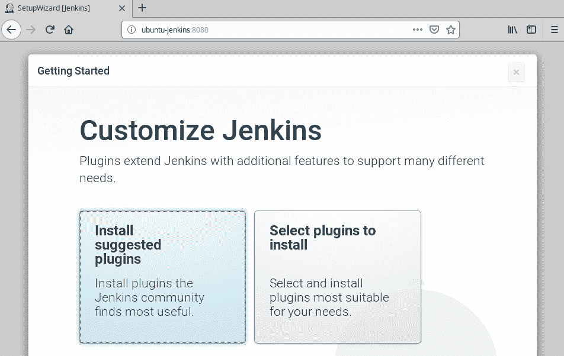

现在您已经有了一个 Jenkins 服务器，您可以开始为它创建作业来执行，以确认它正在按预期工作。让我们从一个微不足道的 Hello 世界开始吧！确认Jenkins在工作的工作。登录到您的Jenkins服务器，点击新项目链接。在“新项目”页面中，输入我们工作的名称。我在用`hello-test`。选择我们要创建为管道的作业类型。接下来，单击页面左下角的确定按钮。这将带您进入我们新工作的配置屏幕。这个会非常简单。我们将创建一个管道脚本，因此向下滚动，直到您看到管道脚本输入框，然后输入以下脚本(请注意，管道脚本是用 groovy 编写的，它使用 Java(和 C)形式的注释):

```
// Our hello world pipeline script, named "hello-test"
node {
  stage('Say Hello') {
      echo 'Hello Docker Quick Start Guide Readers!'
   }
}
```

现在就这些，所以点击保存按钮保存我们的Jenkins作业的更新配置。保存配置后，让我们通过单击立即构建链接来测试该作业。如果一切都按预期运行，我们应该会看到工作成功完成。它看起来如下所示:


现在让我们创造另一个工作。单击链接返回仪表板，然后再次单击新项目链接。这一次，让我们来命名工作`hello-docker-test`。同样，为要创建的作业类型选择管道，然后单击“确定”按钮。再次向下滚动到管道脚本输入，并输入以下内容:

```
// Our Docker hello world pipeline script, named "hello-docker-test"
node {
   stage('Hello via Alpine') {
      docker.image('alpine:latest').inside {
         sh 'echo Hello DQS Readers - from inside an alpine container!'
      }
   }
}
```

单击保存按钮保存新作业的配置，然后单击立即构建链接启动Jenkins作业。以下是这次的情况:


这次发生了什么？这个没有成功完成。显然它失败了，因为我们还没有在Jenkins服务器上安装 Docker。因此，让我们继续按照第 1 章“设置 Docker 开发环境”中的说明安装 Docker，并将其安装在我们的 Jenkins 服务器上。一旦您安装了它，还有一个额外的步骤是您想要做的，那就是将 Jenkins 用户添加到 Docker 组。以下是命令:

```
# Add the jenkins user to the docker group
sudo usermod -aG docker jenkins
# Then restart the jenkins service
sudo service jenkins restart
```

它非常像我们用来将我们的 docker 服务器的当前用户添加到 Docker 组的命令，因此没有必要对 Docker 命令使用`sudo`。好了，现在让我们回到我们的Jenkins服务器用户界面和我们的`hello-docker-test`作业，并再次单击立即构建按钮。


恭喜你！您有一台闪亮的新 Jenkins 服务器，经过适当配置，可以构建(测试、推送和部署)Docker 映像。干得好。尽管这是一项伟大的成就，但也有很多工作要做。你不希望有一个更简单的方法来设置一个新的Jenkins服务器吗？那么，你知道你已经有一套运行 Docker 的服务器了吗？您认为您可以使用该环境以更简单的方式支持您的 Jenkins 服务器吗？没错。让我们来看看。

# 参考

以下是安装Jenkins的网页:[https://jenkins.io/doc/book/installing/](https://jenkins.io/doc/book/installing/)。

# 设置文档化的Jenkins服务器

您刚刚看到了设置一个新的 Jenkins 服务器需要做多少工作。虽然这不是一项艰巨的工作，但在选择插件并登录开始工作之前，您至少需要完成五个步骤。并且本着游戏节目 *Name That Tune* 的精神，我可以分三步部署一个 Jenkins 服务器，前两步只是为了让我们的 Jenkins 数据能够在承载 Jenkins 服务器的 Docker 容器的生命周期之后持续存在。假设您已经按照第 1 章*中的说明设置并运行了一个 Docker 主机，设置了一个 Docker 开发环境*，我们希望为 Jenkins 服务器创建一个位置来存储它的数据。我们将创建一个文件夹并为其分配所有权。它将如下所示:

```
# Setup volume location to store Jenkins configuration
mkdir $HOME/jenkins_home
chown 1000 $HOME/jenkins_home
```

所有者`1000`是将用于 Docker 容器内的 jenkins 用户的用户 ID。

第三步是部署我们的容器。在向您展示该命令之前，让我先简单介绍一下要使用哪个容器映像。我包括一个链接，用于在 Docker 中心搜索Jenkins映像。如果你使用那个链接或者自己搜索，你会发现有很多选择。最初，你可能会考虑使用正式的Jenkins形象。然而，如果你浏览那个回购，你会发现我觉得有点奇怪，那就是官方形象被否决了。在 LTS 2.60.x 版之前，它已停止更新:

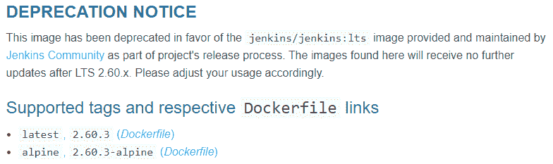

它建议使用在 jenkins/jenkins:lts Jenkins repo 中找到的映像，在撰写本文时，该映像是 2.149.x 版。这是我们将在以下示例中使用的映像。下面是我们将要用来部署 Jenkins 服务器容器的命令:

```
# Deploy a Jenkins server that is configured to build Docker images
docker container run -d -p 8080:8080 -p 50000:50000 \
-v $HOME/jenkins_home:/var/jenkins_home \
--name jenkins --rm jenkins/jenkins:lts
```

仔细查看这个命令，我们看到我们将容器作为守护进程启动(非交互)。我们看到我们正在打开主机上的两个端口，它们映射到容器上相同的端口号，具体为`8080`和`50000`。接下来，我们看到我们正在使用一个卷，它映射到我们之前创建的文件夹。这是 Jenkins 将存储其数据的地方，例如我们创建的作业及其执行状态。然后你会注意到我们正在给容器命名`jenkins`。之后，我们告诉 Docker 在容器退出时使用`--rm`标志将其移除。最后，我们告诉 Docker 我们想要运行什么映像。

当您运行这个容器时，给它一两分钟的时间启动并浏览到 Docker 主机上的端口`8080`，您将看到与将 Jenkins 部署为独立应用时相同的密码提示。接下来是创建第一个用户屏幕和默认插件配置屏幕。去试试吧。

由于我们已经为 Jenkins 数据创建了一个卷(写入`/var/jenkins_home`)，我们的 Jenkins 配置数据将保存到主机中，并将在容器本身的寿命结束后继续存在。当然，您可以使用存储驱动程序，将这些数据保存在比 Docker 主机更永久的地方，但是您已经有了这个想法，对吗？

唯一的问题是，无论是官方的Jenkins形象还是`jenkins/jenkins`形象都不支持创造将建立 Docker 形象的工作。由于这本书完全是关于 Docker 的，我们需要做的不仅仅是使用前面提到的映像运行我们的 Jenkins 服务器。别担心，我有个计划……继续读。

# 参考

*   dock hub search for Jenkins images:[https://hub . docker . com/search/？isaautomatic = 0&等值= 0&page = 1&pullcount = 0&q = Jenkins&star count = 0](https://hub.docker.com/search/?isAutomated=0&isOfficial=0&page=1&pullCount=0&q=jenkins&starCount=0)
*   官方Jenkins映像报告:[https://hub.docker.com/_/jenkins/](https://hub.docker.com/_/jenkins/)
*   Jenkins/Jenkins repo:[https://hub . docker . com/r/Jenkins/Jenkins/](https://hub.docker.com/r/jenkins/jenkins/)

# 在 Dockerized Jenkins 服务器内部构建 Docker 映像

好吧。现在您知道了如何将 Jenkins 部署为 Docker 容器，但是我们真的希望能够使用 Jenkins 来构建 Docker 映像，就像我们在 Jenkins 的独立部署中所做的那样。为此，我们可以部署相同的 Jenkins 映像，并在其中执行，安装 Docker，并可能使其工作，但我们不需要那么麻烦。我们不是第一批走这条路的先驱者。有几个 Docker 映像已经被创建来做我们正在寻找的事情。一个这样的形象就是`h1kkan/jenkins-docker:lts`。你可以通过以下*参考*部分的链接来了解它，但是现在只知道它是一个已经被设置为Jenkins服务器的映像，并且已经安装了 Docker。事实上，它还预装了 Ansible 和 AWSCLI，因此您可以使用它做更多的事情，而不仅仅是构建 Docker 映像。

首先，我们将在 Docker 主机上创建一个位置来装载 Docker 卷，以存储和保留 Jenkins 配置。如果您使用的 Docker 主机与上一节中使用的相同，您应该已经创建了文件夹，并将其所有权分配给 ID `1000`。如果没有，您可以使用以下命令:

```
# Setup volume location to store Jenkins configuration
mkdir $HOME/jenkins_home
chown 1000 $HOME/jenkins_home
```

此外，如果您还没有这样做，您可以使用`docker container stop jenkins`命令来停止(并删除)我们在上一节中创建的 Jenkins 容器，为我们新的和改进的 Jenkins 服务器扫清道路。当您准备好创建新容器时，可以使用以下命令:

```
# Deploy a Jenkins server that is configured to build Docker images
docker container run -d -p 8080:8080 -p 50000:50000 \
-v $HOME/jenkins_home:/var/jenkins_home \
-v /var/run/docker.sock:/var/run/docker.sock \
--name jenkins --rm h1kkan/jenkins-docker:lts

# Start the Docker service in the Jenkins docker container
docker container exec -it -u root jenkins service docker start
```

您会注意到这个代码块中的一些不同之处。首先是第二卷的使用。这是一种众所周知的技巧，允许容器向其主机发出 Docker 命令。这基本上允许所谓的 Docker-in-Docker。下一个区别是一个额外的 Docker 命令，它将在运行的容器中启动 Docker 服务。因为每个容器都是由一个进程启动的，所以同时运行一个 Jenkins 服务器进程和一个 Docker 守护进程需要这个额外的步骤。

一旦 Docker 服务在 Jenkins 容器中启动，您就可以创建使用和构建 Docker 映像的新 Jenkins 作业了。您可以通过在新的 Jenkins 服务器中重新创建上面的第二个示例`hello-docker-test`，自己测试一下。由于我们使用安装在`$HOME/jenkins_home`主机上的 Docker 卷来存储我们的 Jenkins 数据，这应该是您最后一次需要创建此作业。

这一切都运行得非常好，但是您可能会想起第 7 章中的“Docker Stacks”，我们有一个比使用`docker container run`命令更好的部署应用的方法，即使用 Docker Stacks。所以你想看到我们的例子被重新想象成 Docker 堆栈吗？我也是！好吧，那我们开始吧。

首先，使用容器停止命令停止当前的Jenkins容器。它将留下带有我们的 Jenkins 服务器数据的`jenkins_home`文件夹，但是如果出于某种原因，您跳过了这一章的这一部分，并且还没有创建它，下面是要使用的命令:

```
# Setup volume location to store Jenkins configuration
mkdir $HOME/jenkins_home
chown 1000 $HOME/jenkins_home
```

同样，如果您对前面的一个示例执行了这两个命令，并且您使用的是同一个 Docker 主机，则不必再次执行这两个命令，因为该文件夹已经存在并且拥有正确的所有权。

接下来，您需要为我们的 Jenkins 堆栈创建一个合成文件。我调用了我的`jenkins-stack.yml`并在其中输入了以下 YML 代码:

```
# jenkins-stack.yml
version: "3"
services:
  jenkins:
    image: h1kkan/jenkins-docker:lts
    ports:
       - 8080:8080
       - 50000:50000
    volumes:
       - $HOME/jenkins_home:/var/jenkins_home
       - /var/run/docker.sock:/var/run/docker.sock
    deploy:
       replicas: 1
       restart_policy:
         condition: on-failure
    placement:
      constraints: [node.role == manager]

  registry:
    image: registry
    ports:
       - 5000:5000
 deploy:
    replicas: 1
    restart_policy:
      condition: on-failure
```

您会注意到我们正在创建两个服务；一个是我们的 Jenkins 服务器，另一个是 Docker 注册表。我们将在一个即将到来的例子中使用注册服务，所以现在把它放在你的后口袋里。查看 Jenkins 服务描述，在第 7 章 *Docker Stacks* 中，当我们了解 Docker Stacks 时，没有什么是我们没有看到的。您会注意到我们的两个端口映射和上一个示例中使用的两个卷。我们将单个 Jenkins 副本限制在我们的管理器节点中。

请记住，要使用 Docker 堆栈，我们必须在集群模式下运行，因此如果您还没有这样做，请使用我们在第 5 章 *Docker Swarm* 中学习的`docker swarm init`命令创建您的集群。

Understand that if your swarm has more than one manager node, you will need to further confine the Jenkins replica to just the single manager that has your `jenkins_home` volume mount point. This can be accomplished with a combination of roles and labels. Alternatively, you can use a storage driver and mount a volume that can be shared among swarm managers. For simplicity, we are assuming a single manager node for our example.

现在使用堆栈部署命令来设置 Jenkins 应用。以下是要使用的命令示例:

```
# Deploy our Jenkins application via a Docker stack
docker stack deploy -c jenkins-stack.yml jenkins
```

一旦堆栈部署完毕，服务启动并运行，您就可以在端口 8080 上浏览到集群中的任何节点，并到达您的 Jenkins 服务器。此外，如果您正在重用我们前面示例中的`jenkins_home`文件夹，您将不必提供管理员密码、创建新用户和选择插件，因为与这些任务相关的所有数据都存储在`jenkins_home`文件夹中，现在由基于堆栈的 Jenkins 服务重用。一个更有趣的注意事项是，当您在堆栈应用中使用这个映像时，您不必启动 Docker 服务。奖金！

好了，我们现在有了一个甜蜜的基于堆栈的Jenkins服务，它能够使用和构建 Docker 映像。世界似乎一切正常。但有一件事可以让这一切变得更好。更好的是，我指的是更多的 Docker-y:与其使用普通的 Jenkins 代理来执行我们的构建作业，不如我们想创建一个新的、原始的 Docker 容器来执行我们的 Jenkins 作业呢？这将确保每个构建都是在干净、一致的环境中从头开始构建的。另外，它确实将 Docker 的初始级别提升了一个等级，所以我非常喜欢它。如果你想看看它是如何完成的，继续阅读。

# 参考

*   H1kkan/jenkins Docker repo:https://hub . docker . com/r/h1 kkan/Jenkins Docker/

# 为Jenkins构建节点使用 Docker 容器

要将 Docker 容器用于 Jenkins 构建代理，您需要对 Jenkins 配置做一些事情:

*   构建一个新的 Docker 映像，它可以充当 Jenkins 构建代理，并且能够构建 Docker 映像(当然)
*   将新映像推送到 Docker 注册表
*   关闭默认的Jenkins构建代理
*   为Jenkins安装 Docker 插件
*   配置新的云以启用 Dockerized 构建代理

# 构建Docker形象

我们开始吧。我们要做的第一件事是建立专门的 Docker 形象，可用于我们的Jenkins代理商。为此，我们将使用我们在第 3 章*创建Docker映像*中学习的技能来创建Docker映像。首先在您的开发系统上创建一个新文件夹，然后将您的工作目录更改为该文件夹。我给我的起名`jenkins-agent`:

```
# Make a new folder to use for the build context of your new Docker image, and cd into it
mkdir jenkins-agent
cd jenkins-agent
```

现在创建一个新的文件，命名为`Dockerfile`，使用你喜欢的编辑器，在里面输入下面的代码，然后保存它:

```
# jenkins-agent Dockerfile
FROM h1kkan/jenkins-docker:lts-alpine
USER root
ARG user=jenkins

ENV HOME /home/${user}
ARG VERSION=3.26
ARG AGENT_WORKDIR=/home/${user}/agent

RUN apk add --update --no-cache curl bash git openssh-client openssl procps \
 && curl --create-dirs -sSLo /usr/share/jenkins/slave.jar https://repo.jenkins-ci.org/public/org/jenkins-ci/main/remoting/${VERSION}/remoting-${VERSION}.jar \
 && chmod 755 /usr/share/jenkins \
 && chmod 644 /usr/share/jenkins/slave.jar \
 && apk del curl

ENV AGENT_WORKDIR=${AGENT_WORKDIR}
RUN mkdir -p /home/${user}/.jenkins && mkdir -p ${AGENT_WORKDIR}
USER ${user}

VOLUME /home/${user}/.jenkins
VOLUME ${AGENT_WORKDIR}
WORKDIR /home/${user}
```

以下是我们的新 Dockerfile 正在做的事情:在我们的`FROM`指令中，我们使用了与上面 Docker-in-Docker 示例中使用的相同的 Docker 映像，这样我们就有了一个允许我们构建 Docker 映像的基础映像。接下来，我们使用`USER`命令将当前用户设置为 root。接下来，我们创建一个名为`ARG`的用户，并将其设置为`jenkins`的值。之后，我们设置了一个名为`HOME`的环境变量，该变量为 Jenkins 用户的主文件夹提供了一个值。然后，我们再设置两个`ARGs`，一个用于版本，一个用于 Jenkins 代理的工作目录。下一个是魔法发生的地方。我们使用`RUN`命令来设置和卷曲Jenkins`slave.jar`文件。这是作为Jenkins代理运行所需的位。我们还对文件夹和文件设置了一些权限，然后通过删除 curl 来清理一点。之后，我们设置另一个环境变量，这个变量为`AGENT_WORKDIR`。接下来，我们在容器中创建几个文件夹。然后，我们再次使用`USER`指令，这次将当前用户设置为我们的Jenkins用户。我们通过创建几个`VOLUME`实例来完善 Dockerfile，最后，我们将当前工作目录设置为Jenkins用户的主目录。唷！这看起来很多，但实际上并没有那么糟糕，您所要做的就是将前面的代码复制并粘贴到您的 Dockerfile 中并保存它。

现在我们已经准备好使用 Dockerfile 了，这可能是创建 git repo 并将代码保存到其中的好时机。一旦您对您的项目已经用 git 正确设置感到满意，我们就可以构建新的 Docker 映像了。以下是您将使用的命令:

```
# Build our new Jenkins agent image
docker image build -t jenkins-agent:latest .
```

它应该成功构建并创建一个标记为`jenkins-agent:latest`的本地缓存映像。

# 将新映像推送到 Docker 注册表

接下来，我们需要将新映像推送到 Docker 注册表中。当然，我们可以将其推送到我们在 hub.docker.com 的回购中，但是既然我们有一个恰好部署了 Docker 注册表的应用堆栈，为什么不将其用于我们的 Jenkins 代理映像呢？首先，我们需要用注册表标记我们的新映像。根据 Docker Swarm的域名，您的标记命令将与我的不同，但对于我的示例，以下是我的标记命令的外观:

```
# Tag the image with our swarm service registry
docker image tag jenkins-agent:latest ubuntu-node01:5000/jenkins-agent:latest
```

现在映像已经在本地标记，我们可以用下面的命令把它推送到注册表；同样，根据群的域名，您的命令会有所不同:

```
# Push the Jenkins agent image to the registry
docker image push ubuntu-node01:5000/jenkins-agent:latest
```

所有这些命令都可能使用比简单使用`latest`标签更好的版本方案，但是您应该能够自己解决这个问题。随着我们的映像被构建、标记并推送到 Docker 注册表，我们准备更新我们的 Jenkins 配置以使用它。

# 关闭默认的Jenkins构建代理

现在，我们准备更新我们的Jenkins配置，以支持我们的 Dockerized 构建代理。我们要做的第一个配置更改是关闭默认的构建代理。为此，请登录您的 Jenkins 服务器，然后单击“管理 Jenkins”菜单链接。这将带您进入您可以管理的各种配置组，例如系统、插件和命令行界面设置。现在，我们需要转到配置系统管理组:


一旦您进入配置系统管理组，您将把执行人数量的值更改为`0`。它应该如下所示:


当您将“执行者数量”值更改为`0`时，您可以点击屏幕左下角的“保存”按钮来保存设置。此时，在进行此更改后，您的 Jenkins 服务器将无法运行任何作业，因为没有配置 Jenkins 代理来运行它们。所以让我们快速进入下一步，安装 Docker 插件。

# 为Jenkins安装 Docker 插件

现在我们需要为Jenkins安装 Docker 插件。您可以像其他插件安装一样完成这个任务。单击管理Jenkins菜单链接，从配置组列表中，单击管理插件组的链接:

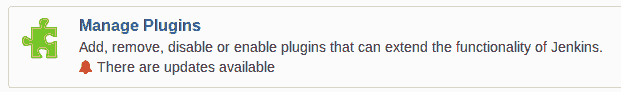

进入“管理插件”配置组后，选择“可用插件”选项卡，然后在过滤器框中，键入`docker`将可用插件列表缩小到与 Docker 相关的插件:


即使有过滤列表，仍然有很多插件可供选择。找到并选中 Docker 插件的复选框。它看起来如下:


选中 Docker 插件复选框后，向下滚动并单击不重启安装按钮。这将为您下载并安装插件，然后一旦Jenkins重启就启用它。在安装屏幕上，一旦插件安装完毕，您可以选择执行重启。为此，请选中安装完成且没有作业运行时重新启动Jenkins复选框:

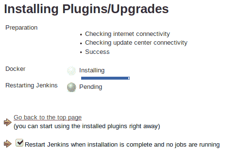

由于我们在几分钟前将执行器的数量设置为`0`，现在不会有任何作业运行，所以插件一安装好，Jenkins 就会重启。Jenkins一上线，插件就会被安装。我们需要重新登录Jenkins并设置我们的云。

# 创建一个新的云来支持我们的文档化构建代理

现在我们将告诉 Jenkins 使用我们的定制 Docker 映像来运行容器，作为 Jenkins 构建代理。再次单击管理Jenkins菜单链接。从配置组列表中，您将再次单击配置系统组的链接。您会在配置选项底部发现云配置。点击添加新云下拉菜单，选择`Docker`:

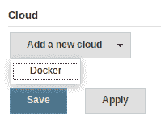

屏幕将会更新，您将拥有两个新的配置组:Docker Cloud 详细信息...和 Docker 代理模板...：

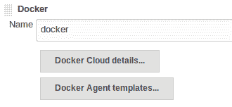

让我们首先处理 Docker 云的细节。现在点击那个按钮。您可以将名称值保留为`docker`的默认值。在Docker主机 URI 字段中，输入`unix:///var/run/docker.sock`。您可以通过单击问号帮助图标并将其复制粘贴到输入字段中来找到该值。接下来，单击测试连接按钮，您应该会看到一个版本行出现，类似于您将在下面的截图中看到的。记下应用编程接口版本号，因为高级版需要它...设置。单击高级...按钮，并在 Docker API 版本字段中输入 API 版本号。您需要选中“已启用”复选框来启用此功能，因此请务必这样做。最后，您可能希望更改系统可以并发运行的容器数量。默认值为 100。举个例子，我把价值降低到`10`。完成后，您的配置应该如下所示:

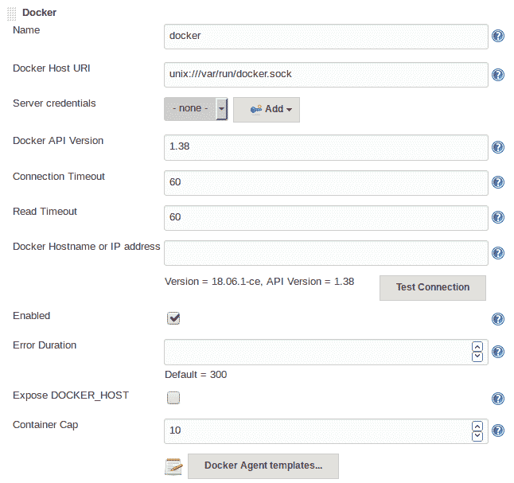

接下来，单击 Docker 代理模板...按钮，然后单击出现的“添加 Docker 模板”按钮，以便我们可以配置 Jenkins 代理设置。在这里，您需要单击代理的“已启用”复选框来启用我们的新代理模板。您可以指定一个名称作为由 Jenkins 作为构建代理运行的容器的前缀，也可以将该名称留空，将使用`docker`前缀。接下来，输入要用于生成代理容器的映像的存储库和名称标签。我们创建了自定义映像，对其进行标记，并使用`ubuntu-node01:5000/jenkins-agent:latest`映像名称将其推送到我们的Jenkins堆栈应用 repo，因此将该值输入 Docker Image 字段。将实例容量值设置为`1`，将远程文件系统根值设置为`/home/jenkins/agent`。确保使用值设置为`Use this node as much as possible`，并使用`Attach Docker container`值进行连接。将用户设置为`root`。将拉动策略值更改为`Pull once and update latest`:


最后，我们需要配置一些容器设置...，因此单击展开该部分。我们需要在这里输入的值是容器运行时要使用的命令。您在 Docker 命令字段中需要的值是`java -jar /usr/share/jenkins/slave.jar`。您在“卷”字段中需要的值是`/var/run/docker.sock:/var/run/docker.sock`:

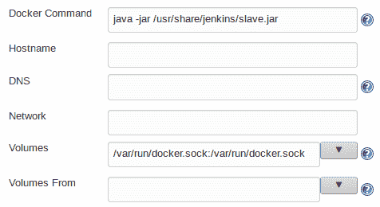

最后，选中分配伪 TTY 复选框:


向下滚动到配置屏幕的底部，单击保存按钮保存所有云设置。那是一些严肃的配置功夫——干得好！但是，万一您想要快速引用所有输入的值，这里是所有输入的自定义(或非默认)值，用于配置我们示例中的 Docker Cloud:

| **字段名** | **使用的数值** |
| URI 主机对接器 | `unix:///var/run/docker.sock` |
| docker api 版本 | `1.38`(匹配连接测试中显示的版本) |
| 启用 Docker 云 | 检查 |
| 容器盖 | `10` |
| 已启用 Docker 代理 | 检查 |
| Docker代理模板名称 | `agent` |
| Docker映像 | `ubuntu-node01:5000/jenkins-agent:latest` |
| 实例容量 | `1` |
| 远程文件系统根目录 | `/home/jenkins/agent` |
| 使用 | `Use this node as much as possible` |
| 连接方法 | `Attach Docker container` |
| 用户 | `root` |
| 拉动战略 | `Pull once and update latest` |
| Docker司令部 | `java -jar /usr/share/jenkins/slave.jar` |
| 卷 | `/var/run/docker.sock:/var/run/docker.sock` |
| 分配一个伪 TTY | 检查 |

现在一切都配置好了，让我们给新定义的 Jenkins 代理一个测试。

# 测试我们的新构建代理

回到Jenkins仪表盘，点击“为我们的`hello-docker-test`工作安排一个构建”按钮。这将为我们的工作开始一个新的构建，这又将创建一个新的 Dockerized 构建代理。它使用我们设置的配置来执行`docker container run`命令，以基于我们指定的映像运行新的容器。最初，当容器旋转时，执行器将离线:

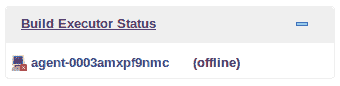

请注意，执行者名称有我们指定的代理前缀。一旦容器运行，Jenkins作业将在其中启动，基本上使用`docker container exec`命令。Jenkins作业开始后，将显示正常的作业进度图形，执行者将不再显示为脱机。状态将如下所示:

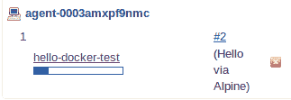

如果单击正在执行的作业的进度条，您可以查看作业的控制台输出，过一会儿，作业将显示“已完成:成功”状态，如下所示:

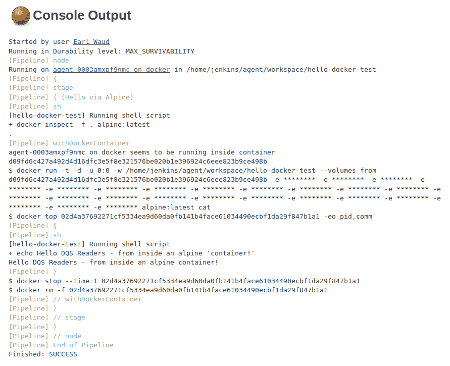

干得好！让我们检查最后一个示例 Jenkins 作业，以显示具有更多阶段的管道脚本，并表示 Docker 作业的真实示例。你准备好了吗？继续读。

# 在文档化的构建节点中构建、测试和推送 Docker 映像

为了结束关于 Docker 和 Jenkins 的这一章，让我们逐步完成为现实世界的 Docker 化节点应用创建模板的步骤。以下是我们将要做的事情:

准备我们的申请:

*   在 GitHub 上创建新的回购
*   将报告复制到我们的开发工作站
*   创建我们的应用文件
*   将我们的应用文件推送到 GitHub

创建并测试将构建我们的 Dockerized 节点应用的 Jenkins 作业:

*   创建一个新的Jenkins工作，利用 GitHub 回购
*   测试我们的 Jenkins 工作，它将拉动回购，构建应用，测试它，并发布映像
*   庆祝我们的成功！

让我们从准备申请开始。

我们要做的第一件事是在 GitHub 上创建我们的应用 repo。浏览并登录[github.com](http://www.github.com)，转到您的存储库页面，然后单击创建新回购按钮。输入新存储库的名称。举个例子，我用了`dqs-example-app`。输入适当的描述。你可以让你的回购公开或私人。对于本例，我将其公开是为了简单起见，以后拉回购时不需要进行身份验证。选中初始化存储库复选框，以便您可以立即在工作站上克隆空的 repo。创建`.gitignore`文件时，可以选择要使用的项目类型。我选择了`Node`。当您输入并选择了所有这些内容后，它将看起来非常像以下内容:


单击创建存储库按钮创建新的应用报告。现在它是在 GitHub 上创建的，您将希望将其克隆到您的工作站上。使用“克隆”或“下载”按钮，然后使用“复制”按钮复制克隆步骤的报告网址:


现在，返回您的工作站，在您保存本地回购的位置，克隆新的(大部分)空回购。然后将目录更改到新 repo 的文件夹中。对我来说，这看起来像下面这样:


现在我们要创建应用的支架。这将包括创建一个`Dockerfile`、`Jenkinsfile`、`main.js`和`test.js`文件以及`package.json`文件。使用您最喜欢的编辑器在应用文件夹中创建这些文件。以下是这些文件的内容:

以下是`Dockerfile`文件的内容:

```
FROM node:10-alpine
COPY . .
RUN npm install
EXPOSE 8000
CMD npm start
```

以下是`Jenkinsfile`文件的内容:

```
node {
   def app
   stage('Clone repository') {
      /* Clone the repository to our workspace */
      checkout scm
   }
   stage('Build image') {
      /* Builds the image; synonymous to docker image build on the command line */
      /* Use a registry name if pushing into docker hub or your company registry, like this */
      /* app = docker.build("earlwaud/jenkins-example-app") */
      app = docker.build("jenkins-example-app")
   }
   stage('Test image') {
      /* Execute the defined tests */
      app.inside {
         sh 'npm test'
      }
   }
   stage('Push image') {
      /* Now, push the image into the registry */
      /* This would probably be docker hub or your company registry, like this */
      /* docker.withRegistry('https://registry.hub.docker.com', 'docker-hub-credentials') */

      /* For this example, We are using our jenkins-stack service registry */
      docker.withRegistry('https://ubuntu-node01:5000') {
         app.push("latest")
      }
   }
}
```

以下是`main.js`文件的内容:

```
// load the http module
var http = require('http');

// configure our HTTP server
var server = http.createServer(function (request, response) {
   response.writeHead(200, {"Content-Type": "text/plain"});
   response.end("Hello Docker Quick Start\n");
});

// listen on localhost:8000
server.listen(8000);
console.log("Server listening at http://127.0.0.1:8000/");
```

以下是`package.json`文件的内容:

```
{
   "name": "dqs-example-app",
   "version": "1.0.0",
   "description": "A Docker Quick Start Example HTTP server",
   "main": "main.js",
   "scripts": {
      "test": "node test.js",
      "start": "node main.js"
   },
   "repository": {
      "type": "git",
      "url": "https://github.com/earlwaud/dqs-example-app/"
   },
   "keywords": [
      "node",
      "docker",
      "dockerfile",
      "jenkinsfile"
   ],
   "author": "earlwaud@hotmail.com",
   "license": "ISC",
   "devDependencies": { "test": ">=0.6.0" }
}
```

最后，以下是`test.js`文件的内容:

```
var assert = require('assert')

function test() {
   assert.equal(1 + 1, 2);
}

if (module == require.main) require('test').run(test);
```

完成后，您的 repo 文件夹应该如下所示:

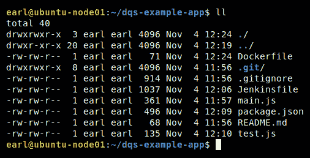

现在，让我们把我们的工作推进到 GitHub 回购。您将使用标准 git 命令添加文件，提交文件，然后将文件推送到 repo。以下是我使用的命令:

```
# Initial commit of our application files to the new repo
git add Dockerfile Jenkinsfile main.js package.json test.js
git commit -m "Initial commit"
git push origin master
```

以下是我看到的情况:

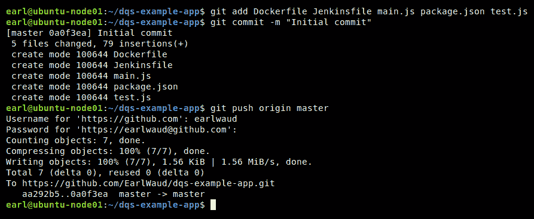

现在，我们的应用的初始版本已经创建并推送到我们的 GitHub repo，我们准备创建 Jenkins 作业来获取我们的 repo 代码，构建我们的应用映像，测试它，然后发布我们的应用的 Docker 映像。首先，创建一个新的Jenkins工作，登录到您的Jenkins服务器，并点击新项目链接。接下来，在“输入项目名称”输入框中输入要用于作业的名称。我正在使用`dqs-example-app`。为我们正在创建的作业类型选择`Pipeline`，然后单击确定按钮。

您可以也应该为我们正在创建的构建作业提供一个有意义的描述。只需将其输入配置屏幕顶部的描述:输入框。对于我们的例子，我已经输入了稍微简洁的描述`Build the dqs-example-app using a pipeline script from SCM`。你可能会做得更好。

我们将设置 Jenkins 作业，每五分钟轮询一次 GitHub 回购，以寻找主分支的变化。有更好的选择，对 repo 的更改可以触发构建作业，而无需计划轮询，但是为了简单起见，我们将只使用轮询方法。因此，向下滚动到作业配置的构建触发器部分，并检查轮询配置管理。然后在时间表中，输入一个值`H/5 * * * *`:

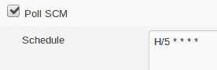

接下来，我们想建立我们的管道。与前面的例子不同，这次我们将从配置管理选项中选择管道脚本。我们将为我们的配置管理选择`Git`，然后为我们的应用在 GitHub 上的报告输入存储库网址。本例中，该网址为`https://github.com/EarlWaud/dqs-example-app.git`。确保要构建的分支值设置为`*/master`，这是默认值。您的管道定义应该如下所示:

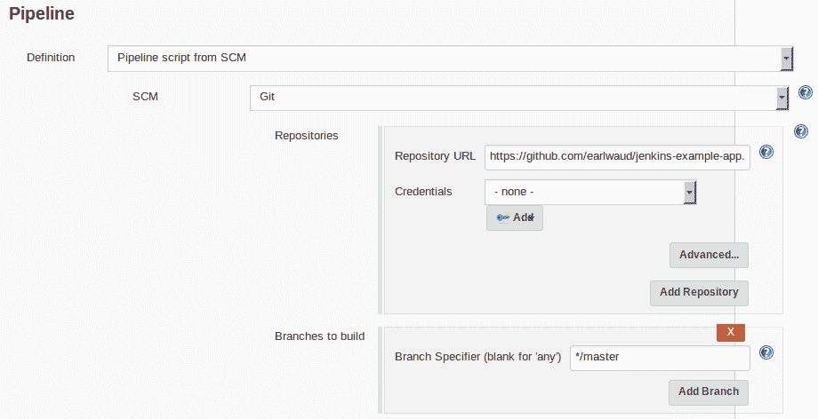

管道还有一个关键设置，那就是脚本路径。这是Jenkins脚本文件的(路径和)文件名。在我们的例子中，这实际上只是`Jenkinsfile`，因为我们给文件起的名字是`Jenkinsfile`，它在我们的回购的根中。这是我们示例的输入内容:

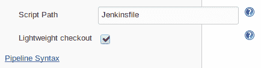

这是目前需要的全部配置。其他一切都已经在我们的源文件中设置好了，它们将从我们的应用 repo 中取出。配置只需点击保存按钮。回到作业页面，我们准备执行第一次构建。在我们的示例中，新创建的作业屏幕如下所示:


现在，等着吧。在五分钟或更短的时间内，作业的第一次构建将自动开始，因为我们已经设置了每五分钟轮询一次 repo。我们将在作业完成时查看控制台日志，但首先这里是作业完成后我们的 Jenkins 作业视图(当然是成功的！):

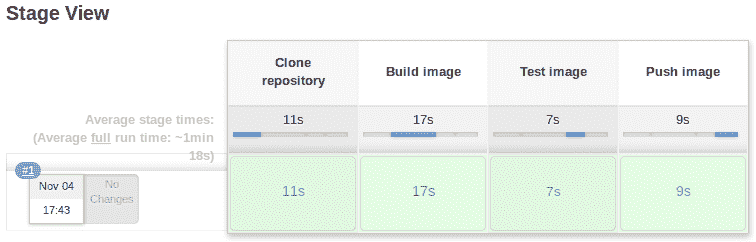

以下是控制台日志输出的编辑视图，供参考(完整的日志输出可在源代码包中找到):

```
Started by an SCM change
Started by user Earl Waud
Obtained Jenkinsfile from git https://github.com/EarlWaud/dqs-example-app.git
[Pipeline] node
Running on agent-00042y2g983xq on docker in /home/jenkins/agent/workspace/dqs-example-app
[Pipeline] { (Clone repository)
Cloning repository https://github.com/EarlWaud/dqs-example-app.git
> git init /home/jenkins/agent/workspace/dqs-example-app # timeout=10
[Pipeline] { (Build image)
+ docker build -t jenkins-example-app .
Successfully built b228cd7c0013
Successfully tagged jenkins-example-app:latest
[Pipeline] { (Test image)
+ docker inspect -f . jenkins-example-app
+ npm test
> node test.js
Passed:1 Failed:0 Errors:0
[Pipeline] { (Push image)
+ docker tag jenkins-example-app ubuntu-node01:5000/jenkins-example-app:latest
+ docker push ubuntu-node01:5000/jenkins-example-app:latest
Finished: SUCCESS
```

现在剩下要做的就是庆祝我们的成功:


说真的，这是创建自己的 Dockerized 应用以及使用 Jenkins 构建、测试和发布它们的一个很好的基础。将其视为一个可以重用和构建的模板。你现在已经准备好以任何你想要的方式利用多克和Jenkins。

# 摘要

好了，我们到了，这一章的最后。我希望你读这一章和我写这一章一样开心。我们有机会运用我们在前面章节中学到的许多技能。不仅如此，本章中还有一些非常有用的Jenkins课程。以至于你可以认真考虑跳过任何计划中的Jenkins培训或书籍阅读，因为你需要知道的关于使用Jenkins的几乎所有东西都在这里。

让我们回顾一下:首先，我们学习了如何设置独立的 Jenkins 服务器。我们很快过渡到部署Jenkins服务器作为 Docker 容器。这就是你读这本书的目的，对吗？然后我们学习了如何在 Dockerized Jenkins 服务器中构建 Docker 映像。接下来，我们找到了如何用超酷的 Docker 容器来替换无聊的 Jenkins 代理，这样就可以构建我们的 Docker 映像。你可能会想到这个和Docker。你看过电影《盗梦空间》吗？好吧，你就这么过着。最后，为了总结这一章，我们创建了一个示例文档化的应用，以及构建、测试和发布该应用映像的 Jenkins 作业。这是一个示例，您可以将其用作将来创建的真实应用的模板和基础。

这是本书的结尾。我再说一遍……我希望你读它和我写它一样有趣。我希望你在阅读它时学到的和我在写作它时学到的一样多。在这些章节中，我们涵盖了大量的 Docker 信息。我们在[第 1 章](1.html)、*设置 Docker 化开发环境*中搞定了 Docker 工作站设置，不管你喜欢哪种操作系统。在[第 2 章](2.html)、*学习 Docker 命令*中，我们学习了关于 Docker 命令集的所有知识。在[第 3 章](3.html)、*创建 Docker 映像*中，我们深入研究了`Dockerfile`指令集，并了解了如何创建您可能想要构建的任何 Docker 映像。第四章*Docker卷*，向我们展示了Docker卷的力量和用处。当我们在[第 5 章](5.html)、*Docker群*中练习几乎神奇的Docker群的特性时，我们开始使用前几章中的一些经验。然后，在[第 6 章](6.html)*Docker网络*中，我们继续我们的Docker教育，这次学习Docker如何为我们简化了复杂的网络话题。而在[第七章](7.html)*Docker Stacks*中，我们在了解 Docker Stacks 的时候，看到了更多的 Docker 魔力和力量。最后，在[第 8 章](8.html)、 *Docker 和 Jenkins* 中，我们把我们所有的学习都用到 Docker 上，并和 Jenkins 一起利用 Docker 为我们创建现实世界的应用做准备。

剩下的就是让我说谢谢，并祝你在Docker的旅程中取得成功。