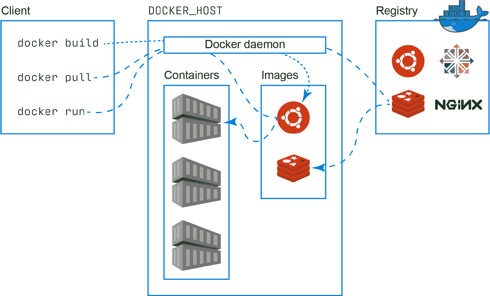
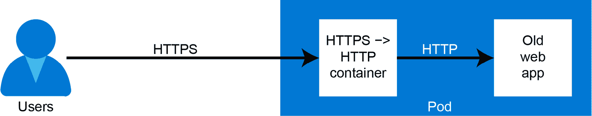

# 1.容器和Kubernetes介绍

Kubernetes 已经成为容器编排的领先标准。自 2014 年成立以来，Kubernetes 获得了巨大的人气。它已被初创企业和大型企业采用，所有主要的公共云供应商都提供托管的 Kubernetes 服务。

Kubernetes 基于 Docker 容器革命的成功。Docker 既是一家公司，也是一项技术的名称。Docker 作为一种技术是创建和运行软件容器最常见的方式，称为 Docker 容器。容器是一种打包软件的方式，可以让您在任何平台上轻松运行该软件，从笔记本电脑到数据中心的服务器，再到公共云中运行的集群。

尽管核心技术是开源的，但 Docker 公司专注于通过大量商业产品来降低开发人员的复杂性。

Kubernetes 将容器带到了下一个层次。Kubernetes 是一个容器指挥者。容器编排器是一个软件平台，它使得在成千上万台机器上运行成千上万个容器变得容易。它自动化了部署、运行和扩展应用所需的大量手动任务。编排者负责安排合适的容器在合适的机器上运行。它还负责运行状况监控和故障转移，以及扩展您部署的应用。

Docker 使用的容器技术和 Kubernetes 都是开源软件项目。开源软件允许来自许多公司的开发者在一个软件上合作。Kubernetes 本身也有来自微软、谷歌、红帽、VMware 和许多其他公司的贡献者。

三大公共云平台——Azure、**亚马逊网络服务** ( **AWS** )、**谷歌云平台**(**GCP**)——都提供托管的 Kubernetes 服务。它们在市场上引起了很大的兴趣，因为几乎无限的计算能力和这些托管服务的易用性使得构建和部署大规模应用变得非常容易。

**Azure Kubernetes 服务** ( **AKS** )是 Azure 为 Kubernetes 提供的托管服务。它降低了构建和管理 Kubernetes 集群的复杂性。在这本书里，你将学习如何使用 AKS 来运行你的应用。每章都将介绍新概念，你将通过本书中的许多例子来应用这些新概念。

然而，作为一个用户，理解支撑 AKS 的技术仍然非常有用。我们将在本章探讨这些基础。您将了解 Linux 进程以及它们与 Docker 和容器的关系。您将看到各种过程如何很好地适应容器，以及容器如何很好地适应 Kubernetes。

本章介绍了基本的 Docker 概念，以便您可以开始您的 Kubernetes 之旅。本章还简要介绍了帮助您构建容器、实现集群、执行容器编排以及对 AKS 上的应用进行故障排除的基础知识。粗略了解本章内容将会揭开在 AKS 上构建经过身份验证、加密且高度可扩展的应用所需的大量工作。在接下来的几章中，您将逐步构建可扩展且安全的应用。

本章将涵盖以下主题:

*   把我们带到这里的软件进化
*   容器的基本原理
*   Kubernetes 的基本原理
*   AKS 的基本原理

本章的目的是介绍要点，而不是提供描述 Docker 和 Kubernetes 的完整信息源。首先，我们先来看看软件是如何进化到现在这个地步的。

## 把我们带到这里的软件进化

有两个主要的软件开发进化使得容器和 Kubernetes 流行起来。一个是采用微服务架构风格。微服务允许应用从一组小服务中构建，每个小服务都服务于一个特定的功能。启用容器和 Kubernetes 的另一个演进是 DevOps。DevOps 是一套文化实践，允许人们、流程和工具更快、更频繁、更可靠地构建和发布软件。

虽然您可以在不使用微服务或 DevOps 的情况下同时使用容器和 Kubernetes，但是这些技术被最广泛地用于使用 DevOps 方法部署微服务。

在本节中，我们将从微服务开始讨论这两种演进。

### 微服务

随着时间的推移，软件开发发生了巨大的变化。最初，软件是在单个系统上开发和运行的，通常是大型机。客户端可以通过终端连接到主机，并且只能通过该终端。当客户机-服务器编程模式出现时，计算机网络变得普遍，这种情况发生了变化。客户端可以远程连接到服务器，甚至在自己的系统上运行部分应用，同时连接到服务器以检索应用所需的数据。

客户机-服务器编程模型已经向分布式系统发展。分布式系统不同于传统的客户机-服务器模型，因为它们有运行在多个不同系统上的多个不同应用，所有这些应用都是互连的。

如今，微服务架构在开发分布式系统时很常见。基于微服务的应用由一组服务组成，这些服务共同组成应用，而各个服务本身可以彼此独立地构建、测试、部署和扩展。这种风格有很多好处，但也有几个缺点。

微服务体系结构的一个关键部分是每个单独的服务只服务一个核心功能。每个服务都服务于单个绑定的业务功能。不同的服务协同工作形成完整的应用。这些服务通过网络通信协同工作，通常使用 HTTP REST APIs 或 gRPC:

图 1.1:标准微服务架构

使用容器和 Kubernetes 运行的应用通常采用这种体系结构方法。容器被用作各个服务的打包格式，而 Kubernetes 是部署和管理一起运行的不同服务的编排者。

在我们深入研究容器和 Kubernetes 的细节之前，让我们先探讨一下采用微服务的好处和坏处。

### 运行微服务的优势

运行基于微服务的应用有几个优点。第一个事实是，每个服务都独立于其他服务。这些服务被设计得足够小(因此是微的)来处理业务领域的需求。因为它们很小，所以它们可以是独立的和可独立测试的，因此是可独立发布的。

这也带来了每个微服务都可以独立扩展的好处。如果应用的某个部分获得了更多的需求，那么应用的该部分可以独立于应用的其余部分进行扩展。

服务是可独立扩展的这一事实也意味着它们是可独立部署的。微服务有多种部署策略。最受欢迎的是滚动部署和蓝色/绿色部署。

通过滚动升级，服务的新版本只部署到应用的一部分。如果服务保持健康，这个新版本会受到仔细监控，并逐渐获得更多流量。如果出了问题，以前的版本还在运行，流量很容易被切断。

通过蓝色/绿色部署，您可以独立部署新版本的服务。一旦部署并测试了新版本的服务，您就可以将 100%的生产流量削减到新版本。这允许服务版本之间的干净转换。

微服务架构的另一个好处是，每个服务都可以用不同的编程语言编写。这被描述为多语种——理解和使用多种语言的能力。比如前端服务可以用流行的 JavaScript 框架开发，后端可以用 C#开发，机器学习算法可以用 Python 开发。这允许您为正确的服务选择正确的语言，并允许开发人员使用他们最熟悉的语言。

### 运行微服务的缺点

每个硬币都有反面，微服务也是如此。虽然基于微服务的架构有多种优势，但这种架构也有其缺点。

微服务设计和架构需要高度的软件开发成熟度才能正确实现。非常了解领域的架构师必须确保每个服务都是有界限的，并且不同的服务是有凝聚力的。由于服务彼此独立，版本独立，因此这些不同服务之间的软件契约对于正确实现非常重要。

微服务设计的另一个常见问题是在监控和排除此类应用的故障时会增加复杂性。由于不同的服务组成一个应用，并且这些不同的服务运行在多个服务器上，因此记录和跟踪这样的应用是一项复杂的工作。

与前面提到的缺点相关联的是，通常在微服务中，您需要在应用中构建更多的容错能力。由于应用中不同服务的动态特性，故障更有可能发生。为了保证应用的可用性，在组成应用的不同微服务中构建容错是很重要的。实现重试逻辑或断路器等模式对于避免导致应用宕机的单一故障至关重要。

在本节中，您了解了微服务、其优点和缺点。通常与微服务联系在一起，但另一个单独的主题是 DevOps 运动。我们将在下一节探讨 DevOps 的含义。

### DevOps

DevOps 字面意思是开发和运营的结合。更具体地说，DevOps 是人员、流程和工具的结合，以更快、更频繁、更可靠地交付软件。DevOps 更多的是一套文化实践，而不是任何特定的工具或实现。通常，DevOps 跨越软件开发的四个领域:规划、开发、发布和操作软件。

#### 注意

DevOps 有很多定义。作者已经采用了这个定义，但是作为读者，我们鼓励您在围绕 DevOps 的文献中探索不同的定义。

DevOps 文化始于规划。在 DevOps 项目的规划阶段，概述了项目的目标。这些目标在高层次(称为史诗)和低层次(作为特性和任务)都有概述。DevOps 项目中的不同工作项被捕获在特性积压中。通常，DevOps 团队在编程冲刺阶段使用敏捷规划方法。看板通常用于表示项目状态和跟踪工作。当一个任务从*状态变为*状态变为*状态变为*状态变为*状态变为*状态时，它会在看板上从左向右移动。

当工作被计划时，实际的开发可以完成。DevOps 文化中的开发不仅仅是编写代码，还包括测试、评审和与团队成员集成代码。像 Git 这样的版本控制系统用于不同的团队成员之间共享代码。自动化的**持续集成** ( **CI** )工具用于自动化大多数手动任务，如测试和构建代码。

当一个特性代码完成、测试和构建后，就可以交付了。DevOps 项目的下一阶段可以开始交付。一个**连续交付** ( **光盘**)工具用于软件部署的自动化。通常，软件被部署到不同的环境中，例如测试、质量保证和生产。在进入下一个环境之前，使用自动和手动闸门的组合来确保质量。

最后，当一个软件在生产中运行时，操作阶段就可以开始了。这个阶段包括维护、监控和支持生产中的应用。最终目标是以尽可能少的停机时间可靠地运行应用。任何问题都应尽可能提前发现。软件中的错误将在积压中被跟踪。

DevOps 过程是一个迭代过程。单个团队永远不会处于流程的单个阶段。整个团队都在持续规划、开发、交付和运行软件。

存在多种工具来实现 DevOps 实践。有针对单个阶段的单点解决方案，例如用于规划的吉拉或用于 CI 和 CD 的 Jenkins，以及完整的 DevOps 平台，例如 GitLab。微软运营两个解决方案，使客户能够采用 DevOps 实践:Azure DevOps 和 GitHub。Azure DevOps 是一套支持 DevOps 流程所有阶段的服务。GitHub 是一个独立的平台，支持 DevOps 软件开发。GitHub 被称为领先的开源软件开发平台，托管了超过 4000 万个开源项目。

微服务和 DevOps 通常与容器和 Kubernetes 结合使用。既然我们已经介绍了微服务和 DevOps，我们将继续第一章的内容，首先介绍容器的基础，然后介绍 Kubernetes 的基础。

### 容器基础

自 20 世纪 70 年代以来，Linux 内核中就存在一种容器技术。为今天的容器提供动力的技术被称为**控制组**(缩写自**控制组**)，是由谷歌在 2006 年引入 Linux 内核的。Docker 公司在 2013 年通过引入一个简单的开发人员工作流程推广了这项技术。虽然 Docker 这个名字既可以指公司，也可以指技术，但最常见的是，我们用 Docker 来指技术。

#### 注意

尽管 Docker 技术是构建和运行容器的流行方式，但它不是构建和运行容器的唯一方式。对于构建或运行容器，存在许多替代方案。其中一个选择是 containerd，这是一个容器运行时，Kubernetes 也使用它。

Docker 作为一种技术既是打包格式，也是容器运行时。打包是一个允许应用与其依赖项(如二进制文件和运行时)打包在一起的过程。运行时指向运行容器映像的实际过程。

Docker 的体系结构中有三个重要部分:客户端、守护程序和注册表:

*   Docker 客户端是一个客户端工具，您可以使用它与本地或远程运行的 Docker 守护程序进行交互。
*   Docker 守护进程是一个长时间运行的进程，负责构建容器映像和运行容器。Docker 守护程序可以在本地计算机或远程计算机上运行。
*   Docker 注册表是存储 Docker 映像的地方。有像 Docker Hub 这样包含公共映像的公共注册表，也有像**Azure Container Registry**(**ACR**)这样的私有注册表，可以用来存储自己的私有映像。如果映像在本地不可用，Docker 守护程序可以从注册表中提取映像:

图 1.2:Docker 架构的基础

您可以通过在 Docker Hub([https://hub.docker.com/](https://hub.docker.com/))创建一个免费的 Docker 帐户并使用该登录打开 Docker Labs([https://labs.play-with-docker.com/](https://labs.play-with-docker.com/))来尝试 Docker。这将使您能够访问预安装了 Docker 的环境，该环境的有效期为 4 小时。在构建我们自己的容器和图像时，我们将在本节中使用 Docker Labs。

#### 注意

虽然我们在本章中使用基于浏览器的 Docker 实验室来介绍 Docker，但是您也可以在本地桌面或服务器上安装 Docker。对于工作站，Docker 有一个名为 Docker Desktop([https://www.docker.com/products/docker-desktop](https://azure.microsoft.com/resources/designing-distributed-systems/))的产品，可用于 Windows 和 Mac 在本地创建 Docker 容器。在服务器上，无论是 Windows 还是 Linux，Docker 也可以作为容器的运行时。

### 容器图像

要启动一个新的容器，您需要一个图像。一个映像包含所有需要在容器中运行的软件。容器映像可以本地存储在您的计算机上，也可以存储在容器注册表中。有公共注册管理机构，如公共 Docker Hub([https://hub.docker.com/](https://hub.docker.com/))或私有注册管理机构，如 ACR。作为用户，当您的电脑本地没有图像时，您可以使用 **docker pull** 命令从注册表中提取图像。

在下面的示例中，我们将从公共 Docker Hub 存储库中提取一个图像，并运行实际的容器。您可以按照以下说明在 Docker Labs 中运行此示例，我们在上一节中介绍了该示例:

#首先，我们会拉一张图片

坞站拉坞站/whalesay

#然后我们可以查看哪些图像存储在本地

docker 图像

#然后我们将运行我们的容器

码头员跑码头/whalesay cowsay boo

这些命令的输出类似于*图 1.3* :

图 1.3:在 Docker 实验室中运行容器的示例

这里发生的事情是，Docker 首先将您的图像分成多个部分，并将其本地存储在运行它的机器上。当您运行实际应用时，它使用该本地映像来启动一个容器。如果我们详细查看这些命令，您会看到 **docker pull** 接受了一个参数， **docker/whalesay** 。如果您不提供私有容器注册表，Docker 将在公共 Docker Hub 中查找图像，这是 Docker 获取该图像的地方。**Docker运行**命令接受了几个论点。第一个论点是 **docker/whalesay** ，这是对图像的引用。接下来的两个参数 **cowsay boo** 是传递给运行容器执行的命令。

在前面的示例中，您了解到可以在不首先构建图像的情况下运行容器。然而，这是非常常见的，你会想要建立自己的形象。为此，您可以使用 Dockerfile。Docker 文件包含 Docker 从基础映像开始并构建您的映像时将遵循的步骤。这些说明的范围可以从添加文件到安装软件或设置网络。

在下一个示例中，您将构建一个自定义 Docker 映像。这个自定义图像将在鲸鱼输出中显示鼓舞人心的报价。以下 Dockerfile 将用于生成此自定义图像。您将在您的 Docker 游乐场创建它:

来自Docker/捕鲸者:最新

运行易于获取的 qq 更新

运行 apt-get install -qq -y 财富

CMD /usr/games/fortune -a | cowsay

这个文件有四行。第一个将指示 Docker 使用哪个图像作为这个新图像的源图像。接下来的两个步骤是运行命令为我们的图像添加新的功能，在这种情况下，更新您的 **apt** 存储库并安装一个名为**财富**的应用。**财富**应用是一个小命令行工具，可以生成鼓舞人心的报价。我们将使用它在输出中包含引号，而不是用户输入。最后， **CMD** 命令告诉 Docker，当基于此图像的容器运行时，要执行哪个命令。

您通常将 Dockerfile 保存在名为 **Dockerfile** 的文件中，没有扩展名。要构建图像，您需要执行 **docker build** 命令，并将其指向您创建的 Dockerfile。在构建 Docker 映像时，Docker 守护程序将读取 Docker 文件并执行 Docker 文件中的不同步骤。该命令还将输出运行容器和构建映像所需的步骤。让我们来看一下构建图像的演示。

为了创建这个 Dockerfile，通过 **vi Dockerfile** 命令打开一个文本编辑器。 **vi** 是 Linux 命令行上的高级文本编辑器。如果您不熟悉它，让我们来看看如何在其中输入文本:

1.  打开 vi 后，点击 *I* 键进入插入模式。
2.  然后，复制粘贴或键入四行代码。
3.  之后，点击 *Esc* 键，输入 **:wq！**写 **(w)** 你的文件并退出 **(q)** 文本编辑器。

下一步是执行 **docker build** 来构建图像。我们将向该命令添加最后一位，即向我们的图像添加一个标签，这样我们就可以用一个有意义的名称来称呼它。为了建立形象，你将使用**Docker建立-t 智能鲸。**命令(别忘了在这里加最后一个句号)。

现在，您将看到 Docker 执行了许多步骤(在本例中为四个)来构建映像。映像构建完成后，您可以运行应用。要运行您的容器，您运行 **docker 运行 smartwhale** ，您应该会看到类似于*图 1.4* 的输出。但是，您可能会看到不同的智能报价。这是由于**财富**应用生成不同的报价。如果多次运行容器，会看到不同的报价出现，如图*图 1.4* :

图 1.4:运行自定义容器

我们对容器的概述和演示到此结束。在本节中，您从现有的容器映像开始，并在 Docker Labs 上启动了它。之后，您更进一步，构建自己的容器映像，然后使用该映像启动容器。您现在已经了解了构建和运行容器需要什么。在下一节中，我们将介绍 Kubernetes。Kubernetes 允许您大规模运行多个容器。

## Kubernetes 作为容器编排平台

构建和运行一个容器似乎很容易。然而，当您需要在多个服务器上运行多个容器时，事情可能会变得复杂。这是容器编排者可以提供帮助的地方。容器编排器负责安排容器在服务器上运行，当容器出现故障时重新启动容器，当主机变得不健康时将容器移动到新的主机，等等。

目前领先的配器平台是 Kubernetes([https://kubernetes.io/](https://kubernetes.io/))。Kubernetes 的灵感来自谷歌的博格项目，该项目本身就在生产中运行数百万个容器。

Kubernetes 采用声明式方法进行编排；也就是说，您指定您需要什么，Kubernetes 负责部署您指定的工作负载。您不再需要自己手动启动这些容器，因为 Kubernetes 将启动您指定的容器。

#### 注意

虽然 Kubernetes 曾经支持 Docker 作为容器运行时，但是在 Kubernetes 1.20 版本中，这种支持已经被否决了。在 AKS 中，从 Kubernetes 1.19 开始，**容器**成为默认的容器运行时。

在整本书中，您将构建多个在 Kubernetes 中运行容器的示例，并且您将了解更多关于 Kubernetes 中不同对象的信息。在这一介绍性章节中，您将学习 Kubernetes 中的三个基本对象，您可能会在每个应用中看到:pod、部署和服务。

### 蒲公英中的蒲公英

Kubernetes 中的一个**Pod **是必不可少的调度元素。Pod 是一组一个或多个容器。这意味着一个容器可以包含一个容器或多个容器。当使用单个容器创建容器时，可以交替使用容器和容器这两个术语。然而，术语 pod 仍然是首选，并且是贯穿本书的术语。

当 pod 包含多个容器时，这些容器共享相同的文件系统和相同的网络命名空间。这意味着，当作为容器一部分的容器写入文件时，同一容器中的其他容器也可以读取该文件。这也意味着 pod 中的所有容器都可以使用 localhost 网络相互通信。

在设计方面，您应该只将需要紧密集成的容器放在同一个容器中。想象一下下面的情况:您有一个不支持 HTTPS 的旧 web 应用。您希望升级该应用以支持 HTTPS。您可以创建一个包含旧 web 应用并包含另一个容器的容器，该容器将为该应用执行**传输层安全性** ( **TLS** )卸载，如*图 1.5* 中所述。用户将使用 HTTPS 连接到您的应用，而中间的容器将 HTTPS 流量转换为 HTTP:

图 1.5:一个进行 HTTPS 卸载的多容器Pod 的例子

#### 注意

这种设计原则被称为边车。微软有一本免费的电子书，描述了多种多容器 pod 设计和分布式系统设计(https://azure . Microsoft . com/resources/design-distributed-system/)。

无论是单容器还是多容器容器，容器都是短暂的资源。这意味着 pod 可以在任何时候终止，并在另一个节点上重新启动。当这种情况发生时，存储在那个Pod 中的状态将会丢失。如果需要在应用中存储状态，要么需要将该状态存储在外部存储中，如外部磁盘或文件共享，要么将 Kubernetes 之外的状态存储在外部数据库中。

### 在Kubernetes的部署

Kubernetes 中的一个**部署**在Pod 周围提供了一层功能。它允许您从相同的定义创建多个单元，并轻松地对您部署的单元执行更新。部署还有助于扩展应用，甚至可能自动扩展应用。

在引擎盖下，一个部署创建了一个**副本集**，它将依次创建您请求的副本Pod 。副本集是 Kubernetes 中的另一个对象。副本集的目的是在任何给定时间保持一组稳定的副本Pod 运行。如果您对部署执行更新，Kubernetes 将创建一个新的副本集，其中将包含更新的 pod。默认情况下，Kubernetes 将滚动升级到新版本。这意味着它将启动几个新的Pod ，验证它们是否正确运行，如果是，那么 Kubernetes 将终止旧的Pod ，并继续这个循环，直到只有新的Pod 运行:

图 1.6:部署、复制集和单元之间的关系

### 库伯内的服务

Kubernetes 中的一个**服务**是一个网络级的抽象。这允许您在单个 IP 地址和单个 DNS 名称下公开多个豆荚。

Kubernetes 中的每个 pod 都有自己的私有 IP 地址。理论上，您可以使用这个私有 IP 地址连接到您的应用。然而，如前所述，Kubernetes 豆荚是短暂的，这意味着它们可以被终止和移动，这将改变它们的 IP 地址。通过使用服务，您可以使用单个 IP 地址连接到您的应用。当 pod 从一个节点移动到另一个节点时，服务会确保流量被路由到正确的端点。如果一个服务后面有多个服务单元提供流量，那么流量将在不同的服务单元之间进行负载平衡。

在这一节中，我们介绍了 Kubernetes 和 Kubernetes 的三个基本对象。在下一节中，我们将介绍 AKS。

### 蓝色立方服务

AKS 使创建和管理 Kubernetes 集群变得更加容易。

典型的 Kubernetes 集群由多个主节点和多个工作节点组成。Kubernetes 中的一个节点相当于一台服务器或一台**虚拟机** ( **虚拟机**)。主节点包含 Kubernetes API 和一个包含集群状态的数据库。工作节点是运行实际工作负载的机器。

AKS 使创建集群变得更加容易。创建 AKS 集群时，AKS 会为您设置 Kubernetes 主节点。然后，AKS 将在您的订阅中创建一个或多个**虚拟机扩展集**(**【VMSS】**)，并将这些虚拟机管理程序中的虚拟机转变为您网络中 Kubernetes 集群的工作节点。在 AKS 中，您可以选择使用免费的 Kubernetes 控制平面，或者购买带有财务支持的 SLA 的控制平面。无论是哪种情况，您还需要为托管您的工作节点的虚拟机付费:

图 1.7:AKS 中Pod 的调度

在 AKS 中，运行在 Kubernetes 上的服务与 Azure 负载平衡器集成，Kubernetes Ingresses 可以与 Azure 应用网关集成。Azure 负载平衡器是第 4 层网络负载平衡器服务；应用网关是一个基于第 7 层 HTTP 的负载平衡器。Kubernetes 和这两个服务之间的集成意味着，当您在 Kubernetes 中创建服务或入口时，Kubernetes 将分别在 Azure 负载平衡器或 Azure 应用网关中创建规则。然后，Azure 负载平衡器或应用网关会将流量路由到承载您的 pod 的集群中的正确节点。

此外，AKS 增加了许多功能，使管理集群变得更加容易。AKS 包含将集群升级到较新的 Kubernetes 版本的逻辑。它还可以通过在集群中添加或删除节点来轻松扩展集群。

AKS 还附带了集成选项，使操作更加容易。AKS 集群可以通过与**Azure Active Directory**(**Azure AD**)的集成进行配置，使管理身份和**基于角色的访问控制** ( **RBAC** )变得简单明了。RBAC 是一个配置过程，它定义了哪些用户可以访问资源，以及他们可以对这些资源采取哪些操作。AKS 还可以很容易地集成到 Azure Monitor 的容器中，这使得对应用的监控和故障排除变得更加简单。在本书中，您将了解所有这些功能。

## 总结

在本章中，您学习了容器和 Kubernetes 的概念。您运行了许多容器，从一个现有的映像开始，然后使用您自己构建的映像。在那个演示之后，您被介绍了三个基本的 Kubernetes 对象:pod、部署和服务。

这为剩下的章节提供了上下文，在这些章节中，您将使用微软 AKS 部署容器化的应用。您将看到微软的 AKS 产品如何通过处理许多管理和操作任务来简化部署，如果您管理和操作自己的 Kubernetes 基础架构，您将不得不自己完成这些任务。

在下一章中，您将使用 Azure 门户创建您的第一个 AKS 集群。