# 2.开始使用 Azure Kubernetes 服务

正确、安全地安装和维护 Kubernetes 集群非常困难。谢天谢地，所有主要的云提供商，如 **Azure** 、**亚马逊网络服务** ( **AWS** )、**谷歌云平台** ( **GCP** )都为集群的安装和维护提供了便利。在本章中，您将浏览 Azure 门户，启动自己的集群，并运行一个示例应用。您将从浏览器中完成所有这些。

本章将涵盖以下主题:

*   创建新的 Azure 免费帐户
*   创建并启动您的第一个集群
*   部署和检查第一个演示应用

让我们从查看创建**Azure Kubernetes Service**(**AKS**)集群的不同方法开始，然后我们将运行我们的示例应用。

## 创建 AKS 集群的不同方式

在本章中，您将使用 Azure 门户来部署您的 AKS 集群。但是，创建 AKS 集群有多种方法:

*   **使用门户**:门户提供**图形用户界面** ( **图形用户界面**)通过向导部署集群。这是部署第一个集群的好方法。对于多个部署或自动化部署，建议使用以下方法之一。
*   **使用 Azure CLI**:Azure**命令行界面** ( **CLI** )是管理 Azure 资源的跨平台 CLI。这允许您编写集群部署脚本，该脚本可以集成到其他脚本中。
*   **使用 Azure PowerShell**:Azure PowerShell 是一组 PowerShell 命令，用于直接从 PowerShell 管理 Azure 资源。它也可以用来创建 Kubernetes 集群。
*   **使用 ARM 模板** : **Azure 资源管理器** ( **ARM** )模板是使用**基础架构作为代码** ( **IaC** )部署 Azure 资源的 Azure 原生方式。您可以声明性地部署集群，允许您创建一个可以被多个团队重用的模板。
*   **使用 terra form for Azure**:terra form 是由 HashiCorp 开发的开源 IaC 工具。该工具在开源社区中非常受欢迎，用于部署云资源，包括 AKS。像 ARM 模板一样，Terraform 也为您的集群使用声明性模板。

在本章中，您将使用 Azure 门户创建集群。如果您对使用 CLI、ARM 模板或 Terraform 部署集群感兴趣，以下 Azure 文档包含如何使用这些工具创建自己的集群的步骤[https://docs.microsoft.com/azure/aks](https://docs.microsoft.com/azure/aks)。

## 开始使用天蓝色门户

我们将使用 Azure 门户开始我们的初始集群部署。Azure 门户是一个基于网络的管理控制台。它允许您通过单一控制台构建、管理和监控您在全球范围内的所有 Azure 部署。

#### 注意

为了跟上本书中的例子，您将需要一个 Azure 帐户。如果你没有 Azure 账号，可以按照[azure.microsoft.com/free](http://azure.microsoft.com/free)的步骤创建一个免费账号。如果您计划在现有订阅中运行此服务，您将需要订阅的所有者权限以及在**Azure Active Directory**(**Azure AD**)中创建服务主体的能力。

这本书里的所有例子都已经用免费试用账号验证过了。

我们将通过创建我们的 AKS 集群直接进入。通过这样做，我们也将熟悉 Azure 门户。

### 创建你的第一个 AKS 集群

首先，浏览[https://portal.azure.com](https://portal.azure.com)上的蔚蓝门户。在 Azure 门户顶部的搜索栏中输入关键字**AK**。在搜索结果中，单击服务类别下的 Kubernetes 服务:

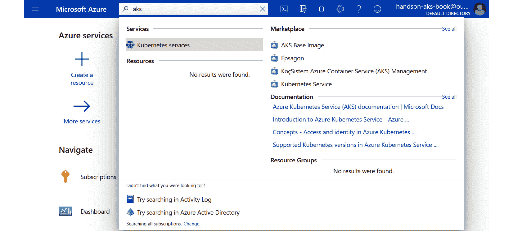

图 2.1:用搜索栏搜索 AKS

这将带您进入门户中的 AKS 窗格。正如您所料，您还没有任何集群。点击+添加按钮创建一个新集群，并选择+添加 Kubernetes 集群选项:

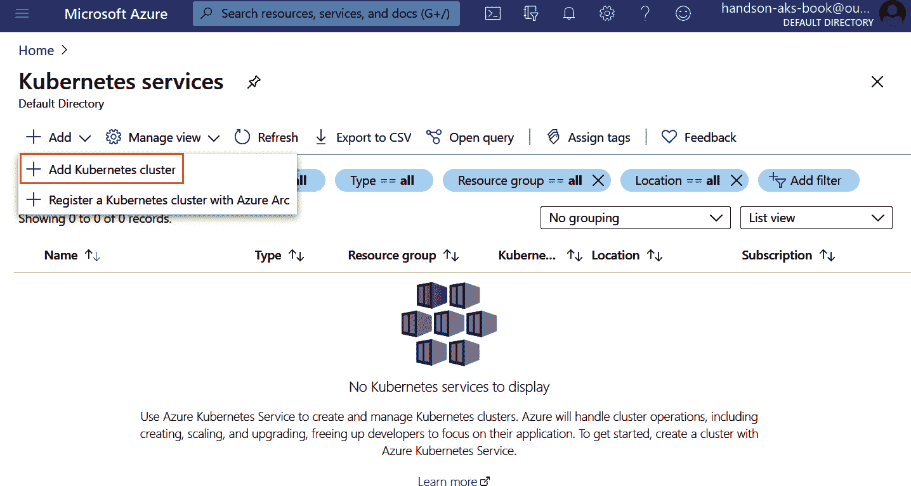

图 2.2:单击+添加按钮和+添加 Kubernetes 集群按钮开始集群创建过程

#### 注意

创建 AKS 集群时，有很多选项可以配置。对于您的第一个集群，我们建议在此示例中坚持门户的默认设置并遵循我们的命名准则。我们测试了以下设置，以便在免费帐户下可靠工作。

这将带您进入创建向导，创建您的第一个 AKS 集群。这里的第一步是创建一个新的资源组。单击新建，为资源组命名，然后单击确定。如果你想跟随本书中的例子，请命名资源组 **rg-handsonaks** :

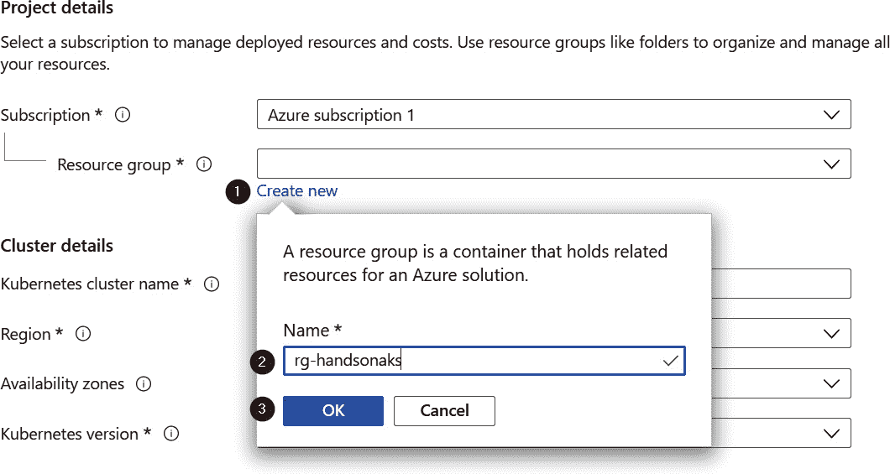

图 2.3:创建新的资源组

接下来，我们将提供集群的详细信息。给你的集群起一个名字——如果你想效仿书中的例子，请称之为**手摇子**。我们将在书中使用的地区是**(美国)美国西部 2** ，但是你可以使用任何靠近你的位置的其他地区。如果您选择的区域支持可用性区域，请取消选择所有区域。

选择一个 Kubernetes 版本——在撰写本文时，1.19.6 版本是支持的最新版本；如果特定版本不适合您，不要担心。Kubernetes 和 AKS 发展非常快，经常会推出新版本:

#### 注意

对于生产环境，建议在可用性区域部署群集。但是，由于我们正在部署一个小型集群，因此不使用可用性区域最适合本书中的示例。

图 2.4:提供集群细节

接下来，将节点计数更改为 2。出于本书演示的目的，默认的**标准 DS2 v2** 节点大小就足够了。这将使您的集群大小看起来类似于*图 2.5* 中所示:

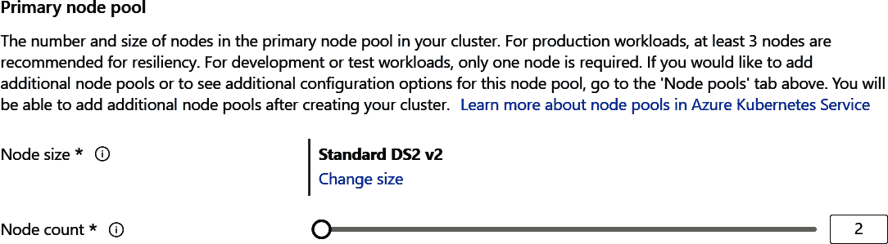

图 2.5:更新的节点大小和节点数

#### 注意

你的免费账户有一个四核限额，如果你继续违约，这个限额就会被突破。

第一个窗格的最终视图应该类似于*图 2.6* 。有许多配置窗格，您不需要为我们将在本书中使用的演示集群进行更改。既然您已经准备好了，请点击“审阅+创建”按钮进行最后的审阅并创建您的集群:

图 2.6:设置集群配置

在最后一个视图中，Azure 将验证应用于第一个集群的配置。如果消息“验证”通过，请单击创建:

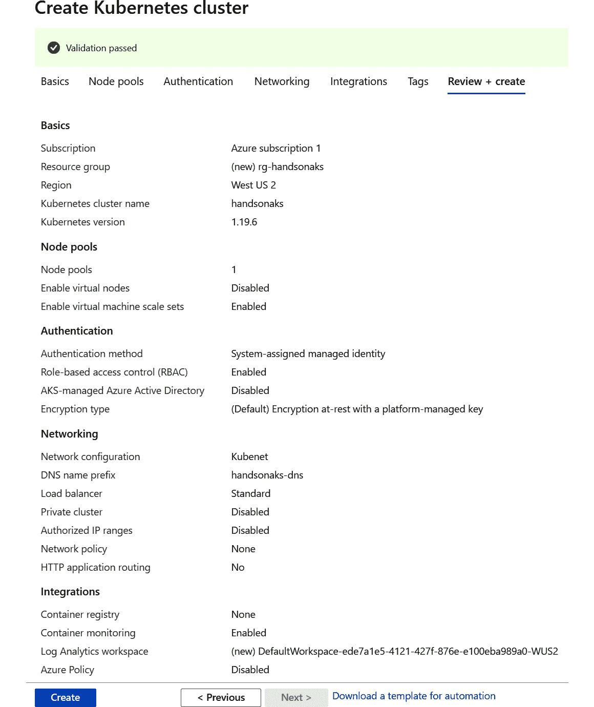

图 2.7:集群配置的最终验证

部署集群大约需要 10 分钟。部署完成后，可以查看部署详情，如图*图 2.8* :

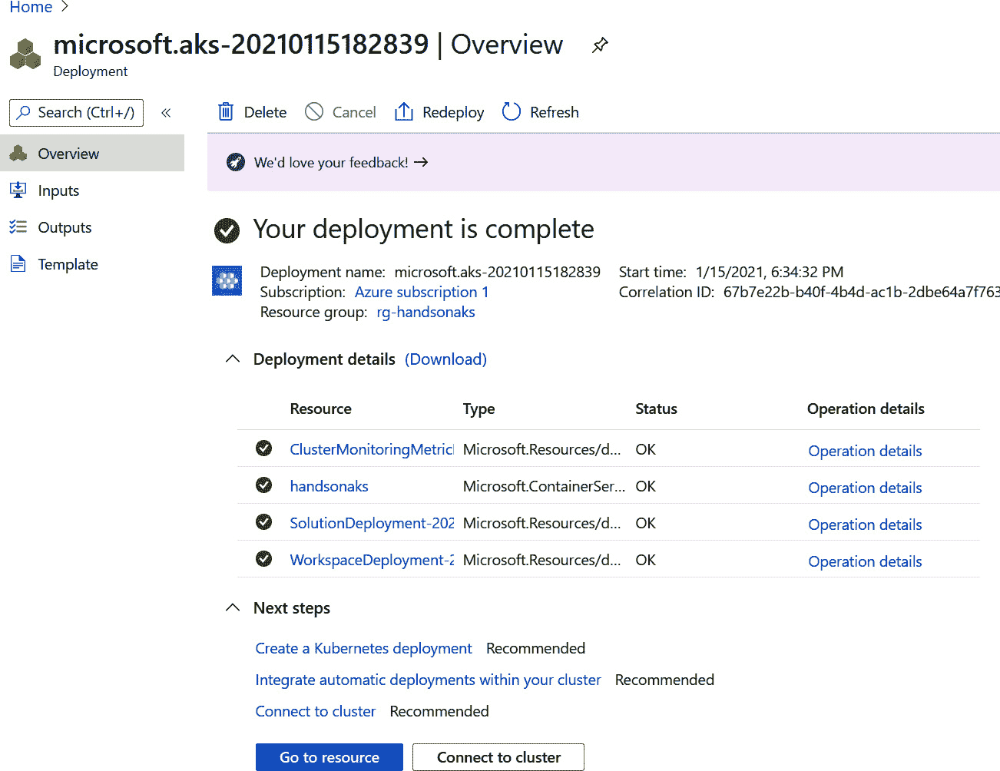

图 2.8:成功部署集群后的部署细节

如果出现额度限制错误，如图*图 2.9* 所示，检查设置后再试。确保选择了标准 DS2 v2 节点大小，并且只有两个节点:

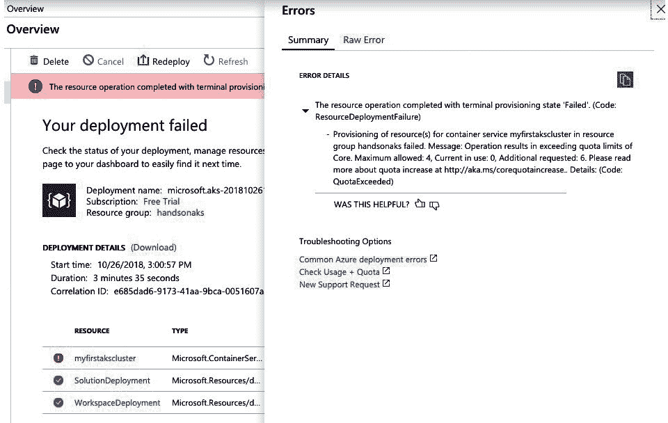

图 2.9:由于配额限制错误，使用较小的群集大小重试

转到下一部分，我们将首先快速了解一下您的集群；点击*图 2.8 所示的转到资源按钮。*这将带您进入门户中的 AKS 集群仪表板。

### 在 Azure 门户中快速浏览您的集群

如果您点击上一节中的转到资源按钮，您将在 Azure 门户中看到集群的概述:

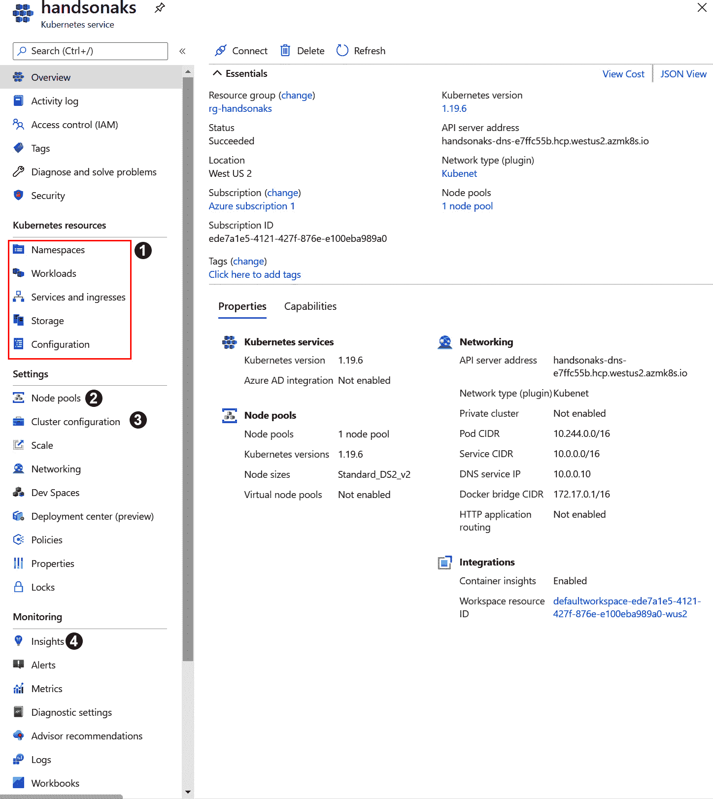

图 2.10:Azure 门户中的 AKS 窗格

这是您的集群的快速概述。它显示名称、位置和应用编程接口服务器地址。左侧的导航菜单提供了控制和管理集群的不同选项。让我们浏览门户提供的几个有趣的选项。

Kubernetes 参考资料部分让您深入了解集群上运行的工作负载。例如，您可以在集群中看到正在运行的部署和正在运行的Pod 。它还允许您在集群上创建新资源。在您将第一个应用部署到 AKS 上之后，我们将在本章的后面使用这一部分。

在“节点池”窗格中，您可以通过添加或删除节点来向上或向下扩展现有的节点池(即集群中的节点或服务器)。您可以添加一个新的节点池，可能具有不同的虚拟机大小，并且还可以单独升级您的节点池。在*图 2.11* 中，可以看到左上角的+ Add 节点池选项，如果选择自己的节点池，顶部栏中的升级和扩展选项也变为可用:

图 2.11:添加、扩展和升级节点池

在集群配置窗格中，您可以指示 AKS 将控制平面升级到较新的版本。通常，在 Kubernetes 升级中，首先升级控制平面，然后单独升级各个节点池。此窗格还允许您启用**基于角色的访问控制** ( **RBAC** )(默认情况下启用)，并可选地将您的集群与 Azure AD 集成。您将在*第 8 章，基于角色的访问控制中了解更多关于 Azure AD 集成的信息:*

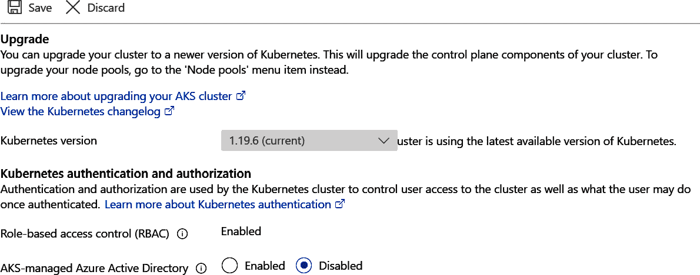

图 2.12:使用升级窗格升级 API 服务器的 Kubernetes 版本

最后，“洞察”窗格允许您监控集群基础架构和集群上运行的工作负载。由于您的集群是全新的，因此没有太多数据需要调查。我们将回到这一点，在*第 7 章*、*监控 AKS 集群和应用*:

图 2.13:使用洞察窗格显示集群利用率

我们对集群和 Azure 门户中一些有趣的配置选项的快速概述到此结束。在下一节中，我们将使用 Cloud Shell 连接到我们的 AKS 集群，然后在这个集群上启动一个演示应用。

### 使用 Azure 云壳访问您的集群

部署成功完成后，找到搜索栏附近的小 Cloud Shell 图标，如图*图 2.14* 中高亮显示，点击:

图 2.14:点击云壳图标打开 Azure 云壳

门户会要求您选择 PowerShell 或 Bash 作为默认的 Shell 体验。由于我们将主要处理 Linux 工作负载，请选择 Bash:

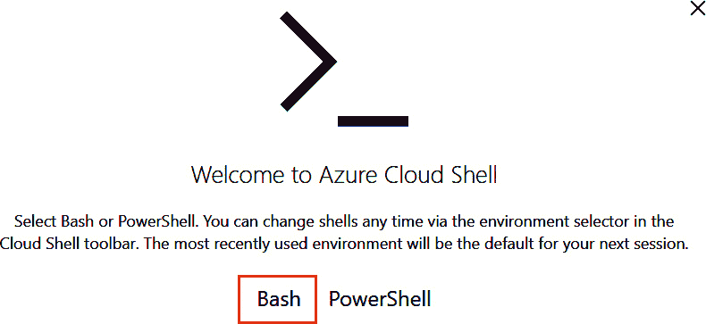

图 2.15:选择 Bash 选项

如果这是您第一次启动 Cloud Shell，系统会要求您创建一个存储帐户；确认并创建它:

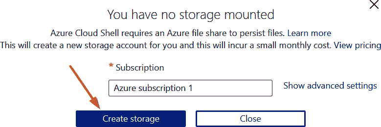

图 2.16:为 Cloud Shell 创建新的存储帐户

创建存储后，您可能会收到包含装载存储错误的错误消息。如果出现这种情况，请重新启动您的云外壳:

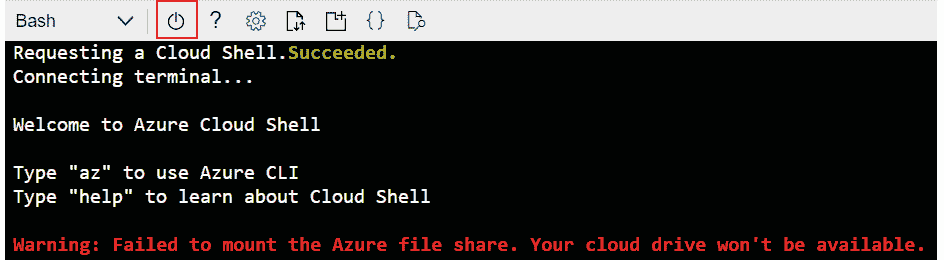

图 2.17:收到装载存储错误时点击重启按钮

点击电源按钮。应该会重启，应该会看到类似*的东西图 2.18* :

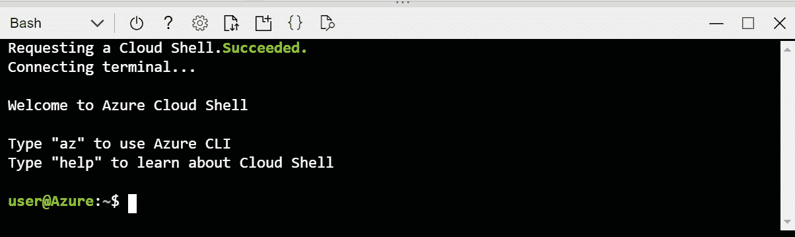

图 2.18:成功启动云外壳

您可以向上或向下拉动分割器/分割器，查看或多或少的外壳:

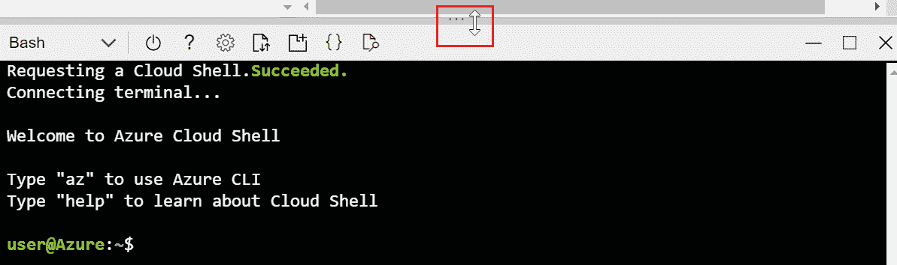

图 2.19:使用分隔线使 Cloud Shell 变大或变小

用于与 Kubernetes 集群接口的命令行工具称为 **kubectl** 。使用 Azure Cloud Shell 的好处是，这个工具和许多其他工具都是预装的，并且会定期维护。 **kubectl** 使用存储在**中的配置文件。kube/config** 存储访问集群的凭证。

#### 注意

Kubernetes 社区中围绕 **kubectl** 的正确发音有一些讨论。常见的发音方式是 *kube-c-t-l* 、 *kube-control* 或*kube-搂抱*。

要获取访问群集所需的凭据，您需要键入以下命令:

az aks 获取凭据\

-资源-组 rg-hand onaks \

-手淫者的名字

#### 注意

在本书中，您通常会看到使用反斜杠符号的较长命令分布在多行上。这有助于提高命令的可读性，同时仍然允许您复制和粘贴它们。如果您正在键入这些命令，您可以安全地忽略反斜杠并在一行中键入完整的命令。

要验证您是否具有访问权限，请键入以下内容:

kubectl 获取节点

你应该会看到类似*的图 2.20* :

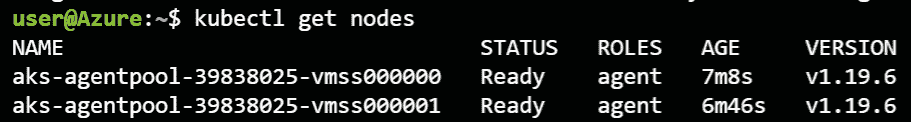

图 2.20:kube CTL 获取节点命令的输出

此命令已验证您可以连接到您的 AKS 集群。在下一节中，您将继续启动您的第一个应用。

### 部署和检查您的第一个演示应用

既然你们都已经连接好了，让我们启动你们的第一个应用。在本节中，您将部署您的第一个应用，并使用 **kubectl** 以及稍后使用 Azure 门户对其进行检查。让我们从部署应用开始。

### 部署演示应用

在本节中，您将部署演示应用。为此，您需要编写一些代码。在 Cloud Shell 中，有两个选项可以编辑代码。您可以通过命令行工具，如 **vi** 或 **nano** 来实现，也可以通过在 Cloud Shell 中键入**代码**命令来使用基于图形用户界面的代码编辑器。在本书中，你将主要被指导使用示例中的图形编辑器，但也可以随意使用你觉得最舒服的任何其他工具。

出于本书的目的，所有代码示例都托管在一个 GitHub 存储库中。您可以将这个存储库克隆到您的 Cloud Shell 中，并直接使用代码示例。要将 GitHub repo 克隆到您的 Cloud Shell 中，请使用以下命令:

git 克隆[https://github . com/PacktPublishing/动手-Kubernetes On-Azure-第三版. git](https://github.com/PacktPublishing/Hands-on-Kubernetes-on-Azure-Third-Edition.git) 动手-Kubernetes On-Azure

要访问本章的代码示例，请导航到代码示例目录，并转到**第 02 章**目录:

cd 动手-Kubernetes-On-Azure/chapter 02/

现在您将直接在**章节 02** 文件夹中使用该代码。在本书的这一点上，你还不会关注代码文件中的内容。本章的目标是启动一个集群并在其上部署一个应用。在接下来的章节中，我们将深入探讨如何构建 Kubernetes 配置文件，以及如何创建自己的配置文件。

您将根据 **azure-vote.yaml** 文件中的定义创建一个应用。要在 Cloud Shell 中打开该文件，您可以键入以下命令:

蓝票，yaml

为了方便起见，下面是代码示例:

1 API version:apps/v1

2 种:部署

3 元数据:

4 名称:蔚蓝-投票-支持

5 规格:

6 个副本:1 个

7 选择器:

8 个匹配标签:

9 app:azure-投票-支持

10 模板:

11 元数据:

12 个标签:

13app:azure-投票支持

14spec:

15 个集装箱:

16-姓名:azure-投票支持

17 图片:背

18 资源:

19 项请求:

20 个 CPU:100 米

21 英里:128 英里

22 个限制:

23 个 CPU:250 公尺

24 英里:256 英里

25 个端口:

26-集装箱港口:6379

27 名:里兹

28 ---

29 堆叠版本:v1

30 公里:服务

31 元数据:

32 名称:蔚蓝-投票-支持

33spec:

34 个端口:

35 端口:6379

36 选择器:

37 app:azure-投票支持

38 ---

39 API version:apps/v1

40 公里:部署

41 元数据:

42 名称:蔚蓝-投票-前线

43spec:

44 个副本:1 个

45 选择器:

46 匹配标签:

47 app:azure-投票-前线

48 模板:

49metadata:

50 个标签:

51app:蔚蓝-投票-前线

52spec:

53 个集装箱:

54-姓名:azure-投票-前线

55 image:Microsoft/azure-投票前沿:v1

56 资源:

57 项请求:

58 个 CPU:100 米

59 英里:128 英里

60 极限:

61 个 CPU:250 公尺

62 英里:256 英里

63 个端口:

64-集装箱港口:80

65env:

66 范名:里兹

67 价值:“天蓝色-投票支持”

68 ---

69 API version:v1

70 公里:服务

71 元数据:

72 名称:蔚蓝-投票-前线

73spec:

74 型:负载平衡器

75 个端口:

76 端口:80

77 选择器:

78 app:azure-投票-前线

您可以在 Cloud Shell 代码编辑器中对文件进行更改。如果您已经进行了更改，您可以通过单击...右上角图标，然后点击【保存】将文件保存为*图 2.21* 高亮显示:

图 2.21:保存 azure-vote.yaml 文件

应该保存该文件。您可以使用以下命令检查这一点:

蓝猫，yaml

#### 注意:

点击*选项卡*按钮，在 Linux 中展开文件名。在前面的场景中，如果在输入 **az** 后点击*标签*，应该会扩展到 **azure-vote.yaml** 。

现在，让我们启动应用:

忽必烈 create-f Azul vote

你应该很快看到如图*图 2.22* 所示的输出，它告诉你已经创建了哪些资源:

图 2.22:kube CTL 创建命令的输出

您已经成功创建了演示应用。在下一节中，您将检查为该应用创建的所有不同的 Kubernetes 对象，并连接到您的应用。

### 探索演示应用

在前一节中，您部署了一个演示应用。在本节中，您将探索 Kubernetes 为此应用创建的不同对象，并连接到它。

您可以通过键入以下命令来检查部署进度:

忽必烈得到 pods

如果您在创建应用后不久键入此内容，您可能已经看到某个 pod 仍在**容器创建**过程中:

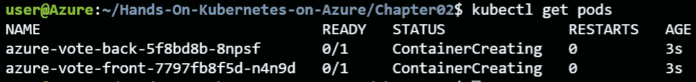

图 2.23:kube CTL get pods 命令的输出

#### 注意

键入 **kubectl** 会变得乏味。您可以使用**别名**命令让您的生活更轻松。可以使用 **k** 代替 **kubectl** 作为别名，命令如下:**别名 k=kubectl** 。运行完前面的命令后，可以直接使用 **k 获取 pods** 。出于本书的教学目的，我们将继续使用完整的 **kubectl** 命令。

点击*向上箭头*键，按*回车*重复 **kubectl 获取Pod **命令，直到所有Pod 的状态为**运行**。设置所有Pod 需要一些时间，您可以使用以下命令来跟踪它们的状态:

忽必烈得到 pods watch

要停止跟踪Pod 的状态(当它们都处于运行状态时)，您可以按下 *Ctrl* + *C* 。

为了公开访问您的应用，您还需要一件事。您需要知道负载平衡器的公共 IP，以便可以访问它。如果你还记得从*第 1 章*、*到容器和 Kubernetes* 的介绍，Kubernetes 中的一个服务将创建一个 Azure 负载平衡器。这个负载平衡器将在您的应用中获得一个公共 IP，这样您就可以公开访问它。

键入以下命令获取负载平衡器的公共 IP:

kubectl 获取服务 azure-投票-前台-观察

首先，外部 IP 可能会显示**待定**。等待公共 IP 出现，然后按 *Ctrl* + *C* 退出:

图 2.24:观察服务 IP 从挂起到实际 IP 地址的变化

记下外部 IP 地址，并在浏览器中键入。您应该会看到类似于*图 2.25* 的输出:

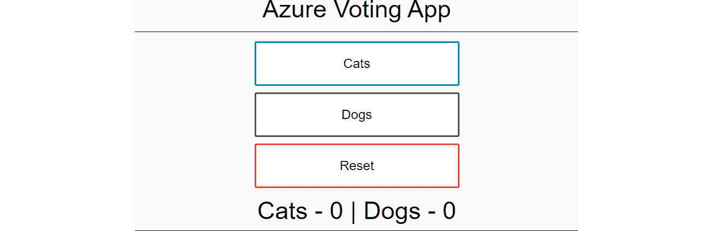

图 2.25:您刚刚启动的实际应用

点击猫或狗，看着计数上升。

要查看 Kubernetes 中为您的应用创建的所有对象，您可以使用 **kubectl get all** 命令。这将显示类似于*图 2.26* 的输出:

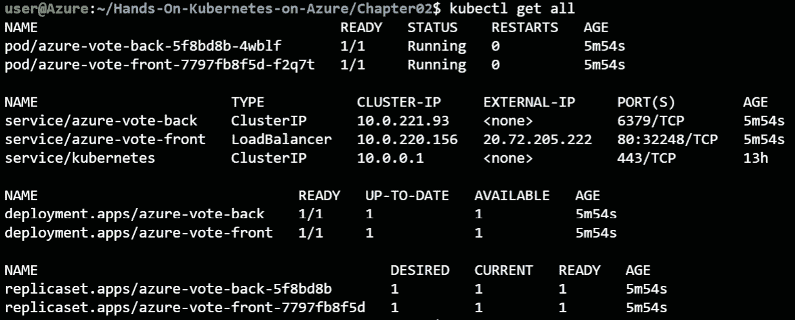

图 2.26:探索为您的应用创建的所有 Kubernetes 对象

如您所见，创建了许多对象:

*   Pod :你会看到两个Pod ，一个用于后端，一个用于前端。
*   服务:您还将看到两个服务，一个用于类型**集群 IP** 的后端，一个用于类型【负载平衡器】的前端。这些类型的含义将在*第 3 章*、*应用在 AKS 上的部署中探讨。*
*   部署:您还将看到两个部署。
*   复制集:最后你会看到两个复制集。

您也可以从 Azure 门户查看这些对象。例如，要查看这两个部署，您可以单击 AKS 窗格左侧导航菜单中的**工作负载**，您将看到集群中的所有部署，如*图 2.27* 所示。此图显示了集群中的所有部署，包括系统部署。在列表的底部，您可以看到自己的部署。从图中还可以看到，您可以使用顶部菜单浏览其他对象，如 pod 和 ReplicaSets:

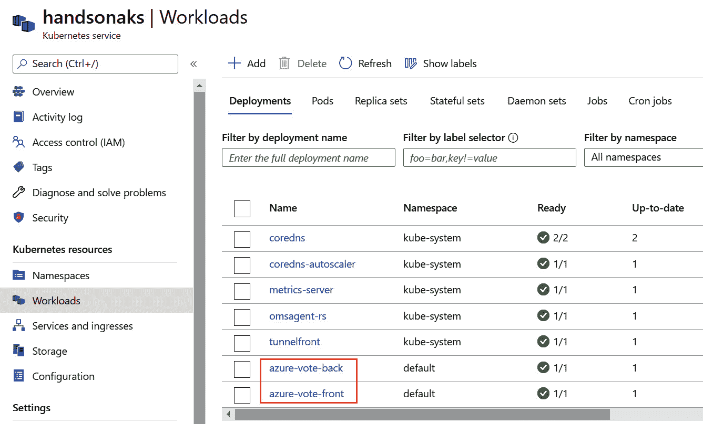

图 2.27:在 Azure 门户中探索应用的两个部署部分

现在，您已经启动了自己的集群和第一个 Kubernetes 应用。请注意，Kubernetes 负责连接前端和后端、将它们暴露给外部世界以及为服务提供存储等任务。

在进入下一章之前，让我们清理一下您的部署。由于您从一个文件创建了所有内容，您也可以通过将 Kubernetes 指向该文件来删除所有内容。键入**kube CTL delete-f azure-vote . YAML**并观看您的所有对象被删除:

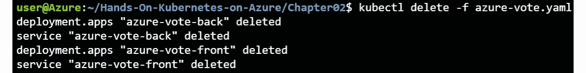

图 2.28:清理应用

在本节中，您已经使用 Cloud Shell 连接到了您的 AKS 集群，成功启动并连接到了一个演示应用，探索了使用 Cloud Shell 和 Azure 门户创建的对象，最后清理了创建的资源。

## 总结

完成本章后，您现在将能够访问和导航 Azure 门户，以执行部署 AKS 集群所需的所有功能。我们利用 Azure 上的免费试用来了解 AKS 的来龙去脉。我们还推出了自己的 AKS 集群，如果需要，可以使用 Azure 门户定制配置。

我们也使用了云壳，没有在电脑上安装任何东西。这对于接下来的所有部分都很重要，在这些部分中，您不仅仅要启动简单的应用。最后，我们推出了一项公众可访问的服务。该应用的框架与我们将在后面章节中介绍的复杂应用的框架相同。

在下一章中，我们将深入研究将应用部署到 AKS 上的不同部署选项。