# 三、AKS 上的应用部署

在本章中，您将在**Azure Kubernetes Service**(**AKS**)上部署两个应用。一个应用由多个部分组成，您将一步一步地构建应用，同时解释它们背后的概念模型。您将能够轻松地调整本章中的步骤，以便在 AKS 上部署任何其他应用。

要部署应用并对其进行更改，您将使用 **YAML** 文件。YAML 是**的递归首字母缩略词，而不是标注语言**。YAML 是一种用于创建配置文件以部署到 Kubernetes 的语言。尽管可以使用 JSON 或 YAML 文件将应用部署到 Kubernetes，但 YAML 是最常用的语言。YAML 之所以受欢迎，是因为与 JSON 或 XML 相比，人类更容易阅读。在这一章和整本书里，你会看到许多 YAML 文件的例子。

在示例留言簿应用的部署过程中，您将看到 Kubernetes 概念的实际应用。您将看到**部署**如何与**副本集**相关联，以及如何与部署的**Pod **相关联。部署是 Kubernetes 中的一个对象，用于定义应用的所需状态。一个**部署**将创建一个复制集。A **复制器 Set** 是 Kubernetes 中的一个对象，保证一定数量的**豆荚**始终可用。因此，复制集将创建一个或多个豆荚。pod 是 Kubernetes 中的一个对象，它是一组一个或多个容器。让我们重新审视部署、复制集和单元之间的关系:

图 3.1:部署、复制集和单元之间的关系

部署示例应用时，您将使用**服务**对象连接到应用。Kubernetes 中的服务是一个用于向应用提供静态 IP 地址和 DNS 名称的对象。由于 pod 可以被终止并移动到集群中的不同节点，因此服务可以确保您可以连接到应用的静态端点。

您还将使用**配置图**编辑示例应用以提供配置详细信息。配置映射是一个对象，用于向 pods 提供配置详细信息。它允许您将配置设置保留在实际容器之外。然后，您可以通过将配置映射连接到部署，将这些配置详细信息提供给应用。

最后，你将被介绍给赫尔姆。Helm 是 Kubernetes 的包管理器，有助于简化部署过程。您将使用 Helm 部署一个 WordPress 站点，并了解 Helm 给 Kubernetes 带来的价值。这个 WordPress 安装利用了 Kubernetes 中的持久存储，您将了解到 AKS 中的持久存储是如何设置的。

本章将涵盖以下主题:

*   逐步部署留言簿示例应用
*   完整部署留言簿示例应用
*   使用 Helm 安装复杂的 Kubernetes 应用

我们将从留言簿应用示例开始。

## 逐步部署样例留言簿应用

在本章中，您将部署经典的留言簿示例 Kubernetes 应用。您将主要按照[https://kubernetes . io/docs/教程/无状态-应用/留言簿/](https://kubernetes.io/docs/tutorials/stateless-application/guestbook/) 中的步骤进行一些修改。您将使用这些修改来显示原始示例中没有的其他概念，例如配置映射。

留言簿示例应用是一个简单的多层 web 应用。该应用中的不同层将有多个实例。这对高可用性和可扩展性都是有益的。留言簿的前端是一个无状态应用，因为前端不存储任何状态。后端的 Redis 集群是有状态的，因为它存储了所有的留言簿条目。

在下一章中，您将使用该应用作为独立测试后端和前端扩展的基础。

在开始之前，让我们考虑一下将要部署的应用。

### 介绍应用

该应用存储并显示留言簿条目。例如，你可以用它来记录所有参观你的酒店或餐馆的人的意见。

*图 3.2* 向您展示了应用的高级概述。应用使用 PHP 作为前端。前端将使用多个副本进行部署。该应用使用 Redis 进行数据存储。Redis 是内存中的键值数据库。Redis 最常用作缓存。

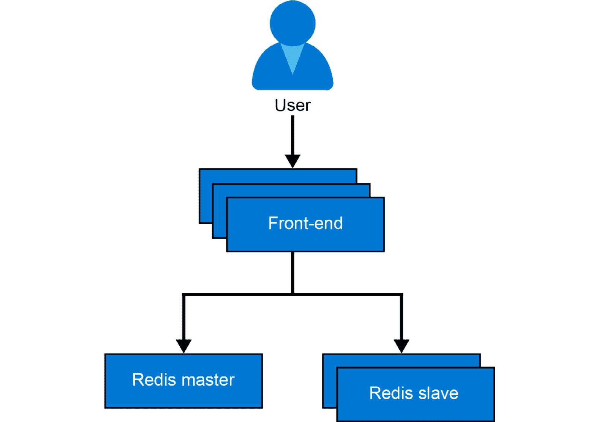

图 3.2:留言簿应用的高级概述

我们将通过部署 Redis 主服务器来开始部署这个应用。

### 部署 Redis 主机

在本节中，您将部署 Redis 主服务器。您将了解此部署所需的 YAML 语法。在下一节中，您将对这个 YAML 进行更改。在进行更改之前，让我们从部署 Redis 主服务器开始。

执行以下步骤来完成任务:

1.  Open your friendly Azure Cloud Shell, as highlighted in *Figure 3.3*:

    

    图 3.3:打开云外壳

2.  If you have not cloned the GitHub repository for this book, please do so now by using the following command:

    git 克隆 https://github . com/PacktPublishing/动手-Kubernetes-on-Azure-第三版/

3.  Change into the directory for Chapter 3 using the following command:

    cd 动手-Kubernetes-On-Azure/chapter 03/

4.  Enter the following command to deploy the master:

    立方结构套用-f redis 主要建置。yaml

    应用下载并开始运行需要一些时间。在您等待的同时，让我们理解您刚刚键入并执行的命令。让我们从探索所使用的 YAML 文件的内容开始(行号用于解释代码片段中的关键元素):

    1 API 版本:apps/v1

    2 种:部署

    3 元数据:

    4 名称:redis master

    5 个标签:

    6 应用:重定向

    7 规格:

    8 选择器:

    9 个匹配标签:

    10 个应用:redis

    11 角色:主人

    12 层:后端

    13 个副本:1 个

    14 模板:

    15 元数据:

    16 个标签:

    17 应用:redis

    18 角色:大师

    19 层:后端

    20 规格:

    21 个容器:

    22 -姓名:主人

    23 图片:k8s gcr . io/redis:e2e

    24 资源:

    25 项请求:

    26 个 CPU:100 米

    27 内存:100 兆

    28 个限制:

    29 个 CPU:250 公尺

    30 内存:1024Mi

    31 个端口:

    32 -容器港口:6379

    让我们逐行深入代码，了解所提供的参数:

    *   **第 2 行**:表示我们正在创建一个部署。正如在*第 1 章，容器和Kubernetes*的介绍中所解释的，一个部署是一个围绕容器的包装器，使得更新和扩展容器变得容易。
    *   **第 4-6 行**:这里**部署**起了个名字，就是**再版主**。
    *   **第 7-12 行**:这些行让我们指定这个部署将要管理的容器。在本例中，部署将选择并管理标签匹配的所有容器(**应用:redis，角色:master，层:后端**)。前面的标签与第 *14-19* 行提供的标签完全匹配。
    *   **第 13 行**:这一行告诉 Kubernetes，我们正好需要一个正在运行的 Redis 主文件的副本。这是 Kubernetes 声明性质的一个关键方面。您提供了您的应用需要运行的容器的描述(在这种情况下，只有一个 Redis 主容器的副本)，Kubernetes 负责处理它。
    *   **第 14-19 行**:这些行给运行的实例添加标签，这样它就可以被分组并连接到其他Pod 。我们将在后面讨论它们，看看它们是如何使用的。
    *   **第 22 行**:这一行给舱内的单个容器起了一个名字，就是**大师**。在多容器容器的情况下，容器中的每个容器都需要唯一的名称。
    *   **第 23 行**:该行表示将要运行的容器图像。在这种情况下，是标记有 **e2e** 的 **redis** 图像(成功通过端到端[ **e2e** ]测试的最新 redis 图像)。
    *   **第 24-30 行**:这些行设置了为容器请求的**CPU/内存**资源。Kubernetes 中的请求是对不能被其他 pods 使用的资源的保留。如果这些资源在集群中不可用，pod 将不会启动。在这种情况下，请求是 0.1 CPU，等于 **100m** ，也常被称为 100 毫核。请求的内存为**100 兆字节**，即 104，857，600 字节，等于~105 兆字节。CPU 和内存限制的设置方式类似。限制是容器可以使用的上限。如果你的Pod 达到了中央处理器的限制，它将被节流，而如果它达到了内存的限制，它将被重启。设置请求和限制是 Kubernetes 的最佳实践。更多信息请参考[https://kubernetes . io/docs/concepts/configuration/manage-compute-resources-container/](https://kubernetes.io/docs/concepts/configuration/manage-compute-resources-container/)。
    *   **第 31-32 行**:这两行表示容器将在港口 **6379** 停靠。

如您所见，部署的 YAML 定义包含几个设置和参数，Kubernetes 将使用它们来部署和配置您的应用。

#### 注意

Kubernetes YAML 的定义类似于给 Docker 的运行特定容器映像的参数。如果必须手动运行，可以用以下方式定义该示例:

**#运行一个名为 master 的容器，在端口 6379 监听，使用 redis:e2e 镜像，有 1 亿内存和 1 亿 CPU。**

**Docker运行名称主-p 6379:6379-m 100M-c 100M-d k8s.gcr.io/redis:e2e**

在本节中，您已经部署了 Redis master，并了解了用于创建此部署的 YAML 文件的语法。在下一节中，您将检查部署并了解所创建的不同元素。

### 检查部署

**再主控**部署现在应该完成了。在上一节中打开的 Azure Cloud Shell 中继续，并键入以下内容:

kubectl get all

您应该会得到类似于*图 3.4* 中显示的输出。在您的例子中，pod 和 ReplicaSet 的名称可能在名称的末尾包含不同的标识。如果您没有看到 pod、部署和复制集，请再次运行上一节步骤 4 中解释的代码。

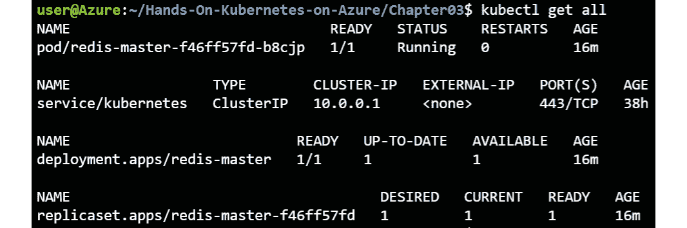

图 3.4:由您的部署创建的对象

您可以看到，您创建了一个名为 **redis-master** 的部署。它控制着一个名为**的复制器。进一步检查，你还会发现复制器正在控制一个Pod ，**redis-master-f46ff 57 FD-b8cjp**。*图 3.1* 用图形表示了这种关系。**

通过执行**kube CTL description<对象> <实例名>** 命令可以获得更多细节，如下所示:

忽必烈描述了部署/重定向主体

这将生成如下输出:

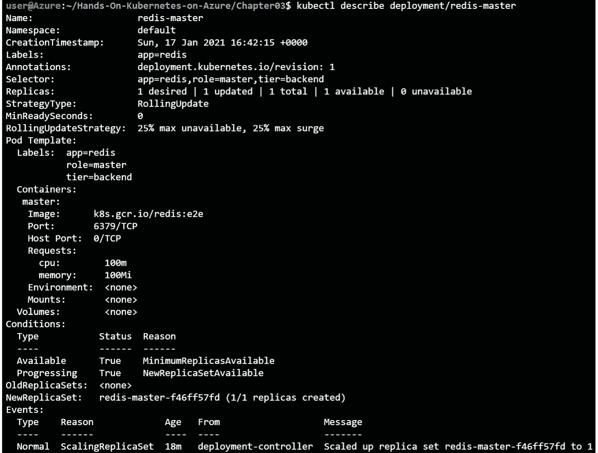

图 3.5:部署描述

现在，您已经使用默认配置启动了一个 Redis 主服务器。通常，您会使用特定于环境的配置启动应用。

在下一节中，您将熟悉一个名为 ConfigMaps 的新概念，然后重新创建 Redis 主服务器。因此，在继续之前，请清理当前版本，这可以通过运行以下命令来完成:

立方结构删除建置/重新导向主要项目

执行此命令将产生以下输出:

deployment.apps "redis-master "已删除

在本节中，您检查了您创建的 Redis 主部署。您看到了部署与复制集之间的关系，以及复制集与Pod 之间的关系。在下一节中，您将使用通过配置映射提供的特定于环境的配置来重新创建这个 Redis 主服务器。

### 用构型图重定向大师

之前的部署没有任何问题。在实际的用例中，很少会在没有一些配置设置的情况下启动应用。在这种情况下，您将使用配置图为**重新设置配置设置。**

配置图是一种配置容器的可移植方式，无需为每个环境提供专门的映像。对于需要在容器上设置的数据，它有一个键值对。配置映射用于非敏感配置。Kubernetes 有一个单独的对象叫做**机密**。机密用于包含密码等关键数据的配置。这将在本书*第 10 章【将机密存储在 AKS* 中】中详细探讨。

在本例中，您将创建一个配置映射。在此配置图中，您将配置 **redis-config** 作为键，值为以下两行:

最大内存 2mb

maxmemory-policy allkeys-lru

现在，让我们创建这个配置映射。有两种方法可以创建配置映射:

*   从文件创建配置映射
*   从 YAML 文件创建配置映射

在接下来的两节中，您将探索这两者。

### 从文件创建配置映射

以下步骤将帮助我们从文件创建配置映射:

1.  Open the Azure Cloud Shell code editor by typing **code redis-config** in the terminal. Copy and paste the following two lines and save the file as **redis-config**:

    最大内存 2mb

    maxmemory-policy allkeys-lru

2.  Now you can create the ConfigMap using the following code:

    kubectl create configmap \

    示例-redis-config-from-file = redis-config

    您应该得到如下输出:

    configmap/example-redis-config 已创建

3.  You can use the same command to describe this ConfigMap:

    忽必烈描述了 configmap/example-redis-config

    输出如*图 3.6* 所示:

图 3.6:配置图的描述

在本例中，您通过引用磁盘上的文件创建了配置映射。部署配置映射的另一种方法是从 YAML 文件创建它们。让我们在下一节中看看如何做到这一点。

### 从 YAML 文件创建配置映射

在本节中，您将使用 YAML 文件重新创建上一节中的配置映射:

1.  To start, delete the previously created ConfigMap:

    忽必烈删除 configmap/example-redis-config

2.  Copy and paste the following lines into a file named **example-redis-config.yaml**, and then save the file:

    1 堆叠版本:v1

    2 数据:

    3 重定向-配置:|-

    4 最大内存 2mb

    5 maxmemory-policy allkeys-lru

    6 子项:ConfigMap

    7 元数据:

    8 名称:example-redis-config

3.  You can now create your ConfigMap via the following command:

    忽必烈 create-f example-redis-config . YAML

    您应该得到如下输出:

    configmap/example-redis-config 已创建

4.  Next, run the following command:

    忽必烈描述了 configmap/example-redis-config

    该命令返回与前一条相同的输出，如图*图 3.6* 所示。

如您所见，使用 YAML 文件，您能够创建相同的配置映射。

#### 注意

**kubectl get** 有有用的 **-o** 选项，可以用来获取 YAML 或 JSON 中对象的输出。当您对系统进行了手动更改并希望看到 YAML 格式的结果对象时，这非常有用。您可以使用以下命令获取 YAML 的当前配置图:

**立方得到-o YAML config map/example-redis config**

现在您已经定义了配置映射，让我们使用它。

### 使用配置映射读入配置数据

在本节中，您将重新配置 **redis-master** 部署，以从配置图中读取配置:

1.  To start, modify **redis-master-deployment.yaml** to use the ConfigMap as follows. The changes you need to make will be explained after the source code:

    1 API 版本:apps/v1

    2 种:部署

    3 元数据:

    4 名称:redis master

    5 个标签:

    6 应用:重定向

    7 规格:

    8 选择器:

    9 个匹配标签:

    10 个应用:redis

    11 角色:主人

    12 层:后端

    13 个副本:1 个

    14 模板:

    15 元数据:

    16 个标签:

    17 应用:redis

    18 角色:大师

    19 层:后端

    20 规格:

    21 个容器:

    22 -姓名:主人

    23 图片:k8s gcr . io/redis:e2e

    24 命令:

    25 - redis 服务器

    26-" redis-master/redis . conf "

    27 环境:

    28 -姓名:MASTER

    29 值:“真”

    30 卷安装:

    31 - mountPath: /redis 主服务器

    32 名称:配置

    33 资源:

    34 项请求:

    35 个 CPU:100 米

    36 内存:100 兆

    37 个端口:

    38 -容器港口:6379

    39 卷:

    40 -名称:配置

    41 configMap:

    42 名称:example-redis-config

    43 项:

    44 键:redis-config

    45 路径:redis.conf

    #### 注意

    如果你下载了这本书附带的源代码，在*第三章【AKS 上的应用部署】*中有一个名为**redis-master-deployment _ modified . YAML**的文件，对其进行了必要的修改。

    让我们深入研究代码，了解不同的部分:

    *   **第 24-26 行**:这些行引入了一个命令，当你的Pod 启动时，这个命令将被执行。在这种情况下，这将启动指向特定配置文件的 **redis 服务器**。
    *   **第 27-29 行**:这些行显示了如何将配置数据传递给你的运行容器。此方法使用环境变量。在 Docker 形式中，这相当于**Docker run-e“MASTER = true”。-名称 master-p 6379:6379-m 100M-c 100M-d Kubernetes/redis:v1**。这将环境变量**主**设置为**真**。您的应用可以读取其配置的环境变量设置。
    *   **第 30-32 行**:这些行将名为**配置**的卷(该卷在第 39-45 行中定义)安装在运行容器的 **/redis-master** 路径上。它将隐藏原始容器上 **/redis-master** 上的任何内容。
    *   用 Docker 术语来说，它相当于**Docker run-v config:/redis-master。-e "MASTER=TRUE" -名称 MASTER-p 6379:6379-m 100M-c 100M-d Kubernetes/redis:v1**。
    *   **第 40 行**:这给该卷命名为**配置**。该名称将在此 pod 的上下文中使用。
    *   **第 41-42 行**:声明应该从**示例-redis-config** 配置图加载该卷。该配置映射应该已经存在于系统中。你已经定义了这个，所以你是好的。
    *   **第 43-45 行**:这里，您正在将 **redis-config** 键(两行 **maxmemory** 设置)的值加载为 **redis.conf** 文件。

通过将配置映射添加为卷并装载该卷，您可以加载动态配置。

1.  Let's create this updated deployment:

    kube CTL create-f redis-master-deployment _ modified . YAML

    这将输出以下内容:

    deployment.apps/redis-master 创造了

2.  Let's now make sure that the configuration was successfully applied. First, get the pod's name:

    忽必烈得到 pods

    这将返回类似于图 3.7 的输出:

    

    图 3.7:Pod 的细节

3.  Then **exec** into the pod and verify that the settings were applied:

    kubi KL exec-it redis-master-<pod-id>redis-CLI</pod-id>

    这将打开一个与运行窗格的 **redis-cli** 会话。现在您可以获得 **maxmemory** 配置:

    配置获取最大内存

    然后就可以得到 **maxmemory-policy** 配置:

    配置获取最大内存-策略

    这会给你一个类似于*图 3.8* 的输出:

    

    图 3.8:验证 pod 中的 Redis 配置

4.  要离开 Redis 外壳，键入**退出**命令。

总而言之，您刚刚完成了配置云原生应用的一个重要部分，即向应用提供动态配置数据。您还会注意到，应用必须配置为动态读取配置。使用配置设置应用后，您访问了一个运行容器来验证运行配置。在本书中，您将经常使用这种方法来验证运行应用的功能。

#### 注意

使用 **kubectl exec** 命令连接到正在运行的容器对于故障排除和进行诊断非常有用。由于容器的短暂性，您不应该连接到容器来进行额外的配置或安装。这应该是您通过 Kubernetes 提供的容器映像或配置的一部分(就像您刚刚做的那样)。

在本节中，您将 Redis 主服务器配置为从配置映射加载配置数据。在下一节中，我们将部署端到端应用。

## 完成样本留言簿应用的部署

为了理解使用 ConfigMap 的应用的动态配置，我们走了一段弯路，现在将返回到留言簿应用的其余部分的部署。您将再次遇到部署、复制集和单元的概念。除此之外，还将向您介绍另一个关键概念，称为服务。

为了开始完整的部署，我们将创建一个服务来公开 Redis 主服务。

### 暴露 Redis 主服务

当在普通 Docker 中公开一个端口时，公开的端口受限于它运行的主机。使用 Kubernetes 网络，集群中的不同Pod 之间可以实现网络连接。然而，豆荚本身本质上是短暂的，这意味着它们可以关闭、重启，甚至移动到其他主机，而无需维护它们的 IP 地址。如果您要直接连接到一个 pod 的 IP，如果该 pod 被移动到新的主机，您可能会失去连接。

Kubernetes 提供了**服务**对象，处理这个确切的问题。使用标签匹配选择器，它将流量发送到正确的Pod 。如果有多个 pod 为一项服务提供流量，它还会进行负载平衡。在这种情况下，主节点只有一个 pod，因此它只是确保流量被定向到独立于 pod 运行节点的 pod。要创建服务，请运行以下命令:

立方结构套用-f redis 主要服务。yaml

**redis-master-service . YAML**文件包含以下内容:

1 堆叠版本:v1

2 种:服务

3 元数据:

4 名称:redis master

5 个标签:

6 应用:重定向

7 角色:主人

第 8 层:后端

9 规格:

10 个端口:

11 端口:6379

12 目标端口：6379

13 选择器:

14 应用:redis

15 角色:大师

16 层:后端

现在让我们看看您使用前面的代码创建了什么:

*   **第 1-8 行**:这些行告诉 Kubernetes 我们想要一个叫做 **redis-master** 的服务，它和我们的 **redis-master** 服务器 pod 有着相同的标签。
*   **第 10-12 行**:这些行表示服务应该处理到达港口 **6379** 的流量，并将其转发到与第 13 行和第 16 行之间定义的选择器相匹配的Pod 的港口 **6379** 。
*   **13-16 号线**:这些线是用来寻找需要发送进来的流量的Pod 的。因此，任何标签匹配的 pod(**app:redis，角色:主和层:后端**)都有望处理端口 **6379** 流量。如果您回顾前面的示例，这些正是我们应用于该部署的标签。

您可以通过运行以下命令来检查服务的属性:

忽必烈得到服务

这将为您提供如图 3.9 所示的输出:

图 3.9:创建的服务的属性

您会看到一个名为 **redis-master** 的新服务已经创建。它拥有 **10.0.106.207** 的集群知识产权(在您的情况下，知识产权可能会有所不同)。请注意，该 IP 仅在集群内有效(因此称为**集群 IP** 类型)。

#### 注意

您现在正在创建类型为**集群 IP** 的服务。还有其他类型的服务，这将在本章后面介绍。

一项服务还为该服务引入了一个**域名服务器** ( **域名系统**)名称。域名的形式为 **<服务名>。<命名空间>. SVC . cluster . local**；在这种情况下，应该是**redis-master . default . SVC . cluster . local**。为了看到这一点，我们将在 **redis-master** pod 上进行名称解析。默认图像没有安装 **nslookup** ，所以我们将通过运行 **ping** 命令来绕过它。如果流量没有返回，不要担心；这是因为你没有在你的服务上暴露 **ping** ，只有 **redis** 端口。但是，该命令对于查看完整的域名和名称解析工作非常有用。我们来看看:

忽必烈得到 pods

#注意你的 redis-master pod 的名称

忽必烈执行-it 重定向大师-<pod-id>bash</pod-id>

ping redis 主节点

这会输出结果名称解析，向您显示您的服务的**完全合格域名** ( **FQDN** )和之前显示的 IP 地址。按下 *Ctrl* + *C* 可以停止 ping 命令的运行。可以通过**退出**命令退出Pod ，如图*图 3.10* :

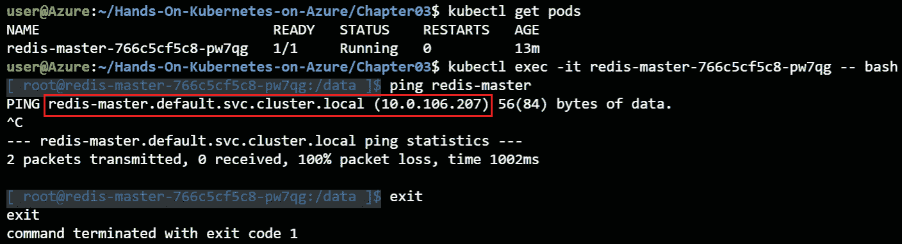

图 3.10:使用 ping 命令查看服务的 FQDN

在本节中，您使用服务公开了 Redis 主文件。这确保了即使 pod 移动到不同的主机，也可以通过服务的 IP 地址到达它。在下一节中，您将部署 Redis 副本，这有助于处理更多的读取流量。

### 部署 Redis 副本

不建议在云上运行单个后端。您可以在领导者-追随者(主从)设置中配置 Redis。这意味着您可以有一个主服务器来处理写流量，还有多个副本服务器来处理读流量。这对于处理增加的读取流量和高可用性非常有用。

让我们设置一下:

1.  Create the deployment by running the following command:

    kubicl apply-f redis 复制部署. yaml

2.  Let's check all the resources that have been created now:

    kubectl get all

    输出如*图 3.11* 所示:

    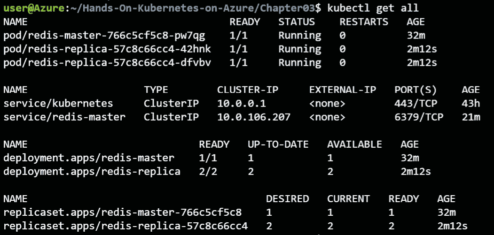

    图 3.11:部署 Redis 副本会创建许多新对象

3.  Based on the preceding output, you can see that you created two replicas of the **redis-replica** pods. This can be confirmed by examining the **redis-replica- deployment.yaml** file:

    1 API 版本:apps/v1

    2 种:部署

    3 元数据:

    4 名称:redis-复制

    5 个标签:

    6 应用:重定向

    7 规格:

    8 选择器:

    9 个匹配标签:

    10 个应用:redis

    11 角色:副本

    12 层:后端

    13 个副本:2 个

    14 模板:

    15 元数据:

    16 个标签:

    17 应用:redis

    18 角色:副本

    19 层:后端

    20 规格:

    21 个容器:

    22 -名称:复制品

    23 图片:gcr . io/Google-samples/GB-redis-follower:v1 24 资源:

    25 项请求:

    26 个 CPU:100 米

    27 内存:100 兆

    28 环境:

    29 -名称:GET_HOSTS_FROM

    30 值:dns

    31 个端口:

    32 -容器港口:6379

    除了以下几点，一切都一样:

    *   **第 13 行**:复制品数量为 2 个。
    *   **第 23 行**:你现在使用的是一个特定的副本(随从)形象。
    *   **第 29-30 行**:设置 **GET_HOSTS_FROM** 到 **dns** 。这是一个设置，指定 Redis 应该使用 DNS 获取主机的主机名。

    如您所见，这类似于您之前创建的 Redis 主文件。

4.  Like the master service, you need to expose the replica service by running the following:

    kubicl apply-f redis 复制服务。yaml

    该服务与 **redis-master** 服务的唯一区别在于，该服务将流量代理到具有**角色:副本**标签的豆荚。

5.  Check the **redis-replica** service by running the following command:

    忽必烈得到服务

    这应该会给你显示在*图 3.12* 中的输出:

图 3.12:Redis master 和 redis 复制服务

现在，您已经有了一个运行的 Redis 集群，它有一个主集群和两个副本集群。在下一节中，您将部署并公开前端。

### 展开并露出前端

到目前为止，您一直专注于 Redis 后端。现在，您已经准备好部署前端了。这将为您的应用添加一个您可以与之交互的图形网页。

您可以使用以下命令创建前端:

kubectl apply -f 前端-deployment.yaml

要验证部署，请运行以下命令:

忽必烈得到 pods

这将显示如图 3.13 所示的输出:

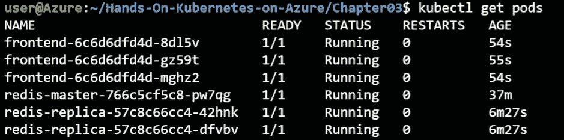

图 3.13:验证前端部署

您会注意到这个部署指定了 **3** 副本。部署有一些通常的方面，只做了一些小的更改，如下面的代码所示:

1 API 版本:apps/v1

2 种:部署

3 元数据:

4 名称:前端

5 个标签:

6 应用:留言簿

7 规格:

8 选择器:

9 个匹配标签:

10 款应用:留言簿

11 层:前端

12 个副本:3 个

13 模板:

14 元数据:

15 个标签:

16 应用:留言簿

17 层:前端

18 规格:

19 个容器:

20 -名称:php-redis

21 图片:gcr.io/google-samples/gb-frontend:v4

22 资源:

23 项请求:

24 个 CPU:100 公尺

25 内存:100 兆

26 环境:

27 -名称:GET_HOSTS_FROM

28 数值:环境

29 -名称:REDIS_SLAVE_SERVICE_HOST

30 value:redis-复制

31 个端口:

32 -容器港口:80

让我们看看这些变化:

*   **第 11 行**:副本计数设置为 3。
*   **8-10、14-16 线**:标签设置为 **app:留言簿**、**层:前端**。
*   **第 20 行**:**GB-前端:v4** 作为图像。

您现在已经创建了前端部署。您现在需要将其作为服务公开。

### 公开前端服务

定义 Kubernetes 服务有多种方法。我们创建的两个 Redis 服务属于类型**集群 IP** 。这意味着它们暴露在只能从集群到达的 IP 上，如图 3.14*所示:*

图 3.14:集群 IP 类型的 Kubernetes 服务

另一种服务类型是**节点端口**类型。通过连接到节点的 IP 和指定的端口，可以从群集外部访问节点端口类型的服务。该服务公开在每个节点的静态端口上，如图 3.15*所示:*

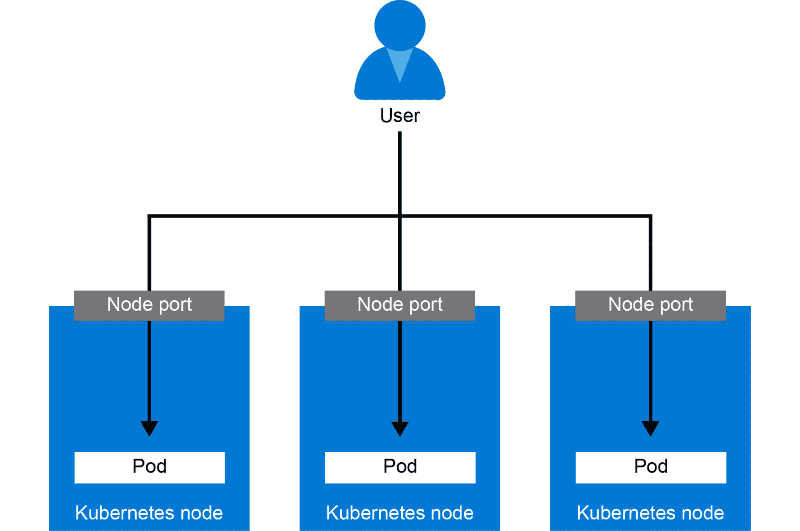

图 3.15:node port 类型的固定服务

最后一种类型——将在本例中使用——是**负载平衡器**类型。这将创建一个 **Azure 负载平衡器**，它将获得一个您可以用来连接的公共 IP，如*图 3.16* 所示:

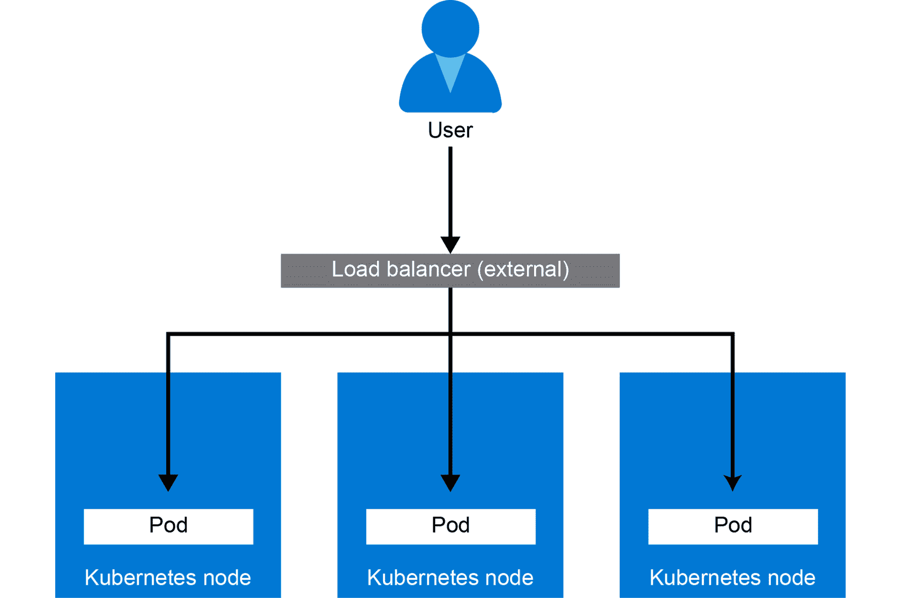

图 3.16:load balancer type 服务

以下代码将帮助您理解前端服务是如何公开的:

1 堆叠版本:v1

2 种:服务

3 元数据:

4 名称:前端

5 个标签:

6 应用:留言簿

7 层:前端

8 规格:

9 类型:负载平衡器#行未注释

10 个端口:

11 端口:80

12 选择器:

13 应用:留言簿

14 层:前端

除了在*第 9 行*中定义了**类型:负载均衡器**之外，这个定义与您之前创建的服务类似。这将创建该类型的服务，这将导致 AKS 向 Azure 负载平衡器添加规则。

现在，您已经看到了前端服务是如何公开的，让我们按照以下步骤准备好留言簿应用:

1.  To create the service, run the following command:

    忽必烈 create -f 前端服务. yaml

    当您第一次运行该步骤时，它需要一些时间来执行。在后台，Azure 必须执行几个动作来实现无缝连接。它必须创建一个 Azure 负载平衡器和一个公共 IP，并设置端口转发规则，将端口 **80** 上的流量转发到集群的内部端口。

2.  Run the following until there is a value in the **EXTERNAL-IP** column:

    忽必烈得到服务-w

    这将显示如图 3.17 所示的输出:

    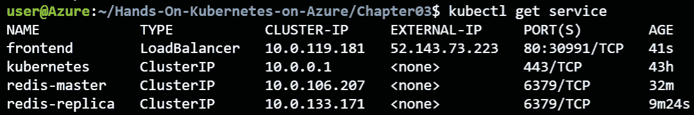

    图 3.17:外部 IP 值

3.  在 Azure 门户中，如果您单击所有资源并在负载平衡器上进行过滤，您将看到一个 kubernetes 负载平衡器。点击显示类似*图 3.18* 的内容。突出显示的部分向您展示了**端口 80** 上有一个接受流量的负载平衡规则，并且您有两个公共 IP 地址:

图 3.18:Azure 门户中的 kubernetes 负载平衡器

如果您点击两个公共 IP 地址，您将看到两个 IP 地址都链接到您的集群。其中之一将是您实际前端服务的 IP 地址；另一个被 AKS 用来建立出站连接。

#### 注意

Azure 有两种类型的负载平衡器:基本的和标准的。

基本负载平衡器后面的虚拟机无需任何特定配置即可建立出站连接。标准负载平衡器后面的虚拟机(现在是 AKS 的默认值)需要负载平衡器上的出站规则来建立出站连接。这就是为什么您会看到配置了第二个 IP 地址。

你终于准备好看你的留言簿应用了！

### 留言簿应用正在运行

在您最喜欢的浏览器中键入服务的公共 IP。你应该得到如图 3.19 所示的输出:

图 3.19:留言簿应用正在运行

请记录您的留言。他们会得救的。打开另一个浏览器，键入相同的 IP；您将看到您键入的所有消息。

恭喜–您已经完成了第一个完全部署的多层云原生 Kubernetes 应用！

为了节省免费试用虚拟机上的资源，最好使用以下命令删除创建的部署以运行下一轮部署:

忽必烈删除部署前端 redis master redis 复制

忽必烈删除服务前端 redis master redis 复制

在前面几节中，您已经部署了一个 Redis 集群，并部署了一个可公开访问的 web 应用。您已经了解了部署、复制集和 pod 是如何链接的，并且了解了 Kubernetes 如何使用**服务**对象来路由网络流量。在本章的下一节中，您将使用 Helm 在 Kubernetes 之上部署一个更复杂的应用。

## 使用 Helm 安装复杂的 Kubernetes 应用

在前一节中，您使用了静态 YAML 文件来部署应用。当跨多个环境(如开发/测试/生产)部署更复杂的应用时，手动编辑每个环境的 YAML 文件会变得很麻烦。这就是 Helm 工具的用武之地。

Helm 是 Kubernetes 的包管理器。Helm 帮助您大规模部署、更新和管理 Kubernetes 应用。为此，你写了一些叫做赫尔姆图表的东西。

您可以将 Helm Charts 视为参数化的 Kubernetes YAML 文件。如果您考虑一下我们在上一节中编写的Kubernetes YAML 文件，这些文件是静态的。您需要进入文件并编辑它们以进行更改。

Helm Charts 允许您编写带有某些参数的 YAML 文件，您可以动态设置这些参数。在部署图表时，可以通过值文件或作为命令行变量来设置参数。

最后，有了 Helm，不一定非要自己写 Helm Charts 您还可以使用丰富的预写 Helm Charts 库，并通过简单的命令(如**Helm install-name my-release stable/MySQL**)在集群中安装流行软件。

这正是您在下一部分要做的事情。您将通过只发出两个命令在集群上安装 WordPress。在接下来的章节中，您还将深入到您将编辑的自定义掌舵图。

#### 注意

2019 年 11 月 13 日，Helm v3 第一个稳定版本发布。在下面的例子中，我们将使用 Helm v3。Helm v2 和 Helm v3 最大的区别在于，Helm v3 是一个完全客户端的工具，不再需要名为 **Tiller** 的服务器端工具。

让我们从使用 Helm 在集群上安装 WordPress 开始。在本节中，您还将了解 Kubernetes 中的持久存储。

### 使用 Helm 安装 WordPress

正如在介绍中提到的，Helm 拥有丰富的预写 Helm 图表库。要访问该库，您必须向 Helm 客户端添加一个回购:

1.  Add the repo that contains the stable Helm Charts using the following command:

    头盔 repo 添加 bitnami \

      https://charts.bitnami.com/bitnami

2.  To install WordPress, run the following command:

    头盔安装手电 wp bitnami/wordpress

    此执行将导致 Helm 安装详细位于[https://github . com/bitnami/charts/tree/master/bitnami/WordPress](https://github.com/bitnami/charts/tree/master/bitnami/wordpress)的图表。

赫尔姆需要一些时间来安装和网站上线。让我们来看一个关键概念，当网站加载时**persistentvolumeclasses**。在介绍完这些之后，我们将回头看看您创建的网站。

### PersistentVolumeClaims

典型的过程需要计算、内存、网络和存储。在留言簿示例中，我们看到了 Kubernetes 如何帮助我们抽象计算、内存和网络。相同的 YAML 文件适用于所有云提供商，包括面向公众的负载平衡器的云特定设置。WordPress 示例展示了最后一部分，即存储，是如何从底层云提供商中抽象出来的。

在这种情况下，WordPress Helm Chart 依赖于 Mariadb Helm Chart([https://github . com/bitnami/charts/tree/master/bitnami/Mariadb](https://github.com/bitnami/charts/tree/master/bitnami/mariadb))进行数据库安装。

与我们的前端等无状态应用不同，MariaDB 需要小心处理存储。为了让 Kubernetes 处理有状态的工作负载，它有一个名为**statefleset**的特定对象。statefolset([https://kubernetes . io/docs/concepts/workloads/controller/statefolset/](https://kubernetes.io/docs/concepts/workloads/controllers/statefulset/))就像一个具有额外订购能力的部署，以及 pods 的独特性。这意味着 Kubernetes 将确保豆荚和它的存储保持在一起。StatefulSet 帮助的另一种方式是对 StatefulSet 中的荚进行一致的命名。豆荚名为 **<豆荚名> -#** ，其中第一个豆荚的 **#** 从 **0** 开始，第二个豆荚的 **1** 结束。

运行以下命令，您可以看到 MariaDB 附加了一个可预测的数字，而 WordPress 部署的末尾附加了一个随机数:

忽必烈得到 pods

这将产生如图 3.20 所示的输出:

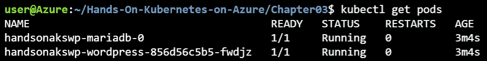

图 3.20:马里亚数据库和 WordPress Pod 上的数字

相对于状态集单元，编号强化了部署单元的短暂性。

另一个不同是如何处理 pod 删除。当一个部署容器被删除时，Kubernetes 将在它能启动的任何地方再次启动它，而当一个 StatefulSet 容器被删除时，Kubernetes 将只在它运行的节点上重新启动它。只有当节点从 Kubernetes 集群中移除时，它才会重新定位 pod。

通常，您会希望将存储附加到状态集。为了实现这一点，一个状态集合需要一个**持久卷** ( **PV** )。该卷可以由许多机制支持(包括块，如 Azure Blob、EBS 和 iSCSI，以及网络文件系统，如 AFS、NFS 和 GlusterFS)。状态集需要由**持久卷声明** ( **聚氯乙烯**)处理的预调配卷或动态调配卷。聚氯乙烯允许用户动态请求存储，这将导致光伏被创建。

详情请参考[https://kubernetes . io/docs/concepts/storage/persistent-volumes/](https://kubernetes.io/docs/concepts/storage/persistent-volumes/)。

在这个 WordPress 例子中，你使用的是一个聚氯乙烯。聚氯乙烯提供了对底层存储机制的抽象。让我们通过运行以下内容来看看马里亚数据库掌舵图做了什么:

忽必烈得到 state fulset-o YAML > mariadbss . YAML

mariadbss . yaml 代码

在前面的命令中，您获得了创建的 StatefulSet 的 YAML 定义，并将其存储在名为 **mariadbss.yaml** 的文件中。让我们看看 YAML 文件中最相关的部分。代码已被截断，只显示最相关的部分:

1 堆叠版本:v1

2 个项目:

3-API 版本:apps/v1

4 种:状态集

...

285 卷安装:

286 - mountPath: /bitnami/mariadb

287 名称:数据

...

306 volumeClaimTemplates:

307 - apiVersion: v1

308 子级：持久性卷索赔

309 元数据:

310 创建时间标记:空

311 标签:

312 app.kubernetes.io/component:小学

313 应用Kubernetes特. io/instance:handonakswp

314 立方结构应用程式。我/名称:mariadb

315 名称:数据

316 规格:

317 种接入模式:

318 -读写一次

319 资源:

320 项请求:

321 存储:8Gi

322 卷模式:文件系统

...

前面代码的大部分元素已经在前面的部署中介绍过了。在以下几点中，我们将强调关键的区别，来看一下聚氯乙烯:

#### 注意

聚氯乙烯可以被任何豆荚使用，而不仅仅是州级豆荚。

让我们详细讨论一下前面代码的不同元素:

*   **第 4 行**:此行表示**状态设置**申报。
*   **第 285-287 行**:这些行挂载定义为**数据**的卷，并将其挂载到 **/bitnami/mariadb** 路径下。
*   **第 306-322 行**:这些行申报 PVC。特别注意:
    *   **315 线**:该线命名为**数据**，在*285 线*重复使用。
    *   **第 318 行**:该行给出了访问模式**读写一次**，这将创建块存储，在 Azure 上是一个磁盘。还有其他访问模式，即 **ReadOnlyMany** 和**读写多**。顾名思义，一个**读写一次**卷只能连接到一个豆荚，而一个**读写一次**或**读写多次**卷可以同时连接到多个豆荚。后两种类型需要不同的底层存储机制，如 Azure 文件或 Azure Blob。
    *   **第 321 行**:该行定义了盘的大小。

基于前面的信息，Kubernetes 动态地请求一个 8 GiB 的卷并将其绑定到这个 pod。在这种情况下，将使用 Azure 磁盘支持的默认动态存储资源调配程序。创建群集时，Azure 设置了动态置备程序。要查看集群上可用的存储类，可以运行以下命令:

忽必烈得到 storageclass

这将向您显示类似于图 3.21 的输出:

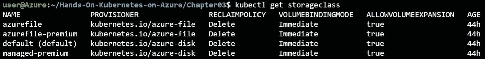

图 3.21:集群中不同的存储类别

通过运行以下命令，我们可以获得有关聚氯乙烯的更多详细信息:

立方结构得到 pvc

生成的输出显示在*图 3.22* 中:

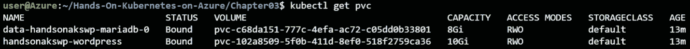

图 3.22:集群中的不同物理卷

当我们在 StatefulSet 描述(*第 128-143 行*)中请求存储时，Kubernetes 执行了特定于 Azure 磁盘的操作，以获得具有 8gb 存储空间的 Azure 磁盘。如果您复制 PVC 的名称并将其粘贴到 Azure 搜索栏中，您应该会找到创建的磁盘:

图 3.23:将磁盘链接到聚氯乙烯

聚氯乙烯的概念抽象了云提供商的存储细节。这允许相同的 Helm 模板在 Azure、AWS 或 GCP 上工作。在 AWS 上，它将由**弹性块存储** ( **EBS** )支持，在 GCP，它将由持久磁盘支持。

此外，请注意，可以在不使用 Helm 的情况下部署 PVC。

在本节中，将介绍使用**PersistentVolumeClaim**(**PVC**)在 Kubernetes 中存储的概念。您看到了它们是如何由 WordPress Helm 部署创建的，以及 Kubernetes 如何创建一个 Azure 磁盘来支持 MariaDB 使用的 PVC。在下一节中，您将更详细地探索 Kubernetes 上的 WordPress 应用。

### 检查 WordPress 部署

在我们分析了 PVC 之后，让我们再次查看 Helm 部署。您可以使用以下命令检查部署状态:

舵手 ls

这将返回图 3.24 所示的输出:

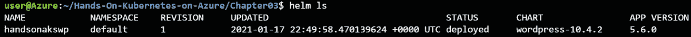

图 3.24: WordPress 应用部署状态

我们可以使用以下命令从 Helm 中的部署获得更多信息:

舵手状态

这将返回图 3.25 所示的输出:

图 3.25:获取关于部署的更多细节

这表明您的图表已成功部署。它还显示了更多关于如何连接到您的网站的信息。您现在不会使用这些步骤；您将在*第 5 章“处理 AKS* 中的常见故障”中重温这些步骤，在这一节中，我们将介绍如何修复存储安装问题。现在，让我们来看看赫尔姆为您创造的一切:

kubectl get all

这将产生类似于图 3.26 的输出:

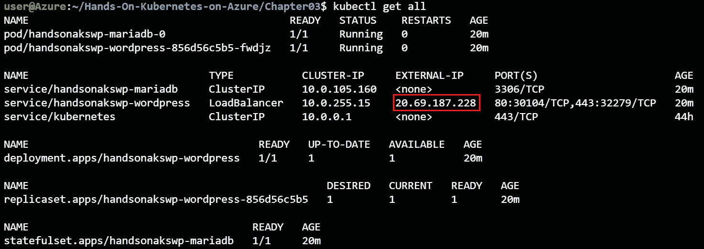

图 3.26:赫尔姆创建的对象列表

如果您还没有外部 IP，请等待几分钟，然后重试该命令。

然后你可以继续连接到你的外部 IP，访问你的 WordPress 网站。*图 3.27* 是结果输出:

图 3.27:连接外部 IP 时显示的 WordPress 站点

为了确保你不会在接下来的章节中遇到问题，让我们删除 WordPress 网站。这可以通过以下方式实现:

helm delete handsonakswp

根据设计，PVC 不会被删除。这确保了持久数据得以保留。由于没有任何持久数据，您也可以安全地删除 PVC:

kubectl 删除 pvc --所有

#### 注意

执行 **kubectl delete <对象> - all** 时要非常小心，因为它将删除一个名称空间中的所有对象。不建议在生产集群上这样做。

在本节中，您已经使用 Helm 部署了一个完整的 WordPress 站点。您还学习了 Kubernetes 如何使用 PVCs 处理持久存储。

## 总结

在本章中，您部署了两个应用。您通过部署留言簿应用开始了这一章。在部署过程中，探索了Pod 、复制集和部署的细节。您还使用了使用配置映射的动态配置。最后，您研究了如何使用服务将流量路由到部署的应用。

您部署的第二个应用是 WordPress 应用。您通过 Helm 包管理器部署了它。作为这个部署的一部分，使用了 PVC，您探索了它们在系统中是如何使用的，以及它们是如何链接到 Azure 上的磁盘的。

在*第 4 章，构建可扩展的应用*中，您将研究扩展应用和集群本身。您将首先了解应用的手动和自动扩展，然后了解集群本身的手动和自动扩展。最后，将解释在 Kubernetes 上更新应用的不同方式。