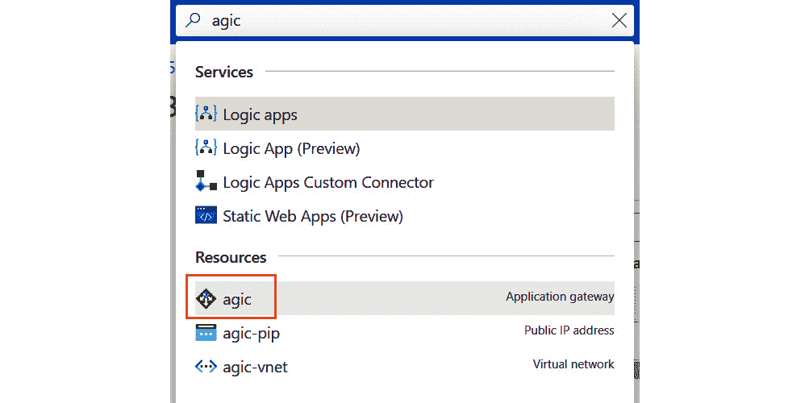
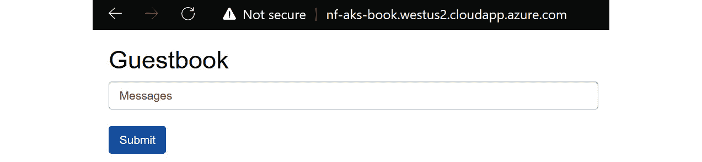
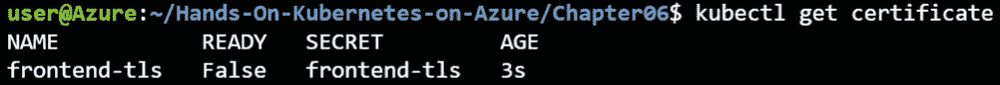
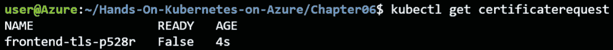
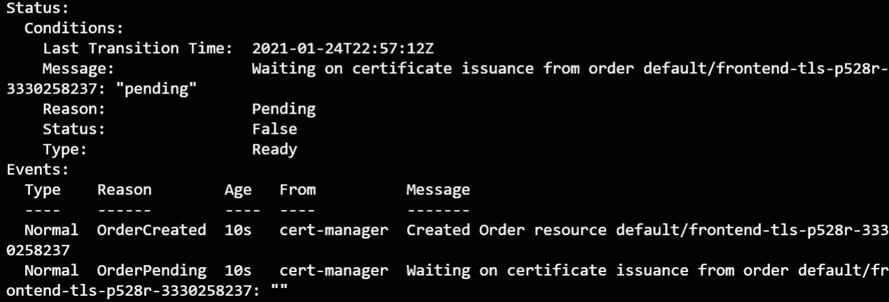
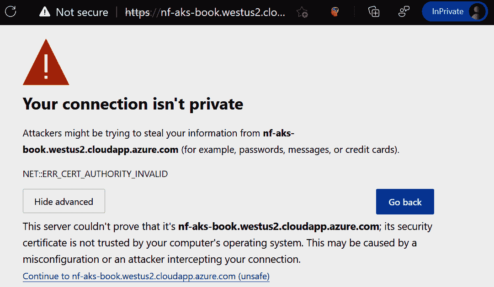

# 6.保护您在 HTTPS 的应用

HTTPS 已经成为任何面向公众的网站的必需品。它不仅提高了您网站的安全性，而且也成为新浏览器功能的要求。HTTPS 是 HTTP 协议的安全版本。HTTPS 利用**传输层安全性** ( **TLS** )证书来加密终端用户和服务器之间或两个服务器之间的流量。TLS 是**安全套接字层** ( **SSL** )的继承者。术语 *TLS* 和 *SSL* 经常互换使用。

过去，您需要从**证书颁发机构** ( **CA** )购买证书，然后在您的网络服务器上进行设置并定期续订。虽然这在今天仍然是可能的，但是 Kubernetes 中的**让我们加密**服务和助手使得在集群中设置经过验证的 TLS 证书变得非常容易。让我们加密是一个由**互联网安全研究小组**运营的非营利组织，由多家公司支持。这是一项免费服务，以自动方式提供经过验证的顶级域名证书。自动化是我们加密服务的主要优势。

对于 Kubernetes 助手，您将了解一个名为**入口**的新对象，并使用名为**证书管理器**的 Kubernetes 插件。入口是 Kubernetes 中的一个对象，它管理对服务的外部访问，通常用于 HTTP 服务。入口在我们在*第 3 章*、*中解释的服务对象之上增加了额外的功能。它可以配置为处理 HTTPS 流量。它还可以配置为根据主机名将流量路由到不同的后端服务，主机名由用于连接的**域名系统** ( **域名系统**)分配。*

**证书管理器**是一个 Kubernetes 插件，有助于自动创建 TLS 证书。当证书即将到期时，它也有助于证书的轮换。**证书管理器**可以与我们加密接口，自动申请证书。

在本章中，您将看到如何将 Azure 应用网关设置为 Kubernetes 入口，以及如何将**证书管理器**与“让我们加密”接口。

本章将涵盖以下主题:

*   将 Azure 应用网关设置为 Kubernetes 入口
*   在服务前设置入口
*   向入口添加顶级域名系统支持

让我们从设置 Azure 应用网关作为 AKS 的入口开始。

## 将 Azure 应用网关设置为 Kubernetes 入口

Kubernetes 中的入口是一个对象，用于将 HTTP 和 HTTPS 流量从集群外部路由到集群中的服务。使用入口公开服务，而不是像到目前为止所做的那样直接公开服务，有很多优点。这些优势包括能够将多个主机名路由到同一个公共 IP 地址，以及将 TLS 终端从实际应用卸载到入口。

要在 Kubernetes 中创建入口，您需要安装一个入口控制器。入口控制器是可以在 Kubernetes 中创建、配置和管理入口的软件。Kubernetes 没有预装入口控制器。入口控制器有多种实现方式，完整列表可在以下网址获得:[https://kubernetes . io/docs/concepts/service-networking/inner-controller/](https://kubernetes.io/docs/concepts/services-networking/ingress-controllers/)

在 Azure 中，应用网关是一个第 7 层负载平衡器，可以通过使用**应用网关入口控制器(AGIC)** 作为 Kubernetes 的入口。第 7 层负载平衡器是在应用层工作的负载平衡器，应用层是 OSI 网络参考模型中的第七层，也是最高层。Azure 应用网关具有许多高级功能，如自动缩放和**网络应用防火墙(WAF)** 。

配置 AGIC 有两种方式，要么使用 Helm，要么作为**Azure Kubernetes Service**(**AKS**)附加组件。使用 AKS 附加功能安装 AGIC 将获得微软支持的配置。此外，附加部署方法将由微软自动更新，确保您的环境始终是最新的。

在本节中，您将创建一个新的应用网关实例，使用附加方法设置 AGIC，最后，部署一个入口资源来公开一个应用。在本章的后面，您将扩展此设置，以便使用“让我们加密”证书也包括 TSL。

### 创建新的应用网关

在本节中，您将使用 Azure 命令行界面创建一个新的应用网关。然后，您将在下一节中使用这个应用网关来与 AGIC 集成。本章中的不同步骤在 **setup-appgw.sh** 文件中的代码示例中进行了总结，该文件是本书附带的代码示例的一部分。

1.  To organize the resources created in this chapter, it is recommended that you create a new resource group. Make sure to create the new resource group in the same location you deployed your AKS cluster in. You can do this using the following command in the Azure CLI:

    az 集团创建-n agic -l westus2

2.  Next, you will need to create the networking components required for your application gateway. These are a public IP with a DNS name and a new virtual network. You can do this using the following commands:

    az 网络公共-ip 创建-n agic-pip \

    静态 sku 标准\

    -DNS-名称“<your unique="" dns="" name="">”</your>

    az 网络 vnet create -n agic-vnet -g agic \

    -地址前缀 192.168.0.0/24 -子网名称 agic-subnet \

    -子网前缀 192.168.0.0/24

    #### 注意

    az network public-ip create 命令可能会向您显示一条警告消息**【即将到来的突破性变化】在即将到来的版本中，当 sku 为 Standard 且未提供区域时，默认行为将更改如下:对于区域区域，您将获得由区域指示的区域冗余 IP:[“1”、“2”、“3”]；对于非区域，您将获得一个由区域:[]指示的非区域冗余 IP。**

3.  Finally, you can create the application gateway. This command will take a few minutes to execute

    az 网络应用-网关创建-n agic -l westus2 \

    -g agic - sku 标准 _v2 -公共-IP-地址 agic-pip \

    -vnet -名称 agic-vnet -子网 agic-子网

4.  It will take a couple of minutes for the application gateway to deploy. Once it is created, you can see the resource in the Azure portal. To find this, look for **agic** (or the name you gave your application gateway) in the Azure search bar, and select your application gateway.

    

    图 6.1:在 Azure 搜索栏中查找应用网关

5.  This will show you your application gateway in the Azure portal, as shown in *Figure 6.2*:

    

    图 6.2:Azure 门户中的应用网关

6.  要验证是否已成功创建，请浏览到您为公共 IP 地址配置的 DNS 名称。这将向您显示类似于图 6.3 的输出。请注意，显示的错误消息是预期的，因为您还没有在应用网关后面配置任何应用。您将在*中使用 AGIC 配置应用网关后面的应用，为留言簿应用*添加入口规则。

图 6.3:验证您可以连接到应用网关

现在您已经创建了一个新的应用网关，并且能够连接到它，我们将继续将这个应用网关与您现有的 Kubernetes 集群集成。

### 建立 AGIC

在本节中，您将使用 AGIC AKS 插件将应用网关与 Kubernetes 集群集成。您还将设置虚拟网络对等，以便应用网关可以向您的 Kubernetes 集群发送流量。

1.  To enable integration between your cluster and your application gateway, use the following command:

    appgwId=$(az 网络应用-网关\

    show -n agic -g agic -o tsv -查询“id”)

    az aks enable-addons-n hand onaks \

    -g rg-handsonaks -a 入口-appgw \

    --appgw-id $appgwId

2.  Next, you will need to peer the application gateway network with the AKS network. To peer both networks, you can use the following code:

    nodesourcegroup = $(az aks show-n hand onaks \

    -g rg-handsonaks-o tsv-query“NodeResourceGrouP”)

    aksVnetName=$(az 网络 vnet 列表\

    -g $ NodeResourceGrouP-o tsv-query "[0]。名称”)

    aksVnetId=$(az 网络 vnet show -n $aksVnetName \

    -g $nodeResourceGroup -o tsv -查询“id”)

    az 网络 vnet 对等创建\

    -n appgwtoaksvnetpeeking-g agic \

    -vnet-name agic-vnet-remote-vnet $ aksVnetId \

    允许网络访问

    appGWVnetId=$(az 网络 vnet show -n agic-vnet \

    -g agic -o tsv -查询“id”)

    az 网络 vnet 对等创建\

    -n akstoappgwvnetpeering-g $ noderesourcegroup \

    -vnet-name $ aksVnetName-remote-vnet $ appGWVnetId-allow-vnet-access

应用网关和 AKS 集群之间的集成到此结束。您已经启用了 AGIC 插件，并将两个网络连接在一起。在下一节中，您将使用这种 AGIC 集成为演示应用创建入口。

### 为留言簿应用添加入口规则

至此，您已经创建了一个新的应用网关，并将其与 Kubernetes 集群集成在一起。在本节中，您将部署留言簿应用，然后使用入口将其公开。

1.  To launch the guestbook application, type in the following command:

    kubectl create -f 留言簿一体机. yaml

    这将创建您在前面章节中使用的留言簿应用。您应该会看到正在创建的对象，如*图 6.4* 所示:

    

    图 6.4:创建留言簿应用

2.  You can then use the following YAML file to expose the front-end service via the ingress. This is provided as **simple-frontend-ingress.yaml** in the source code for this chapter:

    1 版本:networking.k8s.io/v1

    2 种:入口

    3 元数据:

    4 名称:简单前端入口

    5 个注释:

    6 kubernetes.io/ingress.class: azure/应用网关

    7 规格:

    8 条规则:

    9 - http:

    10 条路径:

    11 -路径:/

    12 路径类型:前缀

    13 后端:

    14 服务:

    15 名称:前端

    16 端口:

    17 号:80

    让我们看看这个 YAML 文件中定义了什么:

    *   **第 1 行**:为正在创建的对象指定 Kubernetes API 版本。
    *   **第 2 行**:您定义您正在创建一个**入口**对象。
    *   **第 5-6 行**:在这里，您告诉 Kubernetes 您想要创建类**azure/应用网关**的入口。

    以下几行定义了实际入口:

    *   **第 8-12 行**:这里，您定义了这个入口正在监听的路径。在我们的例子中，这是顶层路径。在更高级的情况下，您可以有指向不同服务的不同路径。
    *   **13-17 号线**:这些线定义了这个流量应该指向的实际服务。

    您可以使用以下命令创建此入口:

    忽必烈 apply -f simple 前端入口. yaml

3.  If you now go to http://dns-name/, which you created in the *Creating a new application gateway* section, you should get an output as shown in *Figure 6.5*:

    

    图 6.5:通过入口访问留言簿应用

    #### 注意

    您不必像前面几章中那样公开前端服务。您已经将入口添加为公开的服务，并且前端服务对于集群来说仍然是私有的。

    

    图 6.6:显示公共可访问入口的流程图

4.  You can verify this by running the following command:

    忽必烈得到服务

5.  这应该表明你没有公共服务，正如*图 6.7* 中缺少**外部知识产权**所示:

图 6.7:输出显示您没有公共服务

在本节中，您启动了留言簿应用的一个实例。然后，您通过创建一个入口来公开展示它，该入口又配置了您之前创建的应用网关。只有入口是公开的。

接下来，您将扩展 AGIC 的功能，并学习如何使用“让我们加密”中的证书来保护流量。

## 将顶级域名添加到入口

您现在可以将 HTTPS 支持添加到您的应用中。为此，您需要 TLS 证书。您将使用**证书管理器** Kubernetes 插件向我们加密请求证书。

#### 注意

虽然这一部分侧重于使用自动化服务，如“让我们加密”，但您仍然可以遵循传统的路径，从现有的证书颁发机构购买证书，并将其导入 Kubernetes。有关如何做到这一点的更多信息，请参考 Kubernetes 文档:[https://Kubernetes . io/docs/concepts/services-networking/ingress/# TLS](https://kubernetes.io/docs/concepts/services-networking/ingress/#tls )

这涉及到几个步骤。将 HTTPS 添加到应用的过程包括以下内容:

1.  安装**证书管理器**，它与我们加密应用编程接口接口，为您指定的域名申请证书。
2.  安装证书颁发者，它将从我们加密获取证书。
3.  为给定的**完全限定域名** ( **FQDN** )创建一个 SSL 证书。FQDN 是一个完全合格的域名系统记录，包括顶级域名(如。组织或。com)。您在创建新的应用网关一节的*步骤 2* 中创建了一个链接到您的公共知识产权的 FQDN。
4.  通过使用在*步骤 3* 中创建的证书创建服务入口来保护前端服务。在本节的示例中，您不会将此步骤作为单独的步骤来执行。但是，您将重新配置入口，以自动获取在*步骤 3* 中创建的证书。

让我们从第一步开始，在集群中安装**证书管理器**。

### 安装证书管理器

**证书管理器**([https://github.com/jetstack/cert-manager](https://github.com/jetstack/cert-manager))是一个 Kubernetes 插件，可自动管理和发布来自各种发行来源的 TLS 证书。它负责更新证书并确保定期更新。

#### 注意

**证书管理器**项目不是由微软管理或维护的。这是一个开源的解决方案，之前由公司**jetback**管理，该公司最近将其捐赠给了云原生计算基金会。

以下命令在集群中安装**证书管理器**:

kube CTL apply-f[https://github . com/jet stack/cert-manager/releases/download/v 1 . 2 . 0/cert-manager . YAML](https://github.com/jetstack/cert-manager/releases/download/v1.2.0/cert-manager.yaml)

这将在您的集群中安装多个组件，如*图 6.8* 所示。这些组件的详细说明可以在[https://cert-manager.io/docs/installation/kubernetes/](https://cert-manager.io/docs/installation/kubernetes/)的**证书管理器**文档中找到。

图 6.8:在集群中安装证书管理器

**证书管理器**利用了一个名为**的Kubernetes功能，自定义资源定义** ( **CRD** )。CRD 是一个功能，用于扩展 Kubernetes API 服务器来创建自定义资源。在**证书管理器**的情况下，创建了六个 CRD，其中一些将在本章后面使用。

现在您已经安装了**证书管理器**，您可以继续下一步:设置证书颁发者。

### 安装证书颁发者

在本节中，您将安装让我们加密临时证书颁发者。一个证书可以由多个发行人发行。 **letsencrypt-staging** 例如，用于测试目的。在构建测试时，您将使用登台服务器。证书颁发者的代码已在**证书颁发者. yaml** 文件的本章源代码中提供。像往常一样，使用**kube CTL create-f certificate-issuer . YAML**；YAML 文件包含以下内容:

1 版本:cert-manager.io/v1

2 类:发行人

3 元数据:

4 名称:letsencrypt-staging

5 规格:

6 极致:

7 服务器:https://acme-staging-v02.api.letsencrypt.org/directory

8 邮件:

9 privateKeySecretRef:

10 名称:letsencrypt-staging

11 个解决方案:

12 - http01:

13 入口:

14 类:azure/应用网关

让我们看看我们在这里定义了什么:

*   **第 1-2 行**:这里，你指向**证书管理器**创建的其中一个 CRD。在这种情况下，具体来说，你指向**发行人**对象。颁发者是您的 Kubernetes 集群和创建证书的实际证书颁发机构之间的链接，在这种情况下是“让我们加密”。
*   **第 6-10 行**:这里提供了我们加密的配置，指向暂存服务器。
*   **第 11-14 行**:这是 ACME 客户端认证域所有权的附加配置。您将“让我们加密”指向 Azure 应用网关入口，以验证您拥有稍后将请求证书的域。

安装证书颁发者后，您现在可以继续下一步:在入口上创建 TLS 证书。

### 创建 TLS 证书并保护入口

在本节中，您将创建一个顶级域名证书。有两种方法可以配置**证书管理器**来创建证书。您可以手动创建证书并将其链接到入口，也可以配置入口控制器，因此**证书管理器**会自动创建证书。

在本例中，您将使用后一种方法配置您的入口。

1.  To start, edit the ingress to look like the following YAML code. This file is present in the source code on GitHub as **ingress-with-tls.yaml**:

    1 版本:networking.k8s.io/v1

    2 种:入口

    3 元数据:

    4 名称:简单前端入口

    5 个注释:

    6 kubernetes.io/ingress.class: azure/应用网关

    7 cert-manager.io/issuer:莱森地穴-分期

    8 cert-manager.io/acme-challenge-type: http 01

    9 规格:

    10 条规则:

    11 - http:

    12 条路径:

    13 -路径:/

    14 路径类型:前缀

    15 后端:

    16 服务:

    17 名称:前端

    18 端口:

    19 号:80

    20 主机:<your dns-name="">。 <your azure="" region="">.cloudapp.azure.com</your></your>

    21 个顶级域名:

    22 台主机:

    23 - <your dns-name="">。 <your azure="" region="">.cloudapp.azure.com</your></your>

    24 secretName:前端 tls

    您应该对原始入口进行以下更改:

    *   **第 7-8 行**:您向入口添加了两个附加注释，指向证书颁发者和**极致挑战**以证明域所有权。
    *   **第 20 行**:此处添加入口的域名。这是必需的，因为“让我们加密”只为域颁发证书。
    *   **21-24 线**:这是入口的 TLS 配置。它包含主机名以及将被创建来存储证书的秘密的名称。
2.  You can update the ingress you created earlier with the following command:

    立方结构 apply-f entry-with-TLS . YAML

    请求证书并配置入口使用该证书需要**证书管理器**大约一分钟的时间。在您等待的同时，让我们来看看**证书管理器**代表您创建的中间资源。

3.  First off, **cert-manager** created a **certificate** object for you. You can look at the status of that object using the following:

    kubectl 获取证书

    该命令将产生如图 6.9 所示的输出:

    

    图 6.9:证书对象的状态

4.  As you can see, the certificate isn't ready yet. There is another object that **cert-manager** created to actually get the certificate. This object is **certificaterequest**. You can get its status by using the following command:

    忽必烈获得证书 quest

    这将产生如图 6.10 所示的输出:

    

    图 6.10:certificate request 对象的状态

    您也可以通过针对**证书请求**对象发出**描述**命令来获取请求的更多详细信息:

    kubectl 描述证书请求

    当您等待证书颁发时，状态将类似于*图 6.11* :

    

    图 6.11:使用 kube CTL description 命令获取 certificaterequest 对象的详细信息

    如您所见， **certificaterequest** 对象向您显示订单已经创建并且正在等待处理。

5.  After a couple of additional seconds, the **describe** command should return a successful certificate creation message. Run the following command to get the updated status:

    kubectl 描述证书请求

    该命令的输出如*图 6.12* 所示:

    

    图 6.12:颁发的证书

    现在，这将使前端入口能够通过 HTTPS 提供服务。

6.  让我们在浏览器中通过浏览到您在*创建新的应用网关*部分中创建的域名来尝试一下。根据浏览器的缓存，您可能需要在网址前面添加 **https://** 。
7.  一旦到达入口，它将在浏览器中指示一个错误，显示证书无效，类似于*图 6.13* 。这是意料之中的，因为您正在使用“让我们加密”分段服务器:

图 6.13:使用我们加密临时服务器，默认情况下证书是不可信的

您可以通过点击**高级**并选择**继续**来浏览您的应用。

在本节中，您成功地向入口添加了一个 TLS 证书，以保护其流量。由于您能够使用临时证书完成测试，现在您可以进入生产系统了。

### 从准备阶段切换到生产阶段

在本节中，您将从临时证书切换到生产级证书。为此，您可以通过在集群中创建新的颁发者来重复前面的练习，如下所示(作为本书代码示例的一部分，在**证书颁发者-prod.yaml** 中提供)。不要忘记在文件中更改您的电子邮件地址。该文件中包含以下代码:

1 版本:cert-manager.io/v1alpha2

2 类:发行人

3 元数据:

4 名称:letsencrypt-prod

5 规格:

6 极致:

7 服务器:https://acme-v02.api.letsencrypt.org/directory

8 邮件:

9 privateKeySecretRef:

10 名称:letsencrypt-prod

11 个解决方案:

12 - http01:

13 入口:

14 类:azure/应用网关

然后，用 **letsencrypt-prod** 替换**with-TLS . YAML**文件中对发行人的引用，如图所示(在**with-TLS-prod . YAML**文件中提供):

1 版本:networking.k8s.io/v1

2 种:入口

3 元数据:

4 名称:简单前端入口

5 个注释:

6 kubernetes.io/ingress.class: azure/应用网关

7 cert-manager.io/issuer:·莱特森墓穴产品

8 cert-manager.io/acme-challenge-type: http 01

9 规格:

10 条规则:

11 - http:

12 条路径:

13 -路径:/

14 路径类型:前缀

15 后端:

16 服务:

17 名称:前端

18 端口:

19 号:80

20 主机:<your dns-name="">。 <your azure="" region="">.cloudapp.azure.com</your></your>

21 个顶级域名:

22 台主机:

23 - <your dns-name="">。 <your azure="" region="">.cloudapp.azure.com</your></your>

24 secretName:前端制造 tls

要应用这些更改，请执行以下命令:

kubectl create -f 证书-颁发者-prod.yaml

立方结构 apply-f entry-with-TLS-prod . YAML

证书再次激活大约需要一分钟。新证书颁发后，您可以再次浏览到您的域名，并且不会再看到任何关于无效证书的警告。如果单击浏览器中的挂锁图标，您应该会看到您的连接是安全的，并且使用了有效的证书:

图 6.14:显示有效证书的网页

在本节中，您已经学习了如何向入口添加 TLS 支持。您可以通过安装**证书管理器** Kubernetes 插件来做到这一点。**证书管理器**从我们加密获得了一个免费证书，并将其添加到应用网关上部署的现有入口中。这里描述的过程并不特定于 Azure 和 Azure 应用网关。将顶级域名添加到入口的过程也适用于其他入口控制器。

让我们删除您在本章中创建的资源:

kube CTL delete-f[https://github . com/jet stack/cert-manager/releases/download/v 1 . 1 . 0/cert-manager . YAML](https://github.com/jetstack/cert-manager/releases/download/v1.1.0/cert-manager.yaml)

az aks 禁用-addons -n 握手\

-g rg-hand onaks-a 入口-appgw

## 总结

在本章中，您将 HTTPS 安全性添加到留言簿应用中，而没有实际更改源代码。您首先设置了一个新的应用网关，并在 AKS 上配置了 AGIC。这使您能够创建可以在应用网关上配置的 Kubernetes 入口。

然后，您安装了一个证书管理器，它与我们加密应用编程接口接口，为我们随后指定的域名请求证书。您利用证书颁发者从“让我们加密”中获取证书。然后，您重新配置入口，向群集中的这个颁发者请求证书。使用证书管理器和入口的这些功能，您现在可以使用 TLS 保护您的网站。

在下一章中，您将学习如何监控部署和设置警报。您还将学习如何在错误发生时快速识别根本原因，以及如何调试在 AKS 上运行的应用。同时，一旦您确定了根本原因，您将学会如何执行正确的修复。