# 七、监控 AKS 集群及其应用

现在，您已经知道如何在 AKS 集群上部署应用，让我们关注如何确保集群和应用保持可用。在本章中，您将学习如何监控集群和运行在集群上的应用。您将探索 Kubernetes 如何使用就绪性和活跃度探测器来确保您的应用可靠运行。

您还将了解如何使用 **AKS 诊断**和 **Azure Monitor** ，以及它们如何集成到 Azure 门户中。您将看到如何使用 AKS 诊断来监控集群本身的状态，以及 Azure Monitor 如何帮助监控集群上的 Pod ，并允许您访问大规模 Pod 的日志。

简而言之，本章将涵盖以下主题:

*   使用 **kubectl** 监控和调试应用
*   审查 Kubernetes 报告的指标
*   查看来自 Azure 监视器的指标

让我们从回顾 **kubectl** 中的一些命令开始这一章，您可以使用这些命令来监控您的应用。

## 监控应用的命令

监控部署在 Kubernetes 上的应用以及 Kubernetes 基础架构本身的运行状况对于向您的客户提供可靠的服务至关重要。有两个主要的监控用例:

*   持续监控，以便在出现不符合预期的情况时获得警报
*   应用错误的故障排除和调试

当观察运行在 Kubernetes 集群之上的应用时，您需要并行检查多个东西，包括容器、荚、服务和集群中的节点。对于持续监控，您将需要一个监控系统，如 Azure Monitor 或 Prometheus。Azure Monitor 将在本章后面介绍。普罗米修斯([https://prometheus.io/](https://prometheus.io/))是 Kubernetes 生态系统中一个流行的开源解决方案，用于监控 Kubernetes 环境。对于故障排除，您需要与实时集群进行交互。用于故障排除的最常见命令如下:

立方得到〔t0〕〔t1〕

忽必烈描写了

立方日志〔t0〕

本章稍后将详细描述这些命令。

从实际示例开始，使用以下命令再次创建留言簿示例:

kubectl create -f 留言簿一体机. yaml

当**创建**命令运行时，您将在以下部分看到它的进度。让我们从探索**获取**命令开始。

### 库比特获取命令

要查看已部署应用的整体情况，kubectl 提供了 **get** 命令。**获取**命令列出了您指定的资源。资源可以是 Pod 、复制集、入口、节点、部署、机密等等。在前面的章节中，您已经运行了这个命令来验证应用是否可以使用。

请执行以下步骤:

1.  Run the following **get** command, which will get us the resources and their statuses:

    kubectl get all

    这将向您展示命名空间中的所有部署、复制集、单元和服务:

    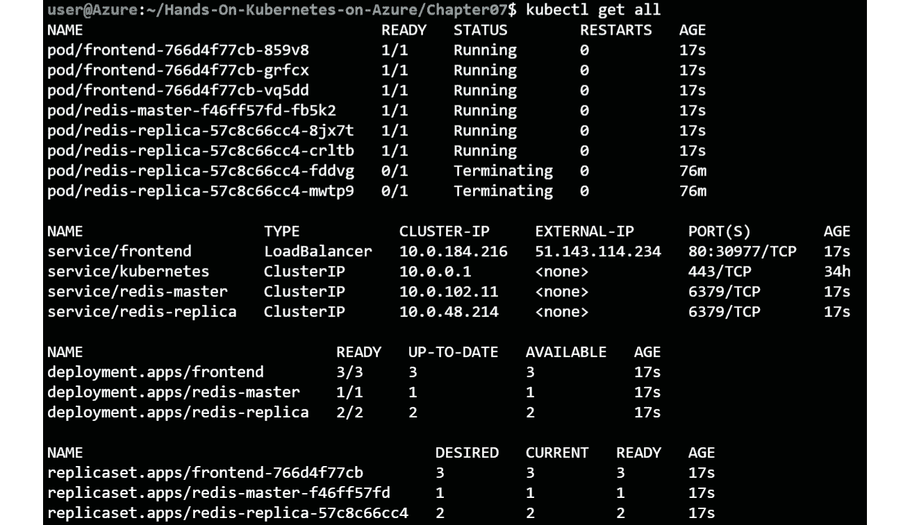

    图 7.1:在默认命名空间中运行的所有资源

2.  Focus your attention on the pods in your deployment. You can get the status of the pods with the following command:

    忽必烈得到 pods

    你会看到只显示了 Pod ，如*图 7.2* 所示。让我们详细调查一下:

    

    图 7.2:命名空间中的所有容器

    第一列表示 Pod 名称，例如**前端-766d4f77cb-ds6gb** 。第二列显示了相对于容器总数，容器中有多少容器准备就绪。准备状态是通过 Kubernetes 的准备状态探测器来定义的。本章后面有一个专门的部分叫做*准备和活性探测*。

    第三列表示状态，如**待处理**、**正在处理**、**正在运行**等。第四列指示重新启动的次数，而第五列指示要求创建 pod 的时间。

3.  If you need more information about your pod, you can add extra columns to the output of a **get** command by adding **-o wide** to the command like this:

    kubectl 的 PODS 很宽

    这将向您显示附加信息，如*图 7.3* 所示:

图 7.3:增宽显示了 Pod 的更多细节

额外的列包括 pod 的 IP 地址、运行它的节点、指定节点和就绪门。仅当较高优先级的 pod 抢占较低优先级的 pod 时，才设置指定节点。然后，指定节点字段将被设置在更高优先级的 pod 上。它表示一旦较低优先级的 pod 优雅地终止，较高优先级的 pod 将被调度的节点。准备状态门是引入外部系统组件作为 Pod 准备状态的一种方式。

执行**获取 Pod **命令仅显示当前 Pod 的状态。正如我们接下来将看到的，任何一个州的事情都可能失败，我们需要使用**kube CTL description**命令来深入挖掘。

### 库比特描述命令

**kube CTL description**命令为您提供了正在描述的对象的详细视图。它包含对象本身的详细信息，以及与该对象相关的任何最近事件。虽然 **kubectl get events** 命令列出了整个名称空间的所有事件，但是**kube CTL description**命令只能获得该特定对象的事件。如果您只对 PODS 感兴趣，可以使用以下命令:

kubectl 描述了 PODS

前面的命令列出了与所有 Pod 相关的所有信息。这通常是太多的信息，无法包含在典型的外壳中。

如果您需要特定 pod 的信息，可以键入以下内容:

多维数据集描述子/<pod-name></pod-name>

#### 注意

您可以在 **pod** 和**T4 之间使用斜线或空格-pod 名称>** 。以下两个命令将具有相同的输出:

**立方描述子/ <子名称>t1**

**在<子名称>下的立方描述**

你会得到类似于*图 7.4* 的输出，后面会详细说明:

图 7.4:描述一个对象显示了该对象的详细输出

从描述中，您可以获得 pod 运行的节点、运行时间、内部 IP 地址、Docker 映像名称、公开的端口、 **env** 变量和事件(过去一小时内)。

在上例中，Pod 名称为**前端-766d4f77cb-ds6gb** 。如*第一章【容器和 Kubernetes 介绍】*所述，它有 **<副本集名称> - <随机 5 个字符>** 格式。**副本集**名称本身是从部署名称前端随机生成的: **<部署名称> - <随机串>** 。

*图 7.5* 显示了部署、副本集和 Pod 之间的关系:

图 7.5:部署、复制集和单元之间的关系

这个 pod 运行的命名空间是**默认的**。到目前为止，您只是使用了**默认的**名称空间，恰当地命名为**默认的**。

从前面的输出中，另一个重要的部分是**节点**部分:

节点:AK 代理池-398838025-vmss 000000/10 . 240 . 0 . 4

**节点**部分让您知道 pod 运行在哪个物理节点/虚拟机上。如果 pod 反复重启或出现运行问题，而其他一切似乎正常，则节点本身可能存在问题。掌握这些信息对于执行高级调试至关重要。

以下是 pod 最初的计划时间:

开始时间:2021 年 1 月 26 日星期二 02:10:33 +0000

这并不意味着 Pod 从那时起就一直在运行，所以从这个意义上来说，时间可能会产生误导。如果发生健康事件(例如，容器崩溃)，pod 将自动重置。

您可以使用**标签**在 Kubernetes 中添加关于工作负载的更多信息，如下所示:

标签:app =留言簿

pod 模板散列=57d8c9fb45

层=前端

标签是 Kubernetes 中常用的功能。比如**服务**到**Pod **和**部署**到**复制设置**到**Pod ** ( *图 7.5* )就是这样做的。如果您看到流量没有从服务路由到 pod，这是您应该检查的第一件事。另外，您会注意到 **pod-template-hash** 标签也出现在 pod 名称中。这就是复制集和 pod 之间的联系。如果标签不匹配，资源将不会附加。

以下显示了 pod 的内部 IP 及其状态:

状态:正在运行

IP: 10.244.0.44

综合方案:

IP: 10.244.0.44

如前几章所述，在构建应用时，可以将 pods 移动到不同的节点并获得不同的 IP 地址，因此您应该避免使用这些 IP 地址。但是，当调试应用问题时，为 pod 拥有一个直接的 IP 可以帮助排除故障。您可以使用另一个 pod 的 IP 地址直接从一个 pod 连接到另一个 pod 来测试连通性，而不是通过服务对象连接到您的应用。

在 pod 中运行的容器和暴露的端口列在下面的块中:

容器:

php 重定向:

...

图片:gcr.io/google-samples/gb-frontend:v4

...

端口:80/TCP

...

请求:

cpu: 10m

内存:10Mi

环境:

GET_HOSTS_FROM: dns

...

在这种情况下，您将从 **gcr.io** 容器注册表中获得带有 **v4** 标签的 **gb 前端**容器，存储库名称为 **google-samples** 。

港口 **80** 对外开放。由于每个 pod 都有自己的 IP，因此即使在同一台主机上运行，同一个 pod 的多个实例也可以暴露同一个端口。例如，如果有两个 Pod 在同一个节点上运行一个网络服务器，两个 Pod 都可以使用端口 **80** ，因为每个 Pod 都有自己的 IP 地址。这是一个巨大的管理优势，因为您不必担心同一节点上的端口冲突。

前一小时发生的任何事件都会显示在这里:

事件:

使用**kube CTL description**对于获取更多关于您正在运行的资源的上下文非常有用。最后一部分包含与您所描述的对象相关的事件。您可以使用 **kubectl get events** 命令获取集群中的所有事件。

要查看系统中所有资源的事件，请运行以下命令:

kubectl 获取事件

#### 注意

默认情况下，Kubernetes 仅维护事件 1 小时。

如果一切顺利，你应该会有一个类似*的输出图 7.6* :

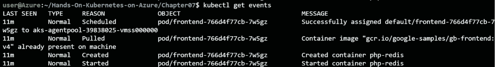

图 7.6:获取事件显示了过去一小时的所有事件

*图 7.6* 只显示了一个 pod 的事件，但是正如您在输出中看到的，该命令的输出包含了最近创建、更新或删除的所有资源的事件。

在本节中，您已经了解了可以用来检查 Kubernetes 应用的命令。在下一节中，您将重点关注调试应用故障。

### 调试应用

现在，您已经对如何检查应用有了基本的了解，您可以开始了解如何调试部署问题。

在本节中，将介绍常见的错误，您将决定如何调试和修复它们。

如果您尚未实现留言簿应用，请运行以下命令:

kubectl create -f 留言簿一体机. yaml

几秒钟后，应用应该会启动并运行。

### 映像拉取误差

在本节中，您将通过将映像标记值设置为不存在的值来引入映像拉取错误。当 Kubernetes 无法下载它需要运行的容器的映像时，就会出现映像拉取错误。

1.  Run the following command on Azure Cloud Shell:

    kubectl 编辑部署/前端

    接下来，通过执行以下步骤将映像标签从 **v4** 更改为**v _ 不存在**。

2.  Type **/gb-frontend** and hit the *Enter* key to have your cursor brought to the image definition.

    点击 *I* 键进入插入模式。删除 **v4** ，输入**v _ 不存在**，如图*图 7.7* :

    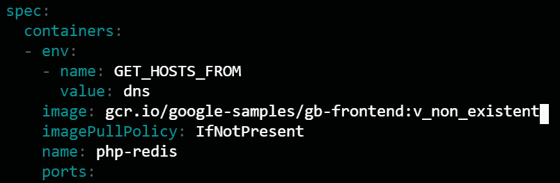

    图 7.7:将映像标签从 v4 更改为 v _ 不存在

3.  现在，首先点击 *Esc* 键关闭编辑器，然后输入 **:wq！**点击*进入*。
4.  Run the following command to list all the pods in the current namespace:

    忽必烈得到 pods

    前面的命令应该指出错误，如图 7.8*所示:*

    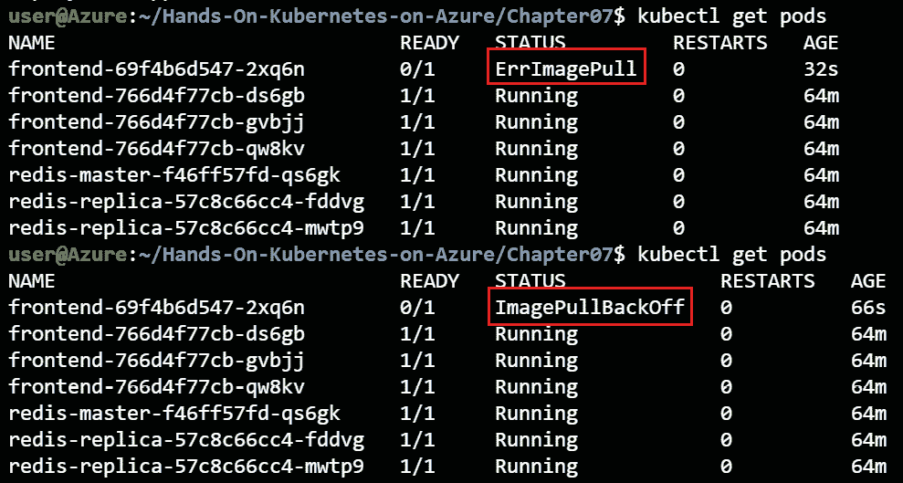

    图 7.8:其中一个 Pod 的状态为错误拉取或映像拉取后退

    您可能会看到一个名为**的错误状态或**的映像后退状态。这两个错误都是指 Kubernetes 无法从注册表中提取映像。**错误拉动**错误描述了这一点；**imagepullback**描述了 Kubernetes 将在重试下载映像之前退出(等待)。这种后退具有指数级的延迟，从 10 到 20 到 40 秒甚至更长，最长可达 5 分钟。****

5.  Run the following command to get the full error details:

    kubectl 描述 Pod /<failed pod="" name=""></failed>

    一个样本误差输出如图 7.9*所示。关键错误信息以红色突出显示:*

    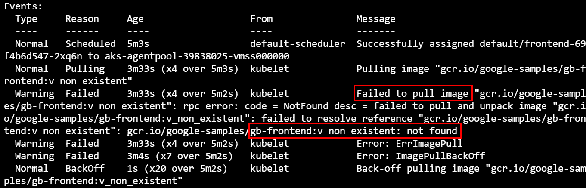

    图 7.9:使用描述显示了错误的更多细节

    这些事件清楚地表明，映像并不存在。诸如将无效凭证传递给私有 Docker 存储库之类的错误也会出现在这里。

6.  Let's fix the error by setting the image tag back to **v4**. First, type the following command in Cloud Shell to edit the deployment:

    kubectl 编辑部署/前端

7.  键入**/GB-前端**并点击*进入*将光标置于映像清晰度。
8.  点击 *I* 键进入插入模式。删除**v _ 不存在**，键入 **v4** 。
9.  现在，首先点击 *Esc* 键关闭编辑器，然后输入 **:wq！**点击*进入*。
10.  This should automatically fix the deployment. You can verify it by getting the events for the pods again.

    #### 注意

    因为 Kubernetes 进行了滚动更新，前端连续可用，没有停机时间。Kubernetes 意识到新规范有问题，并停止自动推出额外的更改。

当映像不可用或您无权访问容器注册表时，可能会出现映像拉取错误。在下一节中，您将探究应用本身中的一个错误。

### 应用错误

现在，您将看到如何调试应用错误。与上一节类似，这一节中的错误将是自我诱发的。调试问题的方法与我们用来调试运行中的应用的错误的方法相同。

1.  To start, get the public IP of the front-end service:

    忽必烈得到服务

2.  通过在浏览器中粘贴服务的公共 IP 连接到该服务。创建几个条目:

图 7.10:在留言簿应用中输入几个条目

现在已经有一个留言簿应用的实例在运行。为了提高示例的体验，最好缩小前端，这样就只有一个副本在运行。

### 缩小前端

在*第三章*、*AKS*上的应用部署中，你了解到了前端的部署是如何配置**副本=3** 的。这意味着应用收到的请求可以由任何 pods 处理。要引入应用错误并记录错误，您需要对所有三个错误进行更改。

但是为了使这个例子更简单，将**副本**设置为 **1** ，这样您只需要对一个 pod 进行更改:

kubectl 规模-副本=1 个部署/前端

只运行一个副本将使引入错误变得更容易。现在让我们介绍这个错误。

### 引入应用错误

在这种情况下，您将使**提交**按钮无法工作。您需要为此修改应用代码:

#### 注意:

不建议通过使用 **kubectl exec** 在您的 pods 中执行命令来对您的应用进行生产更改。如果需要对应用进行更改，首选方法是创建新的容器映像并更新部署。

1.  You will use the **kubectl exec** command. This command lets you run commands on the command line of that pod. With the **-it** option, it attaches an interactive terminal to the pod and gives you a shell that you can run commands on. The following command launches a Bash terminal on the pod:

    忽必烈 exec -it <frontend-pod-name>- bash</frontend-pod-name>

    这将进入一个 Bash shell 环境，如图*图 7.11* :

    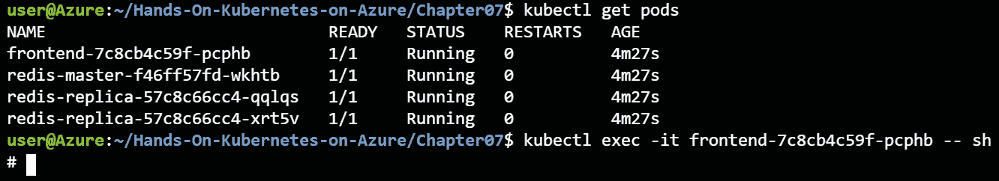

    图 7.11:获取一个容器的名称并访问容器内的外壳

2.  Once you are in the container shell, run the following command:

    apt 更新

    apt install -y 我来了

    前面的代码安装了 **vim** 编辑器，这样我们就可以编辑文件来引入错误。

3.  Now, use **vim** to open the **guestbook.php** file:

    我是 guestbook.php

4.  Add the following code at line 17, below the line **if ($_GET['cmd'] == 'set') {**. Remember, to edit a line in **vim**, you hit the *I* key. After you are done editing, you can exit by hitting *Esc*, and then type **:wq!** and press *Enter*:

    $ host = ' localhost

    if(！defined(' STDOUT '))define(' STDOUT '，fopen('php://stdout '，' w ')；

    fwrite(STDUT，“在‘set’命令开头的主机名”)；fwrite(STDOUT，$ host)；

    burite（STDOUT， "\n"）;

    文件看起来像*图 7.12* :

    

    图 7.12:引入错误和附加日志记录的更新代码

5.  You have now introduced an error where reading messages will work, but not writing them. You have done this by asking the front end to connect to the Redis master at the non-existent localhost server. The writes should fail. At the same time, to make this demo more visual, we added some additional logging to this section of the code.

    通过浏览留言簿的公共 IP 打开留言簿应用，您应该会看到之前的条目:

    

    图 7.13:早期的条目仍然存在

6.  Now, create a new message by typing a message and hitting the **Submit** button:

    

    图 7.14:创建了一条新消息

    提交新消息会使其出现在应用中。如果没有更好的了解，您可能会认为条目已经成功写入数据库。但是，如果您刷新浏览器，您将看到消息不再存在。

7.  要验证消息尚未写入数据库，请在浏览器中点击**刷新**按钮；您将只看到初始条目，新条目已经消失:

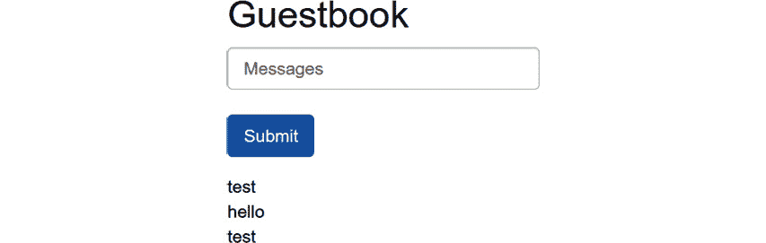

图 7.15:新消息已经消失

作为应用开发人员或操作人员，您可能会收到这样的罚单:**新部署后，新条目不会持久化。修好它**。

### 使用日志识别根本原因

解决问题的第一步是获取日志。

1.  Exit out of the front-end pod for now and get the logs for this pod:

    出口

    立方日志〔t0〕

    #### 注意:

    您可以在 **kubectl 日志**后添加 **-f** 标志以获得实时日志流，如下所示: **kubectl 日志< pod-name > -f** 。这在实时调试会话期间非常有用。

2.  You will see entries such as those seen in *Figure 7.16*:

    

    图 7.16:新消息显示为应用日志的一部分

3.  因此，当在代码的**集**部分写入数据库时，您知道错误在某个地方。当您在“set”命令 localhost 的开头看到条目**主机名时，您知道错误在这一行和客户端的开头之间，所以设置**$ host =“localhost”**一定是违规错误。这个错误并不像您想象的那样罕见，正如您刚刚看到的，除非有刷新浏览器的特定指令，否则很容易通过质量保证。对于开发人员来说，它可以很好地工作，因为他们可以在本地机器上运行一个 Redis 服务器。**

现在，您已经使用了 Kubernetes 中的日志来解决问题的根源，让我们开始解决错误，让我们的应用回到健康的状态。

### 解决问题

有两个选项可以修复您引入的这个 bug:您可以导航到 pod 并进行代码更改，也可以要求 Kubernetes 给我们一个健康的新 pod。不建议手动更改 pods，因此在下一步中，您将使用第二种方法。让我们通过删除有故障的 pod 来修复这个错误:

kubectl delete pod<podname></podname>

由于有一个控制 PODS 的复制集，您应该立即获得一个从正确的映像开始的新 PODS。尝试再次连接到留言簿，并验证消息是否在浏览器刷新期间保持不变。

以下几点总结了本节中关于如何识别错误以及如何修复错误的内容:

*   错误有多种形式。
*   部署团队遇到的大多数错误都是配置问题。
*   使用日志来确定根本原因。
*   在容器上使用 **kubectl exec** 是一种有用的调试策略。
*   请注意，广泛地允许 **kubectl exec** 是一个严重的安全风险，因为它允许 Kubernetes 操作者直接在他们可以访问的 pods 中执行命令。确保只有一部分操作员能够使用 **kubectl exec** 命令。您可以使用基于角色的访问控制来管理这种访问限制，正如您将在*第 8 章，AKS* 中学习的那样。
*   打印到**标准输出**和**标准输出**的任何内容都会显示在日志中(独立于应用/语言/日志框架)。

在本节中，您向留言簿应用引入了一个应用错误，并利用 Kubernetes 日志来查明代码中的问题。在下一节中，您将了解 Kubernetes 中一个强大的机制，名为**就绪**和**活性探测器**。

## 就绪和活性探测器

在前一节中简单介绍了就绪性和活跃度探测器。在本节中，您将更深入地探讨它们。

Kubernetes 使用活跃度和就绪性探测器来监控应用的可用性。每个探头都有不同的用途:

*   一个**活性探测器**在应用运行时监控其可用性。如果活性探测失败，Kubernetes 将重启你的 Pod 。这对于捕捉死锁、无限循环或者仅仅是一个“卡住”的应用可能是有用的。
*   一个**就绪探测器**监控您的应用何时可用。如果准备探测失败，Kubernetes 将不会向未准备好的 Pod 发送任何流量。如果您的应用在变得可用之前必须经过一些配置，或者如果您的应用已经过载但正在从额外的负载中恢复，这将非常有用。由于就绪探测失败，您的应用将暂时得不到任何流量，从而能够从增加的负载中恢复。

活跃度和就绪性探测不需要从应用中的同一个端点提供服务。如果您有一个智能应用，该应用可以在保持健康的情况下停止循环(意味着不再有流量发送到该应用)。为了实现这一点，它将使就绪探测失败，但使活动探测保持活动状态。

让我们用一个例子来说明这一点。您将创建两个 nginx 部署，每个部署都有一个索引页和一个运行状况页。索引页将作为活跃度探测器。

### 建造两个网状容器

在本例中，您将使用几个网页来连接就绪和活动探测器。这些文件存在于本章的代码文件中。我们先来创建**index1.html**:

<title>服务器 1</title>

服务器 1

之后，创建**index2.html**:

<title>服务器 2</title>

服务器 2

让我们也创建一个健康页面，**healthy.html**:

<title>这里一切都好</title>

好

在下一步中，您将把这些文件装载到您的 Kubernetes 部署中。要做到这一点，您将把这些变成一个**配置图**，您将连接到您的 PODS。您已经在*第 3 章“AKS* 上的应用部署”中了解了配置图。使用以下命令创建**配置图**:

kubectl 从文件创建 config map server 1 = index 1 . html

kubectl 从文件创建 config map server 2 = index 2 . html

kubectl 创建 configmap 从文件健康=健康. html

这样，您就可以继续创建您的两个 web 部署了。两者非常相似，只是**配置图**发生了变化。第一个部署文件( **webdeploy1.yaml** )如下所示:

1 API 版本:apps/v1

2 种:部署

...

17 规格:

18 个容器:

19 -名称:nginx-1

20 图片:基尼系数:1 . 19 . 6-高山

21 个端口:

22 -容器港口:80

23 活动探测器:

24 httpGet:

25 路径:/health . html

26 端口:80

27 个初始延迟秒:3

28 周期秒:3

29 就绪探测器:

30 httpGet:

31 路径:/index.html

32 端口:80

33 个初始延迟秒:3

34 周期秒:3

35 卷安装:

36 -名称:html

37 mount path:/usr/share/engine/html

38 -名称:索引

39 mountPath: /tmp/index1.html

40 子路径:index1.html

41 -姓名:健康

42 mount path:/tmp/health . html

43 子路径:healthy.html

44 命令:["/bin/sh "，"-c"]

45 个参数:[" CP/tmp/index 1 . html/usr/share/nginx/html/index . html；CP/tmp/health . html/usr/share/nginx/html/health . html；nginx 睡眠 inf"]

46 卷:

47 -名称:索引

48 configMap:

49 名称:服务器 1

50 名:健康

51 configMap:

52 名:健康

53 -名称:html

54 emptyDir: {}

在此部署中有几件事需要强调:

*   **第 23-28 行**:这是活跃度探头。活跃度探测器指向健康页面。请记住，如果运行状况页面失败，容器将重新启动。
*   **第 29-32 行**:这是准备状态探测器。在我们的例子中，就绪探测器指向索引页。如果此页面失败，pod 将暂时不发送任何流量，但将保持运行。
*   **第 44-45 行**:这两行包含了容器启动时执行的几个命令。这不是简单地运行 nginx 服务器，而是将索引和就绪文件复制到正确的位置，然后启动 nginx，然后使用**睡眠**命令(因此容器保持运行)。

您可以使用以下命令创建此部署。也可以为**服务器 2** 部署第二个版本，类似于**服务器 1** :

kubi KL create-f webeploy1 . YAML

kubi KL create-f webeploy 2 . YAML

最后，您还可以创建一个服务( **webservice.yaml** )将流量路由到两个部署:

1 堆叠版本:v1

2 种:服务

3 元数据:

4 名称:网络

5 规格:

6 选择器:

7 应用:网络服务器

8 个端口:

9 -协议:TCP

10 端口:80

11 目标端口：80

12 类型:负载平衡器

您可以使用以下内容创建该服务:

忽必烈 create -f webservice.yaml

现在您已经启动并运行了应用。在下一节中，您将介绍一些验证活跃度和就绪性探测器行为的失败。

### 试验活性和准备状态探测器

在前一节中，我们解释了活动和就绪探测器的功能，并创建了一个示例应用。在本节中，您将介绍该应用中的错误，并验证活跃度和就绪性探测器的行为。您将看到就绪探测器的故障将如何导致 Pod 保持运行但不再接受流量。之后，您将看到活性探测器的故障将如何导致 pod 重新启动。

让我们从准备就绪探测器失败开始。

### 就绪探测器失败会导致流量暂时停止

现在，您已经启动并运行了一个简单的应用，您可以尝试活跃度和就绪性探测器的行为。首先，让我们使用浏览器将服务的外部 IP 连接到我们的 web 服务器:

忽必烈得到服务

如果你在浏览器中点击外部 IP，你应该会看到一行字，上面写着**服务器 1** 或者**服务器 2** :

图 7.17:我们的应用正在从服务器 1 返回流量

在接下来的测试中，您将使用本章代码示例中提供的名为 **testWeb.sh** 的小脚本连接到您的网页 50 次，因此您可以监控服务器 1 和 2 之间的良好结果分布。您首先需要使该脚本可执行，然后可以在部署完全正常的情况下运行该脚本:

chmod +x testWeb.sh

。/testWeb.sh<external-ip></external-ip>

在正常运行期间，我们可以看到服务器 1 和服务器 2 的命中率几乎相同，服务器 1 的 **24** 命中率和服务器 2 的 **26** 命中率相同:

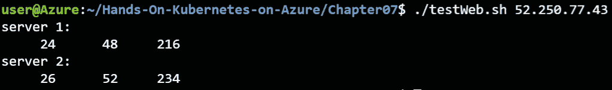

图 7.18:当应用运行正常时，服务器 1 和服务器 2 之间的流量是负载平衡的

现在让我们继续前进，让服务器 1 中的就绪探测失败。为此，您将使用 **kubectl exec** 命令将索引文件移动到不同的位置:

kubectl get pods #注意服务器 1 的 pods 名称

kubectl exec <server1 pod="" name="">-- \</server1>

mv/usr/share/nginx/html/index . html \

/usr/share/nginx/html/index 1 . html

执行此操作后，我们可以使用以下命令查看 pod 状态的变化:

忽必烈得到 pods -w

您应该会看到服务器 1 pod 的就绪状态变为 **0/1** ，如图*图 7.19* :

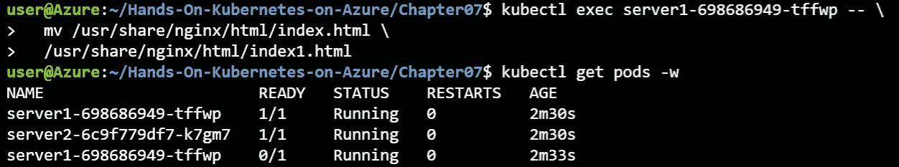

图 7.19:失败的就绪探测器导致服务器 1 没有任何就绪容器

这应该不会将更多流量导向服务器 1 pod。让我们验证一下:

。/testWeb.sh<external-ip></external-ip>

流量应该重定向到服务器 2:

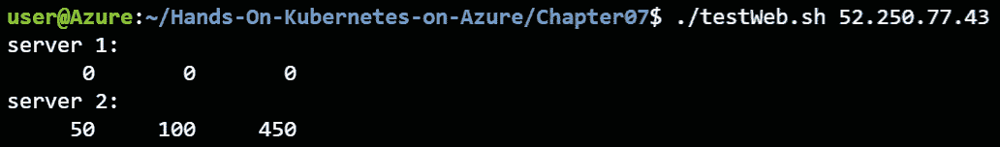

图 7.20:所有流量现在都由服务器 2 提供服务

现在，您可以通过将文件移回其正确位置来恢复服务器 1 的状态:

kubectl exec <server1 pod="" name="">-- mv \</server1>

/usr/share/nginx/html/index 1 . html \

/usr/share/nginx/html/index . html

这将使 Pod 返回到**就绪**状态，并再次平均分配流量:

。/testWeb.sh<external-ip></external-ip>

这将显示类似于图 7.21 的输出:

图 7.21:恢复就绪探测会使流量再次达到负载平衡

一个失败的准备状态探测器将导致 Kubernetes 不再向失败的 Pod 发送流量。通过导致示例应用中的就绪性探测失败，您已经验证了这一点。在下一节中，您将探讨失败的 liveness 探测的影响。

### 一个失败的活性探测器重新启动 Pod 

您也可以使用活性探针重复前面的过程。当活性探测器失败时，Kubernetes 预计将重启该 Pod 。让我们通过删除健康文件来尝试一下:

kubectl exec <server pod="" name="">-- \</server>

RM/usr/share/nginx/html/health . html

让我们看看这对 Pod 有什么影响:

忽必烈得到 pods -w

您应该会看到 pod 在几秒钟内重新启动:

图 7.22:一个失败的活性探测器将导致 Pod 重新启动

在*图 7.22* 中可以看到，Pod 成功重启，影响有限。您可以通过运行**描述**命令来检查 Pod 中发生了什么:

<server2 pod="" name="">下的立方描述</server2>

前面的命令会给你一个类似于*图 7.23* 的输出:

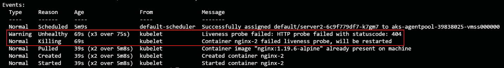

图 7.23:显示活性探测器如何失败的详细信息

在**描述**命令中，可以清楚地看到 Pod 没有通过活性探测器。三次失败后，容器被终止并重新启动。

实验以活性和准备状态探测结束。请记住，这两者对您的应用都很有用:就绪探测器可以用来暂时停止到您的 pod 的流量，因此它必须处理更少的负载。如果 Pod 出现实际故障，活性探测器将用于重启 Pod 。

我们还要确保清理您刚刚创建的部署:

kubectl 删除部署服务器 1 服务器 2

kubectl delete service web

活跃度和就绪性探测对于确保集群中只有健康的 Pod 才能接收流量非常有用。在下一节中，您将探索 Kubernetes 报告的不同指标，您可以使用这些指标来验证应用的状态。

## Kubernetes 报告的指标

Kubernetes 报告多个指标。在本节中，您将首先使用一些 **kubectl** 命令来获取这些指标。之后，您将查看 Azure Monitor 中的容器，了解 Azure 如何帮助进行容器监控。

### 节点状态和消耗

Kubernetes 中的节点是运行应用的服务器。Kubernetes 会将 pods 调度到集群中的不同节点。您需要监控节点的状态，以确保节点本身是健康的，并且节点有足够的资源来运行新的应用。

运行以下命令获取有关群集上节点的信息:

kubectl 获取节点

前面的命令列出了他们的姓名、状态和年龄:

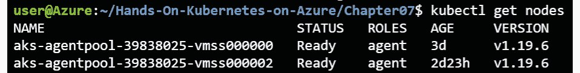

图 7.24:该集群中有两个节点

通过 **-o 宽**选项可以获得更多信息:

kubectl get -o 宽节点

输出列出底层 **OS-IMAGE** 、 **INTERNAL-IP** 等有用信息，可在*图 7.25* 查看:

图 7.25:使用-o 宽度增加了关于节点的更多细节

您可以使用以下命令找出消耗资源最多的节点:

kubectl top nodes

它显示了节点的 CPU 和内存使用情况:

图 7.26:节点的 CPU 和内存利用率

请注意，这是该时间点的实际消耗，而不是某个节点的请求数量。要获取请求，您可以执行以下操作:

kubectl 描述节点

这将显示每个 pod 的请求和限制，以及整个节点的累计数量:

图 7.27:描述节点显示了请求和限制的细节

正如您在*图 7.27* 中看到的那样，**描述节点**命令跨名称空间输出每个 pod 的请求和限制。这是群集操作者验证所有名称空间上的群集负载量的好方法。

现在您知道在哪里可以找到关于节点利用率的信息了。在下一节中，您将了解如何为单个 PODS 获取相同的指标。

### 荚果消耗

Pods 消耗 AKS 集群的 CPU 和内存资源。请求和限制用于配置 pod 可以消耗多少 CPU 和内存。请求用于保留最小数量的 CPU 和内存，而限制用于设置每个 pod 的最大 CPU 和内存数量。

在本节中，您将学习如何使用 **kubectl** 来获取关于 pods 的 CPU 和内存利用率的信息。

让我们从探索如何查看您当前运行的 pod 的请求和限制开始:

1.  For this example, you will use the pods running in the **kube-system** namespace. Get all the pods in this namespace:

    kubectl get pods -n cube system

    这应该会显示类似于*图 7.28* 的内容:

    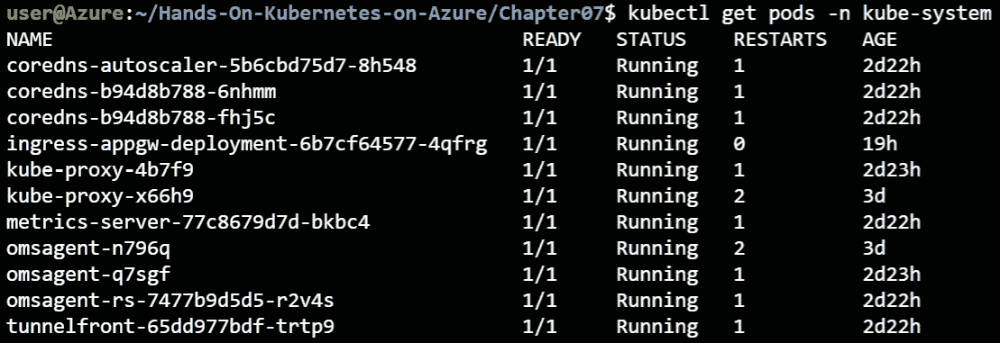

    图 7.28:运行在 kube 系统命名空间中的 pods

2.  Let's get the requests and limits for one of the **coredns** pods. This can be done using the **describe** command:

    `kubectl`特尔在核下 -N 库贝系统

    在**描述**命令中，应该有类似*图 7.29* 的部分:

图 7.29:核心域名系统的限制和请求

这说明这个 Pod 的内存限制是 **170Mi** ，没有 CPU 限制，请求 100 m CPU(也就是 0.1 个 CPU)和 **70Mi** 的内存。这意味着，如果这个 Pod 消耗了超过 170 MiB 的内存，Kubernetes 将重新启动那个 Pod 。Kubernetes 也为这个 pod 预留了 0.1 个 CPU 内核和 70 MiB 的内存。

请求和限制用于在集群中执行容量管理。您还可以获得 pod 的实际 CPU 和内存消耗。运行以下命令，您将获得所有名称空间中的实际 pod 使用情况:

kubectl 顶级 pods -所有名称空间

这将显示类似于图 7.30 的输出:

图 7.30:查看 pods 的 CPU 和内存消耗

使用 **kubectl top** 命令显示了该命令运行时的 CPU 和内存消耗。在这种情况下，您可以看到 **coredns** pods 使用的是 **3m** CPU 和 **10Mi** 内存。

在本节中，您已经使用了 **kubectl** 命令来深入了解集群中节点和单元的资源利用率。这是有用的信息，但仅限于特定的时间点。在下一节中，您将使用 Azure 门户获得有关集群和集群顶部应用的更多详细信息。您将从探索 **AKS 诊断**窗格开始。

## 使用 AKS 诊断

当您在 AKS 中遇到问题时，开始探索的好地方是 **AKS 诊断**面板。它为您提供了工具，帮助您调查与底层基础架构或系统集群组件相关的任何问题。

#### 注意:

在写这本书的时候，AKS 诊断正在预览中。这意味着可以添加或删除功能。

要访问 AKS 诊断，点击 AKS 菜单中的**诊断和解决问题**选项。这将打开诊断，如*图 7.31* 所示:

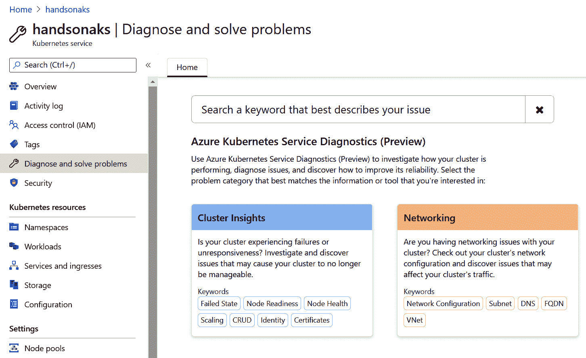

图 7.31:访问 AKS 诊断

AKS 诊断为您提供了两种诊断和探索问题的工具。一个是**集群洞察**，另一个是**联网**。Cluster Insights 使用集群上的集群日志和配置来执行运行状况检查，并将集群与最佳实践进行比较。它包含有用的信息和相关的健康指标，以防集群中出现任何错误配置。集群洞察的示例输出显示在*图 7.32* 中:

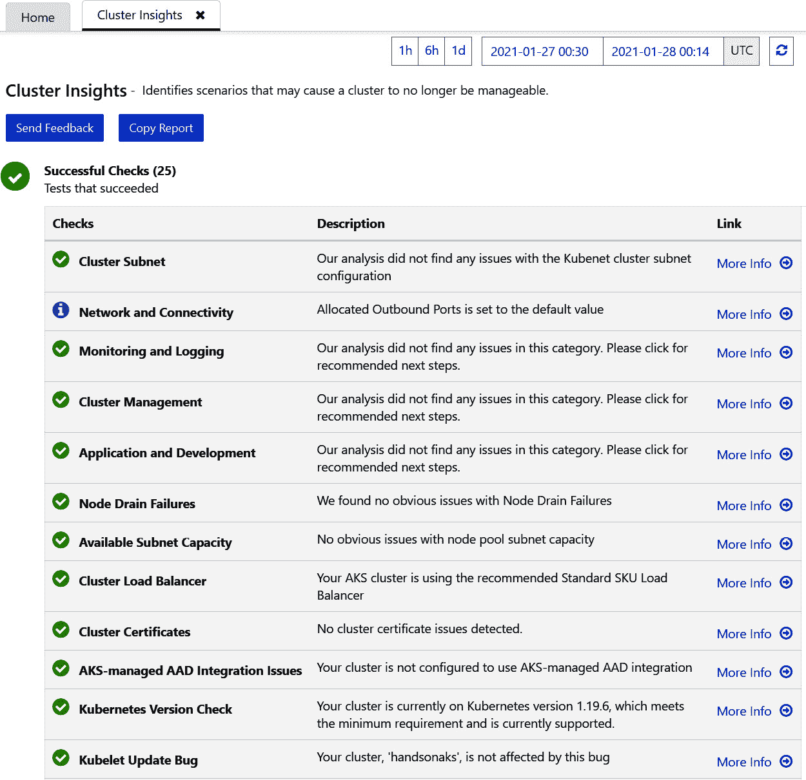

图 7.32:集群洞察的输出示例

AKS 诊断的网络部分允许您交互式地解决集群中的网络问题。当您打开“网络”视图时，会出现几个问题，这些问题会触发网络运行状况检查和配置审查。一旦您选择了其中一个选项，交互工具将给出这些检查的输出，如图 7.33*所示:*

图 7.33:使用 AKS 诊断工具诊断网络问题

当您在群集上面临基础架构问题时，使用 AKS 诊断非常有用。该工具会对您的环境进行扫描，并验证是否一切运行正常且配置良好。但是，它不会扫描您的应用。这就是 Azure Monitor 的用武之地；它允许您监控应用并访问应用日志。

## Azure 监控指标和日志

在本章的前面，您使用 **kubectl** 命令行工具探索了集群中节点和荚的状态和度量。在 Azure 中，您可以从节点和 pods 中获取更多指标，并从集群中的 pods 中浏览日志。让我们从探索 Azure 门户中的 AKS Insights 开始。

### AKS 洞察

AKS 窗格的**洞察**部分提供了您需要了解的关于集群的大部分指标。它还能够深入到容器级别。您还可以看到容器的日志。

#### 注意:

AKS 窗格的洞察部分依赖于 Azure 容器监视器。如果您使用门户默认设置创建了群集，则默认情况下会启用该设置。

Kubernetes 提供度量标准，但不存储它们。Azure Monitor 可用于存储这些指标，并使它们可以随时查询。为了将相关的度量和日志收集到 Insights 中，Azure 连接到 Kubernetes API 来收集度量和日志，然后将它们存储在 Azure Monitor 中。

#### 注意:

容器的日志可能包含敏感信息。因此，应该控制和审核查看日志的权限。

让我们从集群指标开始，探索 AKS 窗格的**洞察**选项卡。

### 集群度量

**洞察**显示集群指标。*图 7.34* 显示了集群中所有节点的 CPU 利用率和内存利用率。您可以选择添加附加筛选器来筛选特定的命名空间、节点或节点池。还有一个实时选项，可为您提供有关集群状态的更多实时信息:

图 7.34:集群选项卡显示了集群的 CPU 和内存利用率

群集指标还显示节点数和活动盒数。节点计数很重要，因为您可以跟踪是否有任何节点处于**未就绪**状态:

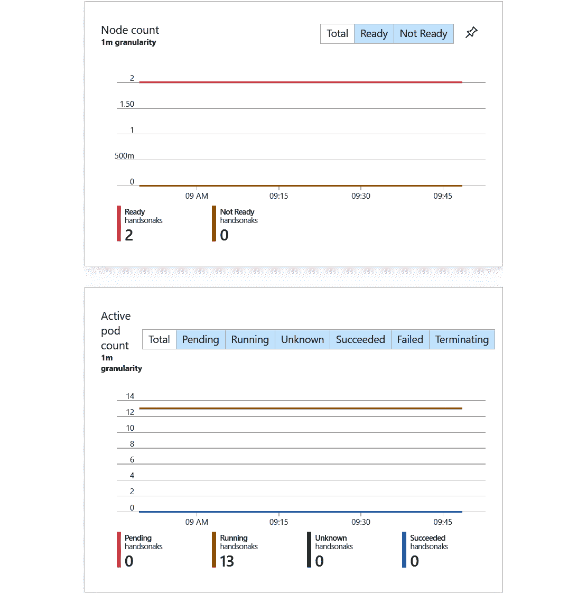

图 7.35:集群选项卡显示了节点数量和活动盒的数量

**集群**选项卡可用于监控集群中节点的状态。接下来，您将浏览**报告**选项卡。

### 报告

AKS Insights 中的**报告**选项卡允许您访问许多预配置的监控工作簿。这些工作簿将文本、日志查询、指标和参数结合在一起，并为您提供丰富的交互式报告。您可以深入查看每个单独的报告，以获取更多信息和预构建的日志查询。可用报告见*图 7.36* :

#### 注意

撰写本书时，报告功能处于预览状态。

图 7.36:报告选项卡允许您访问预配置的监控工作簿

例如，您可以浏览**部署**工作簿。这在*图 7.37* 中显示:

图 7.37:部署工作簿显示了您的部署状态

这将向您显示默认情况下的所有部署、它们的运行状况以及最新状态。正如您所看到的，它向您显示了当您在本章前面用活动和就绪探测进行探索时**服务器 1** 暂时不可用。

您可以深入了解各个部署的状态。如果您点击在*图 7.37* 中突出显示的**日志**按钮，您将被重定向到带有预建查询的日志分析。然后，您可以修改该查询并更深入地了解您的工作负载，如图 7.38*所示。*

 *

图 7.38:深入查看日志分析，了解部署的更多详细信息

#### 注意:

日志分析中使用的查询使用**库斯托查询语言** ( **KQL** )。要了解更多关于 KQL 的信息，请参考文档:[https://docs . Microsoft . com/azure/data-explorer/kusto/concepts/](https://docs.microsoft.com/azure/data-explorer/kusto/concepts/)

AKS Insights 中的**报告**选项卡为您提供了许多预构建的监控工作簿。下一个标签是**节点**标签。

### 节点

**节点**视图显示了节点的详细指标。它还向您展示了每个节点上运行的 Pod ，如您在*图 7.39* 中所见:

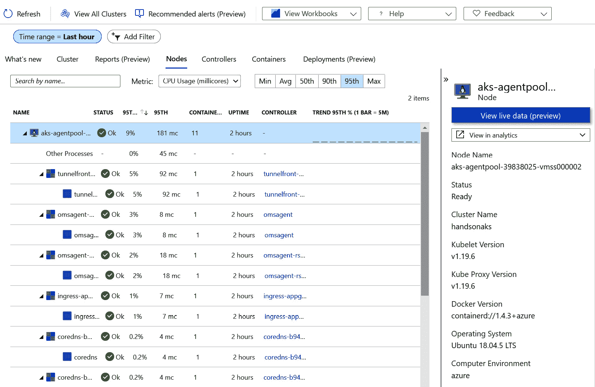

图 7.39:节点窗格中节点的详细度量

请注意，可以从搜索栏旁边的下拉菜单中查看不同的指标。如果您需要更多的详细信息，您也可以点击并从您的节点获取 Kubernetes 事件日志:

图 7.40:单击查看 Kubernetes 事件日志，从集群中获取日志

这将打开 Azure 日志分析，并将为您预先创建一个查询，显示您的节点的日志。在*图 7.41* 中的示例中，您可以看到节点重新启动了几次，并且还发出了**invaliddiscapacity**警告:

图 7.41:显示节点日志的日志分析

这为您提供了有关节点状态的信息。接下来，您将探索**控制器**选项卡。

### 控制器

**控制器**选项卡向您显示集群上所有控制器(即复制集、DaemonSets 等)的详细信息以及在其中运行的单元。这向您展示了以控制器为中心的运行 Pod 视图。比如你可以找到**服务器 1** 副本集，看到里面运行的所有 PODS 和容器，如图*图 7.42* :

图 7.42:控制器选项卡显示了在复制集中运行的所有 Pod 

下一个选项卡是**容器**选项卡，它将向您显示容器的度量、日志和环境变量。

### 容器度量、日志和环境变量

点击**容器**选项卡，列出容器度量、环境变量和对其日志的访问，如图*图 7.43* 所示:

图 7.43:容器选项卡向我们显示了所有单独的容器

#### 注意:

您可能会注意到几个状态为**未知**的容器。如果**洞察**窗格中的容器具有**未知**状态，这是因为 Azure Monitor 具有关于该容器的日志和信息，但是该容器不再在集群上运行。

您也可以从该视图访问容器的日志:

图 7.44:访问容器的日志

这将向您显示 Kubernetes 从您的应用中记录的所有日志。在本章的前面，您使用了 **kubectl** 来访问容器日志。使用这种方法可以提高工作效率，因为您可以在一个视图中编辑日志查询并关联来自不同 pod 和应用的日志:

图 7.45:日志被收集并且可以被查询

除了日志，该视图还显示了为容器设置的环境变量。要查看环境变量，向下滚动**容器**视图的右单元格:

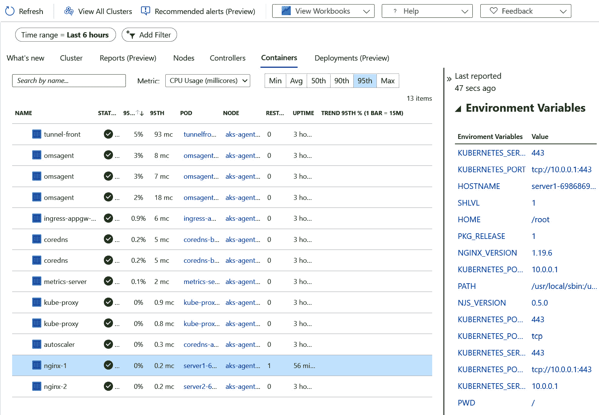

图 7.46:为容器设置的环境变量

AKS Insights 中的最后一个选项卡是**部署**选项卡，接下来您将探索该选项卡。

### 部署

最后一个标签是**部署**标签。此选项卡为您提供集群中所有部署的概述，并允许您通过选择它来获得部署的定义。如您在*图 7.47* 中所见，您可以在**description**(文本格式)或 **RAW** (YAML 格式)中获得此视图:

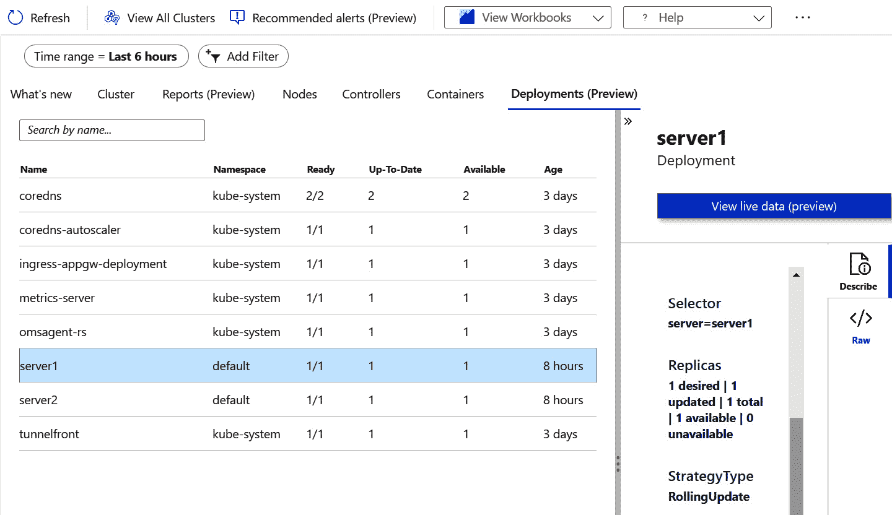

图 7.47:AKS 洞察中的部署选项卡

通过使用 AKS 中的**洞察**面板，您可以获得关于集群的详细信息。您研究了本节中的不同选项卡，并了解了如何深入查看和访问可自定义的日志查询，以获得更多信息。

这一部分到此结束。让我们确保使用以下命令清理本章中创建的所有资源:

kubectl delete -f

在本节中，您探讨了在 Kubernetes 之上运行的监控应用。您使用 Azure 门户中的 AKS **Insights** 选项卡来获得集群和集群上运行的容器的详细视图。

## 总结

本章首先学习如何使用不同的 **kubectl** 命令来监控应用。然后，您探索了如何使用在 Kubernetes 中创建的日志来调试该应用。日志包含写入**标准输出**和**标准输出**的所有信息。

之后，您切换到 Azure 门户，并开始使用 AKS 诊断来探索基础架构问题。最后，您探索了使用 Azure Monitor 和 AKS Insights 来显示 AKS 指标和环境变量，以及带有日志过滤的日志。

在下一章中，您将学习如何将 AKS 集群连接到 Azure PaaS 服务。您将特别关注如何将 AKS 集群连接到由 Azure 管理的 MySQL 数据库。*