# 八、AKS 中基于角色的访问控制

到目前为止，您一直在使用一种形式的访问**Azure Kubernetes Service**(**AKS**)的方式，该方式为您提供了创建、读取、更新和删除集群中所有对象的权限。这对测试和开发非常有用，但不建议在生产集群上使用。在生产集群上，建议利用 Kubernetes 中的**基于角色的访问控制** ( **RBAC** )只授予用户有限的一组权限。

在本章中，您将更深入地探索Kubernetes·RBAC。你将在Kubernetes被介绍 RBAC 的概念。然后，您将在 Kubernetes 中配置 RBAC，并将其与 **Azure 活动目录** ( **Azure AD** )集成。

本章将涵盖以下主题:

*   RBC 在Kubernetes
*   在您的 AKS 集群中启用 Azure AD 集成
*   在 Azure AD 中创建用户和组
*   在 AKS 中配置 RBAC
*   Verifying RBAC for a user

    #### 注意

    要在 RBAC 完成该示例，您需要具有全局管理员权限的 Azure AD 实例的访问权限。

让我们从解释 RBAC 开始这一章。

## RBAC 在Kubernetes解释道

在生产系统中，您需要允许不同的用户以不同的级别访问某些资源；这就是著名的 **RBAC** 。建立 RBAC 的好处是，它不仅可以防止意外删除关键资源，而且还是一项重要的安全功能，将对群集的完全访问权限限制在真正需要的角色。在启用 RBAC 的群集上，用户只能访问和修改他们拥有权限的资源。

到目前为止，使用 Cloud Shell，您一直充当*根*，这允许您在集群中做任何事情和所有事情。对于生产用例，根访问是危险的，应该尽可能地加以限制。使用**最低权限原则** ( **PoLP** )登录任何计算机系统是一种普遍接受的最佳实践。这既防止了对安全数据的访问，也防止了通过删除关键资源而导致的意外停机。22%到 29%的数据丢失都是人为错误造成的。你不想成为统计数据的一部分。

Kubernetes 开发人员意识到这是一个问题，并在 Kubernetes 中添加了 RBAC 以及服务角色的概念来控制对集群的访问。Kubernetes·RBAC 有三个重要的概念:

*   **角色**:角色包含一组权限。一个角色默认为**无权限**，每个权限都需要专门调用。权限示例包括**获取**、**观看**、**列表**。该角色还包含这些权限被授予哪些资源。资源可以是所有 pod、部署等，也可以是特定对象(如 **pod/mypod** )。
*   **主体**:主体或者是人，或者是被分配了角色的服务账户。在与 Azure AD 集成的 AKS 集群中，这些主体可以是 Azure AD 用户或组。
*   **角色绑定**:角色绑定将主体链接到某个命名空间中的角色，或者在集群角色绑定的情况下，链接到整个集群。

需要理解的一个重要概念是，当与 AKS 接口时，有两层 RBAC: Azure RBAC 和 Kubernetes RBAC，如图*图 8.1* 所示。Azure RBAC 处理赋予人们在 Azure 中进行更改的角色，例如创建、修改和删除集群。Kubernetes RBAC 处理对集群中资源的访问权限。两者都是独立的控制平面，但可以使用源自 Azure AD 的相同用户和组。

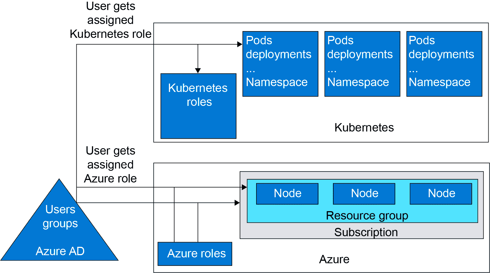

图 8.1:两种不同的 RBAC 飞机，Azure和Kubernetes

Kubernetes的 RBAC 是一个可选功能。AKS 中的默认设置是创建启用了 RBAC 的集群。但是，默认情况下，群集不与 Azure AD 集成。这意味着默认情况下，您不能将 Kubernetes 权限授予 Azure AD 用户。在接下来的部分中，您将在集群中启用 Azure AD 集成。

## 在您的 AKS 集群中启用 Azure AD 集成

在本节中，您将更新您现有的集群，以包括 Azure AD 集成。您将使用 Azure 门户实现这一点:

#### 注意

一旦群集与 Azure AD 集成，就不能禁用此功能。

1.  To start, you will need an Azure AD group. You will later give admin privileges for your AKS cluster to this group. To create this group, search for **azure active directory** in the Azure search bar:

    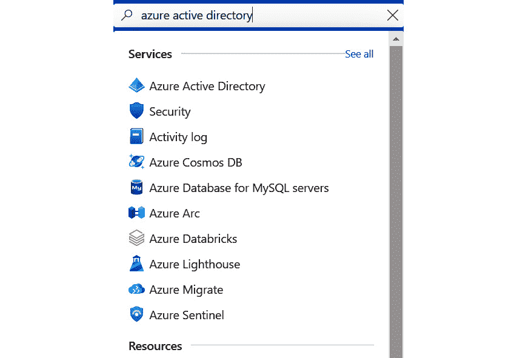

    图 8.2:在 azure 搜索栏中搜索 Azure 活动目录

2.  In the left pane, select Groups, which will bring you to the All groups screen. Click + New Group, as shown in *Figure 8.3*:

    

    图 8.3:创建一个新的 Azure AD 组

3.  On the resulting page, create a security group and give it a name and description. Select your user as the owner and a member of this group. Click the Create button on the screen:

    

    图 8.4:提供创建 Azure AD 组的细节

4.  Now that this group is created, search for your Azure cluster in the Azure search bar to open the AKS pane:

    

    图 8.5:在 Azure 搜索栏中搜索集群

5.  在 AKS 窗格中，选择设置下的集群配置。在此窗格中，您将能够打开 AKS 管理的 Azure 活动目录。启用该功能并选择您之前创建的 Azure 广告组，将其设置为管理员 Azure 广告组。最后点击命令栏中的保存按钮，如图*图 8.6* :

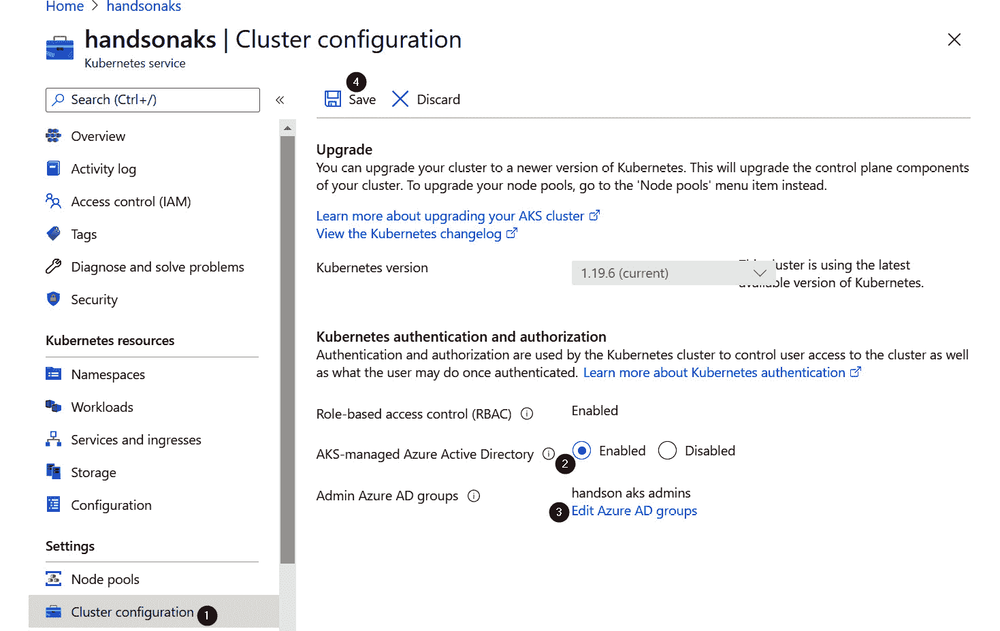

图 8.6:启用 AKS 管理的 Azure 活动目录并单击保存按钮

这使得 Azure AD 能够在您的 AKS 集群上集成 RBAC。在下一节中，您将创建一个新用户和一个新组，这些用户和组将在下一节中用于在 Kubernetes 中设置和测试 RBAC。

## 在 Azure AD 中创建用户和组

在本节中，您将在 Azure AD 中创建新用户和新组。您将在本章后面使用它们来为您的 AKS 集群分配权限:

#### 注意

您需要 Azure AD 中的*用户管理员角色*才能创建用户和组。

1.  To start with, search for **azure active directory** in the Azure search bar:

    

    图 8.7:在搜索栏中搜索 azure 活动目录

2.  Click on All users in the left pane. Then select + New user to create a new user:

    

    图 8.8:点击+新用户创建新用户

3.  Provide the information about the user, including the username. Make sure to note down the password, as this will be required to sign in:

    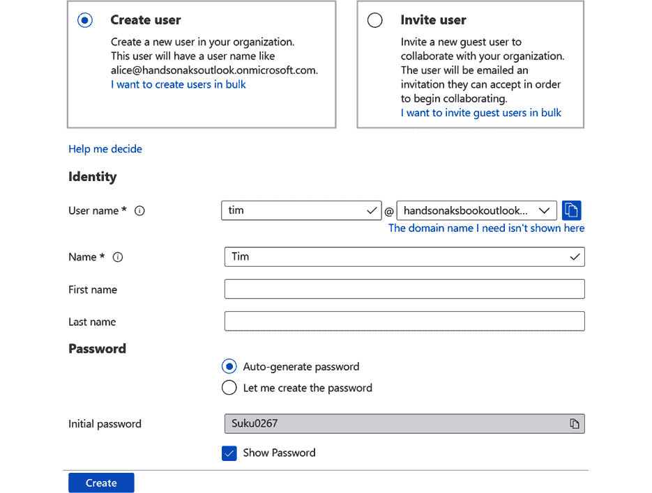

    图 8.9:提供用户详细信息

4.  Once the user is created, go back to the Azure AD pane and select Groups. Then click the + New group button to create a new group:

    

    图 8.10:点击+新建组创建新组

5.  Create a new security group. Call the group **handson aks users** and add **Tim** as a member of the group. Then hit the Create button at the bottom:

    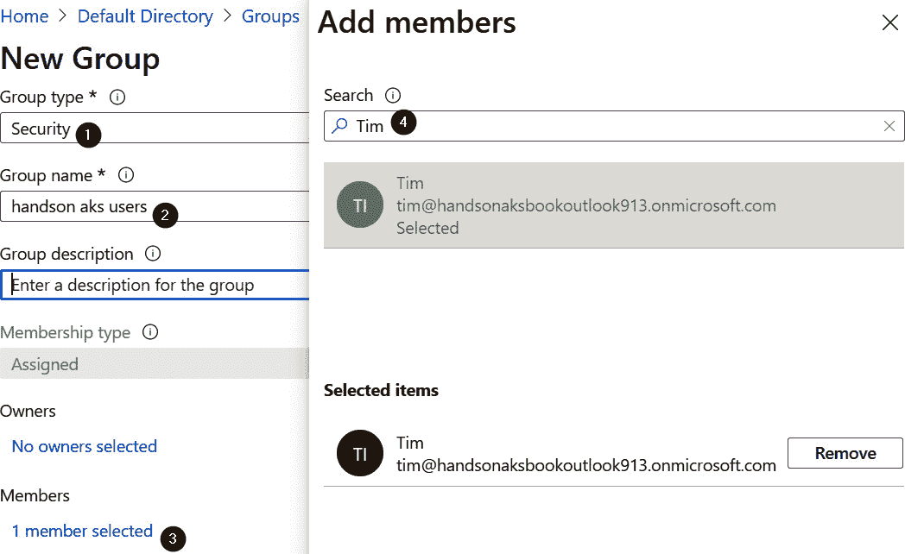

    图 8.11:提供组类型、组名称和组描述

6.  You have now created a new user and a new group. Next, you'll make that user a cluster user in AKS RBAC. This enables them to use the Azure CLI to get access to the cluster. To do that, search for your cluster in the Azure search bar:

    

    图 8.12:在 Azure 搜索栏中搜索集群

7.  In the cluster pane, click on Access control (IAM) and then click on the + Add button to add a new role assignment. Select Azure Kubernetes Service Cluster User Role and assign that to the new user you just created:

    

    图 8.13:将集群用户角色分配给您创建的新用户

8.  As you will also be using Cloud Shell with the new user, you will need to give them contributor access to the Cloud Shell storage account. First, search for **storage** in the Azure search bar:

    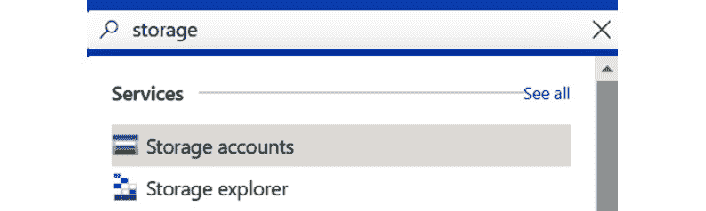

    图 8.14:在 Azure 搜索栏中搜索存储

9.  There should be a storage account under Resource group with a name that starts with cloud-shell-storage. Click on the resource group:

    

    图 8.15:选择资源组

10.  进入访问控制，点击+添加按钮。将存储帐户贡献者角色授予您新创建的用户:

图 8.16:为新用户分配存储帐户贡献者角色

这已经结束了新用户和组的创建，并给予该用户访问 AKS 的权限。在下一节中，您将在 AKS 集群中为该用户和组配置 RBAC。

## 在 AKS 中配置 RBAC

为了在 AKS 中演示 RBAC，您将创建两个名称空间，并在每个名称空间中部署 Azure 投票应用。您将授予组集群范围内对 pods 的只读访问权限，并且您将授予用户仅在一个命名空间中删除 pods 的能力。实际上，您需要在 Kubernetes 中创建以下对象:

*   **集群角色**授予只读访问权限
*   **集群角色绑定**授予该组对此角色的访问权限
*   **角色**在**删除-访问**命名空间中授予删除权限
*   **角色绑定**授予用户访问该角色的权限

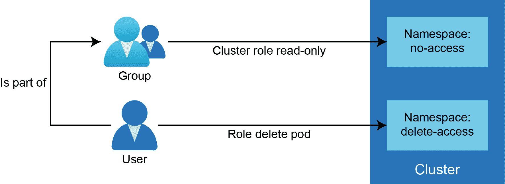

图 8.17:组获得整个集群的只读访问权限，用户获得删除访问命名空间的删除权限

让我们在您的集群上设置不同的角色:

1.  To start our example, you will need to retrieve the ID of the group. The following commands will retrieve the group ID:

    az ad group show-g ' handson AK 用户'

    -查询 objectId -o tsv

    这将显示您的群标识。请记下这一点，因为您将在接下来的步骤中需要它:

    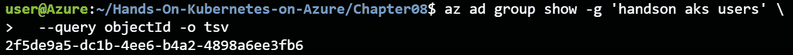

    图 8.18:获取组标识

2.  In Kubernetes, you will create two namespaces for this example:

    kubectl 创建 ns 禁止访问

    kubectl 创建 ns 删除-访问

3.  You will also deploy the **azure-vote** application in both namespaces:

    kube CTL create-f azure-vote . YAML-n 禁止访问

    kube CTL create-f azure-vote . YAML-n delete-access

4.  Next, you will create the **ClusterRole** object. This is provided in the **clusterRole.yaml** file:

    1 版本:rbac.authorization.k8s.io/v1

    2 子代:群集角色

    3 元数据:

    4 名称:只读

    5 条规则:

    6 - apiGroups: [""]

    7 资源:[“pods”]

    8 个动词:[“获取”、“观察”、“列表”]

    让我们仔细看看这个文件:

    *   **第 2 行**:定义**集群角色**实例的创建
    *   **第 4 行**:给我们的**集群角色**实例命名
    *   **第 6 行**:允许访问所有 API 组
    *   **7 号线**:允许进入所有Pod 
    *   **第 8 行**:进入动作**获取**、**手表**和**列表**

    我们将使用以下命令创建**集群角色**:

    忽必烈 create -f clusterRole.yaml

5.  The next step is to create a cluster role binding. The binding links the role to a user or a group. This is provided in the **clusterRoleBinding.yaml** file:

    1 版本:rbac.authorization.k8s.io/v1

    2 个孩子:群集角色绑定

    3 元数据:

    4 名称:readOnlyBinding

    5 个角色:

    6 个孩子:群集角色

    7 名称:只读

    8 ApiGroup:RBAC . authorization . k8s . io

    9 个主题:

    10 种:团体

    11 ApiGroup:RBAC . authorization . k8s . io

    12 名称:“<group-id>”</group-id>

    让我们仔细看看这个文件:

    *   **第 2 行**:定义我们正在创建一个**集群角色绑定**实例。
    *   **第 4 行**:给**集群角色绑定**起一个名字。
    *   **第 5-8 行**:参考上一步创建的**集群角色**对象
    *   **第 9-12 行**:参考你在 Azure AD 的群。确保将*第 12 行*上的**T6 组号>T3 替换为您之前获得的组号。**

    我们可以使用以下命令创建**集群角色绑定**:

    多维数据集创建-f 群集 RoleBinding.yaml

6.  Next, you'll create a role that is limited to the **delete-access** namespace. This is provided in the **role.yaml** file:

    1 版本:rbac.authorization.k8s.io/v1

    2 类:角色

    3 元数据:

    4 名称:删除角色

    5 命名空间:删除-访问

    6 条规则:

    7 - apiGroups: [""]

    8 资源:[“pods”]

    9 个动词:["删除"]

    该文件类似于早期的**集群角色**对象。有两个有意义的区别:

    *   **第 2 行**:定义您正在创建一个**角色**实例，而不是**集群角色**实例
    *   **第 5 行**:定义创建该角色的命名空间

    您可以使用以下命令创建**角色**:

    kubi KL create-f role . YAML 角色

7.  Finally, you will create a **RoleBinding** instance that links our user to the namespace role. This is provided in the **roleBinding.yaml** file:

    1 版本:rbac.authorization.k8s.io/v1

    2 种:角色绑定

    3 元数据:

    4 名称:删除绑定

    5 命名空间:删除-访问

    6 个角色:

    7 类:角色

    8 名称:删除角色

    9 ApiGroup:RBAC . authorization . k8s . io

    10 个主题:

    11 类:用户

    12 ApiGroup:RBAC . authorization . k8s . io

    13 名称:“<user e-mail="" address="">”</user>

    该文件类似于早期的**集群角色绑定**对象。有几个有意义的区别:

    *   **第 2 行**:定义创建一个**角色绑定**实例，而不是**集群角色绑定**实例
    *   **第 5 行**:定义这个**角色绑定**实例创建的命名空间
    *   **第 7 行**:指常规角色，而不是**集群角色**实例
    *   **第 11-13 行**:定义用户而不是组

    您可以使用以下命令创建**角色绑定**:

    多维数据集创建-f roleBinding.yaml

这就完成了对 RBAC 的要求。您已经创建了两个角色— **集群角色**和一个名称空间绑定角色，并设置了两个**角色绑定**对象— **集群角色绑定**和名称空间绑定**角色绑定**。在下一节中，您将通过以新用户身份登录群集来探索 RBAC 的影响。

## 为用户验证 RBAC

为了验证 RBAC 是否按预期工作，您将使用新创建的用户登录到 Azure 门户。在新浏览器或 InPrivate 窗口中转到[https://portal.azure.com](08.html)，并使用新创建的用户登录。系统会立即提示您更改密码。这是 Azure AD 中的一项安全功能，可确保只有该用户知道自己的密码:

图 8.19:您将被要求更改密码

更改密码后，您可以开始测试不同的 RBAC 角色:

1.  You will start this experiment by setting up Cloud Shell for the new user. Launch Cloud Shell and select Bash:

    

    图 8.20:在云外壳中选择 Bash

2.  In the next dialog box, select Show advanced settings:

    

    图 8.21:选择显示高级设置

3.  Then, point Cloud Shell to the existing storage account and create a new file share:

    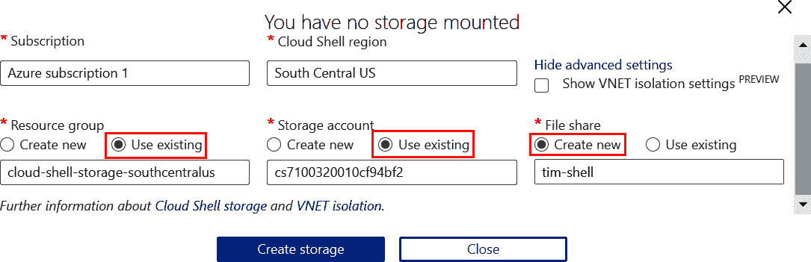

    图 8.22:指向现有存储帐户并创建新的文件共享

4.  Once Cloud Shell is available, get the credentials to connect to the AKS cluster:

    az aks get-凭证-n hand onaks-g rg-hand onaks

    然后，在 **kubectl** 中尝试一个命令。让我们尝试获取集群中的节点:

    kubectl 获取节点

    由于这是针对启用 RBAC 的群集执行的第一个命令，因此要求您再次登录。浏览[https://microsoft.com/devicelogin](08.html)，提供云壳给你看的代码(该代码在*图 8.24* 中高亮显示)。请确保您使用新的用户凭据在此登录:

    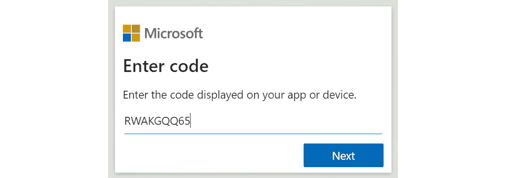

    图 8.23:复制并粘贴提示中显示的代码 Cloud Shell

    登录后，您应该会收到来自 **kubectl** 的**禁止**错误消息，通知您没有权限查看集群中的节点。这是意料之中的，因为用户被配置为只能访问 pods:

    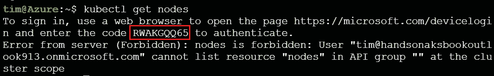

    图 8.24:要求您登录的提示和禁止消息

5.  Now you can verify that your user has access to view pods in all namespaces and that the user has permission to delete pods in the **delete-access** namespace:

    kubectl get pods -n 禁止访问

    kubectl get pods -n delete-access

    这对于两个名称空间都应该成功。这是由于为用户组配置了**集群角色**对象:

    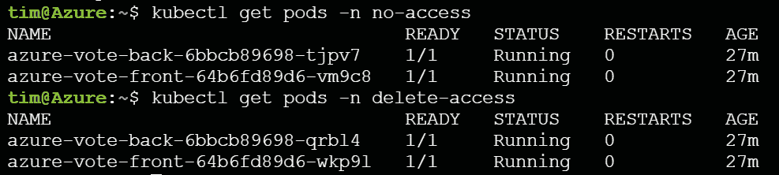

    图 8.25:用户可以访问两个名称空间中的视图窗格

6.  Let's also verify the **delete** permissions:

    kubectl 删除 pod - all -n 禁止访问

    kubectl 删除 pod - all -n 删除-访问

    不出所料，这在**非访问**命名空间中被拒绝，而在**删除访问**命名空间中被允许，如*图 8.26* 所示:

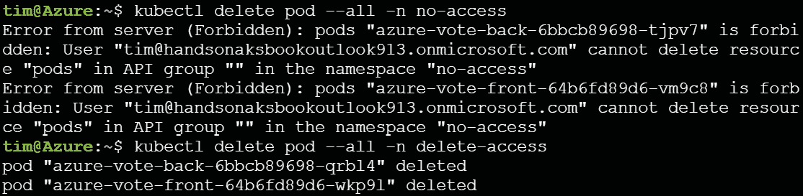

图 8.26:在无访问命名空间中拒绝删除，在删除访问命名空间中允许删除

在本节中，您已经在 Kubernetes 集群上验证了 RBAC 的功能。由于这是本章的最后一节，让我们确保清理集群中的部署和名称空间。请确保使用您的主要用户而不是新用户从 Cloud Shell 执行这些步骤:

忽必烈删除 f 蓝票 yaml -n 禁止进入

kube CTL delete-f azure-vote . YAML-n delete-access

kubectl delete -f .

kubectl 删除 ns 不可访问

kubectl delete ns delete-access

RBAC 在 AKS 上的概述到此结束。

## 总结

在这一章中，你在 AKS 上了解了 RBAC。您启用了 Azure AD–将 RBAC 集成到您的群集中。之后，您创建了一个新的用户和组，并在集群上设置了不同的 RBAC 角色。最后，您使用该用户登录，并能够验证所配置的 RBAC 角色是否为您提供了对您期望的群集的有限访问权限。

这涉及用户如何访问您的 Kubernetes 集群。在您的集群上运行的 pods 可能还需要 Azure AD 中的一个标识，它们可以使用该标识来访问 Azure 服务中的资源，例如 Blob 存储或密钥库。在下一章中，您将了解关于这个用例的更多信息，以及如何使用 AKS 中的 Azure AD pod 标识来设置这个用例。