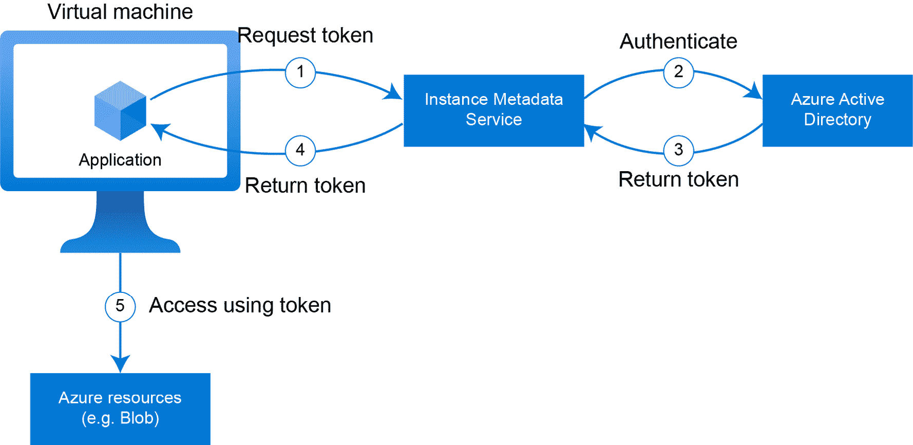
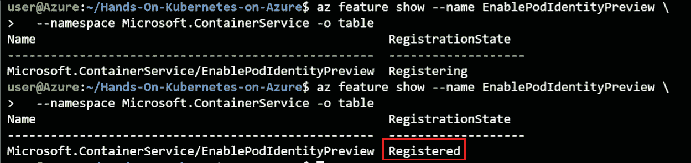
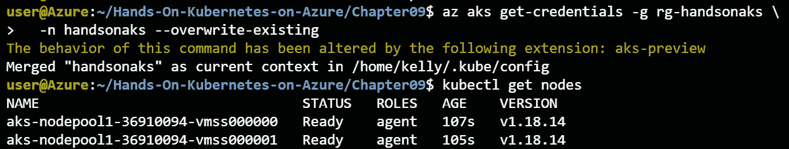
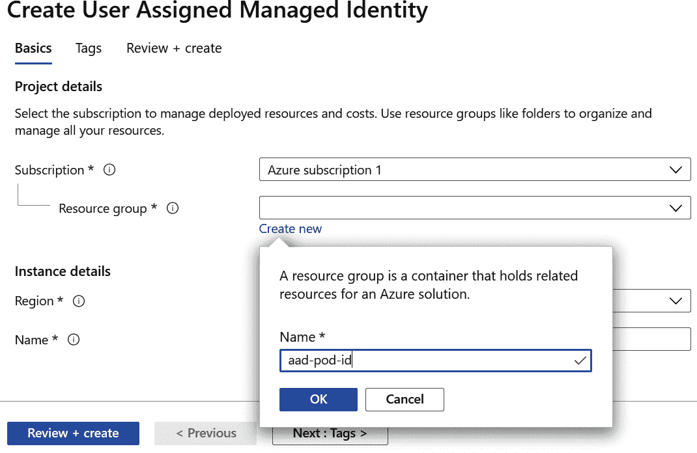
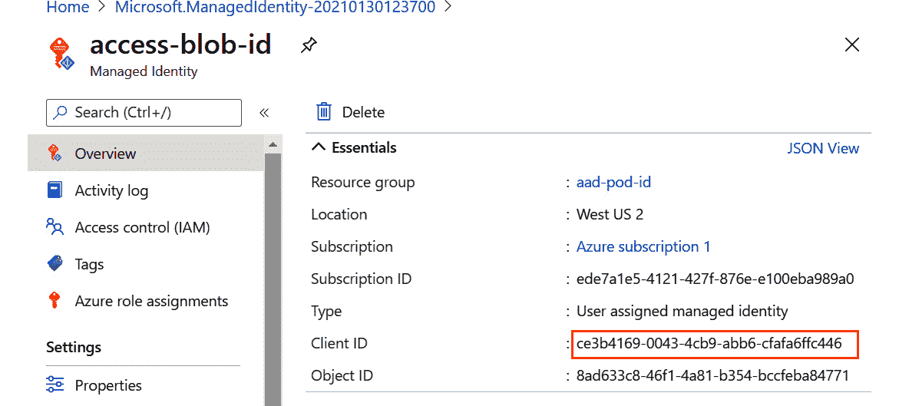
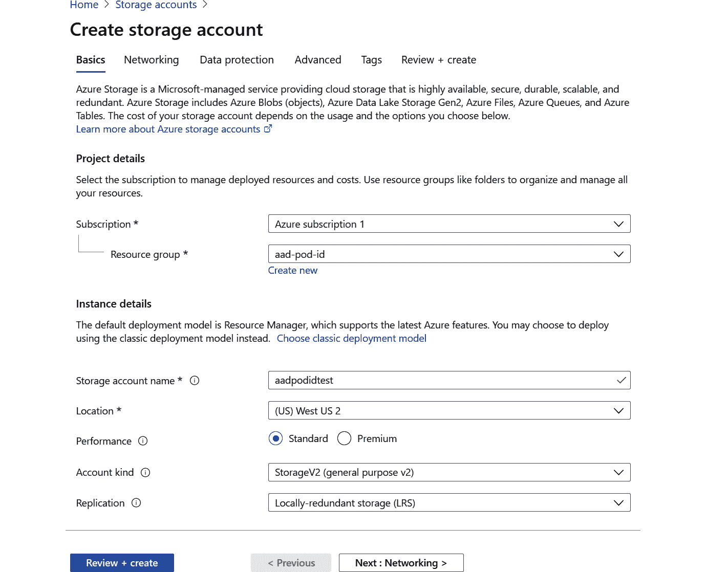
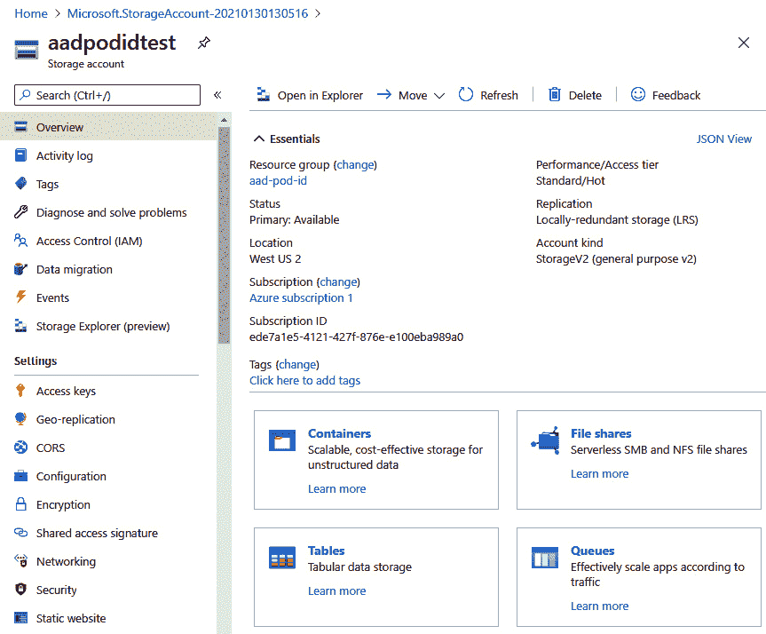
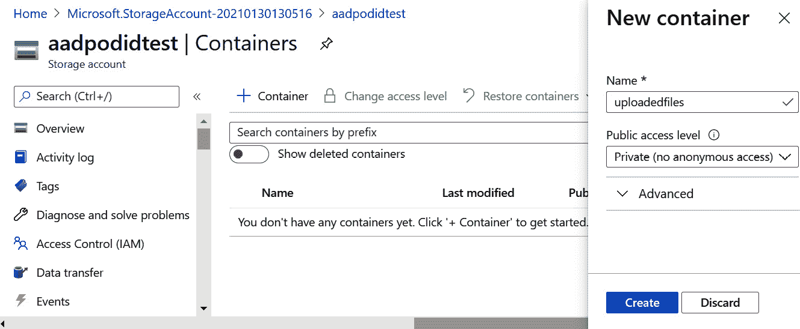

# 9.AKS 中 Azure 活动目录 pod 管理的身份

在前一章*第 8 章，基于角色的访问控制在 AKS* 中，您将您的 AKS 集群与**Azure Active Directory**(**Azure AD**)进行了集成。然后，您将 Kubernetes 角色分配给 Azure AD 中的用户和组。在这一章中，您将探索如何将您在 AKS 上运行的应用程序与 Azure AD 集成，并且您将学习如何在 Azure 中为您的 pods 赋予一个身份，以便它们可以与其他 Azure 资源进行交互。

在 Azure 中，应用程序标识使用一种称为服务主体的功能。服务主体相当于云中的服务帐户。应用程序可以使用服务主体向 Azure AD 进行身份验证，并获得对资源的访问权限。这些资源可以是 Azure 资源，如 Azure Blob 存储或 Azure 密钥库，也可以是您开发的与 Azure AD 集成的应用程序。

有两种方法来验证服务主体:可以使用密码，也可以使用证书和私钥的组合。虽然这些都是验证应用程序的安全方法，但是管理密码或证书以及与之相关的循环可能会很麻烦。

Azure 中的托管身份是一种功能，它使向服务主体进行身份验证变得更加容易。它通过为 Azure 中的计算资源(如虚拟机或 Azure 函数)分配标识来工作。这些计算资源可以通过调用只有该机器才能到达的端点，使用该托管身份进行身份验证。这是一种安全的身份验证类型，不需要您管理密码或证书。

Azure AD pod 管理的身份允许您将管理的身份分配给 Kubernetes 中的 pod。由于 Kubernetes 中的 pod 运行在虚拟机上，因此默认情况下，每个 pod 都能够访问托管身份端点并使用该身份进行身份验证。使用 Azure AD pod 管理的身份，pod 不能再到达虚拟机的内部端点，而只能访问分配给该特定 pod 的身份。

在本章中，您将在 AKS 集群上配置 Azure AD pod 管理的身份，并使用它来访问 Azure Blob 存储。在下一章中，您将使用这些 Azure AD pod 管理的身份来访问 Azure 密钥库并管理 Kubernetes 的秘密。

本章将简要介绍以下主题:

*   Azure AD pod 管理的身份概述
*   使用 Azure AD pod 管理的身份设置新集群
*   将身份链接到您的集群
*   使用具有托管身份的 pod

让我们从 Azure AD pod 管理的身份概述开始。

## Azure AD pod 管理的身份概述

本节的目标是描述 Azure 管理的身份和 Azure AD pod 管理的身份。

正如在介绍中所解释的，Azure 中的托管身份是一种安全认证运行在 Azure 中的应用程序的方法。Azure 中有两种类型的托管身份。它们之间的区别在于它们与资源的关联方式:

*   **系统分配的**:这种类型的托管身份 1:1 链接到资源(如虚拟机)本身。此托管身份还共享资源的生命周期，这意味着一旦删除资源，托管身份也将被删除。
*   **用户分配的**:用户分配的托管身份是独立的 Azure 资源。用户分配的托管身份可以链接到多个资源。删除资源时，不会删除托管身份。

一旦创建并链接到资源，这两种类型的托管身份的工作方式相同。从应用程序的角度来看，托管身份是这样工作的:

1.  您在 Azure 中运行的应用程序向**实例元数据服务** ( **IMDS** )请求令牌。IMDS 只能用于该资源本身，位于不可路由的 IP 地址( **169.254.169.254** )。
2.  IMDS 将向天蓝色广告申请代币。它使用的证书是为您的托管身份配置的，只有 IMDS 知道。
3.  Azure AD 将向 IMDS 返回一个令牌，后者又会将该令牌返回给您的应用程序。
4.  您的应用程序可以使用该令牌向其他资源进行身份验证，例如 Azure Blob 存储。

图 9.1:Azure 虚拟机中的托管身份

在 Kubernetes 群集中的单个虚拟机上运行多个 pod 时，默认情况下，每个 pod 都可以到达 IMDS 端点。这意味着每个 pod 都可以访问为该虚拟机配置的身份。

AKS 的 Azure AD pod 管理的身份附加组件以这样一种方式配置您的集群，即 pod 不能再直接访问 IMDS 端点来请求访问令牌。它以这样一种方式配置您的群集，即试图访问 IMDS 端点(1)的 pods 将连接到群集上运行的 DaemonSet。这个 DaemonSet 被称为**节点管理的身份** ( **NMI** )。NMI 将验证 pod 应该访问哪些身份。如果 pod 配置为可以访问请求的身份，则 DaemonSet 将连接到 IMDS (2 到 5)以获取令牌，然后将令牌传递给 pod (6)。豆荚可以使用这个令牌来访问 Azure 资源(7)。

图 9.2: Azure AD pod 管理的身份

通过这种方式，您可以控制集群中的哪些豆荚可以访问某些身份。

Azure AD pod 管理的身份最初是由微软在 GitHub 上作为开源项目开发的。最近，微软发布了 Azure AD pod 管理的身份作为 AKS 附加组件。使用 Azure AD pod 管理的身份作为 AKS 附加组件的好处是，该功能得到了微软的支持，并且该软件将作为常规集群操作的一部分自动更新。

#### 注意

在撰写本文时，Azure AD pod 管理的身份附加组件处于预览状态。目前，Windows 容器也不支持它。不建议对产品用例使用预览功能。

现在您已经知道了 Azure AD pod 管理的身份是如何工作的，让我们在下一节中在 AKS 集群上设置它。

## 使用 Azure AD pod 管理的身份设置新集群

如前一节所述，有两种方法可以在 AKS 中设置 Azure AD pod 管理的身份。这可以通过使用 GitHub 上的开源项目来完成，也可以通过将其设置为 AKS 插件来完成。通过使用附加组件，您将获得一个受支持的配置，这就是为什么您将在本节中使用附加组件设置集群。

在撰写本文时，还不能在现有集群上启用 Azure AD pod 管理的身份附加组件，这就是为什么在下面的说明中，您将删除现有集群并创建一个安装了附加组件的新集群。当您阅读此内容时，可能可以在现有群集上启用此加载项，而无需重新创建您的群集。

此外，因为在撰写本文时该功能处于预览状态，所以您必须注册预览。这将是本节的第一步:

1.  Start by opening Cloud Shell and registering for the preview of Azure AD pod-managed identities:

    az 功能寄存器-名称 EnablePodIdentityPreview \

    -命名空间微软。集装箱服务

2.  You'll also need a preview extension of the Azure CLI, which you can install using the following command:

    az 扩展插件-名称 aks-预览

3.  Now you can go ahead and delete your existing cluster. This is required to ensure you have enough core quota available in Azure. You can do this using the following command:

    az aks delete-n hand onaks-g rg-hand onaks-yes

4.  Once your previous cluster is deleted, you'll have to wait until the pod identity preview is registered on your subscription. You can use the following command to verify this status:

    az 功能显示名称 EnablePodIdentityPreview \

    -命名空间微软。ContainerService -o 表

    等到状态显示为已注册，如图*图 9.3* :

    

    图 9.3:等待功能注册

5.  If the feature is registered and your old cluster is deleted, you need to refresh the registration of the namespace before creating a new cluster. Let's first refresh the registration of the namespace:

    az 提供者注册-命名空间微软。集装箱服务

6.  And now you can create a new cluster using the Azure AD pod-managed identities add-on. You can use the following command to create a new cluster with the add-on enabled:

    az aks create-g rg-handsonaks-n handsonaks \

    -启用-管理-身份-启用-pod-身份\

    -网络插件 azure -节点-虚拟机大小标准 _DS2_v2 \

    -节点数 2 -生成 ssh 密钥

7.  This will take a couple of minutes to finish. Once the command finishes, obtain the credentials to access your cluster and verify you can access your cluster using the following commands:

    az aks get-credentials-g rg-handsonaks \

    -n 个手动操作-覆盖-现有

    kubectl 获取节点

    这将返回类似于图 9.4 的输出:

图 9.4:获取集群凭证并验证访问

现在您有了一个新的 AKS 集群，启用了 Azure AD pod 管理的身份。在下一节中，您将创建一个托管身份并将它链接到您的集群。

## 将身份链接到您的集群

在上一节中，您创建了一个启用了 Azure AD pod 管理的身份的新集群。现在，您可以创建一个托管身份并将其链接到您的集群。让我们开始吧:

1.  To start, you will create a new managed identity using the Azure portal. In the Azure portal, look for **managed identity** in the search bar, as shown in *Figure 9.5*:

    

    图 9.5:在 Azure 门户中导航到托管身份

2.  In the resulting pane, click the + New button at the top. To organize the resources for this chapter together, it's recommended to create a new resource group. In the resulting pane, click the Create new button to create a new resource group. Call it **aad-pod-id**, as shown in *Figure 9.6*:

    

    图 9.6:创建新的资源组

3.  Now, select the region you created your cluster in as the region for your managed identity and give it a name (**aad-pod-id** in this example), as shown in *Figure 9.7*. To finish, click the Review + create button and in the final window click the Create button to create your managed identity:

    

    图 9.7:提供托管身份的实例细节

4.  Once the managed identity has been created, hit the Go to resource button to go to the resource. Here, you will need to copy the client ID and the resource ID. They will be used later in this chapter. Copy and paste the values somewhere that you can access later. First, you will need the client ID of the managed identity. You can find that in the Overview pane of the managed identity, as shown in *Figure 9.8*:

    

    图 9.8:获取托管身份的客户端标识

5.  Finally, you will also need the resource ID of the managed identity. You can find that in the Properties pane of the managed identity, as shown in *Figure 9.9*:

    

    图 9.9:获取托管身份的资源标识

6.  Now you are ready to link the managed identity to your AKS cluster. To do this, you will run a command in Cloud Shell, and afterward you will be able to verify that the identity is available in your cluster. Let's start with linking the identity. Make sure to replace **<Managed identity resource ID>** with the resource you copied earlier:

    az aks pod-身份添加-资源-组 rg-handsonaks \

    - cluster-name handsonaks -命名空间默认值\

    -名称访问-blob-id \

    -身份-资源-id<managed identity="" resource="" id=""></managed>

7.  You can verify that your identity was successfully linked to your cluster by running the following command:

    忽必烈得到了 azureidentity

    这会给你一个类似于*图 9.10* 的输出:

图 9.10:验证集群中身份的可用性

这意味着该标识现在可供您在集群中使用。下一节将解释如何做到这一点。

## 使用具有托管身份的 pod

在上一节中，您创建了一个托管身份并将其链接到您的集群。在本节中，您将创建一个新的 blob 存储帐户，并授予您创建的托管身份对此存储帐户的权限。然后，您将在集群中创建新的 pod，该 pod 可以使用该托管身份与该存储帐户进行交互。让我们从创建新的存储帐户开始:

1.  To create a new storage account, look for **storage accounts** in the Azure search bar, as shown in *Figure 9.11*:

    

    图 9.11:在 Azure 搜索栏中查找存储帐户

    在结果窗格中，点击屏幕顶部的+新建按钮，如图*图 9.12* :

    

    图 9.12:创建新的存储帐户

    选择您之前创建的 **aad-pod-id** 资源组，给该帐户一个唯一的名称，并选择与您的集群相同的区域。为了优化成本，建议您选择标准性能，存储 2 作为帐户类型，本地冗余存储(LRS)用于复制，如*图 9.13* 所示:

    

    图 9.13:配置您的新存储帐户

2.  提供所有值后，单击查看+创建，然后在结果屏幕上单击创建按钮。这将需要大约一分钟来创建。创建存储帐户后，单击转到资源按钮继续下一步。
3.  First, you will give the managed identity access to the storage account. To do this, click Access Control (IAM) in the left-hand navigation bar, click + Add and Add role assignment. Then select the Storage Blob Data Contributor role, select User assigned managed identity in the Assign access to dropdown, and select the access-blob-id managed identity you created, as shown in *Figure 9.14*. Finally, hit the Save button at the bottom of the screen:

    

    图 9.14:为托管身份提供对存储帐户的访问

4.  Next, you will upload a random file to this storage account. Later, you will try to access this file from within a Kubernetes pod to verify you have access to the storage account. To do this, go back to the Overview pane of the storage account. There, click on Containers, as shown in *Figure 9.15*:

    

    图 9.15:单击概览窗格中的容器

5.  Then hit the + Container button at the top of the screen. Give the container a name, such as **uploadedfiles**. Make sure to set Public access level to Private (no anonymous access), and then click the Create button at the bottom of the screen, as shown in *Figure 9.16*:

    

    图 9.16:创建一个新的 blob 存储容器

6.  Finally, upload a random file into this storage container. To do this, click on the container name, and then click the Upload button at the top of the screen. Select a random file from your computer and click Upload as shown in *Figure 9.17*:

    

    图 9.17:将新文件上传到 blob 存储

7.  Now that you have a file in blob storage, and your managed identity has access to this storage account, you can go ahead and try connecting to it from Kubernetes. To do this, you will create a new deployment using the Azure CLI container image. This deployment will contain a link to the managed identity that was created earlier. The deployment file is provided in the code files for this chapter as **deployment-with-identity.yaml**:

    1 API 版本:apps/v1

    2 种:部署

    3 元数据:

    4 名称:access-blob

    5 规格:

    6 选择器:

    7 个匹配标签:

    8 app: access-blob

    9 模板:

    10 种元数据:

    11 个标签:

    12 app: access-blob

    13 aadpodidbinding:access-blob-id

    14 规格:

    15 个集装箱:

    16 -名称:azure-cli

    17 映像:mcr.microsoft.com/azure-cli

    18 命令:[ "/bin/bash "、"-c "、" sleep inf" ]

    在此部署的定义中，有几件事需要注意:

    *   **第 13 行**:这是您将 pod(由部署创建)与被管理身份进行链接的地方。任何带有该标签的 pod 都将能够访问托管身份。
    *   **第 16-18 行**:在这里，您定义将在此容器中创建哪个容器。如您所见，图像(**mcr.microsoft.com/azure-cli**)指的是 Azure CLI，您正在此容器中运行一个**睡眠**命令，以确保容器不会持续重启。
8.  You can create this deployment using the following command:

    kube CTL create-f-deployment-with-identity . YAML

9.  Watch the pods until the **access-blob** pod is in the **Running** state. Then copy and paste the name of the **access-blob** pod and **exec** into it using the following command:

    忽必烈 exec-it<access-blob pod="" name="">sh</access-blob>

10.  Once you are connected to the pod, you can authenticate to the Azure API using the following command. Replace **<client ID of managed identity>** with the client ID you copied earlier:

    az 登录-身份-u <client id="" of="" managed="" identity="">\</client>

    -允许-不订阅-o 表

    这将返回类似于图 9.18 的输出:

    

    图 9.18:使用 Azure AD pod 管理的身份登录 Azure CLI

11.  Now, you can try accessing the blob storage account and download the file. You can do this by executing the following command:

    az 存储 blob 下载-帐户名 <storage account="" name="">\</storage>

    -容器-名称 <container name="">-验证模式登录\</container>

    -文件 <filename>-名称 <filename>-o 表</filename></filename>

    这将返回类似于图 9.19 的输出:

    

    图 9.19:使用托管身份下载 blob 文件

12.  您现在可以使用**退出**命令退出容器。
13.  If you would like to verify that pods that don't have a managed identity configured and cannot download the file, you can use the file called **deployment-without-identity.yaml**:

    1 API 版本:apps/v1

    2 种:部署

    3 元数据:

    4 名称:禁止访问 blob

    5 规格:

    6 选择器:

    7 个匹配标签:

    8 应用程序:禁止访问 blob

    9 模板:

    10 种元数据:

    11 个标签:

    12 应用程序:禁止访问 blob

    13 规格:

    14 个集装箱:

    15 -名称:azure-cli

    16 映像:mcr.microsoft.com/azure-cli

    17 命令:[ "/bin/bash "、"-c "、" sleep inf" ]

    如您所见，该部署与您在本章前面创建的部署不同。这里的不同之处在于 pod 定义不包含带有 Azure AD pod 管理的标识的标签。这意味着此 pod 将无法使用任何托管身份登录 Azure。您可以使用以下内容创建此部署:

    kube CTL create-f-deployment-不带标识. yaml

14.  Watch the pods until the **no-access-blob** pod is in the **Running** state. Then copy and paste the name of the **access-blob** pod and **exec** into it using the following command:

    忽必烈 exec-it<no-access-blob pod="" name="">sh</no-access-blob>

15.  Once you are connected to the pod, you can try to authenticate to the Azure API using the following command, which should fail:

    az 登录-身份-u <client id="" of="" managed="" identity="">\</client>

    -允许-不订阅-o 表

    这将返回类似于图 9.20 的输出:

    

    图 9.20:新 pod 无法使用托管身份进行身份验证

16.  最后，您可以使用**退出**命令退出容器。

这已经成功地向您展示了如何使用 Azure AD pod 管理的身份从您的 Kubernetes 集群中连接到 blob 存储。带有身份标签的部署可以登录 Azure 命令行界面，然后访问 blob 存储。没有此身份标签的部署没有获得登录 Azure 命令行界面的权限，因此也无法访问 blob 存储。

这一章到此结束。让我们确保删除您为本章创建的资源:

az aks pod-标识删除-资源-组 rg-handsonaks \

- cluster-name handsonaks -命名空间默认值\

-名称访问-blob-id

az 组删除-n aad-pod-id - yes

kubectl delete -f

您可以保留在本章中创建的集群，因为在下一章中，您将使用 Azure AD pod 管理的身份来访问密钥库机密。

## 总结

在这一章中，您继续探索了 AKS 中的安全性。*第 8 章，AKS* 中基于角色的访问控制，侧重于用户的身份，而这一章侧重于 pods 和 pods 中运行的应用程序的身份。您了解了 Azure 中的托管身份，以及如何在 Azure 中使用 Azure AD pod 管理的身份将这些托管身份分配给 pod。

您创建了一个启用了 Azure AD pod 管理的身份插件的新集群。然后，您创建了一个新的托管身份，并将其链接到您的集群。在最后一节中，您通过 blob 存储帐户授予了此身份权限，并最终验证了具有托管身份的 pods 能够登录 Azure 并下载文件，但是没有托管身份的 pods 无法登录 Azure。

在下一章中，您将了解更多关于 Kubernetes 的秘密。您将了解内置的秘密，然后还将了解如何将 Kubernetes 安全地连接到 Azure Key Vault，甚至使用 Azure AD pod 管理的身份来实现这一点。