# 十、在 AKS 中存储机密

所有生产应用都需要一些敏感信息才能运行，例如密码或连接字符串。Kubernetes 有一个可插入的后端来管理这些机密。Kubernetes 还提供了在部署中使用机密的多种方式。管理机密并正确使用它们的能力将使您的应用更加安全。

你已经在这本书里用过机密了。您在连接到 WordPress 网站时使用它们在*第 3 章“AKS 上的应用部署”*和*第 4 章“构建可扩展的应用”*中创建博客文章。当您使用 TLS 配置应用网关入口控制器时，您还使用了*第 6 章“使用 HTTPS* 保护您的应用”中的机密。

Kubernetes 有一个内置的机密系统，以半加密的方式将机密存储在默认的 Kubernetes 数据库中。这个系统运行良好，但不是处理 Kubernetes 中机密的最安全的方法。在 AKS 中，您可以使用一个名为 **Azure Key Vault 提供程序的项目，用于 Secrets Store CSI 驱动程序** ( **CSI 驱动程序**)，这是在 Kubernetes 中使用 Secrets 的一种更安全的方式。该项目允许您在 Azure 密钥库中存储和检索机密。

在本章中，您将了解 Kubernetes 中各种内置的机密类型，以及创建这些机密的不同方式。之后，您将在集群上安装 CSI 驱动程序，并使用它来检索机密。

具体而言，您将在本章中涵盖以下主题:

*   Kubernetes的不同类型的机密
*   在 Kubernetes 中创建和使用机密
*   为机密存储 CSI 驱动程序安装 Azure 密钥库提供程序
*   使用 Azure 密钥库提供程序获取机密存储 CSI 驱动程序

让我们从探索 Kubernetes 中不同的机密类型开始。

## Kubernetes的不同机密类型

正如本章介绍中提到的，Kubernetes 附带了一个默认的 secrets 实现。这个默认的实现将把机密存储在 etcd 数据库中，Kubernetes 用它来存储所有的对象元数据。当 Kubernetes 在 etcd 中存储机密时，它将以 base64 编码格式存储它们。Base64 是一种以模糊方式编码数据的方式，但不是一种安全的加密方式。任何能够访问 base64 编码数据的人都可以轻松解码。AKS 通过加密 Azure 平台内的所有静态数据，在此基础上增加了一层安全性。

Kubernetes 中的默认机密实现允许您存储多种类型的机密:

*   **不透明机密**:这些可以包含任意用户定义的机密或数据。
*   **服务账户代币**:这些是KubernetesPODS用于内置集群 RBAC 的代币。
*   **Docker 配置机密**:用于存储 Docker 命令行配置的 Docker 注册表凭据。
*   **基本认证机密**:用于以用户名和密码的形式存储认证信息。
*   **SSH 认证机密**:这些是用来存储 SSH 私钥的。
*   **TLS 证书**:用于存储 TLS/SSL 证书。
*   **引导令牌机密**:这些用于存储在创建新集群或将新节点加入现有集群时使用的承载令牌。

作为 Kubernetes 的用户，您通常会使用不透明的机密和 TLS 证书。您已经在*第 6 章“用 HTTPS* 保护您的应用”中处理过 TLS 机密。在这一章中，你将关注不透明的机密。

Kubernetes 提供了三种创建机密的方法，如下所示:

*   从文件中创建机密
*   从 YAML 或 JSON 定义中创造机密
*   从命令行创建机密

使用上述任何方法，您都可以创建任何类型的机密。

Kubernetes 为您提供了两种消费机密的方式:

*   使用机密作为环境变量
*   将机密作为文件安装在容器中

在下一节中，您将使用这里提到的三种方法来创建机密，稍后您将使用这里列出的两种方法来使用它们。

## 在Kubernetes创造机密

在 Kubernetes 中，有三种不同的方法来创建机密:从文件、从 YAML 或 JSON 定义，或者直接从命令行。让我们开始探索如何从文件中创建机密。

### 从文件中创建机密

在 Kubernetes 中创建机密的第一种方法是从文件中创建它们。这样，文件的内容将成为机密的值，文件名将成为机密中每个值的标识符。

假设您需要存储一个访问应用编程接口的网址和一个安全令牌。为此，请遵循以下步骤:

1.  Store the URL in **secreturl.txt**, as follows:

    回声 https://my-url-location.topsecret.com

    >秘诀.txt

2.  Store the token in another file, as follows:

    echo ' supersecretoken ' > secretoken . txt

3.  Let Kubernetes create the secret from the files, as follows:

    kubectl 创建机密通用 myapi-url-token \

    - from-file=。/secret turl . txt-from-file =。/secrettoken.txt

    请注意，您正在 Kubernetes 中创建一个单独的机密对象，引用两个文本文件。在此命令中，您使用**通用**关键字创建了一个不透明的机密。

    该命令应返回类似于图 10.1 的输出:

    

    图 10.1:创建不透明的机密

4.  You can check whether the secrets were created in the same way as any other Kubernetes resource by using the **get** command:

    忽必烈得到机密忽必烈得到机密忽必烈得到机密忽必烈得到机密忽必烈得到机密忽必烈得到机密忽必烈得到机密忽必烈得到机密忽必烈得到机密忽必烈

    该命令将返回类似于图 10.2 的输出:

    

    图 10.2:创建的机密列表

    在这里，您将看到您刚刚创建的机密，以及存在于**默认**命名空间中的任何其他机密。机密是**不透明的**类型，这意味着，从Kubernetes的角度来看，内容的模式是未知的。它是一个没有约束的任意键值对，与 SSH 身份验证或 TLS 机密相反，后者有一个将被验证为具有所需细节的模式。

5.  For more details about the secret, you can also run the **describe** command:

    忽必烈描述机密 myapi URL 令牌

    您将获得类似于图 10.3 的输出:

    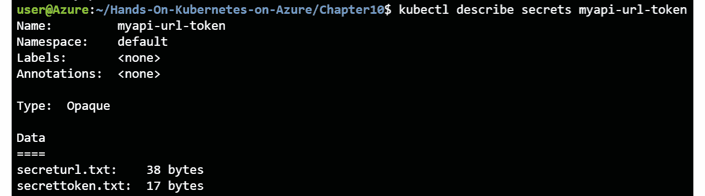

    图 10.3:创建的机密的描述

    如您所见，上述两个命令都没有显示实际的机密值。

6.  To see the secret's value, you can run the following command:

    kubicl get-o YAML secrets/myapi URL 令牌

    您将获得类似于图 10.4 的输出:

    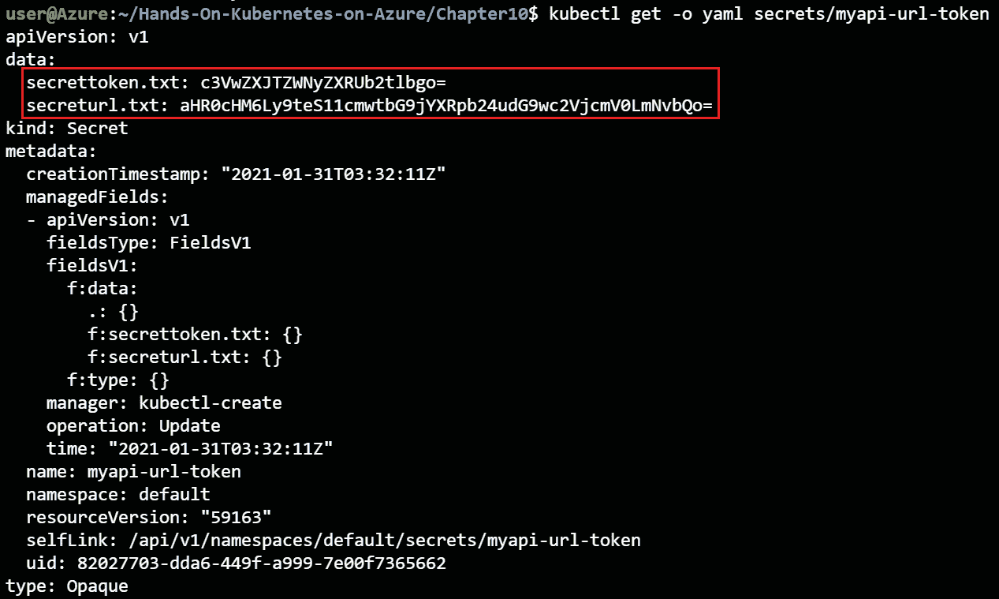

    图 10.4:在 kubectl get secret 中使用-o yaml 开关获取机密的编码值

    数据以键值对的形式存储，文件名作为键，文件的 base64 编码内容作为值。

7.  The preceding values are base64-encoded. Base64 encoding isn't secure. It obfuscates the secret so it isn't easily readable by an operator, but any bad actor can easily decode a base64-encoded secret. To get the actual values, you can run the following command:

    echo ' C3 vwxjtzwnyxrub 2 tlbgo = ' | base 64-d

    echo ' ahr 0 CHM 6ly 9ts 1 zzwnyzqtdxjslway 2 f0aw 9 ulnrvchnly 3 jldc 5 JB 20k ' | base 64-d

    您将获得最初创建的机密的价值:

图 10.5: Base64 编码的机密很容易被解码

这向您表明，这些机密在默认的 Kubernetes 机密存储中没有被安全加密。

在本节中，您可以使用文件作为源，创建一个包含带有安全令牌的示例网址的机密。通过解码 base64 编码的机密，您还能够获得实际的机密值。

让我们继续探索创造Kubernetes机密的第二种方法，根据 YAML 的定义创造机密。

### 使用 YAML 文件手动创建机密

在前一节中，您从文本文件创建了一个机密。在本节中，您将按照以下步骤使用 YAML 文件创建相同的机密:

1.  First, you need to encode the secret to **base64**, as follows:

    回音超级回声| base64

    您将获得以下值:

    vwzxjtzwnyzxrub 2 tlbgo=

    您可能会注意到，这与您在上一节中获得机密的 **yaml** 定义时呈现的值相同。

2.  Similarly, for the **url** value, you can get the base64-encoded value, as shown in the following code block:

    echo ' https://my-secret-URL-location . tops ecret . com“| base64”

    这将为您提供 base64 编码的网址:

    ahr 0 CHM 6ly 9ts 1 zzwnyxqtdxjslway 2 f0aw 9 ulnrvchnly 3 jldc 5 JB 20k

3.  You can now create the secret definition manually; then, save the file. This file has been provided in the code bundle as **myfirstsecret.yaml**:

    1 堆叠版本:v1

    2 种:机密

    3 元数据:

    4 名称:mypiurltoken-YAML

    5 类型:不透明

    6 数据:

    7 URL:ahr 0 CHM 6 ly 9ts 1 zzwnyzqtdxjslway 2 f0aw 9 ulnrvchnly 3 jldc 5 JB 20k

    8 个标记:C3 vwxjtzwnyxrub 2 tlbgo =

    让我们调查一下这个文件:

    *   **第 2 行**:这说明你在创造一个机密。
    *   **第 5 行**:这指定您正在创建一个**不透明的**机密，这意味着从Kubernetes家的角度来看，值是不受约束的键值对。
    *   **第 7-8 行**:这些是机密的 base64 编码值。

    您可能会注意到，这个 YAML 与您在上一节中获得的回报非常相似。这是因为您用来在 Kubernetes 中创建机密的对象在 Kubernetes API 上存储了更多的元数据。

4.  Now you can create the secret in the same way as any other Kubernetes resource by using the **create** command:

    忽必烈 create -f myfirstsecret.yaml

    这将返回类似于图 10.6 的输出:

    

    图 10.6:机密是从 YAML 文件中成功创建的

5.  You can verify whether the secret was successfully created using this:

    忽必烈得到机密忽必烈得到机密忽必烈得到机密忽必烈得到机密忽必烈得到机密忽必烈得到机密忽必烈得到机密忽必烈得到机密忽必烈得到机密忽必烈

    这将向您显示类似于图 10.7 的输出:

    

    图 10.7:创建的机密列表

6.  您可以通过使用**kube CTL get-o YAML secrets myapirltink-YAML**以与上一节中描述的相同的方式来再次检查机密是否相同。

这描述了Kubernetes创造机密的第二种方式。在下一节中，您将学习使用 kubectl 中的文字创建机密的最后一种方法。

### 在 kubectl 中使用文字创建泛型机密

创建机密的第三种方法是使用**文字**方法，这意味着您可以在命令行上以 kubectl 形式传递值。正如您在前面的示例中看到的，Kubernetes 中的一个机密可以包含多个值。在使用**字面量**方法创建机密的命令中，使用语法 **- from-literal= <键> = <值>** 来识别机密中的不同值:

1.  To create a secret using the **literal** method, run the following command:

    kubectl 创建机密泛型 myapirltink-literal \

    -from-literal = token = ' super secrettoken ' \

    -from-literal = URL = https://my-secret-URL-location . tops ecret . com

    这将返回类似于图 10.8 的输出:

    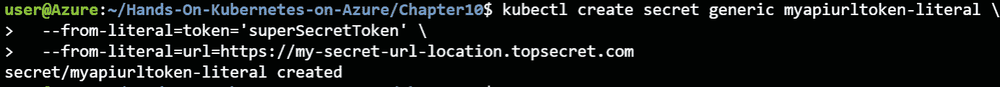

    图 10.8:使用 kubectl 中的文字值成功创建了机密

2.  You can verify that the secret was created by running the following command:

    忽必烈得到机密忽必烈得到机密忽必烈得到机密忽必烈得到机密忽必烈得到机密忽必烈得到机密忽必烈得到机密忽必烈得到机密忽必烈得到机密忽必烈

    这将给我们一个类似于图 10.9 的输出:

图 10.9:验证使用文字方法创建的机密

因此，除了前面两种方法之外，您还使用文字值创建了机密。

在本节中，您已经使用三种方法创建了 Kubernetes 机密。在下一节中，您将探索在您的 pods 和应用中使用这些机密的两种方法。

## 利用你的机密

一旦机密被创建，它们需要被链接到应用。这意味着 Kubernetes 需要以某种方式将机密的价值传递给运行中的Pod 。Kubernetes 提供了两种将机密链接到应用的方法:

*   使用机密作为环境变量
*   将机密作为文件挂载

将机密作为文件挂载是在应用中使用机密的最佳方式。在本节中，我们将解释这两种方法，并展示为什么最好使用第二种方法。让我们从访问作为环境变量的机密开始。

### 作为环境变量的机密

您可以通过将 Kubernetes 中的一个机密作为环境变量引用来使用它。机密可以在容器**容器**和**环境**部分的容器定义中引用。您将使用之前在 pod 中创建的机密，并学习如何在应用中使用它们:

1.  You can configure a pod with environment variable secrets like the definition provided in **pod-with-env-secrets.yaml**:

    1 堆叠版本:v1

    2 个孩子:Pod

    3 元数据:

    4 名称:机密使用-env

    5 规格:

    6 个容器:

    7 -名称:nginx

    8 映像:nginx

    9 环境:

    10 -名称:SECRET_URL

    11 valueFrom:

    12 secretKeyRef:

    13 名称:myapi URL 标记

    14 键：机密网址.txt

    15 -姓名:SECRET_TOKEN

    16 valueFrom:

    17 secretKeyRef:

    18 名称:myapi URL 标记

    19 键:secrettoken.txt

    20 重启策略:永不

    让我们检查一下这个文件:

    *   **第 9 行**:这里是设置环境变量。
    *   **第 11-14 行**:这里，您可以参考 **myapi-url-token** secret 中的**secret turl . txt**文件。
    *   **第 16-19 行**:这里，你可以参考 **myapi-url-token** secret 中的 **secrettoken.txt** 文件。

    当 Kubernetes 在需要使用机密的节点上创建 pod 时，它会将该机密存储在该主机上的 **tmpfs** 中，这是一个不写入磁盘的临时文件系统。当引用该机密的最后一个 pod 不再在该节点上运行时，该机密将从该节点的 **tmpfs** 中删除。如果一个节点关闭或重新启动， **tmpfs** 总是被擦除。

2.  Let's now create the pod and see whether you can access the secrets:

    kube CTL create-f-pod-with-env-secrets . YAML

3.  Check whether the environment variables are set correctly:

    kube CTL exec-it secret-use-env-sh

    echo $SECRET_URL

    echo $SECRET_TOKEN

    这将向您显示类似于图 10.10 的结果:

    

    图 10.10:你可以在PODS里找到机密

4.  现在，您可以使用**退出**命令退出外壳，进入容器。

在这个例子中有几件事需要注意。首先，请注意，当您访问环境变量时，您得到的是机密的实际值，而不是 base64 编码的值。这是意料之中的，因为 base64 编码只应用于 Kubernetes API 级别，而不是应用级别。

需要注意的第二件事是，您可以通过在运行的容器中打开一个外壳并响应这个机密来访问这个机密。对 Kubernetes 中的 pods 应用正确的 RBAC 级别非常重要，这样不是每个集群用户都能运行 **exec** 命令并打开外壳。

还要注意，容器映像形式的应用和 pod 定义都没有硬编码的机密。这些机密是由 Kubernetes 的动态配置提供的。

最后要注意的是，任何应用都可以通过引用适当的 **env** 变量来使用机密值。没有办法限制容器中的哪些进程可以访问哪些环境变量。

关于用作环境变量的机密，需要知道的一件重要事情是，当机密本身被更新时，环境变量的值不会被更新。这可能会导致您最终处于这样一种状态，即在机密更新后创建的 pods 与机密更新前创建的 pods 具有不同的环境变量值。

在本节中，您探讨了如何使用环境变量从运行的 pod 中访问机密。在下一节中，您将探索如何使用文件来实现这一点。

### 作为档案的机密

让我们来看看如何挂载与文件相同的机密，而不是环境变量:

1.  You will use the following pod definition to demonstrate how this can be done. It is provided in the **pod-with-vol-secrets.yaml** file:

    1 堆叠版本:v1

    2 个孩子:Pod

    3 元数据:

    4 名称:机密使用卷

    5 规格:

    6 个容器:

    7 -名称:nginx

    8 映像:nginx

    9 卷安装:

    10 -名称:secretvolume

    11 安装路径:“/etc/secrets”

    12 只读:真

    13 卷:

    14 -名称:secretvolume

    15 个机密:

    16 secret name:myapi URL 令牌

    让我们仔细看看这个文件:

    *   **第 9-12 行**:这里提供挂载细节。您可以将 **/etc/secrets** 目录中的机密装载为只读。
    *   **第 13-16 行**:这里，你指的是机密。请注意，机密中的两个值都将装入容器中。您可以选择(尽管此处未显示)指定应该将机密的哪些部分装入卷中。

    请注意，这比 **env** 定义更简洁，因为您不必为每个机密定义名称。然而，应用需要有特殊的代码来读取文件的内容，以便正确地加载它。

2.  Let's see whether the secrets made it through. Create the pod using the following command:

    kube CTL create-f-pod-with-vol-secret . YAML

3.  Echo the contents of the files in the mounted volume:

    kube CTL exec-it-secret-use-volume-sh

    cd /etc/secrets/

    cat secreturl . txt

    cat secrettoken . txt

    正如你在*图 10.11* 中看到的，机密存在于Pod 中:

    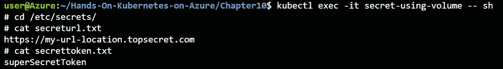

    图 10.11:机密在我们的窗格中作为文件提供

4.  现在，您可以使用**退出**命令退出外壳，进入容器。

这里还有几件事需要注意。首先，请注意，机密同样是纯文本形式，而不是 base64。

其次，由于机密是作为文件装载的，文件系统权限适用于这些机密。这意味着您可以限制哪些进程可以访问这些文件的内容。

最后，作为文件装载的机密将随着机密的更新而动态更新。

现在，您已经学习了两种将机密传递给正在运行的容器的方法。在下一节中，将解释为什么最好使用 file 方法。

### 为什么机密作为文件是最好的方法

虽然使用机密作为环境变量是一种常见的做法，但是将机密装载为文件更安全。Kubernetes 将机密安全地视为环境变量，但是容器运行时并不安全地对待它们。要验证这一点，您可以运行以下命令，在 Docker 运行时中以纯文本形式查看机密:

1.  Start by getting the node that the pod using environment variables from the earlier example is running on with the following command:

    描述 pod 机密使用-env | grep 节点

    这将向您显示实例标识，如图 10.12 所示:

    

    图 10.12:获取实例标识

2.  Next, get the Docker ID of the running pod:

    描述容器机密-使用-env | grep '容器标识'

    这将为您提供容器标识:

    

    图 10.13:获取Docker标识

3.  Finally, you will execute a command on the node running your container to show the secret that was passed as an environment variable. First, let's set a couple of variables you'll use later:

    实例=

    停靠=

    VMSS=$(az vmss 列表-查询'[]。名称'-o tsv)

    RGNAME=$(az vmss 列表-查询'[]'。resourceGroup' -o tsv)

    #### 注意

    前面的命令假设您的订阅中有一个带有一个节点池的 AKS 集群。如果不是这种情况，请将 **VMSS** 和 **RGNAME** 的值更改为运行集群的比例集和资源组的值的名称。

4.  Depending on your node version, you will run either of the following commands. For clusters running on Kubernetes version 1.18.x or earlier, run the following command:

    az vmss 运行-命令调用-g $RGNAME -n $VMSS -命令-id \

    RunShellScript-INSTANCE-id $ INSTANCE-scripts \

    " dock inspection-f ' { . config . env } } ' $ docked ' "

    yaml | grep secret

    这将返回类似于图 10.14 的输出:

图 10.14:机密在 Docker 运行时被解码

对于运行 1.19 或更高版本的集群，运行以下命令:

az vmss 运行-命令调用-g $RGNAME -n $VMSS -命令-id \

RunShellScript-INSTANCE-id $ INSTANCE-scripts \

“crictl inspection-YAML $ docked 输出”

yaml | grep secret

这将向您显示类似于图 10.15 的输出:

图 10.15:机密在容器运行时被解码

这将在容器运行时以纯文本的形式向您展示两个机密，无论是 Docker(1.19 之前的 AKS 版本)还是 containerd(1.19 及以上的 AKS 版本)。

如您所见，机密在容器运行时命令中被解码。这意味着大多数记录系统将记录这些敏感的机密。因此，建议使用机密作为文件，因为它们不是以纯文本形式传递的，除非传递给 pod 和应用。

让我们确保清理我们在此示例中创建的资源:

kubectl delete pod --all

忽必烈删除机密 myapi URL 令牌\

myapi token-literal myapi token-YAML

现在，您已经使用默认的机密机制在 Kubernetes 中探索了机密，让我们继续使用一个更安全的选项，即 Azure Key Vault。

## 安装机密存储 CSI 驱动程序的 Azure 密钥库提供程序

在前一节中，您探索了存储在 Kubernetes 中的机密。这意味着它们是在 Kubernetes API 服务器上进行 base64 编码的。您在上一节中看到 base64 编码的机密根本不安全。对于高度安全的环境，您会希望使用更好的机密存储。

Azure 提供了一个符合行业标准的密钥和机密存储解决方案，称为 Azure 密钥库。这是一项托管服务，可以轻松创建、存储和检索密钥和机密，并提供对密钥和机密访问的审核。

Kubernetes 社区维护着一个名为 Kubernetes 机密商店 CSI 驱动程序([https://github.com/kubernetes-sigs/secrets-store-csi-driver](10.html))的项目。该项目允许您通过 CSI 驱动程序将外部机密存储与 Kubernetes 中的卷集成在一起。容器存储接口是 Kubernetes 中与存储系统接口的一种标准化方式。机密存储 CSI 驱动程序有多种实现。在撰写本文时，当前的实现是 Hashicorp Vault、谷歌云平台和 Azure Key Vault。

微软维护机密存储 CSI 驱动程序的密钥库实现，该驱动程序被命名为机密存储 CSI 驱动程序的 Azure 密钥库提供程序。此实现允许您作为用户从 Kubernetes 内部访问密钥库机密。它还与 pod 身份集成在一起，以限制对机密的访问。可选地，该实现还可以将密钥库机密与 Kubernetes 机密同步，以便您可以在需要时将它们用作环境变量。

#### 注意

为了简洁起见，我们将机密存储 CSI 驱动程序的 Azure 密钥库提供程序称为密钥库的 CSI 驱动程序。

在撰写本文时，Key Vault 的 CSI 驱动程序仅作为一个开源项目提供，您可以将其安装在集群上。值得注意的是，该解决方案可能会在未来作为 AKS 的托管附加组件引入。更多最新详情，请参考[https://github.com/Azure/AKS/issues/1876](10.html)GitHub 上的本期。

要使用密钥库的 CSI 驱动程序，您需要做两件事。首先，您需要在集群上设置驱动程序本身。这是本节的目标。其次，您需要在 Kubernetes 中为您需要访问的密钥库中的每个机密创建一个名为 **SecretProviderClass** 的对象。在下一节中，您将了解到更多这方面的信息。

在本节中，您将为密钥库设置 CSI 驱动程序。首先，您将创建一个新的用户分配的托管身份。之后，您将创建一个新的密钥库，并将用户分配的托管身份权限授予该密钥库。最后，您将在集群上设置密钥库的 CSI 驱动程序。

让我们从创建新的托管身份开始。

### 创建托管身份

密钥库的 CSI 驱动程序支持从密钥库中获取数据的不同方式。建议您使用托管身份将 Kubernetes 集群链接到密钥库。为此，您可以使用在上一章中设置的 AAD pod 管理的身份插件。在本节中，您将在 Azure 中创建新的托管身份，以便以后与密钥库一起使用:

1.  Let's create a new managed identity. You will use the Azure portal to do this. To start, look for **managed identity** in the Azure search bar, as shown in *Figure 10.16*:

    

    图 10.16:在 Azure 搜索栏中查找托管身份

2.  In the resulting pane, click the + New button at the top. To organize the resources for this chapter together, it's recommended to create a new resource group. In the resulting pane, click the Create new button to create a new resource group. Call it **csi-key-vault**, as shown in *Figure 10.17*:

    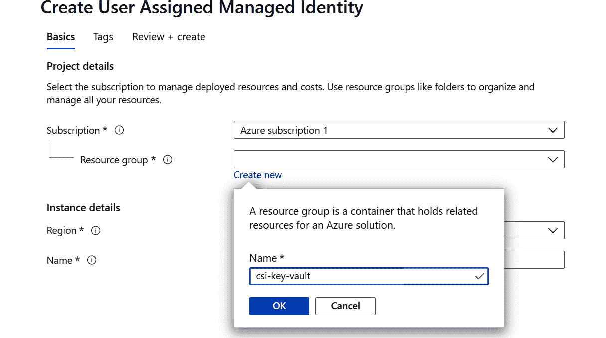

    图 10.17:创建新的资源组

3.  Now, select the region you created your cluster in as the region for your managed identity and give it a name, **csi-key-vault** if you follow the example, as shown in *Figure 10.18*. To finish, click the Review + create button and in the final window, click the Create button to create your managed identity:

    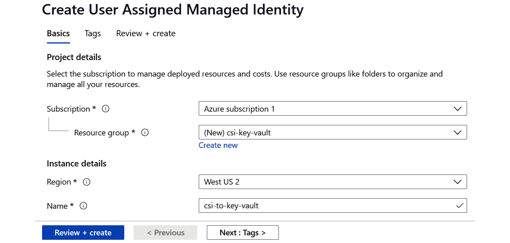

    图 10.18:提供实例细节

4.  Once the managed identity has been created, hit the Go to resource button to go to the resource. Here, you will need to copy the resource ID that will be used later in the next step. You can find that in the Properties pane of the managed identity, as shown in *Figure 10.19*:

    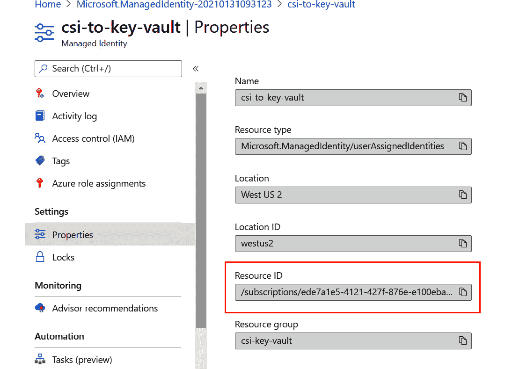

    图 10.19:获取托管身份的资源标识

5.  Now you are ready to link the managed identity to your AKS cluster. To do this, you will run a command in cloud shell as you did in the previous chapter. Afterward, you will verify that the identity is available in your cluster. Let's start with linking the identity:

    az aks pod-身份添加-资源-组 rg-handsonaks \

    - cluster-name handsonaks -命名空间默认值\

    -名称 csi-to-key-vault \

    -身份-资源-id<managed identity="" resource="" id=""></managed>

6.  You can verify that your identity was successfully linked to your cluster by running the following command:

    忽必烈得到了 azureidentity

    这将产生类似于图 10.20 的输出:

图 10.20:验证集群中身份的可用性

在本节中，您创建了一个新的托管身份，并使用 AAD Pod 托管身份插件将其链接到您的 Kubernetes 集群。在下一节中，您将创建一个密钥库，并赋予您创建的新身份访问机密的权限。最后，您将在密钥库中创建一个机密，稍后尝试从集群中访问它。

### 创建密钥库

在上一节中，您设置了密钥库的 CSI 驱动程序将使用的托管身份。在本节中，您将创建将使用的密钥库:

1.  To start the creation process, look for **Key vaults** in the Azure search bar:

    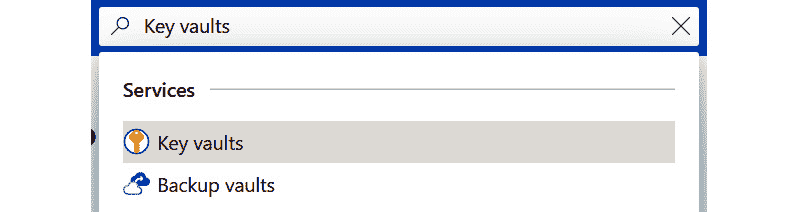

    图 10.21:通过 Azure 门户导航到关键存储库

2.  Click the + New button to start the creation process:

    

    图 10.22:单击添加按钮开始创建密钥库

3.  Provide the details to create the key vault. Create the key vault in the resource group you created in the previous step. The key vault's name has to be globally unique, so consider adding your initials to the name. It is recommended that you create the key vault in the same region as your cluster:

    

    图 10.23:提供创建密钥库的细节

4.  After you have provided the details for your key vault, click the Next: Access policy > button to give the managed identity access to secrets. Click on the + Add Access Policy to give permission to your managed identity, as shown in *Figure 10.24*:

    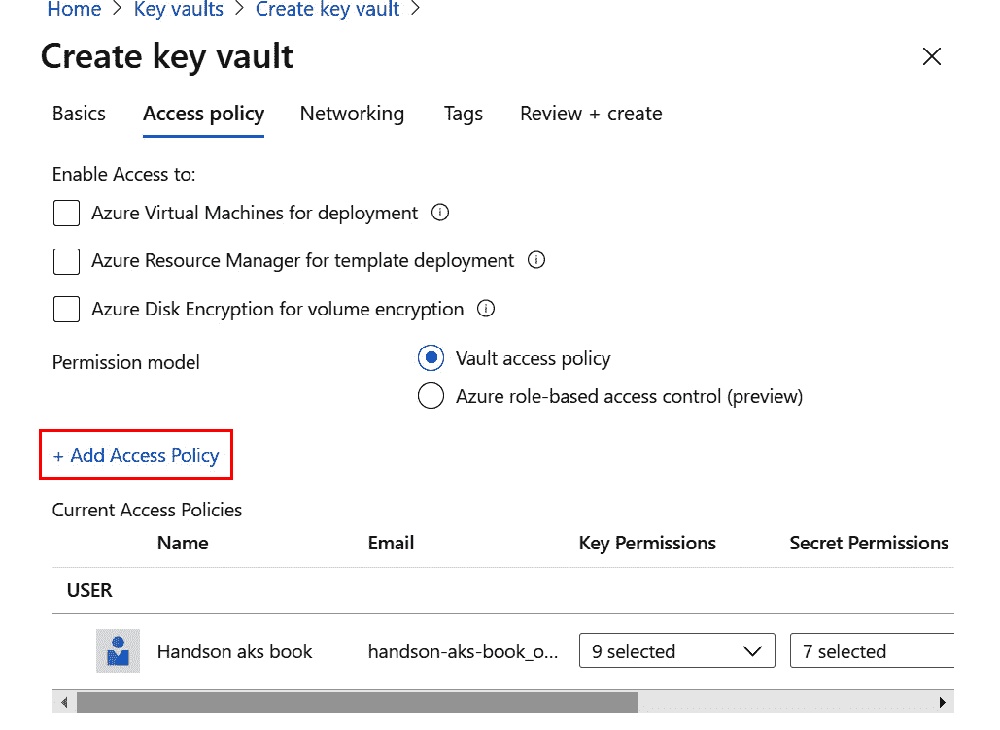

    图 10.24:添加访问策略

    在结果窗格中，选择“机密管理”模板，单击“选择主体”下的“未选择”按钮，然后在结果窗格中查找您之前创建的 **csi-to-key-vault** 。最后，点击屏幕下方的选择，然后点击添加，如图*图 10.25* :

    

    图 10.25:将机密管理模板分配给被管理的身份

5.  一旦您提供了对此托管身份的权限，请点击“审阅+创建”按钮来审阅和创建您的密钥库。点击创建按钮完成创建过程。
6.  It will take a couple of seconds to create your key vault. Once the vault is created, click on the Go to resource button, go to Secrets, and hit the Generate/Import button to create a new secret as shown in *Figure 10.26*:

    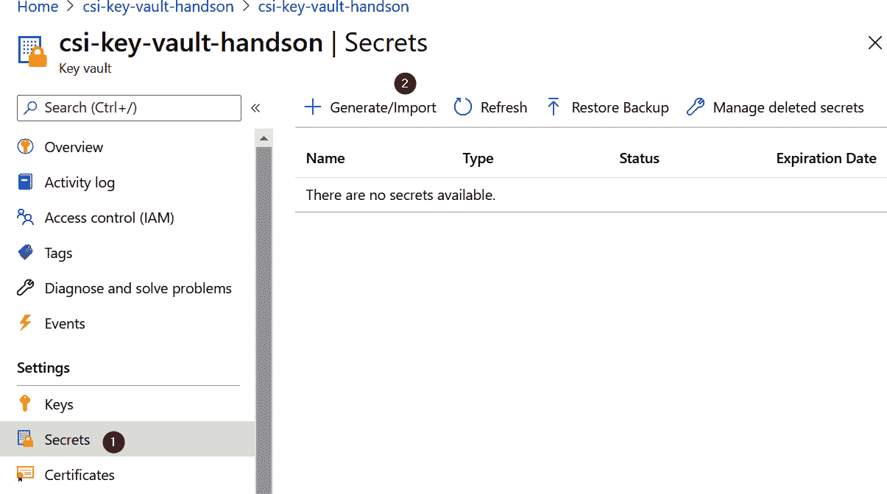

    图 10.26:创建新的机密

7.  在机密创建向导中，提供关于您的机密的详细信息。为了让这个演示更容易理解，使用名称 **k8s-secret-demo** 。给这个机密一个值得纪念的价值，比如**来自钥匙库的机密**。单击屏幕底部的创建按钮创建密码:

图 10.27:提供新机密的细节

现在您在密钥库中有了一个机密，您可以继续在集群中安装密钥库的实际 CSI 驱动程序。

### 安装密钥库的 CSI 驱动程序

在本节中，您将为集群中的密钥库设置 CSI 驱动程序。这将允许您在下一节中从密钥库中检索机密。安装是一个短暂的过程，您将在这里看到:

1.  The easiest way to install the CSI driver for Key Vault is to use Helm, as you've done before. Note that this feature may be available as an add-on after the release of this book. To do this, add the repo for the CSI driver for Key Vault:

    helm repo 添加 CSI-机密-商店-提供商-azure \

    [https://raw . githubuser content . com/Azure/secrets-store-CSI-driver-provider-Azure/master/charts](10.html)

2.  Once the repo has been added, you can install the actual CSI driver for Key Vault using the following command:

    helm 安装 CSI-机密\

    CSI-机密-商店-提供商-azure/CSI-机密-商店-提供商-azure

3.  To verify that the installation succeeded, you can verify that the SecretProviderClass CRD has been added to your cluster via the following command:

    忽必烈得到 crd

    这将向您显示一个包含 SecretProviderClass CRD 的输出，如图 10.28 所示:

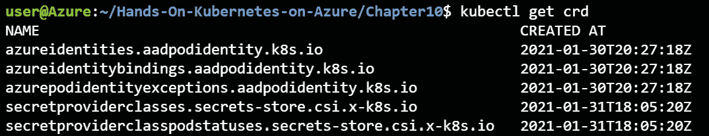

图 10.28:secretprovider 类 CRD 已经添加到集群中

密钥库的 CSI 驱动程序设置到此结束。在本节中，您首先创建了一个托管身份，然后创建了一个包含机密的密钥库，最后在集群上为密钥库设置了 CSI 驱动程序。

您现在可以使用密钥库的 CSI 驱动程序了，这将在下一节中进行。

## 使用机密存储 CSI 驱动程序的 Azure 密钥库提供程序

既然已经在集群上设置了密钥库的 CSI 驱动程序，您就可以开始使用它了。在本节中，您将浏览两个使用密钥库的 CSI 驱动程序的示例。首先，您将使用它在 Kubernetes 中挂载一个机密文件。之后，您还将使用它来将密钥库机密同步到 Kubernetes 机密，并将它们用作环境变量。

让我们从第一个示例开始，如何将密钥库机密装载为文件。

### 将密钥库机密作为文件挂载

在第一个示例中，您将在集群中创建一个新的 SecretProviderClass。此对象将允许您将密钥库中的一个机密链接到Kubernetes的一个 pod。之后，您将创建一个使用 SecretProviderClass 的容器，并在该容器中装载机密。让我们开始吧:

1.  The SecretProviderClass requires you to know your Azure Active Directory tenant ID. To get this, run the following command:

    az 帐户显示-查询 tenantId

    这将向您显示类似于图 10.29 的输出。复制粘贴该值，并将其存储在您以后可以参考的文件中:

    

    图 10.29:获取您的租户标识

    接下来，您将创建 SecretProviderClass 类。在本章的代码文件中，在**secretprovider class-file . YAML**文件中提供了一个例子:

    1 API version:secret store . CSI . x-k8s . io/v1 alpha 1 机密存储库

    2 种:SecretProviderClass

    3 元数据:

    4 名称:密钥-保管库-机密-文件

    5 规格:

    6 提供商:azure

    7 个参数:

    8 usePodIdentity:“真”

    9 keyvaultname 名称:“<key vault="" name="">”</key>

    10 个对象:|

    11 阵列:

    12          - |

    13 对象名称:k8s-机密-演示

    14 对象类型：机密

    15 顽强:“T0”

    让我们调查一下这个文件:

    *   **第 2 行**:这里，你定义你正在创建一个 **SecretProviderClass** 。
    *   **第 6 行**:这里，你创造一个Azure的机密。正如在介绍中提到的，机密存储项目支持多种实现。
    *   **第 8 行**:您将该密码配置为使用 pod 身份进行认证。稍后，您会将 pod 身份链接到您的 pod。
    *   **第 9 行**:钥匙库的名称。
    *   **第 10-14 行**:这里指的是需要访问的机密。在这个例子中，你只能访问一个机密，但是你可以在一个 **SecretProviderClass** 中访问多个机密。
    *   **第 15 行**:你的 AAD 租户的 AAD 租户 ID。

    请确保使用适合您环境的值对其进行编辑。

2.  You can create this **SecretProviderClass** using the following command:

    忽必烈 create-f secret providerclass . YAML 文件

3.  Once the SecretProviderClass has been created, you can go ahead and create a pod that references that SecretProviderClass. An example has been provided in the **pod-keyvault-file.yaml** file:

    1 个孩子:Pod

    2 apiVersion: v1

    3 元数据:

    4 名称:CSI-演示-文件

    5 个标签:

    6 aadpodidbinding:“CSI-to-key-vault”

    7 规格:

    8 个容器:

    9 -名称:nginx

    10 映像:nginx

    11 卷安装:

    12 -名称:keyvault

    13 mount path:"/mnt/secrets-store "

    14 只读:真

    15 卷:

    16 -名称:keyvault

    17 csi:

    18 驱动程序:secrets-store.csi.k8s.io

    19 只读:真

    20 卷属性:

    21 secretProviderClass:“密钥-保管库-机密-文件”

    让我们看看这个文件的关键部分:

    *   **第 5-6 行**:这是您将此 pod 链接到之前创建的托管身份的位置。
    *   **第 11-14 行**:这里，你定义一下你要在哪里挂载秘籍。
    *   **第 15-21 行**:这里定义了实际体积和到密钥库的链接。在第 21 行，您可以参考前面创建的 SecretProviderClass 类。
4.  You can create this pod using the following command:

    kubi KL create-f pod keyvault . YAML 文件

5.  Monitor the Pod's creation using the following command:

    忽必烈得到 pods -w

    这将返回类似于图 10.30 的输出:

    

    图 10.30:CSI 演示文件舱的状态变为运行

6.  Once the pod is created and running, you can open a shell in the pod using the **kubectl exec** command and verify that the secret is present:

    cube exec-it CSI 演示文件- sh

    CD/mnt/机密商店

    cat k8s-机密-演示

    这将输出您在密钥库中创建的机密，如图 10.31 所示:

    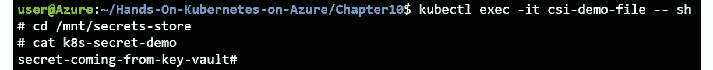

    图 10.31:您在密钥库中配置的密钥以文件的形式装载在容器中

    不出所料，您可以获得在密钥库中配置的机密，并在Kubernetes中显示出来。

7.  现在，您可以使用**退出**命令退出外壳，进入容器。

如您所见，您成功地使用了密钥库的 CSI 驱动程序从密钥库中获取了一个机密，以文件的形式显示在窗格中。

还可以将密钥库中的机密同步到 Kubernetes 中的机密，然后将它们用作运行Pod 中的环境变量。这就是你将在本章的下一节也是最后一节探讨的内容。

### 使用密钥库机密作为环境变量

在上一节中，您看到了如何在窗格中以文件形式访问密钥库机密。正如您在本章前面所学的，建议您将 Kubernetes 机密作为文件使用。

但是，在某些情况下，您不能修改应用以将机密用作文件，而需要将它们用作环境变量。这可以使用密钥库的 CSI 驱动程序来完成，您将在本节中以这种方式配置驱动程序。请注意，为了让 CSI 驱动程序将密钥库中的机密同步到 Kubernetes 中的机密，您需要在 Kubernetes 中将机密挂载为卷；你不能只依靠机密同步。

让我们配置所有这些:

1.  First, you'll create the SecretProviderClass. An example has been provided in the code files for this chapter, in the **secretproviderclass-env.yaml** file:

    1 API version:secret store . CSI . x-k8s . io/v1 alpha 1 机密存储库

    2 种:SecretProviderClass

    3 元数据:

    4 名称:密钥-保管库-机密-环境

    5 规格:

    6 提供商:azure

    7 个参数:

    8 usePodIdentity:“真”

    9 keyvaultname 名称:“<key vault="" name="">”</key>

    10 个对象:|

    11 阵列:

    12          - |

    13 对象名称:k8s-机密-演示

    14 对象类型：机密

    15 顽强:“T0”

    16 个机密项目:

    17 - secretName: key-vault-secret

    18 型:不透明

    19 项数据:

    20-object name:k8s-机密-演示

    21 密钥:机密内容

    让我们研究一下这个文件与您创建的上一个文件有什么不同:

    *   **第 16-21 行**:这是你将钥匙库机密与Kubernetes机密链接的地方。这里使用的名称很重要，因为它们提供了不同对象的关键信息:
    *   **第 17 行** **机密名称**:这里指的是Kubernetes将要创造的机密的名称。
    *   **第 20 行** **对象名**:这里指的是第 13 行**对象名**，是密钥库中机密的名称。
    *   **第 21 行** **钥匙**:这是Kubernetes秘籍中钥匙的名字。正如本章前面所解释的，Kubernetes 中的一个机密可以包含多个密钥。

    该文件的其余部分类似于您创建的早期 SecretProviderClass 类。

2.  You can create this SecretProviderClass using the following command:

    忽必烈 create-f secret providerclass-env . YAML

3.  Once the SecretProviderClass has been created, you can go ahead and create a pod that references that SecretProviderClass. You cannot rely solely on the syncing of the secrets, the SecretProviderClass has to be mounted in order for the CSI driver to sync the secrets. An example has been provided in the **pod-keyvault-env.yaml** file:

    1 堆叠版本:v1

    2 个孩子:Pod

    3 元数据:

    4 名称:CSI-演示-env

    5 个标签:

    6 aadpodidbinding:“CSI-to-key-vault”

    7 规格:

    8 个容器:

    9 -名称:nginx

    10 映像:nginx

    11 环境:

    12 -姓名:KEYVAULT_SECRET

    13 valueFrom:

    14 secretKeyRef:

    15 姓名:钥匙-金库-机密

    16 密钥:机密内容

    17 卷安装:

    18 -名称:keyvault

    19 mount path:"/mnt/secrets-store "

    20 只读:真

    21 卷:

    22 -名称:keyvault

    23 csi:

    24 驱动程序:secrets-store.csi.k8s.io

    25 只读:真

    26 卷属性:

    27 secretProviderClass:“密钥-保管库-机密-环境”

    这个PODS和你之前创建的PODS的区别在*第 11 到 16 行*上。这似乎很熟悉，因为这是使用机密作为环境变量的典型方式。

4.  You can create this pod using the following command:

    忽必烈 create -f pod-keyvault-env.yaml

5.  Monitor the Pod's creation using the following command:

    忽必烈得到 pods -w

    这将返回类似于图 10.32 的输出:

    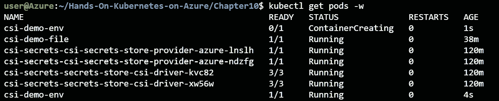

    图 10.32:等待 csi-demo-env Pod 运行

6.  Once the pod is created and running, you can open a shell in the pod using the **kubectl exec** command and verify that the secret is present:

    忽必烈 exec -it csi 演示-env - sh

    echo $KEYVAULT_SECRET

    这将输出您在密钥库中创建的机密，如图 10.33 所示:

    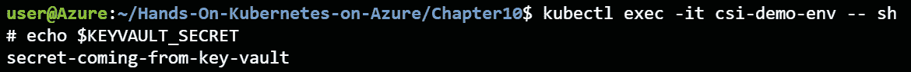

    图 10.33:您在密钥库中配置的机密被用作环境变量

7.  现在，您可以使用**退出**命令退出外壳，进入容器。
8.  Finally, you can also verify that the secret was created in Kubernetes by running the following command:

    忽必烈得到机密忽必烈得到机密忽必烈得到机密忽必烈得到机密忽必烈得到机密忽必烈得到机密忽必烈得到机密忽必烈得到机密忽必烈得到机密忽必烈

    这将向您显示类似于图 10.34 的输出:

    

    图 10.34:Kubernetes 中的密钥库机密与密钥库机密同步

9.  This secret will disappear once no more pods that mount the secret are present. You can verify this with the following commands:

    忽必烈 delete -f pod-keyvault-env.yaml

    忽必烈得到机密忽必烈得到机密忽必烈得到机密忽必烈得到机密忽必烈得到机密忽必烈得到机密忽必烈得到机密忽必烈得到机密忽必烈得到机密忽必烈

    这将向您显示类似于图 10.35 的输出:

图 10.35:删除 pod 也会自动删除机密

这向您表明，虽然您有一个 secretprovider 类试图将密钥库机密同步到 Kubernetes 机密，但该同步仅在 pod 引用该 secretprovider 类并装载该机密时发生。

在本节中，您已经能够将密钥库中的一个机密同步到 Kubernetes 中的一个机密。您可以使用环境变量在 pod 中访问该机密的值。

这也结束了关于Kubernetes机密的这一章。让我们确保清理我们创建的所有对象:

kubectl delete -f .

删除犯罪现场调查机密

az aks pod-标识删除-资源-组 rg-handsonaks \

- cluster-name handsonaks -命名空间默认值\

-将 csi 命名为密钥库

az 组删除-n CSI-密钥-保管库-是

一旦资源被删除，你就可以进入下一章了。

## 总结

在这一章中，你学习了Kubernetes的机密。您既使用了 Kubernetes 中的默认加密机制，也使用了 Secrets Store CSI 驱动程序的 Azure 密钥库提供程序。

本章首先解释了 Kubernetes 中不同的机密类型。之后，你在 Kubernetes 中使用了不同的机制来创造机密。然后，您使用了两种方法来访问这些机密，将它们用作文件或环境变量。

之后，您创建了一个托管身份和一个密钥库，以实验密钥库的 CSI 驱动程序。您在集群上安装了它，并使用了两种机制来访问密钥库中的机密:使用文件或使用环境变量。

在下一章中，您将在 AKS 中了解更多关于网络安全的信息。