# 十一、AKS 中的网络安全

保护网络是保护应用的关键活动。一方面，安全网络的目标是允许用户连接到您的应用并使用您提供的所有功能。另一方面，您还需要保护您的网络免受攻击者的攻击。这意味着确保他们无法访问您网络的关键部分，即使他们能够访问，这也是有限的。

说到 AKS 中的网络安全，有两个不同的层来保护网络。首先是控制平面。控制平面指托管 Kubernetes 应用编程接口的托管 Kubernetes 主服务器。默认情况下，控制平面暴露在互联网上。您可以通过使用名为**授权 IP 范围**的功能来限制哪些公共 IP 地址可以访问控制平面，或者通过部署私有集群来保护控制平面，这意味着只有连接到您的虚拟网络的机器才能访问控制平面。

要保护的第二个网络层是集群上运行的工作负载。有多种方法可以保护工作负载。第一种方法是使用 Azure 网络功能，例如 Azure 防火墙或**网络安全组** ( **NSGs** )。保护工作负载的第二种方法是使用名为网络策略的 Kubernetes 功能。

在本章中，您将探索保护 AKS 集群网络的不同方法。具体而言，本章包含以下部分:

*   AKS 中的网络与网络安全
*   控制平面网络安全
*   工作负载网络安全

由于 AKS 集群的大多数网络配置只能在集群创建过程中进行配置，因此在本章中，您将创建和销毁多个集群。

让我们从探索 AKS 中网络和网络安全的概念开始这一章。

## AKS 中的组网和网络安全

本节是对 AKS 中网络和安全概念的介绍。首先介绍控制平面，然后是工作负载网络，然后是网络安全。

### 控制平面联网

Kubernetes 集群的控制平面是承载集群的 Kubernetes API 服务器、管理调度程序和存储集群状态的基础结构。例如，当您使用**Kubernetes 集群交互时，您正在向 Kubernetes API 服务器发送命令。在 AKS 中，这个控制平面由微软管理，作为服务提供给你。**

默认情况下，控制平面通过互联网公开，连接到互联网的每个人都可以访问。但这并不意味着控制平面不安全。即使攻击者能够通过网络访问您的控制平面，他们仍然需要群集凭据来针对控制平面执行命令。

然而，通常情况下，组织仍然希望将网络访问限制在其 AKS 集群的控制平面上。AKS 中有两个功能，使您能够将网络访问限制在集群的控制平面。

第一个功能叫做**授权 IP 地址范围**。通过在 AKS 上配置授权的 IP 地址范围，您可以配置允许哪些 IP 地址访问您的应用编程接口服务器。这意味着不允许访问您的应用编程接口服务器的 IP 地址不能与您的应用编程接口服务器交互。这在*图 11.1* 中有说明:

图 11.1:解释了授权的知识产权范围

另一种限制网络访问控制平面的方法是使用名为**私有集群**的功能。通过配置私有集群，您不会给控制平面一个公共可达的地址。该群集只能从专用网络访问。要连接到控制平面，您需要使用连接到**蔚蓝虚拟网络** ( **虚拟网络**)的机器。这台机器将使用名为 Azure 私有链接的 Azure 功能与控制平面通信。

私有链接是 Azure 的一项功能，允许您使用虚拟网络中的私有 IP 地址连接到托管服务。使用专用链路时，会在您的虚拟网络中创建一个专用链路端点。要连接到此专用链路端点，您必须从同一虚拟网络中托管的虚拟机、对等虚拟网络或通过连接到该虚拟网络的虚拟专用网络或 Azure 快速路由进行连接。在*图 11.2* 中，您看到了一个使用托管在同一虚拟网络中的虚拟机的例子。您可以看到，承载您的工作负载的节点池(1)以及连接到同一虚拟网络的虚拟机(2)可以连接到控制平面，但是通过互联网连接的用户(3)不能:

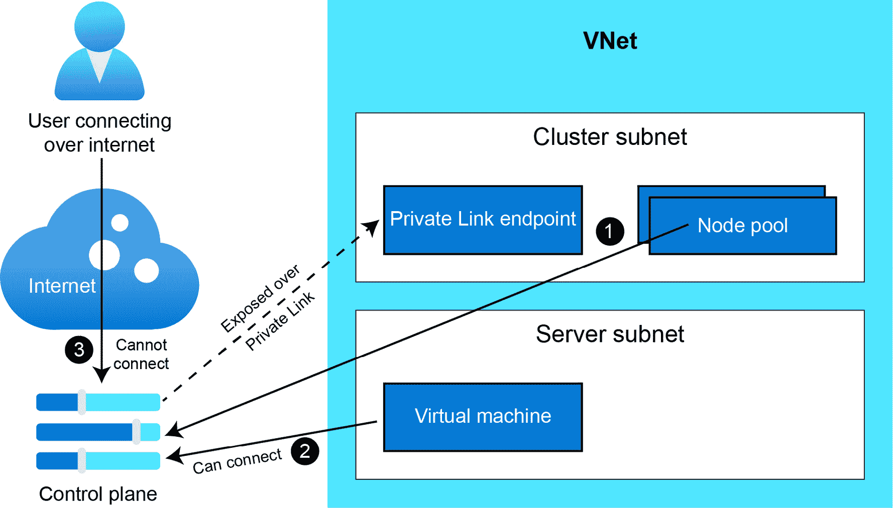

图 11.2:解释了私有集群

重要的是要理解，授权的 IP 地址范围和私有集群都只为 Kubernetes 控制平面提供网络安全；它们不会影响工作负载网络。下一节将介绍工作负载网络。

### 工作负载联网

您在 AKS 中的工作负载部署在虚拟网络中部署的集群上。有许多方法可以在虚拟网络中配置和保护网络。在本节中，我们将介绍部署在虚拟网络中的工作负载的网络安全的几个重要配置选项。然而，这只是对这些概念的介绍。在部署生产集群之前，请参考 AKS 文档，以更深入地了解不同的配置选项:[https://docs.microsoft.com/azure/aks/concepts-network](https://docs.microsoft.com/azure/aks/concepts-network)。

您首先需要选择部署集群的网络模型。这种配置对安全性的影响有限，但从网络角度理解这一点很重要。有两种选择:

*   **Kubenet 组网(默认)**:通过使用 Kubenet 组网，集群节点从 VNet 中的子网获取一个 IP 地址。运行在这些节点上的Pod 从覆盖网络中获得一个 IP 地址，覆盖网络使用与节点不同的地址空间。通过**网络地址转换** ( **网络地址转换**)启用点对点网络。kubenet 的好处是只有节点使用集群子网中的一个 IP 地址。
*   **Azure Container Network Interface(CNI)networking(advanced**):使用 Azure CNI，Pod 和节点都从创建集群的子网中获得一个 IP 地址。这样做的好处是，集群外部的资源可以直接访问 pods。它的缺点是您需要执行仔细的 IP 地址规划，因为每个 pod 都需要集群子网中的一个 IP 地址。

在这两种网络模式中，您可以在现有虚拟网络中创建集群，也可以让 AKS 代表您创建新的虚拟网络。

要考虑的第二个网络安全配置是通过外部防火墙路由入站和出站流量。这可能是 Azure 防火墙，也可能是第三方**网络虚拟设备** ( **NVA** )。通过外部防火墙路由流量，您可以应用集中式安全规则，进行流量检查，并记录流量访问模式。要进行配置，您需要在群集子网中配置一条**用户定义的路由** ( **UDR** ，通过外部防火墙路由来自您群集的流量。如果您希望进一步探讨这一点，请参考文档:[https://docs.microsoft.com/azure/aks/limit-egress-traffic](https://docs.microsoft.com/azure/aks/limit-egress-traffic)。

另一个网络安全选项是在 Azure 中使用 NSGs 来限制入站和出站流量。默认情况下，当您在 AKS 中创建一个**负载平衡器**类型的服务时，AKS 还将配置一个 NSG，以允许来自任何地方的流量进入该服务。您可以在 AKS 中调整该 NSG 的配置，以限制哪些入侵防御系统可以访问这些服务。

最后，您可以通过使用名为**网络策略**的 Kubernetes 功能来限制集群中的流量。网络策略是一个 Kubernetes 对象，它允许您配置某些 pods 上允许的流量。使用网络策略，您可以保护 pod 到 pod 的流量、pod 外部的流量以及 pod 到外部的流量。建议您主要对 pod 到 pod 流量(也称为东西向流量)使用网络策略，并对外部到 pod 或 pod 到外部流量(也称为南北向流量)使用外部防火墙或 NSGs。

就在集群上配置网络策略而言，AKS 支持两个选项。您可以使用 Azure 网络策略或 Calico 网络策略。Azure 网络策略由微软开发、维护和支持，而 Calico 网络策略是作为开源项目开发的，由一家名为 Tigera([http://tigera.io/](http://tigera.io/))的公司提供可选的商业支持。

在工作负载网络安全一节中，您将在群集上配置网络安全组和网络策略。配置外部防火墙超出了本书的范围；请参考前面提到的文档，了解有关此设置的更多信息。

## 控制平面网络安全

在本节中，您将探索保护 AKS 集群控制平面的两种方法:授权 IP 范围和私有集群。您将从更新您现有的集群以使用授权的 IP 范围开始。

### 使用授权的 IP 范围保护控制平面

在 AKS 上配置授权的 IP 范围将限制哪些公共 IP 地址可以访问 AKS 集群的控制平面。在本节中，您将在现有集群上配置授权的 IP 范围。您将流量限制在一个随机的公共 IP 地址，以验证流量阻塞是否有效。然后，您将从 Azure Cloud Shell 中配置要授权的 IP 地址，并查看这将如何允许流量。

1.  To start, browse to the Azure portal and open the pane for your AKS cluster. Select Networking in the left-hand navigation. Then, select the checkbox next to Set authorized IP ranges, and fill in the IP address, **10.0.0.0**, in the box below, as shown in *Figure 11.3*. You are not using this IP; this configuration is only to verify that you will no longer be able to connect to your Kubernetes control plane if your IP address is not authorized. Finally, hit the Save button at the top of the screen.

    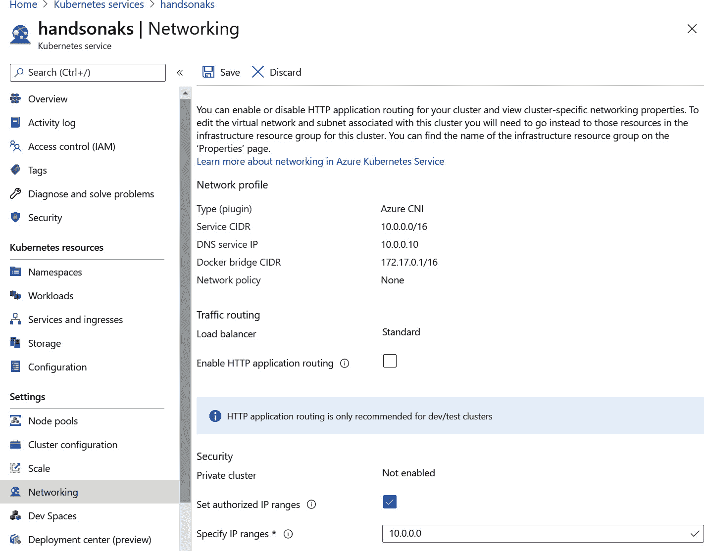

    图 11.3:配置授权的 IP

2.  Now, open the Azure Cloud Shell. In the Cloud Shell, execute the following command:

    观看 kubectl 获取节点

    最初，这可能仍然会返回节点列表，如图 11.4*所示。这是因为授权的 IP 范围在 AKS 上配置需要几分钟的时间。*

    **

    *图 11.4:该命令最初可能仍然显示节点列表*

    *然而，几分钟后，该命令的输出应该会返回一个错误，如图 11.5*所示。这是意料之中的，因为您限制了对控制平面的访问。**

    **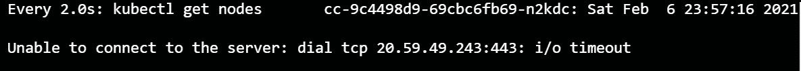**

    **图 11.5:显示无法再连接到控制平面的错误**

***   You can stop the **watch** command by pressing *Ctrl + C*. You will now get the IP address used by your current Cloud Shell session, and will then configure this as an authorized IP. To get the IP address used by your current Cloud Shell session, you can connect to [icanhazip.com](http://icanhazip.com), which is a simple website that will return your public IP. To do this, execute the following command:

    curl icanhazip.com(美国加州大学洛杉矶分校)

    这将返回类似于图 11.6 的输出:

    

    图 11.6:获取云壳使用的 IP 地址

    *   You can now configure this IP address as an authorized IP address in AKS. You can do this in the Networking section of the AKS pane as you did in *step 1*. This is shown in *Figure 11.7*. Make sure to click the Save button at the top of the screen.

    

    图 11.7:在 AKS 中将云壳的 IP 地址配置为授权 IP

    *   Now, execute the same command as before to get the list of nodes in your AKS cluster.

    观看 kubectl 获取节点

    最初，这可能仍然会返回您之前看到的错误，如图 11.8 所示。这是因为授权的 IP 范围在 AKS 上配置需要几分钟的时间。** 

 **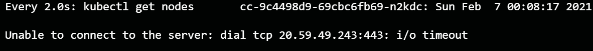

图 11.8:该命令最初仍然给出一个错误

然而，几分钟后，这个命令的输出应该会返回一个节点列表，如图 11.9 所示。这表明您成功配置了授权的 IP 范围。

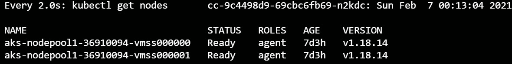

图 11.9:通过配置授权的 IP，您现在可以连接到 API 服务器

通过配置授权的 IP 范围，您可以确认当不允许 Cloud Shell 的 IP 地址访问 Kubernetes 控制平面时，连接超时。通过将 Cloud Shell 的 IP 地址配置为授权 IP，您可以连接到控制平面。

在典型的生产场景中，您不会将来自 Cloud Shell 的 IP 地址配置为 AKS 集群上的授权 IP，而是会配置您的 Kubernetes 管理员、您的数据中心或您使用的工具的已知 IP 的知名 IP 地址或范围。这里使用的云外壳只是一个展示功能的例子。

还有第二种保护控制平面的方法，即部署私有集群。您将在下一节中这样做。

### 使用私有集群保护控制平面

通过在 AKS 中配置授权的 IP 范围，您可以限制哪些公共 IP 地址可以访问您的集群。您还可以通过部署私有集群来完全限制集群的任何公共流量。私有集群只能通过使用 Azure 私有链接建立的私有连接来访问。

让我们从配置私有集群并尝试访问它开始:

1.  The private cluster feature can only be enabled at cluster creation time. This means that you will have to create a new cluster. To do this on the free trial subscription, you will have to delete the existing cluster. You can do this using the following command on Cloud Shell:

    az aks 删除-n handonaks-g rg-handonaks-y

    该命令需要几分钟才能完成。请等待它成功删除您以前的群集。

2.  You are now ready to create a new cluster. Because you will, in later steps, also create a new VM to access the cluster (as shown in *Figure 11.2*), you will create a new VNet instead of letting AKS create the VNet for you. To create the VNet, use the following command:

    az 网络 vnet 创建-o 表\

    -资源-组 rg-hand onaks \

    -名称 vnet-hand onaks \

    地址前缀 192.168.0.0/16 \

    --子网名称 akssubnet \

    -子网前缀 192.168.0.0/24

3.  You will require the ID of the subnet that was created in the VNet. To get that ID, use the following command:

    VNET 子网 _ 标识='az 网络 vnet 子网显示\

    -资源-组 rg-hand onaks \

    -vnet-name vnet-hand onaks \

    --名称 aks bnet--查询 id-或 tsv

4.  You will also need a managed identity that has permission to create resources in the subnet you just created. To create the managed identity and give it access to your subnet, use the following commands:

    az 身份创建-名称 handsonaks-mi \

    -资源组 rg-hand onaks

    IDENTITY _ CLIENT id = ' az IDENTITY show-name hand onaks-mi \

    -资源-组 rg-hand onaks \

    -查询 clientId -o tsv '

    az 角色分配创建-受理人$IDENTITY_CLIENTID \

    -作用域$ VNET _ 子网 _ 标识-角色贡献者

    IDENTITY _ ID = ' az IDENTITY show-name hand onaks-mi \

    -资源-组 rg-hand onaks \

    -查询 id 或 tsv

    前面的代码将首先创建托管标识。之后，它获取被管理身份的客户端标识，并授予该客户端对子网的访问权限。在最后一个命令中，它获取托管身份的资源标识。

5.  Finally, you can go ahead and create the private AKS cluster using the following command. As you might notice, you are creating a smaller cluster using only one node. This is to conserve the core quota under the free trial subscription:

    az aks 创建\

    -资源-组 rg-hand onaks \

    -名称 handsonaks \

    -vnet-SUBNET-ID $ VNET _ SUBNET _ ID \

    -启用-管理-身份\

    -分配-身份$IDENTITY_ID \

    -启用-私有-集群\

    -节点数 1 \

    -节点虚拟机大小标准 _DS2_v2 \

    -生成-ssh-密钥

    该命令创建了一个新的 AKS 集群，该集群具有许多本书之前没有介绍过的特殊配置。第一个新配置是 **- vnet-subnet-id** 。这允许您在现有虚拟网络的现有子网中创建 AKS 集群。 **-启用托管身份**参数使群集能够使用托管身份， **-分配身份**参数配置要使用的托管身份。您在这里看到的最后一个新配置选项是 **-启用-私有集群**，它将创建一个带有私有端点的私有集群。

6.  The preceding command will take a couple of minutes to complete. Once it's complete, you can try to access your cluster using the Azure Cloud Shell. This will fail, however, because the Azure Cloud Shell isn't deployed in your VNet. Let's explore this. First, get the cluster credentials:

    az aks get-凭证-n hand onaks-g rg-hand onaks

    这将询问您是否可能覆盖现有的 **kubeconfig** 文件两次。按 *y* 键确认，如图*图 11.10* :

    

    图 11.10:获取集群凭据

    现在，尝试使用以下命令获取集群中的节点:

    kubectl 获取节点

    这将返回一个错误，如图 11.11 所示。这个错误是意料之中的，因为您没有从 Cloud Shell 到私有链接端点的私有连接。

    

    图 11.11:错误显示您无法再从 Cloud Shell 访问控制平面

    #### 注意

    在前面的命令中，您注意到您的 Cloud Shell 无法到达 Kubernetes API 服务器。可以将 Azure Cloud Shell 连接到 Azure 中的一个虚拟网络，并以这种方式连接到您的 Kubernetes API 服务器。在本例的后续步骤中，您不会这样做，但是如果您对这种方法感兴趣，请参考文档:[https://docs.microsoft.com/azure/cloud-shell/private-vnet](https://docs.microsoft.com/azure/cloud-shell/private-vnet)。

7.  As mentioned in the introduction, when you create a private AKS cluster, AKS will use a service called Private Link to connect the control plane to your VNet. You can actually see this endpoint in your subscription in the Azure portal. To see the private endpoint, look for Private Link in the Azure search bar, as shown in *Figure 11.12*:

    

    图 11.12:在 Azure 搜索栏中搜索私有链接

    在结果窗格中，单击私有端点以查看您当前的私有链接端点。这里应该会看到一个名为 kube-apiserver 的私有端点，如图*图 11.13* 所示。在这里，您可以看到指向群集和创建专用端点的子网的链接。

    

    图 11.13:订阅中的私有端点

    私有链接利用 Azure DNS 私有区域将群集的 DNS 名称链接到私有端点的私有 IP。要查看 Azure DNS 私有区域，请通过 Azure 搜索栏查找私有 DNS 区域，如图*图 11.14* :

    

    图 11.14:通过 Azure 门户导航到私有 DNS 区域

    在结果窗格中，您应该会看到一个专用 DNS 区域。如果你点击那个区域，你会从 DNS 区域看到更多的细节，如图*图 11.15* 。您可以在这里看到为您的集群域名创建了一个域名系统记录，指向您的虚拟网络中的一个私有 IP 地址。

    

    图 11.15:由 AKS 创建的 Azure DNS 私有区域中的 DNS 记录

8.  To establish a private connection to the control plane, you will now create a new VM and use it to connect to the control plane. For organization purposes, you'll create this VM in a new resource group. This will make it easier to delete the VM later. Use the following commands to create a new subnet in your VNet and to create a VM in that subnet:

    az 网络 vnet 子网创建\

    -资源-组 rg-hand onaks \

    -vnet-name vnet-hand onaks \

    -名称 vmsubnet \

    -地址-前缀 192.168.1.0/24

    虚拟机 _ 子网 _ 标识='az 网络 vnet 子网显示\

    -资源-组 rg-hand onaks \

    -vnet-name vnet-hand onaks \

    --VM subnet name--查询 id-或 tsv

    az 组创建-l <your azure="" location="">\</your>

    -名称 rg-handsonaks-vm

    az 虚拟机创建-名称虚拟机-handsonaks \

    -资源-组 rg-handsonaks-vm \

    -映像模糊\

    - admin-username azureuser \

    - ssh-key-values ~/。ssh/id_rsa.pub \

    -子网$VM_SUBNET_ID \

    -标准尺寸 _D2_v2

    创建虚拟机大约需要一分钟。一旦创建，您应该会得到类似于*图 11.16* 的输出。在输出中复制公共 IP 地址:

    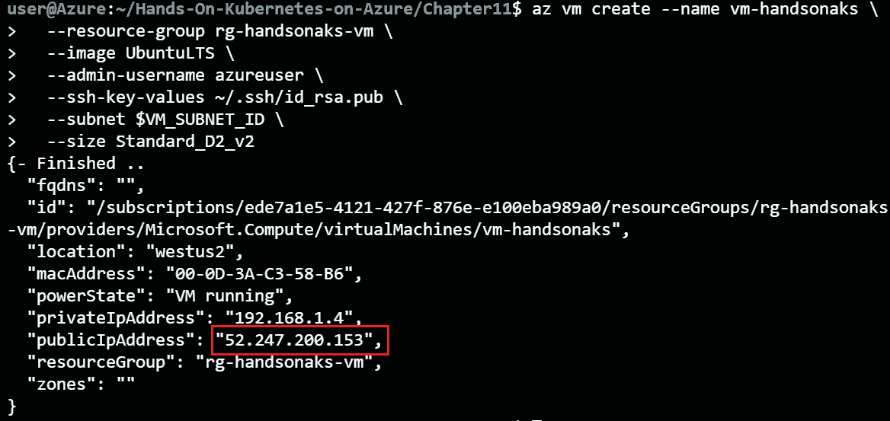

    图 11.16:创建新虚拟机并获取其公共 IP 地址

9.  Now that the VM is created, you will move your Kubernetes config file containing the cluster credentials to that VM. This avoids you having to install the Azure CLI on the target machine to get the Kubernetes credentials. Make sure to replace **<public IP>** with the outcome from the previous step.

    scp ~/。kube/config Azur @<public ip="">:~</public>

    如果您信任此主机，将会提示您。通过输入**是**确认。这将创建类似于*图 11.17* 的输出:

    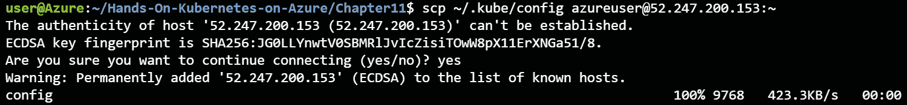

    图 11.17:将 Kubernetes 凭证复制到目标机器

10.  You can now access the remote machine using the following command:

    ssh Azur @

11.  Now that you're connected to the remote machine, you'll need to use **kubectl**. Download it, make it executable, and move it into the binaries folder using the following command:

    curl lo[【https://dl . k8s . io/release/v 1 . 20 . 0/bin/Linux/amd64/kubi ctel】](https://dl.k8s.io/release/v1.20.0/bin/linux/amd64/kubectl )

    chmod +x kubectl

    须藤多美。/忽必烈/usr/local/bin/忽必烈

12.  To have **kubectl** recognize the config file you uploaded, you have to move it into the **kube** directory. You can do so using the following command:

    mkdir .kube

    mv config。kube/config(库比/配置)

13.  Now that you have this VM configured to connect to your cluster, you can verify that you can connect to this cluster by applying the following command:

    kubectl 获取节点

    这将产生类似于图 11.18 的输出:

    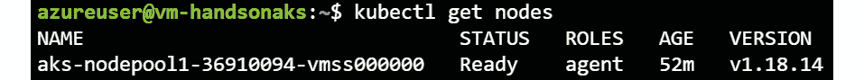

    图 11.18:从同一虚拟网络中的虚拟机访问专用 AKS 集群

14.  You can also verify the DNS record that your VM is using to connect to the cluster. To do this, first get the **fully qualified domain name** (**FQDN**) cluster (refer to the highlighted section in *Figure 11.19* to see which output is the FQDN) and then use the **nslookup** command to get the DNS record. You can use the following commands to do this:

    立方结构丛集资讯

    nslookup〔t0〕

    这将产生类似于图 11.19 的输出:

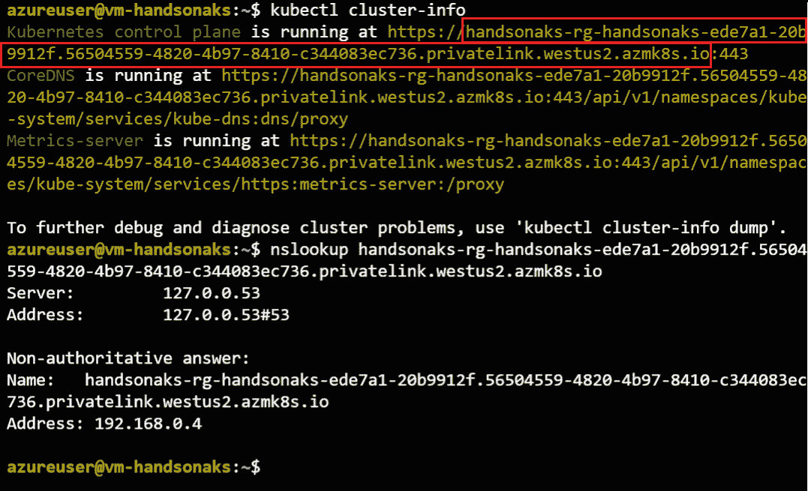

图 11.19:获取集群的 FQDN，并使用 nslookup 查找其 IP 地址

在*图 11.19* 中可以看到，您从 **nslookup** 命令中得到的地址是一个私有的 IP 地址。这意味着只有连接到该虚拟网络的机器才能连接到Kubernetes控制平面。

您现在已经成功创建了一个 AKS 专用集群，并验证了只有连接到 AKS 虚拟网络的机器才能连接到控制平面。您无法从 Azure Cloud Shell 内部连接到控制平面，但您可以从同一虚拟网络中的虚拟机连接到它。因为您现在已经部署了一个私有集群，所以不要删除您正在使用的虚拟机。您将在下一个示例中使用它。在本章的最后一个示例中，您将删除该私有集群和虚拟机。

关于控制平面安全的这一部分也到此结束。您已经了解了授权的 IP 范围和私有集群。在下一节中，您将了解更多关于如何保护工作负载的信息。

## 工作负载网络安全

您现在已经了解了如何保护您的 AKS 集群的控制平面的网络。然而，这并没有影响您工作负载的网络安全性。在本节中，您将探索保护工作负载的三种方法。首先，您将使用 Azure 内部负载平衡器创建一个 Kubernetes 服务。然后，您将使用 NSGs 保护 Kubernetes 服务的流量。最后，您将使用网络策略来保护点对点流量。

### 使用内部负载平衡器保护工作负载网络

Kubernetes 有多种类型的服务，正如您在*第 3 章*、*AKS*上的应用部署中了解到的。您以前多次使用服务类型负载平衡器来让 AKS 创建 Azure 负载平衡器。这些一直是公共负载平衡器。您也可以通过创建内部负载平衡器的方式来配置 AKS。这在您创建只需要从虚拟网络或连接到该虚拟网络的网络中访问的服务的情况下非常有用。

您将在本节中创建这样的服务:

1.  If you are no longer connected to the VM you created in the previous example, reconnect to it. You can get the VM's public IP address using the following command:

    az vm show -n vm-handsonaks \

    -g rg-hand onaks-VM-d-query public IPS

    您可以使用以下命令连接到虚拟机:

    ssh Azur @

2.  Once connected to this VM, you will need to retrieve the git repository linked with this book. You can get this using the following command:

    git 克隆 https://github . com/PacktPublishing/动手-Kubernetes-on-Azure-第三版

    克隆存储库后，使用以下命令导航到本章的示例:

    光盘动手-蓝色天空上的Kubernetes-第三版/第 11 章

3.  As the example application in this section, you will use the guestbook application you've already used in the first half of this book. However, the all-in-one YAML file you used before has been broken up into two files: **guestbook-without-service.yaml** and **front-end-service-internal.yaml**. The reason for this is to make it easier for you to explore the service-specific configuration.

    **前端服务内部. yaml** 文件包含使用 Azure 内部负载平衡器创建 Kubernetes 服务的配置。以下代码是该示例的一部分:

    1 堆叠版本:v1

    2 种:服务

    3 元数据:

    4 名称:前端

    5 个注释:

    6 service.beta.kubernetes.io/azure-load-balancer-internal:“真”

    7 个标签:

    8 应用:留言簿

    9 层:前端

    10 规格:

    11 类型:负载平衡器

    12 个端口:

    13 端口:80

    14 选择器:

    15 应用:留言簿

    16 层:前端

    您正在使用 YAML 代码中的注释来指示 AKS 创建一个 Azure 内部负载平衡器。您可以在前面代码示例的第 5-6 行看到，您正在将**service.beta.kubernetes.io/azure-load-balancer-internal**注释设置为**真**。

    您可以通过应用以下命令，使用内部负载平衡器创建留言簿应用和服务:

    kubectl create -f 不带服务的留言簿. yaml

    kubectl create -f 前端-service-internal.yaml

    然后，您可以获取服务，并使用以下命令等待它获取外部 IP:

    忽必烈得到服务-w

    这将返回类似于图 11.20 的输出:

    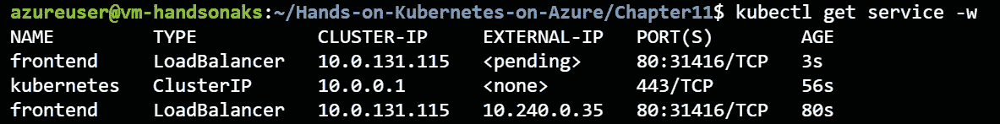

    图 11.20:获取服务的外部 IP

4.  As you can see, the service has a private IP as an external IP. You can only access this IP from the VNet that the cluster is deployed into, or from other networks connected to that VNet.

    #### 注意

    您可能会问自己这样一个问题:“每个服务也获得一个集群 IP，这是一个私有 IP。为什么不能用它来代替内部负载平衡器？”这个问题的答案是，集群 IP 只能从集群内部到达，而不能从集群外部到达。但是，您可以创建节点端口类型的服务，使服务暴露给来自集群外部的调用。这将在特定端口的节点 IP 上公开服务。NodePort 服务的缺点是它们在每个节点的同一个端口上公开服务，因此您不能在集群中的同一个端口上公开两个服务。内部私有负载平衡器确实能够在同一群集的多个服务上公开同一个端口。

    您可以尝试使用以下命令访问该服务:

    卷曲<external ip=""></external>

    这将返回类似于图 11.21 的结果:

    

    图 11.21:访问通过内部负载平衡器公开的服务

5.  AKS created an internal load balancer to expose this service. You can see this load balancer in the Azure portal as well. To see this internal load balancer, start by searching for load balancer in the Azure search bar, as shown in *Figure 11.22*:

    

    图 11.22:通过 Azure 门户导航到负载平衡器

6.  In the resulting pane, you should see two load balancers, as shown in *Figure 11.23*:

    

    图 11.23:默认目录中的负载平衡器列表

7.  Click on the kubernetes-internal load balancer. This will take you to a pane similar to *Figure 11.24*:

    

    图 11.24:内部负载平衡器的细节

    在这里，您可以看到这个内部负载平衡器的细节。正如您在截图中的高亮部分所看到的，您看到的与 **kubectl** 命令的输出相同的 IP 是在负载平衡器上配置的。

8.  This concludes the example of using an internal load balancer. You can now delete the service using the internal load balancer by applying the following command:

    kubectl delete -f 前端-服务-内部. yaml

    kubectl delete -f 不带服务的留言簿. yaml

    这将删除留言簿应用和服务。删除服务时，Kubernetes 中的服务以及 Azure 中的内部负载平衡器都将被删除。这是因为一旦集群中不再有需要内部负载平衡器的服务，AKS 就会删除该内部负载平衡器。

在本节中，您使用内部负载平衡器部署了一个 Kubernetes 服务。这使您能够创建不暴露在互联网上的服务。但是，在某些情况下，您需要向互联网公开一项服务，但需要确保只有可信方才能连接到该服务。在下一节中，您将了解如何在 AKS 中创建使用网络安全组来限制入站流量的服务。

### 使用网络安全组保护工作负载网络

到目前为止，您已经在 Kubernetes 中公开了多个服务。您已经使用 Kubernetes 中的服务对象以及入口公开了它们。但是，除了上一节，您从未通过部署内部负载平衡器来限制对应用的访问。这意味着应用总是可以公开访问的。在下面的示例中，您将在 Kubernetes 集群上创建一个具有公共 IP 的服务，但是您将使用 AKS 配置的 NSG 来限制对它的访问。

1.  As the example application in this section, you will again use the guestbook application. As in the previous section, the front-end service configuration has been moved to a separate file. For this example, you'll start by using the **front-end-service.yaml** file to create the service, and later update that using the **front-end-service-secured.yaml** file.

    让我们从按原样部署应用开始，不进行任何 NSG 配置，应用以下命令:

    kubectl apply -f 不带服务的留言簿. yaml

    忽必烈应用 f 前端服务。yaml

    然后，使用以下命令获取前端服务的 IP 地址:

    忽必烈得到服务-w

    这将创建类似于图 11.25 的输出。获得公共 IP 后，按 *Ctrl + C* 即可退出命令:

    

    图 11.25:获取前端服务的 IP 地址

    现在，您可以使用浏览器和虚拟机本身连接到该服务。如果您使用浏览器连接，您应该会看到类似于*图 11.26* 的输出:

    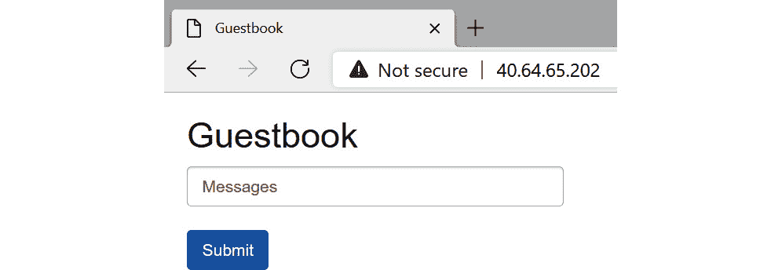

    图 11.26:通过网络浏览器访问留言簿应用

2.  You can also connect to this application using the command line. To do this, use the following command:

    卷曲

    这将返回类似于图 11.27 的输出:

    

    图 11.27:使用命令行连接到留言簿应用

3.  Let's now configure additional security on the front-end service by only allowing your browser to connect to the application. For this, you will require the public IP address you are using right now. If you don't know this, you can browse to [https://www.whatismyip.com/](https://www.whatismyip.com/) to get your IP address, as shown in *Figure 11.28*:

    

    图 11.28:获取自己的公共 IP 地址

    为了保护前端服务，您将编辑**前端服务保护. yaml** 文件。这是该特定文件中的代码:

    1 堆叠版本:v1

    2 种:服务

    3 元数据:

    4 名称:前端

    5 个标签:

    6 应用:留言簿

    7 层:前端

    8 规格:

    9 类型:负载平衡器

    10 个端口:

    11 端口:80

    12 选择器:

    13 应用:留言簿

    14 层:前端

    15 负载平衡源范围:

    16 -

    该文件与您在本书前面创建的服务非常相似。但是，在第 15 行和第 16 行，您现在可以看到 **loadBalancerSourceRanges** 和添加您自己的公共 IP 地址的选项。您可以在此提供多个公共 IP 地址或范围；每个地址或范围前都会有一个破折号。如果您希望输入一个单独的 IP 地址而不是一个范围，请将 **/32** 附加到该 IP 地址。您需要这样做，因为 Kubernetes 期望 IP 范围，一个范围 **/32** 等于一个单一的 IP 地址。

    要在此文件中编辑或添加您自己的 IP 地址，请使用以下命令:

    vi 前端服务安全. yaml

    在生成的应用中，使用箭头键导航到底线，点击 *i* 按钮进入**插入**模式，移除占位符，添加您的 IP 地址，然后添加 **/32** 。要关闭并保存文件，点击 *Esc* 键，输入 **:wq！**写入并关闭文件，最后点击*进入*。*如图 11.29* 所示:

    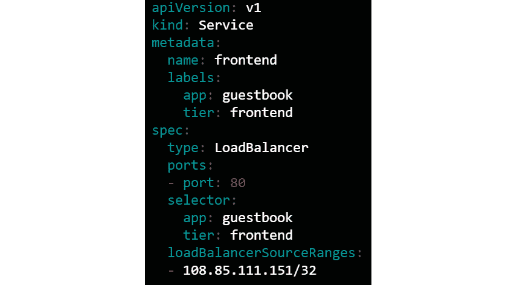

    图 11.29:带有 IP 地址的前端服务安全的. yaml 文件示例

4.  You can update the exiting service that was deployed before using the following command:

    kubectl apply -f 前端-service-secured.yaml

    这将导致 AKS 更新链接到此群集的 NSG，只允许来自您的公共 IP 地址的流量。您可以通过再次浏览服务的 IP 地址来确认这一点，您应该会看到留言簿应用。但是，如果您从虚拟机重试之前的命令，您应该会看到它最终超时:

    卷曲

    这将在 2 分钟后超时，输出类似于*图 11.30* :

    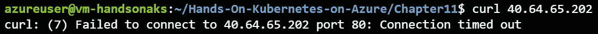

    图 11.30:虚拟机内部的连接超时

5.  You can verify the NSG configuration in Azure itself as well. To verify this, look for Network security groups via the Azure search bar, as shown in *Figure 11.31*:

    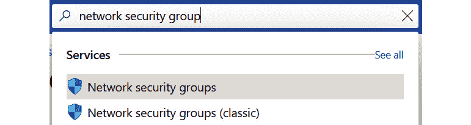

    图 11.31:通过 Azure 门户导航到网络安全组

6.  In the resulting pane, you should see two NSGs. Select the one whose name starts with aks-agentpool, as shown in *Figure 11.32*:

    

    图 11.32:选择 aks 代理池 NSG

7.  In the resulting detailed view of that NSG, you should see a rule that allows traffic from your IP address to the service's public IP address, as you can see in *Figure 11.33*:

    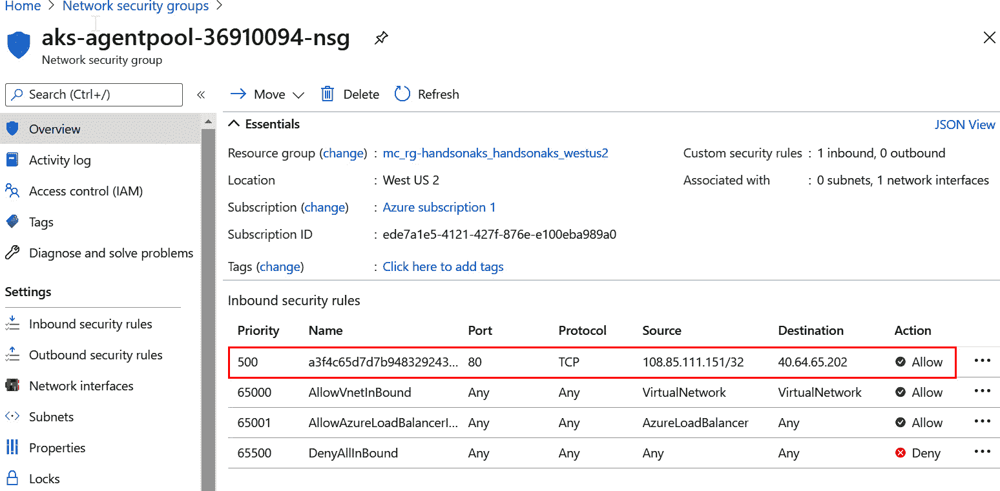

    图 11.33:NSG 包含一个规则，只允许来自前面定义的公共 IP 的流量

    注意这个规则是如何被 AKS 创建和管理的；你不必自己创造这个。

8.  Here, we've concluded this example. Let's clean up the deployment, the VM, and the private cluster. From within the VM, delete the application using the following command:

    kubectl delete -f 不带服务的留言簿. yaml

    kubectl delete -f 前端-service-secured.yaml

    然后，使用**退出**命令退出虚拟机。这会让你回到云壳。在这里，您可以删除私有集群和用于连接到该集群的虚拟机:

    az 组删除-n rg-handsonaks-vm -y

    az aks 删除-g rg-handonaks-n handonaks-y

通过向 Kubernetes 服务添加额外的配置，您可以限制谁能够连接到您的服务。您能够确认只有被允许连接到该服务的公共 IP 能够连接到该服务。不是来自此公共 IP 地址的连接超时。

这是保护所谓的南北流量的一个示例，南北流量是指从外部到集群的流量。您还可以为东西向流量添加额外的保护，这意味着您集群内的流量。为此，您将在 Kubernetes 中使用名为网络策略的功能。您将在下一节中这样做。

### 使用网络策略保护工作负载网络

在前一节中，您让 Kubernetes 在 Azure 中配置一个 NSG 来保护南北流量。这是限制网络流量进入您的公共服务的良好做法。在大多数情况下，您还需要保护东西向的流量，这意味着您的Pod 之间的流量。这样，您可以确保如果潜在的攻击者能够访问您的应用的一部分，他们连接到应用的其他部分或不同应用的能力将会受到限制。这也被称为防止横向移动。

为了保护 pods 之间的流量，Kubernetes 有一个称为网络策略的功能。网络策略可用于保护从外部到您的Pod 、从您的Pod 到外部的流量，以及Pod 之间的流量。由于您已经了解了一种保护从外部到 pod 的流量的方法，在本节中，您将学习如何使用网络策略来保护 pod 到 pod 的流量。

在 AKS 中，网络策略是在集群创建时需要在集群上配置的东西(在撰写本文时是这样的)。如果您的群集启用了网络策略，您可以在群集上创建新的网络策略对象。当没有选择某个 pod 的网络策略时，进出该 pod 的所有流量都是允许的。当您将网络策略应用于 pod 时，根据配置的不同，除了该网络策略允许的流量之外，去往和/或来自该 pod 的所有流量都会被阻止。

让我们试试这个:

1.  Start by creating a new cluster with network policies enabled. In this example, you'll create a cluster with Azure network policies enabled. You can create this new cluster using the following command:

    az aks 创建\

    -资源-组 rg-hand onaks \

    -名称 handsonaks \

    -启用-管理-身份\

    -节点数 2 \

    -节点虚拟机大小标准 _DS2_v2 \

    -生成-ssh-密钥\

    -网络-插件 azure \

    -网络-策略 azure

2.  Once the cluster is created, make sure to refresh the credentials to get access to the cluster. You can do this using the following command:

    az aks get-credentials-g rg-hand onaks-n hand onaks

    这将提示您覆盖现有凭据。在两个提示中输入 *y* 即可确认，如图*图 11.34* :

    

    图 11.34:获取新集群的凭据

3.  For this example, you will test connections between two web servers in a pod running **nginx**. The code for these has been provided in the **web-server-a.yaml** and **web-server-b.yaml** files. This is the code for **web-server-a.yaml**:

    1 堆叠版本:v1

    2 个孩子:Pod

    3 元数据:

    4 名称:网络服务器-a

    5 个标签:

    6 应用:网络服务器

    7 环境:甲

    8 规格:

    9 个容器:

    10 名称:web 服务器

    11 图片:engine x:1 . 19 . 6-高山

    这是**网络服务器-b.yaml** 的代码:

    1 堆叠版本:v1

    2 个孩子:Pod

    3 元数据:

    4 名称:网络服务器 b

    5 个标签:

    6 应用:网络服务器

    7 环境:乙

    8 规格:

    9 个容器:

    10 名称:web 服务器

    11 图片:engine x:1 . 19 . 6-高山

    正如你可以在每个PODS的代码中看到的，每个PODS都有一个标签 app，**网络服务器**，和另一个名为 **env** 的标签，以及每个服务器的值(A 代表**网络服务器-a** 和 B 代表**网络服务器-b** )。在本例的后面，您将使用这些标签来选择性地允许这些Pod 之间的流量。

    要创建两个Pod ，请使用以下命令:

    kube CTL create-f web-server-a . YAML

    kubi KL create-f web 服务器-b.yaml

    通过运行以下命令，验证Pod 是否正在运行，然后继续前进:

    忽必烈得到 pods -w

    这将返回类似于图 11.35 的输出:

    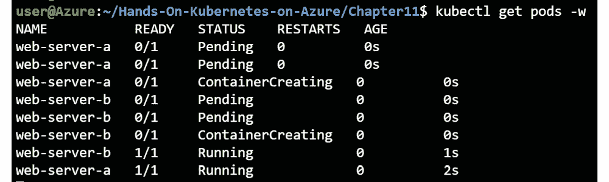

    图 11.35:两个Pod 都在运行

4.  For this example, we'll use the pod's IP addresses to test the connection. Get the IP address for **web-server-b** using the following command:

    kubectl 的PODS很宽

    这将返回类似于图 11.36 的输出，其中您将看到突出显示的 IP 地址:

    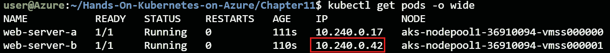

    图 11.36:获取网络服务器 b 的 IP 地址

5.  Now, try to connect from **web-server-a** to **web-server-b**. You can test this connection using the following command:

    kubectl exec -it web-server-a - \

    wget-qo--T2 http://

    这将返回类似于图 11.37 的输出:

    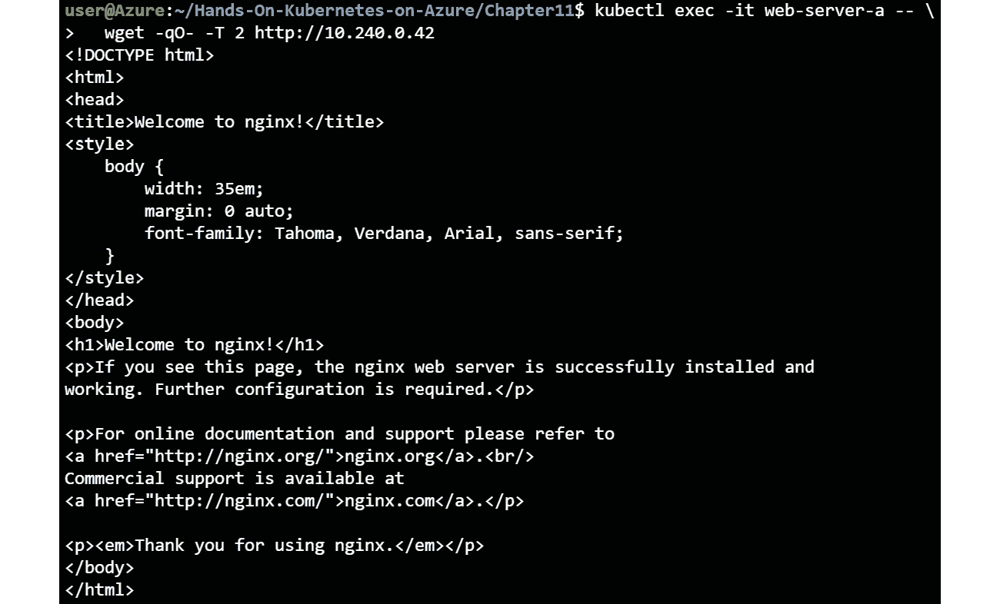

    图 11.37:验证网络服务器-a 可以连接到网络服务器-b

6.  Let's now create a new **NetworkPolicy** object that will limit all traffic to and from the pods with the label app **web-server**. This policy has been provided in the **deny-all.yaml** file:

    1 种:网络策略

    2 版本:networking.k8s.io/v1

    3 元数据:

    4 名称:全部拒绝

    5 规格:

    6 选择器:

    7 个匹配标签:

    8 应用:网络服务器

    9 入口:[]

    10 出口:[]

    让我们来探索一下这段代码中包含的内容:

    *   **第 1 行**:这里，您定义您正在创建一个**网络策略**对象。
    *   **第 6-8 行**:在这里，您可以定义该网络策略将应用于哪些PODS。在这种情况下，您将此网络策略应用于所有标签为**应用:网络服务器**的PODS。
    *   **第 9-10 行**:这里定义允许规则。如您所见，您没有定义任何允许规则，这意味着所有流量都将被阻止。

    在本例的后面，您将添加更具体的入口和出口规则，以选择性地允许流量流动。

7.  Let's now create this network policy. You can do this using the following command:

    kubectl create -f deny-all.yaml

    这将返回类似于图 11.38 的输出:

    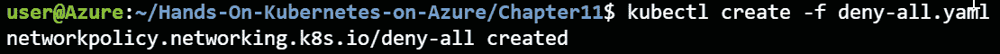

    图 11.38:创建网络策略

8.  Let's now test the connection between **web-server-a** and **web-server-b** again. You can test this using the following command.

    kubectl exec -it web-server-a - \

    wget-qo--T2 http://

    这将返回类似于图 11.39 的输出:

    

    图 11.39:流量不再在网络服务器 a 和网络服务器 b 之间流动

9.  You will now create another network policy that will selectively allow traffic from **web-server-a** to **web-server-b**. This policy is included in the **allow-a-to-b.yaml** file:

    1 种:网络策略

    2 版本:networking.k8s.io/v1

    3 元数据:

    4 名称:允许从 a 到 b

    5 规格:

    6 选择器:

    7 个匹配标签:

    8 应用:网络服务器

    9 入口:

    10 -从:

    11-PoD 选择器:

    12 个匹配标签:

    13 环境:甲

    14 出口:

    15 - to:

    16-PoD 选择器:

    17 个匹配标签:

    18 环境:乙

    让我们更深入地探讨一下该文件与早期网络策略的区别:

    *   **第 9-13 行**:这里，您正在定义允许哪些入口流量。具体来说，您允许来自标签为 **env: A** 的PODS的流量。
    *   **第 14-18 行**:这里，您正在定义允许哪些出口流量。在这种情况下，您允许带有标签 **env: B** 的出口流量通过。

    另外，请注意，您正在用新名称创建此网络策略。这意味着您将有两个网络策略在您的集群上处于活动状态，选择带有标签 **app: web-server** 的PODS。**拒绝所有**和**允许 a 到 b** 网络策略都将出现在您的集群上，并且都适用于标签为 **app: web 服务器**的 pods。根据设计，网络策略是附加的，这意味着如果任何一个策略允许流量，流量将被允许。

10.  Let's create this policy using the following command:

    kube CTL create-f allow-a to b . YAML

    这将返回类似于图 11.40 的输出:

    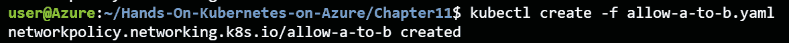

    图 11.40:创建一个新的网络策略，允许从网络服务器 a 到网络服务器 b 的流量

11.  Let's test the connection between **web-server-a** and **web-server-b** again. You can test this by applying the following command:

    kubectl exec -it web-server-a - \

    wget-qo--T2 http://

    这将返回类似于图 11.41 的输出:

    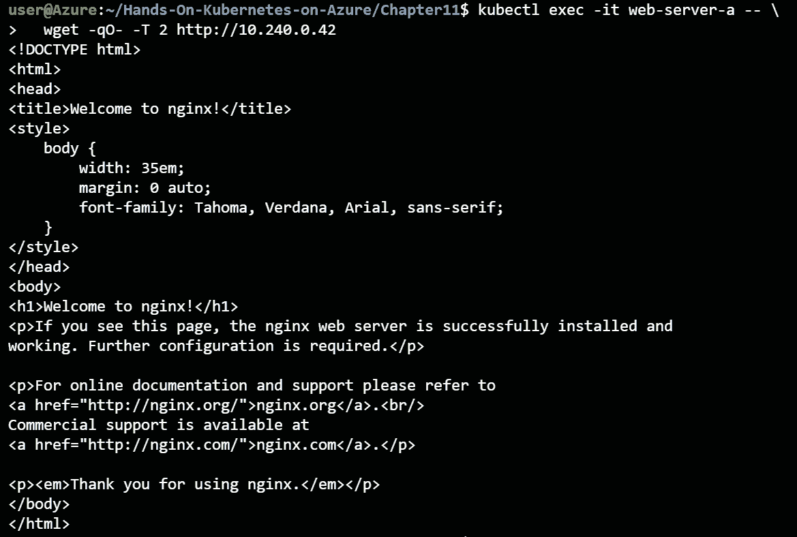

    图 11.41:流量再次被允许从网络服务器 a 到网络服务器 b

12.  You have now allowed traffic from **web-server-a** to **web-server-b**. You have, however, not allowed the traffic to pass the other way, meaning traffic from **web-server-b** to **web-server-a** is blocked. Let's test this as well. To test this, get the IP address of **web-server-a** using the following command:

    kubectl 的PODS很宽

    这将返回类似于图 11.42 的输出，其中**网络服务器-a** 的 IP 地址被突出显示:

    

    图 11.42:获取网络服务器的 IP 地址

    您现在可以测试从**网络服务器-b** 到**网络服务器-a** 的流量路径:

    kubectl exec -it web-server-b -- \

    wget-qo--T2 http://<web-server-a ip=""></web-server-a>

    这将返回类似于图 11.43 的输出:

    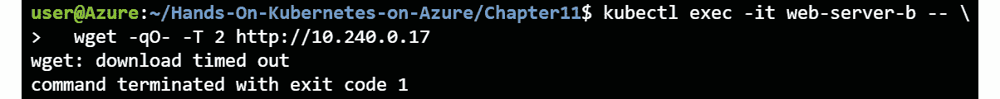

    图 11.43:不允许从网络服务器 b 到网络服务器 a 的流量，正如预期的那样

    在*图 11.43* 中可以看到， **web-server-b** 到 **web-server-a** 的流量超时，表示流量受阻。

13.  This concludes the example regarding network policies in Azure. In the next chapter, you will create a new cluster again, so to conclude this chapter, it is safe to delete this cluster with network policies enabled, using the following command:

    az aks 删除-n handonaks-g rg-handonaks-y

您现在已经使用网络策略来保护 pods 之间的流量。您看到了默认策略如何拒绝所有流量，以及如何添加新策略来选择性地允许流量。您还看到，如果您允许从一个 pod 到另一个 pod 的流量，则不会自动允许反向流量。

## 总结

本章向您介绍了 AKS 中的多种网络安全选项。您研究了如何保护控制平面和集群中的工作负载。

为了保护控制平面，您首先使用授权的 IP 范围来验证只有允许的公共 IP 地址才能访问集群的控制平面。之后，您创建了一个新的私有集群，该集群只能使用私有连接来访问。您使用 Azure 私有链接连接到该私有集群。

之后，您还探讨了工作负载网络安全。最初，您部署了一个对所有用户都可用的公共服务。然后，您让 AKS 配置 Azure NSGs，以确保该服务只连接到允许的连接。您验证了可以从您的机器连接到服务，但不能像预期的那样从 Azure 中的虚拟机连接。最后，您还在新集群中配置了 Kubernetes 网络策略。您使用这些来保护 pod 到 pod 的流量，并且能够保护集群中不同 pod 之间的流量。

在下一章中，您将学习如何使用 Azure 服务操作器使用 Azure 创建 Azure 资源，例如 MySQL 的 Azure 数据库。**